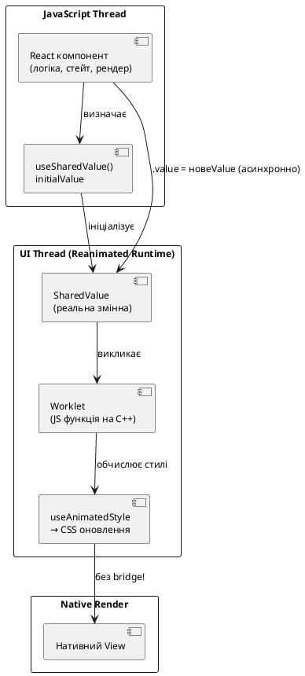
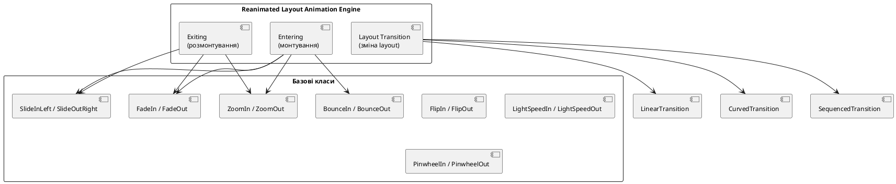
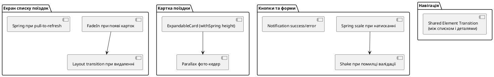

# Анімації з Reanimated

## Відкриття: чому анімації — це не «прикраса»

Відкрийте будь-який застосунок від Apple — Messages, Maps, Photos. Помітьте: кожна дія супроводжується плавним рухом. Кнопки «відчуваються» при натисканні, картки розкриваються природно, елементи з'являються і зникають з вагою. Це не випадковість і не зайвина розкіш — це **функціональний елемент інтерфейсу**.

Дослідження UX показують, що правильні анімації:

- **Пояснюють ієрархію** — звідки з'явився екран і куди пішов.
- **Зменшують когнітивне навантаження** — мозок сприймає безперервний рух легше, ніж миттєві зміни.
- **Дають підтвердження** — «так, ваш тап зареєстровано».
- **Приховують затримки** — skeleton-анімація під час завантаження робить очікування терпимим.

Але є нюанс: **погано написані анімації шкідливіші за їх відсутність**. Якщо анімація «підстрибує», запізнюється на 200 мс або «смикається» при скролі — користувач відчуває це фізично і відносить це до «дешевого» застосунку.

У цій статті ми розберемо **React Native Reanimated 3** — бібліотеку, яка переносить анімації на нативний UI потік і дає можливість створювати анімації рівня нативних застосунків.

::note
**Про preview-приклади в цій статті:** `react-native-preview` виконує код через `react-native-web` і підтримує лише стандартну бібліотеку `react-native`. Тому в інтерактивних прикладах ми використовуємо `Animated` API — стандартний інструмент React Native. Паралельно я показуватиму Reanimated-еквівалент у звичайних блоках коду. Це також хороша педагогіка: зрозумівши `Animated`, ви побачите, **що саме** Reanimated покращує і чому.
::

---

## Анімаційна модель React Native: JS Thread vs UI Thread

### Чому звичайний Animated іноді «смикається»

React Native Animated API існує з самого початку бібліотеки. Він дозволяє анімувати значення і прив'язувати їх до стилів компонентів. Але є фундаментальна проблема:

```
Стандартний Animated (без useNativeDriver):

JS Thread: [обчислення] → [Bridge] → [UI Thread: оновлення стилю]
JS Thread: [обчислення] → [Bridge] → [UI Thread: оновлення стилю]
...

При 60 fps це відбувається 60 разів/сек.
Якщо JS Thread зайнятий (рендеринг, мережа) — кадри пропускаються.
```

`useNativeDriver: true` вирішує частину проблеми: анімація **передається на UI Thread** і більше не залежить від JS. Але `useNativeDriver` підтримує лише `transform` і `opacity` — ніяких `width`, `height`, `margin`, кольорів.

### Як Reanimated виходить за ці обмеження

**React Native Reanimated** переносить **весь код анімації** — включно з логікою — на нативний UI потік через механізм **worklets**:

::plant-uml



::

Ключова ідея: **worklet** — це JavaScript функція, яку Reanimated компілює і виконує безпосередньо на C++ рантаймі UI потоку. Виклик не потребує серіалізації через міст. Саме тому Reanimated анімує будь-які CSS-властивості (width, height, backgroundColor, borderRadius) з тією ж продуктивністю що й `transform`/`opacity`.

### Worklet: що це і як позначити

Функція стає worklet-ом через директиву `'worklet'` на першому рядку:

```ts
function myWorklet(value: number): number {
  'worklet';
  return value * 2; // виконується на UI Thread
}
```

Усі функції, передані у `useAnimatedStyle`, `useAnimatedScrollHandler`, `useAnimatedGestureHandler` — автоматично компілюються як worklets. Явне `'worklet'` потрібне лише для власних утиліт.

::warning
Звичайні JS функції **не можна** викликати з worklet-а без `runOnJS()`. Це включає `console.log`, `setState`, API виклики. Якщо потрібно вийти в JS Thread — використовуйте `runOnJS(myFn)(args)`.
::

---

## Встановлення та налаштування

```bash
npx expo install react-native-reanimated
```

**Обов'язково:** додати плагін у `babel.config.js`:

```js
// babel.config.js
module.exports = function (api) {
  api.cache(true);
  return {
    presets: ['babel-preset-expo'],
    plugins: ['react-native-reanimated/plugin'], // ← завжди ОСТАННІМ
  };
};
```

Після зміни `babel.config.js` — **обов'язковий** перезапуск Metro з очищенням кешу:

```bash
npx expo start --clear
```

::caution
Плагін `react-native-reanimated/plugin` **повинен бути останнім** у масиві `plugins`. Порушення цього правила — найпоширеніша причина дивних помилок типу «worklet function called on wrong thread».
::

---

## Основи: useSharedValue та useAnimatedStyle

### useSharedValue: змінна двох потоків

`useSharedValue` — основний примітив Reanimated. Це змінна, яка **існує одночасно** у JS Thread і UI Thread:

```ts
import { useSharedValue } from 'react-native-reanimated';

const opacity = useSharedValue(1);     // початкове значення — 1
const scale = useSharedValue(1);
const offsetY = useSharedValue(0);
```

Читання і запис:

```ts
// З JS Thread (наприклад, у обробнику onPress):
opacity.value = 0;          // миттєво
opacity.value = withTiming(0, { duration: 300 }); // анімовано

// Читання (завжди актуальне):
console.log(opacity.value); // поточне значення
```

::note
`useSharedValue` схожий на `useRef` тим, що зміна `.value` **не спричиняє ре-рендер**. Це навмисне: анімації повинні бути ізольовані від React render-циклу.
::

### useAnimatedStyle: зв'язок між SharedValue і стилями

`useAnimatedStyle` — це worklet, що перетворює shared values на об'єкт стилів. Він автоматично підписується на зміни використаних shared values:

```ts
import Animated, { useSharedValue, useAnimatedStyle, withTiming } from 'react-native-reanimated';

function FadeBox() {
  const opacity = useSharedValue(1);

  const animatedStyle = useAnimatedStyle(() => ({
    opacity: opacity.value,
    transform: [{ scale: opacity.value }],
  }));

  return (
    <Animated.View style={[styles.box, animatedStyle]}>
      <Text>Привіт!</Text>
    </Animated.View>
  );
}
```

Ключові правила `useAnimatedStyle`:
- Тіло функції виконується **на UI Thread** — це worklet.
- Не можна викликати хуки React всередині.
- Не можна звертатись до JavaScript closure values напряму — тільки через `useSharedValue`.
- Повертає стандартний об'єкт стилів.

### Animated.View та інші Animated-компоненти

Щоб стилі з `useAnimatedStyle` застосовувались до компонента — потрібно використовувати `Animated.View`, `Animated.Text`, `Animated.Image`, `Animated.ScrollView` з Reanimated:

```tsx
import Animated from 'react-native-reanimated';

// Використовуємо Animated.View замість View:
<Animated.View style={[styles.box, animatedStyle]} />
```

Або для кастомних компонентів:

```ts
import Animated from 'react-native-reanimated';
import { FlatList } from 'react-native';

const AnimatedFlatList = Animated.createAnimatedComponent(FlatList);
```

---

## Анімаційні функції: withTiming, withSpring і інші

### Концепція анімаційних функцій

Reanimated надає набір **анімаційних функцій**, що повертають не число, а «рецепт» анімації. Вони передаються у `.value`:

```ts
opacity.value = withTiming(0);       // "анімуй до 0 за допомогою easing"
scale.value = withSpring(1.2);       // "анімуй до 1.2 за законами пружини"
```

### withTiming: лінійна анімація з easing

`withTiming` анімує значення за заданий час з кривою прискорення (easing):

```ts
import { withTiming, Easing } from 'react-native-reanimated';

opacity.value = withTiming(0, {
  duration: 300,           // мілісекунди
  easing: Easing.out(Easing.cubic), // крива
});
```

#### Стандартні easing функції

::field-group

::field{name="Easing.linear" type="easing"}
Рівномірний рух без прискорення. Підходить для паралакс-ефектів і progress bars, але виглядає «механічно» для більшості UI елементів.
::

::field{name="Easing.ease" type="easing"}
Стандарт CSS ease: повільний старт, швидка середина, повільний кінець. Ідеально для більшості fade-анімацій.
::

::field{name="Easing.out(Easing.quad)" type="easing"}
Швидкий старт, повільний фініш. Виглядає природно при «кидку» елементів (вилітають швидко, гальмують). Найрекомендованіший для появи елементів.
::

::field{name="Easing.in(Easing.quad)" type="easing"}
Повільний старт, швидкий фініш. Для зникання елементів — вони «набирають швидкість» і йдуть.
::

::field{name="Easing.inOut(Easing.cubic)" type="easing"}
Симетрична крива: повільний старт, швидка середина, повільний кінець. Для переміщень елементів між позиціями.
::

::field{name="Easing.bezier(x1, y1, x2, y2)" type="easing"}
Кастомна крива Безьє. Аналог CSS `cubic-bezier()`. Для фірмових стилів анімації.
::

::field{name="Easing.back(1.7)" type="easing"}
Небольшой «відкат» назад перед рухом вперед. Придає фізичність, але обережно — занадто великий коефіцієнт виглядає мультяшно.
::

::field{name="Easing.bounce" type="easing"}
Відбивання наприкінці. Для ігрових застосунків і привертання уваги. У бізнес-застосунках — обережно.
::

::

### Живий приклад: withTiming

::react-native-preview{title="Easing порівняння" device="iphone" height="520"}

```tsx
import { useRef, useState } from 'react';
import { Animated, Easing, View, Text, Pressable, StyleSheet } from 'react-native';

const EASINGS = [
  { label: 'linear', fn: Easing.linear },
  { label: 'ease', fn: Easing.ease },
  { label: 'out(cubic)', fn: Easing.out(Easing.cubic) },
  { label: 'in(cubic)', fn: Easing.in(Easing.cubic) },
  { label: 'bounce', fn: Easing.bounce },
];

function EasingRow({ label, easingFn }: { label: string; easingFn: any }) {
  const x = useRef(new Animated.Value(0)).current;
  const [running, setRunning] = useState(false);

  const animate = () => {
    if (running) return;
    setRunning(true);
    x.setValue(0);
    Animated.timing(x, {
      toValue: 200,
      duration: 800,
      easing: easingFn,
      useNativeDriver: true,
    }).start(() => setRunning(false));
  };

  return (
    <Pressable onPress={animate} style={styles.row}>
      <Text style={styles.rowLabel}>{label}</Text>
      <View style={styles.track}>
        <Animated.View style={[styles.ball, { transform: [{ translateX: x }] }]} />
      </View>
    </Pressable>
  );
}

export default function App() {
  return (
    <View style={styles.container}>
      <Text style={styles.title}>Натисни на рядок</Text>
      {EASINGS.map((e) => (
        <EasingRow key={e.label} label={e.label} easingFn={e.fn} />
      ))}
    </View>
  );
}

const styles = StyleSheet.create({
  container: { flex: 1, padding: 16, justifyContent: 'center', gap: 12 },
  title: { textAlign: 'center', fontWeight: '700', fontSize: 15, marginBottom: 4, color: '#1E293B' },
  row: { gap: 4 },
  rowLabel: { fontSize: 12, color: '#64748B', fontWeight: '600' },
  track: { height: 32, backgroundColor: '#F1F5F9', borderRadius: 8, justifyContent: 'center', paddingLeft: 4 },
  ball: { width: 24, height: 24, borderRadius: 12, backgroundColor: '#3B82F6' },
});
```

::

### withSpring: фізика пружини

`withSpring` замість часу і easing використовує **фізичну модель пружини**. Результат — природний, органічний рух без потреби підбирати easing:

```ts
import { withSpring } from 'react-native-reanimated';

scale.value = withSpring(1.2, {
  damping: 10,      // затухання: менше → більше коливань
  stiffness: 100,   // жорсткість: більше → швидший рух
  mass: 1,          // маса: більше → повільніший і «важчий» рух
  velocity: 0,      // початкова швидкість (м/с)
  overshootClamping: false, // дозволяти перестрілювання?
  restDisplacementThreshold: 0.01,
  restSpeedThreshold: 0.01,
});
```

::field-group

::field{name="damping" type="number (дефолт: 10)"}
Коефіцієнт затухання. `damping: 80` — практично без коливань (critically damped). `damping: 5` — сильні коливання. Для більшості UI: **10–15**.
::

::field{name="stiffness" type="number (дефолт: 100)"}
«Жорсткість» пружини. Більше — швидший і різкіший рух. `stiffness: 200` — швидко і чітко. `stiffness: 50` — плавно і повільно.
::

::field{name="mass" type="number (дефолт: 1)"}
Маса об'єкта. Більша маса = повільніший рух і більша інерція. Зазвичай залишають 1.
::

::field{name="overshootClamping" type="boolean (дефолт: false)"}
Якщо `true` — пружина зупиняється точно на цільовому значенні без перестрілювання. Для числових селекторів і точних позицій.
::

::

### Живий приклад: spring vs timing

::react-native-preview{title="Spring vs Timing" device="iphone" height="420"}

```tsx
import { useRef, useState } from 'react';
import { Animated, Easing, View, Text, Pressable, StyleSheet } from 'react-native';

export default function App() {
  const springY = useRef(new Animated.Value(0)).current;
  const timingY = useRef(new Animated.Value(0)).current;
  const [toggled, setToggled] = useState(false);

  const animate = () => {
    const toValue = toggled ? 0 : 140;
    setToggled((t) => !t);

    Animated.spring(springY, {
      toValue,
      damping: 10,
      stiffness: 120,
      useNativeDriver: true,
    }).start();

    Animated.timing(timingY, {
      toValue,
      duration: 400,
      easing: Easing.out(Easing.cubic),
      useNativeDriver: true,
    }).start();
  };

  return (
    <View style={styles.container}>
      <Pressable style={styles.btn} onPress={animate}>
        <Text style={styles.btnText}>Анімувати</Text>
      </Pressable>

      <View style={styles.row}>
        <View style={styles.column}>
          <Text style={styles.label}>🌊 Spring</Text>
          <View style={styles.track}>
            <Animated.View style={[styles.ball, styles.blue, { transform: [{ translateY: springY }] }]} />
          </View>
        </View>
        <View style={styles.column}>
          <Text style={styles.label}>📐 Timing</Text>
          <View style={styles.track}>
            <Animated.View style={[styles.ball, styles.amber, { transform: [{ translateY: timingY }] }]} />
          </View>
        </View>
      </View>
    </View>
  );
}

const styles = StyleSheet.create({
  container: { flex: 1, alignItems: 'center', justifyContent: 'center', gap: 32 },
  btn: { backgroundColor: '#1E293B', paddingHorizontal: 28, paddingVertical: 14, borderRadius: 14 },
  btnText: { color: 'white', fontWeight: '700', fontSize: 16 },
  row: { flexDirection: 'row', gap: 32 },
  column: { alignItems: 'center', gap: 8 },
  label: { fontWeight: '700', fontSize: 14, color: '#475569' },
  track: { width: 56, height: 200, backgroundColor: '#F1F5F9', borderRadius: 12, alignItems: 'center', paddingTop: 4 },
  ball: { width: 48, height: 48, borderRadius: 24 },
  blue: { backgroundColor: '#3B82F6' },
  amber: { backgroundColor: '#F59E0B' },
});
```

::


---

## Композиція анімацій: withSequence, withDelay, withRepeat

### withSequence: анімації по черзі

`withSequence` запускає кілька анімацій **одну за одною**:

```ts
import { withSequence, withTiming, withSpring } from 'react-native-reanimated';

// Кнопка: стиснутись → розширитись (пульсація підтвердження)
scale.value = withSequence(
  withTiming(0.9, { duration: 100 }),  // стискаємось
  withSpring(1.1),                      // вибухаємо трохи більше
  withSpring(1.0),                      // повертаємось
);
```

### withDelay: затримка перед анімацією

```ts
import { withDelay, withTiming } from 'react-native-reanimated';

// З'являємось через 500 мс після монтування
opacity.value = withDelay(500, withTiming(1, { duration: 300 }));
```

`withDelay` зручно комбінувати з `withSequence` для **staggered** анімацій (елементи з'являються один за одним):

```ts
// Анімуємо 3 елементи по черзі з кроком 100 мс:
items.forEach((item, index) => {
  item.opacity.value = withDelay(
    index * 100,
    withTiming(1, { duration: 300 })
  );
});
```

### withRepeat: нескінченна анімація

```ts
import { withRepeat, withTiming } from 'react-native-reanimated';

// Пульсація: fade in-out нескінченно
opacity.value = withRepeat(
  withTiming(0.3, { duration: 800 }),
  -1,      // -1 = нескінченно
  true,    // reverse = true → після кожного циклу повертається
);
```

#### Параметри withRepeat

::field-group

::field{name="animation" type="AnimatableValue"}
Анімація, яку повторюємо. Може бути `withTiming`, `withSpring`, або `withSequence`.
::

::field{name="numberOfReps" type="number (дефолт: 2)"}
Кількість повторень. `-1` — нескінченно.
::

::field{name="reverse" type="boolean (дефолт: false)"}
Якщо `true` — кожний парний цикл іде у зворотному напрямку. Ідеально для пульсацій та «breathing» ефектів.
::

::field{name="callback" type="(finished: boolean) => void"}
Викликається після завершення всіх повторень.
::

::

### Живий приклад: skeleton loading

Skeleton loading — один з найкорисніших застосунків `withRepeat`. Показуємо «кістяк» контенту поки дані завантажуються:

::react-native-preview{title="Skeleton Loading" device="iphone" height="420"}

```tsx
import { useEffect, useRef } from 'react';
import { Animated, View, StyleSheet } from 'react-native';

function SkeletonLine({ width = '100%', height = 16, delay = 0 }: any) {
  const opacity = useRef(new Animated.Value(0.3)).current;

  useEffect(() => {
    const anim = Animated.loop(
      Animated.sequence([
        Animated.delay(delay),
        Animated.timing(opacity, {
          toValue: 1,
          duration: 600,
          useNativeDriver: true,
        }),
        Animated.timing(opacity, {
          toValue: 0.3,
          duration: 600,
          useNativeDriver: true,
        }),
      ])
    );
    anim.start();
    return () => anim.stop();
  }, []);

  return (
    <Animated.View style={[styles.skeleton, { width, height, opacity }]} />
  );
}

function SkeletonCard() {
  return (
    <View style={styles.card}>
      <SkeletonLine width={48} height={48} delay={0} />
      <View style={styles.lines}>
        <SkeletonLine width="70%" height={14} delay={80} />
        <SkeletonLine width="50%" height={12} delay={160} />
      </View>
    </View>
  );
}

export default function App() {
  return (
    <View style={styles.container}>
      {[0, 1, 2, 3].map((i) => (
        <SkeletonCard key={i} />
      ))}
    </View>
  );
}

const styles = StyleSheet.create({
  container: { flex: 1, padding: 20, gap: 16, justifyContent: 'center' },
  card: { flexDirection: 'row', alignItems: 'center', gap: 12, padding: 16, backgroundColor: 'white', borderRadius: 16, shadowColor: '#000', shadowOpacity: 0.06, shadowRadius: 8, elevation: 3 },
  lines: { flex: 1, gap: 8 },
  skeleton: { backgroundColor: '#E2E8F0', borderRadius: 8 },
});
```

::

---

## useDerivedValue: обчислені анімовані значення

`useDerivedValue` — це computed shared value. Він автоматично перераховується при зміні залежних shared values, **на UI Thread**:

```ts
import { useSharedValue, useDerivedValue, withSpring } from 'react-native-reanimated';

const progress = useSharedValue(0); // 0..1

// Автоматично перераховується при зміні progress:
const opacity = useDerivedValue(() => progress.value);
const scale = useDerivedValue(() => 0.8 + progress.value * 0.2); // 0.8..1.0
const rotation = useDerivedValue(() => `${progress.value * 360}deg`);
```

Типові сценарії:
- Перетворення одного значення (прогрес 0..1) на кілька похідних (opacity, scale, translateY).
- Інтерполяція між двома кольорами.
- Обчислення позиції з урахуванням кількох джерел.

### interpolate: гнучке відображення значень

`interpolate` — аналог `Animated.Value.interpolate`, але для Reanimated shared values. Використовується всередині worklets (наприклад, `useAnimatedStyle`):

```ts
import { interpolate, Extrapolation } from 'react-native-reanimated';

const animatedStyle = useAnimatedStyle(() => {
  // Коли scrollY від 0 до 200 → opacity від 1 до 0
  const opacity = interpolate(
    scrollY.value,
    [0, 200],          // inputRange
    [1, 0],            // outputRange
    Extrapolation.CLAMP // що робити за межами?
  );

  // Коли scrollY від 0 до 100 → translateY від 0 до -50
  const translateY = interpolate(
    scrollY.value,
    [0, 100],
    [0, -50],
    Extrapolation.CLAMP
  );

  return { opacity, transform: [{ translateY }] };
});
```

#### Extrapolation режими

::field-group

::field{name="Extrapolation.CLAMP" type="enum"}
Значення «затискається» в межах outputRange. Найбезпечніший варіант — за межами inputRange значення не змінюється.
::

::field{name="Extrapolation.EXTEND" type="enum"}
Лінійне продовження за межі. Якщо inputRange [0, 100] → outputRange [0, 50], то при input=200 output=100.
::

::field{name="Extrapolation.IDENTITY" type="enum"}
Повертає input без змін за межами діапазону.
::

::

### Живий приклад: parallax scroll header

::react-native-preview{title="Parallax Header" device="iphone" height="520"}

```tsx
import { useRef } from 'react';
import { Animated, ScrollView, View, Text, StyleSheet, ImageBackground } from 'react-native';

const HEADER_HEIGHT = 200;
const HEADER_SCROLL_DISTANCE = 120;

export default function App() {
  const scrollY = useRef(new Animated.Value(0)).current;

  const headerTranslate = scrollY.interpolate({
    inputRange: [0, HEADER_SCROLL_DISTANCE],
    outputRange: [0, -HEADER_SCROLL_DISTANCE / 2],
    extrapolate: 'clamp',
  });

  const headerOpacity = scrollY.interpolate({
    inputRange: [0, HEADER_SCROLL_DISTANCE / 2, HEADER_SCROLL_DISTANCE],
    outputRange: [1, 1, 0],
    extrapolate: 'clamp',
  });

  const titleScale = scrollY.interpolate({
    inputRange: [0, HEADER_SCROLL_DISTANCE],
    outputRange: [1, 0.7],
    extrapolate: 'clamp',
  });

  return (
    <View style={styles.container}>
      {/* Фіксований header */}
      <Animated.View style={[styles.header, { transform: [{ translateY: headerTranslate }] }]}>
        <View style={styles.headerBg} />
        <Animated.View style={[styles.headerContent, { opacity: headerOpacity }]}>
          <Animated.Text style={[styles.title, { transform: [{ scale: titleScale }] }]}>
            🏔 Карпати 2024
          </Animated.Text>
          <Text style={styles.subtitle}>5 днів · 120 км</Text>
        </Animated.View>
      </Animated.View>

      {/* Контент */}
      <Animated.ScrollView
        contentContainerStyle={{ paddingTop: HEADER_HEIGHT, paddingHorizontal: 16, paddingBottom: 40 }}
        scrollEventThrottle={16}
        onScroll={Animated.event(
          [{ nativeEvent: { contentOffset: { y: scrollY } } }],
          { useNativeDriver: true }
        )}
      >
        {Array.from({ length: 8 }, (_, i) => (
          <View key={i} style={styles.card}>
            <Text style={styles.cardTitle}>День {i + 1}</Text>
            <Text style={styles.cardText}>Маршрут і нотатки дня {i + 1}</Text>
          </View>
        ))}
      </Animated.ScrollView>
    </View>
  );
}

const styles = StyleSheet.create({
  container: { flex: 1, backgroundColor: '#F8FAFC' },
  header: { position: 'absolute', top: 0, left: 0, right: 0, height: HEADER_HEIGHT, zIndex: 10 },
  headerBg: { ...StyleSheet.absoluteFillObject, backgroundColor: '#1E3A5F' },
  headerContent: { flex: 1, alignItems: 'center', justifyContent: 'flex-end', paddingBottom: 20 },
  title: { fontSize: 26, fontWeight: '800', color: 'white', marginBottom: 4 },
  subtitle: { color: 'rgba(255,255,255,0.7)', fontSize: 14 },
  card: { backgroundColor: 'white', borderRadius: 16, padding: 16, marginBottom: 12, shadowColor: '#000', shadowOpacity: 0.06, shadowRadius: 8, elevation: 3 },
  cardTitle: { fontWeight: '700', fontSize: 16, color: '#1E293B', marginBottom: 4 },
  cardText: { color: '#64748B', fontSize: 14 },
});
```

::


---

## Layout Animations: анімації монтування і розмонтування

### Що таке Layout Animations

Layout Animations — одна з найпотужніших особливостей Reanimated 3. Вони дозволяють анімувати:

- **Появу** компонента при монтуванні (`entering`)
- **Зникнення** при розмонтуванні (`exiting`)
- **Зміну положення/розміру** компонента при зміні layout (`layout`)

І все це — одним рядком коду на будь-якому `Animated.View`. Жодного `useEffect`, жодних ручних анімацій.

::plant-uml



::

### entering та exiting: перший рядок коду

```tsx
import Animated, { FadeIn, FadeOut, SlideInLeft } from 'react-native-reanimated';

// Компонент з'являється через FadeIn і зникає через FadeOut:
<Animated.View entering={FadeIn} exiting={FadeOut}>
  <Text>Я з'являюсь плавно!</Text>
</Animated.View>

// Картка вилітає зліва при додаванні:
<Animated.View entering={SlideInLeft.duration(300)}>
  <Card />
</Animated.View>
```

### Таблиця всіх entering/exiting анімацій

| Клас | Ефект |
|---|---|
| `FadeIn` / `FadeOut` | Плавна поява/зникнення через opacity |
| `SlideInLeft` / `SlideOutLeft` | Вліт/виліт зліва |
| `SlideInRight` / `SlideOutRight` | Вліт/виліт справа |
| `SlideInUp` / `SlideOutUp` | Вліт/виліт зверху |
| `SlideInDown` / `SlideOutDown` | Вліт/виліт знизу |
| `ZoomIn` / `ZoomOut` | Масштабування від центра |
| `ZoomInUp` / `ZoomOutUp` | Масштабування з верхнього краю |
| `BounceIn` / `BounceOut` | Відбивання при появі |
| `BounceInLeft` / `BounceOutRight` | Відбивання зі сторони |
| `FlipInX` / `FlipOutX` | Перегортання по горизонтальній осі |
| `FlipInY` / `FlipOutY` | Перегортання по вертикальній осі |
| `StretchInX` / `StretchOutX` | Розтягування по горизонталі |
| `LightSpeedInLeft` | Стрімкий вліт із скосом |
| `PinwheelIn` / `PinwheelOut` | Вертушка (обертальна поява) |
| `RollInLeft` / `RollOutRight` | Кочення зі сторони |

### Кастомізація: duration, delay, easing

Кожен клас — це builder, що дозволяє налаштувати параметри через ланцюжок методів:

```ts
// Затриманий FadeIn тривалістю 500 мс
FadeIn.duration(500).delay(200)

// SlideInUp зі spring-фізикою
SlideInUp.springify().damping(15).stiffness(120)

// ZoomIn з кастомним easing
ZoomIn.duration(400).easing(Easing.out(Easing.cubic))

// BounceIn без ефекту відбивання (useNativeDriver safety)
BounceIn.duration(600).reduceMotion(ReduceMotion.System)
```

### Живий приклад: staggered list появи

Кожен елемент списку з'являється зі зміщенням у часі (stagger effect):

::react-native-preview{title="Staggered List появи" device="iphone" height="480"}

```tsx
import { useState, useEffect, useRef } from 'react';
import { Animated, View, Text, Pressable, StyleSheet } from 'react-native';

const ITEMS = ['🏔 Карпати', '🏖 Одеса', '🏰 Львів', '🌊 Херсон', '🌲 Буковель'];

function AnimatedItem({ label, delay }: { label: string; delay: number }) {
  const opacity = useRef(new Animated.Value(0)).current;
  const translateX = useRef(new Animated.Value(-30)).current;

  useEffect(() => {
    Animated.sequence([
      Animated.delay(delay),
      Animated.parallel([
        Animated.timing(opacity, { toValue: 1, duration: 300, useNativeDriver: true }),
        Animated.spring(translateX, { toValue: 0, damping: 15, useNativeDriver: true }),
      ]),
    ]).start();
  }, []);

  return (
    <Animated.View style={[styles.item, { opacity, transform: [{ translateX }] }]}>
      <Text style={styles.itemText}>{label}</Text>
    </Animated.View>
  );
}

export default function App() {
  const [visible, setVisible] = useState(false);

  return (
    <View style={styles.container}>
      <Pressable style={styles.btn} onPress={() => setVisible((v) => !v)}>
        <Text style={styles.btnText}>{visible ? 'Сховати' : 'Показати список'}</Text>
      </Pressable>
      {visible && (
        <View style={styles.list}>
          {ITEMS.map((item, i) => (
            <AnimatedItem key={item} label={item} delay={i * 80} />
          ))}
        </View>
      )}
    </View>
  );
}

const styles = StyleSheet.create({
  container: { flex: 1, alignItems: 'center', justifyContent: 'center', gap: 20, padding: 16 },
  btn: { backgroundColor: '#3B82F6', paddingHorizontal: 28, paddingVertical: 14, borderRadius: 14 },
  btnText: { color: 'white', fontWeight: '700', fontSize: 16 },
  list: { width: '100%', gap: 8 },
  item: { backgroundColor: 'white', borderRadius: 14, padding: 16, shadowColor: '#000', shadowOpacity: 0.06, shadowRadius: 8, elevation: 3 },
  itemText: { fontSize: 16, fontWeight: '600', color: '#1E293B' },
});
```

::

### layout: анімація переміщення при зміні позиції

`layout` prop — найменш очевидна, але найпотужніша анімація. Коли компонент **змінює свій розмір або позицію** (наприклад, інший елемент вище додається/видаляється), з `layout` він плавно «переповзає» на нове місце:

```tsx
import Animated, { LinearTransition } from 'react-native-reanimated';

// Кожен елемент списку при видаленні сусіда — плавно займе нову позицію
{items.map((item) => (
  <Animated.View
    key={item.id}
    entering={FadeIn}
    exiting={FadeOut}
    layout={LinearTransition}  // ← магія тут
  >
    <ItemRow item={item} />
  </Animated.View>
))}
```

#### Типи Layout Transition

::field-group

::field{name="LinearTransition" type="LayoutAnimationFunction"}
Лінійне переміщення між поточною і цільовою позицією. Найпростіший і найуживаніший.
::

::field{name="CurvedTransition" type="LayoutAnimationFunction"}
Рух по кривій траєкторії. Виглядає більш природно для діагональних переміщень.
::

::field{name="FadingTransition" type="LayoutAnimationFunction"}
Елемент fade-out на старій позиції і fade-in на новій.
::

::field{name="SequencedTransition" type="LayoutAnimationFunction"}
Спочатку анімує зміну розміру, потім позиції (або навпаки). Для складних layout-змін.
::

::field{name="JumpingTransition" type="LayoutAnimationFunction"}
Елемент «підстрибує» при переміщенні. Ігровий ефект.
::

::

### Живий приклад: фільтрований список

::react-native-preview{title="Фільтр з layout-анімацією" device="iphone" height="500"}

```tsx
import { useState, useRef, useEffect } from 'react';
import { Animated, View, Text, Pressable, ScrollView, StyleSheet } from 'react-native';

const ALL_ITEMS = [
  { id: '1', label: '🏔 Карпати', tag: 'nature' },
  { id: '2', label: '🏖 Одеса', tag: 'beach' },
  { id: '3', label: '🏰 Львів', tag: 'city' },
  { id: '4', label: '🌲 Буковель', tag: 'nature' },
  { id: '5', label: '🌊 Херсон', tag: 'beach' },
  { id: '6', label: '🎭 Київ', tag: 'city' },
  { id: '7', label: '🌿 Хотин', tag: 'nature' },
];
const TAGS = ['all', 'nature', 'beach', 'city'];

function FadeItem({ label }: { label: string }) {
  const opacity = useRef(new Animated.Value(0)).current;
  useEffect(() => {
    Animated.timing(opacity, { toValue: 1, duration: 250, useNativeDriver: true }).start();
  }, []);
  return (
    <Animated.View style={[styles.item, { opacity }]}>
      <Text style={styles.itemText}>{label}</Text>
    </Animated.View>
  );
}

export default function App() {
  const [tag, setTag] = useState('all');
  const filtered = tag === 'all' ? ALL_ITEMS : ALL_ITEMS.filter((i) => i.tag === tag);

  return (
    <View style={styles.container}>
      <View style={styles.filters}>
        {TAGS.map((t) => (
          <Pressable key={t} onPress={() => setTag(t)} style={[styles.chip, tag === t && styles.chipActive]}>
            <Text style={[styles.chipText, tag === t && styles.chipTextActive]}>{t}</Text>
          </Pressable>
        ))}
      </View>
      <ScrollView contentContainerStyle={styles.list}>
        {filtered.map((item) => (
          <FadeItem key={item.id} label={item.label} />
        ))}
      </ScrollView>
    </View>
  );
}

const styles = StyleSheet.create({
  container: { flex: 1, padding: 16 },
  filters: { flexDirection: 'row', gap: 8, marginBottom: 16, flexWrap: 'wrap' },
  chip: { paddingHorizontal: 14, paddingVertical: 7, borderRadius: 20, backgroundColor: '#F1F5F9' },
  chipActive: { backgroundColor: '#3B82F6' },
  chipText: { fontSize: 13, color: '#475569', fontWeight: '600' },
  chipTextActive: { color: 'white' },
  list: { gap: 10 },
  item: { backgroundColor: 'white', borderRadius: 14, padding: 16, shadowColor: '#000', shadowOpacity: 0.05, shadowRadius: 6, elevation: 2 },
  itemText: { fontSize: 16, fontWeight: '600', color: '#1E293B' },
});
```

::


---

## useAnimatedScrollHandler: реакція на скрол

### Проблема звичайного onScroll

Стандартний `onScroll` у React Native — це подія, що передається через JavaScript міст. При `scrollEventThrottle={16}` (60 fps) — 60 повідомлень на секунду через асинхронний канал. Кожне з них провокує обробку у JS потоці. При складних анімаціях заголовка або parallax — це помітне навантаження.

`useAnimatedScrollHandler` вирішує це: колбек виконується **на UI Thread**, прямо де скролиться контент.

### Базове використання

```ts
import Animated, { useSharedValue, useAnimatedScrollHandler } from 'react-native-reanimated';

function ParallaxScreen() {
  const scrollY = useSharedValue(0);

  const scrollHandler = useAnimatedScrollHandler((event) => {
    // Це worklet — виконується на UI Thread:
    scrollY.value = event.contentOffset.y;
  });

  const headerStyle = useAnimatedStyle(() => ({
    transform: [{ translateY: -scrollY.value * 0.5 }],
    opacity: interpolate(scrollY.value, [0, 150], [1, 0], Extrapolation.CLAMP),
  }));

  return (
    <View>
      <Animated.View style={[styles.header, headerStyle]} />
      <Animated.ScrollView onScroll={scrollHandler} scrollEventThrottle={16}>
        {/* контент */}
      </Animated.ScrollView>
    </View>
  );
}
```

### Повний об'єкт події scrollHandler

`useAnimatedScrollHandler` приймає об'єкт з кількома колбеками:

```ts
const scrollHandler = useAnimatedScrollHandler({
  onScroll: (event) => {
    scrollY.value = event.contentOffset.y;
    scrollX.value = event.contentOffset.x;
  },
  onBeginDrag: (event) => {
    // користувач почав свайп
    isDragging.value = true;
  },
  onEndDrag: (event) => {
    isDragging.value = false;
    // event.velocity.y — швидкість при відпусканні
  },
  onMomentumBegin: (event) => {
    // scroll inertia почалась
  },
  onMomentumEnd: (event) => {
    // scroll зупинився
  },
});
```

### Живий приклад: sticky header з анімацією

::react-native-preview{title="Sticky Header Animation" device="iphone" height="520"}

```tsx
import { useRef } from 'react';
import { Animated, ScrollView, View, Text, StyleSheet, Platform } from 'react-native';

const HEADER_MAX = 180;
const HEADER_MIN = 60;
const HEADER_SCROLL = HEADER_MAX - HEADER_MIN;

export default function App() {
  const scrollY = useRef(new Animated.Value(0)).current;

  const headerHeight = scrollY.interpolate({
    inputRange: [0, HEADER_SCROLL],
    outputRange: [HEADER_MAX, HEADER_MIN],
    extrapolate: 'clamp',
  });

  const headerBg = scrollY.interpolate({
    inputRange: [0, HEADER_SCROLL],
    outputRange: ['rgba(59,130,246,1)', 'rgba(30,41,59,1)'],
    extrapolate: 'clamp',
  });

  const titleScale = scrollY.interpolate({
    inputRange: [0, HEADER_SCROLL],
    outputRange: [1.0, 0.75],
    extrapolate: 'clamp',
  });

  const titleTranslateY = scrollY.interpolate({
    inputRange: [0, HEADER_SCROLL],
    outputRange: [0, -28],
    extrapolate: 'clamp',
  });

  const subtitleOpacity = scrollY.interpolate({
    inputRange: [0, HEADER_SCROLL / 2],
    outputRange: [1, 0],
    extrapolate: 'clamp',
  });

  return (
    <View style={styles.container}>
      <Animated.View style={[styles.header, { height: headerHeight, backgroundColor: headerBg }]}>
        <Animated.Text style={[styles.title, {
          transform: [{ scale: titleScale }, { translateY: titleTranslateY }]
        }]}>
          🗺 Мої подорожі
        </Animated.Text>
        <Animated.Text style={[styles.subtitle, { opacity: subtitleOpacity }]}>
          14 поїздок · 6 країн
        </Animated.Text>
      </Animated.View>

      <Animated.ScrollView
        contentContainerStyle={{ paddingTop: HEADER_MAX + 8, padding: 16, gap: 12 }}
        scrollEventThrottle={16}
        onScroll={Animated.event(
          [{ nativeEvent: { contentOffset: { y: scrollY } } }],
          { useNativeDriver: false }
        )}
      >
        {Array.from({ length: 10 }, (_, i) => (
          <View key={i} style={styles.card}>
            <Text style={styles.cardTitle}>Поїздка #{i + 1}</Text>
            <Text style={styles.cardSub}>2024 · 5 днів</Text>
          </View>
        ))}
      </Animated.ScrollView>
    </View>
  );
}

const styles = StyleSheet.create({
  container: { flex: 1, backgroundColor: '#F1F5F9' },
  header: { position: 'absolute', top: 0, left: 0, right: 0, zIndex: 10, alignItems: 'center', justifyContent: 'flex-end', paddingBottom: 12 },
  title: { fontSize: 26, fontWeight: '800', color: 'white' },
  subtitle: { fontSize: 13, color: 'rgba(255,255,255,0.75)', marginTop: 2 },
  card: { backgroundColor: 'white', borderRadius: 16, padding: 16, shadowColor: '#000', shadowOpacity: 0.05, shadowRadius: 8, elevation: 2 },
  cardTitle: { fontWeight: '700', fontSize: 16, color: '#1E293B' },
  cardSub: { color: '#94A3B8', fontSize: 13, marginTop: 2 },
});
```

::

---

## cancelAnimation та runOnJS

### cancelAnimation: зупинити анімацію в будь-який момент

```ts
import { cancelAnimation } from 'react-native-reanimated';

// Зупиняємо поточну анімацію shared value:
cancelAnimation(opacity);

// Після cancelAnimation значення залишається в поточному стані —
// анімація не завершується і не скидається до початкового значення.
```

Типовий сценарій — зупинити нескінченну анімацію завантаження при отриманні даних:

```ts
const loadingOpacity = useSharedValue(1);

// Запускаємо пульсацію:
loadingOpacity.value = withRepeat(withTiming(0.3, { duration: 700 }), -1, true);

// Дані прийшли — зупиняємо і показуємо контент:
const handleDataLoaded = () => {
  cancelAnimation(loadingOpacity);
  loadingOpacity.value = withTiming(0, { duration: 200 });
};
```

### runOnJS: вийти в JavaScript Thread з worklet

Coли треба викликати звичайну JS функцію (setState, навігація, console.log) зсередини worklet:

```ts
import { runOnJS } from 'react-native-reanimated';

const setStateOnJS = runOnJS(setCount); // обгортаємо JS функцію

const gesture = Gesture.Tap().onEnd(() => {
  'worklet';
  // тут ми на UI Thread — setState напряму НЕ можна
  setStateOnJS(prev => prev + 1); // через runOnJS — можна
});
```

::tip
`runOnJS` додає мінімальну затримку (асинхронний перехід між потоками). Використовуйте його лише там де потрібно: `setState`, навігація, логування. Важлива анімаційна логіка — виключно в worklet, без `runOnJS`.
::

---

## Мікроінтеракції: анімації кнопок і елементів UI

Мікроінтеракції — дрібні анімації на конкретні дії користувача. Вони роблять інтерфейс живим і «відчутним».

### Анімована кнопка зі spring-натисканням

```tsx
import Animated, {
  useSharedValue, useAnimatedStyle,
  withSpring, withTiming
} from 'react-native-reanimated';
import { Pressable } from 'react-native';

function SpringButton({ onPress, children }) {
  const scale = useSharedValue(1);
  const shadowOpacity = useSharedValue(0.25);

  const animatedStyle = useAnimatedStyle(() => ({
    transform: [{ scale: scale.value }],
    shadowOpacity: shadowOpacity.value,
  }));

  return (
    <Pressable
      onPressIn={() => {
        scale.value = withSpring(0.94, { damping: 15, stiffness: 300 });
        shadowOpacity.value = withTiming(0.1, { duration: 100 });
      }}
      onPressOut={() => {
        scale.value = withSpring(1, { damping: 10, stiffness: 200 });
        shadowOpacity.value = withTiming(0.25, { duration: 200 });
      }}
      onPress={onPress}
    >
      <Animated.View style={[styles.button, animatedStyle]}>
        {children}
      </Animated.View>
    </Pressable>
  );
}
```

### Живий приклад: різні мікроінтеракції

::react-native-preview{title="Мікроінтеракції" device="iphone" height="480"}

```tsx
import { useRef, useState } from 'react';
import { Animated, View, Text, Pressable, StyleSheet } from 'react-native';

function ScaleButton({ label, color, onPress }: any) {
  const scale = useRef(new Animated.Value(1)).current;

  return (
    <Pressable
      onPressIn={() => Animated.spring(scale, { toValue: 0.93, damping: 15, stiffness: 300, useNativeDriver: true }).start()}
      onPressOut={() => Animated.spring(scale, { toValue: 1, damping: 10, stiffness: 200, useNativeDriver: true }).start()}
      onPress={onPress}
    >
      <Animated.View style={[styles.btn, { backgroundColor: color, transform: [{ scale }] }]}>
        <Text style={styles.btnText}>{label}</Text>
      </Animated.View>
    </Pressable>
  );
}

function LikeButton() {
  const [liked, setLiked] = useState(false);
  const scale = useRef(new Animated.Value(1)).current;

  const handlePress = () => {
    setLiked((l) => !l);
    Animated.sequence([
      Animated.spring(scale, { toValue: 1.4, damping: 6, useNativeDriver: true }),
      Animated.spring(scale, { toValue: 1, damping: 10, useNativeDriver: true }),
    ]).start();
  };

  return (
    <Pressable onPress={handlePress} style={styles.likeRow}>
      <Animated.Text style={[styles.heart, { transform: [{ scale }] }]}>
        {liked ? '❤️' : '🤍'}
      </Animated.Text>
      <Text style={styles.likeText}>{liked ? 'Вподобано!' : 'Вподобати'}</Text>
    </Pressable>
  );
}

function ShakeInput({ label }: { label: string }) {
  const shakeX = useRef(new Animated.Value(0)).current;

  const shake = () => {
    Animated.sequence([
      Animated.timing(shakeX, { toValue: 8, duration: 60, useNativeDriver: true }),
      Animated.timing(shakeX, { toValue: -8, duration: 60, useNativeDriver: true }),
      Animated.timing(shakeX, { toValue: 6, duration: 60, useNativeDriver: true }),
      Animated.timing(shakeX, { toValue: -6, duration: 60, useNativeDriver: true }),
      Animated.timing(shakeX, { toValue: 0, duration: 60, useNativeDriver: true }),
    ]).start();
  };

  return (
    <Pressable onPress={shake}>
      <Animated.View style={[styles.inputRow, { transform: [{ translateX: shakeX }] }]}>
        <Text style={styles.inputLabel}>{label}</Text>
        <Text style={styles.inputHint}>Натисни — потрясе (помилка)</Text>
      </Animated.View>
    </Pressable>
  );
}

export default function App() {
  return (
    <View style={styles.container}>
      <Text style={styles.section}>Кнопки зі spring</Text>
      <View style={styles.row}>
        <ScaleButton label="Зберегти" color="#3B82F6" onPress={() => {}} />
        <ScaleButton label="Видалити" color="#EF4444" onPress={() => {}} />
        <ScaleButton label="OK" color="#10B981" onPress={() => {}} />
      </View>

      <Text style={styles.section}>Like з bounce</Text>
      <LikeButton />

      <Text style={styles.section}>Shake при помилці</Text>
      <ShakeInput label="Невірний пароль" />
    </View>
  );
}

const styles = StyleSheet.create({
  container: { flex: 1, padding: 20, justifyContent: 'center', gap: 20 },
  section: { fontWeight: '700', color: '#475569', fontSize: 13, textTransform: 'uppercase' },
  row: { flexDirection: 'row', gap: 10 },
  btn: { paddingHorizontal: 18, paddingVertical: 14, borderRadius: 14, alignItems: 'center' },
  btnText: { color: 'white', fontWeight: '700', fontSize: 15 },
  likeRow: { flexDirection: 'row', alignItems: 'center', gap: 10, padding: 14, backgroundColor: '#F8FAFC', borderRadius: 14 },
  heart: { fontSize: 32 },
  likeText: { fontSize: 16, fontWeight: '600', color: '#1E293B' },
  inputRow: { padding: 14, backgroundColor: '#FEF2F2', borderRadius: 12, borderWidth: 1, borderColor: '#FECACA' },
  inputLabel: { fontWeight: '700', color: '#EF4444', fontSize: 14 },
  inputHint: { color: '#94A3B8', fontSize: 12, marginTop: 2 },
});
```

::


---

## Reduced Motion: анімації та доступність

### Що таке Reduce Motion

На iOS і Android є системне налаштування «Зменшити рух» (Reduce Motion / Remove Animations). Воно призначене для людей з вестибулярними розладами, для яких інтенсивні анімації викликають дискомфорт або нудоту.

Якщо ваш застосунок ігнорує це налаштування — він порушує **WCAG 2.1 (Success Criterion 2.3.3)** і є недоступним для значної частини аудиторії.

Статистика: за даними Apple, **близько 17%** користувачів iPhone вмикають Reduce Motion. Це мільйони людей.

### useReducedMotion у Reanimated

Reanimated 3 надає хук `useReducedMotion`, що повертає `true` якщо користувач увімкнув Reduce Motion:

```ts
import { useReducedMotion } from 'react-native-reanimated';

function MyComponent() {
  const reduceMotion = useReducedMotion();

  const handlePress = () => {
    if (reduceMotion) {
      // Миттєва зміна без анімації
      opacity.value = 0;
    } else {
      // Плавна анімація
      opacity.value = withTiming(0, { duration: 300 });
    }
  };
}
```

### ReduceMotion enum у анімаційних функціях

Reanimated 3 також дозволяє налаштувати поведінку **на рівні кожної анімаційної функції** через `reduceMotion` опцію:

```ts
import { withTiming, withSpring, ReduceMotion } from 'react-native-reanimated';

// Варіанти:
opacity.value = withTiming(0, {
  duration: 300,
  reduceMotion: ReduceMotion.System, // дефолт: поважати системне налаштування
});

opacity.value = withTiming(0, {
  duration: 300,
  reduceMotion: ReduceMotion.Always, // завжди вимикати анімацію
});

opacity.value = withTiming(0, {
  duration: 300,
  reduceMotion: ReduceMotion.Never, // ніколи не вимикати
});
```

::field-group

::field{name="ReduceMotion.System" type="enum (дефолт)"}
Автоматично поважає системне налаштування «Зменшити рух». Анімація замінюється миттєвою зміною якщо Reduce Motion увімкнений. **Рекомендований варіант.**
::

::field{name="ReduceMotion.Always" type="enum"}
Анімація завжди вимикається незалежно від системних налаштувань. Корисно для тестування або для анімацій, що не є необхідними.
::

::field{name="ReduceMotion.Never" type="enum"}
Анімація ніколи не вимикається. Використовувати тільки для анімацій, що несуть критичну інформацію (наприклад, progress bar завантаження).
::

::

### Layout Animations і Reduce Motion

Для `entering`/`exiting`/`layout` анімацій `ReduceMotion` також підтримується:

```tsx
import Animated, { FadeIn, FadeOut, ReduceMotion } from 'react-native-reanimated';

<Animated.View
  entering={FadeIn.duration(300).reduceMotion(ReduceMotion.System)}
  exiting={FadeOut.duration(200).reduceMotion(ReduceMotion.System)}
>
  <Content />
</Animated.View>
```

### Правила для анімацій та доступності

::card-group

::card{title="❌ Уникати" icon="i-lucide-x-circle"}

- Паралакс і великі просторові переміщення
- Нескінченні пульсуючі анімації без можливості зупинки
- Анімації, що тривають > 3 секунд
- Миготіння > 3 разів на секунду

::

::card{title="✅ Безпечно навіть при Reduce Motion" icon="i-lucide-check-circle"}

- Opacity fade-in/fade-out (дрібна зміна прозорості)
- Кольорові переходи
- Дрібний scale (0.97–1.03)
- Progress bars і завантажувальні індикатори

::

::

::tip
Найкраща практика: завжди встановлюйте `ReduceMotion.System` у всіх анімаціях за замовчуванням. Це нічого не коштує у реалізації, але значно покращує доступність застосунку.
::

---

## Міні-проєкт: «Expandable Card»

### Що будуємо

Картка, яка при тапі:
1. **Розкривається** через `withSpring` по висоті (від закритого стану до повного).
2. **Хевдер** злегка піднімається і міняє колір.
3. **Контент** з'являється через `FadeIn` зі затримкою.
4. **Іконка-стрілка** плавно обертається на 180°.
5. При повторному тапі — плавно закривається.
6. Поважає Reduce Motion.

### Reanimated-реалізація (повний код)

```tsx
// components/ExpandableCard.tsx
import { useState, useCallback } from 'react';
import Animated, {
  useSharedValue,
  useAnimatedStyle,
  withSpring,
  withTiming,
  interpolate,
  interpolateColor,
  Extrapolation,
  FadeIn,
  FadeOut,
  ReduceMotion,
} from 'react-native-reanimated';
import { Pressable, Text, StyleSheet, View } from 'react-native';

interface Props {
  title: string;
  preview: string;
  children: React.ReactNode;
}

const COLLAPSED_HEIGHT = 64;
const EXPANDED_HEIGHT = 220;

export function ExpandableCard({ title, preview, children }: Props) {
  const [isOpen, setIsOpen] = useState(false);

  // 0 = закрито, 1 = відкрито
  const progress = useSharedValue(0);

  const handlePress = useCallback(() => {
    const next = isOpen ? 0 : 1;
    setIsOpen(!isOpen);
    progress.value = withSpring(next, {
      damping: 16,
      stiffness: 120,
      reduceMotion: ReduceMotion.System,
    });
  }, [isOpen, progress]);

  // Висота картки
  const containerStyle = useAnimatedStyle(() => ({
    height: interpolate(
      progress.value,
      [0, 1],
      [COLLAPSED_HEIGHT, EXPANDED_HEIGHT],
      Extrapolation.CLAMP
    ),
    overflow: 'hidden',
  }));

  // Колір фону хедера
  const headerStyle = useAnimatedStyle(() => ({
    backgroundColor: interpolateColor(
      progress.value,
      [0, 1],
      ['#FFFFFF', '#EFF6FF']
    ),
  }));

  // Обертання стрілки
  const arrowStyle = useAnimatedStyle(() => ({
    transform: [{
      rotate: `${interpolate(progress.value, [0, 1], [0, 180])}deg`
    }],
  }));

  // Прозорість прев'ю тексту (зникає при розкритті)
  const previewStyle = useAnimatedStyle(() => ({
    opacity: interpolate(progress.value, [0, 0.3], [1, 0], Extrapolation.CLAMP),
  }));

  return (
    <Animated.View style={[styles.card, containerStyle]}>
      {/* Хедер */}
      <Pressable onPress={handlePress}>
        <Animated.View style={[styles.header, headerStyle]}>
          <View style={styles.headerLeft}>
            <Text style={styles.title}>{title}</Text>
            <Animated.Text style={[styles.preview, previewStyle]} numberOfLines={1}>
              {preview}
            </Animated.Text>
          </View>
          <Animated.Text style={[styles.arrow, arrowStyle]}>↓</Animated.Text>
        </Animated.View>
      </Pressable>

      {/* Контент, що з'являється */}
      {isOpen && (
        <Animated.View
          entering={FadeIn.delay(150).duration(250).reduceMotion(ReduceMotion.System)}
          exiting={FadeOut.duration(100).reduceMotion(ReduceMotion.System)}
          style={styles.content}
        >
          {children}
        </Animated.View>
      )}
    </Animated.View>
  );
}

const styles = StyleSheet.create({
  card: {
    backgroundColor: 'white',
    borderRadius: 16,
    overflow: 'hidden',
    shadowColor: '#000',
    shadowOpacity: 0.08,
    shadowRadius: 12,
    shadowOffset: { width: 0, height: 4 },
    elevation: 4,
  },
  header: {
    flexDirection: 'row',
    alignItems: 'center',
    paddingHorizontal: 18,
    paddingVertical: 14,
    minHeight: 64,
  },
  headerLeft: { flex: 1 },
  title: { fontSize: 16, fontWeight: '700', color: '#1E293B' },
  preview: { fontSize: 13, color: '#94A3B8', marginTop: 2 },
  arrow: { fontSize: 20, color: '#3B82F6', fontWeight: '700', marginLeft: 12 },
  content: { paddingHorizontal: 18, paddingBottom: 16 },
});
```

### Живий preview: expandable card

::react-native-preview{title="Expandable Card" device="iphone" height="500"}

```tsx
import { useState, useRef } from 'react';
import { Animated, View, Text, Pressable, StyleSheet } from 'react-native';

const COLLAPSED = 64;
const EXPANDED = 200;

function Card({ title, body, color }: any) {
  const [open, setOpen] = useState(false);
  const progress = useRef(new Animated.Value(0)).current;

  const toggle = () => {
    const toValue = open ? 0 : 1;
    setOpen((o) => !o);
    Animated.spring(progress, {
      toValue,
      damping: 16,
      stiffness: 120,
      useNativeDriver: false,
    }).start();
  };

  const height = progress.interpolate({
    inputRange: [0, 1],
    outputRange: [COLLAPSED, EXPANDED],
  });

  const arrowRotate = progress.interpolate({
    inputRange: [0, 1],
    outputRange: ['0deg', '180deg'],
  });

  const previewOpacity = progress.interpolate({
    inputRange: [0, 0.3],
    outputRange: [1, 0],
    extrapolate: 'clamp',
  });

  const bgColor = progress.interpolate({
    inputRange: [0, 1],
    outputRange: ['#FFFFFF', '#EFF6FF'],
  });

  return (
    <Animated.View style={[styles.card, { height, overflow: 'hidden' }]}>
      <Pressable onPress={toggle}>
        <Animated.View style={[styles.header, { backgroundColor: bgColor }]}>
          <View style={{ flex: 1 }}>
            <Text style={[styles.title, { color }]}>{title}</Text>
            <Animated.Text style={[styles.preview, { opacity: previewOpacity }]} numberOfLines={1}>
              Торкніться щоб розгорнути...
            </Animated.Text>
          </View>
          <Animated.Text style={[styles.arrow, { color, transform: [{ rotate: arrowRotate }] }]}>↓</Animated.Text>
        </Animated.View>
      </Pressable>
      <View style={styles.body}>
        <Text style={styles.bodyText}>{body}</Text>
      </View>
    </Animated.View>
  );
}

export default function App() {
  return (
    <View style={styles.container}>
      <Card title="🏔 Карпати 2024" body="5 днів трекінгу через Чорногірський хребет. Дощ на першому і третьому дні, але краєвиди варті." color="#3B82F6" />
      <Card title="🏖 Одеса влітку" body="3 дні на узбережжі. Найкращий пляж — Лузанівка. Рекомендую Аркадію уникати в сезон." color="#F59E0B" />
      <Card title="🏰 Львів на вихідні" body="Ратуша, Площа Ринок, кав'ярня «Криївка». Обов'язково замовляйте сир на ринку Краківський." color="#10B981" />
    </View>
  );
}

const styles = StyleSheet.create({
  container: { flex: 1, padding: 16, gap: 12, justifyContent: 'center', backgroundColor: '#F8FAFC' },
  card: { backgroundColor: 'white', borderRadius: 16, shadowColor: '#000', shadowOpacity: 0.07, shadowRadius: 10, elevation: 3 },
  header: { flexDirection: 'row', alignItems: 'center', paddingHorizontal: 16, paddingVertical: 12, minHeight: 64, borderRadius: 16 },
  title: { fontSize: 15, fontWeight: '700', color: '#1E293B' },
  preview: { fontSize: 12, color: '#94A3B8', marginTop: 2 },
  arrow: { fontSize: 18, fontWeight: '700', marginLeft: 10 },
  body: { paddingHorizontal: 16, paddingVertical: 8 },
  bodyText: { fontSize: 13, color: '#475569', lineHeight: 20 },
});
```

::


---

## Підключення до Nomad: feat: micro-interactions with reanimated

У Nomad (застосунок для трекінгу подорожей) Reanimated природно з'являється у багатьох місцях:

::plant-uml



::

Рекомендовані місця для Reanimated у Nomad:

::card-group

::card{title="Список поїздок" icon="i-lucide-list"}

`entering={FadeIn.delay(index * 80)}` для stagger появи карток. `layout={LinearTransition}` для плавного переміщення при видаленні поїздки.

::

::card{title="Картка деталей" icon="i-lucide-map"}

`ExpandableCard` для секції нотаток. `useAnimatedScrollHandler` для parallax фото вгорі екрана.

::

::card{title="Кнопки" icon="i-lucide-mouse-pointer-click"}

Spring scale (`0.96`) при `onPressIn` для **всіх** кнопок. `withSequence(scale → 1.05 → 1.0)` після успішного збереження.

::

::card{title="Валідація форм" icon="i-lucide-form-input"}

`withSequence` shake animation при помилці. `FadeIn` для error messages. `withTiming` opacity для placeholder тексту.

::

::

Комміт у Nomad: `feat: micro-interactions with reanimated`.

---

## Поширені помилки та підводні камені

::accordion
::accordion-item{label="Babel plugin не підключений → worklet помилки" icon="i-lucide-circle-alert"}
Якщо отримуєте помилку «`useSharedValue is not a function`» або проблеми з worklets — перевірте `babel.config.js`. Плагін `react-native-reanimated/plugin` повинен бути в масиві `plugins` і **обов'язково останнім**. Після будь-якої зміни `babel.config.js` перезапускайте Metro з `--clear`.
::
::accordion-item{label="setState всередині useAnimatedStyle → помилка" icon="i-lucide-circle-alert"}
`useAnimatedStyle` — це worklet, що виконується на UI Thread. `setState` — це JS Thread операція. Викликати `setState` всередині worklet напряму **неможливо**. Рішення: використовуйте `runOnJS(setState)(value)` або виносьте логіку в `useEffect` з реакцією на shared value.
::
::accordion-item{label="Animated.View vs View при useAnimatedStyle" icon="i-lucide-circle-alert"}
`useAnimatedStyle` повертає стиль, який можна застосувати **лише** до `Animated.View`, `Animated.Text` тощо з Reanimated. Якщо передати у звичайний `View` — стилі просто не застосуються без помилки. Переконайтесь що використовуєте `import Animated from 'react-native-reanimated'`.
::
::accordion-item{label="interpolate виходить за межі → непередбачуваний результат" icon="i-lucide-circle-alert"}
За замовчуванням `interpolate` з `Extrapolation.EXTEND` продовжує лінійно за межі діапазону. Якщо scrollY може бути від'ємним (при перетягуванні вгору), а ви очікуєте [0, 200] — значення вийде за outputRange. Майже завжди використовуйте `Extrapolation.CLAMP`.
::
::accordion-item{label="cancelAnimation не скидає значення" icon="i-lucide-circle-alert"}
`cancelAnimation(value)` зупиняє анімацію в поточній точці — value **залишається** на поточному значенні, не повертається до початкового. Якщо потрібно скинути — додайте `value.value = withTiming(initialValue, ...)` після `cancelAnimation`.
::
::accordion-item{label="Layout Animations і Expo Go" icon="i-lucide-circle-alert"}
У деяких версіях Expo Go Layout Animations (`entering`/`exiting`/`layout`) можуть не працювати або працювати некоректно через версійні невідповідності. Для гарантованого тестування Layout Animations використовуйте Development Build (`npx expo run:ios`).
::
::accordion-item{label="useAnimatedStyle залежності" icon="i-lucide-circle-alert"}
`useAnimatedStyle` автоматично відстежує shared values через реактивну систему Reanimated. Але звичайні JS змінні з closure НЕ відстежуються. Якщо потрібне значення з JS — оголосіть окремий `useSharedValue` і синхронізуйте через `useEffect`.
::

::

---

## Підсумок

::card-group

::card{title="Потоки та worklets" icon="i-lucide-cpu"}

- JS Thread vs UI Thread — ключова різниця від `Animated`
- Worklet виконується на нативному UI потоці
- `runOnJS()` для виходу в JS при потребі
- `'worklet'` директива для кастомних функцій

::

::card{title="Базові примітиви" icon="i-lucide-layers"}

- `useSharedValue` — змінна двох потоків
- `useAnimatedStyle` — worklet-зв'язок значень і стилів
- `useDerivedValue` — обчислені значення
- `interpolate` + `Extrapolation.CLAMP`

::

::card{title="Анімаційні функції" icon="i-lucide-activity"}

- `withTiming` + `Easing.*` — точний контроль
- `withSpring` — фізика пружини (damping, stiffness)
- `withSequence`, `withDelay`, `withRepeat` — композиція
- `cancelAnimation` — зупинка

::

::card{title="Layout Animations" icon="i-lucide-move"}

- `entering`, `exiting`, `layout` — одним рядком
- FadeIn, SlideIn, ZoomIn, BounceIn і десятки інших
- `.duration()`, `.delay()`, `.springify()`
- `ReduceMotion.System` — обов'язково!

::

::

::tip
**Наступний крок:** поєднання Reanimated з **RNGH** (React Native Gesture Handler) дає максимальну потужність — жести і анімації разом на нативному потоці. Саме так побудовані bottom sheets, drag-to-dismiss, і всі складні інтеракції, які ви бачите у найкращих мобільних застосунках.
::

