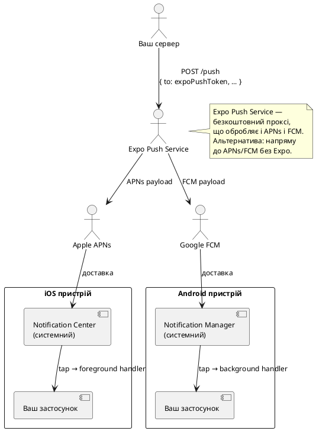
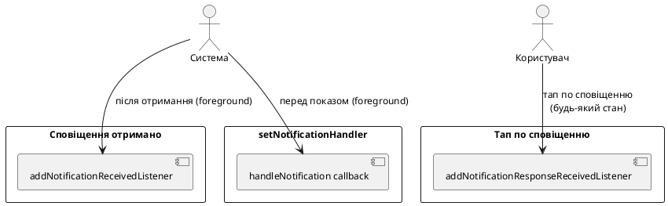
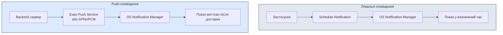
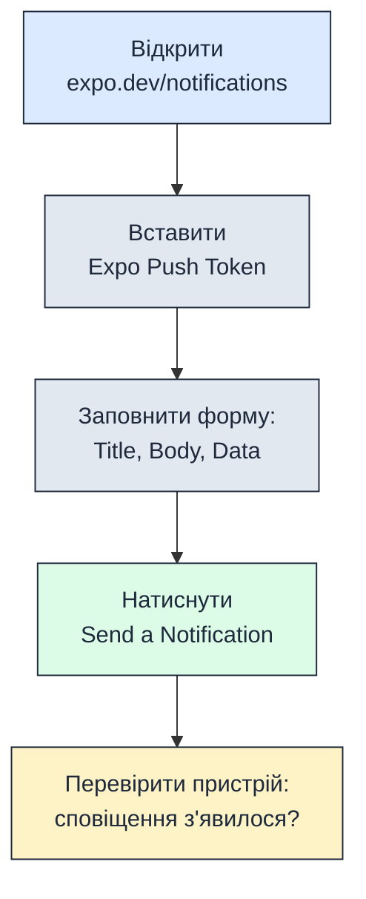

# Push і локальні сповіщення

## Відкриття: сповіщення як канал зворотного зв'язку

Уявіть: користувач зберіг нотатку з нагадуванням «поїздка до Львова — завтра о 8:00». Він закрив застосунок і ліг спати. Вранці телефон вібрує, на екрані блокування з'являється сповіщення — і одним тапом він опиняється прямо на екрані потрібної поїздки.

Це не просто зручність — це **ключовий механізм утримання користувача**. Дослідження показують, що застосунки з доречними сповіщеннями мають на 60–80% вищу щоденну активність порівняно з застосунками без них. Але «доречними» — ключове слово: спам-сповіщення в 2025 році — найшвидший спосіб отримати видалення застосунку.

У цій статті ми розберемо:
- Як влаштована система сповіщень на iOS і Android
- Відмінності між **локальними** і **push** сповіщеннями
- `expo-notifications`: дозволи, створення, планування, скасування
- **Android-канали** — обов'язкова концепція для Android 8+
- Обробку тапу по сповіщенню і навігацію до потрібного екрана
- Міні-проєкт «Нагадування через 10 с»

::note
**Що потрібно знати заздалегідь:** ця стаття передбачає знайомство з Expo Router, хуками `useState`/`useEffect`/`useRef`. Базове розуміння системи дозволів (розглянуто у розділах 21–22) також буде корисним.
::

---

## Архітектура системи сповіщень

### Локальні vs Push-сповіщення

Перш за все — головна різниця між двома типами:

::card-group

::card{title="Локальні сповіщення" icon="i-lucide-bell"}

- Генеруються **самим застосунком** на пристрої
- **Не потребують** серверу, інтернету і push-токена
- Заплановані через `scheduleNotificationAsync` або негайні через `presentNotificationAsync`
- Можуть містити кастомні `data` для навігації
- Обмежені за кількістю (iOS: до 64 запланованих одночасно)

**Приклади:** нагадування про завдання, будильник, щоденна статистика, «не забудь записати витрати».

::

::card{title="Push-сповіщення (Remote)" icon="i-lucide-send"}

- Надсилаються **з сервера** через Apple APNs або Google FCM
- Потребують **дозвіл**, **push-токен** і **бекенд**
- Доставляються навіть якщо застосунок закритий
- Можуть містити `data payload` для обробки у застосунку

**Приклади:** нове повідомлення в чаті, підтвердження замовлення, новини від підписки.

::

::

### Як працює доставка сповіщень

::plant-uml



::

### iOS: особливості системи

На iOS система сповіщень жорстко контролюється Apple:

- **Дозвіл запитується один раз** за весь термін роботи застосунку. Якщо відмовлено — лише через системні Налаштування.
- Сповіщення у **foreground** (застосунок відкритий) — **не показуються** автоматично. Треба явно обробити через `setNotificationHandler`.
- **Critical Alerts** (сигналізація, медицина) — окремий entitlement від Apple.
- **Provisional notifications** (iOS 12+) — тихі сповіщення без явного запиту дозволу (тільки в Notification Center).
- Badge (цифра на іконці) керується через `setBadgeCountAsync`.

### Android: канали і важливість

Android 8.0 (API 26) принципово змінив систему сповіщень, ввівши **канали** (Notification Channels):

- Кожне сповіщення **повинно** бути прив'язано до каналу.
- Канал визначає звук, вібрацію, пріоритет і поведінку.
- Користувач може **вимкнути конкретний канал** у налаштуваннях, не вимикаючи всі сповіщення від застосунку.
- Параметри каналу (звук, вібрація) **неможливо змінити** після першого створення — лише видалити і створити новий.

---

## Встановлення та налаштування

### Пакет та залежності

```bash
npx expo install expo-notifications expo-device
```

**`expo-device`** потрібен для перевірки фізичного пристрою: push-токени недоступні на симуляторі/емуляторі.

### Конфігурація app.json

```json [app.json]
{
  "expo": {
    "plugins": [
      [
        "expo-notifications",
        {
          "icon": "./assets/notification-icon.png",
          "color": "#3B82F6",
          "sounds": ["./assets/sounds/notification.wav"],
          "androidMode": "default",
          "androidCollapsedTitle": "#{unread_notifications} нових сповіщень",
          "iosDisplayInForeground": false
        }
      ]
    ]
  }
}
```

::field-group

::field{name="icon" type="string"}
Шлях до іконки сповіщення для Android. Рекомендований розмір: 96×96 пікселів, прозорий фон, монохромна (тільки білий і прозорий). iOS використовує іконку застосунку.
::

::field{name="color" type="string"}
Колір акценту іконки сповіщення на Android (фон за іконкою). HEX формат.
::

::field{name="sounds" type="string[]"}
Масив шляхів до кастомних звуків (`.wav`, `.mp3`, `.caf`). Потрібно для кастомних `soundName` у каналах/сповіщеннях.
::

::field{name="androidMode" type="'default' | 'collapse'"}
`'default'` — кожне сповіщення окремо. `'collapse'` — однотипні сповіщення групуються. Дефолт: `'default'`.
::

::field{name="iosDisplayInForeground" type="boolean"}
Чи показувати сповіщення коли застосунок відкритий (iOS). Якщо `false` — треба вручну через `setNotificationHandler`.
::

::

---

## Дозволи

### Запит і перевірка

```ts
import * as Notifications from 'expo-notifications';
import * as Device from 'expo-device';

async function requestNotificationPermission(): Promise<boolean> {
  // Дозволи працюють лише на фізичному пристрої
  if (!Device.isDevice) {
    console.warn('Сповіщення недоступні на симуляторі');
    return false;
  }

  const { status: existing } = await Notifications.getPermissionsAsync();

  if (existing === 'granted') return true;

  const { status } = await Notifications.requestPermissionsAsync({
    ios: {
      allowAlert: true,    // показувати банер/повний екран
      allowBadge: true,    // цифра на іконці
      allowSound: true,    // звук
      allowAnnouncements: false, // Siri Announce
    },
  });

  return status === 'granted';
}
```

### Статуси дозволів

::field-group

::field{name="'undetermined'" type="PermissionStatus"}
Користувач ще не бачив діалог. Можна запитувати через `requestPermissionsAsync`.
::

::field{name="'granted'" type="PermissionStatus"}
Дозвіл надано. Можна надсилати і планувати сповіщення.
::

::field{name="'denied'" type="PermissionStatus"}
Відмовлено. На iOS — назавжди (до ручного відновлення). Показуйте пояснення + `Linking.openSettings()`.
::

::

::caution
На iOS після відмови **неможливо** програмно показати діалог знову. Єдиний шлях — `Linking.openSettings()`. Тому важливо спочатку пояснити користувачу навіщо потрібні сповіщення (Pre-permission screen), перш ніж запитувати.
::


---

## Android Notification Channels

### Що таке канал і навіщо він потрібен

Канал (Notification Channel) — це **категорія** сповіщень зі спільними налаштуваннями. Наприклад:

- Канал «Нагадування» — звук дзвоника, висока важливість.
- Канал «Новини» — без звуку, низька важливість.
- Канал «Системні сповіщення» — без звуку, мінімальна важливість.

Користувач у налаштуваннях Android може окремо вимкнути «Новини», не чіпаючи «Нагадування». Це значно знижує відсоток повного вимкнення сповіщень.

::warning
На Android 8.0+ (API 26) сповіщення **без каналу ігноруються** — вони не покажуться навіть якщо дозвіл надано. Обов'язково створюйте канали перед першим сповіщенням.
::

### Створення каналів

```ts
import * as Notifications from 'expo-notifications';

async function setupNotificationChannels() {
  if (Platform.OS !== 'android') return; // канали тільки для Android

  // Канал для нагадувань
  await Notifications.setNotificationChannelAsync('reminders', {
    name: 'Нагадування',
    description: 'Нагадування про заплановані події та завдання',
    importance: Notifications.AndroidImportance.HIGH,
    sound: 'default',
    vibrationPattern: [0, 250, 250, 250],
    lightColor: '#3B82F6',
    lockscreenVisibility: Notifications.AndroidNotificationVisibility.PUBLIC,
    bypassDnd: false,
    enableLights: true,
    enableVibrate: true,
    showBadge: true,
  });

  // Канал для тихих оновлень
  await Notifications.setNotificationChannelAsync('updates', {
    name: 'Оновлення',
    description: 'Новини та оновлення застосунку',
    importance: Notifications.AndroidImportance.LOW,
    sound: undefined, // без звуку
    enableVibrate: false,
  });
}
```

### Параметри каналу

::field-group

::field{name="name" type="string" required}
Відображувана назва каналу у системних налаштуваннях. Пишіть зрозуміло для кінцевого користувача.
::

::field{name="description" type="string"}
Опис каналу у налаштуваннях. Допомагає користувачу вирішити які канали вимкнути.
::

::field{name="importance" type="AndroidImportance"}
Рівень важливості. Визначає де і як показується сповіщення:

- `NONE` (0) — ніколи не показується
- `MIN` (1) — лише у тіні сповіщень
- `LOW` (2) — без звуку і вібрації
- `DEFAULT` (3) — звук і вібрація
- `HIGH` (4) — банер поверх будь-якого контенту
- `MAX` (5) — повноекранне сповіщення (будильники, дзвінки)
::

::field{name="sound" type="'default' | string | undefined"}
`'default'` — системний звук. Назва файлу зі `sounds` у `app.json` для кастомного. `undefined` — без звуку.
::

::field{name="vibrationPattern" type="number[]"}
Патерн вібрації: `[пауза, вібрація, пауза, вібрація, ...]` у мілісекундах. `[0, 250, 250, 250]` — стандартний подвійний вдар.
::

::field{name="lockscreenVisibility" type="AndroidNotificationVisibility"}
Що показувати на екрані блокування: `PUBLIC` (повний вміст), `PRIVATE` (лише іконка і назва), `SECRET` (нічого).
::

::field{name="bypassDnd" type="boolean"}
Якщо `true` — сповіщення пробиває режим «Не турбувати». Тільки для критично важливих сповіщень (медицина, безпека).
::

::

::tip
Канали рекомендується створювати **одразу при запуску застосунку** — наприклад у `app/_layout.tsx` в `useEffect`. Якщо канал вже існує, повторний виклик `setNotificationChannelAsync` безпечний і нічого не перезаписує.
::

---

## Вміст сповіщення: NotificationContentInput

Кожне сповіщення — це об'єкт `NotificationContentInput` з набором полів:

::field-group

::field{name="title" type="string"}
Заголовок сповіщення. Відображається жирним шрифтом. Рекомендована довжина: до 50 символів.
::

::field{name="body" type="string"}
Тіло сповіщення. Відображається під заголовком. До 200 символів. На iOS може бути обрізане.
::

::field{name="data" type="Record<string, unknown>"}
Довільний JSON-об'єкт, що передається разом зі сповіщенням. **Не відображається** користувачу. Використовується для навігації і бізнес-логіки при тапі.
::

::field{name="sound" type="boolean | string"}
`true` або `'default'` — системний звук. Ім'я файлу — кастомний. `false` — без звуку.
::

::field{name="badge" type="number"}
Число на іконці застосунку (iOS). На Android — окремо через `setBadgeCountAsync`.
::

::field{name="subtitle" type="string (iOS only)"}
Підзаголовок між `title` і `body` (тільки iOS). Зазвичай використовується для категорії або контексту.
::

::field{name="categoryIdentifier" type="string"}
Ідентифікатор категорії для Action Buttons (кнопки в сповіщенні без відкриття застосунку). Потрібна попередня реєстрація категорії.
::

::field{name="attachments" type="NotificationAttachment[] (iOS)"}
Медіа-вкладення: зображення, відео, аудіо. Виглядає у вигляді прев'ю праворуч від тексту.
::

::field{name="color" type="string (Android)"}
Колір акценту конкретного сповіщення. Перекриває колір каналу.
::

::field{name="vibrate" type="number[] (Android)"}
Патерн вібрації для конкретного сповіщення (якщо канал дозволяє).
::

::field{name="sticky" type="boolean (Android)"}
Якщо `true` — сповіщення не можна смахнути пальцем. Залишається до явного `dismissNotificationAsync`.
::

::

---

## Локальні сповіщення: scheduleNotificationAsync

### Тригери планування

`scheduleNotificationAsync` приймає `content` і `trigger`. Тригер визначає **коли** спрацює сповіщення:

#### Негайне сповіщення

```ts
await Notifications.scheduleNotificationAsync({
  content: {
    title: '👋 Привіт!',
    body: 'Це негайне сповіщення',
    data: { screen: 'home' },
  },
  trigger: null, // null = показати негайно
});
```

#### Через певний час (секунди)

```ts
await Notifications.scheduleNotificationAsync({
  content: {
    title: '⏰ Нагадування',
    body: 'Час перевірити список справ',
    data: { screen: 'tasks', taskId: '123' },
    sound: true,
  },
  trigger: {
    seconds: 10,      // через 10 секунд
    repeats: false,   // не повторювати
  },
});
```

#### У конкретний час (Date)

```ts
const reminderDate = new Date();
reminderDate.setHours(9, 0, 0, 0); // сьогодні о 9:00
reminderDate.setDate(reminderDate.getDate() + 1); // завтра

await Notifications.scheduleNotificationAsync({
  content: {
    title: '🏔 Нагадування про поїздку',
    body: 'Карпати — завтра! Не забудь упакувати рюкзак.',
    data: { screen: 'trip', tripId: 'kyiv-lviv-2024' },
  },
  trigger: {
    date: reminderDate,
  },
});
```

#### Щоденно у фіксований час

```ts
await Notifications.scheduleNotificationAsync({
  content: {
    title: '📝 Щоденний підсумок',
    body: 'Час записати події дня',
  },
  trigger: {
    hour: 21,
    minute: 0,
    repeats: true, // щодня
  },
});
```

#### По днях тижня (щотижнево)

```ts
await Notifications.scheduleNotificationAsync({
  content: { title: '📅 Початок тижня', body: 'Плануйте нові подорожі!' },
  trigger: {
    weekday: 2,     // 1=Нд, 2=Пн, 3=Вт ... 7=Сб
    hour: 10,
    minute: 0,
    repeats: true,
  },
});
```

### Тип NotificationTriggerInput: всі варіанти

::field-group

::field{name="null" type="trigger"}
Показати **негайно** в момент виклику. Якщо застосунок у foreground — спрацьовує `setNotificationHandler`.
::

::field{name="{ seconds, repeats? }" type="TimeIntervalTriggerInput"}
Через `seconds` секунд від поточного моменту. `repeats: true` — повторювати з таким самим інтервалом.
::

::field{name="{ date }" type="DateTriggerInput"}
Спрацьовує рівно у вказаний `Date`. Якщо дата вже в минулому — сповіщення не спрацює.
::

::field{name="{ hour, minute, repeats? }" type="DailyTriggerInput"}
Щодня у конкретний час. `repeats: true` (обов'язковий для `hour`/`minute`/`weekday` тригерів).
::

::field{name="{ weekday, hour, minute, repeats? }" type="WeeklyTriggerInput"}
Щотижнево в конкретний день і час. `weekday`: 1=Неділя, 2=Понеділок, ..., 7=Субота.
::

::field{name="{ day, hour, minute, repeats? }" type="MonthlyTriggerInput (iOS only)"}
Щомісяця у конкретний день і час. Тільки iOS.
::

::field{name="{ year, month, day, hour, minute, second }" type="CalendarTriggerInput (iOS)"}
Точний момент календарного часу або повторювана дата через об'єкт `DateComponents`. Тільки iOS.
::

::field{name="channelId" type="string (Android, додатково)"}
ID каналу Android. Додається як додаткове поле до будь-якого тригера: `{ seconds: 10, channelId: 'reminders' }`.
::

::


---

## Обробка сповіщень у застосунку

### setNotificationHandler: foreground поведінка

За замовчуванням на iOS сповіщення **не відображаються**, якщо застосунок у foreground (відкритий). Щоб змінити це — налаштовуємо глобальний обробник:

```ts
import * as Notifications from 'expo-notifications';

// Налаштовуємо одразу при запуску (до будь-яких компонентів):
Notifications.setNotificationHandler({
  handleNotification: async (notification) => ({
    shouldShowAlert: true,   // показати банер
    shouldPlaySound: true,   // відтворити звук
    shouldSetBadge: false,   // не чіпати badge
    priority: Notifications.AndroidNotificationPriority.HIGH,
  }),
});
```

`handleNotification` — це **асинхронна функція**, що приймає `Notification` і повертає `NotificationBehavior`. Це дозволяє приймати рішення динамічно:

```ts
Notifications.setNotificationHandler({
  handleNotification: async (notification) => {
    const { data } = notification.request.content;

    // Сповіщення від поточного чату — не показуємо (вже бачимо)
    if (data?.chatId === currentOpenChatId) {
      return {
        shouldShowAlert: false,
        shouldPlaySound: false,
        shouldSetBadge: true,
      };
    }

    return {
      shouldShowAlert: true,
      shouldPlaySound: true,
      shouldSetBadge: true,
    };
  },
});
```

### Три типи обробників (listeners)

RNGH надає три різних слухачі для різних сценаріїв:

::plant-uml



::

#### addNotificationReceivedListener

Викликається **коли сповіщення надійшло** у foreground-стані застосунку (але не при тапі):

```ts
useEffect(() => {
  const subscription = Notifications.addNotificationReceivedListener((notification) => {
    console.log('Сповіщення отримано:', notification.request.content);
    // Наприклад: оновити лічильник непрочитаних у стейті
    setUnreadCount((c) => c + 1);
  });

  return () => subscription.remove();
}, []);
```

#### addNotificationResponseReceivedListener

Викликається **при тапі** по сповіщенню — незалежно від стану застосунку (foreground, background, killed):

```ts
useEffect(() => {
  const subscription = Notifications.addNotificationResponseReceivedListener((response) => {
    const { data } = response.notification.request.content;

    // Навігація на потрібний екран:
    if (data?.screen === 'trip') {
      router.push(`/trips/${data.tripId}`);
    } else if (data?.screen === 'tasks') {
      router.push('/tasks');
    }
  });

  return () => subscription.remove();
}, []);
```

::note
Ці два слухачі важливо **видаляти** при розмонтуванні компонента через `subscription.remove()` у функції cleanup з `useEffect`. Інакше при повторному монтуванні накопичуються дубльовані підписки.
::

---

## Навігація при тапі по сповіщенню

### Складність: застосунок міг бути закритий

Тап по сповіщенню — найскладніший сценарій, бо може відбутись коли застосунок:

1. **У foreground** — просто обробляємо в listener.
2. **У background** — застосунок відновлюється, listener спрацьовує.
3. **Повністю закритий (killed)** — застосунок запускається з нуля, і `addNotificationResponseReceivedListener` **не встигне зареєструватись** до першого спрацювання.

Для третього сценарію використовується `getLastNotificationResponseAsync`:

```ts
// Перевіряємо початкове сповіщення при запуску застосунку:
useEffect(() => {
  Notifications.getLastNotificationResponseAsync().then((response) => {
    if (!response) return;

    const { data } = response.notification.request.content;
    // Обробляємо так само, як у listener
    handleNotificationNavigation(data);
  });
}, []); // виконується один раз при монтуванні
```

### Повна схема обробки в _layout.tsx

Найчистіший підхід — централізувати всю логіку сповіщень у кореневому layout:

```tsx
// app/_layout.tsx
import { useEffect, useRef } from 'react';
import { useRouter } from 'expo-router';
import * as Notifications from 'expo-notifications';
import { Platform } from 'react-native';

// Конфігуруємо foreground поведінку одразу (поза компонентом):
Notifications.setNotificationHandler({
  handleNotification: async () => ({
    shouldShowAlert: true,
    shouldPlaySound: true,
    shouldSetBadge: true,
  }),
});

export default function RootLayout() {
  const router = useRouter();
  const notificationListener = useRef<Notifications.Subscription>();
  const responseListener = useRef<Notifications.Subscription>();

  // Функція навігації за даними сповіщення
  const handleNotificationData = (data: Record<string, unknown> | undefined) => {
    if (!data) return;

    switch (data.screen) {
      case 'trip':
        router.push(`/trips/${data.tripId}`);
        break;
      case 'reminder':
        router.push('/reminders');
        break;
      case 'chat':
        router.push(`/chats/${data.chatId}`);
        break;
    }
  };

  useEffect(() => {
    // Створюємо канали для Android
    if (Platform.OS === 'android') {
      Notifications.setNotificationChannelAsync('reminders', {
        name: 'Нагадування',
        importance: Notifications.AndroidImportance.HIGH,
        sound: 'default',
        vibrationPattern: [0, 250, 250, 250],
      });
    }

    // Обробка сповіщення при запуску із closed стану:
    Notifications.getLastNotificationResponseAsync().then((response) => {
      if (response?.notification.request.content.data) {
        // Невелика затримка — чекаємо поки навігатор ініціалізується
        setTimeout(() => {
          handleNotificationData(response.notification.request.content.data);
        }, 500);
      }
    });

    // Listener: отримано сповіщення у foreground
    notificationListener.current = Notifications.addNotificationReceivedListener(
      (notification) => {
        console.log('Received:', notification.request.identifier);
      }
    );

    // Listener: тап по сповіщенню
    responseListener.current = Notifications.addNotificationResponseReceivedListener(
      (response) => {
        handleNotificationData(response.notification.request.content.data);
      }
    );

    return () => {
      notificationListener.current?.remove();
      responseListener.current?.remove();
    };
  }, []);

  return (
    // ... решта layout
  );
}
```

### Action Buttons: дії без відкриття застосунку

iOS і Android дозволяють додати кнопки прямо у сповіщення (без відкриття застосунку). На iOS це називається **Notification Actions**, на Android — вони доступні через `channelId` і `categoryIdentifier`:

```ts
// Реєструємо категорію з кнопками (iOS):
await Notifications.setNotificationCategoryAsync('reminder', [
  {
    identifier: 'snooze',
    buttonTitle: 'Відкласти на 5 хв',
    options: { opensAppToForeground: false }, // без відкриття застосунку
  },
  {
    identifier: 'done',
    buttonTitle: '✅ Виконано',
    options: { opensAppToForeground: false, isDestructive: false },
  },
  {
    identifier: 'open',
    buttonTitle: 'Відкрити',
    options: { opensAppToForeground: true },
  },
]);

// Планування сповіщення з категорією:
await Notifications.scheduleNotificationAsync({
  content: {
    title: '⏰ Нагадування',
    body: 'Час упакувати рюкзак для Карпат',
    categoryIdentifier: 'reminder', // ← прив'язуємо категорію
    data: { type: 'reminder', id: '42' },
  },
  trigger: { seconds: 10 },
});
```

У `addNotificationResponseReceivedListener` отримуємо яку кнопку натиснули:

```ts
Notifications.addNotificationResponseReceivedListener((response) => {
  const actionId = response.actionIdentifier;
  // actionId === 'snooze', 'done', 'open' або
  // Notifications.DEFAULT_ACTION_IDENTIFIER (тап на само сповіщення)

  if (actionId === 'snooze') {
    // Плануємо ще одне сповіщення через 5 хвилин
    scheduleReminder(response.notification.request.content.data.id, 300);
  } else if (actionId === 'done') {
    // Позначаємо як виконане без відкриття застосунку
    markAsDone(response.notification.request.content.data.id);
  }
});
```


---

## Управління запланованими сповіщеннями

### Отримання списку запланованих

```ts
// Всі заплановані сповіщення:
const scheduled = await Notifications.getAllScheduledNotificationsAsync();
scheduled.forEach((n) => {
  console.log(n.identifier, n.content.title, n.trigger);
});
```

### Скасування сповіщень

```ts
// Скасувати конкретне (за identifier):
await Notifications.cancelScheduledNotificationAsync(notificationId);

// Скасувати всі заплановані:
await Notifications.cancelAllScheduledNotificationsAsync();

// Відхилити показане сповіщення (прибрати з tray):
await Notifications.dismissNotificationAsync(notificationId);

// Відхилити всі показані:
await Notifications.dismissAllNotificationsAsync();
```

### Badge — цифра на іконці

```ts
// Встановити badge:
await Notifications.setBadgeCountAsync(5);

// Скинути badge:
await Notifications.setBadgeCountAsync(0);

// Прочитати поточний badge:
const count = await Notifications.getBadgeCountAsync();
```

::note
На **Android 8+** badge автоматично оновлюється при отриманні сповіщення і скидається при відкритті застосунку — залежно від launcher. На деяких Android launcher-ах (Samsung) badge працює коректно, на AOSP — може не підтримуватись.
::

### Хук useNotifications: зводимо логіку разом

```ts
// hooks/useNotifications.ts
import { useState, useEffect, useCallback } from 'react';
import * as Notifications from 'expo-notifications';
import * as Device from 'expo-device';
import { Platform } from 'react-native';

interface UseNotificationsReturn {
  permissionGranted: boolean;
  requestPermission: () => Promise<boolean>;
  scheduleReminder: (title: string, body: string, seconds: number, data?: object) => Promise<string>;
  cancelReminder: (id: string) => Promise<void>;
  cancelAll: () => Promise<void>;
  scheduledCount: number;
  refreshScheduled: () => Promise<void>;
}

export function useNotifications(): UseNotificationsReturn {
  const [permissionGranted, setPermissionGranted] = useState(false);
  const [scheduledCount, setScheduledCount] = useState(0);

  useEffect(() => {
    // Перевірка дозволу при монтуванні
    Notifications.getPermissionsAsync().then(({ status }) => {
      setPermissionGranted(status === 'granted');
    });

    // Рахуємо заплановані
    refreshScheduled();
  }, []);

  const refreshScheduled = useCallback(async () => {
    const list = await Notifications.getAllScheduledNotificationsAsync();
    setScheduledCount(list.length);
  }, []);

  const requestPermission = useCallback(async () => {
    if (!Device.isDevice) return false;

    const { status } = await Notifications.requestPermissionsAsync({
      ios: { allowAlert: true, allowBadge: true, allowSound: true },
    });
    const granted = status === 'granted';
    setPermissionGranted(granted);
    return granted;
  }, []);

  const scheduleReminder = useCallback(async (
    title: string,
    body: string,
    seconds: number,
    data: object = {}
  ): Promise<string> => {
    const id = await Notifications.scheduleNotificationAsync({
      content: { title, body, data, sound: true },
      trigger: {
        seconds,
        channelId: Platform.OS === 'android' ? 'reminders' : undefined,
      } as any,
    });
    await refreshScheduled();
    return id;
  }, [refreshScheduled]);

  const cancelReminder = useCallback(async (id: string) => {
    await Notifications.cancelScheduledNotificationAsync(id);
    await refreshScheduled();
  }, [refreshScheduled]);

  const cancelAll = useCallback(async () => {
    await Notifications.cancelAllScheduledNotificationsAsync();
    setScheduledCount(0);
  }, []);

  return {
    permissionGranted,
    requestPermission,
    scheduleReminder,
    cancelReminder,
    cancelAll,
    scheduledCount,
    refreshScheduled,
  };
}
```

---

## Push-сповіщення: огляд

Push-сповіщення (remote notifications) — це повідомлення, що надсилаються з віддаленого сервера на пристрій користувача навіть коли застосунок повністю закритий. На відміну від локальних сповіщень, які плануються безпосередньо на пристрої, push-сповіщення вимагають інфраструктури: backend-сервера, системи доставки (Apple Push Notification Service — APNs для iOS або Firebase Cloud Messaging — FCM для Android) та унікального токена пристрою.

### Архітектурна різниця: локальні vs push

::mermaid



::

**Ключові відмінності:**

| Характеристика | Локальні сповіщення | Push-сповіщення |
| :--- | :--- | :--- |
| **Джерело** | Сам застосунок на пристрої | Віддалений сервер |
| **Інтернет** | Не потрібен | Обов'язковий |
| **Backend** | Не потрібен | Обов'язковий |
| **Токен пристрою** | Не потрібен | Обов'язковий (ExpoToken або FCM/APNs токен) |
| **Таргетування** | Лише поточний пристрій | Мільйони пристроїв одночасно |
| **Доставка при закритому застосунку** | Працює (заплановано ОС) | Працює (прокидується через ОС) |
| **Персоналізація** | Обмежена локальним стейтом | Повна (дані з бази сервера) |

### Коли використовувати push-сповіщення?

Push-сповіщення критично важливі для:

- **Чати та соціальні мережі:** Нове повідомлення від іншого користувача.
- **E-commerce:** Статус замовлення, підтвердження оплати, акції.
- **Доставка їжі:** «Кур'єр за 5 хвилин від вас».
- **Новини та контент:** Термінові оновлення, нові статті.
- **Колаборативні інструменти:** Згадування в коментарі, нове завдання.
- **IoT та моніторинг:** Спрацювала сигналізація, критичні події сервера.

::warning
**Антипатерн: спам-нотифікації.** Надсилання нерелевантних або занадто частих push-сповіщень (більше 3–5 на день без запиту користувача) призводить до:
- Вимкнення дозволів у 70% користувачів протягом першого тижня.
- Видалення застосунку у 40% користувачів.
- Негативних відгуків у App Store / Google Play.

**Золоте правило:** Кожне push-сповіщення повинно мати цінність для користувача **прямо зараз**.
::

---

## Крок 1: Отримання Expo Push Token

### 1.1. Що таке Expo Push Token?

**Expo Push Token** (формат: `ExponentPushToken[xxxxxxxxxxxxxxxxxxxxxx]`) — це унікальний ідентифікатор пристрою, згенерований Expo Push Service. Він абстрагує від платформових токенів (APNs Device Token для iOS, FCM Registration Token для Android) і дозволяє надсилати push-сповіщення через єдиний Expo API.

::note
**Чому не APNs/FCM напряму?** Expo Push Service автоматично:
- Керує сертифікатами APNs (не потрібен `.p8` ключ або `.pem` файл).
- Обробляє різні формати payload для iOS та Android.
- Надає retry-логіку при тимчасових збоях доставки.
- Безкоштовний для всіх Expo-проєктів (без обмеження кількості push).

Альтернатива — напряму інтегруватися з APNs/FCM (розглянемо далі у розділі «Нативна інтеграція»).
::

### 1.2. Отримання токена в коді

```typescript
import * as Notifications from 'expo-notifications';
import * as Device from 'expo-device';
import { Platform } from 'react-native';
import Constants from 'expo-constants';

async function registerForPushNotificationsAsync(): Promise<string | undefined> {
  // Push-токени недоступні на симуляторі/емуляторі
  if (!Device.isDevice) {
    console.warn('Push notifications work only on physical devices');
    return undefined;
  }

  // Перевірка дозволів
  const { status: existingStatus } = await Notifications.getPermissionsAsync();
  let finalStatus = existingStatus;

  if (existingStatus !== 'granted') {
    const { status } = await Notifications.requestPermissionsAsync();
    finalStatus = status;
  }

  if (finalStatus !== 'granted') {
    console.warn('Permission for push notifications was denied');
    return undefined;
  }

  // Отримання Expo Push Token
  const projectId = Constants.expoConfig?.extra?.eas?.projectId;
  
  if (!projectId) {
    throw new Error('Project ID not found. Run `eas init` first.');
  }

  const token = await Notifications.getExpoPushTokenAsync({ projectId });
  
  console.log('Expo Push Token:', token.data);
  
  // Android-specific: налаштування каналу
  if (Platform.OS === 'android') {
    await Notifications.setNotificationChannelAsync('default', {
      name: 'Default',
      importance: Notifications.AndroidImportance.MAX,
      vibrationPattern: [0, 250, 250, 250],
      lightColor: '#FF231F7C',
    });
  }

  return token.data;
}
```

**Покрокове пояснення:**

1. **Перевірка фізичного пристрою:** Push-токени генеруються лише на реальному залізі. iOS Simulator та Android Emulator повертають помилку.

2. **Запит дозволів:** Без дозволу `granted` токен не буде згенерований.

3. **Project ID:** Це унікальний ідентифікатор з `app.json` → `extra.eas.projectId`, згенерований командою `eas init`. Без нього Expo не знає до якого проєкту прив'язати токен.

4. **Генерація токена:** `getExpoPushTokenAsync()` викликає Expo Backend, який взаємодіє з APNs (iOS) або FCM (Android) і повертає універсальний `ExponentPushToken`.

5. **Android канал:** Обов'язково створюємо канал `default` для Android 8+ (без нього push-сповіщення не покажуться).

### 1.3. Збереження токена на сервері

Токен потрібно **надіслати на ваш backend** і зберегти в базі даних, прив'язавши до облікового запису користувача:

```typescript
// services/api.ts
export async function savePushToken(userId: string, token: string) {
  await fetch('https://api.myapp.com/users/push-token', {
    method: 'POST',
    headers: {
      'Content-Type': 'application/json',
      Authorization: `Bearer ${userAuthToken}`,
    },
    body: JSON.stringify({
      userId,
      expoPushToken: token,
      platform: Platform.OS,
      deviceId: Constants.installationId,
    }),
  });
}
```

**Структура даних на сервері (приклад PostgreSQL):**

```sql
CREATE TABLE push_tokens (
  id SERIAL PRIMARY KEY,
  user_id INTEGER NOT NULL REFERENCES users(id),
  expo_push_token TEXT NOT NULL UNIQUE,
  platform VARCHAR(10) NOT NULL, -- 'ios' або 'android'
  device_id TEXT,
  created_at TIMESTAMP DEFAULT NOW(),
  updated_at TIMESTAMP DEFAULT NOW()
);

CREATE INDEX idx_push_tokens_user ON push_tokens(user_id);
CREATE INDEX idx_push_tokens_token ON push_tokens(expo_push_token);
```

::accordion

::accordion-item{label="❓ Чи потрібно оновлювати токен при кожному запуску?" icon="i-lucide-help-circle"}

**Ні, але...** Expo Push Token зазвичай **стабільний** протягом життя встановленого застосунку. Проте він може змінитися у наступних випадках:

- Повне видалення та перевстановлення застосунку.
- Зміна Bundle Identifier (iOS) або Package Name (Android).
- Зміна Project ID у Expo.
- Скидання до заводських налаштувань пристрою.

**Рекомендована стратегія:**
1. Зберігайте токен локально через `AsyncStorage` або `SecureStore`.
2. При запуску застосунку порівнюйте поточний токен із збереженим.
3. Якщо токен змінився — надішліть оновлення на сервер.

```typescript
import AsyncStorage from '@react-native-async-storage/async-storage';

const PUSH_TOKEN_KEY = 'expoPushToken';

async function syncPushToken() {
  const newToken = await registerForPushNotificationsAsync();
  if (!newToken) return;

  const storedToken = await AsyncStorage.getItem(PUSH_TOKEN_KEY);

  if (storedToken !== newToken) {
    await savePushToken(currentUserId, newToken);
    await AsyncStorage.setItem(PUSH_TOKEN_KEY, newToken);
    console.log('Push token updated on server');
  }
}
```

::

::

### 1.4. Хук usePushToken для автоматизації

```typescript
// hooks/usePushToken.ts
import { useState, useEffect } from 'react';
import * as Notifications from 'expo-notifications';
import * as Device from 'expo-device';
import Constants from 'expo-constants';
import { Platform } from 'react-native';
import AsyncStorage from '@react-native-async-storage/async-storage';

const PUSH_TOKEN_KEY = 'expoPushToken';

export function usePushToken(userId: string | null) {
  const [expoPushToken, setExpoPushToken] = useState<string | null>(null);
  const [error, setError] = useState<Error | null>(null);

  useEffect(() => {
    if (!userId) return; // Не реєструємо токен для неавторизованих

    async function registerPushToken() {
      try {
        if (!Device.isDevice) {
          console.warn('[Push] Only works on physical device');
          return;
        }

        // Запит дозволів
        const { status: existingStatus } = await Notifications.getPermissionsAsync();
        let finalStatus = existingStatus;

        if (existingStatus !== 'granted') {
          const { status } = await Notifications.requestPermissionsAsync();
          finalStatus = status;
        }

        if (finalStatus !== 'granted') {
          throw new Error('Push notification permission denied');
        }

        // Отримання токена
        const projectId = Constants.expoConfig?.extra?.eas?.projectId;
        if (!projectId) {
          throw new Error('Project ID missing. Run: eas init');
        }

        const tokenData = await Notifications.getExpoPushTokenAsync({ projectId });
        const token = tokenData.data;

        // Перевірка чи змінився токен
        const storedToken = await AsyncStorage.getItem(PUSH_TOKEN_KEY);

        if (storedToken !== token) {
          // Надсилаємо на сервер
          await fetch('https://api.myapp.com/users/push-token', {
            method: 'POST',
            headers: { 'Content-Type': 'application/json' },
            body: JSON.stringify({
              userId,
              expoPushToken: token,
              platform: Platform.OS,
            }),
          });

          await AsyncStorage.setItem(PUSH_TOKEN_KEY, token);
          console.log('[Push] Token registered:', token);
        }

        setExpoPushToken(token);

        // Android: налаштування каналу
        if (Platform.OS === 'android') {
          await Notifications.setNotificationChannelAsync('default', {
            name: 'Default notifications',
            importance: Notifications.AndroidImportance.MAX,
            vibrationPattern: [0, 250, 250, 250],
            lightColor: '#FF231F7C',
          });
        }
      } catch (err) {
        console.error('[Push] Registration error:', err);
        setError(err as Error);
      }
    }

    registerPushToken();
  }, [userId]);

  return { expoPushToken, error };
}
```

**Використання у компоненті:**

```typescript
// app/_layout.tsx або app/(auth)/home.tsx
import { usePushToken } from '@/hooks/usePushToken';
import { useAuth } from '@/context/AuthContext';

export default function HomeScreen() {
  const { user } = useAuth();
  const { expoPushToken, error } = usePushToken(user?.id ?? null);

  useEffect(() => {
    if (expoPushToken) {
      console.log('Device ready for push:', expoPushToken);
    }
  }, [expoPushToken]);

  // ... решта компонента
}
```

---

## Крок 2: Надсилання push-сповіщень з серверу

### 2.1. Expo Push Notification API

Expo надає **HTTP REST API** для надсилання push-сповіщень. Базовий endpoint:

```
POST https://exp.host/--/api/v2/push/send
Content-Type: application/json
```

**Формат запиту (одне сповіщення):**

```json
{
  "to": "ExponentPushToken[xxxxxxxxxxxxxxxxxxxxxx]",
  "title": "Нове повідомлення",
  "body": "Олександр надіслав вам повідомлення",
  "data": {
    "screen": "chat",
    "chatId": "123",
    "senderId": "user_456"
  },
  "sound": "default",
  "badge": 1,
  "priority": "high",
  "channelId": "messages"
}
```

**Формат запиту (множинні сповіщення):**

```json
[
  {
    "to": "ExponentPushToken[aaaa]",
    "title": "Перше сповіщення",
    "body": "Текст першого"
  },
  {
    "to": "ExponentPushToken[bbbb]",
    "title": "Друге сповіщення",
    "body": "Текст другого"
  }
]
```

**Параметри запиту:**

::field-group

::field{name="to" type="string | string[]" required}
Expo Push Token отримувача. Можна передати масив токенів для групової розсилки (до 100 токенів в одному запиті).
::

::field{name="title" type="string"}
Заголовок сповіщення (до 65 символів для iOS, до 50 для Android для гарантованого відображення).
::

::field{name="body" type="string"}
Текст сповіщення (до 240 символів для стабільного відображення на обох платформах).
::

::field{name="data" type="object"}
Довільний JSON-об'єкт з метаданими. Передається в `notification.request.content.data` при обробці у застосунку. Не відображається користувачу.
::

::field{name="sound" type="'default' | null"}
`'default'` — системний звук. `null` — без звуку.
::

::field{name="badge" type="number (iOS)"}
Число на іконці застосунку. Працює лише на iOS.
::

::field{name="priority" type="'default' | 'normal' | 'high'"}
Пріоритет доставки. `'high'` — миттєва доставка навіть у режимі енергозбереження. `'normal'` — може затриматися до 10–30 хвилин.
::

::field{name="ttl" type="number"}
Time To Live — час у секундах, протягом якого сповіщення залишається валідним. Після закінчення TTL недоставлене сповіщення скидається.
::

::field{name="expiration" type="number"}
Unix timestamp (секунди), після якого сповіщення стає недійсним. Альтернатива `ttl`.
::

::field{name="channelId" type="string (Android)"}
ID Android каналу. Якщо не вказано — використовується канал `'default'`.
::

::field{name="subtitle" type="string (iOS)"}
Підзаголовок між `title` та `body` (тільки iOS).
::

::field{name="mutableContent" type="boolean (iOS)"}
Якщо `true` — дозволяє Notification Service Extension модифікувати сповіщення перед показом (для додавання медіа-вкладень, розшифрування тощо).
::

::

---

## Крок 2: Тестування push-сповіщень через Expo Push Notification Tool

### 2.1. Швидке тестування без backend

Перш ніж писати backend-код, найпростіший спосіб перевірити, що push-нотифікації працюють — використати **офіційний веб-інструмент Expo**.

::note
**Expo Push Notification Tool** — це безкоштовний веб-сервіс від Expo, який дозволяє надіслати тестове push-сповіщення на ваш пристрій без написання жодного рядка backend-коду. Ідеально для:
- Перевірки правильності Expo Push Token.
- Тестування різних payload (title, body, data, sound).
- Експериментів з пріоритетом, TTL, badge.
- Діагностики проблем доставки перед інтеграцією з власним сервером.
::

### 2.2. Покрокова інструкція тестування

#### Крок 1: Отримайте Expo Push Token з застосунку

Додайте кнопку для копіювання токена в буфер обміну:

```typescript
import * as Clipboard from 'expo-clipboard';
import { Alert, Pressable, Text } from 'react-native';

function CopyTokenButton({ expoPushToken }: { expoPushToken: string | null }) {
  const handleCopy = async () => {
    if (!expoPushToken) {
      Alert.alert('Помилка', 'Push token ще не згенерований');
      return;
    }

    await Clipboard.setStringAsync(expoPushToken);
    Alert.alert('Успіх', 'Token скопійовано в буфер обміну!');
  };

  return (
    <Pressable
      onPress={handleCopy}
      style={{
        backgroundColor: '#3b82f6',
        padding: 12,
        borderRadius: 8,
        alignItems: 'center',
      }}
    >
      <Text style={{ color: 'white', fontWeight: '600' }}>
        📋 Скопіювати Push Token
      </Text>
    </Pressable>
  );
}
```

**Альтернатива: Виведіть токен у консоль:**

```typescript
useEffect(() => {
  if (expoPushToken) {
    console.log('═══════════════════════════════════════');
    console.log('📱 EXPO PUSH TOKEN:');
    console.log(expoPushToken);
    console.log('═══════════════════════════════════════');
  }
}, [expoPushToken]);
```

#### Крок 2: Відкрийте Expo Push Notification Tool

Перейдіть за посиланням: **[expo.dev/notifications](https://expo.dev/notifications)**

Ви побачите веб-інтерфейс з формою:

::mermaid



::

#### Крок 3: Заповніть форму надсилання

**Приклад заповнення:**

| Поле | Значення | Пояснення |
| :--- | :--- | :--- |
| **Expo Push Token** | `ExponentPushToken[xxxxxxxxxxxxxxxxxxxxxx]` | Вставте токен з буфера |
| **Title** | `Тестове сповіщення` | Заголовок |
| **Body** | `Це перевірка push через Expo Tool` | Текст повідомлення |
| **JSON Data** | `{"screen": "home", "testId": "123"}` | Додаткові дані (опціонально) |
| **Play Sound** | ✅ Checked | Увімкнути звук |
| **Badge** | `1` | Цифра на іконці (iOS) |
| **Priority** | `high` | Миттєва доставка |
| **Channel ID** | `default` | Для Android каналу |

**Скріншот форми:**

```
┌─────────────────────────────────────────────────────┐
│ Send a notification                                  │
├─────────────────────────────────────────────────────┤
│ Expo Push Token                                      │
│ [ExponentPushToken[xxxxxxxxxxxxxxxxxxxxxx]        ] │
│                                                      │
│ Title                                                │
│ [Тестове сповіщення                               ] │
│                                                      │
│ Body                                                 │
│ [Це перевірка push через Expo Tool                ] │
│                                                      │
│ JSON Data (optional)                                 │
│ [{"screen": "home", "testId": "123"}              ] │
│                                                      │
│ ☑ Play sound    Badge: [1]    Priority: [high ▾]   │
│                                                      │
│ [ Send a Notification ]                              │
└─────────────────────────────────────────────────────┘
```

#### Крок 4: Натисніть "Send a Notification"

Після натискання ви побачите:

::terminal-preview{title="expo.dev/notifications - Response" :cursor="false"}

<div class="line"><span class="text-green-400 font-bold">✓</span> Push notification sent successfully!</div>
<div class="line"></div>
<div class="line"><span class="text-blue-400 font-bold">Receipt ID:</span> 1a2b3c4d-5e6f-7890-abcd-ef1234567890</div>
<div class="line"><span class="text-blue-400 font-bold">Status:</span> ok</div>
<div class="line"></div>
<div class="line"><span class="opacity-40">Check your device in ~5-10 seconds</span></div>

::

**Що відбувається під капотом:**

1. Веб-інструмент надсилає HTTP POST запит до `https://exp.host/--/api/v2/push/send`
2. Expo Push Service перевіряє валідність токена
3. Запит проксується до APNs (iOS) або FCM (Android)
4. Сповіщення доставляється на ваш пристрій через системний Notification Manager

#### Крок 5: Перевірте пристрій

**Сценарії відображення:**

::tabs
::tabs-item{label="Застосунок закритий"}

Сповіщення з'явиться у **Notification Center** (шторка сповіщень):

- **iOS:** Банер зверху екрана + звук + вібрація (якщо увімкнено)
- **Android:** Іконка у статус-барі + звук + вібрація

Тап по сповіщенню → застосунок запускається → спрацьовує `addNotificationResponseReceivedListener`

::
::tabs-item{label="Застосунок у background"}

Аналогічно до закритого стану. Сповіщення показується у Notification Center.

Тап → застосунок переходить у foreground → обробляється `response.notification.request.content.data`

::
::tabs-item{label="Застосунок у foreground"}

**iOS (за замовчуванням):** Сповіщення **не показується** (Apple дизайн-гайдлайн).

**Рішення:** Налаштуйте `setNotificationHandler`:

```typescript
Notifications.setNotificationHandler({
  handleNotification: async () => ({
    shouldShowAlert: true, // показати банер навіть у foreground
    shouldPlaySound: true,
    shouldSetBadge: false,
  }),
});
```

**Android:** Сповіщення показується завжди (якщо канал не вимкнений).

::
::

### 2.3. Налагодження проблем доставки

Якщо сповіщення не з'явилося, перевірте:

::accordion

::accordion-item{label="❌ 'Invalid credentials' або 400 Bad Request" icon="i-lucide-alert-circle"}

**Причина:** Токен невалідний або Project ID не збігається.

**Рішення:**
1. Переконайтеся, що токен починається з `ExponentPushToken[`
2. Перевірте `app.json` → `extra.eas.projectId` (має бути заповнений)
3. Перезапустіть застосунок і згенеруйте токен заново

::

::accordion-item{label="❌ 'DeviceNotRegistered' у відповіді" icon="i-lucide-alert-circle"}

**Причина:** Застосунок був видалений або токен застарів.

**Рішення:**
1. Видаліть застосунок з пристрою
2. Встановіть заново (через Expo Go або development build)
3. Згенеруйте новий токен

::

::accordion-item{label="❌ Сповіщення не показується, але статус 'ok'" icon="i-lucide-alert-circle"}

**Причина 1: Дозволи не надані**

```typescript
// Перевірте статус дозволів
const { status } = await Notifications.getPermissionsAsync();
console.log('Permission status:', status); // має бути 'granted'
```

**Причина 2: Android канал не створений**

```typescript
// Створіть канал перед першим push
if (Platform.OS === 'android') {
  await Notifications.setNotificationChannelAsync('default', {
    name: 'Default',
    importance: Notifications.AndroidImportance.MAX,
  });
}
```

**Причина 3: iOS — Do Not Disturb увімкнений**

Перевірте налаштування **Focus Mode** на iPhone. Деякі режими блокують банери (але сповіщення з'являються у Notification Center).

::

::accordion-item{label="❌ 'MessageTooBig' — payload перевищує ліміт" icon="i-lucide-alert-circle"}

**Причина:** Сумарний розмір `title` + `body` + `data` перевищує 4 KB (ліміт APNs).

**Рішення:**
1. Скоротіть текст `title` / `body`
2. Мінімізуйте об'єкт `data` (не передавайте великі JSON-об'єкти)
3. Якщо потрібно багато даних — надішліть лише ID, а застосунок завантажить деталі з API

```typescript
// ❌ НЕПРАВИЛЬНО: занадто багато даних
{
  "data": {
    "user": { "id": 1, "name": "...", "avatar": "base64..." }, // ← великий об'єкт
    "message": "...", 
    "metadata": { ... }
  }
}

// ✅ ПРАВИЛЬНО: мінімальний payload
{
  "data": {
    "userId": 1,
    "messageId": "msg_123"
  }
}
// Застосунок завантажить деталі через API
```

::

::

### 2.4. Розширені параметри тестування

Expo Push Notification Tool підтримує всі параметри API:

**Приклад JSON для поля "JSON Data":**

```json
{
  "screen": "chat",
  "chatId": "chat_456",
  "senderId": "user_789",
  "timestamp": 1704067200,
  "priority": "high",
  "badge": 3
}
```

**TTL (Time To Live) — обмеження життя сповіщення:**

```json
{
  "title": "Акція закінчується!",
  "body": "Знижка 50% ще 1 годину",
  "ttl": 3600
}
```

Якщо пристрій офлайн більше 1 години — сповіщення не доставиться (застаріле).

**Priority — пріоритет доставки:**

| Значення | Поведінка |
| :--- | :--- |
| `default` | Стандартна доставка (може затриматися на 5–30 хвилин у режимі енергозбереження) |
| `normal` | Аналогічно `default` |
| `high` | Миттєва доставка навіть якщо пристрій у Deep Sleep (батарея споживається більше) |

**Рекомендація:** Використовуйте `high` лише для критичних сповіщень (чати, дзвінки, термінові новини).

### 2.5. Збереження тестових сповіщень для повторного використання

Expo Tool **не зберігає історію**, але ви можете створити власну колекцію тестів:

**Приклад `test-notifications.json`:**

```json
[
  {
    "name": "Chat Message Test",
    "payload": {
      "to": "ExponentPushToken[YOUR_TOKEN]",
      "title": "Нове повідомлення від Олександра",
      "body": "Привіт! Як справи?",
      "data": { "screen": "chat", "chatId": "chat_123" },
      "sound": "default",
      "priority": "high"
    }
  },
  {
    "name": "Order Confirmation Test",
    "payload": {
      "to": "ExponentPushToken[YOUR_TOKEN]",
      "title": "Замовлення підтверджено ✅",
      "body": "Ваше замовлення #4567 буде доставлено завтра о 14:00",
      "data": { "screen": "orders", "orderId": "4567" },
      "badge": 1,
      "priority": "normal"
    }
  },
  {
    "name": "Silent Background Sync",
    "payload": {
      "to": "ExponentPushToken[YOUR_TOKEN]",
      "data": { "action": "sync", "timestamp": 1704067200 },
      "priority": "normal",
      "sound": null
    }
  }
]
```

**Використання через cURL:**

```bash
# Надішліть тестове повідомлення з JSON файлу
curl -X POST https://exp.host/--/api/v2/push/send \
  -H "Content-Type: application/json" \
  -d @test-notifications.json[0].payload
```

::tip
**Автоматизація тестування:** Створіть npm script для швидкого надсилання тестів:

```json
{
  "scripts": {
    "test:push:chat": "curl -X POST https://exp.host/--/api/v2/push/send -H 'Content-Type: application/json' -d @tests/push/chat-message.json",
    "test:push:order": "curl -X POST https://exp.host/--/api/v2/push/send -H 'Content-Type: application/json' -d @tests/push/order-confirmation.json"
  }
}
```

Тепер можна надіслати тест командою:

```bash
npm run test:push:chat
```

::

---

## Крок 3: Надсилання push-сповіщень з власного backend

Після успішного тестування через Expo Tool, час інтегрувати push у ваш backend.

### 3.1. Expo Push Notification API

Expo надає **HTTP REST API** для надсилання push-сповіщень. Базовий endpoint:

```
POST https://exp.host/--/api/v2/push/send
Content-Type: application/json
```

**Формат запиту (одне сповіщення):**

```json
{
  "to": "ExponentPushToken[xxxxxxxxxxxxxxxxxxxxxx]",
  "title": "Нове повідомлення",
  "body": "Олександр надіслав вам повідомлення",
  "data": {
    "screen": "chat",
    "chatId": "123",
    "senderId": "user_456"
  },
  "sound": "default",
  "badge": 1,
  "priority": "high",
  "channelId": "messages"
}
```

**Формат запиту (множинні сповіщення):**

```json
[
  {
    "to": "ExponentPushToken[aaaa]",
    "title": "Перше сповіщення",
    "body": "Текст першого"
  },
  {
    "to": "ExponentPushToken[bbbb]",
    "title": "Друге сповіщення",
    "body": "Текст другого"
  }
]
```

### 3.2. Приклад backend-реалізації (Node.js)

```typescript
// server/services/pushNotifications.ts
import fetch from 'node-fetch';

interface PushMessage {
  to: string | string[];
  title: string;
  body: string;
  data?: Record<string, unknown>;
  sound?: 'default' | null;
  badge?: number;
  priority?: 'default' | 'normal' | 'high';
  channelId?: string;
}

interface PushTicket {
  status: 'ok' | 'error';
  id?: string;
  message?: string;
  details?: unknown;
}

export async function sendPushNotification(
  message: PushMessage
): Promise<PushTicket> {
  const response = await fetch('https://exp.host/--/api/v2/push/send', {
    method: 'POST',
    headers: {
      'Content-Type': 'application/json',
      Accept: 'application/json',
      'Accept-Encoding': 'gzip, deflate',
    },
    body: JSON.stringify(message),
  });

  const result = await response.json();

  if (!response.ok) {
    console.error('[Push] Send failed:', result);
    throw new Error(`Push send failed: ${result.message || 'Unknown error'}`);
  }

  // Expo повертає масив тікетів навіть для одного сповіщення
  const ticket = Array.isArray(result.data) ? result.data[0] : result.data;

  if (ticket.status === 'error') {
    console.error('[Push] Ticket error:', ticket);
  }

  return ticket;
}
```

**Використання в API endpoint:**

```typescript
// server/routes/notifications.ts
import express from 'express';
import { sendPushNotification } from '../services/pushNotifications';
import { getUserPushTokens } from '../db/users';

const router = express.Router();

router.post('/send-chat-message-notification', async (req, res) => {
  const { recipientUserId, senderName, messageText } = req.body;

  try {
    // Отримуємо токени отримувача з бази
    const tokens = await getUserPushTokens(recipientUserId);

    if (tokens.length === 0) {
      return res.status(400).json({ error: 'User has no registered devices' });
    }

    // Надсилаємо на всі пристрої користувача
    const tickets = await Promise.all(
      tokens.map((token) =>
        sendPushNotification({
          to: token.expoPushToken,
          title: `Нове повідомлення від ${senderName}`,
          body: messageText,
          data: {
            screen: 'chat',
            chatId: req.body.chatId,
            senderId: req.body.senderId,
          },
          sound: 'default',
          badge: 1,
          priority: 'high',
          channelId: 'messages',
        })
      )
    );

    res.json({ success: true, tickets });
  } catch (error) {
    console.error('[Push] Send error:', error);
    res.status(500).json({ error: 'Failed to send push notification' });
  }
});

export default router;
```

::tip
**Оптимізація: батчинг.** Якщо потрібно надіслати однакове сповіщення 1000+ користувачам, групуйте токени по 100 та надсилайте масивом у параметрі `to`:

```typescript
const chunks = chunkArray(allTokens, 100);

for (const chunk of chunks) {
  await sendPushNotification({
    to: chunk, // масив до 100 токенів
    title: 'Акція!',
    body: 'Знижка 50% на всі послуги',
  });
}
```

Це зменшить кількість HTTP-запитів у 100 разів.
::

### 2.3. Обробка помилок доставки

Expo Push API повертає **tickets** (квитки) відразу після прийняття запиту, але фактична доставка відбувається асинхронно. Для перевірки фінального статусу використовуйте **receipts**:

```typescript
// Крок 1: Надсилаємо push, отримуємо ticket ID
const ticket = await sendPushNotification({ ... });
const ticketId = ticket.id; // зберігаємо у базі

// Крок 2: Через 5–10 хвилин перевіряємо receipt
async function checkPushReceipt(ticketId: string) {
  const response = await fetch('https://exp.host/--/api/v2/push/getReceipts', {
    method: 'POST',
    headers: { 'Content-Type': 'application/json' },
    body: JSON.stringify({ ids: [ticketId] }),
  });

  const result = await response.json();
  const receipt = result.data[ticketId];

  if (receipt.status === 'error') {
    console.error('[Push] Delivery failed:', receipt.message, receipt.details);

    // Обробка специфічних помилок
    if (receipt.details?.error === 'DeviceNotRegistered') {
      // Токен недійсний — видаляємо з бази
      await deletePushToken(ticketId);
    } else if (receipt.details?.error === 'MessageTooBig') {
      // Payload перевищує 4 KB
      console.warn('Push payload too large');
    }
  } else {
    console.log('[Push] Delivered successfully');
  }

  return receipt;
}
```

**Типові помилки:**

| Код помилки | Причина | Дія |
| :--- | :--- | :--- |
| `DeviceNotRegistered` | Токен недійсний (застосунок видалений або перевстановлений) | Видалити токен з бази |
| `InvalidCredentials` | Проблема з сертифікатами APNs/FCM (зазвичай Expo вирішує автоматично) | Перевірити конфігурацію проєкту |
| `MessageTooBig` | Payload > 4 KB | Скоротити `title`/`body`/`data` |
| `MessageRateExceeded` | Надто багато сповіщень за короткий час на один токен | Впровадити rate limiting |

::caution
**Не ігноруйте `DeviceNotRegistered`!** Якщо токен недійсний, але ви продовжуєте надсилати на нього push-сповіщення, Expo може тимчасово заблокувати ваш акаунт за спам. Завжди видаляйте неактивні токени з бази.
::


---

## Крок 3: Нативна інтеграція з APNs та FCM (без Expo Push Service)

### 3.1. Коли потрібна нативна інтеграція?

Expo Push Service вирішує 95% завдань, але є сценарії, коли потрібен прямий доступ до APNs (iOS) та FCM (Android):

- **Корпоративна безпека:** Дані не можуть проходити через сторонні сервіси (Expo Push Service).
- **Розширені можливості FCM:** Topic-based messaging, умовні підписки, A/B тестування через Firebase Console.
- **iOS: Silent Push:** Фонова доставка даних без показу сповіщення (оновлення контенту у фоні).
- **iOS: Critical Alerts:** Пробиття режиму «Не турбувати» (вимагає спеціального entitlement від Apple).
- **Власна аналітика доставки:** Повний контроль над метриками без залежності від Expo.

::note
**Важливо:** Нативна інтеграція вимагає **bare workflow** (проєкт з папками `android/` та `ios/`) або **CNG (Continuous Native Generation)**. У managed workflow (без нативних папок) потрібно виконати `npx expo prebuild` для генерації нативного коду.
::

### 3.2. iOS: Apple Push Notification Service (APNs)

#### Крок 1: Створення APNs Key у Apple Developer Portal

1. Відкрийте [developer.apple.com/account/resources/authkeys](https://developer.apple.com/account/resources/authkeys)
2. Натисніть **+** (Create a Key)
3. Назва: `MyApp Push Notifications`
4. Оберіть **Apple Push Notifications service (APNs)**
5. Натисніть **Continue** → **Register** → **Download**
6. Завантажте файл `.p8` (наприклад, `AuthKey_ABC123XYZ.p8`)
7. **Критично:** Збережіть Key ID (10 символів) та Team ID (з верхнього правого кута)

::caution
**`.p8` файл можна завантажити лише один раз!** Після закриття сторінки повторне завантаження неможливе. Зберігайте файл у безпечному сховищі (1Password, AWS Secrets Manager, HashiCorp Vault). Ніколи не коммітьте у git.
::

#### Крок 2: Налаштування iOS проєкту

**Додайте Push Notifications capability:**

1. Відкрийте `ios/YourApp.xcworkspace` у Xcode
2. Оберіть проєкт у лівій панелі → вкладка **Signing & Capabilities**
3. Натисніть **+ Capability** → оберіть **Push Notifications**
4. Додайте **Background Modes** → увімкніть **Remote notifications**

**Альтернатива через EAS:**

Якщо використовуєте EAS Build, додайте до `app.json`:

```json
{
  "expo": {
    "ios": {
      "bundleIdentifier": "com.mycompany.myapp",
      "entitlements": {
        "aps-environment": "production"
      },
      "infoPlist": {
        "UIBackgroundModes": ["remote-notification"]
      }
    }
  }
}
```

#### Крок 3: Отримання APNs Device Token у коді

```typescript
import * as Notifications from 'expo-notifications';
import { Platform } from 'react-native';

async function getAPNsDeviceToken(): Promise<string | null> {
  if (Platform.OS !== 'ios') return null;

  const { status } = await Notifications.getPermissionsAsync();
  if (status !== 'granted') {
    console.warn('Push permissions not granted');
    return null;
  }

  // Отримуємо нативний APNs токен (формат: hex string 64+ символів)
  const devicePushToken = await Notifications.getDevicePushTokenAsync();

  console.log('APNs Device Token:', devicePushToken.data);
  
  // Надсилаємо на ваш backend (не на Expo)
  await saveAPNsToken(devicePushToken.data);

  return devicePushToken.data;
}
```

**Відмінність від Expo Push Token:**

| Токен | Формат | Призначення |
| :--- | :--- | :--- |
| **Expo Push Token** | `ExponentPushToken[...]` (ASCII) | Для Expo Push Service |
| **APNs Device Token** | `1234abcd5678ef90...` (hex, 64 символи) | Для прямої інтеграції з APNs |

#### Крок 4: Надсилання push через APNs з backend

```typescript
// server/services/apnsPush.ts
import apn from 'apn'; // npm install apn

interface APNsConfig {
  keyPath: string; // шлях до .p8 файлу
  keyId: string;   // Key ID з Apple Developer Portal
  teamId: string;  // Team ID з Apple Developer Portal
}

const apnsConfig: APNsConfig = {
  keyPath: process.env.APNS_KEY_PATH || './AuthKey_ABC123XYZ.p8',
  keyId: process.env.APNS_KEY_ID || 'ABC123XYZ',
  teamId: process.env.APNS_TEAM_ID || 'TEAM123456',
};

const apnsProvider = new apn.Provider({
  token: {
    key: apnsConfig.keyPath,
    keyId: apnsConfig.keyId,
    teamId: apnsConfig.teamId,
  },
  production: process.env.NODE_ENV === 'production', // false для sandbox
});

export async function sendAPNsPush(
  deviceToken: string,
  title: string,
  body: string,
  data: Record<string, unknown> = {}
) {
  const notification = new apn.Notification();

  notification.alert = {
    title,
    body,
  };
  notification.sound = 'default';
  notification.badge = 1;
  notification.topic = 'com.mycompany.myapp'; // Bundle Identifier
  notification.payload = data; // custom data
  notification.pushType = 'alert';
  notification.priority = 10; // 10 = high, 5 = normal

  try {
    const result = await apnsProvider.send(notification, deviceToken);

    if (result.failed.length > 0) {
      console.error('[APNs] Failed:', result.failed[0].response);
      
      // Обробка помилок
      if (result.failed[0].status === '410') {
        // Токен більше недійсний — видалити з бази
        await deleteAPNsToken(deviceToken);
      }
    } else {
      console.log('[APNs] Sent successfully');
    }

    return result;
  } catch (error) {
    console.error('[APNs] Send error:', error);
    throw error;
  }
}
```

**Типові APNs статус-коди:**

| Код | Причина | Дія |
| :--- | :--- | :--- |
| `200` | Успішно доставлено | — |
| `400` | Невалідний payload (перевірте JSON) | Виправити структуру |
| `403` | Сертифікат недійсний або Bundle ID не збігається | Перевірити `.p8` ключ та `topic` |
| `410` | Токен більше не валідний | Видалити з бази |
| `413` | Payload перевищує 4 KB | Скоротити дані |
| `429` | Rate limit (занадто багато запитів) | Впровадити черги (Redis, RabbitMQ) |

### 3.3. Android: Firebase Cloud Messaging (FCM)

#### Крок 1: Створення Firebase проєкту

1. Відкрийте [console.firebase.google.com](https://console.firebase.google.com)
2. Натисніть **Add project** → введіть назву → **Continue**
3. (Опціонально) Вимкніть Google Analytics якщо не потрібен
4. Натисніть **Create project** → дочекайтеся завершення

#### Крок 2: Додавання Android застосунку до Firebase

1. У Firebase Console оберіть проєкт → **Project settings** (⚙️)
2. Вкладка **General** → прокрутіть до **Your apps** → натисніть **Android** (іконка Android)
3. **Android package name:** введіть ваш Package Name (з `app.json` → `android.package`, наприклад `com.mycompany.myapp`)
4. (Опціонально) App nickname та SHA-1 certificate
5. Натисніть **Register app**
6. Завантажте `google-services.json`
7. Помістіть файл у `android/app/google-services.json`

#### Крок 3: Налаштування Android проєкту

**Додайте Firebase SDK до `android/build.gradle`:**

```gradle
// android/build.gradle
buildscript {
  dependencies {
    // Існуючі залежності...
    classpath 'com.google.gms:google-services:4.4.0'
  }
}
```

**Додайте плагін до `android/app/build.gradle`:**

```gradle
// android/app/build.gradle
apply plugin: 'com.android.application'
apply plugin: 'com.google.gms.google-services' // ← додайте цей рядок

android {
  // існуючий код...
}

dependencies {
  // існуючі залежності...
  implementation platform('com.google.firebase:firebase-bom:32.7.0')
  implementation 'com.google.firebase:firebase-messaging'
}
```

::note
**Якщо використовуєте EAS Build:** Файл `google-services.json` автоматично підхоплюється, якщо ви виконали `eas build:configure`. Нативні залежності (`com.google.firebase:firebase-messaging`) також додаються автоматично через Expo config plugins.
::

#### Крок 4: Отримання FCM Registration Token

```typescript
import * as Notifications from 'expo-notifications';
import { Platform } from 'react-native';
import messaging from '@react-native-firebase/messaging'; // npm install @react-native-firebase/app @react-native-firebase/messaging

async function getFCMToken(): Promise<string | null> {
  if (Platform.OS !== 'android') return null;

  // Запит дозволів (Android 13+)
  const authStatus = await messaging().requestPermission();
  const enabled =
    authStatus === messaging.AuthorizationStatus.AUTHORIZED ||
    authStatus === messaging.AuthorizationStatus.PROVISIONAL;

  if (!enabled) {
    console.warn('FCM permission denied');
    return null;
  }

  // Отримання FCM токена
  const fcmToken = await messaging().getToken();
  console.log('FCM Token:', fcmToken);

  // Надсилаємо на backend
  await saveFCMToken(fcmToken);

  return fcmToken;
}
```

**Підписка на оновлення токена:**

```typescript
useEffect(() => {
  // FCM токен може змінитися (переінсталяція застосунку, заводське скидання)
  const unsubscribe = messaging().onTokenRefresh(async (newToken) => {
    console.log('FCM token refreshed:', newToken);
    await saveFCMToken(newToken);
  });

  return unsubscribe;
}, []);
```

#### Крок 5: Надсилання push через FCM з backend

```typescript
// server/services/fcmPush.ts
import admin from 'firebase-admin'; // npm install firebase-admin

// Ініціалізація Firebase Admin SDK (один раз при запуску сервера)
const serviceAccount = require('./firebase-service-account.json'); // завантажте з Firebase Console

admin.initializeApp({
  credential: admin.credential.cert(serviceAccount),
});

export async function sendFCMPush(
  fcmToken: string,
  title: string,
  body: string,
  data: Record<string, string> = {} // FCM вимагає string values
) {
  const message: admin.messaging.Message = {
    token: fcmToken,
    notification: {
      title,
      body,
    },
    data, // додаткові дані (всі значення мають бути string!)
    android: {
      priority: 'high',
      notification: {
        sound: 'default',
        channelId: 'default',
        color: '#3B82F6',
      },
    },
  };

  try {
    const response = await admin.messaging().send(message);
    console.log('[FCM] Successfully sent:', response);
    return response;
  } catch (error: any) {
    console.error('[FCM] Send error:', error);

    // Обробка помилок
    if (error.code === 'messaging/registration-token-not-registered') {
      // Токен недійсний — видалити з бази
      await deleteFCMToken(fcmToken);
    } else if (error.code === 'messaging/invalid-argument') {
      console.error('[FCM] Invalid payload:', error.message);
    }

    throw error;
  }
}
```

**Отримання `firebase-service-account.json`:**

1. Firebase Console → **Project settings** (⚙️) → вкладка **Service accounts**
2. Натисніть **Generate new private key**
3. Підтвердіть → завантажте JSON файл
4. **Критично:** Не коммітьте цей файл у git! Зберігайте як змінну оточення або у секретному сховищі.

::warning
**Безпека Service Account:** Файл `firebase-service-account.json` надає **повний адміністраторський доступ** до вашого Firebase проєкту (база даних, storage, аутентифікація, push). Якщо файл потрапить до зловмисників, вони зможуть видалити всі дані. Використовуйте:
- Змінні оточення: `FIREBASE_SERVICE_ACCOUNT` (JSON as string).
- AWS Secrets Manager, Google Secret Manager, HashiCorp Vault.
- `.gitignore` обов'язково містить `*service-account*.json`.
::

#### Крок 6: Обробка фонових push-сповіщень (background handler)

FCM дозволяє обробляти сповіщення навіть коли застосунок повністю закритий:

```typescript
// index.js або app/_layout.tsx (до рендерингу компонентів)
import messaging from '@react-native-firebase/messaging';

// Обробник фонових сповіщень (викликається навіть коли застосунок killed)
messaging().setBackgroundMessageHandler(async (remoteMessage) => {
  console.log('[FCM] Background message:', remoteMessage);

  // Можна виконати фонову логіку:
  // - Оновити локальну базу даних (SQLite, MMKV)
  // - Синхронізувати дані з сервером
  // - Показати локальне сповіщення з кастомним payload

  if (remoteMessage.data?.syncRequired === 'true') {
    await syncDataFromServer();
  }
});
```

### 3.4. Порівняння Expo Push Service vs Нативна інтеграція

| Характеристика | Expo Push Service | APNs + FCM напряму |
| :--- | :--- | :--- |
| **Складність налаштування** | ⭐ Дуже просто (5 хвилин) | ⭐⭐⭐ Складно (2–4 години) |
| **Вимоги до проєкту** | Managed або Bare workflow | Bare workflow (або `expo prebuild`) |
| **Сертифікати та ключі** | Керує Expo автоматично | Вручну (`.p8` для APNs, `google-services.json` для FCM) |
| **Масштабованість** | До 600K push/годину безкоштовно | Необмежено (залежить від вашого backend) |
| **Контроль над даними** | Проходять через Expo сервери | Повний контроль (direct APNs/FCM) |
| **Silent Push (iOS)** | ❌ Не підтримується | ✅ Підтримується (`content-available: 1`) |
| **Critical Alerts (iOS)** | ❌ Не підтримується | ✅ Підтримується (з entitlement) |
| **Topic-based messaging (FCM)** | ❌ Не підтримується | ✅ Підтримується |
| **A/B тестування (FCM)** | ❌ Не підтримується | ✅ Через Firebase Console |
| **Delivery receipts** | ✅ Через API receipts | ✅ Нативні callbacks |
| **Вартість** | Безкоштовно | Безкоштовно (APNs/FCM), але потрібен власний backend |

**Рекомендація:**

- **Для 90% застосунків:** Використовуйте Expo Push Service — простота налаштування та підтримки переважує обмеження.
- **Для enterprise / критичних систем:** Нативна інтеграція — повний контроль та відповідність корпоративним вимогам безпеки.

---

## Крок 4: Тестування push-сповіщень

### 4.1. Інструмент Expo Push Notification Tool

Найшвидший спосіб протестувати push — веб-інтерфейс Expo:

1. Отримайте Expo Push Token у застосунку (виведіть через `console.log` або Toast)
2. Відкрийте [expo.dev/notifications](https://expo.dev/notifications)
3. Вставте токен у поле **"Expo Push Token"**
4. Заповніть `title`, `body`, `data` (JSON)
5. Натисніть **"Send a Notification"**

::tip
Зберігайте токен у буфер обміну для швидкого тестування:

```typescript
import * as Clipboard from 'expo-clipboard';

async function copyTokenToClipboard() {
  const token = await getExpoPushToken();
  await Clipboard.setStringAsync(token);
  alert('Token copied to clipboard!');
}
```

::

### 4.2. Тестування через cURL

```bash
# Expo Push Service
curl -X POST https://exp.host/--/api/v2/push/send \
  -H "Content-Type: application/json" \
  -d '{
    "to": "ExponentPushToken[xxxxxxxxxxxxxxxxxxxxxx]",
    "title": "Test Push",
    "body": "This is a test notification from cURL",
    "data": {"screen": "home"},
    "sound": "default",
    "priority": "high"
  }'
```

**Очікувана відповідь:**

```json
{
  "data": [
    {
      "status": "ok",
      "id": "1a2b3c4d-5e6f-7890-abcd-ef1234567890"
    }
  ]
}
```

### 4.3. Тестування APNs через `apns2` CLI

```bash
# Встановлення CLI
npm install -g apns2

# Надсилання через APNs
apns2 send \
  --token your_apns_device_token \
  --topic com.mycompany.myapp \
  --key ./AuthKey_ABC123XYZ.p8 \
  --key-id ABC123XYZ \
  --team-id TEAM123456 \
  --production \
  --alert "Test from CLI" \
  --payload '{"data":{"screen":"home"}}'
```

### 4.4. Тестування FCM через Firebase Console

1. Відкрийте Firebase Console → ваш проєкт → **Cloud Messaging**
2. Натисніть **Send your first message**
3. Заповніть:
   - **Notification title:** Test Push
   - **Notification text:** This is a test
4. Натисніть **Next**
5. **Target:** Single device → вставте FCM Token
6. Натисніть **Next** → **Review** → **Publish**

### 4.5. Логування для діагностики

Додайте детальне логування у всіх точках обробки:

```typescript
// app/_layout.tsx
useEffect(() => {
  // Foreground notifications
  const receivedSub = Notifications.addNotificationReceivedListener((notification) => {
    console.log('📩 [Notification Received]', {
      identifier: notification.request.identifier,
      title: notification.request.content.title,
      body: notification.request.content.body,
      data: notification.request.content.data,
      timestamp: new Date().toISOString(),
    });
  });

  // Tap on notification
  const responseSub = Notifications.addNotificationResponseReceivedListener((response) => {
    console.log('👆 [Notification Tapped]', {
      actionIdentifier: response.actionIdentifier,
      data: response.notification.request.content.data,
      timestamp: new Date().toISOString(),
    });
  });

  return () => {
    receivedSub.remove();
    responseSub.remove();
  };
}, []);
```

**Для Android: використовуйте Logcat:**

```bash
# Фільтруйте за тегом вашого застосунку
adb logcat | grep "com.mycompany.myapp"

# Або фільтруйте за ExpoNotifications
adb logcat | grep "ExpoNotifications"
```

**Для iOS: Console.app:**

1. Відкрийте **Console.app** (вбудований у macOS)
2. Підключіть iPhone через USB
3. Оберіть пристрій у лівій панелі
4. Фільтр: `process:MyApp` або `subsystem:com.expo.modules.notifications`

---

## Підсумки та best practices

::card-group

::card{title="✅ Дозволи та Privacy" icon="i-lucide-shield-check"}

- Запитуйте дозвіл **лише коли це природно** (після реєстрації, при створенні нагадування).
- Показуйте **pre-permission screen** з поясненням цінності push-сповіщень.
- На iOS відмова у дозволі **незворотна** — надайте кнопку **"Відкрити налаштування"** через `Linking.openSettings()`.
- Дозволяйте користувачу **керувати категоріями** (вимикати новини, але залишати нагадування).

::

::card{title="🎯 Релевантність контенту" icon="i-lucide-target"}

- Надсилайте сповіщення **лише з цінністю** (оновлення статусу, важливі події).
- Уникайте спаму: не більше 3–5 push на день без явного запиту користувача.
- **Персоналізуйте:** «Олександр надіслав вам повідомлення» краще ніж «Нове повідомлення».
- **Локалізуйте:** Враховуйте часовий пояс користувача (не надсилайте о 3:00 ночі).

::

::card{title="🔧 Технічні best practices" icon="i-lucide-settings"}

- Зберігайте push-токени у базі з полями `platform`, `device_id`, `last_used_at`.
- **Видаляйте неактивні токени:** Перевіряйте `DeviceNotRegistered` та `410` статуси.
- Використовуйте **батчинг** для масових розсилок (до 100 токенів в одному запиті).
- Впровадьте **rate limiting** для запобігання спаму на один токен.
- **Логуйте delivery receipts** для аналітики (скільки доставлено, скільки відкрито).

::

::card{title="📊 Аналітика та оптимізація" icon="i-lucide-bar-chart"}

- Відстежуйте **Delivery Rate** (% успішно доставлених).
- Відстежуйте **Open Rate** (% користувачів, що натиснули на push).
- A/B тестуйте різні формулювання `title`/`body`.
- Аналізуйте оптимальний час надсилання (10:00–12:00 та 18:00–20:00 зазвичай найкраще).
- Сегментуйте користувачів за поведінкою (активні / неактивні / нові).

::

::

---

## Додаткові ресурси

::field-group

::field{name="Expo Notifications API"}
Офіційна документація expo-notifications:
[https://docs.expo.dev/versions/latest/sdk/notifications/](https://docs.expo.dev/versions/latest/sdk/notifications/)
::

::field{name="Expo Push Notification Tool"}
Веб-інтерфейс для тестування push:
[https://expo.dev/notifications](https://expo.dev/notifications)
::

::field{name="Apple APNs Documentation"}
Повний гід з Apple Push Notification Service:
[https://developer.apple.com/documentation/usernotifications](https://developer.apple.com/documentation/usernotifications)
::

::field{name="Firebase Cloud Messaging"}
Документація FCM для Android:
[https://firebase.google.com/docs/cloud-messaging](https://firebase.google.com/docs/cloud-messaging)
::

::field{name="Push Notification Best Practices"}
Гід від Google з UX та технічних рекомендацій:
[https://web.dev/push-notifications-overview/](https://web.dev/push-notifications-overview/)
::

::

