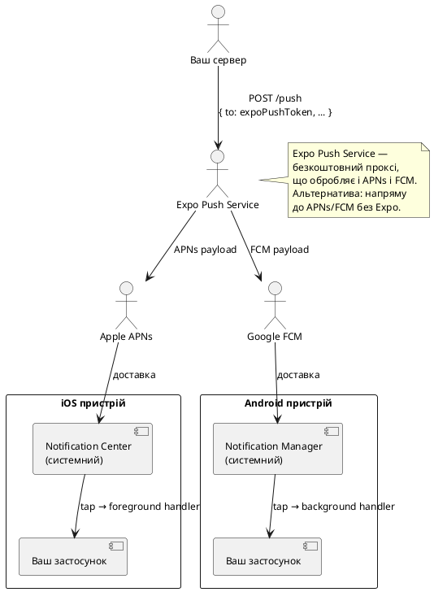
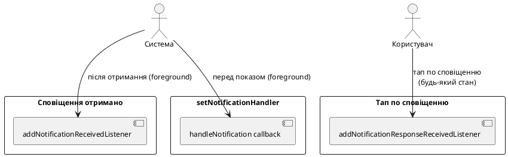
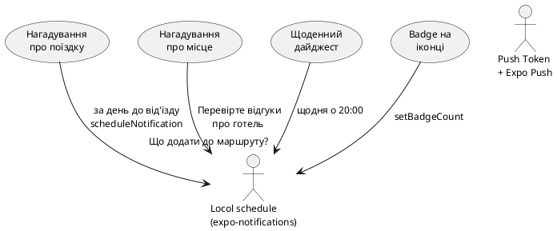

# Push і локальні сповіщення

## Відкриття: сповіщення як канал зворотного зв'язку

Уявіть: користувач зберіг нотатку з нагадуванням «поїздка до Львова — завтра о 8:00». Він закрив застосунок і ліг спати. Вранці телефон вібрує, на екрані блокування з'являється сповіщення — і одним тапом він опиняється прямо на екрані потрібної поїздки.

Це не просто зручність — це **ключовий механізм утримання користувача**. Дослідження показують, що застосунки з доречними сповіщеннями мають на 60–80% вищу щоденну активність порівняно з застосунками без них. Але «доречними» — ключове слово: спам-сповіщення в 2025 році — найшвидший спосіб отримати видалення застосунку.

У цій статті ми розберемо:
- Як влаштована система сповіщень на iOS і Android
- Відмінності між **локальними** і **push** сповіщеннями
- `expo-notifications`: дозволи, створення, планування, скасування
- **Android-канали** — обов'язкова концепція для Android 8+
- Обробку тапу по сповіщенню і навігацію до потрібного екрана
- Міні-проєкт «Нагадування через 10 с»

::note
**Що потрібно знати заздалегідь:** ця стаття передбачає знайомство з Expo Router, хуками `useState`/`useEffect`/`useRef`. Базове розуміння системи дозволів (розглянуто у розділах 21–22) також буде корисним.
::

---

## Архітектура системи сповіщень

### Локальні vs Push-сповіщення

Перш за все — фундаментальна різниця між двома типами:

::card-group

::card{title="Локальні сповіщення" icon="i-lucide-bell"}

- Генеруються **самим застосунком** на пристрої
- **Не потребують** серверу, інтернету і push-токена
- Заплановані через `scheduleNotificationAsync` або негайні через `presentNotificationAsync`
- Можуть містити кастомні `data` для навігації
- Обмежені за кількістю (iOS: до 64 запланованих одночасно)

**Приклади:** нагадування про завдання, будильник, щоденна статистика, «не забудь записати витрати».

::

::card{title="Push-сповіщення (Remote)" icon="i-lucide-send"}

- Надсилаються **з сервера** через Apple APNs або Google FCM
- Потребують **дозвіл**, **push-токен** і **бекенд**
- Доставляються навіть якщо застосунок закритий
- Можуть містити `data payload` для обробки у застосунку

**Приклади:** нове повідомлення в чаті, підтвердження замовлення, новини від підписки.

::

::

### Як працює доставка сповіщень

::plant-uml



::

### iOS: особливості системи

На iOS система сповіщень жорстко контролюється Apple:

- **Дозвіл запитується один раз** за весь термін роботи застосунку. Якщо відмовлено — лише через системні Налаштування.
- Сповіщення у **foreground** (застосунок відкритий) — **не показуються** автоматично. Треба явно обробити через `setNotificationHandler`.
- **Critical Alerts** (сигналізація, медицина) — окремий entitlement від Apple.
- **Provisional notifications** (iOS 12+) — тихі сповіщення без явного запиту дозволу (тільки в Notification Center).
- Badge (цифра на іконці) керується через `setBadgeCountAsync`.

### Android: канали і важливість

Android 8.0 (API 26) принципово змінив систему сповіщень, ввівши **канали** (Notification Channels):

- Кожне сповіщення **повинно** бути прив'язано до каналу.
- Канал визначає звук, вібрацію, пріоритет і поведінку.
- Користувач може **вимкнути конкретний канал** у налаштуваннях, не вимикаючи всі сповіщення від застосунку.
- Параметри каналу (звук, вібрація) **неможливо змінити** після першого створення — лише видалити і створити новий.

---

## Встановлення та налаштування

### Пакет та залежності

```bash
npx expo install expo-notifications expo-device
```

**`expo-device`** потрібен для перевірки фізичного пристрою: push-токени недоступні на симуляторі/емуляторі.

### Конфігурація app.json

```json [app.json]
{
  "expo": {
    "plugins": [
      [
        "expo-notifications",
        {
          "icon": "./assets/notification-icon.png",
          "color": "#3B82F6",
          "sounds": ["./assets/sounds/notification.wav"],
          "androidMode": "default",
          "androidCollapsedTitle": "#{unread_notifications} нових сповіщень",
          "iosDisplayInForeground": false
        }
      ]
    ]
  }
}
```

::field-group

::field{name="icon" type="string"}
Шлях до іконки сповіщення для Android. Рекомендований розмір: 96×96 пікселів, прозорий фон, монохромна (тільки білий і прозорий). iOS використовує іконку застосунку.
::

::field{name="color" type="string"}
Колір акценту іконки сповіщення на Android (фон за іконкою). HEX формат.
::

::field{name="sounds" type="string[]"}
Масив шляхів до кастомних звуків (`.wav`, `.mp3`, `.caf`). Потрібно для кастомних `soundName` у каналах/сповіщеннях.
::

::field{name="androidMode" type="'default' | 'collapse'"}
`'default'` — кожне сповіщення окремо. `'collapse'` — однотипні сповіщення групуються. Дефолт: `'default'`.
::

::field{name="iosDisplayInForeground" type="boolean"}
Чи показувати сповіщення коли застосунок відкритий (iOS). Якщо `false` — треба вручну через `setNotificationHandler`.
::

::

---

## Дозволи

### Запит і перевірка

```ts
import * as Notifications from 'expo-notifications';
import * as Device from 'expo-device';

async function requestNotificationPermission(): Promise<boolean> {
  // Дозволи працюють лише на фізичному пристрої
  if (!Device.isDevice) {
    console.warn('Сповіщення недоступні на симуляторі');
    return false;
  }

  const { status: existing } = await Notifications.getPermissionsAsync();

  if (existing === 'granted') return true;

  const { status } = await Notifications.requestPermissionsAsync({
    ios: {
      allowAlert: true,    // показувати банер/повний екран
      allowBadge: true,    // цифра на іконці
      allowSound: true,    // звук
      allowAnnouncements: false, // Siri Announce
    },
  });

  return status === 'granted';
}
```

### Статуси дозволів

::field-group

::field{name="'undetermined'" type="PermissionStatus"}
Користувач ще не бачив діалог. Можна запитувати через `requestPermissionsAsync`.
::

::field{name="'granted'" type="PermissionStatus"}
Дозвіл надано. Можна надсилати і планувати сповіщення.
::

::field{name="'denied'" type="PermissionStatus"}
Відмовлено. На iOS — назавжди (до ручного відновлення). Показуйте пояснення + `Linking.openSettings()`.
::

::

::caution
На iOS після відмови **неможливо** програмно показати діалог знову. Єдиний шлях — `Linking.openSettings()`. Тому важливо спочатку пояснити користувачу навіщо потрібні сповіщення (Pre-permission screen), перш ніж запитувати.
::


---

## Android Notification Channels

### Що таке канал і навіщо він потрібен

Канал (Notification Channel) — це **категорія** сповіщень зі спільними налаштуваннями. Наприклад:

- Канал «Нагадування» — звук дзвоника, висока важливість.
- Канал «Новини» — без звуку, низька важливість.
- Канал «Системні сповіщення» — без звуку, мінімальна важливість.

Користувач у налаштуваннях Android може окремо вимкнути «Новини», не чіпаючи «Нагадування». Це значно знижує відсоток повного вимкнення сповіщень.

::warning
На Android 8.0+ (API 26) сповіщення **без каналу ігноруються** — вони не покажуться навіть якщо дозвіл надано. Обов'язково створюйте канали перед першим сповіщенням.
::

### Створення каналів

```ts
import * as Notifications from 'expo-notifications';

async function setupNotificationChannels() {
  if (Platform.OS !== 'android') return; // канали тільки для Android

  // Канал для нагадувань
  await Notifications.setNotificationChannelAsync('reminders', {
    name: 'Нагадування',
    description: 'Нагадування про заплановані події та завдання',
    importance: Notifications.AndroidImportance.HIGH,
    sound: 'default',
    vibrationPattern: [0, 250, 250, 250],
    lightColor: '#3B82F6',
    lockscreenVisibility: Notifications.AndroidNotificationVisibility.PUBLIC,
    bypassDnd: false,
    enableLights: true,
    enableVibrate: true,
    showBadge: true,
  });

  // Канал для тихих оновлень
  await Notifications.setNotificationChannelAsync('updates', {
    name: 'Оновлення',
    description: 'Новини та оновлення застосунку',
    importance: Notifications.AndroidImportance.LOW,
    sound: undefined, // без звуку
    enableVibrate: false,
  });
}
```

### Параметри каналу

::field-group

::field{name="name" type="string" required}
Відображувана назва каналу у системних налаштуваннях. Пишіть зрозуміло для кінцевого користувача.
::

::field{name="description" type="string"}
Опис каналу у налаштуваннях. Допомагає користувачу вирішити які канали вимкнути.
::

::field{name="importance" type="AndroidImportance"}
Рівень важливості. Визначає де і як показується сповіщення:

- `NONE` (0) — ніколи не показується
- `MIN` (1) — лише у тіні сповіщень
- `LOW` (2) — без звуку і вібрації
- `DEFAULT` (3) — звук і вібрація
- `HIGH` (4) — банер поверх будь-якого контенту
- `MAX` (5) — повноекранне сповіщення (будильники, дзвінки)
::

::field{name="sound" type="'default' | string | undefined"}
`'default'` — системний звук. Назва файлу зі `sounds` у `app.json` для кастомного. `undefined` — без звуку.
::

::field{name="vibrationPattern" type="number[]"}
Патерн вібрації: `[пауза, вібрація, пауза, вібрація, ...]` у мілісекундах. `[0, 250, 250, 250]` — стандартний подвійний вдар.
::

::field{name="lockscreenVisibility" type="AndroidNotificationVisibility"}
Що показувати на екрані блокування: `PUBLIC` (повний вміст), `PRIVATE` (лише іконка і назва), `SECRET` (нічого).
::

::field{name="bypassDnd" type="boolean"}
Якщо `true` — сповіщення пробиває режим «Не турбувати». Тільки для критично важливих сповіщень (медицина, безпека).
::

::

::tip
Канали рекомендується створювати **одразу при запуску застосунку** — наприклад у `app/_layout.tsx` в `useEffect`. Якщо канал вже існує, повторний виклик `setNotificationChannelAsync` безпечний і нічого не перезаписує.
::

---

## Вміст сповіщення: NotificationContentInput

Кожне сповіщення — це об'єкт `NotificationContentInput` з набором полів:

::field-group

::field{name="title" type="string"}
Заголовок сповіщення. Відображається жирним шрифтом. Рекомендована довжина: до 50 символів.
::

::field{name="body" type="string"}
Тіло сповіщення. Відображається під заголовком. До 200 символів. На iOS може бути обрізане.
::

::field{name="data" type="Record<string, unknown>"}
Довільний JSON-об'єкт, що передається разом зі сповіщенням. **Не відображається** користувачу. Використовується для навігації і бізнес-логіки при тапі.
::

::field{name="sound" type="boolean | string"}
`true` або `'default'` — системний звук. Ім'я файлу — кастомний. `false` — без звуку.
::

::field{name="badge" type="number"}
Число на іконці застосунку (iOS). На Android — окремо через `setBadgeCountAsync`.
::

::field{name="subtitle" type="string (iOS only)"}
Підзаголовок між `title` і `body` (тільки iOS). Зазвичай використовується для категорії або контексту.
::

::field{name="categoryIdentifier" type="string"}
Ідентифікатор категорії для Action Buttons (кнопки в сповіщенні без відкриття застосунку). Потрібна попередня реєстрація категорії.
::

::field{name="attachments" type="NotificationAttachment[] (iOS)"}
Медіа-вкладення: зображення, відео, аудіо. Виглядає у вигляді прев'ю праворуч від тексту.
::

::field{name="color" type="string (Android)"}
Колір акценту конкретного сповіщення. Перекриває колір каналу.
::

::field{name="vibrate" type="number[] (Android)"}
Патерн вібрації для конкретного сповіщення (якщо канал дозволяє).
::

::field{name="sticky" type="boolean (Android)"}
Якщо `true` — сповіщення не можна смахнути пальцем. Залишається до явного `dismissNotificationAsync`.
::

::

---

## Локальні сповіщення: scheduleNotificationAsync

### Тригери планування

`scheduleNotificationAsync` приймає `content` і `trigger`. Тригер визначає **коли** спрацює сповіщення:

#### Негайне сповіщення

```ts
await Notifications.scheduleNotificationAsync({
  content: {
    title: '👋 Привіт!',
    body: 'Це негайне сповіщення',
    data: { screen: 'home' },
  },
  trigger: null, // null = показати негайно
});
```

#### Через певний час (секунди)

```ts
await Notifications.scheduleNotificationAsync({
  content: {
    title: '⏰ Нагадування',
    body: 'Час перевірити список справ',
    data: { screen: 'tasks', taskId: '123' },
    sound: true,
  },
  trigger: {
    seconds: 10,      // через 10 секунд
    repeats: false,   // не повторювати
  },
});
```

#### У конкретний час (Date)

```ts
const reminderDate = new Date();
reminderDate.setHours(9, 0, 0, 0); // сьогодні о 9:00
reminderDate.setDate(reminderDate.getDate() + 1); // завтра

await Notifications.scheduleNotificationAsync({
  content: {
    title: '🏔 Нагадування про поїздку',
    body: 'Карпати — завтра! Не забудь упакувати рюкзак.',
    data: { screen: 'trip', tripId: 'kyiv-lviv-2024' },
  },
  trigger: {
    date: reminderDate,
  },
});
```

#### Щоденно у фіксований час

```ts
await Notifications.scheduleNotificationAsync({
  content: {
    title: '📝 Щоденний підсумок',
    body: 'Час записати події дня',
  },
  trigger: {
    hour: 21,
    minute: 0,
    repeats: true, // щодня
  },
});
```

#### По днях тижня (щотижнево)

```ts
await Notifications.scheduleNotificationAsync({
  content: { title: '📅 Початок тижня', body: 'Плануйте нові подорожі!' },
  trigger: {
    weekday: 2,     // 1=Нд, 2=Пн, 3=Вт ... 7=Сб
    hour: 10,
    minute: 0,
    repeats: true,
  },
});
```

### Тип NotificationTriggerInput: всі варіанти

::field-group

::field{name="null" type="trigger"}
Показати **негайно** в момент виклику. Якщо застосунок у foreground — спрацьовує `setNotificationHandler`.
::

::field{name="{ seconds, repeats? }" type="TimeIntervalTriggerInput"}
Через `seconds` секунд від поточного моменту. `repeats: true` — повторювати з таким самим інтервалом.
::

::field{name="{ date }" type="DateTriggerInput"}
Спрацьовує рівно у вказаний `Date`. Якщо дата вже в минулому — сповіщення не спрацює.
::

::field{name="{ hour, minute, repeats? }" type="DailyTriggerInput"}
Щодня у конкретний час. `repeats: true` (обов'язковий для `hour`/`minute`/`weekday` тригерів).
::

::field{name="{ weekday, hour, minute, repeats? }" type="WeeklyTriggerInput"}
Щотижнево в конкретний день і час. `weekday`: 1=Неділя, 2=Понеділок, ..., 7=Субота.
::

::field{name="{ day, hour, minute, repeats? }" type="MonthlyTriggerInput (iOS only)"}
Щомісяця у конкретний день і час. Тільки iOS.
::

::field{name="{ year, month, day, hour, minute, second }" type="CalendarTriggerInput (iOS)"}
Точний момент календарного часу або повторювана дата через об'єкт `DateComponents`. Тільки iOS.
::

::field{name="channelId" type="string (Android, додатково)"}
ID каналу Android. Додається як додаткове поле до будь-якого тригера: `{ seconds: 10, channelId: 'reminders' }`.
::

::


---

## Обробка сповіщень у застосунку

### setNotificationHandler: foreground поведінка

За замовчуванням на iOS сповіщення **не відображаються**, якщо застосунок у foreground (відкритий). Щоб змінити це — налаштовуємо глобальний обробник:

```ts
import * as Notifications from 'expo-notifications';

// Налаштовуємо одразу при запуску (до будь-яких компонентів):
Notifications.setNotificationHandler({
  handleNotification: async (notification) => ({
    shouldShowAlert: true,   // показати банер
    shouldPlaySound: true,   // відтворити звук
    shouldSetBadge: false,   // не чіпати badge
    priority: Notifications.AndroidNotificationPriority.HIGH,
  }),
});
```

`handleNotification` — це **асинхронна функція**, що приймає `Notification` і повертає `NotificationBehavior`. Це дозволяє приймати рішення динамічно:

```ts
Notifications.setNotificationHandler({
  handleNotification: async (notification) => {
    const { data } = notification.request.content;

    // Сповіщення від поточного чату — не показуємо (вже бачимо)
    if (data?.chatId === currentOpenChatId) {
      return {
        shouldShowAlert: false,
        shouldPlaySound: false,
        shouldSetBadge: true,
      };
    }

    return {
      shouldShowAlert: true,
      shouldPlaySound: true,
      shouldSetBadge: true,
    };
  },
});
```

### Три типи обробників (listeners)

RNGH надає три різних слухачі для різних сценаріїв:

::plant-uml



::

#### addNotificationReceivedListener

Викликається **коли сповіщення надійшло** у foreground-стані застосунку (але не при тапі):

```ts
useEffect(() => {
  const subscription = Notifications.addNotificationReceivedListener((notification) => {
    console.log('Сповіщення отримано:', notification.request.content);
    // Наприклад: оновити лічильник непрочитаних у стейті
    setUnreadCount((c) => c + 1);
  });

  return () => subscription.remove();
}, []);
```

#### addNotificationResponseReceivedListener

Викликається **при тапі** по сповіщенню — незалежно від стану застосунку (foreground, background, killed):

```ts
useEffect(() => {
  const subscription = Notifications.addNotificationResponseReceivedListener((response) => {
    const { data } = response.notification.request.content;

    // Навігація на потрібний екран:
    if (data?.screen === 'trip') {
      router.push(`/trips/${data.tripId}`);
    } else if (data?.screen === 'tasks') {
      router.push('/tasks');
    }
  });

  return () => subscription.remove();
}, []);
```

::note
Ці два слухачі важливо **видаляти** при розмонтуванні компонента через `subscription.remove()` у функції cleanup з `useEffect`. Інакше при повторному монтуванні накопичуються дубльовані підписки.
::

---

## Навігація при тапі по сповіщенню

### Складність: застосунок міг бути закритий

Тап по сповіщенню — найскладніший сценарій, бо може відбутись коли застосунок:

1. **У foreground** — просто обробляємо в listener.
2. **У background** — застосунок відновлюється, listener спрацьовує.
3. **Повністю закритий (killed)** — застосунок запускається з нуля, і `addNotificationResponseReceivedListener` **не встигне зареєструватись** до першого спрацювання.

Для третього сценарію використовується `getLastNotificationResponseAsync`:

```ts
// Перевіряємо початкове сповіщення при запуску застосунку:
useEffect(() => {
  Notifications.getLastNotificationResponseAsync().then((response) => {
    if (!response) return;

    const { data } = response.notification.request.content;
    // Обробляємо так само, як у listener
    handleNotificationNavigation(data);
  });
}, []); // виконується один раз при монтуванні
```

### Повна схема обробки в _layout.tsx

Найчистіший підхід — централізувати всю логіку сповіщень у кореневому layout:

```tsx
// app/_layout.tsx
import { useEffect, useRef } from 'react';
import { useRouter } from 'expo-router';
import * as Notifications from 'expo-notifications';
import { Platform } from 'react-native';

// Конфігуруємо foreground поведінку одразу (поза компонентом):
Notifications.setNotificationHandler({
  handleNotification: async () => ({
    shouldShowAlert: true,
    shouldPlaySound: true,
    shouldSetBadge: true,
  }),
});

export default function RootLayout() {
  const router = useRouter();
  const notificationListener = useRef<Notifications.Subscription>();
  const responseListener = useRef<Notifications.Subscription>();

  // Функція навігації за даними сповіщення
  const handleNotificationData = (data: Record<string, unknown> | undefined) => {
    if (!data) return;

    switch (data.screen) {
      case 'trip':
        router.push(`/trips/${data.tripId}`);
        break;
      case 'reminder':
        router.push('/reminders');
        break;
      case 'chat':
        router.push(`/chats/${data.chatId}`);
        break;
    }
  };

  useEffect(() => {
    // Створюємо канали для Android
    if (Platform.OS === 'android') {
      Notifications.setNotificationChannelAsync('reminders', {
        name: 'Нагадування',
        importance: Notifications.AndroidImportance.HIGH,
        sound: 'default',
        vibrationPattern: [0, 250, 250, 250],
      });
    }

    // Обробка сповіщення при запуску із closed стану:
    Notifications.getLastNotificationResponseAsync().then((response) => {
      if (response?.notification.request.content.data) {
        // Невелика затримка — чекаємо поки навігатор ініціалізується
        setTimeout(() => {
          handleNotificationData(response.notification.request.content.data);
        }, 500);
      }
    });

    // Listener: отримано сповіщення у foreground
    notificationListener.current = Notifications.addNotificationReceivedListener(
      (notification) => {
        console.log('Received:', notification.request.identifier);
      }
    );

    // Listener: тап по сповіщенню
    responseListener.current = Notifications.addNotificationResponseReceivedListener(
      (response) => {
        handleNotificationData(response.notification.request.content.data);
      }
    );

    return () => {
      notificationListener.current?.remove();
      responseListener.current?.remove();
    };
  }, []);

  return (
    // ... решта layout
  );
}
```

### Action Buttons: дії без відкриття застосунку

iOS і Android дозволяють додати кнопки прямо у сповіщення (без відкриття застосунку). На iOS це називається **Notification Actions**, на Android — вони доступні через `channelId` і `categoryIdentifier`:

```ts
// Реєструємо категорію з кнопками (iOS):
await Notifications.setNotificationCategoryAsync('reminder', [
  {
    identifier: 'snooze',
    buttonTitle: 'Відкласти на 5 хв',
    options: { opensAppToForeground: false }, // без відкриття застосунку
  },
  {
    identifier: 'done',
    buttonTitle: '✅ Виконано',
    options: { opensAppToForeground: false, isDestructive: false },
  },
  {
    identifier: 'open',
    buttonTitle: 'Відкрити',
    options: { opensAppToForeground: true },
  },
]);

// Планування сповіщення з категорією:
await Notifications.scheduleNotificationAsync({
  content: {
    title: '⏰ Нагадування',
    body: 'Час упакувати рюкзак для Карпат',
    categoryIdentifier: 'reminder', // ← прив'язуємо категорію
    data: { type: 'reminder', id: '42' },
  },
  trigger: { seconds: 10 },
});
```

У `addNotificationResponseReceivedListener` отримуємо яку кнопку натиснули:

```ts
Notifications.addNotificationResponseReceivedListener((response) => {
  const actionId = response.actionIdentifier;
  // actionId === 'snooze', 'done', 'open' або
  // Notifications.DEFAULT_ACTION_IDENTIFIER (тап на само сповіщення)

  if (actionId === 'snooze') {
    // Плануємо ще одне сповіщення через 5 хвилин
    scheduleReminder(response.notification.request.content.data.id, 300);
  } else if (actionId === 'done') {
    // Позначаємо як виконане без відкриття застосунку
    markAsDone(response.notification.request.content.data.id);
  }
});
```


---

## Управління запланованими сповіщеннями

### Отримання списку запланованих

```ts
// Всі заплановані сповіщення:
const scheduled = await Notifications.getAllScheduledNotificationsAsync();
scheduled.forEach((n) => {
  console.log(n.identifier, n.content.title, n.trigger);
});
```

### Скасування сповіщень

```ts
// Скасувати конкретне (за identifier):
await Notifications.cancelScheduledNotificationAsync(notificationId);

// Скасувати всі заплановані:
await Notifications.cancelAllScheduledNotificationsAsync();

// Відхилити показане сповіщення (прибрати з tray):
await Notifications.dismissNotificationAsync(notificationId);

// Відхилити всі показані:
await Notifications.dismissAllNotificationsAsync();
```

### Badge — цифра на іконці

```ts
// Встановити badge:
await Notifications.setBadgeCountAsync(5);

// Скинути badge:
await Notifications.setBadgeCountAsync(0);

// Прочитати поточний badge:
const count = await Notifications.getBadgeCountAsync();
```

::note
На **Android 8+** badge автоматично оновлюється при отриманні сповіщення і скидається при відкритті застосунку — залежно від launcher. На деяких Android launcher-ах (Samsung) badge працює коректно, на AOSP — може не підтримуватись.
::

### Хук useNotifications: зводимо логіку разом

```ts
// hooks/useNotifications.ts
import { useState, useEffect, useCallback } from 'react';
import * as Notifications from 'expo-notifications';
import * as Device from 'expo-device';
import { Platform } from 'react-native';

interface UseNotificationsReturn {
  permissionGranted: boolean;
  requestPermission: () => Promise<boolean>;
  scheduleReminder: (title: string, body: string, seconds: number, data?: object) => Promise<string>;
  cancelReminder: (id: string) => Promise<void>;
  cancelAll: () => Promise<void>;
  scheduledCount: number;
  refreshScheduled: () => Promise<void>;
}

export function useNotifications(): UseNotificationsReturn {
  const [permissionGranted, setPermissionGranted] = useState(false);
  const [scheduledCount, setScheduledCount] = useState(0);

  useEffect(() => {
    // Перевірка дозволу при монтуванні
    Notifications.getPermissionsAsync().then(({ status }) => {
      setPermissionGranted(status === 'granted');
    });

    // Рахуємо заплановані
    refreshScheduled();
  }, []);

  const refreshScheduled = useCallback(async () => {
    const list = await Notifications.getAllScheduledNotificationsAsync();
    setScheduledCount(list.length);
  }, []);

  const requestPermission = useCallback(async () => {
    if (!Device.isDevice) return false;

    const { status } = await Notifications.requestPermissionsAsync({
      ios: { allowAlert: true, allowBadge: true, allowSound: true },
    });
    const granted = status === 'granted';
    setPermissionGranted(granted);
    return granted;
  }, []);

  const scheduleReminder = useCallback(async (
    title: string,
    body: string,
    seconds: number,
    data: object = {}
  ): Promise<string> => {
    const id = await Notifications.scheduleNotificationAsync({
      content: { title, body, data, sound: true },
      trigger: {
        seconds,
        channelId: Platform.OS === 'android' ? 'reminders' : undefined,
      } as any,
    });
    await refreshScheduled();
    return id;
  }, [refreshScheduled]);

  const cancelReminder = useCallback(async (id: string) => {
    await Notifications.cancelScheduledNotificationAsync(id);
    await refreshScheduled();
  }, [refreshScheduled]);

  const cancelAll = useCallback(async () => {
    await Notifications.cancelAllScheduledNotificationsAsync();
    setScheduledCount(0);
  }, []);

  return {
    permissionGranted,
    requestPermission,
    scheduleReminder,
    cancelReminder,
    cancelAll,
    scheduledCount,
    refreshScheduled,
  };
}
```

---

## Push-сповіщення: огляд

### Схема роботи Expo Push Service

Для push-сповіщень потрібні три компоненти: **Expo Push Token**, **бекенд** і **APNs/FCM** інфраструктура. Expo надає зручний проксі-сервіс, що абстрагує відмінності між iOS і Android:

```ts
// Отримати push token (тільки на фізичному пристрої):
import Constants from 'expo-constants';

async function getExpoPushToken(): Promise<string | null> {
  if (!Device.isDevice) return null;

  const { status } = await Notifications.getPermissionsAsync();
  if (status !== 'granted') return null;

  const token = await Notifications.getExpoPushTokenAsync({
    projectId: Constants.expoConfig?.extra?.eas?.projectId,
  });

  return token.data; // "ExponentPushToken[xxxxxxxxxxxxxxxxxxxxxxxxxx]"
}
```

### Що відбувається з токеном далі

::steps

### Клієнт отримує токен

Застосунок викликає `getExpoPushTokenAsync` і отримує рядок виду `ExponentPushToken[xxx...]`.

### Токен надсилається на бекенд

Після авторизації користувача — токен зберігається у базі даних: `users.push_token = token`.

### Бекенд надсилає push

При потребі (нове повідомлення, нагадування з сервера) бекенд робить HTTP POST на Expo Push API:

```json
POST https://exp.host/--/api/v2/push/send
{
  "to": "ExponentPushToken[xxx...]",
  "title": "Нове повідомлення",
  "body": "Олег написав вам",
  "data": { "screen": "chat", "chatId": "42" },
  "sound": "default"
}
```

### Expo перенаправляє до APNs / FCM

Expo автоматично обирає правильний канал залежно від пристрою і надсилає на Apple або Google.

### Пристрій отримує сповіщення

Далі — та сама логіка що й для локальних: `setNotificationHandler`, listeners, навігація.

::

::note
**Для production:** Expo Push Service зручний на старті, але має ліміти (до 600 req/сек для безкоштовного). Великі застосунки переходять на пряму інтеграцію з APNs HTTP/2 і Firebase Admin SDK. Але для курсового проєкту і MVP — Expo Push Service ідеальний.
::

### Обробка помилок доставки

Expo Push API повертає масив результатів з можливими помилками:

```ts
// Типові помилки у відповіді:
// { status: 'error', message: 'DeviceNotRegistered' }
// { status: 'error', message: 'InvalidCredentials' }
// { status: 'ok', id: 'xxxxx' }
```

При `DeviceNotRegistered` — токен більше недійсний (застосунок видалено або переінстальовано). Бекенд повинен видаляти такі токени з бази.


---

## Міні-проєкт: «Нагадування через 10 с»

### Що будуємо

Екран планування нагадування, що:

1. Запитує дозвіл при першому відкритті.
2. Дозволяє ввести текст нагадування.
3. Натискання «Нагадати через 10 с» — планує локальне сповіщення.
4. Показує список активних нагадувань з можливістю скасувати.
5. При тапі по сповіщенню — відкриває екран нагадувань.
6. Badge на іконці показує кількість непрочитаних нагадувань.

### Структура файлів

::code-tree

```tsx [app/_layout.tsx]
// setNotificationHandler + listeners + навігація при тапі
```

```tsx [app/(tabs)/reminders.tsx]
// Головний екран нагадувань
```

```tsx [hooks/useNotifications.ts]
// Хук управління сповіщеннями
```

```tsx [components/reminders/ReminderForm.tsx]
// Форма додавання нагадування
```

```tsx [components/reminders/ReminderList.tsx]
// Список активних нагадувань з cancel
```

```tsx [components/reminders/PermissionPrompt.tsx]
// Pre-permission screen
```

::

### UI форми нагадування

::react-native-preview{title="Форма нагадування" device="iphone" height="500"}

```tsx
import { useState } from 'react';
import { View, Text, TextInput, Pressable, StyleSheet, ScrollView } from 'react-native';

const QUICK_DELAYS = [
  { label: '10 сек', seconds: 10 },
  { label: '1 хв', seconds: 60 },
  { label: '5 хв', seconds: 300 },
  { label: '1 год', seconds: 3600 },
];

export default function App() {
  const [text, setText] = useState('');
  const [selected, setSelected] = useState(0);
  const [reminders, setReminders] = useState<string[]>([]);

  const schedule = () => {
    if (!text.trim()) return;
    const label = `⏰ ${text} (через ${QUICK_DELAYS[selected].label})`;
    setReminders((r) => [label, ...r]);
    setText('');
  };

  return (
    <ScrollView style={styles.container} contentContainerStyle={styles.content}>
      <Text style={styles.title}>🔔 Нагадування</Text>

      <View style={styles.card}>
        <Text style={styles.label}>Текст нагадування</Text>
        <TextInput
          style={styles.input}
          value={text}
          onChangeText={setText}
          placeholder="Наприклад: Перевірити квитки..."
          placeholderTextColor="#94A3B8"
          multiline
        />

        <Text style={styles.label}>Час затримки</Text>
        <View style={styles.chips}>
          {QUICK_DELAYS.map((d, i) => (
            <Pressable
              key={d.label}
              onPress={() => setSelected(i)}
              style={[styles.chip, i === selected && styles.chipActive]}
            >
              <Text style={[styles.chipText, i === selected && styles.chipTextActive]}>
                {d.label}
              </Text>
            </Pressable>
          ))}
        </View>

        <Pressable
          style={({ pressed }) => [styles.btn, !text && styles.btnDisabled, pressed && styles.btnPressed]}
          onPress={schedule}
          disabled={!text.trim()}
        >
          <Text style={styles.btnText}>Нагадати через {QUICK_DELAYS[selected].label}</Text>
        </Pressable>
      </View>

      {reminders.length > 0 && (
        <View style={styles.card}>
          <Text style={styles.label}>Активні ({reminders.length})</Text>
          {reminders.map((r, i) => (
            <View key={i} style={styles.reminder}>
              <Text style={styles.reminderText}>{r}</Text>
              <Pressable onPress={() => setReminders((list) => list.filter((_, j) => j !== i))}>
                <Text style={styles.cancel}>✕</Text>
              </Pressable>
            </View>
          ))}
        </View>
      )}
    </ScrollView>
  );
}

const styles = StyleSheet.create({
  container: { flex: 1, backgroundColor: '#F8FAFC' },
  content: { padding: 16, gap: 16, paddingBottom: 40 },
  title: { fontSize: 24, fontWeight: '800', color: '#1E293B' },
  card: { backgroundColor: 'white', borderRadius: 20, padding: 18, gap: 12, shadowColor: '#000', shadowOpacity: 0.06, shadowRadius: 10, elevation: 3 },
  label: { fontSize: 13, fontWeight: '700', color: '#64748B', textTransform: 'uppercase', letterSpacing: 0.5 },
  input: { borderWidth: 1.5, borderColor: '#E2E8F0', borderRadius: 12, padding: 14, fontSize: 15, color: '#1E293B', minHeight: 80, textAlignVertical: 'top' },
  chips: { flexDirection: 'row', gap: 8, flexWrap: 'wrap' },
  chip: { paddingHorizontal: 14, paddingVertical: 8, borderRadius: 20, backgroundColor: '#F1F5F9', borderWidth: 1.5, borderColor: 'transparent' },
  chipActive: { backgroundColor: '#EFF6FF', borderColor: '#3B82F6' },
  chipText: { fontSize: 14, color: '#64748B', fontWeight: '600' },
  chipTextActive: { color: '#3B82F6' },
  btn: { backgroundColor: '#3B82F6', borderRadius: 14, paddingVertical: 16, alignItems: 'center' },
  btnDisabled: { backgroundColor: '#CBD5E1' },
  btnPressed: { backgroundColor: '#2563EB' },
  btnText: { color: 'white', fontSize: 16, fontWeight: '700' },
  reminder: { flexDirection: 'row', alignItems: 'center', gap: 8, paddingVertical: 8, borderBottomWidth: 1, borderColor: '#F1F5F9' },
  reminderText: { flex: 1, fontSize: 14, color: '#374151' },
  cancel: { fontSize: 16, color: '#94A3B8', padding: 4 },
});
```

::

### Повна реалізація: головний екран

```tsx
// app/(tabs)/reminders.tsx
import { useState, useEffect, useCallback } from 'react';
import {
  View, Text, TextInput, Pressable, FlatList,
  SafeAreaView, StyleSheet, Platform, Alert,
} from 'react-native';
import * as Notifications from 'expo-notifications';
import { useNotifications } from '@/hooks/useNotifications';
import { PermissionPrompt } from '@/components/reminders/PermissionPrompt';

interface Reminder {
  id: string;
  title: string;
  scheduledAt: Date;
}

const DELAYS = [
  { label: '10 с', seconds: 10 },
  { label: '1 хв', seconds: 60 },
  { label: '5 хв', seconds: 300 },
  { label: '30 хв', seconds: 1800 },
  { label: '1 год', seconds: 3600 },
];

export default function RemindersScreen() {
  const [text, setText] = useState('');
  const [delayIndex, setDelayIndex] = useState(0);
  const [reminders, setReminders] = useState<Reminder[]>([]);

  const {
    permissionGranted,
    requestPermission,
    scheduleReminder,
    cancelReminder,
    refreshScheduled,
  } = useNotifications();

  // Завантажуємо вже заплановані сповіщення при відкритті
  useEffect(() => {
    loadScheduled();
  }, []);

  const loadScheduled = async () => {
    const scheduled = await Notifications.getAllScheduledNotificationsAsync();
    setReminders(
      scheduled.map((n) => ({
        id: n.identifier,
        title: n.content.title ?? 'Нагадування',
        scheduledAt: new Date(), // спрощено; в реальності зберігайте в AsyncStorage
      }))
    );
  };

  const handleSchedule = async () => {
    if (!text.trim()) return;

    const delay = DELAYS[delayIndex];
    const id = await scheduleReminder(
      '⏰ Нагадування',
      text.trim(),
      delay.seconds,
      { screen: 'reminders' }
    );

    setReminders((prev) => [
      { id, title: text.trim(), scheduledAt: new Date() },
      ...prev,
    ]);
    setText('');

    // Оновлюємо badge
    await Notifications.setBadgeCountAsync(reminders.length + 1);
  };

  const handleCancel = async (id: string) => {
    await cancelReminder(id);
    setReminders((prev) => prev.filter((r) => r.id !== id));
    await Notifications.setBadgeCountAsync(Math.max(0, reminders.length - 1));
  };

  if (!permissionGranted) {
    return <PermissionPrompt onRequest={requestPermission} />;
  }

  return (
    <SafeAreaView style={styles.container}>
      {/* Форма */}
      <View style={styles.form}>
        <TextInput
          style={styles.input}
          value={text}
          onChangeText={setText}
          placeholder="Текст нагадування..."
          placeholderTextColor="#94A3B8"
        />
        <View style={styles.delays}>
          {DELAYS.map((d, i) => (
            <Pressable
              key={d.label}
              onPress={() => setDelayIndex(i)}
              style={[styles.chip, i === delayIndex && styles.chipActive]}
            >
              <Text style={[styles.chipText, i === delayIndex && styles.chipTextActive]}>
                {d.label}
              </Text>
            </Pressable>
          ))}
        </View>
        <Pressable
          style={[styles.btn, !text.trim() && styles.btnDisabled]}
          onPress={handleSchedule}
          disabled={!text.trim()}
        >
          <Text style={styles.btnText}>
            Нагадати через {DELAYS[delayIndex].label}
          </Text>
        </Pressable>
      </View>

      {/* Список */}
      <FlatList
        data={reminders}
        keyExtractor={(item) => item.id}
        renderItem={({ item }) => (
          <View style={styles.row}>
            <View style={styles.rowContent}>
              <Text style={styles.rowTitle}>{item.title}</Text>
            </View>
            <Pressable onPress={() => handleCancel(item.id)} style={styles.cancelBtn}>
              <Text style={styles.cancelText}>Скасувати</Text>
            </Pressable>
          </View>
        )}
        ListEmptyComponent={
          <Text style={styles.empty}>Немає активних нагадувань</Text>
        }
      />
    </SafeAreaView>
  );
}
```


---

## Підключення до Nomad: feat: local reminder notifications

У Nomad сповіщення виникають природно у кількох сценаріях:

::plant-uml



::

### Рекомендовані сповіщення для Nomad

::card-group

::card{title="За день до поїздки" icon="i-lucide-calendar-check"}

При збереженні поїздки з датою від'їзду — автоматично планується нагадування на день до:

```ts
const tripDate = new Date(trip.departureDate);
tripDate.setDate(tripDate.getDate() - 1);
tripDate.setHours(9, 0, 0, 0);

await scheduleNotificationAsync({
  content: {
    title: `🚂 Завтра — ${trip.name}!`,
    body: 'Перевірте список речей та квитки.',
    data: { screen: 'trip', tripId: trip.id },
  },
  trigger: { date: tripDate },
});
```

::

::card{title="Нагадування про місце" icon="i-lucide-map-pin"}

Користувач додає місце до поїздки і встановлює час відвідування — система планує нагадування:

```ts
// «Завтра о 14:00 заплановано Оперний театр у Львові»
await scheduleNotificationAsync({
  content: {
    title: `📍 Сьогодні: ${place.name}`,
    body: `Заплановано о ${time}. Натисніть для деталей.`,
    data: { screen: 'place', placeId: place.id },
    categoryIdentifier: 'place_visit',
  },
  trigger: { date: placeDate },
});
```

::

::

---

## Тестування сповіщень

### На симуляторі/емуляторі

Push-токени і реальні push-сповіщення **не працюють** на симуляторі. Але локальні сповіщення — так. Для перевірки в симуляторі iOS можна симулювати push через CLI:

```bash
# iOS симулятор: симулювати push (потребує Xcode CLI tools)
xcrun simctl push booted com.yourapp.bundleid push_payload.json
```

Де `push_payload.json`:
```json
{
  "aps": {
    "alert": {
      "title": "Тест",
      "body": "Сповіщення з симулятора"
    },
    "badge": 1,
    "sound": "default"
  }
}
```

### Expo Push Tool

Для тестування реальних push-сповіщень — використовуйте [Expo Push Notifications Tool](https://expo.dev/notifications):

1. Запустіть застосунок на **фізичному пристрої**.
2. Отримайте `expoPushToken` (виведіть у консоль).
3. Вставте токен у Expo Push Tool і надішліть тестове повідомлення.

### Перевірка стану

```ts
// Отримати всі заплановані:
const list = await Notifications.getAllScheduledNotificationsAsync();
console.log(`Запланованих: ${list.length}`);
list.forEach(n => console.log(n.identifier, n.content.title));

// Отримати поточні показані:
const presented = await Notifications.getPresentedNotificationsAsync();
console.log(`Показаних: ${presented.length}`);
```

---

## Поширені помилки

::accordion
::accordion-item{label="Сповіщення не показуються у foreground на iOS" icon="i-lucide-circle-alert"}
За замовчуванням iOS не показує сповіщення коли застосунок відкритий. Додайте `Notifications.setNotificationHandler({ handleNotification: async () => ({ shouldShowAlert: true, shouldPlaySound: true, shouldSetBadge: false }) })` у корені застосунку **поза** компонентом.
::
::accordion-item{label="Android: сповіщення ігноруються без каналу" icon="i-lucide-circle-alert"}
На Android 8+ кожне сповіщення повинно мати `channelId`. Без нього — мовчки ігнорується. Додайте `channelId: 'reminders'` до тригера і переконайтесь що канал створено через `setNotificationChannelAsync`.
::
::accordion-item{label="getLastNotificationResponseAsync повертає старий response" icon="i-lucide-circle-alert"}
Після обробки першого запуску `getLastNotificationResponseAsync` продовжує повертати той самий response при наступних запусках. Зберігайте `response.notification.request.identifier` у `useRef` або AsyncStorage і порівнюйте, щоб не обробляти один і той самий response двічі.
::
::accordion-item{label="Тригер з датою у минулому — сповіщення не спрацьовує" icon="i-lucide-circle-alert"}
`scheduleNotificationAsync` з `trigger: { date: pastDate }` — мовчки ігнорується без помилки. Завжди перевіряйте що дата у майбутньому перед плануванням.
::
::accordion-item{label="Listener не прибирається → витік" icon="i-lucide-circle-alert"}
`addNotificationReceivedListener` і `addNotificationResponseReceivedListener` повертають `Subscription`. Обов'язково викликайте `subscription.remove()` у `return () => ...` з `useEffect`. Без цього при кожному ре-монтуванні компонента накопичуються дублюючі підписки.
::
::accordion-item{label="Push token недоступний на симуляторі" icon="i-lucide-circle-alert"}
`getExpoPushTokenAsync()` кидає помилку на симуляторі. Завжди обгортайте в `if (Device.isDevice)` перевірку. Для локальних сповіщень push token не потрібен взагалі.
::
::

---

## Підсумок

::card-group

::card{title="Локальні vs Push" icon="i-lucide-bell"}

- **Локальні** — no server, `scheduleNotificationAsync`, `trigger: { seconds, date, hour/minute }`
- **Push** — APNs/FCM через Expo, потрібен токен і бекенд
- Обидва обробляються однаково через listeners

::

::card{title="Android Channels" icon="i-simple-icons-android"}

- Обов'язкові для Android 8+
- `setNotificationChannelAsync` при запуску
- `importance`, `sound`, `vibrationPattern`
- Параметри незмінні після першого створення

::

::card{title="Foreground і навігація" icon="i-lucide-navigation"}

- `setNotificationHandler` керує foreground-поведінкою
- `addNotificationResponseReceivedListener` — тап
- `getLastNotificationResponseAsync` — cold start
- `router.push()` для переходу на потрібний екран

::

::card{title="Управління" icon="i-lucide-settings"}

- `cancelScheduledNotificationAsync` / `cancelAllScheduledNotificationsAsync`
- `getAllScheduledNotificationsAsync` для відображення черги
- `setBadgeCountAsync` для badge на іконці
- `dismissNotificationAsync` для прибирання з tray

::

::

::tip
**Наступний крок:** правильно реалізовані сповіщення — лише половина доступності. У наступному розділі ми розберемо **Accessibility**: `accessibilityLabel`, `role`, touch targets і dynamic type. Це особливо важливо у поєднанні зі сповіщеннями — VoiceOver і TalkBack читають сповіщення вголос, тому `title` і `body` повинні бути зрозумілими поза візуальним контекстом.
::

