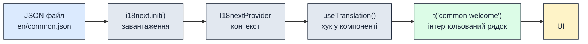
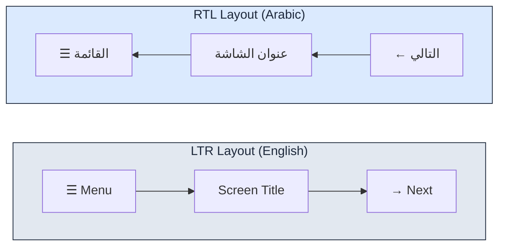
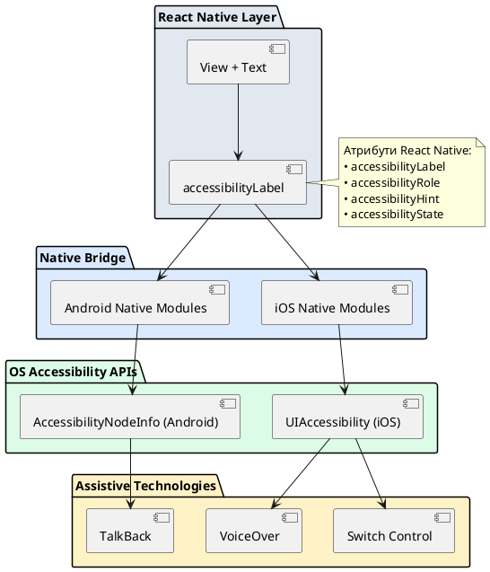
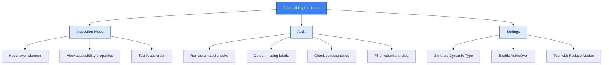

## Вступ: культурний контекст та інклюзивність у мобільних застосунках

Мобільні додатки перебувають на перетині двох фундаментальних векторів цифрової інклюзивності: **інтернаціоналізації (*internationalization, i18n*)** — технічної адаптації продукту до мовно-культурних особливостей різних регіонів світу, та **доступності (*accessibility, a11y*)** — архітектурного забезпечення рівного доступу до функціональності для всіх категорій користувачів незалежно від сенсорних або когнітивних обмежень.

На відміну від веб-середовища, де браузер надає вбудовану підтримку доступності через єдиний інтерфейс **Web Accessibility API (ARIA)**, мобільні застосунки безпосередньо інтегруються з нативними фреймворками операційних систем: **VoiceOver (iOS)**, **TalkBack (Android)**, **Dynamic Type** (адаптивна типографіка), **Reduce Motion** (зниження анімацій) та висококонтрастні режими.

Коректна реалізація інтернаціоналізації та доступності — це не опційна функціональність чи поліпшення для «нішової аудиторії». Це **архітектурна вимога першого класу**, закладена в міжнародні стандарти проєктування (**WCAG 2.1 / 2.2**), законодавство США (**ADA Section 508**), Європейського Союзу (**European Accessibility Act**) та вимоги платформ-дистриб'юторів (**Apple App Store Review Guidelines** пункт 4.2.1, **Google Play Accessibility Requirements**).

### Мета лекції

::card-group

::card{title="🌍 Інтернаціоналізація (i18n)" icon="i-lucide-globe"}

- Розібрати архітектурні відмінності між статичним переведенням компіляційного часу (*Compile-Time Translation*) та динамічним завантаженням локалі (*Runtime Locale Switching*).
- Зрозуміти структуру бібліотеки **react-i18next**: сепарація перекладів через *namespaces*, інтерполяція змінних, плюралізація (*plurals*), форматування дат/чисел через `Intl API` та адаптація до мов із зворотним письмом (*Right-to-Left, RTL*).
- Побудувати масштабовану систему перекладів із відокремленням рядків локалізації від бізнес-логіки.

::

::card{title="♿ Доступність (a11y)" icon="i-lucide-accessibility"}

- Навчитися інтегрувати застосунок із системними асистивними технологіями: **Screen Readers** (читачі екрану), **Switch Control** (керування перемикачами), **Voice Control** (голосове управління) через атрибути `accessibilityLabel`, `accessibilityRole`, `accessibilityHint` та `accessibilityState`.
- Зрозуміти принципи семантичної доступності: **Perceivable** (сприйнятність), **Operable** (керованість), **Understandable** (зрозумілість) та **Robust** (надійність).
- Реалізувати підтримку динамічних розмірів шрифту (*Dynamic Font Scaling*) через підписку на `UIContentSizeCategory` (iOS) та зовнішні налаштування (**Settings → Display → Font Size**).
- Налаштувати контрастність інтерфейсу згідно стандарту **WCAG AA (4.5:1 для звичайного тексту, 3:1 для великого заголовка)** та адаптувати застосунок до режиму **High Contrast Mode**.

::

::

---

## Частина I: Інтернаціоналізація (i18n) у React Native

### Архітектура i18n: компіляційний час проти динамічної локалізації

Інтернаціоналізація ділиться на два фундаментально різні підходи реалізації:

1. **Статична локалізація (Compile-Time i18n):** рядки різними мовами представлені окремими вихідними файлами (`strings.xml` для Android, `Localizable.strings` для iOS), які компілюються безпосередньо в бінарний артефакт застосунку. Кожна підтримувана мова збільшує розмір `.apk` або `.ipa`. Перемикання локалі вимагає перезапуску застосунку через зміну системних налаштувань операційної системи.

2. **Динамічна локалізація (Runtime i18n):** переклади зберігаються у форматах даних (`JSON`, `YAML`, `gettext .po`), завантажуються в оперативну пам'ять під час виконання (*at runtime*) і можуть перемикатися без перезавантаження застосунку. Застосунок містить лише стандартну систему завантаження перекладів, а самі мовні пакети можуть оновлюватися незалежно через **Over-The-Air Updates (OTA)** або дозавантажуватися з CDN для рідкісних мов.

React Native екосистема спирається на другий підхід через бібліотеку **`react-i18next`** — офіційну React-інтеграцію для фреймворку `i18next`, що є галузевим стандартом динамічної локалізації в JavaScript-середовищі.

::note
Бібліотека `i18next` не є специфічною для React Native — вона використовується у веб-додатках (через `react-i18next`), серверних застосунках Node.js, та навіть у нативних iOS/Android проєктах через відповідні адаптери. Підтримка обмежена полівером `Intl API` у версії JavaScriptCore (iOS 10+, Android через `jsc-android` >= 250230).
::

### Концептуальна модель `react-i18next`

Бібліотека базується на трьох базових сутностях:

```
+-------------------------------------------------------------------+
|                       АРХІТЕКТУРА react-i18next                   |
+-------------------------------------------------------------------+
|  i18next.init()          |  Ініціалізація системи перекладів.    |
|  (Configuration Layer)   |  Конфігурація мов, namespaces,        |
|                          |  fallback, інтерполяції, плюралізації.|
+-------------------------------------------------------------------+
|  Backend Plugin          |  Джерело завантаження перекладів:      |
|  (Data Loading Layer)    |  статичний import, локальна FS,       |
|                          |  або віддалений HTTP ендпоінт.        |
+-------------------------------------------------------------------+
|  React Hook: useTranslation() | Доступ до функції `t()` у       |
|  (Presentation Layer)    |  компонентах через хук.               |
+-------------------------------------------------------------------+
```

**Шлях рядка локалізації від файлу до інтерфейсу:**

::mermaid



::

### Встановлення та базова конфігурація

Бібліотека складається з двох пакетів: базовий `i18next` (логіка перекладів) та React-адаптер `react-i18next`.

::tabs
::tabs-item{label="Expo"}

```bash
npx expo install i18next react-i18next
```

::
::tabs-item{label="npm"}

```bash
npm install i18next react-i18next
```

::
::tabs-item{label="yarn"}

```bash
yarn add i18next react-i18next
```

::
::

**Структура проєкту з перекладами:**

::code-tree

```bash [locales/en/common.json]
{
  "welcome": "Welcome to the App",
  "logout": "Log out"
}
```

```bash [locales/uk/common.json]
{
  "welcome": "Ласкаво просимо до застосунку",
  "logout": "Вийти"
}
```

```typescript [i18n/config.ts]
import i18next from 'i18next';
import { initReactI18next } from 'react-i18next';

// Статичний імпорт JSON файлів перекладів
import enCommon from '../locales/en/common.json';
import ukCommon from '../locales/uk/common.json';

i18next
  .use(initReactI18next) // Інтеграція з React
  .init({
    compatibilityJSON: 'v3', // Підтримка формату v3 для React Native
    lng: 'en', // Мова за замовчуванням
    fallbackLng: 'en', // Резервна мова при відсутності перекладу
    resources: {
      en: { common: enCommon },
      uk: { common: ukCommon },
    },
    interpolation: {
      escapeValue: false, // React автоматично екранує XSS
    },
  });

export default i18next;
```

```typescript [App.tsx]
import './i18n/config'; // Виконує ініціалізацію при запуску
import { useTranslation } from 'react-i18next';
import { View, Text, Pressable } from 'react-native';

export default function App() {
  const { t, i18n } = useTranslation('common');

  return (
    <View style={{ padding: 20 }}>
      <Text style={{ fontSize: 20 }}>{t('welcome')}</Text>
      <Pressable onPress={() => i18n.changeLanguage('uk')}>
        <Text>Українська</Text>
      </Pressable>
      <Pressable onPress={() => i18n.changeLanguage('en')}>
        <Text>English</Text>
      </Pressable>
    </View>
  );
}
```

::

::tip
Параметр `compatibilityJSON: 'v3'` є критичним для React Native. Формат v4 використовує вкладені ключі JSON через крапку (`"user.name": "Ім'я"`), які некоректно парсяться рушієм Hermes. Завжди використовуйте версію v3 або явну структуру вкладених об'єктів.
::


---

## Організація перекладів через Namespaces

У реальних застосунках кількість рядків локалізації досягає сотень або тисяч одиниць. Збереження всіх перекладів в одному JSON-файлі призводить до проблем масштабування: конфлікти імен ключів, низька читабельність, неефективне завантаження в оперативну пам'ять.

Бібліотека `i18next` вирішує цю проблему через концепцію **namespaces (просторів імен)** — логічного розділення перекладів на окремі модулі за функціональною або екранною ознакою.

### Типова структура namespaces у масштабному застосунку:

```
locales/
├── en/
│   ├── common.json        # Глобальні терміни (кнопки, статуси, помилки)
│   ├── auth.json          # Екран автентифікації
│   ├── profile.json       # Екран профілю користувача
│   ├── errors.json        # Повідомлення про помилки API
│   └── validation.json    # Повідомлення валідації форм
└── uk/
    ├── common.json
    ├── auth.json
    ├── profile.json
    ├── errors.json
    └── validation.json
```

::accordion

::accordion-item{label="❓ Чому не можна використовувати вкладені об'єкти замість namespaces?" icon="i-lucide-help-circle"}

Технічно можна зберігати всі переклади у одному файлі через вкладеність:

```json
{
  "common": { "welcome": "Welcome" },
  "auth": { "login": "Log in" }
}
```

Проте такий підхід має критичні недоліки:
1. **Відсутність lazy loading:** React Native завантажує весь JSON-файл в оперативну пам'ять під час ініціалізації, навіть якщо користувач перебуває на екрані профілю та не потребує перекладів екрану аутентифікації.
2. **Конфлікти при командній розробці:** різні розробники одночасно редагують один файл, що призводить до git-конфліктів у merge request.
3. **Відсутність типізації:** TypeScript не може згенерувати окремі типи для кожного namespace, що унеможливлює автокомпліт.

::

::

**Конфігурація з множинними namespaces:**

::code-tree

```typescript [i18n/config.ts]
import i18next from 'i18next';
import { initReactI18next } from 'react-i18next';

import enCommon from '../locales/en/common.json';
import enAuth from '../locales/en/auth.json';
import ukCommon from '../locales/uk/common.json';
import ukAuth from '../locales/uk/auth.json';

i18next.use(initReactI18next).init({
  compatibilityJSON: 'v3',
  lng: 'en',
  fallbackLng: 'en',
  ns: ['common', 'auth'], // Оголошення всіх namespaces
  defaultNS: 'common', // Namespace за замовчуванням
  resources: {
    en: {
      common: enCommon,
      auth: enAuth,
    },
    uk: {
      common: ukCommon,
      auth: ukAuth,
    },
  },
  interpolation: { escapeValue: false },
});

export default i18next;
```

```json [locales/en/auth.json]
{
  "title": "Sign In",
  "emailPlaceholder": "Enter your email",
  "passwordPlaceholder": "Password",
  "forgotPassword": "Forgot password?",
  "submitButton": "Log in",
  "noAccount": "Don't have an account?",
  "signUpLink": "Sign up"
}
```

```typescript [screens/LoginScreen.tsx]
import { useTranslation } from 'react-i18next';
import { View, Text, TextInput, Pressable } from 'react-native';

export default function LoginScreen() {
  const { t } = useTranslation('auth'); // Явна вказівка namespace

  return (
    <View style={{ padding: 20 }}>
      <Text style={{ fontSize: 24, fontWeight: 'bold' }}>
        {t('title')}
      </Text>
      <TextInput
        placeholder={t('emailPlaceholder')}
        keyboardType="email-address"
        style={{ borderWidth: 1, padding: 12, marginTop: 16 }}
      />
      <TextInput
        placeholder={t('passwordPlaceholder')}
        secureTextEntry
        style={{ borderWidth: 1, padding: 12, marginTop: 12 }}
      />
      <Pressable style={{ marginTop: 20, backgroundColor: '#3b82f6', padding: 14, borderRadius: 8 }}>
        <Text style={{ color: 'white', fontWeight: '600', textAlign: 'center' }}>
          {t('submitButton')}
        </Text>
      </Pressable>
      <Text style={{ marginTop: 16, textAlign: 'center', color: '#64748b' }}>
        {t('noAccount')} <Text style={{ color: '#3b82f6' }}>{t('signUpLink')}</Text>
      </Text>
    </View>
  );
}
```

::

::tip
Якщо потрібно використати переклад з іншого namespace без зміни поточного контексту, застосовуйте префікс: `t('common:logout')` замість `t('logout')`. Це дозволяє оперувати глобальними термінами (кнопки, статуси) з будь-якого компонента без додаткового виклику хука.
::

---

## Інтерполяція змінних та контекстна локалізація

Реальні рядки локалізації рідко бувають статичними. Найчастіше текст містить динамічні фрагменти: ім'я користувача, кількість елементів, дати, суми грошових коштів. Бібліотека `i18next` підтримує **інтерполяцію змінних** через шаблони подвійних фігурних дужок `{{variable}}`.

### Базова інтерполяція

::code-group

```json [locales/en/common.json]
{
  "greeting": "Hello, {{name}}!",
  "itemsCount": "You have {{count}} items in your cart"
}
```

```json [locales/uk/common.json]
{
  "greeting": "Привіт, {{name}}!",
  "itemsCount": "У вашому кошику {{count}} товарів"
}
```

::

**Використання інтерполяції в компоненті:**

```typescript
import { useTranslation } from 'react-i18next';
import { Text } from 'react-native';

export default function WelcomeScreen({ userName }: { userName: string }) {
  const { t } = useTranslation('common');

  return (
    <Text style={{ fontSize: 18 }}>
      {t('greeting', { name: userName })}
    </Text>
  );
}
```

::warning
**Небезпека concatenation рядків:** Типова помилка початківців — спроба конкатенації рядків замість інтерполяції:

```typescript
// ❌ АНТИПАТЕРН: Порушення граматичних правил різних мов
<Text>{t('hello') + ' ' + userName + ', ' + t('welcome')}</Text>

// ✅ ПРАВИЛЬНО: Інтерполяція зі збереженням контексту
<Text>{t('greeting', { name: userName })}</Text>
```

Перший підхід руйнує природний порядок слів у мовах із вільним або зворотним синтаксисом (арабська, іврит, японська).
::

### Форматування чисел через Intl API

JavaScript надає стандартний API форматування чисел, валют та дат — `Intl` (Internationalization API). Цей API автоматично адаптує формат під поточну локаль користувача.

```typescript
import { useTranslation } from 'react-i18next';
import { Text } from 'react-native';

export default function PriceDisplay({ amount }: { amount: number }) {
  const { t, i18n } = useTranslation();

  const formattedPrice = new Intl.NumberFormat(i18n.language, {
    style: 'currency',
    currency: 'USD',
  }).format(amount);

  return (
    <Text style={{ fontSize: 20, fontWeight: 'bold' }}>
      {formattedPrice}
    </Text>
  );
}
```

**Результат локалізації:**

| Локаль | Вхід | Вихід |
| :--- | :--- | :--- |
| `en-US` | `1234.56` | `$1,234.56` |
| `de-DE` | `1234.56` | `1.234,56 $` |
| `uk-UA` | `1234.56` | `1 234,56 $` |

::note
React Native підтримує API `Intl` через поліфіл `@formatjs/intl-numberformat` для старих версій JavaScriptCore. Expo автоматично включає цей поліфіл. У чистому CLI-проєкті потрібно встановити пакет вручну та імпортувати у точці входу: `import '@formatjs/intl-numberformat/polyfill'`.
::


---

## Плюралізація: коректна обробка множини

Більшість мов світу мають складні правила узгодження числівників із іменниками. Англійська мова використовує просту дихотомію однина/множина (*singular/plural*), але українська мова має **три форми множини**, а арабська — **шість**.

Бібліотека `i18next` реалізує стандарт **Unicode CLDR Plural Rules**, який автоматично обирає правильну форму слова залежно від числового значення та мовних правил локалі.

### Правила плюралізації української мови

Українська мова належить до слов'янської групи із трьома формами множини:

| Форма | Умова | Приклад |
| :--- | :--- | :--- |
| **one** (однина) | Числа, що закінчуються на 1 (крім 11) | 1 товар, 21 товар, 101 товар |
| **few** (декілька) | Числа, що закінчуються на 2, 3, 4 (крім 12–14) | 2 товари, 3 товари, 23 товари |
| **many** (багато) | Всі інші числа | 5 товарів, 11 товарів, 100 товарів |

::code-group

```json [locales/en/common.json]
{
  "itemsInCart_one": "{{count}} item",
  "itemsInCart_other": "{{count}} items"
}
```

```json [locales/uk/common.json]
{
  "itemsInCart_one": "{{count}} товар",
  "itemsInCart_few": "{{count}} товари",
  "itemsInCart_many": "{{count}} товарів"
}
```

::

**Використання плюралізації:**

```typescript
import { useTranslation } from 'react-i18next';
import { Text } from 'react-native';

export default function CartSummary({ itemCount }: { itemCount: number }) {
  const { t } = useTranslation('common');

  return (
    <Text style={{ fontSize: 16 }}>
      {t('itemsInCart', { count: itemCount })}
    </Text>
  );
}
```

**Результати для різних значень:**

::tabs
::tabs-item{label="Українська (uk)"}

- `itemCount = 1` → "1 товар"
- `itemCount = 2` → "2 товари"
- `itemCount = 5` → "5 товарів"
- `itemCount = 21` → "21 товар"

::
::tabs-item{label="Англійська (en)"}

- `itemCount = 1` → "1 item"
- `itemCount = 2` → "2 items"
- `itemCount = 5` → "5 items"
- `itemCount = 21` → "21 items"

::
::

::accordion

::accordion-item{label="❓ Як бібліотека обирає правильну форму слова?" icon="i-lucide-help-circle"}

Алгоритм базується на специфікації **Unicode CLDR Plural Rules**. Кожна мова має зареєстровану функцію визначення форми множини. Для української мови це правило виглядає наступним чином:

```javascript
function pluralRule(n) {
  const i = Math.floor(Math.abs(n));
  const v = (n.toString().split('.')[1] || '').length;
  
  if (v === 0 && i % 10 === 1 && i % 100 !== 11) return 'one';
  if (v === 0 && i % 10 >= 2 && i % 10 <= 4 && (i % 100 < 12 || i % 100 > 14)) return 'few';
  return 'many';
}
```

Бібліотека `i18next` автоматично застосовує відповідне правило під час виконання виклику `t('key', { count: n })`.

::

::

::warning
**Поширена помилка: ручна реалізація умов:**

```typescript
// ❌ АНТИПАТЕРН: Хардкод логіки плюралізації
const text = itemCount === 1 ? t('item') : t('items');

// ✅ ПРАВИЛЬНО: Делегування логіки бібліотеці
const text = t('itemsInCart', { count: itemCount });
```

Перший підхід працює лише для англійської мови і ламається на слов'янських, арабських та азійських мовах.
::

---

## Підтримка мов із зворотним письмом (RTL)

Близько 12% населення планети використовують мови із зворотним напрямком письма (*Right-to-Left, RTL*): арабська, іврит, перська, урду. Для таких мов інтерфейс повинен дзеркально перевернутися: текст вирівнюється праворуч, іконки навігації змінюють напрямок, послідовність елементів інвертується.

React Native надає вбудовану підтримку RTL через модуль `I18nManager`, який керує глобальним напрямком розташування елементів.

### Активація RTL режиму

::code-tree

```typescript [i18n/config.ts]
import i18next from 'i18next';
import { initReactI18next } from 'react-i18next';
import { I18nManager } from 'react-native';

import enCommon from '../locales/en/common.json';
import arCommon from '../locales/ar/common.json';

// Список мов із зворотним письмом
const RTL_LANGUAGES = ['ar', 'he', 'fa', 'ur'];

i18next.use(initReactI18next).init({
  compatibilityJSON: 'v3',
  lng: 'en',
  fallbackLng: 'en',
  resources: {
    en: { common: enCommon },
    ar: { common: arCommon },
  },
  interpolation: { escapeValue: false },
});

// Підписка на зміну мови для автоматичного перемикання RTL
i18next.on('languageChanged', (lng) => {
  const isRTL = RTL_LANGUAGES.includes(lng);
  
  if (I18nManager.isRTL !== isRTL) {
    I18nManager.forceRTL(isRTL);
    // Застосування RTL вимагає перезапуску застосунку
    // (React Native обмеження)
  }
});

export default i18next;
```

::

::caution
**Перезапуск застосунку для RTL:** Зміна режиму RTL через `I18nManager.forceRTL()` не застосовується миттєво. Нативні компоненти вимагають повного перезапуску застосунку для коректної зміни напрямку розташування. У продакшн-середовищі рекомендується виводити діалогове вікно з пропозицією перезапуску або автоматичне закриття через `RNRestart.Restart()` (пакет `react-native-restart`).
::

### Адаптивні стилі для RTL

Для коректної адаптації інтерфейсу використовуйте логічні властивості розташування замість абсолютних:

::code-group

```typescript [❌ Жорстке LTR]
const styles = StyleSheet.create({
  container: {
    paddingLeft: 16,   // Завжди зліва
    marginRight: 12,   // Завжди справа
  },
});
```

```typescript [✅ Адаптивний RTL]
const styles = StyleSheet.create({
  container: {
    paddingStart: 16,  // Зліва для LTR, справа для RTL
    marginEnd: 12,     // Справа для LTR, зліва для RTL
  },
});
```

::

**Мап-таблиця логічних властивостей:**

| Жорстка властивість | Логічний еквівалент | Поведінка в RTL |
| :--- | :--- | :--- |
| `paddingLeft` | `paddingStart` | Стає `paddingRight` |
| `paddingRight` | `paddingEnd` | Стає `paddingLeft` |
| `marginLeft` | `marginStart` | Стає `marginRight` |
| `marginRight` | `marginEnd` | Стає `marginLeft` |
| `borderLeftWidth` | `borderStartWidth` | Стає `borderRightWidth` |
| `left: 0` | `start: 0` | Стає `right: 0` |

::tip
Іконки з семантичним напрямком (стрілки, меню) потрібно автоматично дзеркалити. Використовуйте трансформацію `scaleX(-1)` для горизонтального перевороту:

```typescript
import { I18nManager, StyleSheet } from 'react-native';

const styles = StyleSheet.create({
  icon: {
    transform: [{ scaleX: I18nManager.isRTL ? -1 : 1 }],
  },
});
```

::

### Візуалізація впливу RTL на компоненти

::mermaid



::


---

## Частина II: Доступність (Accessibility, a11y) у React Native

### Фундаментальні принципи доступності: WCAG та POUR

Доступність мобільних застосунків базується на чотирьох фундаментальних принципах, сформульованих у стандарті **Web Content Accessibility Guidelines (WCAG 2.1 / 2.2)**, адаптованих під нативні платформи через **Apple Human Interface Guidelines** та **Google Material Design Accessibility**:

1. **Perceivable (Сприйнятність):** Інформація та компоненти інтерфейсу повинні бути представлені у формі, доступній для сприйняття користувачем незалежно від сенсорних обмежень. Це включає альтернативний текст для зображень, підтримку динамічних розмірів шрифту, достатню контрастність кольорів.

2. **Operable (Керованість):** Користувач повинен мати можливість взаємодіяти з усіма функціями застосунку незалежно від способу введення — сенсорний екран, зовнішня клавіатура, голосове керування (*Voice Control*), перемикачі (*Switch Control*).

3. **Understandable (Зрозумілість):** Інформація та принципи роботи інтерфейсу повинні бути передбачуваними. Користувач не повинен здогадуватися про призначення елемента чи результат дії.

4. **Robust (Надійність):** Контент повинен коректно інтерпретуватися різними асистивними технологіями, включаючи майбутні версії операційних систем та сторонні пристрої адаптивного керування.

::card-group

::card{title="📱 iOS: VoiceOver" icon="i-lucide-speaker"}

Вбудований читач екрана iOS. Активується через **Settings → Accessibility → VoiceOver**. Озвучує всі елементи інтерфейсу при фокусі. Жести навігації: свайп вправо/вліво для переміщення фокусу, подвійне натискання для активації елемента.

::

::card{title="🤖 Android: TalkBack" icon="i-lucide-volume-2"}

Офіційний читач екрана Android. Активується через **Settings → Accessibility → TalkBack**. Аналогічна система жестів: свайп для переміщення фокусу, подвійний тап для дії. Підтримує різні режими навігації: лінійна, за заголовками, за елементами керування.

::

::card{title="⌨️ Switch Control" icon="i-lucide-shuffle"}

Режим керування через зовнішній адаптивний перемикач (для людей із моторними обмеженнями). Система автоматично сканує інтерфейс, підсвічуючи елементи послідовно. Користувач активує потрібний елемент натисканням перемикача.

::

::card{title="🗣️ Voice Control" icon="i-lucide-mic"}

Голосове керування інтерфейсом без використання рук. Дозволяє озвучувати команди на кшталт "Tap Login button", "Scroll down", "Show numbers" (накладає числові мітки на всі інтерактивні елементи для прямого виклику).

::

::

### Архітектура асистивних технологій у React Native

На відміну від веб-середовища, де ARIA-атрибути транслюються через Accessibility Tree браузера, React Native безпосередньо інтегрується з нативними API доступності операційних систем:

::plant-uml{alt="Архітектура Accessibility у React Native"}



::

**Шлях інформації від компонента до VoiceOver:**

1. Розробник додає атрибут `accessibilityLabel="Login button"` до компонента `Pressable`.
2. React Native Bridge транслює цей атрибут у нативну властивість `UIAccessibilityElement.accessibilityLabel` (iOS) або `AccessibilityNodeInfo.setText()` (Android).
3. Операційна система автоматично додає елемент у **Accessibility Tree** — паралельну ієрархію інтерфейсу, оптимізовану для навігації асистивними технологіями.
4. Коли користувач активує VoiceOver і фокус потрапляє на кнопку, система озвучує: *"Login button. Button. Double tap to activate."*

::note
На відміну від веб-середовища, де `<button>` автоматично отримує роль `button` та вбудовану доступність, у React Native **всі компоненти за замовчуванням недоступні для Screen Reader**. Розробник повинен явно анотувати інтерфейс атрибутами доступності.
::

---

## Базові атрибути доступності

React Native надає набір атрибутів для інтеграції з системами доступності. Найважливіші з них: `accessibilityLabel`, `accessibilityRole`, `accessibilityHint`, `accessibilityState`.

### `accessibilityLabel`: семантичний опис елемента

Атрибут `accessibilityLabel` визначає текст, який буде озвучений читачем екрана замість візуального контенту елемента. Це найважливіший атрибут доступності.

::code-group

```typescript [❌ Недоступний інтерфейс]
<Pressable onPress={handleLogin}>
  <Text>→</Text>
</Pressable>
// VoiceOver озвучить: "Right arrow" — користувач не розуміє призначення
```

```typescript [✅ Доступний інтерфейс]
<Pressable 
  onPress={handleLogin}
  accessibilityLabel="Log in to your account"
>
  <Text>→</Text>
</Pressable>
// VoiceOver озвучить: "Log in to your account. Button."
```

::

**Правила формулювання accessibilityLabel:**

1. **Опишіть призначення, а не зовнішній вигляд:**
   - ❌ "Blue button with arrow"
   - ✅ "Submit order"

2. **Уникайте дублювання ролі:**
   - ❌ "Login button button" (слово "button" додається автоматично)
   - ✅ "Login"

3. **Використовуйте контекстну інформацію:**
   - ❌ "5" (значення без контексту)
   - ✅ "5 unread messages"

4. **Не перевантажуйте інформацією:**
   - ❌ "This button will log you into your account. Please tap it twice to activate."
   - ✅ "Log in"

::accordion

::accordion-item{label="❓ Чи потрібен accessibilityLabel для компонентів із текстом?" icon="i-lucide-help-circle"}

Компоненти `<Text>` та `<TextInput>` автоматично використовують свій вміст як `accessibilityLabel`. Явна анотація потрібна лише якщо візуальний текст відрізняється від бажаного озвучення:

```typescript
// Автоматично доступно
<Text>Welcome back, John</Text>
// VoiceOver: "Welcome back, John"

// Скорочення тексту для Screen Reader
<Text accessibilityLabel="Welcome back">
  Welcome back, JohnDoeWithVeryLongName
</Text>
// VoiceOver: "Welcome back"
```

::

::

### `accessibilityRole`: семантична роль елемента

Атрибут `accessibilityRole` вказує тип елемента інтерфейсу, що дозволяє читачу екрана надати користувачу додатковий контекст про поведінку компонента.

**Підтримувані ролі:**

| Роль | Призначення | Озвучення VoiceOver/TalkBack |
| :--- | :--- | :--- |
| `button` | Натискувана кнопка | "Button. Double tap to activate." |
| `link` | Посилання на інший екран/URL | "Link" |
| `header` | Заголовок секції | "Heading" (допомагає навігації за заголовками) |
| `search` | Поле пошуку | "Search field" |
| `image` | Зображення | "Image" |
| `imagebutton` | Інтерактивне зображення | "Image button" |
| `adjustable` | Елемент із змінним значенням (Slider) | "Adjustable. Swipe up or down to adjust value." |
| `checkbox` | Чекбокс | "Checkbox. Checked/Unchecked." |
| `radio` | Радіо-кнопка | "Radio button. Selected/Not selected." |
| `switch` | Перемикач | "Switch. On/Off." |
| `text` | Статичний текст | Озвучується без додаткових міток |
| `none` | Елемент виключений із Accessibility Tree | Ігнорується читачем екрана |

**Приклади використання:**

```typescript
import { View, Text, Pressable, Image } from 'react-native';

export default function ProfileHeader() {
  return (
    <View>
      {/* Заголовок екрану */}
      <Text 
        style={{ fontSize: 28, fontWeight: 'bold' }}
        accessibilityRole="header"
      >
        Profile Settings
      </Text>

      {/* Інтерактивна кнопка */}
      <Pressable 
        onPress={handleEdit}
        accessibilityRole="button"
        accessibilityLabel="Edit profile"
      >
        <Text>Edit</Text>
      </Pressable>

      {/* Декоративне зображення */}
      <Image 
        source={require('./avatar.png')}
        accessibilityRole="image"
        accessibilityLabel="Profile avatar"
      />
    </View>
  );
}
```

::tip
Роль `header` має критичне значення для навігації. Користувачі VoiceOver можуть використовувати жест "Rotor → Headings" для швидкого переходу між секціями застосунку, не слухаючи весь інтерфейс послідовно.
::


### `accessibilityState`: динамічний стан елемента

Атрибут `accessibilityState` передає інформацію про поточний стан інтерактивного елемента: чи вибраний він, чи активний, чи заблокований, чи розгорнутий тощо.

**Підтримувані властивості стану:**

| Властивість | Тип | Призначення | Озвучення |
| :--- | :--- | :--- | :--- |
| `disabled` | `boolean` | Елемент недоступний для взаємодії | "Dimmed" (iOS), "Disabled" (Android) |
| `selected` | `boolean` | Елемент вибраний (списки, вкладки) | "Selected" / "Not selected" |
| `checked` | `boolean \| 'mixed'` | Стан чекбоксу | "Checked" / "Not checked" / "Mixed" |
| `busy` | `boolean` | Елемент завантажується | "Busy" (затримує озвучення до завершення) |
| `expanded` | `boolean` | Згортуваний елемент розгорнутий | "Expanded" / "Collapsed" |

**Приклад: Вкладки навігації із станом:**

```typescript
import { Pressable, Text } from 'react-native';

type TabButtonProps = {
  label: string;
  isActive: boolean;
  onPress: () => void;
};

function TabButton({ label, isActive, onPress }: TabButtonProps) {
  return (
    <Pressable
      onPress={onPress}
      accessibilityRole="button"
      accessibilityLabel={label}
      accessibilityState={{ selected: isActive }}
      style={{
        padding: 12,
        backgroundColor: isActive ? '#3b82f6' : '#e5e7eb',
      }}
    >
      <Text style={{ color: isActive ? 'white' : '#1f2937' }}>
        {label}
      </Text>
    </Pressable>
  );
}

export default function TabNavigation() {
  const [activeTab, setActiveTab] = React.useState('home');

  return (
    <>
      <TabButton 
        label="Home" 
        isActive={activeTab === 'home'}
        onPress={() => setActiveTab('home')}
      />
      <TabButton 
        label="Profile" 
        isActive={activeTab === 'profile'}
        onPress={() => setActiveTab('profile')}
      />
    </>
  );
}
```

**Озвучення VoiceOver:**
- Активна вкладка: *"Home. Button. Selected."*
- Неактивна вкладка: *"Profile. Button. Not selected."*

::warning
**Типова помилка: пропуск стану `disabled`:**

Якщо кнопка візуально неактивна (сіра, напівпрозора), але атрибут `accessibilityState={{ disabled: true }}` не встановлений, користувач Screen Reader спробує натиснути її і отримає непередбачувану поведінку або мовчазний збій.

```typescript
// ❌ НЕПРАВИЛЬНО: Візуально заблокована, але доступна для Screen Reader
<Pressable style={{ opacity: 0.5 }} onPress={undefined}>
  <Text>Submit</Text>
</Pressable>

// ✅ ПРАВИЛЬНО: Заблокована і для Screen Reader
<Pressable 
  style={{ opacity: 0.5 }} 
  onPress={undefined}
  accessibilityState={{ disabled: true }}
  accessibilityLabel="Submit (disabled, fill in all fields)"
>
  <Text>Submit</Text>
</Pressable>
```

::

### `accessibilityHint`: додаткова контекстна підказка

Атрибут `accessibilityHint` надає додаткову інформацію про результат виконання дії. На відміну від `accessibilityLabel`, який описує **що це**, hint пояснює **що станеться після натискання**.

::code-group

```typescript [Без hint]
<Pressable 
  accessibilityRole="button"
  accessibilityLabel="Delete"
  onPress={handleDelete}
>
  <Text>🗑️</Text>
</Pressable>
// VoiceOver: "Delete. Button."
// Користувач не розуміє, що буде видалено
```

```typescript [З hint]
<Pressable 
  accessibilityRole="button"
  accessibilityLabel="Delete"
  accessibilityHint="Deletes this message permanently"
  onPress={handleDelete}
>
  <Text>🗑️</Text>
</Pressable>
// VoiceOver: "Delete. Button. Deletes this message permanently."
```

::

**Правила формулювання hint:**

1. **Починайте з дієслова в третій особі:**
   - ✅ "Opens settings menu"
   - ❌ "Will open settings" / "Open settings"

2. **Описуйте наслідок, а не дію натискання:**
   - ✅ "Sends the message to all team members"
   - ❌ "Tap to send message"

3. **Уникайте очевидного:**
   - Для кнопки "Close" hint "Closes the dialog" є надлишковим.

4. **Використовуйте hint для попередження про деструктивні дії:**
   - ✅ "Permanently deletes your account. This action cannot be undone."

::note
Користувачі можуть глобально вимкнути озвучення hints через налаштування доступності (**Settings → VoiceOver → Verbosity → Hints**). Критична інформація завжди повинна бути в `accessibilityLabel`, а не в hint.
::

---

## Семантичне групування елементів: `accessible` та `accessibilityElementsHidden`

Складні компоненти часто складаються з кількох вкладених елементів (`View`, `Text`, `Image`). За замовчуванням Screen Reader зупиняється на кожному елементі окремо, озвучуючи їх по черзі, що створює фрагментований досвід.

### `accessible={true}`: групування елементів у одну семантичну одиницю

Атрибут `accessible={true}` на батьківському контейнері **об'єднує всі вкладені елементи в один фокусний вузол**.

**Приклад: Картка продукту:**

::code-group

```typescript [❌ Фрагментована навігація]
<View>
  <Image source={{ uri: 'product.jpg' }} />
  <Text>Wireless Headphones</Text>
  <Text>$129.99</Text>
  <Text>⭐ 4.8 (320 reviews)</Text>
</View>
// Screen Reader зупиняється 4 рази:
// 1. "Image"
// 2. "Wireless Headphones"
// 3. "One hundred twenty nine dollars ninety nine cents"
// 4. "Star. Four point eight. Three hundred twenty reviews"
```

```typescript [✅ Семантичне групування]
<View 
  accessible={true}
  accessibilityLabel="Wireless Headphones, $129.99, rated 4.8 stars by 320 customers"
  accessibilityRole="button"
  accessibilityHint="Opens product details"
>
  <Image source={{ uri: 'product.jpg' }} />
  <Text>Wireless Headphones</Text>
  <Text>$129.99</Text>
  <Text>⭐ 4.8 (320 reviews)</Text>
</View>
// Screen Reader озвучує один раз:
// "Wireless Headphones, one hundred twenty nine dollars ninety nine cents,
//  rated four point eight stars by three hundred twenty customers.
//  Button. Opens product details."
```

::

::tip
Завжди додавайте `accessible={true}` до інтерактивних карток, кнопок із іконками та текстом, елементів списків із складною структурою. Це радикально покращує швидкість навігації.
::

### `accessibilityElementsHidden={true}`: виключення декоративних елементів

Деякі елементи інтерфейсу є чисто декоративними і не несуть семантичного навантаження: фонові градієнти, декоративні іконки, розділові лінії. Їх озвучення створює інформаційний шум.

Атрибут `accessibilityElementsHidden={true}` повністю виключає елемент та всіх його нащадків із Accessibility Tree.

```typescript
<View style={{ backgroundColor: '#f3f4f6', padding: 20 }}>
  {/* Декоративна іконка без семантики */}
  <Image 
    source={require('./decorative-pattern.png')}
    accessibilityElementsHidden={true}
  />
  
  <Text accessibilityRole="header">
    Welcome to the App
  </Text>
  
  {/* Горизонтальна лінія-роздільник */}
  <View 
    style={{ height: 1, backgroundColor: '#e5e7eb' }}
    accessibilityElementsHidden={true}
  />
</View>
```

::accordion

::accordion-item{label="❓ Яка різниця між accessibilityElementsHidden та importantForAccessibility?" icon="i-lucide-help-circle"}

**iOS використовує:** `accessibilityElementsHidden={true}`
**Android використовує:** `importantForAccessibility="no-hide-descendants"`

React Native автоматично транслює ці атрибути на відповідну платформу, але для міжплатформної сумісності рекомендується використовувати `accessibilityElementsHidden`, який коректно працює на обох ОС.

**Тонке розрізнення:**

| Атрибут | Поведінка |
| :--- | :--- |
| `accessibilityElementsHidden={true}` | Приховує елемент **та всіх нащадків** |
| `importantForAccessibility="no"` (Android) | Приховує лише **цей елемент**, але нащадки доступні |
| `importantForAccessibility="no-hide-descendants"` | Приховує елемент та нащадків (аналог iOS) |

::

::


---

## Підтримка динамічних розмірів шрифту (Dynamic Type)

Значна частина користувачів змінює системний розмір шрифту через налаштування доступності для компенсації вікових змін зору або візуальних порушень. Операційні системи надають глобальну шкалу масштабування тексту:

- **iOS:** Settings → Display & Brightness → Text Size (діапазон від **xSmall** до **AX5**, де **AX** — accessibility sizes)
- **Android:** Settings → Display → Font Size (шкала від **Small** до **Largest**)

React Native компонент `<Text>` **не адаптується автоматично** до системних налаштувань шрифту. Розробник повинен явно реалізувати логіку масштабування через модуль `PixelRatio` або бібліотеку `react-native-size-matters`.

### Проблема фіксованих розмірів шрифту

::code-group

```typescript [❌ Недоступний текст]
<Text style={{ fontSize: 16 }}>
  By continuing, you agree to our Terms of Service
</Text>
// Текст залишається 16 пікселів незалежно від системних налаштувань
```

```typescript [✅ Адаптивний текст]
import { useWindowDimensions, PixelRatio } from 'react-native';

function ScaledText({ children, baseSize }: { children: string; baseSize: number }) {
  const fontScale = PixelRatio.getFontScale();
  const scaledSize = baseSize * fontScale;

  return (
    <Text style={{ fontSize: scaledSize }}>
      {children}
    </Text>
  );
}

// Використання:
<ScaledText baseSize={16}>
  By continuing, you agree to our Terms of Service
</ScaledText>
// Текст масштабується відповідно до системних налаштувань
```

::

### Адаптивна типографічна шкала через хук

Для масштабованих застосунків рекомендується створити централізовану систему типографіки:

::code-tree

```typescript [hooks/useScaledFontSize.ts]
import { useMemo } from 'react';
import { PixelRatio } from 'react-native';

export function useScaledFontSize(baseSize: number): number {
  return useMemo(() => {
    const fontScale = PixelRatio.getFontScale();
    
    // Обмеження максимального масштабу для запобігання переповненню
    const maxScale = 1.5;
    const clampedScale = Math.min(fontScale, maxScale);
    
    return baseSize * clampedScale;
  }, [baseSize]);
}
```

```typescript [theme/typography.ts]
import { useScaledFontSize } from '../hooks/useScaledFontSize';

export function useTypography() {
  return {
    h1: useScaledFontSize(32),
    h2: useScaledFontSize(24),
    h3: useScaledFontSize(20),
    body: useScaledFontSize(16),
    caption: useScaledFontSize(14),
    small: useScaledFontSize(12),
  };
}
```

```typescript [screens/ArticleScreen.tsx]
import { Text, ScrollView } from 'react-native';
import { useTypography } from '../theme/typography';

export default function ArticleScreen() {
  const fonts = useTypography();

  return (
    <ScrollView style={{ padding: 16 }}>
      <Text style={{ fontSize: fonts.h1, fontWeight: 'bold', marginBottom: 12 }}>
        Understanding Accessibility
      </Text>
      <Text style={{ fontSize: fonts.body, lineHeight: fonts.body * 1.5 }}>
        Accessible design ensures that all users can interact with your application
        regardless of their physical or cognitive abilities.
      </Text>
    </ScrollView>
  );
}
```

::

::warning
**Критична помилка: ігнорування висоти рядка (line-height):**

Під час масштабування шрифту пропорційно має збільшуватися і міжрядковий інтервал (*line-height*). Стандарт WCAG рекомендує **мінімум 1.5× від розміру шрифту** для звичайного тексту та **1.2× для заголовків**.

```typescript
// ❌ Текст склеюється при великому шрифті
<Text style={{ fontSize: scaledSize }}>Long paragraph...</Text>

// ✅ Читабельний інтервал
<Text style={{ fontSize: scaledSize, lineHeight: scaledSize * 1.5 }}>
  Long paragraph...
</Text>
```

::

### Тестування з різними розмірами шрифту

Найпоширеніша помилка — дизайн інтерфейсу, який красиво виглядає зі стандартним шрифтом, але повністю ламається при збільшенні до максимального розміру (AX5 на iOS або Largest на Android): текст виходить за межі контейнерів, кнопки перекриваються, критичний контент стає недоступним.

::tabs
::tabs-item{label="iOS Simulator"}

1. Відкрийте **Settings.app** у симуляторі
2. Перейдіть до **Accessibility → Display & Text Size → Larger Text**
3. Увімкніть **Larger Accessibility Sizes**
4. Пересуньте повзунок до максимального значення **AX5**
5. Перезапустіть застосунок і перевірте всі екрани

::
::tabs-item{label="Android Emulator"}

1. Відкрийте **Settings** в емуляторі
2. Перейдіть до **Display → Font size**
3. Оберіть **Largest**
4. Перезапустіть застосунок
5. Альтернатива через ADB:

```bash
adb shell settings put system font_scale 2.0
```

::
::

::tip
**Стратегія адаптивного дизайну при великих шрифтах:**

1. **Уникайте фіксованих висот контейнерів:** Використовуйте `minHeight` замість `height`.
2. **Дозволяйте обгортання тексту:** `flexWrap: 'wrap'` для горизонтальних контейнерів.
3. **Збільшуйте простір між елементами:** `gap` або `marginVertical` має масштабуватися пропорційно.
4. **Застосовуйте ScrollView:** Навіть для статичних екранів — користувач зможе прокрутити вміст, що виходить за межі.

::

---

## Контрастність кольорів: WCAG стандарти

Достатня контрастність між текстом та фоном є критичною вимогою доступності. Стандарт WCAG визначає два рівні відповідності:

**Мінімальні коефіцієнти контрастності:**

| Рівень | Звичайний текст (<18pt) | Великий текст (≥18pt або ≥14pt bold) |
| :--- | :--- | :--- |
| **WCAG AA** (мінімальний) | **4.5:1** | **3:1** |
| **WCAG AAA** (покращений) | **7:1** | **4.5:1** |

**Формула обчислення контрастності (Relative Luminance):**

::math-formula
\text{Contrast Ratio} = \frac{L_1 + 0.05}{L_2 + 0.05}
::

де :math-formula{tex="L_1" inline} — відносна яскравість світлішого кольору, :math-formula{tex="L_2" inline} — темнішого.

### Валідація кольорової палітри

::code-group

```typescript [❌ Недостатня контрастність]
const styles = StyleSheet.create({
  text: {
    color: '#9ca3af',      // Gray-400
    backgroundColor: '#fff', // White
    // Контрастність: 2.85:1 — не проходить WCAG AA
  },
});
```

```typescript [✅ Достатня контрастність]
const styles = StyleSheet.create({
  text: {
    color: '#374151',      // Gray-700
    backgroundColor: '#fff', // White
    // Контрастність: 10.8:1 — проходить WCAG AAA
  },
});
```

::

**Онлайн інструменти для перевірки контрастності:**

- [WebAIM Contrast Checker](https://webaim.org/resources/contrastchecker/)
- [Contrast Ratio (Lea Verou)](https://contrast-ratio.com/)
- Плагін Figma: **Stark** або **Color Blind**

### Підтримка режиму High Contrast Mode

Операційні системи надають режим підвищеної контрастності для користувачів із вадами зору:

- **iOS:** Settings → Accessibility → Display & Text Size → Increase Contrast
- **Android:** Settings → Accessibility → Visibility Enhancements → High Contrast

React Native не надає вбудованого API для детекції цього режиму. Для повноцінної підтримки використовуйте бібліотеку `react-native-device-info` або створіть власний Native Module.

**Приклад адаптації кольорів:**

```typescript
import { useColorScheme } from 'react-native';

function useAccessibleColors() {
  const colorScheme = useColorScheme();
  
  // У продакшн-середовищі додайте детекцію High Contrast через Native Module
  const isHighContrast = false; // Placeholder

  if (isHighContrast) {
    return {
      text: colorScheme === 'dark' ? '#ffffff' : '#000000',
      background: colorScheme === 'dark' ? '#000000' : '#ffffff',
      border: colorScheme === 'dark' ? '#ffffff' : '#000000',
    };
  }

  return {
    text: colorScheme === 'dark' ? '#f3f4f6' : '#1f2937',
    background: colorScheme === 'dark' ? '#1f2937' : '#ffffff',
    border: colorScheme === 'dark' ? '#4b5563' : '#e5e7eb',
  };
}
```

::note
Apple Human Interface Guidelines вимагає, щоб інтерфейс залишався функціональним і читабельним при ввімкненні режиму **Increase Contrast**. App Store Review може відхилити застосунки з критичними порушеннями контрастності.
::


---

## Програмне керування фокусом доступності

У деяких сценаріях розробник повинен явно перемістити фокус Screen Reader на конкретний елемент: після відкриття модального вікна, завершення асинхронної операції або відображення повідомлення про помилку.

React Native надає два API для керування фокусом:

1. **`AccessibilityInfo.setAccessibilityFocus(reactTag)`** — переміщує фокус Screen Reader на вказаний елемент.
2. **`AccessibilityInfo.announceForAccessibility(announcement)`** — озвучує текстове повідомлення без зміни фокусу.

### Переміщення фокусу після відкриття діалогу

::code-tree

```typescript [components/ConfirmDialog.tsx]
import { useRef, useEffect } from 'react';
import { View, Text, Pressable, AccessibilityInfo, findNodeHandle } from 'react-native';

type ConfirmDialogProps = {
  visible: boolean;
  title: string;
  message: string;
  onConfirm: () => void;
  onCancel: () => void;
};

export default function ConfirmDialog({
  visible,
  title,
  message,
  onConfirm,
  onCancel,
}: ConfirmDialogProps) {
  const titleRef = useRef<Text>(null);

  useEffect(() => {
    if (visible && titleRef.current) {
      const reactTag = findNodeHandle(titleRef.current);
      if (reactTag) {
        // Затримка для забезпечення завершення рендерингу
        setTimeout(() => {
          AccessibilityInfo.setAccessibilityFocus(reactTag);
        }, 100);
      }
    }
  }, [visible]);

  if (!visible) return null;

  return (
    <View
      style={{
        position: 'absolute',
        top: 0,
        left: 0,
        right: 0,
        bottom: 0,
        backgroundColor: 'rgba(0,0,0,0.5)',
        justifyContent: 'center',
        alignItems: 'center',
      }}
      accessibilityViewIsModal={true} // Обмежує фокус лише діалогом
    >
      <View
        style={{
          backgroundColor: 'white',
          padding: 24,
          borderRadius: 12,
          width: '80%',
          maxWidth: 400,
        }}
      >
        <Text
          ref={titleRef}
          accessibilityRole="header"
          style={{ fontSize: 20, fontWeight: 'bold', marginBottom: 12 }}
        >
          {title}
        </Text>
        <Text style={{ fontSize: 16, marginBottom: 24, color: '#4b5563' }}>
          {message}
        </Text>
        <View style={{ flexDirection: 'row', justifyContent: 'flex-end', gap: 12 }}>
          <Pressable
            onPress={onCancel}
            accessibilityRole="button"
            accessibilityLabel="Cancel"
            style={{ paddingHorizontal: 16, paddingVertical: 10 }}
          >
            <Text style={{ color: '#6b7280' }}>Cancel</Text>
          </Pressable>
          <Pressable
            onPress={onConfirm}
            accessibilityRole="button"
            accessibilityLabel="Confirm"
            style={{
              paddingHorizontal: 16,
              paddingVertical: 10,
              backgroundColor: '#ef4444',
              borderRadius: 6,
            }}
          >
            <Text style={{ color: 'white', fontWeight: '600' }}>Confirm</Text>
          </Pressable>
        </View>
      </View>
    </View>
  );
}
```

::

::tip
**Атрибут `accessibilityViewIsModal={true}`** є критичним для модальних вікон. Він інформує Screen Reader, що фокус повинен залишатися лише всередині цього контейнера, ігноруючи всі елементи фонового екрану. Без цього атрибута користувач може "прокрутити" фокус за межі діалогу і взаємодіяти з заблокованим інтерфейсом.
::

### Озвучення повідомлень без зміни фокусу

Метод `announceForAccessibility()` використовується для озвучення статусних повідомлень, які не вимагають переміщення фокусу: успішне збереження форми, відновлення мережевого з'єднання, завершення фонового завантаження.

```typescript
import { AccessibilityInfo } from 'react-native';

async function saveUserProfile(data: UserProfile) {
  try {
    await api.updateProfile(data);
    
    // Озвучення успіху без зміни фокусу
    AccessibilityInfo.announceForAccessibility('Profile saved successfully');
  } catch (error) {
    AccessibilityInfo.announceForAccessibility('Failed to save profile. Please try again.');
  }
}
```

::accordion

::accordion-item{label="❓ Коли використовувати setAccessibilityFocus, а коли announceForAccessibility?" icon="i-lucide-help-circle"}

**Використовуйте `setAccessibilityFocus`:**
- При відкритті модального вікна чи діалогу (фокус переміщується на заголовок).
- Після відправки форми з помилками валідації (фокус на першому невалідному полі).
- При динамічному завантаженні контенту, який змінює структуру сторінки.

**Використовуйте `announceForAccessibility`:**
- Повідомлення про успішне збереження даних.
- Зміна стану завантаження ("Loading..." → "Content loaded").
- Відновлення мережевого з'єднання.
- Оновлення прогрес-бару.

::

::

---

## Тестування доступності з Accessibility Inspector

Apple та Google надають вбудовані інструменти для аудиту доступності під час розробки.

### iOS: Accessibility Inspector (Xcode)

**Активація інструменту:**

1. Відкрийте Xcode
2. Меню: **Xcode → Open Developer Tool → Accessibility Inspector**
3. Оберіть цільовий симулятор або фізичний пристрій у верхньому випадаючому меню
4. Натисніть кнопку **Inspection Pointer** (іконка прицілу)

**Функціонал інспектора:**

::mermaid



::

**Типові проблеми, що виявляються автоматичним аудитом:**

| Помилка | Опис | Вирішення |
| :--- | :--- | :--- |
| **Missing accessibility label** | Інтерактивний елемент без опису | Додати `accessibilityLabel` |
| **Redundant accessibility label** | Label дублює текст компонента | Видалити атрибут або скоротити |
| **Element not focusable** | Кнопка недоступна для Screen Reader | Додати `accessibilityRole="button"` |
| **Insufficient contrast** | Контрастність < 4.5:1 | Змінити колір тексту або фону |
| **Missing dynamic type support** | Текст не масштабується | Реалізувати `useScaledFontSize` |

### Android: Accessibility Scanner

**Встановлення та запуск:**

1. Встановіть **Accessibility Scanner** з Google Play Store на фізичному пристрої або емуляторі.
2. Активуйте сервіс: **Settings → Accessibility → Accessibility Scanner → Use service**.
3. Відкрийте ваш застосунок і натисніть плаваючу кнопку сканера.
4. Інструмент автоматично виділить проблемні елементи та надасть рекомендації.

**Приклад звіту:**

```
❌ Touch target size too small
   Element: "×" close button
   Current size: 32×32 dp
   Minimum required: 48×48 dp
   Suggestion: Increase padding or button dimensions

⚠️ Low contrast ratio
   Element: "Sign up" link
   Current: 3.2:1
   Required: 4.5:1
   Suggestion: Use #1e40af instead of #60a5fa

✅ All interactive elements have labels
```

::warning
**Обмеження автоматичного тестування:** Інструменти виявляють лише структурні порушення (відсутні labels, контрастність, розміри). Семантична коректність, логічність послідовності фокусу та якість формулювань потребують **ручного тестування з реальним Screen Reader**.
::

### Реальне тестування з VoiceOver та TalkBack

Єдиний спосіб гарантувати доступність — це пройти весь користувацький сценарій із увімкненим Screen Reader.

**Базові жести VoiceOver (iOS):**

| Жест | Дія |
| :--- | :--- |
| Свайп вправо | Наступний елемент |
| Свайп вліво | Попередній елемент |
| Подвійний тап | Активувати елемент |
| Три пальці свайп вгору/вниз | Прокрутка сторінки |
| Z-pattern (двома пальцями) | Відкрити Rotor (швидка навігація за типами) |

**Базові жести TalkBack (Android):**

| Жест | Дія |
| :--- | :--- |
| Свайп вправо | Наступний елемент |
| Свайп вліво | Попередній елемент |
| Подвійний тап | Активувати елемент |
| Свайп вниз-вправо одним рухом | Відкрити контекстне меню TalkBack |
| Два пальці свайп вгору/вниз | Прокрутка |

::tip
**Чек-лист реального тестування:**

1. ✅ Всі інтерактивні елементи мають зрозумілі labels?
2. ✅ Порядок фокусу відповідає візуальній логіці екрану?
3. ✅ Деструктивні дії (видалення, вихід) супроводжуються попередженнями?
4. ✅ Помилки валідації озвучуються і фокус переміщується на проблемне поле?
5. ✅ Модальні вікна обмежують фокус (`accessibilityViewIsModal`)?
6. ✅ Декоративні елементи виключені з навігації?
7. ✅ Текст залишається читабельним при максимальному розмірі шрифту (AX5)?
8. ✅ Інтерфейс функціональний у режимі High Contrast?

::


---

## Інтеграція i18n та a11y у реальному компоненті

Об'єднаємо отримані знання у повноцінний приклад: форма входу з підтримкою багатомовності, доступності, динамічних розмірів шрифту та коректної контрастності.

::code-tree

```json [locales/en/auth.json]
{
  "screenTitle": "Sign In",
  "emailLabel": "Email address",
  "emailPlaceholder": "Enter your email",
  "passwordLabel": "Password",
  "passwordPlaceholder": "Enter password",
  "passwordVisibilityShow": "Show password",
  "passwordVisibilityHide": "Hide password",
  "loginButton": "Log in",
  "loginButtonHint": "Logs you into your account",
  "forgotPasswordLink": "Forgot password?",
  "errorInvalidCredentials": "Invalid email or password",
  "errorNetworkFailure": "Network error. Please try again.",
  "statusLoading": "Logging in...",
  "statusSuccess": "Login successful"
}
```

```json [locales/uk/auth.json]
{
  "screenTitle": "Вхід",
  "emailLabel": "Електронна пошта",
  "emailPlaceholder": "Введіть email",
  "passwordLabel": "Пароль",
  "passwordPlaceholder": "Введіть пароль",
  "passwordVisibilityShow": "Показати пароль",
  "passwordVisibilityHide": "Приховати пароль",
  "loginButton": "Увійти",
  "loginButtonHint": "Виконує вхід у ваш обліковий запис",
  "forgotPasswordLink": "Забули пароль?",
  "errorInvalidCredentials": "Невірний email або пароль",
  "errorNetworkFailure": "Помилка мережі. Спробуйте ще раз.",
  "statusLoading": "Виконується вхід...",
  "statusSuccess": "Вхід успішний"
}
```

```typescript [screens/LoginScreen.tsx]
import { useState, useRef } from 'react';
import { 
  View, 
  Text, 
  TextInput, 
  Pressable, 
  ActivityIndicator,
  AccessibilityInfo,
  StyleSheet,
} from 'react-native';
import { useTranslation } from 'react-i18next';
import { useScaledFontSize } from '../hooks/useScaledFontSize';

export default function LoginScreen() {
  const { t } = useTranslation('auth');
  const fonts = {
    title: useScaledFontSize(28),
    label: useScaledFontSize(14),
    input: useScaledFontSize(16),
    button: useScaledFontSize(16),
  };

  const [email, setEmail] = useState('');
  const [password, setPassword] = useState('');
  const [isPasswordVisible, setIsPasswordVisible] = useState(false);
  const [isLoading, setIsLoading] = useState(false);
  const [error, setError] = useState<string | null>(null);

  const passwordInputRef = useRef<TextInput>(null);
  const errorRef = useRef<Text>(null);

  async function handleLogin() {
    setError(null);
    setIsLoading(true);

    AccessibilityInfo.announceForAccessibility(t('statusLoading'));

    try {
      // Симуляція API запиту
      await new Promise((resolve) => setTimeout(resolve, 2000));
      
      if (email !== 'test@example.com' || password !== 'password123') {
        throw new Error('INVALID_CREDENTIALS');
      }

      AccessibilityInfo.announceForAccessibility(t('statusSuccess'));
      // Навігація на головний екран
    } catch (err: any) {
      const errorMessage =
        err.message === 'INVALID_CREDENTIALS'
          ? t('errorInvalidCredentials')
          : t('errorNetworkFailure');

      setError(errorMessage);

      // Переміщення фокусу на повідомлення про помилку
      setTimeout(() => {
        if (errorRef.current) {
          const reactTag = findNodeHandle(errorRef.current);
          if (reactTag) {
            AccessibilityInfo.setAccessibilityFocus(reactTag);
          }
        }
      }, 100);
    } finally {
      setIsLoading(false);
    }
  }

  return (
    <View style={styles.container}>
      {/* Заголовок екрану */}
      <Text
        accessibilityRole="header"
        style={[styles.title, { fontSize: fonts.title }]}
      >
        {t('screenTitle')}
      </Text>

      {/* Повідомлення про помилку */}
      {error && (
        <View
          accessible={true}
          accessibilityRole="alert"
          accessibilityLiveRegion="polite"
          style={styles.errorContainer}
        >
          <Text
            ref={errorRef}
            style={[styles.errorText, { fontSize: fonts.label }]}
          >
            ⚠️ {error}
          </Text>
        </View>
      )}

      {/* Поле Email */}
      <View style={styles.fieldContainer}>
        <Text
          style={[styles.label, { fontSize: fonts.label }]}
          accessibilityLabel={t('emailLabel')}
        >
          {t('emailLabel')}
        </Text>
        <TextInput
          value={email}
          onChangeText={setEmail}
          placeholder={t('emailPlaceholder')}
          keyboardType="email-address"
          autoCapitalize="none"
          autoComplete="email"
          textContentType="emailAddress"
          returnKeyType="next"
          onSubmitEditing={() => passwordInputRef.current?.focus()}
          accessibilityLabel={t('emailLabel')}
          accessibilityHint="Enter your registered email address"
          style={[styles.input, { fontSize: fonts.input }]}
        />
      </View>

      {/* Поле Password */}
      <View style={styles.fieldContainer}>
        <Text
          style={[styles.label, { fontSize: fonts.label }]}
          accessibilityLabel={t('passwordLabel')}
        >
          {t('passwordLabel')}
        </Text>
        <View style={styles.passwordContainer}>
          <TextInput
            ref={passwordInputRef}
            value={password}
            onChangeText={setPassword}
            placeholder={t('passwordPlaceholder')}
            secureTextEntry={!isPasswordVisible}
            autoCapitalize="none"
            autoComplete="password"
            textContentType="password"
            returnKeyType="done"
            onSubmitEditing={handleLogin}
            accessibilityLabel={t('passwordLabel')}
            style={[styles.input, { fontSize: fonts.input, flex: 1 }]}
          />
          <Pressable
            onPress={() => setIsPasswordVisible(!isPasswordVisible)}
            accessibilityRole="button"
            accessibilityLabel={
              isPasswordVisible
                ? t('passwordVisibilityHide')
                : t('passwordVisibilityShow')
            }
            style={styles.visibilityButton}
          >
            <Text style={{ fontSize: 20 }}>
              {isPasswordVisible ? '🙈' : '👁️'}
            </Text>
          </Pressable>
        </View>
      </View>

      {/* Кнопка входу */}
      <Pressable
        onPress={handleLogin}
        disabled={isLoading || !email || !password}
        accessibilityRole="button"
        accessibilityLabel={t('loginButton')}
        accessibilityHint={t('loginButtonHint')}
        accessibilityState={{ disabled: isLoading || !email || !password }}
        style={[
          styles.loginButton,
          (isLoading || !email || !password) && styles.loginButtonDisabled,
        ]}
      >
        {isLoading ? (
          <ActivityIndicator color="white" accessibilityLabel={t('statusLoading')} />
        ) : (
          <Text style={[styles.loginButtonText, { fontSize: fonts.button }]}>
            {t('loginButton')}
          </Text>
        )}
      </Pressable>

      {/* Посилання на відновлення паролю */}
      <Pressable
        onPress={() => {/* Навігація на екран відновлення */}}
        accessibilityRole="link"
        accessibilityLabel={t('forgotPasswordLink')}
        style={styles.forgotPasswordLink}
      >
        <Text style={[styles.linkText, { fontSize: fonts.label }]}>
          {t('forgotPasswordLink')}
        </Text>
      </Pressable>
    </View>
  );
}

const styles = StyleSheet.create({
  container: {
    flex: 1,
    padding: 24,
    backgroundColor: '#ffffff',
    justifyContent: 'center',
  },
  title: {
    fontWeight: 'bold',
    marginBottom: 32,
    color: '#111827',
  },
  errorContainer: {
    backgroundColor: '#fef2f2',
    borderLeftWidth: 4,
    borderLeftColor: '#ef4444',
    padding: 12,
    marginBottom: 20,
    borderRadius: 6,
  },
  errorText: {
    color: '#991b1b',
    fontWeight: '600',
  },
  fieldContainer: {
    marginBottom: 20,
  },
  label: {
    fontWeight: '600',
    marginBottom: 8,
    color: '#374151',
  },
  input: {
    borderWidth: 1,
    borderColor: '#d1d5db',
    borderRadius: 8,
    paddingHorizontal: 14,
    paddingVertical: 12,
    backgroundColor: '#f9fafb',
    color: '#111827',
  },
  passwordContainer: {
    flexDirection: 'row',
    alignItems: 'center',
    borderWidth: 1,
    borderColor: '#d1d5db',
    borderRadius: 8,
    backgroundColor: '#f9fafb',
  },
  visibilityButton: {
    padding: 12,
    justifyContent: 'center',
    alignItems: 'center',
    minWidth: 48,
    minHeight: 48,
  },
  loginButton: {
    backgroundColor: '#3b82f6',
    paddingVertical: 14,
    borderRadius: 8,
    alignItems: 'center',
    marginTop: 8,
    minHeight: 48,
  },
  loginButtonDisabled: {
    backgroundColor: '#9ca3af',
    opacity: 0.6,
  },
  loginButtonText: {
    color: '#ffffff',
    fontWeight: '700',
  },
  forgotPasswordLink: {
    marginTop: 16,
    alignItems: 'center',
    paddingVertical: 12,
  },
  linkText: {
    color: '#3b82f6',
    textDecorationLine: 'underline',
  },
});
```

::

### Аналіз доступності компонента

::accordion

::accordion-item{label="✅ Що зроблено правильно?" icon="i-lucide-check-circle"}

1. **Багатомовність:** Всі рядки інтерфейсу винесені в JSON-файли перекладів із підтримкою інтерполяції.
2. **Динамічні розміри шрифту:** Використання хука `useScaledFontSize` гарантує масштабування під системні налаштування.
3. **Семантичні ролі:** Кожен інтерактивний елемент має відповідний `accessibilityRole` (`button`, `link`, `header`, `alert`).
4. **Контрастність:** Кольори тексту та фону відповідають стандарту WCAG AA (4.5:1 для звичайного тексту).
5. **Озвучення статусів:** Повідомлення про помилку озвучується через `AccessibilityInfo.announceForAccessibility`, фокус переміщається на текст помилки.
6. **Мінімальні розміри сенсорних зон:** Всі кнопки мають `minHeight: 48` (відповідає стандарту Android Material Design).
7. **Підказки для Screen Reader:** Атрибути `accessibilityHint` пояснюють результат дії.
8. **Логічна послідовність введення:** `returnKeyType="next"` та `onSubmitEditing` забезпечують плавну навігацію клавіатурою.

::

::accordion-item{label="🔍 Що можна покращити?" icon="i-lucide-search"}

1. **Валідація в реальному часі:** Додати помилки валідації під кожним полем із автоматичним переміщенням фокусу на перше невалідне поле.
2. **Підтримка RTL:** Додати логічні властивості стилів (`paddingStart` замість `paddingLeft`) та детекцію напрямку письма через `I18nManager`.
3. **Тестування з Accessibility Inspector:** Провести автоматичний аудит через Xcode Accessibility Inspector для виявлення прихованих проблем.
4. **Підтримка голосового керування:** Додати явні `accessibilityLabel` для складних компонентів, щоб команда "Tap Login button" коректно спрацьовувала.

::

::

---

## Підсумки: чеклист впровадження i18n та a11y

::card-group

::card{title="🌍 Інтернаціоналізація" icon="i-lucide-globe"}

- ✅ Всі рядки інтерфейсу винесені у JSON-файли перекладів
- ✅ Використання namespaces для логічного розділення перекладів
- ✅ Інтерполяція змінних замість конкатенації рядків
- ✅ Плюралізація через Unicode CLDR Plural Rules
- ✅ Форматування дат/чисел через `Intl API`
- ✅ Підтримка RTL через `I18nManager.forceRTL()`
- ✅ Логічні властивості стилів (`paddingStart`, `marginEnd`)

::

::card{title="♿ Доступність" icon="i-lucide-accessibility"}

- ✅ Всі інтерактивні елементи мають `accessibilityLabel`
- ✅ Коректні семантичні ролі (`accessibilityRole`)
- ✅ Динамічні стани через `accessibilityState`
- ✅ Контекстні підказки через `accessibilityHint`
- ✅ Семантичне групування через `accessible={true}`
- ✅ Виключення декоративних елементів (`accessibilityElementsHidden`)
- ✅ Підтримка динамічних розмірів шрифту
- ✅ Контрастність ≥ 4.5:1 (WCAG AA)
- ✅ Мінімальні touch targets 48×48 dp / 44×44 pt
- ✅ Програмне керування фокусом у критичних сценаріях
- ✅ Тестування з VoiceOver / TalkBack
- ✅ Автоматичний аудит через Accessibility Inspector

::

::

::tip
**Доступність — це неперервний процес:** На відміну від функціональних вимог, які можна «закрити» одного разу, доступність потребує постійної підтримки при додаванні нових компонентів, зміні дизайну та оновленні операційних систем. Інтегруйте перевірку доступності у ваш CI/CD pipeline через автоматизовані тести (наприклад, `@testing-library/react-native` із правилами `eslint-plugin-jsx-a11y`).
::

---

## Додаткові ресурси

::field-group

::field{name="React i18next Документація"}
Офіційна документація бібліотеки з прикладами інтерполяції, плюралізації та інтеграції з React Native:
[https://react.i18next.com/](https://react.i18next.com/)
::

::field{name="Apple Human Interface Guidelines — Accessibility"}
Стандарти проєктування доступних iOS-застосунків від Apple:
[https://developer.apple.com/design/human-interface-guidelines/accessibility](https://developer.apple.com/design/human-interface-guidelines/accessibility)
::

::field{name="Material Design — Accessibility"}
Керівництво Google з проєктування доступних Android-застосунків:
[https://m3.material.io/foundations/accessibility](https://m3.material.io/foundations/accessibility)
::

::field{name="WCAG 2.1 Guidelines"}
Міжнародний стандарт доступності веб-контенту (застосовний і до мобільних застосунків):
[https://www.w3.org/WAI/WCAG21/quickref/](https://www.w3.org/WAI/WCAG21/quickref/)
::

::field{name="React Native Accessibility API"}
Повна документація атрибутів доступності React Native:
[https://reactnative.dev/docs/accessibility](https://reactnative.dev/docs/accessibility)
::

::

