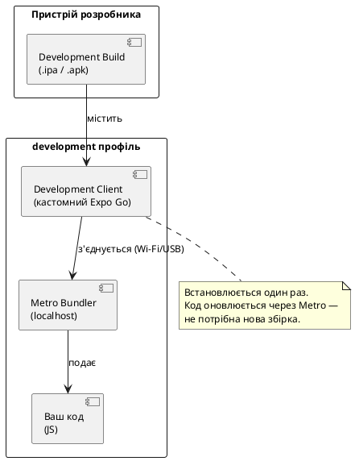
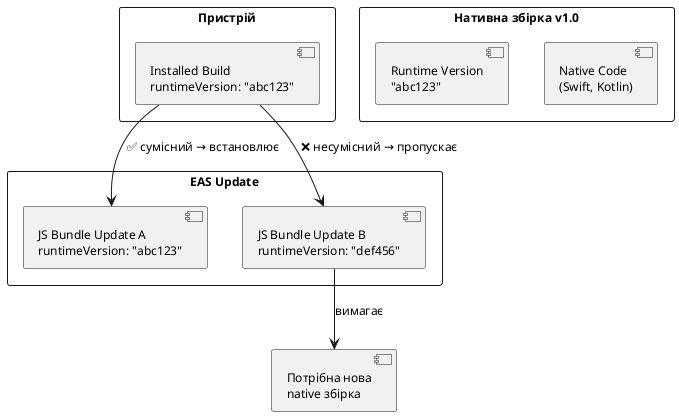
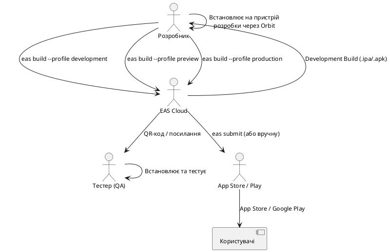

# EAS Build та профілі збірки

## Що таке EAS і навіщо він потрібен

Коли ваш застосунок готовий до тестування або публікації — потрібно зібрати **нативний бінарний файл**: `.ipa` для iOS, `.apk` або `.aab` для Android. До появи EAS це означало:

- Налаштування Mac із Xcode (для iOS), Android Studio і Java SDK.
- Ручне управління сертифікатами підписування, provisioning profiles, keystores.
- Складна конфігурація CI/CD pipeline.
- Неможливість зібрати iOS-застосунок без Mac.

**EAS Build** (Expo Application Services Build) — хмарний сервіс збірки від Expo, що вирішує всі ці проблеми:

- Збірка відбувається на **хмарних серверах** Expo (macOS для iOS, Linux для Android).
- **Автоматичне** управління сертифікатами і provisioning profiles.
- **Єдиний конфіг** (`eas.json`) для всіх типів збірки.
- Інтеграція з GitHub для автоматичних збірок при push.

Але EAS — це не тільки Build. Це екосистема сервісів:

::card-group

::card{title="EAS Build" icon="i-lucide-package"}

Хмарна збірка нативних бінарних файлів. Три профілі: development, preview, production. Збірка iOS без Mac.

::

::card{title="EAS Submit" icon="i-lucide-upload"}

Автоматична публікація в App Store Connect і Google Play через CLI. Без ручного завантаження в браузері.

::

::card{title="EAS Update" icon="i-lucide-refresh-cw"}

OTA (Over-The-Air) оновлення JavaScript-бандлу без збірки і публікації. Виправлення багів за хвилини.

::

::card{title="EAS Workflows" icon="i-lucide-git-branch"}

CI/CD pipeline у YAML конфізі. Автоматизація build → test → submit при push до гілки.

::

::

---

## Встановлення та ініціалізація

### EAS CLI

```bash
npm install -g eas-cli

# Перевірити версію:
eas --version
```

### Авторизація

```bash
eas login
# Введіть email і пароль від expo.dev
# Або:
eas whoami  # перевірити поточного користувача
```

### Підключення проєкту до EAS

```bash
# Ініціалізація EAS у проєкті (створює eas.json і прив'язує до expo.dev):
eas build:configure
```

Ця команда:
1. Запитує платформу (iOS, Android, або обидві).
2. Створює файл `eas.json` з базовими профілями.
3. Прив'язує проєкт до вашого облікового запису Expo.
4. Додає `extra.eas.projectId` у `app.json`.

Після виконання:

```json [app.json]
{
  "expo": {
    "extra": {
      "eas": {
        "projectId": "xxxxxxxx-xxxx-xxxx-xxxx-xxxxxxxxxxxx"
      }
    }
  }
}
```

---

## eas.json: структура і схема

### Загальна схема

`eas.json` — центральний конфігураційний файл EAS. Він складається з трьох секцій:

```json [eas.json]
{
  "cli": {
    "version": ">= 14.0.0",
    "appVersionSource": "remote"
  },
  "build": {
    "development": { /* ... */ },
    "preview": { /* ... */ },
    "production": { /* ... */ }
  },
  "submit": {
    "production": { /* ... */ }
  }
}
```

::field-group

::field{name="cli.version" type="string"}
Мінімальна версія `eas-cli`, необхідна для цього конфігу. Захищає від запуску зі старою CLI.
::

::field{name="cli.appVersionSource" type="'local' | 'remote'"}
Де зберігається поточний `versionCode`/`buildNumber`:
- `'local'` — у `app.json` (дефолт). Ви відповідаєте за інкрементацію.
- `'remote'` — на серверах EAS. Рекомендовано. EAS автоматично інкрементує при `autoIncrement: true`.
::

::field{name="build" type="Record<string, BuildProfile>"}
Об'єкт із профілями збірки. Ключ — ім'я профілю (довільне, але стандарт: `development`, `preview`, `production`).
::

::field{name="submit" type="Record<string, SubmitProfile>"}
Профілі для `eas submit` — публікації в App Store/Google Play.
::

::

---

## Три стандартні профілі збірки

### development: для розробки

::plant-uml



::

```json [eas.json]
{
  "build": {
    "development": {
      "developmentClient": true,
      "distribution": "internal",
      "ios": {
        "simulator": false
      },
      "env": {
        "APP_ENV": "development",
        "API_URL": "http://localhost:3000"
      }
    }
  }
}
```

::field-group

::field{name="developmentClient" type="boolean"}
Якщо `true` — збірка включає **expo-dev-client** (Development Client). Це кастомний Expo Go, що підтримує будь-які нативні модулі вашого проєкту. Підключається до Metro Bundler для live-reload.
::

::field{name="distribution" type="'internal' | 'store'"}
`'internal'` — для внутрішнього розповсюдження (TestFlight Ad Hoc або пряме встановлення). `'store'` — для публікації в магазині. Development і preview завжди `'internal'`.
::

::field{name="ios.simulator" type="boolean"}
Якщо `true` — збірка для iOS симулятора (`.app` замість `.ipa`). Симуляторна збірка не потребує Apple Developer Program і підписування.
::

::field{name="env" type="Record<string, string>"}
Змінні середовища, доступні під час збірки (не в рантаймі JS). Для рантайм-конфігурації використовуйте `Constants.expoConfig.extra`.
::

::

**Запуск development збірки:**

```bash
# Android:
eas build --profile development --platform android

# iOS (на реальному пристрої):
eas build --profile development --platform ios

# iOS симулятор (локально, без хмари):
eas build --profile development --platform ios --local
```

### preview: для тестування

Preview-профіль — для тестерів і QA. Готовий застосунок без Development Client, але без публікації в магазині:

```json [eas.json]
{
  "build": {
    "preview": {
      "extends": "production",
      "distribution": "internal",
      "env": {
        "APP_ENV": "staging",
        "API_URL": "https://staging.api.nomad.app"
      },
      "android": {
        "buildType": "apk"
      }
    }
  }
}
```

::field-group

::field{name="extends" type="string"}
Наслідує всі налаштування з вказаного профілю. `"extends": "production"` означає: взяти всі налаштування production і перевизначити тільки те, що вказано.
::

::field{name="android.buildType" type="'apk' | 'aab'"}
`'apk'` — встановлюється напряму без Google Play. `'aab'` — Android App Bundle для Google Play (дефолт для production).
::

::

### production: для магазину

```json [eas.json]
{
  "build": {
    "production": {
      "autoIncrement": true,
      "distribution": "store",
      "env": {
        "APP_ENV": "production",
        "API_URL": "https://api.nomad.app"
      },
      "ios": {
        "resourceClass": "m-medium"
      },
      "android": {
        "buildType": "aab"
      }
    }
  }
}
```

::field-group

::field{name="autoIncrement" type="boolean | 'version' | 'buildNumber'"}
Автоматичне збільшення номеру збірки перед кожним build:
- `true` — інкрементує `android.versionCode` і `ios.buildNumber`
- `'version'` — інкрементує `version` (1.0.0 → 1.0.1)
- `'buildNumber'` — лише build number, не version. Потребує `cli.appVersionSource: "remote"`.
::

::field{name="ios.resourceClass" type="string"}
Клас машини для iOS збірки. `'m-medium'` — Mac з Apple Silicon. Впливає на швидкість і вартість збірки (Free plan: лише `'ios-medium'`).
::

::field{name="channel" type="string"}
EAS Update канал для OTA-оновлень. Клієнти отримуватимуть оновлення лише з цього каналу.
::

::


---

## Версіонування застосунку

### Дві системи версій

Мобільний застосунок має дві незалежні системи версій, що часто плутають:

| Тип | iOS | Android | Для кого |
|---|---|---|---|
| **User-facing version** | `version` в `app.json` | `version` в `app.json` | Користувач (показується в магазині) |
| **Build version** | `ios.buildNumber` | `android.versionCode` | Магазин (технічний ідентифікатор) |

```json [app.json]
{
  "expo": {
    "version": "1.2.0",          // ← користувач бачить "1.2.0"
    "ios": {
      "buildNumber": "47"        // ← App Store: ця збірка #47
    },
    "android": {
      "versionCode": 47          // ← Google Play: integer, завжди зростає
    }
  }
}
```

### Правила версіонування

**`version`** (user-facing) — змінюється вручну при значущих релізах:
- `1.0.0` → `1.0.1` (патч: дрібні виправлення)
- `1.0.1` → `1.1.0` (minor: нові функції)
- `1.1.0` → `2.0.0` (major: breaking changes)

**`buildNumber` / `versionCode`** — повинен **монотонно зростати** при кожному сабмішені в магазин:
- Якщо ви надіслали build #5 і він відхилений — наступний повинен бути #6, а не #5.
- Дозволено надсилати кілька build з однаковим `version` але різними build numbers (наприклад, для виправлення)

### Remote versioning (рекомендовано)

```json [eas.json]
{
  "cli": {
    "appVersionSource": "remote"  // EAS зберігає лічильник на сервері
  },
  "build": {
    "production": {
      "autoIncrement": true       // автоматично +1 до buildNumber/versionCode
    }
  }
}
```

::steps

### `appVersionSource: "remote"`

EAS зберігає поточний `versionCode` і `buildNumber` на своїх серверах. Локальні значення в `app.json` використовуються лише як початкові.

### `autoIncrement: true`

Перед кожною збіркою EAS автоматично збільшує лічильник. Ви більше не думаєте про `versionCode` вручну.

### Синхронізація `version` (вручну)

Значення `version` у `app.json` ви змінюєте самостійно перед релізом нової версії. EAS не чіпає його при `autoIncrement: true`.

### Перевірка поточного стану

```bash
eas build:version:get --platform android
eas build:version:get --platform ios
```

### Ручне встановлення

```bash
eas build:version:set --platform android
# CLI запитає нове значення versionCode
```

::

### Runtime Version: сумісність з OTA-оновленнями

`runtimeVersion` — це окрема концепція, пов'язана з **EAS Update** (OTA). Вона визначає сумісність JS-бандлу і нативного коду:

```json [app.json]
{
  "expo": {
    "runtimeVersion": {
      "policy": "fingerprint"   // рекомендовано: автоматичний хеш нативних залежностей
    }
  }
}
```

::plant-uml



::

`fingerprint` — Expo автоматично обчислює хеш усіх нативних залежностей. Якщо ви додали або оновили нативний модуль — fingerprint змінюється, OTA-оновлення не встановлюється на старі збірки.

---

## Credentials: підписування застосунку

### Що таке підписування і навіщо

Перш ніж встановити або опублікувати застосунок — він повинен бути **підписаний** цифровим сертифікатом. Це гарантує:
- Справжність: застосунок від вказаного розробника, не підроблений.
- Цілісність: код не змінений після підписування.

На iOS і Android підписування влаштоване по-різному:

::card-group

::card{title="iOS підписування" icon="i-simple-icons-apple"}

Вимагає:
- **Distribution Certificate** (P12) — ваш особистий ключ, видає Apple
- **Provisioning Profile** — прив'язує додаток до сертифіката і списку дозволених пристроїв
- **App Store Connect API Key** — для автоматизації

Apple Developer Program: $99/рік.

::

::card{title="Android підписування" icon="i-simple-icons-android"}

Вимагає:
- **Keystore** — файл із приватним ключем (генерується раз і зберігається назавжди)
- **Key Alias** і паролі
- **Google Play API Service Account** — для автоматизації

Google Play Developer Program: $25 одноразово.

::

::

### Managed Credentials (рекомендовано)

EAS може **автоматично** генерувати і зберігати credentials для вас:

```bash
# При першій збірці EAS запитає про credentials:
eas build --platform ios

# > No existing credentials found
# > Generate new Apple Distribution Certificate? Y
# > Generate new Provisioning Profile? Y
# Credentials збережені на серверах EAS
```

Або явно управляти:

```bash
# Переглянути credentials:
eas credentials

# Оновити/перегенерувати:
eas credentials --platform ios
```

**Переваги managed credentials:**
- Не потрібно передавати `.p12` і `.keystore` між командою.
- Автоматичне оновлення expired provisioning profiles.
- Безпечне зберігання на серверах Expo.

### Local Credentials (для своїх ключів)

Якщо у вас вже є існуючий keystore або сертифікати — можна вказати їх локально:

```json [credentials.json]
{
  "android": {
    "keystore": {
      "keystorePath": "./android/keystores/nomad-release.keystore",
      "keystorePassword": "your-keystore-password",
      "keyAlias": "nomad",
      "keyPassword": "your-key-password"
    }
  },
  "ios": {
    "provisioningProfilePath": "./ios/profiles/NomadDistribution.mobileprovision",
    "distributionCertificate": {
      "path": "./ios/certs/distribution.p12",
      "password": "your-cert-password"
    }
  }
}
```

::caution
`credentials.json` **обов'язково** додайте до `.gitignore`! Він містить приватні ключі, витік яких дозволить підробляти підписи від вашого імені. Використовуйте змінні середовища або secrets для CI/CD.
::

### Вказати credentials у eas.json

```json [eas.json]
{
  "build": {
    "production": {
      "credentialsSource": "remote",    // 'remote' (EAS managed) або 'local'
      "distribution": "store"
    }
  }
}
```

---

## Internal Distribution: розповсюдження тестерам

### Що таке Internal Distribution

`distribution: "internal"` дозволяє ділитися збіркою напряму — через QR-код або посилання — без публікації в магазині:

- **iOS:** Ad Hoc provisioning profile (до 100 пристроїв) або Apple Developer Enterprise.
- **Android:** APK-файл з прямим завантаженням або через `expo-dev-client`.

```bash
# Зібрати preview і отримати QR-код для встановлення:
eas build --profile preview --platform android
```

Після завершення EAS надсилає email із посиланням і QR-кодом. Тестер сканує QR і встановлює застосунок.

### Expo Orbit

**Expo Orbit** — нативний macOS застосунок для встановлення EAS Build на підключені пристрої або симулятори одним кліком:

```bash
# Встановити Orbit:
brew install --cask expo-orbit

# Або завантажити з:
# https://expo.dev/orbit
```

::tip
Expo Orbit — найзручніший спосіб тестувати збірки під час розробки. Він автоматично виявляє нові збірки у вашому EAS проєкті і дозволяє встановити їх на симулятор або підключений iPhone без використання браузера.
::


---

## Development Client: кастомний Expo Go

### Чому Development Client, а не Expo Go

**Expo Go** — офіційний застосунок Expo для швидкого тестування. Але він має обмеження: містить лише бібліотеки зі стандартного SDK. Якщо ваш проєкт використовує:

- `react-native-maps`
- `expo-notifications`
- `react-native-gesture-handler` (нативна частина)
- `stripe-react-native`
- Будь-який кастомний нативний модуль

...то Expo Go не підійде. Вам потрібен **Development Client** (також відомий як **Development Build**).

::card-group

::card{title="Expo Go" icon="i-lucide-smartphone"}

✅ Встановлюється з магазину<br>
✅ Не потребує EAS або збірки<br>
✅ Підходить для чистих Expo проєктів<br>
❌ Лише стандартні SDK модулі<br>
❌ Не підходить для кастомних native modules

::

::card{title="Development Client" icon="i-lucide-wrench"}

✅ Підтримує **будь-які** нативні модулі<br>
✅ Live reload через Metro (як Expo Go)<br>
✅ Вбудований dev menu з інструментами<br>
❌ Потребує однієї EAS збірки для встановлення<br>
❌ При зміні нативних залежностей — нова збірка

::

::

### Встановлення expo-dev-client

```bash
npx expo install expo-dev-client
```

Після встановлення — потрібна нова збірка:

```bash
eas build --profile development --platform android
# або
eas build --profile development --platform ios
```

### Конфігурація у eas.json

```json [eas.json]
{
  "build": {
    "development": {
      "developmentClient": true,
      "distribution": "internal",
      "android": {
        "gradleCommand": ":app:assembleDebug"
      },
      "ios": {
        "buildConfiguration": "Debug",
        "simulator": false
      }
    }
  }
}
```

### Робочий процес після встановлення Development Build

```bash
# 1. Встановили Development Build на пристрій (через QR або Orbit)
# 2. Запускаємо Metro Bundler:
npx expo start

# 3. На пристрої відкриваємо Development Build
# 4. Відскануємо QR-код з Metro
# 5. Застосунок запустився з live reload!

# При зміні JS-коду — auto-reload
# При зміні нативних залежностей — нова збірка через EAS
```

### Dev Menu

Development Client включає вбудований dev menu (потряси телефон або Cmd+D у симуляторі):

- **Reload JS** — примусово перезавантажити бандл.
- **Open Debugger** — відкрити Chrome DevTools для відлагодження.
- **Toggle Element Inspector** — виділяти компоненти і бачити props.
- **Toggle Performance Monitor** — FPS і памʼять у реальному часі.
- **Disconnect** — відключитись від Metro.

---

## Змінні середовища в EAS

### Середовища і конфіги

Реальний застосунок має кілька середовищ: development, staging, production. Для кожного — різні API endpoint-и, ключі аналітики, налаштування.

**Підхід 1: `env` у eas.json (build-time)**

```json [eas.json]
{
  "build": {
    "development": {
      "env": { "APP_ENV": "development", "API_URL": "http://localhost:3000" }
    },
    "preview": {
      "env": { "APP_ENV": "staging", "API_URL": "https://staging.api.nomad.app" }
    },
    "production": {
      "env": { "APP_ENV": "production", "API_URL": "https://api.nomad.app" }
    }
  }
}
```

Ці змінні доступні під час компіляції (для Babel plugins, Metro), але **не в рантаймі JS** напряму.

**Підхід 2: `app.config.js` з `process.env` (runtime)**

```js [app.config.js]
export default ({ config }) => ({
  ...config,
  extra: {
    apiUrl: process.env.API_URL ?? 'http://localhost:3000',
    environment: process.env.APP_ENV ?? 'development',
    sentryDsn: process.env.SENTRY_DSN,
  },
});
```

Доступ у коді:

```ts
import Constants from 'expo-constants';

const apiUrl = Constants.expoConfig?.extra?.apiUrl;
const env = Constants.expoConfig?.extra?.environment;
```

**Підхід 3: EAS Secrets (sensitive values)**

```bash
# Додати секрет (тільки для даного проєкту):
eas secret:create --scope project --name SENTRY_DSN --value "https://xxx@sentry.io/..."

# Переглянути всі секрети:
eas secret:list

# Секрети автоматично доступні як process.env.SENTRY_DSN під час збірки
```

::caution
Не записуйте чутливі дані (API keys, паролі, DSN) безпосередньо в `eas.json` — цей файл зазвичай у git. Використовуйте `eas secret:create` для секретних значень.
::

---

## EAS Build Hooks: скрипти до і після збірки

EAS підтримує npm-скрипти, що запускаються на серверах збірки:

```json [package.json]
{
  "scripts": {
    "eas-build-pre-install": "echo 'Перед встановленням залежностей'",
    "eas-build-post-install": "echo 'Після npm install'",
    "eas-build-on-success": "echo 'Збірка успішна!'",
    "eas-build-on-error": "echo 'Збірка провалена'"
  }
}
```

Типові використання:
- `eas-build-pre-install` — перевірка змінних середовища, завантаження конфігів.
- `eas-build-post-install` — генерація файлів (наприклад, `src/config.ts` з ENV vars).
- `eas-build-on-success` — відправка Slack-повідомлення, оновлення версії в JIRA.

---

## Міні-проєкт: preview profile + internal build для Nomad

### Завдання

1. Налаштувати `eas.json` з трьома профілями для Nomad.
2. Зібрати preview збірку для Android (APK).
3. Переконатись що credentials налаштовані.
4. Опціонально: зібрати iOS збірку для внутрішнього тестування.

### Крок 1: фінальний eas.json для Nomad

```json [eas.json]
{
  "cli": {
    "version": ">= 14.0.0",
    "appVersionSource": "remote"
  },
  "build": {
    "development": {
      "developmentClient": true,
      "distribution": "internal",
      "env": {
        "APP_ENV": "development"
      },
      "android": {
        "gradleCommand": ":app:assembleDebug"
      },
      "ios": {
        "buildConfiguration": "Debug"
      }
    },
    "preview": {
      "extends": "production",
      "distribution": "internal",
      "env": {
        "APP_ENV": "staging"
      },
      "android": {
        "buildType": "apk"
      }
    },
    "production": {
      "autoIncrement": true,
      "distribution": "store",
      "env": {
        "APP_ENV": "production"
      },
      "android": {
        "buildType": "aab"
      },
      "ios": {
        "resourceClass": "m-medium"
      }
    }
  },
  "submit": {
    "production": {
      "android": {
        "serviceAccountKeyPath": "./google-service-account.json",
        "track": "internal"
      },
      "ios": {
        "appleId": "your@email.com",
        "ascAppId": "1234567890"
      }
    }
  }
}
```

### Крок 2: app.config.js для Nomad

```js [app.config.js]
const IS_DEV = process.env.APP_ENV === 'development';
const IS_STAGING = process.env.APP_ENV === 'staging';

export default ({ config }) => ({
  ...config,
  name: IS_DEV ? 'Nomad (Dev)' : IS_STAGING ? 'Nomad (Staging)' : 'Nomad',
  slug: 'nomad',
  version: '1.0.0',
  icon: IS_DEV ? './assets/icon-dev.png' : './assets/icon.png',
  extra: {
    apiUrl: IS_DEV
      ? 'http://localhost:3000'
      : IS_STAGING
      ? 'https://staging.api.nomad.app'
      : 'https://api.nomad.app',
    environment: process.env.APP_ENV ?? 'development',
    eas: { projectId: 'your-project-id-here' },
  },
});
```

::tip
Зверніть увагу: `name` і `icon` також змінюються залежно від середовища. Це дозволяє мати одночасно встановлені Dev, Staging і Production версії застосунку — вони виглядають по-різному і не конфліктують.
::

### Крок 3: збірка preview для Android

```bash
# Запустити preview збірку:
eas build --profile preview --platform android

# Якщо credentials не налаштовані — EAS запросить:
# > No Android credentials found. Create a new keystore? (Y)

# Після завершення (~5-10 хв) отримаєте:
# ✓ Build finished. APK available at: https://expo.dev/artifacts/...
# ✓ QR code for download (scan with Android camera)
```

### Крок 4: перевірка версіонування

```bash
# Переглянути поточний versionCode:
eas build:version:get --platform android

# Встановити початкове значення:
eas build:version:set --platform android
# > Enter versionCode: 1
```

### Структура команд EAS Build

```bash
# Основні команди:
eas build --profile <name> --platform <android|ios|all>
eas build:list          # список всіх збірок проєкту
eas build:view <id>     # деталі конкретної збірки
eas build:cancel <id>   # скасувати збірку

# Версіонування:
eas build:version:get --platform <android|ios>
eas build:version:set --platform <android|ios>

# Credentials:
eas credentials
eas credentials --platform ios
eas credentials --platform android

# Secrets:
eas secret:create --scope project --name KEY --value value
eas secret:list
eas secret:delete --name KEY
```

---

## Підключення до Nomad: chore: eas build profiles

::plant-uml



::

Для Nomad рекомендований workflow:

1. **development** — для щоденної розробки з Development Client.
2. **preview** — кожного тижня або перед feature release для QA.
3. **production** — при релізі нової версії.

---

## Поширені помилки

::accordion
::accordion-item{label="eas: command not found" icon="i-lucide-circle-alert"}
EAS CLI не встановлений або не в PATH. Встановіть глобально: `npm install -g eas-cli`. Якщо встановлено через `npx` — використовуйте `npx eas ...`.
::
::accordion-item{label="Помилка: Missing credentials for iOS" icon="i-lucide-circle-alert"}
EAS не знайшов credentials для підписування. Запустіть `eas credentials --platform ios` і виберіть варіант генерації. Для simulator-збірки (`ios.simulator: true`) credentials не потрібні.
::
::accordion-item{label="versionCode/buildNumber не інкрементується" icon="i-lucide-circle-alert"}
`autoIncrement: true` без `cli.appVersionSource: "remote"` не працює. Обидва поля обов'язкові. Перевірте що вони разом у `eas.json`.
::
::accordion-item{label="Збірка завершується але з'являється 'Build failed'" icon="i-lucide-circle-alert"}
Найчастіша причина — помилка в нативному коді або несумісність версій залежностей. Перегляньте логи: `eas build:view <id>` або перейдіть на expo.dev → Projects → Builds → виберіть збірку → Logs.
::
::accordion-item{label="Preview build встановлюється, але застосунок падає" icon="i-lucide-circle-alert"}
Перевірте змінні середовища: API URL для staging середовища може бути неправильним. Перевірте що `app.config.js` правильно читає `APP_ENV` і повертає відповідний URL.
::
::accordion-item{label="Expo Go не запускає мій проєкт після додавання нативного модуля" icon="i-lucide-circle-alert"}
Це очікувана поведінка. Після додавання будь-якого нативного модуля — потрібен Development Client. Встановіть `expo-dev-client` і зберіть development build через EAS.
::

::

---

## Підсумок

::card-group

::card{title="eas.json профілі" icon="i-lucide-layers"}

- `development` — `developmentClient: true`, `distribution: internal`
- `preview` — `extends: production`, `internal`, APK для Android
- `production` — `autoIncrement: true`, `store`, AAB для Android
- `extends` для уникнення дублювання

::

::card{title="Versioning" icon="i-lucide-tag"}

- `version` — user-facing (semantic, вручну)
- `buildNumber`/`versionCode` — технічний, зростає
- `appVersionSource: "remote"` + `autoIncrement: true`
- `runtimeVersion: fingerprint` для OTA-сумісності

::

::card{title="Credentials" icon="i-lucide-lock"}

- Managed (EAS) — рекомендовано, автоматично
- Local (`credentials.json`) — для існуючих ключів
- `eas credentials` для перегляду і управління
- Secrets для чутливих ENV-значень

::

::card{title="Development Client" icon="i-lucide-wrench"}

- `expo-dev-client` = кастомний Expo Go
- Підтримує будь-які нативні модулі
- Dev Menu (потряс або Cmd+D)
- Expo Orbit для швидкого встановлення

::

::

::tip
**Наступний крок:** після успішного налаштування EAS Build — час публікувати в магазин. У наступному розділі ми розберемо **App Store і Google Play**: підготовку лістингу, screenshots, metadata, privacy manifests і `eas submit`.
::

