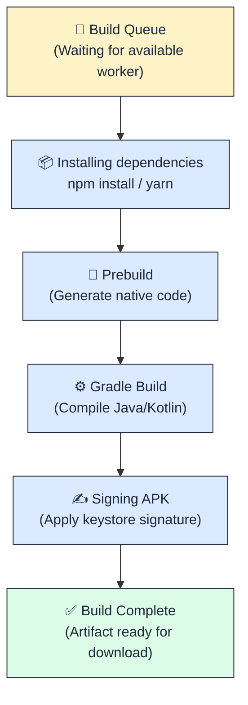

## Вступ: від локальної розробки до продакшн-білда

На етапі розробки ваш React Native застосунок виконується у середовищі **Expo Go** (готовий контейнер із вбудованими нативними модулями) або через **Development Build** (кастомна збірка з вашими власними нативними залежностями). Проте для публікації застосунку в App Store або Google Play Store потрібен **продакшн-білд** — оптимізований, підписаний, скомпільований бінарний файл формату `.ipa` (iOS) або `.apk` / `.aab` (Android).

Історично процес створення продакшн-білдів вимагав від розробника:
1. Встановлення та налаштування **Android Studio** із SDK, Gradle, JDK певних версій.
2. Встановлення **Xcode** (лише на macOS) із Command Line Tools, provisioning profiles, signing certificates.
3. Ручного керування версіями нативних залежностей, вирішення конфліктів `build.gradle`, `Podfile`, налаштування keystore для підписування Android-білдів.
4. Локальної збірки на власному комп'ютері, що займає 10–30 хвилин і споживає значні обчислювальні ресурси.

**EAS Build (Expo Application Services)** — це хмарна платформа для автоматизованої збірки React Native застосунків без необхідності встановлення Android Studio чи Xcode на локальній машині. Вся компіляція відбувається на віддалених серверах Expo у контейнерах із заздалегідь налаштованими залежностями.

### Що таке EAS і чому це не "тільки для Expo"

::note
**Критичне уточнення:** EAS Build **не обмежений** лише проєктами, створеними через `create-expo-app`. Він підтримує:
- **Managed Workflow (Expo)** — проєкти без папок `android/` та `ios/`, де нативний код генерується автоматично.
- **Bare Workflow (React Native CLI)** — проєкти з повним доступом до нативних папок `android/` та `ios/`, створені через `npx react-native init`.
- **Гібридні проєкти** — проєкти, що почалися як Expo, але після виконання `npx expo prebuild` отримали нативні папки для кастомізації.

EAS Build — це **інфраструктурна платформа для збірки будь-яких React Native застосунків**, незалежно від того, використовуєте ви Expo SDK чи ні.
::

### Переваги EAS Build над локальною збіркою

::card-group

::card{title="☁️ Хмарна інфраструктура" icon="i-lucide-cloud"}

- Білди виконуються на потужних віддалених серверах AWS.
- Не потрібно встановлювати Android Studio, Xcode, JDK, SDK на локальному комп'ютері.
- Підтримка паралельних білдів (iOS + Android одночасно).
- Автоматичне кешування залежностей (`node_modules`, CocoaPods, Gradle cache).

::

::card{title="🔐 Автоматичне підписування" icon="i-lucide-key"}

- EAS автоматично генерує та керує iOS сертифікатами і provisioning profiles.
- Автоматичне створення Android keystore для підписування APK/AAB.
- Захищене зберігання приватних ключів у хмарному сховищі Expo.
- Можливість використання власних сертифікатів.

::

::card{title="📦 Профілі збірки" icon="i-lucide-settings"}

- Різні конфігурації для розробки, тестування, staging та production.
- Змінні оточення для кожного профілю (API keys, endpoints).
- Окремі bundle identifiers для різних середовищ.
- Версіонування та автоінкремент build numbers.

::

::card{title="🚀 Інтеграція з CI/CD" icon="i-lucide-git-branch"}

- GitHub Actions, GitLab CI, Bitbucket Pipelines.
- Автоматичні білди при push у певні гілки.
- Webhooks для оповіщення команди (Slack, Discord).
- Збереження артефактів білдів із можливістю завантаження QR-кодом.

::

::

### Мета цієї лекції: від нуля до APK

Ця лекція проведе вас через **весь процес** створення продакшн-білду крок за кроком:

::steps

### Крок 1: Реєстрація облікового запису Expo
Створення безкоштовного акаунту та налаштування CLI для автентифікації.

### Крок 2: Ініціалізація EAS у проєкті
Конфігурація `eas.json` — файлу з профілями збірки.

### Крок 3: Налаштування профілів збірки
Створення окремих конфігурацій для `development`, `preview` та `production`.

### Крок 4: Перший білд для Android
Запуск хмарної збірки, моніторинг прогресу, завантаження APK-файлу.

### Крок 5: Перший білд для iOS
Генерація сертифікатів, provisioning profiles, отримання IPA-файлу (вимагає Apple Developer акаунт).

### Крок 6: Локальна збірка (без хмари)
Альтернативний варіант: компіляція на власному комп'ютері через `eas build --local`.

### Крок 7: Змінні оточення та секрети
Захищене зберігання API keys, токенів через EAS Secrets.

### Крок 8: Автоматизація через GitHub Actions
Налаштування CI/CD для автоматичних білдів при push у репозиторій.

::

---

## Передумови: що потрібно мати перед початком

Перед запуском EAS Build переконайтеся, що у вас є:

::field-group

::field{name="Node.js та npm/pnpm/yarn" type="required"}
Версія Node.js **≥ 18.0.0** (рекомендовано LTS). Перевірте через `node --version`.
::

::field{name="Expo CLI" type="required"}
Встановлено глобально або через `npx`. Мінімальна версія: **6.0.0**.
::

::field{name="Git репозиторій" type="recommended"}
Ваш проєкт має бути під версійним контролем Git (для CI/CD та відстеження змін).
::

::field{name="Обліковий запис Expo" type="required"}
Безкоштовний акаунт на [expo.dev](https://expo.dev). Реєстрація займає 2 хвилини.
::

::field{name="Apple Developer Account" type="optional"}
**Лише для iOS білдів.** Річна підписка $99/рік. Для Android білдів не потрібен.
::

::field{name="Фізичний пристрій або емулятор" type="recommended"}
Для тестування білду. Expo Go **не підходить** для тестування продакшн-білдів.
::

::

::warning
**EAS Build є платною послугою** для продакшн-використання:
- **Free tier:** 30 білдів на місяць (підходить для навчання та малих проєктів).
- **Production plan:** $29/місяць для необмеженої кількості білдів однієї платформи (iOS або Android).
- **Enterprise plan:** $99/місяць для необмеженої кількості білдів обох платформ + Priority Support.

Актуальні ціни: [expo.dev/pricing](https://expo.dev/pricing)
::

---

## Крок 1: Реєстрація облікового запису Expo

### 1.1. Створення акаунту через веб-інтерфейс

1. Відкрийте браузер та перейдіть на [https://expo.dev/signup](https://expo.dev/signup)
2. Заповніть форму реєстрації:
   - **Username:** унікальне ім'я користувача (буде частиною URL вашого профілю: `expo.dev/@username`)
   - **Email:** дійсна електронна пошта (для підтвердження акаунту та оповіщень про білди)
   - **Password:** надійний пароль (мінімум 8 символів)
3. Натисніть **"Create Account"**
4. Перевірте пошту та підтвердіть email через лист від `noreply@expo.dev`

::tip
**Рекомендація щодо username:** Використовуйте назву команди або компанії замість особистого імені, якщо плануєте командну розробку. Пізніше зміна username призведе до оновлення всіх посилань на проєкти.
::

### 1.2. Автентифікація в CLI

Після створення акаунту потрібно авторизувати Expo CLI на вашому комп'ютері:

::tabs
::tabs-item{label="npx (рекомендовано)"}

```bash
npx expo login
```

::
::tabs-item{label="Глобальний Expo CLI"}

```bash
# Якщо ви встановили expo-cli глобально
expo login
```

::
::

**Інтерактивний процес автентифікації:**

::terminal-preview{title="npx expo login" :cursor="false"}

<div class="line"><span class="opacity-40">$</span> <strong class="font-bold">npx expo login</strong></div>
<div class="line"></div>
<div class="line"><span class="text-blue-400 font-bold">?</span> Username or Email Address: <span class="text-green-400">your_username</span></div>
<div class="line"><span class="text-blue-400 font-bold">?</span> Password: <span class="opacity-40">••••••••</span></div>
<div class="line"></div>
<div class="line"><span class="text-green-400 font-bold">✓</span> Logged in as <strong>your_username</strong></div>
<div class="line"></div>
<div class="line"><span class="opacity-40">Session token saved to ~/.expo/state.json</span></div>

::

::accordion

::accordion-item{label="❓ Що робити, якщо забув пароль?" icon="i-lucide-help-circle"}

1. Перейдіть на [https://expo.dev/forgot-password](https://expo.dev/forgot-password)
2. Введіть email, прив'язаний до акаунту
3. Відкрийте лист від Expo з посиланням для скидання паролю
4. Створіть новий пароль
5. Повторіть `npx expo login` з новими даними

::

::accordion-item{label="❓ Чи зберігається пароль у відкритому вигляді?" icon="i-lucide-help-circle"}

Ні. При виконанні `expo login` генерується **session token** (тимчасовий ключ доступу), який зберігається локально у файлі `~/.expo/state.json`. Сам пароль ніколи не зберігається на диску. Токен діє 30 днів, після чого потрібна повторна автентифікація.

::

::

### 1.3. Перевірка автентифікації

Переконайтеся, що CLI успішно авторизований:

```bash
npx expo whoami
```

**Очікуваний вивід:**

::terminal-preview{title="npx expo whoami" :cursor="false"}

<div class="line"><span class="opacity-40">$</span> <strong class="font-bold">npx expo whoami</strong></div>
<div class="line"></div>
<div class="line"><span class="text-green-400 font-bold">your_username</span></div>

::

Якщо замість імені ви бачите `Not logged in`, повторіть команду `npx expo login`.


---

## Крок 2: Ініціалізація EAS Build у проєкті

### 2.1. Встановлення EAS CLI

EAS CLI — це окремий інструмент командного рядка для роботи з Expo Application Services. Він не входить у базовий `expo-cli`.

::tabs
::tabs-item{label="npm"}

```bash
npm install -g eas-cli
```

::
::tabs-item{label="yarn"}

```bash
yarn global add eas-cli
```

::
::tabs-item{label="pnpm"}

```bash
pnpm add -g eas-cli
```

::
::

**Перевірка встановлення:**

```bash
eas --version
```

::terminal-preview{title="eas --version" :cursor="false"}

<div class="line"><span class="opacity-40">$</span> <strong class="font-bold">eas --version</strong></div>
<div class="line"></div>
<div class="line"><span class="text-green-400 font-bold">eas-cli/5.9.1</span> darwin-arm64 node-v20.11.0</div>

::

::note
Якщо не хочете встановлювати EAS CLI глобально, можна використовувати через `npx`: `npx eas-cli <command>`. Проте для частого використання глобальна установка зручніша.
::

### 2.2. Прив'язка проєкту до Expo-акаунту

Перейдіть у кореневу директорію вашого React Native проєкту:

```bash
cd /path/to/your/project
```

Виконайте ініціалізацію EAS:

```bash
eas init
```

**Інтерактивний процес:**

::terminal-preview{title="eas init" :cursor="false"}

<div class="line"><span class="opacity-40">$</span> <strong class="font-bold">eas init</strong></div>
<div class="line"></div>
<div class="line"><span class="text-blue-400 font-bold">✔</span> Detected project type: <strong>Expo managed workflow</strong></div>
<div class="line"></div>
<div class="line"><span class="text-blue-400 font-bold">?</span> Would you like to automatically create an EAS project for @your_username/my-app?</div>
<div class="line"><span class="text-green-400">  › Yes</span></div>
<div class="line"></div>
<div class="line"><span class="text-green-400 font-bold">✓</span> Created EAS project: <span class="text-blue-400">my-app</span></div>
<div class="line"><span class="text-green-400 font-bold">✓</span> Project ID: <span class="opacity-40">a1b2c3d4-e5f6-7890-abcd-ef1234567890</span></div>
<div class="line"></div>
<div class="line"><span class="opacity-40">View your project at: https://expo.dev/accounts/your_username/projects/my-app</span></div>

::

Ця команда:
1. Створює унікальний **Project ID** для вашого застосунку в хмарній інфраструктурі Expo.
2. Додає поле `"extra.eas.projectId"` до файлу `app.json` або `app.config.js`.
3. Дозволяє вам відстежувати білди, логи, crashes через веб-дашборд [expo.dev](https://expo.dev).

**Зміни в `app.json`:**

```json
{
  "expo": {
    "name": "My App",
    "slug": "my-app",
    "version": "1.0.0",
    "extra": {
      "eas": {
        "projectId": "a1b2c3d4-e5f6-7890-abcd-ef1234567890"
      }
    }
  }
}
```

::warning
**Не видаляйте `projectId`!** Це унікальний ідентифікатор, що зв'язує ваш локальний код з хмарною платформою. Якщо ви випадково видалите його, білди перестануть асоціюватися з правильним проєктом.
::

### 2.3. Створення конфігураційного файлу `eas.json`

Файл `eas.json` — це центральна конфігурація всіх профілів збірки. Створіть його через команду:

```bash
eas build:configure
```

**Інтерактивний діалог:**

::terminal-preview{title="eas build:configure" :cursor="false"}

<div class="line"><span class="opacity-40">$</span> <strong class="font-bold">eas build:configure</strong></div>
<div class="line"></div>
<div class="line"><span class="text-blue-400 font-bold">?</span> Select platform(s):</div>
<div class="line"><span class="text-green-400">  ❯ ◉ Android</span></div>
<div class="line">    ◉ iOS</div>
<div class="line">    ◯ All</div>
<div class="line"></div>
<div class="line"><span class="text-green-400 font-bold">✓</span> Generated eas.json</div>

::

**Структура згенерованого `eas.json`:**

::code-tree

```json [eas.json]
{
  "cli": {
    "version": ">= 5.9.1"
  },
  "build": {
    "development": {
      "developmentClient": true,
      "distribution": "internal"
    },
    "preview": {
      "distribution": "internal"
    },
    "production": {}
  },
  "submit": {
    "production": {}
  }
}
```

::

**Пояснення полів:**

| Поле | Призначення |
| :--- | :--- |
| `cli.version` | Мінімальна версія EAS CLI для сумісності |
| `build.development` | Профіль для Development Build (з Dev Menu, Hot Reload) |
| `build.preview` | Профіль для внутрішнього тестування (без dev-функцій, але без публікації в стори) |
| `build.production` | Профіль для фінального релізу в App Store / Google Play |
| `submit.production` | Конфігурація автоматичної публікації у стори (опціонально) |

::tip
Ви можете створити кастомні профілі з довільними іменами: `build.staging`, `build.qa`, `build.demo`. EAS Build не обмежує вас трьома дефолтними профілями.
::

---

## Крок 3: Налаштування профілів збірки

### 3.1. Профіль `development` (для розробки)

Цей профіль створює Development Build — версію застосунку з увімкненим Dev Menu, Hot Reload та можливістю підключення до Metro bundler.

**Конфігурація:**

```json
{
  "build": {
    "development": {
      "developmentClient": true,
      "distribution": "internal",
      "android": {
        "buildType": "apk"
      },
      "ios": {
        "simulator": true
      },
      "env": {
        "API_URL": "http://localhost:3000"
      }
    }
  }
}
```

**Пояснення параметрів:**

| Параметр | Значення | Пояснення |
| :--- | :--- | :--- |
| `developmentClient` | `true` | Вмикає Dev Menu та режим розробника |
| `distribution` | `internal` | Білд не призначений для публікації в стори |
| `android.buildType` | `apk` | Створює APK замість AAB (зручніше для ручного тестування) |
| `ios.simulator` | `true` | Створює білд для iOS Simulator (не потрібен Apple Developer акаунт) |
| `env.API_URL` | URL | Змінна оточення, доступна через `process.env.API_URL` |

::note
**Development Build vs Expo Go:** Development Build — це повноцінна збірка вашого застосунку з усіма нативними залежностями, але з увімкненими інструментами розробника. Expo Go — це загальний контейнер, який не підтримує кастомні нативні модулі.
::

### 3.2. Профіль `preview` (для тестування)

Цей профіль створює білд, максимально наближений до production, але призначений для внутрішнього тестування командою QA або бета-тестерами.

```json
{
  "build": {
    "preview": {
      "distribution": "internal",
      "android": {
        "buildType": "apk"
      },
      "env": {
        "API_URL": "https://staging-api.myapp.com"
      }
    }
  }
}
```

**Відмінності від `production`:**

- Використовується staging API замість production.
- Може мати окремий Bundle Identifier (наприклад, `com.myapp.staging`) для встановлення поруч із production-версією.
- Логування та дебаг-інформація може бути більш детальною.

### 3.3. Профіль `production` (для релізу)

Фінальний профіль для публікації в App Store та Google Play Store.

```json
{
  "build": {
    "production": {
      "android": {
        "buildType": "app-bundle"
      },
      "env": {
        "API_URL": "https://api.myapp.com"
      }
    }
  }
}
```

**Критичні параметри production:**

| Параметр | Значення | Пояснення |
| :--- | :--- | :--- |
| `android.buildType` | `app-bundle` | Створює AAB (Android App Bundle) — вимога Google Play з 2021 року |
| `ios.bundleIdentifier` | `com.mycompany.myapp` | Унікальний ідентифікатор застосунку в App Store |
| `android.package` | `com.mycompany.myapp` | Унікальний package name для Google Play |

::caution
**Bundle Identifier та Package Name повинні бути унікальними** в межах всієї екосистеми App Store / Google Play. Якщо інший розробник вже зареєстрував `com.myapp`, ви не зможете використати це ім'я. Формат: зворотний домен (`com.yourcompany.appname`).
::

### 3.4. Версіонування білдів

Кожен білд повинен мати унікальний номер версії та build number. EAS підтримує автоматичний інкремент.

**Додайте до `eas.json`:**

```json
{
  "build": {
    "production": {
      "autoIncrement": true,
      "android": {
        "buildType": "app-bundle"
      }
    }
  }
}
```

**Версії в `app.json`:**

```json
{
  "expo": {
    "version": "1.0.0",
    "android": {
      "versionCode": 1
    },
    "ios": {
      "buildNumber": "1"
    }
  }
}
```

::accordion

::accordion-item{label="❓ Яка різниця між version та buildNumber?" icon="i-lucide-help-circle"}

**`version` (iOS: CFBundleShortVersionString, Android: versionName):**
- Публічна версія, що відображається користувачам: `1.0.0`, `2.1.3`, `3.0.0-beta`.
- Формат: Semantic Versioning (`major.minor.patch`).
- Змінюється вручну при випуску нової функціональності або виправлень.

**`buildNumber` / `versionCode`:**
- Внутрішній лічильник білдів: `1`, `2`, `3`, ..., `1042`.
- Повинен **монотонно зростати** з кожним новим білдом (App Store / Google Play вимагають цього).
- При використанні `autoIncrement: true` EAS автоматично збільшує це число.

**Приклад:** Ви випускаєте версію `1.0.0` з `buildNumber: 15`. Потім виправляєте баг і випускаєте `1.0.1` з `buildNumber: 16`. Версія змінилася, але buildNumber завжди зростає.

::

::


---

## Крок 4: Перший білд для Android

### 4.1. Запуск хмарної збірки

Тепер, коли все налаштовано, запустимо першу збірку для Android у профілі `preview`:

```bash
eas build --platform android --profile preview
```

**Розбір команди:**

| Параметр | Призначення |
| :--- | :--- |
| `--platform android` | Цільова платформа (можливі значення: `android`, `ios`, `all`) |
| `--profile preview` | Використовуваний профіль з `eas.json` |

::tip
Якщо хочете зібрати обидві платформи одночасно (iOS + Android), використовуйте `--platform all`. Проте для навчання краще почати з однієї платформи.
::

### 4.2. Інтерактивний процес першого білду

При першому запуску EAS запитає кілька критичних параметрів:

::terminal-preview{title="eas build --platform android --profile preview" :cursor="false"}

<div class="line"><span class="opacity-40">$</span> <strong class="font-bold">eas build --platform android --profile preview</strong></div>
<div class="line"></div>
<div class="line"><span class="text-blue-400 font-bold">✔</span> Linked to project <strong>@your_username/my-app</strong></div>
<div class="line"></div>
<div class="line"><span class="text-yellow-400 font-bold">⚠</span> Android package (com.myapp) not found in your local app config</div>
<div class="line"><span class="text-blue-400 font-bold">?</span> Would you like to set it now? <span class="text-green-400">Yes</span></div>
<div class="line"></div>
<div class="line"><span class="text-blue-400 font-bold">?</span> What would you like your Android package to be?</div>
<div class="line"><span class="text-green-400">  › com.yourcompany.myapp</span></div>
<div class="line"></div>
<div class="line"><span class="text-yellow-400 font-bold">⚠</span> Keystore not found. Would you like to generate a new one? <span class="text-green-400">Yes</span></div>
<div class="line"></div>
<div class="line"><span class="text-green-400 font-bold">✓</span> Generated new Android Keystore</div>
<div class="line"><span class="text-green-400 font-bold">✓</span> Uploaded credentials to EAS servers</div>
<div class="line"></div>
<div class="line"><span class="text-blue-400 font-bold">📦</span> Build started. Track progress at:</div>
<div class="line"><span class="text-blue-400">   https://expo.dev/accounts/your_username/projects/my-app/builds/abc123</span></div>

::

**Що відбувається під капотом:**

1. **Генерація Android Keystore:**
   - Keystore — це файл з приватним ключем для підписування APK/AAB.
   - Без підписування Google Play не приймає білди.
   - EAS автоматично генерує keystore і зберігає його у захищеному хмарному сховищі.
   - **Критично:** Ніколи не втрачайте keystore! Без нього неможливо оновити застосунок у Google Play.

2. **Завантаження коду на сервери Expo:**
   - Весь вихідний код упаковується та надсилається у хмару.
   - Виключені папки (з `.gitignore`, `.easignore`) не завантажуються.

3. **Запуск Docker-контейнера:**
   - На серверах AWS запускається ізольований контейнер з Android SDK, Gradle, Node.js.
   - Встановлюються залежності: `npm install` або `yarn install`.
   - Виконується збірка нативного коду через Gradle.

::accordion

::accordion-item{label="❓ Чи можу я використати власний keystore?" icon="i-lucide-help-circle"}

Так. Якщо у вас вже є keystore (наприклад, з попереднього застосунку або локальної збірки), ви можете завантажити його:

```bash
eas credentials
```

Оберіть:
1. **Android** → **Production** → **Keystore**
2. **Upload new Keystore**
3. Вкажіть шлях до файлу `.jks` або `.keystore`
4. Введіть паролі keystore та key alias

EAS збереже ваш keystore і використовуватиме його для всіх наступних білдів.

::

::accordion-item{label="❓ Що таке package name і чому він важливий?" icon="i-lucide-help-circle"}

**Package name** (наприклад, `com.yourcompany.myapp`) — це унікальний ідентифікатор вашого застосунку в екосистемі Android:

- Він **не може бути змінений** після публікації в Google Play.
- Два різні застосунки **не можуть мати однаковий** package name.
- Формат: зворотний домен вашої компанії + назва застосунку.
- **Рекомендація:** Використовуйте домен, яким ви володієте: `com.mycompany.app`, а не загальні назви типу `com.myapp`.

Якщо ви випадково оберете package name, який вже зайнятий, Google Play відхилить білд при спробі публікації.

::

::

### 4.3. Моніторинг процесу збірки

EAS Build надає детальні логи в реальному часі. Відкрийте посилання з термінала у браузері:

```
https://expo.dev/accounts/your_username/projects/my-app/builds/abc123
```

**Веб-інтерфейс білду:**

::mermaid



::

**Типовий час збірки:**

| Етап | Тривалість |
| :--- | :--- |
| Очікування у черзі | 1–5 хвилин (залежить від навантаження серверів) |
| Встановлення залежностей | 2–4 хвилини |
| Prebuild (генерація нативного коду) | 1–2 хвилини |
| Gradle збірка | 5–10 хвилин |
| Підписування | 10–20 секунд |
| **Загальний час** | **10–20 хвилин** |

::note
Перша збірка завжди найповільніша, оскільки EAS не має кешу залежностей. Наступні білди будуть швидшими (5–10 хвилин) завдяки кешуванню `node_modules`, Gradle та Maven артефактів.
::

### 4.4. Завантаження готового APK

Коли збірка завершиться успішно, ви побачите:

::terminal-preview{title="Build Complete" :cursor="false"}

<div class="line"><span class="text-green-400 font-bold">✓</span> Build finished</div>
<div class="line"></div>
<div class="line"><span class="text-blue-400 font-bold">📲</span> Android APK: <span class="text-green-400 font-bold">2.4 MB</span></div>
<div class="line"></div>
<div class="line"><span class="text-blue-400">Download:</span> https://expo.dev/artifacts/eas/abc123.apk</div>
<div class="line"></div>
<div class="line"><span class="opacity-40">Or scan this QR code on your Android device:</span></div>
<div class="line"><span class="opacity-40">█████████████████</span></div>
<div class="line"><span class="opacity-40">█████████████████</span></div>
<div class="line"><span class="opacity-40">█████████████████</span></div>

::

**Три способи встановлення APK:**

::tabs
::tabs-item{label="Скануванням QR-коду"}

1. Відкрийте камеру на Android-пристрої
2. Наведіть на QR-код у терміналі або на веб-сторінці
3. Натисніть на посилання, що з'явилося
4. Браузер завантажить APK
5. Дозвольте встановлення з невідомих джерел у налаштуваннях
6. Натисніть **Install**

::
::tabs-item{label="Прямим посиланням"}

1. Скопіюйте URL із виводу термінала
2. Надішліть собі на телефон (Telegram, Email)
3. Відкрийте посилання на пристрої
4. Завантажте APK
5. Встановіть через менеджер файлів

::
::tabs-item{label="Через ADB (для розробників)"}

```bash
# Завантажте APK локально
curl -o build.apk "https://expo.dev/artifacts/eas/abc123.apk"

# Підключіть Android-пристрій через USB
# Увімкніть USB Debugging у Developer Options

# Встановіть APK
adb install build.apk
```

::
::

::warning
**Попередження системи безпеки Android:**

При встановленні APK поза Google Play ви побачите попередження:
> "For your security, your phone is not allowed to install unknown apps from this source."

Це нормально для внутрішнього тестування. Дозвольте встановлення:
1. **Settings → Apps → Special app access → Install unknown apps**
2. Оберіть браузер або файловий менеджер
3. Увімкніть **"Allow from this source"**

Для production-білдів завжди публікуйте через Google Play Store.
::

### 4.5. Тестування встановленого білду

Після встановлення APK:

1. **Перевірте іконку застосунку** на домашньому екрані
2. **Запустіть застосунок** і переконайтеся, що всі екрани працюють
3. **Перевірте мережеві запити** (чи підключається до правильного API endpoint)
4. **Перевірте дозволи** (камера, локація, сховище) — Android покаже діалоги при першому запиті

::tip
**Корисна команда для перегляду логів:**

```bash
# Відфільтруйте логи лише від вашого застосунку
adb logcat | grep "com.yourcompany.myapp"
```

Це допоможе виявити помилки виконання, які не відображаються в UI.
::

---

## Крок 5: Перший білд для iOS

### 5.1. Вимоги для iOS-збірки

На відміну від Android, збірка для iOS має додаткові обмеження:

::field-group

::field{name="Apple Developer Account" type="required"}
Платний обліковий запис Apple Developer ($99/рік). Безкоштовний акаунт дозволяє лише локальне тестування на власному пристрої.
::

::field{name="Bundle Identifier" type="required"}
Унікальний ідентифікатор у форматі `com.yourcompany.appname`. Має бути зареєстрований в Apple Developer Portal.
::

::field{name="Provisioning Profile" type="required"}
Сертифікат, що дозволяє встановлення білду на конкретні пристрої або публікацію в App Store.
::

::field{name="Signing Certificate" type="required"}
Приватний ключ для підписування IPA-файлу.
::

::

::note
**Якщо у вас немає Apple Developer акаунту:**
Ви можете створити iOS Simulator build безкоштовно (працює лише на Mac з встановленим Xcode):

```bash
eas build --platform ios --profile preview
```

Під час конфігурації оберіть `ios.simulator: true` у `eas.json`. Такий білд не вимагає сертифікатів і працює лише в емуляторі.
::

### 5.2. Налаштування Apple Developer облікового запису

Перед першою iOS-збіркою потрібно зареєструвати ваш Bundle Identifier:

1. Відкрийте [developer.apple.com/account](https://developer.apple.com/account)
2. Увійдіть з Apple ID, прив'язаним до Developer Program
3. Перейдіть до **Certificates, Identifiers & Profiles**
4. Натисніть **Identifiers** → **+** (додати новий)
5. Оберіть **App IDs** → **Continue**
6. Заповніть форму:
   - **Description:** My App
   - **Bundle ID:** `com.yourcompany.myapp` (має збігатися з `app.json`)
   - **Capabilities:** оберіть потрібні дозволи (Push Notifications, Sign in with Apple тощо)
7. Натисніть **Register**

### 5.3. Запуск iOS-збірки з автоматичним підписуванням

EAS Build може автоматично згенерувати всі необхідні сертифікати:

```bash
eas build --platform ios --profile preview
```

**Інтерактивний процес:**

::terminal-preview{title="eas build --platform ios --profile preview" :cursor="false"}

<div class="line"><span class="opacity-40">$</span> <strong class="font-bold">eas build --platform ios --profile preview</strong></div>
<div class="line"></div>
<div class="line"><span class="text-blue-400 font-bold">?</span> Bundle Identifier: <span class="text-green-400">com.yourcompany.myapp</span></div>
<div class="line"></div>
<div class="line"><span class="text-yellow-400 font-bold">⚠</span> No valid iOS Distribution Certificate found</div>
<div class="line"><span class="text-blue-400 font-bold">?</span> Generate a new Apple Distribution Certificate? <span class="text-green-400">Yes</span></div>
<div class="line"></div>
<div class="line"><span class="text-blue-400 font-bold">?</span> Log in to your Apple account (will open browser)</div>
<div class="line"><span class="opacity-40">Opening https://appleid.apple.com/auth...</span></div>
<div class="line"></div>
<div class="line"><span class="text-green-400 font-bold">✓</span> Authenticated with Apple</div>
<div class="line"><span class="text-green-400 font-bold">✓</span> Generated iOS Distribution Certificate</div>
<div class="line"><span class="text-green-400 font-bold">✓</span> Generated Provisioning Profile</div>
<div class="line"></div>
<div class="line"><span class="text-blue-400 font-bold">📦</span> Build started</div>

::

**Що відбувається:**

1. EAS відкриває браузер для автентифікації з Apple ID
2. Після входу генерується **Distribution Certificate** (приватний ключ для підписування)
3. Створюється **Provisioning Profile** (список пристроїв, на які можна встановити білд)
4. Сертифікати зберігаються у хмарі Expo
5. Білд запускається на серверах з використанням цих сертифікатів

::caution
**Двофакторна автентифікація (2FA):**
Якщо у вашого Apple ID увімкнено 2FA (обов'язково для Developer акаунтів), вам потрібно буде:
1. Ввести код з SMS або довіреного пристрою
2. Згенерувати **app-specific password** у [appleid.apple.com](https://appleid.apple.com)
3. Використати цей пароль замість основного при автентифікації

::

### 5.4. Типи iOS білдів

iOS має три основні типи дистрибуції:

| Тип | Призначення | Обмеження |
| :--- | :--- | :--- |
| **Development** | Тестування на власному пристрої | До 100 зареєстрованих UDID на рік |
| **Ad Hoc** | Внутрішнє тестування командою | До 100 пристроїв, вимагає реєстрації UDID |
| **App Store** | Публікація в App Store | Без обмежень, проходить App Review |

**Для профілю `preview` рекомендовано:**

```json
{
  "build": {
    "preview": {
      "distribution": "internal",
      "ios": {
        "simulator": false
      }
    }
  }
}
```

EAS автоматично створить **Ad Hoc** білд, який можна встановити на зареєстровані пристрої.

### 5.5. Реєстрація пристроїв для Ad Hoc білдів

Щоб встановити Ad Hoc білд, потрібно зареєструвати UDID пристрою:

```bash
eas device:create
```

**Інтерактивний процес:**

::terminal-preview{title="eas device:create" :cursor="false"}

<div class="line"><span class="opacity-40">$</span> <strong class="font-bold">eas device:create</strong></div>
<div class="line"></div>
<div class="line"><span class="text-blue-400 font-bold">?</span> How would you like to register your devices?</div>
<div class="line"><span class="text-green-400">  ❯ Generate a registration URL</span></div>
<div class="line">    Enter manually</div>
<div class="line"></div>
<div class="line"><span class="text-green-400 font-bold">✓</span> Generated URL: <span class="text-blue-400">https://expo.dev/register-device/xyz</span></div>
<div class="line"></div>
<div class="line"><span class="opacity-40">1. Open this URL on your iOS device (Safari only)</span></div>
<div class="line"><span class="opacity-40">2. Tap "Allow" to install configuration profile</span></div>
<div class="line"><span class="opacity-40">3. Go to Settings → Profile Downloaded → Install</span></div>
<div class="line"><span class="opacity-40">4. Device will be automatically registered</span></div>

::

Після реєстрації пристрою потрібно перезапустити білд:

```bash
eas build --platform ios --profile preview
```

EAS автоматично оновить Provisioning Profile, включивши новий UDID.


---

## Крок 6: Локальна збірка (без хмари)

### 6.1. Коли потрібна локальна збірка?

EAS Build підтримує локальну компіляцію на вашому власному комп'ютері. Це корисно для:

- **Корпоративних політик безпеки:** Код не може залишати локальну мережу.
- **Економії білдів:** Free tier обмежений 30 білдами/місяць, локальні білди безкоштовні.
- **Швидкого прототипування:** Не потрібно чекати у черзі на хмарних серверах.
- **Налагодження складних збірок:** Повний доступ до логів Gradle/Xcode.

::warning
**Обмеження локальних білдів:**

- Вимагають встановлення Android Studio (для Android) або Xcode (для iOS на macOS).
- iOS білди можливі **лише на macOS** (обмеження Apple).
- Не можна використати автоматичне управління сертифікатами — потрібні власні keystore/provisioning.
- Споживають ресурси вашого комп'ютера (8+ GB RAM, 20+ GB вільного місця).

::

### 6.2. Підготовка до локальної збірки Android

**Встановіть необхідні інструменти:**

::tabs
::tabs-item{label="macOS"}

```bash
# Встановіть Homebrew (якщо ще немає)
/bin/bash -c "$(curl -fsSL https://raw.githubusercontent.com/Homebrew/install/HEAD/install.sh)"

# Встановіть JDK 17 (вимога для React Native 0.73+)
brew install openjdk@17

# Додайте JDK до PATH
echo 'export PATH="/opt/homebrew/opt/openjdk@17/bin:$PATH"' >> ~/.zshrc
source ~/.zshrc

# Перевірте версію
java -version
```

::
::tabs-item{label="Windows"}

1. Завантажте **Android Studio** з [developer.android.com/studio](https://developer.android.com/studio)
2. Встановіть **JDK 17** через Android Studio SDK Manager
3. Додайте змінні оточення:

```powershell
setx ANDROID_HOME "%LOCALAPPDATA%\Android\Sdk"
setx PATH "%PATH%;%LOCALAPPDATA%\Android\Sdk\platform-tools"
```

::
::tabs-item{label="Linux"}

```bash
# Ubuntu/Debian
sudo apt update
sudo apt install openjdk-17-jdk

# Встановіть Android SDK через sdkmanager
wget https://dl.google.com/android/repository/commandlinetools-linux-latest.zip
unzip commandlinetools-linux-latest.zip -d $HOME/android-sdk
export ANDROID_HOME=$HOME/android-sdk
export PATH=$PATH:$ANDROID_HOME/cmdline-tools/latest/bin
```

::
::

**Перевірте налаштування:**

```bash
# Перевірте Java
java -version
# Очікуваний вивід: openjdk version "17.0.x"

# Перевірте Android SDK
echo $ANDROID_HOME
# Очікуваний вивід: /Users/username/Library/Android/sdk (macOS)
```

### 6.3. Запуск локального білду Android

```bash
eas build --platform android --profile preview --local
```

**Процес збірки:**

::terminal-preview{title="eas build --local" :cursor="false"}

<div class="line"><span class="opacity-40">$</span> <strong class="font-bold">eas build --platform android --profile preview --local</strong></div>
<div class="line"></div>
<div class="line"><span class="text-blue-400 font-bold">✔</span> Running build locally</div>
<div class="line"></div>
<div class="line"><span class="text-blue-400">[1/5]</span> Installing dependencies...</div>
<div class="line"><span class="opacity-40">$ npm install</span></div>
<div class="line"></div>
<div class="line"><span class="text-blue-400">[2/5]</span> Running prebuild...</div>
<div class="line"><span class="opacity-40">$ npx expo prebuild --platform android</span></div>
<div class="line"></div>
<div class="line"><span class="text-blue-400">[3/5]</span> Building Android app...</div>
<div class="line"><span class="opacity-40">$ cd android && ./gradlew assembleRelease</span></div>
<div class="line"></div>
<div class="line"><span class="text-blue-400">[4/5]</span> Signing APK...</div>
<div class="line"></div>
<div class="line"><span class="text-green-400 font-bold">✓</span> Build finished</div>
<div class="line"></div>
<div class="line"><span class="text-blue-400">APK:</span> android/app/build/outputs/apk/release/app-release.apk</div>

::

**Результат:**

Готовий APK буде збережений локально у папці `android/app/build/outputs/apk/release/`.

::tip
**Прискорення локальних білдів:**

```bash
# Увімкніть Gradle Daemon для кешування
echo "org.gradle.daemon=true" >> android/gradle.properties

# Збільште heap memory для Gradle
echo "org.gradle.jvmargs=-Xmx4096m" >> android/gradle.properties
```

Це скоротить час повторних білдів з 10 хвилин до 2–3 хвилин.
::

### 6.4. Локальний білд iOS (лише macOS)

**Передумови:**

```bash
# Встановіть Xcode з App Store (20+ GB)
# Встановіть Command Line Tools
xcode-select --install

# Встановіть CocoaPods
sudo gem install cocoapods

# Перевірте версії
xcodebuild -version
pod --version
```

**Запуск локального білду:**

```bash
eas build --platform ios --profile preview --local
```

::note
Для локального iOS білду вам **обов'язково** потрібен власний Apple Developer сертифікат. EAS не може згенерувати сертифікати локально — вони мають бути попередньо завантажені через `eas credentials`.
::

---

## Крок 7: Змінні оточення та секрети

### 7.1. Проблема захищених даних у коді

Реальні застосунки містять конфіденційні дані:

- API ключі сторонніх сервісів (Stripe, Firebase, Google Maps)
- Токени автентифікації
- URL-адреси внутрішніх серверів
- Секретні ключі шифрування

Зберігання таких даних безпосередньо у коді **неприпустимо** з міркувань безпеки:

```typescript
// ❌ НЕБЕЗПЕЧНО: Ключ доступний у публічному репозиторії
const STRIPE_SECRET_KEY = "sk_live_abc123xyz";
```

### 7.2. Змінні оточення через `eas.json`

Базовий спосіб — визначити змінні у профілі збірки:

```json
{
  "build": {
    "production": {
      "env": {
        "API_URL": "https://api.myapp.com",
        "ANALYTICS_KEY": "UA-123456-1",
        "FEATURE_FLAG_NEW_UI": "true"
      }
    },
    "preview": {
      "env": {
        "API_URL": "https://staging-api.myapp.com",
        "ANALYTICS_KEY": "UA-123456-2",
        "FEATURE_FLAG_NEW_UI": "false"
      }
    }
  }
}
```

**Доступ у коді:**

```typescript
// app.config.js
export default {
  expo: {
    name: "My App",
    extra: {
      apiUrl: process.env.API_URL,
      analyticsKey: process.env.ANALYTICS_KEY,
    },
  },
};
```

```typescript
// App.tsx
import Constants from "expo-constants";

const API_URL = Constants.expoConfig?.extra?.apiUrl;

console.log(API_URL);
// Production: "https://api.myapp.com"
// Preview: "https://staging-api.myapp.com"
```

::warning
**Проблема:** Змінні у `eas.json` зберігаються у git-репозиторії у відкритому вигляді. Якщо ваш репозиторій публічний, всі секрети будуть скомпрометовані.
::

### 7.3. Захищені секрети через EAS Secrets

EAS надає окреме захищене сховище для конфіденційних даних:

```bash
eas secret:create --scope project --name STRIPE_SECRET_KEY --value sk_live_abc123xyz
```

**Параметри команди:**

| Параметр | Значення | Пояснення |
| :--- | :--- | :--- |
| `--scope` | `project` або `account` | Прив'язка до конкретного проєкту або всього акаунту |
| `--name` | Назва змінної | Буде доступна як `process.env.STRIPE_SECRET_KEY` |
| `--value` | Значення | Зберігається у зашифрованому вигляді |

**Перегляд збережених секретів:**

```bash
eas secret:list
```

::terminal-preview{title="eas secret:list" :cursor="false"}

<div class="line"><span class="opacity-40">$</span> <strong class="font-bold">eas secret:list</strong></div>
<div class="line"></div>
<div class="line">┌──────────────────────┬──────────┬─────────────────┐</div>
<div class="line">│ Name                 │ Scope    │ Updated         │</div>
<div class="line">├──────────────────────┼──────────┼─────────────────┤</div>
<div class="line">│ STRIPE_SECRET_KEY    │ project  │ 2 minutes ago   │</div>
<div class="line">│ GOOGLE_MAPS_API_KEY  │ project  │ 1 hour ago      │</div>
<div class="line">│ FIREBASE_CONFIG      │ account  │ 3 days ago      │</div>
<div class="line">└──────────────────────┴──────────┴─────────────────┘</div>

::

**Використання секретів у профілях:**

```json
{
  "build": {
    "production": {
      "env": {
        "API_URL": "https://api.myapp.com",
        "STRIPE_KEY": "$STRIPE_SECRET_KEY"
      }
    }
  }
}
```

::note
Секрети починаються з `$` у `eas.json`, але у коді доступні через `process.env` без префіксу:

```typescript
const stripeKey = process.env.STRIPE_KEY; // "sk_live_abc123xyz"
```

::

### 7.4. Файл `.env` для локальної розробки

Для роботи у режимі `expo start` використовуйте файл `.env`:

::code-tree

```bash [.env]
API_URL=http://localhost:3000
STRIPE_KEY=sk_test_local123
GOOGLE_MAPS_KEY=AIza_test_key
```

```bash [.env.production]
API_URL=https://api.myapp.com
# Секрети не зберігати тут! Використовуйте EAS Secrets
```

```bash [.gitignore]
# Не коммітьте .env файли!
.env
.env.local
.env.*.local
```

::

**Встановіть бібліотеку для завантаження `.env`:**

```bash
npm install react-native-dotenv
```

**Налаштуйте `babel.config.js`:**

```javascript
module.exports = function (api) {
  api.cache(true);
  return {
    presets: ["babel-preset-expo"],
    plugins: [
      [
        "module:react-native-dotenv",
        {
          moduleName: "@env",
          path: ".env",
        },
      ],
    ],
  };
};
```

**Використання у коді:**

```typescript
import { API_URL, STRIPE_KEY } from "@env";

console.log(API_URL); // http://localhost:3000 (під час розробки)
```

::accordion

::accordion-item{label="❓ Яка різниця між .env та EAS Secrets?" icon="i-lucide-help-circle"}

| `.env` | EAS Secrets |
| :--- | :--- |
| Локальний файл у проєкті | Захищене хмарне сховище |
| Працює лише під час `expo start` | Працює під час EAS білдів |
| Може бути випадково закоммічений у git | Недоступний у репозиторії |
| Підходить для розробки | Підходить для production |

**Рекомендована стратегія:**

- Використовуйте `.env` для локальної розробки з тестовими ключами.
- Використовуйте EAS Secrets для production ключів у білдах.
- Ніколи не коммітьте `.env` файли з реальними секретами у git.

::

::

### 7.5. Умовна логіка на основі середовища

Часто потрібно виконувати різний код залежно від профілю збірки:

```typescript
// config.ts
import Constants from "expo-constants";

const ENV = {
  development: {
    apiUrl: "http://localhost:3000",
    enableLogging: true,
    crashReportingEnabled: false,
  },
  preview: {
    apiUrl: "https://staging-api.myapp.com",
    enableLogging: true,
    crashReportingEnabled: true,
  },
  production: {
    apiUrl: "https://api.myapp.com",
    enableLogging: false,
    crashReportingEnabled: true,
  },
};

// Визначення поточного середовища
function getEnvVars() {
  if (__DEV__) {
    return ENV.development;
  } else if (Constants.expoConfig?.extra?.profile === "preview") {
    return ENV.preview;
  }
  return ENV.production;
}

export default getEnvVars();
```

**Налаштування `app.config.js` для передачі профілю:**

```javascript
export default {
  expo: {
    name: "My App",
    extra: {
      profile: process.env.EAS_BUILD_PROFILE || "development",
    },
  },
};
```

**Використання у застосунку:**

```typescript
import config from "./config";
import * as Sentry from "@sentry/react-native";

if (config.crashReportingEnabled) {
  Sentry.init({
    dsn: "https://your-sentry-dsn",
    environment: config.apiUrl.includes("staging") ? "staging" : "production",
  });
}

console.log(`Connecting to: ${config.apiUrl}`);
```


---

## Крок 8: Автоматизація через GitHub Actions

### 8.1. Навіщо потрібен CI/CD для мобільних білдів?

Автоматизація збірок через Continuous Integration/Continuous Deployment дає:

- **Автоматичні білди при кожному commit** у певну гілку (наприклад, `main`, `develop`).
- **Паралельні білди iOS + Android** за одну команду.
- **Сповіщення команди** у Slack/Discord/Telegram при успішному білді або помилці.
- **Автоматичне тестування** перед білдом (unit tests, E2E tests).
- **Збереження артефактів** для швидкого доступу до APK/IPA файлів.

### 8.2. Створення GitHub Action для EAS Build

Створіть файл `.github/workflows/eas-build.yml` у вашому репозиторії:

::code-tree

```yaml [.github/workflows/eas-build.yml]
name: EAS Build

on:
  push:
    branches:
      - main
      - develop
  pull_request:
    branches:
      - main

jobs:
  build:
    name: Build and Preview
    runs-on: ubuntu-latest
    steps:
      - name: 📥 Checkout repository
        uses: actions/checkout@v4

      - name: 🛠️ Setup Node.js
        uses: actions/setup-node@v4
        with:
          node-version: 20.x
          cache: npm

      - name: 🧰 Setup Expo and EAS
        uses: expo/expo-github-action@v8
        with:
          eas-version: latest
          token: ${{ secrets.EXPO_TOKEN }}

      - name: 📦 Install dependencies
        run: npm ci

      - name: 🚀 Build Android Preview
        run: eas build --platform android --profile preview --non-interactive --no-wait

      - name: 💬 Comment PR with build link
        if: github.event_name == 'pull_request'
        uses: actions/github-script@v7
        with:
          script: |
            github.rest.issues.createComment({
              issue_number: context.issue.number,
              owner: context.repo.owner,
              repo: context.repo.repo,
              body: '📱 EAS Build started! Track progress at: https://expo.dev'
            })
```

::

### 8.3. Налаштування EXPO_TOKEN секрету

Для автентифікації GitHub Actions у EAS потрібен токен доступу:

**Крок 1: Згенеруйте токен:**

```bash
eas whoami
```

Переконайтеся, що ви авторизовані, потім:

```bash
# Відкрийте веб-панель Expo
open https://expo.dev/accounts/[your-username]/settings/access-tokens
```

У веб-інтерфейсі:
1. Натисніть **"Create Token"**
2. Назва: `GitHub Actions CI`
3. Scope: **Read and Write**
4. Скопіюйте згенерований токен (починається з `eas_...`)

**Крок 2: Додайте секрет у GitHub:**

1. Відкрийте ваш репозиторій на GitHub
2. Перейдіть до **Settings → Secrets and variables → Actions**
3. Натисніть **"New repository secret"**
4. Name: `EXPO_TOKEN`
5. Value: вставте токен
6. Натисніть **"Add secret"**

::warning
**Токен надає повний доступ до вашого Expo-акаунту.** Ніколи не коммітьте його у код і не діліться публічно. Якщо токен скомпрометовано, негайно видаліть його у веб-панелі Expo.
::

### 8.4. Розширена конфігурація з тестуванням

Додайте автоматичні тести перед білдом:

```yaml
name: EAS Build with Tests

on:
  push:
    branches: [main, develop]

jobs:
  test:
    name: Run Tests
    runs-on: ubuntu-latest
    steps:
      - uses: actions/checkout@v4
      - uses: actions/setup-node@v4
        with:
          node-version: 20.x
          cache: npm
      
      - name: Install dependencies
        run: npm ci
      
      - name: Run TypeScript check
        run: npm run tsc --noEmit
      
      - name: Run ESLint
        run: npm run lint
      
      - name: Run unit tests
        run: npm test -- --coverage
      
      - name: Upload coverage
        uses: codecov/codecov-action@v3
        with:
          files: ./coverage/coverage-final.json

  build-android:
    name: Build Android
    needs: test
    runs-on: ubuntu-latest
    if: github.event_name == 'push'
    steps:
      - uses: actions/checkout@v4
      - uses: actions/setup-node@v4
        with:
          node-version: 20.x
          cache: npm
      
      - name: Setup Expo
        uses: expo/expo-github-action@v8
        with:
          eas-version: latest
          token: ${{ secrets.EXPO_TOKEN }}
      
      - run: npm ci
      
      - name: Build Android APK
        run: |
          eas build --platform android \
            --profile preview \
            --non-interactive \
            --no-wait

  build-ios:
    name: Build iOS
    needs: test
    runs-on: ubuntu-latest
    if: github.event_name == 'push' && github.ref == 'refs/heads/main'
    steps:
      - uses: actions/checkout@v4
      - uses: actions/setup-node@v4
        with:
          node-version: 20.x
      
      - name: Setup Expo
        uses: expo/expo-github-action@v8
        with:
          eas-version: latest
          token: ${{ secrets.EXPO_TOKEN }}
      
      - run: npm ci
      
      - name: Build iOS IPA
        run: |
          eas build --platform ios \
            --profile production \
            --non-interactive \
            --no-wait
```

**Логіка workflow:**

1. **test job:** Виконується завжди при push або PR
   - TypeScript перевірка
   - ESLint для якості коду
   - Unit тести з покриттям
2. **build-android job:** Виконується лише після успішних тестів
   - Запускається для `main` та `develop` гілок
3. **build-ios job:** Виконується лише для `main` гілки
   - Production білд для App Store

::tip
**Прискорення CI/CD:** Використовуйте GitHub Actions cache для `node_modules` та `~/.npm`:

```yaml
- name: Cache node modules
  uses: actions/cache@v3
  with:
    path: |
      node_modules
      ~/.npm
    key: ${{ runner.os }}-node-${{ hashFiles('**/package-lock.json') }}
```

Це скоротить час виконання job з 5 хвилин до 1–2 хвилин.
::

### 8.5. Сповіщення у Slack при завершенні білду

Додайте нотифікацію команди:

```yaml
- name: Notify Slack on success
  if: success()
  uses: slackapi/slack-github-action@v1
  with:
    webhook-url: ${{ secrets.SLACK_WEBHOOK_URL }}
    payload: |
      {
        "text": "✅ EAS Build successful for ${{ github.ref }}",
        "blocks": [
          {
            "type": "section",
            "text": {
              "type": "mrkdwn",
              "text": "*Build completed*\n• Platform: Android\n• Profile: preview\n• Branch: `${{ github.ref_name }}`\n• Commit: ${{ github.event.head_commit.message }}"
            }
          },
          {
            "type": "actions",
            "elements": [
              {
                "type": "button",
                "text": {
                  "type": "plain_text",
                  "text": "View Build"
                },
                "url": "https://expo.dev/accounts/your-username/projects/my-app/builds"
              }
            ]
          }
        ]
      }

- name: Notify Slack on failure
  if: failure()
  uses: slackapi/slack-github-action@v1
  with:
    webhook-url: ${{ secrets.SLACK_WEBHOOK_URL }}
    payload: |
      {
        "text": "❌ EAS Build failed for ${{ github.ref }}",
        "blocks": [
          {
            "type": "section",
            "text": {
              "type": "mrkdwn",
              "text": "*Build failed*\n• Platform: Android\n• Branch: `${{ github.ref_name }}`\n• <${{ github.event.head_commit.url }}|View commit>"
            }
          }
        ]
      }
```

**Налаштування Slack Webhook:**

1. Відкрийте [api.slack.com/apps](https://api.slack.com/apps)
2. **Create New App** → **From scratch**
3. **Incoming Webhooks** → **Activate**
4. **Add New Webhook to Workspace** → оберіть канал (наприклад, `#builds`)
5. Скопіюйте Webhook URL
6. Додайте секрет `SLACK_WEBHOOK_URL` у GitHub Repository Settings

---

## Підсумки: Чек-лист продакшн-білду

::card-group

::card{title="✅ Підготовка проєкту" icon="i-lucide-folder"}

- [ ] Зареєстрований обліковий запис Expo
- [ ] Виконано `eas init` у проєкті
- [ ] Створено `eas.json` з профілями `development`, `preview`, `production`
- [ ] Налаштовано унікальні `bundleIdentifier` та `package` у `app.json`
- [ ] Налаштовано версіонування (`version`, `buildNumber`, `versionCode`)

::

::card{title="🔐 Безпека та підписування" icon="i-lucide-shield"}

- [ ] Android keystore згенерований або завантажений
- [ ] iOS сертифікати налаштовані через Apple Developer
- [ ] Секретні змінні (`API_KEY`, токени) перенесені в EAS Secrets
- [ ] Файл `.env` доданий до `.gitignore`
- [ ] Перевірено, що жодні секрети не закоммічені у git

::

::card{title="📱 Тестування білдів" icon="i-lucide-smartphone"}

- [ ] Preview білд протестований на реальному пристрої
- [ ] Перевірено всі критичні флоу (логін, оплата, навігація)
- [ ] Тестування на різних версіях Android (8.0+) та iOS (13.0+)
- [ ] Перевірено дозволи (камера, локація, сховище)
- [ ] Тестування у режимі offline (якщо підтримується)

::

::card{title="🚀 Автоматизація" icon="i-lucide-zap"}

- [ ] Налаштовано GitHub Actions або GitLab CI
- [ ] Автоматичні білди при push у `main` / `develop`
- [ ] Сповіщення команди у Slack/Discord
- [ ] Збереження артефактів білдів
- [ ] Автоматичне тестування перед білдом

::

::

### Типові помилки та їх вирішення

::accordion

::accordion-item{label="❌ Build failed: 'JAVA_HOME' is not set" icon="i-lucide-alert-circle"}

**Причина:** Не встановлено JDK або неправильно налаштована змінна оточення.

**Рішення:**

```bash
# macOS
brew install openjdk@17
echo 'export JAVA_HOME=$(/usr/libexec/java_home -v17)' >> ~/.zshrc
source ~/.zshrc

# Перевірка
echo $JAVA_HOME
java -version
```

::

::accordion-item{label="❌ Keystore was tampered with, or password was incorrect" icon="i-lucide-alert-circle"}

**Причина:** Невірний пароль keystore або keystore пошкоджений.

**Рішення:**

```bash
# Видаліть старий keystore
eas credentials

# Оберіть: Android → Production → Keystore → Remove
# Згенеруйте новий при наступному білді
eas build --platform android --profile production
```

::warning
Видалення keystore означає, що ви **не зможете оновити** існуючий застосунок у Google Play. Доведеться публікувати як новий застосунок.
::

::

::accordion-item{label="❌ iOS build failed: No valid code signing identity found" icon="i-lucide-alert-circle"}

**Причина:** Відсутній або недійсний iOS Distribution Certificate.

**Рішення:**

```bash
# Перегенеруйте сертифікати
eas credentials

# Оберіть: iOS → Production → Distribution Certificate → Create new
# Слідуйте інструкціям для автентифікації з Apple ID
```

::

::accordion-item{label="❌ Error: Build took longer than 60 minutes" icon="i-lucide-alert-circle"}

**Причина:** Білд завис через мережеві проблеми або занадто великі залежності.

**Рішення:**

1. Перевірте розмір `node_modules`: `du -sh node_modules`
2. Видаліть невикористані залежності: `npm prune`
3. Очистіть кеш: `eas build:cancel` → `eas build --clear-cache`
4. Розгляньте локальний білд: `eas build --local`

::

::

---

## Наступні кроки: публікація у стори

Після успішної збірки та тестування білду ви готові до публікації:

::steps

### Крок 1: Підготовка маркетингових матеріалів
- Іконка застосунку (1024×1024 px)
- Скріншоти екранів (різні розміри для iOS/Android)
- Опис застосунку (короткий та повний)
- Privacy Policy URL
- Контактна інформація розробника

### Крок 2: Production білд
```bash
eas build --platform all --profile production
```

### Крок 3: Підписання угод (лише iOS)
- Paid Applications Agreement
- Export Compliance (якщо використовується шифрування)

### Крок 4: Публікація через EAS Submit
```bash
eas submit --platform android --profile production
eas submit --platform ios --profile production
```

### Крок 5: App Review
- Android: зазвичай 1–3 дні
- iOS: зазвичай 1–3 дні (іноді до тижня)

::

::tip
Детальний гід з публікації у App Store та Google Play знаходиться у наступній лекції: **30. App Store та Play Store релізи**.
::

---

## Додаткові ресурси

::field-group

::field{name="Офіційна документація EAS Build"}
Повний довідник з усіма параметрами конфігурації:
[https://docs.expo.dev/build/introduction/](https://docs.expo.dev/build/introduction/)
::

::field{name="Expo GitHub Actions"}
Офіційний action для інтеграції з GitHub:
[https://github.com/expo/expo-github-action](https://github.com/expo/expo-github-action)
::

::field{name="Керування секретами"}
Гід зі збереження та використання змінних оточення:
[https://docs.expo.dev/build-reference/variables/](https://docs.expo.dev/build-reference/variables/)
::

::field{name="Apple Developer Portal"}
Керування сертифікатами та provisioning profiles:
[https://developer.apple.com/account](https://developer.apple.com/account)
::

::field{name="Google Play Console"}
Керування релізами та keystores:
[https://play.google.com/console](https://play.google.com/console)
::

::

