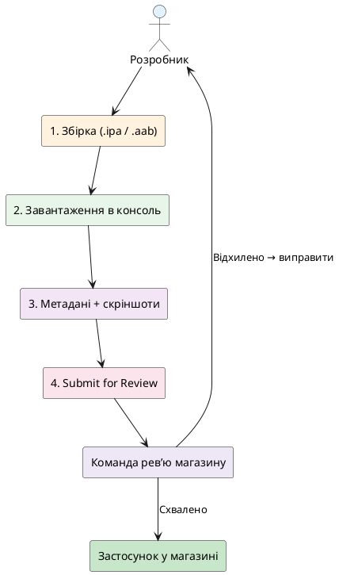
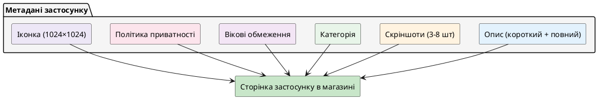
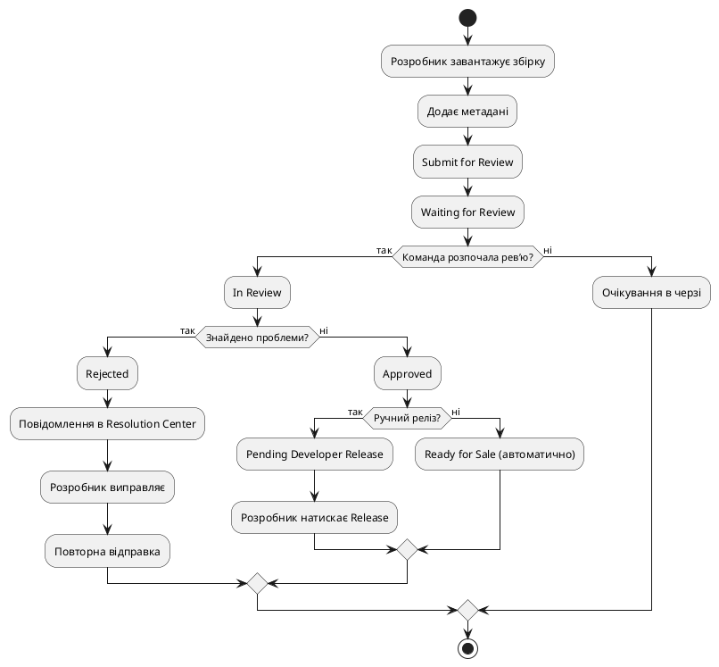
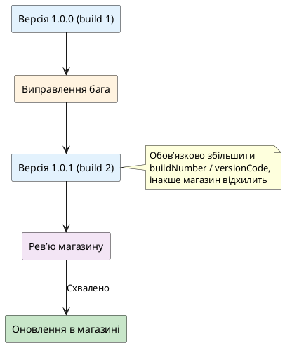
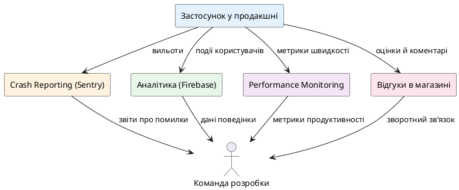

# Публікація в App Store та Google Play

## Навіщо ця стаття

Застосунок працює на вашому телефоні й на тестових пристроях команди. Наступний крок — зробити його доступним для інших людей у **магазинах додатків** (*app stores*).

У вебі опублікувати сайт — це завантажити файли на сервер, і через кілька хвилин сторінка доступна всім. У мобільному світі шлях інакший:

- застосунок потрапляє **не** напряму до користувача, а до магазину;
- магазин (App Store від Apple, Google Play від Google) **перевіряє** застосунок за правилами платформи;
- якщо правила дотримано, **схвалює** (*approves*) і публікує;
- якщо ні — **відхиляє** (*rejects*), і розробник має виправити зауваження.

Навіть після схвалення застосунок не з'являється відразу в пошуку. Потрібно підготувати **метадані** — опис, скріншоти, категорію, політику приватності. Усе це люди бачать на сторінці застосунку в магазині перед встановленням.

::note
**Головна думка статті.** Публікація мобільного застосунку — це не лише технічна збірка, а **бізнес-процес** з перевіркою, метаданими, скріншотами, політикою приватності та можливими кількома раундами спілкування з ревʼю-командою магазину. Мета статті — показати, які кроки потрібні **за межами коду** та як уникнути типових відхилень.
::

---

## Що означає «опублікувати в магазині»

У розмовній мові «опублікувати» часто означає «завантажити застосунок у магазин». Повний процес включає кілька послідовних фаз.

::steps

### Крок 1. Технічна збірка застосунку

На попередньому етапі (стаття про EAS Build або збірку на локальній машині) створили **бінарний файл** — `ipa` для iOS або `aab` / `apk` для Android. Це вже готовий застосунок, який може працювати на телефоні.

### Крок 2. Завантаження в консоль розробника

Бінарний файл завантажують до **App Store Connect** (для iOS) або **Google Play Console** (для Android). Це адміністративні вебсайти, де розробник керує своїми застосунками.

### Крок 3. Заповнення метаданих

До збірки додають опис, скріншоти, категорію, вікове обмеження, посилання на політику приватності, контактний email підтримки. Ці дані бачить користувач у магазині, коли шукає застосунок.

### Крок 4. Відправлення на ревʼю

Натискають кнопку «Submit for Review» (App Store) або «Send for Review» (Google Play). Збірка потрапляє в чергу перевірки.

### Крок 5. Ревʼю (перевірка)

Команда магазину запускає застосунок, перевіряє, чи немає порушень правил (наприклад, небезпечного контенту, відсутності політики приватності, неробочих функцій). Якщо все гаразд — **схвалює**. Якщо є зауваження — **відхиляє** з поясненням.

### Крок 6. Публікація

Після схвалення застосунок або автоматично з'являється в пошуку магазину, або розробник вручну натискає «Release». Тепер будь-хто може знайти й встановити його.

::

::plant-uml



::

::tip
**Типові терміни.** У розмові часто кажуть:
- **ревʼю** (*review*, перевірка) — процес схвалення магазином;
- **метадані** (*app metadata*) — опис, скріншоти, категорія;
- **збірка** (*build*) — скомпільований файл застосунку;
- **політика приватності** (*privacy policy*) — документ, що пояснює, які дані збирає застосунок і навіщо;
- **відхилення** (*rejection*) — коли магазин не схвалює застосунок і просить виправити.
::

---

## Дві платформи — два процеси

Apple і Google мають окремі вимоги, консолі та швидкість перевірки. У цій статті розглянемо спільне (що потрібно підготувати для обох) і відмінності (де процеси різняться).

::tabs

::tabs-item{label="App Store (iOS)" icon="i-simple-icons-apple"}

**Консоль:** [App Store Connect](https://appstoreconnect.apple.com/)

**Час ревʼю:** зазвичай від кількох годин до 2 діб (в історії було довше, зараз швидше).

**Строгість:** Apple відома детальною перевіркою. Застосунок має відповідати [App Store Review Guidelines](https://developer.apple.com/app-store/review/guidelines/) — десяткам сторінок правил, що охоплюють дизайн, функціональність, контент, монетизацію, конфіденційність.

**Вимога облікового запису розробника:** потрібен **Apple Developer Program** ($99/рік на момент написання статті). Без нього не можна завантажити застосунок у App Store Connect.

::

::tabs-item{label="Google Play (Android)" icon="i-simple-icons-android"}

**Консоль:** [Google Play Console](https://play.google.com/console/)

**Час ревʼю:** зазвичай від кількох годин до доби (часом швидше, ніж App Store).

**Строгість:** Google також перевіряє застосунок за [Developer Policy](https://play.google.com/about/developer-content-policy/), але зазвичай ревʼю менш детальне, ніж у Apple (хоча це може змінюватися). Проте Google активно використовує автоматизовану перевірку на шкідливі API й порушення політики.

**Вимога облікового запису розробника:** потрібен **Google Play Developer Account** (одноразова оплата $25 на момент написання).

::

::

::warning
**Типова помилка.** Деякі новачки думають, що процес публікації однаковий для обох платформ. Насправді Apple й Google мають різні консолі, різні правила щодо метаданих, різні процедури ревʼю. Потрібно готувати матеріали **окремо** для кожної платформи, хоча логіка застосунку залишається однією.
::

---

## Підготовка метаданих — що бачить користувач

Перед відправленням на ревʼю потрібно заповнити інформацію, яку бачить користувач у магазині.

### Опис застосунку

**Що це:** короткий текст (зазвичай до 80 символів у короткому описі й до 4000 символів у повному описі — межі відрізняються між платформами).

**Навіщо:** пояснити людині, що робить застосунок, чому їй потрібно його встановити.

**Практичні поради:**
- перше речення має відповідати на питання «що це й для кого»;
- уникайте маркетингових фраз на кшталт «найкращий застосунок у світі» — краще конкретика: «щоденник подорожей з фото й картою»;
- якщо застосунок потребує облікового запису або платної підписки, згадайте це в описі, щоб уникнути скарг користувачів.

### Скріншоти

**Що це:** зображення екранів застосунку (зазвичай 3–8 скріншотів для кожного розміру пристрою).

**Навіщо:** показати інтерфейс до встановлення. Користувач приймає рішення, дивлячись на ці картинки.

**Вимоги:**
- App Store вимагає скріншоти для різних розмірів iPhone (наприклад, 6.7" і 5.5") і iPad (якщо підтримуєте);
- Google Play вимагає принаймні 2 скріншоти, але рекомендує більше й підтримує різні форм-фактори (телефони, планшети);
- скріншоти мають бути **реальні** (не можна підробляти функціональність, якої немає в застосунку).

::tip
**Практика.** Якщо застосунок підтримує світлу й темну тему, часто показують скріншоти в одній темі (найчастіше світлій, бо вона контрастніша на фоні сторінки магазину). Деякі команди роблять «рекламні» скріншоти з текстовими написами про фічі — це дозволено, якщо вони не вводять в оману.
::

### Категорія та вікові обмеження

**Категорія:** обираєте, до якого типу застосунків належить ваш (наприклад, «Подорожі», «Продуктивність», «Соціальні мережі»). Це впливає на те, де застосунок з'являтиметься в переліках магазину.

**Вікові обмеження:** вказуєте, чи є контент, не призначений для дітей (наприклад, насильство, азартні ігри, зрілий контент). Apple та Google мають анкети з питаннями про контент — потрібно чесно відповісти.

### Політика приватності

**Що це:** публічне посилання (URL) на документ, що пояснює, які дані збирає застосунок (наприклад, email, геолокація, фото), як їх використовує, чи передає третім сторонам.

**Навіщо:** обовʼязкова вимога обох магазинів (Apple й Google) для застосунків, що збирають будь-які персональні дані. Навіть якщо застосунок нічого не збирає, потрібно явно написати «не збираємо жодних даних».

**Практичні поради:**
- політику приватності зазвичай розміщують на вашому сайті (наприклад, `https://nomad.example/privacy`);
- текст має бути зрозумілим (не лише юридичний шаблон), щоб користувач міг реально зрозуміти, чи збирається його геолокація;
- якщо застосунок використовує аналітику (наприклад, Firebase Analytics), це потрібно згадати в політиці.

::caution
**Ризик відхилення.** Застосунок **відхилять**, якщо політика приватності не відповідає фактичному збору даних. Наприклад, застосунок запитує геолокацію, а в політиці написано «не збираємо геодані». Магазин перевірить це й відхилить.
::

### Іконка застосунку

**Що це:** квадратне зображення, яке бачить користувач на головному екрані телефону після встановлення.

**Вимоги:**
- App Store: 1024×1024 px (без закруглених кутів і прозорості);
- Google Play: подібно, 512×512 px у консолі (система сама масштабує);
- іконка має бути **розпізнаваною** на малому розмірі й контрастувати з фоном.

::plant-uml



::

---

## Типові причини відхилення застосунку

Навіть якщо застосунок технічно працює, магазин може відхилити його через невідповідність правилам. Розглянемо найчастіші причини.

### Неповна функціональність або «незавершений» застосунок

**Що це означає:** застосунок містить заглушки, недоступні екрани або тестовий контент, який виглядає як помилка.

**Приклад:** в застосунку є кнопка «Завантажити дані», яка не працює й показує alert «Скоро буде». Apple відхилить, бо користувач бачить недоробку.

**Як уникнути:**
- видаліть або приховайте всі тестові кнопки;
- якщо фіча ще не готова — не показуйте її в продакшн-збірці;
- переконайтеся, що всі критичні сценарії працюють (реєстрація, вхід, основний флоу).

### Відсутність або неточна політика приватності

**Що це означає:** застосунок запитує дозволи (камера, геолокація, push-нотифікації), але в політиці приватності не пояснено, навіщо.

**Приклад:** застосунок щоденника подорожей запитує камеру, щоб прикріпити фото до місця. У політиці не згадано камеру — магазин може відхилити.

**Як уникнути:**
- явно перелічіть у політиці всі дозволи, які застосунок запитує;
- поясніть **навіщо** — не лише формальне «ми можемо збирати дані», а «камера потрібна для фото місць у поїздці».

### Недостатнє пояснення використання дозволів

**Що це означає:** в коді застосунку є запит на дозвіл (наприклад, геолокація), але пояснення (*permission rationale*) занадто загальне або відсутнє.

**Приклад (iOS):** в `Info.plist` для ключа `NSLocationWhenInUseUsageDescription` написано «Нам потрібна ваша геолокація». Apple може попросити конкретизувати: «Геолокація потрібна, щоб позначити місця на карті вашої поїздки».

**Приклад (Android):** у маніфесті запитується `ACCESS_FINE_LOCATION`, але в застосунку немає видимого UI, що пояснює це користувачу до запиту дозволу. Google може вимагати обґрунтування.

**Як уникнути:**
- додайте конкретне пояснення в системні рядки дозволів;
- показуйте користувачу попередній екран (перед запитом дозволу), де пояснюєте, навіщо застосунку потрібна камера або геолокація.

::warning
**Типова плутанина.** Деякі новачки копіюють шаблонні пояснення дозволів з документації прикладу («This app uses location»). Apple часто відхиляє такі формулювання й просить написати **специфічне** для вашого застосунку пояснення.
::


### Порушення правил контенту

**Що це означає:** застосунок містить контент, заборонений правилами магазину (наприклад, ненависницькі висловлювання, насильство, обман, азартні ігри без ліцензії, медичні поради без відповідального медперсоналу).

**Приклад:** застосунок дозволяє користувачам публікувати відгуки про інших людей, але немає модерації. Якщо в тестовій версії команда ревʼю побачить образливий контент — відхилять.

**Як уникнути:**
- якщо застосунок має контент від користувачів (*user-generated content*) — додайте модерацію або функцію скарги;
- якщо застосунок працює з медициною, фінансами, азартними іграми — переконайтеся, що дотримуєтесь відповідних правил (іноді потрібні ліцензії або додаткові документи).

### Застосунок потребує облікового запису, але тестові дані не надано

**Що це означає:** якщо застосунок вимагає реєстрацію або вхід (наприклад, корпоративний застосунок для співробітників компанії), команда ревʼю не зможе протестувати його без облікового запису. Apple й Google вимагають надати **тестові дані** (логін і пароль) у нотатках для ревʼю.

**Приклад:** застосунок для замовлення їжі в певному ресторані. Неможливо зареєструватися без коду запрошення. Якщо розробник не надав код у нотатках для ревʼю, застосунок відхилять.

**Як уникнути:**
- у App Store Connect і Google Play Console є поле «Review Notes» або «Notes for Reviewer» — туди пишіть тестові облікові дані;
- створіть спеціальний тестовий обліковий запис, який не видалите після ревʼю.

::tip
**Практика.** Якщо застосунок працює лише в певній країні (наприклад, сервіс доставки їжі в одному місті), згадайте це в нотатках для ревʼю, інакше команда може спробувати запустити з іншої країни й вирішить, що застосунок не працює.
::

### Порушення правил монетизації

**Що це означає:** застосунок приймає платежі через сторонні платіжні системи, минаючи офіційний механізм In-App Purchase (для iOS) або Google Play Billing (для Android), коли це заборонено.

**Приклад:** застосунок продає цифровий контент (наприклад, доступ до преміум-статей) через стороннього процесора платежів. Apple вимагає, щоб цифровий контент усередині застосунку продавався через In-App Purchase (де Apple бере комісію). Застосунок відхилять.

**Виключення:** фізичні товари або послуги поза застосунком (наприклад, таксі, готель, їжа) можна оплачувати через сторонні системи.

**Як уникнути:**
- якщо продаєте доступ до функцій застосунку (підписка на преміум) — використовуйте офіційні механізми магазину;
- якщо це фізичні товари — можете використовувати Stripe, PayPal тощо без проблем.

::caution
**Ризик відхилення.** Apple строго слідкує за цим правилом. Навіть згадування в UI застосунку, що користувач може оплатити на вашому сайті й отримати підписку, може призвести до відхилення. Правила змінюються, але загальна лінія: цифровий контент усередині застосунку — через офіційний магазин.
::

---

## Процес ревʼю в App Store

Розглянемо детальніше, як працює перевірка в Apple App Store.

### Відправлення на ревʼю

У **App Store Connect** ви створюєте «версію» застосунку (наприклад, `1.0.0`), завантажуєте збірку (через Xcode або EAS Build), додаєте метадані й натискаєте «Submit for Review».

Застосунок потрапляє в чергу. Зазвичай статус змінюється так:

1. **Waiting for Review** — застосунок у черзі.
2. **In Review** — команда розпочала перевірку.
3. **Pending Developer Release** (якщо схвалено й обрано ручний реліз) або **Ready for Sale** (якщо автоматичний реліз).

Якщо застосунок **відхилено**, статус стає **Rejected**, і в Resolution Center з'являється повідомлення з переліком проблем.

### Що перевіряє команда ревʼю

**Технічна функціональність:**
- чи запускається застосунок без вильотів (*crashes*);
- чи працюють основні сценарії (реєстрація, вхід, навігація);
- чи немає битих посилань або незавершених екранів.

**Відповідність дизайн-гайдам:**
- чи використовуєте ви стандартні системні елементи або власний UI (якщо власний — він має бути якісним і не вводити в оману);
- чи застосунок не виглядає як «мобільна обгортка сайту» без адаптації під мобільний інтерфейс.

**Контент і політика:**
- чи немає заборонених матеріалів;
- чи політика приватності відповідає дозволам, які запитує застосунок;
- чи не порушує застосунок правил щодо платежів.

::plant-uml



::

### Типовий сценарій відхилення

Уявімо: застосунок щоденника подорожей **Nomad** відправили на ревʼю вперше. Через добу отримали повідомлення:

> **Guideline 5.1.1 - Data Collection and Storage**
> 
> Your app requests location access, but the purpose string doesn't clearly explain how the location data will be used. Please revise the `NSLocationWhenInUseUsageDescription` to include a detailed explanation.

**Що робити:**
1. Прочитати посилання на конкретний пункт правил (Guideline 5.1.1).
2. Зрозуміти проблему: пояснення запиту геолокації занадто загальне.
3. Виправити в коді: замість `"We need your location"` написати `"Location is used to mark places on your trip map"`.
4. Зібрати нову збірку з виправленням.
5. Відповісти в Resolution Center, що виправлено, і завантажити нову збірку.
6. Повторно відправити на ревʼю.

Зазвичай повторна перевірка після виправлення проходить швидше.

::note
Apple надає **можливість апеляції** (*appeal*), якщо ви вважаєте, що відхилення помилкове. Проте частіше простіше виправити зауваження, ніж сперечатися з ревʼю-командою. Апеляція має сенс, якщо правило неоднозначне або ви можете довести, що застосунок не порушує правил.
::

---

## Процес ревʼю в Google Play

Google Play також перевіряє застосунки, але процес дещо інакший.

### Відправлення на ревʼю

У **Google Play Console** ви створюєте «реліз» (*release*), завантажуєте `.aab` (Android App Bundle — рекомендований формат, бо Google сам генерує оптимізовані `.apk` для різних пристроїв), заповнюєте метадані й натискаєте «Review and Roll Out».

Застосунок проходить автоматичну перевірку (сканування на шкідливий код, перевірку підпису) і може бути **опублікований** досить швидко (інколи за кілька годин). Проте Google може провести **додаткову перевірку** вручну після публікації або пізніше, якщо виявить підозрілу поведінку чи скарги користувачів.

### Що перевіряє Google

**Автоматизована перевірка:**
- чи не містить застосунок відомих шкідливих бібліотек або API;
- чи коректно підписано застосунок (криптографічний підпис розробника);
- чи не порушує застосунок очевидні правила (наприклад, використання заборонених API без дозволів).

**Ручна перевірка (не завжди відразу):**
- Google може перевірити застосунок вручну, якщо він потрапив у список підозрілих або отримав скарги;
- перевіряють контент, дотримання політики, робочу функціональність.

**Типові причини відхилення:**
- застосунок запитує дозволи, які не відповідають функціональності (наприклад, запитує SMS, але не використовує);
- застосунок містить контент для дорослих, але не позначений відповідною віковою категорією;
- застосунок вводить в оману щодо функціональності (обіцяє одне, робить інше).

::warning
**Типова плутанина.** Деякі розробники думають, що якщо Google опублікував застосунок швидко, значить він «схвалений назавжди». Насправді Google може **видалити** застосунок навіть через місяці після публікації, якщо виявить порушення або отримає скарги користувачів. Важливо дотримуватися правил постійно, а не лише під час першої публікації.
::

### Відмінності від App Store

::tabs

::tabs-item{label="App Store"}
- Перевірка відбувається **до** публікації;
- Застосунок не з'являється в магазині, доки не схвалений;
- Відхилення блокує публікацію — потрібно виправити й повторно відправити.
::

::tabs-item{label="Google Play"}
- Автоматизована перевірка відбувається швидко, застосунок може з'явитися в магазині швидше;
- Ручна перевірка може статися **після** публікації;
- Google може видалити застосунок з магазину навіть після публікації, якщо виявить порушення.
::

::

---

## Версійність і оновлення застосунку

Після першої публікації застосунок не застигає назавжди. Розробники регулярно випускають оновлення: виправляють баги, додають нові фічі, покращують UI.

### Номери версій

У мобільних застосунках є два поняття версії:

**Version (або Version Name):**
- це рядок, який бачать користувачі (наприклад, `1.0.0`, `1.1.0`, `2.0.0`);
- керується розробником;
- зазвичай слідує [семантичному версіонуванню](https://semver.org/): `major.minor.patch`;
- `major` — великі зміни, несумісність;
- `minor` — нові фічі, зворотно сумісні;
- `patch` — виправлення багів.

**Build Number (або Version Code):**
- це ціле число, яке зростає з кожною збіркою (наприклад, `1`, `2`, `3`...);
- магазин використовує це число, щоб визначити, чи нова збірка новіша за попередню;
- користувач його **не бачить**, але воно критично важливе: якщо завантажити збірку з меншим Build Number, магазин відхилить її як «старішу».

**Приклад еволюції:**

| Реліз | Version (Name) | Build Number | Коментар |
| ----- | -------------- | ------------ | -------- |
| Перша публікація | `1.0.0` | `1` | Застосунок у магазині |
| Виправлення бага | `1.0.1` | `2` | Patch-оновлення |
| Нова фіча | `1.1.0` | `3` | Minor-оновлення |
| Велике оновлення | `2.0.0` | `4` | Major-оновлення |

::tip
**Практика в Expo.** У `app.json` або `app.config.ts`:
```json
{
  "expo": {
    "version": "1.0.0",
    "ios": { "buildNumber": "1" },
    "android": { "versionCode": 1 }
  }
}
```
При кожному новому релізі збільшуйте `buildNumber` (iOS) і `versionCode` (Android). Забудете — магазин відхилить оновлення.
::

### Процес оновлення

Оновлення застосунку проходить той самий процес ревʼю, що й перша публікація:

1. Змінюєте код, збільшуєте версію й номер збірки.
2. Збираєте нову збірку.
3. Завантажуєте в App Store Connect / Google Play Console.
4. Заповнюєте **Release Notes** (що нового в цій версії) — це бачать користувачі в магазині.
5. Відправляєте на ревʼю.
6. Після схвалення оновлення з'являється в магазині, і користувачі отримують сповіщення про доступне оновлення (якщо ввімкнули автооновлення — оновляться автоматично).

::plant-uml



::

::caution
**Ризик.** Якщо в оновленні є критичний баг (наприклад, застосунок вилітає при запуску), користувачі почнуть скаржитися й ставити погані оцінки. Важливо тестувати оновлення так само ретельно, як і першу версію. Деякі команди спочатку випускають оновлення на **бета-трек** (окремий канал у Google Play або TestFlight для iOS), щоб перевірити на малій групі користувачів перед повним релізом.
::

---

## Over-the-Air (OTA) оновлення — окрема тема

Окрім повних оновлень через магазин, у світі React Native (особливо з Expo) існує спосіб **оновити JavaScript-код без нової збірки** — це називають **OTA-оновленням** (*over-the-air update*).

**Суть:** оновлюється лише JS-частина застосунку (бандл), а нативна частина (файли `.ipa` / `.aab`) залишається незмінною. Користувач не бачить оновлення в магазині — застосунок завантажує новий код з вашого сервера при наступному запуску.

**Переваги:**
- виправлення багів доходять до користувачів за хвилини (не потрібно чекати ревʼю магазину);
- можна A/B-тестувати фічі без повного релізу.

**Обмеження:**
- не можна змінити нативний код (наприклад, додати нову бібліотеку, яка вимагає зміни `ios/` або `android/`);
- якщо порушити правила магазину через OTA-оновлення (наприклад, додати заборонену функціональність), магазин може видалити застосунок.

**Інструменти:**
- **Expo Updates** (для Expo-застосунків);
- **CodePush** (Microsoft, для React Native CLI-застосунків).

Ця тема детально розглядається в окремій статті курсу (№34, OTA і CI/CD). Тут достатньо знати: OTA — це не заміна магазинним оновленням, а **додатковий** інструмент для швидких виправлень JS-коду.

::note
**Правило.** Якщо оновлення вимагає зміни нативних залежностей, дозволів або конфігурації — **потрібна нова збірка й ревʼю магазину**. OTA не допоможе. Якщо лише JS (логіка, UI, стилі) — OTA підходить.
::


---

## Моніторинг і реагування на проблеми після публікації

Після того, як застосунок з'явився в магазині, робота не закінчується. Користувачі можуть знаходити баги, залишати скарги, ставити оцінки. Важливо мати систему відстеження проблем і швидкого реагування.

### Відстеження помилок (crash reporting)

**Що це:** сервіси, які автоматично збирають інформацію про вильоти застосунку (*crashes*) і надсилають звіти розробникам.

**Популярні інструменти:**
- **Sentry** — платформа для відстеження помилок у JavaScript і нативному коді;
- **Firebase Crashlytics** — безкоштовний сервіс від Google;
- **Bugsnag**, **Rollbar** — альтернативи.

**Навіщо:** якщо застосунок вилітає у 5% користувачів на певній моделі телефону, ви дізнаєтесь про це з звіту й зможете виправити. Без crash reporting ви дізнаєтесь про проблему лише з погано сформульованих скарг у відгуках магазину.

**Приклад інтеграції Sentry в React Native:**

```typescript
// app/_layout.tsx (або точка входу)
import * as Sentry from '@sentry/react-native';

Sentry.init({
  dsn: 'https://ваш-публічний-ключ@sentry.io/проєкт',
  environment: __DEV__ ? 'development' : 'production',
  tracesSampleRate: 1.0, // для production часто знижують до 0.1–0.2
});

export default function RootLayout() {
  // решта коду
}
```

Після цього будь-який uncaught exception автоматично надсилатиметься до Sentry, і ви отримаєте детальний звіт із трасуванням стека (*stack trace*), пристроєм, версією ОС.

::tip
**Практика.** Інтегруйте crash reporting **до** першої публікації. Якщо почекаєте до моменту, коли з'являться скарги — вже пізно, бо ви не матимете даних про попередні вильоти. Багато команд додають Sentry або Crashlytics на етапі MVP.
::

### Аналітика поведінки користувачів

**Що це:** збір даних про те, які екрани відкривають користувачі, які кнопки натискають, скільки часу проводять у застосунку.

**Популярні інструменти:**
- **Firebase Analytics** (безкоштовний, інтегрований з іншими сервісами Firebase);
- **Amplitude**, **Mixpanel** (більше можливостей для аналізу воронок і когорт);
- **Segment** (агрегатор, який пересилає події до різних сервісів).

**Навіщо:** розуміти, чи користувачі насправді використовують нові фічі, де відваляються з онбордингу, чи є екрани, на які ніхто не заходить. Аналітика допомагає приймати рішення про продукт.

**Обовʼязково:** якщо збираєте аналітику, **згадайте це в політиці приватності**. Магазин перевірить, і якщо політика не відповідає реальному збору даних — відхилить застосунок або видалить після публікації.

### Відгуки та оцінки в магазині

Користувачі можуть залишати **оцінки** (зірки від 1 до 5) і **текстові відгуки** (*reviews*) у магазині. Це впливає на видимість застосунку й довіру нових користувачів.

**Як реагувати:**
- **App Store:** у App Store Connect є можливість **відповідати на відгуки** (один раз на відгук). Якщо користувач скаржиться на баг — можна відповісти: «Дякуємо за повідомлення, ми виправили цю проблему у версії 1.0.1. Оновіть застосунок, будь ласка».
- **Google Play:** аналогічно, у Play Console можна відповідати на відгуки. Часто користувачі змінюють оцінку на кращу після того, як їхня проблема вирішена.

**Практичні поради:**
- не ігноруйте негативні відгуки — навіть коротка відповідь показує, що команда дбає про користувачів;
- не сперечайтеся з користувачами публічно — це лише погіршує враження;
- якщо багато схожих скарг на одну проблему — це сигнал пріоритизувати виправлення.

::warning
**Типова помилка.** Деякі команди просять друзів «накрутити» позитивні відгуки відразу після публікації. Це порушує правила магазинів, і якщо виявлять — застосунок можуть видалити. Краще отримувати чесні відгуки й працювати над якістю.
::

### Моніторинг продуктивності (performance)

**Що це:** збір даних про швидкість запуску застосунку, час відгуку на дії користувача, споживання памʼяті й батареї.

**Інструмент:** **Firebase Performance Monitoring** — відстежує метрики продуктивності автоматично (час запуску, HTTP-запити, кастомні траси).

**Навіщо:** якщо застосунок повільно запускається на старих пристроях, користувачі залишать негативні відгуки. Моніторинг допомагає виявити проблеми до того, як вони стануть масовими.

::plant-uml



::

---

## Чеклист підготовки до публікації

Перед відправленням застосунку на ревʼю перевірте ці пункти. Кожен пропущений пункт може призвести до відхилення.

::field-group

::field{name="Функціональність протестована" type="boolean"}
Усі критичні сценарії працюють (реєстрація, вхід, основний флоу). Немає тестових кнопок або заглушок, видимих користувачу.
::

::field{name="Політика приватності готова й доступна" type="string"}
URL політики приватності працює, документ пояснює всі дозволи, які запитує застосунок (камера, геолокація, push-нотифікації тощо).
::

::field{name="Пояснення дозволів конкретні" type="string"}
У `Info.plist` (iOS) і маніфесті (Android) пояснення дозволів не шаблонні, а специфічні для вашого застосунку.
::

::field{name="Іконка застосунку готова" type="string"}
1024×1024 px (iOS), 512×512 px (Google Play), без прозорості, розпізнавана на малому розмірі.
::

::field{name="Скріншоти підготовлені" type="array"}
Принаймні 3–5 скріншотів для кожного розміру пристрою (iPhone, iPad, Android phones). Скріншоти реальні, не фейкові.
::

::field{name="Опис застосунку написаний" type="string"}
Короткий і повний опис пояснюють, що робить застосунок, для кого він призначений. Згадано, якщо потрібен обліковий запис або платна підписка.
::

::field{name="Категорія та вікові обмеження обрані" type="string"}
Категорія відповідає змісту застосунку. Вікові обмеження чесно відображають контент (наприклад, якщо є згадки насильства — позначити відповідно).
::

::field{name="Тестові дані надано (якщо потрібен вхід)" type="string"}
У нотатках для ревʼю вказані тестовий логін і пароль, якщо застосунок вимагає реєстрацію. Тестовий обліковий запис не видалиться після ревʼю.
::

::field{name="Монетизація відповідає правилам" type="string"}
Якщо продаєте цифровий контент усередині застосунку — використовуєте офіційний механізм магазину (In-App Purchase / Google Play Billing). Якщо фізичні товари — можна сторонню платіжку.
::

::field{name="Crash reporting інтегровано" type="string"}
Sentry, Crashlytics або інший сервіс налаштовано, щоб відстежувати вильоти після публікації.
::

::field{name="Версія й номер збірки коректні" type="string"}
`version` (наприклад, `1.0.0`) і `buildNumber` / `versionCode` встановлені. При оновленні buildNumber збільшується.
::

::

::tip
**Практика.** Роздрукуйте цей чеклист і пройдіть його фізично перед кожною публікацією. Багато відхилень трапляються через дрібниці, про які забули в останній момент (наприклад, не оновили політику приватності після додавання камери).
::

---

## Міні-проєкт: Заповнення метаданих і чеклист для застосунку

У цьому міні-проєкті ви не пишете код, а готуєте **документи й матеріали** для публікації. Мета — навчитися структурувати інформацію так, щоб магазин схвалив застосунок.

### Постановка задачі

Уявіть, що ви розробили застосунок **«Мій Щоденник»** — особистий щоденник з текстовими записами й фото. Застосунок запитує дозвіл на камеру (щоб прикріплювати фото до записів) і зберігає дані локально (без серверної частини).

**Що потрібно підготувати:**

1. Короткий опис застосунку (до 80 символів).
2. Повний опис застосунку (до 4000 символів).
3. Пояснення запиту дозволу камери (текст для `Info.plist` на iOS і маніфесту на Android).
4. Політику приватності (структура документа — не обовʼязково писати повний юридичний текст, але перелічити ключові пункти).
5. Список з 5 скріншотів (опишіть, що має бути на кожному).
6. Категорію застосунку та вікове обмеження.
7. Чеклист готовності до публікації (пройдіть усі пункти з попереднього розділу для цього застосунку).

### Приклад виконання

::collapsible{title="Повний приклад метаданих для «Мій Щоденник» — розгорнути за потреби"}

#### 1. Короткий опис (Short Description)

```
Особистий щоденник з фото — записуй думки та спогади приватно.
```

*(77 символів — під ліміт 80)*

#### 2. Повний опис (Full Description)

```
«Мій Щоденник» — це застосунок для ведення особистого щоденника на вашому телефоні. Записуйте думки, спогади, ідеї та прикріплюйте фото, щоб зберегти моменти.

Особливості:
• Приватність: усі дані зберігаються локально на вашому пристрої, жодних серверів.
• Фото: прикріплюйте до записів фото з камери або галереї.
• Пошук: швидко знайдіть записи за ключовими словами.
• Темна тема: комфортне читання ввечері.
• Безкоштовно: немає підписок і платних функцій.

Застосунок ідеально підходить для тих, хто цінує приватність і хоче мати цифровий щоденник завжди під рукою.

Дозволи:
• Камера: щоб робити фото та прикріплювати до записів.
• Галерея: щоб обирати фото з ваших альбомів.

Ми не збираємо жодних персональних даних і не маємо доступу до ваших записів. Усе зберігається локально на вашому телефоні.
```

*(Близько 900 символів — можна розширити до 4000, додавши більше деталей про функціональність.)*

#### 3. Пояснення дозволу камери

**iOS (`Info.plist`):**

```xml
<key>NSCameraUsageDescription</key>
<string>Камера потрібна, щоб робити фото та прикріплювати їх до записів у вашому щоденнику.</string>

<key>NSPhotoLibraryUsageDescription</key>
<string>Доступ до галереї потрібен, щоб обрати фото з ваших альбомів і додати їх до записів.</string>
```

**Android (AndroidManifest.xml):**

```xml
<uses-permission android:name="android.permission.CAMERA" />
<uses-permission android:name="android.permission.READ_EXTERNAL_STORAGE" />
```

*(У коді застосунку додатково показуємо користувачу пояснення перед запитом дозволу — через UI або rationale-діалог.)*

#### 4. Політика приватності (структура)

**URL:** `https://mydiary.example/privacy` (реальний робочий URL, доступний публічно)

**Зміст:**

```markdown
# Політика приватності застосунку «Мій Щоденник»

Дата оновлення: 7 вересня 2026

## Які дані ми збираємо

Застосунок «Мій Щоденник» НЕ збирає жодних персональних даних. Усі ваші записи та фото зберігаються локально на вашому пристрої.

## Дозволи, які запитує застосунок

- **Камера:** щоб робити фото для прикріплення до записів.
- **Галерея:** щоб обирати фото з ваших альбомів.

Ці дозволи використовуються виключно для функціональності застосунку. Ми не маємо доступу до ваших фото поза застосунком і не передаємо їх третім сторонам.

## Аналітика та трекінг

Застосунок НЕ використовує жодних сервісів аналітики (наприклад, Google Analytics, Firebase). Ми не відстежуємо вашу поведінку.

## Зміни в політиці

Якщо ми внесемо зміни в цю політику, оновлена версія буде опублікована за цим посиланням. Дата останнього оновлення вказана вгорі.

## Контакти

Якщо у вас є питання щодо приватності, напишіть нам: support@mydiary.example
```

#### 5. Список скріншотів (5 шт.)

1. **Головний екран:** список записів щоденника (3–4 записи з датами й короткими превʼю тексту).
2. **Екран створення запису:** форма з текстовим полем і кнопкою «Додати фото».
3. **Запис із прикріпленим фото:** детальний екран запису, де видно текст і фото знизу.
4. **Пошук:** екран пошуку з введеним запитом і результатами.
5. **Темна тема:** той самий головний екран у темній темі, щоб показати підтримку різних режимів.

*(Кожен скріншот має бути реальним із застосунку, без підробленої функціональності.)*

#### 6. Категорія та вікове обмеження

**Категорія:** «Productivity» (Продуктивність) або «Lifestyle» (Стиль життя).

**Вікове обмеження:** 4+ (App Store) / «Everyone» (Google Play) — немає контенту для дорослих, насильства, азартних ігор.

#### 7. Чеклист готовності

- [x] Функціональність протестована: застосунок запускається, можна створювати записи, прикріплювати фото, шукати.
- [x] Політика приватності готова й доступна за посиланням `https://mydiary.example/privacy`.
- [x] Пояснення дозволу камери конкретне: «щоб робити фото та прикріплювати їх до записів».
- [x] Іконка застосунку готова: 1024×1024 px, зображення щоденника з олівцем.
- [x] Скріншоти підготовлені: 5 шт., різні екрани, світла й темна теми.
- [x] Опис застосунку написаний: короткий і повний, пояснюють функціональність і приватність.
- [x] Категорія «Productivity», вікове обмеження 4+.
- [x] Тестові дані: не потрібні, застосунок не вимагає реєстрації.
- [x] Монетизація: немає платежів, безкоштовний застосунок.
- [x] Crash reporting: інтегровано Sentry (опціонально для міні-проєкту, але в реальному застосунку — обовʼязково).
- [x] Версія 1.0.0, buildNumber 1 (iOS), versionCode 1 (Android).

::

### Критерії готовності міні-проєкту

- Короткий і повний опис написані чітко, без маркетингової «води».
- Пояснення дозволів конкретні (не «нам потрібна камера», а «щоб робити фото для записів»).
- Політика приватності перелічує всі дозволи й чесно каже, що не збирає дані (якщо це так).
- Список скріншотів описує реальні екрани застосунку, без фейкової функціональності.
- Чеклист пройдений — усі пункти позначені як виконані.

::tip
**Рекомендація.** Зберігайте цей шаблон у репозиторії застосунку (наприклад, `docs/store-metadata.md`). Перед кожною публікацією оновлюйте його — це допоможе не забути жодного пункту.
::


---

## Наскрізний проєкт: Nomad — підготовка метаданих магазину

### Навіщо користувачу

Застосунок **Nomad** (щоденник подорожей) готовий до публікації: є авторизація, створення поїздок, прикріплення фото, карта місць, офлайн-режим, нагадування. Користувачі очікують побачити його в App Store та Google Play.

Щоб магазин схвалив застосунок, потрібно підготувати:
- політику приватності (Nomad збирає email, геолокацію, фото);
- опис застосунку українською мовою (оскільки UI застосунку UA);
- пояснення дозволів (камера, геолокація, нотифікації);
- скріншоти ключових екранів;
- metadata для обох платформ.

### Нитка проєкту

**Уже є (з попередніх статей):**
- авторизація (email + пароль);
- список поїздок із можливістю створення нових;
- прикріплення фото до місць (камера й галерея);
- карта з маркерами місць;
- офлайн-режим (збереження даних локально);
- локальні нагадування про поїздки;
- deep links для відкриття конкретної поїздки;
- світла й темна теми.

**Додаємо в цій статті:**
- файл політики приватності (`docs/privacy-policy.md`);
- файл метаданих магазину (`docs/store-metadata.md`);
- пояснення дозволів у конфігурації (`app.json`);
- приклади скріншотів (описи, що має бути на кожному).

### Повний знімок проєкту

::code-tree

```json [app.json]
{
  "expo": {
    "name": "Nomad",
    "slug": "nomad",
    "version": "1.0.0",
    "orientation": "portrait",
    "icon": "./assets/icon.png",
    "userInterfaceStyle": "automatic",
    "splash": {
      "image": "./assets/splash.png",
      "resizeMode": "contain",
      "backgroundColor": "#ffffff"
    },
    "ios": {
      "buildNumber": "1",
      "bundleIdentifier": "dev.kostyl.nomad",
      "supportsTablet": true,
      "infoPlist": {
        "NSCameraUsageDescription": "Камера потрібна, щоб робити фото місць у ваших поїздках.",
        "NSPhotoLibraryUsageDescription": "Доступ до галереї потрібен, щоб обрати фото місць із ваших альбомів.",
        "NSLocationWhenInUseUsageDescription": "Геолокація використовується для позначення місць на карті вашої поїздки."
      }
    },
    "android": {
      "versionCode": 1,
      "package": "dev.kostyl.nomad",
      "adaptiveIcon": {
        "foregroundImage": "./assets/adaptive-icon.png",
        "backgroundColor": "#ffffff"
      },
      "permissions": [
        "android.permission.CAMERA",
        "android.permission.READ_EXTERNAL_STORAGE",
        "android.permission.ACCESS_FINE_LOCATION",
        "android.permission.POST_NOTIFICATIONS"
      ]
    },
    "web": {
      "favicon": "./assets/favicon.png"
    },
    "plugins": [
      "expo-router",
      [
        "expo-camera",
        {
          "cameraPermission": "Камера потрібна, щоб робити фото місць у ваших поїздках."
        }
      ],
      [
        "expo-location",
        {
          "locationWhenInUsePermission": "Геолокація використовується для позначення місць на карті вашої поїздки."
        }
      ],
      [
        "expo-notifications",
        {
          "icon": "./assets/notification-icon.png"
        }
      ]
    ]
  }
}
```

```markdown [docs/privacy-policy.md]
# Політика приватності застосунку Nomad

Дата оновлення: 7 вересня 2026

## Вступ

Застосунок **Nomad** (далі — «ми», «застосунок») створений для ведення особистого щоденника подорожей. Ми серйозно ставимося до вашої приватності й хочемо, щоб ви розуміли, які дані ми збираємо і як їх використовуємо.

## Які дані ми збираємо

### Облікові дані
- **Email-адреса:** для реєстрації облікового запису та входу.
- **Пароль:** зберігається у зашифрованому вигляді на нашому сервері.

### Дані поїздок
- **Назви поїздок, описи місць, текстові нотатки:** створені вами в застосунку.
- **Фото:** фотографії, які ви прикріплюєте до місць у поїздках (зберігаються на нашому сервері).

### Геолокація
- **Координати місць:** коли ви позначаєте місце на карті, ми зберігаємо його координати (широта, довгота).
- **Геолокація використовується лише всередині застосунку** для відображення місць на карті. Ми не відстежуємо вашу геолокацію в фоновому режимі.

### Локальні дані
- **Офлайн-кеш:** записи, створені без інтернету, зберігаються локально на вашому пристрої до синхронізації з сервером.

## Як ми використовуємо ці дані

- **Для функціональності застосунку:** показати ваші поїздки, фото, карту місць.
- **Для синхронізації між пристроями:** якщо ви входите в обліковий запис на іншому телефоні, ваші дані доступні там само.
- **Для підтримки:** якщо ви напишете нам зі скаргою, ми можемо попросити ваш email для відповіді.

## Передача даних третім сторонам

Ми **не продаємо** ваші дані. Ми використовуємо:
- **Хостинг-провайдера** (наприклад, AWS, Vercel) для зберігання даних на сервері.
- **Sentry** (сервіс відстеження помилок) — отримує технічні дані про вильоти застосунку (версія ОС, модель пристрою, stack trace), але НЕ отримує ваші особисті записи.

## Дозволи застосунку

Застосунок запитує наступні дозволи:

- **Камера:** щоб робити фото місць у ваших поїздках.
- **Галерея (фото):** щоб обирати фото з ваших альбомів.
- **Геолокація:** щоб позначати місця на карті поїздки.
- **Нотифікації:** щоб надсилати вам локальні нагадування про заплановані поїздки.

Ви можете відмовити в будь-якому дозволі, але деякі функції застосунку не працюватимуть (наприклад, без дозволу камери не зможете робити фото).

## Безпека

Ми зберігаємо паролі у зашифрованому вигляді (bcrypt). Зʼєднання з сервером відбувається через HTTPS. Проте жоден спосіб передачі даних через інтернет не є абсолютно безпечним — ми робимо все можливе для захисту ваших даних.

## Видалення даних

Ви можете видалити свій обліковий запис у налаштуваннях застосунку. Після видалення всі ваші записи, фото й облікові дані будуть видалені з нашого сервера протягом 30 днів.

## Діти

Застосунок не призначений для дітей молодше 13 років. Ми свідомо не збираємо дані від дітей.

## Зміни в політиці

Якщо ми внесемо зміни в цю політику, оновлена версія буде опублікована на цій сторінці. Дата останнього оновлення вказана вгорі документа.

## Контакти

Якщо у вас є питання щодо цієї політики приватності, напишіть нам:

- **Email:** support@nomad.example (замініть на реальний email підтримки)
- **Сайт:** https://nomad.example/privacy (замініть на реальний URL)
```

```markdown [docs/store-metadata.md]
# Метадані для App Store та Google Play: Nomad

## Загальна інформація

**Назва застосунку:** Nomad
**Короткий опис (Subtitle / Short description):** Щоденник подорожей з фото та картою місць
**Категорія:** Travel (Подорожі)
**Вікове обмеження:** 4+ (App Store) / Everyone (Google Play)

## Опис застосунку (український)

### Короткий опис (до 80 символів)

```
Nomad — щоденник подорожей із фото, картою та офлайн-режимом.
```

*(77 символів)*

### Повний опис (до 4000 символів)

```
Nomad — це ваш особистий щоденник подорожей, який завжди з вами.

Створюйте поїздки, додавайте місця з фото та нотатками, позначайте їх на карті та зберігайте спогади про кожну подорож. Навіть без інтернету — всі дані синхронізуються автоматично, коли зʼєднання зʼявиться.

🗺️ Основні можливості:
• Поїздки: створюйте окремі поїздки для кожної подорожі (відпустка, робоча поїздка, вихідні).
• Місця: додавайте місця (ресторани, музеї, парки) з фото, нотатками та координатами.
• Карта: всі місця відображаються на інтерактивній карті поїздки.
• Фото: робіть фото прямо в застосунку або обирайте з галереї.
• Офлайн-режим: створюйте записи без інтернету — вони синхронізуються пізніше.
• Нагадування: отримуйте локальні нотифікації про заплановані поїздки.
• Темна тема: комфортне використання вдень і вночі.

🔒 Приватність:
Ваші дані зберігаються на захищеному сервері з шифруванням. Ми не продаємо ваші дані третім сторонам. Детальніше: https://nomad.example/privacy

🌍 Для кого:
Nomad підходить для мандрівників, які хочуть систематизувати спогади про подорожі, зберігати фото місць і мати швидкий доступ до них навіть без інтернету.

📱 Дозволи:
• Камера: щоб робити фото місць.
• Галерея: щоб обирати фото з ваших альбомів.
• Геолокація: щоб позначати місця на карті.
• Нотифікації: щоб надсилати локальні нагадування про поїздки.

Завантажуйте Nomad і починайте записувати свої подорожі вже сьогодні!
```

*(Близько 1400 символів — можна розширити додатковими прикладами сценаріїв використання.)*

## Скріншоти (опис, що має бути на кожному)

### iOS (6.7" iPhone)

1. **Список поїздок (світла тема):**
   - Головний екран з 3–4 картками поїздок (назви, дати, превʼю першого фото).
   - Кнопка «Додати поїздку» внизу екрана (sticky CTA).

2. **Карта місць у поїздці:**
   - Екран деталей поїздки з картою, на якій позначені маркери місць (3–4 маркери).
   - Кнопка для додавання нового місця.

3. **Деталі місця з фото:**
   - Екран конкретного місця: назва, опис, велике фото зверху, координати знизу.

4. **Створення нової поїздки (форма):**
   - Форма з полями «Назва поїздки», «Дата початку», «Дата завершення».
   - Кнопка «Зберегти».

5. **Список поїздок (темна тема):**
   - Той самий головний екран, але в темній темі, щоб показати підтримку dark mode.

6. **Екран авторизації:**
   - Форма входу (email, пароль) або екран реєстрації.

### Android (аналогічно, можна ті самі екрани)

Скріншоти мають бути реальними з застосунку, без підроблених даних або функцій.

## Ключові слова (для пошуку в магазині)

App Store (Keywords, розділені комами):
```
подорожі, щоденник, карта, фото, мандри, офлайн, місця, записи, спогади
```

Google Play (аналогічно, але в описі — Google не має окремого поля для keywords, вони беруться з опису).

## Контактна інформація

- **Email підтримки:** support@nomad.example (обовʼязково реальний email)
- **Сайт:** https://nomad.example
- **Політика приватності:** https://nomad.example/privacy (обовʼязково доступна публічно)

## Release Notes (що нового у версії 1.0.0)

```
• Перший реліз Nomad!
• Створення поїздок і місць з фото.
• Карта з маркерами місць.
• Офлайн-режим для роботи без інтернету.
• Локальні нагадування про поїздки.
• Світла й темна теми.
```

## Тестові дані для ревʼю (Notes for Reviewer)

```
Тестовий обліковий запис:
Email: reviewer@nomad.example
Пароль: ReviewPassword123!

У тестовому обліковому записі вже є одна поїздка з кількома місцями й фото. 
Ви можете створити нову поїздку, додати місце з фото, перевірити офлайн-режим (вимкнувши Wi-Fi).

Застосунок не вимагає жодних спеціальних налаштувань або VPN.
```

## Чеклист

- [x] Політика приватності готова й доступна за URL.
- [x] Пояснення дозволів конкретні (камера, геолокація, нотифікації).
- [x] Скріншоти описані (6 шт. для iOS, аналогічно для Android).
- [x] Опис застасунку українською мовою, відповідає функціональності.
- [x] Тестові дані надано для ревʼю.
- [x] Категорія «Travel», вікове обмеження 4+.
- [x] Іконка 1024×1024 готова (у `assets/icon.png`).
- [x] Версія 1.0.0, buildNumber 1 (iOS), versionCode 1 (Android).
- [x] Sentry інтегровано для crash reporting.
```

```typescript [src/config/sentry.ts]
import * as Sentry from '@sentry/react-native';

// Ініціалізація Sentry для crash reporting
export function initSentry() {
  Sentry.init({
    dsn: process.env.EXPO_PUBLIC_SENTRY_DSN,
    environment: __DEV__ ? 'development' : 'production',
    tracesSampleRate: __DEV__ ? 1.0 : 0.2,
    enableAutoSessionTracking: true,
    beforeSend(event) {
      // Не надсилати помилки в режимі розробки
      if (__DEV__) {
        console.log('[Sentry Debug]', event);
        return null;
      }
      return event;
    },
  });
}
```

```typescript [app/_layout.tsx]
import { useEffect } from 'react';
import { Slot } from 'expo-router';
import { StatusBar } from 'expo-status-bar';
import { initSentry } from '@/config/sentry';

// Ініціалізація Sentry при запуску застосунку
initSentry();

export default function RootLayout() {
  return (
    <>
      <StatusBar style="auto" />
      <Slot />
    </>
  );
}
```

```bash [.env.example]
# Sentry DSN (отримайте на sentry.io після створення проєкту)
EXPO_PUBLIC_SENTRY_DSN=https://ваш-публічний-ключ@sentry.io/ваш-проєкт-id

# URL сервера API
EXPO_PUBLIC_API_URL=https://api.nomad.example
```

```markdown [README.md]
# Nomad — Щоденник подорожей

Мобільний застосунок для ведення особистого щоденника подорожей з фото, картою місць та офлайн-режимом.

## Функціональність

- Створення поїздок і місць з фото
- Карта з маркерами місць
- Офлайн-режим (синхронізація при появі інтернету)
- Локальні нагадування про поїздки
- Світла й темна теми
- Авторизація (email + пароль)

## Технології

- React Native (Expo SDK)
- Expo Router (навігація)
- Redux Toolkit + RTK Query (state management)
- Expo Camera, Location, Notifications
- Sentry (crash reporting)

## Встановлення

Клонуйте репозиторій та встановіть залежності.

Створіть файл з назвою ".env" у кореневій теці проєкту та додайте необхідні змінні середовища (див. .env.example).

Запустіть застосунок у режимі розробки.

## Структура проєкту

Детальна структура файлів та пояснення архітектури.

## Публікація

Перед публікацією в App Store / Google Play:

1. Перевірте файл з політикою приватності та переконайтесь, що вона доступна публічно.
2. Заповніть метадані магазину (опис, скріншоти) згідно з файлом з метаданими застосунку.
3. Переконайтесь, що всі пояснення дозволів конкретні.
4. Пройдіть чеклист готовності.
5. Зберіть застосунок через EAS Build або локально.
6. Завантажте збірку в App Store Connect / Google Play Console.

Детальна інструкція з публікації — у матеріалі курсу React Native.

## Ліцензія

MIT

## Підтримка

Email для підтримки користувачів можна знайти у файлі з політикою приватності.
```

::

### Перевірка

Після підготовки метаданих перевірте:

1. **Політика приватності доступна публічно:** відкрийте URL у браузері — документ має завантажитися.
2. **Пояснення дозволів конкретні:** прочитайте рядки в `app.json` — вони пояснюють **навіщо** потрібен кожен дозвіл, а не просто «нам потрібна камера».
3. **Опис застосунку зрозумілий:** дайте прочитати незнайомій людині — вона має зрозуміти, що робить застосунок, без додаткових запитань.
4. **Скріншоти реальні:** зробіть справжні скріншоти на телефоні (або в симуляторі), не використовуйте mockup із фейковою функціональністю.
5. **Чеклист пройдений:** усі пункти позначені як виконані.

### Коміт

У репозиторії [Nomad](https://github.com/arakviel/nomad):

```bash
git add docs/privacy-policy.md docs/store-metadata.md app.json src/config/sentry.ts
git commit -m "chore: store metadata and privacy manifests

Material: content/15.react-native/30.app-store-play-release.md"
git push
```

::tip
**Практика.** У реальному проєкті політику приватності розміщують на окремому сайті (наприклад, через GitHub Pages або простий статичний хостинг). У цьому коміті вона в `docs/` для демонстрації — перед відправленням на ревʼю перенесіть її на публічний URL.
::


---

## Практичні завдання

### Basic: Чеклист публікації власного застосунку

**Мета:** Навчитися систематично готувати застосунок до публікації.

**Завдання:**
Візьміть будь-який навчальний застосунок (міні-проєкт із попередніх статей або власний проєкт) і створіть для нього:

1. Файл `docs/store-checklist.md` з переліком усіх пунктів підготовки (використайте чеклист із цієї статті як шаблон).
2. Пройдіть кожен пункт і позначте, чи виконаний він для вашого застосунку (наприклад, «✅ Політика приватності готова» або «❌ Скріншоти ще не зроблені»).
3. Для пунктів, які ще не виконані, додайте короткий план дій (наприклад, «TODO: написати політику приватності, згадавши камеру та геолокацію»).

**Критерії виконання:**
- Чеклист містить щонайменше 10 пунктів (функціональність, політика приватності, дозволи, іконка, скріншоти тощо).
- Кожен пункт має статус (✅ або ❌).
- Для невиконаних пунктів є план дій.

---

### Intermediate: Написання політики приватності

**Мета:** Навчитися формулювати політику приватності, яка відповідає реальній функціональності застосунку.

**Завдання:**
Напишіть політику приватності для застосунку, який має наступні функції:

- Реєстрація через email і пароль.
- Збереження списку улюблених рецептів (текст, фото).
- Запит дозволу на камеру (щоб фотографувати страви).
- Використання Firebase Analytics (відстеження, які екрани відкривають користувачі).
- Немає геолокації, немає push-нотифікацій.

**Структура політики має включати:**
1. Які дані збираємо (email, пароль, фото, аналітика).
2. Як використовуємо дані (для функціональності, для покращення застосунку).
3. Чи передаємо дані третім сторонам (Firebase Analytics — так, згадати це).
4. Дозволи застосунку (камера — навіщо).
5. Контакти для питань.

**Критерії виконання:**
- Політика містить усі розділи, перелічені вище.
- Згадано Firebase Analytics і пояснено, що саме збирається (екрани, події, НЕ особисті записи користувача).
- Пояснення дозволу камери конкретне (не «нам потрібна камера», а «щоб фотографувати страви для збереження в рецептах»).
- Текст зрозумілий людині без юридичної освіти (не лише копіювання юридичного шаблону).

---

### Pro: Симуляція відхилення й виправлення

**Мета:** Навчитися реагувати на типові причини відхилення застосунку магазином.

**Завдання:**
Уявіть, що ви відправили застосунок **«Мій Щоденник»** (особистий щоденник з фото) на ревʼю в App Store, і отримали таке повідомлення:

> **Guideline 5.1.1 - Data Collection and Storage**
> 
> Your app requests camera and photo library access, but the purpose strings do not clearly explain how this data will be used in a way that is directly relevant to the functionality of the app. Additionally, your privacy policy does not mention photo collection.
> 
> **Next Steps:**
> Please revise the `NSCameraUsageDescription` and `NSPhotoLibraryUsageDescription` to include detailed explanations. Update your privacy policy to reflect all data collection practices.

**Ваші кроки:**

1. **Прочитайте повідомлення й визначте проблеми:**
   - Пояснення дозволів занадто загальні.
   - Політика приватності не згадує фото.

2. **Виправте пояснення дозволів:**
   - Напишіть нові рядки для `NSCameraUsageDescription` і `NSPhotoLibraryUsageDescription`, які **конкретно** пояснюють, навіщо потрібна камера (не «нам потрібна камера», а «щоб робити фото для ваших щоденникових записів»).

3. **Оновіть політику приватності:**
   - Додайте розділ «Фото», де пояснюється, що фото зберігаються локально на пристрої й не передаються третім сторонам (якщо це так), або що вони зберігаються на сервері (якщо синхронізуються).

4. **Напишіть відповідь для Resolution Center:**
   - Сформулюйте коротке повідомлення для команди ревʼю, де пояснюєте, що виправили (наприклад: «Thank you for the feedback. We have updated the permission descriptions to clearly explain the camera and photo library usage. We have also updated our privacy policy to include information about photo collection. The new build is ready for review.»).

5. **Зберіть нову збірку:**
   - Уявіть, що ви збільшили `buildNumber` з `1` на `2` (iOS) і завантажили нову збірку.

**Критерії виконання:**
- Нові пояснення дозволів конкретні й пов'язані з функціональністю застосунку.
- Політика приватності містить розділ про фото (що збирається, як використовується, чи передається третім сторонам).
- Відповідь для Resolution Center коректна, ввічлива, підсумовує виправлення.
- Ви збільшили `buildNumber` (показує розуміння версійності).

::tip
**Підказка для Pro-завдання:** У реальній ситуації ви б завантажили нову збірку через Xcode або EAS Build і відповіли в App Store Connect → Resolution Center. Тут достатньо **описати** кроки й показати виправлені файли (наприклад, оновлений `Info.plist` і `privacy-policy.md`).
::

---

### Pro+: Порівняння процесів ревʼю App Store та Google Play

**Мета:** Глибоко зрозуміти відмінності між двома платформами та вміти адаптувати стратегію публікації.

**Завдання:**
Створіть таблицю або есе (500–800 слів), де порівняєте процеси ревʼю App Store та Google Play за наступними критеріями:

1. **Швидкість ревʼю:** скільки часу зазвичай займає перша перевірка.
2. **Строгість правил:** які платформи відомі більш детальною перевіркою.
3. **Автоматизація vs ручна перевірка:** який процес більше автоматизований.
4. **Час публікації після схвалення:** чи застосунок з'являється відразу, чи розробник може обрати ручний реліз.
5. **Можливість апеляції:** як і коли можна оскаржити відхилення.
6. **Типові причини відхилення:** які найчастіші проблеми для кожної платформи.
7. **Вимоги до монетизації:** чи є відмінності у правилах щодо In-App Purchase.

**Додаткове завдання:**
На основі порівняння сформулюйте **стратегію публікації** для застосунку, який ви плануєте випускати на обох платформах. Наприклад:

- Спочатку відправити на Google Play (швидше проходить ревʼю) → якщо є проблеми, виправити → потім відправити на App Store з урахуванням досвіду.
- Або навпаки: спочатку App Store (строгіша перевірка) → якщо схвалено там, на Google Play пройде легше.

**Критерії виконання:**
- Таблиця або есе містить усі 7 критеріїв порівняння.
- Кожен критерій підкріплений конкретними прикладами або даними (наприклад, «App Store зазвичай 1–2 доби, Google Play кілька годин»).
- Стратегія публікації обґрунтована (чому обрали саме такий порядок).
- Текст структурований, без «води», з конкретними висновками.

---

## Корисні посилання

::card-group

::card{title="App Store Review Guidelines" icon="i-simple-icons-apple" to="https://developer.apple.com/app-store/review/guidelines/"}
Повні правила App Store (англійською). Обовʼязкове читання перед публікацією iOS-застосунку.
::

::card{title="Google Play Developer Policy" icon="i-simple-icons-android" to="https://play.google.com/about/developer-content-policy/"}
Політики Google Play (англійською). Охоплюють контент, функціональність, монетизацію.
::

::card{title="App Store Connect" icon="i-lucide-layout-dashboard" to="https://appstoreconnect.apple.com/"}
Консоль розробника для завантаження застосунків в App Store, перегляду аналітики, відповідей на відгуки.
::

::card{title="Google Play Console" icon="i-lucide-layout-dashboard" to="https://play.google.com/console/"}
Консоль розробника для завантаження застосунків в Google Play, перегляду статистики, управління релізами.
::

::card{title="Sentry" icon="i-lucide-bug" to="https://sentry.io/"}
Платформа для відстеження помилок і crash reporting у мобільних застосунках.
::

::card{title="Firebase Crashlytics" icon="i-simple-icons-firebase" to="https://firebase.google.com/products/crashlytics"}
Безкоштовний сервіс від Google для відстеження вильотів застосунку.
::

::

---

## Підсумок

Публікація мобільного застосунку в App Store та Google Play — це процес, що виходить за межі технічної збірки. Магазини перевіряють не лише функціональність, а й дотримання правил контенту, конфіденційності, монетизації та дизайну.

**Що ви опанували в цій статті:**

::card-group

::card{title="Розуміння процесу ревʼю" icon="i-lucide-search-check"}
Як працює перевірка в App Store та Google Play, які етапи проходить застосунок від завантаження до публікації.
::

::card{title="Підготовка метаданих" icon="i-lucide-file-text"}
Що таке опис застосунку, скріншоти, категорія, вікові обмеження — і як їх правильно заповнити.
::

::card{title="Політика приватності" icon="i-lucide-shield-check"}
Навіщо потрібна, що має містити, як пояснити збір даних (email, геолокація, фото, аналітика).
::

::card{title="Типові причини відхилення" icon="i-lucide-x-circle"}
Неповна функціональність, неточна політика приватності, недостатні пояснення дозволів, порушення правил монетизації.
::

::card{title="Моніторинг після публікації" icon="i-lucide-activity"}
Crash reporting (Sentry, Crashlytics), аналітика поведінки користувачів, реагування на відгуки в магазині.
::

::card{title="Версійність і оновлення" icon="i-lucide-refresh-cw"}
Як правильно збільшувати версію й номер збірки, як випускати оновлення через той самий процес ревʼю.
::

::

::note
**Наступні кроки.** Після цієї статті у вас є практичний чеклист і шаблони для публікації власних застосунків. У наступних матеріалах курсу (модуль 8) ми розглянемо **React Native CLI** (bare workflow), **New Architecture** і **нативні модулі** — теми, які допомагають глибше зрозуміти, що відбувається «під капотом» застосунку та як працювати з кодом поза Expo-екосистемою.
::

::tip
**Практична рекомендація.** Перед відправленням застосунку на ревʼю дайте його протестувати кільком людям, які **не** брали участь у розробці. Вони знайдуть баги й незрозумілі місця, які ви могли пропустити. Це збільшує шанси пройти ревʼю з першого разу.
::

---

## Запитання для самоконтролю

::accordion

::accordion-item{label="Що таке ревʼю магазину і навіщо воно потрібне?" icon="i-lucide-help-circle"}

**Ревʼю магазину** (*review*) — це процес перевірки застосунку командою App Store або Google Play перед публікацією. Магазин перевіряє, чи дотримується застосунок правил платформи (функціональність, контент, конфіденційність, монетизація).

**Навіщо:** захистити користувачів від шкідливих, неякісних або таких, що вводять в оману, застосунків. Також переконатися, що застосунок не порушує правила бізнес-моделі магазину (наприклад, обходить офіційні платежі).

::

::accordion-item{label="Чому застосунок може бути відхилений через політику приватності?" icon="i-lucide-help-circle"}

Якщо застосунок запитує дозволи (камера, геолокація, нотифікації), але **політика приватності не згадує**, які дані збирає і навіщо, магазин відхилить його. Також відхилять, якщо політика не відповідає реальному збору даних (наприклад, застосунок використовує Firebase Analytics, але в політиці написано «не збираємо жодних даних»).

**Як уникнути:** перелічіть у політиці всі дозволи й сервіси (аналітика, crash reporting), поясніть **навіщо** вони потрібні користувачу.

::

::accordion-item{label="Що таке buildNumber і чому він важливий?" icon="i-lucide-help-circle"}

**Build Number** (iOS) або **Version Code** (Android) — це ціле число, яке зростає з кожною новою збіркою застосунку. Магазин використовує його, щоб визначити, чи нова збірка новіша за попередню.

**Чому важливий:** якщо завантажити збірку з меншим або рівним Build Number, магазин відхилить її як «старішу» або «таку саму». **Обовʼязково збільшуйте** цей номер при кожному новому релізі (навіть якщо версія залишається тією ж, наприклад, `1.0.0` → `1.0.0`, але Build Number `1` → `2`).

::

::accordion-item{label="Чи можна оновити застосунок без ревʼю магазину?" icon="i-lucide-help-circle"}

**Частково так**, через **OTA-оновлення** (*over-the-air update*) — якщо змінюється лише JavaScript-код, без зміни нативної частини (`.ipa` / `.aab`). Інструменти: Expo Updates, CodePush.

**Обмеження:**
- Не можна змінити нативний код (нові бібліотеки, дозволи).
- Якщо порушити правила магазину через OTA — застосунок можуть видалити.

**Коли потрібна нова збірка й ревʼю:** якщо змінилися нативні залежності, дозволи, конфігурація, іконка, splash screen.

::

::accordion-item{label="Чим відрізняється ревʼю App Store від Google Play?" icon="i-lucide-help-circle"}

| Критерій | App Store | Google Play |
| -------- | --------- | ----------- |
| **Швидкість** | 1–2 доби | Кілька годин – 1 доба |
| **Строгість** | Детальна ручна перевірка | Більше автоматизації, менш детальна |
| **Коли публікується** | Після схвалення (або ручний реліз) | Може зʼявитися швидше, ручна перевірка іноді після публікації |
| **Апеляція** | Можлива через Resolution Center | Можлива через Play Console |

**Загальна ідея:** App Store вимагає схвалення **до** публікації, Google Play може опублікувати швидше, але може перевірити **після** і видалити при порушенні.

::

::accordion-item{label="Навіщо інтегрувати Sentry або Crashlytics до публікації?" icon="i-lucide-help-circle"}

**Crash reporting** (Sentry, Firebase Crashlytics) збирає інформацію про вильоти застасунку (*crashes*) й надсилає звіти розробникам із трасуванням стека, моделлю пристрою, версією ОС.

**Навіщо до публікації:**
- Якщо застасунок вилітає у користувачів, ви дізнаєтесь про це автоматично (не лише з погано сформульованих відгуків).
- Можна швидко виправити критичні баги й випустити оновлення.
- Без crash reporting ви не матимете даних про проблеми, які траплялися до інтеграції.

**Практика:** додайте Sentry або Crashlytics **на етапі MVP**, до першої публікації.

::

::

---

**Матеріал:** `content/15.react-native/30.app-store-play-release.md`
