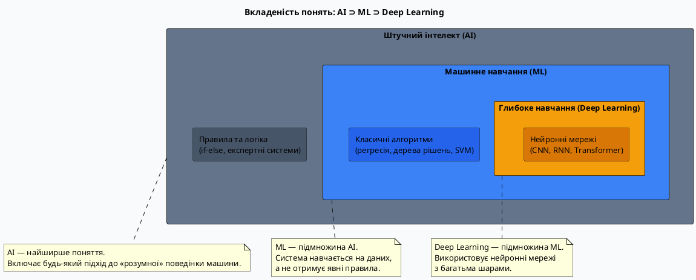

# Вступ до штучного інтелекту та машинного навчання

## Розмова, якої не було

Уявіть: ви відкриваєте застосунок для перегляду фільмів. Він пропонує вам нову кінокартину — і ви розумієте, що вона ідеально вам підходить. Хтось ніби знає ваші смаки краще, ніж деякі друзі.

Або: ви фотографуєте текст на іноземній мові, а телефон миттєво його перекладає прямо на екрані. Або: лікарська система аналізує знімок і виявляє пухлину розміром в кілька міліметрів, яку людське oko могло б пропустити.

За всіма цими речами стоїть одна ідея — **машинне навчання**. І ця ідея набагато простіша, ніж здається на перший погляд.

У цьому курсі ми побудуємо все з нуля: від розуміння того, що таке «навчання» взагалі, до власних програм, які розпізнають зображення, аналізують текст та спілкуються зі штучним інтелектом через API.

Але починати потрібно з початку. З питання: **а що взагалі відбувається, коли ми кажемо, що комп'ютер «навчився»?**

---

## Коротка історія: від ідеї до ChatGPT

Перш ніж занурюватися в деталі, корисно побачити, звідки все це взялося. Штучний інтелект — не новинка 2022 року. Ідеї, на яких він базується, зароджувалися більше 70 років тому.

> Аналогія: розвиток AI можна порівняти з освоєнням космосу. Були періоди ейфорії (перші запуски ракет), тривалі «зими» (скорочення програм через відсутність результатів) і справжні прориви, які змінювали все (висадка на Місяць). Так само і в AI — за хвилями ентузіазму йшли «зими», а потім раптово — революція.

|      Рік      | Подія                                                                                | Чому важливо                                                         |
| :-----------: | :----------------------------------------------------------------------------------- | :------------------------------------------------------------------- |
|   **1950**    | Алан Тюрінг публікує «Чи може машина думати?» та описує **Тест Тюрінга**             | Перша формалізація поняття «інтелект машини»                         |
|   **1956**    | **Дартмутська конференція** — Джон Маккарті вводить термін «Artificial Intelligence» | Народження AI як наукової галузі                                     |
|   **1957**    | **Перцептрон** Розенблатта — перша штучна нейронна мережа                            | Перша спроба змоделювати нейрон мозку математично                    |
| **1966–1974** | **Перша «зима AI»** — розчарування, скорочення фінансування                          | Ранні обіцянки не справдилися: задачі виявилися набагато складнішими |
|  **1980-ті**  | Бум **експертних систем** — AI кодує знання людей-експертів у правила                | Повернення інтересу та інвестицій в AI                               |
| **1987–1993** | **Друга «зима AI»** — експертні системи занадто дорогі та крихкі                     | Знову розчарування та скорочення фінансування                        |
|   **1997**    | **Deep Blue** (IBM) перемагає чемпіона світу з шахів Гаррі Каспарова                 | Перша гучна демонстрація: AI перевершує людину в конкретній задачі   |
|   **2012**    | **AlexNet** перемагає у змаганні ImageNet з величезним відривом                      | Революція глибокого навчання — починається сучасна ера AI            |
|   **2016**    | **AlphaGo** (DeepMind) перемагає чемпіона світу з го Лі Седоля                       | Го вважалося «недосяжним» для AI — виявилося, можливим               |
|   **2017**    | Стаття **«Attention Is All You Need»** — архітектура Transformer                     | Фундамент для всіх сучасних LLM: GPT, BERT, LLaMA                    |
|   **2022**    | **ChatGPT** — LLM стають масовим продуктом                                           | AI у повсякденному житті мільярдів людей                             |

::note
Зверніть увагу на «зими AI» — моменти, коли дослідники обіцяли занадто багато, а реальність не встигала. Це корисний урок: AI — це потужний інструмент, але не магія. Розуміти його можливості **і** обмеження — однаково важливо.
::

---

## Три поняття, які часто плутають

Перш ніж рухатися далі, потрібно розібратися з термінологією. Якщо ви читали новини про технології, то напевно зустрічали три терміни, які часто використовують як синоніми, хоча це — зовсім різні речі:

- **AI** (Artificial Intelligence, Штучний інтелект)
- **ML** (Machine Learning, Машинне навчання)
- **Data Science** (Наука про дані)

Ці три поняття пов'язані, але не замінюють одне одного. Щоб зрозуміти їх співвідношення, використаємо просту аналогію.

### Аналогія: місто, район та лабораторія

Уявіть велике місто під назвою **«Штучний інтелект»**. Це місто — загальна ідея: створити комп'ютерні системи, які поводяться розумно, вирішують складні задачі, імітують людське мислення.

У цьому місті є багато районів. Один з найбільших і найпопулярніших — район **«Машинне навчання»**. Це конкретний підхід до побудови AI: замість того, щоб вручну прописувати правила («якщо є вуха та хвіст — це кіт»), ми показуємо комп'ютеру тисячі прикладів і він **сам** виводить правила.

А поруч з цим містом є велика дослідницька лабораторія — **«Data Science»**. Вона частково знаходиться в місті AI, але також існує незалежно. Data Science займається збором, аналізом та інтерпретацією даних — іноді використовуючи ML, а іноді — просто класичну статистику.

::note
**Коротко:** AI — це мета (розумна машина). ML — один зі способів досягти цієї мети (навчання на даних). Data Science — робота з даними для знаходження закономірностей та ухвалення рішень.
::

### Що таке AI

**Штучний інтелект** (AI) — це широка галузь комп'ютерних наук, що займається створенням систем, здатних виконувати задачі, які зазвичай вимагають людського інтелекту.

Що це за задачі? Розпізнавання мови та зображень, переклад, прийняття рішень, генерація тексту та зображень, гра у складні ігри (шахи, го), керування автомобілем.

Важливо: AI — це не обов'язково «робот, що думає як людина». Це просто програма, яка виконує розумну задачу. Фільтр спаму у вашій пошті — теж AI.

::card-group

::card{title="Вузький AI (Narrow AI)" icon="i-lucide-target"}
Виконує одну конкретну задачу краще або порівнянно з людиною. Саме такий AI існує сьогодні: рекомендаційні системи Netflix, розпізнавання обличчя у телефоні, ChatGPT. Кожна система — «вузький спеціаліст».
::

::card{title="Загальний AI (AGI)" icon="i-lucide-brain"}
Гіпотетична система, яка може виконувати **будь-яку** розумову задачу на рівні людини або краще. Поки не існує. Саме такий AI показують у фантастичних фільмах.
::

::

### Що таке Machine Learning

**Машинне навчання** (ML) — це підхід до побудови AI, при якому система **навчається на даних**, а не програмується вручну через явні правила.

Порівняйте два підходи:

**Класичне програмування:**

```
Правило 1: якщо в листі є слово "виграш" → спам
Правило 2: якщо в листі є "безкоштовно" → спам
Правило 3: якщо відправник невідомий → можливо, спам
... (тисячі правил, і все одно щось пропустимо)
```

**Machine Learning:**

```
Покажи системі 100 000 листів із мітками "спам" / "не спам"
→ Система сама виведе правила
→ Нові листи класифікуються автоматично
```

> Аналогія: уявіть, що ви вчите дитину розпізнавати котів. Перший підхід — написати інструкцію: «кіт має чотири лапи, вуха, хвіст, мурчить...». Але що, якщо кіт сфотографований незвично? Що якщо вуха не видно? Другий підхід — просто показати дитині тисячу фотографій котів і не-котів, сказавши «ось кіт» або «це не кіт». Через деякий час дитина навчиться розпізнавати котів навіть на незвичних фото. Саме так працює ML.

### Що таке Data Science

**Data Science** (Наука про дані) — це міждисциплінарна галузь, що поєднує статистику, програмування та доменні знання для **витягування цінної інформації з даних**.

Data Scientist — це людина, яка:

- Збирає та очищує дані
- Аналізує дані, шукає закономірності та аномалії
- Будує моделі (часто з використанням ML)
- Інтерпретує результати та переводить їх у бізнес-рішення
- Презентує висновки у зрозумілому вигляді

> Аналогія: якщо ML — це кухонний комбайн, то Data Scientist — це шеф-кухар. Шеф знає, коли і який інструмент використовувати, але головне — він знає, що хоче приготувати і як це має смакувати в кінці.

**Чим Data Science відрізняється від ML?**

ML — це технічний метод (алгоритм, що навчається). Data Science — це повний процес: від питання бізнесу до прийнятого рішення. ML може бути одним з інструментів у роботі Data Scientist, але Data Science включає набагато більше: статистику, візуалізацію, A/B-тестування, роботу з базами даних, комунікацію результатів.

### Вкладеність понять: AI ⊃ ML ⊃ Deep Learning

Ці три поняття утворюють **вкладену структуру** — кожне наступне є підмножиною попереднього:

::plant-uml



::

> Аналогія: AI — це _бібліотека_ цілком. ML — це _великий розділ_ «Технічні науки» в цій бібліотеці. Deep Learning — це _конкретна полиця_ в цьому розділі з книгами про нейронні мережі. Якщо ви берете книгу з тієї полиці — ви, звичайно, читаєте й з розділу, і з бібліотеки. Але бібліотека містить набагато більше, ніж одна полиця.

| Характеристика | AI                                   | ML                   | Deep Learning                     |
| :------------- | :----------------------------------- | :------------------- | :-------------------------------- |
| Обсяг поняття  | Найширше                             | Підмножина AI        | Підмножина ML                     |
| Підхід         | Будь-який — від правил до нейромереж | Навчання з даних     | Нейронні мережі з багатьма шарами |
| Потрібні дані? | Не обов'язково                       | Так                  | Дуже багато                       |
| Приклад        | Шаховий движок на правилах           | Рекомендації Netflix | Розпізнавання облич, GPT          |

---

## Як комп'ютер «навчається»: інтуїція

Перш ніж заглиблюватися в алгоритми, давайте побудуємо правильну інтуїцію. Що взагалі відбувається під час «навчання»?

### Навчання — це пошук закономірностей

Уявіть: перед вами лежать 1000 фотографій будинків і поруч із кожною — ціна продажу. Ваше завдання — зрозуміти, від чого залежить ціна, щоб потім оцінювати нові будинки.

Ви починаєте розглядати фото і поступово помічаєте:

- Великі будинки → дорожчі
- Будинки в центрі міста → дорожчі
- Нові будинки → дорожчі
- З гаражем → трохи дорожчі

Ви не вигадали ці правила наперед — ви **виявили їх у даних**. Саме це робить ML-алгоритм: шукає приховані закономірності між вхідними даними (характеристиками будинку) та виходом (ціною).

### Три компоненти машинного навчання

Будь-яка задача ML складається з трьох обов'язкових елементів:

::card-group

::card{title="Дані (Data)" icon="i-lucide-database"}
Приклади, на яких система навчається. Чим більше якісних даних — тим краще. Дані — це «досвід» для машини. Без даних машинне навчання неможливе.
::

::card{title="Модель (Model)" icon="i-lucide-box"}
Математична структура, яка описує зв'язок між входом та виходом. Під час навчання модель **підлаштовує свої внутрішні параметри**, щоб якомога точніше відображати закономірності в даних.
::

::card{title="Алгоритм навчання (Learning Algorithm)" icon="i-lucide-settings"}
Процес, що визначає, як саме модель змінює свої параметри, дивлячись на дані. Це і є «навчання». Алгоритм мінімізує помилку між передбаченнями моделі та реальними відповідями.
::

::

> Аналогія: уявіть студента, що готується до іспиту.
>
> - **Дані** — підручники, задачники, лекції (приклади з правильними відповідями)
> - **Модель** — знання студента (що він «тримає в голові»)
> - **Алгоритм навчання** — процес навчання: розв'язати задачу → перевірити відповідь → зрозуміти помилку → запам'ятати правило

### Що всередині «навчання»: спрощений погляд

Щоб не залишати «навчання» магічною чорною скринькою, розглянемо базовий механізм на простому прикладі.

Припустимо, ми хочемо навчити модель передбачати ціну квартири за її площею. У нас є дані:

| Площа (м²) | Ціна (тис. грн) |
| :--------: | :-------------: |
|     30     |      1 200      |
|     50     |      1 900      |
|     70     |      2 800      |
|    100     |      3 900      |

Ми припускаємо, що зв'язок лінійний: `Ціна = a × Площа + b`. Наша модель — це просте рівняння з двома параметрами `a` та `b`.

Спочатку параметри випадкові: нехай `a = 10`, `b = 0`. Для квартири 50 м² модель передбачить `10 × 50 + 0 = 500`. Реальна ціна — `1 900`. Помилка величезна.

Алгоритм навчання **дивиться на помилку** і запитує: «а якби я збільшив `a`, помилка б зменшилася?» Так. Він трохи збільшує `a`. Потім знову перевіряє, знову коригує. Після тисячі таких маленьких кроків параметри `a` і `b` стають такими, що модель передбачає ціни досить точно для всіх прикладів.

Це і є **навчання**: ітеративний процес коригування параметрів моделі для зменшення помилки.

#### Детальний приклад: кредитний скоринг як дві операції звичайного коду

Щоб зробити це ще конкретнішим, розглянемо реальну задачу: **алгоритм вирішує, чи видати людині кредит**. Спростимо це до двох послідовних операцій — саме так працює один «нейрон» у нейронній мережі.

**Задача:** за даними про дохід та кредитну історію людини визначити, чи схвалити кредит.

**Вхідні дані клієнта:**
- :math-formula{tex="x_1" inline} = Місячний дохід: $1000\$$
- :math-formula{tex="x_2" inline} = Кількість прострочених позик за останній рік: $2$

**Крок 1: Лінійне перетворення — розрахунок зваженого скорингу**

Це звичайна формула. Кожна ознака множиться на **вагу** (коефіцієнт важливості), і всі результати підсумовуються разом із **зсувом** (bias):

```python
# Параметри моделі (які навчаються)
w1 = 0.5      # вага для доходу (дохід — це плюс)
w2 = -300     # вага для прострочень (прострочення — це мінус)
bias = -100   # базовий поріг системи

# Вхідні дані
x1 = 1000     # дохід у доларах
x2 = 2        # кількість прострочених позик

# Лінійне перетворення: зважена сума
score = (x1 * w1) + (x2 * w2) + bias
# score = (1000 * 0.5) + (2 * -300) + (-100)
# score = 500 - 600 - 100 = -200
```

**Що відбулося:**
- Дохід $1000\$$ дав $+500$ балів (множимо на вагу $0.5$)
- Дві прострочки забрали $-600$ балів (множимо на вагу $-300$)
- Базовий зсув віднімає ще $-100$ балів (поріг системи)
- **Фінальний скор: $-200$**

**Чому це «лінійне»?** Якщо дохід збільшити вдвічі ($2000\$$), його внесок також зросте вдвічі ($+1000$ балів). На графіку така залежність — пряма лінія.

**Крок 2: Нелінійна функція активації — умовний оператор `if`**

Тепер ми маємо число (скор :math-formula{tex="-200" inline}), але потрібно **рішення**: видати кредит чи ні? Для цього використовуємо функцію активації — це як `if` у коді:

```python
# Варіант 1: ReLU (Rectified Linear Unit) — "якщо менше нуля, то нуль"
output_relu = max(0, score)
# output_relu = max(0, -200) = 0
# Результат: 0 → кредит НЕ схвалено

# Варіант 2: Sigmoid — перетворюємо в імовірність від 0 до 1
import math
output_sigmoid = 1.0 / (1.0 + math.exp(-score))
# output_sigmoid = 1.0 / (1.0 + math.exp(200)) ≈ 0.0000...
# Результат: ≈ 0% імовірність схвалення → кредит НЕ схвалено
```

**Що відбулося:**
- **ReLU** діє як «вимикач»: якщо скор від'ємний — видає :math-formula{tex="0" inline} (нейрон «спить»), якщо додатній — передає скор далі.
- **Sigmoid** перетворює будь-яке число у відсоток від :math-formula{tex="0" inline} до :math-formula{tex="1" inline}. Негативне число :math-formula{tex="-200" inline} стає майже :math-formula{tex="0\\%" inline} імовірністю, а позитивне :math-formula{tex="+200" inline} стало б близько :math-formula{tex="100\\%" inline}.

**Фінальне рішення:**
```python
# Поріг схвалення: якщо імовірність > 50%, кредит схвалюється
if output_sigmoid > 0.5:
    decision = "СХВАЛЕНО"
else:
    decision = "ВІДХИЛЕНО"

# У нашому випадку: output_sigmoid ≈ 0.0 < 0.5
# decision = "ВІДХИЛЕНО"
```

**Повний цикл роботи одного нейрона:**

```python
def neuron_credit_scoring(income, late_payments):
    """
    Один штучний нейрон, який вирішує питання про кредит.
    
    Параметри:
        income: місячний дохід у доларах
        late_payments: кількість прострочених позик
    
    Повертає:
        імовірність схвалення кредиту (0.0 до 1.0)
    """
    # Ваги та зсув (навчаються під час тренування моделі)
    w1 = 0.5
    w2 = -300
    bias = -100
    
    # Крок 1: Лінійне перетворення (зважена сума)
    score = (income * w1) + (late_payments * w2) + bias
    
    # Крок 2: Нелінійна активація (sigmoid)
    probability = 1.0 / (1.0 + math.exp(-score))
    
    return probability

# Перевіряємо нашого клієнта
prob = neuron_credit_scoring(income=1000, late_payments=2)
print(f"Імовірність схвалення: {prob:.4f}")  # ≈ 0.0000
print(f"Рішення: {'СХВАЛЕНО' if prob > 0.5 else 'ВІДХИЛЕНО'}")  # ВІДХИЛЕНО
```

**Чому це важливо?**

- **Лінійна частина** комбінує всі ознаки разом (дохід, прострочки, вік, освіта тощо), зважуючи їх за важливістю.
- **Нелінійна частина** додає здатність моделювати складні залежності. Без неї навіть найглибша нейронна мережа залишалася б простою лінійною функцією.

> Аналогія: лінійна частина — це як складання інгредієнтів за рецептом (3 яйця + 2 склянки борошна + ...). Нелінійна активація — це випікання в духовці. Без «випікання» (нелінійності) ви отримаєте просто суміш інгредієнтів, а не пиріг. Саме нелінійність перетворює прості операції на щось якісно нове.

**Як нейронна мережа навчається підбирати ці ваги?**

Спочатку ваги випадкові: :math-formula{tex="w_1 = 0.1" inline}, :math-formula{tex="w_2 = -50" inline}, :math-formula{tex="\\text{bias} = 0" inline}. Система перевіряє тисячі прикладів: «цій людині видали кредит, і вона повернула» (позитивний приклад) або «цій людині видали, і вона не повернула» (негативний). Коли модель помиляється — алгоритм трохи коригує ваги, щоб наступного разу помилка була меншою. Після тисяч ітерацій ваги стають такими (:math-formula{tex="w_1 = 0.5" inline}, :math-formula{tex="w_2 = -300" inline}, :math-formula{tex="\\text{bias} = -100" inline}), що система передбачає правильно у більшості випадків.

Це і є **машинне навчання**: автоматичний підбір параметрів (:math-formula{tex="w_1" inline}, :math-formula{tex="w_2" inline}, :math-formula{tex="\\text{bias}" inline}) на основі даних, а не їх програмування вручну.

::note
Ми щойно описали алгоритм **лінійної регресії** — один з найпростіших і найважливіших алгоритмів ML. У Модулі 3 ми розберемо його детально, з математикою і кодом. Зараз важлива лише інтуїція.
::

---

## Типи задач у машинному навчанні

Перш ніж будувати будь-яку ML-систему, потрібно зрозуміти: а яку задачу ми взагалі вирішуємо? В ML існує кілька фундаментальних типів задач, і кожен потребує свого підходу.

### Навчання з учителем (Supervised Learning)

**Навчання з учителем** — це коли для кожного прикладу в навчальних даних ми знаємо **правильну відповідь** (мітку).

> Аналогія: учитель показує учневі задачі **разом із відповідями**: «ось задача, ось правильне рішення». Учень навчається на прикладах з відповідями — звідси й назва «навчання з учителем».

Два головних підтипи:

**Регресія** — передбачення **числа** (неперервного значення):

- Площа та район → Ціна квартири (число в гривнях)
- Температура, вологість → Врожай пшениці (тонн з гектара)
- Стаж та освіта → Зарплата (число)

#### Детальний приклад: оцінка вартості оренди квартири (регресія)

**Регресія** — це знаходження математичної формули (правила), яка за відомими параметрами обчислює **числову відповідь** на неперервній шкалі, мінімізуючи похибку на історичних даних.

Уявіть, що ви хочете автоматично оцінювати вартість оренди квартири (:math-formula{tex="y" inline}) за її площею в м² (:math-formula{tex="x" inline}).

Ви зібрали дані по 4 реальних квартирах:

| Площа (м²) | Ціна оренди (грн) |
| :--------: | :---------------: |
|     30     |      11 000       |
|     50     |      15 000       |
|     70     |      19 000       |
|     90     |      23 000       |

Якщо нанести ці точки на графік :math-formula{tex="(x, y)" inline}, вони лягають на пряму лінію:

::math-formula
y = w \cdot x + b
::

Де:
- :math-formula{tex="w" inline} (вага / коефіцієнт) = **200** — кожен додатковий квадратний метр додає 200 грн до ціни
- :math-formula{tex="b" inline} (bias / зсув) = **5 000** — базова вартість самого факту наявності квартири

::math-formula
\text{Ціна} = 200 \times \text{Площа} + 5000
::

**Передбачення для нової квартири:**

Тепер до вас приходить клієнт із квартирою **60 м²**, якої не було у вашій базі:

::math-formula
\text{Ціна} = 200 \times 60 + 5000 = 12\,000 + 5\,000 = 17\,000\text{ грн}
::

Цей процес виведення формули за точками та передбачення значення для нового входу і є **регресією**.

**У реальному світі: множинна регресія**

У реальності точки не лежать ідеально на прямій, а параметрів більше одного:

```python
# Формула множинної лінійної регресії
estimated_price = (area * w1) + (distance_to_center * w2) + (floor * w3) + bias

# Приклад коефіцієнтів:
w1 = 250   # кожен м² додає вартість
w2 = -500  # кожен км від центру зменшує вартість
w3 = 100   # поверх вище першого додає комфорту
bias = 4000  # базова константа
```

**Як алгоритм «вчиться» регресії:**

1. **Ініціалізація:** Модель бере випадкові :math-formula{tex="w" inline} та :math-formula{tex="b" inline}.
2. **Передбачення:** Розраховує ціну для всіх квартир у базі.
3. **Функція втрат (Loss, наприклад MSE):** Рахує різницю між прогнозом і реальною ціною:

::math-formula
\text{Error} = (\text{Реальна ціна} - \text{Прогноз})^2
::

4. **Оптимізація:** Підкручує :math-formula{tex="w" inline} та :math-formula{tex="b" inline}, щоб сумарна помилка по всіх квартирах стала мінімальною (проводить лінію так, щоб вона проходила максимально близько до всіх точок).

> Аналогія: уявіть, що ви натягуєте нитку через розкидані на столі намистини. Ваша мета — розташувати нитку так, щоб сума відстаней від усіх намистин до нитки була мінімальною. Саме це робить алгоритм регресії: шукає «найкращу пряму» через хмару точок.

**Класифікація** — передбачення **категорії** (одного з фіксованого набору варіантів):

- Зображення → «кіт» або «не кіт»
- Лист → «спам» або «не спам»
- Рентгенівський знімок → «норма», «пневмонія» або «інша патологія»

::note
**Головна відмінність:** регресія повертає конкретне дійсне число (`17 450.50 грн`, `24.5 °C`, `4.2 тонни`), а класифікація — одну з фіксованих категорій (`Так`/`Ні`, `A`/`B`/`C`).
::


Більша частина практичних ML-задач — це саме навчання з учителем. Більша частина цього курсу теж буде присвячена йому.

### Навчання без учителя (Unsupervised Learning)

**Навчання без учителя** — це коли правильних відповідей **немає**. Система сама шукає приховану структуру в даних.

> Аналогія: уявіть, що вам дали 10 000 фотографій людей без будь-яких підписів і попросили «згрупувати схожих». Ви не знаєте наперед, скільки груп буде і за яким принципом їх ділити. Ви просто дивитеся і помічаєте: ці троє схожі між собою, ті п'ятеро — інша компанія. Це і є навчання без учителя.

Основні задачі:

- **Кластеризація** — поділ даних на групи схожих елементів. Приклад: поділ клієнтів на сегменти для маркетингу
- **Зниження розмірності** — спрощення даних зі збереженням ключової інформації. Корисно для візуалізації та прискорення навчання

#### Детальний приклад: сегментація клієнтів для маркетингу (кластеризація)

**Кластеризація** — це автоматичне групування об'єктів за їхньою подібністю, коли система сама знаходить приховані патерни без попередніх міток.

Уявіть, що в інтернет-магазині є 100 000 користувачів. Якщо ви вивантажите їхню історію дій і застосуєте алгоритм кластеризації (наприклад, :math-formula{tex="k" inline}-means) за двома параметрами: **«середній чек»** та **«частота покупок за рік»**, алгоритм сам розіб'є точки на окремі «острівці» (кластери).

**Приклад сегментів, які алгоритм знайде сам:**

| Сегмент (Кластер)          | Поведінка в базі даних                                         | Що робить маркетинг (дія)                                                    |
| :------------------------- | :------------------------------------------------------------- | :--------------------------------------------------------------------------- |
| **«VIP-покупці»**          | Купують 2 рази на місяць, середній чек — 8 000 грн            | Запропонувати персонального менеджера, закритий клуб, преміум-новинки       |
| **«Мисливці за знижками»** | Купують тільки раз на 3 місяці під час сейлів, чек — 500 грн  | Надіслати промокод на -20% або розпродаж залишків                            |
| **«Одноразові покупці»**   | Зробили 1 велику покупку пів року тому і більше не заходили   | Надіслати лист-нагадування: «Ми скучили! Ось 100 грн бонусів»               |
| **«Шопоголіки дрібниць»**  | Замовляють щотижня, але суми до 200 грн                        | Запропонувати платну підписку на безкоштовну доставку                        |

**Чому це робить саме кластеризація (ML), а не простий `if/else`?**

Коли параметрів лише 2 (чек і частота), програміст може написати:

```python
# Наївний підхід — вручну задати пороги
if total_spent > 10000 and order_count > 10:
    assign_tag("VIP")
elif order_count == 1 and days_since_last_order > 180:
    assign_tag("Одноразові")
# ... і так для всіх сегментів
```

Але в реальності параметрів **десятки**:

- Час доби, коли людина відкриває застосунок
- Відсоток повернення товарів
- Кількість переглянутих сторінок перед покупкою
- Співвідношення покупок техніки до аксесуарів
- Швидкість прийняття рішення (додав у кошик і одразу купив чи тримав тиждень)
- Середня тривалість сесії
- Реакція на email-розсилки (відкриває чи ігнорує)

Людина не може побудувати графік у 20-вимірному просторі та вручну розставити пороги `if/else`. Алгоритм кластеризації обчислює математичну **відстань між користувачами** у цьому просторі й каже: _«Ось ці 4 000 людей діють практично однаково — це окрема група, придумайте для них персональну пропозицію»_.

**Як працює алгоритм кластеризації:**

```python
from sklearn.cluster import KMeans

# Дані про користувачів (2 ознаки для спрощення)
users = [
    [500, 1],     # низький чек, 1 покупка
    [8000, 24],   # високий чек, часто купує
    [200, 52],    # дрібниці, кожен тиждень
    # ... ще 99 997 користувачів
]

# Алгоритм автоматично знаходить 4 кластери
kmeans = KMeans(n_clusters=4)
kmeans.fit(users)

# Отримуємо мітки кластерів для кожного користувача
segments = kmeans.labels_  # [2, 0, 3, ...]
```

> Аналогія: уявіть, що ви розсипали на столі різнокольорові цукерки — червоні, сині, зелені та жовті. Але вони перемішані. Ви просите дитину «згрупувати схожі». Дитина не знає назв кольорів, але бачить, що «ці схожі на ці» і розкладає їх на 4 купки. Саме так працює кластеризація: знаходить «схожість» без попереднього знання про те, що таке «VIP» чи «Мисливець за знижками».

::note
**Ключова відмінність від класифікації:** у класифікації ми **знаємо наперед** категорії (`Spam`/`Not Spam`) і навчаємо модель їх розпізнавати. У кластеризації **не знаємо** категорій — алгоритм сам їх знаходить, а ми потім інтерпретуємо: «Ага, цей кластер — це VIP-клієнти».
::

Навчанню без учителя присвячений Модуль 7.

### Навчання з підкріпленням (Reinforcement Learning)

**Навчання з підкріпленням** — це принципово інший підхід: система (агент) **взаємодіє з середовищем**, отримуючи **нагороду** за корисні дії та «штраф» за шкідливі. Мета — навчитися максимізувати нагороду.

> Аналогія: так дресирують тварин. Собака сіла за командою → отримала ласощі (нагорода). Собака гавкнула недоречно → нагороди немає (штраф). Поступово собака навчається, яка поведінка приносить ласощі.

Саме так AlphaGo навчився грати в го краще за будь-яку людину: він зіграв мільйони партій проти себе, отримуючи «нагороду» за перемогу.

Reinforcement Learning — складна і окрема велика тема; у цьому курсі ми зосередимося на перших двох типах.

---

## Ключові поняття: словник ML

Перш ніж рухатися до практики, потрібно ввести базовий словник. Ці терміни ви будете зустрічати в кожній наступній статті.

### Дані та їх структура

У задачах з учителем дані зазвичай представлені у вигляді таблиці. Кожен **рядок** — це один **об'єкт** (спостереження, зразок, sample). Кожен **стовпець** — це **ознака** (feature, атрибут) цього об'єкта.

Приклад датасету будинків:

| ID  | Площа (м²) | Поверх | Район | Вік (років) | **Ціна (тис. грн)** |
| :-: | :--------: | :----: | :---: | :---------: | :-----------------: |
|  1  |     45     |   3    | Центр |     10      |        2 100        |
|  2  |     90     |   7    | Захід |      2      |        3 400        |
|  3  |     30     |   1    | Схід  |     25      |         900         |

Стовпці «Площа», «Поверх», «Район», «Вік» — це **ознаки** (features). Виділений стовпець «Ціна» — це **цільова змінна** (target, label) — те, що ми хочемо передбачити.

### Типи ознак

Не всі ознаки однакові. Подивіться ще раз на наш датасет: «Площа» — це число, «Район» — це слово. З числами можна виконувати арифметику, а зі словами — ні. Саме тому в ML розрізняють два фундаментальних типи ознак.

::card-group

::card{title="Числові ознаки (Numerical)" icon="i-lucide-hash"}
Мають **кількісне значення** — над ними можна виконувати арифметичні операції.

**Приклади:** площа (м²), поверх, вік будинку, ціна, температура, зарплата.

Підтипи:

- **Неперервні** (continuous) — можуть приймати будь-яке значення в діапазоні: площа = 47.5 м²
- **Дискретні** (discrete) — лише цілі значення: кількість кімнат = 2

> Аналогія: числові ознаки — це як позначки на лінійці. Між 45 і 90 є нескінченно багато значень, і можна сказати «90 — це вдвічі більше, ніж 45».

::

::card{title="Категоріальні ознаки (Categorical)" icon="i-lucide-tag"}
Мають **якісне значення** — фіксований набір категорій, між якими немає числового порядку (або він умовний).

**Приклади:** район (Центр / Захід / Схід), тип будинку (цегляний / панельний), стать, колір.

Підтипи:

- **Номінальні** — без порядку: район «Центр» не «більший» за «Схід»
- **Порядкові** (ordinal) — є природний порядок: «відмінно» > «добре» > «задовільно»

> Аналогія: категоріальні ознаки — це як назви країн на карті. «Франція» не дорівнює якомусь числу, і не можна сказати «Франція в 3 рази більша за Іспанію» у сенсі назви.

::

::

::note
Тип ознаки визначає, як її потрібно **обробляти** перед подачею в модель. Числові ознаки часто нормалізують (щоб великі числа не «домінували» над малими). Категоріальні — перетворюють у числа через кодування (наприклад, «Центр»=0, «Захід»=1, «Схід»=2). Про це детально поговоримо у Модулі 2.
::

| Термін                            | Опис                                                    |
| :-------------------------------- | :------------------------------------------------------ |
| **Dataset (датасет)**             | Набір даних — вся таблиця цілком                        |
| **Sample / Instance (зразок)**    | Один рядок таблиці — один будинок                       |
| **Feature (ознака)**              | Одна характеристика об'єкта — один стовпець             |
| **Target / Label (мітка)**        | Те, що передбачаємо — стовпець «Ціна» або «Клас»        |
| **Feature vector (вектор ознак)** | Набір усіх ознак одного об'єкта — один рядок без target |
| **X**                             | Матриця ознак (усі стовпці крім target)                 |
| **y**                             | Вектор цільових значень (стовпець target)               |

### Модель та навчання

| Термін                              | Опис                                                                                              |
| :---------------------------------- | :------------------------------------------------------------------------------------------------ |
| **Model (модель)**                  | Математична структура, що описує зв'язок між X та y                                               |
| **Parameters (параметри)**          | Внутрішні числа моделі, що змінюються під час навчання (наприклад, `a` і `b` у лінійній регресії) |
| **Training (тренування)**           | Процес навчання — підбір параметрів на навчальних даних                                           |
| **Prediction (передбачення)**       | Вихід моделі для нового прикладу                                                                  |
| **Loss / Error (втрати / помилка)** | Числова міра того, наскільки передбачення моделі відрізняється від реальної відповіді             |

### Оцінка якості

| Термін                          | Опис                                                                                                               |
| :------------------------------ | :----------------------------------------------------------------------------------------------------------------- |
| **Training set**                | Навчальний набір — дані, на яких модель навчається                                                                 |
| **Test set**                    | Тестовий набір — дані, на яких ми оцінюємо якість навченої моделі. Модель їх **ніколи не бачила** під час навчання |
| **Overfitting (перенавчання)**  | Модель «заучила» тренувальні дані, але погано узагальнює на нові                                                   |
| **Underfitting (недонавчання)** | Модель занадто проста і не вловлює закономірності навіть у тренувальних даних                                      |

::note
Розбиття даних на тренувальний та тестовий набір — один з найважливіших принципів ML. Якщо оцінювати модель на тих самих даних, де вона навчалася, — результат буде **нечесним та надто оптимістичним**. Ми детально розглянемо це у Статті 3.2.
::

---

## Огляд екосистеми Python для ML

Python став стандартною мовою для машинного навчання та Data Science — і не випадково. Розглянемо чому і що саме ми будемо використовувати.

### Чому Python

- **Простий синтаксис** — можна зосередитися на алгоритмах, а не на мові програмування
- **Найбільша екосистема бібліотек для ML** — NumPy, pandas, scikit-learn, PyTorch — всі головні інструменти написані для Python
- **Інтерактивність** — Jupyter Notebook дозволяє поєднувати код, результати та пояснення в одному документі
- **Спільнота** — майже будь-яке запитання з ML вже хтось ставив і отримав відповідь на Stack Overflow або GitHub

### Бібліотеки, з якими ми будемо працювати

Нижче — «карта» нашого курсу. Кожна бібліотека вводиться поступово, тому зараз не потрібно розуміти всі деталі — просто отримайте загальне уявлення.

::card-group

::card{title="NumPy" icon="i-lucide-grid-3x3"}
Основа всього. Надає ефективні **числові масиви** та математичні операції над ними. Під капотом майже всіх ML-бібліотек — NumPy. Модуль 2.
::

::card{title="pandas" icon="i-lucide-table"}
Робота з **таблицями даних** (DataFrame). Завантаження, очищення, фільтрація, трансформація даних. Перший інструмент Data Scientist'а. Модуль 2.
::

::card{title="matplotlib / seaborn" icon="i-lucide-bar-chart-2"}
**Візуалізація даних**: графіки, діаграми, теплові карти. Побачити дані — це перший крок до їх розуміння. Модуль 2.
::

::card{title="scikit-learn" icon="i-lucide-settings-2"}
«Комбайн» для класичного ML: лінійна регресія, дерева рішень, кластеризація, крос-валідація — і все це за єдиним інтерфейсом `.fit()` / `.predict()`. Модулі 3 та 7.
::

::card{title="PyTorch" icon="i-lucide-zap"}
Основна бібліотека для **нейронних мереж**. Дозволяє будувати довільні архітектури, автоматично обчислює градієнти, підтримує GPU. Модулі 4–6.
::

::card{title="Hugging Face" icon="i-lucide-message-circle"}
Бібліотека та платформа для **готових мовних моделей**: BERT, GPT, LLaMA та тисячі інших. Fine-tuning та використання для NLP-задач. Модуль 6.
::

::

Також ми познайомимося з **XGBoost** — надзвичайно ефективною бібліотекою для градієнтного бустингу, яка перемагає на більшості Kaggle-змагань із табличними даними (Модуль 3), та з **OpenAI API** і **Ollama** для роботи з великими мовними моделями (Модуль 8).

---

## Практика

### Рівень 1: Впізнати AI навколо себе

Наведіть **3 приклади** задач машинного навчання з вашого повсякденного життя (застосунки, сервіси, пристрої). Для кожного прикладу визначте:

1. **Тип навчання** — з учителем, без учителя або з підкріпленням?
2. **Вхідні ознаки** — які дані подаються на вхід системи?
3. **Цільова ознака (target)** — що система передбачає або вирішує?

**Приклад відповіді:**

| Система              | Тип навчання | Вхідні ознаки                         | Target             |
| :------------------- | :----------- | :------------------------------------ | :----------------- |
| Фільтр спаму в Gmail | З учителем   | Текст листа, відправник, частота слів | «спам» / «не спам» |
| ?                    | ?            | ?                                     | ?                  |
| ?                    | ?            | ?                                     | ?                  |
| ?                    | ?            | ?                                     | ?                  |

::tip
Зверніть увагу: для задач з учителем target завжди чіткий («яке число?» або «яка категорія?»). Для задач без учителя target **відсутній** — система сама визначає структуру.
::

### Рівень 2: Спроектувати датасет

Уявіть, що вам потрібно побудувати систему, яка передбачає, **чи сподобається людині фільм** (1 = так, 0 = ні).

Створіть власний датасет із **5–7 рядків** у вигляді таблиці. Ваш датасет має містити:

- Щонайменше **3 числові ознаки** та **2 категоріальні ознаки**
- Цільову змінну (target): `liked` = 1 або 0
- Реалістичні дані (заповніть таблицю самостійно)

Після заповнення відповідайте на запитання:

1. Які ознаки, на вашу думку, найсильніше впливають на те, чи сподобається фільм?
2. Яку ознаку ви б назвали «шумовою» — тобто такою, що навряд чи допоможе моделі?
3. Як би ви закодували категоріальну ознаку «жанр» (бойовик / драма / комедія) у числа?

::note
Немає єдиної правильної відповіді — завдання навчить вас думати як Data Scientist: «які дані я маю?», «що хочу передбачити?», «які ознаки корисні?»
::

---

## Резюме

Ви щойно отримали карту місцевості, перш ніж відправитися в подорож. Ось ключові ідеї цієї статті:

- **AI** — широка ідея розумних машин. **ML** — один підхід: навчання на даних. **Data Science** — повний процес від даних до рішень.
- Машинне навчання — це **пошук закономірностей у даних** для передбачення або класифікації нових прикладів.
- Три компоненти ML: **дані** (приклади), **модель** (математична структура) та **алгоритм навчання** (процес коригування моделі).
- Три типи задач: **навчання з учителем** (є правильні відповіді), **навчання без учителя** (немає відповідей, шукаємо структуру), **навчання з підкріпленням** (нагороди та штрафи від середовища).
- Основний словник: dataset, sample, feature, target, model, training, overfitting, underfitting.
- Основні інструменти в Python: NumPy, pandas, matplotlib, scikit-learn, PyTorch.

::note
**Наступна стаття** — Jupyter Notebook: інтерактивне середовище, в якому ми будемо писати весь код курсу. Ви встановите необхідне середовище та напишете свої перші рядки Python для аналізу даних.
::
