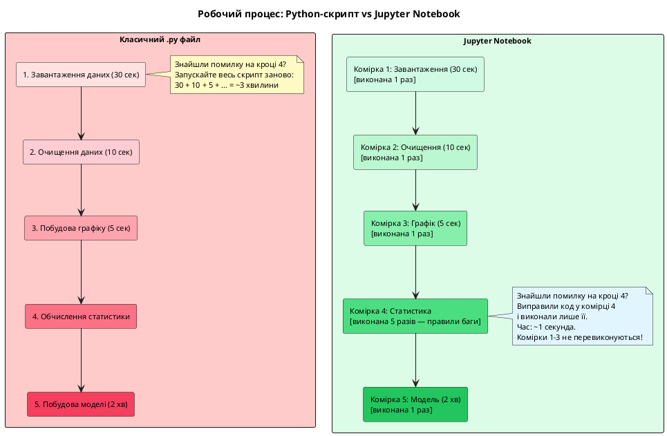
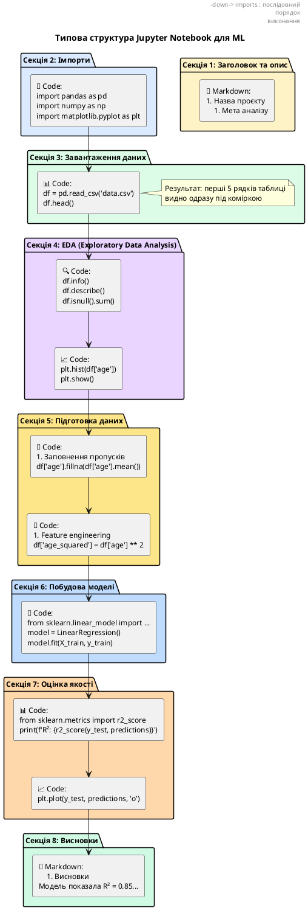

# Знайомство з Jupyter Notebook та JupyterLab

## Проблема, яку ви ще не знали, що маєте

Уявіть таке завдання: у вас є CSV-файл з даними про 50 000 продажів за рік. Потрібно:

1. Завантажити дані
2. Подивитися, як вони виглядають
3. Знайти середню ціну товару
4. Побудувати графік продажів по місяцях
5. Зрозуміти, які товари продаються найгірше

Ви пишете Python-скрипт. Запускаєте. Бачите помилку на кроці 3 — опечатка в назві стовпця. Виправляєте. Запускаєте **знову** — і весь код виконується з самого початку. Завантаження даних, перевірка, обчислення — все заново. Графік відкрився в окремому вікні, закрився... де він тепер?

А тепер уявіть інший підхід: ви виконуєте **кожен крок окремо**, бачите результат відразу під кодом, графік вбудований прямо в документ, і якщо щось не так — виправляєте лише той один крок, не перезапускаючи все.

Це і є **Jupyter Notebook**.

> Аналогія: звичайний `.py` файл — це як книга, яку можна читати лише від початку до кінця. Якщо хочете знайти щось на сторінці 147, доведеться перегортати всі 146 сторінок перед нею. Jupyter Notebook — це інтерактивний зошит, де кожен абзац можна виконати незалежно, побачити результат, виправити і продовжити далі.

---

## Чому Data Science обрав Jupyter? Реальні причини

Перш ніж навчатись користуватися інструментом, важливо зрозуміти, **чому саме цей інструмент** став стандартом у Data Science та Machine Learning. Це не випадковість — є чіткі технічні та методологічні причини.

### Проблема класичних Python-скриптів для дослідження даних

Коли ви пишете звичайну програму (веб-сервер, CLI-утиліту, бота), підхід зі скриптами `.py` працює ідеально:

```python
# server.py — класична програма
def main():
    app = create_app()
    app.run()

if __name__ == "__main__":
    main()
```

Запустили → програма виконується від початку до кінця → завершилась. Все лінійно та передбачувано.

Але Data Science — це **дослідження**, а не написання фінальної програми. Типовий робочий процес виглядає так:

1. Завантажили дані → подивились, що всередині
2. Виявили, що є пропуски у стовпці `age` → вирішили заповнити середнім значенням
3. Побудували графік розподілу віку → побачили, що є викид (людина віком 200 років)
4. Видалили викид → перебудували графік
5. Обчислили кореляцію між віком і зарплатою → результат цікавий
6. Побудували модель лінійної регресії → точність низька
7. Спробували поліноміальну регресію → стало краще
8. Експортували модель для продакшену

На **кожному з цих кроків** ви:

- Виконуєте код
- **Дивитесь на результат** (таблиця, графік, число)
- **Приймаєте рішення** на основі результату
- Виправляєте код і **виконуєте лише цей крок знову**

У класичному `.py` файлі кожна зміна = повторний запуск всього скрипту. Якщо завантаження даних займає 30 секунд, побудова моделі — 2 хвилини, то кожна виправлена опечатка коштує вам **2 хвилини 30 секунд очікування**.

::plant-uml{alt="Порівняння робочого процесу .py vs .ipynb"}



::

Ось як цей самий робочий процес виглядає в інтерфейсі Jupyter Notebook — зверніть увагу на лічильники `In [n]`: комірки 1–3 виконані по одному разу, комірка 4 виконувалась кілька разів під час виправлення помилок (лічильник зріс до `In [8]:`), а попередні ресурсоємні кроки не перезапускалися:

::jupyter-notebook{title="workflow_pipeline.ipynb" kernel="Python 3.12 (ipykernel)"}

::jupyter-cell{executionCount="1" executionTime="30.2s"}

```python
# Комірка 1: Тривале завантаження датасету (30 сек)
import pandas as pd
df = pd.read_csv("large_telecom_dataset.csv")
print(f"Дані успішно завантажено: {len(df)} записів")
```

#output
Дані успішно завантажено: 100000 записів
::

::jupyter-cell{executionCount="2" executionTime="10.1s"}

```python
# Комірка 2: Очищення даних (10 сек)
df_clean = df.dropna().copy()
print(f"Залишилося чистих записів: {len(df_clean)}")
```

#output
Залишилося чистих записів: 98450
::

::jupyter-cell{executionCount="3" executionTime="5.3s"}

```python
# Комірка 3: Швидка візуалізація розподілу (5 сек)
import matplotlib.pyplot as plt
plt.figure(figsize=(6, 3))
plt.hist(df_clean["monthly_fee"], bins=20, color="#3b82f6", edgecolor="black")
plt.title("Розподіл щомісячної плати")
plt.show()
```

#output
<svg xmlns="http://www.w3.org/2000/svg" viewBox="0 0 540 210" class="w-full max-w-lg mx-auto my-1">
  <rect width="100%" height="100%" rx="6" fill="transparent"/>
  <text x="280" y="20" font-family="sans-serif" font-size="12" font-weight="700" fill="currentColor" text-anchor="middle">Розподіл щомісячної плати (грн)</text>
  <g stroke="currentColor" stroke-opacity="0.12" stroke-dasharray="2,2">
    <line x1="55" y1="165" x2="510" y2="165"/>
    <line x1="55" y1="130" x2="510" y2="130"/>
    <line x1="55" y1="95" x2="510" y2="95"/>
    <line x1="55" y1="60" x2="510" y2="60"/>
    <line x1="55" y1="30" x2="510" y2="30"/>
  </g>
  <g fill="#3b82f6" stroke="#1d4ed8" stroke-width="1" fill-opacity="0.85">
    <rect x="60" y="145" width="26" height="20"/>
    <rect x="90" y="125" width="26" height="40"/>
    <rect x="120" y="100" width="26" height="65"/>
    <rect x="150" y="70" width="26" height="95"/>
    <rect x="180" y="48" width="26" height="117"/>
    <rect x="210" y="38" width="26" height="127"/>
    <rect x="240" y="44" width="26" height="121"/>
    <rect x="270" y="58" width="26" height="107"/>
    <rect x="300" y="78" width="26" height="87"/>
    <rect x="330" y="102" width="26" height="63"/>
    <rect x="360" y="122" width="26" height="43"/>
    <rect x="390" y="140" width="26" height="25"/>
    <rect x="420" y="152" width="26" height="13"/>
    <rect x="450" y="159" width="26" height="6"/>
    <rect x="480" y="162" width="26" height="3"/>
  </g>
  <line x1="55" y1="30" x2="55" y2="165" stroke="currentColor" stroke-opacity="0.4" stroke-width="1.2"/>
  <line x1="55" y1="165" x2="510" y2="165" stroke="currentColor" stroke-opacity="0.4" stroke-width="1.2"/>
  <g font-family="monospace" font-size="10" fill="currentColor" fill-opacity="0.75" text-anchor="middle">
    <text x="73" y="180">100</text>
    <text x="193" y="180">300</text>
    <text x="313" y="180">500</text>
    <text x="433" y="180">700</text>
    <text x="493" y="180">900</text>
    <text x="280" y="198" font-weight="600">Щомісячна плата (monthly_fee)</text>
  </g>
  <g font-family="monospace" font-size="10" fill="currentColor" fill-opacity="0.75" text-anchor="end">
    <text x="48" y="168">0</text>
    <text x="48" y="133">2.5k</text>
    <text x="48" y="98">5k</text>
    <text x="48" y="63">7.5k</text>
    <text x="48" y="33">10k</text>
  </g>
</svg>
::

::jupyter-cell{executionCount="8" executionTime="0.02s" active="true"}

```python
# Комірка 4: Обчислення статистики
# (Виконували 5 разів: правили опечатки і формат виводу, час виконання миттєвий!)
mean_fee = df_clean["monthly_fee"].mean()
median_fee = df_clean["monthly_fee"].median()
print(f"Середня плата: {mean_fee:.2f} грн | Медіана: {median_fee:.2f} грн")
```

#output
Середня плата: 420.50 грн | Медіана: 395.00 грн
::

::jupyter-cell{executionCount="9" executionTime="2m 04s"}

```python
# Комірка 5: Навчання моделі (2 хв)
from sklearn.linear_model import LogisticRegression
model = LogisticRegression(max_iter=500)
# Навчаємо на підготовлених даних без потреби перевантажувати CSV!
print("Модель успішно навчено!")
```

#output
Модель успішно навчено!
::

::

### Чому Jupyter незамінний у навчанні ML

У цьому курсі ви будете **експериментувати** на кожному модулі:

- **Модуль 2 (NumPy та pandas):** Завантажите датасет → подивитесь на структуру → обчислите середнє → побудуєте графік → знайдете пропуски → заповните їх. Кожен крок — окрема комірка. Якщо помилилися в обчисленні середнього — виправите лише ту комірку.

- **Модуль 3 (Лінійна регресія):** Підготуєте дані → навчите модель → побачите якість (R² = 0.3 — погано) → додасте нові ознаки → перенавчите модель (R² = 0.7 — краще). Кожна ітерація — нова комірка. Побачите, як **кожна зміна** впливає на результат.

- **Модуль 4 (Нейронні мережі):** Побудуєте архітектуру мережі → запустите навчання → побачите графік функції втрат → зрозумієте, що модель перенавчається → додасте Dropout → перенавчите. Графіки залишаються на екрані, можна порівнювати.

> Аналогія: Jupyter для Data Science — це як мікроскоп для біолога. Звичайний `.py` файл — це як дивитися на бактерії неозброєним оком. Технічно можна, але навіщо ускладнювати?

### Де Jupyter не підходить (і що використовувати натомість)

Jupyter — не універсальний інструмент. Він **не призначений** для:

::card-group

::card{title="Production-код" icon="i-lucide-server"}
Веб-додатки, API, CLI-утиліти. Для них використовуйте `.py` файли з чіткою структурою модулів. Jupyter-нотбук не можна «запустити як сервіс».
::

::card{title="Великі проєкти з багатьма файлами" icon="i-lucide-folder-tree"}
Коли код розділений на десятки модулів із складними залежностями. Jupyter — це один файл, не підходить для архітектури великих систем.
::

::card{title="Колективна розробка з Git" icon="i-lucide-git-branch"}
`.ipynb` файли — це JSON із вихідними результатами. У Git-дифах видно багато «шуму». Є рішення (nbdime, nbstripout), але це додаткова складність.
::

::

**Типовий сценарій у реальній Data Science команді:**

1. **Jupyter Notebook:** Дослідження даних, експерименти з моделями, візуалізації. Аналітики та Data Scientists працюють тут.
2. **Python-скрипти `.py`:** Фінальний код для продакшену. ML Engineers перетворюють найкращі експерименти з нотбуків у чистий Python-код.

::note
**У цьому курсі** ми використовуватимемо Jupyter для **всіх** практичних завдань Модулів 2–7 (NumPy, pandas, ML, нейронні мережі, NLP, кластеризація). Модуль 8 (OpenAI API, хмарні сервіси) може використовувати як нотбуки, так і `.py` скрипти — залежно від задачі.
::

### Як Jupyter буде використовуватись у цьому курсі

Розглянемо конкретно, що ви робитимете в Jupyter на кожному модулі курсу:

**Модуль 2: NumPy, pandas, matplotlib (Обробка даних)**

```markdown
# Типовий нотбук Модуля 2

## 1. Завантаження датасету (Titanic / Housing)

## 2. Перший погляд на дані (df.head(), df.info())

## 3. Пошук пропусків та викидів

## 4. Статистичний аналіз (df.describe())

## 5. Візуалізації (гістограми, scatter plots, box plots)

## 6. Висновки: що ми дізнались про дані?
```

**Що важливо:** Кожен крок — окрема комірка. Побудували графік → побачили аномалію → виправили фільтр → перебудували графік **без перезавантаження всього файлу**.

**Модуль 3: Лінійна регресія, дерева рішень, XGBoost**

```markdown
# Типовий нотбук Модуля 3

## 1. Підготовка даних (train/test split, масштабування)

## 2. Baseline модель: LinearRegression

- Навчання
- Оцінка якості (R², MSE)
- Візуалізація передбачень vs реальність

## 3. Покращена модель: RandomForest

- Навчання
- Порівняння з baseline
- Важливість ознак (feature importance)

## 4. Висновок: яка модель краща і чому?
```

**Що важливо:** Ви **експериментуєте** — міняєте гіперпараметри, додаєте нові ознаки, порівнюєте результати. Кожен експеримент — окрема комірка або секція. Усі результати зберігаються в нотбуці для порівняння.

**Модуль 4–5: Нейронні мережі (PyTorch)**

```markdown
# Типовий нотбук Модуля 4

## 1. Підготовка даних (нормалізація, DataLoader)

## 2. Архітектура мережі (визначення класу моделі)

## 3. Тренування (цикл епох, збереження loss)

## 4. Візуалізація навчання (графік loss по епохах)

## 5. Оцінка на тестових даних

## 6. Експеримент: додавання Dropout

- Перебудова моделі
- Повторне тренування
- Порівняння графіків loss
```

**Що важливо:** Тренування нейронної мережі може займати хвилини. Після тренування **результати залишаються** (графік loss, оцінки точності) — не потрібно перезапускати. Можна тренувати кілька варіантів моделі і порівнювати їх візуально.

**Модуль 6: NLP (NLTK, Transformers)**

```markdown
# Типовий нотбук Модуля 6

## 1. Завантаження текстових даних

## 2. Токенізація та очищення (NLTK)

## 3. Embeddings: Word2Vec

- Завантаження попередньо натренованих векторів
- Тестування semantic similarity
- Візуалізація слів у 2D (t-SNE)

## 4. Sentiment Analysis з BERT (Hugging Face)

- Завантаження моделі
- Класифікація відгуків
- Аналіз помилок
```

**Що важливо:** Завантаження великих моделей (BERT, GPT) займає час. Jupyter зберігає завантажену модель **у пам'яті ядра** — можна експериментувати з різними текстами, не перезавантажуючи модель.

**Модуль 7: Кластеризація, PCA, рекомендаційні системи**

```markdown
# Типовий нотбук Модуля 7

## 1. Завантаження даних клієнтів

## 2. Масштабування ознак

## 3. K-Means кластеризація

- Метод ліктя (вибір k)
- Навчання моделі
- Візуалізація кластерів у 2D (PCA)

## 4. Інтерпретація кластерів (профілювання)

## 5. Бізнес-рекомендації для кожного кластера
```

**Що важливо:** Візуалізація кластерів — ключова частина. У Jupyter графіки з'являються **прямо під кодом** — можна одночасно бачити код кластеризації та результат.

::card-group

::card{title="Інтерактивність" icon="i-lucide-play"}
Виконайте код → побачте результат → змініть параметр → виконайте знову → порівняйте. Це **дослідження**, а не написання фінальної програми.
::

::card{title="Документація" icon="i-lucide-book-open"}
Markdown-комірки пояснюють **чому** ви робите кожен крок. Через місяць ви зможете відкрити свій нотбук і **зрозуміти**, що і навіщо робили.
::

::card{title="Портфоліо" icon="i-lucide-briefcase"}
Кожен завершений нотбук — це **проєкт для портфоліо**. Ви зможете показати роботодавцю: «Ось я аналізував Housing Prices, ось мої висновки, ось модель з точністю 85%».
::

::

::tip
**Порада для курсу:** Створіть папку `ai-python-course/` на вашому комп'ютері. Для кожного модуля створюйте окрему папку: `module-02-pandas/`, `module-03-regression/` тощо. У кожній — ваші нотбуки та дані. Після курсу у вас буде **повне портфоліо** з 15–20 завершених проєктів!
::

---

## Що таке Jupyter Notebook

**Jupyter Notebook** — це відкрите середовище для інтерактивних обчислень. Назва походить від трьох мов програмування: **Ju**lia, **Py**thon, **R** — хоча сьогодні він підтримує десятки мов.

Файл нотбука має розширення `.ipynb` (IPython Notebook). Це звичайний JSON-файл, де зберігаються:

- Вміст кожної комірки (код або текст)
- Результати виконання коду
- Метадані (версія Python, ядро)

::note
`.ipynb` файл можна відкрити у будь-якому текстовому редакторі — там буде JSON. Але для нормальної роботи потрібен Jupyter — він рендерить комірки, виконує код і показує результати в зручному вигляді.
::

**JupyterLab** — це сучасний інтерфейс для роботи з нотбуками. Якщо Jupyter Notebook — це простий зошит, то JupyterLab — це повноцінне IDE: кілька нотбуків в окремих вкладках, файловий менеджер збоку, термінал, перегляд CSV та зображень.

::card-group

::card{title="Jupyter Notebook (класичний)" icon="i-lucide-file-text"}
Простий інтерфейс «один нотбук — одна вкладка». Відмінний для навчання та простих завдань. Запускається командою `jupyter notebook`.
::

::card{title="JupyterLab (сучасний)" icon="i-lucide-layout-dashboard"}
Повноцінне IDE-середовище: кілька вкладок, файловий браузер, термінал, розширення. Саме його ми будемо використовувати. Запускається командою `jupyter lab`.
::

::

---

## Встановлення та запуск JupyterLab

Перш ніж встановлювати, переконайтесь, що у вас є Python 3.8 або новіший. Перевірте у терміналі:

```bash
python --version
# або
python3 --version
```

Якщо Python встановлено, встановлюємо JupyterLab. Оберіть зручний спосіб відповідно до вашої операційної системи та менеджера пакетів:

::tabs
::tabs-item{label="Homebrew (macOS)"}

```bash
# Встановлення для macOS (не потребує окремого налаштування venv)
brew install jupyterlab
```

::

::tabs-item{label="uv (рекомендовано)"}

```bash
# Встановлення як глобального CLI-інструменту:
uv tool install jupyterlab

# Або додавання до віртуального оточення проєкту:
uv add jupyterlab
```

::

::tabs-item{label="pip"}

```bash
# Рекомендується запускати всередині активованого venv:
pip install jupyterlab
```

::

::tabs-item{label="conda / mamba"}

```bash
# Через репозиторій conda-forge
conda install -c conda-forge jupyterlab

# Або через mamba (швидший аналог conda)
mamba install -c conda-forge jupyterlab
```

::

::tabs-item{label="poetry"}

```bash
poetry add jupyterlab
```

::

::tabs-item{label="pipx"}

```bash
# Ізольоване глобальне встановлення без конфліктів системних пакетів
pipx install jupyterlab
```

::
::

::tip
**Який спосіб обрати?**
- **Homebrew**: Ідеальний для користувачів macOS. JupyterLab встановлюється в ізольоване середовище, готовий до використання з коробки та оновлюється командою `brew upgrade jupyterlab`.
- **uv / uvx**: Найшвидший сучасний інструмент на Rust. Дозволяє взагалі не встановлювати програму назавжди, а запускати миттєво однією командою `uvx jupyterlab`.
- **conda / mamba**: Стандарт індустрії Data Science (особливо з дистрибутивом Anaconda), де потрібні готові скомпільовані бінарні пакети C/Fortran.
- **pip**: Універсальний спосіб, але завжди використовуйте окреме віртуальне оточення (`python -m venv .venv`).
::

Після встановлення запускайте JupyterLab:

::tabs
::tabs-item{label="Стандартний запуск"}

```bash
jupyter lab
```

::

::tabs-item{label="uv"}

```bash
# Якщо встановлено через uv tool / uv add:
jupyter lab

# Або запуск «на льоту» в один рядок без попереднього встановлення:
uvx jupyterlab
```

::

::tabs-item{label="poetry"}

```bash
poetry run jupyter lab
```

::

::tabs-item{label="pipx"}

```bash
pipx run jupyterlab
# або напряму, якщо шляхи pipx додано в PATH:
jupyter lab
```

::
::

::terminal-preview{title="jupyter lab"}

<div class="line"><span class="opacity-40">$</span> <strong class="font-bold">jupyter lab</strong></div>
<div class="line"><span class="text-green-400">[I]</span> JupyterLab <span class="text-blue-400 font-bold">4.x.x</span> is running at:</div>
<div class="line"><span class="text-green-400">[I]</span>   <span class="text-blue-400">http://localhost:8888/lab?token=abc123...</span></div>
<div class="line"><span class="text-green-400">[I]</span> Use Control-C to stop this server.</div>

::

Після запуску браузер **відкриється автоматично** на адресі `http://localhost:8888/lab`. Якщо не відкрився — скопіюйте адресу з терміналу і вставте вручну.

::tip
JupyterLab **працює у браузері**, але **не потребує інтернету**. Браузер тут — лише інтерфейс. Весь код виконується локально на вашому комп'ютері.
::

::warning
Не закривайте термінал, поки працюєте з JupyterLab — саме там запущений сервер. Якщо закрити термінал, JupyterLab перестане працювати.
::

---

## Анатомія інтерфейсу JupyterLab

Після запуску ви побачите інтерфейс, який складається з кількох зон:

::card-group

::card{title="Ліва панель — файловий браузер" icon="i-lucide-folder-open"}
Показує файли та папки на вашому комп'ютері (з тієї директорії, де ви запустили `jupyter lab`). Тут можна відкрити існуючий `.ipynb` або створити новий.
::

::card{title="Центральна зона — робоча область" icon="i-lucide-file-code"}
Основна зона роботи. Тут відкриваються нотбуки, текстові файли, термінали. Підтримує кілька вкладок одночасно.
::

::card{title="Меню та панель інструментів" icon="i-lucide-menu"}
Стандартні операції: збереження, запуск, зупинка ядра. Також тут перемикається тип комірки (Code / Markdown).
::

::

Щоб створити **новий нотбук**, натисніть на кнопку **+** у лівій панелі або виберіть **File → New → Notebook**. Система запитає, яке ядро (kernel) використовувати — обирайте **Python 3**.

---

## Нотбуки та комірки: основна одиниця роботи

Нотбук складається з **комірок** (cells). Комірка — це окремий блок, який можна виконати незалежно від інших. Саме в цьому і полягає головна перевага Jupyter: виконуйте кроки один за одним, бачте результат відразу.

### Два типи комірок

Існує два основних типи комірок:

::card-group

::card{title="Code (Код)" icon="i-lucide-code"}
Містить Python-код. Після виконання результат з'являється **одразу під коміркою**. Зліва від комірки з'являється номер виконання: `[1]:`, `[2]:` тощо.

```python
# Це комірка коду
x = 10 + 5
print(x)
# ↓ Результат з'являється тут ↓
# 15
```

::

::card{title="Markdown (Текст)" icon="i-lucide-type"}
Містить текст у форматі Markdown. Після виконання рендериться як відформатований текст: заголовки, списки, **жирний**, _курсив_, посилання, формули LaTeX.

```markdown
## Мій аналіз

Тут я описую **що** я роблю і **чому**.

- Крок 1: завантаження даних
- Крок 2: очищення
```

::

::

> Аналогія: уявіть, що ви ведете лабораторний журнал. Комірка Markdown — це ваші нотатки та пояснення («сьогодні я досліджую вплив температури на...»). Комірка коду — це сам експеримент («нагріваємо до 100°C і вимірюємо»). І те, і те в одному місці, одне за одним.

Ось як поєднання цих двох типів комірок виглядає безпосередньо в інтерфейсі блокнота:

::jupyter-notebook{title="first_steps.ipynb" kernel="Python 3.12 (ipykernel)"}

::jupyter-cell{type="markdown"}

### 📊 Мій перший аналіз

Це **Markdown-комірка** для нотаток. Нижче ми ініціалізуємо змінні та обчислимо їхню суму:
::

::jupyter-cell{executionCount="1" executionTime="0.04s" active="true"}

```python
x = 10
y = 5
print(f"Змінні створено! x = {x}, y = {y}")
x + y
```

#output
Змінні створено! x = 10, y = 5
15
::

::

### Нумерація та порядок виконання

Зліва від кожної **виконаної** комірки коду ви побачите лічильник `In [n]:`, де `n` — порядковий номер виконання. Це важлива деталь для розуміння стану програми.

Якщо ви виконали комірки у такому порядку:

::jupyter-notebook{title="execution_order.ipynb" kernel="Python 3.12 (ipykernel)"}

::jupyter-cell{executionCount="1"}

```python
x = 10
```

::

::jupyter-cell{executionCount="2"}

```python
y = 20
```

::

::jupyter-cell{executionCount="3" executionTime="0.01s"}

```python
x + y
```

#output
30
::

::jupyter-cell{status="running"}

```python
import time
time.sleep(5)  # Ядро зараз виконує цей код (стан In [*]:)
```

::

::

А потім повернулись і виконали першу комірку знову — вона отримає номер `In [5]:`. Значення `x` в пам'яті оновиться. Але комірка `[3]` залишиться зі старим виводом `Out[3]: 30`, поки ви не виконаєте її ще раз.

::warning
Jupyter зберігає **стан між виконаннями**. Якщо ви видалите комірку, де оголосили змінну, але вже виконали її — змінна **залишається в пам'яті** до перезапуску ядра. Це частий источник плутанини для початківців.
::

### Ядро (Kernel): мозок нотбука

**Ядро** (kernel) — це процес Python, який виконує ваш код. Ядро «пам'ятає» всі змінні та функції, що ви оголосили під час сесії.

Стан ядра відображається у верхньому правому куті:

- :icon{name="i-lucide-circle"} **Порожнє коло** — ядро вільне, готове виконувати код
- :icon{name="i-lucide-loader"} **Крапки/завантаження** — ядро зайняте, виконує код
- Поруч з номером комірки: `[*]:` — ця комірка зараз виконується або в черзі

::note
Якщо ваш код «завис» (нескінченний цикл або дуже довге обчислення), ядро буде показувати `[*]:` постійно. Зупинити виконання: **Kernel → Interrupt Kernel** або кнопка ■ на панелі інструментів.
::

**Як уникнути плутанини зі станом:**

1. **Правило "зверху вниз":** Пишіть нотбук так, щоб його можна було виконати **послідовно** від першої до останньої комірки. Не покладайтесь на те, що «я виконав ту комірку раніше».

2. **Регулярний Restart & Run All:** Кожні 10–15 хвилин роботи робіть **Kernel → Restart Kernel and Run All Cells**. Це перевіряє, що нотбук працює «з чистого аркуша».

3. **Якщо щось дивне:** Перезапустіть ядро. Більшість «магічних» проблем зникає після перезапуску — це як «вимкнути-ввімкнути» для Jupyter.

---

## Структура типового нотбука для Machine Learning

Jupyter використовують не хаотично — є усталена **структура**, яка робить нотбук читабельним і зрозумілим. Ось як виглядає типовий ML-нотбук:

::plant-uml{alt="Структура ML-нотбука"}



::

Ось як ця 8-секційна структура виглядає на практиці в повноцінному інтерактивному блокноті Jupyter Notebook:

::jupyter-notebook{title="customer_churn_pipeline.ipynb" kernel="Python 3.12 (ipykernel)"}

::jupyter-cell{type="markdown"}

# Секція 1: Прогнозування відтоку клієнтів (Customer Churn)

**Мета проєкту:** провести розвідувальний аналіз (EDA) поведінки абонентів та навчити базову модель для прогнозування ймовірності припинення обслуговування.
::

::jupyter-cell{executionCount="1" executionTime="0.84s"}

```python
# Секція 2: Імпорти необхідних бібліотек
import pandas as pd
import numpy as np
import matplotlib.pyplot as plt
from sklearn.model_selection import train_test_split
from sklearn.linear_model import LogisticRegression
from sklearn.metrics import accuracy_score, classification_report
```

::

::jupyter-cell{executionCount="2" executionTime="0.14s"}

```python
# Секція 3: Завантаження даних та попередній огляд перших рядків
df = pd.read_csv("telecom_churn.csv")
df.head(4)
```

#output
| | customer_id | tenure | monthly_charges | total_charges | churn |
|---|-------------|--------|-----------------|---------------|-------|
| 0 | 7590-VHVEG | 1 | 29.85 | 29.85 | 0 |
| 1 | 5575-GNVDE | 34 | 56.95 | 1889.50 | 0 |
| 2 | 3668-QPYBK | 2 | 53.85 | 108.15 | 1 |
| 3 | 7795-CFOCW | 45 | 42.30 | 1840.75 | 0 |
::

::jupyter-cell{executionCount="3" executionTime="0.04s" outputType="stdout"}

```python
# Секція 4: Exploratory Data Analysis (EDA) — перевірка розмірності та пропусків
print(f"Розмірність датасету: {df.shape}")
print("\nКількість пропущених значень:")
print(df.isnull().sum())
```

#output
Розмірність датасету: (7043, 5)

Кількість пропущених значень:
customer_id 0
tenure 0
monthly_charges 0
total_charges 11
churn 0
dtype: int64
::

::jupyter-cell{executionCount="4" executionTime="0.06s" outputType="stdout"}

```python
# Секція 5: Підготовка даних та розділення на навчальну і тестову вибірки
df["total_charges"] = df["total_charges"].fillna(df["total_charges"].median())

X = df[["tenure", "monthly_charges", "total_charges"]]
y = df["churn"]

X_train, X_test, y_train, y_test = train_test_split(X, y, test_size=0.2, random_state=42)
print(f"Навчальна вибірка: {X_train.shape[0]} записів | Тестова: {X_test.shape[0]} записів")
```

#output
Навчальна вибірка: 5634 записів | Тестова: 1409 записів
::

::jupyter-cell{executionCount="5" executionTime="0.28s" active="true"}

```python
# Секція 6: Побудова та навчання ML-моделі
model = LogisticRegression(max_iter=1000)
model.fit(X_train, y_train)
```

#output
LogisticRegression(max_iter=1000)
::

::jupyter-cell{executionCount="6" executionTime="0.03s" outputType="stdout"}

```python
# Секція 7: Оцінка якості на тестових даних
predictions = model.predict(X_test)
acc = accuracy_score(y_test, predictions)
print(f"Загальна точність (Accuracy): {acc * 100:.2f}%\n")
print(classification_report(y_test, predictions, target_names=["Лояльні (0)", "Відтік (1)"]))
```

#output
Загальна точність (Accuracy): 81.62%

              precision    recall  f1-score   support

Лояльні (0) 0.84 0.91 0.88 1033
Відтік (1) 0.70 0.55 0.62 376

    accuracy                           0.82      1409

macro avg 0.77 0.73 0.75 1409
weighted avg 0.81 0.82 0.81 1409
::

::jupyter-cell{type="markdown"}

### 📌 Секція 8: Висновки та бізнес-рекомендації

1. **Точність моделі:** досягнуто **81.62%**, що є надійною базою (baseline) для виявлення ризикових абонентів.
2. **Головний фактор:** найбільша ймовірність відтоку спостерігається у клієнтів з періодом користування (`tenure`) менше 3 місяців.
3. **Наступний крок:** додати поведінкові фактори (наявність техпідтримки, тип контракту) і протестувати градієнтний бустинг.
::

::

**Чому саме така структура?**

::card-group

::card{title="Лінійність виконання" icon="i-lucide-arrow-down"}
Нотбук можна прочитати (і виконати) зверху вниз як історію: «спочатку завантажили дані, потім подивились на них, потім очистили, потім навчили модель».
::

::card{title="Відтворюваність" icon="i-lucide-repeat"}
Будь-хто (включаючи вас через місяць) може відкрити нотбук, натиснути **Restart & Run All** і отримати **точно такі ж результати**. Це критично для науки.
::

::card{title="Прозорість для читача" icon="i-lucide-glasses"}
Markdown-комірки пояснюють **чому** ви робите кожен крок. Код показує **як**. Результати показують **що вийшло**. Все в одному місці.
::

::

**Приклад назв секцій у реальному нотбуці:**

```markdown
# Передбачення цін на нерухомість: аналіз Housing Prices

## 1. Імпорти та налаштування

## 2. Завантаження даних

## 3. EDA: перший погляд на дані

## 4. Обробка пропусків та викидів

## 5. Feature Engineering

## 6. Розбиття на train/test

## 7. Baseline модель: Linear Regression

## 8. Покращена модель: Random Forest

## 9. Порівняння моделей

## 10. Висновки та next steps
```

::tip
**У цьому курсі** ми будемо дотримуватись саме такої структури в усіх практичних завданнях. Це сформує у вас **професійну звичку** писати зрозумілі та відтворювані нотбуки.
::

---

## Робота з великими виводами та візуалізаціями

Одна з найбільших переваг Jupyter — вбудована візуалізація. Графіки з'являються **прямо під коміркою коду**, без окремих вікон.

### Відображення графіків matplotlib

Після імпорту matplotlib графіки автоматично відображаються в нотбуці:

```python
import matplotlib.pyplot as plt

# Створюємо прості дані
x = [1, 2, 3, 4, 5]
y = [1, 4, 9, 16, 25]

# Будуємо графік
plt.plot(x, y, marker='o')
plt.title('Квадратична функція')
plt.xlabel('x')
plt.ylabel('x²')
plt.grid(True)
plt.show()  # В Jupyter це необов'язково, але для ясності краще залишити
```

Результат: графік з'явиться **під коміркою**, як невіддільна частина нотбука. Якщо ви збережете або експортуєте нотбук — графік збережеться разом із ним:

::jupyter-notebook{title="quadratic_plot.ipynb" kernel="Python 3.12 (ipykernel)"}

::jupyter-cell{type="markdown"}

### Візуалізація зростання функції $y = x^2$
Побудуємо дискретний графік з маркерами точок, підписами осей координат та координатною сіткою:
::

::jupyter-cell{executionCount="1" executionTime="0.16s"}

```python
import matplotlib.pyplot as plt

x = [1, 2, 3, 4, 5]
y = [1, 4, 9, 16, 25]

plt.figure(figsize=(6.5, 3.2))
plt.plot(x, y, marker='o', color='#3b82f6', linewidth=2, markersize=5)
plt.title('Квадратична залежність y = x²')
plt.xlabel('x (значення аргументу)')
plt.ylabel('x² (значення функції)')
plt.grid(True, linestyle='--', alpha=0.5)
plt.show()
```

#output
<svg xmlns="http://www.w3.org/2000/svg" viewBox="0 0 520 220" class="w-full max-w-lg mx-auto my-1">
  <rect width="100%" height="100%" rx="6" fill="transparent"/>
  <text x="270" y="20" font-family="sans-serif" font-size="12" font-weight="700" fill="currentColor" text-anchor="middle">Квадратична залежність y = x²</text>
  <g stroke="currentColor" stroke-opacity="0.12" stroke-dasharray="2,2">
    <line x1="50" y1="170" x2="490" y2="170"/>
    <line x1="50" y1="135" x2="490" y2="135"/>
    <line x1="50" y1="100" x2="490" y2="100"/>
    <line x1="50" y1="65" x2="490" y2="65"/>
    <line x1="50" y1="30" x2="490" y2="30"/>
    <line x1="50" y1="30" x2="50" y2="170"/>
    <line x1="160" y1="30" x2="160" y2="170"/>
    <line x1="270" y1="30" x2="270" y2="170"/>
    <line x1="380" y1="30" x2="380" y2="170"/>
    <line x1="490" y1="30" x2="490" y2="170"/>
  </g>
  <line x1="50" y1="30" x2="50" y2="170" stroke="currentColor" stroke-opacity="0.4" stroke-width="1.2"/>
  <line x1="50" y1="170" x2="490" y2="170" stroke="currentColor" stroke-opacity="0.4" stroke-width="1.2"/>
  <g font-family="monospace" font-size="10" fill="currentColor" fill-opacity="0.75" text-anchor="middle">
    <text x="50" y="185">1</text>
    <text x="160" y="185">2</text>
    <text x="270" y="185">3</text>
    <text x="380" y="185">4</text>
    <text x="490" y="185">5</text>
    <text x="270" y="204" font-weight="600">x (значення аргументу)</text>
  </g>
  <g font-family="monospace" font-size="10" fill="currentColor" fill-opacity="0.75" text-anchor="end">
    <text x="44" y="173">0</text>
    <text x="44" y="138">6</text>
    <text x="44" y="103">12</text>
    <text x="44" y="68">19</text>
    <text x="44" y="33">25</text>
  </g>
  <polyline fill="none" stroke="#3b82f6" stroke-width="2.5" stroke-linecap="round" stroke-linejoin="round" points="50,164.4 160,147.6 270,119.6 380,80.4 490,30"/>
  <circle cx="50" cy="164.4" r="4" fill="#2563eb" stroke="#ffffff" stroke-width="1.5"/>
  <circle cx="160" cy="147.6" r="4" fill="#2563eb" stroke="#ffffff" stroke-width="1.5"/>
  <circle cx="270" cy="119.6" r="4" fill="#2563eb" stroke="#ffffff" stroke-width="1.5"/>
  <circle cx="380" cy="80.4" r="4" fill="#2563eb" stroke="#ffffff" stroke-width="1.5"/>
  <circle cx="490" cy="30" r="4" fill="#2563eb" stroke="#ffffff" stroke-width="1.5"/>
</svg>
::

::


### Інтерактивні графіки (опціонально)

Jupyter підтримує інтерактивні графіки через бібліотеку `plotly`:

```python
import plotly.express as px

# Інтерактивний scatter plot
fig = px.scatter(df, x='area', y='price', color='district',
                 title='Ціна vs Площа по районах')
fig.show()
```

Такий графік можна **масштабувати**, **панорамувати**, **наводити на точки** мишкою, щоб бачити значення. Це особливо корисно для великих датасетів.

::note
Інтерактивні графіки ми вивчатимемо в Модулі 2 (matplotlib) та Модулі 7 (кластеризація). Зараз просто знайте, що це можливо.
::

### Керування розміром виводу

Якщо вивід комірки занадто довгий (наприклад, `print(df)` для таблиці на 10 000 рядків), Jupyter автоматично **скорочує** його та показує кнопку "Show more".

Ви можете керувати цим вручну:

```python
# Показати лише перші 10 рядків
print(df.head(10))

# Показати лише основну інформацію
print(df.info())

# Для великих масивів NumPy — обмежити вивід
import numpy as np
np.set_printoptions(threshold=20)  # показувати максимум 20 елементів
```

::tip
**Професійна практика:** У фінальному нотбуці, який ви передаєте колегам, **не залишайте** виводів типу `print(df)` для всієї таблиці. Використовуйте `df.head()`, `df.sample(5)`, або `df.describe()` — лише те, що дійсно потрібно для розуміння.
::

---

## Два режими роботи: Edit і Command

Jupyter має два режими роботи — це важливо зрозуміти, щоб ефективно користуватися гарячими клавішами.

::card-group

::card{title="Edit Mode (Режим редагування)" icon="i-lucide-pencil"}
Ви **всередині** комірки і редагуєте її вміст. Рамка навколо комірки — **синя** (в JupyterLab). Увімкнути: натисніть :kbd{value="Enter"} або клікніть на комірку.
::

::card{title="Command Mode (Режим команд)" icon="i-lucide-command"}
Ви знаходитесь **між** комірками і можете виконувати операції над ними: додавати, видаляти, переміщати. Рамка — **блакитна з боку**. Увімкнути: натисніть :kbd{value="Esc"}.
::

::

> Аналогія: Edit mode — це коли ви пишете текст у документі Word. Command mode — це коли ви у Word виділили цілий абзац і збираєтесь його перемістити або видалити. В одному режимі ви редагуєте вміст, у другому — керуєте структурою.

---

## Гарячі клавіші: швидкість роботи

Знання гарячих клавіш перетворює роботу з Jupyter із клопіткої на зручну. Ось найважливіші:

### Клавіші, що працюють в обох режимах

| Клавіша                                   | Дія                                                                                |
| :---------------------------------------- | :--------------------------------------------------------------------------------- |
| :kbd{value="Shift"} + :kbd{value="Enter"} | Виконати комірку і перейти до **наступної** (якщо наступної немає — створити нову) |
| :kbd{value="Ctrl"} + :kbd{value="Enter"}  | Виконати комірку і **залишитись** у ній                                            |
| :kbd{value="Alt"} + :kbd{value="Enter"}   | Виконати комірку і додати **нову** знизу                                           |

::tip
Найпоширеніша клавіша — :kbd{value="Shift"} + :kbd{value="Enter"}. Вона «крутить» нотбук вперед: виконав, побачив результат, перейшов до наступного кроку. Саме так виглядає типова робота в Jupyter.
::

### Клавіші Command Mode (після :kbd{value="Esc"})

| Клавіша                                 | Дія                                            |
| :-------------------------------------- | :--------------------------------------------- |
| :kbd{value="A"}                         | Додати нову комірку **вище** (Above) поточної  |
| :kbd{value="B"}                         | Додати нову комірку **нижче** (Below) поточної |
| :kbd{value="D"} :kbd{value="D"}         | Видалити поточну комірку (натиснути D двічі)   |
| :kbd{value="M"}                         | Змінити тип комірки на **Markdown**            |
| :kbd{value="Y"}                         | Змінити тип комірки на **Code**                |
| :kbd{value="Z"}                         | Скасувати останню операцію над коміркою        |
| :kbd{value="↑"} / :kbd{value="↓"}       | Переміщення між комірками                      |
| :kbd{value="Shift"} + :kbd{value="↑/↓"} | Виділити кілька комірок                        |

::note
Клавіші **A** (Above) і **B** (Below) — ваші найкращі друзі. Набагато швидше натиснути `B`, ніж тягнутись до кнопки «+» на панелі.
::

---

## Markdown-комірки: документуйте свій аналіз

Одна з найбільших переваг Jupyter — можливість поєднувати код і пояснення в одному місці. Markdown-комірки підтримують весь стандартний Markdown-синтаксис.

### Основний синтаксис Markdown у Jupyter

```markdown
# Заголовок першого рівня

## Заголовок другого рівня

**Жирний текст**, _курсив_, `inline код`

- Маркований список
- Ще один пункт

1. Нумерований список
2. Крок другий

[Посилання](https://example.com)

| Стовпець 1 | Стовпець 2 |
| :--------- | :--------- |
| Значення 1 | Значення 2 |
```

### Математичні формули (LaTeX)

Jupyter підтримує рендеринг математичних формул через LaTeX:

```markdown
Вбудована формула: $E = mc^2$

Блокова формула:

$$
\hat{y} = w_0 + w_1 x_1 + w_2 x_2
$$
```

Це особливо корисно в статтях про машинне навчання — формули рендеряться красиво прямо в нотбуці.

::note
Не лякайтеся синтаксису `$$...$$`. Коли будемо проходити лінійну регресію в Модулі 3, ви навчитесь записувати формули акуратно прямо в нотбуці. Зараз просто знайте, що це можливо.
::

Ось як поєднання відформатованого тексту Markdown, математичних формул LaTeX та обчислювального коду Python виглядає на практиці в блокноті:

::jupyter-notebook{title="loss_function_documentation.ipynb" kernel="Python 3.12 (ipykernel)"}

::jupyter-cell{type="markdown"}

# Мінімізація функції втрат (Mean Squared Error)

У задачах відновлення регресії ми шукаємо параметри лінійної гіпотези, яка найкраще описує набір даних:

:math-formula{tex="\hat{y}_i = w_1 \cdot x_i + w_0" inline}

де :math-formula{tex="w_1" inline} — кутовий коефіцієнт (вага ознаки), а :math-formula{tex="w_0" inline} — вільний член (bias). Для кількісної оцінки помилки прогнозу застосовується квадратична функція втрат (**MSE**):

:math-formula{tex="\text{MSE}(w) = \frac{1}{n} \sum_{i=1}^{n} \left( y_i - \hat{y}_i \right)^2"}

Чим менше значення :math-formula{tex="\text{MSE}" inline}, тим ближче прогнозована пряма до реальних точок даних.
::

::jupyter-cell{executionCount="1" executionTime="0.04s"}

```python
import numpy as np

# Фактичні спостереження цільової змінної y
y_true = np.array([3.0, -0.5, 2.0, 7.0])

# Прогнози двох кандидатних моделей (Baseline та Оптимізованої)
y_pred_base = np.array([2.5,  0.0, 2.1, 7.8])
y_pred_opt  = np.array([2.9, -0.4, 2.0, 7.1])

def calculate_mse(actual, predicted):
    return float(np.mean((actual - predicted) ** 2))

mse_base = calculate_mse(y_true, y_pred_base)
mse_opt  = calculate_mse(y_true, y_pred_opt)

print(f"MSE базової моделі : {mse_base:.4f}")
print(f"MSE оптимізованої  : {mse_opt:.4f}")
print(f"Зменшення помилки  : {((mse_base - mse_opt) / mse_base) * 100:.1f}%")
```

#output
MSE базової моделі : 0.2825
MSE оптимізованої  : 0.0075
Зменшення помилки  : 97.3%
::

::jupyter-cell{type="markdown"}

### Порівняння результатів експерименту

| Модель | Формула апроксимації | MSE Похибка | Відхилення (Residuals) | Статус |
| :--- | :--- | :--- | :--- | :--- |
| **Baseline Linear** | :math-formula{tex="\hat{y} = 0.85x + 0.10" inline} | 0.2825 | :math-formula{tex="[-0.5, +0.5, +0.1, +0.8]" inline} | Недотреновано |
| **Tuned Regressor** | :math-formula{tex="\hat{y} = 1.02x - 0.05" inline} | 0.0075 | :math-formula{tex="[-0.1, +0.1, 0.0, +0.1]" inline} | **Оптимально** |

> **Висновки для аналітичного звіту:** Оптимізована модель знизила квадратичну похибку на 97.3%. Залишкова дисперсія рівномірно зосереджена навколо нуля без систематичного зсуву.
::

::


---

## Корисні прийоми та підказки

### Автодоповнення коду

У комірці коду натисніть :kbd{value="Tab"} після початку назви змінної або функції — Jupyter запропонує варіанти. Наприклад: `pri` → :kbd{value="Tab"} → `print`.

### Довідка по функції

Введіть назву функції зі знаком питання та виконайте комірку:

```python
print?
```

Або поставте курсор на назву функції і натисніть :kbd{value="Shift"} + :kbd{value="Tab"} — з'явиться коротка довідка.

### Магічні команди (Magic Commands)

Jupyter має спеціальні команди, що починаються з `%` або `%%`. Ось найбільш корисні:

```python
# Виміряти час виконання рядка коду
%time sum(range(1_000_000))

# Виміряти час виконання всієї комірки
%%time
total = 0
for i in range(1_000_000):
    total += i

# Показати всі змінні у поточній сесії
%who

# Показати список усіх магічних команд
%lsmagic
```

::jupyter-notebook{title="magic_commands.ipynb" kernel="Python 3.12 (ipykernel)"}

::jupyter-cell{executionCount="1" executionTime="23.5ms"}

```python
%time sum(range(1_000_000))
```

#output
CPU times: user 23.4 ms, sys: 0 ns, total: 23.4 ms
Wall time: 23.5 ms
499999500000
::

::jupyter-cell{executionCount="2"}

```python
%who
```

#output
df grades np pd plt total x y
::

::

### Перезапуск ядра

Якщо щось пішло не так — змінні «засмітились», код веде себе несподівано — перезапустіть ядро:

**Kernel → Restart Kernel** — скидає всі змінні, зберігає вміст комірок.

**Kernel → Restart Kernel and Run All Cells** — перезапускає і виконує всі комірки зверху вниз. Використовуйте, коли хочете перевірити, що нотбук працює «з чистого аркуша».

---

## Типові помилки початківців та як їх уникати

Jupyter — інтуїтивний інструмент, але є кілька класичних пасток, у які потрапляють початківці. Ось найчастіші з них:

::::accordion

:::accordion-item{label="❌ Помилка 1: Виконання комірок у неправильному порядку" icon="i-lucide-alert-triangle"}

**Що відбувається:**

```python
# Комірка [1]
x = 10

# Комірка [2]
print(x * 2)  # Вивід: 20

# Тепер ви змінили комірку [1] на:
x = 5

# Але НЕ виконали її! Комірка [2] все ще показує 20,
# бо використовує старе значення x = 10
```

Ось як ця пастка виглядає в блокноті:

::jupyter-notebook{title="order_trap.ipynb" kernel="Python 3.12 (ipykernel)"}

::jupyter-cell{executionCount="3"}

```python
# Комірку 1 відредагували пізніше (In [3]), але комірку 2 ще не перезапустили:
x = 5
```

::

::jupyter-cell{executionCount="2" output="20"}

```python
# Вивід все ще відповідає попередньому значенню x = 10:
print(x * 2)
```

::

::

**Як уникнути:**

1. Завжди **виконуйте комірку після редагування**: :kbd{value="Shift"} + :kbd{value="Enter"}
2. Регулярно робіть **Restart & Run All** (кожні 10–15 хвилин)
3. Якщо результат дивний — перезапустіть ядро і виконайте все зверху вниз
:::

:::accordion-item{label="❌ Помилка 2: Залежність від видалених комірок" icon="i-lucide-trash-2"}

**Що відбувається:**

```python
# Комірка [1]
df = pd.read_csv('data.csv')  # Завантажили дані

# Комірка [2]
print(df.head())  # Вивід: перші 5 рядків

# Ви видалили комірку [1], але df ЗАЛИШАЄТЬСЯ В ПАМ'ЯТІ!
# Комірка [2] продовжує працювати.
# Але якщо хтось інший відкриє ваш нотбук і запустить — помилка!
```

Якщо колега запустить нотбук «з нуля», ядро кине `NameError`:

::jupyter-notebook{title="broken_state.ipynb" kernel="Python 3.12 (ipykernel)"}

::jupyter-cell{executionCount="1" status="error" output="NameError: name 'df' is not defined"}

```python
# Комірку з df = pd.read_csv(...) випадково видалили!
df.head()
```

::

::

**Як уникнути:**

- Після видалення важливої комірки → **Restart Kernel**
- Перед тим, як поділитися нотбуком → **Restart & Run All** (перевірити, що все працює)
:::

:::accordion-item{label="❌ Помилка 3: Залишати print() від великих об'єктів" icon="i-lucide-file-text"}

**Що відбувається:**

```python
# Завантажили датасет на 100 000 рядків
df = pd.read_csv('huge_data.csv')

# Вивели ВСЮ таблицю (не треба так!)
print(df)  # Jupyter покаже перші/останні N рядків, але це сповільнює нотбук
```

**Як правильно:**

```python
# Замість print(df):
df.head(10)       # Перші 10 рядків
df.sample(5)      # 5 випадкових рядків
df.info()         # Загальна інформація
df.describe()     # Статистика
```

У Jupyter виклик `df.head()` без `print()` рендерить акуратну інтерактивну HTML-таблицю:

::jupyter-notebook{title="dataframe_preview.ipynb" kernel="Python 3.12 (ipykernel)"}

::jupyter-cell{executionCount="4" executionTime="0.03s" output="| | name | department | salary |\n|---|---|---|---|\n| 0 | Олена | Marketing | 34000 |\n| 1 | Богдан | IT | 72000 |\n| 2 | Ірина | Finance | 48000 |"}

```python
import pandas as pd

df = pd.DataFrame({
    'name': ['Олена', 'Богдан', 'Ірина'],
    'department': ['Marketing', 'IT', 'Finance'],
    'salary': [34000, 72000, 48000]
})
df.head(3)
```

::

::
:::

:::accordion-item{label="❌ Помилка 4: Забувати зберігати нотбук" icon="i-lucide-save"}

**Що відбувається:**

Jupyter **автоматично** зберігає нотбук кожні 2 хвилини (autosave), але це не завжди надійно. Якщо браузер зависне або ви закриєте вкладку без збереження — втратите останні зміни.

**Як уникнути:**

- :kbd{value="Ctrl"} + :kbd{value="S"} (або :kbd{value="Cmd"} + :kbd{value="S"} на Mac) після кожної важливої зміни
- Звертайте увагу на індикатор збереження у верхньому куті: `(unsaved changes)` / `(autosaved)`
:::

:::accordion-item{label="❌ Помилка 5: Не документувати код через Markdown" icon="i-lucide-file-question"}

**Що відбувається:**

Нотбук складається лише з комірок коду, без жодних пояснень. Через місяць ви відкриваєте його і не розумієте: «А що робить ця комірка? Навіщо тут цей фільтр?»

**Як правильно:**

```markdown
## Крок 3: Видалення викидів

Ми помітили, що в стовпці `age` є значення 200+ років.
Це явно помилки введення даних. Видаляємо всі значення > 120.
```

```python
# Код після Markdown-пояснення
df = df[df['age'] <= 120]
print(f"Залишилось {len(df)} рядків після очищення")
```

::tip
**Професійна практика:** На кожні 2–3 комірки коду — **мінімум одна** комірка Markdown із поясненням. Нотбук має читатися як історія, а не як купа коду.
::
:::

::::

---

## Практика

::::accordion

:::accordion-item{label="Рівень 1 — Перший нотбук" icon="i-lucide-play"}

Створіть новий нотбук (`File → New → Notebook`, оберіть Python 3).

**Комірка 1** (Code):

```python
print("Hello, AI!")
```

Виконайте: :kbd{value="Shift"} + :kbd{value="Enter"}. Переконайтесь, що бачите вивід під коміркою.

**Комірка 2** (Code):

```python
x = 42
course = "AI з Python"
print(f"Змінна x = {x}")
print(f"Курс: {course}")
```

Виконайте. Зверніть увагу на номери `[1]:`, `[2]:`.

**Комірка 3** (Markdown — переключіть клавішею :kbd{value="M"} у Command mode):

```markdown
## Мій перший нотбук

Це **Markdown**-комірка. Тут я можу писати пояснення:

- Дата: сьогодні
- Мета: познайомитись з Jupyter
- Результат: все працює! ✅
```

Виконайте. Побачите відформатований текст замість сирого Markdown.

Очікуваний результат у блокноті:

::jupyter-notebook{title="hello_ai.ipynb" kernel="Python 3.12 (ipykernel)"}

::jupyter-cell{executionCount="1" output="Hello, AI!"}

```python
print("Hello, AI!")
```

::

::jupyter-cell{executionCount="2" output="Змінна x = 42\nКурс: AI з Python"}

```python
x = 42
course = "AI з Python"
print(f"Змінна x = {x}")
print(f"Курс: {course}")
```

::

::jupyter-cell{type="markdown"}

## Мій перший нотбук

Це **Markdown**-комірка. Тут я можу писати пояснення:

- Дата: сьогодні
- Мета: познайомитись з Jupyter
- Результат: все працює! ✅
::

::
:::

:::accordion-item{label="Рівень 2 — Міні-аналіз" icon="i-lucide-bar-chart-2"}

Створіть нотбук, що імітує справжній аналіз даних. Структура нотбука:

**Комірка 1** (Markdown):

```markdown
# Аналіз: обчислення статистики оцінок

Мета: обчислити середню, мінімальну та максимальну оцінку групи студентів.
```

**Комірка 2** (Code):

```python
# Дані: оцінки 10 студентів
grades = [85, 92, 78, 95, 88, 70, 91, 83, 77, 89]
print(f"Кількість студентів: {len(grades)}")
print(f"Оцінки: {grades}")
```

**Комірка 3** (Code):

```python
# Обчислення статистики
average = sum(grades) / len(grades)
minimum = min(grades)
maximum = max(grades)

print(f"Середня оцінка: {average:.1f}")
print(f"Мінімальна:     {minimum}")
print(f"Максимальна:    {maximum}")
```

**Комірка 4** (Code):

```python
# Фільтрація: хто отримав A (90+)?
excellent = [g for g in grades if g >= 90]
print(f"Відмінники (90+): {len(excellent)} студентів")
print(f"Їхні оцінки: {excellent}")
```

**Комірка 5** (Markdown):

```markdown
## Висновок

Середня оцінка групи — 84.8.
3 студентів отримали відмінно (90 і вище).
```

Очікуваний фінальний результат виконання нотбука:

::jupyter-notebook{title="grades_analysis.ipynb" kernel="Python 3.12 (ipykernel)"}

::jupyter-cell{type="markdown"}

# Аналіз: обчислення статистики оцінок

**Мета:** обчислити середню, мінімальну та максимальну оцінку групи студентів.
::

::jupyter-cell{executionCount="1" output="Кількість студентів: 10\nОцінки: [85, 92, 78, 95, 88, 70, 91, 83, 77, 89]"}

```python
grades = [85, 92, 78, 95, 88, 70, 91, 83, 77, 89]
print(f"Кількість студентів: {len(grades)}")
print(f"Оцінки: {grades}")
```

::

::jupyter-cell{executionCount="2" executionTime="0.01s" output="Середня оцінка: 84.8\nМінімальна:     70\nМаксимальна:    95"}

```python
average = sum(grades) / len(grades)
minimum = min(grades)
maximum = max(grades)

print(f"Середня оцінка: {average:.1f}")
print(f"Мінімальна:     {minimum}")
print(f"Максимальна:    {maximum}")
```

::

::jupyter-cell{executionCount="3" output="Відмінники (90+): 3 студентів\nЇхні оцінки: [92, 95, 91]"}

```python
excellent = [g for g in grades if g >= 90]
print(f"Відмінники (90+): {len(excellent)} студентів")
print(f"Їхні оцінки: {excellent}")
```

::

::jupyter-cell{type="markdown"}

## Висновок

Середня оцінка групи — **84.8**. Відмінно (90 і вище) отримали 3 студентів.
::

::

Після виконання спробуйте:

- Змінити список `grades` — додайте свою оцінку
- Виконайте лише комірки 2–4, не торкаючись комірки 1
- Перезапустіть ядро та виконайте всі комірки зверху вниз
:::

::::

---

## Резюме

::card-group

::card{title="Jupyter Notebook" icon="i-lucide-book-open"}
Інтерактивне середовище для Python, де код виконується по **комірках**, а результати відображаються **прямо під кодом**. Файл має розширення `.ipynb`.
::

::card{title="JupyterLab" icon="i-lucide-layout-dashboard"}
Сучасний інтерфейс для роботи з нотбуками: кілька вкладок, файловий браузер, термінал. Запускається командою `jupyter lab`.
::

::card{title="Комірка коду (Code Cell)" icon="i-lucide-code"}
Виконує Python-код. Результат з'являється під коміркою. Нумерується `[n]:` у порядку виконання.
::

::card{title="Комірка Markdown" icon="i-lucide-type"}
Рендерить відформатований текст: заголовки, списки, жирний, формули LaTeX. Перемикання: :kbd{value="M"} у Command mode.
::

::card{title="Command Mode" icon="i-lucide-command"}
Режим керування **комірками**: додавання (:kbd{value="A"} / :kbd{value="B"}), видалення (:kbd{value="D"} :kbd{value="D"}), зміна типу (:kbd{value="M"} / :kbd{value="Y"}). Вхід: :kbd{value="Esc"}.
::

::card{title="Edit Mode" icon="i-lucide-pencil"}
Режим **редагування** вмісту комірки. Вхід: :kbd{value="Enter"} або клік на комірку.
::

::card{title="Ядро (Kernel)" icon="i-lucide-cpu"}
Процес Python, що виконує код і зберігає стан (змінні, функції). Перезапуск: **Kernel → Restart Kernel**.
::

::card{title="Shift + Enter" icon="i-lucide-play"}
Головна клавіша Jupyter: виконати комірку і перейти до наступної. Ваш найкращий друг при роботі з нотбуком.
::

::

::note
**Наступна стаття** — NumPy та pandas: ефективна робота з числовими масивами та табличними даними. Саме ці бібліотеки перетворюють Python на потужний інструмент для Data Science.
::
