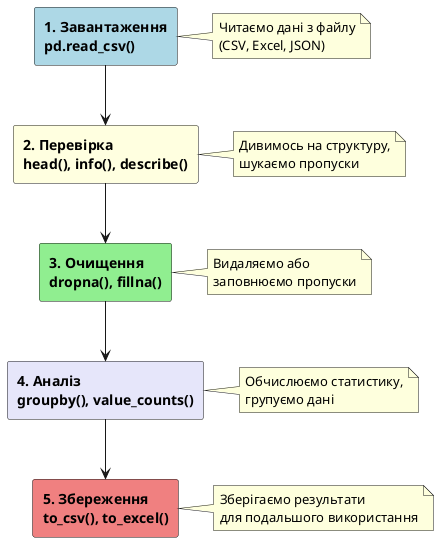
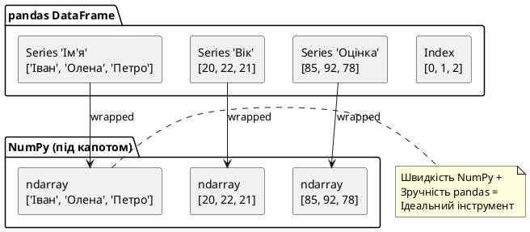

# Робота з даними з використанням NumPy і pandas

## Завдання, яке розкриє правду про чистий Python

Уявіть: вам надіслали CSV-файл із 10 000 рядків — дані про продажі магазину за рік. Кожен рядок — одна транзакція: дата, категорія товару, ціна, кількість.

Ваш менеджер хоче знати:

1. Яка середня ціна товарів у категорії «Електроніка»?
2. Який товар продали найбільше разів?
3. Скільки продажів було у грудні?

Здається, нічого складного. Спробуємо зробити це «чистим Python» — тобто тільки вбудованими засобами мови без жодних бібліотек:

```python
import csv

# Читаємо CSV вручну
data = []
with open("sales.csv", encoding="utf-8") as f:
    reader = csv.DictReader(f)
    for row in reader:
        data.append(row)

# Завдання 1: середня ціна в категорії "Електроніка"
total = 0
count = 0
for row in data:
    if row["category"] == "Електроніка":
        total += float(row["price"])
        count += 1
average = total / count if count > 0 else 0
print(f"Середня ціна: {average:.2f}")

# Завдання 2: найпопулярніший товар
product_counts = {}
for row in data:
    name = row["product"]
    product_counts[name] = product_counts.get(name, 0) + int(row["quantity"])
best_product = max(product_counts, key=product_counts.get)
print(f"Лідер продажів: {best_product}")

# Завдання 3: продажі у грудні
december_sales = 0
for row in data:
    if row["date"].startswith("2024-12"):
        december_sales += 1
print(f"Продажів у грудні: {december_sales}")
```

Ось правда: цей код **працює**, але він:

- займає ~25 рядків для трьох простих запитань
- виконується повільно (цикл `for` по 10 000 рядків — три рази!)
- важко читати і підтримувати
- не масштабується — для 1 000 000 рядків буде ще гірше

А тепер подивіться на те саме з **pandas**:

::jupyter-notebook{title="sales_pandas.ipynb" kernel="Python 3 (ipykernel)"}

::jupyter-cell{type="markdown"}
### Аналіз продажів з pandas
Три завдання розв'язані в кілька рядків коду
::

::jupyter-cell{executionCount="1"}
```python
import pandas as pd
from io import StringIO

# Створимо тестові дані для демонстрації
csv_data = StringIO("""date,product,category,price,quantity
2024-11-15,Телефон Samsung Galaxy,Електроніка,12000,5
2024-12-01,Ноутбук Dell,Електроніка,28000,2
2024-12-05,Футболка Nike,Одяг,850,10
2024-11-20,iPhone 15,Електроніка,45000,3
2024-12-10,Навушники Sony,Електроніка,3500,8
2024-11-25,Джинси Levi's,Одяг,2200,4
2024-12-15,Телефон Samsung Galaxy,Електроніка,12000,7""")

df = pd.read_csv(csv_data)

# Завдання 1: середня ціна в "Електроніці"
average = df[df["category"] == "Електроніка"]["price"].mean()

# Завдання 2: найпопулярніший товар
best_product = df.groupby("product")["quantity"].sum().idxmax()

# Завдання 3: продажі у грудні
december_sales = df[df["date"].str.startswith("2024-12")].shape[0]

print(f"Середня ціна в Електроніці: {average:.2f} грн")
print(f"Лідер продажів: {best_product}")
print(f"Продажів у грудні: {december_sales}")
```

#output
```
Середня ціна в Електроніці: 20100.00 грн
Лідер продажів: Телефон Samsung Galaxy
Продажів у грудні: 4
```
::

::

**Три рядки замість 25. Швидше у 10–100 разів. Читається як англійська мова.**

> Аналогія: чистий Python для роботи з даними — це як рахувати тисячі транзакцій на звичайному калькуляторі. NumPy та pandas — це як Excel із формулами, але на стероїдах: не тільки швидше та потужніше, а й у тисячу разів зручніше для складних запитань.

У цій статті ми побудуємо розуміння обох бібліотек з нуля: спочатку NumPy — бо саме він є «двигуном» усіх обчислень, а потім pandas — інструмент для роботи з таблицями.

### Типовий процес роботи з даними

Перед тим як почати, подивимось на загальну схему роботи з даними — від завантаження до збереження результатів:

::plant-uml



::

Ці п'ять кроків — стандартна послідовність у Data Science. У цій статті ми навчимось виконувати кожен з них.

---

## Частина 1. NumPy — фундамент числових обчислень

### Чому стандартного списку Python недостатньо

Ви вже знаєте списки Python — це один із найбільш гнучких типів даних:

```python
numbers = [1, 2, 3, 4, 5]
mixed   = [1, "два", 3.0, True, None]  # Список може містити будь-що
```

Саме ця гнучкість і є проблемою. Розберемо, що відбувається в пам'яті комп'ютера, коли ви створюєте список `[1, 2, 3, 4, 5]`:

```
Список Python в пам'яті:
┌─────────────────────────────────────────────────────┐
│ Список (list object)                                │
│  ┌─────┐  ┌─────┐  ┌─────┐  ┌─────┐  ┌─────┐     │
│  │ ptr │  │ ptr │  │ ptr │  │ ptr │  │ ptr │ ...  │
│  └──┬──┘  └──┬──┘  └──┬──┘  └──┬──┘  └──┬──┘     │
│     │        │        │        │        │          │
│     ▼        ▼        ▼        ▼        ▼          │
│ ┌───────┐ ┌───────┐ ┌───────┐ ...                 │
│ │ тип   │ │ тип   │ │ тип   │                     │
│ │ лічил.│ │ лічил.│ │ лічил.│                     │
│ │ знач=1│ │ знач=2│ │ знач=3│                     │
│ └───────┘ └───────┘ └───────┘                     │
└─────────────────────────────────────────────────────┘
```

Кожен елемент списку — це **вказівник** (pointer) на окремий об'єкт у пам'яті. Кожен об'єкт містить:

- тип даних (int? str? float?)
- лічильник посилань (скільки змінних вказують на цей об'єкт)
- саме значення

Це надає гнучкість (можна мати елементи різних типів), але коштує дорого — і пам'яттю, і часом.

**Що відбувається при `for` циклі по списку?**

```python
total = 0
for x in numbers:  # Python: знайти вказівник → зайти в пам'ять →
    total += x     # прочитати тип → прочитати значення → виконати операцію
                   # → повернути вказівник → перейти до наступного...
```

Для кожного елемента — серія окремих операцій із перевіркою типу. На 10 000 елементів це помітно. На 10 мільйонах — катастрофа.

### NumPy ndarray: однорідний масив у пам'яті

**NumPy** (Numerical Python) — бібліотека для ефективних математичних обчислень. Її основний тип — `ndarray` (N-dimensional array, N-вимірний масив).

Ось як той самий масив `[1, 2, 3, 4, 5]` виглядає в NumPy:

```
NumPy масив в пам'яті:
┌─────────────────────────────┐
│ ndarray (масив об'єкт)      │
│ dtype: int64                │
│ shape: (5,)                 │
│ ┌────┬────┬────┬────┬────┐  │
│ │ 1  │ 2  │ 3  │ 4  │ 5  │  │
│ └────┴────┴────┴────┴────┘  │
│  Суцільний блок пам'яті!    │
└─────────────────────────────┘
```

Всі елементи одного типу (`int64`), лежать **впритул** у пам'яті. Не потрібні вказівники, не потрібна перевірка типів для кожного елемента.

> Аналогія: список Python — це шафа, де кожна річ загорнута в окрему коробку з підписом (що це, кому належить, скільки місця займає). NumPy масив — це монолітна полиця, де однакові предмети лежать рівно, один біля одного. Дістати будь-який — миттєво, бо ви знаєте точну відстань від початку.

### Встановлення та перший запуск

::tabs
::tabs-item{label="pip"}

```bash
pip install numpy
```

::

::tabs-item{label="uv"}

```bash
uv pip install numpy
```

::

::tabs-item{label="poetry"}

```bash
poetry add numpy
```

::
::

```python
import numpy as np  # np — загальноприйнятий псевдонім
```

::note
Чому `import numpy as np`, а не просто `import numpy`? Суто зручність — `np.array(...)` коротше, ніж `numpy.array(...)`. Це загальноприйнятий стандарт — весь світ пише `np`.
::

### Створення масивів

::jupyter-notebook{title="numpy_basics.ipynb" kernel="Python 3 (ipykernel)"}

::jupyter-cell{type="markdown"}
### Створення NumPy масивів різними способами
Розберемо 5 основних способів створення масивів
::

::jupyter-cell{executionCount="1"}
```python
import numpy as np

# 1. З Python-списку
arr1 = np.array([1, 2, 3, 4, 5])
print("З списку:", arr1)
print("Тип:", type(arr1))
```

#output
```
З списку: [1 2 3 4 5]
Тип: <class 'numpy.ndarray'>
```
::

::jupyter-cell{executionCount="2"}
```python
# 2. Масив нулів
zeros = np.zeros(5)
print("Нулів:", zeros)

# 3. Масив одиниць
ones = np.ones(5)
print("Одиниць:", ones)
```

#output
```
Нулів: [0. 0. 0. 0. 0.]
Одиниць: [1. 1. 1. 1. 1.]
```
::

::jupyter-cell{executionCount="3"}
```python
# 4. Послідовність (аналог range)
seq = np.arange(0, 10, 2)
print("Послідовність:", seq)

# 5. Рівномірно розподілені
lin = np.linspace(0, 1, 5)
print("Лінійні:", lin)
```

#output
```
Послідовність: [0 2 4 6 8]
Лінійні: [0.   0.25 0.5  0.75 1.  ]
```
::

::

### Атрибути масиву

Кожен ndarray «знає» про себе важливу інформацію:

::jupyter-notebook{title="array_attributes.ipynb" kernel="Python 3 (ipykernel)"}

::jupyter-cell{type="markdown"}
### Атрибути NumPy масиву
Кожен масив зберігає метадані про свою структуру
::

::jupyter-cell{executionCount="1"}
```python
import numpy as np

arr = np.array([[1, 2, 3],
                [4, 5, 6]])

print(f"shape (форма):     {arr.shape}")
print(f"ndim (вимірів):    {arr.ndim}")
print(f"size (елементів):  {arr.size}")
print(f"dtype (тип):       {arr.dtype}")
```

#output
```
shape (форма):     (2, 3)
ndim (вимірів):    2
size (елементів):  6
dtype (тип):       int64
```
::

::

::note
`shape` — один із найважливіших атрибутів у ML. Форма масиву (наприклад, `(1000, 28, 28)`) говорить вам: 1000 зображень розміром 28×28 пікселів. Ви будете бачити `arr.shape` у кожному ML-проєкті.
::

### Векторизовані операції — головна сила NumPy

Ось де починається магія. Замість циклів — прямі математичні операції над усім масивом:

::jupyter-notebook{title="vectorized_operations.ipynb" kernel="Python 3 (ipykernel)"}

::jupyter-cell{type="markdown"}
### Векторизовані операції без циклів
Всі операції застосовуються відразу до всього масиву
::

::jupyter-cell{executionCount="1"}
```python
import numpy as np

arr = np.array([1, 2, 3, 4, 5])

# Операції зі скалярами — застосовуються до КОЖНОГО елемента
print("arr + 10:", arr + 10)
print("arr * 2: ", arr * 2)
print("arr ** 2:", arr ** 2)
print("arr > 3: ", arr > 3)
```

#output
```
arr + 10: [11 12 13 14 15]
arr * 2:  [ 2  4  6  8 10]
arr ** 2: [ 1  4  9 16 25]
arr > 3:  [False False False  True  True]
```
::

::jupyter-cell{executionCount="2"}
```python
# Операції між масивами — поелементно
a = np.array([1, 2, 3])
b = np.array([10, 20, 30])
print("a + b:", a + b)
print("a * b:", a * b)
```

#output
```
a + b: [11 22 33]
a * b: [10 40 90]
```
::

::

Порівняємо швидкість — наочний тест:

::jupyter-notebook{title="numpy_speed_test.ipynb" kernel="Python 3 (ipykernel)"}

::jupyter-cell{type="markdown"}
### Тест швидкості: Python list vs NumPy array
Помножимо 1 мільйон чисел на 2 двома способами
::

::jupyter-cell{executionCount="1" executionTime="0.13s"}
```python
import time
import numpy as np

# Зі списком Python
python_list = list(range(1_000_000))
start = time.time()
python_result = [x * 2 for x in python_list]
python_time = time.time() - start

print(f"Python list: {python_time:.3f}с")
```

#output
```
Python list: 0.124с
```
::

::jupyter-cell{executionCount="2" executionTime="0.002s"}
```python
# З NumPy масивом
numpy_arr = np.arange(1_000_000)
start = time.time()
numpy_result = numpy_arr * 2
numpy_time = time.time() - start

print(f"NumPy array: {numpy_time:.3f}с")
```

#output
```
NumPy array: 0.002с
```
::

::jupyter-cell{executionCount="3" outputType="stdout"}
```python
# Висновок
print(f"🚀 NumPy швидше у {python_time/numpy_time:.0f} разів!")
```

#output
🚀 NumPy швидше у 62 разів!
::

::

### Індексація та зрізи

Синтаксис схожий на списки Python, але потужніший:

::jupyter-notebook{title="indexing_slicing.ipynb" kernel="Python 3 (ipykernel)"}

::jupyter-cell{type="markdown"}
### Індексація та зрізи масивів
Робота з 1D та 2D масивами
::

::jupyter-cell{executionCount="1"}
```python
import numpy as np

arr = np.array([10, 20, 30, 40, 50])

print("Перший елемент:", arr[0])
print("Останній:", arr[-1])
print("Зріз [1:4]:", arr[1:4])
print("Кожен другий:", arr[::2])
```

#output
```
Перший елемент: 10
Останній: 50
Зріз [1:4]: [20 30 40]
Кожен другий: [10 30 50]
```
::

::jupyter-cell{executionCount="2"}
```python
# 2D масив (матриця)
matrix = np.array([[1, 2, 3],
                   [4, 5, 6],
                   [7, 8, 9]])

print("Елемент [1,2]:", matrix[1, 2])
print("Весь стовпець 1:", matrix[:, 1])
print("Весь рядок 0:", matrix[0, :])
print("Підматриця [1:, 1:]:\n", matrix[1:, 1:])
```

#output
```
Елемент [1,2]: 6
Весь стовпець 1: [2 5 8]
Весь рядок 0: [1 2 3]
Підматриця [1:, 1:]:
 [[5 6]
 [8 9]]
```
::

::

### Булева індексація — фільтрація без циклів

Одна з найпотужніших можливостей NumPy:

::jupyter-notebook{title="boolean_indexing.ipynb" kernel="Python 3 (ipykernel)"}

::jupyter-cell{type="markdown"}
### Фільтрація даних без циклів
Знайдемо всі оцінки вище 70 балів
::

::jupyter-cell{executionCount="1"}
```python
import numpy as np

scores = np.array([85, 42, 91, 67, 78, 55, 96, 33])

# Створюємо булеву маску
mask = scores > 70
print("Маска:", mask)
```

#output
```
Маска: [ True False  True False  True False  True False]
```
::

::jupyter-cell{executionCount="2"}
```python
# Застосовуємо маску для фільтрації
good_scores = scores[mask]
print("Хороші оцінки:", good_scores)

# Або коротше — в одну дію
good_scores = scores[scores > 70]
print("Швидкий спосіб:", good_scores)
```

#output
```
Хороші оцінки: [85 91 78 96]
Швидкий спосіб: [85 91 78 96]
```
::

::jupyter-cell{executionCount="3" outputType="stdout"}
```python
# Статистика відфільтрованих даних
print(f"Хороших оцінок: {len(good_scores)}")
print(f"Середня серед хороших: {good_scores.mean():.1f}")
```

#output
Хороших оцінок: 4
Середня серед хороших: 87.5
::

::

> Аналогія: булева індексація — це як фільтр у Excel. Ви задаєте умову («ціна > 1000»), і Excel автоматично показує лише відповідні рядки. Тільки NumPy робить це для масивів з мільйонами елементів — миттєво.

### Агрегатні функції

::jupyter-notebook{title="aggregate_functions.ipynb" kernel="Python 3 (ipykernel)"}

::jupyter-cell{type="markdown"}
### Агрегатні функції для статистики
Обчислення суми, середнього, мінімуму та максимуму
::

::jupyter-cell{executionCount="1"}
```python
import numpy as np

data = np.array([23, 45, 12, 67, 89, 34, 56, 78, 90, 11])

print(f"Сума:             {data.sum()}")
print(f"Середнє:          {data.mean():.1f}")
print(f"Мінімум:          {data.min()}")
print(f"Максимум:         {data.max()}")
print(f"Стд. відхилення:  {data.std():.1f}")
print(f"Індекс мінімуму:  {data.argmin()}")
print(f"Індекс максимуму: {data.argmax()}")
```

#output
```
Сума:             505
Середнє:          50.5
Мінімум:          11
Максимум:         90
Стд. відхилення:  27.7
Індекс мінімуму:  9
Індекс максимуму: 8
```
::

::

Для 2D масивів можна вказати вісь (`axis`):

::jupyter-notebook{title="axis_aggregation.ipynb" kernel="Python 3 (ipykernel)"}

::jupyter-cell{type="markdown"}
### Агрегація по осях (axis)
Обчислення для рядків або стовпців окремо
::

::jupyter-cell{executionCount="1"}
```python
import numpy as np

matrix = np.array([[1, 2, 3],
                   [4, 5, 6]])

print("Сума всіх елементів:", matrix.sum())
print("Сума по стовпцях (axis=0):", matrix.sum(axis=0))
print("Сума по рядках (axis=1):", matrix.sum(axis=1))
```

#output
```
Сума всіх елементів: 21
Сума по стовпцях (axis=0): [5 7 9]
Сума по рядках (axis=1): [ 6 15]
```
::

::

### Зміна форми: reshape

::jupyter-notebook{title="reshape_arrays.ipynb" kernel="Python 3 (ipykernel)"}

::jupyter-cell{type="markdown"}
### Зміна форми масиву (reshape)
Перетворення 1D масиву в 2D та назад
::

::jupyter-cell{executionCount="1"}
```python
import numpy as np

arr = np.arange(12)
print("Одновимірний:", arr)

matrix = arr.reshape(3, 4)
print("\nМатриця 3×4:\n", matrix)

flat = matrix.flatten()
print("\nЗнову 1D:", flat)
```

#output
```
Одновимірний: [ 0  1  2  3  4  5  6  7  8  9 10 11]

Матриця 3×4:
 [[ 0  1  2  3]
 [ 4  5  6  7]
 [ 8  9 10 11]]

Знову 1D: [ 0  1  2  3  4  5  6  7  8  9 10 11]
```
::

::

::note
`reshape` — фундаментальна операція в ML. Зображення 28×28 пікселів потрібно перетворити у вектор із 784 елементів для подачі в нейронну мережу? `image.reshape(784)`. Або навпаки — вектор у 2D зображення? `flat.reshape(28, 28)`. Ви будете використовувати це постійно.
::

### Випадкові числа: np.random

У Data Science постійно потрібні випадкові числа — для симуляцій, тестових даних, ініціалізації нейронних мереж. NumPy має потужний модуль `np.random`:

::jupyter-notebook{title="random_numbers.ipynb" kernel="Python 3 (ipykernel)"}

::jupyter-cell{type="markdown"}
### Генерація випадкових чисел
Різні типи випадкових розподілів
::

::jupyter-cell{executionCount="1"}
```python
import numpy as np

# Встановимо seed для відтворюваності результатів
np.random.seed(42)

# Випадкові числа від 0 до 1
random_floats = np.random.rand(5)
print("Випадкові [0, 1):", random_floats)

# Випадкові цілі числа
random_ints = np.random.randint(1, 100, size=5)
print("Випадкові цілі [1, 100):", random_ints)

# Нормальний розподіл (Gaussian)
normal = np.random.randn(5)
print("Нормальний розподіл:", normal)
```

#output
```
Випадкові [0, 1): [0.37454012 0.95071431 0.73199394 0.59865848 0.15601864]
Випадкові цілі [1, 100): [16 86  6 98 96]
Нормальний розподіл: [ 0.56804456 -0.92122608 -1.19287092  0.62560281 -0.85635656]
```
::

::jupyter-cell{executionCount="2"}
```python
# Перемішати масив
arr = np.array([1, 2, 3, 4, 5])
np.random.shuffle(arr)
print("Перемішаний масив:", arr)

# Вибрати випадкові елементи
choices = np.random.choice([10, 20, 30, 40], size=5, replace=True)
print("Випадковий вибір:", choices)
```

#output
```
Перемішаний масив: [2 5 3 4 1]
Випадковий вибір: [30 10 40 20 30]
```
::

::

::tip
**`np.random.seed(42)` — що це?**  
Випадкові числа насправді псевдовипадкові — генеруються за алгоритмом. `seed` встановлює початкову точку, щоб кожен раз отримувати **однакові** "випадкові" числа. Це критично для відтворюваності експериментів у Data Science!
::

### Порівняльна таблиця: список Python vs NumPy

| Операція            | Список Python                  | NumPy ndarray                 |
| :------------------ | :----------------------------- | :---------------------------- |
| Тип елементів       | Будь-які (гнучко, повільно)    | Однаковий (компактно, швидко) |
| Пам'ять             | Вказівники + обгортки об'єктів | Суцільний блок пам'яті        |
| Швидкість `+`       | Конкатенація списків           | Поелементне додавання         |
| Цикли               | Потрібні для кожної операції   | Не потрібні — векторизація    |
| Багатовимірність    | Список списків (незручно)      | Вбудована підтримка (ndarray) |
| Булева індексація   | Немає                          | Є — фільтрація без циклів     |
| Математичні функції | Потрібні цикли                 | `np.sin()`, `np.exp()` і т.д. |
| Відносна швидкість  | 1×                             | 10–100×                       |

---

## Частина 2. pandas — робота з таблицями даних

### Що таке pandas і чому він скрізь

**pandas** — бібліотека для роботи з табличними даними. Назва походить від "Panel Data" (панельні дані) — термін з економетрики. Саме pandas перетворив Python на мову №1 для Data Science.

Pandas побудований **поверх NumPy** — усередині кожного pandas-об'єкту лежить NumPy-масив. Тому pandas поєднує зручність роботи з таблицями (індекси, назви стовпців, перемішані типи) зі швидкістю NumPy.

**Внутрішня структура pandas:**

::plant-uml



::

> Аналогія: NumPy — це двигун автомобіля (потужний, швидкий, але складний у використанні). pandas — це рульове колесо, педалі та приладова панель (зручний інтерфейс для керування тим самим двигуном).

::tabs
::tabs-item{label="pip"}

```bash
pip install pandas
```

::

::tabs-item{label="uv"}

```bash
uv pip install pandas
```

::

::tabs-item{label="poetry"}

```bash
poetry add pandas
```

::
::

```python
import pandas as pd  # pd — загальноприйнятий псевдонім
```

---

### Series: одновимірна структура даних

**Series** — це одновимірна структура даних pandas. Уявіть її як **один стовпець Excel-таблиці**: зліва — мітка рядка (індекс), справа — значення.

::jupyter-notebook{title="series_basics.ipynb" kernel="Python 3 (ipykernel)"}

::jupyter-cell{type="markdown"}
### Створення Series
Найпростіший спосіб — зі списку Python
::

::jupyter-cell{executionCount="1"}
```python
import pandas as pd

# Найпростіший Series: зі списку Python
temperatures = pd.Series([22, 25, 19, 27, 23])
temperatures
```

#output
```
0    22
1    25
2    19
3    27
4    23
dtype: int64
```
::

::

За замовчуванням індекс — це числа 0, 1, 2... Але можна задати власний:

::jupyter-notebook{title="student_grades.ipynb" kernel="Python 3 (ipykernel)"}

::jupyter-cell{type="markdown"}
### Series з власним індексом
Використаємо імена студентів як індекс
::

::jupyter-cell{executionCount="1"}
```python
import pandas as pd

# Series з іменованим індексом
grades = pd.Series(
    [85, 92, 78, 96, 71],
    index=["Іван", "Олена", "Петро", "Марія", "Андрій"]
)

grades
```

#output
```
Іван      85
Олена     92
Петро     78
Марія     96
Андрій    71
dtype: int64
```
::

::

> Аналогія: Series — це як стовпець «Оцінки» у класному журналі. Зліва — прізвища учнів (індекс), справа — їхні бали (значення). Кожен рядок — пара «ім'я: оцінка».

**Доступ до елементів Series:**

::jupyter-notebook{title="series_access.ipynb" kernel="Python 3 (ipykernel)"}

::jupyter-cell{type="markdown"}
### Доступ до елементів Series
За іменем індексу або за позицією
::

::jupyter-cell{executionCount="1"}
```python
import pandas as pd

grades = pd.Series(
    [85, 92, 78, 96, 71],
    index=["Іван", "Олена", "Петро", "Марія", "Андрій"]
)

print("Оцінка Олени:", grades["Олена"])
print("За позицією 1:", grades.iloc[1])
print("Перші три:\n", grades.iloc[0:3])
```

#output
```
Оцінка Олени: 92
За позицією 1: 92
Перші три:
 Іван     85
Олена    92
Петро    78
dtype: int64
```
::

::

**Векторизовані операції над Series:**

::jupyter-notebook{title="series_operations.ipynb" kernel="Python 3 (ipykernel)"}

::jupyter-cell{type="markdown"}
### Векторизовані операції над Series
Операції застосовуються до всіх елементів відразу
::

::jupyter-cell{executionCount="1"}
```python
import pandas as pd

grades = pd.Series(
    [85, 92, 78, 96, 71],
    index=["Іван", "Олена", "Петро", "Марія", "Андрій"]
)

# Додати 5 балів всім
print("Додати 5 балів всім:")
print(grades + 5)
```

#output
```
Додати 5 балів всім:
Іван      90
Олена     97
Петро     83
Марія    101
Андрій    76
dtype: int64
```
::

::jupyter-cell{executionCount="2"}
```python
# Відбір за умовою
print("Хто має оцінку > 80:")
excellent = grades[grades > 80]
print(excellent)
```

#output
```
Хто має оцінку > 80:
Іван     85
Олена    92
Марія    96
dtype: int64
```
::

::jupyter-cell{executionCount="3" outputType="stdout"}
```python
# Агрегатні функції
print(f"Середня оцінка: {grades.mean():.1f}")
print(f"Найвища: {grades.max()}")
print(f"Найнижча: {grades.min()}")
```

#output
Середня оцінка: 84.4
Найвища: 96
Найнижча: 71
::

::

**Series зі словника Python:**

::jupyter-notebook{title="series_from_dict.ipynb" kernel="Python 3 (ipykernel)"}

::jupyter-cell{type="markdown"}
### Series зі словника
Словник автоматично перетворюється на Series, де ключі стають індексом
::

::jupyter-cell{executionCount="1"}
```python
import pandas as pd

# Словник автоматично перетворюється на Series
city_populations = pd.Series({
    "Київ":    2952301,
    "Харків":  1421125,
    "Одеса":   1015826,
    "Дніпро":   980775
})

city_populations.sort_values(ascending=False)
```

#output
```
Київ      2952301
Харків    1421125
Одеса     1015826
Дніпро     980775
dtype: int64
```
::

::

---

### DataFrame: двовимірна таблиця даних

**DataFrame** — це двовимірна структура даних pandas, аналог Excel-таблиці або SQL-таблиці бази даних. Складається зі **стовпців** (кожен стовпець — це Series) та **рядків** (кожен рядок — одне спостереження).

> Аналогія: якщо Series — це один стовпець класного журналу (скажімо, оцінки з математики), то DataFrame — це **весь журнал** з усіма предметами. У кожному рядку — один учень, у кожному стовпці — один предмет.

### Створення DataFrame зі словника

::jupyter-notebook{title="create_students_df.ipynb" kernel="Python 3 (ipykernel)"}

::jupyter-cell{type="markdown"}
### Створення DataFrame із даними про студентів
Побудуємо таблицю з іменами, віком та оцінками з трьох предметів
::

::jupyter-cell{executionCount="1"}
```python
import pandas as pd

data = {
    "Ім'я":        ["Іван",  "Олена", "Петро", "Марія"],
    "Вік":         [20,      22,      21,      23],
    "Математика":  [85,      92,      78,      96],
    "Фізика":      [78,      88,      82,      91],
    "Python":      [91,      95,      73,      89]
}

df = pd.DataFrame(data)
df
```

#output
|   | Ім'я  | Вік | Математика | Фізика | Python |
|---|-------|-----|------------|--------|--------|
| 0 | Іван  | 20  | 85         | 78     | 91     |
| 1 | Олена | 22  | 92         | 88     | 95     |
| 2 | Петро | 21  | 78         | 82     | 73     |
| 3 | Марія | 23  | 96         | 91     | 89     |
::

::jupyter-cell{executionCount="2" outputType="stdout"}
```python
# Перевіримо структуру
print(f"Розмір: {df.shape} (рядків × стовпців)")
print(f"Стовпці: {list(df.columns)}")
print(f"Типи даних:\n{df.dtypes}")
```

#output
Розмір: (4, 5) (рядків × стовпців)
Стовпці: ['Ім'я', 'Вік', 'Математика', 'Фізика', 'Python']
Типи даних:
Ім'я          object
Вік            int64
Математика     int64
Фізика         int64
Python         int64
dtype: object
::

::

**Структура DataFrame:**

- **Рядки** (rows): кожен рядок — один студент (спостереження)
- **Стовпці** (columns): кожен стовпець — одна характеристика (ознака)
- **Індекс** (index): автоматичний (0, 1, 2...) або кастомний — мітки рядків

### Доступ до даних у DataFrame

Це одна з найважливіших тем — є кілька різних способів, і кожен для свого випадку:

**1. Доступ до стовпця — як до ключа словника:**

::jupyter-notebook{title="dataframe_column_access.ipynb" kernel="Python 3 (ipykernel)"}

::jupyter-cell{type="markdown"}
### Доступ до стовпця DataFrame
Отримання одного стовпця як Series
::

::jupyter-cell{executionCount="1"}
```python
import pandas as pd

data = {
    "Ім'я": ["Іван", "Олена", "Петро", "Марія"],
    "Вік": [20, 22, 21, 23],
    "Математика": [85, 92, 78, 96]
}
df = pd.DataFrame(data)

# Один стовпець → Series
ages = df["Вік"]
print("Тип:", type(ages))
print(ages)
```

#output
```
Тип: <class 'pandas.core.series.Series'>
0    20
1    22
2    21
3    23
Name: Вік, dtype: int64
```
::

::

**2. Доступ до рядків через `.iloc` — за числовою позицією:**

::jupyter-notebook{title="iloc_access.ipynb" kernel="Python 3 (ipykernel)"}

::jupyter-cell{type="markdown"}
### Доступ до рядків через iloc
Доступ за числовою позицією (integer location)
::

::jupyter-cell{executionCount="1"}
```python
import pandas as pd

data = {
    "Ім'я": ["Іван", "Олена", "Петро", "Марія"],
    "Вік": [20, 22, 21, 23],
    "Математика": [85, 92, 78, 96]
}
df = pd.DataFrame(data)

# iloc = integer location (позиція, як у списку)
first_row = df.iloc[0]
print("Перший рядок:\n", first_row)

print("\nКонкретна комірка [1, 2]:", df.iloc[1, 2])
```

#output
```
Перший рядок:
 Ім'я          Іван
Вік             20
Математика      85
Name: 0, dtype: object

Конкретна комірка [1, 2]: 92
```
::

::

**3. Доступ до рядків через `.loc` — за міткою індексу:**

```python
# loc = label-based location (за міткою)
# Якщо індекс числовий, він збігається з iloc:
row = df.loc[0]    # Рядок з індексом 0 (Іван)

# Але якщо задати кастомний індекс:
df_named = df.set_index("Ім'я")  # Тепер індекс — імена студентів
ivan_data = df_named.loc["Іван"]  # Доступ за ім'ям
```

::note
**Різниця між `iloc` та `loc`:**

- `df.iloc[0]` — завжди перший рядок (за позицією)
- `df.loc[0]` — рядок з **міткою** 0 (якщо індекс числовий, збігається; якщо ні — інша поведінка)

Правило: якщо ви думаєте «мені потрібен перший/другий/N-й рядок» — використовуйте `iloc`. Якщо «мені потрібен рядок з конкретним ім'ям або ID» — `loc`.
::

**4. Фільтрація рядків за умовою:**

::jupyter-notebook{title="dataframe_filtering.ipynb" kernel="Python 3 (ipykernel)"}

::jupyter-cell{type="markdown"}
### Фільтрація рядків DataFrame
Відбір даних за умовою (Boolean indexing)
::

::jupyter-cell{executionCount="1"}
```python
import pandas as pd

data = {
    "Ім'я": ["Іван", "Олена", "Петро", "Марія"],
    "Вік": [20, 22, 21, 23],
    "Математика": [85, 92, 78, 96],
    "Python": [82, 95, 88, 91]
}
df = pd.DataFrame(data)

# Студенти, яким більше 21 року
older = df[df["Вік"] > 21]
print("Старші за 21:\n", older[["Ім'я", "Вік"]])
```

#output
```
Старші за 21:
    Ім'я  Вік
1  Олена   22
3  Марія   23
```
::

::jupyter-cell{executionCount="2"}
```python
# Кілька умов (& = AND, | = OR)
top_students = df[(df["Математика"] > 85) & (df["Python"] > 85)]
print("Топ-студенти:\n", top_students[["Ім'я", "Математика", "Python"]])
```

#output
```
Топ-студенти:
    Ім'я  Математика  Python
1  Олена          92      95
3  Марія          96      91
```
::

::

::warning{title="Пастка: зміна view замість копії"}
Коли ви фільтруєте DataFrame, pandas іноді створює **view** (погляд на оригінальні дані), а не справжню копію. Зміна view може **випадково змінити оригінальний DataFrame**!

```python
# НЕБЕЗПЕЧНО — це може бути view, а не копія
df_expensive = df[df["price"] > 10000]
df_expensive["discount"] = 0.2  # ⚠️ Може змінити оригінальний df!

# ПРАВИЛЬНО — явна копія
df_expensive = df[df["price"] > 10000].copy()
df_expensive["discount"] = 0.2  # Тепер безпечно, df залишився незмінним
```

Правило: якщо ви плануєте **змінювати** відфільтрований датасет, завжди додавайте `.copy()` в кінці.
::

**5. Додавання нових стовпців:**

::jupyter-notebook{title="add_average_column.ipynb" kernel="Python 3 (ipykernel)"}

::jupyter-cell{type="markdown"}
### Додавання обчисленого стовпця
Створимо стовпець "Середня" з середніх оцінок
::

::jupyter-cell{executionCount="1"}
```python
import pandas as pd

data = {
    "Ім'я": ["Іван", "Олена", "Петро", "Марія"],
    "Математика": [85, 92, 78, 96],
    "Фізика": [80, 88, 75, 90],
    "Python": [89, 95, 80, 90]
}
df = pd.DataFrame(data)

# Обчислити середню оцінку кожного студента
df["Середня"] = df[["Математика", "Фізика", "Python"]].mean(axis=1)

df[["Ім'я", "Середня"]]
```

#output
```
     Ім'я   Середня
0    Іван  84.666667
1   Олена  91.666667
2   Петро  77.666667
3   Марія  92.000000
```
::

::

**6. Сортування:**

::jupyter-notebook{title="sort_students.ipynb" kernel="Python 3 (ipykernel)"}

::jupyter-cell{type="markdown"}
### Сортування DataFrame
Сортуємо студентів за середньою оцінкою
::

::jupyter-cell{executionCount="1"}
```python
import pandas as pd

data = {
    "Ім'я": ["Іван", "Олена", "Петро", "Марія"],
    "Математика": [85, 92, 78, 96],
    "Фізика": [80, 88, 75, 90],
    "Python": [89, 95, 80, 90]
}
df = pd.DataFrame(data)
df["Середня"] = df[["Математика", "Фізика", "Python"]].mean(axis=1)

# Відсортувати за середньою оцінкою (від найвищої)
df_sorted = df.sort_values("Середня", ascending=False)

df_sorted[["Ім'я", "Середня"]]
```

#output
```
     Ім'я   Середня
3   Марія  92.000000
1   Олена  91.666667
0    Іван  84.666667
2   Петро  77.666667
```
::

::

---

## Частина 3. Читання та запис даних

У реальному житті дані рідко вводять вручну. Зазвичай це CSV-файли з бази даних, Excel-звіти від відділу продажів, або JSON із API сервісу.

### Читання CSV файлів

CSV (Comma-Separated Values) — найпоширеніший формат обміну табличними даними:

```python
df = pd.read_csv("sales.csv")
```

Але в реальних файлах часто є нюанси. `read_csv` має десятки параметрів — ось найважливіші:

```python
# Основні параметри read_csv
df = pd.read_csv(
    "sales.csv",
    sep=";",                   # Роздільник (за замовчуванням ",")
    header=0,                  # Рядок із заголовками (0 = перший)
    encoding="utf-8",          # Кодування файлу
    na_values=["N/A", "-"],    # Значення, які трактувати як NaN (пропуск)
    usecols=["date", "price"], # Читати лише певні стовпці
    dtype={"price": float},    # Примусово задати тип стовпця
    parse_dates=["date"],      # Автоматично розпарсити дати
    nrows=1000                 # Читати лише перші 1000 рядків
)
```

::note
**Проблема кодування** — дуже поширена. Якщо у файлі є кирилиця і Python видає `UnicodeDecodeError`, спробуйте `encoding="utf-8-sig"` (Excel часто додає BOM-маркер), або `encoding="cp1251"` (Windows-кодування для кирилиці).
::

::::accordion

:::accordion-item{label="💡 Вирішення типової помилки: UnicodeDecodeError" icon="i-lucide-alert-triangle"}

**Симптом:** При виконанні `pd.read_csv("file.csv")` отримуєте помилку:

```
UnicodeDecodeError: 'utf-8' codec can't decode byte 0xe0 in position 15
```

**Причина:** Файл збережений у кодуванні, відмінному від UTF-8 (часто Windows-1251 для кирилиці або Latin-1 для європейських мов).

**Рішення — спроба через різні кодування:**

::jupyter-notebook{title="fixing_encoding.ipynb" kernel="Python 3 (ipykernel)"}

::jupyter-cell{type="markdown"}
### Вирішення проблеми з кодуванням файлу
Спробуємо три різні варіанти кодування
::

::jupyter-cell{executionCount="1" status="error"}
```python
import pandas as pd

# Спроба 1: за замовчуванням (UTF-8) — помилка!
df = pd.read_csv("sales.csv")
```

#output
UnicodeDecodeError: 'utf-8' codec can't decode byte 0xe0 in position 15
::

::jupyter-cell{executionCount="2"}
```python
# Спроба 2: UTF-8 з BOM (Excel часто додає BOM-маркер)
try:
    df = pd.read_csv("sales.csv", encoding="utf-8-sig")
    print("✅ Успіх з utf-8-sig!")
    print(df.head(2))
except:
    print("❌ utf-8-sig не підійшло")
```

#output
✅ Успіх з utf-8-sig!
|   | date       | product  | price |
|---|------------|----------|-------|
| 0 | 2024-01-15 | Телефон  | 12000 |
| 1 | 2024-01-16 | Ноутбук  | 28000 |
::

::jupyter-cell{type="markdown"}
Якщо utf-8-sig не допоміг, спробуйте Windows-1251 або Latin-1:
::

::jupyter-cell{executionCount="3"}
```python
# Альтернативи:
# df = pd.read_csv("sales.csv", encoding="cp1251")      # Windows кирилиця
# df = pd.read_csv("sales.csv", encoding="latin1")      # Універсальне (завжди працює)
```

#output
::

::

**Як дізнатися правильне кодування автоматично?**

::jupyter-notebook{title="detect_encoding.ipynb" kernel="Python 3 (ipykernel)"}

::jupyter-cell{type="markdown"}
### Автоматичне визначення кодування файлу
Використаємо бібліотеку chardet для детекції
::

::jupyter-cell{executionCount="1" outputType="stdout"}
```python
# Спочатку встановіть: pip install chardet
import chardet

with open("sales.csv", "rb") as f:
    result = chardet.detect(f.read(10000))  # Читаємо перші 10KB
    print("Виявлене кодування:")
    print(f"  Encoding: {result['encoding']}")
    print(f"  Впевненість: {result['confidence']*100:.0f}%")
```

#output
Виявлене кодування:
  Encoding: Windows-1251
  Впевненість: 99%
::

::jupyter-cell{executionCount="2"}
```python
import pandas as pd

# Тепер використовуємо виявлене кодування
df = pd.read_csv("sales.csv", encoding=result["encoding"])
print(f"✅ Файл успішно прочитано з кодуванням {result['encoding']}")
df.head(3)
```

#output
✅ Файл успішно прочитано з кодуванням Windows-1251
|   | date       | product  | category    | price |
|---|------------|----------|-------------|-------|
| 0 | 2024-01-15 | Телефон  | Електроніка | 12000 |
| 1 | 2024-01-16 | Ноутбук  | Електроніка | 28000 |
| 2 | 2024-01-17 | Футболка | Одяг        | 450   |
::

::

**Як уникнути проблеми взагалі:**

```python
# Завжди зберігайте свої CSV у UTF-8:
df.to_csv("output.csv", encoding="utf-8-sig", index=False)
```

:::

::::

**Приклад реального читання:**

::jupyter-notebook{title="read_sales_data.ipynb" kernel="Python 3 (ipykernel)"}

::jupyter-cell{type="markdown"}
### Читання CSV з автоматичним парсингом дат
pandas може автоматично розпізнавати типи даних
::

::jupyter-cell{executionCount="1"}
```python
import pandas as pd

# Уявіть файл sales.csv:
# date,product,category,price,quantity
# 2024-01-15,Телефон,Електроніка,12000,3
# 2024-01-16,Ноутбук,Електроніка,28000,1
# 2024-01-17,Футболка,Одяг,450,10

# Створимо тестові дані для демонстрації
from io import StringIO
csv_data = StringIO("""date,product,category,price,quantity
2024-01-15,Телефон,Електроніка,12000,3
2024-01-16,Ноутбук,Електроніка,28000,1
2024-01-17,Футболка,Одяг,450,10""")

df = pd.read_csv(csv_data, parse_dates=["date"])
df.dtypes
```

#output
```
date        datetime64[ns]
product             object
category            object
price                int64
quantity             int64
dtype: object
```
::

::

### Читання Excel файлів

```python
# Один аркуш (перший за замовчуванням)
df = pd.read_excel("report.xlsx")

# Конкретний аркуш за ім'ям або номером
df_sheet2 = pd.read_excel("report.xlsx", sheet_name="Продажі")
df_third   = pd.read_excel("report.xlsx", sheet_name=2)

# Усі аркуші — отримаємо словник
all_sheets = pd.read_excel("report.xlsx", sheet_name=None)
# all_sheets["Продажі"] → DataFrame
# all_sheets["Витрати"] → DataFrame
```

::warning
Для читання `.xlsx` файлів pandas потребує додаткової бібліотеки — `openpyxl`. Встановіть її: `pip install openpyxl`. Для старого формату `.xls` — `xlrd`.
::

### Запис даних у файли

```python
# Запис у CSV
df.to_csv("output.csv", index=False)  # index=False — не писати стовпець індексу

# Запис у CSV із іншим роздільником
df.to_csv("output_semicolon.csv", sep=";", index=False)

# Запис у Excel
df.to_excel("output.xlsx", sheet_name="Результати", index=False)

# Запис у JSON
df.to_json("output.json", orient="records", force_ascii=False)
```

::tip
`index=False` при записі в CSV — майже завжди потрібний параметр. Без нього pandas додає зайвий стовпець із числами 0, 1, 2... ліворуч від даних, що робить файл «незрозумілим» для інших програм.
::

---

## Частина 4. Інформаційні методи — перше знайомство з датасетом

Щоразу коли ви отримуєте новий датасет — перший крок однаковий: **дізнатися, що взагалі в цьому файлі**. Для цього є кілька незамінних методів.

Будемо працювати з одним прикладом — уявний датасет продажів інтернет-магазину:

```python
import pandas as pd

# Завантажуємо датасет
df = pd.read_csv("sales_data.csv")
```

### `df.head(n)` та `df.tail(n)` — погляд на дані

`head()` показує перші рядки (за замовчуванням — 5), `tail()` — останні:

```python
df.head()    # Перші 5 рядків
df.head(10)  # Перші 10 рядків
df.tail(3)   # Останні 3 рядки
```

::terminal-preview{title="df.head(3)"}

<div class="line"><span class="opacity-40">In [2]:</span> <span class="text-blue-400">df.head(3)</span></div>
<div class="line">   order_id        date     product    category   price  quantity</div>
<div class="line">0      1001  2024-01-05     Телефон  Електроніка   12000         2</div>
<div class="line">1      1002  2024-01-06     Ноутбук  Електроніка   28000         1</div>
<div class="line">2      1003  2024-01-07    Футболка         Одяг     450        10</div>

::

**Навіщо:** одразу після `pd.read_csv()` ви ще не знаєте, що у файлі. `head()` дає перший «погляд» — чи ті стовпці? Чи правильно розпарсилися дати? Чи немає зайвих символів?

**`tail()` перевіряє кінець файлу** — іноді в Excel-файлах є рядки «Разом:» або «Примітки:» в кінці, які не є даними. `tail()` це виявить.

### `df.sample(n)` — випадкова вибірка

```python
df.sample(5)              # 5 випадкових рядків
df.sample(frac=0.01)     # 1% випадкових рядків від усього датасету
df.sample(5, random_state=42)  # Фіксований seed для відтворюваності
```

**Навіщо:** `head()` показує лише початок — а раптом перші 1000 рядків усі з однієї категорії? `sample()` дає **репрезентативний** погляд на різноманітність даних.

### `df.info()` — технічна довідка про датасет

Це один із найважливіших методів для першого знайомства:

::jupyter-notebook{title="data_info.ipynb" kernel="Python 3 (ipykernel)"}

::jupyter-cell{type="markdown"}
### Технічна довідка про датасет
Використаємо df.info() для швидкого огляду структури
::

::jupyter-cell{executionCount="1" outputType="stdout"}
```python
import pandas as pd

# Припустимо, ми завантажили датасет продажів
df = pd.read_csv("sales_data.csv")

# Виводимо технічну інформацію
df.info()
```

#output
<class 'pandas.core.frame.DataFrame'>
RangeIndex: 10000 entries, 0 to 9999
Data columns (total 6 columns):
 #   Column     Non-Null Count  Dtype  
---  ------     --------------  -----  
 0   order_id   10000 non-null  int64  
 1   date       10000 non-null  object 
 2   product    10000 non-null  object 
 3   category   9850 non-null   object  ← 150 пропусків!
 4   price      10000 non-null  float64
 5   quantity   9920 non-null   int64   ← 80 пропусків!
dtypes: float64(1), int64(2), object(3)
memory usage: 468.8 KB
::

::jupyter-cell{type="markdown"}
**Що ми дізналися:**
- 10000 рядків даних
- 6 стовпців різних типів
- Є пропуски: 150 у `category`, 80 у `quantity`
- Датасет займає ~469 KB у пам'яті
::

::

`df.info()` розповідає вам **відразу**:

- **Скільки рядків** у датасеті (10 000)
- **Скільки стовпців** (6)
- **Тип кожного стовпця** — `int64`, `float64`, `object` (рядки)
- **Кількість не-пустих значень** — якщо `Non-Null Count` менше загальної кількості рядків, є **пропуски**!
- **Скільки пам'яті** займає датасет

> Аналогія: `df.info()` — це як технічний паспорт товару. Не розгортаючи упаковку, ви вже знаєте: що всередині, скільки важить, які матеріали. У випадку датасету — що за стовпці, якого типу, де є «діри».

### `df.describe()` — статистичний портрет даних

::jupyter-notebook{title="data_describe.ipynb" kernel="Python 3 (ipykernel)"}

::jupyter-cell{type="markdown"}
### Статистичний аналіз числових даних
Обчислимо основні статистичні показники
::

::jupyter-cell{executionCount="1"}
```python
import pandas as pd

df = pd.read_csv("sales_data.csv")
df.describe()
```

#output
|       | price      | quantity  |
|-------|------------|-----------|
| count | 10000.000  | 9920.000  |
| mean  | 5234.120   | 4.832     |
| std   | 8901.445   | 3.217     |
| min   | 99.000     | 1.000     |
| 25%   | 450.000    | 2.000     |
| 50%   | 1200.000   | 4.000     |
| 75%   | 5500.000   | 7.000     |
| max   | 120000.000 | 50.000    |
::

::jupyter-cell{type="markdown"}
**Аналіз результатів:**
- 📊 Середня ціна 5234 грн, але max = 120000 → є дорогі товари-аутлайери
- 📦 Типова кількість у замовленні: 2-7 шт (квартилі 25%-75%)
- 🔍 std > mean для price → дані дуже розкидані (велика різниця між товарами)
::

::jupyter-cell{executionCount="2" outputType="stdout"}
```python
# Для текстових стовпців окремо
print("Статистика категорій:")
print(df["category"].value_counts().head(3))
```

#output
Статистика категорій:
Електроніка    3421
Одяг           2834
Їжа            1923
Name: category, dtype: int64
::

::

`df.describe()` обчислює статистику для **числових стовпців**:

- `count` — кількість непустих значень (10000 для price, 9920 для quantity — 80 пропусків)
- `mean` — середнє арифметичне (5234.12 грн середня ціна)
- `std` — стандартне відхилення (наскільки «розкидані» дані навколо середнього)
- `min`, `max` — екстремальні значення (від 99 до 120000 грн!)
- `25%`, `50%`, `75%` — квартилі (50% = медіана — половина даних менше 1200 грн)

**Що можна дізнатися з одного погляду:**

- `max = 120 000` при `mean = 5 234` — є дуже дорогі товари (аутлайери!)
- `min = 1` для `quantity` — але `max = 50`? Реалістично для магазину
- `std > mean` для `price` — дані дуже «розкидані»

```python
# Для текстових стовпців — окремо:
df.describe(include="object")

# Або включити все:
df.describe(include="all")
```

### Швидка перевірка пропусків

Після `df.info()` ми вже знаємо, де є пропуски. Але для детальної картини:

::jupyter-notebook{title="check_nulls.ipynb" kernel="Python 3 (ipykernel)"}

::jupyter-cell{type="markdown"}
### Перевірка пропусків (NaN) у даних
Кількість та відсоток пропущених значень
::

::jupyter-cell{executionCount="1"}
```python
import pandas as pd
import numpy as np

# Створимо тестовий DataFrame з пропусками
data = {
    "order_id": range(1, 11),
    "date": pd.date_range("2024-01-01", periods=10),
    "product": ["Товар" + str(i) for i in range(1, 11)],
    "category": ["Електроніка", "Одяг", None, "Електроніка", None, "Одяг", "Електроніка", None, "Одяг", "Електроніка"],
    "price": [1000 + i*100 for i in range(10)],
    "quantity": [5, None, 3, 4, None, 2, 6, 1, None, 4]
}
df = pd.DataFrame(data)

# Кількість пропусків у кожному стовпці
print("Пропуски:")
print(df.isnull().sum())

print("\nВідсоток пропусків:")
print((df.isnull().sum() / len(df) * 100).round(2))
```

#output
```
Пропуски:
order_id    0
date        0
product     0
category    3
price       0
quantity    3
dtype: int64

Відсоток пропусків:
order_id     0.0
date         0.0
product      0.0
category    30.0
price        0.0
quantity    30.0
dtype: float64
```
::

::

::note
Пропуски в даних (NaN — Not a Number) — одна з головних проблем реальних датасетів. Якщо у стовпці 5% пропусків — це нормально. Якщо 50% — такий стовпець майже непридатний для аналізу. В Модулі 3 ми вивчимо, як з ними боротися.
::

### Підсумкова таблиця методів

> Аналогія: уявіть, що вам принесли товсту папку з незнайомими документами (датасет). Ось що ви робите в першу чергу:

| Метод               | Аналогія                   | Що дізнаєтеся                         |
| :------------------ | :------------------------- | :------------------------------------ |
| `df.head()`         | Переглянути першу сторінку | Структура, назви стовпців, перші дані |
| `df.tail()`         | Перегорнути до кінця       | Чи немає зайвих рядків у кінці        |
| `df.sample()`       | Відкрити навмання          | Різноманітність та типовість даних    |
| `df.info()`         | Прочитати зміст            | Типи, розмір, де є пропуски           |
| `df.describe()`     | Прочитати резюме           | Статистичний портрет числових даних   |
| `df.isnull().sum()` | Знайти порожні аркуші      | Точна кількість пропусків             |

### Робота з категоріальними даними: `value_counts()`

Коли ви маєте **категоріальні** стовпці (наприклад, «Категорія товару», «Місто», «Статус замовлення»), один із найкорисніших методів — `value_counts()`. Він показує, скільки разів зустрічається кожне унікальне значення:

::jupyter-notebook{title="category_analysis.ipynb" kernel="Python 3 (ipykernel)"}

::jupyter-cell{type="markdown"}
### Аналіз категоріальних даних
Підрахунок частоти значень у категоріальному стовпці
::

::jupyter-cell{executionCount="1"}
```python
import pandas as pd

# Створимо тестові дані продажів
data = {
    "product": ["Телефон", "Ноутбук", "Футболка", "Телефон", "Книга", "Ноутбук", "Футболка", "Телефон"],
    "category": ["Електроніка", "Електроніка", "Одяг", "Електроніка", "Книги", "Електроніка", "Одяг", "Електроніка"]
}
df = pd.DataFrame(data)

# Підрахунок частоти категорій
df["category"].value_counts()
```

#output
```
category
Електроніка    5
Одяг           2
Книги          1
Name: count, dtype: int64
```
::

::

Це відразу показує: «Електроніка» — найпопулярніша категорія (3421 транзакція), «Іграшки» — найменш популярна (717).

**Корисні параметри:**

```python
# З відсотками замість абсолютних чисел
df["category"].value_counts(normalize=True) * 100
# Електроніка    34.21%
# Одяг           28.34%
# ...

# Відсортувати за значенням (від найменшого до найбільшого)
df["category"].value_counts(ascending=True)

# Включити пропуски (NaN) у підрахунок
df["category"].value_counts(dropna=False)
```

**Коли використовувати `value_counts()`:**

- Ви хочете дізнатися розподіл категорій (скільки чоловіків/жінок, скільки замовлень кожного статусу)
- Шукаєте найпопулярніші значення (топ-10 товарів, найчастіші міста)
- Перевіряєте баланс класів (чи є 90% одного класу і 10% іншого — дисбаланс!)

> Аналогія: `value_counts()` — це як підрахунок голосів після виборів. Ви бачите, скільки людей проголосувало за кожного кандидата, і хто переміг.

---

### Групування даних: `groupby()`

Одна з найпотужніших операцій у pandas — **групування даних**. Уявіть: у вас є дані про продажі з різних міст, і ви хочете знати **середній чек у кожному місті окремо**.

**Основний принцип `groupby()`:**

1. **Розділити** (split) дані на групи за певною ознакою
2. **Застосувати** (apply) функцію до кожної групи
3. **Об'єднати** (combine) результати в одну таблицю

::jupyter-notebook{title="sales_by_city.ipynb" kernel="Python 3 (ipykernel)"}

::jupyter-cell{type="markdown"}
### Групування даних (groupby)
Обчислення середньої ціни по містах
::

::jupyter-cell{executionCount="1"}
```python
import pandas as pd

# Створимо датасет продажів
data = {
    "city": ["Київ", "Харків", "Київ", "Харків", "Одеса", "Київ", "Одеса", "Львів"],
    "product": ["Телефон", "Ноутбук", "Футболка", "Телефон", "Ноутбук", "Книга", "Телефон", "Футболка"],
    "price": [12000, 28000, 450, 11500, 27000, 320, 12500, 480]
}
df = pd.DataFrame(data)

# Середня ціна товарів у кожному місті
df.groupby("city")["price"].mean()
```

#output
```
city
Київ      4256.67
Львів      480.00
Одеса    19750.00
Харків   19750.00
Name: price, dtype: float64
```
::

::

**Що відбулось:**

1. pandas **розділив** DataFrame на 4 групи (по одній для кожного міста)
2. Для кожної групи **обчислив** `mean()` стовпця `price`
3. **Об'єднав** результати в Series

**Інші корисні агрегатні функції:**

```python
# Кількість транзакцій у кожному місті
df.groupby("city").size()

# Загальна сума продажів (не середня, а сума!)
df.groupby("city")["price"].sum()

# Мінімальна та максимальна ціна в кожному місті
df.groupby("city")["price"].agg(["min", "max", "mean"])

# Групування за ДВОМА стовпцями (місто + категорія)
df.groupby(["city", "category"])["price"].mean()
```

**Приклад із реального життя:**

::jupyter-notebook{title="students_by_course.ipynb" kernel="Python 3 (ipykernel)"}

::jupyter-cell{type="markdown"}
### Аналіз оцінок студентів за курсами
Обчислимо середню оцінку для кожного курсу окремо
::

::jupyter-cell{executionCount="1"}
```python
import pandas as pd

# Датасет студентів
students = pd.DataFrame({
    "Ім'я": ["Іван", "Олена", "Петро", "Марія", "Андрій", "Софія"],
    "Курс": [2, 3, 2, 4, 3, 2],
    "Оцінка": [85, 92, 78, 96, 88, 91]
})

students
```

#output
|   | Ім'я    | Курс | Оцінка |
|---|---------|------|--------|
| 0 | Іван    | 2    | 85     |
| 1 | Олена   | 3    | 92     |
| 2 | Петро   | 2    | 78     |
| 3 | Марія   | 4    | 96     |
| 4 | Андрій  | 3    | 88     |
| 5 | Софія   | 2    | 91     |
::

::jupyter-cell{executionCount="2"}
```python
# Середня оцінка по курсах
avg_by_course = students.groupby("Курс")["Оцінка"].mean()
avg_by_course
```

#output
```
Курс
2    84.666667
3    90.000000
4    96.000000
Name: Оцінка, dtype: float64
```
::

::jupyter-cell{executionCount="3" outputType="stdout"}
```python
# Кількість студентів на кожному курсі
print("Студентів на курсі:")
print(students.groupby("Курс").size())

print("\n📊 Висновок: найкраща середня оцінка на 4 курсі!")
```

#output
Студентів на курсі:
Курс
2    3
3    2
4    1
dtype: int64

📊 Висновок: найкраща середня оцінка на 4 курсі!
::

::

**Коли використовувати `groupby()`:**

- Ви хочете обчислити щось **окремо для кожної групи** (середній дохід по регіонах, кількість замовлень по місяцях)
- Потрібно порівняти групи між собою (хто краще: чоловіки чи жінки? 1 клас чи 3 клас?)
- Шукаєте відмінності або закономірності між категоріями

> Аналогія: `groupby()` — це як статистика у спортивній лізі. Ви не просто дивитесь на всі голи, а розбиваєте їх **по командах**: скільки забила кожна команда, хто лідер, хто в аутсайдерах.

::note
У практичному завданні Рівень 3 (Titanic) ви побачите `groupby()` у дії — обчислимо відсоток виживших **окремо для кожного класу каюти**.
::

---

### Корисні методи для роботи з даними

Після того як ви навчились фільтрувати, сортувати та групувати дані, час познайомитись із кількома методами, які постійно використовуються у щоденній роботі з даними.

#### `unique()` та `nunique()` — унікальні значення

**`unique()`** повертає масив унікальних значень у стовпці:

::jupyter-notebook{title="unique_values.ipynb" kernel="Python 3 (ipykernel)"}

::jupyter-cell{type="markdown"}
### Унікальні значення у стовпці
Знаходимо всі унікальні міста та їх кількість
::

::jupyter-cell{executionCount="1"}
```python
import pandas as pd

data = {
    "city": ["Київ", "Харків", "Київ", "Одеса", "Київ", "Харків", "Львів"],
    "price": [1200, 1500, 1100, 1300, 1250, 1450, 1350]
}
df = pd.DataFrame(data)

# Унікальні міста
print("Унікальні міста:")
print(df["city"].unique())

# Кількість унікальних міст
print(f"\nКількість унікальних міст: {df['city'].nunique()}")
```

#output
```
Унікальні міста:
['Київ' 'Харків' 'Одеса' 'Львів']

Кількість унікальних міст: 4
```
::

::

**Коли використовувати:**
- Дізнатись скільки різних категорій/значень у стовпці
- Побачити всі можливі варіанти (наприклад, всі статуси замовлень: "Виконано", "В обробці", "Скасовано")
- Перевірити чи немає помилок у даних (наприклад, "Київ" та "Kиїв" — це дві різні категорії!)

#### `drop()` — видалення стовпців або рядків

Іноді потрібно видалити непотрібні стовпці або рядки з DataFrame:

::jupyter-notebook{title="drop_columns.ipynb" kernel="Python 3 (ipykernel)"}

::jupyter-cell{type="markdown"}
### Видалення стовпців та рядків
Прибираємо непотрібні дані з таблиці
::

::jupyter-cell{executionCount="1"}
```python
import pandas as pd

data = {
    "Ім'я": ["Іван", "Олена", "Петро"],
    "Вік": [20, 22, 21],
    "Temp_ID": [101, 102, 103],  # Технічний стовпець, не потрібний для аналізу
    "Оцінка": [85, 92, 78]
}
df = pd.DataFrame(data)

print("Оригінальний DataFrame:")
print(df)

# Видалити стовпець
df_clean = df.drop("Temp_ID", axis=1)  # axis=1 означає "стовпець"
print("\nБез Temp_ID:")
print(df_clean)
```

#output
```
Оригінальний DataFrame:
    Ім'я  Вік  Temp_ID  Оцінка
0   Іван   20      101      85
1  Олена   22      102      92
2  Петро   21      103      78

Без Temp_ID:
    Ім'я  Вік  Оцінка
0   Іван   20      85
1  Олена   22      92
2  Петро   21      78
```
::

::jupyter-cell{executionCount="2"}
```python
# Видалити кілька стовпців
df_minimal = df.drop(["Temp_ID", "Вік"], axis=1)
print("Тільки ім'я та оцінка:")
print(df_minimal)

# Видалити рядок за індексом
df_no_first = df.drop(0, axis=0)  # axis=0 означає "рядок"
print("\nБез першого рядка:")
print(df_no_first)
```

#output
```
Тільки ім'я та оцінка:
    Ім'я  Оцінка
0   Іван      85
1  Олена      92
2  Петро      78

Без першого рядка:
    Ім'я  Вік  Temp_ID  Оцінка
1  Олена   22      102      92
2  Петро   21      103      78
```
::

::

::warning{title="drop() не змінює оригінальний DataFrame"}
За замовчуванням `drop()` **повертає новий** DataFrame, не змінюючи оригінал:

```python
df.drop("Temp_ID", axis=1)  # Створює новий DataFrame
print(df)  # ❌ Temp_ID все ще тут!

# Щоб змінити оригінал:
df = df.drop("Temp_ID", axis=1)  # Перезаписати
# АБО
df.drop("Temp_ID", axis=1, inplace=True)  # Змінити на місці
```
::

#### `dropna()` та `fillna()` — робота з пропусками

Один із найважливіших навичок Data Science — правильно працювати з пропущеними даними (NaN).

::jupyter-notebook{title="handle_nulls.ipynb" kernel="Python 3 (ipykernel)"}

::jupyter-cell{type="markdown"}
### Робота з пропусками (NaN)
Два підходи: видалити або заповнити
::

::jupyter-cell{executionCount="1"}
```python
import pandas as pd
import numpy as np

data = {
    "Ім'я": ["Іван", "Олена", "Петро", "Марія"],
    "Вік": [20, np.nan, 21, 23],
    "Оцінка": [85, 92, np.nan, 96]
}
df = pd.DataFrame(data)

print("DataFrame з пропусками:")
print(df)
print(f"\nПропусків: {df.isnull().sum().sum()}")
```

#output
```
DataFrame з пропусками:
    Ім'я   Вік  Оцінка
0   Іван  20.0    85.0
1  Олена   NaN    92.0
2  Петро  21.0     NaN
3  Марія  23.0    96.0

Пропусків: 2
```
::

::jupyter-cell{executionCount="2"}
```python
# Підхід 1: Видалити рядки з пропусками
df_dropped = df.dropna()
print("Видалили рядки з NaN:")
print(df_dropped)
```

#output
```
Видалили рядки з NaN:
    Ім'я   Вік  Оцінка
0   Іван  20.0    85.0
3  Марія  23.0    96.0
```
::

::jupyter-cell{executionCount="3"}
```python
# Підхід 2: Заповнити пропуски значенням
df_filled = df.fillna(0)
print("Заповнили нулями:")
print(df_filled)
```

#output
```
Заповнили нулями:
    Ім'я   Вік  Оцінка
0   Іван  20.0    85.0
1  Олена   0.0    92.0
2  Петро  21.0     0.0
3  Марія  23.0    96.0
```
::

::jupyter-cell{executionCount="4"}
```python
# Підхід 3: Заповнити середнім значенням
df["Оцінка"] = df["Оцінка"].fillna(df["Оцінка"].mean())
print("Заповнили середнім:")
print(df)
```

#output
```
Заповнили середнім:
    Ім'я   Вік  Оцінка
0   Іван  20.0    85.0
1  Олена   NaN    92.0
2  Петро  21.0    91.0
3  Марія  23.0    96.0
```
::

::

**Коли що використовувати:**
- **`dropna()`** — коли пропусків мало (< 5%) і видалення не втратить багато даних
- **`fillna(0)`** — для числових значень, де 0 має сенс (кількість, лічильник)
- **`fillna(mean())`** — для числових значень, щоб не зіпсувати статистику
- **`fillna("Невідомо")`** — для текстових стовпців

::note
**Важливе правило Data Science:** не існує "правильного" способу працювати з пропусками. Вибір методу залежить від задачі та природи даних. У Модулі 3 ми вивчимо стратегії роботи з пропусками детальніше.
::

#### `rename()` — перейменування стовпців

Іноді назви стовпців потребують виправлення (typo, складна назва, транслітерація):

::jupyter-notebook{title="rename_columns.ipynb" kernel="Python 3 (ipykernel)"}

::jupyter-cell{type="markdown"}
### Перейменування стовпців
Змінюємо назви на більш зрозумілі
::

::jupyter-cell{executionCount="1"}
```python
import pandas as pd

data = {
    "nm": ["Іван", "Олена"],
    "ag": [20, 22],
    "scr": [85, 92]
}
df = pd.DataFrame(data)

print("Оригінальні назви:")
print(df)

# Перейменувати
df = df.rename(columns={
    "nm": "Ім'я",
    "ag": "Вік",
    "scr": "Оцінка"
})

print("\nНові назви:")
print(df)
```

#output
```
Оригінальні назви:
      nm  ag  scr
0   Іван  20   85
1  Олена  22   92

Нові назви:
    Ім'я  Вік  Оцінка
0   Іван   20      85
1  Олена   22      92
```
::

::

---

## 🚨 Типові помилки початківців

Перед тим як перейти до практики, розберемо п'ять найпоширеніших помилок, які роблять всі, хто вчиться працювати з pandas. Якщо ви знаєте про них заздалегідь — уникнете годин налагодження.

::::accordion

:::accordion-item{label="❌ Помилка 1: Забувати index=False при to_csv()" icon="i-lucide-alert-circle"}

```python
# НЕПРАВИЛЬНО — створює зайвий стовпець з числами 0, 1, 2...
df.to_csv("output.csv")

# Файл виглядає так:
# ,Ім'я,Вік,Оцінка   ← зайва перша колонка!
# 0,Іван,20,85
# 1,Олена,22,92

# ПРАВИЛЬНО
df.to_csv("output.csv", index=False)

# Тепер файл чистий:
# Ім'я,Вік,Оцінка
# Іван,20,85
# Олена,22,92
```

**Чому це проблема:** Інші програми (Excel, Power BI, інші скрипти) не розуміють, що перша колонка — це індекс, і трактують її як звичайний стовпець даних.

**Правило:** Завжди пишіть `index=False`, якщо індекс — це просто автоматична нумерація 0, 1, 2...

:::

:::accordion-item{label="❌ Помилка 2: Плутати iloc та loc" icon="i-lucide-alert-circle"}

```python
df = pd.DataFrame({
    "Ім'я": ["Іван", "Олена", "Петро"],
    "Вік": [20, 22, 21]
})

# iloc — за ПОЗИЦІЄЮ (як у списку)
print(df.iloc[0])  # Перший рядок (Іван)

# loc — за МІТКОЮ індексу
print(df.loc[0])   # Рядок з індексом 0 (збігається з iloc, бо індекс числовий)

# Але якщо індекс — імена:
df_named = df.set_index("Ім'я")
print(df_named.loc["Олена"])  # ✅ Працює — шукає за міткою "Олена"
print(df_named.iloc[1])       # ✅ Працює — шукає за позицією 1 (другий рядок)
print(df_named.loc[1])        # ❌ KeyError! Індекс — це імена, а не числа
```

**Правило:** Якщо думаєте «мені потрібен N-й рядок» — `iloc`. Якщо «мені потрібен рядок з конкретним ім'ям/ID» — `loc`.

:::

:::accordion-item{label="❌ Помилка 3: Змінювати view замість copy" icon="i-lucide-alert-circle"}

```python
df = pd.DataFrame({"price": [100, 200, 300, 400]})

# Фільтруємо дані
expensive = df[df["price"] > 200]

# Змінюємо відфільтровані дані
expensive["discount"] = 0.1  # ⚠️ Іноді це змінює ОРИГІНАЛЬНИЙ df!

print(df)  # Сюрприз: стовпець "discount" з'явився і тут!
```

**Чому це відбувається:** pandas іноді створює **view** (погляд на оригінальні дані), а не справжню копію, щоб економити пам'ять.

**Рішення:** Явно використовуйте `.copy()`:

```python
expensive = df[df["price"] > 200].copy()
expensive["discount"] = 0.1  # Тепер безпечно
```

:::

:::accordion-item{label="❌ Помилка 4: Не перевіряти типи даних після read_csv()" icon="i-lucide-alert-circle"}

```python
df = pd.read_csv("sales.csv")

# Ви думаєте, що "price" — це числа, але...
print(df["price"].dtype)  # object (рядки!) 😱

# Чому? У файлі були значення "1,234.56" замість "1234.56"
# або знак валюти "$1000"
# pandas не зміг розпарсити → залишив як текст

# Спроба обчислити суму:
total = df["price"].sum()  # Отримаєте конкатенацію рядків: "1002003000..."
```

**Рішення:** Завжди перевіряйте типи одразу після read_csv:

```python
df = pd.read_csv("sales.csv")
print(df.dtypes)  # Перевірка типів

# Якщо потрібно — конвертуйте:
df["price"] = pd.to_numeric(df["price"], errors="coerce")  # NaN для невалідних значень
```

:::

:::accordion-item{label="❌ Помилка 5: Ігнорувати пропуски (NaN)" icon="i-lucide-alert-circle"}

```python
df = pd.DataFrame({
    "Оцінка": [85, 92, None, 78, 96]  # None → NaN
})

# Обчислюємо середнє
print(df["Оцінка"].mean())  # 87.75 — pandas автоматично ігнорує NaN ✅

# Але!
print(df["Оцінка"].sum() / len(df))  # 70.2 — ділимо на 5, включно з NaN ❌
```

**Проблема:** Деякі операції **автоматично ігнорують NaN** (mean, sum), інші — ні (len, count). Це призводить до неочікуваних результатів.

**Рішення:** Завжди **усвідомлено обробляйте пропуски**:

```python
# Перевірка пропусків
print(df.isnull().sum())

# Видалити рядки з пропусками
df_clean = df.dropna()

# Заповнити пропуски значенням
df["Оцінка"].fillna(0, inplace=True)  # Замінити на 0
df["Оцінка"].fillna(df["Оцінка"].mean(), inplace=True)  # Замінити на середнє
```

:::

::::

::tip
Ці помилки роблять **всі** — навіть досвідчені Data Scientists іноді ловлять себе на них. Головне — знати про їхнє існування та перевіряти свій код на ці пастки.
::

---

## Практика

::::accordion

:::accordion-item{label="Рівень 1 — Перше знайомство з реальним датасетом" icon="i-lucide-play"}

Завантажте датасет Iris — класичний набір даних у Data Science (150 рядків, 4 числових ознаки + клас квітки):

```python
import pandas as pd

# Варіант 1: завантажити через seaborn (якщо встановлено)
import seaborn as sns
df = sns.load_dataset("iris")

# Варіант 2: завантажити напряму по URL
url = "https://raw.githubusercontent.com/mwaskom/seaborn-data/master/iris.csv"
df = pd.read_csv(url)
```

**Завдання:**

1. Виведіть перші 10 рядків (`head(10)`)
2. Виведіть `df.info()` і дайте відповідь: скільки стовпців, які типи, чи є пропуски?
3. Виведіть `df.describe()` і дайте відповідь: яка середня довжина пелюстки (`petal_length`)?
4. Скільки пропусків у кожному стовпці?
5. Скільки унікальних видів квіток? (`df["species"].unique()`)

:::

:::accordion-item{label="Рівень 2 — Аналіз датасету студентів" icon="i-lucide-bar-chart-2"}

Створіть датасет вручну та проведіть аналіз:

```python
import pandas as pd

data = {
    "Ім'я":         ["Аліна", "Богдан", "Вікторія", "Григорій", "Дарина"],
    "Курс":         [2, 3, 2, 4, 1],
    "Математика":   [88, 72, 95, 61, 84],
    "Програмування":[91, 85, 98, 70, 79],
    "Статистика":   [76, 68, 92, 74, 88]
}

df = pd.DataFrame(data)
```

**Завдання:**

1. Додайте стовпець `"Середній бал"` — середнє з трьох предметів для кожного студента
2. Відфільтруйте студентів із середнім балом вище 80
3. Знайдіть студента з найвищим балом з програмування
4. Відсортуйте датасет за середнім балом від найвищого до найнижчого
5. Запишіть результат у CSV файл (`to_csv`)

:::

:::accordion-item{label="Рівень 3 — Дослідження Titanic" icon="i-lucide-ship"}

Реальний датасет із даними про пасажирів Titanic:

```python
import pandas as pd

url = "https://raw.githubusercontent.com/datasciencedojo/datasets/master/titanic.csv"
df = pd.read_csv(url)
```

**Завдання:**

1. Вивчіть датасет: `head()`, `info()`, `describe()`. Які стовпці є? Де найбільше пропусків?
2. Обчисліть загальний відсоток виживших (`Survived`)
3. Обчисліть відсоток виживших **окремо** для кожного класу каюти (`Pclass`):
    ```python
    df.groupby("Pclass")["Survived"].mean() * 100
    ```
4. Яка середня вартість квитка (`Fare`) для виживших і тих, хто загинув?
5. Скільки пропусків у стовпці `Age`? Який відсоток від усіх рядків?

:::

::::

---

## Резюме

::card-group

::card{title="NumPy ndarray" icon="i-lucide-grid-3x3"}
N-вимірний масив однорідного типу. Зберігається суцільним блоком у пам'яті. Операції виконуються векторизовано — без явних циклів Python. У 10–100 разів швидше за списки для числових обчислень.
::

::card{title="Векторизація" icon="i-lucide-zap"}
Виконання операції відразу над усіма елементами масиву без циклу `for`. `arr * 2` замість `[x * 2 for x in arr]`. NumPy передає роботу оптимізованому C-коду всередині.
::

::card{title="pandas Series" icon="i-lucide-list"}
Одновимірна структура: індекс + значення. Аналог одного стовпця таблиці. Підтримує іменовані мітки, векторизовані операції, булеву індексацію.
::

::card{title="pandas DataFrame" icon="i-lucide-table"}
Двовимірна таблиця: рядки (спостереження) × стовпці (ознаки). Кожен стовпець — Series. Аналог Excel-таблиці або SQL-таблиці. Основна структура даних у Data Science.
::

::card{title="iloc vs loc" icon="i-lucide-mouse-pointer"}
`df.iloc[0]` — рядок за **числовою позицією** (0, 1, 2...). `df.loc["Іван"]` — рядок за **міткою індексу**. Якщо індекс числовий — збігаються. Якщо ні — поведінка різна.
::

::card{title="read_csv / to_csv" icon="i-lucide-file-text"}
`pd.read_csv("file.csv")` — читання CSV. Ключові параметри: `sep`, `encoding`, `parse_dates`, `na_values`. `df.to_csv("out.csv", index=False)` — запис. `index=False` майже завжди потрібний.
::

::card{title="head / tail / sample" icon="i-lucide-eye"}
Перші N рядків, останні N рядків, N випадкових рядків. Перший крок при роботі з будь-яким новим датасетом.
::

::card{title="info / describe" icon="i-lucide-info"}
`df.info()` — технічна довідка: типи, кількість non-null, пам'ять. `df.describe()` — статистичний портрет числових стовпців: mean, std, min, max, квартилі.
::

::

::note
**Наступна стаття** — Основи статистики: середнє, медіана, мода, дисперсія, стандартне відхилення, розподіли та кореляція. Ці поняття пояснять, **чому** цифри у `df.describe()` мають саме такі значення та що за ними стоїть.
::
