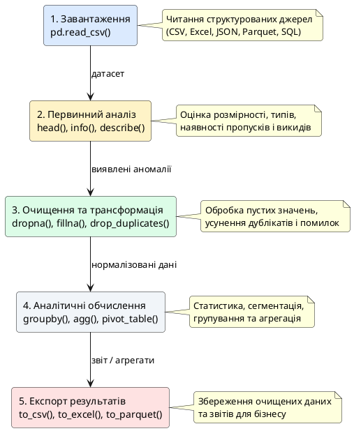
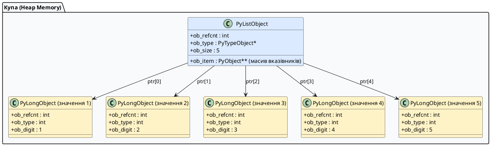
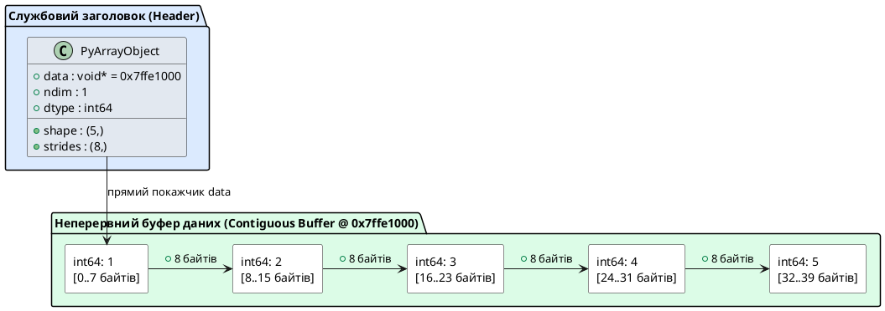
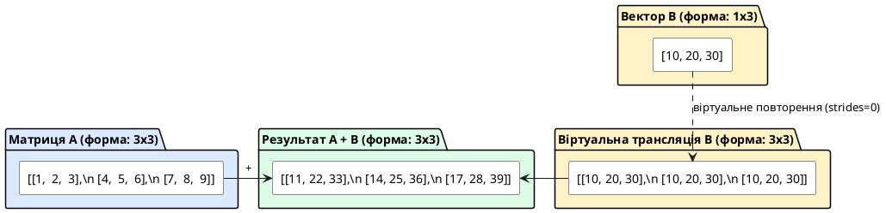
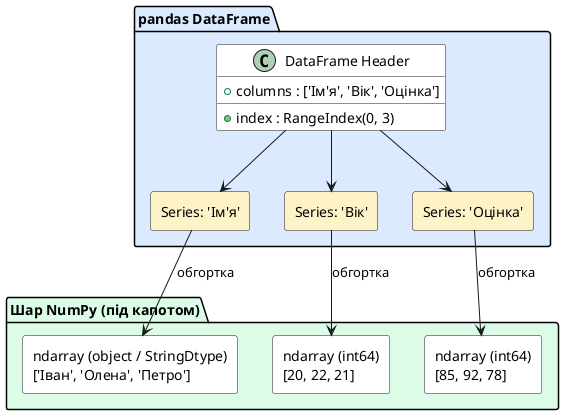

# Робота з даними з використанням NumPy і pandas

::card-group

::card{title="🎯 Мета лекції" icon="i-lucide-target"}

- Зрозуміти архітектурну різницю між вбудованими структурами Python та оптимізованими масивами NumPy.
- Опанувати концепції векторизації, трансляції розмірностей (_broadcasting_), кроків у пам'яті (_strides_) та розмежування копій і подань (_copy vs view_).
- Навчитися маніпулювати одновимірними (`Series`) та двовимірними (`DataFrame`) структурами pandas без використання явних циклів.
- Засвоїти канонічні методи читання, фільтрації, очищення, групування, реляційного об'єднання та експорту великих масивів даних.

::

::card{title="🔑 Ключові терміни" icon="i-lucide-key"}

- **ndarray:** багатовимірний однорідний числовий масив фіксованого розміру в суцільному буфері пам'яті.
- **Векторизація (_Vectorization_):** виконання математичних операцій над усім масивом на рівні скомпільованого C-коду без повільних інтерпретованих циклів.
- **Трансляція (_Broadcasting_):** автоматичне віртуальне узгодження розмірностей масивів різної форми для поелементних обчислень.
- **Кроки в пам'яті (_Strides_):** кількість байтів, на яку потрібно зміститися в пам'яті для переходу до наступного елемента по відповідній осі.
- **DataFrame / Series:** основні табличні структури pandas із мітками осей, автоматичним вирівнюванням та оптимізованими операціями.

::

::

## Завдання, яке розкриє правду про чистий Python

Уявіть: вам надіслали CSV-файл із 10 000 рядків — дані про продажі магазину за рік. Кожен рядок — одна транзакція: дата, категорія товару, ціна, кількість.

Ваш менеджер хоче знати:

1. Яка середня ціна товарів у категорії «Електроніка»?
2. Який товар продали найбільше разів?
3. Скільки продажів було у грудні?

Здається, нічого складного. Спробуємо зробити це «чистим Python» — тобто тільки вбудованими засобами мови без жодних бібліотек:

```python
import csv

# Читаємо CSV вручну
data = []
with open("sales.csv", encoding="utf-8") as f:
    reader = csv.DictReader(f)
    for row in reader:
        data.append(row)

# Завдання 1: середня ціна в категорії "Електроніка"
total = 0
count = 0
for row in data:
    if row["category"] == "Електроніка":
        total += float(row["price"])
        count += 1
average = total / count if count > 0 else 0
print(f"Середня ціна: {average:.2f}")

# Завдання 2: найпопулярніший товар
product_counts = {}
for row in data:
    name = row["product"]
    product_counts[name] = product_counts.get(name, 0) + int(row["quantity"])
best_product = max(product_counts, key=product_counts.get)
print(f"Лідер продажів: {best_product}")

# Завдання 3: продажі у грудні
december_sales = 0
for row in data:
    if row["date"].startswith("2024-12"):
        december_sales += 1
print(f"Продажів у грудні: {december_sales}")
```

Ось правда: цей код **працює**, але він:

- займає ~25 рядків для трьох простих запитань
- виконується повільно (цикл `for` по 10 000 рядків — три рази!)
- важко читати і підтримувати
- не масштабується — для 1 000 000 рядків буде ще гірше

А тепер подивіться на те саме з **pandas**:

::jupyter-notebook{title="sales_pandas.ipynb" kernel="Python 3 (ipykernel)"}

::jupyter-cell{type="markdown"}

### Аналіз продажів з pandas

Три завдання розв'язані в кілька рядків коду
::

::jupyter-cell{executionCount="1"}

```python
import pandas as pd
from io import StringIO

# Створимо тестові дані для демонстрації
csv_data = StringIO("""date,product,category,price,quantity
2024-11-15,Телефон Samsung Galaxy,Електроніка,12000,5
2024-12-01,Ноутбук Dell,Електроніка,28000,2
2024-12-05,Футболка Nike,Одяг,850,10
2024-11-20,iPhone 15,Електроніка,45000,3
2024-12-10,Навушники Sony,Електроніка,3500,8
2024-11-25,Джинси Levi's,Одяг,2200,4
2024-12-15,Телефон Samsung Galaxy,Електроніка,12000,7""")

df = pd.read_csv(csv_data, parse_dates=["date"])

# Завдання 1: середня ціна в "Електроніці"
average = df[df["category"] == "Електроніка"]["price"].mean()

# Завдання 2: найпопулярніший товар
best_product = df.groupby("product")["quantity"].sum().idxmax()

# Завдання 3: продажі у грудні за допомогою дат
december_sales = (df["date"].dt.month == 12).sum()

print(f"Середня ціна в Електроніці: {average:.2f} грн")
print(f"Лідер продажів: {best_product}")
print(f"Продажів у грудні: {december_sales}")
```

#output

```
Середня ціна в Електроніці: 20100.00 грн
Лідер продажів: Телефон Samsung Galaxy
Продажів у грудні: 4
```

::

::

**Три рядки замість 25. Швидше у 10–100 разів. Читається як англійська мова.**

> Аналогія: чистий Python для роботи з даними — це як рахувати тисячі транзакцій на звичайному калькуляторі. NumPy та pandas — це як Excel із формулами, але на стероїдах: не тільки швидше та потужніше, а й у тисячу разів зручніше для складних запитань.

У цій статті ми побудуємо розуміння обох бібліотек з нуля: спочатку NumPy — бо саме він є «двигуном» усіх обчислень, а потім pandas — інструмент для роботи з таблицями.

### Типовий процес роботи з даними

Перед тим як почати, подивимось на загальну схему роботи з даними — від завантаження до збереження результатів:

::plant-uml{alt="Типовий життєвий цикл обробки даних у Data Science"}



::

Ці п'ять кроків — стандартна послідовність інженерії даних. У цій статті ми опануємо кожен з них.

---

## Архітектура NumPy та векторизовані обчислення

### Чому стандартного списку Python недостатньо

Ви вже знаєте списки Python — це один із найбільш гнучких типів даних:

```python
numbers = [1, 2, 3, 4, 5]
mixed   = [1, "два", 3.0, True, None]  # Список може містити об'єкти будь-яких типів
```

Саме ця гнучкість і стає головною перешкодою для високої продуктивності. З'ясуємо, як список Python розташовується в пам'яті комп'ютера:

::plant-uml{alt="Розташування списку Python у динамічній пам'яті (Heap)"}



::

Кожен елемент списку — це **покажчик** (_pointer_) на окремий повноцінний об'єкт мови Python у купі (_heap_). Кожен числовий об'єкт містить службовий заголовок:

- тип даних (`ob_type`)
- лічильник посилань (`ob_refcnt` для збирача сміття)
- безпосереднє значення (`ob_digit`)

Один стандартний 64-бітний `int` у Python важить 28 байтів, тоді як «чисте» 64-бітне число потребує лише 8 байтів!

**Що відбувається при виконанні циклу `for` по списку?**

```python
total = 0
for x in numbers:
    # 1. Прочитати адресу вказівника зі списку
    # 2. Розпакувати покажчик і перейти за адресою в купі (випадковий стрибок пам'яті)
    # 3. Динамічно з'ясувати тип об'єкта (Type Dispatching)
    # 4. Прочитати значення об'єкта
    # 5. Створити НОВИЙ об'єкт int для результату суми
    # 6. Оновити лічильники посилань
    total += x
```

Для кожного окремого елемента інтерпретатор CPython виконує десятки інструкцій перевірки типів і розіменування покажчиків. При 10 000 елементів це вже помітно, а при 10 000 000 — призводить до багатосекундних зависань і промахів кешу процесора (_CPU Cache Misses_).

### NumPy ndarray: однорідний масив у пам'яті

**NumPy** (_Numerical Python_) — фундаментальна інженерна бібліотека для наукових та числових обчислень. Її центральна структура — `ndarray` (_N-dimensional array_, N-вимірний масив).

Погляньмо, як зберігається аналогічний числовий вектор у середовищі NumPy:

::plant-uml{alt="Розташування ndarray у неперервному буфері пам'яті"}



::

Усі елементи масиву строго **однорідні** (_homogeneous_, наприклад `int64` або `float32`) та розташовуються в пам'яті суцільним, нерозривним блоком (_contiguous memory buffer_). Немає жодних проміжних покажчиків і службових заголовків для кожного числа.

#### Кроки в пам'яті (Strides) та кеш-лінії процесора

Як NumPy знаходить потрібний елемент без перебору списку? Завдяки атрибуту **`strides`** (_кроки в пам'яті_).
Крок — це кількість байтів, на яку потрібно зміститися в неперервному буфері для переходу до наступного елемента вздовж обраної осі:

::math-formula
\text{MemoryAddress}(i) = \text{BaseAddress} + i \times \text{stride}
::

Для двовимірної матриці $M \times N$ типу `int64` (8 байтів на число):

- Перехід до наступного рядка вимагає зміщення на $N \times 8$ байтів (`strides[0]`).
- Перехід до наступного стовпця вимагає зміщення на $8$ байтів (`strides[1]`).

::note
Оскільки дані лежать у пам'яті поспіль, вони завантажуються в кеш процесора (L1/L2 Cache) цілими лініями по 64 байти. Процесор може застосовувати векторизовані інструкції **SIMD** (_Single Instruction Multiple Data_), обробляючи 4, 8 або 16 чисел за один такт!
::

> Аналогія: список Python — це шафа, де кожна річ запакована в окрему коробку з ярликом (що це, скільки важить, хто власник), і розкидана по різних кімнатах. Щоб зібрати речі, ви бігаєте від кімнати до кімнати. Масив NumPy — це єдиний стрічковий конвеєр, де абсолютно однакові деталі лежать впритул одна до одної. Щоб взяти соту деталь, ви просто робите $100 \times 8$ кроків уперед.

### Встановлення та перший запуск

::tabs
::tabs-item{label="pip"}

```bash
pip install numpy
```

::

::tabs-item{label="uv"}

```bash
uv pip install numpy
```

::

::tabs-item{label="poetry"}

```bash
poetry add numpy
```

::
::

```python
import numpy as np  # np — загальноприйнятий псевдонім
```

::note
Чому `import numpy as np`, а не просто `import numpy`? Суто зручність — `np.array(...)` коротше, ніж `numpy.array(...)`. Це загальноприйнятий стандарт — весь світ пише `np`.
::

### Створення масивів

::jupyter-notebook{title="numpy_basics.ipynb" kernel="Python 3 (ipykernel)"}

::jupyter-cell{type="markdown"}

### Створення NumPy масивів різними способами

Розберемо 5 основних способів створення масивів
::

::jupyter-cell{executionCount="1"}

```python
import numpy as np

# 1. З Python-списку
arr1 = np.array([1, 2, 3, 4, 5])
print("З списку:", arr1)
print("Тип:", type(arr1))
```

#output

```
З списку: [1 2 3 4 5]
Тип: <class 'numpy.ndarray'>
```

::

::jupyter-cell{executionCount="2"}

```python
# 2. Масив нулів
zeros = np.zeros(5)
print("Нулів:", zeros)

# 3. Масив одиниць
ones = np.ones(5)
print("Одиниць:", ones)
```

#output

```
Нулів: [0. 0. 0. 0. 0.]
Одиниць: [1. 1. 1. 1. 1.]
```

::

::jupyter-cell{executionCount="3"}

```python
# 4. Послідовність (аналог range)
seq = np.arange(0, 10, 2)
print("Послідовність:", seq)

# 5. Рівномірно розподілені
lin = np.linspace(0, 1, 5)
print("Лінійні:", lin)
```

#output

```
Послідовність: [0 2 4 6 8]
Лінійні: [0.   0.25 0.5  0.75 1.  ]
```

::

::

### Атрибути масиву

Кожен `ndarray` зберігає повні метадані про свою структуру:

::jupyter-notebook{title="array_attributes.ipynb" kernel="Python 3 (ipykernel)"}

::jupyter-cell{type="markdown"}

### Атрибути NumPy масиву

Кожен масив зберігає метадані про свою структуру, тип і кроки в пам'яті
::

::jupyter-cell{executionCount="1"}

```python
import numpy as np

arr = np.array([[1, 2, 3],
                [4, 5, 6]], dtype=np.int64)

print(f"shape (форма):       {arr.shape}")
print(f"ndim (вимірність):   {arr.ndim}")
print(f"size (елементів):    {arr.size}")
print(f"dtype (тип даних):   {arr.dtype}")
print(f"itemsize (байт/ел):  {arr.itemsize}")
print(f"strides (кроки Б):   {arr.strides}")
```

#output

```
shape (форма):       (2, 3)
ndim (вимірність):   2
size (елементів):    6
dtype (тип даних):   int64
itemsize (байт/ел):  8
strides (кроки Б):   (24, 8)
```

::

::

::note
Зверніть увагу на кортеж `strides = (24, 8)`:

- Щоб перейти до наступного рядка тієї ж колонки, NumPy перестрибує на 24 байти вперед ($3 \text{ елементи} \times 8 \text{ байтів}$).
- Щоб перейти до наступного стовпця того ж рядка, зміщення становить рівно 8 байтів ($1 \text{ елемент} \times 8 \text{ байтів}$).
  Саме завдяки `strides` операції зрізів і транспонування виконуються миттєво!

::

### Векторизовані операції та лінійна алгебра

Ось де проявляється головна перевага NumPy: замість повільних інтерпретованих циклів — прямі математичні операції на рівні C-бібліотек BLAS/LAPACK.

::jupyter-notebook{title="vectorized_operations.ipynb" kernel="Python 3 (ipykernel)"}

::jupyter-cell{type="markdown"}

### Векторизовані та матричні операції

Поелементна арифметика та матричне множення
::

::jupyter-cell{executionCount="1"}

```python
import numpy as np

arr = np.array([1, 2, 3, 4, 5])

# Операції зі скалярами — застосовуються до КОЖНОГО елемента
print("arr + 10:", arr + 10)
print("arr * 2: ", arr * 2)
print("arr ** 2:", arr ** 2)
print("arr > 3: ", arr > 3)
```

#output

```
arr + 10: [11 12 13 14 15]
arr * 2:  [ 2  4  6  8 10]
arr ** 2: [ 1  4  9 16 25]
arr > 3:  [False False False  True  True]
```

::

::jupyter-cell{executionCount="2"}

```python
# Поелементні операції (добуток Адамара)
a = np.array([1, 2, 3])
b = np.array([10, 20, 30])
print("a + b (поелементно):", a + b)
print("a * b (поелементно):", a * b)

# Матричне множення (Dot Product / Matrix Multiplication)
A = np.array([[1, 2],
              [3, 4]])
B = np.array([[5, 6],
              [7, 8]])

# Оператор @ або np.matmul (рядки на стовпці)
print("\nМатричне множення A @ B:\n", A @ B)
```

#output

```
a + b (поелементно): [11 22 33]
a * b (поелементно): [10 40 90]

Матричне множення A @ B:
 [[19 22]
 [43 50]]
```

::

::

::warning{title="Різниця між _ та @" icon="i-lucide-alert-triangle"}
У мові Python для NumPy масивів оператор `_` завжди виконує **поелементне множення** (*Hadamard product*). Якщо вам потрібне класичне алгебраїчне **множення матриць** (скалярний добуток рядка на стовпець), завжди використовуйте оператор **`@`** або функцію `np.matmul(A, B)`.
::

Порівняємо швидкість — наочний тест продуктивності:

::jupyter-notebook{title="numpy_speed_test.ipynb" kernel="Python 3 (ipykernel)"}

::jupyter-cell{type="markdown"}

### Тест швидкості: Python list vs NumPy array

Помножимо 1 мільйон чисел на 2 двома способами
::

::jupyter-cell{executionCount="1" executionTime="0.13s"}

```python
import time
import numpy as np

# Зі списком Python
python_list = list(range(1_000_000))
start = time.time()
python_result = [x * 2 for x in python_list]
python_time = time.time() - start

print(f"Python list: {python_time:.3f}с")
```

#output

```
Python list: 0.124с
```

::

::jupyter-cell{executionCount="2" executionTime="0.002s"}

```python
# З NumPy масивом
numpy_arr = np.arange(1_000_000)
start = time.time()
numpy_result = numpy_arr * 2
numpy_time = time.time() - start

print(f"NumPy array: {numpy_time:.3f}с")
```

#output

```
NumPy array: 0.002с
```

::

::jupyter-cell{executionCount="3" outputType="stdout"}

```python
# Висновок
print(f"🚀 NumPy швидше у {python_time/numpy_time:.0f} разів!")
```

#output

```
🚀 NumPy швидше у 62 разів!
```

::

::

### Індексація, зрізи та пастка Copy vs View

Індексація в NumPy нагадує списки Python, проте має принципову архітектурну відмінність.

::jupyter-notebook{title="indexing_slicing.ipynb" kernel="Python 3 (ipykernel)"}

::jupyter-cell{type="markdown"}

### Індексація та зрізи масивів

Робота з 1D та 2D масивами
::

::jupyter-cell{executionCount="1"}

```python
import numpy as np

arr = np.array([10, 20, 30, 40, 50])

print("Перший елемент:", arr[0])
print("Останній:", arr[-1])
print("Зріз [1:4]:", arr[1:4])
print("Кожен другий:", arr[::2])
```

#output

```
Перший елемент: 10
Останній: 50
Зріз [1:4]: [20 30 40]
Кожен другий: [10 30 50]
```

::

::jupyter-cell{executionCount="2"}

```python
# 2D масив (матриця)
matrix = np.array([[1, 2, 3],
                   [4, 5, 6],
                   [7, 8, 9]])

print("Елемент [1, 2]:", matrix[1, 2])
print("Весь стовпець 1:", matrix[:, 1])
print("Весь рядок 0:", matrix[0, :])
print("Підматриця [1:, 1:]:\n", matrix[1:, 1:])
```

#output

```
Елемент [1, 2]: 6
Весь стовпець 1: [2 5 8]
Весь рядок 0: [1 2 3]
Підматриця [1:, 1:]:
 [[5 6]
 [8 9]]
```

::

::

#### Подання проти копії (Copy vs View)

У стандартному Python зріз списку `sub = my_list[1:4]` завжди створює **новий незалежний список** (копію).
У NumPy для оптимізації швидкодії базовий зріз створює **подання (_view_)** — новий заголовок `ndarray`, який вказує на **той самий буфер пам'яті**!

::jupyter-notebook{title="view_vs_copy_numpy.ipynb" kernel="Python 3 (ipykernel)"}

::jupyter-cell{type="markdown"}

### Демонстрація View vs Copy у NumPy

Зміна зрізу мутує базовий масив
::

::jupyter-cell{executionCount="1"}

```python
import numpy as np

original = np.array([10, 20, 30, 40, 50])

# Зріз створює VIEW
view_slice = original[1:4]
print("До зміни view_slice:", view_slice)

# Змінюємо перший елемент зрізу
view_slice[0] = 999

# Оригінальний масив теж змінився!
print("Після зміни original:", original)
print("view_slice ділить пам'ять з original?", np.shares_memory(original, view_slice))
print("view_slice.base is original?", view_slice.base is original)
```

#output

```
До зміни view_slice: [20 30 40]
Після зміни original: [ 10 999  30  40  50]
view_slice ділить пам'ять з original? True
view_slice.base is original? True
```

::

::jupyter-cell{executionCount="2"}

```python
# Щоб захистити оригінальні дані — створюйте явну копію .copy()
safe_copy = original[1:4].copy()
safe_copy[0] = 777

print("Після зміни safe_copy original не змінився:", original)
print("safe_copy ділить пам'ять з original?", np.shares_memory(original, safe_copy))
```

#output

```
Після зміни safe_copy original не змінився: [ 10 999  30  40  50]
safe_copy ділить пам'ять з original? False
```

::

::

### Булева індексація та пріоритет операторів

Булева індексація дозволяє фільтрувати масиви без жодного циклу:

::jupyter-notebook{title="boolean_indexing.ipynb" kernel="Python 3 (ipykernel)"}

::jupyter-cell{type="markdown"}

### Фільтрація даних за допомогою булевих масок

Булева індексація ЗАВЖДИ створює копію даних
::

::jupyter-cell{executionCount="1"}

```python
import numpy as np

scores = np.array([85, 42, 91, 67, 78, 55, 96, 33])

# Створюємо булеву маску
mask = scores > 70
print("Маска:", mask)

# Застосовуємо маску для фільтрації
good_scores = scores[scores > 70]
print("Хороші оцінки:", good_scores)
```

#output

```
Маска: [ True False  True False  True False  True False]
Хороші оцінки: [85 91 78 96]
```

::

::jupyter-cell{executionCount="2"}

```python
# Декілька умов: ОБОВ'ЯЗКОВО в круглих дужках з операторами &, |
middle_scores = scores[(scores >= 50) & (scores <= 85)]
print("Оцінки від 50 до 85:", middle_scores)

# Статистика відфільтрованих даних
print(f"Хороших оцінок: {len(good_scores)}")
print(f"Середня серед хороших: {good_scores.mean():.1f}")
```

#output

```
Оцінки від 50 до 85: [85 67 78 55]
Хороших оцінок: 4
Середня серед хороших: 87.5
```

::

::

::caution{title="Чому & та | замість and / or, і чому потрібні дужки?" icon="i-lucide-shield-alert"}
У Python звичайні логічні оператори `and` та `or` вимагають привести **весь масив** до одного булевого значення (`True` чи `False`). Оскільки у масиві є різні значення, виникає фатальна помилка:

```text
ValueError: The truth value of an array with more than one element is ambiguous. Use a.any() or a.all()
```

Тому використовуються побітові оператори: **`&`** (І), **`|`** (АБО), **`~`** (НІ).
Оскільки побітовий оператор `&` має **вищий пріоритет**, ніж оператори порівняння `>`, `<`, вираз `scores >= 50 & scores <= 85` інтерпретується як `scores >= (50 & scores) <= 85`, що призводить до помилки. **Кожна умова обов'язково повинна бути взята в круглі дужки!**
::

### Трансляція розмірностей (Broadcasting)

**Broadcasting** (трансляція розмірностей) — це алгоритм NumPy для виконання арифметичних операцій між масивами різної форми без фізичного копіювання даних.

::plant-uml{alt="Візуалізація Broadcasting: розтягнення 1D вектора по рядках 2D матриці"}



::

#### Два фундаментальні правила Broadcasting:

1. Масиви зіставляються за вимірами **справа наліво** (від останньої осі до першої).
2. Дві розмірності вважаються сумісними, якщо:
    - вони рівні між собою, **АБО**
    - одна з них дорівнює **1** (у цьому випадку вона віртуально «розтягується» вздовж цієї осі зі `stride = 0`).

::jupyter-notebook{title="broadcasting_demo.ipynb" kernel="Python 3 (ipykernel)"}

::jupyter-cell{type="markdown"}

### Трансляція розмірностей на практиці: Центрування даних

Віднімаємо вектор середніх значень від матриці ознак
::

::jupyter-cell{executionCount="1"}

```python
import numpy as np

# Матриця ознак 4 зразки x 3 характеристики
X = np.array([[10.0, 200.0, 1.5],
              [12.0, 210.0, 1.8],
              [14.0, 190.0, 1.4],
              [16.0, 240.0, 2.1]])

# Обчислюємо середнє для кожного стовпця (форма: (3,))
mean_vector = X.mean(axis=0)
print("Форма X:           ", X.shape)
print("Форма mean_vector: ", mean_vector.shape)
print("Середні стовпців:  ", mean_vector)

# Віднімання завдяки Broadcasting: (4, 3) - (3,) -> (4, 3)
X_centered = X - mean_vector
print("\nЦентровані ознаки:\n", X_centered.round(2))
```

#output

```
Форма X:            (4, 3)
Форма mean_vector:  (3,)
Середні стовпців:   [ 13.   210.      1.7]

Центровані ознаки:
 [[ -3.  -10.   -0.2]
 [ -1.    0.    0.1]
 [  1.  -20.   -0.3]
 [  3.   30.    0.4]]
```

::

::

::tip
Що станеться, якщо розмірності несумісні? Наприклад, спроба додати вектор довжиною 4 до матриці $4 \times 3$ вздовж рядків:
NumPy викине виняток:

```text
ValueError: operands could not be broadcast together with shapes (4,3) (4,)
```

Щоб виправити це, змініть форму вектора на $(4, 1)$ за допомогою `vec.reshape(4, 1)` або `vec[:, np.newaxis]`.
::

### Агрегатні функції

::jupyter-notebook{title="aggregate_functions.ipynb" kernel="Python 3 (ipykernel)"}

::jupyter-cell{type="markdown"}

### Агрегатні функції для статистики

Обчислення суми, середнього, мінімуму та максимуму
::

::jupyter-cell{executionCount="1"}

```python
import numpy as np

data = np.array([23, 45, 12, 67, 89, 34, 56, 78, 90, 11])

print(f"Сума:             {data.sum()}")
print(f"Середнє:          {data.mean():.1f}")
print(f"Мінімум:          {data.min()}")
print(f"Максимум:         {data.max()}")
print(f"Стд. відхилення:  {data.std():.1f}")
print(f"Індекс мінімуму:  {data.argmin()}")
print(f"Індекс максимуму: {data.argmax()}")
```

#output

```
Сума:             505
Середнє:          50.5
Мінімум:          11
Максимум:         90
Стд. відхилення:  27.7
Індекс мінімуму:  9
Індекс максимуму: 8
```

::

::

Для 2D масивів можна вказати вісь (`axis`):

::jupyter-notebook{title="axis_aggregation.ipynb" kernel="Python 3 (ipykernel)"}

::jupyter-cell{type="markdown"}

### Агрегація по осях (axis)

Обчислення для рядків або стовпців окремо
::

::jupyter-cell{executionCount="1"}

```python
import numpy as np

matrix = np.array([[1, 2, 3],
                   [4, 5, 6]])

print("Сума всіх елементів:", matrix.sum())
print("Сума по стовпцях (axis=0):", matrix.sum(axis=0))
print("Сума по рядках (axis=1):", matrix.sum(axis=1))
```

#output

```
Сума всіх елементів: 21
Сума по стовпцях (axis=0): [5 7 9]
Сума по рядках (axis=1): [ 6 15]
```

::

::

### Зміна форми: reshape

::jupyter-notebook{title="reshape_arrays.ipynb" kernel="Python 3 (ipykernel)"}

::jupyter-cell{type="markdown"}

### Зміна форми масиву (reshape)

Перетворення 1D масиву в 2D та назад без копіювання буфера
::

::jupyter-cell{executionCount="1"}

```python
import numpy as np

arr = np.arange(12)
print("Одновимірний:", arr)

# reshape створює нове view з іншими strides, якщо пам'ять неперервна
matrix = arr.reshape(3, 4)
print("\nМатриця 3×4:\n", matrix)

flat = matrix.flatten()
print("\nЗнову 1D (копія):", flat)
```

#output

```
Одновимірний: [ 0  1  2  3  4  5  6  7  8  9 10 11]

Матриця 3×4:
 [[ 0  1  2  3]
 [ 4  5  6  7]
 [ 8  9 10 11]]

Знову 1D (копія): [ 0  1  2  3  4  5  6  7  8  9 10 11]
```

::

::

::note
`reshape` — фундаментальна операція в ML. Зображення $28 \times 28$ пікселів потрібно перетворити у вектор із 784 елементів для подачі в нейронну мережу? `image.reshape(784)`. Або навпаки — вектор у 2D зображення? `flat.reshape(28, 28)`.
::

### Генерація випадкових чисел: сучасний default_rng

У машинному навчанні випадкові числа потрібні для ініціалізації ваг моделей, розбиття вибірок та стохастичних симуляцій.
У сучасному NumPy (NumPy 1.17+) стандартний спосіб генерації — це **`np.random.default_rng()`**, який використовує сучасний високошвидкісний алгоритм PCG-64 замість застарілого вихору Мерсенна.

::jupyter-notebook{title="random_numbers_modern.ipynb" kernel="Python 3 (ipykernel)"}

::jupyter-cell{type="markdown"}

### Сучасна генерація випадкових чисел через Generator

Використання np.random.default_rng для відтворюваних експериментів
::

::jupyter-cell{executionCount="1"}

```python
import numpy as np

# Створюємо генератор із фіксованим seed
rng = np.random.default_rng(seed=42)

# Рівномірний розподіл [0.0, 1.0)
random_floats = rng.random(5)
print("Випадкові [0, 1):", random_floats.round(3))

# Випадкові цілі числа від 1 до 100
random_ints = rng.integers(1, 100, size=5)
print("Випадкові цілі:", random_ints)

# Стандартний нормальний розподіл (μ=0, σ=1)
normal_dist = rng.standard_normal(5)
print("Нормальний розподіл:", normal_dist.round(3))
```

#output

```
Випадкові [0, 1): [0.774 0.439 0.859 0.697 0.094]
Випадкові цілі: [43 27 68 83 45]
Нормальний розподіл: [-0.095  0.495 -0.669  1.026 -0.198]
```

::

::jupyter-cell{executionCount="2"}

```python
# Вибірка з повторенням і без
items = np.array(["CPU", "GPU", "RAM", "SSD"])
choice_sample = rng.choice(items, size=3, replace=False)
print("Вибір без повернення:", choice_sample)
```

#output

```
Вибір без повернення: ['GPU' 'SSD' 'CPU']
```

::

::

::note
У старішому коді ви часто побачите `np.random.seed(42)` та `np.random.randn()`. Це застаріле глобальне API, яке не є потокобезпечним і зафіксоване розробниками лише для зворотної сумісності. У нових проєктах завжди віддавайте перевагу `default_rng()`.
::

### Порівняльна таблиця: список Python vs NumPy

| Характеристика      | Список Python (`list`)         | Масив NumPy (`ndarray`)        |
| :------------------ | :----------------------------- | :----------------------------- |
| Тип елементів       | Будь-які (гетерогенні)         | Однорідні (_homogeneous_)      |
| Пам'ять             | Вказівники + обгортки об'єктів | Суцільний буфер пам'яті        |
| Швидкість операцій  | Повільно (цикли CPython)       | У 10–100× швидше (SIMD, C/C++) |
| Арифметика          | Конкатенація (`+`)             | Векторизована поелементна      |
| Багатовимірність    | Вкладені списки (громіздко)    | Вбудовані осі $N$-D (`shape`)  |
| Булева фільтрація   | Лише через list comprehension  | Булеві маски без циклів        |
| Математичні функції | Окремий модуль `math` у циклі  | Вбудовані у векторному вигляді |

---

## Табличні структури даних бібліотеки pandas

### Що таке pandas і чому він скрізь

**pandas** — це промисловий стандарт бібліотеки для обробки, агрегації та структурування табличних даних. Назва походить від терміну «панельні дані» (_Panel Data_) з економетрики.

pandas побудований **безпосередньо поверх NumPy**: кожен стовпець таблиці — це оптимізований одновимірний масив `ndarray`. Завдяки цьому pandas поєднує надзвичайну гнучкість табличного представлення (іменовані рядки, назви колонок, інтелектуальне вирівнювання за індексами) зі швидкістю низькорівневих C-масивів.

::plant-uml{alt="Архітектура pandas поверх NumPy ndarray"}



::

> Аналогія: якщо NumPy — це надпотужний двигун внутрішнього згоряння спортивного авто, то pandas — це ергономічна панель приладів, кермо, автоматична коробка передач і клімат-контроль. Ви отримуєте швидкість формульного двигуна у форматі комфортного автомобіля.

::tabs
::tabs-item{label="pip"}

```bash
pip install pandas
```

::

::tabs-item{label="uv"}

```bash
uv pip install pandas
```

::

::tabs-item{label="poetry"}

```bash
poetry add pandas
```

::
::

```python
import pandas as pd  # pd — загальноприйнятий псевдонім
```

---

### Series: одновимірна структура даних

**Series** — це одновимірна структура даних pandas. Уявіть її як **один стовпець Excel-таблиці**: зліва — мітка рядка (індекс), справа — значення.

::jupyter-notebook{title="series_basics.ipynb" kernel="Python 3 (ipykernel)"}

::jupyter-cell{type="markdown"}

### Створення Series

Найпростіший спосіб — зі списку Python
::

::jupyter-cell{executionCount="1"}

```python
import pandas as pd

# Найпростіший Series: зі списку Python
temperatures = pd.Series([22, 25, 19, 27, 23])
temperatures
```

#output

```
0    22
1    25
2    19
3    27
4    23
dtype: int64
```

::

::

За замовчуванням індекс — це числа 0, 1, 2... Але можна задати власний:

::jupyter-notebook{title="student_grades.ipynb" kernel="Python 3 (ipykernel)"}

::jupyter-cell{type="markdown"}

### Series з власним індексом

Використаємо імена студентів як індекс
::

::jupyter-cell{executionCount="1"}

```python
import pandas as pd

# Series з іменованим індексом
grades = pd.Series(
    [85, 92, 78, 96, 71],
    index=["Іван", "Олена", "Петро", "Марія", "Андрій"]
)

grades
```

#output

```
Іван      85
Олена     92
Петро     78
Марія     96
Андрій    71
dtype: int64
```

::

::

> Аналогія: Series — це як стовпець «Оцінки» у класному журналі. Зліва — прізвища учнів (індекс), справа — їхні бали (значення). Кожен рядок — пара «ім'я: оцінка».

**Доступ до елементів Series:**

::jupyter-notebook{title="series_access.ipynb" kernel="Python 3 (ipykernel)"}

::jupyter-cell{type="markdown"}

### Доступ до елементів Series

За іменем індексу або за позицією
::

::jupyter-cell{executionCount="1"}

```python
import pandas as pd

grades = pd.Series(
    [85, 92, 78, 96, 71],
    index=["Іван", "Олена", "Петро", "Марія", "Андрій"]
)

print("Оцінка Олени:", grades["Олена"])
print("За позицією 1:", grades.iloc[1])
print("Перші три:\n", grades.iloc[0:3])
```

#output

```
Оцінка Олени: 92
За позицією 1: 92
Перші три:
 Іван     85
Олена    92
Петро    78
dtype: int64
```

::

::

**Векторизовані операції над Series:**

::jupyter-notebook{title="series_operations.ipynb" kernel="Python 3 (ipykernel)"}

::jupyter-cell{type="markdown"}

### Векторизовані операції над Series

Операції застосовуються до всіх елементів відразу
::

::jupyter-cell{executionCount="1"}

```python
import pandas as pd

grades = pd.Series(
    [85, 92, 78, 96, 71],
    index=["Іван", "Олена", "Петро", "Марія", "Андрій"]
)

# Додати 5 балів всім
print("Додати 5 балів всім:")
print(grades + 5)
```

#output

```
Додати 5 балів всім:
Іван      90
Олена     97
Петро     83
Марія    101
Андрій    76
dtype: int64
```

::

::jupyter-cell{executionCount="2"}

```python
# Відбір за умовою
print("Хто має оцінку > 80:")
excellent = grades[grades > 80]
print(excellent)
```

#output

```
Хто має оцінку > 80:
Іван     85
Олена    92
Марія    96
dtype: int64
```

::

::jupyter-cell{executionCount="3" outputType="stdout"}

```python
# Агрегатні функції
print(f"Середня оцінка: {grades.mean():.1f}")
print(f"Найвища: {grades.max()}")
print(f"Найнижча: {grades.min()}")
```

#output
Середня оцінка: 84.4
Найвища: 96
Найнижча: 71
::

::

**Series зі словника Python:**

::jupyter-notebook{title="series_from_dict.ipynb" kernel="Python 3 (ipykernel)"}

::jupyter-cell{type="markdown"}

### Series зі словника

Словник автоматично перетворюється на Series, де ключі стають індексом
::

::jupyter-cell{executionCount="1"}

```python
import pandas as pd

# Словник автоматично перетворюється на Series
city_populations = pd.Series({
    "Київ":    2952301,
    "Харків":  1421125,
    "Одеса":   1015826,
    "Дніпро":   980775
})

city_populations.sort_values(ascending=False)
```

#output

```
Київ      2952301
Харків    1421125
Одеса     1015826
Дніпро     980775
dtype: int64
```

::

::

---

### DataFrame: двовимірна таблиця даних

**DataFrame** — це двовимірна структура даних pandas, аналог Excel-таблиці або SQL-таблиці бази даних. Складається зі **стовпців** (кожен стовпець — це Series) та **рядків** (кожен рядок — одне спостереження).

> Аналогія: якщо Series — це один стовпець класного журналу (скажімо, оцінки з математики), то DataFrame — це **весь журнал** з усіма предметами. У кожному рядку — один учень, у кожному стовпці — один предмет.

### Створення DataFrame зі словника

::jupyter-notebook{title="create_students_df.ipynb" kernel="Python 3 (ipykernel)"}

::jupyter-cell{type="markdown"}

### Створення DataFrame із даними про студентів

Побудуємо таблицю з іменами, віком та оцінками з трьох предметів
::

::jupyter-cell{executionCount="1"}

```python
import pandas as pd

data = {
    "Ім'я":        ["Іван",  "Олена", "Петро", "Марія"],
    "Вік":         [20,      22,      21,      23],
    "Математика":  [85,      92,      78,      96],
    "Фізика":      [78,      88,      82,      91],
    "Python":      [91,      95,      73,      89]
}

df = pd.DataFrame(data)
df
```

#output
| | Ім'я | Вік | Математика | Фізика | Python |
|---|-------|-----|------------|--------|--------|
| 0 | Іван | 20 | 85 | 78 | 91 |
| 1 | Олена | 22 | 92 | 88 | 95 |
| 2 | Петро | 21 | 78 | 82 | 73 |
| 3 | Марія | 23 | 96 | 91 | 89 |
::

::jupyter-cell{executionCount="2" outputType="stdout"}

```python
# Перевіримо структуру
print(f"Розмір: {df.shape} (рядків × стовпців)")
print(f"Стовпці: {list(df.columns)}")
print(f"Типи даних:\n{df.dtypes}")
```

#output
Розмір: (4, 5) (рядків × стовпців)
Стовпці: ['Ім'я', 'Вік', 'Математика', 'Фізика', 'Python']
Типи даних:
Ім'я object
Вік int64
Математика int64
Фізика int64
Python int64
dtype: object
::

::

**Структура DataFrame:**

- **Рядки** (rows): кожен рядок — один студент (спостереження)
- **Стовпці** (columns): кожен стовпець — одна характеристика (ознака)
- **Індекс** (index): автоматичний (0, 1, 2...) або кастомний — мітки рядків

### Доступ до даних у DataFrame

Це одна з найважливіших тем — є кілька різних способів, і кожен для свого випадку:

**1. Доступ до стовпця — як до ключа словника:**

::jupyter-notebook{title="dataframe_column_access.ipynb" kernel="Python 3 (ipykernel)"}

::jupyter-cell{type="markdown"}

### Доступ до стовпця DataFrame

Отримання одного стовпця як Series
::

::jupyter-cell{executionCount="1"}

```python
import pandas as pd

data = {
    "Ім'я": ["Іван", "Олена", "Петро", "Марія"],
    "Вік": [20, 22, 21, 23],
    "Математика": [85, 92, 78, 96]
}
df = pd.DataFrame(data)

# Один стовпець → Series
ages = df["Вік"]
print("Тип:", type(ages))
print(ages)
```

#output

```
Тип: <class 'pandas.core.series.Series'>
0    20
1    22
2    21
3    23
Name: Вік, dtype: int64
```

::

::

**2. Доступ до рядків через `.iloc` — за числовою позицією:**

::jupyter-notebook{title="iloc_access.ipynb" kernel="Python 3 (ipykernel)"}

::jupyter-cell{type="markdown"}

### Доступ до рядків через iloc

Доступ за числовою позицією (integer location)
::

::jupyter-cell{executionCount="1"}

```python
import pandas as pd

data = {
    "Ім'я": ["Іван", "Олена", "Петро", "Марія"],
    "Вік": [20, 22, 21, 23],
    "Математика": [85, 92, 78, 96]
}
df = pd.DataFrame(data)

# iloc = integer location (позиція, як у списку)
first_row = df.iloc[0]
print("Перший рядок:\n", first_row)

print("\nКонкретна комірка [1, 2]:", df.iloc[1, 2])
```

#output

```
Перший рядок:
 Ім'я          Іван
Вік             20
Математика      85
Name: 0, dtype: object

Конкретна комірка [1, 2]: 92
```

::

::

**3. Доступ до рядків та стовпців через `.loc` — за мітками індексу:**

```python
# loc = label-based location (за міткою)
# Якщо індекс числовий від 0 до N:
row = df.loc[0]    # Рядок з міткою 0 (Іван)

# Якщо задати кастомний індекс:
df_named = df.set_index("Ім'я")    # Тепер індекс — імена студентів
olena_data = df_named.loc["Олена"] # Доступ за міткою
```

::caution{title="Критична пастка: різниця зрізів у loc та iloc" icon="i-lucide-alert-triangle"}
Зверніть особливу увагу на поведінку діапазонів (зрізів):

- **`df.iloc[0:2]`** працює за класичними правилами Python: **права межа виключається** (повертає лише 2 рядки: з індексами 0 та 1).
- **`df.loc[0:2]`** (якщо індекс числовий) або `df.loc['Іван':'Петро']`: **ОБИДВІ МЕЖІ ВКЛЮЧАЮТЬСЯ** (повертає 3 рядки: 0, 1 та 2)!
  Це фундаментальне джерело прихованих багів у початківців.

::

::jupyter-notebook{title="loc_vs_iloc_slices.ipynb" kernel="Python 3 (ipykernel)"}

::jupyter-cell{type="markdown"}

### Порівняння зрізів iloc та loc

Вибір рядків і стовпців одночасно (2D slicing)
::

::jupyter-cell{executionCount="1"}

```python
import pandas as pd

data = {
    "Ім'я": ["Іван", "Олена", "Петро", "Марія"],
    "Вік": [20, 22, 21, 23],
    "Математика": [85, 92, 78, 96],
    "Python": [82, 95, 88, 91]
}
df = pd.DataFrame(data)

# 1. iloc: перші 2 рядки (0, 1) та перші 3 стовпці (0, 1, 2)
print("--- df.iloc[0:2, 0:3] (права межа виключається) ---")
print(df.iloc[0:2, 0:3])

# 2. loc: рядки від 0 до 2 (0, 1, 2!) та вибрані назви стовпців
print("\n--- df.loc[0:2, ['Ім\\'я', 'Python']] (обидві межі включаються) ---")
print(df.loc[0:2, ["Ім'я", "Python"]])
```

#output

```
--- df.iloc[0:2, 0:3] (права межа виключається) ---
    Ім'я  Вік  Математика
0   Іван   20          85
1  Олена   22          92

--- df.loc[0:2, ['Ім\'я', 'Python']] (обидві межі включаються) ---
    Ім'я  Python
0   Іван      82
1  Олена      95
2  Петро      88
```

::

::

**4. Фільтрація рядків за умовою (Boolean Indexing):**

::jupyter-notebook{title="dataframe_filtering.ipynb" kernel="Python 3 (ipykernel)"}

::jupyter-cell{type="markdown"}

### Фільтрація рядків DataFrame

Відбір даних за умовою з використанням бітових операторів
::

::jupyter-cell{executionCount="1"}

```python
import pandas as pd

data = {
    "Ім'я": ["Іван", "Олена", "Петро", "Марія"],
    "Вік": [20, 22, 21, 23],
    "Математика": [85, 92, 78, 96],
    "Python": [82, 95, 88, 91]
}
df = pd.DataFrame(data)

# Студенти, яким більше 21 року
older = df[df["Вік"] > 21]
print("Старші за 21:\n", older[["Ім'я", "Вік"]])
```

#output

```
Старші за 21:
    Ім'я  Вік
1  Олена   22
3  Марія   23
```

::

::jupyter-cell{executionCount="2"}

```python
# Кілька умов: обов'язково (& = AND, | = OR) у круглих дужках
top_students = df[(df["Математика"] > 85) & (df["Python"] > 85)]
print("Топ-студенти:\n", top_students[["Ім'я", "Математика", "Python"]])
```

#output

```
Топ-студенти:
    Ім'я  Математика  Python
1  Олена          92      95
3  Марія          96      91
```

::

::

::warning{title="Пастка: ланцюгова індексація та SettingWithCopyWarning" icon="i-lucide-alert-triangle"}
Коли ви змінюєте дані у відфільтрованій вибірці через ланцюговий синтаксис:

```python
# ❌ НЕБЕЗПЕЧНО: Chained Indexing
df[df["price"] > 10000]["discount"] = 0.2
```

pandas не знає, чи операція `df[...]` повернула копію, чи посилання на пам'ять (_view_). Це призводить до сумнозвісного попередження **`SettingWithCopyWarning`**, і значення у вихідній таблиці може так і не оновитися!

**Канонічне інженерне рішення — пряме присвоєння через `.loc`:**

```python
# ✅ ПРАВИЛЬНО: чітка адресація [рядки, стовпець]
df.loc[df["price"] > 10000, "discount"] = 0.2
```

Якщо ж вам потрібен незалежний піддатасет для окремого аналізу, створіть явну копію:

```python
df_expensive = df[df["price"] > 10000].copy()
df_expensive["discount"] = 0.2  # Повністю безпечно
```

У сучасному pandas 2.0+ реалізовано механізм **Copy-on-Write (CoW)**: пам'ять копіюється лише в момент безпосереднього запису нового значення, що назавжди усуває проблему випадкових мутацій і робить поведінку бібліотеки детермінованою.
::

**5. Додавання нових стовпців:**

::jupyter-notebook{title="add_average_column.ipynb" kernel="Python 3 (ipykernel)"}

::jupyter-cell{type="markdown"}

### Додавання обчисленого стовпця

Створимо стовпець "Середня" з середніх оцінок
::

::jupyter-cell{executionCount="1"}

```python
import pandas as pd

data = {
    "Ім'я": ["Іван", "Олена", "Петро", "Марія"],
    "Математика": [85, 92, 78, 96],
    "Фізика": [80, 88, 75, 90],
    "Python": [89, 95, 80, 90]
}
df = pd.DataFrame(data)

# Обчислити середню оцінку кожного студента
df["Середня"] = df[["Математика", "Фізика", "Python"]].mean(axis=1)

df[["Ім'я", "Середня"]]
```

#output

```
     Ім'я   Середня
0    Іван  84.666667
1   Олена  91.666667
2   Петро  77.666667
3   Марія  92.000000
```

::

::

**6. Сортування:**

::jupyter-notebook{title="sort_students.ipynb" kernel="Python 3 (ipykernel)"}

::jupyter-cell{type="markdown"}

### Сортування DataFrame

Сортуємо студентів за середньою оцінкою
::

::jupyter-cell{executionCount="1"}

```python
import pandas as pd

data = {
    "Ім'я": ["Іван", "Олена", "Петро", "Марія"],
    "Математика": [85, 92, 78, 96],
    "Фізика": [80, 88, 75, 90],
    "Python": [89, 95, 80, 90]
}
df = pd.DataFrame(data)
df["Середня"] = df[["Математика", "Фізика", "Python"]].mean(axis=1)

# Відсортувати за середньою оцінкою (від найвищої)
df_sorted = df.sort_values("Середня", ascending=False)

df_sorted[["Ім'я", "Середня"]]
```

#output

```
     Ім'я   Середня
3   Марія  92.000000
1   Олена  91.666667
0    Іван  84.666667
2   Петро  77.666667
```

::

::

---

## Читання, запис та інтеграція джерел даних

У реальній практиці інженерії даних датасети рідко вводять вручну. Зазвичай це вивантаження з реляційних баз даних (PostgreSQL, MySQL), файли з Data Lake (CSV, Parquet) або відповіді від REST/GraphQL API (JSON).

### Читання CSV файлів

CSV (_Comma-Separated Values_) — найпоширеніший текстовий формат табличних даних:

```python
df = pd.read_csv("sales.csv")
```

У реальних файлах виникають нестандартні роздільники, пошкоджені кодування або пропущені значення. Метод `pd.read_csv` має понад 50 параметрів — розглянемо найважливіші:

```python
# Ключові параметри промислового читання CSV
df = pd.read_csv(
    "sales.csv",
    sep=";",                   # Роздільник колонок (наприклад, крапка з комою для європейських файлів)
    header=0,                  # Номер рядка із заголовками (0 = перший рядок)
    encoding="utf-8",          # Кодування файлу (або "utf-8-sig", "cp1251")
    na_values=["N/A", "-", "null", ""], # Значення, які автоматично трактувати як NaN
    usecols=["date", "price", "quantity"], # Читати ЛИШЕ потрібні стовпці (економить RAM)
    dtype={"price": "float32", "quantity": "int32"}, # Економні типи даних
    parse_dates=["date"],      # Автоматичне перетворення на datetime64
    nrows=5000                 # Читати лише перші 5000 рядків для швидкого тестування
)
```

::note
**Проблема кодування** — типова проблема при обміні даними між різними ОС. Якщо при завантаженні виникає `UnicodeDecodeError`, використовуйте `encoding="utf-8-sig"` (для файлів із BOM-маркером з Excel) або `encoding="cp1251"` (для кириличних файлів старих Windows-систем).
::

::::accordion

:::accordion-item{label="💡 Вирішення типової помилки: UnicodeDecodeError" icon="i-lucide-alert-triangle"}

**Симптом:** При спробі виконати `pd.read_csv("file.csv")` виникає виняток:

```text
UnicodeDecodeError: 'utf-8' codec can't decode byte 0xe0 in position 15
```

**Причина:** Файл збережений у кодуванні, відмінному від UTF-8 (найчастіше Windows-1251 або Latin-1).

**Рішення — поступова перевірка кодувань:**

::jupyter-notebook{title="fixing_encoding.ipynb" kernel="Python 3 (ipykernel)"}

::jupyter-cell{type="markdown"}

### Вирішення проблеми з кодуванням файлу

Спробуємо варіанти безпечного читання
::

::jupyter-cell{executionCount="1" status="error"}

```python
import pandas as pd

# Спроба 1: за замовчуванням (UTF-8) — помилка!
try:
    df = pd.read_csv("sales.csv")
except UnicodeDecodeError as e:
    print("❌ Помилка кодування:", e)
```

#output

```
❌ Помилка кодування: 'utf-8' codec can't decode byte 0xe0 in position 15
```

::

::jupyter-cell{executionCount="2"}

```python
# Спроба 2: UTF-8 з BOM (Excel часто додає BOM-маркер)
try:
    df = pd.read_csv("sales.csv", encoding="utf-8-sig")
    print("✅ Успіх з utf-8-sig!")
except UnicodeDecodeError:
    print("❌ utf-8-sig не підійшло")
```

#output

```
✅ Успіх з utf-8-sig!
```

::

::jupyter-cell{type="markdown"}
Якщо `utf-8-sig` не допоміг, застосуйте автоматичну детекцію через бібліотеку `chardet`:
::

::jupyter-cell{executionCount="3"}

```python
# Автоматична діагностика кодування через chardet:
import chardet

with open("sales.csv", "rb") as f:
    raw_data = f.read(10000)
    detected = chardet.detect(raw_data)
    print(f"Виявлено кодування: {detected['encoding']} (впевненість: {detected['confidence']*100:.0f}%)")

df = pd.read_csv("sales.csv", encoding=detected["encoding"])
print("✅ Датасет успішно прочитано!")
```

#output

```
Виявлено кодування: Windows-1251 (впевненість: 99%)
✅ Датасет успішно прочитано!
```

::

::

:::

::::

### Читання та запис файлів Excel та JSON

```python
# Читання файлів Excel (потрібен пакет openpyxl)
df_excel = pd.read_excel("report.xlsx", sheet_name="Продажі_2024")

# Читання JSON із REST API
df_json = pd.read_json("orders.json", orient="records")

# Запис результатів (завжди встановлюйте index=False для CSV!)
df.to_csv("clean_sales.csv", index=False, encoding="utf-8-sig")
df.to_excel("summary.xlsx", sheet_name="Аналітика", index=False)
df.to_json("output.json", orient="records", force_ascii=False)
```

::tip
Параметр **`index=False`** при виклику `to_csv()` майже завжди обов'язковий. Якщо його не вказати, pandas запише технічний індекс (0, 1, 2, 3...) як перший безіменний стовпець файлу. При наступному читанні в таблиці з'явиться зайва колонка `Unnamed: 0`.
::

### Реляційні операції над таблицями: merge та concat

У реальних проєктах дані майже ніколи не зберігаються в одній плоскій таблиці. Вони нормалізовані: окремо зберігається довідник клієнтів, окремо — каталог товарів, окремо — журнал транзакцій.

#### Об'єднання таблиць за ключем: `pd.merge()` (Аналог SQL JOIN)

::jupyter-notebook{title="merge_tables.ipynb" kernel="Python 3 (ipykernel)"}

::jupyter-cell{type="markdown"}

### Реляційне об'єднання двох таблиць (pd.merge)

Об'єднуємо транзакції з довідником користувачів за ID
::

::jupyter-cell{executionCount="1"}

```python
import pandas as pd

# Таблиця 1: Замовлення
orders = pd.DataFrame({
    "order_id": [101, 102, 103, 104],
    "user_id":  [1, 2, 1, 5],
    "amount":   [1200, 3400, 450, 890]
})

# Таблиця 2: Користувачі
users = pd.DataFrame({
    "user_id": [1, 2, 3],
    "name":    ["Іван", "Олена", "Петро"],
    "city":    ["Київ", "Львів", "Одеса"]
})

# Внутрішнє об'єднання (INNER JOIN) — лише ті, хто є в обох таблицях
merged_inner = pd.merge(orders, users, on="user_id", how="inner")
print("--- INNER JOIN ---")
print(merged_inner)

# Ліве об'єднання (LEFT JOIN) — зберігає ВСІ замовлення
merged_left = pd.merge(orders, users, on="user_id", how="left")
print("\n--- LEFT JOIN (зверніть увагу на NaN для user_id=5) ---")
print(merged_left)
```

#output

```
--- INNER JOIN ---
   order_id  user_id  amount   name   city
0       101        1    1200   Іван   Київ
1       103        1     450   Іван   Київ
2       102        2    3400  Олена  Львів

--- LEFT JOIN (зверніть увагу на NaN для user_id=5) ---
   order_id  user_id  amount   name   city
0       101        1    1200   Іван   Київ
1       102        2    3400  Олена  Львів
2       103        1     450   Іван   Київ
3       104        5     890    NaN    NaN
```

::

::

#### Склеювання таблиць через `pd.concat()`

`pd.concat()` використовується для об'єднання кількох однакових таблиць по вертикалі (наприклад, логи за різні місяці) або по горизонталі:

::jupyter-notebook{title="concat_tables.ipynb" kernel="Python 3 (ipykernel)"}

::jupyter-cell{type="markdown"}

### Склеювання таблиць (pd.concat)

Поєднання квартальних звітів по вертикалі
::

::jupyter-cell{executionCount="1"}

```python
import pandas as pd

q1_sales = pd.DataFrame({"місяць": ["Січень", "Лютий"], "виторг": [100000, 120000]})
q2_sales = pd.DataFrame({"місяць": ["Березень", "Квітень"], "виторг": [115000, 140000]})

# Склеюємо по вертикалі з оновленням індексів (ignore_index=True)
half_year = pd.concat([q1_sales, q2_sales], ignore_index=True)
print("Піврічний звіт:\n", half_year)
```

#output

```
Піврічний звіт:
      місяць  виторг
0    Січень  100000
1     Лютий  120000
2  Березень  115000
3   Квітень  140000
```

::

::

---

## Дослідницький аналіз та інформаційні методи

Щоразу коли ви отримуєте новий датасет, робочий процес аналітика чи ML-інженера розпочинається з розвідки: **вивчити структуру, типи стовпців, баланс значень та аномалії**.

```python
import pandas as pd

# Завантажуємо датасет продажів для дослідження
df = pd.read_csv("sales_data.csv")
```

### `df.head(n)` та `df.tail(n)` — погляд на дані

`head()` показує перші рядки (за замовчуванням — 5), `tail()` — останні рядки таблиці:

```python
df.head(3)   # Перші 3 рядки
df.tail(3)   # Останні 3 рядки
```

::terminal-preview{title="df.head(3)"}

<div class="line"><span class="opacity-40">In [2]:</span> <span class="text-blue-400">df.head(3)</span></div>
<div class="line">   order_id        date     product    category   price  quantity</div>
<div class="line">0      1001  2024-01-05     Телефон  Електроніка   12000         2</div>
<div class="line">1      1002  2024-01-06     Ноутбук  Електроніка   28000         1</div>
<div class="line">2      1003  2024-01-07    Футболка         Одяг     450        10</div>

::

### `df.sample(n)` — випадкова репрезентативна вибірка

```python
df.sample(5, random_state=42)   # 5 випадкових рядків із фіксованим seed
df.sample(frac=0.01)            # Випадкова вибірка в 1% від усього датасету
```

### `df.info()` — повний технічний паспорт датасету

Це один із найважливіших інженерних методів. Він дає миттєву відповідь про кількість пам'яті, типи даних та пропуски:

::jupyter-notebook{title="data_info.ipynb" kernel="Python 3 (ipykernel)"}

::jupyter-cell{type="markdown"}

### Технічна довідка про датасет

Використаємо df.info() для швидкого огляду структури
::

::jupyter-cell{executionCount="1" outputType="stdout"}

```python
import pandas as pd

df = pd.read_csv("sales_data.csv")
df.info()
```

#output

```
<class 'pandas.core.frame.DataFrame'>
RangeIndex: 10000 entries, 0 to 9999
Data columns (total 6 columns):
 #   Column    Non-Null Count  Dtype
---  ------    --------------  -----
 0   order_id  10000 non-null  int64
 1   date      10000 non-null  object
 2   product   10000 non-null  object
 3   category  9850 non-null   object
 4   price     10000 non-null  float64
 5   quantity  9920 non-null   int64
dtypes: float64(1), int64(2), object(3)
memory usage: 468.8 KB
```

::

::jupyter-cell{type="markdown"}
**Що ми дізналися з технічної довідки:**

- Загальний обсяг: 10 000 записів (рядків) та 6 стовпців.
- Типи стовпців: 1 дійсний (`float64`), 2 цілих (`int64`), 3 рядкових (`object`).
- Наявність пропусків: у `category` є 150 пропусків ($10000 - 9850$), у `quantity` — 80 пропусків.
- Споживання оперативної пам'яті: ~469 KB.

::

::

`df.info()` розповідає вам **відразу**:

- **Скільки рядків** у датасеті (10 000)
- **Скільки стовпців** (6)
- **Тип кожного стовпця** — `int64`, `float64`, `object` (рядки)
- **Кількість не-пустих значень** — якщо `Non-Null Count` менше загальної кількості рядків, є **пропуски**!
- **Скільки пам'яті** займає датасет

> Аналогія: `df.info()` — це як технічний паспорт товару. Не розгортаючи упаковку, ви вже знаєте: що всередині, скільки важить, які матеріали. У випадку датасету — що за стовпці, якого типу, де є «діри».

### `df.describe()` — статистичний портрет даних

::jupyter-notebook{title="data_describe.ipynb" kernel="Python 3 (ipykernel)"}

::jupyter-cell{type="markdown"}

### Статистичний аналіз числових даних

Обчислимо основні статистичні показники
::

::jupyter-cell{executionCount="1"}

```python
import pandas as pd

df = pd.read_csv("sales_data.csv")
df.describe()
```

#output
| | price | quantity |
|-------|------------|-----------|
| count | 10000.000 | 9920.000 |
| mean | 5234.120 | 4.832 |
| std | 8901.445 | 3.217 |
| min | 99.000 | 1.000 |
| 25% | 450.000 | 2.000 |
| 50% | 1200.000 | 4.000 |
| 75% | 5500.000 | 7.000 |
| max | 120000.000 | 50.000 |
::

::jupyter-cell{type="markdown"}
**Аналіз результатів:**

- 📊 Середня ціна 5234 грн, але max = 120000 → є дорогі товари-аутлайери
- 📦 Типова кількість у замовленні: 2-7 шт (квартилі 25%-75%)
- 🔍 std > mean для price → дані дуже розкидані (велика різниця між товарами)

::

::jupyter-cell{executionCount="2" outputType="stdout"}

```python
# Для текстових стовпців окремо
print("Статистика категорій:")
print(df["category"].value_counts().head(3))
```

#output
Статистика категорій:
Електроніка 3421
Одяг 2834
Їжа 1923
Name: category, dtype: int64
::

::

`df.describe()` обчислює статистику для **числових стовпців**:

- `count` — кількість непустих значень (10000 для price, 9920 для quantity — 80 пропусків)
- `mean` — середнє арифметичне (5234.12 грн середня ціна)
- `std` — стандартне відхилення (наскільки «розкидані» дані навколо середнього)
- `min`, `max` — екстремальні значення (від 99 до 120000 грн!)
- `25%`, `50%`, `75%` — квартилі (50% = медіана — половина даних менше 1200 грн)

**Що можна дізнатися з одного погляду:**

- `max = 120 000` при `mean = 5 234` — є дуже дорогі товари (аутлайери!)
- `min = 1` для `quantity` — але `max = 50`? Реалістично для магазину
- `std > mean` для `price` — дані дуже «розкидані»

```python
# Для текстових стовпців — окремо:
df.describe(include="object")

# Або включити все:
df.describe(include="all")
```

### Швидка перевірка пропусків

Після `df.info()` ми вже знаємо, де є пропуски. Але для детальної картини:

::jupyter-notebook{title="check_nulls.ipynb" kernel="Python 3 (ipykernel)"}

::jupyter-cell{type="markdown"}

### Перевірка пропусків (NaN) у даних

Кількість та відсоток пропущених значень
::

::jupyter-cell{executionCount="1"}

```python
import pandas as pd
import numpy as np

# Створимо тестовий DataFrame з пропусками
data = {
    "order_id": range(1, 11),
    "date": pd.date_range("2024-01-01", periods=10),
    "product": ["Товар" + str(i) for i in range(1, 11)],
    "category": ["Електроніка", "Одяг", None, "Електроніка", None, "Одяг", "Електроніка", None, "Одяг", "Електроніка"],
    "price": [1000 + i*100 for i in range(10)],
    "quantity": [5, None, 3, 4, None, 2, 6, 1, None, 4]
}
df = pd.DataFrame(data)

# Кількість пропусків у кожному стовпці
print("Пропуски:")
print(df.isnull().sum())

print("\nВідсоток пропусків:")
print((df.isnull().sum() / len(df) * 100).round(2))
```

#output

```
Пропуски:
order_id    0
date        0
product     0
category    3
price       0
quantity    3
dtype: int64

Відсоток пропусків:
order_id     0.0
date         0.0
product      0.0
category    30.0
price        0.0
quantity    30.0
dtype: float64
```

::

::

::note
Пропуски в даних (NaN — Not a Number) — одна з головних проблем реальних датасетів. Якщо у стовпці 5% пропусків — це нормально. Якщо 50% — такий стовпець майже непридатний для аналізу. В Модулі 3 ми вивчимо, як з ними боротися.
::

### Підсумкова таблиця методів

> Аналогія: уявіть, що вам принесли товсту папку з незнайомими документами (датасет). Ось що ви робите в першу чергу:

| Метод               | Аналогія                   | Що дізнаєтеся                         |
| :------------------ | :------------------------- | :------------------------------------ |
| `df.head()`         | Переглянути першу сторінку | Структура, назви стовпців, перші дані |
| `df.tail()`         | Перегорнути до кінця       | Чи немає зайвих рядків у кінці        |
| `df.sample()`       | Відкрити навмання          | Різноманітність та типовість даних    |
| `df.info()`         | Прочитати зміст            | Типи, розмір, де є пропуски           |
| `df.describe()`     | Прочитати резюме           | Статистичний портрет числових даних   |
| `df.isnull().sum()` | Знайти порожні аркуші      | Точна кількість пропусків             |

### Робота з категоріальними даними: `value_counts()`

Коли ви маєте **категоріальні** стовпці (наприклад, «Категорія товару», «Місто», «Статус замовлення»), один із найкорисніших методів — `value_counts()`. Він показує, скільки разів зустрічається кожне унікальне значення:

::jupyter-notebook{title="category_analysis.ipynb" kernel="Python 3 (ipykernel)"}

::jupyter-cell{type="markdown"}

### Аналіз категоріальних даних

Підрахунок частоти значень у категоріальному стовпці
::

::jupyter-cell{executionCount="1"}

```python
import pandas as pd

# Створимо тестові дані продажів
data = {
    "product": ["Телефон", "Ноутбук", "Футболка", "Телефон", "Книга", "Ноутбук", "Футболка", "Телефон"],
    "category": ["Електроніка", "Електроніка", "Одяг", "Електроніка", "Книги", "Електроніка", "Одяг", "Електроніка"]
}
df = pd.DataFrame(data)

# Підрахунок частоти категорій
df["category"].value_counts()
```

#output

```
category
Електроніка    5
Одяг           2
Книги          1
Name: count, dtype: int64
```

::

::

Це відразу показує: «Електроніка» — найпопулярніша категорія (3421 транзакція), «Іграшки» — найменш популярна (717).

**Корисні параметри:**

```python
# З відсотками замість абсолютних чисел
df["category"].value_counts(normalize=True) * 100
# Електроніка    34.21%
# Одяг           28.34%
# ...

# Відсортувати за значенням (від найменшого до найбільшого)
df["category"].value_counts(ascending=True)

# Включити пропуски (NaN) у підрахунок
df["category"].value_counts(dropna=False)
```

**Коли використовувати `value_counts()`:**

- Ви хочете дізнатися розподіл категорій (скільки чоловіків/жінок, скільки замовлень кожного статусу)
- Шукаєте найпопулярніші значення (топ-10 товарів, найчастіші міста)
- Перевіряєте баланс класів (чи є 90% одного класу і 10% іншого — дисбаланс!)

> Аналогія: `value_counts()` — це як підрахунок голосів після виборів. Ви бачите, скільки людей проголосувало за кожного кандидата, і хто переміг.

---

### Групування даних: `groupby()`

Одна з найпотужніших операцій у pandas — **групування даних**. Уявіть: у вас є дані про продажі з різних міст, і ви хочете знати **середній чек у кожному місті окремо**.

**Основний принцип `groupby()`:**

1. **Розділити** (split) дані на групи за певною ознакою
2. **Застосувати** (apply) функцію до кожної групи
3. **Об'єднати** (combine) результати в одну таблицю

::jupyter-notebook{title="sales_by_city.ipynb" kernel="Python 3 (ipykernel)"}

::jupyter-cell{type="markdown"}

### Групування даних (groupby)

Обчислення середньої ціни по містах
::

::jupyter-cell{executionCount="1"}

```python
import pandas as pd

# Створимо датасет продажів
data = {
    "city": ["Київ", "Харків", "Київ", "Харків", "Одеса", "Київ", "Одеса", "Львів"],
    "product": ["Телефон", "Ноутбук", "Футболка", "Телефон", "Ноутбук", "Книга", "Телефон", "Футболка"],
    "price": [12000, 28000, 450, 11500, 27000, 320, 12500, 480]
}
df = pd.DataFrame(data)

# Середня ціна товарів у кожному місті
df.groupby("city")["price"].mean()
```

#output

```
city
Київ      4256.67
Львів      480.00
Одеса    19750.00
Харків   19750.00
Name: price, dtype: float64
```

::

::

**Що відбулось:**

1. pandas **розділив** DataFrame на 4 групи (по одній для кожного міста)
2. Для кожної групи **обчислив** `mean()` стовпця `price`
3. **Об'єднав** результати в Series

**Інші корисні агрегатні функції:**

```python
# Кількість транзакцій у кожному місті
df.groupby("city").size()

# Загальна сума продажів (не середня, а сума!)
df.groupby("city")["price"].sum()

# Мінімальна та максимальна ціна в кожному місті
df.groupby("city")["price"].agg(["min", "max", "mean"])

# Групування за ДВОМА стовпцями (місто + категорія)
df.groupby(["city", "category"])["price"].mean()
```

**Приклад із реального життя:**

::jupyter-notebook{title="students_by_course.ipynb" kernel="Python 3 (ipykernel)"}

::jupyter-cell{type="markdown"}

### Аналіз оцінок студентів за курсами

Обчислимо середню оцінку для кожного курсу окремо
::

::jupyter-cell{executionCount="1"}

```python
import pandas as pd

# Датасет студентів
students = pd.DataFrame({
    "Ім'я": ["Іван", "Олена", "Петро", "Марія", "Андрій", "Софія"],
    "Курс": [2, 3, 2, 4, 3, 2],
    "Оцінка": [85, 92, 78, 96, 88, 91]
})

students
```

#output
| | Ім'я | Курс | Оцінка |
|---|---------|------|--------|
| 0 | Іван | 2 | 85 |
| 1 | Олена | 3 | 92 |
| 2 | Петро | 2 | 78 |
| 3 | Марія | 4 | 96 |
| 4 | Андрій | 3 | 88 |
| 5 | Софія | 2 | 91 |
::

::jupyter-cell{executionCount="2"}

```python
# Середня оцінка по курсах
avg_by_course = students.groupby("Курс")["Оцінка"].mean()
avg_by_course
```

#output

```
Курс
2    84.666667
3    90.000000
4    96.000000
Name: Оцінка, dtype: float64
```

::

::jupyter-cell{executionCount="3" outputType="stdout"}

```python
# Кількість студентів на кожному курсі
print("Студентів на курсі:")
print(students.groupby("Курс").size())

print("\n📊 Висновок: найкраща середня оцінка на 4 курсі!")
```

#output

```
Студентів на курсі:
Курс
2    3
3    2
4    1
dtype: int64

📊 Висновок: найкраща середня оцінка на 4 курсі!
```

::

::

#### Збереження колонок після групування: `as_index=False` та `reset_index()`

За замовчуванням стовпець, за яким виконується групування, стає **індексом** результуючого DataFrame. Це призводить до класичної помилки новачків `KeyError`, коли вони намагаються звернутися до `df_grouped["city"]`.

Щоб зберегти стовпець як звичайну колонку, використовуйте `as_index=False` або викликайте `.reset_index()`:

::jupyter-notebook{title="groupby_reset_index.ipynb" kernel="Python 3 (ipykernel)"}

::jupyter-cell{type="markdown"}

### Збереження структури колонок після groupby

Два способи зберегти стовпці групування
::

::jupyter-cell{executionCount="1"}

```python
import pandas as pd

data = {
    "city": ["Київ", "Харків", "Київ", "Харків", "Одеса"],
    "price": [12000, 28000, 450, 11500, 27000]
}
df = pd.DataFrame(data)

# Спосіб 1: as_index=False прямо в groupby
df_res1 = df.groupby("city", as_index=False)["price"].mean()
print("--- Спосіб 1 (as_index=False) ---")
print(df_res1)

# Спосіб 2: Іменована агрегація (Named Aggregation) з кастомними назвами колонок
df_res2 = df.groupby("city", as_index=False).agg(
    середня_ціна=("price", "mean"),
    кількість_замовлень=("price", "count")
)
print("\n--- Спосіб 2 (Іменована агрегація) ---")
print(df_res2)
```

#output

```
--- Спосіб 1 (as_index=False) ---
     city     price
0    Київ   6225.00
1   Одеса  27000.00
2  Харків  19750.00

--- Спосіб 2 (Іменована агрегація) ---
     city  середня_ціна  кількість_замовлень
0    Київ       6225.00                    2
1   Одеса      27000.00                    1
2  Харків      19750.00                    2
```

::

::

### Векторні аксесоари для рядків (.str) та дат (.dt)

pandas надає спеціальні аксесоари для роботи з текстом та часом без явних циклів.

#### Векторна обробка рядків через `.str`

```python
# Пошук підрядка (регістронезалежний)
df[df["product"].str.contains("телефон", case=False)]

# Очищення від зайвих пробілів та зміна регістру
df["product"] = df["product"].str.strip().str.title()
```

#### Векторна робота з датами через `.dt`

Якщо стовпець має тип `datetime64` (через `parse_dates` або `pd.to_datetime`), відкривається аксесор `.dt`:

```python
# Отримання окремих компонентів часу
df["рік"] = df["date"].dt.year
df["місяць"] = df["date"].dt.month
df["день_тижня"] = df["date"].dt.day_name()

# Фільтрація транзакцій за грудень
december_orders = df[df["date"].dt.month == 12]
```

### Оптимізація пам'яті: категоріальний тип (category)

За замовчуванням рядкові стовпці зберігаються з типом `object` (покажчики на рядки в купі Python). Якщо в таблиці 1 000 000 рядків, а унікальних міст лише 5, тип `category` замінює повторювані рядки цілочисельними кодами, зменшуючи пам'ять на **80–90%**:

```python
# До оптимізації
print(df["city"].memory_usage(deep=True))  # наприклад, ~65 MB

# Перетворення у категоріальний тип
df["city"] = df["city"].astype("category")

# Після оптимізації
print(df["city"].memory_usage(deep=True))  # зменшилось до ~2 MB!
```

### Очищення від дублікатів: duplicated() та drop_duplicates()

Перед навчанням моделей машинного навчання обов'язково видаляють повторні записи:

```python
# Знайти кількість повних рядків-дублікатів
print("Дублікатів у таблиці:", df.duplicated().sum())

# Видалити дублікати, залишивши перше входження
df = df.drop_duplicates()

# Видалити дублікати лише за конкретними стовпцями (наприклад, order_id)
df = df.drop_duplicates(subset=["order_id"], keep="first")
```

---

### Корисні методи для трансформації даних

#### `unique()` та `nunique()` — унікальні значення

**`unique()`** повертає масив унікальних значень, а **`nunique()`** — їхню кількість:

::jupyter-notebook{title="unique_values.ipynb" kernel="Python 3 (ipykernel)"}

::jupyter-cell{type="markdown"}

### Унікальні значення у стовпці

Знаходимо всі унікальні міста та їх кількість
::

::jupyter-cell{executionCount="1"}

```python
import pandas as pd

data = {
    "city": ["Київ", "Харків", "Київ", "Одеса", "Київ", "Харків", "Львів"],
    "price": [1200, 1500, 1100, 1300, 1250, 1450, 1350]
}
df = pd.DataFrame(data)

# Унікальні міста
print("Унікальні міста:")
print(df["city"].unique())

# Кількість унікальних міст
print(f"\nКількість унікальних міст: {df['city'].nunique()}")
```

#output

```
Унікальні міста:
['Київ' 'Харків' 'Одеса' 'Львів']

Кількість унікальних міст: 4
```

::

::

#### `drop()` — видалення стовпців або рядків

Для видалення колонок чи рядків використовуйте `df.drop()`.

::jupyter-notebook{title="drop_columns.ipynb" kernel="Python 3 (ipykernel)"}

::jupyter-cell{type="markdown"}

### Видалення стовпців та рядків

Безпечне оновлення таблиці через переприсвоєння
::

::jupyter-cell{executionCount="1"}

```python
import pandas as pd

data = {
    "Ім'я": ["Іван", "Олена", "Петро"],
    "Вік": [20, 22, 21],
    "Temp_ID": [101, 102, 103],  # Технічний стовпець
    "Оцінка": [85, 92, 78]
}
df = pd.DataFrame(data)

# Рекомендований сучасний синтаксис: видалення за назвою колонки
df_clean = df.drop(columns=["Temp_ID"])
print("Без Temp_ID:")
print(df_clean)
```

#output

```
Без Temp_ID:
    Ім'я  Вік  Оцінка
0   Іван   20      85
1  Олена   22      92
2  Петро   21      78
```

::

::jupyter-cell{executionCount="2"}

```python
# Видалення кількох стовпців або рядка за індексом
df_minimal = df.drop(columns=["Temp_ID", "Вік"])
df_no_first = df.drop(index=0)

print("Тільки ім'я та оцінка:\n", df_minimal)
print("\nБез першого рядка:\n", df_no_first)
```

#output

```
Тільки ім'я та оцінка:
     Ім'я  Оцінка
0   Іван      85
1  Олена      92
2  Петро      78

Без першого рядка:
     Ім'я  Вік  Temp_ID  Оцінка
1  Олена   22      102      92
2  Петро   21      103      78
```

::

::

::warning{title="Чому не варто використовувати inplace=True" icon="i-lucide-alert-triangle"}
У старіших інструкціях з pandas часто зустрічається параметр `inplace=True`:

```python
df.drop("Temp_ID", axis=1, inplace=True)  # ❌ Антипатерн
```

У сучасному pandas (2.x/3.x) параметр `inplace=True` офіційно визнаний **шкідливим антипатерном** і запланований до вилучення:

1. Він **не економить пам'ять**: у переважній більшості випадків C-код все одно робить копію об'єкта під капотом.
2. Він **ламає конвеєрний стиль** (_method chaining_), унеможливлюючи ланцюжки на кшталт `df.drop(...).fillna(...).sort_values(...)`.
3. Викликає неочікувані баги при роботі зі зрізами та посиланнями.

**Завжди використовуйте явне переприсвоєння:**

```python
df = df.drop(columns=["Temp_ID"])  # ✅ Сучасний інженерний стандарт
```

::

#### `dropna()` та `fillna()` — обробка пропусків

::jupyter-notebook{title="handle_nulls.ipynb" kernel="Python 3 (ipykernel)"}

::jupyter-cell{type="markdown"}

### Робота з пропусками (NaN)

Два підходи: видалити або заповнити
::

::jupyter-cell{executionCount="1"}

```python
import pandas as pd
import numpy as np

data = {
    "Ім'я": ["Іван", "Олена", "Петро", "Марія"],
    "Вік": [20, np.nan, 21, 23],
    "Оцінка": [85, 92, np.nan, 96]
}
df = pd.DataFrame(data)

print("DataFrame з пропусками:")
print(df)
print(f"\nПропусків: {df.isnull().sum().sum()}")
```

#output

```
DataFrame з пропусками:
    Ім'я   Вік  Оцінка
0   Іван  20.0    85.0
1  Олена   NaN    92.0
2  Петро  21.0     NaN
3  Марія  23.0    96.0

Пропусків: 2
```

::

::jupyter-cell{executionCount="2"}

```python
# Підхід 1: Видалити рядки з пропусками
df_dropped = df.dropna()
print("Видалили рядки з NaN:")
print(df_dropped)
```

#output

```
Видалили рядки з NaN:
    Ім'я   Вік  Оцінка
0   Іван  20.0    85.0
3  Марія  23.0    96.0
```

::

::jupyter-cell{executionCount="3"}

```python
# Підхід 2: Заповнити пропуски нулем
df_filled = df.fillna(0)
print("Заповнили нулями:")
print(df_filled)
```

#output

```
Заповнили нулями:
    Ім'я   Вік  Оцінка
0   Іван  20.0    85.0
1  Олена   0.0    92.0
2  Петро  21.0     0.0
3  Марія  23.0    96.0
```

::

::jupyter-cell{executionCount="4"}

```python
# Підхід 3: Заповнити оцінки середнім балом
df["Оцінка"] = df["Оцінка"].fillna(df["Оцінка"].mean())
print("Заповнили середнім:")
print(df)
```

#output

```
Заповнили середнім:
    Ім'я   Вік  Оцінка
0   Іван  20.0    85.0
1  Олена   NaN    92.0
2  Петро  21.0    91.0
3  Марія  23.0    96.0
```

::

::

#### `rename()` — перейменування стовпців

```python
df = df.rename(columns={"nm": "Ім'я", "ag": "Вік", "scr": "Оцінка"})
```

---

## Типові помилки при роботі з даними та шляхи їх уникнення

Перед тим як перейти до практики, розберемо п'ять найпоширеніших помилок, які роблять початківці в Data Science.

::::accordion

:::accordion-item{label="❌ Помилка 1: Забувати index=False при to_csv()" icon="i-lucide-alert-circle"}

```python
# ❌ НЕПРАВИЛЬНО — створює зайвий безіменний стовпець з індексами 0, 1, 2...
df.to_csv("output.csv")

# Файл виглядає так:
# ,Ім'я,Вік,Оцінка   ← зайва перша колонка!
# 0,Іван,20,85
# 1,Олена,22,92

# ✅ ПРАВИЛЬНО
df.to_csv("output.csv", index=False)

# Файл чистий і готовий для BI-систем та баз даних:
# Ім'я,Вік,Оцінка
# Іван,20,85
# Олена,22,92
```

**Чому це проблема:** Інші програми (Excel, Power BI, PostgreSQL) сприймають безіменний стовпець як звичайні дані, створюючи зайву колонку `Unnamed: 0`.

**Правило:** Завжди вказуйте `index=False`, якщо індекс — це просто автоматична нумерація 0, 1, 2...

:::

:::accordion-item{label="❌ Помилка 2: Плутати iloc та loc" icon="i-lucide-alert-circle"}

```python
df = pd.DataFrame({
    "Ім'я": ["Іван", "Олена", "Петро"],
    "Вік": [20, 22, 21]
})

# iloc — за ЦІЛОЧИСЕЛЬНОЮ ПОЗИЦІЄЮ (як індекс у списку Python)
print(df.iloc[0])  # Перший рядок (Іван)

# loc — за МІТКОЮ індексу
print(df.loc[0])   # Рядок з міткою 0 (збігається з iloc, якщо індекс за замовчуванням)

# Але якщо встановити кастомний індекс:
df_named = df.set_index("Ім'я")
print(df_named.loc["Олена"])  # ✅ Працює — пошук за текстовою міткою "Олена"
print(df_named.iloc[1])       # ✅ Працює — пошук за числовою позицією 1 (другий рядок)
# print(df_named.loc[1])      # ❌ KeyError! Мітки "1" не існує в індексі імен
```

**Правило:** Якщо потрібен «$N$-й за порядком рядок» — обирайте `iloc`. Якщо потрібен «рядок із конкретним ID або назвою» — `loc`.

:::

:::accordion-item{label="❌ Помилка 3: Ланцюговий запис замість прямої адресації loc" icon="i-lucide-alert-circle"}

```python
df = pd.DataFrame({"price": [100, 200, 300, 400]})

# ❌ Ланцюговий доступ — ризик SettingWithCopyWarning
expensive = df[df["price"] > 200]
expensive["discount"] = 0.1  # Непередбачувана поведінка

# ✅ ПРАВИЛЬНО 1: Пряме оновлення значень в оригінальному DataFrame
df.loc[df["price"] > 200, "discount"] = 0.1

# ✅ ПРАВИЛЬНО 2: Створення незалежної ізольованої копії для підзадач
df_sub = df[df["price"] > 200].copy()
df_sub["discount"] = 0.1
```

:::

:::accordion-item{label="❌ Помилка 4: Не перевіряти типи стовпців після читання файлу" icon="i-lucide-alert-circle"}

```python
df = pd.read_csv("sales.csv")

# Очікується число, але тип виявляється object (текст)
print(df["price"].dtype)  # object (рядки!)

# Причина: у файлі були пробіли, символи валют ("1200 грн") або коми ("1,234.50")
# Спроба підсумувати дасть конкатенацію рядків замість арифметичної суми!

# Рішення: примусова безпечна конвертація
df["price"] = pd.to_numeric(
    df["price"].astype(str).str.replace(",", "").str.extract(r"(\d+\.?\d*)")[0],
    errors="coerce"  # Замінить пошкоджені значення на NaN
)
```

:::

:::accordion-item{label="❌ Помилка 5: Некоректна обробка пропусків та використання inplace" icon="i-lucide-alert-circle"}

```python
df = pd.DataFrame({
    "Оцінка": [85, 92, None, 78, 96]
})

# ❌ Антипатерн:
# df["Оцінка"].fillna(0, inplace=True)

# ✅ Сучасний стандарт: явне переприсвоєння
df["Оцінка"] = df["Оцінка"].fillna(df["Оцінка"].median())
```

**Пам'ятайте:** Такі функції, як `mean()` та `sum()`, автоматично ігнорують `NaN`, тоді як функції на кшталт `len()` враховують абсолютно всі рядки.

:::

::::

---

## Практика

::::accordion

:::accordion-item{label="📋 Рівень 1 — Перше знайомство з реальним датасетом (Iris)" icon="i-lucide-play"}

Завантажте класичний датасет Iris (150 рядків, 4 числові біологічні ознаки та клас квітки):

```python
import pandas as pd

url = "https://raw.githubusercontent.com/mwaskom/seaborn-data/master/iris.csv"
df = pd.read_csv(url)
```

**Завдання:**

1. Виведіть перші 10 рядків (`head(10)`).
2. За допомогою `df.info()` визначте кількість колонок, їхні типи та наявність пропусків.
3. Отримайте базову описову статистику через `df.describe()`. Яка середня довжина пелюстки (`petal_length`)?
4. Знайдіть кількість пропусків у кожному стовпці за допомогою `isna().sum()`.
5. Виведіть унікальні види квіток (`species`) та їхню кількість через `value_counts()`.

:::

:::accordion-item{label="✅ Еталонний розв'язок (Рівень 1)" icon="i-lucide-check-circle"}

```python
import pandas as pd

# Завантаження датасету
url = "https://raw.githubusercontent.com/mwaskom/seaborn-data/master/iris.csv"
df = pd.read_csv(url)

# 1. Перші 10 рядків
print("--- Перші 10 рядків ---")
print(df.head(10))

# 2. Технічна довідка
print("\n--- Технічна інформація ---")
df.info()

# 3. Описова статистика числових стовпців
print("\n--- Статистичний портрет ---")
print(df.describe())
avg_petal = df["petal_length"].mean()
print(f"\nСередня довжина пелюстки (petal_length): {avg_petal:.2f} см")

# 4. Перевірка наявності пропусків
print("\n--- Кількість пропусків у стовпцях ---")
print(df.isna().sum())

# 5. Унікальні класи та частотний розподіл
print("\n--- Унікальні види рослин ---")
print(df["species"].value_counts())
```

::terminal-preview{title="Розв'язок Рівня 1"}

<div class="line"><span class="text-green-400 font-bold">INFO</span> Датасет Iris успішно завантажено (150 рядків, 5 стовпців)</div>
<div class="line"><span class="text-blue-400 font-bold">STAT</span> Середня довжина пелюстки: 3.76 см</div>
<div class="line"><span class="text-blue-400 font-bold">NULLS</span> Пропусків у датасеті: 0 у всіх стовпцях</div>
<div class="line"><span class="text-green-400 font-bold">CLASSES</span> setosa: 50, versicolor: 50, virginica: 50 (ідеально збалансований датасет)</div>
::

:::

:::accordion-item{label="📋 Рівень 2 — Комплексний аналіз успішності студентів" icon="i-lucide-bar-chart-2"}

Створіть навчальну таблицю та проведіть розрахунки:

```python
import pandas as pd

data = {
    "Ім'я":          ["Аліна", "Богдан", "Вікторія", "Григорій", "Дарина"],
    "Курс":          [2, 3, 2, 4, 1],
    "Математика":    [88, 72, 95, 61, 84],
    "Програмування": [91, 85, 98, 70, 79],
    "Статистика":    [76, 68, 92, 74, 88]
}
df = pd.DataFrame(data)
```

**Завдання:**

1. Додайте розрахунковий стовпець `"Середній бал"` як середнє арифметичне трьох предметів для кожного студента.
2. Відфільтруйте студентів із середнім балом вище 80.
3. Знайдіть студента з найвищим балом із дисципліни `"Програмування"` без явного циклу.
4. Відсортуйте таблицю за середнім балом у спадному порядку.
5. Збережіть відсортовані результати у файл `students_ranked.csv` без запису колонки індексу.

:::

:::accordion-item{label="✅ Еталонний розв'язок (Рівень 2)" icon="i-lucide-check-circle"}

```python
import pandas as pd

data = {
    "Ім'я":          ["Аліна", "Богдан", "Вікторія", "Григорій", "Дарина"],
    "Курс":          [2, 3, 2, 4, 1],
    "Математика":    [88, 72, 95, 61, 84],
    "Програмування": [91, 85, 98, 70, 79],
    "Статистика":    [76, 68, 92, 74, 88]
}
df = pd.DataFrame(data)

# 1. Додавання стовпця середнього балу по рядках (axis=1)
subjects = ["Математика", "Програмування", "Статистика"]
df["Середній бал"] = df[subjects].mean(axis=1).round(2)

# 2. Фільтрація відмінників
high_achievers = df[df["Середній бал"] > 80]
print("--- Студенти з середнім балом > 80 ---")
print(high_achievers[["Ім'я", "Курс", "Середній бал"]])

# 3. Пошук лідера з програмування через idxmax()
best_coder_idx = df["Програмування"].idxmax()
best_coder_name = df.loc[best_coder_idx, "Ім'я"]
best_score = df.loc[best_coder_idx, "Програмування"]
print(f"\nНайкращий результат з програмування: {best_coder_name} ({best_score} балів)")

# 4. Сортування за середнім балом від найвищого
df_sorted = df.sort_values(by="Середній бал", ascending=False)
print("\n--- Рейтинг студентів ---")
print(df_sorted[["Ім'я", "Середній бал"]])

# 5. Запис у CSV файл
df_sorted.to_csv("students_ranked.csv", index=False, encoding="utf-8-sig")
print("\n✅ Файл 'students_ranked.csv' успішно збережено!")
```

:::

:::accordion-item{label="📋 Рівень 3 — Дослідження датасету пасажирів Titanic" icon="i-lucide-ship"}

Використайте реальний історичний датасет:

```python
import pandas as pd

url = "https://raw.githubusercontent.com/datasciencedojo/datasets/master/titanic.csv"
df = pd.read_csv(url)
```

**Завдання:**

1. Проведіть розвідку датасету: оцініть форму (`shape`), виведіть `info()`. У якому стовпці найбільше пропущених значень?
2. Обчисліть загальний відсоток виживання пасажирів на борту.
3. Обчисліть частку виживших окремо для кожного класу каюти (`Pclass`) за допомогою `groupby`, зберігши результат у вигляді датасету зі стовпцем відсотків.
4. Знайдіть середню вартість квитка (`Fare`) для групи тих, хто вижив, і тих, хто загинув.
5. Обчисліть кількість та відсоток пропущених значень у стовпці віку `Age`.

:::

:::accordion-item{label="✅ Еталонний розв'язок (Рівень 3)" icon="i-lucide-check-circle"}

```python
import pandas as pd

url = "https://raw.githubusercontent.com/datasciencedojo/datasets/master/titanic.csv"
df = pd.read_csv(url)

# 1. Розвідка даних
print(f"Розмірність датасету: {df.shape[0]} рядків, {df.shape[1]} колонок")
print("\nПропуски у стовпцях:")
print(df.isna().sum()[df.isna().sum() > 0])

# 2. Загальний відсоток виживання
overall_survival = df["Survived"].mean() * 100
print(f"\nЗагальна виживаність: {overall_survival:.2f}%")

# 3. Виживаність за класом каюти з Named Aggregation
class_analysis = df.groupby("Pclass", as_index=False).agg(
    всього_пасажирів=("PassengerId", "count"),
    відсоток_виживання=("Survived", lambda x: round(x.mean() * 100, 2))
)
print("\n--- Аналіз за класом каюти ---")
print(class_analysis)

# 4. Середній тариф для загиблих (0) та виживших (1)
fare_comparison = df.groupby("Survived", as_index=False).agg(
    середній_тариф=("Fare", "mean")
)
print("\n--- Середня ціна квитка залежно від виживання ---")
print(fare_comparison)

# 5. Аналіз пропусків у стовпці Age
age_missing = df["Age"].isna().sum()
age_missing_pct = (age_missing / len(df)) * 100
print(f"\nПропусків у стовпці Age: {age_missing} ({age_missing_pct:.2f}% від усіх пасажирів)")
```

::terminal-preview{title="Аналітичні висновки Titanic"}

<div class="line"><span class="text-blue-400 font-bold">Pclass 1:</span> виживаність 62.96% (найвища серед усіх класів)</div>
<div class="line"><span class="text-blue-400 font-bold">Pclass 3:</span> виживаність лише 24.24%</div>
<div class="line"><span class="text-green-400 font-bold">Висновок:</span> пасажири з дорожчими квитками мали значно вищий пріоритет при евакуації</div>
::

:::

::::

---

## Концептуальні запитання для самоконтролю

::::accordion

:::accordion-item{label="❓ Чому зрізи в NumPy не копіюють дані, а в списках Python створюють копію?" icon="i-lucide-help-circle"}

У класичному Python елементи списку зберігаються як розрізнені посилання на об'єкти в купі. Копіювання зрізу списку створює новий масив вказівників, що має прийнятну ціну для невеликих масивів.

У наукових обчисленнях розмір масиву NumPy часто досягає сотень гігабайтів (наприклад, 3D томографія чи ваги нейромережі). Якби кожен зріз дублював байти в пам'яті, комп'ютер миттєво вичерпав би оперативну пам'ять (_Out of Memory_). Завдяки дескриптору `ndarray`, NumPy просто створює новий легковагий заголовок з іншим зсувом `data` та оновленими `strides`, вказуючи на той самий буфер пам'яті.

:::

:::accordion-item{label="❓ Чому не можна використовувати оператори and та or для фільтрації DataFrame?" icon="i-lucide-help-circle"}

Оператори `and` та `or` викликають вбудований метод `__bool__()` операнда, намагаючись звести весь об'єкт до одного логічного значення (`True` чи `False`). Оскільки `Series` або `ndarray` містить безліч булевих значень одночасно, інтерпретатор не може однозначно вирішити, чи є масив істинним, і викидає виняток `ValueError: The truth value of a Series is ambiguous`.

Побітові оператори `&` (І), `|` (АБО), `~` (НІ) перевантажені у NumPy та pandas для виконання **поелементної бінарної операції**, повертаючи новий масив такої ж довжини.

:::

:::accordion-item{label="❓ У чому полягає різниця між значеннями None та np.nan?" icon="i-lucide-help-circle"}

`None` — це єдиний унікальний синглтон-об'єкт мови Python (тип `NoneType`). Масив або стовпець, що містить `None`, змушений переходити у тип `object`, втрачаючи всі переваги векторизованих SIMD-обчислень.

`np.nan` (_Not a Number_) — це спеціальне значення стандарту IEEE 754 для чисел із рухомою комою (тип `float`). Завдяки цьому стовпець із `np.nan` залишається оптимізованим типом `float64`, що дозволяє виконувати векторизовані операції C-кодом без розпакування об'єктів. Зверніть увагу: за стандартом IEEE `np.nan != np.nan`, тому для перевірки слід використовувати `np.isnan(x)` або `df.isna()`.

:::

:::accordion-item{label="❓ Чому в сучасному pandas наполегливо рекомендують уникати inplace=True?" icon="i-lucide-help-circle"}

1. **Ілюзія оптимізації пам'яті:** Більшість методів pandas під капотом все одно створюють нову копію блоку пам'яті у C/Cython коді, а потім просто підміняють посилання.
2. **Руйнування Method Chaining:** Методи з `inplace=True` повертають `None`, що унеможливлює лаконічні конвеєри обробки:
    ```python
    # З inplace це неможливо:
    df = df.dropna(subset=["price"]).sort_values("date").reset_index(drop=True)
    ```
3. **Попередження про депрекацію:** У спільноті розробників pandas затверджено план вилучення параметра `inplace` у мажорній версії pandas 3.0.

:::

:::accordion-item{label="❓ Як алгоритм Broadcasting обробляє операції без фактичного дублювання даних?" icon="i-lucide-help-circle"}

Коли вимір масиву дорівнює 1, NumPy встановлює для цієї осі крок **`stride = 0`**.
Це означає, що при проході вздовж цієї осі покажчик у фізичній пам'яті зміщується на **0 байтів** вперед, тобто багаторазово зчитує одне й те саме фізичне число! Завдяки цьому обчислення відбуваються зі швидкістю повнорозмірної матриці без виділення жодного додаткового байта оперативної пам'яті.

:::

::::

---

## Резюме

::card-group

::card{title="NumPy ndarray" icon="i-lucide-grid-3x3"}
N-вимірний масив однорідного типу в неперервному буфері пам'яті. Операції виконуються векторизовано через скомпільований код C/BLAS без інтерпретованих циклів Python.
::

::card{title="Strides та пам'ять" icon="i-lucide-layers"}
Кроки зміщення в байтах по кожній осі. Дозволяють виконувати зрізи, транспонування (`.T`) та зміну форми (`reshape`) за нульовий час $O(1)$ без дублювання даних.
::

::card{title="Broadcasting" icon="i-lucide-maximize-2"}
Віртуальне узгодження осей масивів різної форми зі `stride = 0`. Дозволяє додавати вектори до матриць без фізичного копіювання даних.
::

::card{title="Copy vs View" icon="i-lucide-copy"}
Зрізи в NumPy створюють подання (_view_), зміна якого мутує базовий масив. Булева індексація повертає копію. Для гарантованої ізоляції використовуйте `.copy()`.
::

::card{title="iloc проти loc" icon="i-lucide-mouse-pointer"}
`iloc` адресизує за числовими позиціями і виключає праву межу. `loc` адресизує за мітками індексу і включає обидві межі діапазону.
::

::card{title="Copy-on-Write та loc" icon="i-lucide-shield-check"}
Уникнення ланцюгового запису (`df[...][...] = ...`) через прямий виклик `df.loc[mask, col] = val`. Архітектура CoW гарантує передбачуваність змін.
::

::card{title="Реляційні операції" icon="i-lucide-git-merge"}
Об'єднання таблиць за ключами через `pd.merge()` (аналог SQL JOIN) та конкатенація вздовж осей через `pd.concat()`.
::

::card{title="Сучасні ідіоми" icon="i-lucide-sparkles"}
Відмова від застарілого `inplace=True`, збереження стовпців у групуванні через `as_index=False`, оптимізація пам'яті через `.astype('category')` та робота з часом через `.dt`.
::

::

::note
**Наступна стаття** — Основи описової та математичної статистики: випадкові величини, міри центральної тенденції (середнє, медіана, мода), дисперсія, стандартне відхилення та інтерквартильний розмах. Ці концепції дадуть фундаментальне розуміння метрик, які обчислює `df.describe()`.
::
