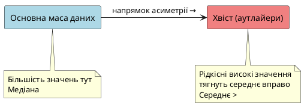

# Міри центральної тенденції

::card-group

::card{title="🎯 Мета підтеми" icon="i-lucide-target"}

- Зрозуміти, що таке «центр» даних і навіщо його шукати
- Навчитися обчислювати середнє, медіану та моду
- Розпізнавати ситуації, коли кожна міра є найкращою
- Побачити проблему аутлайерів та як медіана їх долає

::

::card{title="🔑 Ключові терміни" icon="i-lucide-key"}

- **Середнє арифметичне** (*mean*) — сума всіх значень, поділена на їхню кількість
- **Медіана** (*median*) — центральне значення у відсортованому наборі даних
- **Мода** (*mode*) — найчастіше значення в даних
- **Аутлайер** (*outlier*) — екстремальне значення, що сильно відхиляється від інших

::

::

---

## Задача, яка розкриває правду про середні

Ви HR-менеджер у компанії. Керівництво запитує: «Яка типова зарплата наших працівників?» Треба дати одне число, яке найкраще описує рівень оплати.

Відкриваємо дані про зарплати 10 співробітників (у тисячах гривень на місяць):

```
25, 30, 30, 32, 35, 35, 35, 40, 45, 200
```

Ваш перший інстинкт — порахувати **середнє**:

::math-formula
\text{Середнє} = \frac{25 + 30 + 30 + 32 + 35 + 35 + 35 + 40 + 45 + 200}{10} = \frac{507}{10} = 50.7 \text{ тис. грн}
::

Ви йдете до керівництва: «Типова зарплата — 50 700 грн».

Але стоп. Подивімось на дані ще раз:

```
25, 30, 30, 32, 35, 35, 35, 40, 45,    200 ← директор
└────────────────────────────┬─────────────┘
        9 звичайних працівників
```

**Дев'ять** працівників отримують від 25 до 45 тисяч (середнє серед них ~34 тис.). І **один** директор отримує 200 тисяч.

Чи є «50 700 грн» типовою зарплатою? **Ні.** Жоден звичайний співробітник не отримує близько цієї суми. Середнє спотворене одним екстремальним значенням — **аутлайером** (*outlier*).

> Аналогія: Якщо Ілон Маск зайде до кафе, де сидить 10 студентів, «середній статок відвідувача» раптом стане мільярдним. Але чи це правда про типового відвідувача? Звичайно, ні.

Тут потрібна інша міра центру — **медіана**. Вона не звертає уваги на екстремальні значення і показує, яка зарплата в **середині** розподілу. Розберемо всі три міри детально.

---

## Середнє арифметичне (Mean)

**Середнє арифметичне** (*arithmetic mean*) — це сума всіх значень, поділена на їхню кількість. Найпоширеніша міра центральної тенденції.

### Формула

Для набору значень :math-formula{tex="x_1, x_2, \\ldots, x_n" inline} середнє позначається символом :math-formula{tex="\\bar{x}" inline} (читається «ікс з рискою») або грецькою літерою :math-formula{tex="\\mu" inline} (мю):

::math-formula
\bar{x} = \frac{x_1 + x_2 + \ldots + x_n}{n} = \frac{1}{n} \sum_{i=1}^{n} x_i
::

Де:
- :math-formula{tex="\\bar{x}" inline} — середнє значення
- :math-formula{tex="n" inline} — кількість спостережень
- :math-formula{tex="\\sum" inline} (велика сигма) — символ суми

### Обчислення з NumPy та pandas

::jupyter-notebook{title="mean_calculation.ipynb" kernel="Python 3 (ipykernel)"}

::jupyter-cell{type="markdown"}
### Обчислення середнього різними способами
::

::jupyter-cell{executionCount="1"}
```python
import numpy as np
import pandas as pd

# Дані про зарплати (в тисячах гривень)
salaries = np.array([25, 30, 30, 32, 35, 35, 35, 40, 45, 200])

# Спосіб 1: NumPy
mean_numpy = np.mean(salaries)
print(f"Середнє (NumPy): {mean_numpy:.1f} тис. грн")

# Спосіб 2: вбудований метод масиву
mean_array = salaries.mean()
print(f"Середнє (array): {mean_array:.1f} тис. грн")

# Спосіб 3: pandas Series
salaries_series = pd.Series(salaries)
mean_pandas = salaries_series.mean()
print(f"Середнє (pandas): {mean_pandas:.1f} тис. грн")

# Спосіб 4: вручну (для розуміння)
mean_manual = sum(salaries) / len(salaries)
print(f"Середнє (вручну): {mean_manual:.1f} тис. грн")
```

#output
```
Середнє (NumPy): 50.7 тис. грн
Середнє (array): 50.7 тис. грн
Середнє (pandas): 50.7 тис. грн
Середнє (вручну): 50.7 тис. грн
```
::

::

### Проблема: чутливість до аутлайерів

Середнє **дуже чутливе** до екстремальних значень. Давайте видалимо директора і подивимось, що станеться:

::jupyter-notebook{title="mean_sensitivity.ipynb" kernel="Python 3 (ipykernel)"}

::jupyter-cell{type="markdown"}
### Вплив аутлайера на середнє
::

::jupyter-cell{executionCount="1"}
```python
import numpy as np

# Зарплати з директором
salaries_with_director = np.array([25, 30, 30, 32, 35, 35, 35, 40, 45, 200])
mean_with = salaries_with_director.mean()

# Зарплати без директора
salaries_without_director = np.array([25, 30, 30, 32, 35, 35, 35, 40, 45])
mean_without = salaries_without_director.mean()

print(f"Середнє З директором:   {mean_with:.1f} тис. грн")
print(f"Середнє БЕЗ директора:  {mean_without:.1f} тис. грн")
print(f"Різниця:                {mean_with - mean_without:.1f} тис. грн ({(mean_with - mean_without) / mean_without * 100:.0f}% зміна)")
```

#output
```
Середнє З директором:   50.7 тис. грн
Середнє БЕЗ директора:  34.1 тис. грн
Різниця:                16.6 тис. грн (49% зміна)
```
::

::

**Одне екстремальне значення змінило середнє майже на 50%!** Це робить середнє **ненадійною** мірою центру для даних із аутлайерами.

::warning
**Коли НЕ використовувати середнє:**
- Дані містять екстремальні значення (дуже високі або дуже низькі)
- Розподіл сильно асиметричний (скошений)
- Є викиди, які не представляють типову ситуацію

Приклади: зарплати (CEO vs працівники), ціни на житло (елітне житло vs звичайне), час відповіді сервера (нормальні запити vs помилки).
::

### Коли середнє є хорошим вибором

Середнє працює чудово, коли:
- Дані **симетрично** розподілені (дзвоноподібна крива)
- Немає значних аутлайерів
- Всі значення мають однакову «важливість»

Приклади: зріст людей (приблизно нормальний розподіл), температура повітря, результати тестів у великій групі студентів.

> Аналогія: Середнє — це як «центр ваги» набору чисел. Якщо покласти всі числа на лінійку як вантажі, середнє — це точка, де лінійка збалансується. Але один дуже важкий вантаж (аутлайер) зсуне центр ваги далеко від «типової» зони.

---

## Медіана (Median)

**Медіана** (*median*) — це значення, яке розділяє відсортований набір даних навпіл: 50% значень менші за медіану, 50% — більші.

### Як обчислити медіану вручну

**Крок 1:** Відсортуйте дані від найменшого до найбільшого

```
Несортовані: 25, 30, 30, 32, 35, 35, 35, 40, 45, 200
Відсортовані: 25, 30, 30, 32, 35, 35, 35, 40, 45, 200
```

**Крок 2:** Знайдіть центральне значення

- Якщо кількість значень **непарна** (наприклад, 9), медіана — це середній елемент (5-й з 9)
- Якщо **парна** (наприклад, 10), медіана — це **середнє** двох центральних елементів (5-го і 6-го з 10)

У нашому випадку 10 значень (парна кількість):

```
25, 30, 30, 32,   35, 35,   35, 40, 45, 200
               └─────┬─────┘
                5-й   6-й
```

Медіана = :math-formula{tex="\\frac{35 + 35}{2} = 35" inline} тис. грн

**Бачите різницю?** Середнє = 50.7 тис., медіана = 35 тис. Медіана набагато краще відображає «типову» зарплату!

### Обчислення медіани з NumPy та pandas

::jupyter-notebook{title="median_calculation.ipynb" kernel="Python 3 (ipykernel)"}

::jupyter-cell{type="markdown"}
### Медіана стійка до аутлайерів
::

::jupyter-cell{executionCount="1"}
```python
import numpy as np

salaries = np.array([25, 30, 30, 32, 35, 35, 35, 40, 45, 200])

# Обчислення медіани
median = np.median(salaries)
mean = np.mean(salaries)

print(f"Медіана: {median:.1f} тис. грн")
print(f"Середнє: {mean:.1f} тис. грн")
print(f"Різниця: {abs(mean - median):.1f} тис. грн")
```

#output
```
Медіана: 35.0 тис. грн
Середнє: 50.7 тис. грн
Різниця: 15.7 тис. грн
```
::

::jupyter-cell{executionCount="2"}
```python
# А тепер видалимо директора
salaries_no_outlier = np.array([25, 30, 30, 32, 35, 35, 35, 40, 45])

median_no = np.median(salaries_no_outlier)
mean_no = np.mean(salaries_no_outlier)

print("Без директора:")
print(f"  Медіана: {median_no:.1f} тис. грн (змінилась на {abs(median - median_no):.1f})")
print(f"  Середнє: {mean_no:.1f} тис. грн (змінилось на {abs(mean - mean_no):.1f})")
```

#output
```
Без директора:
  Медіана: 35.0 тис. грн (змінилась на 0.0)
  Середнє: 34.1 тис. грн (змінилось на 16.6)
```
::

::

**Медіана не змінилась взагалі!** Вона **імунна** до аутлайерів. Це її найбільша перевага.


::tip
**Коли використовувати медіану:**
- ✅ Дані містять аутлайери або екстремальні значення
- ✅ Розподіл асиметричний (скошений вліво або вправо)
- ✅ Потрібна «типова» величина, а не математичний центр ваги
- ✅ Категоріальні дані з природним порядком (наприклад, рейтинги: «погано», «нормально», «добре»)

Приклади застосування: зарплати, ціни на нерухомість, час відгуку сервера, доходи населення.
::

> Аналогія: Уявіть, що 11 людей стоять у шерензі за зростом. Медіана — це просто **середня людина** у цій шерензі (6-та з 11). Не має значення, наскільки високий найвищий або низький найнижчий — середня людина залишається на своєму місці.

---

## Мода (Mode)

**Мода** (*mode*) — це значення, яке **зустрічається найчастіше** в наборі даних.

### Приклад: пошук моди

Повернемось до наших зарплат:

```
25, 30, 30, 32, 35, 35, 35, 40, 45, 200
```

Підрахуємо частоту кожного значення:

| Зарплата (тис.) | Кількість разів |
| :-------------: | :-------------: |
|       25        |        1        |
|       30        |        2        |
|       32        |        1        |
|     **35**      |      **3**      |
|       40        |        1        |
|       45        |        1        |
|       200       |        1        |

**Мода = 35 тис. грн** (зустрічається 3 рази — частіше за інші).

### Обчислення моди з pandas

NumPy не має вбудованої функції для моди (вона була, але deprecated). Використовуйте pandas або scipy:

::jupyter-notebook{title="mode_calculation.ipynb" kernel="Python 3 (ipykernel)"}

::jupyter-cell{type="markdown"}
### Обчислення моди
::

::jupyter-cell{executionCount="1"}
```python
import pandas as pd
import numpy as np

salaries = np.array([25, 30, 30, 32, 35, 35, 35, 40, 45, 200])

# Pandas Series має метод mode()
salaries_series = pd.Series(salaries)
mode = salaries_series.mode()[0]  # може бути кілька мод, беремо першу

print(f"Мода: {mode:.1f} тис. грн")
print(f"Медіана: {np.median(salaries):.1f} тис. грн")
print(f"Середнє: {np.mean(salaries):.1f} тис. грн")
```

#output
```
Мода: 35.0 тис. грн
Медіана: 35.0 тис. грн
Середнє: 50.7 тис. грн
```
::

::jupyter-cell{executionCount="2"}
```python
# Альтернативний спосіб: через scipy
from scipy import stats

mode_scipy = stats.mode(salaries, keepdims=False)
print(f"\nМода (scipy): {mode_scipy.mode:.1f} тис. грн")
print(f"Частота: {mode_scipy.count} рази")
```

#output
```
Мода (scipy): 35.0 тис. грн
Частота: 3 рази
```
::

::

### Особливості моди

#### 1. Може не існувати

Якщо всі значення зустрічаються однакову кількість разів, моди немає:

```python
data = [10, 20, 30, 40]  # Кожне значення 1 раз — моди немає
```

#### 2. Може бути кілька мод (бімодальний або мультимодальний розподіл)

```python
data = [1, 2, 2, 3, 4, 4, 5]  # Дві моди: 2 і 4 (обидві по 2 рази)
```

::jupyter-notebook{title="bimodal_example.ipynb" kernel="Python 3 (ipykernel)" executionCount="1"}

```python
import pandas as pd

# Бімодальний розподіл: дві піки
data = pd.Series([1, 2, 2, 2, 5, 6, 6, 6, 9])
modes = data.mode()

print("Моди:", modes.values)
print("Кількість мод:", len(modes))
```

#output
```
Моди: [2 6]
Кількість мод: 2
```
::

> Аналогія бімодального розподілу: Уявіть магазин одягу, де найчастіше купують розмір S (жінки) та розмір L (чоловіки). Два піки — дві моди. Це сигнал, що ваші дані можуть складатись із **двох різних груп**.

#### 3. Мода для категоріальних даних

Мода — **єдина міра центральної тенденції**, яка працює для категоріальних (некількісних) даних:

::jupyter-notebook{title="categorical_mode.ipynb" kernel="Python 3 (ipykernel)" executionCount="1"}

```python
import pandas as pd

# Дані про улюблені кольори студентів
colors = pd.Series(['червоний', 'синій', 'зелений', 'синій', 
                    'червоний', 'синій', 'жовтий', 'синій'])

mode_color = colors.mode()[0]
print(f"Найпопулярніший колір: {mode_color}")
print(f"Він зустрічається {(colors == mode_color).sum()} разів з {len(colors)}")
```

#output
```
Найпопулярніший колір: синій
Він зустрічається 4 рази з 8
```
::

::note
**Важливо:** Для кольорів (або будь-яких категорій без природного порядку) середнє та медіана **не мають сенсу**. Що означає «середній колір»? Нічого. Але мода (найпопулярніший колір) — цілком логічна міра.
::

### Коли використовувати моду

- ✅ Категоріальні дані (колір, бренд, місто)
- ✅ Дискретні дані з повторюваними значеннями (розміри взуття, кількість дітей у сім'ї)
- ✅ Потрібно знайти «найтиповіший» елемент
- ✅ Для виявлення піків у розподілі

::warning
**Обмеження моди:**
- Може не існувати (якщо всі значення унікальні)
- Може бути декілька (важко інтерпретувати)
- Ігнорує всі інші дані, окрім частоти
- Не враховує величину значень (мода з `[1, 1, 100, 100]` може бути або 1, або 100 — рівноцінно)
::

---

## Порівняльна таблиця: Mean vs Median vs Mode

Підсумуємо всі три міри:

| Характеристика         | Середнє (Mean)                   | Медіана (Median)               | Мода (Mode)                     |
| :--------------------- | :------------------------------- | :----------------------------- | :------------------------------ |
| **Визначення**         | Сума / кількість                 | Центральне значення (50-й перцентиль) | Найчастіше значення           |
| **Формула**            | :math-formula{tex="\\bar{x} = \\frac{\\sum x_i}{n}" inline} | Середній елемент відсортованого ряду | Значення з максимальною частотою |
| **NumPy/pandas**       | `np.mean()`, `df.mean()`         | `np.median()`, `df.median()`   | `df.mode()`, `scipy.stats.mode()` |
| **Чутливість до аутлайерів** | ❌ Дуже чутливе            | ✅ Стійка                      | ✅ Стійка                       |
| **Тип даних**          | Числові (кількісні)              | Числові + порядкові            | Будь-які (навіть категоріальні) |
| **Унікальність**       | Завжди одне значення             | Завжди одне значення           | Може не існувати або бути кілька |
| **Інтерпретація**      | «Математичний центр ваги»        | «Типове значення (50% вище/нижче)» | «Найпопулярніше значення»   |
| **Коли використовувати** | Симетричні розподіли, немає аутлайерів | Асиметричні розподіли, є аутлайери | Категоріальні дані, пошук піків |

### Приклади застосування

::jupyter-notebook{title="real_world_examples.ipynb" kernel="Python 3 (ipykernel)"}

::jupyter-cell{type="markdown"}
### Три міри для різних типів даних
::

::jupyter-cell{executionCount="1"}
```python
import numpy as np
import pandas as pd

# 1. Симетричні дані: зріст студентів (см)
heights = np.array([165, 168, 170, 172, 170, 169, 171, 170, 168, 172])
print("1. Зріст студентів (симетричний розподіл):")
print(f"   Середнє:  {heights.mean():.1f} см")
print(f"   Медіана:  {np.median(heights):.1f} см")
print(f"   Мода:     {pd.Series(heights).mode()[0]:.1f} см")
print("   → Всі три міри близькі — можна використовувати будь-яку\n")

# 2. Асиметричні дані: ціни на квартири (млн грн)
prices = np.array([1.2, 1.5, 1.8, 2.0, 2.2, 2.5, 2.8, 3.0, 5.5, 8.0])
print("2. Ціни на квартири (асиметричний, є дорогі квартири):")
print(f"   Середнє:  {prices.mean():.2f} млн грн")
print(f"   Медіана:  {np.median(prices):.2f} млн грн")
print("   → Медіана краще (середнє завищене через дорогі квартири)\n")

# 3. Категоріальні дані: улюблені мови програмування
languages = pd.Series(['Python', 'JavaScript', 'Python', 'Java', 
                       'Python', 'JavaScript', 'Python', 'C++'])
print("3. Улюблені мови програмування (категоріальні):")
print(f"   Мода:     {languages.mode()[0]}")
print("   → Середнє та медіана не мають сенсу для категорій")
```

#output
```
1. Зріст студентів (симетричний розподіл):
   Середнє:  169.5 см
   Медіана:  170.0 см
   Мода:     170.0 см
   → Всі три міри близькі — можна використовувати будь-яку

2. Ціни на квартири (асиметричний, є дорогі квартири):
   Середнє:  3.05 млн грн
   Медіана:  2.35 млн грн
   → Медіана краще (середнє завищене через дорогі квартири)

3. Улюблені мови програмування (категоріальні):
   Мода:     Python
   → Середнє та медіана не мають сенсу для категорій
```
::

::


---

## Візуальне порівняння мір центру

Одна картинка варта тисячі слів. Давайте побачимо, де розташовані mean, median та mode на гістограмі:

::jupyter-notebook{title="visual_comparison.ipynb" kernel="Python 3 (ipykernel)"}

::jupyter-cell{type="markdown"}
### Візуалізація трьох мір центральної тенденції
Порівняємо симетричний та асиметричний розподіли
::

::jupyter-cell{executionCount="1"}
```python
import numpy as np
import matplotlib.pyplot as plt
from scipy import stats

np.random.seed(42)

# Створюємо два типи даних
# 1. Симетричний розподіл (нормальний)
symmetric_data = np.random.normal(100, 15, 1000)

# 2. Асиметричний розподіл (з правим хвостом)
skewed_data = np.concatenate([
    np.random.normal(50, 10, 900),  # Основна маса
    np.random.uniform(100, 200, 100)  # Аутлайери справа
])

# Створюємо графіки
fig, (ax1, ax2) = plt.subplots(1, 2, figsize=(14, 5))

# Графік 1: Симетричний розподіл
ax1.hist(symmetric_data, bins=30, alpha=0.7, color='steelblue', edgecolor='black')
mean1 = symmetric_data.mean()
median1 = np.median(symmetric_data)
mode1 = stats.mode(symmetric_data, keepdims=False).mode

ax1.axvline(mean1, color='red', linestyle='--', linewidth=2, label=f'Середнє = {mean1:.1f}')
ax1.axvline(median1, color='green', linestyle='--', linewidth=2, label=f'Медіана = {median1:.1f}')
ax1.set_title('Симетричний розподіл\n(Mean ≈ Median ≈ Mode)', fontweight='bold')
ax1.set_xlabel('Значення')
ax1.set_ylabel('Частота')
ax1.legend()
ax1.grid(alpha=0.3)

# Графік 2: Асиметричний розподіл
ax2.hist(skewed_data, bins=30, alpha=0.7, color='coral', edgecolor='black')
mean2 = skewed_data.mean()
median2 = np.median(skewed_data)

ax2.axvline(mean2, color='red', linestyle='--', linewidth=2, label=f'Середнє = {mean2:.1f}')
ax2.axvline(median2, color='green', linestyle='--', linewidth=2, label=f'Медіана = {median2:.1f}')
ax2.set_title('Асиметричний розподіл (правий хвіст)\n(Mean > Median)', fontweight='bold')
ax2.set_xlabel('Значення')
ax2.set_ylabel('Частота')
ax2.legend()
ax2.grid(alpha=0.3)

plt.tight_layout()
plt.show()

print("Симетричний розподіл:")
print(f"  Різниця (Mean - Median): {abs(mean1 - median1):.2f}")
print("\nАсиметричний розподіл:")
print(f"  Різниця (Mean - Median): {abs(mean2 - median2):.2f}")
```

#output
```
Симетричний розподіл:
  Різниця (Mean - Median): 0.23

Асиметричний розподіл:
  Різниця (Mean - Median): 12.47
```
::

::

::note
**Що ми бачимо:**

**Зліва (симетричний розподіл):**
- Червона та зелена лінії **майже збігаються** — середнє ≈ медіана
- Розподіл дзвоноподібний, без перекосу
- **Висновок:** можна використовувати будь-яку міру

**Справа (асиметричний розподіл):**
- Червона лінія (середнє) **зміщена вправо** від зеленої (медіани)
- Причина: довгий «хвіст» справа (аутлайери) тягнуть середнє
- **Висновок:** медіана краще відображає центр основної маси даних
::

---

## Симетричні vs асиметричні розподіли

### Симетричний розподіл

**Симетричний розподіл** (*symmetric distribution*) — це розподіл, у якому ліва та права частини дзеркально відображають одна одну відносно центру.

**Ознаки симетричного розподілу:**
- Mean ≈ Median ≈ Mode (всі три міри близькі)
- Гістограма має форму «дзвона»
- Немає довгих «хвостів» з одного боку

**Приклади:**
- Зріст дорослих людей
- Результати стандартизованих тестів у великій групі
- Похибки вимірювань (при правильній калібровці)

### Асиметричний розподіл (Skewed Distribution)

**Асиметричний розподіл** (*skewed distribution*) — це розподіл, у якого одна частина «розтягнута» — утворюється довгий хвіст.

#### Правостороння асиметрія (Right-skewed / Positive skew)

Довгий хвіст **справа** → Mean > Median

::plant-uml



::

**Приклади:**
- Зарплати (більшість низькі, CEO дуже високі)
- Ціни на житло (більшість доступні, елітне дороге)
- Доходи населення

#### Лівостороння асиметрія (Left-skewed / Negative skew)

Довгий хвіст **зліва** → Mean < Median

**Приклади:**
- Вік смерті в розвинутих країнах (більшість живе довго, рідко хтось помирає молодим)
- Оцінки на легкому іспиті (більшість високі, декілька низьких)

### Правило інтерпретації

::tip
**Швидка діагностика асиметрії:**

```
Mean = Median  →  Симетричний розподіл
Mean > Median  →  Правостороння асиметрія (довгий хвіст справа)
Mean < Median  →  Лівостороння асиметрія (довгий хвіст зліва)
```

Якщо різниця між mean та median більша за 5–10% від медіани — розподіл суттєво асиметричний.
::

---

## Практичний приклад: аналіз цін на житло

Давайте застосуємо всі три міри до реального датасету:

::jupyter-notebook{title="housing_analysis.ipynb" kernel="Python 3 (ipykernel)"}

::jupyter-cell{type="markdown"}
### Аналіз цін на квартири у місті
Синтетичний датасет: 100 квартир
::

::jupyter-cell{executionCount="1"}
```python
import numpy as np
import pandas as pd

np.random.seed(123)

# Генеруємо синтетичні дані про квартири
# Більшість квартир: 1-2 млн грн (основна маса)
# Декілька елітних: 5-10 млн грн (аутлайери)
regular_apartments = np.random.normal(1.5, 0.4, 90)  # 90 звичайних
elite_apartments = np.random.uniform(5, 10, 10)      # 10 елітних

prices = np.concatenate([regular_apartments, elite_apartments])
prices = np.clip(prices, 0.8, None)  # Мінімум 0.8 млн

# Створюємо DataFrame
df = pd.DataFrame({'Ціна (млн грн)': prices})

# Обчислюємо міри центру
mean_price = df['Ціна (млн грн)'].mean()
median_price = df['Ціна (млн грн)'].median()

print("Статистика цін на квартири:")
print(f"  Середнє:  {mean_price:.2f} млн грн")
print(f"  Медіана:  {median_price:.2f} млн грн")
print(f"  Різниця:  {mean_price - median_price:.2f} млн грн ({(mean_price - median_price) / median_price * 100:.1f}%)")
print(f"\n  Мінімум:  {df['Ціна (млн грн)'].min():.2f} млн грн")
print(f"  Максимум: {df['Ціна (млн грн)'].max():.2f} млн грн")
```

#output
```
Статистика цін на квартири:
  Середнє:  2.24 млн грн
  Медіана:  1.52 млн грн
  Різниця:  0.72 млн грн (47.4%)

  Мінімум:  0.83 млн грн
  Максимум: 9.87 млн грн
```
::

::jupyter-cell{executionCount="2"}
```python
# Аналіз розподілу
print("Розподіл квартир за ціновими сегментами:")
print(f"  До 2 млн грн:    {(df['Ціна (млн грн)'] < 2).sum()} квартир ({(df['Ціна (млн грн)'] < 2).mean() * 100:.0f}%)")
print(f"  Від 2 до 4 млн:  {((df['Ціна (млн грн)'] >= 2) & (df['Ціна (млн грн)'] < 4)).sum()} квартир")
print(f"  Понад 4 млн:     {(df['Ціна (млн грн)'] >= 4).sum()} квартир (елітний сегмент)")

print("\nВисновок:")
print(f"  Медіана ({median_price:.2f} млн) краще відображає 'типову' ціну,")
print(f"  бо 90% квартир коштують до 2 млн грн.")
print(f"  Середнє ({mean_price:.2f} млн) завищене через елітне житло.")
```

#output
```
Розподіл квартир за ціновими сегментами:
  До 2 млн грн:    85 квартир (85%)
  Від 2 до 4 млн:  5 квартир
  Понад 4 млн:     10 квартир (елітний сегмент)

Висновок:
  Медіана (1.52 млн) краще відображає 'типову' ціну,
  бо 90% квартир коштують до 2 млн грн.
  Середнє (2.24 млн) завищене через елітне житло.
```
::

::

::warning
**Практичний урок:** Якщо ви шукаєте квартиру і бачите в оголошенні «середня ціна у районі 2.24 млн грн», не панікуйте. **Медіана** показує, що більшість квартир насправді коштують біля 1.5 млн. Це і є типова ціна для звичайного покупця.
::


---

## Практичні завдання

### Рівень 1: Базові вправи

::accordion

::accordion-item{label="Завдання 1.1: Порахуй три міри вручну" icon="i-lucide-calculator"}

Дано оцінки 7 студентів за тест (за 12-бальною шкалою):
```
8, 10, 10, 11, 12, 12, 12
```

Без використання NumPy/pandas (тільки вбудовані функції Python), обчисліть:
1. Середнє арифметичне
2. Медіану
3. Моду

**Підказка:** 
- Середнє: `sum(grades) / len(grades)`
- Медіана: відсортуйте список, візьміть центральний елемент
- Мода: використайте `collections.Counter` для підрахунку частот

::

::accordion-item{label="Завдання 1.2: Вплив аутлайера" icon="i-lucide-alert-circle"}

Дано витрати студента на обіди за тиждень (у гривнях):
```
80, 75, 90, 85, 80, 95, 500
```

Останнє значення (500 грн) — це день народження, коли студент частував друзів.

1. Обчисліть середнє та медіану з усіма даними
2. Обчисліть середнє та медіану без аутлайера (500)
3. Яка міра краще описує типові витрати студента?

::

::accordion-item{label="Завдання 1.3: Категоріальна мода" icon="i-lucide-tag"}

Створіть список із 20 випадкових розмірів футболок (XS, S, M, L, XL). Знайдіть найпопулярніший розмір.

**Підказка:**
```python
import numpy as np
sizes = np.random.choice(['XS', 'S', 'M', 'L', 'XL'], size=20)
```

::

::

---

### Рівень 2: Алгоритмічні задачі

::accordion

::accordion-item{label="Завдання 2.1: Аналіз успішності класу" icon="i-lucide-graduation-cap"}

Створіть DataFrame із 30 студентами. У кожного є оцінки з трьох предметів (випадкові числа від 60 до 100).

1. Обчисліть середню оцінку кожного студента
2. Знайдіть медіану та середнє по кожному предмету
3. Визначте, які предмети мають симетричний розподіл оцінок (mean ≈ median), а які — асиметричний
4. Побудуйте гістограми для кожного предмета з позначенням mean та median

::

::accordion-item{label="Завдання 2.2: Порівняння міст за зарплатами" icon="i-lucide-building"}

Згенеруйте синтетичні дані про зарплати для двох міст:

- **Місто A:** нормальний розподіл, середнє 30 000, σ=5000, розмір вибірки 100
- **Місто B:** 90 зарплат з нормального розподілу (25 000, σ=4000) + 10 зарплат із uniform(80 000, 150 000)

Для кожного міста обчисліть:
1. Mean, Median
2. Різницю між ними у відсотках
3. Зробіть висновок: у якому місті розподіл більш асиметричний?

::

::accordion-item{label="Завдання 2.3: Функція вибору міри центру" icon="i-lucide-code-2"}

Напишіть функцію `best_central_measure(data, threshold=0.1)`, яка:

1. Обчислює mean та median
2. Якщо різниця між ними менша за `threshold * median`, повертає **mean** (дані симетричні)
3. Інакше повертає **median** (дані асиметричні)

Протестуйте на різних даних:
```python
symmetric_data = [10, 12, 13, 14, 15, 16, 17, 18, 20]
skewed_data = [10, 12, 13, 14, 15, 16, 17, 18, 100]
```

::

::

---

### Рівень 3: Проєктні завдання

::accordion

::accordion-item{label="Завдання 3.1: Аналізатор датасету Titanic" icon="i-lucide-ship"}

Завантажте датасет Titanic (доступний у seaborn або онлайн). Проаналізуйте стовпець `Age` (вік пасажирів):

1. Обчисліть mean, median, mode для віку
2. Побудуйте гістограму з позначенням цих трьох мір
3. Визначте тип асиметрії (якщо є)
4. Порівняйте вік пасажирів різних класів (1st, 2nd, 3rd) — для якого класу розподіл найбільш асиметричний?
5. Проаналізуйте стовпець `Fare` (вартість квитка) — чому середнє та медіана сильно відрізняються?

::

::accordion-item{label="Завдання 3.2: Симулятор A/B тесту" icon="i-lucide-flask"}

Компанія тестує дві версії сайту:

- **Версія A:** час на сторінці — нормальний розподіл (mean=120 сек, σ=30)
- **Версія B:** час на сторінці — нормальний розподіл (mean=140 сек, σ=35)

Згенеруйте по 200 відвідувачів для кожної версії. 

1. Обчисліть mean та median для кожної
2. Чи можна впевнено сказати, що версія B краща? (підказка: порівняйте не тільки центр, а й розкид даних)
3. Побудуйте два графіки поруч (гістограми) з позначенням мір центру
4. Додайте 5% «швидких користувачів» (5–10 сек) до версії B — як це вплине на mean та median?

::

::accordion-item{label="Завдання 3.3: Генератор звітів про дані" icon="i-lucide-file-text"}

Створіть функцію `generate_report(data, column_name)`, яка приймає pandas DataFrame та назву стовпця і генерує текстовий звіт:

```
Звіт про стовпець 'Salary'
════════════════════════════════
Тип даних:        float64
Кількість значень: 100
Пропусків:        0

Міри центральної тенденції:
  Середнє:   45,230 грн
  Медіана:   42,100 грн
  Мода:      40,000 грн

Аналіз асиметрії:
  Різниця (Mean - Median): 3,130 грн (7.4%)
  Висновок: Дані мають помірну правосторонню
            асиметрію. Рекомендується використовувати
            медіану для опису типового значення.

Рекомендація: MEDIAN
```

Функція має автоматично визначати тип асиметрії та давати рекомендацію щодо використання міри.

::

::

---

## Резюме: ключові takeaways

::card-group

::card{title="Середнє (Mean)" icon="i-lucide-sigma"}

**Формула:** сума / кількість

**Переваги:**
- Використовує всі дані
- Математично зручне для подальших обчислень

**Недоліки:**
- Дуже чутливе до аутлайерів
- Може не відображати «типове» значення

**Коли використовувати:** симетричні розподіли без аутлайерів

::

::card{title="Медіана (Median)" icon="i-lucide-move-vertical"}

**Визначення:** центральне значення відсортованого ряду

**Переваги:**
- Стійка до аутлайерів
- Завжди відображає «типове» значення (50-й перцентиль)

**Недоліки:**
- Ігнорує величину крайніх значень
- Важче обчислювати математично

**Коли використовувати:** асиметричні розподіли, наявність аутлайерів

::

::card{title="Мода (Mode)" icon="i-lucide-bar-chart-2"}

**Визначення:** найчастіше значення

**Переваги:**
- Єдина міра для категоріальних даних
- Показує «найпопулярніше» значення
- Стійка до аутлайерів

**Недоліки:**
- Може не існувати або бути декілька
- Ігнорує всі дані, окрім частот

**Коли використовувати:** категоріальні дані, пошук піків розподілу

::

::card{title="Діагностика асиметрії" icon="i-lucide-trending-up"}

```
Mean = Median  →  Симетричний
Mean > Median  →  Правий хвіст
Mean < Median  →  Лівий хвіст
```

Якщо різниця >5–10% — розподіл асиметричний, використовуйте **медіану**.

::

::card{title="Практичне правило" icon="i-lucide-lightbulb"}

**У реальних даних:**
- Зарплати, ціни, доходи → **медіана**
- Зріст, вага, температура → **середнє** або **медіана**
- Категорії, рейтинги → **мода**

**Золоте правило:** Спочатку побудуйте гістограму та порівняйте mean vs median. Це покаже, яку міру обрати.

::

::card{title="Зв'язок із ML" icon="i-lucide-brain-circuit"}

Міри центру використовуються в ML для:
- **Імпутації пропусків** (заповнення середнім/медіаною)
- **Нормалізації даних** (віднімання середнього)
- **Виявлення аномалій** (відхилення від центру)
- **Інтерпретації результатів** (типова помилка моделі)

::

::

---

## Що далі?

Ви опанували три основні міри центральної тенденції. Тепер ви розумієте, як знайти «типове» значення в даних. Але це лише половина історії.

Уявіть два набори чисел:
- **Набір A:** `[49, 50, 50, 50, 51]` → середнє = 50
- **Набір B:** `[10, 30, 50, 70, 90]` → середнє = 50

Середнє однакове, але дані **зовсім різні**! У наборі A всі значення дуже близькі до центру. У наборі B — розкидані по всьому діапазону.

Для опису цієї **розкиданості** потрібні інші міри — **міри варіації** (дисперсія, стандартне відхилення, розмах, IQR). Про них ми поговоримо в наступній статті.

::tip
💡 **Порада для закріплення:** Відкрийте будь-який публічний датасет (Kaggle, UCI Machine Learning Repository) і проаналізуйте його числові стовпці. Для кожного обчисліть mean, median та mode. Побудуйте гістограми. Визначте тип асиметрії. Зробіть висновки про те, яка міра найкраща для кожного стовпця. Це найкращий спосіб перетворити теорію на практичну навичку.
::
