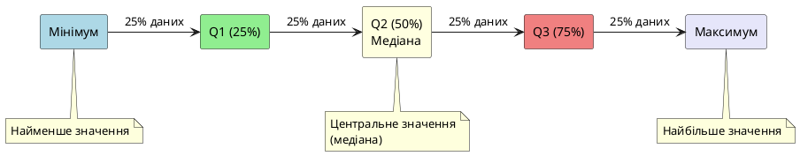

# Міри варіації (розсіювання)

::card-group

::card{title="🎯 Мета підтеми" icon="i-lucide-target"}

- Зрозуміти, що таке варіація (розсіювання) даних
- Навчитися обчислювати дисперсію та стандартне відхилення
- Розпізнавати високо- та низьковаріативні дані
- Опанувати квартилі та міжквартильний розмах (IQR)
- Побачити зв'язок між варіацією та передбачуваністю в ML

::

::card{title="🔑 Ключові терміни" icon="i-lucide-key"}

- **Розмах** (*range*) — різниця між максимальним та мінімальним значенням
- **Дисперсія** (*variance*, σ²) — середній квадрат відхилення від середнього
- **Стандартне відхилення** (*standard deviation*, σ) — квадратний корінь із дисперсії
- **Квартилі** (*quartiles*) — значення, що поділяють дані на 4 рівні частини
- **Міжквартильний розмах** (*IQR*) — різниця між Q3 і Q1, стійка до аутлайерів

::

::

---

## Два стрільці, одна мішень: задача про стабільність

Уявіть: двоє стрільців — Олексій та Борис — стріляють по мішені. Кожен робить 10 пострілів. Підраховуємо відстань від центру мішені до кожного влучення (у сантиметрах):

**Олексій:** `[8, 7, 9, 8, 8, 7, 9, 8, 8, 8]`  
**Борис:** `[2, 5, 15, 12, 3, 18, 1, 10, 4, 10]`

Хто кращий стрілець? Давайте порахуємо **середню** відстань від центру:

::jupyter-notebook{title="shooters_comparison.ipynb" kernel="Python 3 (ipykernel)" executionCount="1"}

```python
import numpy as np

oleksiy = np.array([8, 7, 9, 8, 8, 7, 9, 8, 8, 8])
borys = np.array([2, 5, 15, 12, 3, 18, 1, 10, 4, 10])

print(f"Олексій - середня відстань: {oleksiy.mean():.1f} см")
print(f"Борис   - середня відстань: {borys.mean():.1f} см")
```

#output
```
Олексій - середня відстань: 8.0 см
Борис   - середня відстань: 8.0 см
```
::

**Середнє однакове!** Але інтуїтивно ми розуміємо, що Олексій стріляє **стабільніше** — всі його постріли в діапазоні 7–9 см. Борис «стрибає» від 1 до 18 см — він **нестабільний**.

> Аналогія: Уявіть двох водіїв автобуса. Перший їде плавно — пасажири стоять спокійно. Другий постійно різко гальмує та прискорюється — пасажири хитаються. Обидва доїхали за однаковий час (середнє), але **комфорт** (стабільність) зовсім різний.

Саме для вимірювання цієї **розкиданості** (варіації, розсіювання) існують спеціальні міри. Середнє показує **центр** даних, а міри варіації показують, наскільки дані **розкидані навколо центру**.

У Machine Learning варіація критична:
- **Низька варіація** → передбачуваність (ознака стабільна, модель може на неї покластися)
- **Висока варіація** → невизначеність (ознака «шумна», потрібна обережність)

---

## Розмах (Range): найпростіша міра

**Розмах** (*range*) — це різниця між максимальним та мінімальним значенням у даних.

### Формула

::math-formula
\text{Range} = \text{max}(X) - \text{min}(X)
::

### Обчислення

::jupyter-notebook{title="range_calculation.ipynb" kernel="Python 3 (ipykernel)"}

::jupyter-cell{type="markdown"}
### Розмах для двох стрільців
::

::jupyter-cell{executionCount="1"}
```python
import numpy as np

oleksiy = np.array([8, 7, 9, 8, 8, 7, 9, 8, 8, 8])
borys = np.array([2, 5, 15, 12, 3, 18, 1, 10, 4, 10])

range_oleksiy = oleksiy.max() - oleksiy.min()
range_borys = borys.max() - borys.min()

print("Олексій:")
print(f"  Мінімум: {oleksiy.min()} см")
print(f"  Максимум: {oleksiy.max()} см")
print(f"  Розмах: {range_oleksiy} см")

print("\nБорис:")
print(f"  Мінімум: {borys.min()} см")
print(f"  Максимум: {borys.max()} см")
print(f"  Розмах: {range_borys} см")
```

#output
```
Олексій:
  Мінімум: 7 см
  Максимум: 9 см
  Розмах: 2 см

Борис:
  Мінімум: 1 см
  Максимум: 18 см
  Розмах: 17 см
```
::

::

**Тепер бачимо різницю!** Олексій має розмах 2 см (дуже стабільний), Борис — 17 см (нестабільний).

### Проблема розмаху: чутливість до аутлайерів

Розмах використовує **лише два значення** — мінімум та максимум. Все, що між ними, ігнорується. Це робить його дуже чутливим до екстремальних значень:

::jupyter-notebook{title="range_outlier_problem.ipynb" kernel="Python 3 (ipykernel)" executionCount="1"}

```python
import numpy as np

# Оцінки студентів (за 100-бальною шкалою)
grades_normal = np.array([82, 85, 88, 84, 86, 87, 83, 85, 86, 84])
grades_with_outlier = np.array([82, 85, 88, 84, 86, 87, 83, 85, 86, 15])  # один студент списав і отримав 15

range_normal = grades_normal.max() - grades_normal.min()
range_with_outlier = grades_with_outlier.max() - grades_with_outlier.min()

print(f"Розмах БЕЗ аутлайера: {range_normal} балів")
print(f"Розмах З аутлайером:  {range_with_outlier} балів")
print(f"Зміна: {range_with_outlier - range_normal} балів ({(range_with_outlier - range_normal) / range_normal * 100:.0f}% збільшення)")
```

#output
```
Розмах БЕЗ аутлайера: 6 балів
Розмах З аутлайером:  73 балів
Зміна: 67 балів (1117% збільшення)
```
::

**Один аутлайер збільшив розмах у 12 разів!** Розмах більше не відображає реальну варіацію основної маси даних.

::warning
**Коли НЕ використовувати розмах:**
- Дані містять аутлайери
- Потрібна точна міра варіації (розмах дуже грубий)
- Порівнюються датасети різного розміру (розмах зростає зі збільшенням даних)

**Коли розмах корисний:**
- Швидка оцінка діапазону даних (min–max)
- Перевірка на очевидні помилки введення
- Побудова шкал графіків
::

---

## Дисперсія (Variance): математично точна міра

**Дисперсія** (*variance*, позначається σ² або s²) — це **середній квадрат відхилення** кожного значення від середнього. Вона враховує **всі дані**, а не тільки крайні значення.

### Інтуїтивне пояснення

Дисперсія відповідає на запитання: «Наскільки далеко **в середньому** знаходяться дані від їхнього центру (середнього)?»

1. Беремо кожне значення
2. Обчислюємо, наскільки воно відхиляється від середнього: :math-formula{tex="x_i - \\bar{x}" inline}
3. Возводимо це відхилення в квадрат (щоб негативні та позитивні не анулювали одне одного)
4. Обчислюємо середнє цих квадратів

### Формули

**Дисперсія генеральної сукупності** (*population variance*, σ²):

::math-formula
\sigma^2 = \frac{1}{n} \sum_{i=1}^{n} (x_i - \mu)^2
::

**Дисперсія вибірки** (*sample variance*, s²):

::math-formula
s^2 = \frac{1}{n-1} \sum_{i=1}^{n} (x_i - \bar{x})^2
::

::note
**Різниця між n та n−1:**
- **n** — використовується, коли у вас **усі дані** (генеральна сукупність)
- **n−1** — використовується, коли у вас **вибірка** з більшої сукупності (поправка Бесселя для незміщеної оцінки)

У NumPy за замовчуванням `np.var()` використовує **n** (ddof=0). Pandas `df.var()` використовує **n−1** (ddof=1). Для узгодженості використовуйте параметр `ddof`:

```python
np.var(data, ddof=1)  # вибіркова дисперсія (як pandas)
```
::

### Обчислення дисперсії

::jupyter-notebook{title="variance_calculation.ipynb" kernel="Python 3 (ipykernel)"}

::jupyter-cell{type="markdown"}
### Покрокове обчислення дисперсії
::

::jupyter-cell{executionCount="1"}
```python
import numpy as np
import pandas as pd

oleksiy = np.array([8, 7, 9, 8, 8, 7, 9, 8, 8, 8])

# Крок 1: Обчислюємо середнє
mean = oleksiy.mean()
print(f"Крок 1. Середнє: {mean:.1f}")

# Крок 2: Відхилення від середнього
deviations = oleksiy - mean
print(f"\nКрок 2. Відхилення від середнього:")
print(deviations)

# Крок 3: Квадрати відхилень
squared_deviations = (oleksiy - mean) ** 2
print(f"\nКрок 3. Квадрати відхилень:")
print(squared_deviations)

# Крок 4: Середнє квадратів = дисперсія
variance = squared_deviations.mean()
print(f"\nКрок 4. Дисперсія (середнє квадратів): {variance:.2f}")

# Перевірка за допомогою NumPy
variance_numpy = np.var(oleksiy, ddof=0)
print(f"Перевірка (NumPy): {variance_numpy:.2f}")
```

#output
```
Крок 1. Середнє: 8.0

Крок 2. Відхилення від середнього:
[ 0. -1.  1.  0.  0. -1.  1.  0.  0.  0.]

Крок 3. Квадрати відхилень:
[0. 1. 1. 0. 0. 1. 1. 0. 0. 0.]

Крок 4. Дисперсія (середнє квадратів): 0.40

Перевірка (NumPy): 0.40
```
::

::jupyter-cell{executionCount="2"}
```python
# Порівняємо дисперсію для обох стрільців
borys = np.array([2, 5, 15, 12, 3, 18, 1, 10, 4, 10])

var_oleksiy = np.var(oleksiy, ddof=0)
var_borys = np.var(borys, ddof=0)

print(f"Дисперсія Олексія: {var_oleksiy:.2f} см²")
print(f"Дисперсія Бориса:  {var_borys:.2f} см²")
print(f"\nБорис має дисперсію в {var_borys / var_oleksiy:.1f} разів більшу!")
```

#output
```
Дисперсія Олексія: 0.40 см²
Дисперсія Бориса:  28.00 см²

Борис має дисперсію в 70.0 разів більшу!
```
::

::

> Аналогія: Дисперсія — це як «середній квадратний радіус» розкиду точок навколо центру. Чим більша дисперсія, тим далі «розлітаються» дані від середнього. Олексій стріляє в коло радіусом √0.4 ≈ 0.6 см. Борис — у коло радіусом √28 ≈ 5.3 см.


### Чому квадрат відхилення?

Чому ми возводимо відхилення в квадрат, а не просто берем абсолютне значення?

::jupyter-notebook{title="why_square.ipynb" kernel="Python 3 (ipykernel)" executionCount="1"}

```python
import numpy as np

data = np.array([2, 4, 6, 8, 10])
mean = data.mean()

# Спроба 1: Просто сума відхилень (не працює!)
simple_deviations = data - mean
print(f"Відхилення від середнього: {simple_deviations}")
print(f"Сума відхилень: {simple_deviations.sum():.10f}")
print("→ Завжди дорівнює нулю! (позитивні та негативні анулюються)\n")

# Спроба 2: Абсолютні відхилення (працює, але математично незручно)
abs_deviations = np.abs(data - mean)
print(f"Абсолютні відхилення: {abs_deviations}")
print(f"Середнє абсолютне відхилення (MAD): {abs_deviations.mean():.2f}\n")

# Спроба 3: Квадрати відхилень (ідеально!)
squared_deviations = (data - mean) ** 2
print(f"Квадрати відхилень: {squared_deviations}")
print(f"Дисперсія (середній квадрат): {squared_deviations.mean():.2f}")
```

#output
```
Відхилення від середнього: [-4. -2.  0.  2.  4.]
Сума відхилень: 0.0000000000
→ Завжди дорівнює нулю! (позитивні та негативні анулюються)

Абсолютні відхилення: [4. 2. 0. 2. 4.]
Середнє абсолютне відхилення (MAD): 2.40

Квадрати відхилень: [16.  4.  0.  4. 16.]
Дисперсія (середній квадрат): 8.00
```
::

**Причини використання квадрату:**
1. **Усуває знаки** — негативні та позитивні відхилення не анулюються
2. **Математично зручно** — диференційовно, добре поводиться в теоремах
3. **Більше штрафує великі відхилення** — квадрат 4 = 16, а квадрат 2 = 4 (різниця 12 vs 2 для абсолюту)

::note
**Важливо:** Дисперсія **не має інтуїтивних одиниць** виміру. Якщо дані в сантиметрах, то дисперсія в **см²** (квадратних сантиметрах). Що це означає? Важко сказати. Тому в практиці частіше використовують **стандартне відхилення** (квадратний корінь із дисперсії), яке повертає одиниці виміру до оригінальних.
::

---

## Стандартне відхилення (Standard Deviation)

**Стандартне відхилення** (*standard deviation*, позначається σ або s) — це **квадратний корінь із дисперсії**. Це найпопулярніша міра варіації.

### Формула

::math-formula
\sigma = \sqrt{\sigma^2} = \sqrt{\frac{1}{n} \sum_{i=1}^{n} (x_i - \mu)^2}
::

### Переваги над дисперсією

1. **Одиниці виміру такі ж, як у даних** — якщо дані в см, то σ теж у см
2. **Інтуїтивна інтерпретація** — «типове відхилення від середнього»
3. **Правило 68-95-99.7** для нормального розподілу (побачимо в наступній статті)

::jupyter-notebook{title="std_calculation.ipynb" kernel="Python 3 (ipykernel)"}

::jupyter-cell{type="markdown"}
### Стандартне відхилення: зв'язок із дисперсією
::

::jupyter-cell{executionCount="1"}
```python
import numpy as np

oleksiy = np.array([8, 7, 9, 8, 8, 7, 9, 8, 8, 8])
borys = np.array([2, 5, 15, 12, 3, 18, 1, 10, 4, 10])

# Дисперсія (variance)
var_oleksiy = np.var(oleksiy, ddof=0)
var_borys = np.var(borys, ddof=0)

# Стандартне відхилення (standard deviation)
std_oleksiy = np.std(oleksiy, ddof=0)
std_borys = np.std(borys, ddof=0)

print("Олексій:")
print(f"  Дисперсія:           {var_oleksiy:.2f} см²")
print(f"  Стандартне відхилення: {std_oleksiy:.2f} см")
print(f"  Перевірка (√дисперсія): {np.sqrt(var_oleksiy):.2f} см")

print("\nБорис:")
print(f"  Дисперсія:           {var_borys:.2f} см²")
print(f"  Стандартне відхилення: {std_borys:.2f} см")
print(f"  Перевірка (√дисперсія): {np.sqrt(var_borys):.2f} см")
```

#output
```
Олексій:
  Дисперсія:           0.40 см²
  Стандартне відхилення: 0.63 см
  Перевірка (√дисперсія): 0.63 см

Борис:
  Дисперсія:           28.00 см²
  Стандартне відхилення: 5.29 см
  Перевірка (√дисперсія): 5.29 см
```
::

::

> Аналогія: Якщо дисперсія — це «площа» розкиду, то стандартне відхилення — це «радіус» розкиду. Для Олексія: результати зазвичай у межах 8 ± 0.63 см. Для Бориса: 8 ± 5.29 см (майже в 10 разів більший «радіус невизначеності»).

### Інтерпретація стандартного відхилення

**Низьке стандартне відхилення** → дані **згруповані** навколо середнього (передбачувані, стабільні)  
**Високе стандартне відхилення** → дані **розкидані** (непередбачувані, мінливі)

::jupyter-notebook{title="std_interpretation.ipynb" kernel="Python 3 (ipykernel)" executionCount="1"}

```python
import numpy as np

# Три випадки з однаковим середнім, але різною варіацією
np.random.seed(42)

low_var = np.array([50, 49, 51, 50, 50, 49, 51, 50, 50, 50])
medium_var = np.array([45, 48, 52, 47, 53, 46, 54, 48, 52, 50])
high_var = np.array([30, 40, 60, 35, 65, 45, 55, 50, 60, 55])

datasets = [
    ("Низька варіація", low_var),
    ("Середня варіація", medium_var),
    ("Висока варіація", high_var)
]

for name, data in datasets:
    mean = data.mean()
    std = data.std(ddof=0)
    print(f"{name}:")
    print(f"  Дані: {data}")
    print(f"  Середнє: {mean:.1f}")
    print(f"  Стандартне відхилення: {std:.2f}")
    print(f"  Діапазон (Mean ± 1×Std): [{mean - std:.1f}, {mean + std:.1f}]\n")
```

#output
```
Низька варіація:
  Дані: [50 49 51 50 50 49 51 50 50 50]
  Середнє: 50.0
  Стандартне відхилення: 0.63
  Діапазон (Mean ± 1×Std): [49.4, 50.6]

Середня варіація:
  Дані: [45 48 52 47 53 46 54 48 52 50]
  Середнє: 49.5
  Стандартне відхилення: 3.02
  Діапазон (Mean ± 1×Std): [46.5, 52.5]

Висока варіація:
  Дані: [30 40 60 35 65 45 55 50 60 55]
  Середнє: 49.5
  Стандартне відхилення: 11.34
  Діапазон (Mean ± 1×Std): [38.2, 60.8]
```
::

::tip
**Практичне правило для нормального розподілу:**
- **68%** даних лежать у межах :math-formula{tex="\\mu \\pm 1\\sigma" inline}
- **95%** даних лежать у межах :math-formula{tex="\\mu \\pm 2\\sigma" inline}
- **99.7%** даних лежать у межах :math-formula{tex="\\mu \\pm 3\\sigma" inline}

Це правило називається **емпіричним правилом** або **правилом трьох сигм**. Детальніше розглянемо в статті про нормальний розподіл.
::

---

## Коефіцієнт варіації (Coefficient of Variation)

Уявіть, що ви порівнюєте:
- **Зарплати** (середнє 30 000 грн, стандартне відхилення 5 000 грн)
- **Ціни на автомобілі** (середнє 500 000 грн, стандартне відхилення 100 000 грн)

У другому випадку стандартне відхилення в 20 разів більше. Але чи означає це, що ціни на автомобілі більш мінливі? Не обов'язково — адже і саме середнє у 16 разів більше!

**Коефіцієнт варіації** (*coefficient of variation*, CV) — це **нормалізована** міра варіації, яка показує відхилення **відносно середнього**:

::math-formula
CV = \frac{\sigma}{\mu} \times 100\%
::

::jupyter-notebook{title="cv_comparison.ipynb" kernel="Python 3 (ipykernel)" executionCount="1"}

```python
import numpy as np

# Зарплати (тис. грн)
salaries = np.array([25, 28, 30, 32, 35, 30, 28, 33, 31, 29])
mean_salary = salaries.mean()
std_salary = salaries.std(ddof=0)
cv_salary = (std_salary / mean_salary) * 100

# Ціни на автомобілі (тис. грн)
cars = np.array([400, 450, 500, 550, 600, 500, 480, 520, 510, 490])
mean_car = cars.mean()
std_car = cars.std(ddof=0)
cv_car = (std_car / mean_car) * 100

print("Зарплати:")
print(f"  Середнє: {mean_salary:.1f} тис. грн")
print(f"  Стандартне відхилення: {std_salary:.2f} тис. грн")
print(f"  Коефіцієнт варіації: {cv_salary:.1f}%")

print("\nЦіни на автомобілі:")
print(f"  Середнє: {mean_car:.1f} тис. грн")
print(f"  Стандартне відхилення: {std_car:.2f} тис. грн")
print(f"  Коефіцієнт варіації: {cv_car:.1f}%")

print(f"\nВисновок:")
if cv_salary > cv_car:
    print(f"  Зарплати більш мінливі відносно їхнього середнього ({cv_salary:.1f}% vs {cv_car:.1f}%)")
else:
    print(f"  Ціни на авто більш мінливі відносно їхнього середнього ({cv_car:.1f}% vs {cv_salary:.1f}%)")
```

#output
```
Зарплати:
  Середнє: 30.1 тис. грн
  Стандартне відхилення: 2.73 тис. грн
  Коефіцієнт варіації: 9.1%

Ціни на автомобілі:
  Середнє: 500.0 тис. грн
  Стандартне відхилення: 54.77 тис. грн
  Коефіцієнт варіації: 11.0%

Висновок:
  Ціни на авто більш мінливі відносно їхнього середнього (11.0% vs 9.1%)
```
::

::note
**Інтерпретація CV:**
- **CV < 10%** — низька варіація (дані дуже стабільні)
- **10% ≤ CV ≤ 25%** — помірна варіація
- **CV > 25%** — висока варіація (дані дуже мінливі)
- **CV > 50%** — екстремальна варіація

CV особливо корисний для:
- Порівняння варіації між різними змінними (зарплати vs ціни)
- Порівняння варіації в різних одиницях виміру
- Оцінки якості вимірювальних приладів (менший CV = більша точність)
::

::warning
**Обмеження CV:**
- Не працює, якщо середнє близьке до нуля (ділення на маленьке число)
- Не має сенсу для даних без природного нуля (температура в Цельсіях — 0°C не означає «відсутність тепла»)
- Чутливий до аутлайерів (як і std)
::


---

## Квартилі та персентилі

**Персентиль** (*percentile*) — це значення, нижче якого знаходиться певний відсоток даних.

Наприклад:
- **25-й персентиль** (P25) — 25% даних менші за це значення
- **50-й персентиль** (P50) — це **медіана** (50% менші, 50% більші)
- **75-й персентиль** (P75) — 75% даних менші за це значення

**Квартилі** (*quartiles*) — це спеціальні персентилі, що поділяють дані на **4 рівні частини**:

- **Q1** (перший квартиль) = P25 — 25-й персентиль
- **Q2** (другий квартиль) = P50 — медіана
- **Q3** (третій квартиль) = P75 — 75-й персентиль

::plant-uml



::

### Обчислення квартилів

::jupyter-notebook{title="quartiles_calculation.ipynb" kernel="Python 3 (ipykernel)"}

::jupyter-cell{type="markdown"}
### Обчислення квартилів для оцінок студентів
::

::jupyter-cell{executionCount="1"}
```python
import numpy as np

# Оцінки 20 студентів (за 100-бальною шкалою)
grades = np.array([62, 65, 68, 70, 72, 74, 76, 78, 80, 82, 
                   84, 85, 86, 88, 90, 91, 92, 94, 96, 98])

# Обчислення квартилів
q1 = np.percentile(grades, 25)
q2 = np.percentile(grades, 50)  # медіана
q3 = np.percentile(grades, 75)

minimum = grades.min()
maximum = grades.max()

print("П'ятичисловий підсумок (Five-Number Summary):")
print(f"  Мінімум:  {minimum}")
print(f"  Q1 (25%): {q1}")
print(f"  Q2 (50%): {q2} ← Медіана")
print(f"  Q3 (75%): {q3}")
print(f"  Максимум: {maximum}")

print("\nІнтерпретація:")
print(f"  25% студентів отримали менше {q1:.0f} балів")
print(f"  50% студентів отримали менше {q2:.0f} балів (медіана)")
print(f"  75% студентів отримали менше {q3:.0f} балів")
```

#output
```
П'ятичисловий підсумок (Five-Number Summary):
  Мінімум:  62
  Q1 (25%): 73.0
  Q2 (50%): 83.0 ← Медіана
  Q3 (75%): 90.25
  Максимум: 98

Інтерпретація:
  25% студентів отримали менше 73 балів
  50% студентів отримали менше 83 балів (медіана)
  75% студентів отримали менше 90 балів
```
::

::jupyter-cell{executionCount="2"}
```python
# Pandas автоматично обчислює квартилі в методі describe()
import pandas as pd

grades_series = pd.Series(grades)
print("Статистика pandas (з квартилями):")
print(grades_series.describe())
```

#output
```
Статистика pandas (з квартилями):
count    20.000000
mean     81.900000
std      10.857321
min      62.000000
25%      73.000000  ← Q1
50%      83.000000  ← Q2 (медіана)
75%      90.250000  ← Q3
max      98.000000
dtype: float64
```
::

::

> Аналогія: Квартилі — це як розрізати торт на 4 рівні частини. Q1 — перший надріз (¼ торта), Q2 — посередині (½ торта), Q3 — третій надріз (¾ торта). Кожна частина містить однакову кількість даних (25%).

---

## Міжквартильний розмах (Interquartile Range, IQR)

**Міжквартильний розмах** (*interquartile range*, IQR) — це різниця між третім та першим квартилями:

::math-formula
IQR = Q3 - Q1
::

IQR показує **розмах середніх 50% даних**, ігноруючи крайні 25% з кожного боку. Це робить його **стійким до аутлайерів**.

### Порівняння Range та IQR

::jupyter-notebook{title="range_vs_iqr.ipynb" kernel="Python 3 (ipykernel)"}

::jupyter-cell{type="markdown"}
### Стійкість IQR до аутлайерів
::

::jupyter-cell{executionCount="1"}
```python
import numpy as np

# Дані без аутлайерів
data_clean = np.array([10, 12, 13, 14, 15, 16, 17, 18, 20])

# Дані з аутлайером
data_outlier = np.array([10, 12, 13, 14, 15, 16, 17, 18, 100])

def analyze_spread(data, name):
    q1 = np.percentile(data, 25)
    q3 = np.percentile(data, 75)
    iqr = q3 - q1
    range_val = data.max() - data.min()
    
    print(f"{name}:")
    print(f"  Range (max - min): {range_val:.0f}")
    print(f"  IQR (Q3 - Q1):     {iqr:.1f}")
    print()

analyze_spread(data_clean, "Без аутлайера")
analyze_spread(data_outlier, "З аутлайером (100)")

# Порівняння зміни
range_clean = data_clean.max() - data_clean.min()
range_outlier = data_outlier.max() - data_outlier.min()
iqr_clean = np.percentile(data_clean, 75) - np.percentile(data_clean, 25)
iqr_outlier = np.percentile(data_outlier, 75) - np.percentile(data_outlier, 25)

print(f"Вплив аутлайера:")
print(f"  Range змінився на {range_outlier - range_clean:.0f} ({(range_outlier/range_clean - 1)*100:.0f}% збільшення)")
print(f"  IQR змінився на {iqr_outlier - iqr_clean:.1f} ({abs(iqr_outlier/iqr_clean - 1)*100:.0f}% зміна)")
```

#output
```
Без аутлайера:
  Range (max - min): 10
  IQR (Q3 - Q1):     5.0

З аутлайером (100):
  Range (max - min): 90
  IQR (Q3 - Q1):     5.0

Вплив аутлайера:
  Range змінився на 80 (800% збільшення)
  IQR змінився на 0.0 (0% зміна)
```
::

::

**IQR не змінився взагалі!** Він показує розкид **основної маси** даних, ігноруючи екстремальні значення.

::tip
**Коли використовувати IQR замість стандартного відхилення:**
- ✅ Дані містять аутлайери
- ✅ Розподіл сильно асиметричний
- ✅ Потрібна робастна (стійка) міра варіації
- ✅ Для побудови box-plot діаграм

**Коли використовувати стандартне відхилення:**
- ✅ Дані приблизно симетричні (нормальний розподіл)
- ✅ Немає значних аутлайерів
- ✅ Потрібна математично зручна міра (для формул та теорем)
::

---

## Правило виявлення аутлайерів за допомогою IQR

IQR не тільки міра варіації — він також використовується для **автоматичного виявлення аутлайерів**. Класичне правило:

**Аутлайер** — це значення, яке лежить:
- **нижче** :math-formula{tex="Q1 - 1.5 \\times IQR" inline}, або
- **вище** :math-formula{tex="Q3 + 1.5 \\times IQR" inline}

Це називається **правилом Тьюкі** (*Tukey's fences*).

::jupyter-notebook{title="outlier_detection_iqr.ipynb" kernel="Python 3 (ipykernel)"}

::jupyter-cell{type="markdown"}
### Виявлення аутлайерів за правилом IQR
::

::jupyter-cell{executionCount="1"}
```python
import numpy as np

# Дані про вартість квартир (млн грн)
prices = np.array([1.2, 1.5, 1.8, 2.0, 2.2, 2.5, 2.8, 3.0, 3.2, 8.5])

# Обчислюємо квартилі та IQR
q1 = np.percentile(prices, 25)
q3 = np.percentile(prices, 75)
iqr = q3 - q1

# Межі для аутлайерів
lower_fence = q1 - 1.5 * iqr
upper_fence = q3 + 1.5 * iqr

print(f"Q1:  {q1:.2f} млн грн")
print(f"Q3:  {q3:.2f} млн грн")
print(f"IQR: {iqr:.2f} млн грн")
print(f"\nМежі для нормальних значень:")
print(f"  Нижня межа: {lower_fence:.2f} млн грн")
print(f"  Верхня межа: {upper_fence:.2f} млн грн")

# Виявлення аутлайерів
outliers = prices[(prices < lower_fence) | (prices > upper_fence)]
normal = prices[(prices >= lower_fence) & (prices <= upper_fence)]

print(f"\nАутлайери: {outliers}")
print(f"Нормальні значення: {normal}")
print(f"\nЗнайдено {len(outliers)} аутлайерів із {len(prices)} значень")
```

#output
```
Q1:  1.80 млн грн
Q3:  3.00 млн грн
IQR: 1.20 млн грн

Межі для нормальних значень:
  Нижня межа: 0.00 млн грн
  Верхня межа: 4.80 млн грн

Аутлайери: [8.5]
Нормальні значення: [1.2 1.5 1.8 2.  2.2 2.5 2.8 3.  3.2]

Знайдено 1 аутлайерів із 10 значень
```
::

::jupyter-cell{executionCount="2"}
```python
# Функція для виявлення аутлайерів (багаторазове використання)
def detect_outliers_iqr(data):
    q1 = np.percentile(data, 25)
    q3 = np.percentile(data, 75)
    iqr = q3 - q1
    
    lower_fence = q1 - 1.5 * iqr
    upper_fence = q3 + 1.5 * iqr
    
    outliers_mask = (data < lower_fence) | (data > upper_fence)
    
    return {
        'outliers': data[outliers_mask],
        'outliers_indices': np.where(outliers_mask)[0],
        'normal': data[~outliers_mask],
        'lower_fence': lower_fence,
        'upper_fence': upper_fence
    }

# Тестуємо на даних про зарплати
salaries = np.array([25, 28, 30, 32, 35, 30, 28, 33, 31, 200])
result = detect_outliers_iqr(salaries)

print("Аналіз зарплат:")
print(f"  Виявлено аутлайерів: {len(result['outliers'])}")
print(f"  Аутлайери: {result['outliers']} тис. грн")
print(f"  Індекси аутлайерів: {result['outliers_indices']}")
```

#output
```
Аналіз зарплат:
  Виявлено аутлайерів: 1
  Аутлайери: [200] тис. грн
  Індекси аутлайерів: [9]
```
::

::

::note
**Чому саме 1.5?**

Коефіцієнт 1.5 — це емпірично підібране значення Джоном Тьюкі. Воно добре працює для більшості розподілів:
- **Не надто жорстке** (не помічає як аутлайери звичайні коливання)
- **Не надто м'яке** (не пропускає справжні аномалії)

Іноді використовують інші коефіцієнти:
- **3.0** — для більш консервативного підходу (менше хибних спрацьовувань)
- **2.2** або **2.0** — для більш чутливого виявлення
::

---

## Порівняльна таблиця мір варіації

| Міра                    | Формула                | Стійкість до аутлайерів | Одиниці виміру        | Коли використовувати                  |
| :---------------------- | :--------------------- | :---------------------: | :-------------------- | :------------------------------------ |
| **Розмах**              | max − min              |           ❌            | Такі ж, як дані       | Швидка оцінка діапазону               |
| **Дисперсія**           | :math-formula{tex="\\frac{1}{n}\\sum(x_i - \\bar{x})^2" inline} |  ❌  | Квадрат одиниць       | Математичні обчислення, теореми       |
| **Стандартне відхилення** | :math-formula{tex="\\sqrt{\\text{дисперсія}}" inline} | ❌ | Такі ж, як дані | Найпопулярніша міра варіації |
| **IQR**                 | Q3 − Q1                |           ✅            | Такі ж, як дані       | Дані з аутлайерами, box-plots         |
| **Коефіцієнт варіації** | :math-formula{tex="\\frac{\\sigma}{\\mu} \\times 100\\%" inline} | ❌ | Безрозмірний (%) | Порівняння різних змінних |


---

## Практичні завдання

### Рівень 1: Базові вправи

::accordion

::accordion-item{label="Завдання 1.1: Обчислення дисперсії вручну" icon="i-lucide-calculator"}

Дано температури повітря за тиждень (°C):
```
18, 20, 19, 21, 22, 20, 19
```

Без використання NumPy/pandas:
1. Обчисліть середнє
2. Знайдіть відхилення кожного значення від середнього
3. Зведіть відхилення в квадрат
4. Обчисліть дисперсію (середнє квадратів)
5. Обчисліть стандартне відхилення (√дисперсія)

Перевірте результат за допомогою `np.var()` та `np.std()`.

::

::accordion-item{label="Завдання 1.2: Квартилі та IQR" icon="i-lucide-bar-chart-4"}

Дано оцінки 15 студентів:
```
65, 70, 72, 75, 78, 80, 82, 85, 87, 90, 92, 95, 98, 100, 55
```

1. Обчисліть Q1, Q2 (медіану), Q3
2. Обчисліть IQR
3. Знайдіть межі для виявлення аутлайерів (Q1 - 1.5×IQR, Q3 + 1.5×IQR)
4. Визначте, які оцінки є аутлайерами

::

::accordion-item{label="Завдання 1.3: Порівняння двох груп" icon="i-lucide-git-compare"}

Згенеруйте дві групи студентів:
- **Група A:** 20 студентів, нормальний розподіл (mean=75, std=5)
- **Група B:** 20 студентів, нормальний розподіл (mean=75, std=15)

Обчисліть для кожної групи:
1. Середнє та стандартне відхилення
2. Розмах та IQR
3. Зробіть висновок: яка група більш стабільна?

::

::

---

### Рівень 2: Алгоритмічні задачі

::accordion

::accordion-item{label="Завдання 2.1: Коефіцієнт варіації для різних змінних" icon="i-lucide-percent"}

Створіть DataFrame із синтетичними даними про студентів:
- **Зріст** (см): нормальний розподіл, mean=170, std=10
- **Вага** (кг): нормальний розподіл, mean=65, std=12
- **Оцінка** (0–100): нормальний розподіл, mean=75, std=15

Для кожного стовпця обчисліть:
1. Середнє та стандартне відхилення
2. Коефіцієнт варіації (CV)
3. Визначте, яка змінна найбільш мінлива відносно свого середнього

::

::accordion-item{label="Завдання 2.2: Очищення даних від аутлайерів" icon="i-lucide-filter"}

Напишіть функцію `remove_outliers_iqr(data)`, яка:
1. Виявляє аутлайери за правилом IQR
2. Видаляє їх із масиву
3. Повертає очищений масив та кількість видалених значень

Протестуйте на даних:
```python
prices = [1.2, 1.5, 1.8, 2.0, 2.2, 2.5, 2.8, 3.0, 3.2, 8.5, 15.0, 0.5]
```

Порівняйте mean та std до та після очищення.

::

::accordion-item{label="Завдання 2.3: Симуляція стабільності інвестицій" icon="i-lucide-trending-up"}

Змоделюйте два інвестиційні портфелі протягом 365 днів:

- **Портфель A (стабільний):** щоденна дохідність = norm(0.05%, 0.5%)
- **Портфель B (ризиковий):** щоденна дохідність = norm(0.05%, 2.5%)

Для кожного портфеля обчисліть:
1. Середню дохідність
2. Стандартне відхилення дохідності (міра ризику)
3. Коефіцієнт варіації
4. Кінцеву вартість (початковий капітал 100 000 грн)

Зробіть висновок: який портфель краще для консервативного інвестора?

::

::

---

### Рівень 3: Проєктні завдання

::accordion

::accordion-item{label="Завдання 3.1: Аналіз датасету Iris з фокусом на варіацію" icon="i-lucide-flower-2"}

Завантажте датасет Iris (доступний у sklearn або seaborn). Для стовпця `sepal_length`:

1. Обчисліть усі міри варіації: Range, Variance, Std, IQR, CV
2. Побудуйте гістограму з позначенням mean ± 1×std
3. Виявіть аутлайери за правилом IQR
4. Порівняйте варіацію для трьох видів квітів (setosa, versicolor, virginica)
5. Визначте, який вид має найбільшу варіацію довжини чашолистка

::

::accordion-item{label="Завдання 3.2: Побудова функції для автоматичного звіту" icon="i-lucide-file-bar-chart"}

Створіть функцію `variability_report(data, column_name)`, яка генерує детальний текстовий звіт:

```
Звіт про варіацію стовпця 'Salary'
════════════════════════════════════
Кількість значень: 100

Міри центральної тенденції:
  Середнє:    42,340 грн
  Медіана:    40,200 грн

Міри варіації:
  Розмах:                12,800 грн
  Дисперсія:             8,456,290 грн²
  Стандартне відхилення: 2,908 грн (6.9% від середнього)
  IQR:                   4,200 грн
  Коефіцієнт варіації:   6.9%

Квартилі:
  Q1 (25%): 38,100 грн
  Q2 (50%): 40,200 грн
  Q3 (75%): 42,300 грн

Аутлайери (за правилом IQR):
  Виявлено: 3 значення
  Індекси: [5, 23, 87]
  Значення: [55000, 58000, 60000] грн

Висновок:
  Низька варіація (CV = 6.9% < 10%).
  Дані стабільні та передбачувані.
  Виявлено 3 аутлайери — рекомендується перевірити їх коректність.
```

Функція має автоматично визначати рівень варіації та давати рекомендації.

::

::accordion-item{label="Завдання 3.3: Порівняння стабільності роботи серверів" icon="i-lucide-server"}

Змоделюйте час відповіді трьох серверів (1000 запитів до кожного):

- **Сервер A:** norm(200 ms, 20 ms)
- **Сервер B:** norm(180 ms, 50 ms) — швидший, але менш стабільний
- **Сервер C:** 95% запитів norm(150 ms, 10 ms) + 5% запитів norm(2000 ms, 500 ms) — швидкий, але іноді зависає

Для кожного сервера обчисліть:
1. Mean, Median, Std, IQR
2. Кількість аутлайерів (запити > Q3 + 1.5×IQR)
3. 95-й персентиль (P95) — метрика SLA
4. CV

Побудуйте три box-plot поруч для порівняння. Зробіть висновок: який сервер обрати для продакшн-системи, де важлива **передбачуваність**?

::

::

---

## Резюме: ключові takeaways

::card-group

::card{title="Розмах (Range)" icon="i-lucide-maximize-2"}

**Формула:** max − min

**Переваги:** Найпростіша міра, швидко обчислюється

**Недоліки:** Дуже чутлива до аутлайерів, використовує лише 2 значення

**Коли використовувати:** Швидка оцінка діапазону, побудова шкал графіків

::

::card{title="Дисперсія (Variance, σ²)" icon="i-lucide-sigma-square"}

**Формула:** середній квадрат відхилення від середнього

**Переваги:** Математично зручна, використовує всі дані

**Недоліки:** Квадратні одиниці (важко інтерпретувати), чутлива до аутлайерів

**Коли використовувати:** Теоретичні обчислення, основа для стандартного відхилення

::

::card{title="Стандартне відхилення (Std, σ)" icon="i-lucide-activity"}

**Формула:** √дисперсія

**Переваги:** Ті ж одиниці, що й дані, інтуїтивна інтерпретація («типове відхилення»)

**Недоліки:** Чутлива до аутлайерів

**Коли використовувати:** **Найпопулярніша міра варіації**, симетричні розподіли без аутлайерів

::

::card{title="Міжквартильний розмах (IQR)" icon="i-lucide-box"}

**Формула:** Q3 − Q1

**Переваги:** **Стійка до аутлайерів**, показує розкид середніх 50% даних

**Недоліки:** Ігнорує крайні значення, менш математично зручна

**Коли використовувати:** Дані з аутлайерами, асиметричні розподіли, виявлення аномалій

::

::card{title="Коефіцієнт варіації (CV)" icon="i-lucide-percent"}

**Формула:** (σ / μ) × 100%

**Переваги:** Безрозмірний, дозволяє порівнювати різні змінні

**Недоліки:** Не працює для даних близьких до нуля, чутливий до аутлайерів

**Коли використовувати:** Порівняння варіації змінних у різних масштабах

**Інтерпретація:** CV < 10% — низька варіація, > 25% — висока варіація

::

::card{title="Зв'язок із ML" icon="i-lucide-brain-circuit"}

Міри варіації критичні в ML:
- **Нормалізація даних** — використовує mean та std
- **Відбір ознак** — видаляємо ознаки з низькою варіацією (константні)
- **Виявлення аномалій** — значення далеко від центру (> 3σ)
- **Оцінка якості моделі** — variance vs bias trade-off
- **Інтерпретація ризиків** — std як міра невизначеності

::

::

---

## Що далі?

Ви опанували міри центральної тенденції (mean, median, mode) та міри варіації (range, variance, std, IQR). Тепер ви вмієте:
- Знаходити «типове» значення в даних
- Вимірювати «розкиданість» даних навколо центру
- Виявляти аутлайери
- Порівнювати стабільність різних датасетів

Але ці міри описують **одну змінну**. У реальних задачах ML ми часто маємо **багато змінних**. Як з'ясувати, чи пов'язані вони між собою?

Наприклад:
- Чи впливає площа квартири на ціну?
- Чи залежить зарплата від освіти?
- Чи корелюють продажі морозива з температурою?

Для відповіді на ці запитання потрібні **розподіли випадкових величин** (наступна стаття) та **міри зв'язку** (кореляція).

::tip
💡 **Порада для закріплення:** Відкрийте будь-який числовий датасет і для кожного стовпця:
1. Обчисліть mean та median
2. Обчисліть std та IQR
3. Порівняйте std з IQR — якщо сильно відрізняються, є аутлайери
4. Обчисліть CV — визначте, які змінні найбільш мінливі
5. Виявіть аутлайери за правилом IQR

Це найкращий спосіб перетворити теорію на практичну навичку аналізу даних.
::
