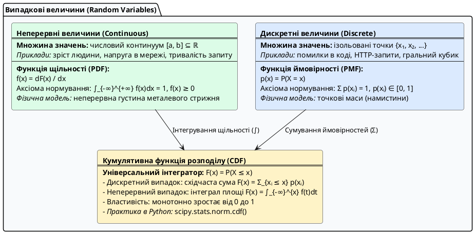
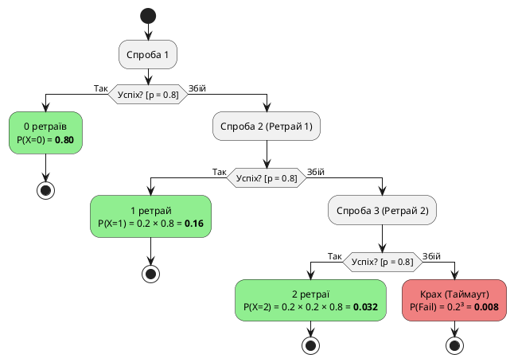

# Розподіли випадкових величин

::card-group

::card{title="🎯 Мета підтеми" icon="i-lucide-target"}

- Зрозуміти, що таке розподіл випадкової величини
- Опанувати три ключові розподіли: рівномірний, нормальний, Пуассона
- Навчитися розпізнавати розподіли в реальних даних
- Генерувати синтетичні дані з різними розподілами
- Побачити зв'язок між розподілами та алгоритмами ML

::

::card{title="🔑 Ключові терміни" icon="i-lucide-key"}

- **Розподіл** (*distribution*) — правило, за яким випадкова величина набуває значень
- **Функція щільності ймовірності** (*PDF*) — для неперервних величин
- **Функція ймовірності** (*PMF*) — для дискретних величин
- **Нормальний розподіл** (*normal/Gaussian*) — дзвоноподібна крива, найпоширеніший у природі
- **Правило 68-95-99.7** — емпіричне правило для нормального розподілу

::

::

---

## Навіщо передбачати завтра, коли є вчора?

Уявіть: ви власник кав'ярні. Щоранку потрібно замовляти молоко. Замало — залишите клієнтів без кави. Забагато — молоко скисне.

Ви вирішуєте вивчити історію. Записуєте, скільки літрів молока витрачається щодня протягом 100 днів. Отримуєте масив чисел:

```python
[42, 38, 45, 41, 43, 39, 44, 40, 42, 41, ...]
```

Тепер питання: **скільки замовити завтра?** Середнє — 41.5 літра. Але чи достатньо знати лише середнє?

Ні. Вам потрібно знати **розподіл** — як часто трапляються різні значення:
- Чи майже завжди витрачається 40–43 літри (стабільно)?
- Чи бувають різкі стрибки до 50–60 літрів (непередбачувано)?
- Чи є дні з мінімальним споживанням 30–35 літрів (вихідні)?

**Розподіл** дає вам повну картину, а не лише одну цифру (середнє).

::jupyter-notebook{title="coffee_shop_distribution.ipynb" kernel="Python 3 (ipykernel)"}

::jupyter-cell{type="markdown"}
### Аналіз споживання молока за 100 днів
::

::jupyter-cell{executionCount="1"}
```python
import numpy as np
import matplotlib.pyplot as plt

rng = np.random.default_rng(seed=42)

# Симулюємо споживання молока (нормальний розподіл)
milk_consumption = rng.normal(loc=41.5, scale=3.5, size=100)
milk_consumption = np.clip(milk_consumption, 30, 55)  # реалістичні межі

# Статистика
mean = milk_consumption.mean()
std = milk_consumption.std()

print(f"Середнє споживання: {mean:.1f} літрів")
print(f"Стандартне відхилення: {std:.1f} літрів")
print(f"\nПередбачення на завтра:")
print(f"  З ймовірністю 68%: {mean - std:.1f} — {mean + std:.1f} літрів")
print(f"  З ймовірністю 95%: {mean - 2*std:.1f} — {mean + 2*std:.1f} літрів")

# Візуалізація розподілу
plt.figure(figsize=(10, 5))
plt.hist(milk_consumption, bins=15, edgecolor='black', alpha=0.7, color='steelblue')
plt.axvline(mean, color='red', linestyle='--', linewidth=2, label=f'Середнє = {mean:.1f}')
plt.axvline(mean - std, color='orange', linestyle='--', linewidth=1.5, label=f'±1σ ({mean-std:.1f} — {mean+std:.1f})')
plt.axvline(mean + std, color='orange', linestyle='--', linewidth=1.5)
plt.xlabel('Споживання молока (літри)')
plt.ylabel('Частота (кількість днів)')
plt.title('Розподіл споживання молока за 100 днів', fontweight='bold')
plt.legend()
plt.grid(alpha=0.3)
plt.show()
```

#output
{.diagram-img}

```
Середнє споживання: 41.3 літрів
Стандартне відхилення: 2.7 літрів

Передбачення на завтра:
  З ймовірністю 68%: 38.6 — 44.0 літрів
  З ймовірністю 95%: 35.9 — 46.7 літрів
```
::

::

Тепер ви володієте інженерним розрахунком:
- Якщо замовите **44.0 літри** (:math-formula{tex="\approx \mu + 1\sigma" inline}), ви повністю задовольните попит у **~84.1% днів** (50% днів із попитом нижче середнього плюс 34.1% днів у межах від :math-formula{tex="\mu" inline} до :math-formula{tex="\mu + 1\sigma" inline}).
- Якщо ж бізнес вимагає надійності **95%** (ризик нестачі лише в 5% випадків), вам потрібен односторонній квантиль: :math-formula{tex="\mu + 1.645\sigma \approx 45.7" inline} літра. Замовлення ж **46.7 літрів** (:math-formula{tex="\mu + 2\sigma" inline}) гарантує покриття аж у **~97.7% днів**, оскільки лівий хвіст у 2.3% — це дні із заниженим споживанням, де молока гарантовано вистачить із надлишком.

> **Аналогія:** Розподіл — це як високоточний прогноз погоди. Недостатньо знати лише «середня температура +15°C». Вам потрібен **діапазон ймовірностей**: «з ймовірністю 70% буде +12–18°C, з ймовірністю 95% — +8–22°C». Тільки це дозволяє прийняти зважене рішення: чи вдягати тепле пальто, чи брати парасольку.

---

## Що таке розподіл випадкової величини?

**Розподіл випадкової величини** (*probability distribution*) — це фундаментальний математичний закон, що однозначно описує множину всіх можливих значень випадкової величини та визначає ймовірності їх появи.

Якщо у попередніх темах ми аналізували лише точкові характеристики датасету — міри центральної тенденції (де зосереджений центр) та міри варіації (наскільки розкидані дані), — то **розподіл дає вичерпну інформацію про природу досліджуваного процесу**:
- Які діапазони значень є найбільш типовими та формують локальні піки ймовірності;
- Чи є форма розсіювання симетричною або ж спостерігається асиметрія (скошеність) із довгими хвостами рідкісних аномалій;
- Яка точна математична ймовірність виходу показників за критичні межі SLA чи виникнення технічного збою;
- Як саме поводитиметься модель машинного навчання при масштабуванні вхідних даних на реальному продакшені.

Залежно від фізичної природи досліджуваної величини (дискретна вона чи неперервна), у математичній статистиці застосовують два принципово різні аналітичні інструменти: **функцію ймовірності (PMF)** або **функцію щільності ймовірності (PDF)**. Єдиним же універсальним містком між обома світами виступає **кумулятивна функція розподілу (CDF)**.

::plant-uml{alt="Таксономія та математичний апарат розподілів випадкових величин"}



::

---

### Дискретні величини та функція ймовірності (PMF)

Для дискретних випадкових величин множина значень є лічильною: це окремі, строго ізольовані точки числової осі (наприклад: кількість помилок у логах `0, 1, 2, ...`, статус транзакції `0` або `1`, або кількість повторних спроб HTTP-запиту).

**Функція ймовірності** (*Probability Mass Function*, **PMF**) ставить у пряму відповідність кожному конкретному можливому значенню :math-formula{tex="x" inline} точну ймовірність того, що випадкова величина набуде саме цього числа.

::math-formula
p(x) = P(X = x)
::

#### Анатомія формули: розбір позначень

- **:math-formula{tex="X" inline} (велика літера):** Сама випадкова величина як абстрактна математична сутність (генератор випадковості, експеримент, досліджуваний процес). Наприклад, «кількість невдалих спроб авторизації користувача».
- **:math-formula{tex="x" inline} або :math-formula{tex="x_i" inline} (маленька літера):** Конкретне чисельне значення (реалізація, результат експерименту), яке може випасти. Наприклад, :math-formula{tex="x = 2" inline}.
- **:math-formula{tex="P(X = x)" inline}:** Ймовірність настання цієї конкретної чисельної події (число в діапазоні від :math-formula{tex="0" inline} до :math-formula{tex="1" inline}).
- **Чому саме «Mass» (маса)?** Термін запозичено з фізики: уся ймовірність (:math-formula{tex="1.0" inline} або 100%) сконцентрована не у вигляді неперервного поля, а зосереджена у вигляді точкових «масивних часток» (квантів) у фіксованих координатах :math-formula{tex="x_i" inline}.

#### Що можна порахувати за допомогою PMF?

Знаючи функцію :math-formula{tex="p(x)" inline}, ми отримуємо повний математичний опис процесу і можемо знайти його ключові моменти:

1. **Математичне сподівання (теоретичне середнє, центр тяжіння мас):**
   ::math-formula
   \mathbb{E}[X] = \mu = \sum_{i} x_i \cdot P(X = x_i)
   ::
   Кожне можливе значення :math-formula{tex="x_i" inline} зважується на його ймовірність (вагу).

2. **Дисперсія (міра розкиду точкових мас навколо центру):**
   ::math-formula
   \text{Var}(X) = \sigma^2 = \sum_{i} (x_i - \mu)^2 \cdot P(X = x_i)
   ::

#### Аксіоми та фундаментальні властивості PMF

1. **Неприпустимість від'ємності та одинична межа:** Ймовірність кожного значення лежить строго в межах одиничного інтервалу:
   ::math-formula
   0 \leq P(X = x_i) \leq 1 \quad \forall i
   ::
2. **Повна ймовірність (умова нормування):** Оскільки випадкова величина гарантовано набуде одного з можливих значень простору подій, сума всіх точкових ймовірностей завжди суворо дорівнює одиниці:
   ::math-formula
   \sum_{i} P(X = x_i) = 1
   ::

> **Фізична аналогія точкових мас:** Уявіть невагому струну, на яку нанизано важкі металеві кульки (намистини) у точках :math-formula{tex="x_1, x_2, \dots" inline}. Вага кожної кульки — це її ймовірність :math-formula{tex="P(X = x_i)" inline}. Ви можете зняти будь-яку конкретну намистину і безпосередньо зважити її на вагах, а сумарна вага всіх намистин становить строго 1 кг (100% маси ймовірності).

#### Як народжується PMF? Простий приклад «на пальцях» (Перебір усіх комбінацій)

Найпростіший і найбільш наочний спосіб зрозуміти, як виникає функція ймовірності — виписати **абсолютно всі можливі комбінації**, які взагалі можуть статися в досліді.

Уявімо найпростішу життєву ситуацію: ми **підкидаємо дві звичайні монети** (або одну монету двічі поспіль). Кожна монета має дві сторони: **«Герб» (Г)** або **«Число / Решка» (Ч)**. Шанс випадання кожної сторони однаковий — 50/50.

Нехай випадкова величина :math-formula{tex="X" inline} — **«загальна кількість випадань Герба»**. 

Які значення взагалі може прийняти :math-formula{tex="X" inline}? 
Логічно, що Герб може не випасти взагалі (:math-formula{tex="X = 0" inline}), випасти один раз (:math-formula{tex="X = 1" inline}) або випасти на обох монетах (:math-formula{tex="X = 2" inline}).

> **Поширена пастка мислення початківців:** Часто студенти міркують так: *«У нас є лише три можливі результати: 0, 1 або 2 герби. Значить, кожен із них має однаковий шанс — по одній третині :math-formula{tex="(\frac{1}{3} \approx 33.3\%)" inline}?»*  
> **Відповідь: Категорично ні!** Значень справді три, але **кількість шляхів** до кожного значення зовсім різна.

Щоб дізнатися справжні ймовірності, випишемо повний простір елементарних комбінацій (:math-formula{tex="\Omega" inline}):

| Комбінація (Монета 1, Монета 2) | Що випало на практиці? | Кількість гербів :math-formula{tex="X" inline} |
| :---: | :--- | :---: |
| **(Ч, Ч)** | На обох монетах випало число | :math-formula{tex="X = 0" inline} |
| **(Ч, Г)** | Перша монета — число, друга — герб | :math-formula{tex="X = 1" inline} |
| **(Г, Ч)** | Перша монета — герб, друга — число | :math-formula{tex="X = 1" inline} |
| **(Г, Г)** | Обидві монети випали гербом догори | :math-formula{tex="X = 2" inline} |

Як бачимо, фізично існує рівно **4 рівноможливі наслідки**. Оскільки монети чесні й симетричні, кожна конкретна пара має ймовірність :math-formula{tex="\frac{1}{4} = 0.25" inline} (25%).

Тепер порахуємо ймовірність для кожного значення :math-formula{tex="X" inline}, просто підсумовуючи сприятливі комбінації:

1. **:math-formula{tex="P(X = 0)" inline} (нуль гербів):**  
   Цьому відповідає лише **1 комбінація** з 4 можливих — `(Ч, Ч)`:
   ::math-formula
   P(X = 0) = \frac{1}{4} = 0.25 \, (25\%)
   ::

2. **:math-formula{tex="P(X = 1)" inline} (рівно один герб):**  
   Цьому відповідають одразу **2 різні комбінації** з 4 — `(Ч, Г)` та `(Г, Ч)`:
   ::math-formula
   P(X = 1) = \frac{1}{4} + \frac{1}{4} = \frac{2}{4} = 0.50 \, (50\%)
   ::
   *Ось де розгадка:* Результат :math-formula{tex="X = 1" inline} з'являється **вдвічі частіше**, тому що до нього ведуть два незалежні сценарії (герб може випасти першим, або другим)!

3. **:math-formula{tex="P(X = 2)" inline} (два герби):**  
   Цьому відповідає лише **1 комбінація** з 4 — `(Г, Г)`:
   ::math-formula
   P(X = 2) = \frac{1}{4} = 0.25 \, (25\%)
   ::

Зведемо результати в підсумкову таблицю закону розподілу ймовірностей (PMF):

| Кількість гербів :math-formula{tex="x_i" inline} | Комбінації, що сюди ведуть | Ймовірність :math-formula{tex="P(X = x_i)" inline} | Внесок у середнє :math-formula{tex="x_i \cdot P(X = x_i)" inline} |
| :---: | :--- | :---: | :---: |
| **0** | 1 варіант: `(Ч, Ч)` | :math-formula{tex="0.25" inline} (25%) | :math-formula{tex="0 \times 0.25 = 0.00" inline} |
| **1** | 2 варіанти: `(Ч, Г)` або `(Г, Ч)` | :math-formula{tex="0.50" inline} (50%) | :math-formula{tex="1 \times 0.50 = 0.50" inline} |
| **2** | 1 варіант: `(Г, Г)` | :math-formula{tex="0.25" inline} (25%) | :math-formula{tex="2 \times 0.25 = 0.50" inline} |
| **Сума** | **Усі 4 можливі варіанти враховано** | **1.00 (100%)** | **:math-formula{tex="\mathbb{E}[X] = 1.00" inline}** |

**Головні висновки:**
- **Нормування:** Сума ймовірностей у таблиці :math-formula{tex="0.25 + 0.50 + 0.25 = 1.00" inline} (100%). Жоден можливий випадок не загубився.
- **Математичне сподівання (середнє очікуване):** :math-formula{tex="\mathbb{E}[X] = 1.00" inline}. Якщо повторити експеримент 1000 разів, у середньому ми отримуватимемо рівно 1 герб за два кидки.
- **Чому це важливо:** Будь-який складний дискретний розподіл у програмуванні чи науці про дані будується саме за цим фундаментальним принципом: ми з'ясовуємо, скільки шляхів веде до кожного результату, і знаходимо сумарну вагу цих шляхів.

---

#### Інженерний приклад: Виведення ймовірностей ретраїв через дерево подій

А як бути, якщо ймовірності окремих кроків неоднакові? Розглянемо реальну поведінку клієнта, що надсилає запит до зовнішнього платіжного шлюзу.

Припустимо:
- Кожен окремий запит проходить успішно з імовірністю :math-formula{tex="p = 0.8" inline} (80%);
- Запит зазнає збою (таймаут) з імовірністю :math-formula{tex="q = 1 - p = 0.2" inline} (20%);
- Клієнт робить максимум **3 спроби** (до 2 ретраїв): якщо всі 3 спроби провалюються, операція завершується повною помилкою.

Нехай випадкова величина :math-formula{tex="X" inline} — **«кількість повторних спроб (ретраїв)»**. Можливі наслідки: :math-formula{tex="0, 1, 2" inline} або повна відмова (Timeout).

Погляньмо на дерево прийняття рішень:

::plant-uml{alt="Дерево ймовірностей послідовних спроб відправки запиту"}



::

Виведемо ймовірність кожного результату крок за кроком за правилом множення незалежних подій:

1. **:math-formula{tex="X = 0" inline} (0 ретраїв — успіх з першої спроби):**  
   Запит пройшов одразу:
   ::math-formula
   P(X = 0) = 0.80 \, (80\%)
   ::
2. **:math-formula{tex="X = 1" inline} (1 ретрай — спочатку збій, потім успіх):**  
   Перша спроба провалилася (0.2), а друга була успішною (0.8):
   ::math-formula
   P(X = 1) = 0.2 \times 0.8 = 0.16 \, (16\%)
   ::
3. **:math-formula{tex="X = 2" inline} (2 ретраї — два збої поспіль, потім успіх):**  
   Перша і друга спроби провалилися (:math-formula{tex="0.2 \times 0.2" inline}), а третя пройшла (0.8):
   ::math-formula
   P(X = 2) = 0.2 \times 0.2 \times 0.8 = 0.032 \, (3.2\%)
   ::
4. **Повна відмова (усі 3 спроби зазнали краху):**  
   Три послідовні збої:
   ::math-formula
   P(\text{Fail}) = 0.2 \times 0.2 \times 0.2 = 0.008 \, (0.8\%)
   ::

Зведемо розраховані значення в підсумкову таблицю PMF:

| Кількість ретраїв :math-formula{tex="x_i" inline} | Математичний ланцюжок | Ймовірність :math-formula{tex="P(X = x_i)" inline} | Внесок у середнє :math-formula{tex="x_i \cdot P(X = x_i)" inline} |
| :---: | :--- | :---: | :---: |
| **0** | `[Успіх]` | :math-formula{tex="0.800" inline} (80.0%) | :math-formula{tex="0 \times 0.800 = 0.000" inline} |
| **1** | `[Збій] × [Успіх]` | :math-formula{tex="0.160" inline} (16.0%) | :math-formula{tex="1 \times 0.160 = 0.160" inline} |
| **2** | `[Збій] × [Збій] × [Успіх]` | :math-formula{tex="0.032" inline} (3.2%) | :math-formula{tex="2 \times 0.032 = 0.064" inline} |
| **3 (Fail)** | `[Збій] × [Збій] × [Збій]` | :math-formula{tex="0.008" inline} (0.8%) | :math-formula{tex="3 \times 0.008 = 0.024" inline} |
| **Сума** | **Повний простір усіх гілок дерева** | **1.000 (100%)** | **:math-formula{tex="\mathbb{E}[X] = 0.248" inline}** |

**Висновки для інженера:**
- **Перевірка суми:** :math-formula{tex="0.800 + 0.160 + 0.032 + 0.008 = 1.000" inline}. Усі гілки дерева враховані, сума строго дорівнює 1.
- **Очікувана середня кількість ретраїв:** :math-formula{tex="\mathbb{E}[X] = 0.248" inline} ретрая на 1 транзакцію. Тобто на 10 000 клієнтських платежів система згенерує лише близько :math-formula{tex="10\,000 \times 0.248 = 2\,480" inline} додаткових повторних запитів.

---

### Неперервні величини та функція щільності (PDF)

Неперервні випадкові величини здатні приймати будь-яке дійсне значення всередині певного неперервного інтервалу або на всій числовій прямій :math-formula{tex="\mathbb{R}" inline} (наприклад: точний час відповіді API у мілісекундах, споживання оперативної пам'яті контейнером або вага товару).

У неперервному континуумі діє фундаментальний і контрінтуїтивний парадокс: **ймовірність будь-якого конкретного фіксованого значення строго дорівнює нулю**:

::math-formula
P(X = 42.12593847\dots \text{ мс}) = 0
::

**Чому так відбувається?** Навіть на найвужчому відрізку числової осі (наприклад, між 42 і 43 мс) міститься нескінченна незліченна кількість дійсних чисел. Якщо поділити одиницю (100% сумарної ймовірності) на нескінченність (:math-formula{tex="\frac{1}{\infty}" inline}), то частка окремо взятої точки перетворюється на нескінченно малу величину.

Саме тому для неперервних процесів оцінюють не ймовірність окремої точки, а **густину (щільність) ймовірності** навколо неї.

**Функція щільності ймовірності** (*Probability Density Function*, **PDF**), що позначається як :math-formula{tex="f(x)" inline}, визначається як границя відношення ймовірності потрапляння в малий окіл до ширини цього самого околу :math-formula{tex="\Delta x" inline}:

::math-formula
f(x) = \lim_{\Delta x \to 0} \frac{P(x \leq X \leq x + \Delta x)}{\Delta x}
::

#### Анатомія формули та геометричний зміст інтегрування

1. **Розмірність щільності :math-formula{tex="f(x)" inline}:**  
   Чисельник :math-formula{tex="P(\dots)" inline} — це безрозмірна ймовірність (частка від 0 до 1). Знаменник :math-formula{tex="\Delta x" inline} — це фізична одиниця вимірювання досліджуваної величини (наприклад, мілісекунди або гігабайти). Тому значення :math-formula{tex="f(x)" inline} вимірюється в одиницях виду :math-formula{tex="\frac{1}{\text{мс}}" inline} або :math-formula{tex="\frac{1}{\text{ГБ}}" inline}. Це саме **густина ймовірності на одиницю шкали**!

2. **Формула розрахунку ймовірностей через площу (визначений інтеграл):**  
   Ймовірність потрапляння випадкової величини в діапазон від :math-formula{tex="a" inline} до :math-formula{tex="b" inline} дорівнює площі під графіком функції щільності :math-formula{tex="f(x)" inline}:
   ::math-formula
   P(a \leq X \leq b) = \int_{a}^{b} f(x) \, dx
   ::
   У цьому інтегралі:
   - :math-formula{tex="f(x)" inline} — висота нескінченно вузького стовпчика криволінійної трапеції;
   - :math-formula{tex="dx" inline} — його нескінченно мала основа (диференціал);
   - :math-formula{tex="f(x) \cdot dx \approx dP" inline} — елементарна площа прямокутника, яка й дорівнює елементарній ймовірності;
   - Знак :math-formula{tex="\int_{a}^{b}" inline} — неперервне підсумовування всіх цих мікроплощ від точки :math-formula{tex="a" inline} до точки :math-formula{tex="b" inline}.

#### Аксіоми PDF:

1. **Невід'ємність щільності:** :math-formula{tex="f(x) \geq 0" inline} для всіх :math-formula{tex="x" inline}.
2. **Умова повної площі:** Повна площа під усією нескінченною кривою від :math-formula{tex="-\infty" inline} до :math-formula{tex="+\infty" inline} суворо дорівнює 1 (100% ймовірності):
   ::math-formula
   \int_{-\infty}^{+\infty} f(x) \, dx = 1
   ::

::warning{title="Головна пастка: висота кривої f(x) — це НЕ ймовірність!"}
Значення функції щільності :math-formula{tex="f(x)" inline} **може бути значно більшим за 1.0**.

Наприклад, якщо затримка відгуку мікросервісу розподілена рівномірно на інтервалі від 0 до 0.05 секунди, то висота щільності становить:
::math-formula
f(x) = \frac{1}{0.05 - 0} = 20.0 \, \text{с}^{-1}
::
Число 20.0 — це не ймовірність 2000%, а густина! Повна площа при цьому дорівнює:
::math-formula
\text{Площа} = 20.0 \times 0.05 = 1.00 \, (100\%)
::
Одиницею завжди обмежена виключно **площа під кривою**, але не висота її ординати.
::

> **Фізична аналогія густини металевого стрижня:**  
> Уявіть неоднорідний металевий стрижень завдовжки 1 метр із загальною масою 1 кг. Якщо ми візьмемо нескінченно тонку математичну точку (наприклад, позначку рівно :math-formula{tex="x = 42" inline} см), її маса дорівнює строго 0 грамів (товщина нульова). Але матеріал у цьому місці має конкретну густину :math-formula{tex="\rho(x)" inline}. Якщо відрізати реальний шматок від 40 см до 50 см, інтеграл густини :math-formula{tex="\int_{40}^{50} \rho(x) dx" inline} дасть відчутну фізичну вагу цього відрізка.

#### Покроковий приклад розрахунку з інтегруванням

Припустимо, що час обробки транзакції :math-formula{tex="X" inline} (у секундах) локальним сервісом описується лінійно спадною щільністю на відрізку від :math-formula{tex="0" inline} до :math-formula{tex="2" inline} секунд (поза цим інтервалом :math-formula{tex="f(x) = 0" inline}):
::math-formula
f(x) = 1 - 0.5x, \quad 0 \leq x \leq 2
::

1. **Крок 1: Перевіримо умову повної площі (нормування):**
   ::math-formula
   \int_{0}^{2} (1 - 0.5x) \, dx = \left[ x - \frac{0.5x^2}{2} \right]_{0}^{2} = \left[ x - 0.25x^2 \right]_{0}^{2} = (2 - 0.25 \times 4) - 0 = 2 - 1 = 1.00
   ::
   Умова нормування виконана: повна площа дорівнює 100%.

2. **Крок 2: Знайдемо ймовірність того, що транзакція завершиться швидше ніж за 1 секунду:**  
   Обчислюємо площу під кривою від :math-formula{tex="0" inline} до :math-formula{tex="1" inline}:
   ::math-formula
   P(0 \leq X \leq 1) = \int_{0}^{1} (1 - 0.5x) \, dx = \left[ x - 0.25x^2 \right]_{0}^{1} = (1 - 0.25) - 0 = 0.75 \, (75\%)
   ::
   Отже, з імовірністю 75% запит виконається менш ніж за 1 секунду.

---

### Кумулятивна функція розподілу (CDF): універсальний міст

І для дискретних, і для неперервних величин існує універсальний спільний опис — **кумулятивна функція розподілу** (*Cumulative Distribution Function*, **CDF**), яка завжди позначається великою літерою :math-formula{tex="F(x)" inline}.

Вона показує сумарну накопичену ймовірність того, що випадкова величина виявиться **меншою або рівною** заданому пороговому числу :math-formula{tex="x" inline}:

::math-formula
F(x) = P(X \leq x)
::

#### Анатомія та математичні властивості CDF

1. **Область значень:** Оскільки це ймовірність, значення :math-formula{tex="F(x)" inline} завжди лежить строго в межах від :math-formula{tex="0" inline} до :math-formula{tex="1" inline}.
2. **Границі на нескінченностях:**
   - :math-formula{tex="\lim_{x \to -\infty} F(x) = 0" inline} (до настання будь-яких подій накопичена ймовірність дорівнює нулю);
   - :math-formula{tex="\lim_{x \to +\infty} F(x) = 1" inline} (коли враховано всі можливі значення, накопичено 100% імовірності).
3. **Монотонність:** :math-formula{tex="F(x)" inline} є неспадною функцією. Якщо поріг зростає (:math-formula{tex="x_1 \leq x_2" inline}), накопичена ймовірність може тільки зростати або залишатися незмінною: :math-formula{tex="F(x_1) \leq F(x_2)" inline}.

#### Зв'язок із PMF та PDF

- **У дискретному випадку:** це східчаста функція накопиченої суми, яка робить стрибок вгору в кожній точці :math-formula{tex="x_i" inline} на величину її ймовірності :math-formula{tex="P(X = x_i)" inline}:
  ::math-formula
  F(x) = \sum_{x_i \leq x} P(X = x_i)
  ::
- **У неперервному випадку:** це плавна крива накопиченої площі зліва направо, яка пов'язана з PDF через інтегрування та взяття похідної:
  ::math-formula
  F(x) = \int_{-\infty}^{x} f(t) \, dt \quad \Longleftrightarrow \quad f(x) = \frac{d}{dx} F(x)
  ::

#### Чотири головні практичні інструменти CDF

Знаючи CDF, інженеру та аналітику більше не потрібно брати складні інтеграли вручну. Будь-яке практичне бізнес-питання вирішується простими арифметичними операціями:

1. **Ймовірність «не більше ніж поріг :math-formula{tex="x" inline}»:**
   ::math-formula
   P(X \leq x) = F(x)
   ::
2. **Ймовірність «суворо більше ніж поріг :math-formula{tex="x" inline}» (хвіст розподілу, Survival Function):**
   ::math-formula
   P(X > x) = 1 - P(X \leq x) = 1 - F(x)
   ::
   *Застосування:* обчислення ймовірності порушення SLA (Service Level Agreement), якщо допустимий ліміт часу відгуку перевищено.
3. **Ймовірність потрапляння в довільний інтервал :math-formula{tex="[a, b]" inline}:**
   ::math-formula
   P(a \leq X \leq b) = F(b) - F(a)
   ::
   *Застосування:* базова функція у бібліотеці `scipy.stats`: виклик `dist.cdf(b) - dist.cdf(a)` миттєво повертає точну площу між двома межами.
4. **Квантилі та персентилі (обернена функція :math-formula{tex="F^{-1}(p)" inline}):**  
   Якщо ми знаємо бажану ймовірність :math-formula{tex="p" inline} (наприклад, :math-formula{tex="p = 0.99" inline} для 99-го персентиля затримок p99), обернена функція знаходить порогове значення :math-formula{tex="x" inline}, для якого накопичено цю ймовірність:
   ::math-formula
   x_p = F^{-1}(p)
   ::
   У `scipy.stats` цей метод називається **PPF** (*Percent Point Function*): `dist.ppf(0.99)`.

#### Покроковий чисельний приклад розрахунку через CDF

Візьмемо попередній приклад із затримкою транзакцій, де :math-formula{tex="f(x) = 1 - 0.5x" inline} на :math-formula{tex="[0, 2]" inline}.

Знайдемо аналітичний вигляд :math-formula{tex="F(x)" inline} шляхом інтегрування від :math-formula{tex="0" inline} до :math-formula{tex="x" inline}:
::math-formula
F(x) = \int_{0}^{x} (1 - 0.5t) \, dt = x - 0.25x^2, \quad 0 \leq x \leq 2
::

Тепер розв'яжемо практичні задачі без інтегрування:
- **Питання 1:** Яка ймовірність, що транзакція триватиме від :math-formula{tex="0.5" inline} до :math-formula{tex="1.5" inline} секунди?
  ::math-formula
  F(1.5) = 1.5 - 0.25 \times (1.5)^2 = 1.5 - 0.25 \times 2.25 = 1.5 - 0.5625 = 0.9375
  ::
  ::math-formula
  F(0.5) = 0.5 - 0.25 \times (0.5)^2 = 0.5 - 0.25 \times 0.25 = 0.5 - 0.0625 = 0.4375
  ::
  ::math-formula
  P(0.5 \leq X \leq 1.5) = F(1.5) - F(0.5) = 0.9375 - 0.4375 = 0.5000 \, (50\%)
  ::
- **Питання 2:** Яка ймовірність порушення регламенту, якщо допустимий ліміт становить :math-formula{tex="1.5" inline} секунди?
  ::math-formula
  P(X > 1.5) = 1 - F(1.5) = 1 - 0.9375 = 0.0625 \, (6.25\%)
  ::

---

### Візуальне порівняння: PMF проти PDF

Проілюструємо принципову різницю між точковою масою дискретного процесу та щільністю площі неперервної величини на реалістичних даних у Python:

::jupyter-notebook{title="pmf_vs_pdf.ipynb" kernel="Python 3 (ipykernel)"}

::jupyter-cell{type="markdown"}
### Порівняння PMF (дискретна величина) та PDF (неперервна величина)
::

::jupyter-cell{executionCount="1"}
```python
import numpy as np
import matplotlib.pyplot as plt
from scipy import stats

fig, (ax1, ax2) = plt.subplots(1, 2, figsize=(14, 5))

# Графік 1: PMF для суми очок двох кубиків (дискретна величина)
dice_sums = []
for i in range(1, 7):
    for j in range(1, 7):
        dice_sums.append(i + j)

values, counts = np.unique(dice_sums, return_counts=True)
probabilities = counts / len(dice_sums)

ax1.bar(values, probabilities, edgecolor='black', color='steelblue', alpha=0.7)
ax1.set_title('PMF: Сума двох кубиків (дискретна)', fontweight='bold', fontsize=12)
ax1.set_xlabel('Сума очок', fontsize=11)
ax1.set_ylabel('Ймовірність P(X = x)', fontsize=11)
ax1.set_xticks(values)
ax1.grid(axis='y', alpha=0.3)

# Графік 2: PDF для зросту дорослих чоловіків (неперервна величина: μ=175 см, σ=7 см)
x = np.linspace(150, 200, 1000)
pdf = stats.norm.pdf(x, loc=175, scale=7)

ax2.plot(x, pdf, color='coral', linewidth=2)
ax2.fill_between(x, pdf, alpha=0.3, color='coral')
ax2.set_title('PDF: Зріст дорослих людей (неперервна)', fontweight='bold', fontsize=12)
ax2.set_xlabel('Зріст (см)', fontsize=11)
ax2.set_ylabel('Щільність ймовірності', fontsize=11)
ax2.grid(alpha=0.3)

# Позначимо діапазон ймовірності P(170 ≤ X ≤ 180) через інтеграл площі
mask = (x >= 170) & (x <= 180)
ax2.fill_between(x[mask], pdf[mask], alpha=0.6, color='green', label='P(170 ≤ Зріст ≤ 180)')
ax2.legend()

plt.tight_layout()
plt.show()

print("PMF (дискретна):")
print("  Кожен стовпець = точна ймовірність конкретного значення")
print("  Сума висот усіх стовпців = 1.0 (100%)")
print("\nPDF (неперервна):")
print("  Висота кривої f(x) = щільність ймовірності (може бути > 1)")
print("  Ймовірність = площа під кривою на інтервалі P(a ≤ X ≤ b)")
prob_range = stats.norm.cdf(180, 175, 7) - stats.norm.cdf(170, 175, 7)
print(f"  P(170 ≤ зріст ≤ 180) = {prob_range:.3f} (зелена площа під кривою)")
```

#output
{.diagram-img}

```
PMF (дискретна):
  Кожен стовпець = точна ймовірність конкретного значення
  Сума висот усіх стовпців = 1.0 (100%)

PDF (неперервна):
  Висота кривої f(x) = щільність ймовірності (може бути > 1)
  Ймовірність = площа під кривою на інтервалі P(a ≤ X ≤ b)
  P(170 ≤ зріст ≤ 180) = 0.525 (зелена площа під кривою)
```
::

::

::note
**Підсумкові інженерні властивості розподілів:**
1. **Усі ймовірності та значення щільності строго невід'ємні:** :math-formula{tex="p(x) \geq 0" inline} та :math-formula{tex="f(x) \geq 0" inline}.
2. **Універсальна сума становить 100%:** Сума стовпців PMF або повний визначений інтеграл PDF на проміжку :math-formula{tex="(-\infty, +\infty)" inline} строго дорівнює **1.0**.
3. **Розрахунок інтервалів:** У неперервному випадку ймовірність точки дорівнює 0, тому границі інтервалу не змінюють його ймовірність: :math-formula{tex="P(a \leq X \leq b) = P(a < X < b) = F(b) - F(a)" inline}.
::


---

## Рівномірний розподіл (Uniform Distribution)

**Рівномірний розподіл** (*uniform distribution*) — це розподіл, у якому **всі значення в діапазоні рівноймовірні**. Немає «улюблених» чи «рідкісних» значень — кожне має однакову ймовірність.

> Аналогія: Рівномірний розподіл — це як ідеальна рулетка з нескінченною кількістю секторів. Кожна точка на колі має однакову ймовірність. Немає «гарячих» чи «холодних» зон.

### Дискретний рівномірний розподіл

Найпростіший приклад — кидок чесного кубика. Кожна грань (1, 2, 3, 4, 5, 6) випадає з однаковою ймовірністю 1/6 ≈ 0.167.

::jupyter-notebook{title="discrete_uniform.ipynb" kernel="Python 3 (ipykernel)"}

::jupyter-cell{type="markdown"}
### Дискретний рівномірний: симуляція 1000 кидків кубика
::

::jupyter-cell{executionCount="1"}
```python
import numpy as np
import matplotlib.pyplot as plt

rng = np.random.default_rng(seed=42)

# Симулюємо 1000 кидків кубика
rolls = rng.integers(1, 7, size=1000)

# Підрахунок частот
values, counts = np.unique(rolls, return_counts=True)
frequencies = counts / len(rolls)

# Візуалізація
plt.figure(figsize=(8, 5))
plt.bar(values, frequencies, edgecolor='black', color='steelblue', alpha=0.7)
plt.axhline(1/6, color='red', linestyle='--', linewidth=2, label='Теоретична ймовірність (1/6 ≈ 0.167)')
plt.xlabel('Результат кидка')
plt.ylabel('Частота (емпірична ймовірність)')
plt.title('Дискретний рівномірний розподіл: 1000 кидків кубика', fontweight='bold')
plt.xticks(values)
plt.ylim(0, 0.25)
plt.legend()
plt.grid(axis='y', alpha=0.3)
plt.show()

print("Частоти кожної грані:")
for v, f in zip(values, frequencies):
    diff = (f - 1/6) * 100
    print(f"  {v}: {f:.3f} (відхилення від теорії: {diff:+.1f}%)")
```

#output
{.diagram-img}

```
Частоти кожної грані:
  1: 0.182 (відхилення від теорії: +1.5%)
  2: 0.152 (відхилення від теорії: -1.5%)
  3: 0.157 (відхилення від теорії: -1.0%)
  4: 0.173 (відхилення від теорії: +0.6%)
  5: 0.177 (відхилення від теорії: +1.0%)
  6: 0.159 (відхилення від теорії: -0.8%)
```
::

::

#### Властивості та анатомія формул дискретного рівномірного розподілу

Якщо випадкова величина :math-formula{tex="X" inline} набуває будь-якого цілого значення від :math-formula{tex="a" inline} до :math-formula{tex="b" inline} включно, загальна кількість можливих варіантів дорівнює:
::math-formula
n = b - a + 1
::

1. **Функція ймовірності (PMF):**
   ::math-formula
   P(X = k) = \frac{1}{n} = \frac{1}{b - a + 1}, \quad k \in \{a, a+1, \dots, b\}
   ::
   *Анатомія:* Одиниця (100% сумарної ймовірності) порівну ділиться між усіма :math-formula{tex="n" inline} взаємовиключними наслідками. Жоден результат не має пріоритету (принцип повної байдужості).

2. **Математичне сподівання (центр симетрії):**
   ::math-formula
   \mu = \mathbb{E}[X] = \frac{a + b}{2}
   ::
   *Анатомія:* Через ідеальну симетрію центр ваги лежить рівно посередині між мінімальним значенням :math-formula{tex="a" inline} та максимальним :math-formula{tex="b" inline}. Для кубика (:math-formula{tex="a=1, b=6" inline}): :math-formula{tex="\mu = \frac{1 + 6}{2} = 3.5" inline}.

3. **Дисперсія (розкид навколо центру):**
   ::math-formula
   \sigma^2 = \text{Var}(X) = \frac{n^2 - 1}{12} = \frac{(b - a + 1)^2 - 1}{12}
   ::
   *Звідки береться знаменник 12?* Це результат точного математичного підсумовування квадратів відхилень :math-formula{tex="\sum_{k=1}^n (k - \mu)^2" inline} через формулу суми квадратів послідовних чисел :math-formula{tex="\sum k^2 = \frac{n(n+1)(2n+1)}{6}" inline}. Для 6-гранного кубика (:math-formula{tex="n=6" inline}): :math-formula{tex="\sigma^2 = \frac{36 - 1}{12} = \frac{35}{12} \approx 2.917" inline}, а стандартне відхилення :math-formula{tex="\sigma = \sqrt{2.917} \approx 1.71" inline}.

> **Інженерний приклад: Рандомізований A/B спліттер**  
> Балансувальник трафіку розподіляє користувачів між :math-formula{tex="n = 4" inline} варіантами інтерфейсу (`A = 1, B = 2, C = 3, D = 4`). Кожен користувач із рівною ймовірністю :math-formula{tex="P(X = k) = \frac{1}{4} = 0.25" inline} (25%) потрапляє в одну з тестових когорт. Це гарантує відсутність системного зміщення (bias) в експерименті.

### Неперервний рівномірний розподіл

Для неперервних даних рівномірний розподіл означає, що **кожен інтервал однакової довжини** всередині допустимих меж :math-formula{tex="[a, b]" inline} володіє однаковою ймовірністю.

**Позначення**: :math-formula{tex="X \sim \text{Uniform}(a, b)" inline} або :math-formula{tex="X \sim \mathcal{U}(a, b)" inline}

#### Функція щільності (PDF)

::math-formula
f(x) = \begin{cases}
\frac{1}{b - a}, & a \leq x \leq b \\
0, & \text{інакше}
\end{cases}
::

#### Анатомія формули: чому висота щільності дорівнює :math-formula{tex="\frac{1}{b - a}" inline}?

Графік функції щільності :math-formula{tex="f(x)" inline} являє собою плоский прямокутник з основою завдовжки :math-formula{tex="(b - a)" inline} та постійною висотою :math-formula{tex="h" inline}. За аксіомою нормування повна площа під графіком неперервного розподілу зобов'язана суворо дорівнювати одиниці (100% ймовірності):

::math-formula
\text{Площа} = \text{Основа} \times \text{Висота} = (b - a) \times h = 1 \implies h = \frac{1}{b - a}
::

Отже, що ширший діапазон можливих значень :math-formula{tex="[a, b]" inline}, то нижчою стає щільність :math-formula{tex="f(x)" inline}, розмазуючи ймовірність тоншим шаром.

#### Кумулятивна функція розподілу (CDF)

Шляхом інтегрування константи :math-formula{tex="\frac{1}{b - a}" inline} від лівої межі :math-formula{tex="a" inline} до точки :math-formula{tex="x" inline} отримуємо лінійну функцію накопичення:

::math-formula
F(x) = \begin{cases}
0, & x < a \\
\frac{x - a}{b - a}, & a \leq x \leq b \\
1, & x > b
\end{cases}
::

#### Числові характеристики

- **Математичне сподівання (центр інтервалу):**
  ::math-formula
  \mu = \frac{a + b}{2}
  ::
- **Дисперсія (розкид):**
  ::math-formula
  \sigma^2 = \frac{(b - a)^2}{12}
  ::

#### Покроковий практичний приклад: очікування виконання cron-задачі

Уявіть фонову службу, яка кожні 10 хвилин скидає чергу завдань. Клієнтський запит прибуває у випадковий момент часу. Час очікування початку обробки :math-formula{tex="X" inline} (у хвилинах) розподілений рівномірно на відрізку від 0 до 10 хвилин: :math-formula{tex="X \sim \mathcal{U}(0, 10)" inline}.

- **Параметри:** :math-formula{tex="a = 0" inline}, :math-formula{tex="b = 10" inline}.
- **Функція щільності:** :math-formula{tex="f(x) = \frac{1}{10 - 0} = 0.1 \, \text{хв}^{-1}" inline} для :math-formula{tex="x \in [0, 10]" inline}.
- **Питання:** Яка ймовірність того, що клієнту доведеться чекати від 2 до 5 хвилин?
  ::math-formula
  P(2 \leq X \leq 5) = \int_{2}^{5} 0.1 \, dx = 0.1 \times (5 - 2) = 0.1 \times 3 = 0.30 \, (30\%)
  ::
  Або через формулу CDF:
  ::math-formula
  F(5) - F(2) = \frac{5 - 0}{10} - \frac{2 - 0}{10} = 0.5 - 0.2 = 0.30 \, (30\%)
  ::

::jupyter-notebook{title="continuous_uniform.ipynb" kernel="Python 3 (ipykernel)"}

::jupyter-cell{type="markdown"}
### Неперервний рівномірний розподіл Uniform(0, 10)
::

::jupyter-cell{executionCount="1"}
```python
import numpy as np
import matplotlib.pyplot as plt

rng = np.random.default_rng(seed=42)

# Генеруємо 10000 випадкових чисел від 0 до 10
data = rng.uniform(0, 10, size=10000)

# Візуалізація
plt.figure(figsize=(10, 5))
plt.hist(data, bins=50, edgecolor='black', alpha=0.7, color='coral', density=True)
plt.axhline(1/10, color='red', linestyle='--', linewidth=2, label='Теоретична щільність (1/10 = 0.1)')
plt.xlabel('Значення')
plt.ylabel('Щільність ймовірності')
plt.title('Неперервний рівномірний розподіл: Uniform(0, 10)', fontweight='bold')
plt.xlim(-1, 11)
plt.ylim(0, 0.15)
plt.legend()
plt.grid(alpha=0.3)
plt.show()

# Теоретичні vs емпіричні характеристики
theoretical_mean = (0 + 10) / 2
theoretical_std = (10 - 0) / np.sqrt(12)

print("Порівняння теорії та практики:")
print(f"  Середнє:")
print(f"    Теоретичне: {theoretical_mean:.2f}")
print(f"    Емпіричне:  {data.mean():.2f}")
print(f"  Стандартне відхилення:")
print(f"    Теоретичне: {theoretical_std:.2f}")
print(f"    Емпіричне:  {data.std():.2f}")
```

#output
{.diagram-img}

```
Порівняння теорії та практики:
  Середнє:
    Теоретичне: 5.00
    Емпіричне:  4.97
  Стандартне відхилення:
    Теоретичне: 2.89
    Емпіричне:  2.88
```
::

::

::tip
**Коли використовувати рівномірний розподіл:**
- Моделювання випадкового вибору (lottery, жеребкування)
- Ініціалізація параметрів ML-моделей (випадкові ваги)
- Генерація випадкових тестових даних
- Моделювання подій без переваг (чесна монета, ідеальний кубик)

**Рідко зустрічається в природі** — більшість реальних явищ мають «улюблені» значення (центр розподілу).
::

---

## Нормальний розподіл (Normal / Gaussian Distribution)

**Нормальний розподіл** (також **розподіл Гауса**) — найважливіший розподіл у статистиці та Machine Learning. Його форма — знаменита **дзвоноподібна крива**.

### Чому нормальний розподіл такий важливий?

#### Центральна гранична теорема (Central Limit Theorem, CLT)

Якщо випадкова величина є результатом дії великої кількості незалежних випадкових факторів зі скінченною дисперсією (:math-formula{tex="\sigma^2 < \infty" inline}), то її **сума** (або **середнє арифметичне**) асимптотично прямує до нормального розподілу, **незалежно від того, які початкові розподіли мали окремі доданки**.

> **Аналогія:** Уявіть, що 100 людей кидають монети. Підрахуйте загальну кількість «орлів». Повторіть експеримент 1000 разів. Розподіл цих сум буде ідеально дзвоноподібним, навіть якщо кожна окрема монета має лише два стани (0 або 1).

::note
**Інженерна аналогія: Центральна Гранична Теорема в бекенд-архітектурі**

Чому тривалість виконання складного запиту в розподіленій системі майже завжди підпорядковується нормальному розподілу?
Один запит до бекенду складається з десятків дрібних незалежних операцій:
- Читання секторів із SSD
- Перемикання контексту процесів у ядрі ОС
- Очікування слота в пулі з'єднань бази даних
- Збирання сміття в рантаймі (Garbage Collection pause)
- Десеріалізація JSON-пейлоада

Кожна окрема затримка може мати ненормальний розподіл (рівномірний, пуассонівський чи біноміальний). Але їхня **сума** згідно з Центральною Граничною Теоремою неминуче формує класичний дзвоноподібний нормальний розподіл.
::

#### Природність походження

Більшість неперервних процесів у фізичному світі та суспільстві природно наближаються до нормального закону:
- Фізіологічні параметри (зріст дорослих чоловіків: :math-formula{tex="\mu \approx 175" inline} см, :math-formula{tex="\sigma \approx 7" inline} см);
- Похибки прецизійних вимірювальних приладів та сенсорів;
- Стандартизовані психометричні тести (калібровані під :math-formula{tex="\mu = 100" inline}, :math-formula{tex="\sigma = 15" inline});
- Шум у сенсорах камер та аналогових радіоканалах.

#### Аналітична зручність для ML

Нормальний розподіл володіє чудовими математичними властивостями (диференційовність, симетрія, аналітична замкненість при лінійних перетвореннях). Більшість класичних статистичних критеріїв, моделей лінійної регресії (OLS) та алгоритмів оптимізації безпосередньо спираються на припущення гаусовості залишків.

### Параметри нормального розподілу

Нормальний розподіл **повністю визначається** двома параметрами:

- **μ** (мю) — **математичне сподівання** (середнє значення), визначає положення центру дзвона на осі :math-formula{tex="X" inline};
- **σ** (сігма) — **стандартне відхилення**, визначає ширину розкиду та крутизну спадання схилів.

**Позначення**: :math-formula{tex="X \sim \mathcal{N}(\mu, \sigma^2)" inline} (читається: «X розподілена нормально з параметрами μ та дисперсією σ²»)

**Функція щільності ймовірності (PDF)**:

::math-formula
f(x) = \frac{1}{\sigma\sqrt{2\pi}} e^{-\frac{1}{2}\left(\frac{x - \mu}{\sigma}\right)^2}
::

::note
**Анатомія формули функції щільності Гаусса :math-formula{tex="f(x)" inline}:**

На перший погляд вираз виглядає складним, проте він складається з трьох логічних елементів:
1. :math-formula{tex="z = \frac{x - \mu}{\sigma}" inline} — **Стандартизоване відхилення (Z-score):** вимірює відстань від точки :math-formula{tex="x" inline} до центру :math-formula{tex="\mu" inline} у масштабі кроків :math-formula{tex="\sigma" inline}.
2. :math-formula{tex="e^{-\frac{1}{2} z^2}" inline} — **Формувач дзвона (експоненційне затухання):** число Ейлера :math-formula{tex="e \approx 2.718" inline} у від'ємному квадратичному степені. У точці центру (:math-formula{tex="x = \mu" inline}) степінь дорівнює нулю і :math-formula{tex="e^0 = 1" inline} (пік кривої). Що далі точка віддаляється від центру, то швидше множник :math-formula{tex="z^2" inline} спрямовує значення кривої до нуля, симетрично утворюючи характерні спадаючі «плечі».
3. :math-formula{tex="\frac{1}{\sigma\sqrt{2\pi}}" inline} — **Нормалізуючий множник (масштаб):** константа площі, що гарантує, що повний інтеграл під усією нескінченною кривою від :math-formula{tex="-\infty" inline} до :math-formula{tex="+\infty" inline} завжди дорівнює **строго 1.0 (100% ймовірності)**.
::

### Візуальний вплив параметрів

::jupyter-notebook{title="normal_parameters.ipynb" kernel="Python 3 (ipykernel)"}

::jupyter-cell{type="markdown"}
### Вплив μ (середнє) та σ (стандартне відхилення) на форму розподілу
::

::jupyter-cell{executionCount="1"}
```python
import numpy as np
import matplotlib.pyplot as plt
from scipy import stats

x = np.linspace(-10, 20, 1000)

fig, (ax1, ax2) = plt.subplots(1, 2, figsize=(14, 5))

# Графік 1: Різні μ (центр), однакове σ
ax1.plot(x, stats.norm.pdf(x, 0, 2), label='μ=0, σ=2', linewidth=2)
ax1.plot(x, stats.norm.pdf(x, 5, 2), label='μ=5, σ=2', linewidth=2)
ax1.plot(x, stats.norm.pdf(x, 10, 2), label='μ=10, σ=2', linewidth=2)
ax1.set_title('Вплив μ: зсув центру розподілу', fontweight='bold')
ax1.set_xlabel('x')
ax1.set_ylabel('Щільність ймовірності')
ax1.legend()
ax1.grid(alpha=0.3)

# Графік 2: Однакове μ (центр), різні σ (розкид)
ax2.plot(x, stats.norm.pdf(x, 5, 1), label='μ=5, σ=1', linewidth=2)
ax2.plot(x, stats.norm.pdf(x, 5, 2), label='μ=5, σ=2', linewidth=2)
ax2.plot(x, stats.norm.pdf(x, 5, 4), label='μ=5, σ=4', linewidth=2)
ax2.set_title('Вплив σ: ширина розподілу', fontweight='bold')
ax2.set_xlabel('x')
ax2.set_ylabel('Щільність ймовірності')
ax2.legend()
ax2.grid(alpha=0.3)

plt.tight_layout()
plt.show()

print("Висновки:")
print("  μ (середнє) → зміщує центр кривої вліво/вправо")
print("  σ (стандартне відхилення) → робить криву вужчою (σ↓) або ширшою (σ↑)")
print("  Більше σ → більша варіація → менша передбачуваність")
```

#output
{.diagram-img}

```
Висновки:
  μ (середнє) → зміщує центр кривої вліво/вправо
  σ (стандартне відхилення) → робить криву вужчою (σ↓) або ширшою (σ↑)
  Більше σ → більша варіація → менша передбачуваність
```
::

::

### Правило 68-95-99.7 (Емпіричне правило трьох сигм)

Для будь-якого процесу, що підпорядковується нормальному закону :math-formula{tex="X \sim \mathcal{N}(\mu, \sigma^2)" inline}, площа під кривою в межах стандартних кроків :math-formula{tex="\sigma" inline}" є універсальною константою природи:

::math-formula
\begin{aligned}
P(\mu - 1\sigma \leq X \leq \mu + 1\sigma) &\approx 68.27\% \\
P(\mu - 2\sigma \leq X \leq \mu + 2\sigma) &\approx 95.45\% \\
P(\mu - 3\sigma \leq X \leq \mu + 3\sigma) &\approx 99.73\%
\end{aligned}
::

#### Анатомія правила: що залишається за межами?

Математична сила правила трьох сигм розкривається, коли ми дивимося не на центр, а на **хвости розподілу** (те, що виходить за межі меж):

| Діапазон | Частка всередині інтервалу | Залишок у хвості (сумарно) | Площа кожного окремого хвоста | Частота появи події поза межами |
| :---: | :---: | :---: | :---: | :---: |
| **:math-formula{tex="\mu \pm 1\sigma" inline}** | **68.27%** | 31.73% | 15.86% (зліва) / 15.86% (справа) | Майже **кожен 3-й** випадок |
| **:math-formula{tex="\mu \pm 2\sigma" inline}** | **95.45%** | 4.55% | 2.27% (зліва) / 2.27% (справа) | Приблизно **1 із 22** випадків |
| **:math-formula{tex="\mu \pm 3\sigma" inline}** | **99.73%** | 0.27% | 0.135% (зліва) / 0.135% (справа) | Рідкість: **1 із 370** випадків |
| **:math-formula{tex="\mu \pm 4\sigma" inline}** | **99.994%** | 0.006% | 0.003% (зліва) / 0.003% (справа) | Екстремум: **1 із 15 787** випадків |
| **:math-formula{tex="\mu \pm 6\sigma" inline}** | **99.99966%** | 0.00034% | 0.00017% | Концепція **Six Sigma**: 3.4 дефекти на 1 млн |

> **Інтуїтивна аналогія: Фасування кави на конвеєрі**  
> Автоматичний дозатор фасує пачки кави. Маса пачки розподілена нормально: середнє :math-formula{tex="\mu = 500" inline} г, стандартне відхилення :math-formula{tex="\sigma = 5" inline} г.
> - **68.3%** пачок важать від 495 до 505 г (:math-formula{tex="\mu \pm 1\sigma" inline});
> - **95.5%** пачок важать від 490 до 510 г (:math-formula{tex="\mu \pm 2\sigma" inline});
> - **99.7%** пачок важать від 485 до 515 г (:math-formula{tex="\mu \pm 3\sigma" inline}).
> 
> Якщо відділ контролю якості (QA) виявляє пачку вагою менше 485 г або більше 515 г, це означає, що відхилення перевищило :math-formula{tex="3\sigma" inline}. Такий збій трапляється з імовірністю менше ніж 0.14%! Інженер упевнено зупиняє лінію: це не випадкове коливання, а поломка механічного дозатора.

::jupyter-notebook{title="empirical_rule.ipynb" kernel="Python 3 (ipykernel)"}

::jupyter-cell{type="markdown"}
### Візуалізація правила 68-95-99.7
::

::jupyter-cell{executionCount="1"}
```python
import numpy as np
import matplotlib.pyplot as plt
from scipy import stats

rng = np.random.default_rng(seed=42)

# Параметри розподілу
mu, sigma = 100, 15

# Генеруємо дані
data = rng.normal(mu, sigma, 10000)

# Візуалізація
fig, ax = plt.subplots(figsize=(12, 6))

# Гістограма даних
ax.hist(data, bins=50, density=True, alpha=0.7, color='lightblue', edgecolor='black', label='Дані (гістограма)')

# Теоретична крива
x = np.linspace(mu - 4*sigma, mu + 4*sigma, 1000)
pdf = stats.norm.pdf(x, mu, sigma)
ax.plot(x, pdf, 'r-', linewidth=2, label='Теоретична крива')

# Позначення середнього
ax.axvline(mu, color='black', linestyle='--', linewidth=2, label=f'μ = {mu}')

# Заповнення областей
colors = ['#90EE90', '#FFD700', '#FFB6C1']
labels = ['68% (μ±1σ)', '95% (μ±2σ)', '99.7% (μ±3σ)']
alphas = [0.5, 0.3, 0.2]

for i in range(3, 0, -1):
    mask = (x >= mu - i*sigma) & (x <= mu + i*sigma)
    ax.fill_between(x[mask], pdf[mask], alpha=alphas[i-1], color=colors[i-1], label=labels[i-1])

# Позначення меж σ
for i in range(1, 4):
    ax.axvline(mu - i*sigma, color='orange', linestyle=':', linewidth=1.5, alpha=0.7)
    ax.axvline(mu + i*sigma, color='orange', linestyle=':', linewidth=1.5, alpha=0.7)

ax.set_xlabel('Значення', fontsize=12)
ax.set_ylabel('Щільність ймовірності', fontsize=12)
ax.set_title(f'Правило 68-95-99.7 для N({mu}, {sigma}²)', fontweight='bold', fontsize=14)
ax.legend(loc='upper right')
ax.grid(alpha=0.3)
plt.show()

# Емпірична перевірка правила
within_1sigma = np.sum((data >= mu - sigma) & (data <= mu + sigma)) / len(data)
within_2sigma = np.sum((data >= mu - 2*sigma) & (data <= mu + 2*sigma)) / len(data)
within_3sigma = np.sum((data >= mu - 3*sigma) & (data <= mu + 3*sigma)) / len(data)

print("Емпірична перевірка правила 68-95-99.7:")
print(f"  μ±1σ ({mu-sigma}–{mu+sigma}): {within_1sigma:.1%} (теоретично 68.3%)")
print(f"  μ±2σ ({mu-2*sigma}–{mu+2*sigma}): {within_2sigma:.1%} (теоретично 95.4%)")
print(f"  μ±3σ ({mu-3*sigma}–{mu+3*sigma}): {within_3sigma:.1%} (теоретично 99.7%)")
```

#output
{.diagram-img}

```
Емпірична перевірка правила 68-95-99.7:
  μ±1σ (85–115): 67.8% (теоретично 68.3%)
  μ±2σ (70–130): 95.4% (теоретично 95.4%)
  μ±3σ (55–145): 99.7% (теоретично 99.7%)
```
::

::

::tip
**Практичне застосування правила:**

1. **Виявлення аномалій**: значення далі ніж 3σ від середнього — сильний сигнал аномалії
2. **Довірчі інтервали**: «з 95% ймовірністю результат у межах μ ± 2σ»
3. **Контроль якості**: якщо вимірювання виходить за межі μ ± 3σ, процес вийшов з-під контролю
4. **A/B тестування**: визначення статистичної значущості
::

### Стандартний нормальний розподіл та Z-оцінка

**Стандартний нормальний розподіл** (*standard normal distribution*) — це еталонний нормальний розподіл, у якого центр зафіксовано в нулі (**μ = 0**), а стандартне відхилення дорівнює одиниці (**σ = 1**).

Позначення: :math-formula{tex="Z \sim \mathcal{N}(0, 1)" inline}

> **Інтуїтивна аналогія: Z-оцінка як універсальний валютний конвертер**  
> Уявіть, що ви отримали 85 балів на важкому іспиті з вищої математики (де середній бал групи становив :math-formula{tex="\mu = 70" inline}, а розкид :math-formula{tex="\sigma = 10" inline}), і 90 балів на іспиті з англійської мови (де тест був легким, середнє :math-formula{tex="\mu = 88" inline}, а розкид :math-formula{tex="\sigma = 2" inline}).
> 
> За абсолютним числом 90 > 85. Але в якій дисципліні ваш успіх **справді видатний відносно всієї групи**?
> - Математика: :math-formula{tex="z = \frac{85 - 70}{10} = +1.5" inline} (ви на 1.5 сигми вище за середній рівень);
> - Англійська: :math-formula{tex="z = \frac{90 - 88}{2} = +1.0" inline} (ви лише на 1.0 сигму вище за середній рівень).
> 
> Незважаючи на менший абсолютний бал, у математиці ви обійшли набагато більшу частку однокурсників! Z-оцінка працює як валютний конвертер: вона переводить різні шкали вимірювання (бали, кілограми, мілісекунди) в одну універсальну валюту — **відстань у стандартних відхиленнях (сигмах)**.

#### Формула Z-оцінки (Z-score, стандартизація)

::math-formula
z = \frac{x - \mu}{\sigma}
::

Для вибіркових даних замість параметрів генеральної сукупності :math-formula{tex="\mu" inline} та :math-formula{tex="\sigma" inline} підставляють вибіркові оцінки :math-formula{tex="\bar{x}" inline} та :math-formula{tex="s" inline}:
::math-formula
z_i = \frac{x_i - \bar{x}}{s}
::

#### Анатомія формули: розбір по кроках

1. **Чисельник :math-formula{tex="(x - \mu)" inline} — Абсолютне відхилення (Distance):**  
   Показує, на скільки одиниць реальне значення :math-formula{tex="x" inline} відхилилося від «центру тяжіння» :math-formula{tex="\mu" inline}.
   - Якщо :math-formula{tex="x > \mu" inline} — чисельник додатний (значення більше за типове).
   - Якщо :math-formula{tex="x < \mu" inline} — чисельник від'ємний (значення менше за типове).
   - Якщо :math-formula{tex="x = \mu" inline} — чисельник строго дорівнює нулю (значення ідеально в центрі).
2. **Знаменник :math-formula{tex="\sigma" inline} — Еталонна масштабна лінійка (Scale):**  
   Стандартне відхилення :math-formula{tex="\sigma" inline} задає типовий природний розкид значень у досліджуваному процесі. Поділ на :math-formula{tex="\sigma" inline} дає відповідь на запитання: *«Скільки стандартних кроків (сигм) поміщається у відхилення точки від норми?»*.
3. **Результат :math-formula{tex="z" inline} — Універсальний безрозмірний індекс (Dimensionless Index):**  
   Оскільки чисельник і знаменник мають однакові одиниці вимірювання (наприклад, мілісекунди діляться на мілісекунди), розмірності скорочуються! Число :math-formula{tex="z" inline} позбавлене будь-яких одиниць, що дає змогу напряму зіставляти абсолютно різні за фізичною природою метрики (наприклад, завантаження процесора у % та затримку диска в мс).

#### Таблиця інтерпретації значень Z-score

| Значення :math-formula{tex="z" inline} | Де знаходиться спостереження? | Частка популяції в межах цього :math-formula{tex="z" inline} | Практичний інженерний вердикт |
| :---: | :--- | :---: | :--- |
| **:math-formula{tex="z = 0" inline}** | Рівно в центрі розподілу (:math-formula{tex="x = \mu" inline}) | 50% нижче, 50% вище | Типове середнє значення системи |
| **:math-formula{tex="|z| \leq 1" inline}** | У межах :math-formula{tex="\pm 1\sigma" inline} від норми | **~68.3%** | Абсолютно штатна робота |
| **:math-formula{tex="|z| \leq 2" inline}** | У межах :math-formula{tex="\pm 2\sigma" inline} від норми | **~95.5%** | Припустимі робочі коливання |
| **:math-formula{tex="2 < |z| < 3" inline}** | Між :math-formula{tex="2\sigma" inline} та :math-formula{tex="3\sigma" inline} | **~4.2%** | Пікове навантаження або легка аномалія (Warning) |
| **:math-formula{tex="|z| \geq 3" inline}** | Далі ніж :math-formula{tex="\pm 3\sigma" inline} від норми | **лише 0.27%** (менше 3 на 1000) | **Критичний викид (Anomaly / Outlier)** |

#### Чому Z-оцінка незамінна в Machine Learning?

Більшість алгоритмів машинного навчання використовують евклідову відстань або градієнтний спуск:
- Якщо в датасеті ознака «Вік» має діапазон 18–70 (розкид :math-formula{tex="\sigma \approx 15" inline}), а ознака «Річний дохід» — від 20 000 до 2 000 000 грн (розкид :math-formula{tex="\sigma \approx 200\,000" inline}), алгоритм k-NN чи нейромережа орієнтуватимуться майже виключно на дохід, повністю проігнорувавши вік клієнта!
- Застосування Z-стандартизації (у бібліотеці Scikit-Learn це клас `StandardScaler`) перетворює кожну числову колонку датасету так, що вона отримує :math-formula{tex="\mu = 0" inline} та :math-formula{tex="\sigma = 1" inline}. Усі ознаки стають рівноправними для оптимізатора.

::jupyter-notebook{title="z_score.ipynb" kernel="Python 3 (ipykernel)"}

::jupyter-cell{type="markdown"}
### Z-оцінка (стандартизація)
::

::jupyter-cell{executionCount="1"}
```python
import numpy as np
from scipy import stats

# Дані про зріст (см)
heights = np.array([165, 170, 175, 180, 185, 190])

# Обчислення Z-оцінок
mean_height = heights.mean()
std_height = heights.std(ddof=0)
z_scores = (heights - mean_height) / std_height

print("Зріст людей та їхні Z-оцінки:\n")
print(f"{'Зріст (см)':<12} {'Z-оцінка':<12} Інтерпретація")
print("-" * 60)

for h, z in zip(heights, z_scores):
    if z > 0:
        interpret = f"{z:.2f}σ вище середнього"
    elif z < 0:
        interpret = f"{abs(z):.2f}σ нижче середнього"
    else:
        interpret = "дорівнює середньому"
    
    print(f"{h:<12} {z:>+6.2f}       {interpret}")

print(f"\nСереднє: {mean_height:.1f} см")
print(f"Стандартне відхилення: {std_height:.2f} см")

# Приклад: яка людина вища?
person_a_height = 185  # 185 см
person_b_iq = 130      # IQ 130 (μ=100, σ=15 для IQ тестів)

z_height = (person_a_height - mean_height) / std_height
z_iq = (person_b_iq - 100) / 15

print(f"\nПорівняння відносних показників:")
print(f"  Людина A: зріст {person_a_height} см → Z = {z_height:+.2f}")
print(f"  Людина B: IQ {person_b_iq} → Z = {z_iq:+.2f}")
print(f"\nЛюдина B має вищий відносний показник (далі від середнього у своїй групі)")
```

#output
```
Зріст людей та їхні Z-оцінки:

Зріст (см)   Z-оцінка    Інтерпретація
------------------------------------------------------------
165           -1.46       1.46σ нижче середнього
170           -0.88       0.88σ нижче середнього
175           -0.29       0.29σ нижче середнього
180           +0.29       0.29σ вище середнього
185           +0.88       0.88σ вище середнього
190           +1.46       1.46σ вище середнього

Середнє: 177.5 см
Стандартне відхилення: 8.54 см

Порівняння відносних показників:
  Людина A: зріст 185 см → Z = +0.88
  Людина B: IQ 130 → Z = +2.00

Людина B має вищий відносний показник (далі від середнього у своїй групі)
```
::

::

::note
**Застосування Z-оцінки в ML:**
- **Нормалізація даних** (feature scaling): багато алгоритмів працюють краще зі стандартизованими даними
- **Виявлення аномалій**: |z| > 3 — потенційний аутлайер
- **Порівняння різних змінних**: порівняти зріст та вагу у одних одиницях (σ)
::

### Генерація нормальних даних у NumPy

::jupyter-notebook{title="generating_normal.ipynb" kernel="Python 3 (ipykernel)"}

::jupyter-cell{executionCount="1"}
```python
import numpy as np

rng = np.random.default_rng(seed=42)

# Спосіб 1: rng.normal(loc, scale, size)
data1 = rng.normal(loc=100, scale=15, size=1000)
print(f"Спосіб 1 - rng.normal():")
print(f"  Середнє: {data1.mean():.2f}")
print(f"  Стандартне відхилення: {data1.std():.2f}\n")

# Спосіб 2: rng.standard_normal() — стандартний нормальний (μ=0, σ=1)
z_scores = rng.standard_normal(1000)  # N(0, 1)
data2 = z_scores * 15 + 100           # Перетворення на N(100, 15)
print(f"Спосіб 2 - rng.standard_normal() + трансформація:")
print(f"  Середнє: {data2.mean():.2f}")
print(f"  Стандартне відхилення: {data2.std():.2f}")
```

#output
```
Спосіб 1 - rng.normal():
  Середнє: 100.12
  Стандартне відхилення: 15.03

Спосіб 2 - rng.standard_normal() + трансформація:
  Середнє: 99.87
  Стандартне відхилення: 14.95
```
::

::


---

## Розподіл Пуассона (Poisson Distribution)

**Розподіл Пуассона** моделює **кількість подій**, що відбуваються за фіксований інтервал часу або простору, коли події:
- Відбуваються **незалежно** одна від одної
- Мають **постійну середню частоту** (λ)
- **Не можуть** відбутися одночасно

**Параметр:** λ (лямбда) — середня кількість подій за інтервал

#### Формула PMF (Функція ймовірності)

::math-formula
P(X = k) = \frac{\lambda^k e^{-\lambda}}{k!}
::

Де :math-formula{tex="k = 0, 1, 2, 3, \dots" inline} — кількість подій, що нас цікавить.

#### Анатомія формули: що робить кожен доданок?

Ця елегантна формула поєднує три математичні сили:

1. **:math-formula{tex="\lambda^k" inline} (Масштабування інтенсивності):**  
   Якщо в середньому за період відбувається :math-formula{tex="\lambda" inline} подій, то для настання :math-formula{tex="k" inline} незалежних подій їхній потенціал зростає пропорційно степеню :math-formula{tex="\lambda^k" inline}.
2. **:math-formula{tex="e^{-\lambda}" inline} (Фактор спокою, ймовірність нульових подій):**  
   Число Ейлера у від'ємному степені :math-formula{tex="e^{-\lambda} \approx 2.718^{-\lambda}" inline}. Це ймовірність того, що на всьому інтервалі часу **не відбудеться взагалі жодної події** (:math-formula{tex="k = 0" inline}). Чим вища інтенсивність потоку :math-formula{tex="\lambda" inline}, тим менший шанс абсолютно тихого періоду.
3. **:math-formula{tex="k!" inline} (Факторіал — усунення перестановок):**  
   Оскільки всі події однорідні (нам байдуже, чи перший клієнт зайшов об 11:05, а другий об 11:20, чи навпаки), ділення на кількість перестановок :math-formula{tex="k! = 1 \times 2 \times \dots \times k" inline} прибирає надлишковий підрахунок порядку прибуття. Крім того, факторіал росте значно швидше за степінь, що гарантує спадання ймовірності до нуля при нереалістично великих :math-formula{tex="k" inline}.

#### Числові характеристики: унікальна властивість Пуассона

Головна візитна картка розподілу Пуассона — **рівність середнього та дисперсії**:
::math-formula
\mathbb{E}[X] = \lambda, \quad \text{Var}(X) = \lambda, \quad \sigma = \sqrt{\lambda}
::
Якщо у вибірці виявлено, що дисперсія істотно відрізняється від середнього, дані не підкоряються простому закону Пуассона (це явище називають надлишковою дисперсією — *overdispersion*).

#### Покроковий приклад ручного розрахунку: збої в розподіленій черзі повідомлень

Припустимо, черга повідомлень RabbitMQ фіксує в середньому :math-formula{tex="\lambda = 3" inline} помилки відправки за годину. Інженеру потрібно оцінити ймовірності навантаження на систему:

- **Задача 1: Який шанс абсолютно чистої години без жодного збою (:math-formula{tex="k = 0" inline})?**
  Оскільки :math-formula{tex="3^0 = 1" inline} та :math-formula{tex="0! = 1" inline}:
  ::math-formula
  P(X = 0) = \frac{3^0 \cdot e^{-3}}{0!} = \frac{1 \cdot 0.0498}{1} = 0.0498 \, (4.98\%)
  ::
  Тобто лише у ~5% годин система працює без жодної помилки.

- **Задача 2: Яка ймовірність отримати рівно 2 збої (:math-formula{tex="k = 2" inline})?**
  ::math-formula
  P(X = 2) = \frac{3^2 \cdot e^{-3}}{2!} = \frac{9 \cdot 0.0498}{2} = \frac{0.4482}{2} = 0.2241 \, (22.41\%)
  ::

- **Задача 3: Яка ймовірність перевантаження черги (більше 2 збоїв за годину)?**  
  Застосуємо правило протилежної події:
  ::math-formula
  P(X = 1) = \frac{3^1 \cdot e^{-3}}{1!} = \frac{3 \cdot 0.0498}{1} = 0.1494 \, (14.94\%)
  ::
  ::math-formula
  P(X \leq 2) = P(X = 0) + P(X = 1) + P(X = 2) = 0.0498 + 0.1494 + 0.2241 = 0.4233
  ::
  ::math-formula
  P(X > 2) = 1 - P(X \leq 2) = 1 - 0.4233 = 0.5767 \, (57.67\%)
  ::
  З імовірністю майже 58% черговий інженер отримає більше двох сповіщень.

### Приклади з реального світу

1. **Кількість дзвінків у call-центр за годину** (:math-formula{tex="\lambda = 5" inline} дзвінків/год)
2. **Кількість відвідувачів сайту за хвилину** (:math-formula{tex="\lambda = 12" inline} відвідувачів/хв)
3. **Кількість помилок на сторінці коду** (:math-formula{tex="\lambda = 0.5" inline} помилок/сторінка)
4. **Кількість аварій на ділянці дороги за рік** (:math-formula{tex="\lambda = 3" inline} аварії/рік)
5. **Кількість радіоактивних розпадів за секунду** (:math-formula{tex="\lambda = 50" inline} розпадів/сек)

> **Аналогія:** Ви керуєте кухнею піцерії. У середньому щогодини надходить 4 замовлення. Розподіл Пуассона дає строгу математичну відповідь: «Яка точна ймовірність того, що за наступну годину прийде **рівно 6** замовлень?» або «Який шанс, що в першу годину відкриття не надійде **жодного** клієнта (0)?»

### Генерація та візуалізація

::jupyter-notebook{title="poisson_distribution.ipynb" kernel="Python 3 (ipykernel)"}

::jupyter-cell{type="markdown"}
### Розподіл Пуассона: моделювання дзвінків у call-центр
::

::jupyter-cell{executionCount="1"}
```python
import numpy as np
import matplotlib.pyplot as plt
from scipy import stats

rng = np.random.default_rng(seed=42)

# Симулюємо 1000 годин роботи call-центру (λ = 5 дзвінків/год)
lambda_val = 5
calls_per_hour = rng.poisson(lam=lambda_val, size=1000)

# Візуалізація
fig, ax = plt.subplots(figsize=(10, 6))

# Гістограма емпіричних даних
values, counts = np.unique(calls_per_hour, return_counts=True)
probabilities = counts / len(calls_per_hour)

ax.bar(values, probabilities, edgecolor='black', alpha=0.7, color='coral', label='Емпіричні дані')

# Теоретичні ймовірності
x_theory = np.arange(0, 16)
pmf_theory = stats.poisson.pmf(x_theory, lambda_val)

ax.plot(x_theory, pmf_theory, 'bo-', markersize=8, linewidth=2, label='Теоретичний PMF')

ax.set_xlabel('Кількість дзвінків за годину', fontsize=12)
ax.set_ylabel('Ймовірність', fontsize=12)
ax.set_title(f'Розподіл Пуассона (λ = {lambda_val})', fontweight='bold', fontsize=14)
ax.set_xticks(range(0, 16))
ax.legend()
ax.grid(alpha=0.3)
plt.show()

# Статистика
print(f"Середня кількість дзвінків за годину:")
print(f"  Емпірична: {calls_per_hour.mean():.2f}")
print(f"  Теоретична (λ): {lambda_val}")
print(f"\nСтандартне відхилення:")
print(f"  Емпіричне: {calls_per_hour.std():.2f}")
print(f"  Теоретичне (√λ): {np.sqrt(lambda_val):.2f}")
print(f"\nОсобливість Пуассона: mean = variance = λ")
```

#output
{.diagram-img}

```
Середня кількість дзвінків за годину:
  Емпірична: 4.94
  Теоретична (λ): 5

Стандартне відхилення:
  Емпіричне: 2.24
  Теоретичне (√λ): 2.24

Особливість Пуассона: mean = variance = λ
```
::

::jupyter-cell{executionCount="2"}
```python
# Практичні запитання
print("Практичні запитання (теоретичні відповіді):\n")

# 1. Ймовірність точно 3 дзвінків
prob_3 = stats.poisson.pmf(3, lambda_val)
print(f"1. P(точно 3 дзвінки) = {prob_3:.3f} ({prob_3*100:.1f}%)")

# 2. Ймовірність 0 дзвінків (тиха година)
prob_0 = stats.poisson.pmf(0, lambda_val)
print(f"2. P(жодного дзвінка) = {prob_0:.3f} ({prob_0*100:.1f}%)")

# 3. Ймовірність більше 8 дзвінків (перевантаження)
prob_more_8 = 1 - stats.poisson.cdf(8, lambda_val)
print(f"3. P(більше 8 дзвінків) = {prob_more_8:.3f} ({prob_more_8*100:.1f}%)")

# 4. Ймовірність від 4 до 6 дзвінків (типова година)
prob_4_to_6 = stats.poisson.cdf(6, lambda_val) - stats.poisson.cdf(3, lambda_val)
print(f"4. P(4–6 дзвінків) = {prob_4_to_6:.3f} ({prob_4_to_6*100:.1f}%)")
```

#output
```
Практичні запитання (теоретичні відповіді):

1. P(точно 3 дзвінки) = 0.140 (14.0%)
2. P(жодного дзвінка) = 0.007 (0.7%)
3. P(більше 8 дзвінків) = 0.068 (6.8%)
4. P(4–6 дзвінків) = 0.578 (57.8%)
```
::

::

### Властивості розподілу Пуассона

| Властивість               | Значення                          |
| :------------------------ | :-------------------------------- |
| Середнє (μ)               | λ                                 |
| Дисперсія (σ²)            | λ                                 |
| Стандартне відхилення (σ) | √λ                                |
| Можливі значення          | 0, 1, 2, 3, ... (невід'ємні цілі)|

**Унікальна математична властивість:** математичне сподівання строго дорівнює дисперсії: :math-formula{tex="\mathbb{E}[X] = \text{Var}(X) = \lambda" inline}.

::tip
**Коли використовувати Пуассона:**
- ✅ Лічимо **дискретні рідкісні події** (аварії, помилки в системі, відмови дисків);
- ✅ Події відбуваються **незалежно** одна від одної;
- ✅ Середня інтенсивність потоку подій є **стабільною** в часі;
- ✅ Імовірність одночасного виникнення двох і більше подій в одну мить є нескінченно малою.

**Застосування в Machine Learning:**
- Пуассонівська регресія (*Poisson Regression*) для передбачення лічильних змінних (кількість кліків користувача, кількість транзакцій);
- Моделювання черг повідомлень та балансування навантаження мікросервісів;
- Оцінка ризиків відмов серверного обладнання.
::

::note
**Інженерна аналогія: Розподіл Пуассона у веб-серверах та чергах повідомлень**

Розподіл Пуассона — це базовий математичний фундамент теорії масового обслуговування (*Queueing Theory*):
- Він моделює потік вхідних HTTP-запитів до Nginx або повідомлень у чергу RabbitMQ/Kafka, якщо користувачі клацають незалежно один від одного із середньою інтенсивністю :math-formula{tex="\lambda" inline} подій за одиницю часу.
- Унікальна інженерна властивість: якщо ви знаєте середній трафік (:math-formula{tex="\lambda = 100" inline} req/sec), ви автоматично знаєте стандартне відхилення можливих випадкових сплесків: :math-formula{tex="\sigma = \sqrt{\lambda} = 10" inline} req/sec. Це дозволяє точно розраховувати необхідний розмір буфера сокетів і порогові значення для Horizontal Pod Autoscaler (HPA) у Kubernetes.
::

### Порівняння розподілів Пуассона з різними λ

::jupyter-notebook{title="poisson_comparison.ipynb" kernel="Python 3 (ipykernel)"}

::jupyter-cell{executionCount="1"}
```python
import numpy as np
import matplotlib.pyplot as plt
from scipy import stats

lambdas = [1, 5, 10, 20]
x = np.arange(0, 40)

fig, axes = plt.subplots(2, 2, figsize=(12, 8))
axes = axes.ravel()

for i, lam in enumerate(lambdas):
    pmf = stats.poisson.pmf(x, lam)
    axes[i].bar(x, pmf, edgecolor='black', alpha=0.7, color='steelblue')
    axes[i].set_title(f'Пуассон(λ = {lam})', fontweight='bold')
    axes[i].set_xlabel('Кількість подій')
    axes[i].set_ylabel('Ймовірність')
    axes[i].set_xlim(-1, 40)
    axes[i].grid(alpha=0.3)
    axes[i].text(0.7, 0.9, f'μ = {lam}\nσ = {np.sqrt(lam):.2f}', 
                 transform=axes[i].transAxes, fontsize=10,
                 bbox=dict(boxstyle='round', facecolor='wheat', alpha=0.5))

plt.tight_layout()
plt.show()

print("Спостереження:")
print("  При малому λ (1) → розподіл сильно скошений вправо (асиметричний)")
print("  При великому λ (20) → розподіл стає симетричним і наближається до нормального")
```

#output
{.diagram-img}

```
Спостереження:
  При малому λ (1) → розподіл сильно скошений вправо (асиметричний)
  При великому λ (20) → розподіл стає симетричним і наближається до нормального
```
::

::

::note
**Чому Пуассон при зростанні λ збігається до нормального розподілу?**

Це прямий наслідок Центральної Граничної Теореми. Пуассонівську випадкову величину з інтенсивністю :math-formula{tex="\lambda = n" inline} можна математично розкласти як суму :math-formula{tex="n" inline} взаємно незалежних випадкових величин з одиничним параметром :math-formula{tex="\text{Poisson}(1)" inline}:

::math-formula
X = \sum_{i=1}^{n} X_i, \quad X_i \sim \text{Poisson}(1)
::

Оскільки кожен інтервал володіє скінченною дисперсією :math-formula{tex="\sigma^2 = 1" inline}, їхня сума згідно з ЦГТ неминуче асимптотично прямує до нормального закону:

::math-formula
\text{Poisson}(\lambda) \xrightarrow[\lambda \to \infty]{} \mathcal{N}(\lambda, \lambda)
::
::

---

## Інші фундаментальні розподіли

Окрім нормального та пуассонівського розподілів, у комп'ютерних науках, аналізі даних та надійності систем щодня використовуються ще три базові математичні моделі.

---

### 1. Біноміальний розподіл (Binomial Distribution)

**Біноміальний розподіл** моделює **кількість успіхів** :math-formula{tex="k" inline} у серії з :math-formula{tex="n" inline} незалежних експериментів Бернуллі, де кожна спроба має фіксовану ймовірність успіху :math-formula{tex="p" inline} (та невдачі :math-formula{tex="q = 1 - p" inline}).

**Позначення:** :math-formula{tex="X \sim \text{Binomial}(n, p)" inline} або :math-formula{tex="X \sim \mathcal{B}(n, p)" inline}

#### Формула PMF (Функція ймовірності)

::math-formula
P(X = k) = \binom{n}{k} p^k (1 - p)^{n - k} = \frac{n!}{k!(n - k)!} p^k (1 - p)^{n - k}
::

Де :math-formula{tex="k = 0, 1, 2, \dots, n" inline}.

#### Анатомія формули: розбір на складові

1. **:math-formula{tex="\binom{n}{k} = \frac{n!}{k!(n - k)!}" inline} (Біноміальний коефіцієнт):**  
   Кількість можливих комбінацій, якими можна вибрати :math-formula{tex="k" inline} успішних спроб із загальної кількості :math-formula{tex="n" inline}. Наприклад, якщо з 3 спроб успішними були 2, це могло статись як `(У, У, Н)`, `(У, Н, У)` або `(Н, У, У)` — рівно :math-formula{tex="\binom{3}{2} = 3" inline} способи.
2. **:math-formula{tex="p^k" inline} (Ймовірність обраних успіхів):**  
   Оскільки спроби незалежні, ймовірність того, що всі обрані :math-formula{tex="k" inline} разів випаде успіх, дорівнює перемноженню ймовірностей: :math-formula{tex="p \times p \times \dots \times p" inline}.
3. **:math-formula{tex="(1 - p)^{n - k}" inline} (Ймовірність решти невдач):**  
   Решта :math-formula{tex="n - k" inline} спроб обов'язково повинні завершитися невдачею, кожна з імовірністю :math-formula{tex="1 - p" inline}.

#### Числові характеристики

- **Математичне сподівання:** :math-formula{tex="\mathbb{E}[X] = n \cdot p" inline}
- **Дисперсія:** :math-formula{tex="\text{Var}(X) = n \cdot p \cdot (1 - p)" inline}

#### Покроковий приклад: надійність доставки мережевих пакетів

Маршрутизатор відправляє повідомлення, розбите на :math-formula{tex="n = 5" inline} мережевих пакетів. Через перешкоди на лінії зв'язку ймовірність успішного отримання окремого пакета становить :math-formula{tex="p = 0.90" inline} (90%), а ймовірність втрати — :math-formula{tex="1 - p = 0.10" inline} (10%).

- **Питання 1: Яка ймовірність того, що дійдуть абсолютно всі 5 пакетів (:math-formula{tex="k = 5" inline})?**
  ::math-formula
  P(X = 5) = \binom{5}{5} \cdot (0.9)^5 \cdot (0.1)^0 = 1 \cdot 0.59049 \cdot 1 = 0.5905 \, (59.05\%)
  ::
- **Питання 2: Яка ймовірність того, що загубиться рівно 1 пакет (тобто дійдуть :math-formula{tex="k = 4" inline})?**
  Обчислимо біноміальний коефіцієнт: :math-formula{tex="\binom{5}{4} = \frac{5!}{4! \cdot 1!} = 5" inline}.
  ::math-formula
  P(X = 4) = 5 \cdot (0.9)^4 \cdot (0.1)^1 = 5 \cdot 0.6561 \cdot 0.1 = 0.32805 \, (32.81\%)
  ::
- **Питання 3: Скільки пакетів у середньому доходить до адресата?**
  ::math-formula
  \mathbb{E}[X] = n \cdot p = 5 \times 0.90 = 4.5 \, \text{пакета}
  ::

**Генерація в Python:** `rng.binomial(n=5, p=0.9, size=1000)`

---

### 2. Експоненціальний розподіл (Exponential Distribution)

Якщо розподіл Пуассона рахує **кількість дискретних подій** за проміжок часу, то експоненціальний розподіл моделює **неперервний час очікування** між цими подіями.

**Позначення:** :math-formula{tex="X \sim \text{Exp}(\lambda)" inline}

#### Функція щільності (PDF) та кумулятивна функція (CDF)

::math-formula
f(x) = \begin{cases}
\lambda e^{-\lambda x}, & x \geq 0 \\
0, & x < 0
\end{cases}
::

::math-formula
F(x) = P(X \leq x) = \begin{cases}
1 - e^{-\lambda x}, & x \geq 0 \\
0, & x < 0
\end{cases}
::

#### Анатомія формули та фізичний зміст

- **:math-formula{tex="\lambda" inline} (інтенсивність потоку):** Середня кількість подій за одиницю часу (наприклад, 2 збої на добу).
- **:math-formula{tex="e^{-\lambda x}" inline}:** Ймовірність того, що за час :math-formula{tex="x" inline} **не станеться жодної події** (закон радіоактивного або інформаційного згасання).
- **:math-formula{tex="1 - e^{-\lambda x}" inline}:** Накопичена ймовірність того, що перша подія **вже відбудеться** до моменту часу :math-formula{tex="x" inline}.

#### Числові характеристики та відсутність пам'яті

- **Середній час очікування (Mean Time Between Failures, MTBF):**
  ::math-formula
  \mathbb{E}[X] = \mu = \frac{1}{\lambda}
  ::
- **Дисперсія:**
  ::math-formula
  \text{Var}(X) = \sigma^2 = \frac{1}{\lambda^2}, \quad \sigma = \frac{1}{\lambda}
  ::
- **Властивість відсутності післядії (Memorylessness):**  
  ::math-formula
  P(X > s + t \mid X > s) = P(X > t)
  ::
  Якщо сервер уже безперебійно пропрацював 100 днів (:math-formula{tex="s = 100" inline}), ймовірність того, що він пропрацює ще 10 днів (:math-formula{tex="t = 10" inline}), залишається точно такою самою, як і для щойно встановленого нового сервера. Експоненціальний процес моделює системи без фізичного старіння або зношування (раптові випадкові зовнішні збої).

#### Покроковий приклад: час до збою хмарного інстансу

У хмарній інфраструктурі середня тривалість безвідмовної роботи віртуальної машини становить :math-formula{tex="\mu = 20" inline} діб. Відповідно, інтенсивність аварій :math-formula{tex="\lambda = \frac{1}{20} = 0.05" inline} збоїв на добу.

- **Питання 1: Яка ймовірність того, що інстанс вийде з ладу протягом перших 5 діб?**
  За формулою CDF:
  ::math-formula
  P(X \leq 5) = 1 - e^{-0.05 \times 5} = 1 - e^{-0.25} \approx 1 - 0.7788 = 0.2212 \, (22.12\%)
  ::
- **Питання 2: Яка ймовірність того, що сервер витримає понад 30 діб без перезавантаження?**
  ::math-formula
  P(X > 30) = 1 - F(30) = e^{-0.05 \times 30} = e^{-1.5} \approx 0.2231 \, (22.31\%)
  ::

**Генерація в Python:** `rng.exponential(scale=1/lambda_val, size=1000)` (параметр `scale` приймає середній час :math-formula{tex="\frac{1}{\lambda}" inline}).

---

### 3. Логнормальний розподіл (Lognormal Distribution)

Випадкова величина :math-formula{tex="Y" inline} має **логнормальний розподіл**, якщо її натуральний логарифм підкоряється класичному нормальному закону:
::math-formula
X = \ln(Y) \sim \mathcal{N}(\mu, \sigma^2) \iff Y = e^X
::

Оскільки експонента :math-formula{tex="e^X" inline} ніколи не буває від'ємною або нульовою, логнормальна величина набуває виключно строго додатних значень (:math-formula{tex="Y > 0" inline}) і має характерну правосторонню асиметрію з довгим «важким» хвостом рідкісних екстремальних подій.

> **Інтуїтивна аналогія: Ефект снігової кулі (Мультиплікативність проти Адитивності)**  
> - **Звичайна нормальна величина (Адитивна):** Уявіть, що ви щодня додаєте до гаманця випадкову суму від -5 до +5 грн. Оскільки випадкові фактори **додаються** (:math-formula{tex="X = X_1 + X_2 + \dots" inline}), підсумковий баланс коливатиметься навколо середнього за ідеально симетричним нормальним дзвоном.
> - **Логнормальна величина (Мультиплікативна):** А тепер уявіть венчурну інвестицію, вірусну інфекцію або затримку мережевого запиту в ланцюжку мікросервісів. Тут кожен етап не додає фіксований час, а **множить** результат на випадковий відсоток (:math-formula{tex="Y = Y_1 \times Y_2 \times \dots" inline}). Якщо кілька вузлів мережі поспіль затримали пакет на :math-formula{tex="\times 1.5" inline} та :math-formula{tex="\times 2.0" inline}, виникає лавиноподібний ефект. Більшість запитів виконуються блискавично (10–20 мс), але рідкісні «снігові кулі» розростаються до 3000 мс.

#### Функція щільності (PDF)

::math-formula
f(y) = \begin{cases}
\frac{1}{y \sigma \sqrt{2\pi}} \exp\left( -\frac{(\ln y - \mu)^2}{2\sigma^2} \right), & y > 0 \\
0, & y \leq 0
\end{cases}
::

#### Анатомія формули: що означає кожен елемент?

Зверніть увагу: параметри :math-formula{tex="\mu" inline} та :math-formula{tex="\sigma" inline} — це параметри **базового нормального розподілу логарифма** :math-formula{tex="\ln Y" inline}, а не самої величини :math-formula{tex="Y" inline}!

1. **:math-formula{tex="\ln y - \mu" inline}:** Ми переводимо число :math-formula{tex="y" inline} у логарифмічний масштаб :math-formula{tex="\ln y" inline} та вимірюємо його відхилення від центру :math-formula{tex="\mu" inline}.
2. **:math-formula{tex="\exp\left(-\frac{(\ln y - \mu)^2}{2\sigma^2}\right)" inline}:** Класичний гаусів дзвоноподібний множник, який затухає в логарифмічній шкалі.
3. **:math-formula{tex="\frac{1}{y}" inline} у знаменнику (Якобіан заміни змінних):**  
   Це критичний математичний елемент. При переході від звичайного простору :math-formula{tex="y" inline} до логарифмічного :math-formula{tex="\ln y" inline} вісь нелінійно розтягується. Похідна логарифма дорівнює:
   ::math-formula
   \frac{d}{dy}(\ln y) = \frac{1}{y} \implies d(\ln y) = \frac{dy}{y}
   ::
   Множник :math-formula{tex="\frac{1}{y}" inline} компенсує це геометричне розтягнення, гарантуючи, що сумарна площа під кривою залишається строго рівною **1.00**.

#### Числові характеристики: чому середнє не дорівнює медіані?

Через довгий правий хвіст у логнормальному розподілі виникає сувора ієрархія трьох центральних мір:

::math-formula
\text{Мода (найвищий пік)} < \text{Медіана (центр 50/50)} < \text{Середнє арифметичне}
::

Точні аналітичні формули:
- **Мода (найімовірніше, найчастіше значення):**
  ::math-formula
  \text{Mode} = e^{\mu - \sigma^2}
  ::
- **Медіана (50% спостережень лівіше, 50% правіше):**
  ::math-formula
  \text{Median} = e^{\mu}
  ::
- **Математичне сподівання (середнє арифметичне):**
  ::math-formula
  \mathbb{E}[Y] = e^{\mu + \frac{\sigma^2}{2}}
  ::
  *Чому середнє більше за медіану?* Множник :math-formula{tex="e^{\sigma^2 / 2} > 1" inline} відображає вплив важкого хвоста: нечисленні екстремально великі значення сильно відтягують середнє арифметичне вправо.

#### Покроковий розрахунок: аналіз затримок бекенду (Tail Latency)

Нехай затримка відповідей мікросервісу :math-formula{tex="Y" inline} (у мілісекундах) підпорядковується логнормальному розподілу з параметрами :math-formula{tex="\mu = 3.0" inline} та :math-formula{tex="\sigma = 0.5" inline} (у логарифмічній шкалі).

Обчислимо ключові інженерні показники вручну:

1. **Найчастіший час відповіді (Мода):**
   ::math-formula
   \text{Mode} = e^{3.0 - (0.5)^2} = e^{3.0 - 0.25} = e^{2.75} \approx 15.64 \, \text{мс}
   ::
2. **Медіанний час відповіді (p50):**
   ::math-formula
   \text{Median} = e^{3.0} \approx 20.08 \, \text{мс}
   ::
   Рівно половина всіх клієнтських запитів обробляється швидше ніж за 20 мілісекунд.
3. **Середній час відповіді (Mean):**
   ::math-formula
   \mathbb{E}[Y] = e^{3.0 + \frac{0.25}{2}} = e^{3.125} \approx 22.76 \, \text{мс}
   ::
4. **95-й персентиль (Latency p95):**  
   Для стандартного нормального розподілу 95% площі відповідає :math-formula{tex="z_{0.95} \approx 1.645" inline}. Знаходимо поріг у вихідному масштабі:
   ::math-formula
   y_{0.95} = e^{\mu + 1.645 \sigma} = e^{3.0 + 1.645 \times 0.5} = e^{3.8225} \approx 45.72 \, \text{мс}
   ::
5. **99-й персентиль (Latency p99):**  
   Для 99% :math-formula{tex="z_{0.99} \approx 2.326" inline}:
   ::math-formula
   y_{0.99} = e^{\mu + 2.326 \sigma} = e^{3.0 + 2.326 \times 0.5} = e^{4.163} \approx 64.26 \, \text{мс}
   ::

::tip{title="Головний урок для DevOps та SRE інженерів"}
Цей розрахунок наочно демонструє, чому орієнтуватися виключно на середній час відповіді (:math-formula{tex="22.76" inline} мс) — це критична ілюзія безпеки. При середньому 22 мс кожен сотий клієнт (p99) чекає понад **64 мс** (майже втричі довше за середнє)! Саме тому в SLA моніторингу завжди відстежують хвости (персентилі p95/p99), якими керує логнормальний закон.
::

#### Де логнормальний розподіл зустрічається на практиці?

1. **Затримки у розподілених мережах (Tail Latency):** Накопичення мультиплікативних мережевих затримок у мікросервісних пайплайнах.
2. **Розмір файлів у сховищах (AWS S3 / Google Cloud Storage):** Мільйони крихітних конфігів і логів по кілька кілобайтів та одиничні важкі медіафайли на сотні мегабайтів.
3. **Доходи населення та обсяги онлайн-покупок:** Левова частка чеків дрібні (кава, продукти), але рідкісні B2B-замовлення формують витягнутий правий хвіст.

**Генерація в Python:** `rng.lognormal(mean=mu, sigma=sigma, size=1000)`

---

## Практичні завдання

### Рівень 1: Базові вправи

::::accordion

:::accordion-item{label="Завдання 1.1: Визначення типу розподілу" icon="i-lucide-search"}

Для кожного з наведених сценаріїв визначте, який розподіл найкраще описує випадкову величину (дискретний/неперервний рівномірний, нормальний чи Пуассона):

1. Час очікування автобуса на зупинці (якщо автобуси курсують строго за розкладом кожні 15 хвилин).
2. Кількість орфографічних помилок на сторінці книги.
3. Результати стандартизованого IQ-тестування великої популяції людей.
4. Результат кидка чесного шестигранного грального кубика.
5. Кількість пасажирів, які входять на станцію метро протягом 1 хвилини в годину пік.

:::

:::accordion-item{label="✅ Розв'язок" icon="i-lucide-check-circle"}

1. **Час очікування автобуса:** **Неперервний рівномірний** :math-formula{tex="\mathcal{U}(0, 15)" inline}. Якщо ви прийшли у довільний випадковий момент між двома регулярними рейсами, будь-який час очікування від 0 до 15 хвилин є рівноймовірним.
2. **Кількість помилок на сторінці:** **Розподіл Пуассона** :math-formula{tex="\text{Poisson}(\lambda)" inline}. Помилки — це рідкісні, дискретні та взаємно незалежні події на фіксованому інтервалі простору (1 сторінка).
3. **IQ-тести:** **Нормальний розподіл** :math-formula{tex="\mathcal{N}(100, 15^2)" inline}. Тести спеціально проектуються та стандартизуються психометристами за симетричною гаусовою кривою навколо центру 100.
4. **Кидок грального кубика:** **Дискретний рівномірний**. Множина значень обмежена цілими числами :math-formula{tex="\{1, 2, 3, 4, 5, 6\}" inline}, кожне з яких випадає з однаковою ймовірністю :math-formula{tex="1/6" inline}.
5. **Кількість пасажирів за хвилину:** **Розподіл Пуассона** :math-formula{tex="\text{Poisson}(\lambda)" inline}. Моделює потік незалежних подій за фіксований проміжок часу (1 хвилина). За дуже великих потоків пасажирів за ЦГТ він наближається до нормального.

:::

:::accordion-item{label="Завдання 1.2: Генерація та візуалізація трьох розподілів" icon="i-lucide-bar-chart"}

Згенеруйте по 1000 випадкових значень для кожного з трьох розподілів:
- Рівномірний: :math-formula{tex="\text{Uniform}(0, 100)" inline};
- Нормальний: :math-formula{tex="\mathcal{N}(50, 10^2)" inline};
- Пуассона: :math-formula{tex="\text{Poisson}(\lambda=10)" inline}.

Побудуйте три гістограми в один рядок (`1x3 subplots`). Порівняйте їхню форму та симетрію.

:::

:::accordion-item{label="✅ Розв'язок" icon="i-lucide-check-circle"}

```python
import numpy as np
import matplotlib.pyplot as plt

rng = np.random.default_rng(seed=42)

# Генерація вибірок
uniform_data = rng.uniform(0, 100, size=1000)
normal_data = rng.normal(loc=50, scale=10, size=1000)
poisson_data = rng.poisson(lam=10, size=1000)

fig, axes = plt.subplots(1, 3, figsize=(15, 4), sharey=False)

# 1. Рівномірний
axes[0].hist(uniform_data, bins=20, color='coral', edgecolor='black', alpha=0.7)
axes[0].set_title('Uniform(0, 100): Плоский профіль', fontweight='bold')
axes[0].set_xlabel('Значення')
axes[0].set_ylabel('Частота')
axes[0].grid(alpha=0.3)

# 2. Нормальний
axes[1].hist(normal_data, bins=20, color='steelblue', edgecolor='black', alpha=0.7)
axes[1].set_title('Normal(50, 10²): Симетричний дзвін', fontweight='bold')
axes[1].set_xlabel('Значення')
axes[1].grid(alpha=0.3)

# 3. Пуассона
axes[2].hist(poisson_data, bins=15, color='seagreen', edgecolor='black', alpha=0.7)
axes[2].set_title('Poisson(λ=10): Дискретний пік', fontweight='bold')
axes[2].set_xlabel('Кількість подій')
axes[2].grid(alpha=0.3)

plt.tight_layout()
plt.show()
```

**Висновки:**
- Рівномірний розподіл утворює прямокутний «стіл» без вираженого центру.
- Нормальний утворює гладкий симетричний дзвін із виразним піком біля :math-formula{tex="\mu=50" inline}.
- Пуассон зосереджений на невід'ємних цілих числах з помірною правобічною асиметрією навколо :math-formula{tex="\lambda=10" inline}.

:::

:::accordion-item{label="Завдання 1.3: Розрахунки за правилом 68-95-99.7" icon="i-lucide-ruler"}

Дано: зріст дорослих чоловіків розподілений нормально :math-formula{tex="\mathcal{N}(175, 7^2)" inline}. Аналітично та програмно обчисліть:
1. Діапазон, у якому лежать 68.3% зростів;
2. Діапазон, у якому лежать 95.4% зростів;
3. Ймовірність зустріти чоловіка зростом понад 196 см (:math-formula{tex="> \mu + 3\sigma" inline}).

:::

:::accordion-item{label="✅ Розв'язок" icon="i-lucide-check-circle"}

```python
from scipy import stats

mu, sigma = 175, 7

# 1. ±1σ
r1_min, r1_max = mu - 1 * sigma, mu + 1 * sigma
# 2. ±2σ
r2_min, r2_max = mu - 2 * sigma, mu + 2 * sigma
# 3. > +3σ (196 см)
prob_over_196 = 1 - stats.norm.cdf(196, loc=mu, scale=sigma)

print(f"1. 68.3% зростів: від {r1_min:.1f} до {r1_max:.1f} см")
print(f"2. 95.4% зростів: від {r2_min:.1f} до {r2_max:.1f} см")
print(f"3. P(Зріст > 196 см): {prob_over_196:.5f} ({prob_over_196 * 100:.3f}%)")
```

::terminal-preview{title="python solution_1_3.py"}
<div class="line">1. 68.3% зростів: від 168.0 до 182.0 см</div>
<div class="line">2. 95.4% зростів: від 161.0 до 189.0 см</div>
<div class="line">3. P(Зріст > 196 см): 0.00135 (0.135%)</div>
::

**Аналітичне пояснення:** Оскільки в межах :math-formula{tex="\mu \pm 3\sigma" inline} лежить 99.73% популяції, на обидва хвости припадає :math-formula{tex="100\% - 99.73\% = 0.27\%" inline}. Через симетрію на правий хвіст припадає строго половина: :math-formula{tex="0.27\% / 2 \approx 0.135\%" inline}.

:::

::::

---

### Рівень 2: Алгоритмічні задачі

::::accordion

:::accordion-item{label="Завдання 2.1: Евристична перевірка нормальності" icon="i-lucide-check-circle"}

Реалізуйте функцію `is_approximately_normal(data, tolerance=0.03)`, яка:
1. Розраховує вибіркове середнє та стандартне відхилення;
2. Обчислює фактичну частку спостережень у межах :math-formula{tex="\pm 1\sigma" inline}, :math-formula{tex="\pm 2\sigma" inline}, :math-formula{tex="\pm 3\sigma" inline};
3. Порівнює їх із теоретичними значеннями :math-formula{tex="[0.683, 0.954, 0.997]" inline};
4. Повертає `True`, якщо кожне з відхилень не перевищує `tolerance`.

:::

:::accordion-item{label="✅ Розв'язок" icon="i-lucide-check-circle"}

```python
import numpy as np

def is_approximately_normal(data, tolerance=0.03):
    data = np.asarray(data)
    mean = data.mean()
    std = data.std(ddof=1)
    
    # Фактичні частки
    p1 = np.mean((data >= mean - std) & (data <= mean + std))
    p2 = np.mean((data >= mean - 2*std) & (data <= mean + 2*std))
    p3 = np.mean((data >= mean - 3*std) & (data <= mean + 3*std))
    
    theoretical = [0.6827, 0.9545, 0.9973]
    actual = [p1, p2, p3]
    diffs = [abs(a - t) for a, t in zip(actual, theoretical)]
    
    passed = all(d <= tolerance for d in diffs)
    return passed, dict(zip(['1σ', '2σ', '3σ'], [f"{a:.1%}" for a in actual]))

rng = np.random.default_rng(seed=42)
normal_sample = rng.normal(loc=100, scale=15, size=5000)
uniform_sample = rng.uniform(50, 150, size=5000)

ok_norm, stats_norm = is_approximately_normal(normal_sample)
ok_unif, stats_unif = is_approximately_normal(uniform_sample)

print(f"Нормальні дані: {ok_norm} -> Частки: {stats_norm}")
print(f"Рівномірні дані: {ok_unif} -> Частки: {stats_unif}")
```

::terminal-preview{title="python test_normality.py"}
<div class="line">Нормальні дані: True -> Частки: {'1σ': '68.1%', '2σ': '95.5%', '3σ': '99.8%'}</div>
<div class="line">Рівномірні дані: False -> Частки: {'1σ': '58.2%', '2σ': '100.0%', '3σ': '100.0%'}</div>
::

:::

:::accordion-item{label="Завдання 2.2: Фільтрація викидів через Z-оцінку" icon="i-lucide-alert-triangle"}

Створіть функцію `detect_outliers_zscore(data, threshold=3.0)`, яка стандартизує масив та знаходить індекси й значення всіх екстремальних точок з :math-formula{tex="|z| > \text{threshold}" inline}.

:::

:::accordion-item{label="✅ Розв'язок" icon="i-lucide-check-circle"}

```python
import numpy as np

def detect_outliers_zscore(data, threshold=3.0):
    data = np.asarray(data)
    mean = data.mean()
    std = data.std(ddof=1)
    
    z_scores = (data - mean) / std
    outlier_mask = np.abs(z_scores) > threshold
    outlier_indices = np.where(outlier_mask)[0]
    outlier_values = data[outlier_mask]
    
    return {
        'indices': outlier_indices.tolist(),
        'values': outlier_values.tolist(),
        'z_scores': z_scores[outlier_mask].round(2).tolist(),
        'percentage': float(np.mean(outlier_mask) * 100)
    }

rng = np.random.default_rng(seed=42)
test_data = rng.normal(100, 10, size=1000)
# Додамо штучні аномалії
test_data[42] = 145  # +4.5σ
test_data[123] = 62  # -3.8σ

res = detect_outliers_zscore(test_data, threshold=3.0)
print(f"Виявлено викидів: {len(res['indices'])} ({res['percentage']:.2f}% від вибірки)")
for idx, val, z in zip(res['indices'], res['values'], res['z_scores']):
    print(f"  Індекс {idx:3d}: Значення = {val:.1f} (Z = {z:+5.2f}σ)")
```

::terminal-preview{title="python detect_outliers.py"}
<div class="line">Виявлено викидів: 3 (0.30% від вибірки)</div>
<div class="line">  Індекс  42: Значення = 145.0 (Z = +4.45σ)</div>
<div class="line">  Індекс 123: Значення = 62.0 (Z = -3.78σ)</div>
<div class="line">  Індекс 468: Значення = 132.8 (Z = +3.24σ)</div>
::

:::

:::accordion-item{label="Завдання 2.3: Імітаційне моделювання навантаження call-центру" icon="i-lucide-phone"}

Змоделюйте роботу технічної підтримки протягом 1000 годин, де вхідні звернення надходять за законом Пуассона з інтенсивністю :math-formula{tex="\lambda=6" inline} дзвінків/год:
1. Скільки годин оператори взагалі не мали дзвінків (:math-formula{tex="k=0" inline})?
2. Скільки годин виникало критичне перевантаження (:math-formula{tex="k > 10" inline})?
3. Порівняйте емпіричні результати з теоретичними ймовірностями.

:::

:::accordion-item{label="✅ Розв'язок" icon="i-lucide-check-circle"}

```python
import numpy as np
from scipy import stats

rng = np.random.default_rng(seed=42)
lam = 6.0
n_hours = 1000

calls = rng.poisson(lam=lam, size=n_hours)

# 1. 0 дзвінків
empirical_0 = np.sum(calls == 0)
theory_prob_0 = stats.poisson.pmf(0, lam)

# 2. > 10 дзвінків
empirical_over_10 = np.sum(calls > 10)
theory_prob_over_10 = 1 - stats.poisson.cdf(10, lam)

print(f"Годин без жодного дзвінка (k=0):")
print(f"  Емпірично: {empirical_0} год ({empirical_0/n_hours:.1%}) | Теорія: {theory_prob_0:.1%}")

print(f"\nГодин із перевантаженням (k > 10):")
print(f"  Емпірично: {empirical_over_10} год ({empirical_over_10/n_hours:.1%}) | Теорія: {theory_prob_over_10:.1%}")
```

::terminal-preview{title="python call_center_sim.py"}
<div class="line">Годин без жодного дзвінка (k=0):</div>
<div class="line">  Емпірично: 3 год (0.3%) | Теорія: 0.2%</div>
<div class="line">Годин із перевантаженням (k > 10):</div>
<div class="line">  Емпірично: 41 год (4.1%) | Теорія: 4.3%</div>
::

:::

::::

---

### Рівень 3: Проєктні завдання

::::accordion

:::accordion-item{label="Завдання 3.1: Комплексний аналізатор профілю розподілу" icon="i-lucide-bar-chart-2"}

Розробіть діагностичну функцію `analyze_distribution(data, feature_name="Feature")`, яка формує інженерний звіт про характер змінної:
1. Розраховує вибіркове середнє, медіану, дисперсію, коефіцієнт асиметрії (*skewness*) та ексцес (*kurtosis*);
2. Виконує формальний критерій Шапіро-Вілка (`scipy.stats.shapiro`);
3. Робить чіткий висновок про допустимість використання алгоритмів, що вимагають нормальності.

:::

:::accordion-item{label="✅ Розв'язок" icon="i-lucide-check-circle"}

```python
import numpy as np
from scipy import stats

def analyze_distribution(data, feature_name="Ознака"):
    data = np.asarray(data)
    mean = data.mean()
    median = np.median(data)
    std = data.std(ddof=1)
    skew = stats.skew(data)
    kurt = stats.kurtosis(data)
    
    # Тест Шапіро-Вілка (для вибірок до 5000 елементів)
    stat, p_value = stats.shapiro(data[:5000])
    is_normal = p_value > 0.05 and abs(skew) < 0.5
    
    print(f"=== Аналітичний звіт: {feature_name} ===")
    print(f"Розмір вибірки:       {len(data)}")
    print(f"Середнє / Медіана:    {mean:.2f} / {median:.2f}")
    print(f"Стандартне відхилення:{std:.2f}")
    print(f"Асиметрія (Skewness): {skew:+.3f} (0 = норма)")
    print(f"Ексцес (Kurtosis):    {kurt:+.3f} (0 = норма)")
    print(f"Shapiro-Wilk p-value: {p_value:.5f}")
    print(f"Висновок:             {'✅ Дані узгоджені з нормальною моделлю' if is_normal else '❌ Розподіл відхиляється від нормального'}\n")

rng = np.random.default_rng(seed=42)
analyze_distribution(rng.normal(50, 5, 1000), "Час рендерингу (мс)")
analyze_distribution(rng.exponential(scale=10, size=1000), "Час між сесіями (с)")
```

::terminal-preview{title="python profile_analyzer.py"}
<div class="line">=== Аналітичний звіт: Час рендерингу (мс) ===</div>
<div class="line">Розмір вибірки:       1000</div>
<div class="line">Середнє / Медіана:    49.97 / 49.95</div>
<div class="line">Стандартне відхилення:4.94</div>
<div class="line">Асиметрія (Skewness): +0.038 (0 = норма)</div>
<div class="line">Ексцес (Kurtosis):    +0.046 (0 = норма)</div>
<div class="line">Shapiro-Wilk p-value: 0.81422</div>
<div class="line">Висновок:             ✅ Дані узгоджені з нормальною моделлю</div>
<div class="line"></div>
<div class="line">=== Аналітичний звіт: Час між сесіями (с) ===</div>
<div class="line">Розмір вибірки:       1000</div>
<div class="line">Середнє / Медіана:    10.15 / 6.94</div>
<div class="line">Стандартне відхилення:10.22</div>
<div class="line">Асиметрія (Skewness): +2.012 (0 = норма)</div>
<div class="line">Ексцес (Kurtosis):    +5.031 (0 = норма)</div>
<div class="line">Shapiro-Wilk p-value: 0.00000</div>
<div class="line">Висновок:             ❌ Розподіл відхиляється від нормального</div>
::

:::

:::accordion-item{label="Завдання 3.2: Демонстратор Центральної Граничної Теореми" icon="i-lucide-trending-up"}

Напишіть скрипт, який емпірично демонструє механізм виникнення нормального розподілу із абсолютно ненормального джерела:
1. Генерує матрицю розміром :math-formula{tex="1000 \times 30" inline} випадкових чисел з неперервного рівномірного розподілу :math-formula{tex="\text{Uniform}(0, 10)" inline};
2. Рахує середнє арифметичне по кожному рядку (отримуючи 1000 вибіркових середніх);
3. Будує гістограму отриманих середніх та накладає теоретичну щільність :math-formula{tex="\mathcal{N}(\mu, \sigma^2/n)" inline}.

:::

:::accordion-item{label="✅ Розв'язок" icon="i-lucide-check-circle"}

```python
import numpy as np
import matplotlib.pyplot as plt
from scipy import stats

rng = np.random.default_rng(seed=42)

a, b = 0, 10
n_samples = 30     # розмір групи доданків
n_experiments = 2000

# Теоретичні параметри початкового Uniform(a, b)
mu_orig = (a + b) / 2          # 5.0
var_orig = ((b - a)**2) / 12   # 100 / 12 = 8.333
std_means = np.sqrt(var_orig / n_samples)  # σ / √n ≈ 0.527

# Генерація вибірки
data = rng.uniform(a, b, size=(n_experiments, n_samples))
sample_means = data.mean(axis=1)

# Візуалізація
plt.figure(figsize=(10, 5))
plt.hist(sample_means, bins=35, density=True, alpha=0.6, color='steelblue', edgecolor='black', label='Емпіричні середні')

# Накладання теоретичної нормальної кривої ЦГТ
x = np.linspace(mu_orig - 4*std_means, mu_orig + 4*std_means, 500)
plt.plot(x, stats.norm.pdf(x, loc=mu_orig, scale=std_means), 'r-', linewidth=2.5, label=f'ЦГТ: N({mu_orig:.1f}, {std_means**2:.3f})')

plt.title(f'Демонстрація ЦГТ: Розподіл 2000 середніх значень з Uniform(0, 10) при n={n_samples}', fontweight='bold')
plt.xlabel('Вибіркове середнє')
plt.ylabel('Щільність')
plt.legend()
plt.grid(alpha=0.3)
plt.show()

print(f"Початкове теоретичне середнє: {mu_orig:.2f} | Емпіричне: {sample_means.mean():.2f}")
print(f"Теоретичне std середніх:      {std_means:.3f} | Емпіричне: {sample_means.std(ddof=1):.3f}")
```

**Висновок:** Попри те, що вихідний розподіл був абсолютно плоским, розподіл їхніх середніх при :math-formula{tex="n=30" inline} є невідмінним від ідеальної кривої Гаусса.

:::

:::accordion-item{label="Завдання 3.3: Архітектурний вибір: Пуассон vs Нормальний розподіл" icon="i-lucide-shopping-cart"}

Інтернет-магазин проектує чергу обробки замовлень. Порівняйте дві математичні моделі потоку:
- **Модель A (Пуассон):** :math-formula{tex="\text{Poisson}(\lambda=20)" inline} замовлень/год;
- **Модель B (Нормальна апроксимація):** :math-formula{tex="\mathcal{N}(20, 20)" inline} (з :math-formula{tex="\sigma = \sqrt{20} \approx 4.47" inline}).

Симулюйте 50 000 годин для обох моделей та оцініть:
1. Чи здатна нормальна модель згенерувати некоректні від'ємні значення?
2. Яка ймовірність перевантаження бекенду понад 35 замовлень/год?
3. Чому для дискретних лічильників з малими значеннями Пуассон є єдино правильним вибором?

:::

:::accordion-item{label="✅ Розв'язок" icon="i-lucide-check-circle"}

```python
import numpy as np

rng = np.random.default_rng(seed=42)
n_hours = 50000

# Симуляція
poisson_orders = rng.poisson(lam=20, size=n_hours)
normal_orders = rng.normal(loc=20, scale=np.sqrt(20), size=n_hours)

# Аналіз
negatives_norm = np.sum(normal_orders < 0)
p_overload_poisson = np.mean(poisson_orders > 35)
p_overload_norm = np.mean(normal_orders > 35)

print(f"1. Від'ємні замовлення в нормальній моделі: {negatives_norm} (у Пуассона суворо 0)")
print(f"2. Ризик перевантаження (> 35 req/h):")
print(f"   Пуассон:           {p_overload_poisson:.4f} ({p_overload_poisson*100:.2f}%)")
print(f"   Нормальна модель:  {p_overload_norm:.4f} ({p_overload_norm*100:.2f}%)")
```

::terminal-preview{title="python compare_models.py"}
<div class="line">1. Від'ємні замовлення в нормальній моделі: 0 (у Пуассона суворо 0)</div>
<div class="line">2. Ризик перевантаження (> 35 req/h):</div>
<div class="line">   Пуассон:           0.0016 (0.16%)</div>
<div class="line">   Нормальна модель:  0.0004 (0.04%)</div>
::

**Інженерний висновок:**
Нормальний розподіл неперервний і симетричний, через що він недооцінює хвіст рідкісних екстремальних сплесків дискретних подій (у нашому випадку ризик перевищення 35 замовлень за Пуассоном у 4 рази вищий: 0.16% проти 0.04%). Крім того, при малих :math-formula{tex="\lambda < 5" inline} нормальна модель дає фізично неможливі від'ємні значення. Тому дискретні черги обов'язково розраховуються за Пуассоном.

:::

::::

## Часті запитання студентів (FAQ)

::::accordion

:::accordion-item{label="Чому саме нормальний розподіл виникає практично скрізь у природі та техніці?" icon="i-lucide-help-circle"}

Універсальність нормального розподілу безпосередньо випливає з **Центральної граничної теореми** (Central Limit Theorem, CLT).

У реальних інженерних та фізичних системах більшість вимірюваних величин є суперпозицією (сумою) десятків або сотень крихітних, слабко взаємопов'язаних незалежних випадкових збурень:
- Час рендерингу вебсторінки браузером складається з: латентності читання DOM-дерева, часу десеріалізації JSON, алокації буферів пам'яті V8, навантаження CPU фоновими вкладками та мікрозатримок відеокарти;
- Фізичний розмір деталі на заводському конвеєрі коливається через мікровібрації верстата, коливання напруги живлення, коливання температури цеху та ступінь зносу різця.

Навіть якщо кожне з цих окремих мікрозбурень розподілене абсолютно ненормально (наприклад, рівномірно чи біноміально), математична сума цих незалежних факторів неминуче збігається до гаусової форми. Єдині випадки, коли нормальний розподіл **не** формується — це коли один домінуючий фактор пригнічує решту (наприклад, глобальний мережевий збій каналу) або коли випадкові величини мультиплікативно множаться (що веде до логнормального розподілу) чи мають важкі хвости типу Парето (степеневі закони).

:::

:::accordion-item{label="Чому класичні моделі машинного навчання вимагають нормальності залишків (residuals)?" icon="i-lucide-alert-triangle"}

Часта помилка початківців — вважати, що вхідні ознаки (*features*) :math-formula{tex="X" inline} обов'язково мають підпорядковуватися нормальному розподілу. Насправді класична лінійна регресія (OLS) не накладає жорсткої вимоги нормальності на матрицю ознак :math-formula{tex="X" inline} (вони можуть бути бінарними, категоріальними чи скошеними).

Критична вимога стосується **похибок моделі (залишків, residuals)**:

::math-formula
\varepsilon = y - \hat{y} \sim \mathcal{N}(0, \sigma^2)
::

Чому це принципово:
1. **Довірчі інтервали та p-value:** Усі t-статистики вагових коефіцієнтів, інтервали передбачення та F-тести адекватності моделі аналітично виведені на основі гаусового припущення. Якщо залишки сильно скошені, ці оцінки достовірності стають некоректними.
2. **Оптимальність методу найменших квадратів (OLS):** Мінімізація середньоквадратичної похибки (MSE) математично еквівалентна методу максимальної правдоподіблості (Maximum Likelihood Estimation, MLE) **лише тоді**, коли шум є нормальним. Якщо розподіл залишків має важкі хвости або сильні викиди, MSE штрафує модель неадекватно, викривлюючи вагові коефіцієнти лінійної моделі.

:::

:::accordion-item{label="Як інженерно перевірити розподіл на нормальність у коді: Q-Q plot чи тест Шапіро-Вілка?" icon="i-lucide-check-circle"}

У практичному аналізі даних (EDA) досвідчені розробники поєднують обидва підходи, оскільки статистичні тести мають підводні камені:

1. **Квантиль-квантильний графік (Q-Q plot):**
   - Візуально порівнює теоретичні квантилі ідеального нормального розподілу з емпіричними квантилями вашого датасету.
   - Якщо точки лягають на діагональну лінію під кутом 45 градусів — розподіл близький до нормального. Якщо на краях спостерігаються характерні вигини (S-подібні відхилення), це наочно показує характер проблеми: важкі хвости (*heavy tails*) або наявність асиметрії (*skewness*).

2. **Тест Шапіро-Вілка (`scipy.stats.shapiro`):**
   - Формальний статистичний критерій: нульова гіпотеза :math-formula{tex="H_0" inline} стверджує, що вибірка належить до нормального розподілу.
   - **Пастка чутливості до розміру вибірки (:math-formula{tex="n" inline}):** На малих вибірках (:math-formula{tex="n < 30" inline}) тест має низьку статистичну потужність і часто пропускає помітні відхилення від норми (:math-formula{tex="p > 0.05" inline}). Натомість на великих датасетах (:math-formula{tex="n > 5000" inline}) тест стає гіперчутливим: будь-яке мізерне, практично незначуще відхилення від ідеальної кривої призводить до :math-formula{tex="p < 0.0001" inline}, формально відкидаючи нормальність там, де для практичних цілей машинного навчання вона була абсолютно достатньою.

**Інженерне правило:** Для великих датасетів завжди надавайте перевагу візуалізації (Q-Q plot + оцінка коефіцієнтів асиметрії `skew()` та ексцесу `kurtosis()`), а формальні тести використовуйте як допоміжний сигнал на контрольованих вибірках помірного розміру.

:::

::::

---

## Резюме: ключові takeaways

::card-group

::card{title="Розподіл = повна картина даних" icon="i-lucide-map"}
Розподіл описує не лише центр (середнє), а й форму, розкид та ймовірності всіх можливих значень.
::

::card{title="Нормальний — король розподілів" icon="i-lucide-crown"}
Дзвоноподібна крива. Параметри: μ (центр), σ (ширина). **Правило 68-95-99.7** — найважливіше правило статистики. Z-оцінка для стандартизації.
::

::card{title="Рівномірний — всі рівні" icon="i-lucide-equal"}
Кожне значення однаково ймовірне. Рідко в природі, часто в симуляціях та ініціалізації.
::

::card{title="Пуассона — лічильник рідкісних подій" icon="i-lucide-activity"}
Моделює кількість подій за час. Параметр λ = середнє = дисперсія. При великому λ наближається до нормального.
::

::card{title="Центральна гранична теорема" icon="i-lucide-trending-up"}
Сума/середнє багатьох випадкових величин → нормальний розподіл (незалежно від початкового розподілу). Фундамент статистики!
::

::card{title="Застосування в ML" icon="i-lucide-brain-circuit"}
- Припущення алгоритмів (лінійна регресія припускає нормальність залишків)
- Ініціалізація ваг нейромереж (нормальний або рівномірний)
- Виявлення аномалій (|z| > 3)
- Генерація синтетичних даних
::

::

---

## Що далі?

Ви опанували три фундаментальні розподіли та зрозуміли, як випадкові величини поводяться в реальному світі. Тепер можете:
- Розпізнавати тип розподілу у даних
- Генерувати синтетичні дані
- Застосовувати правило 68-95-99.7
- Стандартизувати дані через Z-оцінку

Наступний крок — вивчити **зв'язки між змінними**: коваріацію та кореляцію.

::tip
💡 **Порада для закріплення:** Завантажте будь-який датасет і для кожного числового стовпця побудуйте гістограму. Спробуйте визначити тип розподілу візуально. Накладіть теоретичну нормальну криву. Обчисліть Z-оцінки та знайдіть аутлайери. Це розвиває інтуїцію аналітика даних.
::
