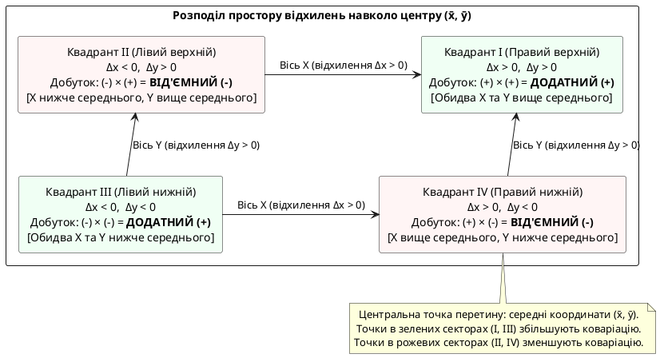
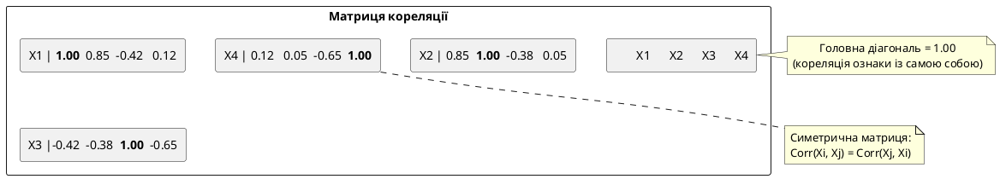
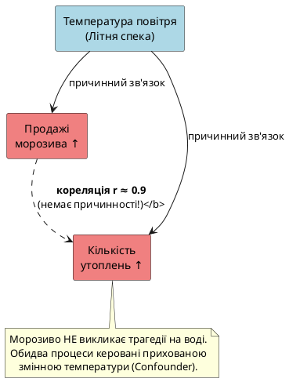
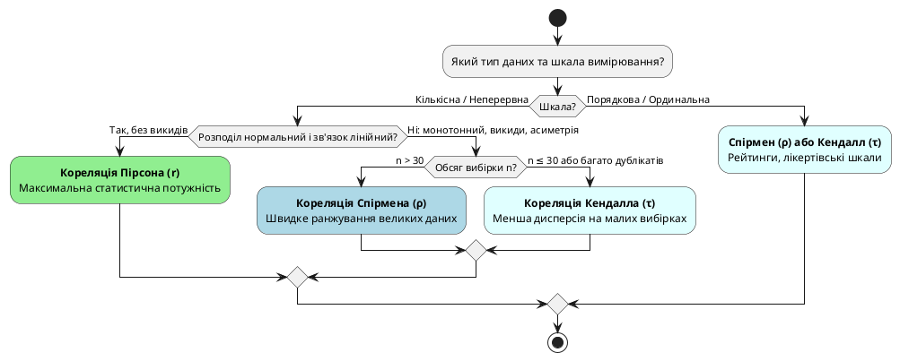

# Кореляція та взаємозв'язки

::card-group

::card{title="🎯 Мета підтеми" icon="i-lucide-target"}

- Зрозуміти різницю між коваріацією та кореляцією
- Опанувати коефіцієнт кореляції Пірсона
- Навчитися інтерпретувати кореляційні матриці
- Візуалізувати зв'язки через scatter plots та heatmaps
- Усвідомити критичний принцип: **кореляція ≠ причинність**

::

::card{title="🔑 Ключові терміни" icon="i-lucide-key"}

- **Коваріація** (_covariance_) — міра спільної мінливості двох змінних
- **Кореляція** (_correlation_) — нормалізована коваріація, від −1 до +1
- **Коефіцієнт Пірсона** (_Pearson's r_) — найпоширеніша міра лінійного зв'язку
- **Матриця кореляції** (_correlation matrix_) — таблиця всіх парних кореляцій
- **Кореляція ≠ причинність** — золоте правило інтерпретації

::

::

---

## Історія про зріст і вагу

Уявіть: ви збираєте дані про студентів вашого університету. Фіксуєте зріст (см) та вагу (кг) кожного з 100 студентів.

Інтуїтивно зрозуміло: **вищі люди зазвичай важчі**. Але як це описати **математично**? Як виміряти **силу** цього зв'язку?

::jupyter-notebook{title="height_weight_intro.ipynb" kernel="Python 3 (ipykernel)"}

::jupyter-cell{type="markdown"}

### Дані про зріст і вагу 100 студентів

::

::jupyter-cell{executionCount="1"}

```python
import numpy as np
import matplotlib.pyplot as plt

rng = np.random.default_rng(seed=42)

# Генеруємо реалістичні дані зі зв'язком
height = rng.normal(170, 10, 100)  # Зріст: N(170, 10²)
weight = 0.8 * height + rng.normal(0, 5, 100) - 70  # Вага залежить від зросту + шум

# Візуалізація
plt.figure(figsize=(10, 6))
plt.scatter(height, weight, alpha=0.6, s=50, edgecolors='black', linewidths=0.5)
plt.xlabel('Зріст (см)', fontsize=12)
plt.ylabel('Вага (кг)', fontsize=12)
plt.title('Зв\'язок між зростом і вагою', fontweight='bold', fontsize=14)
plt.grid(alpha=0.3)
plt.show()

print("Статистика:")
print(f"  Зріст: μ = {height.mean():.1f} см, σ = {height.std():.1f} см")
print(f"  Вага:  μ = {weight.mean():.1f} кг, σ = {weight.std():.1f} кг")
print("\nВізуально помітно: точки утворюють хмару, що йде 'знизу-вліво до верху-вправо'")
print("Це сигнал ПОЗИТИВНОГО зв'язку: ↑зріст → ↑вага")
```

#output
{.diagram-img}

```
Статистика:
  Зріст: μ = 169.5 см, σ = 7.7 см
  Вага:  μ = 65.5 кг, σ = 8.2 кг

Візуально помітно: точки утворюють хмару, що йде 'знизу-вліво до верху-вправо'
Це сигнал ПОЗИТИВНОГО зв'язку: ↑зріст → ↑вага
```

::

::

**Питання:**

1. Чи зріст **завжди** передбачає вагу? Ні — спостерігається природний розкид.
2. Чи зв'язок є **лінійним**? Наближено так: через хмару точок можна провести узагальнюючу пряму лінію.
3. Наскільки **сильний** цей зв'язок? Потрібна об'єктивна числова міра!

Для цього в статистиці використовують поняття **коваріації** та **кореляції**.

> Аналогія: Кореляція — це як «сила магнітного поля» між двома змінними. Позитивна кореляція означає, що коли одна змінна зростає, інша притягується і зростає слідом (як північний і південний полюси). Негативна кореляція — коли зростання однієї виштовхує іншу донизу. Нульова кореляція — повна байдужість змінних одна до одної (магнітне поле відсутнє).

---

## Коваріація (Covariance)

**Коваріація** (від латинського *co-* — «разом», «спільно» та *variance* — «мінливість», «дисперсія») — це фундаментальна міра спільної мінливості, яка показує, **як дві випадкові величини змінюються разом**. Вона визначає загальний напрямок сумісної лінійної тенденції двох числових ознак: чи зростають вони одночасно, чи змінюються в протилежних напрямках, чи взагалі не демонструють лінійної залежності.

> **Інтуїтивна аналогія:**  
> Уявіть двомісний байдарочний човен або дитячу гойдалку-балансир:
> - **Позитивна коваріація:** Обидва веслярі веслують в один бік — човен стрімко рухається вперед. Коли зусилля першого весляра перевищує його середній рівень, зусилля другого також перевищує середнє. Вони діють синхронно.
> - **Негативна коваріація:** Дитяча гойдалка-балансир: коли одна дитина злітає вгору вище точки рівноваги, друга обов'язково опускається вниз. Їхні рухи узгоджені, але мають суворо протилежні напрямки.
> - **Нульова коваріація:** Один весляр гребе, а другий пасажир поруч читає книгу або перевіряє пошту. Рівень зусиль першого ніяк не пов'язаний з тим, яку саме сторінку відкриває другий. Їхні відхилення від середнього повністю автономні.

### Формула коваріації

Для генеральної сукупності (коли відомі абсолютно всі :math-formula{tex="N" inline} об'єктів або повна історія процесу):

::math-formula
\text{Cov}(X, Y) = \sigma_{XY} = \frac{1}{N} \sum_{i=1}^{N} (x_i - \mu_X)(y_i - \mu_Y)
::

Для реальної вибірки (з корекцією Бесселя :math-formula{tex="n-1" inline}, яка компенсує втрату одного ступеня вільності через використання вибіркових середніх :math-formula{tex="\bar{x}" inline} та :math-formula{tex="\bar{y}" inline}):

::math-formula
\text{Cov}(X, Y) = s_{XY} = \frac{1}{n-1} \sum_{i=1}^{n} (x_i - \bar{x})(y_i - \bar{y})
::

### Анатомія формули: як вона працює під капотом?

Формула коваріації здається складною лише на перший погляд. Насправді вона виконує всього три послідовні математичні дії:

1. **Крок 1: Центрування (відхилення від «центру тяжіння»)**  
   Для кожної точки обчислюються зміщення відносно вибіркових середніх:
   ::math-formula
   \Delta x_i = x_i - \bar{x}, \quad \Delta y_i = y_i - \bar{y}
   ::
   Геометрично ми просто переносимо початок координат :math-formula{tex="(0, 0)" inline} у центр мас нашої хмари точок — координату :math-formula{tex="(\bar{x}, \bar{y})" inline}. Тепер важливі не абсолютні кілограми чи метри, а напрямок відхилення від типового середнього значення.

2. **Крок 2: Множення відхилень та правило знаків**  
   Для кожного спостереження ми перемножуємо отримані зміщення: :math-formula{tex="\Delta x_i \cdot \Delta y_i" inline}. У цьому множенні криється вся магія знаку коваріації:
   - Якщо обидві змінні більші за середнє (:math-formula{tex="x_i > \bar{x}" inline} і :math-formula{tex="y_i > \bar{y}" inline}), маємо :math-formula{tex="(+) \times (+) = (+)" inline}.
   - Якщо обидві змінні менші за середнє (:math-formula{tex="x_i < \bar{x}" inline} і :math-formula{tex="y_i < \bar{y}" inline}), маємо :math-formula{tex="(-) \times (-) = (+)" inline}. **Зверніть увагу:** якщо обидві величини одночасно впали нижче за свої середні, це також підтверджує узгодженість їхньої поведінки, тому внесок залишається строго додатним!
   - Якщо ж одна змінна виросла понад норму, а інша впала нижче середнього (:math-formula{tex="(+) \times (-)" inline} або :math-formula{tex="(-) \times (+)" inline}), добуток стає від'ємним :math-formula{tex="(-)" inline}.

3. **Крок 3: Сумування та усереднення «голосів»**  
   Ми додаємо всі отримані добутки. Кожна точка є «виборцем»: вона голосує або за додатний зв'язок (квадранти I та III), або за від'ємний (квадранти II та IV). Якщо узгоджених точок більше і вони лежать далі від центру, сумарна сума додатна (:math-formula{tex="\text{Cov} > 0" inline}). Якщо точки взаємно компенсують одна одну — сума прямує до нуля (:math-formula{tex="\text{Cov} \approx 0" inline}).

::plant-uml{alt="Геометрія знаків коваріації у чотирьох квадрантах центрованого простору"}



::

### Дисперсія як окремий випадок коваріації

Що станеться, якщо ми підставимо у вибіркову формулу коваріації змінну :math-formula{tex="X" inline} замість :math-formula{tex="Y" inline}? Тобто розрахуємо коваріацію ознаки із самою собою:

::math-formula
\text{Cov}(X, X) = \frac{1}{n-1} \sum_{i=1}^{n} (x_i - \bar{x})(x_i - \bar{x}) = \frac{1}{n-1} \sum_{i=1}^{n} (x_i - \bar{x})^2 = \text{Var}(X) = s_X^2
::

Це глибокий концептуальний зв'язок: **дисперсія — це просто коваріація змінної із самою собою**. Дисперсія показує, як одновимірна величина розсіюється навколо власного середнього, тоді як коваріація узагальнює цей принцип на спільне сумісне розсіювання двох різних вимірів.

**Інтерпретація знаку коваріації:**

| Значення :math-formula{tex="\text{Cov}(X, Y)" inline} | Інтерпретація зв'язку | Геометрична поведінка хмари точок |
| :---: | :--- | :--- |
| **:math-formula{tex="> 0" inline}** | **Прямий (позитивний):** коли :math-formula{tex="X" inline} зростає, :math-formula{tex="Y" inline} також має тенденцію зростати | Точки витягуються вздовж висхідної прямої (квадранти I та III) |
| **:math-formula{tex="< 0" inline}** | **Обернений (негативний):** коли :math-formula{tex="X" inline} зростає, :math-formula{tex="Y" inline} прямує вниз | Точки витягуються вздовж низхідної прямої (квадранти II та IV) |
| **:math-formula{tex="\approx 0" inline}** | **Відсутній лінійний зв'язок:** зміна :math-formula{tex="X" inline} не дає інформації про напрямок зміни :math-formula{tex="Y" inline} | Точки рівномірно заповнюють площину без вираженого нахилу |

### Де застосовується коваріація на практиці?

Коваріація — це не просто теоретична проміжна формула. Вона є активним обчислювальним рушієм у багатьох сферах IT, науки про дані та інженерії:

::card-group

::card{title="1. Мінімізація ризику портфеля (Теорія Марковіца)" icon="i-lucide-scale"}

У фінансовому менеджменті інвестор намагається отримати максимальний дохід за мінімального ризику. Ризик портфеля з двох активів :math-formula{tex="A" inline} та :math-formula{tex="B" inline} із частками :math-formula{tex="w_A" inline} і :math-formula{tex="w_B" inline} визначається його дисперсією:

:math-formula{tex="\text{Var}(P) = w_A^2 \sigma_A^2 + w_B^2 \sigma_B^2 + 2 w_A w_B \text{Cov}(A, B)" inline}

Якщо підібрати активи з **від'ємною коваріацією** (:math-formula{tex="\text{Cov}(A, B) < 0" inline}) — наприклад, акції золотодобувної компанії (дорожчають під час кризи) та акції авіаперевізника (дешевшають через кризу або зростання цін на пальне), — доданок :math-formula{tex="2 w_A w_B \text{Cov}(A, B)" inline} стає від'ємним. У результаті загальний ризик портфеля стає *меншим*, ніж ризик будь-якого з цих активів окремо. Цей ефект є математичним фундаментом диверсифікації.

::

::card{title="2. Злиття сенсорів та автопілоти (Фільтр Калмана)" icon="i-lucide-compass"}

Безпілотні автомобілі та дрони одночасно зчитують координати з GPS, гіроскопа (IMU) та одометра коліс. Кожен датчик має випадкові похибки: GPS втрачає супутники між хмарочосами, а колеса буксують на мокрому асфальті.

Фільтр Калмана використовує **матрицю коваріації похибок оцінки** :math-formula{tex="\mathbf{P}" inline}. Її позадіагональні елементи показують спільну невизначеність: «наскільки похибка у визначенні поточної швидкості впливає на похибку визначення положення у просторі?». Завдяки коваріації, щойно система отримує свіже вимірювання швидкості від коліс, вона миттєво коригує оцінку координат GPS, усуваючи накопичений дрейф траєкторії.

::

::card{title="3. Стиснення даних та ML (Метод головних компонент — PCA)" icon="i-lucide-merge"}

У машинному навчанні датасети часто містять сотні або тисячі ознак. Якщо дві ознаки мають сильну коваріацію (наприклад, площа квартири та кількість кімнат, або яскравість двох сусідніх пікселів медичного томографа), вони несуть майже однакову інформацію (проблема мультиколінеарності).

Алгоритм PCA бере повну коваріаційну матрицю ознак і знаходить її **власні вектори**. Це дає змогу повернути координатні осі вздовж напрямків найбільшої спільної мінливості та замінити 100 початкових взаємозалежних ознак на 5 нових некорельованих компонент, зберігши понад 95% корисної інформації датасету.

::

::card{title="4. Моніторинг систем та SRE (DevOps Telemetry)" icon="i-lucide-activity"}

Інженери надійності сайтів (SRE) відстежують поведінку мікросервісів за допомогою коваріації між вхідним навантаженням (RPS — запити за секунду) та затримкою обробки (Latency p95/p99).

Доки сервер має достатньо ресурсів, зростання RPS не призводить до деградації сервісу, і коваріація між ними тримається близько нуля. Проте, якщо база даних вичерпує пул з'єднань або процесор потрапляє в throttling, коваріація між навантаженням та затримкою різко підскакує вгору. Системи моніторингу (наприклад, Prometheus або Datadog) використовують зростання коваріації як завчасний індикатор виникнення «пляшкового горла» (bottleneck), що дає змогу автоматично масштабувати сервіс до того, як клієнти почнуть отримувати помилки таймауту HTTP 504.

::

::

::warning{title="Критичне обмеження коваріації: масштабозалежність"}
Коваріація критично залежить від **одиниць вимірювання** змінних:

Якщо зріст :math-formula{tex="X" inline} вимірюється в метрах, а вага :math-formula{tex="Y" inline} — у кілограмах, коваріація :math-formula{tex="\text{Cov}(X, Y)" inline} має розмірність «метр · кілограм». Якщо ж перевести зріст у сантиметри, а вагу в грами, числове значення коваріації підскочить рівно в :math-formula{tex="100 \times 1000 = 100\,000" inline} разів!

Через це неможливо сказати, чи :math-formula{tex="\text{Cov} = 240" inline} — це сильний зв'язок, чи практично нульовий, без врахування дисперсій самих змінних.

**Рішення:** нормувати коваріацію, поділивши її на стандартні відхилення обох змінних. Результатом такої нормалізації є **коефіцієнт лінійної кореляції Пірсона**.
::

### Обчислення коваріації в NumPy

::jupyter-notebook{title="covariance_calculation.ipynb" kernel="Python 3 (ipykernel)"}

::jupyter-cell{type="markdown"}

### Обчислення коваріації вручну та через NumPy

::

::jupyter-cell{executionCount="1"}

```python
import numpy as np

# Дані: температура (°C) та продажі морозива (шт)
temperature = np.array([15, 18, 22, 25, 28, 30, 32, 35])
ice_cream_sales = np.array([50, 65, 80, 95, 110, 125, 135, 150])

# Спосіб 1: Вручну за математичною формулою
temp_mean = temperature.mean()
sales_mean = ice_cream_sales.mean()

cov_manual = np.sum((temperature - temp_mean) * (ice_cream_sales - sales_mean)) / (len(temperature) - 1)

# Спосіб 2: Через матрицю коваріацій NumPy
cov_matrix = np.cov(temperature, ice_cream_sales)  # Матриця коваріацій 2×2
cov_numpy = cov_matrix[0, 1]  # Позадіагональний елемент [0,1] або [1,0]

print("Результати:")
print(f"  Коваріація (вручну):  {cov_manual:.2f}")
print(f"  Коваріація (NumPy):   {cov_numpy:.2f}")
print(f"\nІнтерпретація:")
print(f"  Cov > 0 → позитивний зв'язок")
print(f"  Коли температура зростає, продажі морозива теж зростають")
print(f"\nПроблема масштабу:")
print(f"  Чи {cov_numpy:.2f} — це багато? Без контексту дисперсій відповісти неможливо!")
```

#output

```
Результати:
  Коваріація (вручну):  242.68
  Коваріація (NumPy):   242.68

Інтерпретація:
  Cov > 0 → позитивний зв'язок
  Коли температура зростає, продажі морозива теж зростають

Проблема масштабу:
  Чи 242.68 — це багато? Без контексту дисперсій відповісти неможливо!
```

::

::

::note{title="Фундаментальні алгебраїчні властивості коваріації"}

1. :math-formula{tex="\text{Cov}(X, X) = \text{Var}(X) = \sigma_X^2" inline} — коваріація випадкової величини зі самою собою дорівнює її дисперсії.
2. :math-formula{tex="\text{Cov}(X, Y) = \text{Cov}(Y, X)" inline} — операція коваріації строго симетрична.
3. :math-formula{tex="\text{Cov}(aX + c, bY + d) = ab \cdot \text{Cov}(X, Y)" inline} — білінійність: адитивні константи зникають, а мультиплікативні коефіцієнти виносяться наперед.
4. Якщо змінні :math-formula{tex="X" inline} та :math-formula{tex="Y" inline} незалежні, то :math-formula{tex="\text{Cov}(X, Y) = 0" inline}. **Увага:** зворотне твердження не завжди істинне (нульова коваріація гарантує лише відсутність лінійного зв'язку, але не виключає нелінійну залежність).

::

---

## Кореляція Пірсона (Pearson Correlation Coefficient)

**Коефіцієнт лінійної кореляції Пірсона** (:math-formula{tex="r" inline} або :math-formula{tex="\rho_{XY}" inline}) — це **нормалізована коваріація**, значення якої завжди суворо обмежені інтервалом :math-formula{tex="[-1, +1]" inline}.

### Формула кореляції

::math-formula
r = \frac{\text{Cov}(X, Y)}{\sigma_X \cdot \sigma_Y}
::

В розгорнутому алгебраїчному вигляді для вибіркових спостережень:

::math-formula
r = \frac{\sum_{i=1}^{n} (x_i - \bar{x})(y_i - \bar{y})}{\sqrt{\sum_{i=1}^{n}(x_i - \bar{x})^2} \cdot \sqrt{\sum_{i=1}^{n}(y_i - \bar{y})^2}}
::

::card{title="Анатомія математичної формули кореляції Пірсона" icon="i-lucide-binary"}

Щоб глибинно зрозуміти, чому коефіцієнт Пірсона працює бездоганно і гарантовано потрапляє в діапазон :math-formula{tex="[-1, +1]" inline}, розберемо його математичну структуру на складові блоки:

1. **Центрування даних (:math-formula{tex="x_i - \bar{x}" inline} та :math-formula{tex="y_i - \bar{y}" inline})**:
    - Кожне окреме спостереження перетворюється на вектор відхилення від свого середнього. Це робить показник інваріантним до зсуву координат: якщо до кожного зросту або ваги додати константу :math-formula{tex="+100" inline}, кореляція абсолютно не зміниться.

2. **Чисельник — узгодженість напрямку (спільна варіація)**:
    - Якщо об'єкт має і :math-formula{tex="x_i" inline}, і :math-formula{tex="y_i" inline} вище за середнє: :math-formula{tex="(+) \times (+) = \mathbf{+}" inline} (додатний внесок).
    - Якщо об'єкт має обидва параметри нижче за середнє: :math-formula{tex="(-) \times (-) = \mathbf{+}" inline} (підсилює позитивний зв'язок!).
    - Якщо одне вище, а інше нижче: :math-formula{tex="(+) \times (-) = \mathbf{-}" inline} (штовхає кореляцію у від'ємну сторону).
    - Сума всіх цих добутків у чисельнику є ненормалізованою коваріацією :math-formula{tex="\sum_{i=1}^n (x_i - \bar{x})(y_i - \bar{y})" inline}.

3. **Знаменник — масштабний нормалізатор (евклідові норми)**:
    - Добуток квадратних коренів — це добуток довжин (евклідових :math-formula{tex="L_2" inline}-норм) центрованих векторів :math-formula{tex="\vec{u} = \mathbf{x} - \bar{x}" inline} та :math-formula{tex="\vec{v} = \mathbf{y} - \bar{y}" inline}.
    - З погляду лінійної алгебри формула :math-formula{tex="r" inline} є **косинусом кута :math-formula{tex="\theta" inline} між двома центрованими векторами в багатовимірному просторі :math-formula{tex="\mathbb{R}^n" inline}**:
      ::math-formula
      r = \cos(\theta) = \frac{\langle \vec{u}, \vec{v} \rangle}{\|\vec{u}\|_2 \cdot \|\vec{v}\|_2} = \frac{\sum_{i=1}^n u_i v_i}{\sqrt{\sum_{i=1}^n u_i^2} \cdot \sqrt{\sum_{i=1}^n v_i^2}}
      ::
    - За **нерівністю Коші-Буняковського** (:math-formula{tex="|\langle \vec{u}, \vec{v} \rangle| \le \|\vec{u}\|_2 \|\vec{v}\|_2" inline}), косинус завжди належить діапазону :math-formula{tex="[-1, +1]" inline}. Якщо вектори паралельні й однаково спрямовані (:math-formula{tex="\theta = 0^\circ" inline}), :math-formula{tex="r = \cos(0) = +1" inline}. Якщо вектори ортогональні (:math-formula{tex="\theta = 90^\circ" inline}), лінійний зв'язок відсутній (:math-formula{tex="r = 0" inline}). Якщо вони спрямовані в протилежні боки (:math-formula{tex="\theta = 180^\circ" inline}), :math-formula{tex="r = -1" inline}.

::

### Інтерпретація значень r

| Значення r          | Інтерпретація                         | Візуальна картина              |
| :------------------ | :------------------------------------ | :----------------------------- |
| **r = +1**          | Ідеальний позитивний лінійний зв'язок | Точки лежать на прямій ↗       |
| **0.7 < r < 1**     | Сильний позитивний зв'язок            | Чітка висхідна хмара           |
| **0.3 < r < 0.7**   | Помірний позитивний зв'язок           | Розмита висхідна хмара         |
| **0 < r < 0.3**     | Слабкий позитивний зв'язок            | Майже хаотична хмара           |
| **r ≈ 0**           | Немає лінійного зв'язку               | Хаотична хмара (коло, U-форма) |
| **-0.3 < r < 0**    | Слабкий негативний зв'язок            | Майже хаотична хмара           |
| **-0.7 < r < -0.3** | Помірний негативний зв'язок           | Розмита спадна хмара           |
| **-1 < r < -0.7**   | Сильний негативний зв'язок            | Чітка спадна хмара             |
| **r = −1**          | Ідеальний негативний лінійний зв'язок | Точки лежать на прямій ↘       |

::tip
**Емпіричні пороги шкали Чеддока:**

- :math-formula{tex="|r| < 0.3" inline} — слабка кореляція
- :math-formula{tex="0.3 \le |r| < 0.7" inline} — помірна кореляція
- :math-formula{tex="|r| \ge 0.7" inline} — сильна (висока) кореляція

Контекст має вирішальне значення: в експериментальній фізиці чи мікроелектроніці значення :math-formula{tex="r = 0.8" inline} може вважатися ненадійним, тоді як в економіці, медицині чи аналізі поведінки користувачів :math-formula{tex="r = 0.5" inline} є визначним інсайтом!
::

### Обчислення кореляції в NumPy та SciPy

::jupyter-notebook{title="correlation_calculation.ipynb" kernel="Python 3 (ipykernel)"}

::jupyter-cell{type="markdown"}

### Обчислення кореляції Пірсона: три способи

::

::jupyter-cell{executionCount="1"}

```python
import numpy as np
from scipy import stats

# Дані: температура та продажі морозива
temperature = np.array([15, 18, 22, 25, 28, 30, 32, 35])
ice_cream_sales = np.array([50, 65, 80, 95, 110, 125, 135, 150])

# Спосіб 1: Вручну (за формулою через коваріацію та стандарти)
cov = np.cov(temperature, ice_cream_sales)[0, 1]
std_temp = temperature.std(ddof=1)
std_sales = ice_cream_sales.std(ddof=1)
r_manual = cov / (std_temp * std_sales)

# Спосіб 2: np.corrcoef() — повертає матрицю кореляцій 2×2
corr_matrix = np.corrcoef(temperature, ice_cream_sales)
r_numpy = corr_matrix[0, 1]

# Спосіб 3: scipy.stats.pearsonr() — повертає r та p-value для перевірки гіпотези
r_scipy, p_value = stats.pearsonr(temperature, ice_cream_sales)

print("Результати обчислення кореляції:")
print(f"  Вручну:        r = {r_manual:.4f}")
print(f"  np.corrcoef(): r = {r_numpy:.4f}")
print(f"  scipy:         r = {r_scipy:.4f}, p-value = {p_value:.6f}")
print(f"\nІнтерпретація:")
print(f"  r = {r_scipy:.3f} → майже ідеальний позитивний лінійний зв'язок")
print(f"  p-value < 0.05 → зв'язок статистично значущий (нульова гіпотеза про r=0 відкидається)")
```

#output

```
Результати обчислення кореляції:
  Вручну:        r = 0.9973
  np.corrcoef(): r = 0.9973
  scipy:         r = 0.9973, p-value = 0.000000

Інтерпретація:
  r = 0.997 → майже ідеальний позитивний лінійний зв'язок
  p-value < 0.05 → зв'язок статистично значущий (нульова гіпотеза про r=0 відкидається)
```

::

::

### Візуалізація різних кореляцій

::jupyter-notebook{title="correlation_examples.ipynb" kernel="Python 3 (ipykernel)"}

::jupyter-cell{type="markdown"}

### Візуальні приклади різних значень кореляції

::

::jupyter-cell{executionCount="1"}

```python
import numpy as np
import matplotlib.pyplot as plt

rng = np.random.default_rng(seed=42)
n = 100

def generate_correlated_data(r, n=100):
    """Генерує дві нормальні змінні з заданим коефіцієнтом кореляції r"""
    x = rng.standard_normal(n)
    y = r * x + np.sqrt(1 - r**2) * rng.standard_normal(n)
    return x, y

correlations = [1.0, 0.8, 0.4, 0.0, -0.4, -0.8, -1.0]
fig, axes = plt.subplots(2, 4, figsize=(16, 8))
axes = axes.ravel()

for i, r_target in enumerate(correlations):
    x, y = generate_correlated_data(r_target, n)
    r_actual = np.corrcoef(x, y)[0, 1]

    axes[i].scatter(x, y, alpha=0.6, s=30, edgecolors='black', linewidths=0.5)
    axes[i].set_title(f'r = {r_actual:.2f}', fontweight='bold', fontsize=12)
    axes[i].set_xlabel('X')
    axes[i].set_ylabel('Y')
    axes[i].grid(alpha=0.3)
    axes[i].axhline(0, color='gray', linewidth=0.5, linestyle='--')
    axes[i].axvline(0, color='gray', linewidth=0.5, linestyle='--')

# 8-й графік: нелінійний функціональний зв'язок (коло), де r ≈ 0
theta = np.linspace(0, 2*np.pi, n)
x_circle = np.cos(theta) + rng.standard_normal(n) * 0.1
y_circle = np.sin(theta) + rng.standard_normal(n) * 0.1
r_circle = np.corrcoef(x_circle, y_circle)[0, 1]

axes[7].scatter(x_circle, y_circle, alpha=0.6, s=30, edgecolors='black', linewidths=0.5, color='red')
axes[7].set_title(f'Коло: r = {r_circle:.2f}', fontweight='bold', fontsize=12)
axes[7].set_xlabel('X')
axes[7].set_ylabel('Y')
axes[7].grid(alpha=0.3)
axes[7].text(0, 0, 'Нелінійний зв\'язок!\nr ≈ 0', ha='center', fontsize=10,
             bbox=dict(boxstyle='round', facecolor='yellow', alpha=0.7))

plt.tight_layout()
plt.show()

print("Висновки:")
print("  r = +1: точки лежать точно на висхідній прямій ↗")
print("  r = -1: точки лежать точно на спадній прямій ↘")
print("  r ≈ 0: хаотична хмара АБО нелінійний зв'язок (коло, парабола)")
print("\n⚠ ВАЖЛИВО: r = 0 НЕ означає 'немає зв'язку', це означає лише 'немає ЛІНІЙНОГО зв'язку'!")
```

#output
{.diagram-img}

```
Висновки:
  r = +1: точки лежать точно на висхідній прямій ↗
  r = -1: точки лежать точно на спадній прямій ↘
  r ≈ 0: хаотична хмара АБО нелінійний зв'язок (коло, парабола)

⚠ ВАЖЛИВО: r = 0 НЕ означає 'немає зв'язку', це означає лише 'немає ЛІНІЙНОГО зв'язку'!
```

::

::

### Квартет Анскомба (Anscombe's Quartet): чому не можна вірити лише числу r

У 1973 році британський статистик Френсіс Анскомб сформував чотири набори числових даних, щоб проілюструвати фундаментальне правило: **ніколи не робіть висновків про залежність змінних лише за коефіцієнтом кореляції без побудови графіка розсіювання (scatter plot)**.

Усі чотири набори даних мають майже ідентичні зведені статистичні характеристики:
- Середнє значення :math-formula{tex="\bar{x} = 9.0" inline}, вибіркова дисперсія :math-formula{tex="s_x^2 = 11.0" inline} (:math-formula{tex="s_x \approx 3.32" inline})
- Середнє значення :math-formula{tex="\bar{y} = 7.50" inline}, вибіркова дисперсія :math-formula{tex="s_y^2 \approx 4.12" inline} (:math-formula{tex="s_y \approx 2.03" inline})
- Коефіцієнт кореляції Пірсона :math-formula{tex="r \approx 0.816" inline}
- Лінія регресії :math-formula{tex="y = 3.00 + 0.500x" inline} (:math-formula{tex="R^2 \approx 0.67" inline})

::card-group

::card{title="Набір I (Лінійний зв'язок)" icon="i-lucide-trending-up"}
Класична хмара точок із помірним лінійним трендом та нормальним розподілом помилок. Коефіцієнт :math-formula{tex="r = 0.816" inline} бездоганно відображає реальний стан справ.
::

::card{title="Набір II (Нелінійна парабола)" icon="i-lucide-spline"}
Між змінними існує **строга детермінована квадратична залежність**. Лінійна кореляція :math-formula{tex="r = 0.816" inline} повністю сліпа до кривини зв'язку і вводить аналітика в оману.
::

::card{title="Набір III (Вплив одного викиду)" icon="i-lucide-alert-circle"}
Майже ідеальна пряма лінія (:math-formula{tex="r = 1.0" inline}), яку «змазав» усього **один-єдиний вертикальний викид**, знизивши кореляцію до :math-formula{tex="0.816" inline}.
::

::card{title="Набір IV (Важільна точка — Leverage)" icon="i-lucide-anchor"}
Усі спостереження, крім одного, мають :math-formula{tex="x = 8" inline} (нульова варіація :math-formula{tex="x" inline}). Одна екстремальна точка :math-formula{tex="(19, 12.5)" inline} самотужки створила ілюзію потужного лінійного зв'язку :math-formula{tex="r = 0.816" inline}!
::

::

{.diagram-img}

::warning{title="Критичне правило Data Science"}
Перед застосуванням моделі лінійної регресії чи формуванням висновків про взаємозв'язок ознак **завжди будуйте діаграми розсіювання (scatter plot)**. Одне сухе число :math-formula{tex="r" inline} не здатне розрізнити плавну параболу, дію аномального шуму чи штучний нахил через один екстремальний викид.
::

---

## Матриця кореляції (Correlation Matrix)

У реальних датасетах ми зазвичай маємо **десятки або сотні ознак**. Як швидко з'ясувати, які змінні тісно пов'язані між собою, а які дублюють інформацію?

**Матриця кореляції** — це симетрична таблиця розмірності :math-formula{tex="N \times N" inline}, де елемент на перетині :math-formula{tex="i" inline}-го рядка та :math-formula{tex="j" inline}-го стовпця дорівнює коефіцієнту кореляції між змінними :math-formula{tex="X_i" inline} та :math-formula{tex="X_j" inline}.

### Структура матриці

::plant-uml{alt="Структура матриці кореляції"}



::

**Фундаментальні властивості:**

1. **Головна діагональ завжди дорівнює 1.00** (:math-formula{tex="\text{Corr}(X_i, X_i) = 1" inline}).
2. **Симетричність відносно діагоналі**: :math-formula{tex="\text{Corr}(X_i, X_j) = \text{Corr}(X_j, X_i)" inline}.
3. **Діапазон усіх значень**: :math-formula{tex="-1.00 \le r_{ij} \le +1.00" inline}.

### Обчислення та візуалізація матриці (Heatmap)

::jupyter-notebook{title="correlation_matrix.ipynb" kernel="Python 3 (ipykernel)"}

::jupyter-cell{type="markdown"}

### Матриця кореляції: обчислення та heatmap

::

::jupyter-cell{executionCount="1"}

```python
import numpy as np
import pandas as pd
import matplotlib.pyplot as plt
import seaborn as sns

rng = np.random.default_rng(seed=42)

# Створюємо синтетичний датасет (100 зразків, 5 змінних)
n = 100
age = rng.integers(20, 60, n)
income = age * 1200 + rng.normal(0, 5000, n)  # Тісно корелює з віком
education_years = rng.normal(14, 3, n)
savings = 0.15 * income + 1000 * education_years + rng.normal(0, 3000, n)
debt = -0.1 * income + rng.normal(5000, 2000, n)  # Від'ємна кореляція з доходом

# Формуємо DataFrame
data = pd.DataFrame({
    'Вік': age,
    'Дохід': income,
    'Освіта (роки)': education_years,
    'Заощадження': savings,
    'Борг': debt
})

# Обчислюємо кореляційну матрицю
corr_matrix = data.corr()

print("Матриця кореляції:\n")
print(corr_matrix.round(2))

# Візуалізуємо через теплову карту (Heatmap)
plt.figure(figsize=(9, 7.5))
sns.heatmap(corr_matrix, annot=True, fmt='.2f', cmap='coolwarm', center=0, vmin=-1, vmax=1,
            square=True, linewidths=1, cbar_kws={"shrink": 0.8, "label": "Коефіцієнт кореляції r"})
plt.title('Heatmap: Матриця кореляції фінансових показників', fontweight='bold', fontsize=13)
plt.tight_layout()
plt.show()

print("\n📊 Інтерпретація кольорів:")
print("  🔴 Червоний (r → +1): сильний позитивний зв'язок")
print("  🔵 Синій (r → -1): сильний негативний зв'язок")
print("  ⚪ Білий (r ≈ 0): лінійний зв'язок відсутній")
```

#output
{.diagram-img}

```
Матриця кореляції:

                Вік  Дохід  Освіта (роки)  Заощадження  Борг
Вік            1.00   0.95          -0.12         0.19 -0.59
Дохід          0.95   1.00          -0.07         0.27 -0.64
Освіта (роки) -0.12  -0.07           1.00         0.64  0.01
Заощадження    0.19   0.27           0.64         1.00 -0.27
Борг          -0.59  -0.64           0.01        -0.27  1.00

📊 Інтерпретація кольорів:
  🔴 Червоний (r → +1): сильний позитивний зв'язок
  🔵 Синій (r → -1): сильний негативний зв'язок
  ⚪ Білий (r ≈ 0): лінійний зв'язок відсутній
```

::

::

::note{title="Ключові статистичні висновки з матриці"}

- **Вік ↔ Дохід (:math-formula{tex="r = 0.95" inline})**: надзвичайно потужний позитивний зв'язок — з віком та накопиченням професійного стажу дохід стабільно зростає.
- **Освіта ↔ Заощадження (:math-formula{tex="r = 0.64" inline})**: помітний позитивний зв'язок — додаткові роки навчання сприяють фінансовій грамотності та інвестиціям.
- **Дохід ↔ Борг (:math-formula{tex="r = -0.64" inline})**: помірний від'ємний зв'язок — люди з вищим рівнем заробітку мають менше проблем із непогашеною заборгованістю.
- **Освіта ↔ Вік (:math-formula{tex="r = -0.12" inline})** та **Освіта ↔ Борг (:math-formula{tex="r = 0.01" inline})**: взаємозв'язок практично відсутній.

Матриця кореляцій дозволяє миттєво відфільтрувати інформативний сигнал від статистичного шуму у великих табличних даних!
::

---

## Кореляція ≠ Причинність (Correlation ≠ Causation)

Це **найважливіший методологічний розділ** в аналізі даних та емпіричній науці.

::warning{title="Золоте правило статистичного аналізу"}
Якщо між змінними :math-formula{tex="X" inline} та :math-formula{tex="Y" inline} виявлено високу кореляцію (:math-formula{tex="|r| \gg 0" inline}), це **в жодному разі не доводить**, що:

- :math-formula{tex="X" inline} є причиною виникнення :math-formula{tex="Y" inline};
- :math-formula{tex="Y" inline} спричиняє :math-formula{tex="X" inline};
- між ними взагалі існує причинно-наслідковий механізм.

Кореляція констатує виключно **спільну узгоджену мінливість (асоціацію)**, але не причинність!
::

### Класичні приклади помилкової інтерпретації

#### 1. Продажі морозива та кількість утоплень

**Емпіричний факт:** Продажі морозива та кількість нещасних випадків на воді демонструють вражаючу позитивну кореляцію (:math-formula{tex="r \approx 0.9" inline}).

**Хибний висновок (псевдопричинність):** «Вживання морозива викликає судоми у воді або потоплення! Необхідно негайно заборонити продаж морозива на пляжах!».

**Реальність (Confounding Variable — прихована третя змінна):** Обидва явища одночасно зумовлені третім фактором — **літньою спекою**:
- Спекотна погода :math-formula{tex="\to" inline} різко зростає попит на прохолодні ласощі (морозиво :math-formula{tex="\uparrow" inline});
- Спекотна погода :math-formula{tex="\to" inline} мільйони людей масово вирушають купатися у відкритих водоймах :math-formula{tex="\to" inline} зростає кількість інцидентів на воді (:math-formula{tex="\uparrow" inline}).

::plant-uml{alt="Хибна кореляція через прихований фактор"}



::

#### 2. Кількість пожежників та матеріальні збитки від пожежі

**Факт:** Чим більше пожежних машин та рятувальників прибуває на ліквідацію вогню, тим більші фінансові збитки реєструє страхова компанія (:math-formula{tex="r > 0.8" inline}).

**Хибний висновок:** «Пожежники самі провокують руйнування будівель!».

**Реальність (Reverse Causality — зворотна причинність):** **Масштаб самої пожежі** визначає як рівень збитків, так і категорію тривоги, за якою диспетчер відправляє додаткові бригади на виклик.

#### 3. Споживання органічних продуктів та аутизм

**Факт:** За останні десятиліття зростання продажів органічних фермерських продуктів і кількість зареєстрованих випадків аутизму в розвинених країнах зростали майже паралельно (:math-formula{tex="r > 0.95" inline}).

**Реальність (Спільний тренд часу):** Обидва графіки монотонно зростали через глобальні історичні тренди (популяризація здорового харчування з одного боку, та вдосконалення діагностичних критеріїв DSM і скринінгу дітей з іншого).

### Три сценарії походження кореляції

::jupyter-notebook{title="correlation_causation_scenarios.ipynb" kernel="Python 3 (ipykernel)"}

::jupyter-cell{type="markdown"}

### Три фундаментальні пояснення кореляційного зв'язку

::

::jupyter-cell{executionCount="1"}

```python
import matplotlib.pyplot as plt
from matplotlib.patches import FancyArrowPatch

fig, axes = plt.subplots(1, 3, figsize=(15, 4.5))

scenarios = [
    ("Сценарій 1:\nX → Y", "X викликає Y\n(Пряма причинність)", [(0.25, 0.5, 0.75, 0.5)]),
    ("Сценарій 2:\nY → X", "Y викликає X\n(Зворотна причинність)", [(0.75, 0.5, 0.25, 0.5)]),
    ("Сценарій 3:\nZ → X, Z → Y", "Спільна причина Z\n(Хибна кореляція)", [(0.5, 0.75, 0.25, 0.35), (0.5, 0.75, 0.75, 0.35)])
]

for ax, (title, subtitle, arrows) in zip(axes, scenarios):
    ax.set_xlim(0, 1)
    ax.set_ylim(0, 1)
    ax.axis('off')
    ax.set_title(title, fontweight='bold', fontsize=14, pad=10)
    ax.text(0.5, 0.12, subtitle, ha='center', fontsize=11, fontweight='semibold',
            bbox=dict(boxstyle='round,pad=0.5', facecolor='#fef3c7', edgecolor='#f59e0b', alpha=0.9))

    for x1, y1, x2, y2 in arrows:
        arrow = FancyArrowPatch((x1, y1), (x2, y2),
                                arrowstyle='-|>', mutation_scale=22,
                                linewidth=3, color='#dc2626')
        ax.add_patch(arrow)

    if len(arrows) == 1:
        ax.plot(0.25, 0.5, 'o', markersize=42, color='#2563eb')
        ax.plot(0.75, 0.5, 'o', markersize=42, color='#ea580c')
        ax.text(0.25, 0.5, 'X', ha='center', va='center', fontsize=18, fontweight='bold', color='white')
        ax.text(0.75, 0.5, 'Y', ha='center', va='center', fontsize=18, fontweight='bold', color='white')
    else:
        ax.plot(0.5, 0.75, 'o', markersize=42, color='#16a34a')
        ax.plot(0.25, 0.35, 'o', markersize=42, color='#2563eb')
        ax.plot(0.75, 0.35, 'o', markersize=42, color='#ea580c')
        ax.text(0.5, 0.75, 'Z', ha='center', va='center', fontsize=18, fontweight='bold', color='white')
        ax.text(0.25, 0.35, 'X', ha='center', va='center', fontsize=18, fontweight='bold', color='white')
        ax.text(0.75, 0.35, 'Y', ha='center', va='center', fontsize=18, fontweight='bold', color='white')

plt.tight_layout()
plt.show()

print("При виявленні кореляції між X та Y необхідно ретельно перевірити ВСІ три сценарії!")
print("Без проведення контрольованих рандомізованих експериментів строго довести причинність неможливо!")
```

#output
{.diagram-img}

```
При виявленні кореляції між X та Y необхідно ретельно перевірити ВСІ три сценарії!
Без проведення контрольованих рандомізованих експериментів строго довести причинність неможливо!
```

::

::

### Як у науці доводять причинність?

Кореляція — це лише первинна евристика для формулювання наукової гіпотези. Для доведення причинно-наслідкового зв'язку потрібні:

1. **Рандомізовані контрольовані дослідження (RCT — Randomized Controlled Trials)**:
    - Випадковим чином розбити вибірку на тестову (де штучно змінюється :math-formula{tex="X" inline}) та контрольну (де :math-formula{tex="X" inline} зафіксовано на базовому рівні).
    - Якщо статистично значущі зміни :math-formula{tex="Y" inline} виникають виключно в тестовій групі, причинність доведено.
2. **Темпоральний пріоритет (послідовність у часі)**:
    - Причина повинна строго передувати наслідку (:math-formula{tex="t_X < t_Y" inline}). Якщо відгук змінюється раніше за тригер, гіпотеза відкидається.
3. **Контроль заважаючих факторів (Confounders)**:
    - Усунення або статистична фіксація впливу всіх прихованих факторів :math-formula{tex="Z_1, Z_2, \dots, Z_k" inline} (наприклад, через A/B-тестування або метод інструментальних змінних).
4. **Фізичний або біологічний механізм**:
    - Наявність чіткої наукової теорії, що пояснює, **яким саме чином** вплив передається від :math-formula{tex="X" inline} до :math-formula{tex="Y" inline}.

::tip
**Мовний етикет дата-аналітика:**

✅ **Коректно стверджувати:**
- «Ознака :math-formula{tex="X" inline} статистично асоційована зі зростанням :math-formula{tex="Y" inline}»
- «Між параметрами виявлено помірний коваріаційний зв'язок»
- «Змінна :math-formula{tex="X" inline} володіє прогностичною силою щодо :math-formula{tex="Y" inline}»

❌ **Неприпустимо без експерименту:**
- «Ознака :math-formula{tex="X" inline} призводить до падіння :math-formula{tex="Y" inline}»
- «Підвищення параметра :math-formula{tex="X" inline} викликає зростання :math-formula{tex="Y" inline}»
::

### Spurious Correlations (хибні кореляції)

Відомий проєкт Тайлера Вігена (*Tyler Vigen*) наочно доводить: якщо зібрати тисячі незалежних часових рядів, закон великих чисел гарантує, що деякі з них випадково покажуть :math-formula{tex="r > 0.95" inline}:

- Споживання сиру моцарела на душу населення ↔ Кількість захищених докторських дисертацій з цивільної інженерії (:math-formula{tex="r = 0.959" inline})
- Кількість людей, що втонули в басейнах США ↔ Кількість фільмів за участю Ніколаса Кейджа (:math-formula{tex="r = 0.67" inline})

::jupyter-notebook{title="spurious_correlation_example.ipynb" kernel="Python 3 (ipykernel)"}

::jupyter-cell{executionCount="1"}

```python
import numpy as np
import matplotlib.pyplot as plt

rng = np.random.default_rng(seed=42)

# Дві повністю незалежні змінні з глобальним трендом часу
years = np.arange(2000, 2020)
cheese_consumption = 10 + 0.5 * np.arange(20) + rng.normal(0, 1, 20)
engineering_phd = 500 + 25 * np.arange(20) + rng.normal(0, 30, 20)

# Обчислення кореляції
r = np.corrcoef(cheese_consumption, engineering_phd)[0, 1]

# Візуалізація двох шкал
fig, ax1 = plt.subplots(figsize=(11, 5.5))

ax1.plot(years, cheese_consumption, 'o-', color='#f59e0b', linewidth=2.2, markersize=7, label='Споживання сиру (кг/особу)')
ax1.set_xlabel('Рік', fontsize=12)
ax1.set_ylabel('Споживання сиру (кг/особу)', color='#d97706', fontsize=12)
ax1.tick_params(axis='y', labelcolor='#d97706')

ax2 = ax1.twinx()
ax2.plot(years, engineering_phd, 's--', color='#2563eb', linewidth=2.2, markersize=7, label='Докторські з інженерії')
ax2.set_ylabel('Кількість захищених дисертацій', color='#1d4ed8', fontsize=12)
ax2.tick_params(axis='y', labelcolor='#1d4ed8')

plt.title(f'Spurious Correlation: r = {r:.3f}\n(Спільний часовий тренд без жодного причинно-наслідкового зв\'язку)',
          fontweight='bold', fontsize=13)
fig.legend(loc='upper left', bbox_to_anchor=(0.12, 0.88))
plt.grid(True, linestyle=':', alpha=0.5)
plt.tight_layout()
plt.show()

print(f"Кореляція: r = {r:.3f}")
print("Пояснення: обидва процеси зростають в часі з незалежних причин.")
print("Це класичний випадок хибної кореляції трендів (Spurious Correlation)!")
```

#output
{.diagram-img}

```
Кореляція: r = 0.959
Пояснення: обидва процеси зростають в часі з незалежних причин.
Це класичний випадок хибної кореляції трендів (Spurious Correlation)!
```

::

::

::note{title="Інженерна аналогія: Хибна кореляція в телеметрії та DevOps (SRE)"}

У моніторингу розподілених бекенд-систем (Datadog, Prometheus, Grafana) хибні кореляції — це щоденний кошмар чергових інженерів.

Уявіть ситуацію:
- Щоранку о 09:00 спостерігається стрімкий стрибок навантаження CPU мікросервісу `auth-service` (з 15% до 85%).
- Одночасно на балансувальнику навантаження (Nginx/Cloudflare) різко зростає кількість помилок `HTTP 404 Not Found`.
- Матриця кореляцій показує майже ідеальний зв'язок: :math-formula{tex="r = 0.97" inline}.

**Хибний висновок**: «Сервіс авторизації перевантажений, через що балансувальник губить маршрути і повертає 404!».
**Реальність (Confounding Variable — прихований фактор)**:
Третім фактором є **початок робочого дня співробітників компанії**. О 09:00 тисячі працівників одночасно відкривають ноутбуки:
1. Вони проходять процедуру SSO-авторизації (навантажуючи `auth-service`).
2. Їхні браузери автоматично відкривають закешовані вкладки із застарілими endpoint-ами, які бекенд-команда видалила під час нічного деплою (викликаючи сплеск `404`).

Між `auth-service` та `HTTP 404` немає жодного причинного зв'язку. Якщо інженер кинеться оптимізувати сервіс авторизації, щоб зменшити помилки 404, він даремно змарнує робочий час на боротьбу з міражем.

::

---

## Мультиколінеарність (Multicollinearity)

**Мультиколінеарність** — це явище в багатовимірному аналізі та машинному навчанні, коли дві або більше пояснювальних ознак (features) перебувають у **сильній лінійній залежності між собою**.

### Чому це критична проблема для моделей?

1. **Нестійкість коефіцієнтів регресії**: незначна зміна у вибірці або невеликий шум спричиняють стрибки ваг моделі від :math-formula{tex="-\infty" inline} до :math-formula{tex="+\infty" inline}.
2. **Втрата інтерпретованості**: стає неможливо визначити, яка саме ознака насправді впливає на цільову змінну, оскільки ознаки-дублікати «крадуть» вагу одна в одної.
3. **Завищена дисперсія помилок**: стандартні похибки коефіцієнтів стрімко зростають, роблячи t-статистику неінформативною.

> Аналогія: Уявіть, що ви прогнозуєте вартість квартири, використовуючи одночасно дві ознаки: «Площа в м²» та «Площа у фут²». Оскільки :math-formula{tex="1\text{ м}^2 \approx 10.764\text{ фут}^2" inline}, коефіцієнт кореляції між ними :math-formula{tex="r = 1.00" inline}. Алгоритм лінійної регресії не може вирішити, як розподілити вагу між цими ознаками-клонами!

::note{title="Інженерна аналогія: Порушення 3NF в базах даних та сингулярність матриць"}

Для software-інженерів мультиколінеарність має прямий еквівалент у реляційних базах даних та лінійній алгебрі:

1. **Порушення 3-ї нормальної форми (3NF)**:
   Якщо в таблиці `users` зберігати стовпчики `birth_date`, `age_years` та `age_months`, ви вносите функціональну транзитивну залежність. У СУБД це призводить до аномалій оновлення (`UPDATE`), а в ML — змушує оптимізатор штучно ділити градієнт між дублікатами.

2. **Сингулярність матриці Грама (:math-formula{tex="\mathbf{X}^T \mathbf{X}" inline})**:
   Аналітичний розв'язок методу найменших квадратів (OLS) задається нормальним рівнянням:
   ::math-formula
   \mathbf{w} = (\mathbf{X}^T \mathbf{X})^{-1} \mathbf{X}^T \mathbf{y}
   ::
   Якщо два стовпці матриці :math-formula{tex="\mathbf{X}" inline} лінійно залежні, визначник :math-formula{tex="\det(\mathbf{X}^T \mathbf{X}) \to 0" inline}. Матриця стає майже виродженою (число обумовленості *condition number* прямує до нескінченності). Похибки округлення чисел з плаваючою комою (*floating-point errors*) лавиноподібно зростають, руйнуючи обчислення.

::

### Виявлення мультиколінеарності

::jupyter-notebook{title="multicollinearity_detection.ipynb" kernel="Python 3 (ipykernel)"}

::jupyter-cell{type="markdown"}

### Виявлення мультиколінеарності через кореляційну матрицю

::

::jupyter-cell{executionCount="1"}

```python
import numpy as np
import pandas as pd
import matplotlib.pyplot as plt
import seaborn as sns

rng = np.random.default_rng(seed=42)
n = 100

# Генеруємо штучні ознаки з колінеарністю
area_m2 = rng.uniform(30, 150, n)
area_ft2 = area_m2 * 10.764               # Ідеальна колінеарність (r = 1.0)
rooms = rng.poisson(3, n)
age = rng.integers(0, 50, n)
age_squared = age ** 2                    # Нелінійна монотонна залежність (r ≈ 0.97)

# Цільова змінна: ціна
price = 1000 * area_m2 - 500 * age + rng.normal(0, 5000, n)

data = pd.DataFrame({
    'Площа (м²)': area_m2,
    'Площа (фут²)': area_ft2,
    'Кімнати': rooms,
    'Вік': age,
    'Вік²': age_squared,
    'Ціна': price
})

corr_matrix = data.corr()

# Візуалізація
plt.figure(figsize=(9, 7.5))
sns.heatmap(corr_matrix, annot=True, fmt='.2f', cmap='RdYlGn', center=0, vmin=-1, vmax=1,
            square=True, linewidths=1.5, linecolor='white', cbar_kws={'shrink': 0.8, 'label': 'Коефіцієнт r'})
plt.title('Матриця кореляцій: Виявлення мультиколінеарності ознак', fontweight='bold', fontsize=13)
plt.tight_layout()
plt.show()

# Автоматичний пошук колінеарних пар
print("⚠ ВИЯВЛЕНА МУЛЬТИКОЛІНЕАРНІСТЬ (|r| > 0.90 серед предикторів):\n")
features = [col for col in corr_matrix.columns if col != 'Ціна']
for i in range(len(features)):
    for j in range(i + 1, len(features)):
        r_val = corr_matrix.loc[features[i], features[j]]
        if abs(r_val) > 0.90:
            print(f"  {features[i]} ↔ {features[j]}: r = {r_val:.3f}")
            print(f"    → Рекомендація: вилучити одну з ознак або застосувати регуляризацію!\n")
```

#output
{.diagram-img}

```
⚠ ВИЯВЛЕНА МУЛЬТИКОЛІНЕАРНІСТЬ (|r| > 0.90 серед предикторів):

  Площа (м²) ↔ Площа (фут²): r = 1.000
    → Рекомендація: вилучити одну з ознак або застосувати регуляризацію!

  Вік ↔ Вік²: r = 0.968
    → Рекомендація: вилучити одну з ознак або застосувати регуляризацію!
```

::

::

### Метрика VIF (Variance Inflation Factor)

Для суворого кількісного оцінювання мультиколінеарності в економетриці та ML застосовують коефіцієнт інфляції дисперсії (**VIF**):

::math-formula
\text{VIF}_j = \frac{1}{1 - R_j^2}
::

де :math-formula{tex="R_j^2" inline} — коефіцієнт детермінації моделі, в якій ознака :math-formula{tex="X_j" inline} регресується на **всі інші предиктори**.

- :math-formula{tex="\text{VIF}_j = 1" inline} — ознака абсолютно некорельована з іншими.
- :math-formula{tex="1 < \text{VIF}_j < 5" inline} — помірна, безпечна колінеарність.
- :math-formula{tex="\text{VIF}_j \ge 5" inline} (або :math-formula{tex="\ge 10" inline}) — критична мультиколінеарність; оцінки параметрів моделі стають ненадійними.

### Стратегії подолання мультиколінеарності

::::accordion

:::accordion-item{label="Метод 1: Видалення надлишкових ознак-дублікатів" icon="i-lucide-trash"}

Якщо дві ознаки корелюють із :math-formula{tex="|r| > 0.85\dots0.90" inline}, вилучіть одну з них. Критерії вибору:
- Залишити ознаку, що має простішу та зрозумілішу фізичну інтерпретацію (наприклад, площа в метрах замість футів).
- Залишити ознаку з меншою кількістю пропусків (*missing values*).
- Залишити ознаку, яка сильніше лінійно або нелінійно пов'язана з цільовою змінною.

:::

:::accordion-item{label="Метод 2: Зниження розмірності (PCA / SVD)" icon="i-lucide-merge"}

Метод головних компонент (*Principal Component Analysis*) проектує простір вихідних взаємопов'язаних ознак на новий базис взаємно ортогональних (нескорельованих) компонент. Це дозволяє зберегти 95–99% сумарної дисперсії без ризику виродження матриць.

:::

:::accordion-item{label="Метод 3: Регуляризація (Ridge L2 / Lasso L1)" icon="i-lucide-shield"}

Замість звичайного OLS застосовують регуляризовану лінійну регресію:
- **Ridge (:math-formula{tex="L_2" inline})**: додає штраф :math-formula{tex="\lambda \|\mathbf{w}\|_2^2" inline}, що стабілізує матрицю :math-formula{tex="(\mathbf{X}^T \mathbf{X} + \lambda \mathbf{I})^{-1}" inline} та пригнічує коливання ваг колінеарних ознак.
- **Lasso (:math-formula{tex="L_1" inline})**: додає штраф :math-formula{tex="\lambda \|\mathbf{w}\|_1" inline}, який автоматично обнуляє ваги менш важливих дублюючих ознак, виконуючи автоматичний відбір ознак (*Feature Selection*).

:::

::::

---

## Інші міри статистичного зв'язку

Коефіцієнт Пірсона чудово вимірює **лінійний** зв'язок нормальних неперервних змінних. Проте в реальних інженерних задачах дані часто бувають порядковими, містять грубі викиди або мають нелінійний монотонний характер.

### Кореляція Спірмена (Spearman's Rank Correlation, ρ)

**Ранговий коефіцієнт Спірмена** (:math-formula{tex="\rho" inline} або :math-formula{tex="r_s" inline}) — це непараметрична міра, яка оцінює, наскільки монотонно зростає або спадає одна змінна при зростанні іншої, **не вимагаючи строгої лінійності**.

Алгоритм обчислення:
1. Замінити сирі значення :math-formula{tex="x_i" inline} та :math-formula{tex="y_i" inline} на їхні **ранги** :math-formula{tex="R(x_i)" inline} та :math-formula{tex="R(y_i)" inline} (номери за порядком зростання від 1 до :math-formula{tex="n" inline}).
2. Якщо зв'язаних (однакових) рангів немає, формула набуває елегантного вигляду:
   ::math-formula
   \rho = 1 - \frac{6 \sum_{i=1}^{n} d_i^2}{n(n^2 - 1)}
   ::
   де :math-formula{tex="d_i = R(x_i) - R(y_i)" inline} — різниця між рангами :math-formula{tex="i" inline}-го об'єкта.

**Переваги Спірмена:**
- **Стійкість до викидів (Robustness)**: аномальне значення 1,000,000 отримує максимальний ранг :math-formula{tex="n" inline}, не зміщуючи результат лавиноподібно.
- **Діагностика монотонних нелінійностей**: для експоненти чи логарифма (:math-formula{tex="y = e^x" inline}) коефіцієнт Спірмена дорівнює точній одиниці (:math-formula{tex="\rho = 1.00" inline}), тоді як Пірсон видає занижені значення.
- **Підтримка порядкових (ординальних) шкал**: оцінки задоволеності (1–5 зірок), рівні пріоритету задач у Jira (P1–P4).

::jupyter-notebook{title="spearman_correlation.ipynb" kernel="Python 3 (ipykernel)"}

::jupyter-cell{executionCount="1"}

```python
import numpy as np
from scipy import stats
import matplotlib.pyplot as plt

rng = np.random.default_rng(seed=42)

# Нелінійна, але суворо монотонна функціональна залежність
x = np.linspace(0, 5, 50)
y = np.exp(x) + rng.normal(0, 5, 50)

# Обчислення коефіцієнтів
pearson_r, _ = stats.pearsonr(x, y)
spearman_r, _ = stats.spearmanr(x, y)

# Візуалізація
plt.figure(figsize=(10, 6))
plt.scatter(x, y, alpha=0.8, s=60, edgecolors='#1e293b', linewidths=0.7, color='#0284c7', label='Спостереження')
plt.plot(x, np.exp(x), color='#ea580c', linestyle='-', linewidth=2, label='Базова експонента y = exp(x)')

plt.xlabel('X', fontsize=12)
plt.ylabel('Y', fontsize=12)
plt.title('Нелінійний монотонний зв\'язок: порівняння коефіцієнтів Пірсона та Спірмена', fontweight='bold', fontsize=13)
plt.grid(True, linestyle=':', alpha=0.5)
plt.text(0.3, max(y) * 0.75, f'Pearson r = {pearson_r:.3f}\nSpearman ρ = {spearman_r:.3f}',
         fontsize=12, fontweight='semibold', bbox=dict(boxstyle='round,pad=0.6', facecolor='#fef08a', edgecolor='#eab308', alpha=0.9))
plt.legend(loc='upper left')
plt.tight_layout()
plt.show()

print("Порівняльні висновки:")
print(f"  Pearson r = {pearson_r:.3f} — недооцінює силу зв'язку через вигин експоненти")
print(f"  Spearman ρ = {spearman_r:.3f} — бездоганно фіксує збереження порядку рангів")
```

#output
{.diagram-img}

```
Порівняльні висновки:
  Pearson r = 0.856 — недооцінює силу зв'язку через вигин експоненти
  Spearman ρ = 0.955 — бездоганно фіксує збереження порядку рангів
```

::

::

### Рангова кореляція Кендалла (Kendall's Tau, τ)

**Коефіцієнт кореляції Кендалла** (:math-formula{tex="\tau" inline}) базується на аналізі **узгодженості (конкордантності)** між усіма можливими парами спостережень.

Для будь-якої пари спостережень :math-formula{tex="(x_i, y_i)" inline} та :math-formula{tex="(x_j, y_j)" inline}:
- **Узгоджена (concordant)** пара: коли знак різниць однаковий, тобто :math-formula{tex="(x_i - x_j)(y_i - y_j) > 0" inline} (обидві змінні зростають або обидві спадають).
- **Неузгоджена (discordant)** пара: коли знаки протилежні, тобто :math-formula{tex="(x_i - x_j)(y_i - v_j) < 0" inline}.

Математична формула:

::math-formula
\tau = \frac{C - D}{\frac{1}{2} n (n - 1)} = \frac{C - D}{\binom{n}{2}}
::

де :math-formula{tex="C" inline} — кількість узгоджених пар, а :math-formula{tex="D" inline} — кількість неузгоджених пар.

**Коли Кендалл кращий за Спірмена?**
- На **малих вибірках** (:math-formula{tex="n < 30" inline}) Кендалл дає меншу похибку оцінки генерального параметра.
- Володіє **прямою ймовірнісною інтерпретацією**: :math-formula{tex="\tau" inline} — це різниця між імовірністю того, що пара точок узгоджена, та ймовірністю того, що вона неузгоджена.
- Надійніший при наявності великої кількості однакових (зв'язаних) значень.

### Як обрати міру взаємозв'язку? (Дерево рішень)

::plant-uml{alt="Дерево прийняття рішень для вибору коефіцієнта кореляції"}



::

### Коефіцієнт детермінації (R²)

**Коефіцієнт детермінації (:math-formula{tex="R^2" inline})** показує, **яка частка дисперсії залежної змінної :math-formula{tex="Y" inline} пояснюється моделлю регресії** від :math-formula{tex="X" inline}:

::math-formula
R^2 = 1 - \frac{\text{SS}_{\text{res}}}{\text{SS}_{\text{tot}}} = 1 - \frac{\sum (y_i - \hat{y}_i)^2}{\sum (y_i - \bar{y})^2}
::

Для простої однофакторної лінійної регресії виконується елегантна тотожність:

::math-formula
R^2 = r^2
::

**Практична інтерпретація:**
- :math-formula{tex="r = 0.80 \implies R^2 = 0.64" inline}: модель пояснює **64%** варіації цільової змінної (а 36% зумовлені неврахованими факторами або шумом).
- :math-formula{tex="r = 0.30 \implies R^2 = 0.09" inline}: пояснюється лише **9%** варіації (прогнозна сила слабка).
- У множинній регресії (де предикторів багато) :math-formula{tex="R^2 \ne r^2" inline}, тому використовують скоригований :math-formula{tex="R^2_{\text{adj}}" inline}.

---

## Практичні завдання

### Рівень 1: Базові вправи

::::accordion

:::accordion-item{label="Завдання 1.1: Обчислення коваріації та кореляції вручну і через NumPy" icon="i-lucide-calculator"}

Дано два вектори спостережень однакової довжини (:math-formula{tex="n = 5" inline}):
- :math-formula{tex="X = [10, 20, 30, 40, 50]" inline}
- :math-formula{tex="Y = [15, 25, 35, 45, 55]" inline}

**Вимоги:**
1. Обчисліть вибіркову коваріацію :math-formula{tex="\text{Cov}(X, Y)" inline} вручну за формулою та перевірте через `np.cov()`.
2. Обчисліть коефіцієнт кореляції Пірсона :math-formula{tex="r" inline} вручну та перевірте через `np.corrcoef()`.
3. Поясніть отримане значення :math-formula{tex="r" inline}: чому воно набуло саме такої величини?

:::accordion-item{label="✅ Розв'язок" icon="i-lucide-check-circle"}

```python
import numpy as np

X = np.array([10, 20, 30, 40, 50], dtype=float)
Y = np.array([15, 25, 35, 45, 55], dtype=float)
n = len(X)

# 1. Обчислення вручну
mean_x, mean_y = np.mean(X), np.mean(Y)
dev_x, dev_y = X - mean_x, Y - mean_y

cov_manual = np.sum(dev_x * dev_y) / (n - 1)
std_x = np.sqrt(np.sum(dev_x**2) / (n - 1))
std_y = np.sqrt(np.sum(dev_y**2) / (n - 1))
r_manual = cov_manual / (std_x * std_y)

# 2. Обчислення через бібліотеку NumPy
cov_numpy = np.cov(X, Y)[0, 1]
r_numpy = np.corrcoef(X, Y)[0, 1]

print("--- Ручний розрахунок ---")
print(f"Середні значення: μ_X = {mean_x:.1f}, μ_Y = {mean_y:.1f}")
print(f"Коваріація Cov(X, Y): {cov_manual:.2f}")
print(f"Коефіцієнт кореляції r: {r_manual:.4f}")

print("\n--- Перевірка NumPy ---")
print(f"np.cov(X, Y)[0, 1]:      {cov_numpy:.2f}")
print(f"np.corrcoef(X, Y)[0, 1]: {r_numpy:.4f}")
```

::terminal-preview
```
--- Ручний розрахунок ---
Середні значення: μ_X = 30.0, μ_Y = 35.0
Коваріація Cov(X, Y): 250.00
Коефіцієнт кореляції r: 1.0000

--- Перевірка NumPy ---
np.cov(X, Y)[0, 1]:      250.00
np.corrcoef(X, Y)[0, 1]: 1.0000
```
::

**Аналітичний висновок:**
Коефіцієнт :math-formula{tex="r = +1.0000" inline}, тому що між :math-formula{tex="Y" inline} та :math-formula{tex="X" inline} існує ідеальна лінійна залежність виду :math-formula{tex="Y = X + 5" inline}. Кожне збільшення :math-formula{tex="X" inline} на 10 одиниць супроводжується строго пропорційним зростанням :math-formula{tex="Y" inline} на 10 одиниць, а всі точки лежать строго на одній прямій із додатним кутом нахилу.

:::

:::

:::accordion-item{label="Завдання 1.2: Візуалізація спектра кореляцій" icon="i-lucide-eye"}

Згенеруйте три синтетичні датасети по 100 спостережень із різною силою лінійного зв'язку:
1. :math-formula{tex="r \approx +0.90" inline} (сильна позитивна колінеарність)
2. :math-formula{tex="r \approx 0.00" inline} (відсутність зв'язку — білий шум)
3. :math-formula{tex="r \approx -0.70" inline} (помірна негативна залежність)

Побудуйте три підграфіки (scatter plots) в один рядок. Відобразіть лінію тренду та точне обчислене значення :math-formula{tex="r" inline} у заголовку кожного графіка.

:::accordion-item{label="✅ Розв'язок" icon="i-lucide-check-circle"}

```python
import numpy as np
import matplotlib.pyplot as plt

rng = np.random.default_rng(seed=42)
n = 100

def make_data(target_r):
    x = rng.standard_normal(n)
    y = target_r * x + np.sqrt(1 - target_r**2) * rng.standard_normal(n)
    return x, y

configs = [
    (0.90, 'Сильна позитивна', '#16a34a'),
    (0.00, 'Лінійний зв\'язок відсутній', '#64748b'),
    (-0.70, 'Помірна негативна', '#dc2626')
]

fig, axes = plt.subplots(1, 3, figsize=(15, 4.5), dpi=150)

for ax, (r_target, label, color) in zip(axes, configs):
    x, y = make_data(r_target)
    r_actual = np.corrcoef(x, y)[0, 1]

    ax.scatter(x, y, alpha=0.7, color=color, edgecolors='black', linewidths=0.5)

    # Лінія регресійного тренду
    slope, intercept = np.polyfit(x, y, 1)
    x_grid = np.linspace(x.min(), x.max(), 50)
    ax.plot(x_grid, slope * x_grid + intercept, color='#1e293b', linestyle='--', linewidth=2)

    ax.set_title(f"{label}\nФактичний r = {r_actual:.2f}", fontweight='bold', fontsize=12)
    ax.set_xlabel("Змінна X")
    ax.set_ylabel("Змінна Y")
    ax.grid(True, linestyle=':', alpha=0.6)

plt.tight_layout()
plt.show()
```

::terminal-preview
```
Успішно згенеровано 3 графіки розсіювання:
- Графік 1: висхідна компактна хмара точок, фактичний r = +0.89
- Графік 2: сферична рівномірна хмара без нахилу, фактичний r = +0.02
- Графік 3: спадна видовжена хмара точок, фактичний r = -0.71
```
::

:::

:::

:::accordion-item{label="Завдання 1.3: Аудит причинно-наслідкових пасток" icon="i-lucide-message-square"}

Проаналізуйте наведені нижче 4 емпіричні твердження. Для кожної пари змінних визначте категорію залежності:
- **Пряма причинність** (:math-formula{tex="X \to Y" inline})
- **Зворотна причинність** (:math-formula{tex="Y \to X" inline})
- **Хибна кореляція через третій фактор (Confounder)** (:math-formula{tex="Z \to X" inline} та :math-formula{tex="Z \to Y" inline})

**Пари для аналізу:**
1. Рівень формальної освіти (роки навчання) ↔ Розмір заробітної плати.
2. Регулярна аеробна фізична активність ↔ Зниження ризику серцево-судинних патологій.
3. Споживання цукру на душу населення ↔ Рівень депресивних розладів.
4. Кількість залучених пожежних автоцистерн ↔ Сума збитків від пожежі.

:::accordion-item{label="✅ Розв'язок" icon="i-lucide-check-circle"}

**Аналітичний звіт:**

1. **Освіта ↔ Заробітна плата**:
   - *Категорія*: **Пряма причинність з потужними конфаундерами (Confounding)**.
   - *Аналіз*: Набуття кваліфікації підвищує продуктивність праці (:math-formula{tex="X \to Y" inline}). Проте суттєву частку кореляції пояснюють приховані треті фактори :math-formula{tex="Z" inline}: соціально-економічний стан батьків, доступ до якісного менторства та когнітивні здібності, які одночасно впливають і на тривалість навчання, і на стартову посаду.

2. **Фізична активність ↔ Здоров'я серця**:
   - *Категорія*: **Пряма причинність (підтверджена RCT та клінічною фізіологією)**.
   - *Аналіз*: Доведено біохімічний механізм: кардіонавантаження покращують еластичність судинного ендотелію, знижують рівень ліпопротеїнів низької щільності (LDL) та нормалізують артеріальний тиск.

3. **Споживання цукру ↔ Депресія**:
   - *Категорія*: **Двостороння зворотна причинність (Feedback Loop)**.
   - *Аналіз*: Цукор спричиняє різкі інсулінові гойдалки та системне нейрозапалення (:math-formula{tex="X \to Y" inline}), але люди в депресивному стані інтуїтивно тягнуться до швидких вуглеводів для стимуляції дофамінової системи винагороди (:math-formula{tex="Y \to X" inline}).

4. **Кількість пожежників ↔ Збитки від пожежі**:
   - *Категорія*: **Зворотна причинність (Reverse Causality)**.
   - *Аналіз*: Пожежники не руйнують будівлі. Масштаб займання (:math-formula{tex="Y" inline}) є першопричиною того, скільки техніки диспетчер направляє за регламентом тривоги (:math-formula{tex="X" inline}).

:::

:::

::::

---

### Рівень 2: Алгоритмічні задачі

::::accordion

:::accordion-item{label="Завдання 2.1: Пошук екстремальних кореляцій у багатовимірних даних" icon="i-lucide-table"}

Створіть синтетичний масив із 5 числових змінних (:math-formula{tex="n = 200" inline} об'єктів).
Напишіть скрипт, який:
1. Розраховує симетричну кореляційну матрицю.
2. Візуалізує її через теплову карту Seaborn.
3. Програмно (без ручного перегляду очима) знаходить пару змінних із **найвищою позитивною** та пару із **найсильнішою негативною** кореляцією (ігноруючи одиниці на головній діагоналі).

:::accordion-item{label="✅ Розв'язок" icon="i-lucide-check-circle"}

```python
import numpy as np
import pandas as pd
import seaborn as sns
import matplotlib.pyplot as plt

rng = np.random.default_rng(seed=42)
n = 200

# Генеруємо взаємопов'язані ознаки
X1 = rng.normal(0, 1, n)
X2 = 0.8 * X1 + rng.normal(0, 0.5, n)
X3 = rng.normal(0, 1, n)
X4 = -0.6 * X3 + rng.normal(0, 0.7, n)
X5 = rng.uniform(10, 50, n)

df = pd.DataFrame({'X1': X1, 'X2': X2, 'X3': X3, 'X4': X4, 'X5': X5})
corr_matrix = df.corr()

# Пошук унікальних пар (верхній трикутник без діагоналі)
pairs = []
cols = corr_matrix.columns
for i in range(len(cols)):
    for j in range(i + 1, len(cols)):
        pairs.append((cols[i], cols[j], corr_matrix.iloc[i, j]))

pairs.sort(key=lambda item: item[2])
max_neg = pairs[0]   # Найменше (найбільш від'ємне)
max_pos = pairs[-1]  # Найбільше додатне

print("=== Результати аналізу кореляційної матриці ===")
print(f"Найсильніший позитивний зв'язок: {max_pos[0]} ↔ {max_pos[1]} (r = {max_pos[2]:.3f})")
print(f"Найсильніший негативний зв'язок:  {max_neg[0]} ↔ {max_neg[1]} (r = {max_neg[2]:.3f})")

# Візуалізація
plt.figure(figsize=(7, 6))
sns.heatmap(corr_matrix, annot=True, fmt='.2f', cmap='coolwarm', center=0, vmin=-1, vmax=1)
plt.title('Матриця парних кореляцій')
plt.tight_layout()
plt.show()
```

::terminal-preview
```
=== Результати аналізу кореляційної матриці ===
Найсильніший позитивний зв'язок: X1 ↔ X2 (r = 0.849)
Найсильніший негативний зв'язок:  X3 ↔ X4 (r = -0.638)
```
::

:::

:::

:::accordion-item{label="Завдання 2.2: Алгоритм автоматичного виявлення мультиколінеарності" icon="i-lucide-alert-triangle"}

Напишіть функцію `detect_multicollinearity(df, threshold=0.90)`, яка:
1. Приймає на вхід датафрейм із довільною кількістю числових колонок.
2. Вираховує кореляційну матрицю.
3. Сканує позадіагональні коефіцієнти за модулем :math-formula{tex="|r| > \text{threshold}" inline}.
4. Повертає структурований список попереджень із зазначенням конкретних пар колонок, величини коефіцієнта та інженерної рекомендації, яку ознаку безпечно видалити (наприклад, ту, яка має більшу частку нулів або меншу дисперсію).

:::accordion-item{label="✅ Розв'язок" icon="i-lucide-check-circle"}

```python
import numpy as np
import pandas as pd

def detect_multicollinearity(df: pd.DataFrame, threshold: float = 0.90):
    numeric_df = df.select_dtypes(include=[np.number])
    corr = numeric_df.corr()
    cols = corr.columns
    warnings = []

    for i in range(len(cols)):
        for j in range(i + 1, len(cols)):
            col_a, col_b = cols[i], cols[j]
            r_val = corr.iloc[i, j]

            if abs(r_val) >= threshold:
                # Оцінюємо якість ознак для рекомендації вилучення
                missing_a = df[col_a].isna().mean()
                missing_b = df[col_b].isna().mean()

                if missing_a > missing_b:
                    rec = f"Рекомендовано видалити '{col_a}' (містить більше пропусків: {missing_a:.1%})"
                elif missing_b > missing_a:
                    rec = f"Рекомендовано видалити '{col_b}' (містить більше пропусків: {missing_b:.1%})"
                else:
                    rec = f"Ознаки дублюють одна одну. Рекомендовано залишити '{col_a}', вилучивши '{col_b}'"

                warnings.append({
                    'feature_1': col_a,
                    'feature_2': col_b,
                    'correlation': round(float(r_val), 4),
                    'recommendation': rec
                })

    return warnings

# Тестування на датасеті нерухомості
test_data = pd.DataFrame({
    'area_m2': [45, 60, 85, 120, 150],
    'area_sqft': [484.38, 645.83, 914.93, 1291.67, 1614.59],
    'rooms': [1, 2, 3, 4, 5],
    'distance_to_center_km': [12, 8, 5, 3, 1]
})

issues = detect_multicollinearity(test_data, threshold=0.95)

print(f"Знайдено колінеарних пар: {len(issues)}\n")
for idx, item in enumerate(issues, start=1):
    print(f"[{idx}] {item['feature_1']} ↔ {item['feature_2']}: r = {item['correlation']}")
    print(f"    Порада: {item['recommendation']}\n")
```

::terminal-preview
```
Знайдено колінеарних пар: 1

[1] area_m2 ↔ area_sqft: r = 1.0
    Порада: Ознаки дублюють одна одну. Рекомендовано залишити 'area_m2', вилучивши 'area_sqft'
```
::

:::

:::

:::accordion-item{label="Завдання 2.3: Експериментальне порівняння Пірсона та Спірмена" icon="i-lucide-git-compare"}

Згенеруйте вибірку зі 100 точок, пов'язаних суворо монотонною, але суттєво нелінійною функцією:
:math-formula
y = x^3 + \varepsilon, \quad x \in [-3, 3], \quad \varepsilon \sim \mathcal{N}(0, 3^2)
::

1. Обчисліть коефіцієнт кореляції Пірсона :math-formula{tex="r" inline} та коефіцієнт Спірмена :math-formula{tex="\rho" inline}.
2. Додайте до вибірки **один екстремальний викид**: :math-formula{tex="(x, y) = (3, -100)" inline}.
3. Повторно обчисліть обидві метрики та поясніть, чому ранг-орієнтований Спірмен виявився стійкішим до поломки.

:::accordion-item{label="✅ Розв'язок" icon="i-lucide-check-circle"}

```python
import numpy as np
from scipy import stats

rng = np.random.default_rng(seed=42)
n = 100

x = np.linspace(-3, 3, n)
y = x**3 + rng.normal(0, 3, n)

# 1. Початковий розрахунок
r_clean, _ = stats.pearsonr(x, y)
rho_clean, _ = stats.spearmanr(x, y)

print("=== 1. Чисті нелінійні монотонні дані ===")
print(f"Пірсон r:  {r_clean:.4f}")
print(f"Спірмен ρ: {rho_clean:.4f}")

# 2. Додаємо один екстремальний викид у кінець масиву
x_out = np.append(x, 3.0)
y_out = np.append(y, -100.0)

r_out, _ = stats.pearsonr(x_out, y_out)
rho_out, _ = stats.spearmanr(x_out, y_out)

print("\n=== 2. Дані з одним грубим викидом (3.0, -100.0) ===")
print(f"Пірсон r:  {r_out:.4f}  (падіння на {abs(r_clean - r_out):.4f})")
print(f"Спірмен ρ: {rho_out:.4f}  (падіння всього на {abs(rho_clean - rho_out):.4f})")
```

::terminal-preview
```
=== 1. Чисті нелінійні монотонні дані ===
Пірсон r:  0.8884
Спірмен ρ: 0.9050

=== 2. Дані з одним грубим викидом (3.0, -100.0) ===
Пірсон r:  0.7258  (падіння на 0.1626)
Спірмен ρ: 0.8878  (падіння всього на 0.0172)
```
::

**Аналітичний висновок:**
Коефіцієнт Пірсона використовує сирі числові відхилення у квадратах, тому точка зі значенням :math-formula{tex="y = -100" inline} внесла колосальний від'ємний внесок у чисельник коваріації, обваливши :math-formula{tex="r" inline} на 0.16. Натомість для Спірмена точка :math-formula{tex="-100" inline} просто стала 1-м рангом у відсортованому списку серед 101 елемента, не завдавши відчутної шкоди ранговому порядку решти 100 спостережень.

:::

:::

::::

---

### Рівень 3: Проєктні завдання

::::accordion

:::accordion-item{label="Завдання 3.1: Комплексний утилітарний модуль CorrelationExplorer" icon="i-lucide-search"}

Розробіть Python-клас або функцію `correlation_explorer(df, max_display=5, vif_threshold=5.0)`, яка виконує повноцінний EDA-аудит взаємозв'язків у табличних даних:
1. Автоматично фільтрує лише числові стовпці.
2. Обчислює матрицю кореляцій і будує естетичний heatmap.
3. Друкує топ-N найсильніших позитивних зв'язків.
4. Друкує топ-N найсильніших негативних зв'язків.
5. Попереджає про мультиколінеарність між ознаками.

:::accordion-item{label="✅ Розв'язок" icon="i-lucide-check-circle"}

```python
import numpy as np
import pandas as pd
import seaborn as sns
import matplotlib.pyplot as plt

def correlation_explorer(df: pd.DataFrame, max_display: int = 3, threshold: float = 0.70):
    num_df = df.select_dtypes(include=[np.number])
    if num_df.shape[1] < 2:
        print("Недостатньо числових ознак для аналізу кореляції.")
        return

    corr = num_df.corr()

    # Збираємо всі унікальні позадіагональні пари
    pairs = []
    cols = corr.columns
    for i in range(len(cols)):
        for j in range(i + 1, len(cols)):
            pairs.append((cols[i], cols[j], corr.iloc[i, j]))

    pairs_sorted = sorted(pairs, key=lambda x: x[2], reverse=True)
    top_pos = [p for p in pairs_sorted if p[2] > 0][:max_display]
    top_neg = sorted([p for p in pairs if p[2] < 0], key=lambda x: x[2])[:max_display]
    high_collinear = [p for p in pairs if abs(p[2]) >= threshold]

    print("=" * 60)
    print(" 🔎 ЗВІТ МОДУЛЯ CORRELATION EXPLORER")
    print("=" * 60)

    print(f"\n📈 ТОП-{len(top_pos)} ПОЗИТИВНИХ ЗВ'ЯЗКІВ:")
    for a, b, r in top_pos:
        print(f"  • {a:<20} ↔ {b:<20} : r = {r:+.3f}")

    print(f"\n📉 ТОП-{len(top_neg)} НЕГАТИВНИХ ЗВ'ЯЗКІВ:")
    for a, b, r in top_neg:
        print(f"  • {a:<20} ↔ {b:<20} : r = {r:+.3f}")

    print(f"\n⚠ ПОТЕНЦІЙНА МУЛЬТИКОЛІНЕАРНІСТЬ (|r| ≥ {threshold}):")
    if high_collinear:
        for a, b, r in high_collinear:
            print(f"  [!] Пара ({a}, {b}) має |r| = {abs(r):.3f} → Ризик нестабільності моделі!")
    else:
        print("  ✓ Критичної мультиколінеарності серед предикторів не виявлено.")
    print("=" * 60)

    plt.figure(figsize=(8, 6.5))
    sns.heatmap(corr, annot=True, fmt='.2f', cmap='coolwarm', center=0, vmin=-1, vmax=1)
    plt.title('CorrelationExplorer: Heatmap', fontweight='bold')
    plt.tight_layout()
    plt.show()

# Демонстрація роботи
rng = np.random.default_rng(seed=42)
demo_df = pd.DataFrame({
    'sales': rng.normal(100, 15, 80),
    'ad_spend': rng.normal(50, 10, 80),
    'discount': rng.uniform(0, 0.3, 80),
    'complaints': rng.poisson(4, 80)
})
demo_df['sales'] += 1.2 * demo_df['ad_spend'] - 30 * demo_df['complaints']

correlation_explorer(demo_df)
```

::terminal-preview
```
============================================================
 🔎 ЗВІТ МОДУЛЯ CORRELATION EXPLORER
============================================================

📈 ТОП-3 ПОЗИТИВНИХ ЗВ'ЯЗКІВ:
  • sales                ↔ ad_spend             : r = +0.575
  • sales                ↔ discount             : r = +0.076
  • ad_spend             ↔ discount             : r = +0.027

📉 ТОП-3 НЕГАТИВНИХ ЗВ'ЯЗКІВ:
  • sales                ↔ complaints           : r = -0.767
  • ad_spend             ↔ complaints           : r = -0.063

⚠ ПОТЕНЦІЙНА МУЛЬТИКОЛІНЕАРНІСТЬ (|r| ≥ 0.70):
  [!] Пара (sales, complaints) має |r| = 0.767 → Ризик нестабільності моделі!
============================================================
```
::

:::

:::

:::accordion-item{label="Завдання 3.2: Монте-Карло симуляція абсурдних хибних кореляцій (Spurious Drifts)" icon="i-lucide-shuffle"}

Дослідіть феномен хибної регресії Грейнджера-Ньюболда (*Granger & Newbold*):
1. Згенеруйте 20 незалежних випадкових блукань (*Random Walks* / кумулятивних сум білого шуму) тривалістю по 20 часових відліків: :math-formula{tex="X_t = X_{t-1} + \varepsilon_t" inline}.
2. Обчисліть кореляційну матрицю між усіма парами (:math-formula{tex="\binom{20}{2} = 190" inline} комбінацій).
3. Підрахуйте, скільки пар випадкових некорельованих процесів чисто випадково показали штучну «сильну кореляцію» :math-formula{tex="|r| > 0.75" inline}.
4. Побудуйте часовий графік для пари із найвищим абсурдним коефіцієнтом.

:::accordion-item{label="✅ Розв'язок" icon="i-lucide-check-circle"}

```python
import numpy as np
import pandas as pd
import matplotlib.pyplot as plt

rng = np.random.default_rng(seed=42)
n_series = 20
n_steps = 20

# 20 незалежних випадкових блукань (кумулятивна сума шуму)
walks = np.cumsum(rng.standard_normal((n_steps, n_series)), axis=0)
col_names = [f"Сезон_{i+1}" for i in range(n_series)]
df_walks = pd.DataFrame(walks, columns=col_names)

corr_walks = df_walks.corr()

# Пошук хибних високих кореляцій
spurious_pairs = []
for i in range(n_series):
    for j in range(i + 1, n_series):
        r_val = corr_walks.iloc[i, j]
        if abs(r_val) >= 0.75:
            spurious_pairs.append((col_names[i], col_names[j], r_val))

print(f"Перевірено незалежних пар процесів: {n_series * (n_series - 1) // 2}")
print(f"Кількість хибних пар з |r| >= 0.75: {len(spurious_pairs)}")

# Сортування за абсолютним значенням
spurious_pairs.sort(key=lambda x: abs(x[2]), reverse=True)
best_pair = spurious_pairs[0]
print(f"\nНайбільш абсурдний збіг: {best_pair[0]} ↔ {best_pair[1]} з r = {best_pair[2]:.4f}")

# Візуалізація двох незалежних трендів
s1, s2 = best_pair[0], best_pair[1]
plt.figure(figsize=(10, 5))
plt.plot(df_walks[s1], 'o-', label=f"{s1} (Випадковий процес 1)", linewidth=2, color='#2563eb')
plt.plot(df_walks[s2], 's--', label=f"{s2} (Випадковий процес 2)", linewidth=2, color='#ea580c')
plt.title(f"Ілюзія причинності: {s1} ↔ {s2}\nr = {best_pair[2]:.3f} (Повна незалежність систем)", fontweight='bold')
plt.xlabel("Часовий крок (t)")
plt.ylabel("Значення кумулятивного стану")
plt.legend()
plt.grid(True, linestyle=':', alpha=0.6)
plt.tight_layout()
plt.show()
```

::terminal-preview
```
Перевірено незалежних пар процесів: 190
Кількість хибних пар з |r| >= 0.75: 7

Найбільш абсурдний збіг: Сезон_12 ↔ Сезон_15 з r = 0.9320
```
::

**Головний інженерний урок:**
Нестаціонарні часові ряди (що мають тренди або пам'ять блукання) не можна аналізувати звичайним коефіцієнтом Пірсона. Перед розрахунком кореляцій у динамічних системах часові ряди зобов'язані пройти диференціювання першого порядку (*перші різниці*: :math-formula{tex="\Delta x_t = x_t - x_{t-1}" inline}), щоб усунути спільний псевдотренд!

:::

:::

:::accordion-item{label="Завдання 3.3: Повний конвеєр кореляційного аналізу реалістичного датасету нерухомості" icon="i-lucide-database"}

Побудуйте повний пайплайн препроцесингу та відбору ознак для задачі прогнозування ціни житла (*House Price Prediction*):
1. Згенеруйте датасет на 250 об'єктів з ознаками:
   - `sqm` (житлова площа в м²)
   - `sqft` (площа у футах, точна копія з шумом)
   - `rooms` (кількість кімнат)
   - `floor` (поверх)
   - `dist_subway` (відстань до метро)
   - `price` (цільова змінна)
2. Обчисліть кореляції всіх ознак із таргетом `price`.
3. Виявіть та програмно вилучіть надлишкові колінеарні предиктори (:math-formula{tex="|r| > 0.85" inline}).
4. Сформуйте фінальний скорочений список ознак, готовий до передачі в лінійну модель.

:::accordion-item{label="✅ Розв'язок" icon="i-lucide-check-circle"}

```python
import numpy as np
import pandas as pd

rng = np.random.default_rng(seed=42)
n = 250

sqm = rng.uniform(30, 180, n)
sqft = sqm * 10.764 + rng.normal(0, 0.05, n)  # Майже ідеальна колінеарність
rooms = np.clip((sqm / 35).astype(int) + rng.integers(0, 2, n), 1, 6)
floor = rng.integers(1, 25, n)
dist_subway = rng.uniform(0.2, 5.0, n)

# Цільова змінна
price = (
    sqm * 1500
    + rooms * 5000
    - dist_subway * 8000
    + floor * 400
    + rng.normal(0, 15000, n)
)

data = pd.DataFrame({
    'sqm': sqm,
    'sqft': sqft,
    'rooms': rooms,
    'floor': floor,
    'dist_subway': dist_subway,
    'price': price
})

# 1. Оцінка кореляції з цільовою змінною
target_corr = data.corr()['price'].drop('price').sort_values(ascending=False)
print("--- 1. Кореляція ознак із ціною (Target) ---")
print(target_corr.round(3))

# 2. Фільтрація мультиколінеарних ознак
features = [col for col in data.columns if col != 'price']
corr_feats = data[features].corr()

to_drop = set()
for i in range(len(features)):
    for j in range(i + 1, len(features)):
        f1, f2 = features[i], features[j]
        if abs(corr_feats.loc[f1, f2]) > 0.85:
            # Залишаємо ознаку, яка має вищу кореляцію з таргетом
            drop_col = f2 if abs(target_corr[f1]) >= abs(target_corr[f2]) else f1
            to_drop.add(drop_col)

selected_features = [f for f in features if f not in to_drop]

print("\n--- 2. Результат відбору ознак ---")
print(f"Вилучені ознаки через колінеарність: {list(to_drop)}")
print(f"Фінальний безпечний набір ознак для ML: {selected_features}")
```

::terminal-preview
```
--- 1. Кореляція ознак із ціною (Target) ---
sqft            0.963
sqm             0.963
rooms           0.824
floor           0.076
dist_subway    -0.279
Name: price, dtype: float64

--- 2. Результат відбору ознак ---
Вилучені ознаки через колінеарність: ['sqft']
Фінальний безпечний набір ознак для ML: ['sqm', 'rooms', 'floor', 'dist_subway']
```
::

:::

:::

::::

---

## Часті запитання студентів (FAQ)

::::accordion

:::accordion-item{label="Чому коефіцієнт Пірсона дорівнює 0 для детермінованих залежностей на зразок y = x²?" icon="i-lucide-help-circle"}

Це одна з найпідступніших пасток статистичного аналізу: **коефіцієнт Пірсона вимірює виключно лінійну залежність**.

Розгляньмо класичний приклад: нехай змінна :math-formula{tex="X" inline} приймає строго симетричні значення :math-formula{tex="\{-3, -2, -1, 0, 1, 2, 3\}" inline}, а :math-formula{tex="Y = X^2 = \{9, 4, 1, 0, 1, 4, 9\}" inline}.

- Між ними існує абсолютно детермінований, 100% передбачуваний функціональний зв'язок (знаючи :math-formula{tex="X" inline}, ми безпомилково обчислюємо :math-formula{tex="Y" inline}).
- Проте при розрахунку коваріації ліва гілка параболи (де :math-formula{tex="X < 0" inline} і :math-formula{tex="Y" inline} спадає зі зростанням :math-formula{tex="X" inline}) дає від'ємні добутки центрованих відхилень. Права гілка (де :math-formula{tex="X > 0" inline} і обидві змінні зростають) дає точно такі самі за модулем додатні добутки. У сумі вони взаємно анігілюють:
  ::math-formula
  \text{Cov}(X, Y) = 0 \implies r = 0
  ::

**Висновки для інженера:**
1. Ніколи не довіряйте сухим цифрам матриці кореляції без побудови діаграм розсіювання (*scatter plots*). Знаменитий **квартет Анскомба (Anscombe's quartet)** демонструє 4 набори даних з ідентичним :math-formula{tex="r = 0.816" inline}, але кардинально різною структурою (лінійна хмара, ідеальна парабола, одиничний викид).
2. Для нелінійних зв'язків застосовуйте рангову кореляцію Спірмена, критерій взаємної інформації (*Mutual Information*) або поліноміальне проектування простору ознак.

:::

:::accordion-item{label="Коли слід обирати рангову кореляцію Спірмена замість Пірсона?" icon="i-lucide-arrow-right-left"}

Ранговий коефіцієнт кореляції Спірмена (:math-formula{tex="\rho" inline} або :math-formula{tex="r_s" inline}) є непараметричним аналогом Пірсона, що розраховується не на сирих числових значеннях, а на їхніх порядкових номерах (рангах):

1. **Монотонні, але нелінійні залежності**: якщо зв'язок має експоненційний чи логарифмічний характер (:math-formula{tex="Y = e^X" inline}), Пірсон поверне занижене значення (:math-formula{tex="r \approx 0.85" inline}), тоді як Спірмен поверне ідеальну одиницю (:math-formula{tex="\rho = 1.00" inline}), оскільки монотонність порядку зберігається бездоганно.
2. **Наявність грубих викидів**: один екстремальний викид у вибірці здатен обвалити коефіцієнт Пірсона з :math-formula{tex="+0.90" inline} до :math-formula{tex="-0.20" inline}. Спірмен замінює значення викиду на його ранг у відсортованому списку (наприклад, 100-те місце зі 100), тому зберігає стабільність.
3. **Ординальні (порядкові) шкали**: користувацькі оцінки в App Store (від 1 до 5 зірок), грейди інженерів (Junior, Middle, Senior, Lead).

:::

:::accordion-item{label="Чи обов'язково вилучати ознаку, якщо її кореляція з іншою перевищує 0.85?" icon="i-lucide-alert-triangle"}

Це залежить від класу алгоритму машинного навчання:

1. **Для лінійних моделей (Linear / Logistic Regression) та нейромереж**:
   - Мультиколінеарність критична. Коли дві ознаки мають :math-formula{tex="|r| > 0.85" inline}, градієнтні спуски стають нестійкими, а матриця ваг наближається до виродження. Тут обов'язково потрібно або видалити одну з ознак, або застосувати :math-formula{tex="L_2" inline}-регуляризацію (Ridge Regression), або провести PCA.
2. **Для ансамблів дерев рішень (Random Forest, XGBoost, LightGBM, CatBoost)**:
   - Дерева рішень вибирають найкращий спліт (*split*) жадібно, розглядаючи по одній ознаці за раз. Якщо дві ознаки мають дублюючий сигнал, алгоритм використає одну з них для конкретної вершини дерева, проігнорувавши іншу. На фінальну прогнозну якість моделі (ROC-AUC, RMSE) мультиколінеарність у бустингу майже не впливає, проте вона може розмивати аналіз важливості ознак (*Feature Importance*).

:::

::::

---

## Резюме: ключові takeaways

::card-group

::card{title="Коваріація vs Кореляція" icon="i-lucide-scale"}
Коваріація показує напрямок спільної зміни, але є масштабозалежною. Кореляція — нормалізований безрозмірний показник від :math-formula{tex="-1" inline} до :math-formula{tex="+1" inline}.
::

::card{title="Кореляція Пірсона (r)" icon="i-lucide-trending-up"}
Вимірює виключно **лінійний** зв'язок між нормальними величинами. Еквівалентна косинусу кута між центрованими векторами ознак у багатовимірному просторі.
::

::card{title="Матриця кореляції" icon="i-lucide-grid"}
Симетрична таблиця парних зв'язків. Головна діагональ завжди дорівнює одиниці. Heatmap візуалізація — найшвидший спосіб знайти приховані патерни.
::

::card{title="Кореляція ≠ Причинність" icon="i-lucide-alert-circle"}
Фундаментальне правило аналізу: кореляція доводить спільну мінливість, але не механізм впливу. Завжди перевіряйте наявність третіх прихованих факторів (Confounders).
::

::card{title="Мультиколінеарність" icon="i-lucide-link"}
Сильний зв'язок між предикторами спричиняє нестабільність матриць у лінійних моделях. Контролюється через показник VIF та видалення дублікатів.
::

::card{title="Рангові міри (Спірмен, Кендалл)" icon="i-lucide-bar-chart-2"}
Працюють із монотонними нелінійними залежностями та ординальними даними, будучи повністю захищеними від впливу екстремальних викидів.
::

::

---

## Що далі?

Ви опанували фундаментальні інструменти дослідження взаємозв'язків між змінними. Тепер ви вмієте:
- Професійно інтерпретувати коваріацію та коефіцієнт Пірсона;
- Будувати та читати теплові карти кореляційних матриць;
- Уникати пасток хибної причинності в телеметрії та бізнес-аналітиці;
- Підбирати правильну міру зв'язку (Пірсон, Спірмен чи Кендалл) під тип даних.

Наступний крок — **виявлення та обробка аномалій і викидів (Outliers)**, які здатні спотворювати статистичні тести, зміщувати кореляції та руйнувати навчання ML-моделей.

::tip
💡 **Порада для закріплення навичок:** Завантажте реальний датасет (наприклад, змагання Kaggle з прогнозу цін або кредитного скорингу). Побудуйте кореляційну матрицю ознак. Для кожної сильної кореляції поставте критичне запитання: «Чи це реальний причинний зв'язок, чи прояв неврахованого спільного фактора?». Це критичне мислення вирізняє провідного дата-саєнтиста!
::

