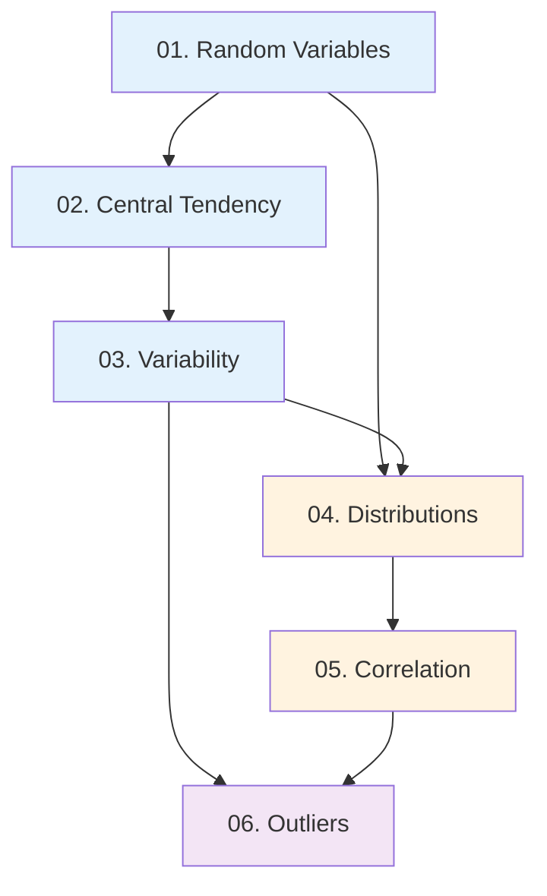

# Статистика для Machine Learning — План роботи

## 📊 Структура розділу

```
04.statistics-basics/
├── index.md                    ✅ Створено (навігаційна сторінка)
├── 01.random-variables.md      📝 Потребує заповнення
├── 02.central-tendency.md      📝 Потребує заповнення
├── 03.variability.md           📝 Потребує заповнення
├── 04.distributions.md         📝 Потребує заповнення
├── 05.correlation.md           📝 Потребує заповнення
└── 06.outliers.md              📝 Потребує заповнення
```

---

## 🎯 Залежності між статтями



**Порядок написання:**

1. **01 → 02 → 03** (фундамент: від випадковості до мір центру та розкиду)
2. **04** (розподіли — потребує 01 + 03)
3. **05** (кореляція — потребує розуміння варіації)
4. **06** (аутлайери — використовує все попереднє)

---

## 📝 Стиль та вимоги

### Загальні правила (з `college-lectures` скілу):

- ✅ **Виключно українська мова** (англійські терміни в дужках при першому згадуванні)
- ✅ **Академічний стиль підручника**, але без пафосу
- ✅ **Розгорнуті пояснення**: мінімум 2–3 абзаци на концепцію
- ✅ **Аналогії з реального світу** для складних понять
- ✅ **Jupyter Notebook компоненти** для всіх демонстрацій коду
- ✅ **PlantUML діаграми** на світлому фоні (НЕ ASCII-псевдографіка!)
- ✅ **Практичні завдання** трьох рівнів

### Hook-структура кожної статті:

1. **Hook** — реальна задача/проблема (мотивує вивчення)
2. **Аналогія** — пояснення через повсякденні речі
3. **Код-перше** — спочатку приклад, потім розбір
4. **Візуалізація** — діаграми, таблиці, графіки
5. **Практика** — базові → алгоритмічні → проєктні
6. **Резюме** — ключові takeaways у картках

---

## 🔧 Технічні компоненти

### Використовувати у кожній статті:

#### 1. Jupyter Notebook для коду:

```markdown
::jupyter-notebook{title="statistics_demo.ipynb" kernel="Python 3 (ipykernel)"}

::jupyter-cell{executionCount="1"}
```python
import numpy as np
mean = np.mean([1, 2, 3, 4, 5])
```

#output
3.0
::

::
```

#### 2. PlantUML для схем/процесів:

```markdown
::plant-uml

```plantuml
@startuml
skinparam style plain
skinparam backgroundColor #FFFFFF
' ... діаграма ...
@enduml
```

::
```

#### 3. Callouts для акцентів:

```markdown
::note
Додаткова інформація
::

::tip
Корисна порада
::

::warning
Застереження
::

::caution
Критичне попередження
::
```

#### 4. Картки для цілей та резюме:

```markdown
::card-group

::card{title="🎯 Мета" icon="i-lucide-target"}
- Пункт 1
- Пункт 2

::

::card{title="🔑 Терміни" icon="i-lucide-key"}
- **Термін** (*term*) — визначення

::

::
```

---

## 📚 Датасети для прикладів

**Використовуйте:**

1. **Синтетичні дані** (NumPy) — для ілюстрації концепцій
2. **Класичні датасети**:
   - Iris (квіти) — класифікація
   - Tips (чайові) — статистика
   - Titanic — виживання
3. **Бізнес-приклади**:
   - Зарплати в компанії (аутлайери)
   - Продажі (розподіли)
   - Ціни на житло (кореляція)

**Завантаження inline** (не потребує окремих файлів):

```python
from io import StringIO
import pandas as pd

csv_data = StringIO("""col1,col2
1,10
2,20""")
df = pd.read_csv(csv_data)
```

---

## ⚠️ Що НЕ робити

❌ **Числова нумерація в заголовках** (`## 1. Назва`, `### 1.1. Підназва`)  
✅ Замість цього: `## Назва` (природні заголовки)

❌ **ASCII-псевдографіка** в блоках коду (┌───┐, │...│, ───►)  
✅ Замість цього: PlantUML діаграми

❌ **Голий код без пояснень**  
✅ Замість цього: спочатку контекст, потім код, потім розбір

❌ **Сирий синтаксис формул** (`$$E = mc^2$$`)  
✅ Замість цього: `::math-formula` компонент

❌ **Забігання вперед** (згадки про ML-алгоритми без пояснення)  
✅ Замість цього: обмежитись NumPy/pandas/matplotlib

---

## 📊 Прогрес написання

| Стаття | Статус | Орієнтовний обсяг |
|--------|--------|-------------------|
| 01. Random Variables | 📝 Потребує заповнення | ~800 рядків |
| 02. Central Tendency | 📝 Потребує заповнення | ~1000 рядків |
| 03. Variability | 📝 Потребує заповнення | ~1200 рядків |
| 04. Distributions | 📝 Потребує заповнення | ~1500 рядків |
| 05. Correlation | 📝 Потребує заповнення | ~1200 рядків |
| 06. Outliers | 📝 Потребує заповнення | ~1000 рядків |

**Загальний обсяг:** ~6700 рядків матеріалу (розподілити на частини по ~150 рядків)

---

## 🚀 Наступні кроки

1. ✅ Створити структуру папок та файлів зі змістом
2. 📝 Написати **01.random-variables.md** (частинами по ~150 рядків)
3. 📝 Написати **02.central-tendency.md**
4. 📝 Написати **03.variability.md**
5. 📝 Написати **04.distributions.md**
6. 📝 Написати **05.correlation.md**
7. 📝 Написати **06.outliers.md**
8. ✅ Перевірити зв'язність між статтями
9. ✅ Додати перехресні посилання

---

## 💡 Порада щодо написання

**Не намагайтесь написати все за один раз!**

- Пишіть частинами по ~150 рядків
- Після кожної частини — пауза для рефлексії
- Перевіряйте, чи зрозумілі аналогії
- Тестуйте приклади коду перед вставкою
- Дивіться на попередні статті (`03.numpy-pandas.md`) як референс стилю

**Пам'ятайте:** Якість > Швидкість. Краще менше матеріалу, але він має бути бездоганним.

---

_Створено: 2026-09-11_
_Останнє оновлення: 2026-09-11_
