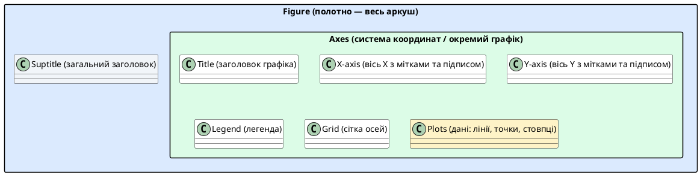

# Основи matplotlib — Figure, Axes та перший графік

::card-group

::card{title="🎯 Мета підтеми" icon="i-lucide-target"}

- Зрозуміти ієрархію об'єктів matplotlib: Figure → Axes → Plot
- Опанувати два підходи: pyplot (швидкий) та OOP (гнучкий)
- Навчитися будувати лінійні графіки функцій
- Освоїти базову кастомізацію: заголовки, підписи, сітка, легенда

::

::card{title="🔑 Ключові терміни" icon="i-lucide-key"}

- **Figure** — «полотно», вся область візуалізації (може містити кілька графіків)
- **Axes** — окрема система координат з віссю X та Y (сам графік)
- **pyplot** — state-based інтерфейс (як MATLAB)
- **OOP API** — об'єктно-орієнтований інтерфейс (рекомендований для складних графіків)

::

::

---

## Перший графік за 10 секунд: «Hello World» у візуалізації

Коли ви починаєте новий IT-проєкт, перше завдання розробника — не проєктувати складні класи, а швидко перевірити, чи працює система. У мовах програмування ми виводимо `print("Hello, World!")`. У візуалізації даних існує свій еквівалент: побудова графіка всього у 3 рядки коду.

> **Сюжетна лінія (Етап 1: Перший запуск проєкту):**  
> Уявіть, що ви розробляєте алгоритм аналізу успішності студентів або навчаєте власну AI-модель. Ви провели перші тести й отримали числовий результат. Вам потрібно миттєво відповісти на запитання: *«Чи є прогрес?»*. Таблиця чисел не дає відчуття динаміки, а швидкий графік показує її за пів секунди.

### Рівень 0: Абсолютний мінімум (3 рядки коду)

Щоб побудувати перший графік, достатньо передати в функцію `plt.plot()` навіть один список чисел:

```python
import matplotlib.pyplot as plt

plt.plot([1, 4, 9, 16])
plt.show()
```

Вам не довелося задавати горизонтальну вісь $X$ — Matplotlib автоматично згенерував індекси `[0, 1, 2, 3]`, розмітив вісь і з'єднав значення прямою лінією.

### Рівень 1: Явні координати X та Y (реальні дані)

У реальних проєктах величини завжди пов'язані між собою. Наприклад, скільки годин студент присвятив підготовці ($X$) та який бал на тесті він отримав ($Y$):

```python
hours = [1, 2, 3, 4, 5]
score = [55, 65, 70, 85, 95]

plt.plot(hours, score)
plt.show()
```

Тепер обидві осі відображають реальні фізичні величини нашого експерименту.

### Рівень 2: Додаємо контекст (назва, підписи осей та сітка)

Графік без підписів — це просто ламана лінія, яка нічого не говорить сторонньому спостерігачеві. Додамо кілька команд, щоб перетворити її на осмислений звіт:

```python
plt.plot(hours, score)
plt.title("Залежність балу від часу навчання")
plt.xlabel("Години навчання (год)")
plt.ylabel("Оцінка на тесті (бали)")
plt.grid(True, alpha=0.3)
plt.show()
```

::jupyter-notebook{title="hello_world_plot.ipynb"}

::jupyter-cell{executionCount="1"}
```python
import matplotlib.pyplot as plt
import numpy as np

fig, (ax1, ax2, ax3) = plt.subplots(1, 3, figsize=(15, 4.5), layout='constrained')

# Крок 1: Рівень 0 - Лише список Y
ax1.plot([1, 4, 9, 16], color='#2563EB', marker='o', lw=2)
ax1.set_title('Крок 1: plt.plot([1, 4, 9, 16])\n(X згенеровано: 0, 1, 2, 3)', fontsize=10, fontweight='bold')
ax1.grid(True, alpha=0.2)

# Крок 2: Рівень 1 - Явні X та Y
hours = [1, 2, 3, 4, 5]
score = [55, 65, 70, 85, 95]
ax2.plot(hours, score, color='#DC2626', marker='s', lw=2)
ax2.set_title('Крок 2: plt.plot(hours, score)\n(Реальні осі: час vs оцінка)', fontsize=10, fontweight='bold')
ax2.grid(True, alpha=0.2)

# Крок 3: Рівень 2 - Додавання контексту
ax3.plot(hours, score, color='#059669', marker='o', lw=2.5, markersize=7)
ax3.set_title('Крок 3: Повний контекст\n(title + xlabel + ylabel + grid)', fontsize=10, fontweight='bold', color='#065F46')
ax3.set_xlabel('Години навчання (год)', fontsize=10)
ax3.set_ylabel('Оцінка на тесті (бали)', fontsize=10)
ax3.grid(True, alpha=0.35, ls='--')

fig.suptitle('Еволюція графіка від 3 рядків коду до інформативного результату', fontsize=13, fontweight='bold')
plt.show()
```

#output
{.diagram-img}
::

::

::note
**Плавний місток: а що насправді відбулося за лаштунками?**

Ми написали лише команду `plt.plot()`, але Matplotlib без нашої явної вказівки створив одразу три сутності:
1. **Біле прямокутне полотно** (аркуш паперу, на якому все намальовано).
2. **Систему координат** із числовими шкалами, засічками та рамкою.
3. **Лінію даних**, яка поєднала координати точок.

У простих сценаріях автоматичне створення компонентів дуже зручне. Проте у складних проєктах нам знадобиться повний контроль над кожним окремим елементом. Саме тому Matplotlib пропонує два фундаментальні підходи до роботи.
::

---

## Історія про два підходи до готування

Уявіть, що ви вчитеся готувати піцу. Є два шефи-викладачі:

**Шеф А (pyplot):** «Візьми тісто. Намасти соусом. Постав у духовку на 200°C. Готово!» Він не каже, _яке_ тісто, _яку_ духовку — він припускає, що ви працюєте з «поточним» об'єктом. Швидко, зручно для простих завдань.

**Шеф Б (OOP API):** «Створи об'єкт `pizza = Pizza()`. Викличи метод `pizza.add_sauce("томатний")`. Передай об'єкт `pizza` у `oven.bake(pizza, temperature=200)`.» Більше коду, але абсолютна ясність: ти **явно** керуєш кожним об'єктом.

Matplotlib підтримує обидва підходи. Перший (`pyplot`) зручний для швидких експериментів у Jupyter. Другий (OOP) — для професійних проєктів, де потрібна точність та контроль.

::note
**Правило професіоналів:** використовуйте pyplot (`plt.plot()`) для швидких прототипів у ноутбуках. Для production-коду та складних дашбордів переходьте на OOP інтерфейс (`fig, ax = plt.subplots()`).
::

---

## Архітектура matplotlib: Figure, Axes, Plot

Перед тим, як будувати графіки, потрібно зрозуміти «анатомію» matplotlib. Це як анатомія людини: щоб лікувати, потрібно знати, де що знаходиться.

### Ієрархія об'єктів

::plant-uml{alt="Ієрархія об'єктів matplotlib"}



::

> Аналогія: **Figure** — це рамка для картини. **Axes** — це саме полотно всередині рамки. **Plot** — це малюнок на полотні. На одній рамці (Figure) може бути кілька полотен (Axes) — як у коміксі, де кілька панелей на сторінці.

::jupyter-notebook{title="anatomy.ipynb" kernel="Python 3 (ipykernel)"}

::jupyter-cell{type="markdown"}
### Анатомія matplotlib
Розберемо структуру на конкретному прикладі
::

::jupyter-cell{executionCount="1" executionTime="0.18s"}
```python
import matplotlib.pyplot as plt
import numpy as np

# Створюємо Figure (полотно) розміром 10x6 дюймів
fig = plt.figure(figsize=(10, 6))

# Створюємо Axes (систему координат) на цьому полотні
ax = fig.add_subplot(111)  # 1 рядок, 1 стовпець, графік №1

# Дані для побудови
x = np.linspace(0, 10, 100)
y = np.sin(x)

# Будуємо графік (Plot)
ax.plot(x, y, label="sin(x)", color="blue", linewidth=2)

# Додаємо елементи
ax.set_title("Структура matplotlib", fontsize=16, fontweight="bold")
ax.set_xlabel("Вісь X (незалежна змінна)", fontsize=12)
ax.set_ylabel("Вісь Y (залежна змінна)", fontsize=12)
ax.legend(loc="upper right")
ax.grid(True, alpha=0.3, linestyle="--")

# Анотації для пояснення структури
ax.annotate("Title (заголовок)", xy=(5, 0.8), xytext=(7, 0.9),
            fontsize=10, color="red", weight="bold",
            arrowprops=dict(arrowstyle="->", color="red"))

ax.annotate("Legend\n(легенда)", xy=(9.5, 0.9), xytext=(8, 0.6),
            fontsize=10, color="green", weight="bold",
            arrowprops=dict(arrowstyle="->", color="green"))

ax.annotate("Plot\n(графік)", xy=(3, 0.1), xytext=(1, -0.5),
            fontsize=10, color="purple", weight="bold",
            arrowprops=dict(arrowstyle="->", color="purple"))

plt.tight_layout()
plt.show()
```

#output
{.diagram-img}
::

::

::tip
**Корисна аналогія для запам'ятовування:**

- `Figure` = **будинок** (вся структура)
- `Axes` = **кімната** у будинку (може бути кілька кімнат)
- `Plot` = **меблі** у кімнаті (стіл, стілець = лінії, точки)

Ви не ставите меблі на фундамент (Figure), ви ставите їх у кімнату (Axes)!
::

---

## Два інтерфейси: pyplot vs OOP API

Matplotlib пропонує два способи створення графіків. Розберемо обидва на одному прикладі — побудові графіка параболи `y = x²`.

### Підхід 1: pyplot (state-based, MATLAB-style)

```python
import matplotlib.pyplot as plt
import numpy as np

x = np.linspace(-5, 5, 100)
y = x ** 2

# pyplot автоматично створює Figure та Axes «за лаштунками»
plt.plot(x, y)
plt.title("Парабола y = x²")
plt.xlabel("x")
plt.ylabel("y")
plt.grid(True)
plt.show()
```

{.diagram-img}

**Переваги:**
- Коротко, інтуїтивно
- Ідеально для швидких експериментів у Jupyter Notebook
- Схожий на MATLAB (легше для тих, хто знає MATLAB)

**Недоліки:**
- Неявний стан: `plt.plot()` модифікує «поточний» Axes — який саме? Не завжди зрозуміло
- Важко керувати кількома графіками одночасно
- У великих проєктах може призвести до плутанини

---

### Підхід 2: OOP API (explicit object references)

```python
import matplotlib.pyplot as plt
import numpy as np

x = np.linspace(-5, 5, 100)
y = x ** 2

# Явно створюємо Figure та Axes
fig, ax = plt.subplots(figsize=(8, 5))

# Використовуємо методи об'єкта ax
ax.plot(x, y, color="purple", linewidth=2)
ax.set_title("Парабола y = x²", fontsize=14)
ax.set_xlabel("x", fontsize=12)
ax.set_ylabel("y", fontsize=12)
ax.grid(True, alpha=0.3)

plt.show()
```

{.diagram-img}

**Переваги:**
- Явний контроль: ви завжди знаєте, з яким об'єктом працюєте
- Легко керувати кількома графіками (див. підтему про subplots)
- Професійний стандарт для production-коду

**Недоліки:**
- Трохи більше коду для простих випадків
- Потрібно розуміти об'єктну модель

::note
**Рекомендація:** у цьому курсі ми використовуємо **OOP API** (`fig, ax = plt.subplots()`), бо він готує вас до реальних проєктів. Pyplot залишається корисним для одноразових експериментів.
::

### Сигнатура функції plt.subplots() та варіації конфігурації сітки

Функція `plt.subplots()` є головною точкою входу в об'єктно-орієнтований інтерфейс Matplotlib. Вона водночас створює контейнер найвищого рівня — полотно `Figure` — та набір систем координат `Axes` у вигляді регулярної або гнучкої сітки.

```python [Сигнатура plt.subplots]
matplotlib.pyplot.subplots(
    nrows: int = 1,
    ncols: int = 1,
    *,
    sharex: bool | str = False,
    sharey: bool | str = False,
    squeeze: bool = True,
    width_ratios: Sequence[float] | None = None,
    height_ratios: Sequence[float] | None = None,
    subplot_kw: dict[str, Any] | None = None,
    gridspec_kw: dict[str, Any] | None = None,
    figsize: tuple[float, float] | None = None,
    dpi: float | None = None,
    layout: str | None = None,
    **fig_kw
) -> tuple[Figure, Axes | np.ndarray]
```

**Ключові параметри та їх призначення:**
- `nrows`, `ncols`: кількість рядків і стовпців у сітці підграфіків (за замовчуванням `1, 1`).
- `sharex`, `sharey`: спільний масштаб для осей (`True`, `'row'`, `'col'`). Дозволяє вирівняти шкали та автоматично приховати дубльовані мітки внутрішніх графіків.
- `squeeze`: при значенні `True` повертає один об'єкт `Axes` (якщо `1x1`) або 1D/2D масив NumPy для кількох графіків.
- `figsize`: кортеж `(ширина, висота)` у дюймах для масштабування загального полотна.
- `layout`: режим автопідгонки елементів (`'constrained'` або `'tight'`), що запобігає перекриттю підписів та заголовків.
- `gridspec_kw`: словник параметрів геометрії (зокрема `width_ratios` та `height_ratios` для нерівномірних пропорцій стовпців і рядків).

::jupyter-notebook{title="subplots_variations.ipynb"}

::jupyter-cell{executionCount="1"}
```python
import matplotlib.pyplot as plt
import numpy as np

# Демонстрація 4 ключових конфігурацій сітки plt.subplots()
fig = plt.figure(figsize=(14, 8), layout="constrained")
gs = fig.add_gridspec(2, 2)

# 1. Базовий одинарний графік (1x1)
ax1 = fig.add_subplot(gs[0, 0])
x = np.linspace(0, 10, 100)
ax1.plot(x, np.sin(x), color="#2563EB", lw=2)
ax1.set_title("1. Базовий: plt.subplots(figsize=(6, 4))", fontsize=11, fontweight="bold")
ax1.set_xlabel("x")
ax1.set_ylabel("sin(x)")
ax1.grid(True, alpha=0.25, ls="--")

# 2. Горизонтальний поділ (nrows=1, ncols=2)
sub_gs2 = gs[0, 1].subgridspec(1, 2)
ax2_a = fig.add_subplot(sub_gs2[0])
ax2_b = fig.add_subplot(sub_gs2[1])
ax2_a.plot(x, np.cos(x), color="#DC2626", lw=2)
ax2_a.set_title("ax1: cos(x)", fontsize=10)
ax2_a.grid(True, alpha=0.25, ls="--")
ax2_b.plot(x, -np.sin(x), color="#16A34A", lw=2)
ax2_b.set_title("ax2: -sin(x)", fontsize=10)
ax2_b.grid(True, alpha=0.25, ls="--")
ax2_a.figure.text(0.75, 0.96, "2. Горизонтальний поділ: nrows=1, ncols=2", 
                  ha="center", fontsize=11, fontweight="bold")

# 3. Сітка 2x2 зі спільними осями (sharex=True, sharey=True)
sub_gs3 = gs[1, 0].subgridspec(2, 2)
for i in range(2):
    for j in range(2):
        ax = fig.add_subplot(sub_gs3[i, j])
        freq = i + j + 1
        ax.plot(x, np.sin(freq * x), color="#7C3AED", lw=1.5)
        ax.set_title(f"freq={freq}", fontsize=9)
        ax.grid(True, alpha=0.25, ls="--")
        if i == 0:
            ax.tick_params(labelbottom=False)
        if j == 1:
            ax.tick_params(labelleft=False)
ax1.figure.text(0.28, 0.47, "3. Спільні осі: sharex=True, sharey=True", 
                ha="center", fontsize=11, fontweight="bold")

# 4. Несиметричні пропорції стовпців (width_ratios=[2, 1])
sub_gs4 = gs[1, 1].subgridspec(1, 2, width_ratios=[2, 1])
ax4_main = fig.add_subplot(sub_gs4[0])
ax4_side = fig.add_subplot(sub_gs4[1])
ax4_main.plot(x, np.exp(-x/4) * np.sin(2*x), color="#D97706", lw=2)
ax4_main.set_title("Головний тренд (width_ratios=2)", fontsize=10)
ax4_main.grid(True, alpha=0.25, ls="--")
ax4_side.hist(np.exp(-x/4) * np.sin(2*x), orientation="horizontal", 
              color="#F59E0B", edgecolor="black", alpha=0.7)
ax4_side.set_title("Гістограма (width=1)", fontsize=10)
ax4_side.grid(True, alpha=0.25, ls="--")
ax1.figure.text(0.75, 0.47, "4. Пропорції: width_ratios=[2, 1]", 
                ha="center", fontsize=11, fontweight="bold")

fig.suptitle("Варіації архітектури підграфіків: plt.subplots()", fontsize=14, fontweight="bold", y=1.01)
plt.show()
```

#output
{.diagram-img}
::

::

::jupyter-notebook{title="approaches_comparison.ipynb"}

::jupyter-cell{type="markdown"}
### Порівняння двох підходів
Побудуємо один і той самий графік обома способами
::

::jupyter-cell{executionCount="1"}
```python
import matplotlib.pyplot as plt
import numpy as np

x = np.linspace(0, 2*np.pi, 100)
y1 = np.sin(x)
y2 = np.cos(x)

# ===== Підхід 1: pyplot (MATLAB-style) =====
plt.figure(figsize=(12, 5))

plt.subplot(1, 2, 1)  # 1 рядок, 2 стовпці, графік №1
plt.plot(x, y1, label="sin(x)", color="blue")
plt.plot(x, y2, label="cos(x)", color="red")
plt.title("Підхід pyplot")
plt.xlabel("x")
plt.ylabel("y")
plt.legend()
plt.grid(True, alpha=0.3)

# ===== Підхід 2: OOP API =====
plt.subplot(1, 2, 2)
ax = plt.gca()  # Отримуємо об'єкт поточної системи координат (Axes)
ax.plot(x, y1, label="sin(x)", color="blue")
ax.plot(x, y2, label="cos(x)", color="red")
ax.set_title("Підхід OOP API")
ax.set_xlabel("x")
ax.set_ylabel("y")
ax.legend()
ax.grid(True, alpha=0.3)

plt.tight_layout()
plt.show()
```

#output
{.diagram-img}
::

::jupyter-cell{type="markdown"}
**Висновок:** результат ідентичний, але OOP підхід дає більше контролю і ясності.
::

::

---

## Побудова лінійних графіків

Лінійні графіки — це фундамент візуалізації. Вони показують, як одна величина змінюється відносно іншої.

> **Сюжетна лінія (Етап 2: Відстеження динаміки проєкту):**  
> Ваш IT-проєкт розвивається, і від поодиноких запусків ви переходите до регулярного моніторингу метрик. Наприклад, ви щодня фіксуєте показники роботи інфраструктури (температуру серверної, час відгуку бекенду чи денну активність користувачів). Щоб виявити тренд або аномалію, дискретні виміри з'єднують лінією, де кожна точка має своє точне значення.

### Базовий лінійний графік

::jupyter-notebook{title="line_plots.ipynb"}

::jupyter-cell{executionCount="1"}
```python
import matplotlib.pyplot as plt
import numpy as np

# Дані: температура протягом тижня
days = np.arange(1, 8)
temperature = [18, 22, 25, 23, 20, 19, 21]

fig, ax = plt.subplots(figsize=(8, 5))

ax.plot(days, temperature, marker="o", linestyle="-", color="orangered", 
        linewidth=2, markersize=8, label="Температура")

ax.set_title("Температура протягом тижня", fontsize=14, fontweight="bold")
ax.set_xlabel("День тижня", fontsize=12)
ax.set_ylabel("Температура (°C)", fontsize=12)
ax.set_xticks(days, labels=["Пн", "Вт", "Ср", "Чт", "Пт", "Сб", "Нд"])
ax.legend(loc="upper left")
ax.grid(True, alpha=0.3, linestyle="--")

plt.tight_layout()
plt.show()
```

#output
{.diagram-img}
::

::

### Кілька ліній на одному графіку

Часто потрібно порівняти кілька змінних на одному графіку.

> **Сюжетна лінія (Етап 3: Порівняння версій та продуктів):**  
> Один графік із кількома лініями — це найпростіший спосіб відповісти на ключове питання тімліда чи продуктового менеджера: *«Який варіант працює ефективніше?»*. Порівнюючи три продукти чи три версії алгоритму одночасно, ми повинні візуально розрізняти їх не лише кольором, а й геометрією маркерів, щоб графік залишався зрозумілим навіть при чорно-білому друку або слабкому проекторі.

::jupyter-notebook{title="multiple_lines.ipynb"}

::jupyter-cell{executionCount="1"}
```python
import matplotlib.pyplot as plt
import numpy as np

# Продажі трьох продуктів за 6 місяців
months = ["Січ", "Лют", "Бер", "Кві", "Тра", "Чер"]
product_a = [120, 150, 180, 170, 200, 220]
product_b = [80, 95, 110, 105, 130, 140]
product_c = [200, 190, 185, 180, 175, 170]

fig, ax = plt.subplots(figsize=(10, 6))

ax.plot(months, product_a, marker="o", label="Продукт A", linewidth=2)
ax.plot(months, product_b, marker="s", label="Продукт B", linewidth=2)
ax.plot(months, product_c, marker="^", label="Продукт C", linewidth=2)

ax.set_title("Динаміка продажів за півроку", fontsize=14, fontweight="bold")
ax.set_xlabel("Місяць", fontsize=12)
ax.set_ylabel("Обсяг продажів (тис. грн)", fontsize=12)
ax.legend(loc="best", fontsize=10)
ax.grid(True, alpha=0.3)

plt.tight_layout()
plt.show()
```

#output
{.diagram-img}
::

::

::tip
**Вибір маркерів та стилів ліній:**

| Маркер | Символ | Лінія      | Символ |
|:-------|:-------|:-----------|:-------|
| Коло   | `"o"`  | Суцільна   | `"-"`  |
| Квадрат| `"s"`  | Пунктирна  | `"--"` |
| Трикутник вгору | `"^"` | Штрих-пунктир | `"-."`|
| Трикутник вниз  | `"v"` | Точки      | `":"`  |
| Ромб   | `"D"`  | Без лінії  | `""`   |

Комбінуйте: `marker="o"` + `linestyle="--"` або коротко: `"o--"`
::

### Сигнатура методу ax.plot() та розширені варіації параметрів

Метод `ax.plot()` є базовим інструментом візуалізації одновимірних і двовимірних послідовностей. Він повертає список створених об'єктів `matplotlib.lines.Line2D`.

```python [Сигнатура ax.plot]
Axes.plot(
    *args: Any,  # [x], y, [fmt]
    scalex: bool = True,
    scaley: bool = True,
    data: Any | None = None,
    color: str | tuple | None = None,
    linestyle: str | tuple | None = None,
    linewidth: float | None = None,
    marker: str | None = None,
    markersize: float | None = None,
    markeredgecolor: str | tuple | None = None,
    markerfacecolor: str | tuple | None = None,
    markeredgewidth: float | None = None,
    alpha: float | None = None,
    label: str | None = None,
    drawstyle: str = "default",
    zorder: float | None = None,
    **kwargs
) -> list[Line2D]
```

**Аналіз ключових параметрів:**
- `[x], y`: числові масиви або послідовності координат. Якщо `x` опущено, Matplotlib генерує індекси `0, 1, ..., N-1`.
- `fmt`: компактний рядковий формат синтаксису MATLAB, що об'єднує колір, тип лінії та маркер в один рядок (наприклад, `'r--o'` — червона пунктирна лінія з круглими маркерами).
- `linestyle` (`ls`): тип накреслення лінії (`'-'`, `'--'`, `'-.'`, `':'`, або кастомні кортежі штрихів).
- `linewidth` (`lw`): товщина лінії в пунктах (типово `1.5`–`2.5`).
- `marker`: форма вузлових точок (`'o'`, `'s'`, `'^'`, `'D'`, `'*'` тощо).
- `markerfacecolor` (`mfc`) та `markeredgecolor` (`mec`): роздільний колір заливки та контуру маркера.
- `alpha`: коефіцієнт непрозорості від `0.0` (повністю прозорий) до `1.0` (непрозорий).
- `drawstyle`: алгоритм з'єднання точок (`'default'` — лінійна інтерполяція; `'steps-pre'`, `'steps-mid'`, `'steps-post'` — сходинкова інтерполяція для дискретних процесів).

::jupyter-notebook{title="plot_signature_variations.ipynb"}

::jupyter-cell{executionCount="1"}
```python
import matplotlib.pyplot as plt
import numpy as np

fig, axes = plt.subplots(2, 2, figsize=(14, 9), layout="constrained")
x = np.linspace(0, 5, 20)

# 1. Варіації стилів ліній (linestyle, linewidth)
ax = axes[0, 0]
styles = [
    ("Суцільна ('-')", "-", 2.5, "#2563EB"),
    ("Пунктирна ('--')", "--", 2.0, "#DC2626"),
    ("Штрих-пунктир ('-.')", "-.", 2.0, "#059669"),
    ("Точкова (':')", ":", 2.5, "#7C3AED"),
    ("Кастомні штрихи", (0, (5, 2, 1, 2)), 2.0, "#D97706")
]
for idx, (label, ls, lw, c) in enumerate(styles):
    ax.plot(x, np.sin(x) + idx * 0.8, linestyle=ls, linewidth=lw, color=c, label=label)
ax.set_title("1. Стилі та товщина ліній (linestyle, linewidth)", fontsize=11, fontweight="bold")
ax.legend(loc="upper right", fontsize=8.5, framealpha=0.9)
ax.grid(True, alpha=0.25, ls="--")

# 2. Варіації маркерів (marker, markersize, colors)
ax = axes[0, 1]
markers = [
    ("Коло ('o')", "o", "#2563EB", "#93C5FD"),
    ("Квадрат ('s')", "s", "#DC2626", "#FCA5A5"),
    ("Трикутник ('^')", "^", "#059669", "#6EE7B7"),
    ("Ромб ('D')", "D", "#7C3AED", "#C4B5FD"),
    ("Зірка ('*')", "*", "#D97706", "#FDE68A")
]
for idx, (label, m, mec, mfc) in enumerate(markers):
    ax.plot(x, np.cos(x) + idx * 0.8, marker=m, markersize=8, markeredgecolor=mec,
            markeredgewidth=1.5, markerfacecolor=mfc, linestyle="-", lw=1.2, 
            color=mec, label=label)
ax.set_title("2. Маркери точок (marker, facecolor, edgecolor)", fontsize=11, fontweight="bold")
ax.legend(loc="upper right", fontsize=8.5, framealpha=0.9)
ax.grid(True, alpha=0.25, ls="--")

# 3. Варіації drawstyle (дискретні сходинки vs згладжування)
ax = axes[1, 0]
xd = np.arange(0, 8)
yd = np.array([1, 3, 2, 5, 4, 6, 5, 7])
ax.plot(xd, yd, drawstyle="default", marker="o", color="#2563EB", lw=2, label="default (лінійна інтерполяція)")
ax.plot(xd, yd - 1.5, drawstyle="steps-pre", marker="s", color="#DC2626", lw=2, label="steps-pre (зміна перед кроком)")
ax.plot(xd, yd - 3.0, drawstyle="steps-mid", marker="^", color="#059669", lw=2, label="steps-mid (зміна по центру)")
ax.plot(xd, yd - 4.5, drawstyle="steps-post", marker="D", color="#7C3AED", lw=2, label="steps-post (зміна після кроку)")
ax.set_title("3. Стилі з'єднання точок (drawstyle)", fontsize=11, fontweight="bold")
ax.legend(loc="lower left", fontsize=8.5, framealpha=0.9)
ax.grid(True, alpha=0.25, ls="--")

# 4. Короткий строковий запис fmt ('r--o', 'b:^', 'g-.*')
ax = axes[1, 1]
xf = np.linspace(0, 4, 15)
ax.plot(xf, xf**0.5, "r--o", lw=2, markersize=6, label="'r--o' (червоний, пунктир, коло)")
ax.plot(xf, xf**1.0, "b-s", lw=2, markersize=6, label="'b-s' (синій, суцільний, квадрат)")
ax.plot(xf, xf**1.5, "g-.^", lw=2, markersize=6, label="'g-.^' (зелений, штрих-пунктир, трикутник)")
ax.plot(xf, xf**2.0, "m:D", lw=2, markersize=6, label="'m:D' (маджента, точки, ромб)")
ax.set_title("4. Скорочений формат виклику fmt: '[колір][лінія][маркер]'", fontsize=11, fontweight="bold")
ax.legend(loc="upper left", fontsize=8.5, framealpha=0.9)
ax.grid(True, alpha=0.25, ls="--")

fig.suptitle("Параметричні варіації методу ax.plot()", fontsize=14, fontweight="bold")
plt.show()
```

#output
{.diagram-img}
::

::

---

## Кастомізація графіків

Графік без підписів — це як карта без легенди. Навчимося робити графіки **інформативними** та **естетичними**.

> **Сюжетна лінія (Етап 4: Підготовка графіків для тімліда та інвесторів):**  
> Чернетковий графік працює для вас особисто, поки ви пишете код у ноутбуці. Але коли результат потрібно презентувати команді, керівництву чи замовникам, вимоги кардинально змінюються:  
> 1. Якщо вісь не підписана — аудиторія не знає, у чому вимірюється успіх: у гривнях, секундах чи відсотках.  
> 2. Якщо немає сітки — неможливо швидко оцінити порогові значення (наприклад, коли саме показник перетнув критичну межу).  
> 3. Якщо лінії не мають чіткої легенди — графік викликає розгубленість замість розуміння.  
> 4. Якщо кольори не підібрані — графік стане недоступним для людей із порушеннями кольорового зору.  
> Кастомізація — це перетворення сирих числових даних на переконливий інструмент прийняття рішень.


### Заголовки та підписи осей

::jupyter-notebook{title="labels_titles.ipynb"}

::jupyter-cell{executionCount="1"}
```python
import matplotlib.pyplot as plt
import numpy as np

x = np.linspace(0, 10, 100)
y = np.exp(-x/5) * np.sin(2*x)

fig, ax = plt.subplots(figsize=(10, 6))

ax.plot(x, y, color="darkblue", linewidth=2.5)

# Заголовок з параметрами
ax.set_title("Загасаюча синусоїда", 
             fontsize=16, 
             fontweight="bold", 
             color="darkred",
             pad=20)  # Відступ від графіка

# Підписи осей
ax.set_xlabel("Час (секунди)", fontsize=13, fontstyle="italic")
ax.set_ylabel("Амплітуда", fontsize=13, fontstyle="italic")

# Межі осей
ax.set_xlim(0, 10)
ax.set_ylim(-1, 1)

plt.tight_layout()
plt.show()
```

#output
{.diagram-img}
::

::

### Сигнатури методів текстового оформлення (set_title, set_xlabel, set_ylabel)

Усі текстові елементи осей повертають екземпляр класу `matplotlib.text.Text`, що дозволяє тонко налаштовувати типографіку, відступи та вирівнювання.

```python [Сигнатури set_title, set_xlabel, set_ylabel]
Axes.set_title(
    label: str,
    fontdict: dict[str, Any] | None = None,
    loc: Literal['left', 'center', 'right'] = 'center',
    pad: float | None = None,
    *,
    y: float | None = None,
    **kwargs
) -> Text

Axes.set_xlabel(
    xlabel: str,
    fontdict: dict[str, Any] | None = None,
    labelpad: float | None = None,
    *,
    loc: Literal['left', 'center', 'right'] = None,
    **kwargs
) -> Text

Axes.set_ylabel(
    ylabel: str,
    fontdict: dict[str, Any] | None = None,
    labelpad: float | None = None,
    *,
    loc: Literal['bottom', 'center', 'top'] = None,
    **kwargs
) -> Text
```

**Ключові параметри:**
- `loc`: розташування тексту. Для `set_title` та `set_xlabel` доступні `'left'`, `'center'`, `'right'`; для `set_ylabel` — `'bottom'`, `'center'`, `'top'`. Можна викликати `set_title()` тричі з різними `loc`, щоб одночасно розмістити заголовок зліва, по центру та справа.
- `pad` / `labelpad`: фізичний відступ (у пунктах типографіки) між текстовим підписом та рамкою або засічками осі.
- `fontsize`, `fontweight`, `fontstyle`: кегль (розмір шрифту), жирність (`'bold'`, `'normal'`) та нахил (`'italic'`).
- `color`, `backgroundcolor`: колір самого шрифту та кольорова підкладка фону підпису.
- `rotation`: кут повороту напису в градусах (наприклад, `rotation=0` для читабельного горизонтального підпису осі Y).

::jupyter-notebook{title="title_labels_variations.ipynb"}

::jupyter-cell{executionCount="1"}
```python
import matplotlib.pyplot as plt
import numpy as np

fig, axes = plt.subplots(2, 2, figsize=(13, 8), layout="constrained")
x = np.linspace(0, 6, 50)
y = np.sin(x)

# 1. Позиціонування заголовка loc & pad
ax = axes[0, 0]
ax.plot(x, y, color="#2563EB", lw=2)
ax.set_title("loc='left', pad=15", loc="left", fontsize=11, fontweight="bold", color="#1E3A8A", pad=15)
ax.set_xlabel("Вісь X", loc="right", fontsize=10)
ax.set_ylabel("Вісь Y", loc="top", fontsize=10)
ax.grid(True, alpha=0.25, ls="--")

# 2. Стилізація кольорів, фону та шрифтів
ax = axes[0, 1]
ax.plot(x, y, color="#DC2626", lw=2)
ax.set_title("Стилізація: колір, фон та відступ", fontsize=11, fontweight="bold",
             color="white", backgroundcolor="#991B1B", pad=12)
ax.set_xlabel("Час t (секунди)", fontsize=11, fontstyle="italic", fontweight="bold", color="#4B5563", labelpad=10)
ax.set_ylabel("Амплітуда A (В)", fontsize=11, fontstyle="italic", color="#4B5563")
ax.grid(True, alpha=0.25, ls="--")

# 3. Багаторівневий заголовок і повороти підписів
ax = axes[1, 0]
ax.plot(x, y * 100, color="#059669", lw=2)
ax.set_title("Головний заголовок системи\n[Додаткова технічна примітка: v=2.4 ГГц]", 
             fontsize=10, fontweight="bold", color="#065F46", linespacing=1.4)
ax.set_xlabel("Поворот міток: rotation=0", fontsize=10, labelpad=8)
ax.set_ylabel("Значення (%)\n[rotation=0]", fontsize=10, rotation=0, labelpad=35, va="center")
ax.grid(True, alpha=0.25, ls="--")

# 4. Три незалежних заголовки на одному графіку (left, center, right)
ax = axes[1, 1]
ax.plot(x, np.cos(x), color="#7C3AED", lw=2)
ax.set_title("Звіт: Травень 2026", loc="left", fontsize=9, color="#6B7280", fontweight="bold")
ax.set_title("Датчик #12", loc="center", fontsize=11, color="#111827", fontweight="bold")
ax.set_title("Статус: OK", loc="right", fontsize=9, color="#059669", fontweight="bold")
ax.set_xlabel("Кроки алгоритму (ітерації)", fontsize=10)
ax.set_ylabel("cos(x)", fontsize=10)
ax.grid(True, alpha=0.25, ls="--")

fig.suptitle("Варіації оформлення заголовків та осей (set_title, set_xlabel, set_ylabel)", 
             fontsize=14, fontweight="bold")
plt.show()
```

#output
{.diagram-img}
::

::

### Сітка для зручності читання

Сітка допомагає точніше визначити координати точок на графіку.

::jupyter-notebook{title="grid_examples.ipynb"}

::jupyter-cell{executionCount="1"}
```python
import matplotlib.pyplot as plt
import numpy as np

x = np.linspace(0, 4*np.pi, 100)
y = np.sin(x)

fig, (ax1, ax2, ax3) = plt.subplots(1, 3, figsize=(15, 4))

# Без сітки
ax1.plot(x, y)
ax1.set_title("Без сітки")

# Сітка за замовчуванням
ax2.plot(x, y)
ax2.grid(True)
ax2.set_title("Сітка за замовчуванням")

# Кастомна сітка
ax3.plot(x, y)
ax3.grid(True, alpha=0.3, linestyle="--", linewidth=1, color="gray")
ax3.set_title("Кастомна сітка")

plt.tight_layout()
plt.show()
```

#output
{.diagram-img}
::

::

::note
**Параметри `grid()`:**

- `alpha` — прозорість (0.0 = невидима, 1.0 = повністю непрозора). Рекомендація: 0.3–0.5
- `linestyle` — стиль лінії (`"-"`, `"--"`, `"-."`, `":"`)
- `linewidth` — товщина лінії
- `color` — колір сітки
- `which` — `"major"` (основні мітки) або `"both"` (основні + другорядні)
::

### Сигнатура методу ax.grid() та розширені варіації координатної сітки

Метод `ax.grid()` керує нанесенням ліній координатної сітки для швидкого візуального зчитування значень з графіків.

```python [Сигнатура ax.grid]
Axes.grid(
    visible: bool | None = None,
    which: Literal['major', 'minor', 'both'] = 'major',
    axis: Literal['both', 'x', 'y'] = 'both',
    **kwargs  # color, linestyle, linewidth, alpha
) -> None
```

**Аналіз параметрів методу `grid()`:**
- `visible`: логічний прапорець показу сітки (`True` — показати, `False` — приховати).
- `which`: шкала засічок, на якій базується сітка:
  - `'major'` — за основними числовими мітками.
  - `'minor'` — за проміжними (допоміжними) засічками (активуються через `ax.minorticks_on()`).
  - `'both'` — одночасно за обома шкалами (для щільного аналізу).
- `axis`: напрямок ліній сітки (`'both'` — повна сітка, `'x'` — вертикальні лінії для таймлайнів, `'y'` — горизонтальні лінії для порівняння рівнів значень).
- `linestyle`, `linewidth`, `color`, `alpha`: параметри накреслення ліній сітки.

::jupyter-notebook{title="grid_signature_variations.ipynb"}

::jupyter-cell{executionCount="1"}
```python
import matplotlib.pyplot as plt
import numpy as np

fig, axes = plt.subplots(2, 2, figsize=(13, 8), layout="constrained")
x = np.linspace(0, 10, 100)
y = 5 * np.exp(-x/3) * np.cos(2*x)

# 1. Тільки горизонтальна сітка для значень Y
ax = axes[0, 0]
ax.plot(x, y, color="#2563EB", lw=2)
ax.set_title("1. Тільки вісь Y: grid(axis='y', alpha=0.5)", fontsize=11, fontweight="bold")
ax.grid(axis="y", color="#94A3B8", linestyle="-", linewidth=0.8, alpha=0.6)
ax.set_xlabel("x")
ax.set_ylabel("y")

# 2. Тільки вертикальна сітка для часових етапів
ax = axes[0, 1]
ax.plot(x, y, color="#DC2626", lw=2)
ax.set_title("2. Тільки вісь X: grid(axis='x', linestyle=':')", fontsize=11, fontweight="bold")
ax.grid(axis="x", color="#DC2626", linestyle=":", linewidth=1.2, alpha=0.5)
ax.set_xlabel("Час (дні)")
ax.set_ylabel("y")

# 3. Дворівнева сітка: major + minor
ax = axes[1, 0]
ax.plot(x, y, color="#059669", lw=2)
ax.minorticks_on()
ax.grid(which="major", color="#1E293B", linestyle="-", linewidth=0.8, alpha=0.5)
ax.grid(which="minor", color="#64748B", linestyle=":", linewidth=0.5, alpha=0.4)
ax.set_title("3. Подвійна сітка: which='major' + which='minor'", fontsize=11, fontweight="bold")
ax.set_xlabel("x")
ax.set_ylabel("y")

# 4. Стилізована сітка на фоновій підкладці
ax = axes[1, 1]
ax.plot(x, y, color="#D97706", lw=2)
ax.set_facecolor("#F8FAFC")
ax.grid(True, color="#CBD5E1", linestyle=(0, (4, 4)), linewidth=1.5, alpha=0.8)
ax.set_title("4. Кастомний патерн на підкладці (facecolor='#F8FAFC')", fontsize=11, fontweight="bold")
ax.set_xlabel("x")
ax.set_ylabel("y")

fig.suptitle("Варіації налаштування координатної сітки: ax.grid()", fontsize=14, fontweight="bold")
plt.show()
```

#output
{.diagram-img}
::

::

---

### Легенда — що означають лінії

Коли на графіку кілька ліній, легенда **обов'язкова**.

::jupyter-notebook{title="legends.ipynb"}

::jupyter-cell{executionCount="1"}
```python
import matplotlib.pyplot as plt
import numpy as np

x = np.linspace(0, 10, 100)

fig, ax = plt.subplots(figsize=(10, 6))

# Будуємо три функції з параметром label
ax.plot(x, np.sin(x), label="sin(x)", linewidth=2)
ax.plot(x, np.cos(x), label="cos(x)", linewidth=2)
ax.plot(x, np.sin(x) * np.cos(x), label="sin(x)·cos(x)", linewidth=2, linestyle="--")

ax.set_title("Тригонометричні функції", fontsize=14, fontweight="bold")
ax.set_xlabel("x")
ax.set_ylabel("y")
ax.grid(True, alpha=0.3)

# Легенда з параметрами
ax.legend(loc="upper right",       # Розташування
          fontsize=11,              # Розмір шрифту
          frameon=True,             # Рамка навколо легенди
          shadow=True,              # Тінь
          fancybox=True)            # Заокруглені кути

plt.tight_layout()
plt.show()
```

#output
{.diagram-img}
::

::

::tip
**Позиціонування легенди (`loc`):**

| Значення       | Розташування      |
|:---------------|:------------------|
| `"best"`       | Автоматично (уникає перекриття з даними) |
| `"upper right"`| Правий верхній кут |
| `"upper left"` | Лівий верхній кут  |
| `"lower right"`| Правий нижній кут  |
| `"lower left"` | Лівий нижній кут   |
| `"center"`     | По центру         |

Рекомендація: використовуйте `"best"` — matplotlib сам обере найкраще місце.
::

### Сигнатура методу ax.legend() та варіації конфігурації

Метод `ax.legend()` збирає всі елементи графіків, що мають атрибут `label`, та формує блок розшифровки позначень.

```python [Сигнатура ax.legend]
Axes.legend(
    *args,
    loc: str | int | tuple[float, float] = 'best',
    bbox_to_anchor: tuple[float, float] | BboxBase | None = None,
    ncols: int = 1,  # У Matplotlib 3.6+ додано ncols замість застарілого ncol
    fontsize: int | float | str | None = None,
    title: str | None = None,
    title_fontsize: int | float | str | None = None,
    frameon: bool = True,
    framealpha: float | None = None,
    facecolor: ColorType | None = None,
    edgecolor: ColorType | None = None,
    fancybox: bool = True,
    shadow: bool | dict = False,
    **kwargs
) -> Legend
```

::note
**Сучасний API (Matplotlib 3.6+):** Використовуйте параметр `ncols` замість застарілого `ncol`. Хоча `ncol` зберігається для зворотної сумісності, `ncols` відповідає стандарту найменування множини стовпців, прийнятому в `plt.subplots(nrows, ncols)`.
::

**Аналіз ключових параметрів:**
- `loc`: положення легенди відносно обмежувальної рамки осей або координатної прив'язки.
- `bbox_to_anchor`: кортеж координат `(x, y)` або `(x, y, width, height)` у відносних координатах осі `[0, 1]`. Дозволяє винести легенду за межі графіка (наприклад, `bbox_to_anchor=(1.02, 1)`, щоб легенда не закривала дані).
- `ncols`: кількість колонок для розміщення підписів горизонтально.
- `title`: текстовий заголовок блоку легенди.
- `frameon`, `facecolor`, `edgecolor`: керування наявністю рамки, кольором тла та кольором обвідки.
- `fancybox`: заокруглення кутів плашки легенди.

::jupyter-notebook{title="legend_signature_variations.ipynb"}

::jupyter-cell{executionCount="1"}
```python
import matplotlib.pyplot as plt
import numpy as np

fig, axes = plt.subplots(2, 2, figsize=(14, 9), layout="constrained")
x = np.linspace(0, 6, 50)
y1 = np.sin(x)
y2 = np.cos(x)
y3 = np.sin(x) * np.cos(x)

def draw_lines(ax):
    ax.plot(x, y1, label="Канал A: sin(x)", color="#2563EB", lw=2)
    ax.plot(x, y2, label="Канал B: cos(x)", color="#DC2626", lw=2)
    ax.plot(x, y3, label="Канал C: sin·cos", color="#059669", lw=2, ls="--")
    ax.grid(True, alpha=0.25, ls="--")

# 1. Базове кутове розташування
ax = axes[0, 0]
draw_lines(ax)
ax.set_title("1. Стандартні позиції: loc='upper right'", fontsize=11, fontweight="bold")
ax.legend(loc="upper right", frameon=True, facecolor="white", edgecolor="#CBD5E1")

# 2. Багатоколонкова легенда (ncols=3)
ax = axes[0, 1]
draw_lines(ax)
ax.set_title("2. Багатоколонкова: ncols=3, loc='upper center'", fontsize=11, fontweight="bold")
ax.legend(loc="upper center", ncols=3, fontsize=8.5, frameon=True, 
          facecolor="#F1F5F9", edgecolor="#94A3B8")

# 3. Винесена за межі графіка (bbox_to_anchor)
ax = axes[1, 0]
draw_lines(ax)
ax.set_title("3. Винесена назовні: bbox_to_anchor=(1.02, 1)", fontsize=11, fontweight="bold")
ax.legend(bbox_to_anchor=(1.02, 1), loc="upper left", borderaxespad=0,
          title="Джерела сигналу", title_fontsize=9, fontsize=8.5)

# 4. Стилізована картка легенди (title, shadow, fancybox, alpha)
ax = axes[1, 1]
draw_lines(ax)
ax.set_title("4. Кастомізована плашка: title, shadow=True, fancybox", fontsize=11, fontweight="bold")
ax.legend(loc="lower left", title="Метрики сенсорів", title_fontproperties={"weight": "bold"},
          fontsize=9, fancybox=True, shadow=True, facecolor="#FEF3C7", 
          edgecolor="#F59E0B", framealpha=0.9, borderpad=0.8)

fig.suptitle("Варіації позиціонування та стилізації легенди: ax.legend()", fontsize=14, fontweight="bold")
plt.show()
```

#output
{.diagram-img}
::

::

---

### Кольори та стилі

Колір — це не прикраса, а **інформація**. Правильний вибір кольорів робить графік зрозумілішим.

::jupyter-notebook{title="colors_styles.ipynb"}

::jupyter-cell{type="markdown"}
### Способи задання кольорів
Matplotlib підтримує кілька форматів
::

::jupyter-cell{executionCount="1"}
```python
import matplotlib.pyplot as plt
import numpy as np

x = np.linspace(0, 5, 50)

fig, ax = plt.subplots(figsize=(10, 6))

# Способи задання кольорів:
ax.plot(x, x + 0, color="red", label="Назва кольору: 'red'", linewidth=2)
ax.plot(x, x + 1, color="r", label="Короткий код: 'r'", linewidth=2)
ax.plot(x, x + 2, color="#FF6B35", label="HEX: '#FF6B35'", linewidth=2)
ax.plot(x, x + 3, color=(0.2, 0.4, 0.8), label="RGB tuple: (0.2, 0.4, 0.8)", linewidth=2)
ax.plot(x, x + 4, color="C4", label="Колір з палітри: 'C4'", linewidth=2)

ax.set_title("Способи задання кольорів", fontsize=14, fontweight="bold")
ax.set_xlabel("x")
ax.set_ylabel("y")
ax.legend(loc="upper left")
ax.grid(True, alpha=0.3)

plt.tight_layout()
plt.show()
```

#output
{.diagram-img}
::

::

::warning
**Колірна сліпота (Color Blindness):**

~8% чоловіків та ~0.5% жінок мають порушення кольорового зору. **Не використовуйте лише червоний та зелений** для розрізнення категорій!

Безпечні комбінації:
- Синій + Помаранчевий
- Синій + Жовтий
- Фіолетовий + Зелений

Використовуйте різні **стилі ліній** (`linestyle`) та **маркери** як додатковий канал інформації.
::

---

### Розміри та пропорції

Розмір графіка впливає на читабельність. Занадто маленький — не видно деталей. Занадто великий — марнування місця.

::jupyter-notebook{title="figure_sizes.ipynb"}

::jupyter-cell{executionCount="1"}
```python
import matplotlib.pyplot as plt
import numpy as np

x = np.linspace(0, 10, 100)
y = np.sin(x)

# Три різні розміри
fig, (ax1, ax2, ax3) = plt.subplots(1, 3, figsize=(16, 4))

# Маленька фігура (не рекомендується для складних графіків)
ax1.plot(x, y)
ax1.set_title("4x3 дюйми (замала)", fontsize=10)
ax1.set_xlabel("x", fontsize=8)
ax1.set_ylabel("y", fontsize=8)

# Оптимальна фігура для звітів
ax2.plot(x, y)
ax2.set_title("8x6 дюймів (оптимально)", fontsize=12)
ax2.set_xlabel("x", fontsize=10)
ax2.set_ylabel("y", fontsize=10)

# Велика фігура для презентацій
ax3.plot(x, y)
ax3.set_title("12x9 дюймів (презентація)", fontsize=14)
ax3.set_xlabel("x", fontsize=12)
ax3.set_ylabel("y", fontsize=12)

plt.tight_layout()
plt.show()
```

#output
{.diagram-img}
::

::

::tip
**Рекомендовані розміри `figsize=(width, height)` у дюймах:**

| Призначення          | Розмір          | Пропорції |
|:---------------------|:----------------|:----------|
| Jupyter Notebook     | `(8, 5)`        | 16:10     |
| Наукова стаття       | `(6, 4)`        | 3:2       |
| Презентація (слайд)  | `(10, 6)`       | 16:9.6    |
| Дашборд (широкий)    | `(12, 4)`       | 3:1       |
| Квадратний графік    | `(6, 6)`        | 1:1       |

За замовчуванням matplotlib використовує `(6.4, 4.8)` дюймів = 640x480 пікселів при dpi=100.
::

### Сигнатури керування шкалами, засічками та мітками осей (xlim, ylim, xticks, tick_params)

Повний контроль над геометрією осей дозволяє фокусувати увагу на ключових ділянках даних, додавати текстові назви категорій або змінювати напрямок шкал.

```python [Сигнатури методів керування осями та мітками]
Axes.set_xlim(
    left: float | None = None,
    right: float | None = None,
    *,
    emit: bool = True,
    auto: bool = False,
    **kwargs
) -> tuple[float, float]

Axes.set_ylim(
    bottom: float | None = None,
    top: float | None = None,
    *,
    emit: bool = True,
    auto: bool = False,
    **kwargs
) -> tuple[float, float]

Axes.set_xticks(
    ticks: Sequence[float],
    labels: Sequence[str] | None = None,
    *,
    minor: bool = False,
    **kwargs
) -> list[Tick]

Axes.tick_params(
    axis: Literal['both', 'x', 'y'] = 'both',
    **kwargs  # which, direction, length, width, color, pad, labelsize, rotation
) -> None
```

::tip
**Сучасний API для підписів засічок:** У старих версіях Matplotlib використовували пару викликів `ax.set_xticks(ticks)` та `ax.set_xticklabels(labels)`. Починаючи з версії 3.5, рекомендовано передавати мітки безпосередньо у метод `ax.set_xticks(ticks, labels=labels)`. Це гарантує взаємно-однозначну прив'язку засічок до міток і запобігає попередженню `UserWarning: FixedFormatter should only be used together with FixedLocator`.
::

**Аналіз параметрів:**
- `left`, `right` (або `bottom`, `top`): межі видимої області. Якщо передати значення у зворотному порядку (наприклад, `set_xlim(10, 0)`), вісь інвертується — це корисно для глибини чи рангових списків.
- `ticks`, `labels`: числові позиції засічок та відповідні їм текстові підписи.
- `tick_params(direction='in' | 'out' | 'inout')`: спрямування засічок всередину чи назовні графіка, налаштування їхньої довжини (`length`) та товщини (`width`).
- `ax.set_xscale('log')` / `ax.set_yscale('log')`: перемикання лінійної шкали на логарифмічну для даних з експоненційним зростанням.

::jupyter-notebook{title="axes_ticks_variations.ipynb"}

::jupyter-cell{executionCount="1"}
```python
import matplotlib.pyplot as plt
import numpy as np

fig, axes = plt.subplots(2, 2, figsize=(14, 8), layout="constrained")
x = np.linspace(0, 10, 100)
y = np.sin(x)

# 1. Межі та інверсія осей
ax = axes[0, 0]
ax.plot(x, y, color="#2563EB", lw=2)
ax.set_xlim(10, 0)  # Інверсія осі X від 10 до 0
ax.set_ylim(-1.5, 1.5)
ax.set_title("1. Інверсія осі X: set_xlim(10, 0)", fontsize=11, fontweight="bold")
ax.grid(True, alpha=0.25, ls="--")

# 2. Сучасний API: set_xticks(ticks, labels=...)
ax = axes[0, 1]
days_x = [0, 2, 4, 6, 8, 10]
days_labels = ["Пн", "Ср", "Пт", "Нд", "Вівт (наст.)", "Четв (наст.)"]
ax.plot(x, y, color="#DC2626", lw=2)
ax.set_xticks(days_x, labels=days_labels, rotation=30, fontsize=9)
ax.set_title("2. Текстові мітки: set_xticks(ticks, labels=...)", fontsize=11, fontweight="bold")
ax.grid(True, alpha=0.25, ls="--")

# 3. Налаштування засічок tick_params (внутрішні засічки)
ax = axes[1, 0]
ax.plot(x, y, color="#059669", lw=2)
ax.tick_params(direction="in", length=8, width=1.8, colors="#1E293B",
               grid_color="#94A3B8", grid_alpha=0.4, top=True, right=True)
ax.grid(True)
ax.set_title("3. Засічки всередину: tick_params(direction='in', top=True)", fontsize=11, fontweight="bold")

# 4. Логарифмічний масштаб осей
ax = axes[1, 1]
x_exp = np.linspace(1, 100, 200)
y_exp = x_exp ** 2
ax.plot(x_exp, y_exp, color="#7C3AED", lw=2)
ax.set_xscale("log")
ax.set_yscale("log")
ax.set_title("4. Логарифмічні шкали: set_xscale('log'), set_yscale('log')", fontsize=11, fontweight="bold")
ax.grid(True, which="both", alpha=0.25, ls="--")

fig.suptitle("Варіації керування шкалами, засічками та мітками", fontsize=14, fontweight="bold")
plt.show()
```

#output
{.diagram-img}
::

::

---

## Збереження графіків у файли

Після створення графіка його потрібно зберегти для звітів, презентацій або публікацій.

> **Сюжетна лінія (Етап 5: Фінальний реліз та публікація):**  
> Ваш дашборд або графік нарешті готовий. Залишився останній крок — поділитися ним зі світом. Але в якому форматі?  
> - Для наукового звіту, курсової чи статті у форматі PDF/LaTeX потрібна векторна графіка (`.pdf` або `.svg`), де лінії ніколи не розмиваються при масштабуванні чи друку.  
> - Для бізнес-презентації або сайту з темною темою потрібен високоякісний растровий `.png` із прозорим фоном (`transparent=True`), щоб графік гармонійно лягав на будь-який дизайн слайду без білої рамки.

::jupyter-notebook{title="saving_figures.ipynb"}

::jupyter-cell{executionCount="1"}
```python
import matplotlib.pyplot as plt
import numpy as np

x = np.linspace(0, 10, 100)
y = np.sin(x)

fig, ax = plt.subplots(figsize=(8, 5))
ax.plot(x, y, linewidth=2)
ax.set_title("Синусоїда для звіту", fontsize=14)
ax.set_xlabel("x")
ax.set_ylabel("sin(x)")
ax.grid(True, alpha=0.3)

# Збереження у різних форматах
fig.savefig("sinus_plot.png", dpi=300, bbox_inches="tight")     # Растр (для веб)
fig.savefig("sinus_plot.pdf", bbox_inches="tight")              # Вектор (для друку)
fig.savefig("sinus_plot.svg", bbox_inches="tight")              # Вектор (для веб)

print("✅ Графік збережено у трьох форматах!")

plt.show()
```

#output
✅ Графік збережено у трьох форматах!

{.diagram-img}
::

::

::note
**Параметри `savefig()`:**

- `dpi` — роздільна здатність (dots per inch). Для екрану: 100–150. Для друку: 300+
- `bbox_inches="tight"` — обрізати зайві поля навколо графіка
- `transparent=True` — прозорий фон (корисно для презентацій)
- `facecolor="white"` — колір фону (якщо не прозорий)
- `format` — формат файлу (`"png"`, `"pdf"`, `"svg"`, `"jpg"`). Визначається автоматично з розширення

**Вибір формату:**
- **PNG** — растр, універсальний, підтримується всюди
- **PDF** — вектор, ідеально для наукових статей (можна збільшувати без втрати якості)
- **SVG** — вектор, для веб-сторінок та інтерактивних графіків
- **JPG** — уникайте для графіків (втрати через стиснення)
::

### Сигнатура методу fig.savefig() та розширені режими експорту

Метод `fig.savefig()` відповідає за збереження графічного полотна на диск у растрових (PNG, JPEG) або векторних (PDF, SVG) форматах.

```python [Сигнатура fig.savefig]
Figure.savefig(
    fname: str | PathLike | BinaryIO,
    *,
    dpi: float | Literal['figure'] = 'figure',
    format: str | None = None,
    bbox_inches: Literal['tight'] | Bbox | None = None,
    pad_inches: float = 0.1,
    facecolor: ColorType = 'auto',
    edgecolor: ColorType = 'auto',
    transparent: bool = False,
    **kwargs
) -> None
```

**Критичні параметри збереження:**
- `fname`: шлях до файлу (з розширенням) або файловий об'єкт у пам'яті (`io.BytesIO`).
- `dpi`: роздільна здатність у точках на дюйм (dots per inch). Для презентацій і екранів достатньо `100`–`150`, для поліграфічного друку — `300`+.
- `bbox_inches='tight'`: обчислює реальні межі всіх написів і легенд та обрізає зайві порожні поля навколо графіків.
- `pad_inches`: додатковий захисний відступ у дюймах навколо обрізаної області (за замовчуванням `0.1`).
- `transparent`: зберігає графік з прозорим альфа-каналом замість білого фону (ідеально для вбудовування в слайди презентацій чи вебсайти з темною темою).
- `format`: примусове зазначення формату файлу (якщо розширення у `fname` не вказано явно).

::jupyter-notebook{title="savefig_signature_variations.ipynb"}

::jupyter-cell{executionCount="1"}
```python
import matplotlib.pyplot as plt
import numpy as np

fig, axes = plt.subplots(1, 3, figsize=(15, 4.5), layout="constrained")
x = np.linspace(0, 10, 100)
y = np.cos(x) * np.exp(-x/5)

# 1. Низька роздільна здатність (preview / screen draft)
axes[0].plot(x, y, color="#2563EB", lw=2)
axes[0].set_title("dpi=50 (Чернетка / Швидкий рендер)\n~400x250 px, розмиті лінії на ретіні", fontsize=10, fontweight="bold")
axes[0].grid(True, alpha=0.3)

# 2. Стандартна висока роздільна здатність для вебу та звітів
axes[1].plot(x, y, color="#059669", lw=2)
axes[1].set_title("dpi=150 + bbox_inches='tight'\nОптимальний баланс для документації", fontsize=10, fontweight="bold")
axes[1].grid(True, alpha=0.3)

# 3. Прозорий фон для темних/світлих тем (transparent=True)
axes[2].plot(x, y, color="#D97706", lw=2)
axes[2].set_title("transparent=True (Без білого фону)\nІдеально для вбудовування в слайди", fontsize=10, fontweight="bold")
axes[2].set_facecolor("#FEF3C7")
axes[2].grid(True, alpha=0.3)

fig.suptitle("Порівняння режимів експорту графіків через fig.savefig()", fontsize=14, fontweight="bold")
plt.show()
```

#output
{.diagram-img}
::

::

---

## Практичні завдання

::card-group

::card{title="📝 Рівень 1: Базові навички" icon="i-lucide-pencil"}

**Завдання 1.1:** Побудуйте графік функції `y = x³ - 5x² + 2x + 8` на інтервалі `[-3, 5]`. Додайте заголовок, підписи осей, сітку.

**Завдання 1.2:** Створіть графік температури повітря за тиждень (придумайте дані). Використайте маркери та лінію. Підпишіть дні тижня на осі X.

**Завдання 1.3:** Побудуйте три функції на одному графіку: `sin(x)`, `cos(x)`, `tan(x)` на інтервалі `[0, π]`. Додайте легенду.

::

::card{title="🧮 Рівень 2: Аналіз даних" icon="i-lucide-calculator"}

**Завдання 2.1:** Завантажте будь-який CSV-датасет (наприклад, з Kaggle). Побудуйте лінійний графік для двох числових стовпців. Додайте всі необхідні підписи та легенду.

**Завдання 2.2:** Створіть графік динаміки курсу долара за місяць (згенеруйте випадкові дані з трендом). Підсвітіть зоною (`ax.axhspan()`) діапазон, коли курс був вище 40 грн.

**Завдання 2.3:** Побудуйте графік з двома осями Y (`ax.twinx()`) — наприклад, температура та вологість на одному графіку.

::

::card{title="🚀 Рівень 3: Дослідницький проєкт" icon="i-lucide-rocket"}

**Проєкт:** Створіть «дашборд погоди» — один графік з 4 підграфіками (використайте `subplots(2, 2)`):

1. Температура за тиждень (лінійний графік)
2. Опади за тиждень (bar chart — наступна підтема)
3. Напрямок вітру (кругова діаграма сторін світу)
4. Тиск (лінійний графік з областю заливки `ax.fill_between()`)

Усі графіки мають бути стилізовані єдино (колірна схема, шрифти).

::

::

---

## Резюме підтеми

::card-group

::card{title="🎨 Архітектура matplotlib" icon="i-lucide-layers"}

- **Figure** — полотно (може містити кілька графіків)
- **Axes** — система координат (сам графік)
- **Plot** — дані на графіку (лінії, точки тощо)

Формула: `fig, ax = plt.subplots()` → універсальний початок

::

::card{title="📊 Лінійні графіки" icon="i-lucide-trending-up"}

- `ax.plot(x, y)` — базова побудова
- `marker` — форма точок (`"o"`, `"s"`, `"^"`)
- `linestyle` — стиль лінії (`"-"`, `"--"`, `":"`)
- `color` — колір (назва, HEX, RGB)
- `linewidth` — товщина лінії

::

::card{title="🎯 Кастомізація" icon="i-lucide-palette"}

- `ax.set_title()` — заголовок
- `ax.set_xlabel()`, `ax.set_ylabel()` — підписи осей
- `ax.legend()` — легенда
- `ax.grid()` — сітка
- `fig.savefig()` — збереження

::

::

::tip
**Чек-лист ідеального графіка:**

- [ ] Заголовок, що пояснює **що** зображено
- [ ] Підписи осей з **одиницями виміру** (°C, км, грн тощо)
- [ ] Легенда, якщо на графіку > 1 лінії
- [ ] Сітка для зручності читання (alpha=0.3)
- [ ] Розмір шрифтів достатній для читання (≥10pt для осей, ≥12pt для заголовка)
- [ ] Кольори контрастні та доступні для людей з порушеннями кольорового зору
::

---

**Наступна підтема:** [Візуалізація розподілів — гістограми та box plots](./02.distributions)
