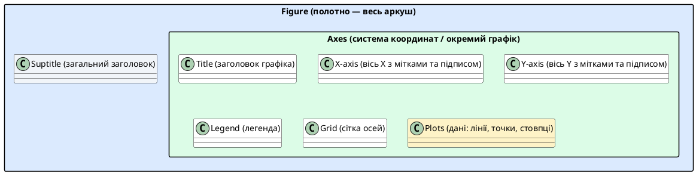

# Основи matplotlib — Figure, Axes та перший графік

::card-group

::card{title="🎯 Мета підтеми" icon="i-lucide-target"}

- Зрозуміти ієрархію об'єктів matplotlib: Figure → Axes → Plot
- Опанувати два підходи: pyplot (швидкий) та OOP (гнучкий)
- Навчитися будувати лінійні графіки функцій
- Освоїти базову кастомізацію: заголовки, підписи, сітка, легенда

::

::card{title="🔑 Ключові терміни" icon="i-lucide-key"}

- **Figure** — «полотно», вся область візуалізації (може містити кілька графіків)
- **Axes** — окрема система координат з віссю X та Y (сам графік)
- **pyplot** — state-based інтерфейс (як MATLAB)
- **OOP API** — об'єктно-орієнтований інтерфейс (рекомендований для складних графіків)

::

::

---

## Історія про два підходи до готування

Уявіть, що ви вчитеся готувати піцу. Є два шефи-викладачі:

**Шеф А (pyplot):** «Візьми тісто. Намасти соусом. Постав у духовку на 200°C. Готово!» Він не каже, _яке_ тісто, _яку_ духовку — він припускає, що ви працюєте з «поточним» об'єктом. Швидко, зручно для простих завдань.

**Шеф Б (OOP API):** «Створи об'єкт `pizza = Pizza()`. Викличи метод `pizza.add_sauce("томатний")`. Передай об'єкт `pizza` у `oven.bake(pizza, temperature=200)`.» Більше коду, але абсолютна ясність: ти **явно** керуєш кожним об'єктом.

Matplotlib підтримує обидва підходи. Перший (`pyplot`) зручний для швидких експериментів у Jupyter. Другий (OOP) — для професійних проєктів, де потрібна точність та контроль.

::note
**Правило професіоналів:** використовуйте pyplot (`plt.plot()`) для швидких прототипів у ноутбуках. Для production-коду та складних дашбордів переходьте на OOP інтерфейс (`fig, ax = plt.subplots()`).
::

---

## Архітектура matplotlib: Figure, Axes, Plot

Перед тим, як будувати графіки, потрібно зрозуміти «анатомію» matplotlib. Це як анатомія людини: щоб лікувати, потрібно знати, де що знаходиться.

### Ієрархія об'єктів

::plant-uml{alt="Ієрархія об'єктів matplotlib"}



::

> Аналогія: **Figure** — це рамка для картини. **Axes** — це саме полотно всередині рамки. **Plot** — це малюнок на полотні. На одній рамці (Figure) може бути кілька полотен (Axes) — як у коміксі, де кілька панелей на сторінці.

::jupyter-notebook{title="anatomy.ipynb" kernel="Python 3 (ipykernel)"}

::jupyter-cell{type="markdown"}
### Анатомія matplotlib
Розберемо структуру на конкретному прикладі
::

::jupyter-cell{executionCount="1" executionTime="0.18s"}
```python
import matplotlib.pyplot as plt
import numpy as np

# Створюємо Figure (полотно) розміром 10x6 дюймів
fig = plt.figure(figsize=(10, 6))

# Створюємо Axes (систему координат) на цьому полотні
ax = fig.add_subplot(111)  # 1 рядок, 1 стовпець, графік №1

# Дані для побудови
x = np.linspace(0, 10, 100)
y = np.sin(x)

# Будуємо графік (Plot)
ax.plot(x, y, label="sin(x)", color="blue", linewidth=2)

# Додаємо елементи
ax.set_title("Структура matplotlib", fontsize=16, fontweight="bold")
ax.set_xlabel("Вісь X (незалежна змінна)", fontsize=12)
ax.set_ylabel("Вісь Y (залежна змінна)", fontsize=12)
ax.legend(loc="upper right")
ax.grid(True, alpha=0.3, linestyle="--")

# Анотації для пояснення структури
ax.annotate("Title (заголовок)", xy=(5, 0.8), xytext=(7, 0.9),
            fontsize=10, color="red", weight="bold",
            arrowprops=dict(arrowstyle="->", color="red"))

ax.annotate("Legend\n(легенда)", xy=(9.5, 0.9), xytext=(8, 0.6),
            fontsize=10, color="green", weight="bold",
            arrowprops=dict(arrowstyle="->", color="green"))

ax.annotate("Plot\n(графік)", xy=(3, 0.1), xytext=(1, -0.5),
            fontsize=10, color="purple", weight="bold",
            arrowprops=dict(arrowstyle="->", color="purple"))

plt.tight_layout()
plt.show()
```

#output
{.diagram-img}
::

::

::tip
**Корисна аналогія для запам'ятовування:**

- `Figure` = **будинок** (вся структура)
- `Axes` = **кімната** у будинку (може бути кілька кімнат)
- `Plot` = **меблі** у кімнаті (стіл, стілець = лінії, точки)

Ви не ставите меблі на фундамент (Figure), ви ставите їх у кімнату (Axes)!
::

---

## Два інтерфейси: pyplot vs OOP API

Matplotlib пропонує два способи створення графіків. Розберемо обидва на одному прикладі — побудові графіка параболи `y = x²`.

### Підхід 1: pyplot (state-based, MATLAB-style)

```python
import matplotlib.pyplot as plt
import numpy as np

x = np.linspace(-5, 5, 100)
y = x ** 2

# pyplot автоматично створює Figure та Axes «за лаштунками»
plt.plot(x, y)
plt.title("Парабола y = x²")
plt.xlabel("x")
plt.ylabel("y")
plt.grid(True)
plt.show()
```

{.diagram-img}

**Переваги:**
- Коротко, інтуїтивно
- Ідеально для швидких експериментів у Jupyter Notebook
- Схожий на MATLAB (легше для тих, хто знає MATLAB)

**Недоліки:**
- Неявний стан: `plt.plot()` модифікує «поточний» Axes — який саме? Не завжди зрозуміло
- Важко керувати кількома графіками одночасно
- У великих проєктах може призвести до плутанини

---

### Підхід 2: OOP API (explicit object references)

```python
import matplotlib.pyplot as plt
import numpy as np

x = np.linspace(-5, 5, 100)
y = x ** 2

# Явно створюємо Figure та Axes
fig, ax = plt.subplots(figsize=(8, 5))

# Використовуємо методи об'єкта ax
ax.plot(x, y, color="purple", linewidth=2)
ax.set_title("Парабола y = x²", fontsize=14)
ax.set_xlabel("x", fontsize=12)
ax.set_ylabel("y", fontsize=12)
ax.grid(True, alpha=0.3)

plt.show()
```

{.diagram-img}

**Переваги:**
- Явний контроль: ви завжди знаєте, з яким об'єктом працюєте
- Легко керувати кількома графіками (див. підтему про subplots)
- Професійний стандарт для production-коду

**Недоліки:**
- Трохи більше коду для простих випадків
- Потрібно розуміти об'єктну модель

::note
**Рекомендація:** у цьому курсі ми використовуємо **OOP API** (`fig, ax = plt.subplots()`), бо він готує вас до реальних проєктів. Pyplot залишається корисним для одноразових експериментів.
::

::jupyter-notebook{title="approaches_comparison.ipynb"}

::jupyter-cell{type="markdown"}
### Порівняння двох підходів
Побудуємо один і той самий графік обома способами
::

::jupyter-cell{executionCount="1"}
```python
import matplotlib.pyplot as plt
import numpy as np

x = np.linspace(0, 2*np.pi, 100)
y1 = np.sin(x)
y2 = np.cos(x)

# ===== Підхід 1: pyplot (MATLAB-style) =====
plt.figure(figsize=(12, 5))

plt.subplot(1, 2, 1)  # 1 рядок, 2 стовпці, графік №1
plt.plot(x, y1, label="sin(x)", color="blue")
plt.plot(x, y2, label="cos(x)", color="red")
plt.title("Підхід pyplot")
plt.xlabel("x")
plt.ylabel("y")
plt.legend()
plt.grid(True, alpha=0.3)

# ===== Підхід 2: OOP API =====
plt.subplot(1, 2, 2)
ax = plt.gca()  # Get Current Axes
ax.plot(x, y1, label="sin(x)", color="blue")
ax.plot(x, y2, label="cos(x)", color="red")
ax.set_title("Підхід OOP API")
ax.set_xlabel("x")
ax.set_ylabel("y")
ax.legend()
ax.grid(True, alpha=0.3)

plt.tight_layout()
plt.show()
```

#output
{.diagram-img}
::

::jupyter-cell{type="markdown"}
**Висновок:** результат ідентичний, але OOP підхід дає більше контролю і ясності.
::

::

---

## Побудова лінійних графіків

Лінійні графіки — це фундамент візуалізації. Вони показують, як одна величина змінюється відносно іншої.

### Базовий лінійний графік

::jupyter-notebook{title="line_plots.ipynb"}

::jupyter-cell{executionCount="1"}
```python
import matplotlib.pyplot as plt
import numpy as np

# Дані: температура протягом тижня
days = np.arange(1, 8)
temperature = [18, 22, 25, 23, 20, 19, 21]

fig, ax = plt.subplots(figsize=(8, 5))

ax.plot(days, temperature, marker="o", linestyle="-", color="orangered", 
        linewidth=2, markersize=8, label="Температура")

ax.set_title("Температура протягом тижня", fontsize=14, fontweight="bold")
ax.set_xlabel("День тижня", fontsize=12)
ax.set_ylabel("Температура (°C)", fontsize=12)
ax.set_xticks(days)
ax.set_xticklabels(["Пн", "Вт", "Ср", "Чт", "Пт", "Сб", "Нд"])
ax.legend(loc="upper left")
ax.grid(True, alpha=0.3, linestyle="--")

plt.tight_layout()
plt.show()
```

#output
{.diagram-img}
::

::

### Кілька ліній на одному графіку

Часто потрібно порівняти кілька змінних на одному графіку.

::jupyter-notebook{title="multiple_lines.ipynb"}

::jupyter-cell{executionCount="1"}
```python
import matplotlib.pyplot as plt
import numpy as np

# Продажі трьох продуктів за 6 місяців
months = ["Січ", "Лют", "Бер", "Кві", "Тра", "Чер"]
product_a = [120, 150, 180, 170, 200, 220]
product_b = [80, 95, 110, 105, 130, 140]
product_c = [200, 190, 185, 180, 175, 170]

fig, ax = plt.subplots(figsize=(10, 6))

ax.plot(months, product_a, marker="o", label="Продукт A", linewidth=2)
ax.plot(months, product_b, marker="s", label="Продукт B", linewidth=2)
ax.plot(months, product_c, marker="^", label="Продукт C", linewidth=2)

ax.set_title("Динаміка продажів за півроку", fontsize=14, fontweight="bold")
ax.set_xlabel("Місяць", fontsize=12)
ax.set_ylabel("Обсяг продажів (тис. грн)", fontsize=12)
ax.legend(loc="best", fontsize=10)
ax.grid(True, alpha=0.3)

plt.tight_layout()
plt.show()
```

#output
{.diagram-img}
::

::

::tip
**Вибір маркерів та стилів ліній:**

| Маркер | Символ | Лінія      | Символ |
|:-------|:-------|:-----------|:-------|
| Коло   | `"o"`  | Суцільна   | `"-"`  |
| Квадрат| `"s"`  | Пунктирна  | `"--"` |
| Трикутник вгору | `"^"` | Штрих-пунктир | `"-."`|
| Трикутник вниз  | `"v"` | Точки      | `":"`  |
| Ромб   | `"D"`  | Без лінії  | `""`   |

Комбінуйте: `marker="o"` + `linestyle="--"` або коротко: `"o--"`
::

---

## Кастомізація графіків

Графік без підписів — це як карта без легенди. Навчимося робити графіки **інформативними** та **естетичними**.


### Заголовки та підписи осей

::jupyter-notebook{title="labels_titles.ipynb"}

::jupyter-cell{executionCount="1"}
```python
import matplotlib.pyplot as plt
import numpy as np

x = np.linspace(0, 10, 100)
y = np.exp(-x/5) * np.sin(2*x)

fig, ax = plt.subplots(figsize=(10, 6))

ax.plot(x, y, color="darkblue", linewidth=2.5)

# Заголовок з параметрами
ax.set_title("Загасаюча синусоїда", 
             fontsize=16, 
             fontweight="bold", 
             color="darkred",
             pad=20)  # Відступ від графіка

# Підписи осей
ax.set_xlabel("Час (секунди)", fontsize=13, fontstyle="italic")
ax.set_ylabel("Амплітуда", fontsize=13, fontstyle="italic")

# Межі осей
ax.set_xlim(0, 10)
ax.set_ylim(-1, 1)

plt.tight_layout()
plt.show()
```

#output
{.diagram-img}
::

::

### Сітка для зручності читання

Сітка допомагає точніше визначити координати точок на графіку.

::jupyter-notebook{title="grid_examples.ipynb"}

::jupyter-cell{executionCount="1"}
```python
import matplotlib.pyplot as plt
import numpy as np

x = np.linspace(0, 4*np.pi, 100)
y = np.sin(x)

fig, (ax1, ax2, ax3) = plt.subplots(1, 3, figsize=(15, 4))

# Без сітки
ax1.plot(x, y)
ax1.set_title("Без сітки")

# Сітка за замовчуванням
ax2.plot(x, y)
ax2.grid(True)
ax2.set_title("Сітка за замовчуванням")

# Кастомна сітка
ax3.plot(x, y)
ax3.grid(True, alpha=0.3, linestyle="--", linewidth=1, color="gray")
ax3.set_title("Кастомна сітка")

plt.tight_layout()
plt.show()
```

#output
{.diagram-img}
::

::

::note
**Параметри `grid()`:**

- `alpha` — прозорість (0.0 = невидима, 1.0 = повністю непрозора). Рекомендація: 0.3–0.5
- `linestyle` — стиль лінії (`"-"`, `"--"`, `"-."`, `":"`)
- `linewidth` — товщина лінії
- `color` — колір сітки
- `which` — `"major"` (основні мітки) або `"both"` (основні + другорядні)
::

---

### Легенда — що означають лінії

Коли на графіку кілька ліній, легенда **обов'язкова**.

::jupyter-notebook{title="legends.ipynb"}

::jupyter-cell{executionCount="1"}
```python
import matplotlib.pyplot as plt
import numpy as np

x = np.linspace(0, 10, 100)

fig, ax = plt.subplots(figsize=(10, 6))

# Будуємо три функції з параметром label
ax.plot(x, np.sin(x), label="sin(x)", linewidth=2)
ax.plot(x, np.cos(x), label="cos(x)", linewidth=2)
ax.plot(x, np.sin(x) * np.cos(x), label="sin(x)·cos(x)", linewidth=2, linestyle="--")

ax.set_title("Тригонометричні функції", fontsize=14, fontweight="bold")
ax.set_xlabel("x")
ax.set_ylabel("y")
ax.grid(True, alpha=0.3)

# Легенда з параметрами
ax.legend(loc="upper right",       # Розташування
          fontsize=11,              # Розмір шрифту
          frameon=True,             # Рамка навколо легенди
          shadow=True,              # Тінь
          fancybox=True)            # Заокруглені кути

plt.tight_layout()
plt.show()
```

#output
{.diagram-img}
::

::

::tip
**Позиціонування легенди (`loc`):**

| Значення       | Розташування      |
|:---------------|:------------------|
| `"best"`       | Автоматично (уникає перекриття з даними) |
| `"upper right"`| Правий верхній кут |
| `"upper left"` | Лівий верхній кут  |
| `"lower right"`| Правий нижній кут  |
| `"lower left"` | Лівий нижній кут   |
| `"center"`     | По центру         |

Рекомендація: використовуйте `"best"` — matplotlib сам обере найкраще місце.
::

---

### Кольори та стилі

Колір — це не прикраса, а **інформація**. Правильний вибір кольорів робить графік зрозумілішим.

::jupyter-notebook{title="colors_styles.ipynb"}

::jupyter-cell{type="markdown"}
### Способи задання кольорів
Matplotlib підтримує кілька форматів
::

::jupyter-cell{executionCount="1"}
```python
import matplotlib.pyplot as plt
import numpy as np

x = np.linspace(0, 5, 50)

fig, ax = plt.subplots(figsize=(10, 6))

# Способи задання кольорів:
ax.plot(x, x + 0, color="red", label="Назва кольору: 'red'", linewidth=2)
ax.plot(x, x + 1, color="r", label="Короткий код: 'r'", linewidth=2)
ax.plot(x, x + 2, color="#FF6B35", label="HEX: '#FF6B35'", linewidth=2)
ax.plot(x, x + 3, color=(0.2, 0.4, 0.8), label="RGB tuple: (0.2, 0.4, 0.8)", linewidth=2)
ax.plot(x, x + 4, color="C4", label="Колір з палітри: 'C4'", linewidth=2)

ax.set_title("Способи задання кольорів", fontsize=14, fontweight="bold")
ax.set_xlabel("x")
ax.set_ylabel("y")
ax.legend(loc="upper left")
ax.grid(True, alpha=0.3)

plt.tight_layout()
plt.show()
```

#output
{.diagram-img}
::

::

::warning
**Колірна сліпота (Color Blindness):**

~8% чоловіків та ~0.5% жінок мають порушення кольорового зору. **Не використовуйте лише червоний та зелений** для розрізнення категорій!

Безпечні комбінації:
- Синій + Помаранчевий
- Синій + Жовтий
- Фіолетовий + Зелений

Використовуйте різні **стилі ліній** (`linestyle`) та **маркери** як додатковий канал інформації.
::

---

### Розміри та пропорції

Розмір графіка впливає на читабельність. Занадто маленький — не видно деталей. Занадто великий — марнування місця.

::jupyter-notebook{title="figure_sizes.ipynb"}

::jupyter-cell{executionCount="1"}
```python
import matplotlib.pyplot as plt
import numpy as np

x = np.linspace(0, 10, 100)
y = np.sin(x)

# Три різні розміри
fig, (ax1, ax2, ax3) = plt.subplots(1, 3, figsize=(16, 4))

# Маленька фігура (не рекомендується для складних графіків)
ax1.plot(x, y)
ax1.set_title("4x3 дюйми (замала)", fontsize=10)
ax1.set_xlabel("x", fontsize=8)
ax1.set_ylabel("y", fontsize=8)

# Оптимальна фігура для звітів
ax2.plot(x, y)
ax2.set_title("8x6 дюймів (оптимально)", fontsize=12)
ax2.set_xlabel("x", fontsize=10)
ax2.set_ylabel("y", fontsize=10)

# Велика фігура для презентацій
ax3.plot(x, y)
ax3.set_title("12x9 дюймів (презентація)", fontsize=14)
ax3.set_xlabel("x", fontsize=12)
ax3.set_ylabel("y", fontsize=12)

plt.tight_layout()
plt.show()
```

#output
{.diagram-img}
::

::

::tip
**Рекомендовані розміри `figsize=(width, height)` у дюймах:**

| Призначення          | Розмір          | Пропорції |
|:---------------------|:----------------|:----------|
| Jupyter Notebook     | `(8, 5)`        | 16:10     |
| Наукова стаття       | `(6, 4)`        | 3:2       |
| Презентація (слайд)  | `(10, 6)`       | 16:9.6    |
| Дашборд (широкий)    | `(12, 4)`       | 3:1       |
| Квадратний графік    | `(6, 6)`        | 1:1       |

За замовчуванням matplotlib використовує `(6.4, 4.8)` дюймів = 640x480 пікселів при dpi=100.
::

---

## Збереження графіків у файли

Після створення графіка його потрібно зберегти для звітів, презентацій або публікацій.

::jupyter-notebook{title="saving_figures.ipynb"}

::jupyter-cell{executionCount="1"}
```python
import matplotlib.pyplot as plt
import numpy as np

x = np.linspace(0, 10, 100)
y = np.sin(x)

fig, ax = plt.subplots(figsize=(8, 5))
ax.plot(x, y, linewidth=2)
ax.set_title("Синусоїда для звіту", fontsize=14)
ax.set_xlabel("x")
ax.set_ylabel("sin(x)")
ax.grid(True, alpha=0.3)

# Збереження у різних форматах
fig.savefig("sinus_plot.png", dpi=300, bbox_inches="tight")     # Растр (для веб)
fig.savefig("sinus_plot.pdf", bbox_inches="tight")              # Вектор (для друку)
fig.savefig("sinus_plot.svg", bbox_inches="tight")              # Вектор (для веб)

print("✅ Графік збережено у трьох форматах!")

plt.show()
```

#output
✅ Графік збережено у трьох форматах!

{.diagram-img}
::

::

::note
**Параметри `savefig()`:**

- `dpi` — роздільна здатність (dots per inch). Для екрану: 100–150. Для друку: 300+
- `bbox_inches="tight"` — обрізати зайві поля навколо графіка
- `transparent=True` — прозорий фон (корисно для презентацій)
- `facecolor="white"` — колір фону (якщо не прозорий)
- `format` — формат файлу (`"png"`, `"pdf"`, `"svg"`, `"jpg"`). Визначається автоматично з розширення

**Вибір формату:**
- **PNG** — растр, універсальний, підтримується всюди
- **PDF** — вектор, ідеально для наукових статей (можна збільшувати без втрати якості)
- **SVG** — вектор, для веб-сторінок та інтерактивних графіків
- **JPG** — уникайте для графіків (втрати через стиснення)
::

---

## Практичні завдання

::card-group

::card{title="📝 Рівень 1: Базові навички" icon="i-lucide-pencil"}

**Завдання 1.1:** Побудуйте графік функції `y = x³ - 5x² + 2x + 8` на інтервалі `[-3, 5]`. Додайте заголовок, підписи осей, сітку.

**Завдання 1.2:** Створіть графік температури повітря за тиждень (придумайте дані). Використайте маркери та лінію. Підпишіть дні тижня на осі X.

**Завдання 1.3:** Побудуйте три функції на одному графіку: `sin(x)`, `cos(x)`, `tan(x)` на інтервалі `[0, π]`. Додайте легенду.

::

::card{title="🧮 Рівень 2: Аналіз даних" icon="i-lucide-calculator"}

**Завдання 2.1:** Завантажте будь-який CSV-датасет (наприклад, з Kaggle). Побудуйте лінійний графік для двох числових стовпців. Додайте всі необхідні підписи та легенду.

**Завдання 2.2:** Створіть графік динаміки курсу долара за місяць (згенеруйте випадкові дані з трендом). Підсвітіть зоною (`ax.axhspan()`) діапазон, коли курс був вище 40 грн.

**Завдання 2.3:** Побудуйте графік з двома осями Y (`ax.twinx()`) — наприклад, температура та вологість на одному графіку.

::

::card{title="🚀 Рівень 3: Дослідницький проєкт" icon="i-lucide-rocket"}

**Проєкт:** Створіть «дашборд погоди» — один графік з 4 підграфіками (використайте `subplots(2, 2)`):

1. Температура за тиждень (лінійний графік)
2. Опади за тиждень (bar chart — наступна підтема)
3. Напрямок вітру (кругова діаграма сторін світу)
4. Тиск (лінійний графік з областю заливки `ax.fill_between()`)

Усі графіки мають бути стилізовані єдино (колірна схема, шрифти).

::

::

---

## Резюме підтеми

::card-group

::card{title="🎨 Архітектура matplotlib" icon="i-lucide-layers"}

- **Figure** — полотно (може містити кілька графіків)
- **Axes** — система координат (сам графік)
- **Plot** — дані на графіку (лінії, точки тощо)

Формула: `fig, ax = plt.subplots()` → універсальний початок

::

::card{title="📊 Лінійні графіки" icon="i-lucide-trending-up"}

- `ax.plot(x, y)` — базова побудова
- `marker` — форма точок (`"o"`, `"s"`, `"^"`)
- `linestyle` — стиль лінії (`"-"`, `"--"`, `":"`)
- `color` — колір (назва, HEX, RGB)
- `linewidth` — товщина лінії

::

::card{title="🎯 Кастомізація" icon="i-lucide-palette"}

- `ax.set_title()` — заголовок
- `ax.set_xlabel()`, `ax.set_ylabel()` — підписи осей
- `ax.legend()` — легенда
- `ax.grid()` — сітка
- `fig.savefig()` — збереження

::

::

::tip
**Чек-лист ідеального графіка:**

- [ ] Заголовок, що пояснює **що** зображено
- [ ] Підписи осей з **одиницями виміру** (°C, км, грн тощо)
- [ ] Легенда, якщо на графіку > 1 лінії
- [ ] Сітка для зручності читання (alpha=0.3)
- [ ] Розмір шрифтів достатній для читання (≥10pt для осей, ≥12pt для заголовка)
- [ ] Кольори контрастні та доступні для людей з порушеннями кольорового зору
::

---

**Наступна підтема:** [Візуалізація розподілів — гістограми та box plots](./02.distributions)
