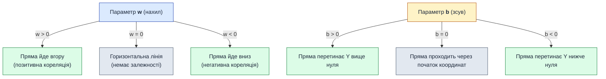

# Регресійна задача та лінійна регресія з однією змінною

::card-group

::card{title="🎯 Мета підрозділу" icon="i-lucide-target"}

- Зрозуміти різницю між регресією та класифікацією
- Опанувати поняття лінійної регресії з однією змінною
- Познайомитися з рівнянням прямої ŷ = w·x + b
- Навчитися інтерпретувати параметри w (нахил) та b (зсув)

::

::card{title="🔑 Ключові терміни" icon="i-lucide-key"}

- **Регресія (regression)** — передбачення неперервного числового значення
- **Класифікація (classification)** — передбачення категорії
- **Лінійна регресія (linear regression)** — модель залежності у вигляді прямої
- **w (weight)** — коефіцієнт нахилу прямої
- **b (bias)** — вільний член, зсув по осі Y

::

::

---

## Історія про рієлтора, який хоче передбачати ціни

Олена працює рієлтором уже п'ять років. Щодня їй телефонують клієнти з питаннями: «У мене квартира 50 квадратних метрів у центрі міста — скільки вона може коштувати?» або «Хочу продати трикімнатну квартиру на 7 поверсі — яку ціну виставити?»

Зараз Олена відповідає інтуїтивно, «на око», спираючись на свій багатий досвід. Але такий підхід має недоліки:

- **Неточність:** інтуїція може помилятися, особливо для нестандартних квартир
- **Повільність:** треба згадати подібні угоди, прикинути поправки
- **Немасштабованість:** Олена не може обробити 100 запитів за годину

Але у неї є скарб — **база даних** за минулий рік: площа та ціна 100 проданих квартир. Чи можна використати ці дані, щоб **формалізувати** залежність математично? Щоб комп'ютер миттєво видавав відповідь для будь-якої площі?

::note
Це класична задача **машинного навчання з учителем**: у нас є дані з правильними відповідями (площа → ціна), і ми хочемо навчити модель знаходити закономірність.
::

---

## Що таке регресійна задача?

Перед тим як розібратися з конкретним алгоритмом, потрібно зрозуміти, до якого класу задач належить наша проблема.

**Регресія (regression)** — це тип завдання машинного навчання, де потрібно передбачити **неперервне числове значення** на основі вхідних ознак.

### Приклади регресійних задач

| Вхідні ознаки                                  | Цільова змінна (що передбачаємо) | Тип задачі |
|------------------------------------------------|----------------------------------|------------|
| Площа квартири (м²)                            | Ціна ($)                         | Регресія   |
| Стаж роботи (роки), освіта, місто              | Зарплата ($)                     | Регресія   |
| Температура, вологість, опади                  | Врожай пшениці (тонн/га)         | Регресія   |
| Кількість кімнат, поверх, район                | Вартість оренди ($/місяць)       | Регресія   |
| Пробіг автомобіля (км), рік випуску            | Ціна автомобіля ($)              | Регресія   |

::tip
**Ключова ознака регресії:** результат — це **число з континуального діапазону**. Наприклад, ціна може бути 45 000$, 45 123.50$, 45 123.99$ — будь-яке значення в межах розумного.
::

> [!NOTE]
> **Аналогія (Нитка між цвяшками):** Лінійна регресія — це як натягнути пружну нитку між точками на дерев'яній дошці з цвяшками так, щоб вона проходила **якомога ближче** до всіх цвяшків одразу. Нитка не зобов'язана проходити крізь кожен окремий цвяшок, але її пружний натяг урівноважується так, щоб сумарне відхилення від усіх точок було найменшим.

---

## Регресія vs Класифікація

Студенти часто плутають ці два фундаментальні типи задач машинного навчання з учителем (*supervised learning*). Головна відмінність полягає у **природі цільової змінної** $y$: чи є вона неперервною числовою величиною, чи належить до фіксованої дискретної множини класів.

{.diagram-img}

У задачі регресії ми шукаємо неперервну математичну функцію $f(x)$, яка проходить якомога ближче до точок у просторі спостережень. Прогноз моделі — це число (наприклад, $18.7$ або $21.2$). У задачі класифікації мета зовсім інша — знайти **розділову межу** (*decision boundary*), яка розділяє простір ознак на ізольовані регіони, що відповідають окремим класам ($0$ або $1$).

::code-group

```python [Регресія]
# Передбачаємо ЧИСЛО
def predict_blood_pressure(age, weight, height):
    """
    Вхід: вік, вага, зріст
    Вихід: артеріальний тиск (число, наприклад 120.5 мм рт.ст.)
    """
    return model.predict([age, weight, height])

# Приклад виводу
>>> predict_blood_pressure(45, 80, 175)
122.3  # неперервне число
```

```python [Класифікація]
# Передбачаємо КАТЕГОРІЮ
def diagnose_disease(symptoms, test_results):
    """
    Вхід: симптоми, результати аналізів
    Вихід: діагноз (категорія: "здоровий" / "застуда" / "грип")
    """
    return model.predict([symptoms, test_results])

# Приклад виводу
>>> diagnose_disease(['кашель', 'температура'], [98.6, 'positive'])
"грип"  # одна з фіксованих категорій
```

::

**Порівняльна таблиця:**

| Характеристика       | Регресія                          | Класифікація                 |
|----------------------|-----------------------------------|------------------------------|
| Що передбачаємо?     | Число (неперервне)                | Категорію (дискретну)        |
| Приклад виводу       | 45 123.50$                        | "spam" / "не spam"           |
| Діапазон значень     | Безмежний (або великий)           | Фіксована кількість класів   |
| Метрики якості       | MAE, MSE, R²                      | Accuracy, Precision, Recall  |
| Приклади алгоритмів  | Лінійна регресія, Ridge, Lasso    | Логістична регресія, SVM     |

> [!NOTE]
> **Аналогія (Термометр vs Світлофор):**
> - **Регресія** — це **термометр**: показує точне неперервне число на шкалі ($23.5^\circ\text{C}$, $24.1^\circ\text{C}$, $18.9^\circ\text{C}$).
> - **Класифікація** — це **світлофор**: обирає один із кількох фіксованих дискретних станів (червоний, жовтий або зелений).

::warning
**Не плутайте:** логістична регресія (*logistic regression*), незважаючи на історичну назву «регресія», розв'язує задачу **класифікації**! Вона прогнозує апостеріорну ймовірність належності до класу (число на відрізку $[0; 1]$), але фінальне рішення приймається через порогове відсікання: якщо $P \ge 0.5$, то клас $1$, інакше $0$.
::

---

## Типологія регресійних моделей у машинному навчанні

Залежно від кількості вхідних факторів та характеру фізичних взаємозв'язків у даних, у математичному моделюванні виділяють кілька фундаментальних класів регресійних моделей.

{.diagram-img}

Розглянемо базові відмінності між ними:

1. **Проста лінійна регресія (*Simple Linear Regression*):**
   - Моделює залежність між **однією** вхідною ознакою $x$ та цільовою змінною $y$.
   - Формула: :math-formula[\hat{y} = w \cdot x + b]{inline}.
   - Геометрична форма: пряма лінія у двовимірному просторі.
   - Приклад: залежність вартості житла суто від площі.

2. **Множинна лінійна регресія (*Multiple Linear Regression*):**
   - Узагальнює задачу на випадок $n$ взаємопов'язаних факторів ($x_1, x_2, \dots, x_n$).
   - Формула: :math-formula[\hat{y} = w_1 x_1 + w_2 x_2 + \dots + w_n x_n + b]{inline}.
   - Геометрична форма: гіперплощина у багатовимірному просторі (для двох ознак — похила площина у 3D).
   - Приклад: прогнозування ціни за площею, кількістю кімнат, поверхом та відстанню до метро.

3. **Поліноміальна регресія (*Polynomial Regression*):**
   - Застосовується, коли емпіричні спостереження демонструють виражену кривизну (прискорення, насичення або параболічний спад).
   - Формула: :math-formula[\hat{y} = w_1 x + w_2 x^2 + \dots + w_d x^d + b]{inline}.
   - Зберігає лінійність відносно ваг $w$, але додає нелінійні степені вхідних факторів.

4. **Логістична регресія (*Logistic Regression*):**
   - Пропускає лінійну комбінацію через сигмоїдну функцію активації :math-formula[\sigma(z) = \frac{1}{1 + e^{-z}}]{inline}, перетворюючи будь-яке дійсне число на ймовірність від $0$ до $1$.
   - Використовується для задач бінарної та багатокласової класифікації.

---

## Візуалізація проблеми: який паттерн у даних?

Повернемося до задачі Олени. Завантажимо дані та подивимося на них.

::jupyter-notebook{title="regression_intro.ipynb" kernel="Python 3.11 (ipykernel)"}

::jupyter-cell{type="markdown"}
### Крок 1: Завантаження та візуалізація даних
::

::jupyter-cell{executionCount="1" executionTime="0.15s"}

```python
import numpy as np
import matplotlib.pyplot as plt

# Генеруємо синтетичні дані (імітація бази Олени)
np.random.seed(42)
area = np.array([45, 50, 60, 55, 70, 65, 80, 75, 90, 85,
                 100, 95, 110, 105, 120, 115, 130, 125, 140, 135])
# Справжня залежність: ціна ≈ 500$/м² + випадковий шум
price = 500 * area + np.random.normal(0, 3000, 20)

print(f"Кількість спостережень: {len(area)}")
print(f"Діапазон площ: {area.min()} — {area.max()} м²")
print(f"Діапазон цін: ${price.min():.0f} — ${price.max():.0f}")
```

#output
Кількість спостережень: 20
Діапазон площ: 45 — 140 м²
Діапазон цін: $20474 — $69158
::

::jupyter-cell{executionCount="2" executionTime="0.22s"}

```python
# Побудуємо scatter plot (точкову діаграму)
fig, ax = plt.subplots(figsize=(10, 6))

ax.scatter(area, price, s=100, alpha=0.7, color="steelblue",
           edgecolor="navy", linewidth=1.5, label="Продані квартири")

ax.set_title("Залежність ціни квартири від площі", 
             fontsize=14, fontweight="bold")
ax.set_xlabel("Площа (м²)", fontsize=12)
ax.set_ylabel("Ціна ($)", fontsize=12)
ax.grid(True, alpha=0.3)
ax.legend(fontsize=11)

plt.tight_layout()
plt.show()
```

#output
{.diagram-img}
::

::jupyter-cell{type="markdown"}
**Спостереження:** 
Точки розташовані не хаотично — видно чіткий **позитивний лінійний тренд**: чим більша площа, тим вища ціна. Це означає, що між змінними існує **кореляція**, яку можна описати математично.
::

::

::note
У реальності дані рідко утворюють ідеальну пряму. Завжди присутній **шум** (noise) — випадкові відхилення через:
- Особливості конкретної квартири (стан ремонту, вид з вікна)
- Помилки вимірювання
- Фактори, які ми не врахували (район, поверх, наявність балкона)
::

---

## Рівняння прямої: математична основа лінійної регресії

Якщо залежність **лінійна**, її можна описати рівнянням прямої зі шкільного курсу алгебри:

::math-formula
\hat{y} = w \cdot x + b
::

Розшифруємо кожен символ:

| Символ | Назва | Що означає |
|--------|-------|------------|
| **x** | Вхідна ознака (feature) | Площа квартири (м²) — те, що ми **знаємо** |
| **ŷ** | Передбачення (prediction) | Ціна, яку **передбачає модель** ($) |
| **w** | Вага, коефіцієнт нахилу (weight) | На скільки зростає ціна при збільшенні площі на 1 м² |
| **b** | Зсув, вільний член (bias) | Базова ціна при площі = 0 (теоретичне значення) |

> [!NOTE]
> **Аналогія (Тарифний план оператора або лічильник таксі):**  
> Рівняння лінійної регресії влаштоване точнісінько як **рахунок за мобільний зв'язок** або оплата поїздки в таксі:
> - $b$ (**зсув / bias**) — це **абонентська плата** (або посадка в авто). Її сплачують обов'язково, навіть якщо за місяць виговорили 0 хвилин чи взагалі не рушили з місця ($x = 0$).
> - $w$ (**нахил / weight**) — це **тариф за кожну хвилину** (або ціна за 1 км шляху). Визначає, на скільки зростає сума з кожною одиницею послуги.
> - $\hat{y}$ — це **підсумковий чек** за місяць.
>
> $$\text{Рахунок} = \text{Абонплата } (b) + \left[\text{Тариф за хвилину } (w) \times \text{Кількість хвилин } (x)\right]$$

::tip
**Чому "шапочка" над y?** Символ ŷ (ігрек з шапочкою) означає **передбачення моделі**, а не реальне значення. Реальна ціна позначається просто як **y**. Різниця **y - ŷ** — це **помилка** моделі.
::

### Геометрична інтерпретація параметрів

Параметри $w$ та $b$ мають прозорий геометричний зміст, що визначає орієнтацію та положення регресійної прямої на декартовій площині:

{.diagram-img}

- **Коефіцієнт нахилу $w$ (*weight / slope*):** задає кутовий коефіцієнт дотичної або самої прямої. Він показує темп зміни цільової змінної. Чим вище додатне значення $w$, тим крутіше пряма підіймається вгору. Якщо $w = 0$, пряма є суворо горизонтальною (немає лінійного зв'язку). При $w < 0$ залежність стає оберненою (наприклад, вік будівлі та її ринкова вартість).
- **Зсув $b$ (*bias / intercept*):** відповідає точці перетину прямої з віссю ординат $Y$ при нульовому значенні аргументу ($x = 0$). Він зсуває пряму вгору чи вниз паралельно самій собі.

::mermaid



::

---

## Приклад: три варіанти моделі

Спробуємо «вручну» підібрати параметри w та b і подивимося, як виглядають різні варіанти моделі.

::jupyter-notebook{title="model_comparison.ipynb" kernel="Python 3.11 (ipykernel)"}

::jupyter-cell{executionCount="1"}

```python
import numpy as np
import matplotlib.pyplot as plt

# Ті ж дані
np.random.seed(42)
area = np.array([45, 50, 60, 55, 70, 65, 80, 75, 90, 85,
                 100, 95, 110, 105, 120, 115, 130, 125, 140, 135])
price = 500 * area + np.random.normal(0, 3000, 20)

# Три варіанти моделі (різні w та b)
x_line = np.array([40, 145])

model_1 = {"w": 600, "b": -5000, "label": "Модель 1 (занадто крута)"}
model_2 = {"w": 300, "b": 10000, "label": "Модель 2 (занадто плоска)"}
model_3 = {"w": 500, "b": 0, "label": "Модель 3 (оптимальна)"}

fig, ax = plt.subplots(figsize=(10, 6))

# Точки даних
ax.scatter(area, price, s=100, alpha=0.7, color="steelblue",
           edgecolor="navy", linewidth=1.5, label="Реальні дані", zorder=3)

# Три прямі
ax.plot(x_line, model_1["w"] * x_line + model_1["b"], 
        'r--', linewidth=2, alpha=0.6, label=model_1["label"])
ax.plot(x_line, model_2["w"] * x_line + model_2["b"], 
        'g--', linewidth=2, alpha=0.6, label=model_2["label"])
ax.plot(x_line, model_3["w"] * x_line + model_3["b"], 
        'orange', linewidth=3, label=model_3["label"], zorder=2)

ax.set_title("Порівняння трьох варіантів моделі", fontsize=14, fontweight="bold")
ax.set_xlabel("Площа (м²)", fontsize=12)
ax.set_ylabel("Ціна ($)", fontsize=12)
ax.grid(True, alpha=0.3)
ax.legend(loc="upper left", fontsize=10)
ax.set_ylim(15000, 75000)

plt.tight_layout()
plt.show()
```

#output
{.diagram-img}
::

::jupyter-cell{type="markdown"}
**Аналіз:**

- **Модель 1** (червона): w = 600 — занадто крутий нахил, переоцінює великі квартири
- **Модель 2** (зелена): w = 300 — занадто плоска, недооцінює великі та переоцінює малі
- **Модель 3** (помаранчева): w = 500, b = 0 — проходить якраз посередині точок

**Питання:** як **автоматично** знайти найкращі значення w та b? Не «на око», а математично?

Відповідь буде в наступних підрозділах: **метрики якості** та **градієнтний спуск**.
::

::

---

## Інтерпретація параметрів у контексті задачі

Розглянемо модель з параметрами **w = 500** та **b = 0**:

::math-formula
\text{Ціна} = 500 \times \text{Площа} + 0
::

### Що означає w = 500?

Це **коефіцієнт нахилу прямої**. Він показує, на скільки **зміниться ціна** при збільшенні площі на **1 м²**.

::::accordion

:::accordion-item{label="📊 Приклад інтерпретації w" icon="i-lucide-help-circle"}

Якщо w = 500, це означає:
- Квартира 50 м² коштує приблизно 50 × 500 = 25 000$
- Квартира 51 м² (на 1 м² більше) коштує 51 × 500 = 25 500$
- **Різниця:** 25 500 - 25 000 = **500$**

Висновок: **кожен додатковий квадратний метр** додає до ціни **500 доларів**. Це і є економічна інтерпретація параметра w.

:::

:::accordion-item{label="📊 Що означає b = 0?" icon="i-lucide-help-circle"}

Параметр **b** (bias, зсув) — це **базова ціна** при площі = 0. У нашому випадку b = 0 означає, що пряма проходить через початок координат.

**Чи має це сенс?** Формально — так: квартира нульової площі нічого не коштує. Але в реальності параметр b часто має інше значення:

- b > 0: є «базова вартість» незалежно від площі (наприклад, вартість землі, документів)
- b < 0: теоретично можлива ситуація, але зазвичай свідчить про проблеми з даними

**Приклад реалістичнішої моделі:**

::math-formula
\text{Ціна} = 480 \times \text{Площа} + 5000
::

Тут b = 5000$ — це «фіксована частина» вартості (локація, інфраструктура), а 480$/м² — вартість самої площі.

:::

::::

### Економічний зміст: ціноутворення за районами міста

У реальному секторі нерухомості параметри $w$ та $b$ безпосередньо відображають географічну та ринкову диференціацію:

{.diagram-img}

- **Центр міста:** :math-formula[\hat{y} = 600 \cdot x + 10\,000]{inline}. Тут як базова вартість престижної локації ($b = 10\,000\$$), так і питома ціна кожного квадратного метра ($w = 600\$/\text{м}^2$) є найвищими. Однокімнатна квартира $50\ \text{м}^2$ коштуватиме $40\,000\$$.
- **Середня зона (спальний район):** :math-formula[\hat{y} = 450 \cdot x + 5\,000]{inline}. Помірні показники ($w = 450$, $b = 5\,000$), квартира $50\ \text{м}^2$ оцінюється у $27\,500\$$.
- **Околиця (передмістя):** :math-formula[\hat{y} = 300 \cdot x + 2\,000]{inline}. Низький поріг входу ($b = 2\,000\$$) та доступний метр ($w = 300\$/\text{м}^2$). Та сама площа $50\ \text{м}^2$ обійдеться всього у $17\,000\$$.

Цей приклад доводить: параметри лінійної регресії є не просто абстрактними коефіцієнтами оптимізації, а мають чіткий інженерний та бізнесовий зміст.

---

## Формальне визначення лінійної регресії

Тепер, коли ми розглянули інтуїцію, дамо формальне визначення.

**Лінійна регресія (Linear Regression)** — це метод машинного навчання з учителем, який моделює залежність між:
- **Однією або кількома вхідними ознаками** X (predictor variables, features)
- **Однією цільовою змінною** y (target variable, response)

у вигляді **лінійної функції**:

::math-formula
\hat{y} = w \cdot x + b
::

для одної змінної, або

::math-formula
\hat{y} = w_1 x_1 + w_2 x_2 + \ldots + w_n x_n + b
::

для багатьох змінних (про це детальніше в підрозділі 04).

::note
**Чому "лінійна"?** Тому що залежність описується **лінійною комбінацією** вхідних змінних. Графічно це пряма лінія (для 1 змінної), площина (для 2 змінних) або гіперплощина (для багатьох змінних).
::

---

## Обмеження лінійної регресії

Лінійна регресія — це потужний та швидкий інструмент, проте вона демонструє надійні результати лише тоді, коли зв'язок між змінними **дійсно є лінійним** або близьким до нього. Якщо процес підпорядкований складному нелінійному закону, пряма лінія дасть систематично зміщені прогнози.

::warning
**Приклади нелінійних залежностей у повсякденному житті:**

- **Розгін автомобіля:** Залежність швидкості від часу розгону не є прямою лінією. На старті прискорення максимальне (стрімкий підйом кривої), проте далі через наростаючий опір повітря темп розгону уповільнюється, виходячи на горизонтальне плато.
- **Врожайність від кількості добрив:** Перше внесення мінеральних добрив викликає бурхливе зростання культури, але після певної критичної дози ефект спадає, а надлишок призводить до токсичності ґрунту (класична парабола закону спадної віддачі).
- **Втома та помилки від тривалості зміни:** Перші години роботи супроводжуються високою концентрацією, проте після 8–10 годин безперервної праці кількість браку зростає експоненційно.

**Чому лінійна регресія все одно настільки популярна?**  
Величезна кількість природних, технічних та економічних процесів є **приблизно лінійними у локальному робочому діапазоні**: ціна квартири від площі (для типових планувань $30\text{--}120\ \text{м}^2$), витрати пального на трасі при помірній швидкості, зарплата від років досвіду. У межах цього практичного діапазону лінійна модель забезпечує неперевершену швидкість та інтерпретованість.
::

::warning
**Коли лінійна регресія НЕ працює:**

1. **Суттєва нелінійність:** якщо справжня залежність виражено квадратична, експоненційна або циклічна.
2. **Викиди (outliers):** одне екстремально аномальне спостереження може сильно «перекосити» лінію МНК.
3. **Мультиколінеарність:** якщо вхідні ознаки дублюють одна одну.
4. **Гетероскедастичність:** якщо розкид помилок зростає разом зі зростанням ознаки $x$.

Для подолання цих явищ застосовують поліноміальну регресію, регуляризацію (Ridge/Lasso) або нелінійні алгоритми (дерева рішень, градієнтний бустинг).
::

---

## Візуалізація обмеження: нелінійні дані

::jupyter-notebook{title="nonlinear_example.ipynb" kernel="Python 3.11 (ipykernel)"}

::jupyter-cell{executionCount="1" executionTime="0.18s"}

```python
import numpy as np
import matplotlib.pyplot as plt

# Генеруємо дані з квадратичною залежністю
np.random.seed(123)
x = np.linspace(0, 10, 50)
y = 2 * x**2 - 5 * x + 10 + np.random.normal(0, 10, 50)

# Спробуємо підібрати лінійну модель (проста лінійна регресія)
w = np.polyfit(x, y, 1)[0]  # нахил
b = np.polyfit(x, y, 1)[1]  # зсув
y_pred_linear = w * x + b

fig, ax = plt.subplots(figsize=(10, 6))

ax.scatter(x, y, s=80, alpha=0.6, color="steelblue", label="Реальні дані")
ax.plot(x, y_pred_linear, 'r-', linewidth=2, label=f"Лінійна модель (y = {w:.1f}x + {b:.1f})")
ax.plot(x, 2 * x**2 - 5 * x + 10, 'g--', linewidth=2, label="Справжня залежність (квадратична)")

ax.set_title("Обмеження лінійної регресії: нелінійні дані", fontsize=14, fontweight="bold")
ax.set_xlabel("x", fontsize=12)
ax.set_ylabel("y", fontsize=12)
ax.legend()
ax.grid(True, alpha=0.3)

plt.tight_layout()
plt.show()
```

#output
{.diagram-img}
::

::jupyter-cell{type="markdown"}
**Висновок:** червона лінія (лінійна модель) не описує параболічний тренд. Для таких даних потрібна **поліноміальна регресія** або інші нелінійні методи.
::

::

---

## Резюме підрозділу

::card-group

::card{title="✅ Ключові висновки" icon="i-lucide-check-circle"}

- **Регресія** — це передбачення неперервного числового значення
- **Лінійна регресія** моделює залежність прямою лінією: ŷ = w·x + b
- Параметр **w** — це нахил прямої (на скільки змінюється y при зміні x на 1)
- Параметр **b** — це зсув (значення y при x = 0)
- Лінійна регресія працює добре для **лінійних** залежностей, але має обмеження для складних нелінійних даних

::

::card{title="🔜 Наступний крок" icon="i-lucide-arrow-right"}

Тепер ми знаємо, що таке лінійна модель. Але як визначити, яка модель **краща**? 

Для цього потрібні **метрики якості** — математичні формули, що вимірюють точність передбачень.

**Наступний підрозділ:** Метрики якості регресії (MAE, MSE, R²)

::

::
