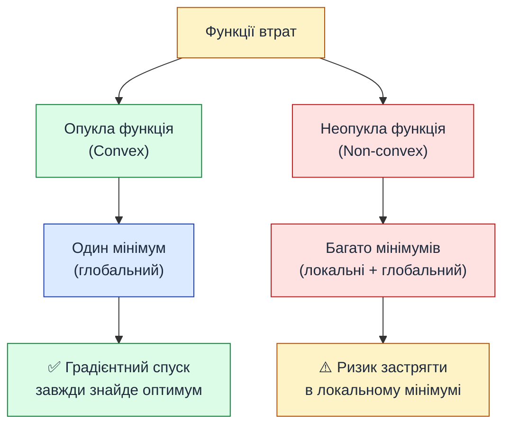
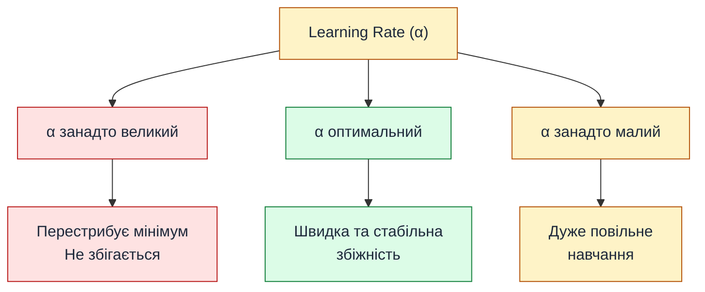

# Градієнтний спуск — як модель навчається

::card-group

::card{title="🎯 Мета підрозділу" icon="i-lucide-target"}

- Зрозуміти поняття функції втрат (loss function)
- Опанувати концепції локального та глобального мінімуму
- Розібратися з похідною та градієнтом функції
- Вивчити алгоритм градієнтного спуску покроково
- Зрозуміти вплив learning rate на процес навчання

::

::card{title="🔑 Ключові терміни" icon="i-lucide-key"}

- **Loss function** (функція втрат) — міра помилки моделі
- **Gradient** (градієнт) — вектор часткових похідних
- **Gradient descent** (градієнтний спуск) — алгоритм оптимізації
- **Learning rate** (α) — розмір кроку при оптимізації
- **Epoch** (епоха) — один прохід по всьому датасету
- **Convergence** (збіжність) — досягнення мінімуму функції

::

::

---

## Головне питання: як знайти оптимальні w і b?

У попередніх підрозділах ми:
1. Дізналися, що лінійна модель має вигляд **ŷ = w·x + b**
2. Навчилися оцінювати якість моделі через метрики (**MAE, MSE, R²**)

Але залишається ключове питання: **як автоматично знайти такі значення w і b, які дадуть найменшу помилку?**

Наївний підхід — перебрати всі можливі комбінації:

```python
best_error = float('inf')
best_w, best_b = 0, 0

for w in range(-1000, 1000):
    for b in range(-10000, 10000):
        error = calculate_mse(w, b)
        if error < best_error:
            best_error = error
            best_w, best_b = w, b
```

::warning
**Чому повний перебір (Brute-Force Grid Search) — це глухий кут:**
1. **Комбінаторний вибух (:math-formula{tex="O(K^d)" inline}):** Навіть якщо взяти скромну модель з 10 ознаками і перевіряти лише по 100 значень для кожної ваги, кількість комбінацій складе :math-formula{tex="100^{10} = 10^{20}" inline} операцій. Навіть суперкомп'ютер витратить на це мільйони років.
2. **Неперервність дійсного простору:** Оптимальне значення параметра :math-formula{tex="w" inline} майже завжди є дійсним дробовим числом (наприклад, :math-formula{tex="w^* = 2.14728\dots" inline}). Перебір з фіксованим дискретним кроком гарантовано промахнеться повз істинний мінімум.
3. **Неможливість масштабування:** Сучасні нейромережі оперують мільярдами ваг. Єдиний життєздатний шлях — рухатися за точним вектором аналітичної похідної.

**Висновок:** Потрібен математичний інструмент, який без перебору точно вказує напрямок найшвидшого зменшення втрат. Цей інструмент — **градієнт**.
::

{.diagram-img}

Потрібен **розумний алгоритм**, який крок за кроком рухається до оптимуму. Цей алгоритм називається **градієнтний спуск (gradient descent)**.

---

## Функція втрат (Loss Function)

Перш ніж говорити про оптимізацію, формалізуємо те, що ми оптимізуємо.

**Функція втрат** :math-formula{tex="L(w, b)" inline} — це функція, яка для даних значень параметрів :math-formula{tex="w" inline} і :math-formula{tex="b" inline} повертає **числову міру помилки** моделі на всьому датасеті.

Найчастіше використовується **MSE** як функція втрат:

::math-formula{tex="L(w, b) = \text{MSE}(w, b) = \frac{1}{n} \sum_{i=1}^{n} (y_i - (w \cdot x_i + b))^2"}
::

::note
**Аналогія (Спідометр невдачі):**  
Функція втрат — це як **спідометр невдачі або лічильник браку**. Чим вище число на табло, тим гірше працює модель (тим далі прогноз від дійсності). Мета алгоритму навчання — діями над параметрами зменшити цей показник до абсолютного мінімуму.
::

::note
**Чому MSE, а не MAE?**  
MSE є **диференційованою** функцією (має похідну в кожній точці), що критично для градієнтного спуску. MAE має "кут" у точці мінімуму, що ускладнює оптимізацію.

Якщо пояснити це простою інженерною мовою:

1. **Гладка форма чаші (MSE, :math-formula{tex="L = e^2" inline}):**  
   Графік MSE — це плавна парабола. Чим ближче алгоритм підходить до дна (до точки мінімальної похибки), тим пологішим стає схил, а значення похідної прямує до нуля (:math-formula{tex="\frac{dL}{de} \to 0" inline}). Завдяки цьому довжина кроку градієнтного спуску автоматично зменшується, і модель плавно зупиняється в точці мінімуму — подібно до кульки, яка зупиняється на дні гладкої чаші.

2. **V-подібна форма з гострим кутом (MAE, :math-formula{tex="L = |e|" inline}):**  
   Графік модуля похибки має форму латинської літери **V**. Нахил обох сторін однаковий: :math-formula{tex="-1" inline} зліва та :math-formula{tex="+1" inline} справа. Алгоритм не відчуває наближення до оптимуму — і на великій відстані від мінімуму, і впритул до нього модуль похідної залишається рівним 1, тому розмір кроку не затухає. А в самій точці мінімуму (:math-formula{tex="e = 0" inline}) знаходиться кутовий злам, де похідної не існує (нахил стрибком змінюється з :math-formula{tex="-1" inline} на :math-formula{tex="+1" inline}). Через це модель часто перестрибує точку мінімуму туди й назад (осцилює), не маючи змоги стабілізуватися.
::

{.diagram-img}

### Візуалізація функції втрат

Уявімо, що у нас лише **один параметр** :math-formula{tex="w" inline} (для спрощення, нехай :math-formula{tex="b = 0" inline}). Як виглядає залежність :math-formula{tex="L(w)" inline}?

::jupyter-notebook{title="loss_surface.ipynb" kernel="Python 3.11 (ipykernel)"}

::jupyter-cell{executionCount="1" executionTime="0.24s"}

```python
import numpy as np
import matplotlib.pyplot as plt

# Згенеруємо прості дані
rng = np.random.default_rng(seed=42)
x = np.array([1, 2, 3, 4, 5])
y = 2 * x + rng.normal(0, 0.5, 5)  # справжня залежність: y ≈ 2x

# Функція втрат (MSE) для різних значень w
def loss_function(w):
    predictions = w * x
    return np.mean((y - predictions) ** 2)

# Обчислюємо втрати для діапазону w від 0 до 4
w_values = np.linspace(0, 4, 100)
losses = [loss_function(w) for w in w_values]

# Візуалізація
fig, ax = plt.subplots(figsize=(10, 6))

ax.plot(w_values, losses, linewidth=3, color='steelblue', label='L(w) = MSE')
ax.axvline(x=2, color='red', linestyle='--', linewidth=2, label='Оптимальне w ≈ 2')

# Позначаємо мінімум
min_idx = np.argmin(losses)
ax.plot(w_values[min_idx], losses[min_idx], 'ro', markersize=12, 
        label=f'Мінімум: w={w_values[min_idx]:.2f}')

ax.set_title('Функція втрат L(w) для лінійної регресії', fontsize=14, fontweight='bold')
ax.set_xlabel('Параметр w', fontsize=12)
ax.set_ylabel('MSE (втрати)', fontsize=12)
ax.grid(True, alpha=0.3)
ax.legend(fontsize=11)

plt.tight_layout()
plt.show()
```

#output
{.diagram-img}
::

::jupyter-cell{type="markdown"}
**Спостереження:**
- Функція втрат має форму **параболи** (U-подібна крива)
- Існує **єдиний мінімум** (глобальний) у точці w ≈ 2
- Чим далі від оптимуму — тим більша помилка (вищі втрати)

Наше завдання: **знайти точку мінімуму автоматично**.
::

::

<video controls autoplay loop muted playsinline poster="/videos/ai-python/linear-regression-theory/gradient-descent/3d_loss_surface_poster.png" class="diagram-img rounded-xl shadow-lg w-full my-6">
  <source src="/videos/ai-python/linear-regression-theory/gradient-descent/3d_loss_surface_descent.mp4" type="video/mp4">
  <source src="/videos/ai-python/linear-regression-theory/gradient-descent/3d_loss_surface_descent.webm" type="video/webm">
  
</video>

### Зв'язок простору даних та простору втрат

Щоб зрозуміти, чому функція втрат утворює параболу, погляньте на взаємозв'язок між вибором коефіцієнта нахилу :math-formula{tex="w" inline} на координатній площині даних та результуючим значенням MSE:

{.diagram-img}

Кожна пряма на лівому графіку (з фіксованим параметром :math-formula{tex="w" inline}) генерує певний набір похибок (залишків). Сума квадратів цих залишків відображається точкою на параболі справа. 
- При :math-formula{tex="w = 0.5" inline} лінія надто полога, похибки великі :math-formula{tex="\rightarrow \text{MSE} = 37.5" inline}.
- При :math-formula{tex="w = 1.0" inline} лінія дещо краща, але все ще суттєво занижує значення :math-formula{tex="\rightarrow \text{MSE} = 11.0" inline}.
- При оптимальному :math-formula{tex="w^* = 2.0" inline} лінія проходить точно крізь точки спостережень :math-formula{tex="\rightarrow \text{MSE} = 0.0" inline} (ідеальний глобальний мінімум).
- При збільшенні :math-formula{tex="w = 3.0" inline} помилки знову симетрично зростають через переоцінку.

---

## Локальний vs Глобальний мінімум

Для лінійної регресії з MSE функція втрат є **опуклою** (*convex*) — вона має єдиний мінімум, який гарантовано є глобальним. Але для складніших нелінійних архітектур картина докорінно відрізняється:

{.diagram-img}

Фундаментальна перевага лінійної регресії з квадратичною функцією втрат полягає в її **суворій опуклості** (*strict convexity*). У вищій математиці це формально доводять через додатну визначеність матриці других похідних (матриці Гессе), проте для інженерного сприйняття набагато корисніша наочна фізична модель.

::tip
**Інтуїція форми чаші (миски):**  
Уявіть гладку круглу чашу (миску). Де б на її стінках ви не відпустили кульку — вона під дією сили тяжіння скотиться в єдину найнижчу точку на дні. Тут немає внутрішніх бар'єрів, нерівностей чи зайвих западин.

Функція втрат MSE у лінійній регресії має саме таку форму чаші. З яких би початкових значень :math-formula{tex="(w_0, b_0)" inline} ми не починали, градієнтний спуск гарантовано прийде в глобальний мінімум.
::

{.diagram-img}

Натомість у глибоких нейронних мережах (*Deep Neural Networks*) поверхня втрат нагадує нерівний гірський рельєф із багатьма локальними мінімумами (пастками) та сідловими точками (*saddle points*). Якщо алгоритм стартує невдало, він ризикує застрягти у випадковому локальному мінімумі й передчасно зупинити навчання, хоча глобальний мінімум (найкраще рішення) розташований в іншій точці.

::mermaid



::

::note
**Для лінійної регресії:** функція втрат (MSE) завжди опукла, тому градієнтний спуск **гарантовано** знайде глобальний мінімум. Для нейронних мереж це не так — там функція втрат має безліч локальних мінімумів.
::

---

## Похідна функції та градієнт

Як алгоритм розуміє, в якому напрямку рухатися, щоб зменшити втрати?

**Відповідь:** використовується **похідна** функції втрат.

Похідна — це показник того, наскільки швидко та в який бік змінюється функція, якщо ми зовсім трішки змінюємо її вхідні дані (аргумент).

::note
**Проста аналогія зі спідометром:**  
Якщо положення автомобіля на дорозі — це функція від часу, то похідна в конкретний момент часу — це **спідометр (миттєва швидкість)**:
- **Похідна зі знаком «плюс» (+):** функція зростає (рухаємося вперед / підйом угору).
- **Похідна зі знаком «мінус» (−):** функція спадає (рухаємося назад / спуск униз).
- **Похідна дорівнює нулю (0):** автомобіль миттєво зупинився або графік досяг вершини чи дна западини.
::

{.diagram-img}

### Геометричний зміст: нахил дотичної та диференційовність

**Геометрично:** похідна — це крутизна (нахил) дотичної лінії до графіка функції в певній точці:

- **Диференційовна функція** — це функція, у якої можна обчислити похідну в кожній точці (тобто однозначно визначити цей нахил).
- Графік диференційовної функції є **гладким** — без раптових зламів, розривів чи вертикальних стін.
- Якщо на графіку є **гострий кут** (як у функції модуля :math-formula{tex="|x|" inline} у нулі), то в цій точці незрозуміло, як саме провести дотичну — функція там є **недиференційовною**.

<video controls autoplay loop muted playsinline poster="/videos/ai-python/linear-regression-theory/gradient-descent/derivative_speedometer_poster.png" class="diagram-img rounded-xl shadow-lg w-full my-6">
  <source src="/videos/ai-python/linear-regression-theory/gradient-descent/derivative_speedometer_tangent.mp4" type="video/mp4">
  <source src="/videos/ai-python/linear-regression-theory/gradient-descent/derivative_speedometer_tangent.webm" type="video/webm">
  
</video>

::tip
**Чому це важливо для MSE?**  
Формула **MSE (Mean Squared Error)** використовує квадрат різниці: :math-formula{tex="(y - \hat{y})^2" inline}. Графік квадратичної функції — це плавна парабола без гострих кутів.

Оскільки MSE диференційовна в кожній точці, алгоритми оптимізації (як-от градієнтний спуск) завжди точно «бачать», куди і як швидко треба коригувати ваги моделі, щоб скотитися до мінімальної помилки.
::

::math-formula{tex="\frac{dL}{dw} = \lim_{\Delta w \to 0} \frac{L(w + \Delta w) - L(w)}{\Delta w}"}
::

::tip
**Правило інтерпретації знака похідної:**
- Похідна **додатна** (+) → функція **зростає** (рухаємося вгору)
- Похідна **від'ємна** (−) → функція **спадає** (рухаємося вниз)
- Похідна **= 0** → знаходимося в точці **екстремуму** (мінімум або максимум)
::

#### Що таке похідна мовою програміста? (Чисельний експеримент)

Для розробника математичний символ границі :math-formula{tex="\lim" inline} може здаватися суто академічною абстракцією. Проте в коді похідна — це звичайнісінька функція оцінки чутливості системи, яку можна виразити трьома рядками Python:

```python
def estimate_derivative(w, delta=0.0001):
    # Додаємо до ваги мале значення delta і перевіряємо зміну помилки:
    loss_before = loss_function(w)
    loss_after = loss_function(w + delta)
    return (loss_after - loss_before) / delta  # швидкість зміни помилки
```

Як інтерпретувати це значення в коді:
- Отримали `+45.0` :math-formula{tex="\implies" inline} зі збільшенням :math-formula{tex="w" inline} помилка **зростає**. Щоб зменшити помилку, вагу :math-formula{tex="w" inline} потрібно **зменшувати**.
- Отримали `-45.0` :math-formula{tex="\implies" inline} зі збільшенням :math-formula{tex="w" inline} помилка **падає**. Щоб зменшити помилку, вагу :math-formula{tex="w" inline} потрібно **збільшувати**.
- Отримали `0.0` :math-formula{tex="\implies" inline} зміна параметра більше не змінює помилку, ми досягли точки мінімуму.

::note
**Чому ми не обчислюємо похідну через `delta = 0.0001` у продакшн-бібліотеках?**  
Чисельний підхід (метод скінченних різниць / *finite difference*) вимагає викликати функцію `loss` додатково для кожного параметра моделі. Якби в нейромережі було 100 мільйонів ваг, комп'ютеру довелося б ганяти важкий датасет двісті мільйонів разів лише заради одного кроку!  

- Аналітична формула похідної — це потужна «компіляторна оптимізація»: математики розв'язали рівняння на папері один раз, щоб комп'ютер у NumPy міг обчислювати точний нахил миттєво в один рядок векторної операції.
::

### Аналогія: спуск з гори в тумані

Уявіть, що ви стоїте на горі в густому тумані і не бачите, де дно. Але під ногами відчуваєте **нахил місцевості**:

1. Якщо земля йде **вниз вліво** → робіть крок **вліво**
2. Якщо земля йде **вниз вправо** → робіть крок **вправо**
3. Якщо земля **рівна** → ви на дні (мінімум)

**Похідна** — це і є той самий «нахил під ногами». Градієнтний спуск використовує цю інформацію для руху до мінімуму.

{.diagram-img}

---

## Градієнт для функції багатьох змінних

У лінійної регресії два параметри: :math-formula{tex="w" inline} і :math-formula{tex="b" inline}. Тому функція втрат залежить від обох: :math-formula{tex="L(w, b)" inline}.

**Градієнт** — це узагальнення похідної на багатовимірний випадок. Це **вектор часткових похідних**:

::math-formula{tex="\nabla L(w, b) = \begin{pmatrix} \frac{\partial L}{\partial w} \\ \frac{\partial L}{\partial b} \end{pmatrix}"}
::

Де:
- :math-formula{tex="\frac{\partial L}{\partial w}" inline} — часткова похідна по :math-formula{tex="w" inline} (як зміниться :math-formula{tex="L" inline} при зміні :math-formula{tex="w" inline}, якщо :math-formula{tex="b" inline} фіксоване)
- :math-formula{tex="\frac{\partial L}{\partial b}" inline} — часткова похідна по :math-formula{tex="b" inline} (як зміниться :math-formula{tex="L" inline} при зміні :math-formula{tex="b" inline}, якщо :math-formula{tex="w" inline} фіксоване)

::note
**Інтуїція:** градієнт вказує напрямок **найшвидшого зростання** функції. Щоб **мінімізувати** функцію, потрібно рухатися в **протилежному напрямку** (проти градієнта).
::

### Обчислення градієнта для MSE

Для лінійної регресії з MSE часткові похідні мають аналітичний вигляд:

::math-formula{tex="\frac{\partial L}{\partial w} = -\frac{2}{n} \sum_{i=1}^{n} x_i (y_i - (w x_i + b))"}
::

::math-formula{tex="\frac{\partial L}{\partial b} = -\frac{2}{n} \sum_{i=1}^{n} (y_i - (w x_i + b))"}
::

::collapsible{title="📐 Показати виведення формул"}

Почнемо з функції втрат:

::math-formula{tex="L(w, b) = \frac{1}{n} \sum_{i=1}^{n} (y_i - (w x_i + b))^2"}
::

**Крок 1:** Позначимо помилку для :math-formula{tex="i" inline}-го спостереження:

::math-formula{tex="e_i = y_i - \hat{y}_i = y_i - (w x_i + b)"}
::

Тоді:

::math-formula{tex="L = \frac{1}{n} \sum_{i=1}^{n} e_i^2"}
::

**Крок 2:** Візьмемо похідну по :math-formula{tex="w" inline} (використовуємо правило ланцюга):

::math-formula{tex="\frac{\partial L}{\partial w} = \frac{1}{n} \sum_{i=1}^{n} 2 e_i \cdot \frac{\partial e_i}{\partial w}"}
::

::math-formula{tex="\frac{\partial e_i}{\partial w} = \frac{\partial}{\partial w}(y_i - w x_i - b) = -x_i"}
::

Підставляємо:

::math-formula{tex="\frac{\partial L}{\partial w} = \frac{2}{n} \sum_{i=1}^{n} e_i \cdot (-x_i) = -\frac{2}{n} \sum_{i=1}^{n} x_i (y_i - (w x_i + b))"}
::

**Аналогічно для :math-formula{tex="b" inline}:**

::math-formula{tex="\frac{\partial e_i}{\partial b} = -1 \quad \Rightarrow \quad \frac{\partial L}{\partial b} = -\frac{2}{n} \sum_{i=1}^{n} (y_i - (w x_i + b))"}
::

::

---

## Алгоритм градієнтного спуску

Тепер ми готові сформулювати сам алгоритм.

### Псевдокод

```
1. Ініціалізувати w та b випадковими значеннями (наприклад, 0)
2. Повторювати до збіжності:
    a. Обчислити передбачення: ŷᵢ = w·xᵢ + b для всіх i
    b. Обчислити градієнт:
        ∂L/∂w = -2/n · Σ xᵢ(yᵢ - ŷᵢ)
        ∂L/∂b = -2/n · Σ (yᵢ - ŷᵢ)
    c. Оновити параметри:
        w := w - α · ∂L/∂w
        b := b - α · ∂L/∂b
3. Повернути оптимальні w і b
```

Де :math-formula{tex="\alpha" inline} **(alpha)** — це **learning rate** (швидкість навчання) — гіперпараметр, що контролює розмір кроку.

### Таблиця-перекладач: Математична нотація ↔ Код на Python

Найбільший ментальний бар'єр для розробників — це перевантажена математична символіка (грецькі сигми :math-formula{tex="\sum" inline}, часткові похідні :math-formula{tex="\partial" inline}, вектори :math-formula{tex="\nabla" inline}). Насправді кожен математичний символ лінійної регресії має прямий і лаконічний еквівалент у коді:

| Математична нотація | Як це читає математик | Як це розуміє розробник | Код на Python / NumPy |
| :--- | :--- | :--- | :--- |
| :math-formula{tex="L(w, b)" inline} | Функція втрат | Функція розрахунку сумарної помилки | `def get_loss(w, b): ...` |
| :math-formula{tex="\hat{y}_i = w \cdot x_i + b" inline} | Рівняння лінійної апроксимації | Векторне множення масивів | `y_pred = w * x + b` |
| :math-formula{tex="y_i - \hat{y}_i" inline} | Залишок моделі | Векторна різниця факт/прогноз | `errors = y - y_pred` |
| :math-formula{tex="\frac{1}{n}\sum_{i=1}^n (\dots)" inline} | Середнє арифметичне за вибіркою | Стандартна функція усереднення | `np.mean(...)` |
| :math-formula{tex="\frac{\partial L}{\partial w}" inline} | Часткова похідна за вагою | Нахил схилу / швидкість зміни втрат | змінна `dw` або `grad_w` |
| :math-formula{tex="\alpha" inline} (alpha) | Швидкість навчання (*learning rate*) | Множник кроку оптимізатора | `learning_rate = 0.01` |
| :math-formula{tex="w := w - \alpha \frac{\partial L}{\partial w}" inline} | Ітераційне правило оновлення | Звичайна декрементна мутація змінної | `w -= learning_rate * dw` |

### Градієнтний спуск як ігровий цикл (Game Loop / Feedback Loop)

Будь-який розробник ігор чи бекенд-інженер знайомий із концепцією нескінченного циклу обробки стану (**Game Loop** або **Event Loop**):
```
1. Отримати вхідні події -> 2. Оновити фізичний стан -> 3. Відрендерити кадр
```

Навчання моделей машинного навчання організоване точнісінько за таким же принципом. Це **замкнений цикл зворотного зв'язку** (*closed-loop feedback system*), де модель на кожній ітерації виконує 4 послідовні дії:
`Forward pass` → `Compute Loss` → `Backward pass` → `Optimizer step`.

{.diagram-img}

### Універсальний 6-кроковий конвеєр (Pipeline) навчання ML-моделей

Градієнтний спуск у лінійній регресії є базовою матрицею того, як навчаються практично всі моделі штучного інтелекту — від найпростішої регресійної прямої до багатомільярдних мовних моделей (LLM):

```python
# 1. Ініціалізація ваг випадковими значеннями або нулями
rng = np.random.default_rng(seed=42)
w, b = float(rng.standard_normal()), 0.0

# 2. Цикл по навчальних епохах (Epochs loop / Game Loop)
for epoch in range(num_epochs):
    # 3. Прямий прохід (Forward pass) — обчислення прогнозів
    y_pred = w * x + b
    
    # 4. Розрахунок втрат (Loss calculation) — оцінка похибки MSE
    loss = np.mean((y - y_pred) ** 2)
    
    # 5. Зворотний прохід (Backward pass) — обчислення градієнтів
    dw = -2 * np.mean(x * (y - y_pred))
    db = -2 * np.mean(y - y_pred)
    
    # 6. Крок оптимізатора (Optimizer update step) — оновлення параметрів
    w = w - learning_rate * dw
    b = b - learning_rate * db
```

Цей ланцюжок дій залишається незмінним і у виробничих бібліотеках глибокого навчання (PyTorch, TensorFlow, JAX), де замість ручного обчислення похідних викликаються лаконічні абстракції `loss.backward()` та `optimizer.step()`.

### Формула оновлення

::math-formula{tex="w_{\text{new}} = w_{\text{old}} - \alpha \cdot \frac{\partial L}{\partial w}"}
::

::math-formula{tex="b_{\text{new}} = b_{\text{old}} - \alpha \cdot \frac{\partial L}{\partial b}"}
::

::tip
**Чому мінус?** Градієнт вказує напрямок **зростання** функції. Щоб **мінімізувати**, рухаємося в протилежний бік (проти градієнта).
::

::note
**Аналогія (Налаштування температури води в душі):**  
Градієнтний спуск працює подібно до того, як ми регулюємо температуру води в душі:
1. **Forward pass:** відкриваємо кран у початковому положенні та перевіряємо воду.
2. **Loss:** оцінюємо різницю між поточною температурою та комфортною (вода надто холодна — похибка велика).
3. **Gradient:** визначаємо напрямок повороту — якщо повернути вліво, вода стане теплішою, якщо вправо — холоднішою.
4. **Step (з урахуванням швидкості :math-formula{tex="\alpha" inline}):**
   - Якщо вода крижана (велика похибка), ми повертаємо кран **на більший кут** (великий крок).
   - Коли вода вже тепла і майже комфортна, ми підкручуємо важіль **зовсім потроху** (природне зменшення кроку біля мінімуму).
   - Якщо ж крутнути важіль занадто різко (завеликий :math-formula{tex="\alpha" inline}), температура різко стрибне в окріп або холод — система «перестрибне» комфортну точку (дивергенція).
::

{.diagram-img}

::note
**Аналогія (Навігація за компасом):**  
Градієнт :math-formula{tex="\nabla L" inline} завжди вказує напрямок **найкрутішого підйому** на гору. Якщо ви стоїте на схилі й орієнтуєтеся за компасом, стрілка якого вказує «підйом угору на північ», то щоб спуститися до озера на дні ущелини, вам слід розвернутися рівно на 180° і крокувати **на південь** — тобто строго **проти градієнта** (:math-formula{tex="-\nabla L" inline}).
::

### Геометрія ітераційного спуску

Щоб краще уявити роботу формули оновлення параметрів, подивіться на динамічну анімацію процесу навчання: ліворуч пряма припасовується до спостережень, а праворуч точка параметрів :math-formula{tex="(w, b)" inline} синхронно спускається лініями рівня функції втрат MSE до глобального мінімуму:

<video controls autoplay loop muted playsinline poster="/videos/ai-python/linear-regression-theory/gradient-descent/poster.png" class="diagram-img rounded-xl shadow-lg w-full my-6">
  <source src="/videos/ai-python/linear-regression-theory/gradient-descent/gradient_descent_visualization.mp4" type="video/mp4">
  <source src="/videos/ai-python/linear-regression-theory/gradient-descent/gradient_descent_visualization.webm" type="video/webm">
  
</video>

{.diagram-img}

Зверніть увагу на важливі геометричні закономірності процесу:
1. **Початковий стан (:math-formula{tex="w_0" inline}):** Модель стартує з довільної точки (наприклад, :math-formula{tex="w_0 = 0.5" inline}, де похибка суттєва). Оскільки нахил параболи тут крутий, модуль похідної :math-formula{tex="\lvert \frac{\partial L}{\partial w} \rvert" inline} є високим.
2. **Швидкий початковий прогрес:** Завдяки пропорційності довжини кроку до значення градієнта (:math-formula{tex="\Delta w = -\alpha \nabla L" inline}), на початку оптимізації модель робить найбільші розмашисті кроки до дна чаші.
3. **Природне уповільнення біля мінімуму:** У міру наближення до оптимуму крива виположується, нахил дотичної прямує до нуля (:math-formula{tex="\frac{\partial L}{\partial w} \to 0" inline}). Відповідно, величина кроку :math-formula{tex="\alpha \cdot \frac{\partial L}{\partial w}" inline} зменшується автоматично, навіть за сталого значення коефіцієнта :math-formula{tex="\alpha" inline}.
4. **Стаціонарна точка (:math-formula{tex="w^*" inline}):** У точці глобального мінімуму градієнт дорівнює нулю (:math-formula{tex="\frac{\partial L}{\partial w} = 0" inline}). Оновлення параметрів повністю припиняється: :math-formula{tex="w_{\text{new}} = w_{\text{old}} - 0" inline}, тобто алгоритм успішно зійшовся (*converged*).

---

## Роль Learning Rate (α)

**Learning rate** (темп або швидкість навчання) — це один з найважливіших гіперпараметрів машинного навчання. Він масштабує вектор градієнта і визначає амплітуду кожного кроку оптимізатора.

::mermaid



::

### Фізичний зміст та динаміка збіжності

Вибір гіперпараметра :math-formula{tex="\alpha" inline} безпосередньо визначає характер руху в просторі втрат:

{.diagram-img}

Розглянемо три класичні сценарії, відображені на панелях:
- **Ліва панель — Занадто малий темп (:math-formula{tex="\alpha \ll 1" inline}):** Крок мікроскопічний. Алгоритм повільно повзе по схилу параболи, вимагаючи тисяч ітерацій та значних обчислювальних витрат для досягнення дна.
- **Центральна панель — Оптимальний темп (:math-formula{tex="\alpha" inline} balanced):** Алгоритм упевнено і плавно прямує до точки мінімуму за лічені ітерації без зайвих коливань.
- **Права панель — Занадто великий темп (:math-formula{tex="\alpha \gg 1" inline}):** Крок настільки великий, що алгоритм перелітає точку мінімуму, потрапляючи на ще крутіший протилежний бік ями. Виникає прогресуюче коливання та розбіжність — **дивергенція** (*divergence*), за якої втрати експоненційно зростають до нескінченності.

::note
**Аналогія (Розмір кроку мандрівника в тумані):**  
Learning rate :math-formula{tex="\alpha" inline} — це фізична довжина вашого кроку при спуску з гори:
- **Кроки ліліпута (:math-formula{tex="\alpha = 0.001" inline}):** Ви робите мікроскопічні кроки по півсантиметра. Це абсолютно безпечно, але до дна долини ви йтимете тижнями (надмірне навантаження на процесор).
- **Зважений крок спортсмена (:math-formula{tex="\alpha = 0.05" inline}):** Впевнений, пружний і швидкий рух уперед без втрати рівноваги.
- **Семимильні чоботи велетня (:math-formula{tex="\alpha = 5.0" inline}):** Довжина стрибка настільки безрозсудна, що ви перелітаєте всю долину, врізаєтеся в протилежну скелю і рикошетите ще вище у прірву (дивергенція).
::

<video controls autoplay loop muted playsinline poster="/videos/ai-python/linear-regression-theory/gradient-descent/learning_rate_poster.png" class="diagram-img rounded-xl shadow-lg w-full my-6">
  <source src="/videos/ai-python/linear-regression-theory/gradient-descent/learning_rate_dynamics.mp4" type="video/mp4">
  <source src="/videos/ai-python/linear-regression-theory/gradient-descent/learning_rate_dynamics.webm" type="video/webm">
  
</video>

::jupyter-notebook{title="learning_rate_demo.ipynb" kernel="Python 3.11 (ipykernel)"}

::jupyter-cell{type="markdown"}
### Візуалізація впливу learning rate
::

::jupyter-cell{executionCount="1" executionTime="0.32s"}

```python
import numpy as np
import matplotlib.pyplot as plt

# Дані
rng = np.random.default_rng(seed=42)
x = np.array([1, 2, 3, 4, 5])
y = 2 * x + rng.normal(0, 0.2, 5)

# Функція градієнтного спуску
def gradient_descent(x, y, lr, epochs=20):
    w = 0.1  # стартуємо далеко від оптимуму (w=2.0)
    history = [w]
    for _ in range(epochs):
        y_pred = w * x
        dw = -2 * np.mean(x * (y - y_pred))
        w = w - lr * dw
        history.append(w)
    return np.array(history)

# Порівняння трьох сценаріїв
epochs = 20
h_small = gradient_descent(x, y, lr=0.005, epochs=epochs)
h_opt = gradient_descent(x, y, lr=0.05, epochs=epochs)
h_large = gradient_descent(x, y, lr=0.095, epochs=epochs)

# 3 окремі панелі для кожного режиму швидкості
fig, (ax1, ax2, ax3) = plt.subplots(1, 3, figsize=(16, 5))
fig.suptitle('Вплив швидкості навчання (Learning Rate) на пошук параметра w', fontsize=15, fontweight='bold', y=1.02)

# 1. Занадто малий
ax1.plot(h_small, marker='o', markersize=4, color='#0284c7', linewidth=2.5, label='Траєкторія w')
ax1.axhline(2.0, color='#ef4444', linestyle='--', linewidth=1.8, label='Оптимум w ≈ 2.0')
ax1.set_title('α = 0.005 (Занадто малий)\nПовільне повзання', fontsize=12, fontweight='bold', color='#0369a1')
ax1.set_xlabel('Епоха', fontsize=11)
ax1.set_ylabel('Значення параметра w', fontsize=11)
ax1.set_ylim(-0.5, 3.0)
ax1.grid(True, linestyle='--', alpha=0.5)
ax1.legend(loc='lower right', fontsize=10)

# 2. Оптимальний
ax2.plot(h_opt, marker='s', markersize=5, color='#059669', linewidth=2.5, label='Траєкторія w')
ax2.axhline(2.0, color='#ef4444', linestyle='--', linewidth=1.8, label='Оптимум w ≈ 2.0')
ax2.set_title('α = 0.05 (Оптимальний)\nШвидка і гладка збіжність', fontsize=12, fontweight='bold', color='#047857')
ax2.set_xlabel('Епоха', fontsize=11)
ax2.set_ylim(-0.5, 3.0)
ax2.grid(True, linestyle='--', alpha=0.5)
ax2.legend(loc='lower right', fontsize=10)

# 3. Занадто великий
ax3.plot(h_large, marker='^', markersize=5, color='#dc2626', linewidth=2, linestyle='-', label='Траєкторія w')
ax3.axhline(2.0, color='#ef4444', linestyle='--', linewidth=1.8, label='Оптимум w ≈ 2.0')
ax3.set_title('α = 0.095 (Занадто великий)\nПерестрибування та розбіжність', fontsize=12, fontweight='bold', color='#b91c1c')
ax3.set_xlabel('Епоха', fontsize=11)
ax3.grid(True, linestyle='--', alpha=0.5)
ax3.legend(loc='lower left', fontsize=10)

plt.tight_layout()
plt.show()
```

#output
{.diagram-img}
::

::jupyter-cell{type="markdown"}
**Спостереження:**

- **α = 0.005 (занадто малий):** параметр :math-formula{tex="w" inline} монотонно, але надто повільно піднімається вгору. За 20 епох модель ледь дійшла до 1.8, так і не досягнувши оптимуму 2.0 (потрібно у 5–10 разів більше епох).
- **α = 0.05 (оптимальний):** алгоритм упевнено і стабільно досягає точки оптимуму :math-formula{tex="w \approx 2.0" inline} всього за 4–6 епох і надалі надійно зберігає досягнуте значення.
- **α = 0.095 (занадто великий):** через надмірний розмір кроку модель перелітає через дно мінімуму на протилежний схил, амплітуда коливань з кожним кроком експоненційно зростає (дивергенція), а помилка летить у нескінченність.

**Висновок:** підбір learning rate — критичний етап налаштування моделі, який визначає, чи зійдеться навчання взагалі.
::

::

::warning
**Діагностика Learning Rate: симптоми та поведінка моделі в коді**

- Під час навчання моделі орієнтуйтеся на значення функції втрат (`loss`) по епохах:
  - **`loss` стає `NaN` або `Inf`:** Критичний вибух градієнта (*gradient explosion*). :math-formula{tex="\alpha" inline} настільки великий, що числа перевищили ліміт пам'яті комп'ютера `float64`. Терміново зменшіть :math-formula{tex="\alpha" inline} у 10–100 разів.
  - **`loss` збільшується з кожною епохою:** Режим дивергенції. Алгоритм перестрибує мінімум і розхитується. Зменшіть :math-formula{tex="\alpha" inline} у 3–5 разів.
  - **`loss` майже не змінюється (спадає на :math-formula{tex="0.000001" inline}):** Темп надто повільний. Модель «повзе» і витрачає ресурси. Збільшіть :math-formula{tex="\alpha" inline} у 5–10 разів.
  - **`loss` стрімко падає на початку, а далі плавно стабілізується на плато:** Здорова ідеальна збіжність (*healthy convergence*). Параметр підібрано бездоганно.

- **Золоте правило підбору:** починайте з :math-formula{tex="\alpha = 0.01" inline}, перевіряйте 0.1, 0.001 за логарифмічною шкалою (крок :math-formula{tex="\times 10" inline}).
::

---

## Реалізація градієнтного спуску на Python

::jupyter-notebook{title="gradient_descent_implementation.ipynb" kernel="Python 3.11 (ipykernel)"}

::jupyter-cell{executionCount="1" outputType="stdout" executionTime="0.15s"}

```python
import numpy as np
import matplotlib.pyplot as plt

# Генеруємо дані
rng = np.random.default_rng(seed=42)
x = np.array([45, 50, 60, 55, 70, 65, 80, 75, 90, 85,
              100, 95, 110, 105, 120, 115, 130, 125, 140, 135])
y = 500 * x + rng.normal(0, 3000, 20)

# Нормалізація даних (для кращої збіжності)
x_mean, x_std = x.mean(), x.std()
x_norm = (x - x_mean) / x_std

# Градієнтний спуск
def gradient_descent(x, y, learning_rate=0.01, epochs=1000):
    n = len(x)
    w, b = 0, 0  # початкові значення
    
    loss_history = []
    
    for epoch in range(epochs):
        # Передбачення
        y_pred = w * x + b
        
        # Обчислення втрат (MSE)
        loss = np.mean((y - y_pred) ** 2)
        loss_history.append(loss)
        
        # Градієнти
        dw = -(2/n) * np.sum(x * (y - y_pred))
        db = -(2/n) * np.sum(y - y_pred)
        
        # Оновлення параметрів
        w = w - learning_rate * dw
        b = b - learning_rate * db
        
        # Логування кожні 200 епох
        if (epoch + 1) % 200 == 0:
            print(f"Епоха {epoch+1:4d}: w={w:.2f}, b={b:.2f}, Loss={loss:.2f}")
    
    return w, b, loss_history

# Запуск
print("Навчання моделі методом градієнтного спуску...")
print("=" * 60)
w_final, b_final, loss_history = gradient_descent(x_norm, y, learning_rate=0.1, epochs=1000)

# Переведення коефіцієнтів у фізичні одиниці ($/м²)
w_real = w_final / x_std
b_real = b_final - (w_final * x_mean / x_std)

print("\n" + "=" * 60)
print(f"Нормалізовані параметри : w = {w_final:.2f}, b = {b_final:.2f}")
print(f"У фізичних одиницях     : Ціна ≈ {w_real:.0f} × Площа {b_real:+.0f}$")
```

#output
Навчання моделі методом градієнтного спуску...
============================================================
Епоха  200: w=14934.54, b=46151.20, Loss=6204944.39
Епоха  400: w=14934.54, b=46151.20, Loss=6204944.39
Епоха  600: w=14934.54, b=46151.20, Loss=6204944.39
Епоха  800: w=14934.54, b=46151.20, Loss=6204944.39
Епоха 1000: w=14934.54, b=46151.20, Loss=6204944.39

============================================================
Нормалізовані параметри : w = 14934.54, b = 46151.20
У фізичних одиницях     : Ціна ≈ 518 × Площа - 1763$
::

::jupyter-cell{executionCount="2" executionTime="0.18s"}

```python
# Візуалізація кривої навчання та результату
fig, (ax1, ax2) = plt.subplots(1, 2, figsize=(14, 5.2))

# Графік 1: крива навчання (Loss по епохах)
ax1.plot(loss_history, linewidth=2.5, color='#0284c7', label='MSE Loss')
ax1.set_title('Крива навчання (Loss по епохах)', fontsize=13, fontweight='bold')
ax1.set_xlabel('Епоха', fontsize=11)
ax1.set_ylabel('MSE Loss', fontsize=11)
ax1.grid(True, linestyle='--', alpha=0.5)
ax1.legend(loc='upper right')

# Врізка (Zoom) стабілізації втрат на епохах 10–150
ax_ins = ax1.inset_axes([0.36, 0.32, 0.58, 0.44])
ax_ins.plot(range(10, 150), loss_history[10:150], color='#0284c7', linewidth=2)
ax_ins.set_title('Масштаб стабілізації (епохи 10–150)', fontsize=9.5, fontweight='bold', color='#0369a1')
ax_ins.set_xlabel('Епоха', fontsize=8.5)
ax_ins.set_ylabel('Loss', fontsize=8.5)
ax_ins.tick_params(labelsize=8)
ax_ins.grid(True, linestyle=':', alpha=0.6)

# Графік 2: фінальна модель
y_pred_final = w_final * x_norm + b_final

# Фізичні параметри у вихідному масштабі (ціна за м²)
w_real = w_final / x_std
b_real = b_final - (w_final * x_mean / x_std)

# Сортуємо для коректного відображення лінії
sort_idx = np.argsort(x)
ax2.scatter(x, y, s=80, alpha=0.75, color='#0284c7', edgecolors='#0369a1', label='Реальні дані (квартири)')
ax2.plot(x[sort_idx], y_pred_final[sort_idx], color='#dc2626', linewidth=2.5, 
         label=f'Модель GD (w={w_final:.0f}, b={b_final:.0f})\n[Ціна ≈ {w_real:.0f}·S {b_real:+.0f}$]')
ax2.set_title('Результат навчання (фінальна пряма)', fontsize=13, fontweight='bold')
ax2.set_xlabel('Площа (м²)', fontsize=11)
ax2.set_ylabel('Ціна ($)', fontsize=11)
ax2.grid(True, linestyle='--', alpha=0.5)
ax2.legend(loc='upper left')

plt.tight_layout()
plt.show()
```

#output
{.diagram-img}
::

::jupyter-cell{type="markdown"}
**Висновки з проведеного експерименту:**
1. **Збіжність до істини:** Попри шум у даних, алгоритм градієнтного спуску відновив фізичну закономірність :math-formula{tex="\text{Ціна} \approx 518 \times \text{Площа} - 1763\$" inline}, що максимально наближено до вихідної залежності генерації (:math-formula{tex="y = 500 \cdot x" inline}).
2. **Перевага нормалізації ознак:** Нормалізація :math-formula{tex="x_{\text{norm}}" inline} вирівняла масштаб, дозволивши взяти агресивний темп навчання :math-formula{tex="\alpha = 0.1" inline} без ризику розхитування або вибуху помилки.
3. **Надлишкові обчислення:** На врізці (Zoom) кривої втрат чітко видно, що алгоритм вийшов на плато мінімуму вже на :math-formula{tex="\approx 40" inline}-й епосі. Наступні 950 ітерацій були марнуванням процесорного часу. Це безпосередньо підводить нас до необхідності застосування **критеріїв зупинки**.
::

::

---

## Критерії зупинки (Convergence)

Коли зупинити градієнтний спуск? Не можна ж нескінченно ітерувати. Існує кілька критеріїв **збіжності (convergence)**:

::accordion

::accordion-item{label="1️⃣ Фіксована кількість епох" icon="i-lucide-circle-help"}

Найпростіший підхід: задати максимальну кількість ітерацій (наприклад, 1000 епох) і зупинитися.

**Плюси:** просто, передбачувано  
**Мінуси:** можемо зупинитися завчасно (не досягли мінімуму) або марнувати обчислення (давно збіглися, але продовжуємо)

::

::accordion-item{label="2️⃣ Зміна втрат < порогу" icon="i-lucide-circle-help"}

Зупинитися, коли втрати змінюються незначно між епохами:

```python
if abs(loss[epoch] - loss[epoch-1]) < tolerance:
    break
```

Типові значення **tolerance**: 1e-6, 1e-5

::

::accordion-item{label="3️⃣ Зміна параметрів < порогу" icon="i-lucide-circle-help"}

Зупинитися, коли параметри майже не змінюються:

```python
if abs(w_new - w_old) < tolerance and abs(b_new - b_old) < tolerance:
    break
```

::

::accordion-item{label="4️⃣ Градієнт ≈ 0" icon="i-lucide-circle-help"}

Зупинитися, коли норма градієнта дуже мала:

```python
gradient_norm = np.sqrt(dw**2 + db**2)
if gradient_norm < tolerance:
    break
```

Це означає, що ми в точці екстремуму (похідна = 0).

::

::

---

## Варіанти градієнтного спуску

Описаний вище алгоритм називається **Batch Gradient Descent** (пакетний). Існують інші варіанти:

| Тип | Опис | Переваги | Недоліки |
|-----|------|----------|----------|
| **Batch GD** | Використовує ВСІ дані для обчислення градієнта | Стабільний, точний | Повільний для великих датасетів |
| **Stochastic GD (SGD)** | Використовує ОДНЕ випадкове спостереження | Швидкий, може вийти з локальних мінімумів | Нестабільний, шумний |
| **Mini-batch GD** | Використовує підмножину даних (batch size: 32, 64, 128) | Баланс між швидкістю та стабільністю | Потрібен ще один гіперпараметр (batch size) |

::note
У сучасних бібліотеках (TensorFlow, PyTorch) за замовчуванням використовується **Mini-batch GD** з адаптивними алгоритмами (Adam, RMSprop), які автоматично підлаштовують learning rate.
::

### Геометрія траєкторій: як різні оптимізатори рухаються до мінімуму

Різниця між цими трьома підходами наочно проявляється у просторі ліній рівня функції втрат:

{.diagram-img}

<video controls autoplay loop muted playsinline poster="/videos/ai-python/linear-regression-theory/gradient-descent/optimizers_race_poster.png" class="diagram-img rounded-xl shadow-lg w-full my-6">
  <source src="/videos/ai-python/linear-regression-theory/gradient-descent/optimizers_race.mp4" type="video/mp4">
  <source src="/videos/ai-python/linear-regression-theory/gradient-descent/optimizers_race.webm" type="video/webm">
  
</video>

Порівняння динаміки оптимізації:
1. **Batch Gradient Descent (синя лінія):**
   - На кожній ітерації обчислює середній градієнт за всіма :math-formula{tex="m" inline} спостереженнями датасету.
   - Рухається абсолютно плавно, впевнено і по найкоротшій траєкторії перпендикулярно лініям рівня прямо до глобального мінімуму.
   - *Недолік:* якщо вибірка містить мільйони спостережень, кожен окремий крок вимагає гігантських обчислень та завантаження всього масиву в оперативну пам'ять.
2. **Stochastic Gradient Descent / SGD (червона лінія):**
   - Оновлює параметри після кожного випадково обраного спостереження :math-formula{tex="(x_i, y_i)" inline}.
   - Окремі приклади містять шуми або аномалії, тому вектор кроку постійно змінює напрямок («хода сп'янілого»).
   - Траєкторія сильно коливається і ніколи не завмирає точно в точці мінімуму :math-formula{tex="w^*" inline}, а флуктує навколо неї.
   - *Перевага:* кожен крок обчислюється миттєво, а шум допомагає «вистрибувати» з дрібних локальних ям у складних нелінійних мережах.
3. **Mini-batch Gradient Descent (зелена лінія):**
   - Золота інженерна середина: дані розбиваються на пакети (зазвичай степені двійки: 32, 64, 128 чи 256 спостережень).
   - Траєкторія набагато стабільніша, ніж у SGD, а апаратне прискорення GPU/CPU дозволяє векторизувати обчислення батчу без втрати продуктивності.

---

## Резюме підрозділу

::card-group

::card{title="✅ Ключові висновки" icon="i-lucide-check-circle"}

- **Функція втрат** (MSE) вимірює помилку моделі
- **Градієнт** — це вектор похідних, що вказує напрямок зростання функції
- **Градієнтний спуск** ітеративно рухається проти градієнта до мінімуму
- **Learning rate** контролює розмір кроку: занадто малий → повільно, занадто великий → не збігається
- Для лінійної регресії функція втрат опукла → гарантована збіжність до глобального мінімуму

::

::card{title="🔜 Наступний крок" icon="i-lucide-arrow-right"}

Ми розглянули лінійну регресію з **однією змінною** (площа → ціна). А що, якщо у нас **багато ознак** (площа, кімнати, поверх, район)?

**Наступний підрозділ:** Регресія з кількома змінними (множинна лінійна регресія)

::

::
