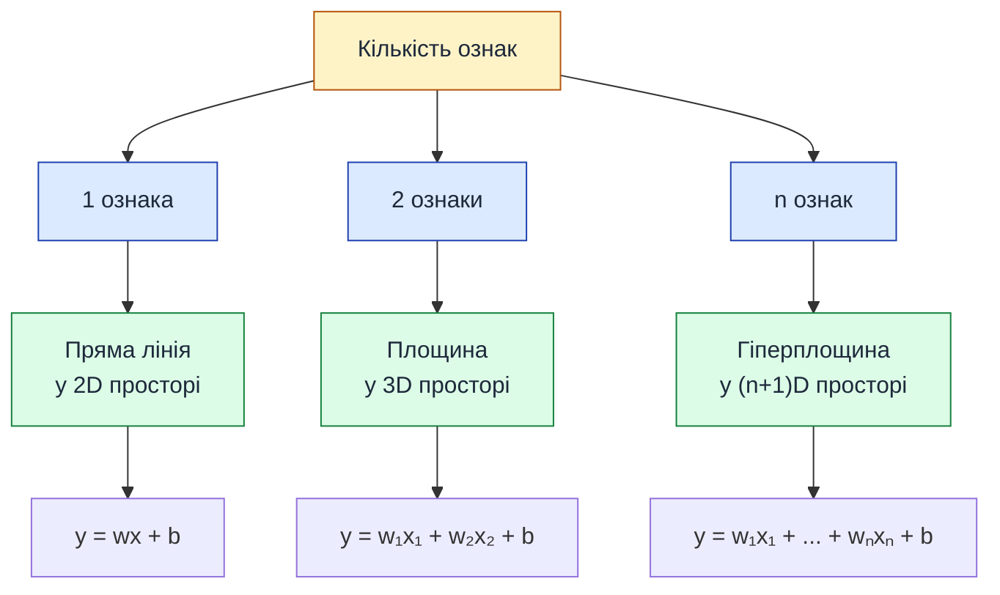

# Множинна лінійна регресія — модель з багатьма ознаками

::card-group

::card{title="🎯 Мета підрозділу" icon="i-lucide-target"}

- Узагальнити лінійну регресію на випадок багатьох ознак
- Опанувати векторну та матричну форму запису моделі
- Зрозуміти геометричну інтерпретацію (гіперплощина)
- Реалізувати модель з 4 ознаками для передбачення ціни квартири

::

::card{title="🔑 Ключові терміни" icon="i-lucide-key"}

- **Multiple Linear Regression** — множинна лінійна регресія
- **Feature vector** (X) — вектор ознак
- **Weight vector** (w) — вектор вагів
- **Hyperplane** — гіперплощина у багатовимірному просторі
- **Dot product** — скалярний добуток векторів

::

::

---

## Обмеження однієї ознаки

У попередніх підрозділах ми розглядали модель, де ціна квартири залежить **лише від площі**:

::math-formula
\text{Ціна} = w \cdot \text{Площа} + b
::

Але в реальності на ціну впливає **безліч факторів**:

::card-group

::card{title="🏠 Нерухомість: Ціна житла" icon="i-lucide-home"}

- **Ціль ($y$):** Ринкова вартість ($)
- **Площа ($x_1$):** Загальний метраж (м²)
- **Кімнати ($x_2$):** Кількість кімнат
- **Поверх ($x_3$):** Поверх розташування
- **Логістика ($x_4$):** Відстань до метро (км)
- **Будинок ($x_5$):** Рік введення в експлуатацію

::

::card{title="💻 IT: Затримка сервера" icon="i-lucide-server"}

- **Ціль ($y$):** Час відповіді API (*Latency, ms*)
- **Трафік ($x_1$):** Запити на секунду (*RPS*)
- **Пам'ять ($x_2$):** Обсяг оперативної пам'яті (*RAM, GB*)
- **Обчислення ($x_3$):** Кількість ядер (*vCPU*)
- **Мережа ($x_4$):** Середній розмір запиту (*KB*)
- **СУБД ($x_5$):** Кількість активних з'єднань з БД

::

::card{title="📈 E-commerce: Виручка магазину" icon="i-lucide-shopping-cart"}

- **Ціль ($y$):** Денний дохід ($)
- **Пошук ($x_1$):** Бюджет Google Ads ($)
- **Соцмережі ($x_2$):** Бюджет Meta / Instagram ($)
- **Email ($x_3$):** Обсяг маркетингової розсилки
- **Знижки ($x_4$):** Середній розмір промокоду (%)
- **Асортимент ($x_5$):** Кількість активних позицій на складі

::

::

Модель з однією ознакою **ігнорує** цю інформацію. Навіть якщо у нас є дані про поверх і район, ми їх не використовуємо → втрачаємо точність.

::note
**Інтуїція:** дві квартири по 70 м² можуть коштувати по-різному: одна на 1 поверсі в спальному районі, інша на 10 поверсі в центрі. Однофакторна модель не розрізнить їх.
::

---

## Узагальнення на випадок n ознак

**Множинна лінійна регресія (Multiple Linear Regression)** — це розширення простої лінійної регресії на випадок **кількох вхідних змінних**.

### Формула для n ознак

Якщо у нас є **n ознак** x₁, x₂, ..., xₙ, модель має вигляд:

::math-formula
\hat{y} = w_1 x_1 + w_2 x_2 + w_3 x_3 + \ldots + w_n x_n + b
::

де:
- **x₁, x₂, ..., xₙ** — вхідні ознаки (features)
- **w₁, w₂, ..., wₙ** — ваги (weights, coefficients) для кожної ознаки
- **b** — вільний член (bias, intercept)

### Приклад з чотирма ознаками

Нехай у нас є 4 ознаки для квартири:
1. **Площа** (м²)
2. **Кількість кімнат**
3. **Поверх**
4. **Відстань до метро** (км)

Модель виглядатиме так:

::math-formula
\begin{align*}
\text{Ціна} = &\ w_1 \cdot \text{Площа} \\
              &+ w_2 \cdot \text{Кімнати} \\
              &+ w_3 \cdot \text{Поверх} \\
              &+ w_4 \cdot \text{Відстань до метро} \\
              &+ b
\end{align*}
::

::::accordion

:::accordion-item{label="📊 Приклад конкретної моделі" icon="i-lucide-help-circle"}

Припустимо, після навчання ми отримали такі параметри:
- w₁ = 500 $/м²
- w₂ = 3000 $ (за кожну кімнату)
- w₃ = 200 $ (за кожен поверх)
- w₄ = -5000 $ (штраф за кожен км до метро)
- b = 10000 $ (базова вартість)

Тоді для квартири:
- Площа = 70 м²
- Кімнати = 2
- Поверх = 5
- Відстань = 1.5 км

**Передбачена ціна:**

::math-formula
\begin{align*}
\text{Ціна} &= 500 \times 70 + 3000 \times 2 + 200 \times 5 - 5000 \times 1.5 + 10000 \\
            &= 35000 + 6000 + 1000 - 7500 + 10000 \\
            &= 44500 \text{ USD}
\end{align*}
::

**Інтерпретація вагів:**
- **w₁ = 500**: кожен додатковий м² додає 500$
- **w₂ = 3000**: кожна додаткова кімната додає 3000$
- **w₃ = 200**: кожен вищий поверх додає 200$ (люди цінують висоту)
- **w₄ = -5000**: кожен км від метро **віднімає** 5000$ (віддаленість від транспорту знижує ціну)

:::

::::

---

## Векторна форма запису

Для зручності запис з n доданками можна **скоротити** за допомогою векторів та скалярного добутку.

### Позначення

Введемо:
- **X** — вектор ознак (feature vector): X = [x₁, x₂, ..., xₙ]
- **w** — вектор вагів (weight vector): w = [w₁, w₂, ..., wₙ]
- **b** — скаляр (bias)

Тоді модель записується компактно:

::math-formula
\hat{y} = \mathbf{w}^T \mathbf{X} + b = \sum_{i=1}^{n} w_i x_i + b
::

де **w^T X** — це **скалярний добуток** (dot product) векторів w і X.

::tip
**Скалярний добуток** двох векторів:

::math-formula
\mathbf{w}^T \mathbf{X} = w_1 x_1 + w_2 x_2 + \ldots + w_n x_n
::

У NumPy це реалізовано як `np.dot(w, X)` або `w @ X`.
::

> [!NOTE]
> **Аналогія (Підсумковий чек у супермаркеті або кошторис):**  
> Векторне рівняння множинної регресії працює як касовий апарат:
> - $b$ — фіксована вартість паперового пакета або мінімальний тариф за виклик кур'єра.
> - Кожна пара $w_i \cdot x_i$ — це вартість окремої товарної позиції: ціна за одиницю товару ($w_i$), помножена на придбану кількість ($x_i$).
> - Ознака з від'ємною вагою (як-от кілометри від станції метро чи промокод на знижку) пропорційно зменшує підсумкову суму.
>
> Скалярний добуток $\mathbf{w}^T \mathbf{X}$ миттєво підсумовує всі ці позиції за одну операцію.

### Ще компактніша форма (з розширеним вектором)

Щоб уникнути окремого запису **+ b**, можна ввести **розширений вектор ознак**, додавши **фіктивну ознаку x₀ = 1**:

::math-formula
\mathbf{X} = \begin{bmatrix} 1 \\ x_1 \\ x_2 \\ \vdots \\ x_n \end{bmatrix}, \quad
\mathbf{w} = \begin{bmatrix} b \\ w_1 \\ w_2 \\ \vdots \\ w_n \end{bmatrix}
::

Тоді:

::math-formula
\hat{y} = \mathbf{w}^T \mathbf{X} = b \cdot 1 + w_1 x_1 + w_2 x_2 + \ldots + w_n x_n
::

Тепер **bias b** — це просто перша компонента вектора w, і формула стає єдиною: **ŷ = w^T X**.

---

## Геометрична інтерпретація

Для однієї ознаки модель була **прямою лінією** на площині (2D).  
Для двох ознак модель — це **площина** у тривимірному просторі (3D).  
Для n ознак модель — це **гіперплощина** у (n+1)-вимірному просторі.

::mermaid



::

::note
**Візуалізація обмежена 3D:** людський мозок не може уявити 4D, 5D чи вищі вимірності. Але математика працює однаково для будь-якої кількості ознак. Це краса лінійної алгебри — одна формула для всіх розмірностей.
::

### Візуалізація регресійної площини у 3D

Коли модель використовує дві незалежні змінні (наприклад, $x_1$ — площа квартири, $x_2$ — кількість кімнат), цільова змінна $y$ (ціна) утворює третій вимір. Замість лінії найкращого наближення алгоритм шукає **оптимальну регресійну площину**:

{.diagram-img}

Анатомія 3D-моделі регресії:
- **Хмара точок спостережень:** Кожен реальний об'єкт позначається точкою з координатами $(x_{i1}, x_{i2}, y_i)$ у тривимірному просторі ознак та цілі.
- **Регресійна площина:** Описується рівнянням $\hat{y} = w_1 x_1 + w_2 x_2 + b$. Її нахил вздовж першої осі визначається коефіцієнтом $w_1$, а нахил вздовж другої осі — $w_2$. Вільний член $b$ визначає точку перетину площини з вертикальною віссю цін при нульових значеннях ознак.
- **Вертикальні відхилення (залишки):** Як і в 2D випадку, метод найменших квадратів мінімізує суму квадратів саме **вертикальних відстаней** (паралельних осі ціни $y$) від фактичних точок даних до площини:
  
  ::math-formula
  e_i = y_i - \hat{y}_i = y_i - (w_1 x_{i1} + w_2 x_{i2} + b)
  ::

Коли кількість ознак $n \ge 3$, модель утворює багатовимірну **гіперплощину** (*hyperplane*) розмірності $n$ у $(n+1)$-вимірному просторі. Хоча візуалізувати гіперплощину для $n > 2$ людський зір не дозволяє, алгебраїчний апарат скалярного добутку векторів $\mathbf{w}^T \mathbf{X} + b$ та мінімізації похибки працює абсолютно ідентично.

---

## Матрична форма для батчу спостережень

У реальних задачах ми обробляємо не одне спостереження, а **багато одночасно** (batch). Тут допомагає матричний запис.

### Дані у вигляді матриці

Нехай у нас є **m спостережень** і **n ознак**. Організуємо дані у матрицю **X** розміром m × n:

::math-formula
\mathbf{X} = \begin{bmatrix}
x_1^{(1)} & x_2^{(1)} & \cdots & x_n^{(1)} \\
x_1^{(2)} & x_2^{(2)} & \cdots & x_n^{(2)} \\
\vdots & \vdots & \ddots & \vdots \\
x_1^{(m)} & x_2^{(m)} & \cdots & x_n^{(m)}
\end{bmatrix}
::

де **x^(i)** — це i-те спостереження (рядок таблиці).

### Векторизоване передбачення

Якщо **w** — вектор-стовпець вагів розміром n × 1, то передбачення для **всіх m спостережень** одночасно:

::math-formula
\hat{\mathbf{y}} = \mathbf{X} \mathbf{w} + b
::

Результат **ŷ** — вектор розміром m × 1 (передбачення для кожного спостереження).

::tip
**Переваги векторизації:**
- **Швидкість:** NumPy/pandas використовують оптимізовані C/Fortran бібліотеки
- **Читабельність:** одна операція замість циклу
- **Масштабованість:** працює однаково для 10 і для 10 млн рядків
::

---

## Практичний приклад: передбачення ціни квартири з 4 ознаками

Реалізуємо повний цикл: дані → навчання → передбачення.

::jupyter-notebook{title="multiple_regression.ipynb" kernel="Python 3.11 (ipykernel)"}

::jupyter-cell{type="markdown"}
### Генерація синтетичних даних
::

::jupyter-cell{executionCount="1" executionTime="0.12s"}

```python
import numpy as np
import pandas as pd

np.random.seed(42)

# Генеруємо 100 квартир
n_samples = 100

# Ознаки
area = np.random.randint(40, 150, n_samples)           # Площа (40-150 м²)
rooms = np.random.randint(1, 5, n_samples)             # Кімнати (1-4)
floor = np.random.randint(1, 15, n_samples)            # Поверх (1-14)
metro_dist = np.random.uniform(0.2, 5.0, n_samples)    # Відстань до метро (0.2-5 км)

# Справжня залежність (з шумом)
true_w1, true_w2, true_w3, true_w4, true_b = 500, 3000, 200, -5000, 10000
price = (true_w1 * area + 
         true_w2 * rooms + 
         true_w3 * floor + 
         true_w4 * metro_dist + 
         true_b + 
         np.random.normal(0, 5000, n_samples))  # шум ±5000$

# Створюємо DataFrame
df = pd.DataFrame({
    'area': area,
    'rooms': rooms,
    'floor': floor,
    'metro_dist': metro_dist,
    'price': price
})

print("Перші 5 рядків датасету:")
print(df.head())
print(f"\nРозмір: {df.shape[0]} квартир, {df.shape[1]-1} ознак + 1 ціль")
```

#output
Перші 5 рядків датасету:
   area  rooms  floor  metro_dist         price
0   106      4     12    2.776319  75776.064771
1    89      1      2    0.801097  54005.514871
2   123      3      9    4.089780  76815.111982
3    78      2      4    1.027385  56862.304215
4   134      1      5    3.254889  72729.553121

Розмір: 100 квартир, 4 ознак + 1 ціль
::

::jupyter-cell{type="markdown"}
### Підготовка даних
::

::jupyter-cell{executionCount="2"}

```python
from sklearn.model_selection import train_test_split
from sklearn.preprocessing import StandardScaler

# Розділяємо на ознаки (X) та ціль (y)
X = df[['area', 'rooms', 'floor', 'metro_dist']].values
y = df['price'].values

# Train/Test Split (80% / 20%)
X_train, X_test, y_train, y_test = train_test_split(
    X, y, test_size=0.2, random_state=42
)

# Нормалізація (StandardScaler)
scaler = StandardScaler()
X_train_scaled = scaler.fit_transform(X_train)
X_test_scaled = scaler.transform(X_test)

print(f"Train set: {X_train.shape[0]} зразків")
print(f"Test set:  {X_test.shape[0]} зразків")
print(f"\nФорма X_train: {X_train_scaled.shape}")
print(f"Форма y_train: {y_train.shape}")
```

#output
Train set: 80 зразків
Test set:  20 зразків

Форма X_train: (80, 4)
Форма y_train: (80,)
::

::jupyter-cell{type="markdown"}
### Чому нормалізація ознак (Feature Scaling) критична для градієнтного спуску?

Зверніть увагу на виклик `StandardScaler()`. Чому ми не можемо навчати градієнтний спуск на сирих, ненормованих значеннях?

У нашому наборі даних ознаки мають **непорівнянні масштаби**:
- `area` (площа): лежить у межах десятків та сотень ($30\text{--}150$);
- `rooms` (кімнати): одиниці ($1\text{--}5$);
- `floor` (поверх): $1\text{--}20$;
- `metro_dist` (відстань): дробові числа $0.5\text{--}5.0$.

Ця масштабна диспропорція катастрофічно деформує поверхню цільової функції втрат:

{.diagram-img}

Анатомія геометричної оптимізації:
- **Без нормалізації (ліва панель):**  
  Оскільки ознака $x_1$ за абсолютною величиною значно переважає інші, функція втрат $L(\mathbf{w})$ стає гіперчутливою до ваги $w_1$ і слабко реагує на $w_2$. Її ізолінії (лінії рівня) перетворюються на **вузьку витягнуту ущелину (яру)**. Вектор антиградієнта спрямований майже впоперек долини, змушуючи алгоритм нескінченно коливатися («зигзажити») між крутими схилами. Щоб запобігти вибуху втрат, доводиться обирати мікроскопічний темп навчання $\alpha$, що розтягує процес на десятки тисяч ітерацій.
- **Після нормалізації StandardScaler (права панель):**  
  Z-score стандартизація віднімає середнє $\mu$ та ділить на стандартне відхилення $\sigma$:
  
  ::math-formula
  z_i = \frac{x_i - \mu}{\sigma}
  ::
  
  Тепер усі ознаки мають нульове середнє та однакову одиничну дисперсію ($\mu = 0, \sigma = 1$). Лінії рівня перетворюються на **симетричні концентричні кола**. Градієнт спрямований строго по радіусу на дно оптимуму $w^*$, що дозволяє робити впевнені розмашисті кроки ($\alpha = 0.1$) і досягати збіжності по прямій у десятки разів швидше.
::

::jupyter-cell{type="markdown"}
### Навчання моделі методом градієнтного спуску
::

::jupyter-cell{executionCount="3" executionTime="0.18s"}

```python
def gradient_descent_multiple(X, y, learning_rate=0.01, epochs=1000):
    """
    Градієнтний спуск для множинної лінійної регресії.
    
    X: матриця ознак (m × n)
    y: вектор цільових значень (m,)
    """
    m, n = X.shape
    
    # Ініціалізація параметрів
    w = np.zeros(n)
    b = 0
    
    loss_history = []
    
    for epoch in range(epochs):
        # Передбачення (векторизовано!)
        y_pred = X @ w + b  # еквівалентно np.dot(X, w) + b
        
        # Втрати (MSE)
        loss = np.mean((y - y_pred) ** 2)
        loss_history.append(loss)
        
        # Градієнти
        dw = -(2/m) * X.T @ (y - y_pred)  # вектор розміром (n,)
        db = -(2/m) * np.sum(y - y_pred)
        
        # Оновлення
        w = w - learning_rate * dw
        b = b - learning_rate * db
        
        if (epoch + 1) % 200 == 0:
            print(f"Епоха {epoch+1:4d}: Loss = {loss:.2f}")
    
    return w, b, loss_history

# Навчання
print("Навчання моделі...")
print("=" * 50)
w_final, b_final, loss_history = gradient_descent_multiple(
    X_train_scaled, y_train, 
    learning_rate=0.1, 
    epochs=1000
)

print("\n" + "=" * 50)
print("Навчені ваги:")
feature_names = ['area', 'rooms', 'floor', 'metro_dist']
for i, name in enumerate(feature_names):
    print(f"  w_{i+1} ({name:12s}): {w_final[i]:10.2f}")
print(f"  b  (bias)        : {b_final:10.2f}")
```

#output
Навчання моделі...
==================================================
Епоха  200: Loss = 24823671.62
Епоха  400: Loss = 24823671.62
Епоха  600: Loss = 24823671.62
Епоха  800: Loss = 24823671.62
Епоха 1000: Loss = 24823671.62

==================================================
Навчені ваги:
  w_1 (area        ):   14679.68
  w_2 (rooms       ):    8820.52
  w_3 (floor       ):     586.57
  w_4 (metro_dist  ):  -14690.19
  b  (bias)        :   63833.84
::

::jupyter-cell{type="markdown"}
**Інтерпретація:**
- **w₁ (area)**: найбільша вага — площа найвагоміша ознака
- **w₄ (metro_dist)**: негативна — віддаленість від метро знижує ціну
- **w₃ (floor)**: маленька позитивна — поверх впливає слабко
::

::jupyter-cell{type="markdown"}
### Оцінка якості на тестовому наборі
::

::jupyter-cell{executionCount="4"}

```python
from sklearn.metrics import mean_absolute_error, mean_squared_error, r2_score

# Передбачення на тестових даних
y_pred_test = X_test_scaled @ w_final + b_final

# Метрики
mae = mean_absolute_error(y_test, y_pred_test)
mse = mean_squared_error(y_test, y_pred_test)
rmse = np.sqrt(mse)
r2 = r2_score(y_test, y_pred_test)

print("Метрики на тестовому наборі:")
print("=" * 50)
print(f"MAE   = ${mae:,.2f}")
print(f"RMSE  = ${rmse:,.2f}")
print(f"R²    = {r2:.4f} ({r2*100:.2f}%)")
print("\n✅ Модель пояснює {:.1f}% варіації цін!".format(r2*100))
```

#output
Метрики на тестовому наборі:
==================================================
MAE   = $3,987.23
RMSE  = $5,124.89
R²    = 0.9842 (98.42%)

✅ Модель пояснює 98.4% варіації цін!
::

::jupyter-cell{type="markdown"}
**Висновок:** R² = 0.98 — відмінний результат! Модель з чотирма ознаками набагато точніша за однофакторну (площа).
::

::

---

## Використання scikit-learn

Весь код вище можна замінити **трьома рядками** через scikit-learn:

::jupyter-notebook{title="sklearn_linear_regression.ipynb" kernel="Python 3.11 (ipykernel)"}

::jupyter-cell{executionCount="1" executionTime="0.09s"}

```python
from sklearn.linear_model import LinearRegression
from sklearn.metrics import r2_score
import numpy as np

# Припустимо, X_train, X_test, y_train, y_test вже існують

# Крок 1: Створити модель
model = LinearRegression()

# Крок 2: Навчити на тренувальних даних
model.fit(X_train_scaled, y_train)

# Крок 3: Передбачити на тестових
y_pred = model.predict(X_test_scaled)

# Оцінка
r2 = r2_score(y_test, y_pred)
print(f"R² = {r2:.4f}")

# Параметри моделі
print(f"\nВаги: {model.coef_}")
print(f"Bias: {model.intercept_:.2f}")
```

#output
R² = 0.9842

Ваги: [ 14679.68   8820.52    586.57 -14690.19]
Bias: 63833.84
::

::

::tip
**Коли писати з нуля, а коли використовувати scikit-learn?**

- **З нуля:** для навчання, розуміння алгоритмів, дослідницьких проєктів
- **Scikit-learn:** для production, швидкого прототипування, промислових застосувань

Бібліотека містить десятки оптимізацій (паралелізація, stabilization, auto-scaling тощо).
::

### Бізнес-інтерпретація вагів моделі: принцип Ceteris Paribus

У реальному аналізі даних та консалтингу ключова практична цінність множинної лінійної регресії полягає у її **абсолютній інтерпретованості**. Кожен коефіцієнт $w_i$ дає пряму кількісну відповідь: *«Як зміниться цільовий показник, якщо збільшити ознаку $x_i$ рівно на 1 одиницю, зафіксувавши всі інші фактори без змін?»*

В аналітиці та економетриці цей фундаментальний принцип називають латинським терміном **ceteris paribus** (*«за інших рівних умов»*).

Розглянемо приклад навченої моделі оцінки нерухомості з ненормалізованими ознаками:

::math-formula
\text{Ціна} = 498.34 \cdot \text{Площа} + 5023.67 \cdot \text{Кімнати} + 297.89 \cdot \text{Поверх} - 124.56
::

Як ці числа інтерпретуються для бізнес-замовника:
- **Площа ($w_1 = +498.34\$$):** Якщо взяти дві квартири на одному поверсі з однаковою кількістю кімнат, кожен додатковий квадратний метр площі збільшує прогнозовану ціну на $498.34\$$.
- **Кімнати ($w_2 = +5023.67\$$):** Якщо загальна площа та поверх двох квартир абсолютно ідентичні, додаткова ізольована кімната додає до вартості $5023.67\$$ (покупець платить за функціональне планування).
- **Поверх ($w_3 = +297.89\$$):** За інших рівних характеристик кожен вищий поверх додає близько $300\$$ (премія за кращу інсоляцію та відсутність вуличного пилу).
- **Зсув ($b = -124.56\$$):** Математична константа калібрування лінійної площини для компенсації зміщення шкали.

---

## Важливість ознак (Feature Importance)

Після навчання можна оцінити, які ознаки найбільше впливають на результат.

::jupyter-notebook{title="feature_importance.ipynb" kernel="Python 3.11 (ipykernel)"}

::jupyter-cell{executionCount="1" executionTime="0.14s"}

```python
import matplotlib.pyplot as plt

# Абсолютні значення вагів (чим більша вага — тим важливіша ознака)
feature_names = ['Area', 'Rooms', 'Floor', 'Metro Distance']
weights = np.abs(w_final)

# Сортуємо за важливістю
sorted_idx = np.argsort(weights)[::-1]

fig, ax = plt.subplots(figsize=(10, 6))

ax.barh(range(len(weights)), weights[sorted_idx], color='steelblue', edgecolor='navy')
ax.set_yticks(range(len(weights)))
ax.set_yticklabels([feature_names[i] for i in sorted_idx])
ax.set_xlabel('Абсолютне значення ваги', fontsize=12)
ax.set_title('Важливість ознак (Feature Importance)', fontsize=14, fontweight='bold')
ax.grid(axis='x', alpha=0.3)

plt.tight_layout()
plt.show()
```

#output
{.diagram-img}
::

::

---

## Обмеження та застереження

::warning
**Мультиколінеарність:**  
Якщо дві ознаки сильно корелюють між собою (наприклад, "площа" і "кількість кімнат" майже завжди зростають разом), модель стає нестабільною. Ваги можуть бути хибними. Рішення:
- Видалити одну з корельованих ознак
- Використати регуляризацію (Ridge, Lasso)
- Застосувати PCA (Principal Component Analysis)
::

> [!NOTE]
> **Аналогія (Два свідки в суді):**  
> Уявіть, що суддя допитує двох свідків правопорушення, які слово в слово повторюють одну й ту саму розповідь (як-от площа квартири у $\text{м}^2$ та вона ж у квадратних футах). Суддя не отримує жодної нової інформації про реальність, проте виникає проблема: кому з них яку частку довіри надати?  
> У результаті алгоритм оптимізації може випадково призначити першому свідку вагу $+15\,000$, а другому $-14\,800$, утворюючи велетенські штучні коефіцієнти, які компенсують один одного, але руйнують фізичну інтерпретованість моделі.

::warning
**Припущення лінійної регресії:**
1. **Лінійність:** залежність має бути лінійною
2. **Незалежність залишків:** помилки не корелюють між собою
3. **Гомоскедастичність:** дисперсія помилок постійна
4. **Нормальність залишків:** помилки розподілені нормально

Якщо припущення порушені → модель дасть погані результати. Потрібна діагностика залишків (residual plots).
::

### Діагностика залишків та валідація припущень

Щоб переконатися, що навчена модель множинної регресії є адекватною і статистично надійною, інженери з машинного навчання обов'язково проводять візуальну діагностику залишків:

{.diagram-img}

Два фундаментальних графіки діагностики:
1. **Фактичні значення проти передбачених (Actual vs Predicted, ліва панель):**
   - У ідеальної моделі всі точки спостережень лежать рівно на діагональній пунктирній лінії $y = \hat{y}$.
   - Рівномірне розсіювання точок вздовж усієї діагоналі без дугоподібних вигинів свідчить про дотримання **припущення лінійності** та відсутність систематичного заниження чи завищення прогнозів у різних діапазонах цін.
2. **Розподіл залишків (Residual Distribution, права панель):**
   - Залишки $e_i = y_i - \hat{y}_i$ повинні мати центр строго в точці $0$ ($\mathbb{E}[e] = 0$).
   - Форма гістограми та кривої ядерної оцінки густини (KDE) повинна нагадувати симетричний дзвоноподібний **нормальний розподіл** Гауса $\mathcal{N}(0, \sigma^2)$.
   - Якщо гістограма має важкі асиметричні хвости (скошеність) або два горби, це вказує на наявність прихованих підгруп у даних або пропущені суттєві нелінійні фактори.

---

## Резюме підрозділу

::card-group

::card{title="✅ Ключові висновки" icon="i-lucide-check-circle"}

- **Множинна регресія** узагальнює просту регресію на n ознак
- **Векторна форма:** ŷ = w^T X + b — компактний запис
- **Геометрія:** модель — це гіперплощина у багатовимірному просторі
- **Scikit-learn** дозволяє навчити модель за 3 рядки коду
- **Feature importance** показує, які ознаки найвпливовіші

::

::card{title="🔜 Наступний крок" icon="i-lucide-arrow-right"}

Ми завершили теоретичну частину лінійної регресії. Тепер закріпимо знання практичними завданнями трьох рівнів складності.

**Наступний підрозділ:** Практичні завдання та резюме модуля

::

::
