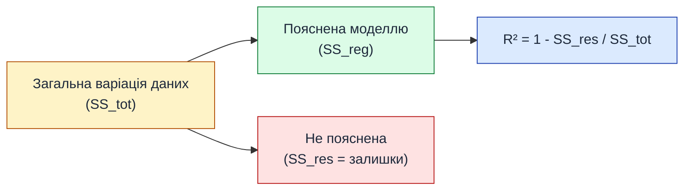

# Метрики якості регресії — як оцінити модель

::card-group

::card{title="🎯 Мета підрозділу" icon="i-lucide-target"}

- Зрозуміти, чому потрібні метрики якості
- Опанувати чотири ключові метрики: MAE, MSE, RMSE, R²
- Навчитися обирати метрику залежно від задачі
- Реалізувати обчислення метрик на Python

::

::card{title="🔑 Ключові терміни" icon="i-lucide-key"}

- **MAE** (Mean Absolute Error) — середня абсолютна помилка
- **MSE** (Mean Squared Error) — середня квадратична помилка
- **RMSE** (Root Mean Squared Error) — корінь з MSE
- **R²** (коефіцієнт детермінації) — частка поясненої варіації
- **Residual** (залишок) — різниця між реальним та передбаченим значенням

::

::

---

## Проблема: яка модель краща?

У попередньому підрозділі ми побачили три варіанти моделі з різними параметрами w та b. Візуально зрозуміло, що помаранчева лінія (w=500, b=0) найкраща — вона проходить посередині точок.

Але що робити, якщо:
- У нас 1000 варіантів моделі?
- Різниця між ними мізерна і візуально непомітна?
- Дані багатовимірні (3+ ознак) і графік побудувати неможливо?

Потрібен **об'єктивний математичний критерій** — число, яке скаже: «Модель A краща за модель B на 15%».

::note
**Аналогія:** уявіть, що ви оцінюєте учнів на іспиті. Не можна сказати «Іван написав краще за Марію», потрібна шкала — оцінки 0–100. Метрики якості — це і є «оцінки» для моделей.
::

---

## Поняття залишку (Residual)

Перед тим як говорити про метрики, введемо базове поняття.

**Залишок (residual)** — це різниця між **реальним значенням** y та **передбаченням моделі** ŷ:

::math-formula
e_i = y_i - \hat{y}_i
::

де:
- **yᵢ** — реальна ціна i-ї квартири з нашої бази даних
- **ŷᵢ** — ціна, яку передбачає модель для цієї квартири
- **eᵢ** — помилка (residual, error)

### Приклад обчислення залишків

::jupyter-notebook{title="residuals.ipynb" kernel="Python 3.11 (ipykernel)"}

::jupyter-cell{executionCount="1" executionTime="0.12s"}

```python
import numpy as np

# Реальні дані (3 квартири)
area = np.array([50, 80, 120])
price_real = np.array([24500, 39800, 59200])  # реальні ціни

# Модель: ŷ = 500 * x + 0
w, b = 500, 0
price_pred = w * area + b  # передбачення моделі

# Обчислюємо залишки
residuals = price_real - price_pred

# Виводимо таблицю
print("Площа | Реальна ціна | Передбачення | Залишок (помилка)")
print("------|--------------|--------------|------------------")
for i in range(len(area)):
    print(f"{area[i]:5} | ${price_real[i]:11} | ${price_pred[i]:11.0f} | ${residuals[i]:+7.0f}")
```

#output
Площа | Реальна ціна | Передбачення | Залишок (помилка)
------|--------------|--------------|------------------
   50 | $      24500 | $      25000 |    -500
   80 | $      39800 | $      40000 |    -200
  120 | $      59200 | $      60000 |    -800
::

::jupyter-cell{type="markdown"}
**Інтерпретація:**
- Для квартири 50 м²: модель **переоцінила** на 500$ (залишок негативний)
- Для квартири 80 м²: модель **переоцінила** на 200$ (майже влучила!)
- Для квартири 120 м²: модель **переоцінила** на 800$

Ідеальна модель матиме **всі залишки = 0**. Але в реальності це неможливо через шум у даних.
::

::

::tip
**Знак залишку:**
- **e > 0** (позитивний): модель **недооцінила** (передбачила менше, ніж насправді)
- **e < 0** (негативний): модель **переоцінила** (передбачила більше, ніж насправді)
- **e = 0**: ідеальне передбачення
::

---

## Метрика 1: MAE (Mean Absolute Error)

**MAE** — це середнє **абсолютних** значень усіх залишків. Ігноруємо знак (беремо модуль), підсумовуємо та ділимо на кількість спостережень.

### Формула

::math-formula
\text{MAE} = \frac{1}{n} \sum_{i=1}^{n} |y_i - \hat{y}_i|
::

де **n** — кількість спостережень у датасеті.

### Інтуїція

MAE відповідає на питання: **«На скільки в середньому ми помиляємося?»**

- Якщо MAE = 2000$, це означає: «В середньому наші передбачення відрізняються від реальності на 2000 доларів»
- MAE завжди **≥ 0**. Чим менше — тим краще.
- **Одиниці виміру:** такі ж, як у цільової змінної (долари, метри, кілограми тощо)

### Приклад обчислення

::jupyter-notebook{title="mae_calculation.ipynb" kernel="Python 3.11 (ipykernel)"}

::jupyter-cell{executionCount="1"}

```python
import numpy as np

# Дані з попереднього прикладу
price_real = np.array([24500, 39800, 59200])
price_pred = np.array([25000, 40000, 60000])

# Обчислюємо залишки
residuals = price_real - price_pred

# MAE: середнє абсолютних значень
mae = np.mean(np.abs(residuals))

print(f"Залишки: {residuals}")
print(f"Абсолютні залишки: {np.abs(residuals)}")
print(f"\nMAE = {mae:.2f}$")
print(f"\nІнтерпретація: модель в середньому помиляється на {mae:.0f} доларів")
```

#output
Залишки: [-500 -200 -800]
Абсолютні залишки: [500 200 800]

MAE = 500.00$

Інтерпретація: модель в середньому помиляється на 500 доларів
::

::

::tip
**Переваги MAE:**
- Легко інтерпретується (в тих же одиницях, що й дані)
- Стійка до викидів (outliers) — одна велика помилка не «вибухне» результат
- Інтуїтивно зрозуміла для бізнесу

**Недоліки MAE:**
- Не штрафує великі помилки сильніше за маленькі (усі помилки рівноцінні)
::

---

## Метрика 2: MSE (Mean Squared Error)

**MSE** — це середнє **квадратів** залишків. На відміну від MAE, тут ми **піднесемо помилку до квадрату** перед усередненням.

### Формула

::math-formula
\text{MSE} = \frac{1}{n} \sum_{i=1}^{n} (y_i - \hat{y}_i)^2
::

### Інтуїція

MSE відповідає на питання: **«Наскільки сильно розкидані наші помилки?»**

Ключова відмінність від MAE: **квадрат помилки**.

::accordion

::accordion-item{label="🔍 Чому квадрат? Що це дає?" icon="i-lucide-help-circle"}

Розглянемо два сценарії:

**Сценарій A:** три помилки = [100, 100, 100]
- MAE = (100 + 100 + 100) / 3 = **100**
- MSE = (100² + 100² + 100²) / 3 = (10000 + 10000 + 10000) / 3 = **10 000**

**Сценарій B:** три помилки = [10, 10, 280]
- MAE = (10 + 10 + 280) / 3 = **100** (так само!)
- MSE = (10² + 10² + 280²) / 3 = (100 + 100 + 78400) / 3 = **26 200** (набагато більше!)

**Висновок:** MSE **сильно штрафує великі помилки**. У сценарії B одна велика помилка (280) «вибухнула» через квадрат. Це корисно, коли великі помилки критичні для бізнесу.

::

::

### Приклад обчислення

::jupyter-notebook{title="mse_calculation.ipynb" kernel="Python 3.11 (ipykernel)"}

::jupyter-cell{executionCount="1"}

```python
import numpy as np

price_real = np.array([24500, 39800, 59200])
price_pred = np.array([25000, 40000, 60000])

residuals = price_real - price_pred

# MSE: середнє квадратів
mse = np.mean(residuals ** 2)

print(f"Залишки: {residuals}")
print(f"Квадрати залишків: {residuals ** 2}")
print(f"\nMSE = {mse:.2f}$²")
print(f"\nУвага: одиниці виміру — долари У КВАДРАТІ (не інтуїтивно)")
```

#output
Залишки: [-500 -200 -800]
Квадрати залишків: [250000  40000 640000]

MSE = 310000.00$²

Увага: одиниці виміру — долари У КВАДРАТІ (не інтуїтивно)
::

::

::warning
**Проблема MSE:** одиниці виміру — квадрати вихідних одиниць ($², м², кг²). Що таке «квадратний долар»? Незручно для інтерпретації. Рішення: **RMSE**.
::

---

## Метрика 3: RMSE (Root Mean Squared Error)

**RMSE** — це просто квадратний корінь з MSE. Це повертає нам зручні одиниці виміру.

### Формула

::math-formula
\text{RMSE} = \sqrt{\text{MSE}} = \sqrt{\frac{1}{n} \sum_{i=1}^{n} (y_i - \hat{y}_i)^2}
::

### Інтуїція

RMSE поєднує переваги обох попередніх метрик:
- Штрафує великі помилки сильніше (як MSE)
- Має зручні одиниці виміру (як MAE)

::jupyter-notebook{title="rmse_calculation.ipynb" kernel="Python 3.11 (ipykernel)"}

::jupyter-cell{executionCount="1"}

```python
import numpy as np

price_real = np.array([24500, 39800, 59200])
price_pred = np.array([25000, 40000, 60000])

residuals = price_real - price_pred

# MSE
mse = np.mean(residuals ** 2)

# RMSE: корінь з MSE
rmse = np.sqrt(mse)

print(f"MSE  = {mse:.2f}$²")
print(f"RMSE = {rmse:.2f}$ ← зручніше для інтерпретації!")
print(f"\nПорівняння:")
print(f"  MAE  = {np.mean(np.abs(residuals)):.2f}$ (не штрафує великі помилки)")
print(f"  RMSE = {rmse:.2f}$ (штрафує великі помилки)")
```

#output
MSE  = 310000.00$²
RMSE = 556.78$ ← зручніше для інтерпретації!

Порівняння:
  MAE  = 500.00$ (не штрафує великі помилки)
  RMSE = 556.78$ (штрафує великі помилки)
::

::

::tip
**Коли використовувати MAE, а коли RMSE?**

- **MAE:** коли всі помилки рівноцінні (наприклад, передбачення температури)
- **RMSE:** коли великі помилки критичні (наприклад, медична діагностика — краще 10 разів помилитися на 1%, ніж 1 раз на 50%)
::

---

## Метрика 4: R² (Coefficient of Determination)

Усі попередні метрики мали спільну проблему: **немає верхньої межі**. MAE може бути 100, 1000, 10 000 — що вважати «добре»?

**R²** (R-squared, коефіцієнт детермінації) вирішує цю проблему: він завжди **від 0 до 1** (технічно може бути й негативним, але це рідкість).

### Формула

::math-formula
R^2 = 1 - \frac{\text{SS}_{\text{res}}}{\text{SS}_{\text{tot}}} = 1 - \frac{\sum (y_i - \hat{y}_i)^2}{\sum (y_i - \bar{y})^2}
::

де:
- **SSᵣₑₛ** (Residual Sum of Squares) — сума квадратів залишків моделі
- **SSₜₒₜ** (Total Sum of Squares) — сума квадратів відхилень від середнього

### Інтуїція

R² відповідає на питання: **«Яку частку варіації даних пояснює модель?»**

::mermaid



::

**Інтерпретація значень R²:**

| R² | Інтерпретація | Якість моделі |
|----|---------------|---------------|
| **1.0** | Модель ідеально описує дані (усі точки на прямій) | Ідеальна (можливе перенавчання) |
| **0.9** | 90% варіації пояснено моделлю | Відмінна |
| **0.7** | 70% варіації пояснено | Хороша |
| **0.5** | 50% варіації пояснено | Посередня |
| **0.0** | Модель не краща за «середнє значення» | Погана |
| **< 0** | Модель гірша за просте середнє | Катастрофічна |

::note
**Базова модель для порівняння:** що означає R² = 0?  
Це означає, що наша модель **не краща** за тривіальну стратегію «завжди передбачай середнє значення y». Якщо R² < 0, модель навіть **гірша** за це просте середнє.
::

### Приклад обчислення

::jupyter-notebook{title="r2_calculation.ipynb" kernel="Python 3.11 (ipykernel)"}

::jupyter-cell{executionCount="1" executionTime="0.14s"}

```python
import numpy as np

price_real = np.array([24500, 39800, 59200])
price_pred = np.array([25000, 40000, 60000])

# Середнє значення реальних цін
y_mean = np.mean(price_real)

# SS_res: сума квадратів залишків (residuals)
ss_res = np.sum((price_real - price_pred) ** 2)

# SS_tot: сума квадратів відхилень від середнього
ss_tot = np.sum((price_real - y_mean) ** 2)

# R²
r2 = 1 - (ss_res / ss_tot)

print(f"Середнє значення y: {y_mean:.2f}$")
print(f"\nSS_res (помилки моделі): {ss_res:.2f}")
print(f"SS_tot (варіація даних): {ss_tot:.2f}")
print(f"\nR² = 1 - {ss_res:.0f} / {ss_tot:.0f} = {r2:.4f}")
print(f"\nІнтерпретація: модель пояснює {r2*100:.2f}% варіації даних")
```

#output
Середнє значення y: 41166.67$

SS_res (помилки моделі): 930000.00
SS_tot (варіація даних): 718433333.33

R² = 1 - 930000 / 718433333 = 0.9987

Інтерпретація: модель пояснює 99.87% варіації даних
::

::jupyter-cell{type="markdown"}
**Висновок:** R² = 0.9987 — це **відмінний результат**! Модель майже ідеально описує залежність між площею та ціною.

У реальних задачах R² > 0.8 вже вважається дуже добрим результатом.
::

::

---

## Порівняльна таблиця метрик

| Метрика | Формула | Одиниці | Діапазон | Переваги | Недоліки |
|---------|---------|---------|----------|----------|----------|
| **MAE** | :math-formula{tex="\frac{1}{n}\sum\|y_i - \hat{y}_i\|" inline} | Ті ж, що y | [0, +∞) | Проста інтерпретація, стійка до викидів | Не штрафує великі помилки |
| **MSE** | :math-formula{tex="\frac{1}{n}\sum(y_i - \hat{y}_i)^2" inline} | y² | [0, +∞) | Диференційована (для оптимізації) | Незручні одиниці (квадрати) |
| **RMSE** | :math-formula{tex="\sqrt{\text{MSE}}" inline} | Ті ж, що y | [0, +∞) | Штрафує великі помилки + зручні одиниці | Складніша для інтерпретації |
| **R²** | :math-formula{tex="1 - \frac{\text{SS}_{res}}{\text{SS}_{tot}}" inline} | — | (−∞, 1] | Нормалізована (0–1), порівнянна між задачами | Може бути оманливою при малих даних |

::tip
**Практична рекомендація:**  
Використовуйте **кілька метрик одночасно**. Наприклад:
- **R²** для загальної оцінки якості
- **RMSE** для розуміння масштабу помилок
- **MAE** для бізнес-комунікації (легше пояснити керівництву)
::

---

## Реалізація всіх метрик на Python

::jupyter-notebook{title="all_metrics.ipynb" kernel="Python 3.11 (ipykernel)"}

::jupyter-cell{executionCount="1"}

```python
import numpy as np

def calculate_metrics(y_true, y_pred):
    """
    Обчислює всі метрики якості регресії.
    
    Параметри:
        y_true: np.array — реальні значення
        y_pred: np.array — передбачення моделі
    
    Повертає:
        dict з метриками MAE, MSE, RMSE, R²
    """
    # Залишки
    residuals = y_true - y_pred
    
    # MAE
    mae = np.mean(np.abs(residuals))
    
    # MSE
    mse = np.mean(residuals ** 2)
    
    # RMSE
    rmse = np.sqrt(mse)
    
    # R²
    ss_res = np.sum(residuals ** 2)
    ss_tot = np.sum((y_true - np.mean(y_true)) ** 2)
    r2 = 1 - (ss_res / ss_tot)
    
    return {
        'MAE': mae,
        'MSE': mse,
        'RMSE': rmse,
        'R²': r2
    }

# Тест на наших даних
y_true = np.array([24500, 39800, 59200, 42000, 51500])
y_pred = np.array([25000, 40000, 60000, 41500, 52000])

metrics = calculate_metrics(y_true, y_pred)

print("Метрики якості моделі:")
print("=" * 40)
for name, value in metrics.items():
    if name == 'R²':
        print(f"{name:6} = {value:.4f} ({value*100:.2f}%)")
    else:
        print(f"{name:6} = ${value:,.2f}")
```

#output
Метрики якості моделі:
========================================
MAE    = $420.00
MSE    = $250,000.00
RMSE   = $500.00
R²     = 0.9996 (99.96%)
::

::

---

## Використання scikit-learn

У реальних проєктах не треба писати функції вручну — є готові реалізації в scikit-learn:

::jupyter-notebook{title="sklearn_metrics.ipynb" kernel="Python 3.11 (ipykernel)"}

::jupyter-cell{executionCount="1" executionTime="0.08s"}

```python
from sklearn.metrics import mean_absolute_error, mean_squared_error, r2_score
import numpy as np

y_true = np.array([24500, 39800, 59200, 42000, 51500])
y_pred = np.array([25000, 40000, 60000, 41500, 52000])

mae = mean_absolute_error(y_true, y_pred)
mse = mean_squared_error(y_true, y_pred)
rmse = np.sqrt(mse)  # або mean_squared_error(y_true, y_pred, squared=False)
r2 = r2_score(y_true, y_pred)

print(f"MAE  = ${mae:,.2f}")
print(f"MSE  = ${mse:,.2f}")
print(f"RMSE = ${rmse:,.2f}")
print(f"R²   = {r2:.4f}")
```

#output
MAE  = $420.00
MSE  = $250,000.00
RMSE = $500.00
R²   = 0.9996
::

::

---

## Резюме підрозділу

::card-group

::card{title="✅ Ключові висновки" icon="i-lucide-check-circle"}

- **MAE** — середня абсолютна помилка, проста інтерпретація
- **MSE** — середня квадратична помилка, штрафує великі помилки
- **RMSE** — корінь з MSE, зручні одиниці виміру
- **R²** — частка поясненої варіації, нормалізована метрика (0–1)
- Завжди використовуйте **кілька метрик** для повної картини

::

::card{title="🔜 Наступний крок" icon="i-lucide-arrow-right"}

Тепер ми знаємо, як **оцінити** якість моделі. Але головне питання залишається: як **знайти** оптимальні параметри w та b?

**Наступний підрозділ:** Градієнтний спуск — алгоритм навчання моделі

::

::
