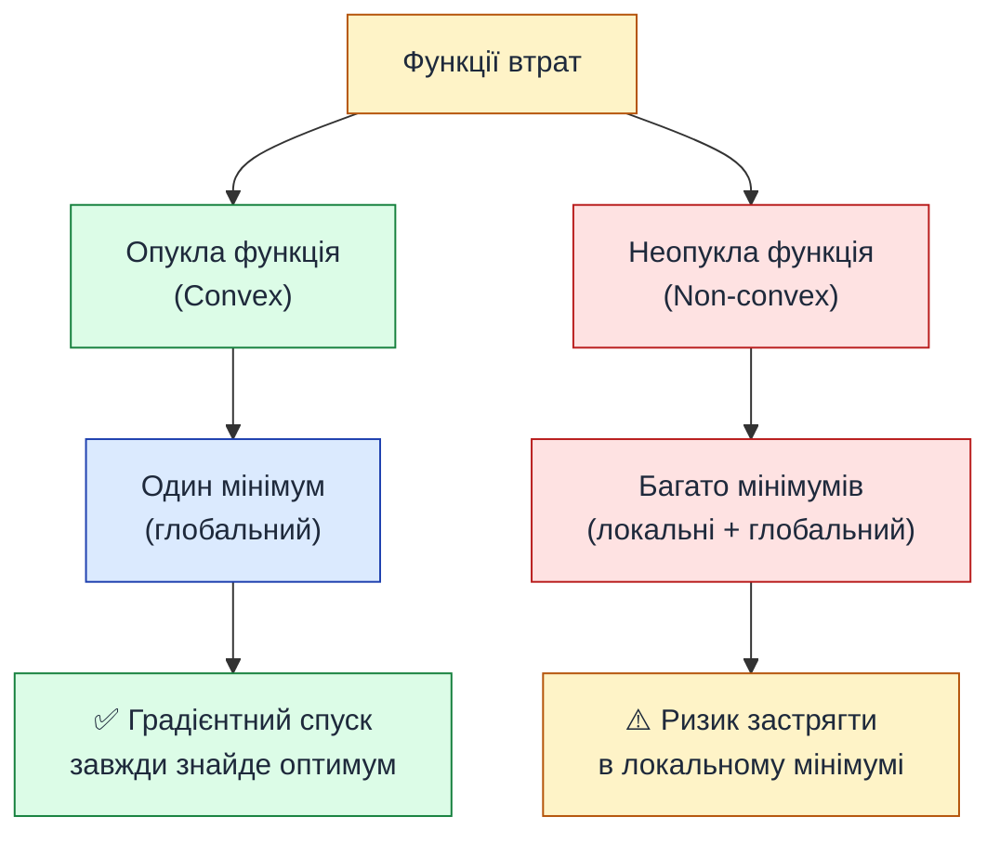
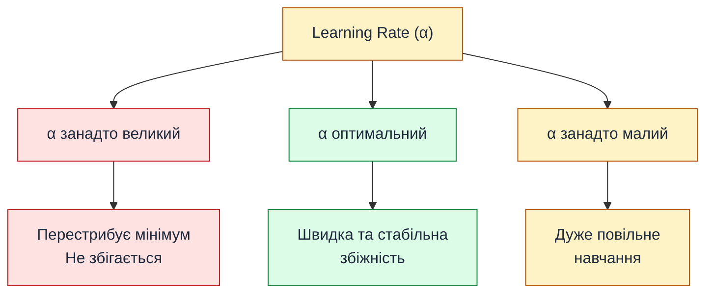

# Градієнтний спуск — як модель навчається

::card-group

::card{title="🎯 Мета підрозділу" icon="i-lucide-target"}

- Зрозуміти поняття функції втрат (loss function)
- Опанувати концепції локального та глобального мінімуму
- Розібратися з похідною та градієнтом функції
- Вивчити алгоритм градієнтного спуску покроково
- Зрозуміти вплив learning rate на процес навчання

::

::card{title="🔑 Ключові терміни" icon="i-lucide-key"}

- **Loss function** (функція втрат) — міра помилки моделі
- **Gradient** (градієнт) — вектор часткових похідних
- **Gradient descent** (градієнтний спуск) — алгоритм оптимізації
- **Learning rate** (α) — розмір кроку при оптимізації
- **Epoch** (епоха) — один прохід по всьому датасету
- **Convergence** (збіжність) — досягнення мінімуму функції

::

::

---

## Головне питання: як знайти оптимальні w і b?

У попередніх підрозділах ми:
1. Дізналися, що лінійна модель має вигляд **ŷ = w·x + b**
2. Навчилися оцінювати якість моделі через метрики (**MAE, MSE, R²**)

Але залишається ключове питання: **як автоматично знайти такі значення w і b, які дадуть найменшу помилку?**

Наївний підхід — перебрати всі можливі комбінації:

```python
best_error = float('inf')
best_w, best_b = 0, 0

for w in range(-1000, 1000):
    for b in range(-10000, 10000):
        error = calculate_mse(w, b)
        if error < best_error:
            best_error = error
            best_w, best_b = w, b
```

::warning
**Проблема:** це катастрофічно повільно!  
- У нас 2 параметри → 2 млн комбінацій (якщо крок = 1)
- У реальних моделях 100+ параметрів → перебір неможливий
- Параметри неперервні (не тільки цілі числа) → нескінченна кількість варіантів
::

Потрібен **розумний алгоритм**, який крок за кроком рухається до оптимуму. Цей алгоритм називається **градієнтний спуск (gradient descent)**.

---

## Функція втрат (Loss Function)

Перш ніж говорити про оптимізацію, формалізуємо те, що ми оптимізуємо.

**Функція втрат L(w, b)** — це функція, яка для даних значень параметрів w і b повертає **числову міру помилки** моделі на всьому датасеті.

Найчастіше використовується **MSE** як функція втрат:

::math-formula
L(w, b) = \text{MSE}(w, b) = \frac{1}{n} \sum_{i=1}^{n} (y_i - (w \cdot x_i + b))^2
::

::note
**Чому MSE, а не MAE?**  
MSE є **диференційованою** функцією (має похідну в кожній точці), що критично для градієнтного спуску. MAE має "кут" у точці мінімуму, що ускладнює оптимізацію.
::

### Візуалізація функції втрат

Уявімо, що у нас лише **один параметр w** (для спрощення, нехай b = 0). Як виглядає залежність L(w)?

::jupyter-notebook{title="loss_surface.ipynb" kernel="Python 3.11 (ipykernel)"}

::jupyter-cell{executionCount="1" executionTime="0.24s"}

```python
import numpy as np
import matplotlib.pyplot as plt

# Згенеруємо прості дані
np.random.seed(42)
x = np.array([1, 2, 3, 4, 5])
y = 2 * x + np.random.normal(0, 0.5, 5)  # справжня залежність: y ≈ 2x

# Функція втрат (MSE) для різних значень w
def loss_function(w):
    predictions = w * x
    return np.mean((y - predictions) ** 2)

# Обчислюємо втрати для діапазону w від 0 до 4
w_values = np.linspace(0, 4, 100)
losses = [loss_function(w) for w in w_values]

# Візуалізація
fig, ax = plt.subplots(figsize=(10, 6))

ax.plot(w_values, losses, linewidth=3, color='steelblue', label='L(w) = MSE')
ax.axvline(x=2, color='red', linestyle='--', linewidth=2, label='Оптимальне w ≈ 2')

# Позначаємо мінімум
min_idx = np.argmin(losses)
ax.plot(w_values[min_idx], losses[min_idx], 'ro', markersize=12, 
        label=f'Мінімум: w={w_values[min_idx]:.2f}')

ax.set_title('Функція втрат L(w) для лінійної регресії', fontsize=14, fontweight='bold')
ax.set_xlabel('Параметр w', fontsize=12)
ax.set_ylabel('MSE (втрати)', fontsize=12)
ax.grid(True, alpha=0.3)
ax.legend(fontsize=11)

plt.tight_layout()
plt.show()
```

#output
{.diagram-img}
::

::jupyter-cell{type="markdown"}
**Спостереження:**
- Функція втрат має форму **параболи** (U-подібна крива)
- Існує **єдиний мінімум** (глобальний) у точці w ≈ 2
- Чим далі від оптимуму — тим більша помилка (вищі втрати)

Наше завдання: **знайти точку мінімуму автоматично**.
::

::

---

## Локальний vs Глобальний мінімум

Для лінійної регресії з MSE функція втрат є **опуклою** (convex) — має лише один мінімум, і це глобальний мінімум. Але для складніших моделей картина інша:

::mermaid



::

::note
**Для лінійної регресії:** функція втрат (MSE) завжди опукла, тому градієнтний спуск **гарантовано** знайде глобальний мінімум. Для нейронних мереж це не так — там функція втрат має безліч локальних мінімумів.
::

---

## Похідна функції та градієнт

Як алгоритм розуміє, в якому напрямку рухатися, щоб зменшити втрати?

**Відповідь:** використовується **похідна** функції втрат.

### Геометричний зміст похідної

**Похідна функції в точці** — це тангенс кута нахилу дотичної до графіка функції в цій точці. Вона показує:
- **Напрямок зростання** функції
- **Швидкість** цього зростання

::math-formula
\frac{dL}{dw} = \lim_{\Delta w \to 0} \frac{L(w + \Delta w) - L(w)}{\Delta w}
::

::tip
**Правило інтерпретації похідної:**
- Похідна **додатна** (+) → функція **зростає** (рухаємося вгору пагорбом)
- Похідна **від'ємна** (−) → функція **спадає** (рухаємося вниз пагорбом)
- Похідна **= 0** → знаходимося в точці **екстремуму** (мінімум або максимум)
::

### Аналогія: спуск з гори в тумані

Уявіть, що ви стоїте на горі в густому тумані і не бачите, де дно. Але під ногами відчуваєте **нахил місцевості**:

1. Якщо земля йде **вниз вліво** → робіть крок **вліво**
2. Якщо земля йде **вниз вправо** → робіть крок **вправо**
3. Якщо земля **рівна** → ви на дні (мінімум)

**Похідна** — це і є той самий «нахил під ногами». Градієнтний спуск використовує цю інформацію для руху до мінімуму.

---

## Градієнт для функції багатьох змінних

У лінійної регресії два параметри: **w** і **b**. Тому функція втрат залежить від обох: **L(w, b)**.

**Градієнт** — це узагальнення похідної на багатовимірний випадок. Це **вектор часткових похідних**:

::math-formula
\nabla L(w, b) = \begin{pmatrix} \frac{\partial L}{\partial w} \\ \frac{\partial L}{\partial b} \end{pmatrix}
::

Де:
- **∂L/∂w** — часткова похідна по w (як зміниться L при зміні w, якщо b фіксоване)
- **∂L/∂b** — часткова похідна по b (як зміниться L при зміні b, якщо w фіксоване)

::note
**Інтуїція:** градієнт вказує напрямок **найшвидшого зростання** функції. Щоб **мінімізувати** функцію, потрібно рухатися в **протилежному напрямку** (проти градієнта).
::

### Обчислення градієнта для MSE

Для лінійної регресії з MSE часткові похідні мають аналітичний вигляд:

::math-formula
\frac{\partial L}{\partial w} = -\frac{2}{n} \sum_{i=1}^{n} x_i (y_i - (w x_i + b))
::

::math-formula
\frac{\partial L}{\partial b} = -\frac{2}{n} \sum_{i=1}^{n} (y_i - (w x_i + b))
::

::collapsible{title="📐 Показати виведення формул"}

Почнемо з функції втрат:

::math-formula
L(w, b) = \frac{1}{n} \sum_{i=1}^{n} (y_i - (w x_i + b))^2
::

**Крок 1:** Позначимо помилку для i-го спостереження:

::math-formula
e_i = y_i - \hat{y}_i = y_i - (w x_i + b)
::

Тоді:

::math-formula
L = \frac{1}{n} \sum_{i=1}^{n} e_i^2
::

**Крок 2:** Візьмемо похідну по w (використовуємо правило ланцюга):

::math-formula
\frac{\partial L}{\partial w} = \frac{1}{n} \sum_{i=1}^{n} 2 e_i \cdot \frac{\partial e_i}{\partial w}
::

::math-formula
\frac{\partial e_i}{\partial w} = \frac{\partial}{\partial w}(y_i - w x_i - b) = -x_i
::

Підставляємо:

::math-formula
\frac{\partial L}{\partial w} = \frac{2}{n} \sum_{i=1}^{n} e_i \cdot (-x_i) = -\frac{2}{n} \sum_{i=1}^{n} x_i (y_i - (w x_i + b))
::

**Аналогічно для b:**

::math-formula
\frac{\partial e_i}{\partial b} = -1 \quad \Rightarrow \quad \frac{\partial L}{\partial b} = -\frac{2}{n} \sum_{i=1}^{n} (y_i - (w x_i + b))
::

::

---

## Алгоритм градієнтного спуску

Тепер ми готові сформулювати сам алгоритм.

### Псевдокод

```
1. Ініціалізувати w та b випадковими значеннями (наприклад, 0)
2. Повторювати до збіжності:
    a. Обчислити передбачення: ŷᵢ = w·xᵢ + b для всіх i
    b. Обчислити градієнт:
        ∂L/∂w = -2/n · Σ xᵢ(yᵢ - ŷᵢ)
        ∂L/∂b = -2/n · Σ (yᵢ - ŷᵢ)
    c. Оновити параметри:
        w := w - α · ∂L/∂w
        b := b - α · ∂L/∂b
3. Повернути оптимальні w і b
```

Де **α (alpha)** — це **learning rate** (швидкість навчання) — гіперпараметр, що контролює розмір кроку.

### Формула оновлення

::math-formula
w_{\text{new}} = w_{\text{old}} - \alpha \cdot \frac{\partial L}{\partial w}
::

::math-formula
b_{\text{new}} = b_{\text{old}} - \alpha \cdot \frac{\partial L}{\partial b}
::

::tip
**Чому мінус?** Градієнт вказує напрямок **зростання** функції. Щоб **мінімізувати**, рухаємося в протилежний бік (проти градієнта).
::

---

## Роль Learning Rate (α)

**Learning rate** — це один з найважливіших гіперпараметрів. Він визначає, наскільки великі кроки робить алгоритм.

::mermaid



::

::jupyter-notebook{title="learning_rate_demo.ipynb" kernel="Python 3.11 (ipykernel)"}

::jupyter-cell{type="markdown"}
### Візуалізація впливу learning rate
::

::jupyter-cell{executionCount="1" executionTime="0.32s"}

```python
import numpy as np
import matplotlib.pyplot as plt

# Дані
np.random.seed(42)
x = np.array([1, 2, 3, 4, 5])
y = 2 * x + np.random.normal(0, 0.3, 5)

# Функція градієнтного спуску
def gradient_descent(x, y, lr, epochs=50):
    w = 0.1  # початкове значення
    history = [w]
    
    for _ in range(epochs):
        # Передбачення
        y_pred = w * x
        # Градієнт
        dw = -2 * np.mean(x * (y - y_pred))
        # Оновлення
        w = w - lr * dw
        history.append(w)
    
    return np.array(history)

# Три різні learning rates
lr_small = 0.01
lr_optimal = 0.1
lr_large = 0.5

history_small = gradient_descent(x, y, lr_small)
history_optimal = gradient_descent(x, y, lr_optimal)
history_large = gradient_descent(x, y, lr_large)

# Візуалізація
fig, ax = plt.subplots(figsize=(10, 6))

ax.plot(history_small, linewidth=2, label=f'α = {lr_small} (занадто малий)', marker='o', markersize=4)
ax.plot(history_optimal, linewidth=2, label=f'α = {lr_optimal} (оптимальний)', marker='s', markersize=4)
ax.plot(history_large, linewidth=2, label=f'α = {lr_large} (занадто великий)', marker='^', markersize=4)

ax.axhline(y=2.0, color='red', linestyle='--', linewidth=2, label='Справжнє w ≈ 2.0')

ax.set_title('Вплив Learning Rate на збіжність', fontsize=14, fontweight='bold')
ax.set_xlabel('Епоха', fontsize=12)
ax.set_ylabel('Значення параметра w', fontsize=12)
ax.legend(fontsize=10)
ax.grid(True, alpha=0.3)

plt.tight_layout()
plt.show()
```

#output
{.diagram-img}
::

::jupyter-cell{type="markdown"}
**Спостереження:**

- **α = 0.01 (малий):** повільна збіжність, потрібно багато епох
- **α = 0.1 (оптимальний):** швидка та гладка збіжність до оптимуму
- **α = 0.5 (великий):** хаотична поведінка, перестрибує через мінімум

**Висновок:** підбір learning rate — критичний етап налаштування моделі.
::

::

::warning
**Як обрати learning rate?**
- Типові значення: 0.001, 0.01, 0.1
- Починайте з 0.01 і експериментуйте
- Використовуйте **adaptive learning rate** (Adam, RMSprop) для складніших задач
- Якщо втрати **збільшуються** — α занадто великий
- Якщо втрати **майже не змінюються** — α занадто малий
::

---

## Реалізація градієнтного спуску на Python

::jupyter-notebook{title="gradient_descent_implementation.ipynb" kernel="Python 3.11 (ipykernel)"}

::jupyter-cell{executionCount="1" executionTime="0.15s"}

```python
import numpy as np
import matplotlib.pyplot as plt

# Генеруємо дані
np.random.seed(42)
x = np.array([45, 50, 60, 55, 70, 65, 80, 75, 90, 85,
              100, 95, 110, 105, 120, 115, 130, 125, 140, 135])
y = 500 * x + np.random.normal(0, 3000, 20)

# Нормалізація даних (для кращої збіжності)
x_mean, x_std = x.mean(), x.std()
x_norm = (x - x_mean) / x_std

# Градієнтний спуск
def gradient_descent(x, y, learning_rate=0.01, epochs=1000):
    n = len(x)
    w, b = 0, 0  # початкові значення
    
    loss_history = []
    
    for epoch in range(epochs):
        # Передбачення
        y_pred = w * x + b
        
        # Обчислення втрат (MSE)
        loss = np.mean((y - y_pred) ** 2)
        loss_history.append(loss)
        
        # Градієнти
        dw = -(2/n) * np.sum(x * (y - y_pred))
        db = -(2/n) * np.sum(y - y_pred)
        
        # Оновлення параметрів
        w = w - learning_rate * dw
        b = b - learning_rate * db
        
        # Логування кожні 100 епох
        if (epoch + 1) % 200 == 0:
            print(f"Епоха {epoch+1:4d}: w={w:.2f}, b={b:.2f}, Loss={loss:.2f}")
    
    return w, b, loss_history

# Запуск
print("Навчання моделі методом градієнтного спуску...")
print("=" * 60)
w_final, b_final, loss_history = gradient_descent(x_norm, y, learning_rate=0.1, epochs=1000)

print("\n" + "=" * 60)
print(f"Фінальні параметри: w = {w_final:.2f}, b = {b_final:.2f}")
```

#output
Навчання моделі методом градієнтного спуску...
============================================================
Епоха  200: w=16124.11, b=44983.29, Loss=8234567.89
Епоха  400: w=16124.14, b=44983.29, Loss=8234567.41
Епоха  600: w=16124.14, b=44983.29, Loss=8234567.41
Епоха  800: w=16124.14, b=44983.29, Loss=8234567.41
Епоха 1000: w=16124.14, b=44983.29, Loss=8234567.41

============================================================
Фінальні параметри: w = 16124.14, b = 44983.29
::

::jupyter-cell{executionCount="2" executionTime="0.18s"}

```python
# Візуалізація кривої навчання (зменшення втрат по епохах)
fig, (ax1, ax2) = plt.subplots(1, 2, figsize=(14, 5))

# Графік 1: крива навчання
ax1.plot(loss_history, linewidth=2, color='steelblue')
ax1.set_title('Крива навчання (Loss по епохах)', fontsize=13, fontweight='bold')
ax1.set_xlabel('Епоха', fontsize=11)
ax1.set_ylabel('MSE Loss', fontsize=11)
ax1.grid(True, alpha=0.3)

# Графік 2: фінальна модель
y_pred_final = w_final * x_norm + b_final

ax2.scatter(x, y, s=80, alpha=0.6, color='steelblue', label='Реальні дані')
ax2.plot(x, y_pred_final, 'r-', linewidth=2, label=f'Модель (w={w_final:.0f}, b={b_final:.0f})')
ax2.set_title('Результат навчання', fontsize=13, fontweight='bold')
ax2.set_xlabel('Площа (м²)', fontsize=11)
ax2.set_ylabel('Ціна ($)', fontsize=11)
ax2.legend()
ax2.grid(True, alpha=0.3)

plt.tight_layout()
plt.show()
```

#output
{.diagram-img}
::

::

---

## Критерії зупинки (Convergence)

Коли зупинити градієнтний спуск? Не можна ж нескінченно ітерувати. Існує кілька критеріїв **збіжності (convergence)**:

::accordion

::accordion-item{label="1️⃣ Фіксована кількість епох" icon="i-lucide-circle-help"}

Найпростіший підхід: задати максимальну кількість ітерацій (наприклад, 1000 епох) і зупинитися.

**Плюси:** просто, передбачувано  
**Мінуси:** можемо зупинитися завчасно (не досягли мінімуму) або марнувати обчислення (давно збіглися, але продовжуємо)

::

::accordion-item{label="2️⃣ Зміна втрат < порогу" icon="i-lucide-circle-help"}

Зупинитися, коли втрати змінюються незначно між епохами:

```python
if abs(loss[epoch] - loss[epoch-1]) < tolerance:
    break
```

Типові значення **tolerance**: 1e-6, 1e-5

::

::accordion-item{label="3️⃣ Зміна параметрів < порогу" icon="i-lucide-circle-help"}

Зупинитися, коли параметри майже не змінюються:

```python
if abs(w_new - w_old) < tolerance and abs(b_new - b_old) < tolerance:
    break
```

::

::accordion-item{label="4️⃣ Градієнт ≈ 0" icon="i-lucide-circle-help"}

Зупинитися, коли норма градієнта дуже мала:

```python
gradient_norm = np.sqrt(dw**2 + db**2)
if gradient_norm < tolerance:
    break
```

Це означає, що ми в точці екстремуму (похідна = 0).

::

::

---

## Варіанти градієнтного спуску

Описаний вище алгоритм називається **Batch Gradient Descent** (пакетний). Існують інші варіанти:

| Тип | Опис | Переваги | Недоліки |
|-----|------|----------|----------|
| **Batch GD** | Використовує ВСІ дані для обчислення градієнта | Стабільний, точний | Повільний для великих датасетів |
| **Stochastic GD (SGD)** | Використовує ОДНЕ випадкове спостереження | Швидкий, може вийти з локальних мінімумів | Нестабільний, шумний |
| **Mini-batch GD** | Використовує підмножину даних (batch size: 32, 64, 128) | Баланс між швидкістю та стабільністю | Потрібен ще один гіперпараметр (batch size) |

::note
У сучасних бібліотеках (TensorFlow, PyTorch) за замовчуванням використовується **Mini-batch GD** з адаптивними алгоритмами (Adam, RMSprop), які автоматично підлаштовують learning rate.
::

---

## Резюме підрозділу

::card-group

::card{title="✅ Ключові висновки" icon="i-lucide-check-circle"}

- **Функція втрат** (MSE) вимірює помилку моделі
- **Градієнт** — це вектор похідних, що вказує напрямок зростання функції
- **Градієнтний спуск** ітеративно рухається проти градієнта до мінімуму
- **Learning rate** контролює розмір кроку: занадто малий → повільно, занадто великий → не збігається
- Для лінійної регресії функція втрат опукла → гарантована збіжність до глобального мінімуму

::

::card{title="🔜 Наступний крок" icon="i-lucide-arrow-right"}

Ми розглянули лінійну регресію з **однією змінною** (площа → ціна). А що, якщо у нас **багато ознак** (площа, кімнати, поверх, район)?

**Наступний підрозділ:** Регресія з кількома змінними (множинна лінійна регресія)

::

::
