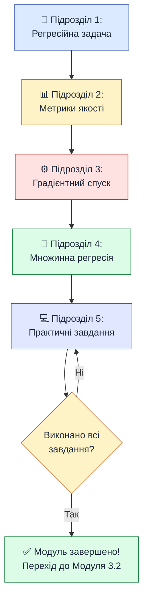

# Лінійна регресія — теорія та практика

::card-group

::card{title="🎯 Мета модуля" icon="i-lucide-target"}

У цьому модулі ви опануєте **лінійну регресію** — перший і найважливіший алгоритм машинного навчання. Ви навчитеся передбачувати числові значення, оцінювати якість моделей та реалізовувати градієнтний спуск з нуля.

::

::card{title="⏱️ Тривалість" icon="i-lucide-clock"}

**4–6 годин** залежно від рівня підготовки  
Включає теорію, приклади коду та практичні завдання

::

::card{title="📚 Передумови" icon="i-lucide-book-open"}

- Модуль 2.1: NumPy та pandas
- Модуль 2.2: Основи статистики
- Модуль 2.3: Візуалізація (matplotlib)
- Базове розуміння похідних (шкільний курс математики)

::

::

---

## Структура модуля

Модуль складається з **п'яти підрозділів**, які послідовно будують розуміння від простих концепцій до складних реалізацій:

::steps

### Підрозділ 1: Регресійна задача та лінійна регресія з однією змінною

**Тривалість:** ~1 година

Розберетеся з:
- Що таке регресія і чим вона відрізняється від класифікації
- Рівняння прямої ŷ = w·x + b
- Інтерпретація параметрів w (нахил) і b (зсув)
- Візуалізація залежності між ознаками

**Ключові концепції:** regression, feature, target, linear model

[Перейти до підрозділу →](/16.ai-python/07.linear-regression-theory/01.regression-task)

---

### Підрозділ 2: Метрики якості регресії

**Тривалість:** ~1 година

Навчитеся оцінювати якість моделей через:
- MAE (Mean Absolute Error) — середня абсолютна помилка
- MSE (Mean Squared Error) — середня квадратична помилка
- RMSE (Root MSE) — корінь з MSE
- R² (коефіцієнт детермінації) — частка поясненої варіації

**Ключові концепції:** residual, loss function, evaluation metrics

[Перейти до підрозділу →](/16.ai-python/07.linear-regression-theory/02.quality-metrics)

---

### Підрозділ 3: Градієнтний спуск — як модель навчається

**Тривалість:** ~1.5 години

Опануєте ключовий алгоритм оптимізації:
- Функція втрат та її мінімізація
- Похідна та градієнт функції
- Алгоритм градієнтного спуску покроково
- Роль learning rate (швидкість навчання)
- Локальний vs глобальний мінімум

**Ключові концепції:** gradient, derivative, optimization, learning rate, convergence

[Перейти до підрозділу →](/16.ai-python/07.linear-regression-theory/03.gradient-descent)

---

### Підрозділ 4: Множинна лінійна регресія

**Тривалість:** ~1 година

Узагальните модель на випадок багатьох ознак:
- Формула для n ознак: ŷ = w₁x₁ + w₂x₂ + ... + wₙxₙ + b
- Векторна та матрична форма запису
- Геометрична інтерпретація (гіперплощина)
- Практична реалізація з 4 ознаками

**Ключові концепції:** multiple regression, feature vector, weight vector, hyperplane

[Перейти до підрозділу →](/16.ai-python/07.linear-regression-theory/04.multiple-regression)

---

### Підрозділ 5: Практичні завдання та резюме

**Тривалість:** ~1.5 години

Закріпите знання через практику:
- **Рівень 1 (базовий):** обчислення метрик, прості функції
- **Рівень 2 (середній):** реалізація градієнтного спуску, аналіз датасетів
- **Рівень 3 (просунутий):** комплексні проєкти, mini-batch GD, поліноміальна регресія

**Бонус:** підсумкові картки всіх ключових концепцій

[Перейти до підрозділу →](/16.ai-python/07.linear-regression-theory/05.practice)

::

---

## Швидкий огляд ключових формул

::card-group

::card{title="Лінійна модель" icon="i-lucide-function-square"}

::math-formula
\hat{y} = w \cdot x + b
::

- **w** — коефіцієнт нахилу
- **b** — вільний член (bias)
- **ŷ** — передбачення моделі

::

::card{title="MSE (функція втрат)" icon="i-lucide-activity"}

::math-formula
\text{MSE} = \frac{1}{n} \sum_{i=1}^{n} (y_i - \hat{y}_i)^2
::

Міра помилки моделі, яку мінімізуємо

::

::card{title="Градієнтний спуск" icon="i-lucide-arrow-down"}

::math-formula
w := w - \alpha \frac{\partial L}{\partial w}
::

- **α** — learning rate
- **∂L/∂w** — градієнт (похідна втрат)

::

::card{title="R² (якість моделі)" icon="i-lucide-percent"}

::math-formula
R^2 = 1 - \frac{\sum(y_i - \hat{y}_i)^2}{\sum(y_i - \bar{y})^2}
::

Частка поясненої варіації (0–1)

::

::

---

## Навчальний шлях

::mermaid

::

---

## Практичні навички після завершення

Після проходження цього модуля ви зможете:

::card-group

::card{title="✅ Теорія" icon="i-lucide-book-open"}

- Пояснити різницю між регресією та класифікацією
- Інтерпретувати коефіцієнти моделі (w, b)
- Обрати правильну метрику для задачі
- Розуміти, як працює градієнтний спуск
- Працювати з багатовимірними даними

::

::card{title="✅ Практика" icon="i-lucide-code"}

- Реалізувати лінійну регресію з нуля на NumPy
- Обчислити MAE, MSE, RMSE, R² вручну та через sklearn
- Написати алгоритм градієнтного спуску
- Навчити модель на реальному датасеті
- Візуалізувати результати та криві навчання

::

::card{title="✅ Застосування" icon="i-lucide-rocket"}

- Передбачити ціну нерухомості за характеристиками
- Оцінити зарплату за стажем та освітою
- Прогнозувати продажі на основі реклами
- Аналізувати залежність між змінними
- Діагностувати проблеми моделі (недо/перенавчання)

::

::

---

## Рекомендації по вивченню

::tip
**Ефективна стратегія:**

1. **Читайте послідовно** — кожен підрозділ будується на попередньому
2. **Виконуйте код** — не просто дивіться, а запускайте всі приклади у Jupyter
3. **Експериментуйте** — змінюйте параметри, дивіться, що станеться
4. **Робіть паузи** — після кожного підрозділу зробіть перерву, осмисліть матеріал
5. **Поверніться до практики** — підрозділ 5 — це не кінець, а початок вашого досвіду
::

::warning
**Типові помилки студентів:**

- Пропускати математику «бо незрозуміло» — математика ТУТ інтуїтивна, ми пояснюємо через аналогії
- Не виконувати практичні завдання — ML вивчається **лише через практику**
- Одразу використовувати sklearn без розуміння — спочатку реалізуйте з нуля, потім використовуйте бібліотеки
- Не візуалізувати результати — графіки показують інтуїцію, яку не дає код
::

---

## Підтримка та питання

Якщо виникають питання під час вивчення модуля:

1. **Перечитайте підрозділ** — часто відповідь у попередніх абзацах
2. **Виконайте код покроково** — debugger допоможе зрозуміти, що відбувається
3. **Візуалізуйте** — побудуйте графік, щоб побачити паттерн
4. **Спробуйте спростити** — зменште датасет до 5 рядків, подивіться обчислення вручну

---

## Готові розпочати?

::card-group

::card{title="🚀 Почати навчання" icon="i-lucide-play"}

Розпочніть з першого підрозділу:

[Підрозділ 1: Регресійна задача →](/16.ai-python/07.linear-regression-theory/01.regression-task)

::

::card{title="📋 Структурований план" icon="i-lucide-list"}

Рекомендований графік:
- **День 1:** Підрозділи 1–2 (2 години)
- **День 2:** Підрозділ 3 (1.5 години)
- **День 3:** Підрозділ 4 (1 година)
- **День 4–5:** Підрозділ 5 — практика (2+ години)

::

::

**Успіхів у вивченні лінійної регресії! 🎓**
