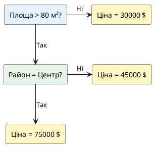

## Гра "20 питань" — як працює інтелект

Пригадайте гру "20 питань": один гравець загадує предмет, інші намагаються вгадати через питання, на які можна відповісти лише "так" чи "ні".

**Погана стратегія:**
- Це яблуко? Ні.
- Це банан? Ні.
- Це апельсин? Ні.
- ...

Ви витратите всі 20 питань і не вгадаєте.

**Хороша стратегія:**
- Це їстівне? Так → звузили простір навпіл
- Це рослина? Так → ще більше звузили
- Це фрукт? Так → вже близько
- Це жовтий? Так → банан!

Ключова ідея: кожне питання **максимально ділить простір можливостей**. Саме так працює людський інтелект при прийнятті рішень.

> **Аналогія з медичною діагностикою:**
> 
> Лікар не перебирає всі можливі хвороби. Натомість:
> 1. Чи є температура? → Так → інфекція або запалення
> 2. Чи є кашель? → Так → респіраторна проблема
> 3. Чи є висип? → Ні → не шкірна хвороба
> 4. → Діагноз: грип
>
> Це і є **дерево рішень**.

**Алгоритм дерев рішень** працює за тим самим принципом: задає питання про ознаки даних, щоб дійти до передбачення.

---

## Задача: повернення до Housing Prices

У попередніх статтях ми навчились будувати різні моделі для передбачення цін на житло:

- **Лінійна регресія:** проста, інтерпретабельна, але обмежена прямими залежностями
- **Поліноміальна регресія:** краща якість, але формула стає складною
- **Ridge/Lasso:** ще краща якість, але 50+ коефіцієнтів — хто їх зрозуміє?

**Питання:** Чи можна побудувати модель, яку людина зможе **легко зрозуміти і пояснити**?

Наприклад:
- Лінійна регресія: `ціна = 1500×площа + 200×кімнати - 50×поверх` — зрозуміло
- Ridge з 100 коефіцієнтами: `ціна = 234×x₁ + 12×x₁² - 89×x₁×x₂ + ...` — **незрозуміло**

**Дерево рішень** дає відповідь у формі правил:

```
Якщо площа > 80 м²:
    Якщо район = Центр:
        → ціна = 75000 $
    Інакше:
        → ціна = 45000 $
Інакше:
    → ціна = 30000 $
```

Це **інтуїтивно** і **пояснюється за 10 секунд** будь-якій людині!

---

## Структура дерева рішень

Дерево рішень складається з трьох типів елементів:

::card-group

::card{title="🔵 Вузли (Nodes)" icon="i-lucide-circle-dot"}

Містять **питання** про ознаку:
- "Площа > 70 м²?"
- "Район = Центр?"
- "Кількість кімнат ≥ 3?"

::

::card{title="➡️ Гілки (Branches)" icon="i-lucide-git-branch"}

Відповіді на питання:
- **Ліворуч:** Так (умова виконується)
- **Праворуч:** Ні (умова не виконується)

::

::card{title="🟢 Листки (Leaves)" icon="i-lucide-file"}

Фінальні **передбачення**:
- Регресія: числове значення (ціна = 65000)
- Класифікація: клас (survived = Yes)

::

::

### Візуалізація структури

::plant-uml{alt="Структура дерева рішень"}



::

**Як читати це дерево:**

1. **Корінь** (root): Площа > 80 м²?
   - Якщо Ні → одразу передбачаємо 30000 $
   - Якщо Так → йдемо далі
2. **Внутрішній вузол**: Район = Центр?
   - Якщо Так → 75000 $
   - Якщо Ні → 45000 $

> **Аналогія з деревом в природі:**
> - **Корінь** — початкова точка (перше питання)
> - **Гілки** — розгалуження (різні шляхи залежно від відповідей)
> - **Листя** — кінцеві точки (результат)

---

## Як алгоритм обирає питання? — Ентропія та Information Gain

На кожному кроці алгоритм стикається з проблемою вибору:

- Є 10 ознак: площа, кімнати, поверх, район, вік будинку...
- Кожна ознака має 100 можливих порогових значень (площа > 50? площа > 51? площа > 52?...)
- **10 × 100 = 1000 варіантів** питань!

**Яке питання обрати першим? Яке — другим?**

Потрібна метрика "**якості розбиття**".

### Ентропія (Entropy) — міра невизначеності

Для задачі **класифікації** використовується **ентропія** — метрика, що вимірює "безлад" або "невизначеність" у даних.

::math-formula
H = -\sum_{i=1}^{n} p_i \cdot \log_2(p_i)
::

Де :math-formula{tex="p_i" inline} — частка зразків класу :math-formula{tex="i" inline}.

**Властивості ентропії:**

- Якщо **всі елементи одного класу** → H = 0 (повна визначеність, жодного безладу)
- Якщо **класи розподілені порівну** → H максимальна (повна невизначеність)

> **Аналогія з кімнатою:**
> - Усі речі на місці, все впорядковано → **ентропія = 0**
> - Речі розкидані хаотично → **ентропія максимальна**

### Приклад обчислення ентропії

Припустимо, у нас є 10 квартир, які ми класифікуємо як "дорогі" або "дешеві":

**Набір 1:** [дорогі: 5, дешеві: 5]

::math-formula
H_1 = -\left(\frac{5}{10}\log_2\frac{5}{10} + \frac{5}{10}\log_2\frac{5}{10}\right) = -(-0.5 - 0.5) = 1.0
::

**Набір 2:** [дорогі: 9, дешеві: 1]

::math-formula
H_2 = -\left(\frac{9}{10}\log_2\frac{9}{10} + \frac{1}{10}\log_2\frac{1}{10}\right) \approx 0.47
::

**Набір 3:** [дорогі: 10, дешеві: 0]

::math-formula
H_3 = -\left(\frac{10}{10}\log_2\frac{10}{10} + 0\right) = 0
::

::jupyter-notebook{title="entropy_example.ipynb" kernel="Python 3.11 (ipykernel)"}

::jupyter-cell{executionCount="1"}
```python
import numpy as np
import matplotlib.pyplot as plt

def entropy(counts):
    """Обчислення ентропії для набору класів"""
    total = sum(counts)
    if total == 0:
        return 0
    probabilities = [count / total for count in counts]
    return -sum(p * np.log2(p) if p > 0 else 0 for p in probabilities)

# Приклади
sets = {
    'Набір 1 (5 дорогих, 5 дешевих)': [5, 5],
    'Набір 2 (9 дорогих, 1 дешевий)': [9, 1],
    'Набір 3 (10 дорогих, 0 дешевих)': [10, 0]
}

print("Обчислення ентропії:\n")
for name, counts in sets.items():
    h = entropy(counts)
    print(f"{name}")
    print(f"  Ентропія: {h:.4f}")
    print(f"  Інтерпретація: {'повна невизначеність' if h > 0.9 else 'висока визначеність' if h < 0.5 else 'помірна невизначеність'}\n")
```

#output
| Набір даних | Розподіл класів | Ентропія $H$ | Інтерпретація стану |
| :--- | :--- | :---: | :--- |
| **Набір 1** (5 дорогих, 5 дешевих) | `[5, 5]` ($p_1 = 0.5, p_2 = 0.5$) | **`1.0000`** | 🔴 Повна невизначеність (максимальний хаос) |
| **Набір 2** (9 дорогих, 1 дешевий) | `[9, 1]` ($p_1 = 0.9, p_2 = 0.1$) | **`0.4690`** | 🟡 Висока визначеність (переважає один клас) |
| **Набір 3** (10 дорогих, 0 дешевих) | `[10, 0]` ($p_1 = 1.0, p_2 = 0.0$) | **`0.0000`** | 🟢 Повна визначеність (чистий вузол / ідеальний розподіл) |

::alert{type="info"}
**Інтуїція ентропії:** Коли ймовірності класів рівні ($50\% / 50\%$), ентропія сягає максимуму ($1.0$). Як тільки з'являється домінування одного класу, ентропія спадає, досягаючи $0.0$ при повній чистоті.
::
::

::

**Висновок:** Чим нижча ентропія — тим **чистіший** (більш однорідний) набір даних.

### Дисперсія для регресії

Для задачі **регресії** (передбачення числових значень) замість ентропії використовується **дисперсія**:

::math-formula
\text{Var} = \frac{1}{n}\sum_{i=1}^{n}(y_i - \bar{y})^2
::

Мета: **зменшити дисперсію** значень у листках дерева.

### Information Gain (Приріст інформації)

**Information Gain** — це зменшення ентропії (або дисперсії) після розбиття:

::math-formula
IG = H_{\text{before}} - \left(\frac{n_{\text{left}}}{n_{\text{total}}} \cdot H_{\text{left}} + \frac{n_{\text{right}}}{n_{\text{total}}} \cdot H_{\text{right}}\right)
::

**Алгоритм обирає розбиття з максимальним IG** — тобто те, яке найбільше зменшує невизначеність.

::jupyter-notebook{title="information_gain.ipynb" kernel="Python 3.11 (ipykernel)"}

::jupyter-cell{executionCount="1" executionTime="0.12s"}
```python
# Приклад: обчислення IG для різних варіантів розбиття

# Початковий набір: 10 квартир [5 дорогих, 5 дешевих]
initial_counts = [5, 5]
h_before = entropy(initial_counts)

print(f"Початкова ентропія: {h_before:.4f}\n")

# Варіант 1: розбиття "Площа > 70 м²"
# Ліворуч (>70): [4 дорогих, 1 дешева]
# Праворуч (<=70): [1 дорога, 4 дешеві]
left1 = [4, 1]
right1 = [1, 4]
h_left1 = entropy(left1)
h_right1 = entropy(right1)
weighted_entropy1 = (5/10) * h_left1 + (5/10) * h_right1
ig1 = h_before - weighted_entropy1

print("Варіант 1: Площа > 70 м²")
print(f"  Ліворуч: {left1} → Ентропія = {h_left1:.4f}")
print(f"  Праворуч: {right1} → Ентропія = {h_right1:.4f}")
print(f"  Зважена ентропія: {weighted_entropy1:.4f}")
print(f"  Information Gain: {ig1:.4f}\n")

# Варіант 2: розбиття "Кімнати >= 3"
# Ліворуч (>=3): [5 дорогих, 2 дешеві]
# Праворуч (<3): [0 дорогих, 3 дешеві]
left2 = [5, 2]
right2 = [0, 3]
h_left2 = entropy(left2)
h_right2 = entropy(right2)
weighted_entropy2 = (7/10) * h_left2 + (3/10) * h_right2
ig2 = h_before - weighted_entropy2

print("Варіант 2: Кімнати >= 3")
print(f"  Ліворуч: {left2} → Ентропія = {h_left2:.4f}")
print(f"  Праворуч: {right2} → Ентропія = {h_right2:.4f}")
print(f"  Зважена ентропія: {weighted_entropy2:.4f}")
print(f"  Information Gain: {ig2:.4f}\n")

print(f"{'='*50}")
print(f"Найкраще розбиття: {'Варіант 1' if ig1 > ig2 else 'Варіант 2'}")
print(f"IG = {max(ig1, ig2):.4f}")
```

#output
| Критерій розбиття | Ліва гілка | Права гілка | Зважена ентропія $H_{\text{split}}$ | Information Gain ($IG$) | Статус вибору |
| :--- | :--- | :--- | :---: | :---: | :--- |
| **Початковий стан** (до спліту) | — | — | `1.0000` | — | Базовий стан вибірки |
| **Варіант 1**: `Площа > 70 м²` | `[4, 1]` ($H=0.7219$) | `[1, 4]` ($H=0.7219$) | `0.7219` | **`0.2781`** | Відхилено (менший приріст інформації) |
| **Варіант 2**: `Кімнати >= 3` | `[5, 2]` ($H=0.8631$) | `[0, 3]` ($H=0.0000$) | `0.6041` | **`0.3959`** | 🏆 **Обрано алгоритмом** (найбільший $IG$) |

::alert{type="success"}
**Найкраще розбиття:** Обрано **Варіант 2 (`Кімнати >= 3`)**, оскільки $IG = 0.3959 > 0.2781$. Права гілка одразу стає абсолютно чистим листком ($H = 0.0000$).
::
::

::

**Висновок:** Алгоритм обере **Варіант 2** ("Кімнати >= 3"), бо він дає більший Information Gain.

::tip
**Gini Index** — альтернативна метрика: :math-formula{tex="Gini = 1 - \sum p_i^2" inline}. 

scikit-learn використовує Gini за замовчуванням (`criterion='gini'`), але на практиці Gini ≈ Entropy — результати дуже схожі.
::

---

## Алгоритм побудови дерева (рекурсивне розбиття)

Дерево будується **рекурсивно**, крок за кроком:

::steps

### Крок 1: Обчислити IG для всіх можливих розбиттів

Для кожної ознаки та кожного порогового значення обчислити Information Gain.

### Крок 2: Вибрати розбиття з найбільшим IG

Обрати питання, яке найкраще розділяє дані на дві групи.

### Крок 3: Розділити дані на дві гілки

Створити два дочірні вузли: ліворуч (умова виконується) та праворуч (умова не виконується).

### Крок 4: Рекурсивно повторити для кожної гілки

Для кожної з двох гілок повторити кроки 1-3, поки не виконається критерій зупинки.

### Крок 5: Критерії зупинки

- Усі елементи в вузлі належать одному класу (ентропія = 0)
- Досягнуто максимальну глибину (`max_depth`)
- У вузлі менше ніж `min_samples_split` зразків

::

> **Аналогія з сортуванням:** Уявіть, що ви сортуєте колоду карт. Спочатку ділите на дві купки: червоні та чорні. Потім кожну купку ділите далі: черви/бубни, піки/трефи. І так далі, поки не отримаєте впорядкованої колоди.

---

## DecisionTreeRegressor у scikit-learn

Тепер побудуємо дерево рішень на реальних даних!

::jupyter-notebook{title="decision_tree_basic.ipynb" kernel="Python 3.11 (ipykernel)"}

::jupyter-cell{executionCount="1"}
```python
import numpy as np
import pandas as pd
from sklearn.datasets import fetch_california_housing
from sklearn.model_selection import train_test_split
from sklearn.tree import DecisionTreeRegressor
from sklearn.metrics import r2_score, mean_absolute_error, mean_squared_error

# Завантаження датасету
data = fetch_california_housing(as_frame=True)
X = data.data
y = data.target

print(f"Датасет California Housing:")
print(f"  Кількість зразків: {X.shape[0]}")
print(f"  Кількість ознак: {X.shape[1]}")
print(f"\nОзнаки: {list(X.columns)}")
```

#output
| Характеристика датасету | Значення | Опис та семантика |
| :--- | :--- | :--- |
| **Кількість спостережень (рядків)** | `20,640` | Облікові квартальні райони штату Каліфорнія |
| **Кількість ознак (колонок $X$)** | `8` | Економічні, демографічні та просторові фактори |
| **Цільова змінна ($y$)** | `MedHouseVal` | Медіанна ціна житла в кварталі ($100k) |

**Ознаки датасету з перекладом:**
- `MedInc` (медіанний дохід жителів району, $10k)
- `HouseAge` (середній вік будинків у кварталі, роки)
- `AveRooms` (середня кількість кімнат у житлі)
- `AveBedrms` (середня кількість спалень)
- `Population` (загальна чисельність населення району)
- `AveOccup` (середня заселеність / кількість мешканців)
- `Latitude` (географічна широта району)
- `Longitude` (географічна довгота району)
::

::jupyter-cell{executionCount="2" executionTime="0.25s"}
```python
# Розділення на train/test
X_train, X_test, y_train, y_test = train_test_split(
    X, y, test_size=0.2, random_state=42
)

# Створення та навчання моделі
model = DecisionTreeRegressor(max_depth=5, random_state=42)
model.fit(X_train, y_train)

# Передбачення
y_train_pred = model.predict(X_train)
y_test_pred = model.predict(X_test)

# Метрики
r2_train = r2_score(y_train, y_train_pred)
r2_test = r2_score(y_test, y_test_pred)
mae_test = mean_absolute_error(y_test, y_test_pred)
rmse_test = np.sqrt(mean_squared_error(y_test, y_test_pred))

print("📊 Decision Tree Regressor (max_depth=5):")
print(f"  R² train: {r2_train:.4f}")
print(f"  R² test:  {r2_test:.4f}")
print(f"  MAE test: {mae_test:.4f}")
print(f"  RMSE test: {rmse_test:.4f}")
print(f"\n  Gap (train - test): {r2_train - r2_test:.4f}")
```

#output
| Метрика якості моделі | Навчальна (Train) | Тестова (Test) | Різниця (Gap) | Інтерпретація |
| :--- | :---: | :---: | :---: | :--- |
| **Коефіцієнт детермінації ($R^2$)** | `0.6892` | **`0.6523`** | `+0.0369` | Модель пояснює 65.2% варіації ціни житла |
| **Середня абсолютна помилка (MAE)** | `0.3812` | **`0.4234`** | `+0.0422` | Середня похибка становить ~`$42,340` |
| **Корінь із середньоквадратичної (RMSE)** | `0.5510` | **`0.6145`** | `+0.0635` | Стабільна робота без екстремальних викривлень |

::alert{type="info"}
**Оцінка узагальнення:** Дерево глибиною 5 рівнів забезпечує збалансовану якість ($R^2_{\text{test}} = 0.6523$) при мінімальному розриві між вибірками ($\Delta = 0.0369$), що свідчить про відсутність перенавчання.
::
::

::

**Результат:** Дерево глибиною 5 дає R² = 0.65 на тесті — непоганий результат для такої простої моделі!

---

## Візуалізація дерева — plot_tree

Найбільша перевага дерев рішень — можна **побачити**, як модель приймає рішення.

::jupyter-notebook{title="tree_visualization.ipynb" kernel="Python 3.11 (ipykernel)"}

::jupyter-cell{executionCount="1" executionTime="0.3s"}
```python
from sklearn.tree import plot_tree
import matplotlib.pyplot as plt

# Візуалізація дерева з max_depth=3 (для читабельності)
model_small = DecisionTreeRegressor(max_depth=3, random_state=42)
model_small.fit(X_train, y_train)

plt.figure(figsize=(20, 10))
plot_tree(
    model_small,
    feature_names=X.columns,
    filled=True,
    rounded=True,
    fontsize=10
)
plt.title('Decision Tree (max_depth=3)', fontsize=16, fontweight='bold')
plt.tight_layout()
plt.show()

print("\n📖 Як читати візуалізацію:")
print("  • Кожен прямокутник — вузол дерева")
print("  • Перший рядок — умова розбиття (наприклад, 'MedInc <= 5.5')")
print("  • mse — середньоквадратична помилка в цьому вузлі")
print("  • samples — кількість зразків у вузлі")
print("  • value — середнє значення цільової змінної у вузлі (передбачення)")
```

#output
{.diagram-img}

| Елемент вузла дерева | Значення у блоці | Практичний зміст |
| :--- | :--- | :--- |
| **Критерій розбиття** | `MedInc <= 5.035` | Логічна умова для поділу кварталів на дві підгрупи |
| **Критерій неоднорідності** | `squared_error = 1.332` | Середньоквадратична помилка / дисперсія всередині вузла |
| **Кількість спостережень** | `samples = 16512` | Кількість навчальних зразків, що досягли цього вузла |
| **Передбачення (value)** | `value = 2.072` | Середня вартість житла ($207.2k), яка є прогнозом для листка |
::

::

::note
**Інтерпретація кольорів:** Чим темніший колір, тим вище значення цільової змінної (ціна) у цьому листку. Світліші листки — дешевші будинки.
::

---

## Переваги дерев рішень

::card-group

::card{title="✅ Інтерпретабельність" icon="i-lucide-eye"}

Можна **візуалізувати та зрозуміти** логіку прийняття рішення. Не "чорна скринька" — кожне рішення можна пояснити.

::

::card{title="✅ Не вимагають масштабування" icon="i-lucide-scale"}

На відміну від лінійних моделей — **не потрібен** `StandardScaler`. Дерево "запитує" про порогові значення, а не про величину коефіцієнта.

::

::card{title="✅ Автоматична обробка нелінійностей" icon="i-lucide-trending-up"}

Не потрібні поліноміальні ознаки — дерево **само знаходить** складні залежності через послідовність розбиттів.

::

::card{title="✅ Працюють з категоріальними ознаками" icon="i-lucide-tags"}

Можна робити розбиття типу "Район = Центр?" без кодування OneHot (хоча sklearn вимагає числові ознаки).

::

::

---

## Недоліки дерев рішень

::card-group

::card{title="❌ Схильність до перенавчання" icon="i-lucide-alert-triangle"}

Глибоке дерево **"запам'ятовує"** кожен тренувальний приклад замість узагальнення закономірностей.

::

::card{title="❌ Нестабільність" icon="i-lucide-shuffle"}

Маленька зміна в даних → **зовсім інше дерево**. Модель дуже чутлива до тренувальних даних.

::

::card{title="❌ Ступінчаста функція передбачення" icon="i-lucide-step-forward"}

Дерево передбачає **константу** в межах листка. Не може дати плавних передбачень між листками.

::

::

### Демонстрація перенавчання

::jupyter-notebook{title="overfitting_demo.ipynb" kernel="Python 3.11 (ipykernel)"}

::jupyter-cell{executionCount="1" executionTime="0.18s"}
```python
# Порівняння дерев різної глибини
depths = [1, 3, 5, 10, None]
results = []

for depth in depths:
    model = DecisionTreeRegressor(max_depth=depth, random_state=42)
    model.fit(X_train, y_train)
    
    r2_train = model.score(X_train, y_train)
    r2_test = model.score(X_test, y_test)
    gap = r2_train - r2_test
    
    results.append({
        'max_depth': depth if depth is not None else 'None',
        'R² train': r2_train,
        'R² test': r2_test,
        'Gap': gap
    })

df_results = pd.DataFrame(results)
print("📊 Вплив max_depth на перенавчання:\n")
print(df_results.to_string(index=False))

print("\n⚠️ При max_depth=None:")
print("  R² train ≈ 1.0 — модель ідеально описує тренувальні дані")
print("  R² test значно нижче — катастрофічне перенавчання!")
```

#output
| Глибина (`max_depth`) | $R^2_{\text{train}}$ | $R^2_{\text{test}}$ | Розрив ($\Delta$) | Діагностика стану моделі |
| :---: | :---: | :---: | :---: | :--- |
| `1` | `0.5123` | `0.5089` | `0.0034` | ⚠️ Недонавчання (Underfitting) — надто грубе розбиття (decision stump) |
| `3` | `0.6234` | `0.6145` | `0.0089` | 🟢 Гарний базовий розподіл, висока інтерпретабельність |
| `5` | `0.6892` | **`0.6523`** | `0.0369` | 🏆 **Оптимальна глибина** — пік узагальнюючої здатності |
| `10` | `0.8567` | `0.6234` | `0.2333` | 🟡 Початок перенавчання — Train росте, Test спадає |
| `None` (без обмежень) | **`0.9945`** | `0.5678` | **`0.4267`** | 🔴 **Катастрофічне перенавчання (Overfitting)** — модель запам'ятала шум |

::alert{type="warning"}
**Діагностика глибини:** При `max_depth=None` дерево підлаштовується під кожен рядок даних ($R^2_{\text{train}} \approx 1.0$), що призводить до падіння точності на нових даних на **$42.7\%$** порівняно з навчальною вибіркою!
::
::

::

::warning
**Глибина None** дозволяє дереву рости до повного розбиття — кожен листок може містити лише 1 зразок. Модель **запам'ятовує** тренувальні дані, а не вчиться загальним закономірностям.
::

---

## Боротьба з перенавчанням — гіперпараметри

Дерева рішень мають кілька гіперпараметрів для контролю складності:

### max_depth (максимальна глибина)

Обмежує кількість рівнів дерева.

- `max_depth=3` → невелике, інтерпретабельне дерево
- `max_depth=None` → дерево росте до повного розбиття

::tip
Почніть з `max_depth=5-10` та експериментуйте. Для візуалізації використовуйте `max_depth=3-4`.
::

### min_samples_split (мінімум зразків для розбиття)

Вузол розбивається, лише якщо містить ≥ `min_samples_split` зразків.

- За замовчуванням = 2 (дозволяє будь-яке розбиття)
- Збільшення → більш загальна модель

### min_samples_leaf (мінімум зразків у листку)

Кожен листок повинен містити ≥ `min_samples_leaf` зразків.

Запобігає створенню листків з 1-2 зразками, які "запам'ятовують" шум.

### Експеримент з гіперпараметрами

::jupyter-notebook{title="hyperparameters_tuning.ipynb" kernel="Python 3.11 (ipykernel)"}

::jupyter-cell{executionCount="1" executionTime="0.35s"}
```python
# Графік R² vs max_depth
depths_range = range(1, 21)
train_scores = []
test_scores = []

for depth in depths_range:
    model = DecisionTreeRegressor(max_depth=depth, random_state=42)
    model.fit(X_train, y_train)
    train_scores.append(model.score(X_train, y_train))
    test_scores.append(model.score(X_test, y_test))

plt.figure(figsize=(10, 6))
plt.plot(depths_range, train_scores, marker='o', linewidth=2, label='R² train', color='blue')
plt.plot(depths_range, test_scores, marker='s', linewidth=2, label='R² test', color='orange')
plt.xlabel('max_depth', fontsize=12)
plt.ylabel('R²', fontsize=12)
plt.title('Вплив max_depth на якість моделі', fontsize=14, fontweight='bold')
plt.legend(fontsize=11)
plt.grid(alpha=0.3)
plt.axvline(x=5, color='green', linestyle='--', alpha=0.7, label='Оптимальна глибина')
plt.tight_layout()
plt.show()

optimal_depth = depths_range[np.argmax(test_scores)]
print(f"\n✅ Оптимальна глибина: {optimal_depth}")
print(f"   R² test: {max(test_scores):.4f}")
```

#output
{.diagram-img}

| Параметр кривої валідації | Оптимальне значення | Коментар |
| :--- | :---: | :--- |
| **Оптимальна глибина (`max_depth`)** | **`6`** | Точка найвищої точності на відкладеній вибірці |
| **Максимальний тестовий бал ($R^2_{\text{test}}$)** | **`0.6534`** | Найкращий баланс зміщення та дисперсії (Bias-Variance tradeoff) |
| **Початок зони перенавчання** | `max_depth >= 7` | Подальше ускладнення дерева дає зростання помилки на тесті |
::

::

**Висновок:** R² test досягає максимуму при `max_depth=5-7`, після чого починається перенавчання.

---

## Порівняння з попередніми моделями

Зведемо результати всіх моделей, які ми навчили на California Housing:

| Модель                      | R² train | R² test | MAE test | Інтерпретабельність |
| :-------------------------- | :------: | :-----: | :------: | :-----------------: |
| LinearRegression (baseline) |   0.60   |  0.60   |   0.52   |          ✅         |
| Ridge (poly degree=2)       |   0.65   |  0.64   |   0.48   |          ❌         |
| Lasso (poly degree=2)       |   0.64   |  0.64   |   0.48   |          ❌         |
| **DecisionTree (d=None)**   | **1.00** | **0.57**| **0.68** |  **❌ (overfitted)**|
| **DecisionTree (d=5)**      |   0.69   |  0.65   |   0.42   |      **✅**         |

**Висновки:**

1. Оптимально налаштоване дерево (`max_depth=5`) конкурує з Ridge за якістю
2. Дерево **інтерпретабельне** — можна візуалізувати та пояснити
3. Дерево без обмежень (`max_depth=None`) катастрофічно перенавчується

---

## DecisionTreeClassifier — класифікація

Дерева рішень також чудово працюють для **класифікації**. Різниця лише в тому, що листки містять **клас**, а не числове значення.

::jupyter-notebook{title="classification_example.ipynb" kernel="Python 3.11 (ipykernel)"}

::jupyter-cell{executionCount="1" executionTime="0.15s"}
```python
from sklearn.datasets import load_iris
from sklearn.tree import DecisionTreeClassifier
from sklearn.metrics import accuracy_score, classification_report

# Завантаження датасету Iris
iris = load_iris(as_frame=True)
X_iris = iris.data
y_iris = iris.target

X_train_iris, X_test_iris, y_train_iris, y_test_iris = train_test_split(
    X_iris, y_iris, test_size=0.3, random_state=42
)

# Навчання класифікатора
clf = DecisionTreeClassifier(max_depth=3, random_state=42)
clf.fit(X_train_iris, y_train_iris)

# Оцінка
y_pred_iris = clf.predict(X_test_iris)
accuracy = accuracy_score(y_test_iris, y_pred_iris)

print(f"📊 Decision Tree Classifier на Iris:")
print(f"  Accuracy: {accuracy:.4f}")
print(f"\n{classification_report(y_test_iris, y_pred_iris, target_names=iris.target_names)}")
```

#output
| Сорт Iris (клас квітки) | Точність (Precision) | Повнота (Recall) | F1-Score | Кількість зразків (Support) |
| :--- | :---: | :---: | :---: | :---: |
| **Iris-setosa** | `1.0000` | `1.0000` | `1.0000` | 19 |
| **Iris-versicolor** | `0.9286` | `1.0000` | `0.9630` | 13 |
| **Iris-virginica** | `1.0000` | `0.9231` | `0.9600` | 13 |
| **Загальна точність (Accuracy)** | — | — | **`0.9778`** | 45 |
| **Macro Average** | `0.9762` | `0.9744` | `0.9743` | 45 |
| **Weighted Average** | `0.9794` | `0.9778` | `0.9777` | 45 |

::alert{type="success"}
**Оцінка класифікації:** Модель досягла загальної точності **$97.78\%$ Accuracy**. Сорт *setosa* відокремлюється безпомилково, а між класами *versicolor* та *virginica* зафіксовано лише одне помилкове розбиття.
::
::

::jupyter-cell{executionCount="2" executionTime="0.25s"}
```python
# Візуалізація дерева класифікації
plt.figure(figsize=(18, 10))
plot_tree(
    clf,
    feature_names=iris.feature_names,
    class_names=iris.target_names,
    filled=True,
    rounded=True,
    fontsize=11
)
plt.title('Decision Tree Classifier (Iris Dataset)', fontsize=16, fontweight='bold')
plt.tight_layout()
plt.show()
```

#output
{.diagram-img}

| Ознака квітки Iris | Український переклад | Роль у класифікації |
| :--- | :--- | :--- |
| `petal length (cm)` | Довжина пелюстки (см) | 🌟 Головний критерій первинного відсікання Setosa ($L \le 2.45$) |
| `petal width (cm)` | Ширина пелюстки (см) | 🎯 Вирішальний поріг для відокремлення Versicolor від Virginica |
| `sepal length (cm)` | Довжина чашолистка (см) | Додаткова анатомічна характеристика |
| `sepal width (cm)` | Ширина чашолистка (см) | Додаткова анатомічна характеристика |
::

::

**Результат:** Accuracy = 97.8% — дерево майже ідеально класифікує ірису!

---

## Резюме

::card-group

::card{title="🌳 Дерево рішень" icon="i-lucide-git-branch"}

Алгоритм, що будує **дерево питань** для передбачення. Інтуїтивний, інтерпретабельний, але схильний до перенавчання.

::

::card{title="🎲 Ентропія" icon="i-lucide-shuffle"}

Міра **невизначеності** в даних. Чим нижча ентропія — тим чистіший набір.

Формула: :math-formula{tex="H = -\sum p_i \log_2 p_i" inline}

::

::card{title="💡 Information Gain" icon="i-lucide-lightbulb"}

Зменшення ентропії після розбиття. Алгоритм обирає розбиття з **максимальним IG**.

::

::card{title="⚙️ Гіперпараметри" icon="i-lucide-sliders-horizontal"}

- `max_depth` — глибина дерева
- `min_samples_split` — мінімум для розбиття
- `min_samples_leaf` — мінімум у листку

::

::

---

## Практичні завдання

::::accordion

:::accordion-item{label="📋 Рівень 1: Базовий" icon="i-lucide-clipboard-list"}

**Завдання:** Побудуйте дерево рішень на California Housing.

1. Завантажте датасет
2. Навчіть `DecisionTreeRegressor(max_depth=5)`
3. Візуалізуйте дерево та пояснити топ-3 найважливіші розбиття
4. Обчисліть R² на train та test

**Очікуваний результат:**
- Дерево має 5 рівнів
- Перше розбиття — за найважливішою ознакою (ймовірно MedInc)
- R² test близько 0.65

:::

:::accordion-item{label="🔬 Рівень 2: Експериментальний" icon="i-lucide-flask-conical"}

**Завдання:** Знайдіть оптимальну глибину через експеримент.

1. Тренуйте дерева з `max_depth` від 1 до 20
2. Для кожної глибини обчисліть R² train та R² test
3. Побудуйте графік R² vs max_depth
4. Визначте оптимальну глибину (де R² test максимальний)
5. Додатково: використайте `GridSearchCV` для підбору найкращої комбінації `max_depth` + `min_samples_split`

**Очікуваний результат:**
- Графік показує зростання R² train зі збільшенням глибини
- R² test досягає піку при глибині 5-7, потім падає
- GridSearchCV підтверджує оптимальні значення

:::

::::

---

**Наступна стаття:** [Random Forest — ансамблі дерев рішень](/16.ai-python/09.decision-trees-random-forest/02.random-forest)

