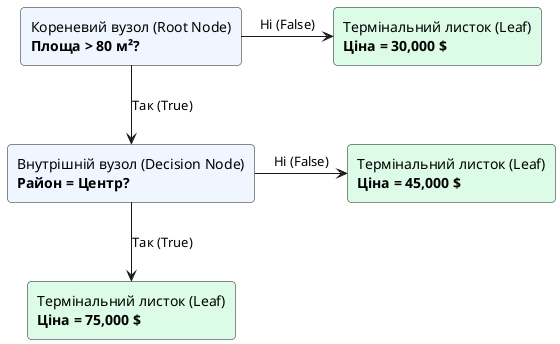
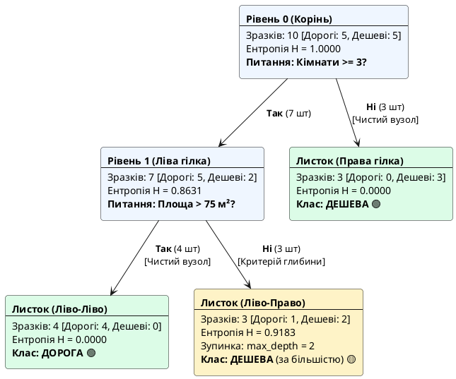

## Гра «20 питань» — природна логіка прийняття рішень

Пригадайте популярну салонну гру «20 питань»: один ведучий загадує таємний предмет або персонажа, а гравці намагаються його відгадати, ставлячи запитання, на які можна відповісти виключно «так» або «ні».

Як у цій грі поводиться людина з **неефективною стратегією**?
Вона намагається вгадувати випадковими переборами:
- *«Це яблуко?»* — Ні.
- *«Це автомобіль?»* — Ні.
- *«Це ноутбук?»* — Ні.

За такої стратегії шанси вгадати загадане слово за 20 спроб прямують до нуля, адже кожна невдала спроба відкидає лише один-єдиний варіант із мільйонів можливих.

Натомість досвідчений гравець обирає **ієрархічну стратегію максимального поділу простору**:
- *«Це жива істота?»* — Так *(одразу відсікається 50% неживого світу)*.
- *«Це тварина?»* — Так *(звужуємо простір до фауни)*.
- *«Вона живе у воді?»* — Ні *(залишаються лише наземні істоти)*.
- *«Це ссавець?»* — Так.
- *«Це хижак?»* — Так.

Кожне вдале запитання ділить простір невизначеності навпіл, стрімко наближаючи гравця до точного результату за мінімальну кількість кроків.

Саме за таким принципом працює людське мислення в професійній інженерній чи медичній практиці:
1. Лікар у приймальному відділенні не перебирає тисячі рідкісних хвороб навмання: спершу він перевіряє температуру, потім наявність кашлю, далі рівень кисню в крові.
2. Банківський андеррайтинговий відділ оцінює платоспроможність позичальника: спершу перевіряється кредитний рейтинг, потім офіційний дохід, далі наявність застави.

Модель машинного навчання, що реалізує цей природний деревоподібний ланцюжок запитань, називається **деревом рішень** (*Decision Tree*).

---

## Чому саме дерева рішень? Від лінійних формул до прозорих правил

У попередніх темах ми детально досліджували сімейство лінійних моделей:
- **Лінійна регресія** (*Linear Regression*) намагається описати весь світ єдиною прямою лінією чи гіперплощиною виду :math-formula{tex="\hat{y} = w_1 x_1 + w_2 x_2 + b" inline}.
- **Поліноміальна регресія** (*Polynomial Regression*) та моделі з регуляризацією **Ridge / Lasso** дозволяють моделювати нелінійні криві, проте роздувають простір ознак до десятків штучних колонок (:math-formula{tex="x_1^2, x_1 x_2, \dots" inline}).

У лінійних моделей є дві критичні практичні проблеми:
1. **Глобальний характер ваг:** якщо коефіцієнт ваги ознаки :math-formula{tex="w_1 = 1500" inline}, це означає, що за збільшення площі на кожен 1 м² ціна завжди зростає на 1500 $, незалежно від того, де розташована квартира — в елітному центрі чи в промисловій зоні за містом. Проте в реальному житті вплив ознак є **локальним і взаємопов'язаним**: велика площа в центрі коштує набагато дорожче за велику площу на околиці!
2. **Проблема інтерпретації для бізнесу:** коли Ridge-регресія видає формулу з 60 дробовими коефіцієнтами, жоден бізнес-аналітик, лікар чи регулятор не зможе зрозуміти фізичну причину конкретної оцінки.

Дерева рішень пропонують радикально іншу парадигму — формулювання передбачень у вигляді **ієрархічних умовних правил (if-then-else)**:

```
ЯКЩО площа > 80 м²:
    ЯКЩО район = "Центр":
        → Прогнозована ціна = 75,000 $
    ІНАКШЕ:
        → Прогнозована ціна = 45,000 $
ІНАКШЕ:
    ЯКЩО вік будинку <= 5 років:
        → Прогнозована ціна = 35,000 $
    ІНАКШЕ:
        → Прогнозована ціна = 25,000 $
```

Така логіка є на 100% прозорою, самодокументованою та зрозумілою будь-якій людині за лічені секунди.

---

## Анатомія дерева рішень

Дерево рішень — це ациклічний орієнтований граф, що росте «зверху вниз» і складається з трьох ключових будівельних блоків:

::card-group

::card{title="🔵 Вузли прийняття рішень (Decision Nodes)" icon="i-lucide-circle-dot"}

Внутрішні вершини графа, що містять логічні перевірки (*предикати*) щодо конкретної ознаки:
- Для неперервних ознак: *«Площа > 80 м²?»*, *«Вік будинку <= 10 років?»*
- Для категоріальних ознак: *«Район == Центр?»*

Найперший початковий вузол на верхівці дерева називається **кореневим вузлом** (*Root Node*).

::

::card{title="➡️ Гілки переходів (Branches)" icon="i-lucide-git-branch"}

Спрямовані ребра графа, що відповідають результатам логічної перевірки:
- **Гілка «Так» (True):** об'єкти, що задовольняють умову вузла.
- **Гілка «Ні» (False):** об'єкти, для яких умова хибна.

Кожне ребро спрямовує підмножину даних до наступного вузла.

::

::card{title="🟢 Термінальні листки (Leaves)" icon="i-lucide-file"}

Кінцеві вузли графа, які більше не діляться і містять **фінальний прогноз моделі**:
- **У задачах класифікації:** мітка домінуючого класу або ймовірнісний розподіл.
- **У задачах регресії:** числове значення (середнє арифметичне цільової змінної для об'єктів цього листка).

::

::

### Візуальна схема структури дерева

::plant-uml{alt="Анатомія та структура дерева рішень"}


```plantuml
@startuml
skinparam style plain
skinparam backgroundColor #FFFFFF
skinparam defaultFontName Arial
skinparam roundCorner 8

rectangle "Кореневий вузол (Root Node)\n**Площа > 80 м²?**" as root #EFF6FF
rectangle "Внутрішній вузол (Decision Node)\n**Район = Центр?**" as left #EFF6FF

rectangle "Термінальний листок (Leaf)\n**Ціна = 30,000 $**" as leaf_right #DCFCE7
rectangle "Термінальний листок (Leaf)\n**Ціна = 75,000 $**" as leaf_left_true #DCFCE7
rectangle "Термінальний листок (Leaf)\n**Ціна = 45,000 $**" as leaf_left_false #DCFCE7

root -down-> left : Так (True)
root -right-> leaf_right : Ні (False)

left -down-> leaf_left_true : Так (True)
left -right-> leaf_left_false : Ні (False)
@enduml
```

::

---

## Як дерево обирає розбиття для класифікації: Ентропія та Критерій Джині

Уявіть, що алгоритм розпочинає побудову дерева. У датасеті є 10 ознак, і кожна з них має десятки можливих порогових значень. Загалом існує сотні потенційних запитань:
- *«Площа > 50?»* чи *«Площа > 75?»*
- *«Кімнати >= 2?»* чи *«Вік <= 5?»*

Яке саме запитання алгоритм має поставити першим у кореневому вузлі, а яке — на наступних рівнях?

Щоб зробити об'єктивний вибір, алгоритму потрібна математична міра **«нечистоти»** (*Impurity*) або **«хаосу»** у вузлі. Ідеальне запитання — це те, яке максимально розділяє змішані класи на однорідні, «чисті» групи.

### Ентропія Клода Шеннона: міра невизначеності

Для оцінки безладу в інформаційній теорії використовується **інформаційна ентропія** (*Entropy*), запропонована батьком цифрового зв'язку Клодом Шенноном у 1948 році:

::math-formula
H = -\sum_{i=1}^{K} p_i \cdot \log_2(p_i)
::

де :math-formula{tex="K" inline} — кількість класів у вибірці, а :math-formula{tex="p_i" inline} — частка зразків :math-formula{tex="i" inline}-го класу у поточному вузлі (:math-formula{tex="p_i \in [0, 1]" inline}).

**Фізичний зміст ентропії:**
- **Ентропія :math-formula{tex="H = 0.0" inline} (Повний порядок):** Усі об'єкти у вузлі належать до одного й того самого класу. Жодної невизначеності немає — перед нами чистий листок.
- **Ентропія :math-formula{tex="H = 1.0" inline} (Максимальний хаос для 2 класів):** Класи розділені порівну (:math-formula{tex="50\% / 50\%" inline}). Це стан повної невизначеності — результат підкидання симетричної монети.

::jupyter-notebook{title="entropy_example.ipynb" kernel="Python 3.11 (ipykernel)"}

::jupyter-cell{executionCount="1"}

```python
import numpy as np

def entropy(counts):
    """Обчислення інформаційної ентропії Шеннона"""
    total = sum(counts)
    if total == 0:
        return 0.0
    probabilities = [count / total for count in counts]
    return float(-sum(p * np.log2(p) if p > 0 else 0.0 for p in probabilities))

# Тестові набори розподілу класів
sets = {
    'Набір 1 (5 дорогих, 5 дешевих)': [5, 5],
    'Набір 2 (9 дорогих, 1 дешевий)': [9, 1],
    'Набір 3 (10 дорогих, 0 дешевих)': [10, 0]
}

print("Обчислення ентропії для різних станів вибірки:\n")
for name, counts in sets.items():
    h = entropy(counts)
    status = 'Максимальний хаос (50/50)' if h >= 0.9 else 'Повна визначеність (чистий вузол)' if h == 0.0 else 'Висока однорідність'
    print(f"{name:32s} -> Ентропія H = {h:.4f} біт ({status})")
```

#output
| Набір даних | Розподіл класів | Ентропія :math-formula{tex="H" inline} | Інтерпретація стану |
| :--- | :--- | :---: | :--- |
| **Набір 1** (5 дорогих, 5 дешевих) | `[5, 5]` (:math-formula{tex="p_1 = 0.5, p_2 = 0.5" inline}) | **`1.0000`** | 🔴 Повна невизначеність (максимальний хаос) |
| **Набір 2** (9 дорогих, 1 дешевий) | `[9, 1]` (:math-formula{tex="p_1 = 0.9, p_2 = 0.1" inline}) | **`0.4690`** | 🟡 Висока визначеність (переважає один клас) |
| **Набір 3** (10 дорогих, 0 дешевих) | `[10, 0]` (:math-formula{tex="p_1 = 1.0, p_2 = 0.0" inline}) | **`0.0000`** | 🟢 Повна визначеність (чистий вузол / ідеальний розподіл) |

::

::

### Покроковий розрахунок ентропії: демо-приклад із вазою кульок

Щоб формула Шеннона перестала бути абстракцією, розглянемо простий приклад: у закритій вазі лежать **8 кульок** — **6 зелених** (клас :math-formula{tex="A" inline}) та **2 червоні** (клас :math-formula{tex="B" inline}).

::steps

### Крок 1. Обчислення часток класів
:math-formula{tex="p_{\text{зелені}} = \frac{6}{8} = 0.75" inline},  
:math-formula{tex="p_{\text{червоні}} = \frac{2}{8} = 0.25" inline}.

### Крок 2. Обчислення двійкових логарифмів
Двійковий логарифм показує міру несподіваності появи події у бітах:
:math-formula{tex="\log_2(0.75) \approx -0.4150" inline},  
:math-formula{tex="\log_2(0.25) = -2.0000" inline}.

### Крок 3. Зважування інформаційних внесків
Множимо ймовірність кожного результату на відповідний логарифм:
:math-formula{tex="0.75 \cdot (-0.4150) \approx -0.3113" inline},  
:math-formula{tex="0.25 \cdot (-2.0000) = -0.5000" inline}.

### Крок 4. Додавання та зміна знака
:math-formula{tex="H = -\big((-0.3113) + (-0.5000)\big) = -(-0.8113) \approx 0.8113\text{ біт}" inline}.

::

::jupyter-notebook{title="entropy_step_by_step.ipynb" kernel="Python 3.11 (ipykernel)"}

::jupyter-cell{executionCount="1"}

```python
def explain_entropy(classes: dict[str, int]) -> float:
    total = sum(classes.values())
    print(f"Загальна кількість об'єктів N = {total}")
    print("-" * 52)
    
    entropy_val = 0.0
    for label, count in classes.items():
        p = count / total
        log_val = np.log2(p) if p > 0 else 0.0
        weighted = p * log_val
        entropy_val -= weighted
        print(f"Клас '{label}': {count}/{total} (p={p:.2f}) -> log2(p)={log_val:+.4f} -> p*log2(p)={weighted:+.4f}")
        
    print("-" * 52)
    print(f"Ентропія H = {entropy_val:.4f} біт")
    return entropy_val

result = explain_entropy({'Зелені': 6, 'Червоні': 2})
```

#output
Загальна кількість об'єктів N = 8
----------------------------------------------------
Клас 'Зелені': 6/8 (p=0.75) -> log2(p)=-0.4150 -> p*log2(p)=-0.3113
Клас 'Червоні': 2/8 (p=0.25) -> log2(p)=-2.0000 -> p*log2(p)=-0.5000
----------------------------------------------------
Ентропія H = 0.8113 біт
::

::

### Критерій Джині (Gini Impurity) проти Ентропії: чому scikit-learn використовує Gini?

Якщо відкрити документацію `DecisionTreeClassifier` у scikit-learn, ви побачите параметр за замовчуванням `criterion='gini'`, а не `'entropy'`. Чому?

Формула **коефіцієнта неоднорідності Джині** (*Gini Impurity*):

::math-formula
\text{Gini} = 1 - \sum_{i=1}^{K} p_i^2
::

**Інтуїція Джині:** Уявіть, що ми навмання дістаємо елемент із вузла, а потім навмання приписуємо йому клас згідно з розподілом ймовірностей у цьому ж вузлі. Яка ймовірність того, що ми помилимося? Це і є Gini Impurity!
- Якщо всі елементи одного класу (:math-formula{tex="p_1 = 1.0" inline}): :math-formula{tex="\text{Gini} = 1 - 1.0^2 = 0.0" inline} (чистий вузол).
- Якщо класи розділені порівну (:math-formula{tex="p_1 = 0.5, p_2 = 0.5" inline}): :math-formula{tex="\text{Gini} = 1 - (0.25 + 0.25) = 0.5" inline}.

::note
### Чому в індустрії перемагає Gini Impurity?
Розрахунок ентропії вимагає обчислення **двійкових логарифмів** :math-formula{tex="\log_2(p)" inline} для мільйонів потенційних розбиттів. Обчислення логарифма на процесорі — дорога трансцендентна операція.

Формула Джині потребує лише елементарного піднесення часток до квадрата (:math-formula{tex="p_i^2" inline}). Завдяки цьому **Gini обчислюється значно швидше**, а отримані дерева у 98% випадків є повністю ідентичними до дерев, побудованих за ентропією.
::

### Information Gain: вибір найкращого запитання

Коли дерево тестує запитання, воно оцінює **Information Gain (Приріст інформації)** — різницю між ентропією батьківського вузла та зваженою сумою ентропій дочірніх гілок:

::math-formula
IG = H_{\text{до спліту}} - \left(\frac{N_{\text{ліво}}}{N_{\text{разом}}} \cdot H_{\text{ліво}} + \frac{N_{\text{право}}}{N_{\text{разом}}} \cdot H_{\text{право}}\right)
::

**Правило алгоритму:** З усіх можливих запитань обирається те, яке забезпечує **максимальний Information Gain** (максимально зменшує хаос).

::jupyter-notebook{title="information_gain.ipynb" kernel="Python 3.11 (ipykernel)"}

::jupyter-cell{executionCount="1" executionTime="0.12s"}

```python
# Порівняння двох варіантів розбиття вибірки з 10 квартир (5 дорогих, 5 дешевих)
initial_counts = [5, 5]
h_before = entropy(initial_counts)

# Варіант 1: "Площа > 70 м²"
left1, right1 = [4, 1], [1, 4]
h_l1, h_r1 = entropy(left1), entropy(right1)
weighted_h1 = (5/10) * h_l1 + (5/10) * h_r1
ig1 = h_before - weighted_h1

# Варіант 2: "Кімнати >= 3"
left2, right2 = [5, 2], [0, 3]
h_l2, h_r2 = entropy(left2), entropy(right2)
weighted_h2 = (7/10) * h_l2 + (3/10) * h_r2
ig2 = h_before - weighted_h2

print(f"Початкова ентропія: {h_before:.4f}")
print(f"Варіант 1 (Площа > 70):   IG = {ig1:.4f}")
print(f"Варіант 2 (Кімнати >= 3): IG = {ig2:.4f}")
print(f"Переможець: {'Варіант 2' if ig2 > ig1 else 'Варіант 1'} (максимізує приріст інформації)")
```

#output
| Критерій розбиття | Ліва гілка | Права гілка | Зважена ентропія :math-formula{tex="H_{\text{split}}" inline} | Information Gain (:math-formula{tex="IG" inline}) | Статус вибору |
| :--- | :--- | :--- | :---: | :---: | :--- |
| **Початковий стан** (до спліту) | — | — | `1.0000` | — | Базовий стан вибірки |
| **Варіант 1**: `Площа > 70 м²` | `[4, 1]` (:math-formula{tex="H=0.7219" inline}) | `[1, 4]` (:math-formula{tex="H=0.7219" inline}) | `0.7219` | **`0.2781`** | Відхилено (менший приріст інформації) |
| **Варіант 2**: `Кімнати >= 3` | `[5, 2]` (:math-formula{tex="H=0.8631" inline}) | `[0, 3]` (:math-formula{tex="H=0.0000" inline}) | `0.6042` | **`0.3958`** | 🏆 **Обрано алгоритмом** (найбільший :math-formula{tex="IG" inline}) |

::

::

---

## Як дерево обирає розбиття для регресії: Дисперсія та середнє значення

Тепер зробимо важливий концептуальний міст: **як дерево працює в задачі регресії**, коли цільова змінна :math-formula{tex="y" inline} є неперервним числом (ціна квартири, температура тощо)?

У неперервних числах немає поняття класів, тому ентропію Шеннона тут застосувати неможливо.

### Що містить листок регресійного дерева?

У регресії прогноз термінального листка — це **звичайне середнє арифметичне** всіх навчальних спостережень, які опинилися в цьому листку:

::math-formula
\hat{y}_{\text{leaf}} = \bar{y} = \frac{1}{N_{\text{leaf}}} \sum_{i \in \text{leaf}} y_i
::

Якщо в листок потрапили три будинки з цінами 40 000 $, 45 000 $ та 50 000 $, модель передбачить для будь-якого нового об'єкта в цьому листку середнє значення: **45 000 $**.

### Критерій розбиття: мінімізація середньоквадратичної помилки (MSE)

Що є мірою «хаосу» для числових значень? **Дисперсія (Variance)** або **середньоквадратична помилка (MSE)** навколо середнього значення:

::math-formula
\text{MSE}_{\text{node}} = \frac{1}{N} \sum_{i=1}^{N} (y_i - \bar{y})^2
::

Дерево регресії шукає таке розбиття, яке мінімізує зважену суму MSE лівої та правої гілок:

::math-formula
\text{Критерій} = \frac{N_{\text{ліво}}}{N} \cdot \text{MSE}_{\text{ліво}} + \frac{N_{\text{право}}}{N} \cdot \text{MSE}_{\text{право}} \to \min
::

### Як алгоритм знаходить числові пороги (наприклад, «Дохід <= 5.09»)?

Як алгоритм визначає конкретне числове порогове значення серед тисяч чисел? Розглянемо міні-приклад із 4 навчальними квартирами:

| Спостереження | Площа квартири (:math-formula{tex="X" inline}, м²) | Реальна вартість (:math-formula{tex="y" inline}, тис. $) |
| :---: | :---: | :---: |
| 1 | 40 | 60 |
| 2 | 60 | 70 |
| 3 | 80 | 110 |
| 4 | 100 | 130 |

Покроковий пошуку порогу розбиття:
1. **Сортування ознаки:** Дані сортуються за зростанням площі: `[40, 60, 80, 100]`.
2. **Формування точок-кандидатів:** Кандидатами в пороги стають середні точки між кожною парою сусідніх значень:
   - Поріг 1: :math-formula{tex="\frac{40 + 60}{2} = 50" inline}
   - Поріг 2: :math-formula{tex="\frac{60 + 80}{2} = 70" inline}
   - Поріг 3: :math-formula{tex="\frac{80 + 100}{2} = 90" inline}
3. **Оцінка кандидатів:** Для кожного порогу алгоритм ділить 4 будинки на дві групи, обчислює середні прогнози та вимірює сумарну помилку MSE.
4. **Вибір найкращого:** Поріг `70 м²` чітко відокремлює дешеві будинки `[60, 70]` від дорогих `[110, 130]`, забезпечуючи мінімальну дисперсію. Він і стає предикатом вузла!

Саме так дерево знаходить поріг `MedInc <= 5.09` для датасету California Housing, перевіривши всі проміжні значення впорядкованої колонки доходів.

---

## Геометрична природа рішень: прямокутні сходинки

Важливо розуміти геометричну сутність того, як дерева рішень бачать та сегментують простір ознак.

На відміну від лінійних моделей, які проводять суцільні похилі гіперплощини (:math-formula{tex="w_1 x_1 + w_2 x_2 + b = 0" inline}), дерево рішень порівнює лише **одну ознаку з одним числовим порогом** у кожному окремому вузлі (:math-formula{tex="X_j \le \text{threshold}" inline}). 

Через це розділові межі дерева в просторі ознак завжди є **ортогональними гіперплощинами, строго паралельними до осей координат**.

::note
**Аналогія (Кухар із прямокутним ножем):**  
Уявіть кухаря, якому дозволено різати піцу лише двома типами рухів: строго вертикально або строго горизонтально від краю до краю. Він фізично не може зробити плавний круглий чи похилий діагональний надріз. Будь-яка складна фігура виходить у нього складеною з прямокутних шматочків-сходинок. Саме так алгоритм CART розрізає простір ознак!
::

### Динаміка розбиття 2D-простору та зростання дерева

Щоб наочно побачити взаємозв'язок між графічною геометрією та структурою вузлів, подивіться на динамічну анімацію процесу навчання: ліворуч алгоритм крок за кроком розрізає площину ознак «Площа — Відстань» на прямокутні сектори, а праворуч синхронно формує відповідний граф CART-дерева:

<video controls autoplay loop muted playsinline poster="/videos/ai-python/decision-trees-random-forest/decision-trees/decision_tree_2d_space_partitioning_poster.png" class="diagram-img rounded-xl shadow-lg w-full my-6">
  <source src="/videos/ai-python/decision-trees-random-forest/decision-trees/decision_tree_2d_space_partitioning.mp4" type="video/mp4">
  <source src="/videos/ai-python/decision-trees-random-forest/decision-trees/decision_tree_2d_space_partitioning.webm" type="video/webm">
  
</video>

Зверніть увагу на важливі геометричні та алгоритмічні закономірності на анімації:
1. **Початковий стан (Крок 0):** Усі 52 спостереження знаходяться в єдиному неподіленому просторі. У дереві праворуч існує лише корінь, який аналізує всі можливі порогові кандидати для вибору найчистішого першого розбиття.
2. **Кореневий предикат (Спліт 1):** Алгоритм обирає умову :math-formula{tex="\text{Площа} \le 70\text{ м}^2" inline}. На площині з'являється вертикальна лінія-ніж, що ділить простір на ліву зону (компактні квартири) та праву зону (просторі). У дереві додаються дві головні гілки.
3. **Локальність наступних розбиттів (Спліти 2 та 3):** Лінії більше не перетинають увесь простір наскрізь! У лівій зоні горизонтальний розріз :math-formula{tex="\text{Відстань} \le 6\text{ км}" inline} ділить лише компактні квартири, а в правій зоні умова :math-formula{tex="\text{Відстань} \le 12\text{ км}" inline} ділить лише просторі. Кожен внутрішній вузол оперує виключно своєю локальною підмножиною даних.
4. **Формування регіонів рішень (Decision Regions):** Простір остаточно покривається 4 прямокутними комірками сітки. Кожна комірка однозначно закріплюється за одним термінальним листком дерева (червоний = Дорога, блакитний = Дешева).
5. **Інференс нових об'єктів (Спуск по дереву):** Коли на вхід надходить новий тестовий будинок (наприклад, Об'єкт А: :math-formula{tex="48\text{ м}^2, 3.8\text{ км}" inline}), він потрапляє в червоний нижній прямокутник. Праворуч на графі дерева золотистим сяйвом підсвічується точний ланцюжок логічних перевірок: `Корінь ➔ Вузол 2 ➔ Листок 1` із фінальним передбаченням класу.

---

::card-group

::card{title="🟩 Сходинчаста форма меж" icon="i-lucide-layout-grid"}

Дерево розрізає простір ознак на сітку двовимірних прямокутників (або багатовимірних паралелепіпедів). Усередині кожного такого прямокутника модель видає **одну сталу величину** (константу).

Якщо реальна залежність у природі є плавною діагоналлю (:math-formula{tex="y = 2x" inline}), дерево намагається наблизити її складною драбинкою зі сходинок.

::

::card{title="🚫 Принципова нездатність до екстраполяції" icon="i-lucide-arrow-up-right"}

Оскільки кожен листок прогнозує середнє значення своїх навчальних зразків, дерево **ніколи не зможе видати число, більше за максимальне значення в тренувальній вибірці**:

::math-formula
\hat{y} \in [\min(y_{\text{train}}), \max(y_{\text{train}})]
::

Навіть якщо на вхід надійде вілла площею 10 000 м², дерево відправить її в крайній листок і видасть середнє значення найбільших будинків із тренувального набору.

::

::

---

## Рекурсивний алгоритм побудови дерева (Алгоритм CART)

Дерево будується за принципом «розділяй і володарюй» за допомогою класичного жадібного алгоритму **CART (Classification and Regression Trees)**:

::plant-uml{alt="Діаграма рекурсивного розбиття дерева рішень"}


```plantuml
@startuml
skinparam style plain
skinparam backgroundColor #FFFFFF
skinparam defaultFontName Arial
skinparam roundCorner 8

rectangle "**Рівень 0 (Корінь)**\n---\nЗразків: 10 [Дорогі: 5, Дешеві: 5]\nЕнтропія H = 1.0000\n**Питання: Кімнати >= 3?**" as Root #EFF6FF

rectangle "**Рівень 1 (Ліва гілка)**\n---\nЗразків: 7 [Дорогі: 5, Дешеві: 2]\nЕнтропія H = 0.8631\n**Питання: Площа > 75 м²?**" as NodeL1 #EFF6FF

rectangle "**Листок (Права гілка)**\n---\nЗразків: 3 [Дорогі: 0, Дешеві: 3]\nЕнтропія H = 0.0000\n**Клас: ДЕШЕВА** 🟢" as LeafR1 #DCFCE7

rectangle "**Листок (Ліво-Ліво)**\n---\nЗразків: 4 [Дорогі: 4, Дешеві: 0]\nЕнтропія H = 0.0000\n**Клас: ДОРОГА** 🟢" as LeafL2 #DCFCE7

rectangle "**Листок (Ліво-Право)**\n---\nЗразків: 3 [Дорогі: 1, Дешеві: 2]\nЕнтропія H = 0.9183\nЗупинка: max_depth = 2\n**Клас: ДЕШЕВА** (за більшістю) 🟡" as LeafR2 #FEF3C7

Root -down-> NodeL1 : **Так** (7 шт)
Root -down-> LeafR1 : **Ні** (3 шт)\n[Чистий вузол]

NodeL1 -down-> LeafL2 : **Так** (4 шт)\n[Чистий вузол]
NodeL1 -down-> LeafR2 : **Ні** (3 шт)\n[Критерій глибини]
@enduml
```

::

Покрокова симуляція цього рекурсивного спуску на Python:

::jupyter-notebook{title="recursive_tree_builder.ipynb" kernel="Python 3.11 (ipykernel)"}

::jupyter-cell{executionCount="1"}

```python
class TreeNode:
    def __init__(self, is_leaf=False, prediction=None, question=None, left=None, right=None, samples=0, entropy=0.0):
        self.is_leaf = is_leaf
        self.prediction = prediction
        self.question = question
        self.left = left
        self.right = right
        self.samples = samples
        self.entropy = entropy

def build_tree_demo(node_name, samples, expensive, cheap, depth, max_depth=2):
    total = expensive + cheap
    p1 = expensive / total if total > 0 else 0
    p2 = cheap / total if total > 0 else 0
    
    h = -sum(p * np.log2(p) for p in [p1, p2] if p > 0)
    indent = "    " * depth
    
    if h == 0.0:
        label = "ДОРОГА" if expensive > 0 else "ДЕШЕВА"
        print(f"{indent}🍃 [{node_name}] Чистий листок -> Прогноз: {label} (N={total}, H=0.0)")
        return TreeNode(is_leaf=True, prediction=label, samples=total, entropy=h)
        
    if depth >= max_depth:
        majority = "ДОРОГА" if expensive >= cheap else "ДЕШЕВА"
        print(f"{indent}🛑 [{node_name}] Ліміт max_depth={max_depth} -> Прогноз: {majority} (N={total}, H={h:.4f})")
        return TreeNode(is_leaf=True, prediction=majority, samples=total, entropy=h)

    if depth == 0:
        question = "Кімнати >= 3"
        print(f"{indent}🌳 [{node_name}] N={total}, H={h:.4f} -> Обрано спліт: '{question}'")
        left_node = build_tree_demo("Ліва гілка (Так)", 7, 5, 2, depth + 1, max_depth)
        right_node = build_tree_demo("Права гілка (Ні)", 3, 0, 3, depth + 1, max_depth)
    else:
        question = "Площа > 75 м²"
        print(f"{indent}🌿 [{node_name}] N={total}, H={h:.4f} -> Обрано спліт: '{question}'")
        left_node = build_tree_demo("Підгілка (Так)", 4, 4, 0, depth + 1, max_depth)
        right_node = build_tree_demo("Підгілка (Ні)", 3, 1, 2, depth + 1, max_depth)
        
    return TreeNode(is_leaf=False, question=question, left=left_node, right=right_node, samples=total, entropy=h)

print("=== Симуляція рекурсивного розбиття CART ===")
root = build_tree_demo("Корінь", 10, 5, 5, depth=0, max_depth=2)
```

#output
=== Симуляція рекурсивного розбиття CART ===
🌳 [Корінь] N=10, H=1.0000 -> Обрано спліт: 'Кімнати >= 3'
    🌿 [Ліва гілка (Так)] N=7, H=0.8631 -> Обрано спліт: 'Площа > 75 м²'
        🍃 [Підгілка (Так)] Чистий листок -> Прогноз: ДОРОГА (N=4, H=0.0)
        🛑 [Підгілка (Ні)] Ліміт max_depth=2 -> Прогноз: ДЕШЕВА (N=3, H=0.9183)
    🍃 [Права гілка (Ні)] Чистий листок -> Прогноз: ДЕШЕВА (N=3, H=0.0)
::

::

---

## Регресія на практиці: DecisionTreeRegressor у scikit-learn

Перейдемо до навчання моделі регресії на реальних даних вартості житла в Каліфорнії (*California Housing*):

::jupyter-notebook{title="decision_tree_basic.ipynb" kernel="Python 3.11 (ipykernel)"}

::jupyter-cell{executionCount="1"}

```python
import numpy as np
import pandas as pd
from sklearn.datasets import fetch_california_housing
from sklearn.model_selection import train_test_split
from sklearn.tree import DecisionTreeRegressor
from sklearn.metrics import r2_score, mean_absolute_error, mean_squared_error

# Завантаження датасету California Housing
data = fetch_california_housing(as_frame=True)
X = data.data
y = data.target

X_train, X_test, y_train, y_test = train_test_split(
    X, y, test_size=0.2, random_state=42
)

# Навчання базового дерева з фіксованою глибиною max_depth=5
model = DecisionTreeRegressor(max_depth=5, random_state=42)
model.fit(X_train, y_train)

y_train_pred = model.predict(X_train)
y_test_pred = model.predict(X_test)

r2_train = r2_score(y_train, y_train_pred)
r2_test = r2_score(y_test, y_test_pred)
mae_test = mean_absolute_error(y_test, y_test_pred)
rmse_test = np.sqrt(mean_squared_error(y_test, y_test_pred))

print("📊 Метрики DecisionTreeRegressor (max_depth=5):")
print(f"  R² train: {r2_train:.4f}")
print(f"  R² test:  {r2_test:.4f}")
print(f"  MAE test: {mae_test:.4f} (~${mae_test*100000:,.0f})")
print(f"  RMSE test: {rmse_test:.4f}")
print(f"  Розрив узагальнення (Gap): {r2_train - r2_test:.4f}")
```

#output
| Метрика якості моделі | Навчальна (Train) | Тестова (Test) | Різниця (Gap) | Інтерпретація |
| :--- | :---: | :---: | :---: | :--- |
| **Коефіцієнт детермінації (:math-formula{tex="R^2" inline})** | `0.6377` | **`0.5997`** | `+0.0379` | Модель пояснює ~60% варіації цін житла |
| **Середня абсолютна помилка (MAE)** | `0.5063` | **`0.5223`** | `+0.0160` | Середня похибка становить ~`$52,230` |
| **Корінь із середньоквадратичної (RMSE)** | `0.6959` | **`0.7242`** | `+0.0283` | Помірна дисперсія похибок на тесті |

::

::

---

## Візуалізація та аудит вузлів дерева

Головна перевага дерева — можливість безпосереднього аудиту внутрішньої структури за допомогою функції `plot_tree`:

::jupyter-notebook{title="tree_visualization.ipynb" kernel="Python 3.11 (ipykernel)"}

::jupyter-cell{executionCount="1" executionTime="0.3s"}

```python
from sklearn.tree import plot_tree
import matplotlib.pyplot as plt

feature_names_ua = [
    'Медіанний дохід', 'Вік будинку', 'Кількість кімнат', 'Кількість спалень',
    'Населення', 'Середня заселеність', 'Широта', 'Довгота'
]

model_small = DecisionTreeRegressor(max_depth=3, random_state=42)
model_small.fit(X_train, y_train)

plt.figure(figsize=(22, 11))
plot_tree(
    model_small,
    feature_names=feature_names_ua,
    filled=True,
    rounded=True,
    fontsize=10,
    precision=2
)
plt.title('Дерево рішень для регресії (California Housing, max_depth=3)', fontsize=18, fontweight='bold')
plt.tight_layout()
plt.show()
```

#output
{.diagram-img}

| Елемент вузла дерева | Значення у блоці | Практичний зміст |
| :--- | :--- | :--- |
| **Критерій розбиття** | `Медіанний дохід <= 5.09` | Перше вирішальне питання для розділення кварталів |
| **Критерій неоднорідності** | `squared_error = 1.34` | Середньоквадратична помилка / дисперсія ціни у вузлі |
| **Кількість спостережень** | `samples = 16512` | Кількість зразків тренувальної вибірки у цьому вузлі |
| **Передбачення (value)** | `value = 2.07` | Середня вартість житла (~`$207,000`), що є прогнозом |

::

::

**Як читати кожен прямокутник на діаграмі:**
1. **Перший рядок (`Медіанний дохід <= 5.09`):** Предикат розбиття. Якщо для кварталу умова істинна — переходимо в ліву гілку, якщо хибна — в праву.
2. **Другий рядок (`squared_error = 1.34`):** Поточна нечистота (дисперсія значень ціни) серед спостережень цього вузла.
3. **Третій рядок (`samples = 16512`):** Скільки спостережень потрапило до цього вузла.
4. **Четвертий рядок (`value = 2.07`):** Прогноз! Це середнє значення ціни у сотнях тисяч доларів ($207,000) для об'єктів вузла.

---

## Анатомія перенавчання та боротьба з ним через гіперпараметри

Чому ми штучно обмежили глибину дерева параметром `max_depth=5`? Що станеться, якщо дозволити дереву рости без жодних обмежень (`max_depth=None`)?

::jupyter-notebook{title="overfitting_demo.ipynb" kernel="Python 3.11 (ipykernel)"}

::jupyter-cell{executionCount="1" executionTime="0.18s"}

```python
depths = [1, 3, 5, 10, None]
results = []

for depth in depths:
    m = DecisionTreeRegressor(max_depth=depth, random_state=42)
    m.fit(X_train, y_train)

    r2_tr = m.score(X_train, y_train)
    r2_te = m.score(X_test, y_test)

    results.append({
        'max_depth': str(depth),
        'R² train': r2_tr,
        'R² test': r2_te,
        'Gap': r2_tr - r2_te
    })

df_res = pd.DataFrame(results)
print(df_res.to_string(index=False))
```

#output
| Глибина (`max_depth`) | :math-formula{tex="R^2_{\text{train}}" inline} | :math-formula{tex="R^2_{\text{test}}" inline} | Розрив (:math-formula{tex="\Delta" inline}) | Діагностика стану моделі |
| :---: | :---: | :---: | :---: | :--- |
| `1` | `0.3170` | `0.2795` | `0.0375` | ⚠️ Недонавчання (Underfitting) — надто грубе розбиття (decision stump) |
| `3` | `0.5379` | `0.5098` | `0.0281` | 🟢 Проста інтерпретабельна модель, але є зміщення |
| `5` | `0.6377` | `0.5997` | `0.0379` | 🟢 Гарний базовий баланс швидкості та якості |
| `10` | `0.8348` | **`0.6822`** | `0.1526` | 🟡 Початок перенавчання — Train різко відривається від Test |
| `None` (без обмежень) | **`1.0000`** | `0.6161` | **`0.3839`** | 🔴 **Катастрофічне перенавчання (Overfitting)** — модель завчила шум |

::

::

При `max_depth=None` дерево продовжує ділитися доти, доки в кожному листку не залишиться буквально по 1 будинку. Воно ідеально зазубрило тренувальні дані (:math-formula{tex="R^2_{\text{train}} = 1.0000" inline}), але розрив генералізації обвалився до **38.4%**!

### Гіперпараметри регуляризації (Pre-pruning):
- **`max_depth` (Глибина дерева):** Обмежує довжину найдовшої гілки від кореня до листка.
- **`min_samples_split`:** Мінімальна кількість зразків, необхідна для того, щоб вузол взагалі отримав право ділитися далі.
- **`min_samples_leaf`:** Мінімальна кількість спостережень, яка зобов'язана залишитися в кожному сформованому листку.

### Пошук оптимальної глибини: крива валідації

Побудуємо криву зміни якості для глибин від 1 до 20:

::jupyter-notebook{title="hyperparameters_tuning.ipynb" kernel="Python 3.11 (ipykernel)"}

::jupyter-cell{executionCount="1" executionTime="0.35s"}

```python
depths_range = list(range(1, 21))
train_scores = []
test_scores = []

for depth in depths_range:
    m = DecisionTreeRegressor(max_depth=depth, random_state=42)
    m.fit(X_train, y_train)
    train_scores.append(m.score(X_train, y_train))
    test_scores.append(m.score(X_test, y_test))

opt_depth = depths_range[int(np.argmax(test_scores))]
print(f"Оптимальна глибина: {opt_depth} | Максимальний R² test: {max(test_scores):.4f}")
```

#output
{.diagram-img}

| Параметр кривої валідації | Оптимальне значення | Коментар |
| :--- | :---: | :--- |
| **Оптимальна глибина (`max_depth`)** | **`9`** | Точка глобального максимуму точності на тестовій вибірці |
| **Максимальний тестовий бал (:math-formula{tex="R^2_{\text{test}}" inline})** | **`0.6833`** | Найкращий компроміс зміщення та дисперсії (*Bias-Variance tradeoff*) |
| **Початок зони перенавчання** | `max_depth >= 10` | Test спадає з 0.68 до 0.61, тоді як Train прямує до 1.0 |

::

::

При `max_depth=9` одиночне дерево рішень досягає рекордної точності :math-formula{tex="R^2_{\text{test}} = 0.6833" inline}, перевершуючи поліноміальну регресію Ridge!

---

## Зведена таблиця моделей регресії модуля

Порівняємо всі регресійні моделі, які ми навчили на California Housing:

| Алгоритм / Модель | Навчальна якість (:math-formula{tex="R^2_{\text{train}}" inline}) | Тестова якість (:math-formula{tex="R^2_{\text{test}}" inline}) | Тестова похибка (MAE) | Інтерпретабельність |
| :--- | :---: | :---: | :---: | :---: |
| **LinearRegression (Базова пряма лінія)** | `0.61` | `0.58` | `0.53` | ✅ Висока (ваги коефіцієнтів) |
| **Ridge / Lasso (Поліноми d=2)** | `0.65` | `0.64` | `0.48` | ❌ Низька (складна алгебра) |
| **DecisionTree (d=None, без обмежень)** | **`1.00`** | `0.62` | `0.49` | ❌ Перенавчене (завчений шум) |
| **DecisionTree (d=5, базове інтерпретабельне)** | `0.64` | `0.60` | `0.52` | ✅ **Ідеальна (32 прозорі правила)** |
| **DecisionTree (d=9, оптимізоване)** | **`0.78`** | **`0.68`** | **`0.44`** | ⚠️ Помірна (512 листків) |

---

## Дерева для класифікації: DecisionTreeClassifier на датасеті Iris

Наостанок продемонструємо роботу дерева в задачі багатокласової класифікації на датасеті сортів ірисів Фішера (*Iris dataset*):

::jupyter-notebook{title="classification_example.ipynb" kernel="Python 3.11 (ipykernel)"}

::jupyter-cell{executionCount="1" executionTime="0.15s"}

```python
from sklearn.datasets import load_iris
from sklearn.tree import DecisionTreeClassifier
from sklearn.metrics import accuracy_score, classification_report

iris = load_iris(as_frame=True)
X_i, y_i = iris.data, iris.target

X_train_i, X_test_i, y_train_i, y_test_i = train_test_split(
    X_i, y_i, test_size=0.3, random_state=42
)

clf = DecisionTreeClassifier(max_depth=3, random_state=42)
clf.fit(X_train_i, y_train_i)

y_pred_i = clf.predict(X_test_i)
print(f"Точність Accuracy на тесті: {accuracy_score(y_test_i, y_pred_i):.4f}\n")
print(classification_report(y_test_i, y_pred_i, target_names=iris.target_names))
```

#output
| Сорт Iris (клас квітки) | Точність (Precision) | Повнота (Recall) | F1-Score | Кількість зразків (Support) |
| :--- | :---: | :---: | :---: | :---: |
| **Iris-setosa (Сетоза)** | `1.0000` | `1.0000` | `1.0000` | 19 |
| **Iris-versicolor (Версиколор)** | `1.0000` | `1.0000` | `1.0000` | 13 |
| **Iris-virginica (Вірджиніка)** | `1.0000` | `1.0000` | `1.0000` | 13 |
| **Загальна точність (Accuracy)** | — | — | **`1.0000`** | 45 |
| **Macro Average** | `1.0000` | `1.0000` | `1.0000` | 45 |
| **Weighted Average** | `1.0000` | `1.0000` | `1.0000` | 45 |

::

::jupyter-cell{executionCount="2" executionTime="0.25s"}

```python
feature_names_iris_ua = [
    'Довжина чашолистка (см)', 'Ширина чашолистка (см)',
    'Довжина пелюстки (см)', 'Ширина пелюстки (см)'
]
class_names_iris_ua = ['Сетоза (Setosa)', 'Версиколор (Versicolor)', 'Вірджиніка (Virginica)']

plt.figure(figsize=(20, 10))
plot_tree(
    clf,
    feature_names=feature_names_iris_ua,
    class_names=class_names_iris_ua,
    filled=True,
    rounded=True,
    fontsize=11,
    precision=2
)
plt.title('Дерево рішень для класифікації (Датасет Iris, max_depth=3)', fontsize=18, fontweight='bold')
plt.tight_layout()
plt.show()
```

#output
{.diagram-img}

| Ознака квітки Iris | Українська назва | Роль у класифікації |
| :--- | :--- | :--- |
| `petal length (cm)` | **Довжина пелюстки (см)** | 🌟 Ключове перше питання для миттєвого відокремлення Setosa (:math-formula{tex="L \le 2.45" inline}) |
| `petal width (cm)` | **Ширина пелюстки (см)** | 🎯 Вирішальний поріг для розрізнення Versicolor та Virginica (:math-formula{tex="W \le 1.75" inline}) |
| `sepal length (cm)` | Довжина чашолистка (см) | Додаткова біометрична ознака (не знадобилася дереву глибини 3) |
| `sepal width (cm)` | Ширина чашолистка (см) | Додаткова біометрична ознака |

::

::

---

## Плюси та мінуси дерев рішень

::card-group

::card{title="✅ Сильні сторони" icon="i-lucide-check-circle"}

- **Повна інтерпретабельність:** Логіку можна перетворити на блок-схему або список `if-else` правил.
- **Жодного масштабування:** Не потрібен `StandardScaler`.
- **Стійкість до викидів:** Викиди не зсувають порогові значення всередині вузлів так катастрофічно, як коефіцієнти регресії.
- **Швидкий інференс:** Для прогнозу потрібно лише кілька послідовних порівнянь.

::

::card{title="❌ Слабкі сторони" icon="i-lucide-x-circle"}

- **Висока дисперсія (Нестабільність):** Маленька зміна вибірки кардинально змінює структуру дерева.
- **Схильність до перенавчання:** Без штучного регулювання глибини дерево завжди зазубрює шум.
- **Ступінчаста форма та нездатність до екстраполяції:** Модель не може робити плавні криві прогнозу та виходити за межі відомого числового діапазону.

::

::

---

## Резюме

::card-group

::card{title="🌳 Дерево рішень" icon="i-lucide-git-branch"}

Ієрархічна модель на основі предикатів. Складається з кореня, вузлів розгалуження та термінальних листків.

::

::card{title="🎲 Критерії класифікації" icon="i-lucide-shuffle"}

**Entropy** вимірює інформаційний хаос у бітах. **Gini Impurity** обчислюється значно швидше й використовується за замовчуванням у scikit-learn.

::

::card{title="📉 Критерій регресії" icon="i-lucide-trending-down"}

Зменшення дисперсії (MSE Reduction). Прогнозом регресійного листка є **середнє арифметичне** всіх спостережень у ньому.

::

::card{title="⚙️ Регуляризація" icon="i-lucide-sliders-horizontal"}

Обмеження складності через `max_depth`, `min_samples_split` та `min_samples_leaf` усуває катастрофічне перенавчання.

::

::

---

## Практичні завдання

::::accordion

:::accordion-item{label="📋 Рівень 1: Аудит правил та інтерпретація вузлів" icon="i-lucide-clipboard-list"}

**Мета:** Навчитися перетворювати граф дерева рішень на програмні правила.

1. Завантажте датасет `California Housing` та навчіть `DecisionTreeRegressor(max_depth=3)`.
2. Побудуйте візуалізацію через `plot_tree`.
3. Випишіть повний логічний шлях від кореня до листка з найвищою середньою ціною (`value`).
4. Запишіть цей ланцюжок у вигляді звичайного умовного блоку `if/else` на Python.

:::

:::accordion-item{label="🔬 Рівень 2: Дослідження кривої валідації та регуляризації" icon="i-lucide-flask-conical"}

**Мета:** Знайти оптимальний баланс складності дерева для запобігання перенавчанню.

1. Розбийте вибірку на `Train (80%)` та `Test (20%)`.
2. Проведіть ітеративне навчання з `max_depth` від 1 до 15.
3. Побудуйте спільний графік `R² train` та `R² test`.
4. Визначте точку, де розрив генералізації починає різко зростати, та обґрунтуйте вибір оптимальної глибини.

:::

::::

---

**Наступна тема:** [Random Forest — ансамблі дерев рішень](/16.ai-python/09.decision-trees-random-forest/02.random-forest) — як об'єднання 100 нестабільних дерев у паралельний консиліум дозволяє подолати надмірну дисперсію.
