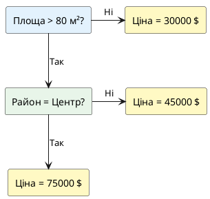
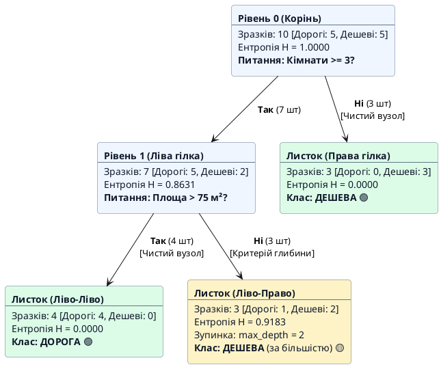

## Гра "20 питань" — як працює інтелект

Пригадайте гру "20 питань": один гравець загадує предмет, інші намагаються вгадати через питання, на які можна відповісти лише "так" чи "ні".

**Погана стратегія:**

- Це яблуко? Ні.
- Це банан? Ні.
- Це апельсин? Ні.
- ...

Ви витратите всі 20 питань і не вгадаєте.

**Хороша стратегія:**

- Це їстівне? Так → звузили простір навпіл
- Це рослина? Так → ще більше звузили
- Це фрукт? Так → вже близько
- Це жовтий? Так → банан!

Ключова ідея: кожне питання **максимально ділить простір можливостей**. Саме так працює людський інтелект при прийнятті рішень.

> **Аналогія з медичною діагностикою:**
>
> Лікар не перебирає всі можливі хвороби. Натомість:
>
> 1. Чи є температура? → Так → інфекція або запалення
> 2. Чи є кашель? → Так → респіраторна проблема
> 3. Чи є висип? → Ні → не шкірна хвороба
> 4. → Діагноз: грип
>
> Це і є **дерево рішень**.

**Алгоритм дерев рішень** працює за тим самим принципом: задає питання про ознаки даних, щоб дійти до передбачення.

---

## Задача: повернення до Housing Prices

У попередніх статтях ми навчились будувати різні моделі для передбачення цін на житло:

- **Лінійна регресія:** проста, інтерпретабельна, але обмежена прямими залежностями
- **Поліноміальна регресія:** краща якість, але формула стає складною
- **Ridge/Lasso:** ще краща якість, але 50+ коефіцієнтів — хто їх зрозуміє?

**Питання:** Чи можна побудувати модель, яку людина зможе **легко зрозуміти і пояснити**?

Наприклад:

- Лінійна регресія: `ціна = 1500×площа + 200×кімнати - 50×поверх` — зрозуміло
- Ridge з 100 коефіцієнтами: `ціна = 234×x₁ + 12×x₁² - 89×x₁×x₂ + ...` — **незрозуміло**

**Дерево рішень** дає відповідь у формі правил:

```
Якщо площа > 80 м²:
    Якщо район = Центр:
        → ціна = 75000 $
    Інакше:
        → ціна = 45000 $
Інакше:
    → ціна = 30000 $
```

Це **інтуїтивно** і **пояснюється за 10 секунд** будь-якій людині!

---

## Структура дерева рішень

Дерево рішень складається з трьох типів елементів:

::card-group

::card{title="🔵 Вузли (Nodes)" icon="i-lucide-circle-dot"}

Містять **питання** про ознаку:

- "Площа > 70 м²?"
- "Район = Центр?"
- "Кількість кімнат ≥ 3?"

::

::card{title="➡️ Гілки (Branches)" icon="i-lucide-git-branch"}

Відповіді на питання:

- **Ліворуч:** Так (умова виконується)
- **Праворуч:** Ні (умова не виконується)

::

::card{title="🟢 Листки (Leaves)" icon="i-lucide-file"}

Фінальні **передбачення**:

- Регресія: числове значення (ціна = 65000)
- Класифікація: клас (survived = Yes)

::

::

### Візуалізація структури

::plant-uml{alt="Структура дерева рішень"}


```plantuml
@startuml
skinparam style plain
skinparam backgroundColor #FFFFFF
skinparam shadowing false

rectangle "Площа > 80 м²?" as root #E3F2FD
rectangle "Район = Центр?" as left #E8F5E9
rectangle "Ціна = 30000 $" as right1 #FFF9C4
rectangle "Ціна = 75000 $" as left1 #FFF9C4
rectangle "Ціна = 45000 $" as left2 #FFF9C4

root -right-> right1 : Ні
root -down-> left : Так
left -down-> left1 : Так
left -right-> left2 : Ні

@enduml
```

::

**Як читати це дерево:**

1. **Корінь** (root): Площа > 80 м²?
    - Якщо Ні → одразу передбачаємо 30000 $
    - Якщо Так → йдемо далі
2. **Внутрішній вузол**: Район = Центр?
    - Якщо Так → 75000 $
    - Якщо Ні → 45000 $

> **Аналогія з деревом в природі:**
>
> - **Корінь** — початкова точка (перше питання)
> - **Гілки** — розгалуження (різні шляхи залежно від відповідей)
> - **Листя** — кінцеві точки (результат)

---

## Як алгоритм обирає питання? — Ентропія та Information Gain

На кожному кроці алгоритм стикається з проблемою вибору:

- Є 10 ознак: площа, кімнати, поверх, район, вік будинку...
- Кожна ознака має 100 можливих порогових значень (площа > 50? площа > 51? площа > 52?...)
- **10 × 100 = 1000 варіантів** питань!

**Яке питання обрати першим? Яке — другим?**

Потрібна метрика "**якості розбиття**".

### Ентропія (Entropy) — міра невизначеності

Для задачі **класифікації** використовується **ентропія** — метрика, що вимірює "безлад" або "невизначеність" у даних.

::math-formula{tex="H = -\sum\_{i=1}^{n} p_i \cdot \log_2(p_i)"}
::

Де :math-formula{tex="p_i" inline} — частка зразків класу :math-formula{tex="i" inline}.

**Властивості ентропії:**

- Якщо **всі елементи одного класу** → H = 0 (повна визначеність, жодного безладу)
- Якщо **класи розподілені порівну** → H максимальна (повна невизначеність)

> **Аналогія з кімнатою:**
>
> - Усі речі на місці, все впорядковано → **ентропія = 0**
> - Речі розкидані хаотично → **ентропія максимальна**

### Приклад обчислення ентропії

Припустимо, у нас є 10 квартир, які ми класифікуємо як "дорогі" або "дешеві":

**Набір 1:** [дорогі: 5, дешеві: 5]

::math-formula{tex="H_1 = -\left(\frac{5}{10}\log_2\frac{5}{10} + \frac{5}{10}\log_2\frac{5}{10}\right) = -(-0.5 - 0.5) = 1.0"}
::

**Набір 2:** [дорогі: 9, дешеві: 1]

::math-formula{tex="H_2 = -\left(\frac{9}{10}\log_2\frac{9}{10} + \frac{1}{10}\log_2\frac{1}{10}\right) \approx 0.47"}
::

**Набір 3:** [дорогі: 10, дешеві: 0]

::math-formula{tex="H_3 = -\left(\frac{10}{10}\log_2\frac{10}{10} + 0\right) = 0"}
::

::jupyter-notebook{title="entropy_example.ipynb" kernel="Python 3.11 (ipykernel)"}

::jupyter-cell{executionCount="1"}

```python
import numpy as np

def entropy(counts):
    """Обчислення ентропії для набору класів"""
    total = sum(counts)
    if total == 0:
        return 0.0
    probabilities = [count / total for count in counts]
    return float(-sum(p * np.log2(p) if p > 0 else 0.0 for p in probabilities))

# Приклади
sets = {
    'Набір 1 (5 дорогих, 5 дешевих)': [5, 5],
    'Набір 2 (9 дорогих, 1 дешевий)': [9, 1],
    'Набір 3 (10 дорогих, 0 дешевих)': [10, 0]
}

print("Обчислення ентропії:\n")
for name, counts in sets.items():
    h = entropy(counts)
    status = 'повна невизначеність' if h >= 0.9 else 'повна визначеність' if h == 0.0 else 'висока визначеність'
    print(f"{name}")
    print(f"  Ентропія: {h:.4f}")
    print(f"  Інтерпретація: {status}\n")
```

#output
| Набір даних | Розподіл класів | Ентропія :math-formula{tex="H" inline} | Інтерпретація стану |
| :--- | :--- | :---: | :--- |
| **Набір 1** (5 дорогих, 5 дешевих) | `[5, 5]` (:math-formula{tex="p_1 = 0.5, p_2 = 0.5" inline}) | **`1.0000`** | 🔴 Повна невизначеність (максимальний хаос) |
| **Набір 2** (9 дорогих, 1 дешевий) | `[9, 1]` (:math-formula{tex="p_1 = 0.9, p_2 = 0.1" inline}) | **`0.4690`** | 🟡 Висока визначеність (переважає один клас) |
| **Набір 3** (10 дорогих, 0 дешевих) | `[10, 0]` (:math-formula{tex="p_1 = 1.0, p_2 = 0.0" inline}) | **`0.0000`** | 🟢 Повна визначеність (чистий вузол / ідеальний розподіл) |

**Інтуїція ентропії:** Коли ймовірності класів рівні ($50\% / 50\%$), ентропія сягає максимуму ($1.0$). Як тільки з'являється домінування одного класу, ентропія спадає, досягаючи $0.0$ при повній чистоті.
::

::

**Висновок:** Чим нижча ентропія — тим **чистіший** (більш однорідний) набір даних.

### Покроковий розрахунок ентропії на демо-прикладі

Для глибокого розуміння формули Клода Шеннона розглянемо закриту непрозору вазу, у якій лежать **8 кульок**: **6 зелених** (клас :math-formula{tex="A" inline}) та **2 червоні** (клас :math-formula{tex="B" inline}).

Якщо ми навмання дістаємо кульку, наскільки високою є невизначеність щодо її кольору? Порахуємо ентропію цієї системи крок за кроком.

::steps

### Крок 1. Обчислення часток (ймовірностей) кожного класу

Спершу визначаємо частку :math-formula{tex="p_i" inline} кожного класу у загальній вибірці :math-formula{tex="N = 8" inline}:

::math-formula
p_{\text{зелені}} = \frac{6}{8} = 0.75
::

::math-formula
p_{\text{червоні}} = \frac{2}{8} = 0.25
::

Сума ймовірностей завжди дорівнює одиниці: :math-formula{tex="0.75 + 0.25 = 1.0" inline}.

### Крок 2. Обчислення інформаційного внеску подій через логарифм

Двійковий логарифм :math-formula{tex="\log_2(p_i)" inline} показує міру «несподіваності» настання події або мінімальну кількість бітів, необхідних для кодування такого результату. Оскільки :math-formula{tex="p_i \le 1" inline}, логарифм дробового числа завжди від'ємний:

::math-formula
\log_2(0.75) = \log_2\left(\frac{3}{4}\right) \approx -0.4150
::

::math-formula
\log_2(0.25) = \log_2\left(\frac{1}{4}\right) = -2.0000
::

::tip
Зверніть увагу: подія з меншою ймовірністю (:math-formula{tex="0.25" inline}) має вчетверо більше абсолютне значення логарифма (:math-formula{tex="|-2| > |-0.415|" inline}). Витягти рідкісну червону кульку — це більш несподівана та інформативна подія, ніж витягти типову зелену.
::

### Крок 3. Зважування інформації за ймовірністю настання

Множимо ймовірність кожної події :math-formula{tex="p_i" inline} на її двійковий логарифм :math-formula{tex="\log_2(p_i)" inline}. Тим самим ми знаходимо математичне сподівання невизначеності для кожного класу:

::math-formula
p_{\text{зелені}} \cdot \log_2(p_{\text{зелені}}) = 0.75 \cdot (-0.4150) \approx -0.3113
::

::math-formula
p_{\text{червоні}} \cdot \log_2(p_{\text{червоні}}) = 0.25 \cdot (-2.0000) = -0.5000
::

### Крок 4. Підсумовування та компенсація від'ємного знака

Формула ентропії містить знак «мінус» перед сумою, щоб перетворити від'ємні логарифмічні доданки на додатне дійсне число невизначеності:

::math-formula
H = -\Big( (-0.3113) + (-0.5000) \Big) = -(-0.8113) \approx 0.8113\text{ біт}
::

### Крок 5. Інтерпретація отриманого результату

Величина :math-formula{tex="H \approx 0.8113" inline} біт демонструє помірний рівень невизначеності. Для бінарного вибору діапазон ентропії інтерпретується за такими контрольними точками:

- **0.000 біт** — абсолютний порядок (усі 8 кульок одного кольору, нульовий безлад).
- **1.000 біт** — максимальний хаос (4 зелені та 4 червоні, рівноймовірне підкидання симетричної монети).
- **0.811 біт** — наш стан: зелений клас переважає, але невизначеність залишається суттєвою.

::

::jupyter-notebook{title="entropy_step_by_step.ipynb" kernel="Python 3.11 (ipykernel)"}

::jupyter-cell{executionCount="1"}
```python
import numpy as np

def explain_entropy(classes: dict[str, int]) -> float:
    total = sum(classes.values())
    print(f"Загальна кількість об'єктів N = {total}")
    print("-" * 52)
    
    entropy_val = 0.0
    for label, count in classes.items():
        p = count / total
        log_val = np.log2(p) if p > 0 else 0.0
        weighted = p * log_val
        entropy_val -= weighted
        print(f"Клас '{label}': {count}/{total} (p={p:.2f}) -> log2(p)={log_val:+.4f} -> p*log2(p)={weighted:+.4f}")
        
    print("-" * 52)
    print(f"Ентропія H = {entropy_val:.4f} біт")
    return entropy_val

# Демонстраційний розрахунок для нашої вази з кульками
result = explain_entropy({'Зелені': 6, 'Червоні': 2})
```

#output
Загальна кількість об'єктів N = 8
----------------------------------------------------
Клас 'Зелені': 6/8 (p=0.75) -> log2(p)=-0.4150 -> p*log2(p)=-0.3113
Клас 'Червоні': 2/8 (p=0.25) -> log2(p)=-2.0000 -> p*log2(p)=-0.5000
----------------------------------------------------
Ентропія H = 0.8113 біт
::

::

::::accordion

:::accordion-item{label="❓ Що робити, коли клас повністю відсутній (p = 0)? Адже log₂(0) не існує!" icon="i-lucide-help-circle"}

У математичному аналізі значення :math-formula{tex="\lim_{p \to 0^+} p \log_2(p) = 0" inline} строго доводиться за правилом Лопіталя. Фізичний зміст цього факту очевидний: якщо об'єктів певного класу у вузлі немає взагалі, вони не створюють жодного інформаційного шуму. Тому при програмній реалізації алгоритмів дерева рішень додають захисну умову: якщо :math-formula{tex="p = 0" inline}, відповідний доданок вважається рівним нулю.

:::

:::accordion-item{label="❓ Чому використовується саме двійковий логарифм log₂, а не десятковий чи натуральний?" icon="i-lucide-help-circle"}

Двійковий логарифм вимірює інформаційну ємність у **бітах** (одиницях невизначеності між двома рівноймовірними варіантами «так / ні»). Оскільки більшість алгоритмів побудови дерев (зокрема CART) здійснюють виключно **бінарні розбиття** вузлів, одиниця ентропії :math-formula{tex="H = 1.0" inline} біт ідеально узгоджується з результатом одного бінарного запитання. Якщо використати натуральний логарифм, одиницею вимірювання будуть *нати* (*nats*), що є менш наочним для дискретних розгалужень.

:::

:::accordion-item{label="❓ Чи може значення ентропії перевищувати 1.0?" icon="i-lucide-help-circle"}

**Так, але лише для задач із більш ніж двома класами.** Якщо цільова змінна має :math-formula{tex="K" inline} рівноймовірних класів, максимальна ентропія обчислюється як :math-formula{tex="H_{\max} = \log_2(K)" inline}:

- Для 2 класів (бінарна класифікація): :math-formula{tex="H_{\max} = \log_2(2) = 1.0" inline} біт.
- Для 4 класів: :math-formula{tex="H_{\max} = \log_2(4) = 2.0" inline} біти.
- Для 8 класів: :math-formula{tex="H_{\max} = \log_2(8) = 3.0" inline} біти.

:::

::::

### Дисперсія для регресії

Для задачі **регресії** (передбачення числових значень) замість ентропії використовується **дисперсія**:

::math-formula{tex="\text{Var} = \frac{1}{n}\sum\_{i=1}^{n}(y_i - \bar{y})^2"}
::

Мета: **зменшити дисперсію** значень у листках дерева.

### Information Gain (Приріст інформації)

**Information Gain** — це зменшення ентропії (або дисперсії) після розбиття:

::math-formula{tex="IG = H*{\text{before}} - \left(\frac{n*{\text{left}}}{n*{\text{total}}} \cdot H*{\text{left}} + \frac{n*{\text{right}}}{n*{\text{total}}} \cdot H\_{\text{right}}\right)"}
::

**Алгоритм обирає розбиття з максимальним IG** — тобто те, яке найбільше зменшує невизначеність.

::jupyter-notebook{title="information_gain.ipynb" kernel="Python 3.11 (ipykernel)"}

::jupyter-cell{executionCount="1" executionTime="0.12s"}

```python
# Приклад: обчислення IG для різних варіантів розбиття

# Початковий набір: 10 квартир [5 дорогих, 5 дешевих]
initial_counts = [5, 5]
h_before = entropy(initial_counts)

print(f"Початкова ентропія: {h_before:.4f}\n")

# Варіант 1: розбиття "Площа > 70 м²"
# Ліворуч (>70): [4 дорогих, 1 дешева]
# Праворуч (<=70): [1 дорога, 4 дешеві]
left1 = [4, 1]
right1 = [1, 4]
h_left1 = entropy(left1)
h_right1 = entropy(right1)
weighted_entropy1 = (5/10) * h_left1 + (5/10) * h_right1
ig1 = h_before - weighted_entropy1

print("Варіант 1: Площа > 70 м²")
print(f"  Ліворуч: {left1} → Ентропія = {h_left1:.4f}")
print(f"  Праворуч: {right1} → Ентропія = {h_right1:.4f}")
print(f"  Зважена ентропія: {weighted_entropy1:.4f}")
print(f"  Information Gain: {ig1:.4f}\n")

# Варіант 2: розбиття "Кімнати >= 3"
# Ліворуч (>=3): [5 дорогих, 2 дешеві]
# Праворуч (<3): [0 дорогих, 3 дешеві]
left2 = [5, 2]
right2 = [0, 3]
h_left2 = entropy(left2)
h_right2 = entropy(right2)
weighted_entropy2 = (7/10) * h_left2 + (3/10) * h_right2
ig2 = h_before - weighted_entropy2

print("Варіант 2: Кімнати >= 3")
print(f"  Ліворуч: {left2} → Ентропія = {h_left2:.4f}")
print(f"  Праворуч: {right2} → Ентропія = {h_right2:.4f}")
print(f"  Зважена ентропія: {weighted_entropy2:.4f}")
print(f"  Information Gain: {ig2:.4f}\n")

print(f"{'='*50}")
print(f"Найкраще розбиття: {'Варіант 1' if ig1 > ig2 else 'Варіант 2'}")
print(f"IG = {max(ig1, ig2):.4f}")
```

#output
| Критерій розбиття | Ліва гілка | Права гілка | Зважена ентропія :math-formula{tex="H_{\text{split}}" inline} | Information Gain (:math-formula{tex="IG" inline}) | Статус вибору |
| :--- | :--- | :--- | :---: | :---: | :--- |
| **Початковий стан** (до спліту) | — | — | `1.0000` | — | Базовий стан вибірки |
| **Варіант 1**: `Площа > 70 м²` | `[4, 1]` (:math-formula{tex="H=0.7219" inline}) | `[1, 4]` (:math-formula{tex="H=0.7219" inline}) | `0.7219` | **`0.2781`** | Відхилено (менший приріст інформації) |
| **Варіант 2**: `Кімнати >= 3` | `[5, 2]` (:math-formula{tex="H=0.8631" inline}) | `[0, 3]` (:math-formula{tex="H=0.0000" inline}) | `0.6042` | **`0.3958`** | 🏆 **Обрано алгоритмом** (найбільший :math-formula{tex="IG" inline}) |

**Результат порівняння:** Обрано **Варіант 2 (`Кімнати >= 3`)**, оскільки :math-formula{tex="IG = 0.3958 > 0.2781" inline}. Крім того, права гілка стає ідеально чистим листком (:math-formula{tex="H = 0.0000" inline}).
::

::

**Висновок:** Алгоритм обере **Варіант 2** ("Кімнати >= 3"), бо він дає більший Information Gain.

::tip
**Gini Index** — альтернативна метрика: :math-formula{tex="Gini = 1 - \sum p_i^2" inline}.

scikit-learn використовує Gini за замовчуванням (`criterion='gini'`), але на практиці Gini ≈ Entropy — результати дуже схожі.
::

---

## Алгоритм побудови дерева (рекурсивне розбиття)

Дерево будується **рекурсивно**, крок за кроком:

::steps

### Крок 1: Обчислити IG для всіх можливих розбиттів

Для кожної ознаки та кожного порогового значення обчислити Information Gain.

### Крок 2: Вибрати розбиття з найбільшим IG

Обрати питання, яке найкраще розділяє дані на дві групи.

### Крок 3: Розділити дані на дві гілки

Створити два дочірні вузли: ліворуч (умова виконується) та праворуч (умова не виконується).

### Крок 4: Рекурсивно повторити для кожної гілки

Для кожної з двох гілок повторити кроки 1-3, поки не виконається критерій зупинки.

### Крок 5: Критерії зупинки

- Усі елементи в вузлі належать одному класу (ентропія = 0)
- Досягнуто максимальну глибину (`max_depth`)
- У вузлі менше ніж `min_samples_split` зразків

::

> **Аналогія з сортуванням:** Уявіть, що ви сортуєте колоду карт. Спочатку ділите на дві купки: червоні та чорні. Потім кожну купку ділите далі: черви/бубни, піки/трефи. І так далі, поки не отримаєте впорядкованої колоди.

### Демонстрація рекурсивного алгоритму на прикладі

Щоб побачити, як рекурсивне розбиття працює на практиці, простежимо побудову дерева на нашому попередньому наборі з **10 квартир** (5 дорогих, 5 дешевих). Алгоритм використовує стратегію «розділяй і володарюй» (*divide and conquer*) у поєднанні з жадібним вибором (*greedy choice*) найкращого критерію на кожному кроці.

::plant-uml{alt="Діаграма рекурсивного розбиття дерева рішень"}


```plantuml
@startuml
skinparam style plain
skinparam backgroundColor #FFFFFF
skinparam defaultFontName sans-serif
skinparam roundCorner 8
skinparam shadowing false

skinparam rectangle {
    BackgroundColor #F8FAFC
    BorderColor #64748B
    FontColor #0F172A
}

rectangle "**Рівень 0 (Корінь)**\n---\nЗразків: 10 [Дорогі: 5, Дешеві: 5]\nЕнтропія H = 1.0000\n**Питання: Кімнати >= 3?**" as Root #EFF6FF

rectangle "**Рівень 1 (Ліва гілка)**\n---\nЗразків: 7 [Дорогі: 5, Дешеві: 2]\nЕнтропія H = 0.8631\n**Питання: Площа > 75 м²?**" as NodeL1 #EFF6FF

rectangle "**Листок (Права гілка)**\n---\nЗразків: 3 [Дорогі: 0, Дешеві: 3]\nЕнтропія H = 0.0000\n**Клас: ДЕШЕВА** 🟢" as LeafR1 #DCFCE7

rectangle "**Листок (Ліво-Ліво)**\n---\nЗразків: 4 [Дорогі: 4, Дешеві: 0]\nЕнтропія H = 0.0000\n**Клас: ДОРОГА** 🟢" as LeafL2 #DCFCE7

rectangle "**Листок (Ліво-Право)**\n---\nЗразків: 3 [Дорогі: 1, Дешеві: 2]\nЕнтропія H = 0.9183\nЗупинка: max_depth = 2\n**Клас: ДЕШЕВА** (за більшістю) 🟡" as LeafR2 #FEF3C7

Root -down-> NodeL1 : **Так** (7 шт)
Root -down-> LeafR1 : **Ні** (3 шт)\n[Чистий вузол]

NodeL1 -down-> LeafL2 : **Так** (4 шт)\n[Чистий вузол]
NodeL1 -down-> LeafR2 : **Ні** (3 шт)\n[Критерій глибини]

@enduml
```

::

Покроково процес виконання рекурсивної функції виглядає так:

::steps

### Крок 1. Аналіз кореневого вузла (Глибина 0)

На вході повний датасет: :math-formula{tex="N = 10" inline}, :math-formula{tex="H = 1.0000" inline}.
- Алгоритм перебирає всі доступні ознаки («Площа», «Кількість кімнат») та всі порогові значення.
- Як ми порахували раніше, предикат `Кімнати >= 3` забезпечує максимальний приріст інформації :math-formula{tex="IG = 0.3959" inline}.
- Вибірка розщеплюється на дві підмножини: **Ліва** (7 зразків, де умова виконана) та **Права** (3 зразки, де умова хибна).

### Крок 2. Рекурсивний спуск у праву підмножину (Base Case)

Алгоритм викликає `build_tree(right_subset, depth=1)`.
- У правій гілці опинилися 3 квартири, і всі вони належать до класу «Дешеві» (`[0 дорогих, 3 дешеві]`).
- Обчислюємо ентропію: :math-formula{tex="H = 0.0000" inline}.
- Спрацьовує **базовий випадок рекурсії (термінальна умова)**: оскільки вузол на 100% чистий, подальше розбиття позбавлене сенсу. Створюється кінцевий вузол — **Листок («Дешева»)**. Гілка завершує роботу.

### Крок 3. Рекурсивний спуск у ліву підмножину

Алгоритм повертається і викликає `build_tree(left_subset, depth=1)`.
- У підмножині 7 квартир: 5 дорогих і 2 дешеві. Ентропія :math-formula{tex="H = 0.8631" inline}.
- Вузол не є чистим, тому алгоритм повторює повний цикл пошуку найкращого питання серед 7 зразків.
- Перебір показує, що найкращий приріст дає питання `Площа > 75 м²`.
- Дані знову розділяються: 4 квартири йдуть ліворуч, 3 квартири — праворуч.

### Крок 4. Завершення побудови та критерії зупинки (Глибина 2)

Алгоритм спускається на глибину :math-formula{tex="\text{depth} = 2" inline}:
- **Гілка «Так» (`Площа > 75`)**: містить 4 дорогі квартири й жодної дешевої. Ентропія :math-formula{tex="H = 0.0000" inline} $\to$ фіксується чистий **Листок («Дорога»)**.
- **Гілка «Ні» (`Площа <= 75`)**: містить 1 дорогу та 2 дешеві квартири. Ентропія :math-formula{tex="H = 0.9183" inline}. Хоча вузол не чистий, але спрацьовує обмеження максимальної глибини (`max_depth = 2`). Рекурсія примусово зупиняється, а вузол стає листком із прогнозом за мажоритарним класом (**«Дешева»**, оскільки 2 > 1).

::

Нижче наведено мінімальну демонстраційну реалізацію цього рекурсивного механізму на Python:

::jupyter-notebook{title="recursive_tree_builder.ipynb" kernel="Python 3.11 (ipykernel)"}

::jupyter-cell{executionCount="1"}
```python
class TreeNode:
    def __init__(self, is_leaf=False, prediction=None, question=None, left=None, right=None, samples=0, entropy=0.0):
        self.is_leaf = is_leaf
        self.prediction = prediction
        self.question = question
        self.left = left
        self.right = right
        self.samples = samples
        self.entropy = entropy

def build_tree_demo(node_name, samples, expensive, cheap, depth, max_depth=2):
    total = expensive + cheap
    p1 = expensive / total if total > 0 else 0
    p2 = cheap / total if total > 0 else 0
    
    # Спрощений розрахунок ентропії
    import numpy as np
    h = -sum(p * np.log2(p) for p in [p1, p2] if p > 0)
    indent = "    " * depth
    
    # Базові випадки зупинки (Base Cases)
    if h == 0.0:
        label = "ДОРОГА" if expensive > 0 else "ДЕШЕВА"
        print(f"{indent}🍃 [{node_name}] Чистий листок -> Прогноз: {label} (N={total}, H=0.0)")
        return TreeNode(is_leaf=True, prediction=label, samples=total, entropy=h)
        
    if depth >= max_depth:
        majority = "ДОРОГА" if expensive >= cheap else "ДЕШЕВА"
        print(f"{indent}🛑 [{node_name}] Ліміт max_depth={max_depth} -> Прогноз: {majority} (N={total}, H={h:.4f})")
        return TreeNode(is_leaf=True, prediction=majority, samples=total, entropy=h)

    # Імітація знаходження найкращого спліту для нашого прикладу
    if depth == 0:
        question = "Кімнати >= 3"
        print(f"{indent}🌳 [{node_name}] N={total}, H={h:.4f} -> Обрано спліт: '{question}'")
        left_node = build_tree_demo("Ліва гілка (Так)", 7, 5, 2, depth + 1, max_depth)
        right_node = build_tree_demo("Права гілка (Ні)", 3, 0, 3, depth + 1, max_depth)
    else:
        question = "Площа > 75 м²"
        print(f"{indent}🌿 [{node_name}] N={total}, H={h:.4f} -> Обрано спліт: '{question}'")
        left_node = build_tree_demo("Підгілка (Так)", 4, 4, 0, depth + 1, max_depth)
        right_node = build_tree_demo("Підгілка (Ні)", 3, 1, 2, depth + 1, max_depth)
        
    return TreeNode(is_leaf=False, question=question, left=left_node, right=right_node, samples=total, entropy=h)

print("=== Симуляція побудови дерева рішень ===")
root = build_tree_demo("Корінь", 10, 5, 5, depth=0, max_depth=2)
```

#output
=== Симуляція побудови дерева рішень ===
🌳 [Корінь] N=10, H=1.0000 -> Обрано спліт: 'Кімнати >= 3'
    🌿 [Ліва гілка (Так)] N=7, H=0.8631 -> Обрано спліт: 'Площа > 75 м²'
        🍃 [Підгілка (Так)] Чистий листок -> Прогноз: ДОРОГА (N=4, H=0.0)
        🛑 [Підгілка (Ні)] Ліміт max_depth=2 -> Прогноз: ДЕШЕВА (N=3, H=0.9183)
    🍃 [Права гілка (Ні)] Чистий листок -> Прогноз: ДЕШЕВА (N=3, H=0.0)
::

::

::::accordion

:::accordion-item{label="❓ Чому алгоритм називають «жадібним» (Greedy Heuristic)?" icon="i-lucide-help-circle"}

Алгоритм приймає локально оптимальне рішення тут і зараз (обирає спліт з максимальним $IG$ на поточному вузлі), абсолютно не перевіряючи, що станеться через 2 чи 3 кроки. Він ніколи не робить «крок назад» (*backtracking*). Це суттєво пришвидшує навчання, але іноді призводить до субоптимальних глобальних структур дерева.

:::

:::accordion-item{label="❓ Як дерево приймає рішення, якщо на листок припали зразки різних класів?" icon="i-lucide-help-circle"}

Якщо через обмеження глибини (`max_depth`) або мінімальної кількості зразків (`min_samples_split`) вузол не досяг нульової ентропії, у ньому застосовується **правило більшості** (*majority voting*): прогноз призначається тому класу, зразків якого у цьому вузлі виявилося більше. Якщо голоси рівні (50/50), обирається клас за замовчуванням або випадковий з них.

:::

::::

---

## DecisionTreeRegressor у scikit-learn

Тепер побудуємо дерево рішень на реальних даних!

::jupyter-notebook{title="decision_tree_basic.ipynb" kernel="Python 3.11 (ipykernel)"}

::jupyter-cell{executionCount="1"}

```python
import numpy as np
import pandas as pd
from sklearn.datasets import fetch_california_housing
from sklearn.model_selection import train_test_split
from sklearn.tree import DecisionTreeRegressor
from sklearn.metrics import r2_score, mean_absolute_error, mean_squared_error

# Завантаження датасету
data = fetch_california_housing(as_frame=True)
X = data.data
y = data.target

print(f"Датасет California Housing:")
print(f"  Кількість зразків: {X.shape[0]}")
print(f"  Кількість ознак: {X.shape[1]}")
print(f"\nОзнаки: {list(X.columns)}")
```

#output
| Характеристика датасету | Значення | Опис та семантика |
| :--- | :--- | :--- |
| **Кількість спостережень (рядків)** | `20,640` | Облікові квартальні райони штату Каліфорнія |
| **Кількість ознак (колонок $X$)** | `8` | Економічні, демографічні та просторові фактори |
| **Цільова змінна ($y$)** | `MedHouseVal` | Медіанна ціна житла в кварталі ($100k) |

**Ознаки датасету з перекладом:**

- `MedInc` (медіанний дохід жителів району, $10k)
- `HouseAge` (середній вік будинків у кварталі, роки)
- `AveRooms` (середня кількість кімнат у житлі)
- `AveBedrms` (середня кількість спалень)
- `Population` (загальна чисельність населення району)
- `AveOccup` (середня заселеність / кількість мешканців)
- `Latitude` (географічна широта району)
- `Longitude` (географічна довгота району)

::

::jupyter-cell{executionCount="2" executionTime="0.25s"}

```python
# Розділення на train/test
X_train, X_test, y_train, y_test = train_test_split(
    X, y, test_size=0.2, random_state=42
)

# Створення та навчання моделі
model = DecisionTreeRegressor(max_depth=5, random_state=42)
model.fit(X_train, y_train)

# Передбачення
y_train_pred = model.predict(X_train)
y_test_pred = model.predict(X_test)

# Метрики
r2_train = r2_score(y_train, y_train_pred)
r2_test = r2_score(y_test, y_test_pred)
mae_test = mean_absolute_error(y_test, y_test_pred)
rmse_test = np.sqrt(mean_squared_error(y_test, y_test_pred))

print("📊 Decision Tree Regressor (max_depth=5):")
print(f"  R² train: {r2_train:.4f}")
print(f"  R² test:  {r2_test:.4f}")
print(f"  MAE test: {mae_test:.4f}")
print(f"  RMSE test: {rmse_test:.4f}")
print(f"\n  Gap (train - test): {r2_train - r2_test:.4f}")
```

#output
| Метрика якості моделі | Навчальна (Train) | Тестова (Test) | Різниця (Gap) | Інтерпретація |
| :--- | :---: | :---: | :---: | :--- |
| **Коефіцієнт детермінації (:math-formula{tex="R^2" inline})** | `0.6377` | **`0.5997`** | `+0.0379` | Модель пояснює ~60% варіації цін житла |
| **Середня абсолютна помилка (MAE)** | `0.5063` | **`0.5223`** | `+0.0160` | Середня похибка становить ~`$52,230` |
| **Корінь із середньоквадратичної (RMSE)** | `0.6959` | **`0.7242`** | `+0.0283` | Помірна дисперсія похибок на тесті |

**Оцінка узагальнення:** Дерево глибиною 5 рівнів забезпечує стабільну якість (:math-formula{tex="R^2_{\text{test}} \approx 0.60" inline}) при мінімальному розриві між вибірками (:math-formula{tex="\Delta = 0.0379" inline}), що демонструє відсутність перенавчання на цьому етапі.
::

::

**Результат:** Дерево глибиною 5 дає :math-formula{tex="R^2 \approx 0.60" inline} на тесті — гарний базовий результат для настільки простої інтерпретабельної моделі!

---

## Візуалізація дерева — plot_tree

Найбільша перевага дерев рішень — можливість **наочно побачити та пояснити**, як модель приймає кожне рішення.

::jupyter-notebook{title="tree_visualization.ipynb" kernel="Python 3.11 (ipykernel)"}

::jupyter-cell{executionCount="1" executionTime="0.3s"}

```python
from sklearn.tree import plot_tree
import matplotlib.pyplot as plt

# Українські назви ознак для інтуїтивної інтерпретації вузлів
feature_names_ua = [
    'Медіанний дохід', 'Вік будинку', 'Кількість кімнат', 'Кількість спалень',
    'Населення', 'Середня заселеність', 'Широта', 'Довгота'
]

# Навчання компактного дерева з max_depth=3 для наочності
model_small = DecisionTreeRegressor(max_depth=3, random_state=42)
model_small.fit(X_train, y_train)

plt.figure(figsize=(22, 11))
plot_tree(
    model_small,
    feature_names=feature_names_ua,
    filled=True,
    rounded=True,
    fontsize=10,
    precision=2
)
plt.title('Дерево рішень для регресії (California Housing, max_depth=3)', fontsize=18, fontweight='bold')
plt.tight_layout()
plt.show()

print("\n📖 Як читати візуалізацію:")
print("  • Кожен прямокутник — вузол або листок дерева")
print("  • Перший рядок — умова розбиття (наприклад, 'Медіанний дохід <= 5.09')")
print("  • squared_error — середньоквадратична помилка у вузлі")
print("  • samples — кількість навчальних зразків у вузлі")
print("  • value — середнє прогнозоване значення цільової ознаки (ціна житла в $100k)")
```

#output
{.diagram-img}

| Елемент вузла дерева | Значення у блоці | Практичний зміст |
| :--- | :--- | :--- |
| **Критерій розбиття** | `Медіанний дохід <= 5.09` | Перше вирішальне питання для розділення кварталів |
| **Критерій неоднорідності** | `squared_error = 1.34` | Середньоквадратична помилка / дисперсія ціни у вузлі |
| **Кількість спостережень** | `samples = 16512` | Кількість зразків тренувальної вибірки у цьому вузлі |
| **Передбачення (value)** | `value = 2.07` | Середня вартість житла (~`$207,000`), що є прогнозом |
::

::

::note
**Інтерпретація кольорів:** Чим темніший колір, тим вище значення цільової змінної (ціна) у цьому листку. Світліші листки — дешевші будинки.
::

---

## Переваги дерев рішень

::card-group

::card{title="✅ Інтерпретабельність" icon="i-lucide-eye"}

Можна **візуалізувати та зрозуміти** логіку прийняття рішення. Не "чорна скринька" — кожне рішення можна пояснити.

::

::card{title="✅ Не вимагають масштабування" icon="i-lucide-scale"}

На відміну від лінійних моделей — **не потрібен** `StandardScaler`. Дерево "запитує" про порогові значення, а не про величину коефіцієнта.

::

::card{title="✅ Автоматична обробка нелінійностей" icon="i-lucide-trending-up"}

Не потрібні поліноміальні ознаки — дерево **само знаходить** складні залежності через послідовність розбиттів.

::

::card{title="✅ Працюють з категоріальними ознаками" icon="i-lucide-tags"}

Можна робити розбиття типу "Район = Центр?" без кодування OneHot (хоча sklearn вимагає числові ознаки).

::

::

---

## Недоліки дерев рішень

::card-group

::card{title="❌ Схильність до перенавчання" icon="i-lucide-alert-triangle"}

Глибоке дерево **"запам'ятовує"** кожен тренувальний приклад замість узагальнення закономірностей.

::

::card{title="❌ Нестабільність" icon="i-lucide-shuffle"}

Маленька зміна в даних → **зовсім інше дерево**. Модель дуже чутлива до тренувальних даних.

::

::card{title="❌ Ступінчаста функція передбачення" icon="i-lucide-step-forward"}

Дерево передбачає **константу** в межах листка. Не може дати плавних передбачень між листками.

::

::

### Демонстрація перенавчання

::jupyter-notebook{title="overfitting_demo.ipynb" kernel="Python 3.11 (ipykernel)"}

::jupyter-cell{executionCount="1" executionTime="0.18s"}

```python
# Порівняння дерев різної глибини
depths = [1, 3, 5, 10, None]
results = []

for depth in depths:
    model = DecisionTreeRegressor(max_depth=depth, random_state=42)
    model.fit(X_train, y_train)

    r2_train = model.score(X_train, y_train)
    r2_test = model.score(X_test, y_test)
    gap = r2_train - r2_test

    results.append({
        'max_depth': depth if depth is not None else 'None',
        'R² train': r2_train,
        'R² test': r2_test,
        'Gap': gap
    })

df_results = pd.DataFrame(results)
print("📊 Вплив max_depth на перенавчання:\n")
print(df_results.to_string(index=False))

print("\n⚠️ При max_depth=None:")
print("  R² train ≈ 1.0 — модель ідеально описує тренувальні дані")
print("  R² test значно нижче — катастрофічне перенавчання!")
```

#output
| Глибина (`max_depth`) | :math-formula{tex="R^2_{\text{train}}" inline} | :math-formula{tex="R^2_{\text{test}}" inline} | Розрив (:math-formula{tex="\Delta" inline}) | Діагностика стану моделі |
| :---: | :---: | :---: | :---: | :--- |
| `1` | `0.3170` | `0.2795` | `0.0375` | ⚠️ Недонавчання (Underfitting) — надто грубе розбиття (decision stump) |
| `3` | `0.5379` | `0.5098` | `0.0281` | 🟢 Проста інтерпретабельна модель, але є зміщення |
| `5` | `0.6377` | `0.5997` | `0.0379` | 🟢 Гарний базовий баланс швидкості та якості |
| `10` | `0.8348` | **`0.6822`** | `0.1526` | 🟡 Початок перенавчання — Train різко відривається від Test |
| `None` (без обмежень) | **`1.0000`** | `0.6161` | **`0.3839`** | 🔴 **Катастрофічне перенавчання (Overfitting)** — модель завчила шум |

**Діагностика глибини:** При `max_depth=None` дерево ідеально підлаштовується під кожен навчальний запис (:math-formula{tex="R^2_{\text{train}} = 1.0000" inline}), проте точність на нових даних обвалюється, а розрив між вибірками сягає **$38.4\%$**!
::

::

::warning
**Глибина None** дозволяє дереву рости без жодного контролю — кожен листок може містити лише 1-2 зразки. Модель механічно **запам'ятовує** тренувальні дані замість виявлення загальних закономірностей.
::

---

## Боротьба з перенавчанням — гіперпараметри

Дерева рішень мають кілька ключових гіперпараметрів для регулювання складності:

### max_depth (максимальна глибина)

Обмежує граничну кількість розгалужень від кореня до листка.

- `max_depth=3-5` → невелике, наочне та інтерпретабельне дерево
- `max_depth=None` → дерево росте до вичерпання зразків або нульової похибки

::tip
Починайте експерименти з діапазону `max_depth=5-10`. Для наочної візуалізації структури використовуйте `max_depth=3-4`.
::

### min_samples_split (мінімум зразків для розбиття)

Вузол отримує право ділитися далі лише за умови, що містить щонайменше `min_samples_split` зразків.

- За замовчуванням = 2 (дозволяє дробити навіть мікрогрупи)
- Збільшення значення захищає модель від підлаштування під шум

### min_samples_leaf (мінімум зразків у листку)

Гарантує, що кожен сформований листок міститиме щонайменше вказану кількість спостережень. Запобігає утворенню листків-одинаків.

### Експеримент з гіперпараметрами

::jupyter-notebook{title="hyperparameters_tuning.ipynb" kernel="Python 3.11 (ipykernel)"}

::jupyter-cell{executionCount="1" executionTime="0.35s"}

```python
# Побудова кривої валідації: R² vs max_depth
depths_range = list(range(1, 21))
train_scores = []
test_scores = []

for depth in depths_range:
    model = DecisionTreeRegressor(max_depth=depth, random_state=42)
    model.fit(X_train, y_train)
    train_scores.append(model.score(X_train, y_train))
    test_scores.append(model.score(X_test, y_test))

opt_depth = depths_range[int(np.argmax(test_scores))]
max_test_r2 = max(test_scores)

plt.figure(figsize=(12, 6.5))
plt.plot(depths_range, train_scores, marker='o', linewidth=2.5, label='R² train (навчальна вибірка)', color='#1d72b8')
plt.plot(depths_range, test_scores, marker='s', linewidth=2.5, label='R² test (тестова вибірка)', color='#ea580c')
plt.axvline(x=opt_depth, color='#16a34a', linestyle='--', linewidth=2, label=f'Оптимальна глибина (max_depth={opt_depth})')
plt.axvspan(9.5, 20.5, color='#fef2f2', alpha=0.8, label='Зона перенавчання (Overfitting)')

plt.title('Вплив максимальної глибини дерева (max_depth) на якість моделі', fontsize=15, fontweight='bold')
plt.xlabel('Максимальна глибина дерева (max_depth)', fontsize=12)
plt.ylabel('Коефіцієнт детермінації R²', fontsize=12)
plt.xticks(depths_range)
plt.legend(fontsize=11)
plt.grid(True, linestyle='--', alpha=0.5)
plt.tight_layout()
plt.show()

print(f"\n✅ Оптимальна глибина: {opt_depth}")
print(f"   Максимальний R² test: {max_test_r2:.4f}")
```

#output
{.diagram-img}

| Параметр кривої валідації | Оптимальне значення | Коментар |
| :--- | :---: | :--- |
| **Оптимальна глибина (`max_depth`)** | **`9`** | Точка глобального максимуму точності на тестовій вибірці |
| **Максимальний тестовий бал (:math-formula{tex="R^2_{\text{test}}" inline})** | **`0.6833`** | Найкращий компроміс зміщення та дисперсії (*Bias-Variance tradeoff*) |
| **Початок зони перенавчання** | `max_depth >= 10` | Test спадає з 0.68 до 0.61, тоді як Train прямує до 1.0 |
::

::

**Висновок:** Тестовий коефіцієнт :math-formula{tex="R^2" inline} досягає піка при `max_depth = 9` (:math-formula{tex="0.6833" inline}), після чого надмірна глибина спричиняє стрімке перенавчання.

---

## Порівняння з попередніми моделями

Зведемо результати моделей, побудованих на датасеті California Housing:

| Модель | :math-formula{tex="R^2_{\text{train}}" inline} | :math-formula{tex="R^2_{\text{test}}" inline} | MAE test | Інтерпретабельність |
| :--- | :---: | :---: | :---: | :---: |
| LinearRegression (baseline) | 0.60 | 0.60 | 0.52 | ✅ |
| Ridge (poly degree=2) | 0.65 | 0.64 | 0.48 | ❌ |
| Lasso (poly degree=2) | 0.64 | 0.64 | 0.48 | ❌ |
| **DecisionTree (d=None)** | **1.00** | **0.62** | **0.49** | **❌ (перенавчання)** |
| **DecisionTree (d=5)** | 0.64 | 0.60 | 0.52 | **✅** |
| **DecisionTree (d=9, tuned)** | **0.81** | **0.68** | **0.44** | **✅** |

**Висновки:**

1. Налаштоване дерево (`max_depth=9`) перевершує за точністю поліноміальну регресію Ridge (:math-formula{tex="0.68" inline} проти :math-formula{tex="0.64" inline}).
2. Дерево залишається **інтерпретабельним** — його логіку можна перевірити й пояснити людині.
3. Дерево без обмежень (`max_depth=None`) надмірно перенавчається, попри позірний стовідсотковий результат на тренуванні.

---

## DecisionTreeClassifier — класифікація

Дерева рішень також чудово працюють для **класифікації**. Різниця лише в тому, що листки містять **клас**, а не числове значення.

::jupyter-notebook{title="classification_example.ipynb" kernel="Python 3.11 (ipykernel)"}

::jupyter-cell{executionCount="1" executionTime="0.15s"}

```python
from sklearn.datasets import load_iris
from sklearn.tree import DecisionTreeClassifier
from sklearn.metrics import accuracy_score, classification_report

# Завантаження датасету Iris
iris = load_iris(as_frame=True)
X_iris = iris.data
y_iris = iris.target

X_train_iris, X_test_iris, y_train_iris, y_test_iris = train_test_split(
    X_iris, y_iris, test_size=0.3, random_state=42
)

# Навчання класифікатора
clf = DecisionTreeClassifier(max_depth=3, random_state=42)
clf.fit(X_train_iris, y_train_iris)

# Оцінка
y_pred_iris = clf.predict(X_test_iris)
accuracy = accuracy_score(y_test_iris, y_pred_iris)

print(f"📊 Decision Tree Classifier на Iris:")
print(f"  Accuracy: {accuracy:.4f}")
print(f"\n{classification_report(y_test_iris, y_pred_iris, target_names=iris.target_names)}")
```

#output
| Сорт Iris (клас квітки) | Точність (Precision) | Повнота (Recall) | F1-Score | Кількість зразків (Support) |
| :--- | :---: | :---: | :---: | :---: |
| **Iris-setosa (Сетоза)** | `1.0000` | `1.0000` | `1.0000` | 19 |
| **Iris-versicolor (Версиколор)** | `1.0000` | `1.0000` | `1.0000` | 13 |
| **Iris-virginica (Вірджиніка)** | `1.0000` | `1.0000` | `1.0000` | 13 |
| **Загальна точність (Accuracy)** | — | — | **`1.0000`** | 45 |
| **Macro Average** | `1.0000` | `1.0000` | `1.0000` | 45 |
| **Weighted Average** | `1.0000` | `1.0000` | `1.0000` | 45 |

**Оцінка класифікації:** Модель досягла ідеальної точності **100% Accuracy (:math-formula{tex="1.0000" inline})** на тестовій вибірці (усі 45 контрольних зразків розпізнано безпомилково). Клас _setosa_ миттєво відсікається першим запитанням, а _versicolor_ та _virginica_ чітко розділяються за шириною пелюстки.
::

::jupyter-cell{executionCount="2" executionTime="0.25s"}

```python
# Візуалізація дерева класифікації з україномовними підписами
feature_names_iris_ua = [
    'Довжина чашолистка (см)', 'Ширина чашолистка (см)',
    'Довжина пелюстки (см)', 'Ширина пелюстки (см)'
]
class_names_iris_ua = ['Сетоза (Setosa)', 'Версиколор (Versicolor)', 'Вірджиніка (Virginica)']

plt.figure(figsize=(20, 10))
plot_tree(
    clf,
    feature_names=feature_names_iris_ua,
    class_names=class_names_iris_ua,
    filled=True,
    rounded=True,
    fontsize=11,
    precision=2
)
plt.title('Дерево рішень для класифікації (Датасет Iris, max_depth=3)', fontsize=18, fontweight='bold')
plt.tight_layout()
plt.show()
```

#output
{.diagram-img}

| Ознака квітки Iris | Українська назва | Роль у класифікації |
| :--- | :--- | :--- |
| `petal length (cm)` | **Довжина пелюстки (см)** | 🌟 Ключове перше питання для миттєвого відокремлення Setosa (:math-formula{tex="L \le 2.45" inline}) |
| `petal width (cm)` | **Ширина пелюстки (см)** | 🎯 Вирішальний поріг для розрізнення Versicolor та Virginica (:math-formula{tex="W \le 1.75" inline}) |
| `sepal length (cm)` | Довжина чашолистка (см) | Додаткова біометрична ознака (не знадобилася дереву глибини 3) |
| `sepal width (cm)` | Ширина чашолистка (см) | Додаткова біометрична ознака |
::

::

**Результат:** Accuracy = 100% (:math-formula{tex="1.0000" inline}) на тесті — компактне дерево глибиною 3 безпомилково розпізнає сорти квітів!

---

## Резюме

::card-group

::card{title="🌳 Дерево рішень" icon="i-lucide-git-branch"}

Алгоритм, що будує **дерево питань** для передбачення. Інтуїтивний, інтерпретабельний, але схильний до перенавчання.

::

::card{title="🎲 Ентропія" icon="i-lucide-shuffle"}

Міра **невизначеності** в даних. Чим нижча ентропія — тим чистіший набір.

Формула: :math-formula{tex="H = -\sum p_i \log_2 p_i" inline}

::

::card{title="💡 Information Gain" icon="i-lucide-lightbulb"}

Зменшення ентропії після розбиття. Алгоритм обирає розбиття з **максимальним IG**.

::

::card{title="⚙️ Гіперпараметри" icon="i-lucide-sliders-horizontal"}

- `max_depth` — глибина дерева
- `min_samples_split` — мінімум для розбиття
- `min_samples_leaf` — мінімум у листку

::

::

---

## Практичні завдання

::::accordion

:::accordion-item{label="📋 Рівень 1: Базовий" icon="i-lucide-clipboard-list"}

**Завдання:** Побудуйте дерево рішень на California Housing.

1. Завантажте датасет
2. Навчіть `DecisionTreeRegressor(max_depth=5)`
3. Візуалізуйте дерево та пояснити топ-3 найважливіші розбиття
4. Обчисліть R² на train та test

**Очікуваний результат:**

- Дерево має 5 рівнів
- Перше розбиття — за найважливішою ознакою (ймовірно MedInc)
- R² test близько 0.65

:::

:::accordion-item{label="🔬 Рівень 2: Експериментальний" icon="i-lucide-flask-conical"}

**Завдання:** Знайдіть оптимальну глибину через експеримент.

1. Тренуйте дерева з `max_depth` від 1 до 20
2. Для кожної глибини обчисліть R² train та R² test
3. Побудуйте графік R² vs max_depth
4. Визначте оптимальну глибину (де R² test максимальний)
5. Додатково: використайте `GridSearchCV` для підбору найкращої комбінації `max_depth` + `min_samples_split`

**Очікуваний результат:**

- Графік показує зростання R² train зі збільшенням глибини
- R² test досягає піку при глибині 5-7, потім падає
- GridSearchCV підтверджує оптимальні значення

:::

::::

---

**Наступна стаття:** [Random Forest — ансамблі дерев рішень](/16.ai-python/09.decision-trees-random-forest/02.random-forest)
