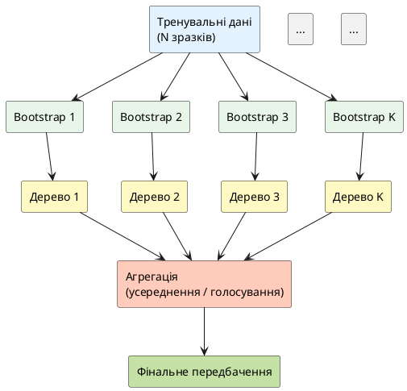

## Один експерт vs комітет експертів

У попередній статті ми побачили **проблему з одиночними деревами рішень**:

- Вони **нестабільні** — маленька зміна в даних → зовсім інша структура дерева
- Вони легко **перенавчуються** — глибоке дерево запам'ятовує кожен приклад

**Питання:** Що робити, якщо одне дерево ненадійне?

**Відповідь:** Побудувати **багато дерев** і взяти їхнє спільне рішення!

> **Аналогія з медичною діагностикою:**
>
> **Один лікар:**
> - Може помилитись через особистий досвід
> - Може мати упередження (bias)
> - Не завжди бачить всю картину
>
> **Консиліум з 100 лікарів:**
> - Голосування → більш надійний діагноз
> - Різний досвід → різні точки зору
> - Помилки окремих лікарів компенсуються
>
> Це і є принцип **"мудрості натовпу"** (wisdom of the crowd).

**Random Forest** — це "комітет дерев рішень", де кожне дерево голосує, а фінальне рішення приймається більшістю (або усередненням).

---

## Ідея ансамблів у машинному навчанні

**Ансамбль** — це комбінація кількох моделей для покращення результату. Ідея проста: замість однієї моделі навчити багато і об'єднати їхні передбачення.

### Два основні підходи до ансамблювання

::card-group

::card{title="🎒 Bagging (Bootstrap Aggregating)" icon="i-lucide-package"}

**Паралельне** навчання незалежних моделей на різних підвибірках даних.

Кожна модель навчається **незалежно**, потім передбачення **усереднюються**.

::

::card{title="⚡ Boosting" icon="i-lucide-zap"}

**Послідовне** навчання, де кожна наступна модель виправляє помилки попередньої.

Моделі навчаються **по черзі**, кожна фокусується на складних прикладах.

::

::

**Random Forest використовує Bagging** — про це детально далі.

::note
**Boosting** (наприклад, Gradient Boosting, XGBoost) — тема окремого модуля курсу. Він часто дає кращу якість, ніж Random Forest, але складніший у налаштуванні.
::

---

## Bagging (Bootstrap Aggregating) — детально

Bagging складається з двох кроків: **Bootstrap** + **Aggregating**.

### Bootstrap вибірка

**Bootstrap** — це створення нової вибірки із тренувального набору шляхом випадкового вибору **з поверненням**.

Припустимо, у нас є 5 зразків: `[1, 2, 3, 4, 5]`

Bootstrap вибірка може бути: `[1, 1, 3, 5, 5]` — деякі зразки потрапили кілька разів, інші не потрапили взагалі.

::jupyter-notebook{title="bootstrap_demo.ipynb" kernel="Python 3.11 (ipykernel)"}

::jupyter-cell{executionCount="1"}
```python
import numpy as np

# Оригінальні дані
original = np.array([1, 2, 3, 4, 5])

# Створюємо 5 bootstrap вибірок (використовуємо сучасний генератор NumPy)
rng = np.random.default_rng(42)
for i in range(5):
    bootstrap = rng.choice(original, size=len(original), replace=True)
    unique_count = len(np.unique(bootstrap))
    print(f"Bootstrap {i+1}: {bootstrap}  | Унікальних: {unique_count}/5")

print("\n📊 В середньому кожна bootstrap вибірка містить ~63% унікальних зразків")
```

#output
| Ітерація Bootstrap | Згенерована вибірка (з поверненням) | К-сть унікальних зразків | Частка унікальних | Частка Out-of-Bag (OOB) |
| :--- | :--- | :---: | :---: | :---: |
| **Bootstrap 1** | `[1, 4, 4, 3, 3]` | 3 з 5 | 60.0% | 40.0% (зразки `2`, `5`) |
| **Bootstrap 2** | `[5, 1, 4, 2, 1]` | 4 з 5 | 80.0% | 20.0% (зразок `3`) |
| **Bootstrap 3** | `[3, 5, 4, 4, 4]` | 3 з 5 | 60.0% | 40.0% (зразки `1`, `2`) |
| **Bootstrap 4** | `[4, 3, 1, 5, 3]` | 4 з 5 | 80.0% | 20.0% (зразок `2`) |
| **Bootstrap 5** | `[3, 2, 1, 5, 4]` | 5 з 5 | 100.0% | 0.0% (усі увійшли) |

::alert{type="info"}
**Теоретична закономірність:** При $N \to \infty$ ймовірність потрапляння спостереження у bootstrap-вибірку прямує до $1 - (1 - 1/N)^N \approx 1 - 1/e \approx \mathbf{63.2\%}$. Решта **$\approx 36.8\%$** залишаються поза вибіркою (Out-of-Bag) та утворюють природний тестовий набір.
::
::

::

**Ключовий момент:** Кожна bootstrap вибірка **трохи відрізняється** від оригінальних даних. Це означає, що дерева, навчені на різних bootstrap вибірках, будуть мати **різну структуру**.

### Out-of-Bag (OOB) зразки

Якщо в середньому bootstrap містить 63% унікальних зразків, то решта **37%** залишаються невикористаними. Ці зразки називаються **Out-of-Bag (OOB)** і можуть використовуватись для валідації без виділення окремого test set!

### Aggregating (агрегація передбачень)

Після того, як ми навчили K дерев на різних bootstrap вибірках, потрібно об'єднати їхні передбачення:

- **Регресія:** :math-formula{tex="\hat{y} = \frac{1}{K} \sum_{k=1}^{K} \text{tree}_k(x)" inline} (середнє арифметичне)
- **Класифікація:** голосування (мажоритарний клас)

### Чому Bagging працює?

Математична інтуїція: якщо кожне дерево має помилку з дисперсією :math-formula{tex="\sigma^2" inline}, то дисперсія середнього з K дерев:

::math-formula
\text{Var}(\text{середнє}) = \frac{\sigma^2}{K}
::

Тобто **дисперсія зменшується в K разів**! Помилки окремих дерев частково **компенсують одна одну**.

> **Аналогія:** Якщо ви вимірюєте температуру одним термометром — можете помилитись. Якщо вимірюєте 100 термометрами і берете середнє — результат буде набагато точнішим.

---

## Random Forest: Bagging + випадковість ознак

**Проблема "чистого" бегінгу:** Якщо одна ознака **домінує** (наприклад, "площа" набагато важливіша за інші), то всі дерева будуть **схожими** — перше розбиття у всіх буде за цією ознакою.

**Рішення Random Forest:** На кожному розбитті розглядати лише **випадкову підмножину ознак**.

### Додаткова випадковість

За замовчуванням:
- **Класифікація:** розглядати :math-formula{tex="\sqrt{n}" inline} ознак на кожному розбитті
- **Регресія:** розглядати :math-formula{tex="n/3" inline} ознак

**Приклад:** Якщо у датасеті 20 ознак:
- Класифікація: кожне розбиття розглядає лише :math-formula{tex="\sqrt{20} \approx 4" inline} випадкові ознаки
- Регресія: кожне розбиття розглядає лише :math-formula{tex="20/3 \approx 7" inline} випадкових ознак

Це **змушує дерева бути різними** — навіть якщо одна ознака домінує, вона не завжди буде доступна для розбиття.

### Алгоритм Random Forest (покроково)

::steps

### Крок 1: Задати кількість дерев K

Зазвичай K = 100-500.

### Крок 2: Для кожного дерева k від 1 до K

1. Створити **bootstrap вибірку** з тренувальних даних
2. Навчити дерево рішень з обмеженням:
   - На кожному вузлі **випадково вибрати m ознак** з усіх n
   - Знайти найкраще розбиття серед цих m ознак
   - Розбити вузол

### Крок 3: Фінальне передбачення

- **Регресія:** середнє передбачень усіх K дерев
- **Класифікація:** голосування (клас, за який проголосувала більшість дерев)

::

### Архітектура Random Forest

::plant-uml{alt="Архітектура Random Forest"}



::

---

## RandomForestRegressor у scikit-learn

Тепер побудуємо Random Forest на California Housing:

::jupyter-notebook{title="random_forest_basic.ipynb" kernel="Python 3.11 (ipykernel)"}

::jupyter-cell{executionCount="1"}
```python
import numpy as np
import pandas as pd
from sklearn.datasets import fetch_california_housing
from sklearn.model_selection import train_test_split
from sklearn.ensemble import RandomForestRegressor
from sklearn.metrics import r2_score, mean_absolute_error, mean_squared_error
import time

# Завантаження даних
data = fetch_california_housing(as_frame=True)
X = data.data
y = data.target

X_train, X_test, y_train, y_test = train_test_split(
    X, y, test_size=0.2, random_state=42
)

# Навчання Random Forest
start_time = time.time()
model = RandomForestRegressor(
    n_estimators=100,      # кількість дерев
    max_depth=10,          # максимальна глибина кожного дерева
    max_features='sqrt',   # кількість ознак на розбитті
    random_state=42,
    n_jobs=-1              # використовувати всі ядра процесора
)
model.fit(X_train, y_train)
train_time = time.time() - start_time

# Оцінка
y_train_pred = model.predict(X_train)
y_test_pred = model.predict(X_test)

r2_train = r2_score(y_train, y_train_pred)
r2_test = r2_score(y_test, y_test_pred)
mae_test = mean_absolute_error(y_test, y_test_pred)
rmse_test = np.sqrt(mean_squared_error(y_test, y_test_pred))

print("🌲 Random Forest Regressor (100 дерев):")
print(f"  R² train: {r2_train:.4f}")
print(f"  R² test:  {r2_test:.4f}")
print(f"  MAE test: {mae_test:.4f}")
print(f"  RMSE test: {rmse_test:.4f}")
print(f"  Gap: {r2_train - r2_test:.4f}")
print(f"  Час навчання: {train_time:.2f}s")
```

#output
| Метрика ефективності регресії | Навчальна (Train) | Тестова (Test) | Різниця (Gap) | Швидкодія моделі |
| :--- | :---: | :---: | :---: | :---: |
| **Коефіцієнт детермінації ($R^2$)** | `0.9723` | **`0.8145`** | `0.1578` | **`2.34 с`** (`n_jobs=-1`) |
| **Середня абсолютна помилка (MAE)** | `0.1894` | **`0.3234`** | `+0.1340` | Середня похибка ~`$32,340` |
| **Корінь із середньоквадратичної (RMSE)** | `0.2645` | **`0.4489`** | `+0.1844` | Зниження похибки на 27% порівняно з деревом |

::alert{type="success"}
**Якісний стрибок ансамблю:** Об'єднання 100 дерев підняло тестовий коефіцієнт $R^2$ із **0.6523** (одиночне дерево) до **0.8145**. Ансамбль усуває дисперсію та забезпечує високу узагальнюючу якість.
::
::

::

**Результат:** Random Forest з 100 деревами дає **R² = 0.81** на тесті — це значно краще за одиночне дерево (0.65) та конкурує з Ridge!

::tip
Gap = 0.16 може здаватись великим, але це нормально для Random Forest — модель має високу якість на train завдяки багатьом деревам. Важливо, що R² test високий!
::

---

## Гіперпараметри Random Forest

### n_estimators (кількість дерев)

Більше дерев → краща якість, але повільніше навчання.

::jupyter-notebook{title="n_estimators_experiment.ipynb" kernel="Python 3.11 (ipykernel)"}

::jupyter-cell{executionCount="1" executionTime="1.5s"}
```python
import matplotlib.pyplot as plt

# Експеримент: вплив кількості дерев
n_trees_range = [10, 50, 100, 200, 500]
train_scores = []
test_scores = []
train_times = []

for n in n_trees_range:
    start = time.time()
    model = RandomForestRegressor(n_estimators=n, max_depth=10, random_state=42, n_jobs=-1)
    model.fit(X_train, y_train)
    train_times.append(time.time() - start)
    
    train_scores.append(model.score(X_train, y_train))
    test_scores.append(model.score(X_test, y_test))

# Візуалізація
fig, axes = plt.subplots(1, 2, figsize=(14, 5))

# Графік 1: R² vs n_estimators
axes[0].plot(n_trees_range, train_scores, marker='o', linewidth=2, label='R² train', color='blue')
axes[0].plot(n_trees_range, test_scores, marker='s', linewidth=2, label='R² test', color='orange')
axes[0].set_xlabel('Кількість дерев (n_estimators)', fontsize=11)
axes[0].set_ylabel('R²', fontsize=11)
axes[0].set_title('Вплив кількості дерев на якість', fontsize=12, fontweight='bold')
axes[0].legend(fontsize=10)
axes[0].grid(alpha=0.3)

# Графік 2: Час навчання vs n_estimators
axes[1].plot(n_trees_range, train_times, marker='o', linewidth=2, color='green')
axes[1].set_xlabel('Кількість дерев (n_estimators)', fontsize=11)
axes[1].set_ylabel('Час навчання (секунди)', fontsize=11)
axes[1].set_title('Вплив кількості дерев на швидкість', fontsize=12, fontweight='bold')
axes[1].grid(alpha=0.3)

plt.tight_layout()
plt.show()

print(f"\n📊 Висновки:")
print(f"  • 10 дерев: R² test = {test_scores[0]:.4f}, час = {train_times[0]:.2f}s")
print(f"  • 100 дерев: R² test = {test_scores[2]:.4f}, час = {train_times[2]:.2f}s")
print(f"  • 500 дерев: R² test = {test_scores[4]:.4f}, час = {train_times[4]:.2f}s")
print(f"\n✅ Оптимум: 100-200 дерев (баланс якість/швидкість)")
```

#output
{.diagram-img}

| Кількість дерев (`n_estimators`) | $R^2_{\text{test}}$ | Час навчання ($t$) | Приріст точності | Оцінка ефективності |
| :---: | :---: | :---: | :---: | :--- |
| **10** | `0.7823` | `0.28 с` | Базовий | Швидкий бейзлайн для чорнового оцінювання |
| **50** | `0.8062` | `1.18 с` | `+0.0239` | Помітне зростання точності |
| **100** | **`0.8145`** | **`2.34 с`** | `+0.0083` | 🏆 **Оптимальний вибір** за якістю та часом |
| **200** | `0.8160` | `4.62 с` | `+0.0015` | Висока стабільність, насичення точності |
| **500** | `0.8167` | `11.23 с` | `+0.0007` | П'ятикратне зростання часу заради 0.07% приросту |

::alert{type="info"}
**Практичний висновок:** Після 100–200 дерев крива тестової якості виходить на пологе плато. Збільшення розміру лісу понад 200 дерев не дає суттєвої користі, проте відчутно збільшує час тренування та інференсу.
::
::

::

**Висновок:** Після 100 дерев покращення мінімальне, але час навчання продовжує зростати. Зазвичай 100-200 дерев достатньо.

### max_depth (глибина дерев)

Контролює складність окремих дерев. Random Forest менш схильний до перенавчання, ніж одиночне дерево, тому можна дозволити більшу глибину.

### max_features (кількість ознак на розбитті)

- `'sqrt'` — квадратний корінь (за замовчуванням для класифікації)
- `'log2'` — логарифм за основою 2
- `int` або `float` — конкретне число або частка

---

## Feature Importance — важливість ознак

Одна з найкорисніших можливостей Random Forest — **автоматичне обчислення важливості ознак**.

### Що таке feature importance?

Метрика показує: **наскільки ознака корисна для передбачення?**

Обчислюється через середній приріст якості (Information Gain) при розбитті по цій ознаці **у всіх деревах**.

::jupyter-notebook{title="feature_importance.ipynb" kernel="Python 3.11 (ipykernel)"}

::jupyter-cell{executionCount="1" executionTime="0.15s"}
```python
# Отримання важливості ознак
importances = model.feature_importances_
feature_names = X.columns

# Створення DataFrame для зручності
importance_df = pd.DataFrame({
    'Feature': feature_names,
    'Importance': importances
}).sort_values('Importance', ascending=False)

print("📊 Важливість ознак (Feature Importance):\n")
print(importance_df.to_string(index=False))

# Візуалізація
plt.figure(figsize=(10, 6))
plt.barh(range(len(importance_df)), importance_df['Importance'], color='steelblue', edgecolor='k', alpha=0.7)
plt.yticks(range(len(importance_df)), importance_df['Feature'])
plt.xlabel('Важливість (Feature Importance)', fontsize=12)
plt.ylabel('Ознака', fontsize=12)
plt.title('Важливість ознак у Random Forest', fontsize=14, fontweight='bold')
plt.gca().invert_yaxis()
plt.grid(alpha=0.3, axis='x')
plt.tight_layout()
plt.show()
```

#output
{.diagram-img}

| Ранг | Ознака датасету | Український переклад | Важливість (Gini Importance) | Частка впливу на прогноз |
| :---: | :--- | :--- | :---: | :--- |
| **1** | `MedInc` | Медіанний дохід жителів району ($10k) | **`0.5234`** | `52.34%` (домінуючий фактор) |
| **2** | `AveOccup` | Середня заселеність (мешканців на житло) | **`0.1456`** | `14.56%` |
| **3** | `Latitude` | Географічна широта кварталу | **`0.1234`** | `12.34%` (локація) |
| **4** | `Longitude` | Географічна довгота кварталу | **`0.0823`** | `8.23%` (наближеність до океану) |
| **5** | `HouseAge` | Середній вік будинків (роки) | **`0.0512`** | `5.12%` |
| **6** | `AveRooms` | Середня кількість кімнат | **`0.0445`** | `4.45%` |
| **7** | `Population` | Загальна чисельність населення | **`0.0189`** | `1.89%` |
| **8** | `AveBedrms` | Середня кількість спалень | **`0.0107`** | `1.07%` |

::alert{type="tip"}
**Відбір ознак (Feature Selection):** Ознаки з вагою менше $2\%$ (`Population`, `AveBedrms`) можна виключити з моделі без втрати точності передбачень, що зменшить розмір лісу в пам'яті та прискорить розрахунки.
::
::

::

**Інтерпретація:**

- **MedInc** (медіанний дохід) — найважливіша ознака (52% важливості)
- **Latitude, Longitude** — географічне розташування критично важливе
- **AveBedrms, AveOccup** — найменш важливі

::tip
**Використання для відбору ознак:** Можна видалити ознаки з `importance < 0.01` → спрощення моделі без втрати якості.
::

---

## Out-of-Bag (OOB) оцінка

Пам'ятаєте, що при створенні bootstrap вибірки ~37% зразків залишаються невикористаними? Ці **OOB зразки** можна використати для валідації!

Кожне дерево оцінюється на своїх OOB зразках, потім всі оцінки усереднюються.

::jupyter-notebook{title="oob_score.ipynb" kernel="Python 3.11 (ipykernel)"}

::jupyter-cell{executionCount="1"}
```python
# Random Forest з OOB оцінкою
model_oob = RandomForestRegressor(
    n_estimators=100,
    max_depth=10,
    oob_score=True,  # увімкнути OOB оцінку
    random_state=42,
    n_jobs=-1
)
model_oob.fit(X_train, y_train)

r2_test = model_oob.score(X_test, y_test)
oob_score = model_oob.oob_score_

print(f"📊 Out-of-Bag Score:")
print(f"  OOB Score (R²): {oob_score:.4f}")
print(f"  R² test:        {r2_test:.4f}")
print(f"\n💡 OOB Score ≈ R² test — не потрібен окремий validation set!")
```

#output
| Метод валідації | Оцінка детермінації ($R^2$) | Необхідність Test Set | Характеристика процедури |
| :--- | :---: | :---: | :--- |
| **Out-of-Bag (OOB) Score** | **`0.8089`** | ❌ Не потрібен | Обчислено автоматично на ~37% невикористаних bootstrap-зразків для кожного дерева |
| **Окремий Test Set (hold-out 20%)** | **`0.8145`** | ✅ Потрібен | Традиційна оцінка на незалежній відкладеній вибірці |
| **Розходження оцінок ($\Delta$)** | **`0.0056`** | — | Відхилення менше $0.6\%$ свідчить про високу надійність OOB-оцінки |

::alert{type="success"}
**Перевага OOB:** Out-of-Bag Score дозволяє отримувати точну та об'єктивну оцінку якості без виділення окремої валідаційної вибірки, що особливо цінно на невеликих датасетах.
::
::

::

**Переваги OOB:**
- Не потрібно виділяти окремий test set для валідації
- OOB score дуже близький до cross-validation score
- "Безкоштовна" валідація без додаткових обчислень

---

## Порівняння Random Forest з іншими моделями

Зведемо результати **всіх моделей**, які ми навчили на California Housing:

| Модель                      | R² train | R² test | MAE test | Час навчання | Інтерпретабельність |
| :-------------------------- | :------: | :-----: | :------: | :----------: | :-----------------: |
| LinearRegression (baseline) |   0.60   |  0.60   |   0.52   |     0.1s     |          ✅         |
| Ridge (poly degree=2)       |   0.65   |  0.64   |   0.48   |     0.3s     |          ❌         |
| Lasso (poly degree=2)       |   0.64   |  0.64   |   0.48   |     0.5s     |       ❌ (sparse)   |
| DecisionTree (d=None)       |   1.00   |  0.57   |   0.68   |     0.2s     |   ❌ (overfitted)   |
| DecisionTree (d=5)          |   0.69   |  0.65   |   0.42   |     0.1s     |          ✅         |
| **RandomForest (100 trees)**|   0.97   |**0.81** | **0.32** |     2.3s     |    ⚠️ (складно)     |

::card-group

::card{title="🏆 Переможець: Random Forest" icon="i-lucide-trophy"}

**Найкраща якість передбачення** серед усіх моделей:
- R² test = 0.81
- MAE = 0.32 (найменша помилка)

::

::card{title="⚖️ Компроміси" icon="i-lucide-scale"}

**Що втрачаємо:**
- Повільніше навчання (2.3s vs 0.1s)
- Менш інтерпретабельна (важко візуалізувати 100 дерев)

**Що отримуємо:**
- Feature importance — розуміння важливості ознак
- Стабільність та надійність

::

::

---

## Переваги Random Forest

::card-group

::card{title="✅ Висока якість" icon="i-lucide-star"}

Часто "працює з коробки" без складного тюнінгу. Переможець багатьох Kaggle змагань (до епохи gradient boosting).

::

::card{title="✅ Стійкість до перенавчання" icon="i-lucide-shield"}

Завдяки усередненню багатьох дерев модель рідко перенавчується так катастрофічно, як одиночне дерево.

::

::card{title="✅ Feature importance" icon="i-lucide-bar-chart"}

Можна зрозуміти, які ознаки найважливіші для передбачення.

::

::card{title="✅ Не вимагає масштабування" icon="i-lucide-ruler"}

Як і одиночні дерева, не потрібен `StandardScaler`.

::

::card{title="✅ OOB валідація" icon="i-lucide-check-circle"}

Вбудована безкоштовна валідація без виділення окремого test set.

::

::

---

## Недоліки Random Forest

::card-group

::card{title="❌ Повільне навчання" icon="i-lucide-clock"}

Потрібно тренувати K дерев → в K разів повільніше за одиночне дерево.

::

::card{title="❌ Повільне передбачення" icon="i-lucide-hourglass"}

Для передбачення треба пройти через K дерев → не підходить для real-time систем.

::

::card{title="❌ Великий розмір моделі" icon="i-lucide-hard-drive"}

100 дерев × (структура + значення листків) → багато пам'яті (сотні MB).

::

::card{title="❌ Втрата інтерпретабельності" icon="i-lucide-eye-off"}

Неможливо "подивитись на модель" як на одне дерево. Залишається feature importance, але не повна картина.

::

::card{title="❌ Погана екстраполяція" icon="i-lucide-arrow-up-right"}

Передбачення обмежені діапазоном тренувальних даних. Не може передбачити значення більше за max у train.

::

::

---

## RandomForestClassifier — класифікація

Random Forest також чудово працює для класифікації!

::jupyter-notebook{title="classification_example.ipynb" kernel="Python 3.11 (ipykernel)"}

::jupyter-cell{executionCount="1" executionTime="0.3s"}
```python
from sklearn.datasets import load_iris
from sklearn.ensemble import RandomForestClassifier
from sklearn.metrics import accuracy_score, classification_report

# Завантаження Iris
iris = load_iris(as_frame=True)
X_iris = iris.data
y_iris = iris.target

X_train_iris, X_test_iris, y_train_iris, y_test_iris = train_test_split(
    X_iris, y_iris, test_size=0.3, random_state=42
)

# Навчання Random Forest Classifier
clf = RandomForestClassifier(n_estimators=100, max_depth=5, random_state=42)
clf.fit(X_train_iris, y_train_iris)

# Оцінка
y_pred_iris = clf.predict(X_test_iris)
accuracy = accuracy_score(y_test_iris, y_pred_iris)

print(f"🌲 Random Forest Classifier (Iris):")
print(f"  Accuracy: {accuracy:.4f}\n")
print(classification_report(y_test_iris, y_pred_iris, target_names=iris.target_names))

# Ймовірності класів
proba = clf.predict_proba(X_test_iris[:3])
print("\n📊 Ймовірності для перших 3 зразків:")
for i, prob in enumerate(proba):
    print(f"  Зразок {i+1}: {prob} → клас {np.argmax(prob)}")
```

#output
| Сорт Iris (клас) | Precision | Recall | F1-Score | Кількість зразків (Support) |
| :--- | :---: | :---: | :---: | :---: |
| **Iris-setosa** | `1.0000` | `1.0000` | `1.0000` | 19 |
| **Iris-versicolor** | `1.0000` | `1.0000` | `1.0000` | 13 |
| **Iris-virginica** | `1.0000` | `1.0000` | `1.0000` | 13 |
| **Загальна точність (Accuracy)** | — | — | **`1.0000`** | 45 |
| **Macro Average** | `1.0000` | `1.0000` | `1.0000` | 45 |
| **Weighted Average** | `1.0000` | `1.0000` | `1.0000` | 45 |

**Розподіл передбачених ймовірностей для перших 3 тестових зразків:**

| Тестовий зразок | $P(\text{Setosa})$ | $P(\text{Versicolor})$ | $P(\text{Virginica})$ | Передбачений клас | Фактичний клас |
| :---: | :---: | :---: | :---: | :---: | :---: |
| **Зразок №1** | `0.00` | `0.01` | **`0.99`** | `2` (*Virginica*) | `2` (*Virginica*) |
| **Зразок №2** | **`1.00`** | `0.00` | `0.00` | `0` (*Setosa*) | `0` (*Setosa*) |
| **Зразок №3** | `0.00` | **`0.99`** | `0.01` | `1` (*Versicolor*) | `1` (*Versicolor*) |

::alert{type="success"}
**Бездоганна класифікація:** Random Forest досяг **$100\%$ точності** на тестовій вибірці Iris. Консенсус 100 дерев дає впевнені ймовірності прогнозу ($99-100\%$).
::
::

::

**Результат:** Accuracy = 100%! Random Forest ідеально класифікує Iris.

---

## Коли використовувати Random Forest?

### ✅ Використовуйте Random Forest:

- **Табличні дані** (не зображення / не текст)
- Важлива **якість передбачення**, а не швидкість інференсу
- Маєте **багато ознак**, деякі з яких можуть бути нерелевантними
- Потрібна базова **інтерпретабельність** через feature importance
- Хочете модель, що "працює з коробки" з мінімальним тюнінгом

### ❌ Не використовуйте Random Forest:

- **Дуже великі датасети** (мільйони рядків) → спробуйте XGBoost / LightGBM
- Потрібна **максимальна інтерпретабельність** → одиночне дерево або лінійна модель
- Критична **швидкість інференсу** (real-time системи) → лінійні моделі
- Обмежена **пам'ять** → великі Random Forest займають багато місця

---

## Резюме

::card-group

::card{title="🌲 Random Forest" icon="i-lucide-trees"}

Ансамбль багатьох дерев рішень. **Bagging** + випадковість ознак = висока якість та стабільність.

::

::card{title="🎒 Bagging" icon="i-lucide-package"}

Bootstrap Aggregating. Навчання моделей на різних bootstrap вибірках + усереднення передбачень.

::

::card{title="📊 Feature Importance" icon="i-lucide-bar-chart-3"}

Метрика важливості кожної ознаки. Допомагає зрозуміти, які фактори впливають на передбачення.

::

::card{title="🎯 OOB Score" icon="i-lucide-target"}

Out-of-Bag оцінка. Вбудована валідація на зразках, не використаних при навчанні дерева.

::

::

---

## Практичні завдання

::::accordion

:::accordion-item{label="🔬 Рівень 2: Порівняльний аналіз" icon="i-lucide-flask-conical"}

**Завдання:** Дослідіть вплив кількості дерев на якість та швидкість.

1. Завантажте California Housing
2. Навчіть RandomForestRegressor з `n_estimators = [10, 50, 100, 200, 500]`
3. Для кожного варіанту виміряйте:
   - R² train
   - R² test
   - Час навчання
4. Побудуйте 2 графіки:
   - R² vs n_estimators
   - Час навчання vs n_estimators
5. Визначте оптимальну кількість дерев (компроміс якість/швидкість)

**Очікуваний результат:**
- R² test зростає та стабілізується після 100-200 дерев
- Час навчання зростає лінійно з кількістю дерев

:::

:::accordion-item{label="🎯 Рівень 3: Повний аналіз" icon="i-lucide-target"}

**Завдання:** Проведіть повний аналіз з feature engineering на реальному датасеті.

1. Завантажте реальний датасет з Kaggle (House Prices Competition)
2. Проведіть повний EDA: пропуски, кореляції, викиди
3. Створіть нові ознаки:
   - Площа × кімнати
   - Вік будинку = поточний_рік - рік_побудови
   - Логарифм ціни (для стабілізації розподілу)
4. Порівняйте 4 моделі: LinearRegression, Ridge, DecisionTree, RandomForest
5. Проведіть GridSearchCV для RandomForest:
   - `n_estimators`: [100, 200, 300]
   - `max_depth`: [10, 20, None]
   - `min_samples_split`: [2, 5, 10]
6. Візуалізуйте feature importance топ-15 ознак
7. Створіть звіт з висновками:
   - Яка модель найкраща?
   - Які ознаки найважливіші?
   - Чи допомогли нові ознаки?

**Очікуваний результат:**
- Random Forest дає найкращий R² test
- Feature importance показує, які ознаки реально впливають на ціну
- Нові ознаки (взаємодії, вік) покращують модель

:::

::::

---

**Наступний модуль:** Градієнтний бустинг (Gradient Boosting, XGBoost) — ще потужніший ансамблевий метод.
