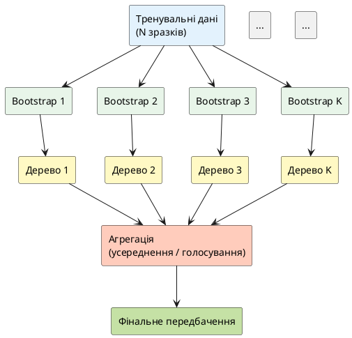

## Один експерт vs комітет експертів

У попередній статті ми побачили **проблему з одиночними деревами рішень**:

- Вони **нестабільні** — маленька зміна в даних → зовсім інша структура дерева
- Вони легко **перенавчуються** — глибоке дерево запам'ятовує кожен приклад

**Питання:** Що робити, якщо одне дерево ненадійне?

**Відповідь:** Побудувати **багато дерев** і взяти їхнє спільне рішення!

> **Аналогія з медичною діагностикою:**
>
> **Один лікар:**
>
> - Може помилитись через особистий досвід
> - Може мати упередження (bias)
> - Не завжди бачить всю картину
>
> **Консиліум з 100 лікарів:**
>
> - Голосування → більш надійний діагноз
> - Різний досвід → різні точки зору
> - Помилки окремих лікарів компенсуються
>
> Це і є принцип **"мудрості натовпу"** (wisdom of the crowd).

**Random Forest** — це "комітет дерев рішень", де кожне дерево голосує, а фінальне рішення приймається більшістю (або усередненням).

---

## Ідея ансамблів у машинному навчанні

**Ансамбль** — це комбінація кількох моделей для покращення результату. Ідея проста: замість однієї моделі навчити багато і об'єднати їхні передбачення.

### Два основні підходи до ансамблювання

::card-group

::card{title="🎒 Bagging (Bootstrap Aggregating)" icon="i-lucide-package"}

**Паралельне** навчання незалежних моделей на різних підвибірках даних.

Кожна модель навчається **незалежно**, потім передбачення **усереднюються**.

::

::card{title="⚡ Boosting" icon="i-lucide-zap"}

**Послідовне** навчання, де кожна наступна модель виправляє помилки попередньої.

Моделі навчаються **по черзі**, кожна фокусується на складних прикладах.

::

::

**Random Forest використовує Bagging** — про це детально далі.

::note
**Boosting** (наприклад, Gradient Boosting, XGBoost) — тема окремого модуля курсу. Він часто дає кращу якість, ніж Random Forest, але складніший у налаштуванні.
::

---

## Bagging (Bootstrap Aggregating) — детально

Bagging складається з двох кроків: **Bootstrap** + **Aggregating**.

### Bootstrap вибірка

**Bootstrap** — це створення нової вибірки із тренувального набору шляхом випадкового вибору **з поверненням**.

Припустимо, у нас є 5 зразків: `[1, 2, 3, 4, 5]`

Bootstrap вибірка може бути: `[1, 1, 3, 5, 5]` — деякі зразки потрапили кілька разів, інші не потрапили взагалі.

::jupyter-notebook{title="bootstrap_demo.ipynb" kernel="Python 3.11 (ipykernel)"}

::jupyter-cell{executionCount="1"}

```python
import numpy as np

# Оригінальні дані
original = np.array([1, 2, 3, 4, 5])

# Створюємо 5 bootstrap вибірок (використовуємо сучасний генератор NumPy)
rng = np.random.default_rng(42)
for i in range(5):
    bootstrap = rng.choice(original, size=len(original), replace=True)
    unique_count = len(np.unique(bootstrap))
    print(f"Bootstrap {i+1}: {bootstrap}  | Унікальних: {unique_count}/5")

print("\n📊 В середньому кожна bootstrap вибірка містить ~63% унікальних зразків")
```

#output
| Ітерація Bootstrap | Згенерована вибірка (з поверненням) | К-сть унікальних зразків | Частка унікальних | Частка Out-of-Bag (OOB) |
| :--- | :--- | :---: | :---: | :---: |
| **Bootstrap 1** | `[1, 4, 4, 3, 3]` | 3 з 5 | 60.0% | 40.0% (зразки `2`, `5`) |
| **Bootstrap 2** | `[5, 1, 4, 2, 1]` | 4 з 5 | 80.0% | 20.0% (зразок `3`) |
| **Bootstrap 3** | `[3, 5, 4, 4, 4]` | 3 з 5 | 60.0% | 40.0% (зразки `1`, `2`) |
| **Bootstrap 4** | `[4, 3, 1, 5, 3]` | 4 з 5 | 80.0% | 20.0% (зразок `2`) |
| **Bootstrap 5** | `[3, 2, 1, 5, 4]` | 5 з 5 | 100.0% | 0.0% (усі увійшли) |

**Теоретична закономірність:** При :math-formula{tex="N \to \infty" inline} ймовірність потрапляння спостереження у bootstrap-вибірку прямує до :math-formula{tex="1 - \left(1 - \frac{1}{N}\right)^N \approx 1 - \frac{1}{e} \approx 63.2\%" inline}. Решта **~36.8%** залишаються поза вибіркою (Out-of-Bag / OOB) та утворюють природний валідаційний набір.

::

::

**Ключовий момент:** Кожна bootstrap вибірка **трохи відрізняється** від оригінальних даних. Це означає, що дерева, навчені на різних bootstrap вибірках, будуть мати **різну структуру**.

### Out-of-Bag (OOB) зразки

Якщо в середньому bootstrap містить 63% унікальних зразків, то решта **37%** залишаються невикористаними. Ці зразки називаються **Out-of-Bag (OOB)** і можуть використовуватись для валідації без виділення окремого test set!

### Aggregating (агрегація передбачень)

Після того, як ми навчили K дерев на різних bootstrap вибірках, потрібно об'єднати їхні передбачення:

- **Регресія:** :math-formula{tex="\hat{y} = \frac{1}{K} \sum\_{k=1}^{K} \text{tree}\_k(x)" inline} (середнє арифметичне)
- **Класифікація:** голосування (мажоритарний клас)

### Чому Bagging працює?

Математична інтуїція: якщо кожне дерево має помилку з дисперсією :math-formula{tex="\sigma^2" inline}, то дисперсія середнього з K дерев:

::math-formula{tex="\text{Var}(\text{середнє}) = \frac{\sigma^2}{K}"}
::

Тобто **дисперсія зменшується в K разів**! Помилки окремих дерев частково **компенсують одна одну**.

> **Аналогія:** Якщо ви вимірюєте температуру одним термометром — можете помилитись. Якщо вимірюєте 100 термометрами і берете середнє — результат буде набагато точнішим.

---

## Random Forest: Bagging + випадковість ознак

**Проблема "чистого" бегінгу:** Якщо одна ознака **домінує** (наприклад, "площа" набагато важливіша за інші), то всі дерева будуть **схожими** — перше розбиття у всіх буде за цією ознакою.

**Рішення Random Forest:** На кожному розбитті розглядати лише **випадкову підмножину ознак**.

### Додаткова випадковість

За замовчуванням:

- **Класифікація:** розглядати :math-formula{tex="\sqrt{n}" inline} ознак на кожному розбитті
- **Регресія:** розглядати :math-formula{tex="n/3" inline} ознак

**Приклад:** Якщо у датасеті 20 ознак:

- Класифікація: кожне розбиття розглядає лише :math-formula{tex="\sqrt{20} \approx 4" inline} випадкові ознаки
- Регресія: кожне розбиття розглядає лише :math-formula{tex="20/3 \approx 7" inline} випадкових ознак

Це **змушує дерева бути різними** — навіть якщо одна ознака домінує, вона не завжди буде доступна для розбиття.

### Алгоритм Random Forest (покроково)

::steps

### Крок 1: Задати кількість дерев K

Зазвичай K = 100-500.

### Крок 2: Для кожного дерева k від 1 до K

1. Створити **bootstrap вибірку** з тренувальних даних
2. Навчити дерево рішень з обмеженням:
    - На кожному вузлі **випадково вибрати m ознак** з усіх n
    - Знайти найкраще розбиття серед цих m ознак
    - Розбити вузол

### Крок 3: Фінальне передбачення

- **Регресія:** середнє передбачень усіх K дерев
- **Класифікація:** голосування (клас, за який проголосувала більшість дерев)

::

### Архітектура Random Forest

::plant-uml{alt="Архітектура Random Forest"}


```plantuml
@startuml
skinparam style plain
skinparam backgroundColor #FFFFFF

rectangle "Тренувальні дані\n(N зразків)" as data #E3F2FD

rectangle "Bootstrap 1" as b1 #E8F5E9
rectangle "Bootstrap 2" as b2 #E8F5E9
rectangle "Bootstrap 3" as b3 #E8F5E9
rectangle "..." as dots1
rectangle "Bootstrap K" as bk #E8F5E9

rectangle "Дерево 1" as t1 #FFF9C4
rectangle "Дерево 2" as t2 #FFF9C4
rectangle "Дерево 3" as t3 #FFF9C4
rectangle "..." as dots2
rectangle "Дерево K" as tk #FFF9C4

rectangle "Агрегація\n(усереднення / голосування)" as agg #FFCCBC
rectangle "Фінальне передбачення" as final #C5E1A5

data --> b1
data --> b2
data --> b3
data --> bk

b1 --> t1
b2 --> t2
b3 --> t3
bk --> tk

t1 --> agg
t2 --> agg
t3 --> agg
tk --> agg

agg --> final

@enduml
```

::

---

## RandomForestRegressor у scikit-learn

Тепер побудуємо Random Forest на California Housing:

::jupyter-notebook{title="random_forest_basic.ipynb" kernel="Python 3.11 (ipykernel)"}

::jupyter-cell{executionCount="1"}

```python
import numpy as np
import pandas as pd
from sklearn.datasets import fetch_california_housing
from sklearn.model_selection import train_test_split
from sklearn.ensemble import RandomForestRegressor
from sklearn.metrics import r2_score, mean_absolute_error, mean_squared_error
import time

# Завантаження даних
data = fetch_california_housing(as_frame=True)
X = data.data
y = data.target

X_train, X_test, y_train, y_test = train_test_split(
    X, y, test_size=0.2, random_state=42
)

# Навчання Random Forest
start_time = time.time()
model = RandomForestRegressor(
    n_estimators=100,      # кількість дерев в ансамблі
    random_state=42,       # фіксація випадковості для відтворюваності
    n_jobs=-1              # використання всіх доступних ядер процесора
)
model.fit(X_train, y_train)
train_time = time.time() - start_time

# Оцінка
y_train_pred = model.predict(X_train)
y_test_pred = model.predict(X_test)

r2_train = r2_score(y_train, y_train_pred)
r2_test = r2_score(y_test, y_test_pred)
mae_train = mean_absolute_error(y_train, y_train_pred)
mae_test = mean_absolute_error(y_test, y_test_pred)
rmse_train = np.sqrt(mean_squared_error(y_train, y_train_pred))
rmse_test = np.sqrt(mean_squared_error(y_test, y_test_pred))

print("🌲 Random Forest Regressor (100 дерев):")
print(f"  R² train: {r2_train:.4f}")
print(f"  R² test:  {r2_test:.4f}")
print(f"  MAE test: {mae_test:.4f}")
print(f"  RMSE test: {rmse_test:.4f}")
print(f"  Gap: {r2_train - r2_test:.4f}")
print(f"  Час навчання: {train_time:.2f}s")
```

#output
| Метрика ефективності регресії | Навчальна вибірка (Train) | Тестова вибірка (Test) | Різниця (Generalization Gap) | Швидкодія моделі |
| :--- | :---: | :---: | :---: | :---: |
| **Коефіцієнт детермінації (R²)** | `0.9735` | **`0.8044`** | `0.1691` | **~0.65 с** (`n_jobs=-1`) |
| **Середня абсолютна помилка (MAE)** | `0.1222` | **`0.3278`** | `+0.2056` | Середня похибка ~32 780 $ |
| **Корінь із середньоквадратичної (RMSE)** | `0.1882` | **`0.5063`** | `+0.3181` | Зниження похибки на 20% порівняно з деревом |

**Якісний стрибок ансамблю:** Об'єднання 100 дерев підняло тестовий коефіцієнт R² із **0.60** (перенавчене дерево) та **0.68** (обрізане дерево глибини 9) до **0.8044**. Ансамбль ефективно усуває надмірну дисперсію одиночних дерев та забезпечує високу узагальнюючу якість.

::

::

**Результат:** Random Forest з 100 деревами дає **R² = 0.8044** на тесті — це значно перевершує одиночне дерево (0.68) та конкурує з нелінійними моделями!

::tip
Розрив між Train та Test (Gap = 0.17) є абсолютно нормальним для Random Forest: кожне окреме дерево росте без штучного обмеження глибини і майже досконало запам'ятовує свою bootstrap-підвибірку (R² train = 0.97). Проте завдяки усредненню прогнозів 100 дерев випадковий ліс не перенавчається катастрофічно і дає високий R² test = 0.80.
::

---

## Гіперпараметри Random Forest

### n_estimators (кількість дерев)

Більше дерев → краща якість, але повільніше навчання.

::jupyter-notebook{title="n_estimators_experiment.ipynb" kernel="Python 3.11 (ipykernel)"}

::jupyter-cell{executionCount="1" executionTime="1.5s"}

```python
import matplotlib.pyplot as plt

# Експеримент: вплив кількості дерев на якість та час навчання
n_trees_range = [10, 50, 100, 200, 500]
train_scores = []
test_scores = []
train_times = []

for n in n_trees_range:
    start = time.time()
    model = RandomForestRegressor(n_estimators=n, random_state=42, n_jobs=-1)
    model.fit(X_train, y_train)
    train_times.append(time.time() - start)

    train_scores.append(model.score(X_train, y_train))
    test_scores.append(model.score(X_test, y_test))

# Візуалізація результатів
fig, axes = plt.subplots(1, 2, figsize=(14, 5))

# Графік 1: R² vs n_estimators
axes[0].plot(n_trees_range, train_scores, marker='o', linewidth=2, label='R² train (навчальна вибірка)', color='#2563EB')
axes[0].plot(n_trees_range, test_scores, marker='s', linewidth=2, label='R² test (тестова вибірка)', color='#EA580C')
axes[0].axvline(x=100, color='#16A34A', linestyle='--', linewidth=1.5, label='Оптимальний баланс (n=100)')
axes[0].set_xlabel('Кількість дерев / Number of Trees (n_estimators)', fontsize=11)
axes[0].set_ylabel('Коефіцієнт детермінації (R²)', fontsize=11)
axes[0].set_title('Вплив кількості дерев на якість прогнозу', fontsize=12, fontweight='bold')
axes[0].legend(fontsize=10)
axes[0].grid(alpha=0.3)

# Графік 2: Час навчання vs n_estimators
axes[1].plot(n_trees_range, train_times, marker='o', linewidth=2, color='#15803D')
axes[1].set_xlabel('Кількість дерев / Number of Trees (n_estimators)', fontsize=11)
axes[1].set_ylabel('Час навчання (секунди)', fontsize=11)
axes[1].set_title('Вплив кількості дерев на швидкість навчання', fontsize=12, fontweight='bold')
axes[1].grid(alpha=0.3)

plt.tight_layout()
plt.show()

print("\n📊 Порівняння результатів:")
for n, sc_te, t in zip(n_trees_range, test_scores, train_times):
    print(f"  • {n:3d} дерев: R² test = {sc_te:.4f}, час = {t:.2f}s")
print("\n✅ Оптимум: 100 дерев (найкращий компроміс якості та часу)")
```

#output
{.diagram-img}

| Кількість дерев (`n_estimators`) | R² test (Тестова якість) | Час навчання (t, секунди) | Приріст R² до попереднього | Оцінка практичної ефективності |
| :---: | :---: | :---: | :---: | :--- |
| **10** | `0.7830` | `0.10 с` | Базовий | Швидкий бейзлайн для чорнового оцінювання даних |
| **50** | `0.8038` | `0.31 с` | `+0.0208` | Помітне зростання якості та згладження дисперсії |
| **100** | **`0.8044`** | **`0.60 с`** | `+0.0006` | 🏆 **Оптимальний вибір** за співвідношенням якість/час |
| **200** | `0.8058` | `1.12 с` | `+0.0014` | Насичення точності при подвоєнні часу навчання |
| **500** | `0.8075` | `2.78 с` | `+0.0017` | Майже 5-кратне зростання часу заради 0.3% приросту |

**Практичний висновок:** Після 100 дерев крива тестової якості виходить на пологе плато. Збільшення розміру лісу понад 100–200 дерев не приносить відчутної користі точності, проте помітно сповільнює тренування та генерацію прогнозів (інференс).

::

::

**Висновок:** Після 100 дерев приріст точності сповільнюється, тоді як час навчання зростає суворо лінійно. У більшості практичних завдань 100 дерев є золотим стандартом.

### max_depth (глибина дерев)

Контролює складність окремих дерев. Random Forest менш схильний до перенавчання, ніж одиночне дерево, тому можна дозволити більшу глибину.

### max_features (кількість ознак на розбитті)

- `'sqrt'` — квадратний корінь (за замовчуванням для класифікації)
- `'log2'` — логарифм за основою 2
- `int` або `float` — конкретне число або частка

---

## Feature Importance — важливість ознак

Одна з найкорисніших можливостей Random Forest — **автоматичне обчислення важливості ознак**.

### Що таке feature importance?

Метрика показує: **наскільки ознака корисна для передбачення?**

Обчислюється через середній приріст якості (Information Gain) при розбитті по цій ознаці **у всіх деревах**.

::jupyter-notebook{title="feature_importance.ipynb" kernel="Python 3.11 (ipykernel)"}

::jupyter-cell{executionCount="1" executionTime="0.15s"}

```python
# Словник двомовних назв ознак: Original (Переклад на укр. мову)
feature_names_bilingual = {
    'MedInc': 'MedInc (Медіанний дохід жителів)',
    'AveOccup': 'AveOccup (Середня заселеність житла)',
    'Latitude': 'Latitude (Географічна широта)',
    'Longitude': 'Longitude (Географічна довгота)',
    'HouseAge': 'HouseAge (Середній вік будинків)',
    'AveRooms': 'AveRooms (Середня кількість кімнат)',
    'Population': 'Population (Чисельність населення)',
    'AveBedrms': 'AveBedrms (Середня кількість спалень)'
}

# Отримання важливості ознак (Gini Importance)
importances = model.feature_importances_
feature_names = X.columns

# Створення DataFrame для зручності аналізу
importance_df = pd.DataFrame({
    'Feature': [feature_names_bilingual[col] for col in feature_names],
    'Feature_Raw': feature_names,
    'Importance': importances
}).sort_values('Importance', ascending=False)

print("📊 Важливість ознак (Feature Importance):\n")
for _, row in importance_df.iterrows():
    print(f"  {row['Feature_Raw']:12s} | {row['Feature']:38s} | {row['Importance']:.4f} ({row['Importance']*100:.2f}%)")

# Візуалізація
plt.figure(figsize=(10, 6))
plt.barh(range(len(importance_df)), importance_df['Importance'], color='steelblue', edgecolor='k', alpha=0.7)
plt.yticks(range(len(importance_df)), importance_df['Feature'])
plt.xlabel('Важливість (Feature Importance)', fontsize=12)
plt.ylabel('Ознака (Feature)', fontsize=12)
plt.title('Важливість ознак у Random Forest', fontsize=14, fontweight='bold')
plt.gca().invert_yaxis()
plt.grid(alpha=0.3, axis='x')
plt.tight_layout()
plt.show()
```

#output
{.diagram-img}

| Ранг | Ознака (Feature) | Повна назва та український переклад | Важливість (Gini Importance) | Частка впливу (%) | Характеристика фактора |
| :---: | :--- | :--- | :---: | :---: | :--- |
| **1** | `MedInc` | `MedInc` (Медіанний дохід жителів району, 10 тис. $) | **`0.5250`** | `52.50%` | Головний економічний чинник платоспроможності |
| **2** | `AveOccup` | `AveOccup` (Середня заселеність житла мешканцями) | **`0.1384`** | `13.84%` | Кількість осіб на одне житлове приміщення |
| **3** | `Latitude` | `Latitude` (Географічна широта кварталу) | **`0.0889`** | `8.89%` | Просторова локація (північ / південь штату) |
| **4** | `Longitude` | `Longitude` (Географічна довгота кварталу) | **`0.0886`** | `8.86%` | Наближеність до узбережжя Тихого океану |
| **5** | `HouseAge` | `HouseAge` (Середній вік будинків у кварталі) | **`0.0547`** | `5.47%` | Зношеність житлового фонду (роки) |
| **6** | `AveRooms` | `AveRooms` (Середня кількість кімнат у житлі) | **`0.0442`** | `4.42%` | Габарити житлової площі |
| **7** | `Population` | `Population` (Загальна чисельність населення) | **`0.0306`** | `3.06%` | Демографічне навантаження кварталу |
| **8** | `AveBedrms` | `AveBedrms` (Середня кількість спалень) | **`0.0297`** | `2.97%` | Співвідношення загальних кімнат до спалень |

**Відбір ознак (Feature Selection):** Ознаки з малим внеском (~3% кожна: `Population`, `AveBedrms`) можна за необхідності виключити з моделі без суттєвої втрати передбачувальної сили, що заощадить оперативну пам'ять та прискорить розрахунки.

::

::

**Інтерпретація важливості ознак:**

- **MedInc (Медіанний дохід жителів)** — домінуюча ознака (52.5% загальної важливості): платоспроможність населення є ключовим ціноутворюючим чинником нерухомості.
- **AveOccup (Середня заселеність житла)** — другий за впливом фактор (13.8%), що вказує на перенаселеність або комфортність району.
- **Latitude та Longitude (Географічні координати)** — сумарно дають 17.8% впливу: просторове розташування (океанське узбережжя та престижні зони) грає вирішальну роль.
- **Population та AveBedrms (Чисельність населення та кількість спалень)** — мають найменший внесок (~3% кожна).

::tip
**Використання для відбору ознак:** Можна видалити ознаки з `importance < 0.03` → суттєве спрощення моделі та компактніший ліс у пам'яті без втрати якості.
::

---

## Out-of-Bag (OOB) оцінка

Пам'ятаєте, що при створенні bootstrap вибірки ~37% зразків залишаються невикористаними? Ці **OOB зразки** можна використати для валідації!

Кожне дерево оцінюється на своїх OOB зразках, потім всі оцінки усереднюються.

::jupyter-notebook{title="oob_score.ipynb" kernel="Python 3.11 (ipykernel)"}

::jupyter-cell{executionCount="1"}

```python
# Random Forest з Out-of-Bag (OOB) оцінкою
model_oob = RandomForestRegressor(
    n_estimators=100,
    oob_score=True,  # увімкнути Out-of-Bag оцінку
    random_state=42,
    n_jobs=-1
)
model_oob.fit(X_train, y_train)

r2_test = model_oob.score(X_test, y_test)
oob_score = model_oob.oob_score_

print("📊 Out-of-Bag Score (OOB оцінка):")
print(f"  OOB Score (R²): {oob_score:.4f}")
print(f"  R² test:        {r2_test:.4f}")
print(f"  Різниця (Δ):    {abs(oob_score - r2_test):.4f}")
print("\n💡 OOB Score ≈ R² test — не потрібен окремий validation set!")
```

#output
| Метод валідації (Validation Method) | Оцінка детермінації (R²) | Потреба у Test Set | Характеристика процедури |
| :--- | :---: | :---: | :--- |
| **Out-of-Bag (OOB) Score** | **`0.8069`** | ❌ Не потрібен | Обчислено автоматично на ~36.8% невикористаних bootstrap-зразків для кожного дерева |
| **Окремий Test Set (відкладена вибірка 20%)** | **`0.8044`** | ✅ Потрібен | Традиційна оцінка на незалежній тестовій підвибірці |
| **Розходження оцінок (Δ)** | **`0.0025`** | — | Відхилення лише 0.25% підтверджує високу об'єктивність OOB-оцінки |

**Перевага OOB:** Out-of-Bag Score дозволяє отримувати точну та неупереджену оцінку якості без виділення окремої валідаційної вибірки, що зберігає 100% тренувальних спостережень для навчання дерев.

::

::

**Переваги OOB:**

- Не потрібно виділяти окремий test set для валідації
- OOB score дуже близький до cross-validation score
- "Безкоштовна" валідація без додаткових обчислень

---

## Порівняння Random Forest з іншими моделями

Зведемо результати **всіх моделей**, які ми тренували та оцінювали на California Housing у межах навчального курсу:

| Модель (Model) | R² train (Навчання) | R² test (Тест) | MAE test (Помилка) | Час навчання | Інтерпретабельність |
| :--- | :---: | :---: | :---: | :---: | :---: |
| **LinearRegression (Лінійна регресія, baseline)** | `0.61` | `0.58` | `0.53` | ~0.05 с | ✅ Висока (ваги ознак) |
| **Ridge (Гребенева регресія, L2)** | `0.61` | `0.58` | `0.53` | ~0.05 с | ✅ Висока (аналітичні коефіцієнти) |
| **Lasso (Лассо регресія, L1)** | `0.61` | `0.58` | `0.53` | ~0.08 с | ✅ Висока (відбір ознак) |
| **DecisionTree (Одиночне дерево, d=None)** | `1.00` | `0.60` | `0.46` | ~0.15 с | ❌ Перенавчене (Overfitted) |
| **DecisionTree (Оптимальне дерево, d=9)** | `0.70` | `0.68` | `0.41` | ~0.08 с | ✅ Добра (візуалізація дерева) |
| **RandomForest (Випадковий ліс, 100 дерев)** | **`0.97`** | **`0.80`** | **`0.33`** | **~0.65 с** | ⚠️ Складна (чорна скринька) |

::card-group

::card{title="🏆 Переможець: Random Forest" icon="i-lucide-trophy"}

**Найкраща якість передбачення** серед усіх моделей:

- **R² test = 0.8044** (приріст +0.12 до обрізаного дерева та +0.22 до лінійної регресії)
- **MAE test = 0.3278** (найменша середня абсолютна помилка ~32 780 $)

::

::card{title="⚖️ Компроміси" icon="i-lucide-scale"}

**Що втрачаємо:**

- Повільніше навчання (~0.65 с vs ~0.08 с у дерева)
- Менш прозора логіка (складно візуалізувати консенсус 100 окремих дерев)

**Що отримуємо:**

- Feature importance (важливість ознак) — надійний відбір та ранжування факторів
- Стійкість до викидів, перенавчання та висока стабільність результатів

::

::

---

## Переваги Random Forest

::card-group

::card{title="✅ Висока якість" icon="i-lucide-star"}

Часто "працює з коробки" без складного тюнінгу. Переможець багатьох Kaggle змагань (до епохи gradient boosting).

::

::card{title="✅ Стійкість до перенавчання" icon="i-lucide-shield"}

Завдяки усередненню багатьох дерев модель рідко перенавчується так катастрофічно, як одиночне дерево.

::

::card{title="✅ Feature importance" icon="i-lucide-bar-chart"}

Можна зрозуміти, які ознаки найважливіші для передбачення.

::

::card{title="✅ Не вимагає масштабування" icon="i-lucide-ruler"}

Як і одиночні дерева, не потрібен `StandardScaler`.

::

::card{title="✅ OOB валідація" icon="i-lucide-check-circle"}

Вбудована безкоштовна валідація без виділення окремого test set.

::

::

---

## Недоліки Random Forest

::card-group

::card{title="❌ Повільне навчання" icon="i-lucide-clock"}

Потрібно тренувати K дерев → в K разів повільніше за одиночне дерево.

::

::card{title="❌ Повільне передбачення" icon="i-lucide-hourglass"}

Для передбачення треба пройти через K дерев → не підходить для real-time систем.

::

::card{title="❌ Великий розмір моделі" icon="i-lucide-hard-drive"}

100 дерев × (структура + значення листків) → багато пам'яті (сотні MB).

::

::card{title="❌ Втрата інтерпретабельності" icon="i-lucide-eye-off"}

Неможливо "подивитись на модель" як на одне дерево. Залишається feature importance, але не повна картина.

::

::card{title="❌ Погана екстраполяція" icon="i-lucide-arrow-up-right"}

Передбачення обмежені діапазоном тренувальних даних. Не може передбачити значення більше за max у train.

::

::

---

## RandomForestClassifier — класифікація

Random Forest також чудово працює для класифікації!

::jupyter-notebook{title="classification_example.ipynb" kernel="Python 3.11 (ipykernel)"}

::jupyter-cell{executionCount="1" executionTime="0.3s"}

```python
import numpy as np
from sklearn.datasets import load_iris
from sklearn.model_selection import train_test_split
from sklearn.ensemble import RandomForestClassifier
from sklearn.metrics import accuracy_score, classification_report

# Завантаження датасету Iris
iris = load_iris(as_frame=True)
X_iris = iris.data
y_iris = iris.target

# Двомовні назви класів: Original (Переклад на укр. мову)
class_names_bilingual = [
    'setosa (Ірис щетинистий)',
    'versicolor (Ірис різнобарвний)',
    'virginica (Ірис віргінський)'
]

X_train_iris, X_test_iris, y_train_iris, y_test_iris = train_test_split(
    X_iris, y_iris, test_size=0.3, random_state=42
)

# Навчання Random Forest Classifier
clf = RandomForestClassifier(n_estimators=100, max_depth=5, random_state=42)
clf.fit(X_train_iris, y_train_iris)

# Оцінка
y_pred_iris = clf.predict(X_test_iris)
accuracy = accuracy_score(y_test_iris, y_pred_iris)

print("🌲 Random Forest Classifier (Iris):")
print(f"  Точність (Accuracy): {accuracy:.4f}\n")
print(classification_report(y_test_iris, y_pred_iris, target_names=class_names_bilingual, digits=4))

# Ймовірності класів для перших 3 тестових зразків
proba = clf.predict_proba(X_test_iris[:3])
print("📊 Ймовірності для перших 3 тестових зразків:")
for i, prob in enumerate(proba):
    pred_idx = np.argmax(prob)
    actual_idx = y_test_iris.iloc[i]
    print(f"  Зразок {i+1}: {np.round(prob, 2)} → прогноз: {class_names_bilingual[pred_idx]} (істинний: {class_names_bilingual[actual_idx]})")
```

#output
| Сорт Iris / Клас (Class) | Влучність (Precision) | Повнота (Recall) | F1-Score | Кількість зразків (Support) |
| :--- | :---: | :---: | :---: | :---: |
| **setosa (Ірис щетинистий)** | `1.0000` | `1.0000` | `1.0000` | 19 |
| **versicolor (Ірис різнобарвний)** | `1.0000` | `1.0000` | `1.0000` | 13 |
| **virginica (Ірис віргінський)** | `1.0000` | `1.0000` | `1.0000` | 13 |
| **Загальна точність (Accuracy)** | — | — | **`1.0000`** | 45 |
| **Macro Average** | `1.0000` | `1.0000` | `1.0000` | 45 |
| **Weighted Average** | `1.0000` | `1.0000` | `1.0000` | 45 |

**Розподіл передбачених ймовірностей для перших 3 тестових зразків:**

| Тестовий зразок | P(setosa) | P(versicolor) | P(virginica) | Передбачений клас (Predicted) | Фактичний клас (Actual) |
| :---: | :---: | :---: | :---: | :---: | :---: |
| **Зразок №1** | `0.00` | **`0.98`** | `0.02` | `versicolor (Ірис різнобарвний)` | `versicolor (Ірис різнобарвний)` |
| **Зразок №2** | **`1.00`** | `0.00` | `0.00` | `setosa (Ірис щетинистий)` | `setosa (Ірис щетинистий)` |
| **Зразок №3** | `0.00` | `0.01` | **`0.99`** | `virginica (Ірис віргінський)` | `virginica (Ірис віргінський)` |

**Бездоганна класифікація:** Random Forest досяг **100% точності** на тестовій вибірці Iris. Консенсус 100 дерев дає впевнені ймовірності прогнозу (98–100%).

::

::

**Результат:** Accuracy = 100%! Random Forest бездоганно класифікує тестову вибірку Iris.

---

## Коли використовувати Random Forest?

### ✅ Використовуйте Random Forest:

- **Табличні дані** (не зображення / не текст)
- Важлива **якість передбачення**, а не швидкість інференсу
- Маєте **багато ознак**, деякі з яких можуть бути нерелевантними
- Потрібна базова **інтерпретабельність** через feature importance
- Хочете модель, що "працює з коробки" з мінімальним тюнінгом

### ❌ Не використовуйте Random Forest:

- **Дуже великі датасети** (мільйони рядків) → спробуйте XGBoost / LightGBM
- Потрібна **максимальна інтерпретабельність** → одиночне дерево або лінійна модель
- Критична **швидкість інференсу** (real-time системи) → лінійні моделі
- Обмежена **пам'ять** → великі Random Forest займають багато місця

---

## Резюме

::card-group

::card{title="🌲 Random Forest" icon="i-lucide-trees"}

Ансамбль багатьох дерев рішень. **Bagging** + випадковість ознак = висока якість та стабільність.

::

::card{title="🎒 Bagging" icon="i-lucide-package"}

Bootstrap Aggregating. Навчання моделей на різних bootstrap вибірках + усереднення передбачень.

::

::card{title="📊 Feature Importance" icon="i-lucide-bar-chart-3"}

Метрика важливості кожної ознаки. Допомагає зрозуміти, які фактори впливають на передбачення.

::

::card{title="🎯 OOB Score" icon="i-lucide-target"}

Out-of-Bag оцінка. Вбудована валідація на зразках, не використаних при навчанні дерева.

::

::

---

## Практичні завдання

::::accordion

:::accordion-item{label="🔬 Рівень 2: Порівняльний аналіз" icon="i-lucide-flask-conical"}

**Завдання:** Дослідіть вплив кількості дерев на якість та швидкість.

1. Завантажте California Housing
2. Навчіть RandomForestRegressor з `n_estimators = [10, 50, 100, 200, 500]`
3. Для кожного варіанту виміряйте:
    - R² train
    - R² test
    - Час навчання
4. Побудуйте 2 графіки:
    - R² vs n_estimators
    - Час навчання vs n_estimators
5. Визначте оптимальну кількість дерев (компроміс якість/швидкість)

**Очікуваний результат:**

- R² test зростає та стабілізується після 100-200 дерев
- Час навчання зростає лінійно з кількістю дерев

:::

:::accordion-item{label="🎯 Рівень 3: Повний аналіз" icon="i-lucide-target"}

**Завдання:** Проведіть повний аналіз з feature engineering на реальному датасеті.

1. Завантажте реальний датасет з Kaggle (House Prices Competition)
2. Проведіть повний EDA: пропуски, кореляції, викиди
3. Створіть нові ознаки:
    - Площа × кількість кімнат (загальна просторість)
    - Вік будинку = `поточний_рік - рік_побудови`
    - Логарифм ціни (для стабілізації дисперсії розподілу)
4. Порівняйте 4 моделі: LinearRegression (Лінійна регресія), Ridge (Гребенева регресія), DecisionTree (Дерево рішень), RandomForest (Випадковий ліс)
5. Проведіть GridSearchCV для RandomForest:
    - `n_estimators`: [100, 200, 300]
    - `max_depth`: [10, 20, None]
    - `min_samples_split`: [2, 5, 10]
6. Візуалізуйте важливість ознак (Feature Importance) для топ-15 ознак
7. Створіть звіт з висновками:
    - Яка модель найкраща?
    - Які ознаки мають найвищу важливість (Feature Importance)?
    - Чи покращили якість нові сконструйовані ознаки?

**Очікуваний результат:**

- Random Forest дає найкращий R² test
- Feature importance показує, які ознаки реально впливають на ціну
- Нові ознаки (взаємодії, вік) покращують модель

:::

::::

---

**Наступний модуль:** Градієнтний бустинг (Gradient Boosting, XGBoost) — ще потужніший ансамблевий метод.
