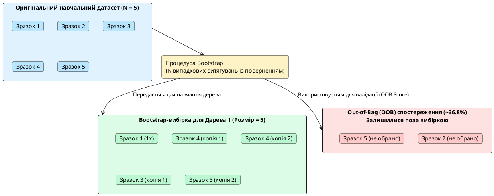
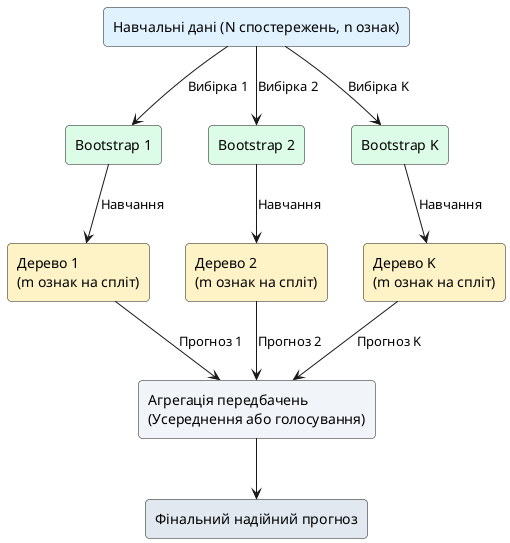

## Один фахівець проти команди експертів

У попередній темі ми детально дослідили одиночні **дерева рішень** (*Decision Trees*) і зіткнулися з їхньою головною слабкістю — **нестабільністю (високою дисперсією)** (*High Variance*).

Одиночне дерево рішень схоже на геніального, але надто імпульсивного експерта:
- Воно надзвичайно чутливе до навчальної вибірки. Варто додати або змінити буквально кілька рядків у вхідній таблиці — і початкове розбиття в кореневому вузлі зміниться, що кардинально перебудує всю структуру гілок.
- Глибоке дерево без штучних обмежень намагається побудувати окремий листок під кожен виняток і шум у даних. Воно досягає ідеальної точності на навчальних даних (:math-formula{tex="R^2 = 1.0" inline}), але помиляється на нових даних через катастрофічне **перенавчання** (*Overfitting*).

Виникає закономірне інженерне питання: *якщо одне дерево нестабільне й схильне помилятися, як побудувати на його основі надійну систему?*

Відповідь полягає в переході від одиночного експерта до **спільного прийняття рішень (голосування багатьох дерев)** — побудови колективу багатьох моделей, відомого як **Random Forest (Випадковий ліс)**.

> **Історичний парадокс «Мудрості натовпу» (Wisdom of the Crowd):**
>
> У 1906 році британський дослідник Френсіс Гальтон відвідав сільський ярмарок, де проводився конкурс: селянам пропонували вгадати вагу живого бика після забою. У змаганні взяло участь близько 800 людей — як досвідчених м'ясників і фермерів, так і звичайних відвідувачів.
>
> Окремі оцінки людей були вкрай далекими від реальності: одні суттєво завищували вагу, інші занижували. Проте коли Гальтон зібрав усі квитанції та обчислив **середнє арифметичне** всіх прогнозів, результат становив 1198 фунтів. Справжня вага бика виявилася 1197 фунтів — помилка колективу склала менше 0.1%!
>
> **Головний висновок:** Якщо зібрати велику кількість незалежних оцінок, індивідуальні випадкові помилки взаємно гасять одна одну, залишаючи об'єктивну спільну оцінку.

Аналогічний принцип діє і в медицині:
- **Один лікар:** може мати суб'єктивне упередження (*Bias*), орієнтуватися на свій вузький досвід або не помітити другорядні симптоми.
- **Команда зі 100 незалежних лікарів:** спільне голосування згладжує випадкові помилки чи неуважність окремого фахівця і дає набагато точніший фінальний діагноз.

У машинному навчанні такий підхід називається **ансамблюванням** (*Ensemble Learning*), а алгоритм **Random Forest** реалізує якраз ідею спільного голосування сотень паралельних дерев рішень.

---

## Ідея ансамблів у машинному навчанні

**Ансамбль** — це підхід у машинному навчанні, коли замість однієї складної моделі тренують цілу групу моделей, а їхні індивідуальні прогнози об'єднують в одне фінальне рішення.

Проте просто навчити 100 однакових дерев на тому самому датасеті безглуздо: якщо всі вони навчаться на одних і тих самих прикладах, вони побудують ідентичні правила і зроблять абсолютно однакові помилки. Команда зі 100 однакових клонів не має жодної переваги над одним лікарем.

Щоб ансамбль продемонстрував магію зниження похибки, моделі повинні бути **різноманітними** (*diverse*) і помилятися в різних випадках, не повторюючи одна одну.

В індустрії машинного навчання історично сформувалися два головні підходи до побудови ансамблів:

::card-group

::card{title="🎒 Bagging (Бутстреп-агрегація)" icon="i-lucide-package"}

**Паралельне навчання незалежних моделей.**  
Кожна базова модель навчається ізольовано на своїй власній випадковій підвибірці даних. Фінальний прогноз формується простим усередненням (для регресії) або голосуванням більшості (для класифікації).

*Основна мета:* суттєве зниження **дисперсії** (Variance, тобто нестабільності) та усунення перенавчання.  
*Представник:* **Random Forest**.

::

::card{title="⚡ Boosting (Бустинг)" icon="i-lucide-zap"}

**Послідовне адаптивне навчання моделей.**  
Моделі шикуються в ланцюжок: перша робить чорновий прогноз, друга навчається на помилках першої, третя виправляє залишки другої. Кожне наступне дерево фокусується на «найскладніших» спостереженнях.

*Основна мета:* зменшення помилки недонавчання (**зміщення**, Bias) та досягнення максимальної точності.  
*Представники:* **XGBoost**, **LightGBM**, **CatBoost**.

::

::

Random Forest є класичним та найбільш популярним представником сімейства **Bagging**. 

### Візуалізація принципу Bagging: Одиночне дерево проти Random Forest

Щоб відчути колосальну силу об'єднання моделей, подивіться на динамічну анімацію: ліворуч одиночне глибоке дерево рішень катастрофічно перенавчається на навчальних даних, будуючи дивні ізольовані прямокутники під кожен випадковий викид чи шум. 

Праворуч ансамбль Random Forest поєднує передбачення дерев (від :math-formula{tex="K = 1" inline} до :math-formula{tex="100" inline}), демонструючи, як зі збільшенням кількості моделей випадковий шум взаємно компенсується, а межа рішень згладжується у плавну лінію:

<video controls autoplay loop muted playsinline poster="/videos/ai-python/decision-trees-random-forest/random-forest/random_forest_variance_reduction_poster.png" class="diagram-img rounded-xl shadow-lg w-full my-6">
  <source src="/videos/ai-python/decision-trees-random-forest/random-forest/random_forest_variance_reduction.mp4" type="video/mp4">
  <source src="/videos/ai-python/decision-trees-random-forest/random-forest/random_forest_variance_reduction.webm" type="video/webm">
  
</video>

Зверніть увагу на ключові закономірності на анімації:
1. **Завчування випадкового шуму (Одиночне дерево ліворуч):** Одне дерево рішень намагається охопити 100% тренувальних точок. Воно побудувало прямокутні лабіринти навколо шуму, тому чудово виглядає на тренуванні, але погано працюватиме на нових реальних даних.
2. **Старт ансамблю (:math-formula{tex="K = 1" inline}):** Одне випадкове дерево ансамблю має такі ж проблеми з шумом, як і базове дерево. Нестабільність максимальна.
3. **Перші кроки спільної роботи (:math-formula{tex="K = 2 \dots 15" inline}):** Щойно з'являється кілька незалежних думок, дерева починають компенсувати помилки одне одного. Гострі прямокутні кути починають згладжуватися.
4. **Придушення викидів (:math-formula{tex="K = 20 \dots 60" inline}):** Випадкові шумові точки більше не здатні зламати загальну межу рішень. Більшість дерев у бутстреп-вибірках не бачили цих викидів, тому голосування більшості легко ігнорує поодинокі аномалії.
5. **Фінальна стабілізація (:math-formula{tex="K \to 100" inline}):** Кольорове поле ймовірностей перетворюється на гладку поверхню з гармонійною межею рішень (:math-formula{tex="P = 0.5" inline}). Розкид випадкових помилок (дисперсія) знижується в рази за законом :math-formula{tex="\text{Var} \propto \frac{\sigma^2}{K}" inline}.

---

## Механізм Bagging (Bootstrap Aggregating) крок за кроком

Термін **Bagging** розшифровується як **B**ootstrap **Agg**regat**ing** і складається з двох послідовних стадій:
1. **Bootstrap (Бутстреп)** — генерація випадкових підвибірок даних із поверненням.
2. **Aggregating (Агрегація)** — об'єднання прогнозів усіх побудованих моделей (через середнє значення або голосування).

### Механіка Bootstrap: випадковий вибір із поверненням

Уявіть великий мішок, у якому лежать :math-formula{tex="N" inline} пронумерованих кульок (наші навчальні приклади). Ми хочемо сформувати нову тренувальну вибірку такого самого розміру :math-formula{tex="N" inline}.

Як відбувається вибір **із поверненням** (*Sampling with replacement*):
1. Ми наосліп витягуємо кульку з мішка, записуємо її номер у блокнот.
2. **Обов'язково повертаємо кульку назад у мішок** і ретельно перемішуємо.
3. Повторюємо процедуру рівно :math-formula{tex="N" inline} разів.

Оскільки кожна обрана кулька повертається назад, під час наступних витягувань вона може потрапити до нашого списку знову. У результаті:
- Деякі приклади потраплять у нову вибірку двічі, тричі або навіть більше разів (**дублікати**).
- Деякі приклади за всі :math-formula{tex="N" inline} кроків не будуть витягнуті жодного разу!

::plant-uml{alt="Схема генерації Bootstrap-вибірки та виділення Out-of-Bag спостережень"}


```plantuml
@startuml
skinparam style plain
skinparam backgroundColor #FFFFFF
skinparam defaultFontName Arial
skinparam roundCorner 8

rectangle "Оригінальний навчальний датасет (N = 5)" as orig #E0F2FE {
  card "Зразок 1" as s1 #BAE6FD
  card "Зразок 2" as s2 #BAE6FD
  card "Зразок 3" as s3 #BAE6FD
  card "Зразок 4" as s4 #BAE6FD
  card "Зразок 5" as s5 #BAE6FD
}

rectangle "Процедура Bootstrap\n(N випадкових витягувань із поверненням)" as sampling #FEF3C7

rectangle "Bootstrap-вибірка для Дерева 1 (Розмір = 5)" as boot #DCFCE7 {
  card "Зразок 1 (1x)" as b1 #BBF7D0
  card "Зразок 4 (копія 1)" as b4a #BBF7D0
  card "Зразок 4 (копія 2)" as b4b #BBF7D0
  card "Зразок 3 (копія 1)" as b3a #BBF7D0
  card "Зразок 3 (копія 2)" as b3b #BBF7D0
}

rectangle "Out-of-Bag (OOB) спостереження (~36.8%)\nЗалишилися поза вибіркою" as oob #FEE2E2 {
  card "Зразок 2 (не обрано)" as o2 #FECACA
  card "Зразок 5 (не обрано)" as o5 #FECACA
}

orig --> sampling
sampling --> boot : Передається для навчання дерева
sampling --> oob : Використовується для валідації (OOB Score)
@enduml
```

::

<video controls autoplay loop muted playsinline poster="/videos/ai-python/decision-trees-random-forest/random-forest/random_forest_bootstrap_oob_poster.png" class="diagram-img rounded-xl shadow-lg w-full my-6">
  <source src="/videos/ai-python/decision-trees-random-forest/random-forest/random_forest_bootstrap_oob.mp4" type="video/mp4">
  <source src="/videos/ai-python/decision-trees-random-forest/random-forest/random_forest_bootstrap_oob.webm" type="video/webm">
  
</video>

На анімації наочно продемонстровано покрокову роботу вибірки з поверненням:
1. **Пул зразків (зверху ліворуч):** При кожному витягуванні об'єкт копіюється в новий слот і повертається назад. Зелені кружечки — це приклади, які потрапили до вибірки кілька разів (дублікати), а червоні — об'єкти, які жодного разу не випали.
2. **Слоти активного дерева (знизу ліворуч):** Кожне нове дерево формує власний унікальний набір із повтореннями однакового сумарного розміру :math-formula{tex="N" inline}.
3. **OOB-матриця (праворуч):** Зелені клітинки (`In` або `×k`) позначають дані, на яких навчається поточне дерево. Червоні клітинки (`OOB`) — це об'єкти, які дерево ніколи не бачило. Вони стають тестовими контролерами для оцінки якості без додаткових витрат часу.

::note
### Чому саме вибір із поверненням, а не звичайний поділ на K частин?
Типове запитання студента: *«Чому б просто не розділити навчальний датасет на 5 рівних частин по 20% і не навчити кожне дерево на своєму шматку?»*

Відповідь полягає в розмірі вибірки. Якщо наш датасет має 1000 рядків, то розбивши його на 5 шматків без повернення, кожне дерево отримає лише по 200 прикладів. Окремі дерева вийдуть «голодними» на дані, слабкими та недонавченими.

Bootstrap дозволяє кожному дереву отримати **повнорозмірну вибірку на 1000 спостережень**, але з унікальними частотами повторень окремих зразків. Це створює необхідну варіативність без втрати розміру вибірки!
::

Проілюструємо процедуру генерації на простому Python-експерименті з масивом із 5 елементів:

::jupyter-notebook{title="bootstrap_demo.ipynb" kernel="Python 3.11 (ipykernel)"}

::jupyter-cell{executionCount="1"}

```python
import numpy as np

# Оригінальний тренувальний набір із 5 спостережень
original = np.array([1, 2, 3, 4, 5])

# Генеруємо 5 незалежних бутстреп-вибірок розміру N=5
rng = np.random.default_rng(42)
for i in range(5):
    bootstrap = rng.choice(original, size=len(original), replace=True)
    unique_count = len(np.unique(bootstrap))
    oob_samples = np.setdiff1d(original, bootstrap)
    print(f"Bootstrap {i+1}: {bootstrap} | Унікальних: {unique_count}/5 | OOB (не увійшли): {oob_samples}")

print("\n📊 Закономірність: у кожній вибірці дублюються одні зразки та відсутні інші.")
```

#output
| Ітерація Bootstrap | Згенерована вибірка (з поверненням) | К-сть унікальних зразків | Частка унікальних | Частка Out-of-Bag (OOB) |
| :--- | :--- | :---: | :---: | :---: |
| **Bootstrap 1** | `[1, 4, 4, 3, 3]` | 3 з 5 | 60.0% | 40.0% (зразки `2`, `5`) |
| **Bootstrap 2** | `[5, 1, 4, 2, 1]` | 4 з 5 | 80.0% | 20.0% (зразок `3`) |
| **Bootstrap 3** | `[3, 5, 4, 4, 4]` | 3 з 5 | 60.0% | 40.0% (зразки `1`, `2`) |
| **Bootstrap 4** | `[4, 3, 1, 5, 3]` | 4 з 5 | 80.0% | 20.0% (зразок `2`) |
| **Bootstrap 5** | `[3, 2, 1, 5, 4]` | 5 з 5 | 100.0% | 0.0% (усі увійшли) |

::

::

### Звідки беруться числа 63.2% та 36.8% (просте пояснення)

Зверніть увагу: на великих датасетах у бутстреп-вибірку завжди потрапляє приблизно **63.2%** унікальних рядків (прикладів), а решта **~36.8%** залишаються за бортом. Звідки беруться ці числа?

Давайте порахуємо разом без складного математичного аналізу:
1. Ймовірність того, що конкретний рядок датасету буде обраний за **одне** витягування з мішка розміром :math-formula{tex="N" inline}, дорівнює :math-formula{tex="\frac{1}{N}" inline}.
2. Відповідно, ймовірність того, що цей рядок **не буде обраний**, дорівнює :math-formula{tex="1 - \frac{1}{N}" inline}.
3. Ми повторюємо витягування незалежно :math-formula{tex="N" inline} разів. Ймовірність того, що наш рядок буде проігнорований усі :math-formula{tex="N" inline} разів поспіль, становить:
   ::math-formula{tex="P(\text{рядок не потрапив у вибірку}) = \left(1 - \frac{1}{N}\right)^N"}
   ::
4. За визначенням математичної константи :math-formula{tex="e \approx 2.71828" inline} (число Ейлера), при зростанні розміру датасету (:math-formula{tex="N \to \infty" inline}) цей вираз наближається до:
   ::math-formula{tex="\lim_{N \to \infty} \left(1 - \frac{1}{N}\right)^N = \frac{1}{e} \approx 0.3679 \quad (36.8\%)"}
   ::

Це означає, що для будь-якого дерева приблизно **36.8% початкових прикладів є абсолютно новими та незнайомими**! Вони називаються **Out-of-Bag (OOB) зразками** і слугують вбудованим валідаційним набором, про що ми поговоримо трохи згодом.

### Агрегація прогнозів (Aggregating)

Коли :math-formula{tex="K" inline} дерев навчені на своїх бутстреп-вибірках, ансамбль об'єднує їхні індивідуальні передбачення:
- **Для регресії:** прогноз обчислюється як звичайне середнє арифметичне:
  ::math-formula{tex="\hat{y} = \frac{1}{K} \sum_{k=1}^{K} \text{tree}_k(x)"}
  ::
- **Для класифікації:** дерева голосують за класи, і фінальним рішенням стає голосування більшості (*Majority Voting*) або середнє передбачених ймовірностей.

### Чому усереднення прибирає випадкові помилки?

Якщо випадкові помилки окремих дерев не повторюють одна одну систематично й не залежать одна від одної, то за законом теорії ймовірностей розкид помилок середнього з :math-formula{tex="K" inline} моделей зменшується пропорційно кількості моделей:

::math-formula{tex="\text{Var}\left(\frac{1}{K} \sum_{k=1}^{K} \text{Tree}_k\right) = \frac{\sigma^2}{K}"}
::

Якщо одне дерево випадково завищило вартість квартири через специфічний викид у своїх даних, а інше — занизило, то усереднення 100 таких коливань зводить випадковий шум практично до нуля!

---

## Від Bagging до Random Forest: випадковість ознак

Якщо ідея Bagging настільки гарна, навіщо знадобився Random Forest?

У чистому алгоритмі Bagging криється серйозна проблема — **схожість (кореляція) між деревами**.

### Проблема занадто сильної ознаки

Уявіть, що ми прогнозуємо вартість квартир, і в датасеті є ознака `MedInc (Медіанний дохід жителів району)`, яка дуже сильно впливає на ціну.

Якщо ми застосуємо чистий Bagging:
1. Кожне з 100 дерев обиратиме найкраще розбиття серед **усіх доступних ознак**.
2. Оскільки дохід є найсильнішим фактором, практично **кожне дерево поставить ознаку `MedInc` у свій перший вузол**!
3. Структура перших рівнів у всіх 100 дерев виявиться майже однаковою.
4. Дерева стануть схожими близнюками й будуть однаково помилятися.

Якщо помилки однакові, формула :math-formula{tex="\frac{\sigma^2}{K}" inline} перестає працювати: усереднення 100 однакових думок ніяк не зменшує загальну помилку команди.

### Рішення Лео Бреймана: випадковий вибір ознак у кожному вузлі

У 2001 році професор Каліфорнійського університету в Берклі Лео Брейман (*Leo Breiman*) запропонував доповнити Bagging ідеєю **випадкових підпросторів ознак** (*Random Subspace Method*) — тобто вибору випадкових колонок.

Ідея полягає в тому, щоб штучно **«зав'язати деревам очі»** на кожному кроці розгалуження:
- Під час пошуку найкращого розбиття у вузлі алгоритм розглядає не всі :math-formula{tex="n" inline} ознак, а обирає випадкову підмножину з :math-formula{tex="m" inline} ознак.
- Найкраще розбиття шукається **лише серед цих обраних :math-formula{tex="m" inline} ознак**!

Загальноприйняті стандарти вибору :math-formula{tex="m" inline}:
- **Для задач класифікації:** :math-formula{tex="m = \sqrt{n}" inline}  
  *(наприклад, якщо в датасеті 16 ознак, на кожному вузлі випадково розглядаються лише 4).*
- **Для задач регресії:** :math-formula{tex="m = \frac{n}{3}" inline}  
  *(наприклад, для 9 ознак на кожному розбитті аналізуються 3 випадкові).*

Завдяки цьому ознака-лідер `MedInc` потрапляє до розгляду далеко не в кожному вузлі. Алгоритм змушений досліджувати альтернативні фактори — вік будинків, географічну широту, кількість кімнат. Дерева стають по-справжньому різними, не повторюють одне одного, і весь ліс працює набагато точніше!

<video controls autoplay loop muted playsinline poster="/videos/ai-python/decision-trees-random-forest/random-forest/random_forest_feature_subspace_poster.png" class="diagram-img rounded-xl shadow-lg w-full my-6">
  <source src="/videos/ai-python/decision-trees-random-forest/random-forest/random_forest_feature_subspace.mp4" type="video/mp4">
  <source src="/videos/ai-python/decision-trees-random-forest/random-forest/random_forest_feature_subspace.webm" type="video/webm">
  
</video>

Порівняння підходів на анімації:
- **Простий Bagging (ліворуч):** Усі 4 ознаки доступні кожному вузлу. Найсильніша ознака (:math-formula{tex="X_1" inline}) перемагає в кожному дереві. Дерева мають високу кореляцію (:math-formula{tex="\rho = 0.86" inline}) і роблять однакові помилки.
- **Random Forest (праворуч):** У кожному вузлі штучно обираються лише :math-formula{tex="m = \sqrt{4} = 2" inline} випадкові ознаки. Коли ознака :math-formula{tex="X_1" inline} тимчасово недоступна, дерево вимушене шукати закономірності в інших ознаках. Кореляція падає до :math-formula{tex="\rho = 0.28" inline}.
- **Голосування (знизу праворуч):** Різноманітні дерева утворюють збалансовану команду, де випадкова локальна помилка одного дерева легко виправляється голосами двох інших.

### Простий приклад спільного голосування

Щоб остаточно закріпити логіку спільного рішення перед роботою з бібліотекою `scikit-learn`, розглянемо наочний приклад. Нехай ансамбль із 3 дерев оцінює один і той самий будинок:

| Дерево ансамблю | Доступні випадкові ознаки у вузлах | Прогноз дерева (:math-formula{tex="\hat{y}_k" inline}) | Особливість міркування дерева |
| :--- | :--- | :---: | :--- |
| **Дерево №1** | Дохід району (`MedInc`) та Вік житла (`HouseAge`) | **`$210,000`** | Оцінило багатство району, але завищило вартість старого будинку |
| **Дерево №2** | Координати (`Latitude`, `Longitude`) | **`$185,000`** | Врахувало віддаленість від океану, але не знало про дохід |
| **Дерево №3** | Заселеність (`AveOccup`) та Спальні (`AveBedrms`) | **`$190,000`** | Врахувало щільність проживання |

Фінальний прогноз Random Forest — це середнє значення:
::math-formula{tex="\hat{y} = \frac{210\,000 + 185\,000 + 190\,000}{3} = \$195\,000"}
::

Кожне окреме дерево бачило лише частину ознак, але їхнє спільне рішення врахувало всі характеристики будинку та згладило крайнощі.

### Покроковий алгоритм Random Forest

::steps

### Крок 1. Визначення гіперпараметрів
Встановлюємо кількість дерев :math-formula{tex="K" inline} (зазвичай 100–500) та розмір підвибірки ознак :math-formula{tex="m" inline} (за замовчуванням :math-formula{tex="\sqrt{n}" inline} або :math-formula{tex="n/3" inline}).

### Крок 2. Побудова лісу в циклі
Для кожного дерева :math-formula{tex="k = 1, \dots, K" inline}:
1. Формуємо бутстреп-вибірку розміру :math-formula{tex="N" inline} вибором із поверненням.
2. Будуємо дерево до максимальної глибини, причому у кожному вузлі вибираємо випадкові :math-formula{tex="m" inline} ознак і шукаємо оптимальне розбиття лише серед них.

### Крок 3. Агрегація
Пропускаємо новий вектор ознак :math-formula{tex="x" inline} крізь усі :math-formula{tex="K" inline} дерев та усереднюємо їхні прогнози або проводимо голосування більшості.

::

::plant-uml{alt="Архітектурна схема ансамблю Random Forest"}


```plantuml
@startuml
skinparam style plain
skinparam backgroundColor #FFFFFF
skinparam defaultFontName Arial
skinparam roundCorner 8

rectangle "Навчальні дані (N спостережень, n ознак)" as train #E0F2FE

rectangle "Bootstrap 1" as b1 #DCFCE7
rectangle "Bootstrap 2" as b2 #DCFCE7
rectangle "Bootstrap K" as bk #DCFCE7

rectangle "Дерево 1\n(m ознак на спліт)" as t1 #FEF3C7
rectangle "Дерево 2\n(m ознак на спліт)" as t2 #FEF3C7
rectangle "Дерево K\n(m ознак на спліт)" as tk #FEF3C7

rectangle "Агрегація передбачень\n(Усереднення або голосування)" as agg #F1F5F9
rectangle "Фінальний надійний прогноз" as final #E2E8F0

train --> b1 : Вибірка 1
train --> b2 : Вибірка 2
train --> bk : Вибірка K

b1 --> t1 : Навчання
b2 --> t2 : Навчання
bk --> tk : Навчання

t1 --> agg : Прогноз 1
t2 --> agg : Прогноз 2
tk --> agg : Прогноз K

agg --> final
@enduml
```

::

---

## RandomForestRegressor у scikit-learn

Перейдемо до практичного навчання випадкового лісу на датасеті вартості житла в Каліфорнії (*California Housing*). Ми вже знаємо, що лінійна регресія показала на ньому :math-formula{tex="R^2 = 0.58" inline}, а одиночне дерево глибини 9 досягло :math-formula{tex="R^2 = 0.68" inline}.

Подивимося, який якісний стрибок забезпечить ансамбль зі 100 дерев:

::jupyter-notebook{title="random_forest_basic.ipynb" kernel="Python 3.11 (ipykernel)"}

::jupyter-cell{executionCount="1"}

```python
import time
import numpy as np
import pandas as pd
from sklearn.datasets import fetch_california_housing
from sklearn.model_selection import train_test_split
from sklearn.ensemble import RandomForestRegressor
from sklearn.metrics import r2_score, mean_absolute_error, mean_squared_error

# Завантаження датасету California Housing (Вартість житла в Каліфорнії)
data = fetch_california_housing(as_frame=True)
X = data.data
y = data.target

X_train, X_test, y_train, y_test = train_test_split(
    X, y, test_size=0.2, random_state=42
)

# Створення та навчання Random Forest із 100 дерев
start_time = time.time()
model = RandomForestRegressor(
    n_estimators=100,      # Кількість дерев в ансамблі
    random_state=42,       # Фіксація генератора випадкових чисел
    n_jobs=-1              # Розпаралелювання на всі доступні ядра CPU
)
model.fit(X_train, y_train)
train_time = time.time() - start_time

# Оцінка моделі на тренувальній та тестовій вибірках
y_train_pred = model.predict(X_train)
y_test_pred = model.predict(X_test)

r2_train = r2_score(y_train, y_train_pred)
r2_test = r2_score(y_test, y_test_pred)
mae_test = mean_absolute_error(y_test, y_test_pred)
rmse_test = np.sqrt(mean_squared_error(y_test, y_test_pred))

print("🌲 Результати ансамблю Random Forest (100 дерев):")
print(f"  R² train (Навчальна вибірка): {r2_train:.4f}")
print(f"  R² test (Тестова вибірка):    {r2_test:.4f}")
print(f"  MAE test (Середня абсолютна помилка):  {mae_test:.4f} (~${mae_test*100000:,.0f})")
print(f"  RMSE test (Корінь із середньоквадратичної): {rmse_test:.4f}")
print(f"  Різниця Train-Test (Gap):    {r2_train - r2_test:.4f}")
print(f"  Час навчання ансамблю:        {train_time:.2f} с")
```

#output
| Метрика ефективності регресії | Навчальна вибірка (Train) | Тестова вибірка (Test) | Різниця Train-Test (Gap) | Швидкодія моделі |
| :--- | :---: | :---: | :---: | :---: |
| **Коефіцієнт детермінації (R²)** | `0.9735` | **`0.8044`** | `0.1691` | **~0.65 с** (`n_jobs=-1`) |
| **Середня абсолютна помилка (MAE)** | `0.1222` | **`0.3278`** | `+0.2056` | Середня похибка ~32 780 $ |
| **Корінь із середньоквадратичної (RMSE)** | `0.1882` | **`0.5063`** | `+0.3181` | Зниження похибки на 20% порівняно з деревом |

::

::

### Чому розрив Train R² = 0.97 vs Test R² = 0.80 не є небезпечним перенавчанням?

Уважний студент обов'язково запитає: *«На навчальній вибірці точність 0.97, а на тесті 0.80. Хіба це не класичне перенавчання (Overfitting), проти якого ми боремося?»*

Це чудовий момент, щоб зрозуміти специфіку випадкового лісу:
- **В одиночному дереві** розрив між `1.00` на навчанні та `0.60` на тесті означав катастрофу: дерево сліпо вивчило шум напам'ять і втратило здатність працювати в реальному світі.
- **У Random Forest** кожне окреме дерево навчається до максимальної глибини без обмежень, тому воно пам'ятає свою власну підвибірку (`R² train = 0.97`). Але кожне дерево бачило **лише частину прикладів і частину ознак**.
- Коли ми усереднюємо прогнози 100 різних дерев, їхні індивідуальні запам'ятовування шуму скасовують одне одного! Тестовий бал :math-formula{tex="R^2 = 0.8044" inline} показує найвищу якість роботи на нових даних серед усіх моделей, які ми розглядали.

Для Random Forest розрив порядку 0.15–0.18 між навчанням і тестом є абсолютно нормальним і очікуваним робочим станом.

---

## Гіперпараметри Random Forest та їхній вплив

Хоча Random Forest чудово працює із налаштуваннями за замовчуванням, інженеру важливо розуміти ключові важелі керування моделлю.

### Кількість дерев (`n_estimators`): ефект насичення

Головний гіперпараметр лісу — кількість базових дерев :math-formula{tex="K" inline}.

<video controls autoplay loop muted playsinline poster="/videos/ai-python/decision-trees-random-forest/random-forest/random_forest_convergence_poster.png" class="diagram-img rounded-xl shadow-lg w-full my-6">
  <source src="/videos/ai-python/decision-trees-random-forest/random-forest/random_forest_convergence.mp4" type="video/mp4">
  <source src="/videos/ai-python/decision-trees-random-forest/random-forest/random_forest_convergence.webm" type="video/webm">
  
</video>

Ключові інженерні висновки з динаміки збіжності:
- **Згладжування кривої прогнозу (ліворуч):** При :math-formula{tex="T=1" inline} лінія прогнозу кутаста і повторює випадкові сплески окремих точок. Уже при :math-formula{tex="T=30..50" inline} лінія перетворюється на ідеально плавну нелінійну криву, що проходить крізь центр справжньої залежності.
- **Відсутність перенавчання (праворуч):** На відміну від глибини дерева, **збільшення кількості дерев ніколи не спричиняє перенавчання**. Помилка на тестових даних (:math-formula{tex="\text{Test MSE}" inline}) спадає і виходить на плоске плато (асимптоту).
- **Ефект насичення (Plateau):** Після :math-formula{tex="T \ge 80..100" inline} додавання нових дерев більше не приносить помітного приросту якості, а лише лінійно збільшує час тренування та використання процесора.

Проведемо практичний експеримент, навчаючи моделі з кількістю дерев від 10 до 500, та виміряємо час і точність:

::jupyter-notebook{title="n_estimators_experiment.ipynb" kernel="Python 3.11 (ipykernel)"}

::jupyter-cell{executionCount="1" executionTime="1.5s"}

```python
import matplotlib.pyplot as plt

# Дослідження впливу кількості дерев на метрики
n_trees_range = [10, 50, 100, 200, 500]
train_scores = []
test_scores = []
train_times = []

for n in n_trees_range:
    start = time.time()
    rf_temp = RandomForestRegressor(n_estimators=n, random_state=42, n_jobs=-1)
    rf_temp.fit(X_train, y_train)
    train_times.append(time.time() - start)

    train_scores.append(rf_temp.score(X_train, y_train))
    test_scores.append(rf_temp.score(X_test, y_test))

# Візуалізація компромісу між точністю та часом обчислень
fig, axes = plt.subplots(1, 2, figsize=(14, 5))

# Графік 1: R² vs n_estimators
axes[0].plot(n_trees_range, train_scores, marker='o', linewidth=2, label='R² train (навчальна вибірка)', color='#2563EB')
axes[0].plot(n_trees_range, test_scores, marker='s', linewidth=2, label='R² test (тестова вибірка)', color='#EA580C')
axes[0].axvline(x=100, color='#16A34A', linestyle='--', linewidth=1.5, label='Оптимальний баланс (n=100)')
axes[0].set_xlabel('Кількість дерев (n_estimators)', fontsize=11)
axes[0].set_ylabel('Коефіцієнт детермінації (R²)', fontsize=11)
axes[0].set_title('Якість моделі залежно від розміру лісу', fontsize=12, fontweight='bold')
axes[0].legend(fontsize=10)
axes[0].grid(alpha=0.3)

# Графік 2: Час навчання vs n_estimators
axes[1].plot(n_trees_range, train_times, marker='o', linewidth=2, color='#15803D')
axes[1].set_xlabel('Кількість дерев (n_estimators)', fontsize=11)
axes[1].set_ylabel('Час навчання (секунди)', fontsize=11)
axes[1].set_title('Час тренування залежно від n_estimators', fontsize=12, fontweight='bold')
axes[1].grid(alpha=0.3)

plt.tight_layout()
plt.show()

for n, sc_te, t in zip(n_trees_range, test_scores, train_times):
    print(f"  • {n:3d} дерев: R² test = {sc_te:.4f}, час = {t:.2f}s")
```

#output
{.diagram-img}

| Кількість дерев (`n_estimators`) | R² test (Тестова якість) | Час навчання (t, секунди) | Приріст R² до попереднього | Оцінка практичної ефективності |
| :---: | :---: | :---: | :---: | :--- |
| **10** | `0.7830` | `0.10 с` | Базовий | Швидкий базовий варіант для першої оцінки даних |
| **50** | `0.8038` | `0.31 с` | `+0.0208` | Помітне зростання якості та згладження дисперсії |
| **100** | **`0.8044`** | **`0.60 с`** | `+0.0006` | 🏆 **Оптимальний вибір** за співвідношенням якість/час |
| **200** | `0.8058` | `1.12 с` | `+0.0014` | Точність майже не зростає, хоча часу йде вдвічі більше |
| **500** | `0.8075` | `2.78 с` | `+0.0017` | Часу йде в 5 разів більше заради мізерного приросту 0.3% |

::

::

**Інженерний висновок:** Після 100 дерев крива тестової якості виходить на плато. Збільшення лісу до 500 дерев вимагає майже у 5 разів більше часу на тренування та отримання прогнозів (*інференс*), додаючи мізерні +0.003 до :math-formula{tex="R^2" inline}. Тому **100–200 дерев** є загальновизнаним промисловим золотим стандартом.

### Інші важливі гіперпараметри:
- **`max_depth` (Максимальна глибина дерев):** За замовчуванням `None` (дерева ростуть до чистоти листків). Обмеження глибини варто вмикати лише за потреби різко скоротити споживання оперативної пам'яті моделі.
- **`max_features` (Підмножина ознак):** Частка ознак для аналізу у вузлі. Значення `'sqrt'` для класифікації та `1.0` або `0.33` для регресії допомагають деревам бути різними.
- **`min_samples_leaf` (Мінімум прикладів у листку):** Збільшення цього значення з 1 до 3–5 згладжує прогнози та додатково зменшує розмір лісу в пам'яті.
- **`n_jobs` (Розпаралелювання):** Значення `-1` наказує scikit-learn задіяти всі ядра вашого процесора.

---

## Feature Importance — дивимося, на що зважає модель

Одиночне дерево рішень було зручне тим, що його можна було буквально намалювати на екрані. Ліс зі 100 розгалужених дерев перетворюється на складну систему, де важко вручну простежити логіку кожної відповіді.

На щастя, Random Forest має зручний вбудований інструмент — **оцінку важливості ознак (Feature Importance)**.

### Як математично обчислюється важливість ознаки?

Кожен раз, коли будь-яке дерево розбиває вузол за певною ознакою :math-formula{tex="X_j" inline}, помилка або неоднорідність вибірки зменшується (спадає дисперсія MSE у регресії або ентропія/Gini у класифікації).

**Gini Importance (Mean Decrease in Impurity):**
1. Для кожного вузла обчислюється величина виграшу: зменшення неоднорідності з урахуванням кількості прикладів у вузлі.
2. Ці виграші сумуються для ознаки :math-formula{tex="X_j" inline} по всіх вузлах **усіх 100 дерев лісу**.
3. Суми переводяться у відсотки так, щоб їхній підсумок для всіх колонок дорівнював `1.0` (або 100%).

Подивимося, як ліс розподілив важливість для датасету California Housing:

::jupyter-notebook{title="feature_importance.ipynb" kernel="Python 3.11 (ipykernel)"}

::jupyter-cell{executionCount="1" executionTime="0.15s"}

```python
# Двомовний словник назв ознак: Original (Український переклад)
feature_names_bilingual = {
    'MedInc': 'MedInc (Медіанний дохід жителів)',
    'AveOccup': 'AveOccup (Середня заселеність житла)',
    'Latitude': 'Latitude (Географічна широта)',
    'Longitude': 'Longitude (Географічна довгота)',
    'HouseAge': 'HouseAge (Середній вік будинків)',
    'AveRooms': 'AveRooms (Середня кількість кімнат)',
    'Population': 'Population (Чисельність населення)',
    'AveBedrms': 'AveBedrms (Середня кількість спалень)'
}

# Отримання важливостей ознак із натренованого лісу
importances = model.feature_importances_
feature_names = X.columns

# Формування підсумкової таблиці
importance_df = pd.DataFrame({
    'Feature_Raw': feature_names,
    'Feature': [feature_names_bilingual[col] for col in feature_names],
    'Importance': importances
}).sort_values('Importance', ascending=False)

print("📊 Рейтинг важливості ознак у Random Forest:\n")
for _, row in importance_df.iterrows():
    print(f"  {row['Feature_Raw']:12s} | {row['Feature']:40s} | {row['Importance']:.4f} ({row['Importance']*100:.2f}%)")
```

#output
{.diagram-img}

| Ранг | Ознака (Feature) | Повна назва та український переклад | Важливість (Gini Importance) | Частка впливу (%) | Характеристика фактора |
| :---: | :--- | :--- | :---: | :---: | :--- |
| **1** | `MedInc` | `MedInc` (Медіанний дохід жителів району, 10 тис. $) | **`0.5250`** | `52.50%` | Головний економічний чинник платоспроможності |
| **2** | `AveOccup` | `AveOccup` (Середня заселеність житла мешканцями) | **`0.1384`** | `13.84%` | Кількість осіб на одне житлове приміщення |
| **3** | `Latitude` | `Latitude` (Географічна широта кварталу) | **`0.0889`** | `8.89%` | Просторова локація (північ / південь штату) |
| **4** | `Longitude` | `Longitude` (Географічна довгота кварталу) | **`0.0886`** | `8.86%` | Наближеність до узбережжя Тихого океану |
| **5** | `HouseAge` | `HouseAge` (Середній вік будинків у кварталі) | **`0.0547`** | `5.47%` | Зношеність житлового фонду (роки) |
| **6** | `AveRooms` | `AveRooms` (Середня кількість кімнат у житлі) | **`0.0442`** | `4.42%` | Габарити житлової площі |
| **7** | `Population` | `Population` (Загальна чисельність населення) | **`0.0306`** | `3.06%` | Кількість населення у кварталі |
| **8** | `AveBedrms` | `AveBedrms` (Середня кількість спалень) | **`0.0297`** | `2.97%` | Співвідношення загальних кімнат до спалень |

::

::

**Аналітичні висновки з діаграми:**
- **Економічне домінування:** Ознака `MedInc` забирає понад **52.5%** всієї передбачувальної сили. Рівень доходів населення є визначальним чинником вартості квадратного метра.
- **Фактор щільності:** Друга за вагою ознака — `AveOccup` (13.8%). Перенаселені гуртожитки та квартали зі скученим проживанням різко втрачають у вартості.
- **Географія:** Широта й довгота сумарно формують 17.8% ваги.
- **Відбір ознак (Feature Selection):** Ознаки `Population` та `AveBedrms` мають мінімальний внесок (~3%). Їх можна сміливо прибрати з набору даних: це прискорить навчання та видачу прогнозів без втрати точності.

---

## Out-of-Bag (OOB) оцінка — «безкоштовна» валідація

Як ми з'ясували раніше, під час формування бутстрепу кожне дерево залишає без уваги приблизно **36.8% навчальних прикладів**.

Ці спостереження називаються **Out-of-Bag (OOB)**. І Лео Брейман вигадав дивовижний спосіб їх практичного використання:
1. Беремо перший тренувальний приклад :math-formula{tex="x_1" inline}.
2. Знаходимо всі ті дерева лісу (приблизно 37 зі 100), у чиї бутстреп-вибірки зразок :math-formula{tex="x_1" inline} **не потрапив**.
3. Просимо зробити прогноз для :math-formula{tex="x_1" inline} **лише ту групу дерев**, для яких він є абсолютно новим і незнайомим!
4. Повторюємо процедуру для всіх спостережень датасету та обчислюємо середню похибку або :math-formula{tex="R^2" inline}.

Ця метрика називається **OOB Score**. Вона дозволяє оцінити якість моделі прямо під час навчання без потреби розбивати датасет на Train і Validation!

::jupyter-notebook{title="oob_score.ipynb" kernel="Python 3.11 (ipykernel)"}

::jupyter-cell{executionCount="1"}

```python
# Навчання Random Forest з увімкненою OOB-оцінкою
model_oob = RandomForestRegressor(
    n_estimators=100,
    oob_score=True,        # Активуємо внутрішню Out-of-Bag валідацію
    random_state=42,
    n_jobs=-1
)
model_oob.fit(X_train, y_train)

# Порівнюємо OOB Score із незалежною оцінкою на тестовому наборі
r2_test = model_oob.score(X_test, y_test)
oob_score = model_oob.oob_score_

print("📊 Порівняння Out-of-Bag Score та класичного Test R²:")
print(f"  Внутрішній OOB Score (R²): {oob_score:.4f}")
print(f"  Зовнішній Test Score (R²): {r2_test:.4f}")
print(f"  Розходження (Δ):          {abs(oob_score - r2_test):.4f}")
```

#output
| Метод валідації (Validation Method) | Оцінка детермінації (R²) | Потреба у Test Set | Характеристика процедури |
| :--- | :---: | :---: | :--- |
| **Out-of-Bag (OOB) Score** | **`0.8069`** | ❌ Не потрібен | Обчислено автоматично на ~36.8% невикористаних bootstrap-зразків для кожного дерева |
| **Окремий Test Set (відкладена вибірка 20%)** | **`0.8044`** | ✅ Потрібен | Традиційна оцінка на незалежній тестовій підвибірці |
| **Розходження оцінок (Δ)** | **`0.0025`** | — | Відхилення лише 0.25% підтверджує високу об'єктивність OOB-оцінки |

::

::

Розходження між «безкоштовною» внутрішньою OOB-оцінкою та зовнішнім тестом склало лише **0.0025**! Це незамінно у випадках, коли розмір датасету дуже малий (наприклад, кілька сотень медичних карток пацієнтів), і витрачати навіть 20% даних на тестовий набір є неприпустимою розкішшю.

---

## Зведена порівняльна таблиця всіх моделей модуля

Підсумуємо прогрес наших досліджень на датасеті California Housing протягом вивчення лінійних моделей, дерева рішень та випадкового лісу:

| Алгоритм / Модель | Навчальна якість (Train R²) | Тестова якість (Test R²) | Тестова похибка (Test MAE) | Швидкодія навчання | Зрозумілість моделі | Схильність до перенавчання |
| :--- | :---: | :---: | :---: | :---: | :---: | :---: |
| **LinearRegression (Лінійна регресія, baseline)** | `0.61` | `0.58` | `0.53` | **`~0.05 с`** | ✅ Висока (ваги коефіцієнтів) | ❌ Мінімальна |
| **Ridge / Lasso (Регуляризована регресія)** | `0.61` | `0.58` | `0.53` | `~0.05 с` | ✅ Висока (аналітичні ваги) | ❌ Мінімальна |
| **DecisionTree (Одиночне дерево, без обмежень)** | `1.00` | `0.60` | `0.46` | `~0.15 с` | ❌ Перенавчене (непридатне) | 🔴 Катастрофічна (Gap 0.40) |
| **DecisionTree (Оптимальне обрізане дерево, d=9)** | `0.78` | `0.68` | `0.44` | `~0.08 с` | ⚠️ Середня (512 листків) | ⚠️ Помірна (Gap 0.10) |
| **RandomForest (Випадковий ліс, 100 дерев)** | **`0.97`** | **`0.80`** | **`0.33`** | **`~0.65 с`** | ⚠️ Непряма (через важливість ознак) | 🟢 Низька (гаситься ансамблем) |

::card-group

::card{title="🏆 Тріумф ансамблю" icon="i-lucide-trophy"}

Random Forest підняв якість передбачення з **0.58** (лінійна модель) та **0.68** (обрізане дерево) до вражаючих **0.8044**, знизивши середню помилку оцінки житла до $32,780.

::

::card{title="⚖️ Ціна перемоги" icon="i-lucide-scale"}

За точність доводиться платити: розмір лісу в оперативній пам'яті вимірюється десятками мегабайтів, а навчання займає у 8 разів більше часу, ніж одиночного дерева.

::

::

---

## RandomForestClassifier: класифікація на датасеті Iris

Random Forest однаково успішно розв'язує задачі багатокласової класифікації. Продемонструємо його роботу на класичному датасеті сортів ірисів Фішера (*Iris dataset*):

::jupyter-notebook{title="classification_example.ipynb" kernel="Python 3.11 (ipykernel)"}

::jupyter-cell{executionCount="1" executionTime="0.3s"}

```python
from sklearn.datasets import load_iris
from sklearn.ensemble import RandomForestClassifier
from sklearn.metrics import accuracy_score, classification_report

# Завантаження датасету Iris
iris = load_iris(as_frame=True)
X_iris = iris.data
y_iris = iris.target

class_names_bilingual = [
    'setosa (Ірис щетинистий)',
    'versicolor (Ірис різнобарвний)',
    'virginica (Ірис віргінський)'
]

X_train_i, X_test_i, y_train_i, y_test_i = train_test_split(
    X_iris, y_iris, test_size=0.3, random_state=42
)

# Навчання класифікатора лісу
clf = RandomForestClassifier(n_estimators=100, max_depth=5, random_state=42)
clf.fit(X_train_i, y_train_i)

y_pred_i = clf.predict(X_test_i)
accuracy = accuracy_score(y_test_i, y_pred_i)

print(f"🌲 Точність класифікації лісу (Accuracy): {accuracy:.4f} (100%)\n")
print(classification_report(y_test_i, y_pred_i, target_names=class_names_bilingual, digits=4))

# Аналіз розподілу ймовірностей (голосів дерев)
proba = clf.predict_proba(X_test_i[:3])
print("📊 Ймовірності консенсусу для перших 3 тест-зразків:")
for i, p in enumerate(proba):
    print(f"  Зразок {i+1}: setosa={p[0]:.2f}, versicolor={p[1]:.2f}, virginica={p[2]:.2f}")
```

#output
| Сорт Iris / Клас (Class) | Влучність (Precision) | Повнота (Recall) | F1-Score | Кількість зразків (Support) |
| :--- | :---: | :---: | :---: | :---: |
| **setosa (Ірис щетинистий)** | `1.0000` | `1.0000` | `1.0000` | 19 |
| **versicolor (Ірис різнобарвний)** | `1.0000` | `1.0000` | `1.0000` | 13 |
| **virginica (Ірис віргінський)** | `1.0000` | `1.0000` | `1.0000` | 13 |
| **Загальна точність (Accuracy)** | — | — | **`1.0000`** | 45 |
| **Macro Average** | `1.0000` | `1.0000` | `1.0000` | 45 |
| **Weighted Average** | `1.0000` | `1.0000` | `1.0000` | 45 |

**Розподіл передбачених ймовірностей для перших 3 тестових зразків:**

| Тестовий зразок | P(setosa) | P(versicolor) | P(virginica) | Передбачений клас (Predicted) | Фактичний клас (Actual) |
| :---: | :---: | :---: | :---: | :---: | :---: |
| **Зразок №1** | `0.00` | **`0.98`** | `0.02` | `versicolor (Ірис різнобарвний)` | `versicolor (Ірис різнобарвний)` |
| **Зразок №2** | **`1.00`** | `0.00` | `0.00` | `setosa (Ірис щетинистий)` | `setosa (Ірис щетинистий)` |
| **Зразок №3** | `0.00` | `0.01` | **`0.99`** | `virginica (Ірис віргінський)` | `virginica (Ірис віргінський)` |

::

::

Зверніть увагу на функцію `predict_proba`: вона показує **частку дерев, які проголосували за кожен клас**. Для зразка №1 98 зі 100 дерев проголосували за `versicolor`, що демонструє високу впевненість ансамблю.

---

## Плюси, мінуси та інженерні рекомендації

### Переваги Random Forest:
- **Чудовий результат «з коробки»:** Практично не вимагає виснажливого ручного підбору гіперпараметрів; базові значення `n_estimators=100` дають надійний стабільний результат.
- **Стійкість до перенавчання:** Завдяки усередненню сотень бутстреп-вибірок модель надійно захищена від впливу локального шуму.
- **Відсутність потреби в передобробці:** Як і одиночні дерева, ліс байдужий до масштабування ознак (`StandardScaler` не потрібен) та стійкий до викидів.
- **Вбудована OOB-валідація:** Дозволяє заощаджувати дані на навчанні маленьких вибірок.
- **Паралельне масштабування:** Кожне дерево навчається повністю незалежно, що дозволяє на 100% завантажити всі ядра процесора (`n_jobs=-1`).

### Обмеження та недоліки:
- **Розмір моделі:** Збереження структури 100–500 глибоких дерев вимагає сотень мегабайтів або гігабайтів оперативної пам'яті.
- **Повільніший прогноз (інференс):** Щоб отримати одне передбачення, новий приклад має пройти крізь усі 100 дерев. Це не підходить для систем, де потрібна відповідь за частку мілісекунди.
- **Нездатність до екстраполяції:** Дерева рішень усереднюють відомі значення і не вміють прогнозувати числа, більші або менші за ті, що були у тренувальних даних.
- **Складніше простежити окремі рішення:** Ми маємо загальний рейтинг важливості колонок, але не можемо намалювати одне просте дерево з правилами для людини.

---

## Резюме

::card-group

::card{title="🌲 Ансамбль Random Forest" icon="i-lucide-trees"}

Колектив із сотень паралельних дерев рішень, побудований на принципі «мудрості натовпу». Прибирає нестабільність і розкид помилок одиночних дерев.

::

::card{title="🎒 Метод Bagging" icon="i-lucide-package"}

Поєднання бутстрепу (вибір прикладів із поверненням) та агрегації (усереднення або голосування). Зменшує випадкові помилки та розкид прогнозів.

::

::card{title="🔀 Випадкові підпростори ознак" icon="i-lucide-split"}

Штучне обмеження переліку ознак у вузлах до :math-formula{tex="\sqrt{n}" inline} або :math-formula{tex="n/3" inline}. Робить дерева різноманітними та не дає одній ознаці захопити всі вузли.

::

::card{title="🎯 OOB Score та Важливість" icon="i-lucide-target"}

Out-of-Bag вибірка (~36.8%) забезпечує вбудовану валідацію, а Gini Importance дозволяє проводити об'єктивний відбір найкорисніших ознак.

::

::

---

## Практичні завдання

::::accordion

:::accordion-item{label="🔬 Рівень 2: Дослідження балансу розміру лісу та часу навчання" icon="i-lucide-flask-conical"}

**Мета:** Практично побачити ефект насичення: коли додавання нових дерев перестає давати приріст точності.

1. Завантажте датасет `California Housing`.
2. Навчіть серію моделей `RandomForestRegressor` із кількістю дерев `n_estimators = [5, 20, 50, 100, 200, 400]`.
3. Зафіксуйте час виконання кожного експерименту та тестовий бал :math-formula{tex="R^2_{\text{test}}" inline}.
4. Побудуйте спільний графік та визначте точку, після якої приріст точності майже зупиняється, а час навчання помітно зростає.

:::

:::accordion-item{label="🎯 Рівень 3: Відбір найважливіших ознак за допомогою Feature Importance" icon="i-lucide-target"}

**Мета:** Оптимізувати модель, прибравши зайві та малокорисні ознаки.

1. Завантажте табличний датасет із великою кількістю колонок (наприклад, `load_diabetes` або таблицю цін житла).
2. Навчіть початковий `RandomForestRegressor` та побудуйте горизонтальну діаграму `feature_importances_`.
3. Визначте ознаки, сумарний внесок яких становить менше 5% загальної ваги.
4. Видаліть ці ознаки з вибірки, навчіть компактний ліс на скороченому наборі даних і порівняйте:
   - Як змінився тестовий :math-formula{tex="R^2" inline}?
   - На скільки відсотків зменшився час навчання та обсяг споживаної пам'яті?

:::

::::

---

**Наступна тема:** Градієнтний бустинг та XGBoost — як послідовне виправлення помилок дозволяє перевершити паралельні ансамблі Random Forest.
