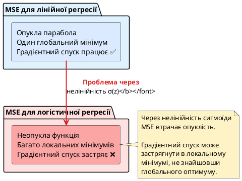

## Термометр vs світлофор — два типи передбачень

Уявіть, що ви лікар, і перед вами два типи завдань:

**Завдання 1:** Виміряти температуру пацієнта.
- Термометр показує: **38.5°C**
- Це **число** — точне, неперервне значення

**Завдання 2:** Поставити діагноз — чи хворий пацієнт на грип?
- Ви маєте відповісти: **«так»** або **«ні»**
- Це **категорія** — дискретний вибір

> **Аналогія з термометром і світлофором:**
>
> **Термометр** показує точну температуру: 18.5°C, 22.1°C, 36.6°C. Неперервна шкала від −∞ до +∞. Це **регресія**.
>
> **Світлофор** показує категорію: **червоний**, **жовтий** або **зелений**. Дискретний вибір із фіксованого набору варіантів. Це **класифікація**.
>
> Для деяких задач потрібен саме світлофор, а не термометр!

До цього моменту курсу ми розглядали лише **регресію** — передбачення чисел (ціна квартири, врожай пшениці, температура). Тепер переходимо до **класифікації** — передбачення категорій.

::card-group

::card{title="🎯 Мета статті" icon="i-lucide-target"}

- Зрозуміти фундаментальну відмінність між регресією та класифікацією
- Навчитися використовувати логістичну регресію для бінарної класифікації
- Опанувати функцію сигмоїда та її роль у перетворенні чисел на ймовірності
- Зрозуміти, чому MSE не підходить для класифікації, та освоїти Binary Cross-Entropy Loss
- Навчитися навчати класифікатор у scikit-learn та інтерпретувати результати

::

::card{title="🔑 Ключові терміни" icon="i-lucide-key"}

- **Класифікація (Classification):** передбачення категорії об'єкта
- **Сигмоїда (Sigmoid):** функція, що перетворює будь-яке число в діапазон (0, 1)
- **Логістична регресія (Logistic Regression):** алгоритм бінарної класифікації
- **Binary Cross-Entropy (Log Loss):** функція втрат для класифікації
- **Поріг класифікації (Threshold):** межа для прийняття рішення (зазвичай 0.5)

::

::

---

## Задача класифікації vs регресія — фундаментальна відмінність

У минулих статтях ми працювали з **регресією** — передбачення неперервних чисел. Тепер розглянемо **класифікацію** — передбачення дискретних категорій.

### Порівняльна таблиця

| Характеристика        | Регресія                           | Класифікація                        |
| :-------------------- | :--------------------------------- | :---------------------------------- |
| **Цільова змінна**    | Неперервне число `y ∈ ℝ`           | Категорія (дискретна) `y ∈ {0, 1}` |
| **Приклади задач**    | Ціна квартири, температура, зарплата | Спам/не спам, хворий/здоровий       |
| **Приклади виходу**   | `ŷ = 85347.50` (ціна в грн)        | `ŷ = 1` (клас «спам»)               |
| **Метрики якості**    | MAE, MSE, RMSE, R²                 | Accuracy, Precision, Recall, F1     |
| **Функція втрат**     | Mean Squared Error (MSE)           | Binary Cross-Entropy (Log Loss)     |
| **Інтерпретація**     | Точне числове значення             | Ймовірність класу або сам клас      |

### Приклади задач класифікації з реального життя

::steps

### Медична діагностика

**Задача:** За результатами аналізів крові передбачити, чи має пацієнт діабет.

**Ознаки:**
- Рівень глюкози в крові
- Індекс маси тіла (BMI)
- Вік
- Артеріальний тиск

**Цільова змінна:** `y ∈ {0, 1}` (0 = здоровий, 1 = хворий)

**Особливість:** Для медицини критичний **Recall** (повнота) — не можна пропустити хворого, навіть якщо це означає більше хибних тривог.

### Банківська сфера — схвалення кредиту

**Задача:** Передбачити, чи поверне клієнт кредит.

**Ознаки:**
- Річний дохід
- Кредитна історія (кількість прострочень)
- Вік
- Тип зайнятості

**Цільова змінна:** `y ∈ {0, 1}` (0 = не поверне, 1 = поверне)

**Особливість:** Важливий баланс — банк хоче мінімізувати ризик (не давати кредит тим, хто не поверне), але й не втрачати клієнтів (не відмовляти надійним).

### Email-спам фільтр

**Задача:** Класифікувати лист як спам або легітимний лист.

**Ознаки:**
- Частота ключових слів («безкоштовно», «виграш», «натисніть тут»)
- Кількість КАПСЛОКІВ та знаків оклику
- Наявність посилань
- Чи є відправник у спам-базі

**Цільова змінна:** `y ∈ {0, 1}` (0 = легітимний лист, 1 = спам)

**Особливість:** Висока **Precision** важливіша — не хочемо, щоб важливі листи потрапляли до спаму.

### Виявлення шахрайства (Fraud Detection)

**Задача:** Визначити, чи є транзакція кредитною карткою шахрайською.

**Ознаки:**
- Сума транзакції
- Час доби
- Локація (відстань від попередньої транзакції)
- Тип магазину
- Історична частота транзакцій

**Цільова змінна:** `y ∈ {0, 1}` (0 = легітимна, 1 = шахрайська)

**Особливість:** Сильний **дисбаланс класів** — 99.8% транзакцій легітимні, лише 0.2% шахрайські. Потрібні спеціальні техніки.

::

::note
**Спільна риса всіх задач:** вихід моделі має бути **ймовірністю** класу 1:

- `P(спам | текст листа) = 0.92` → відправити до папки «Спам»
- `P(діабет | аналізи) = 0.15` → ймовірність низька, пацієнт здоровий
- `P(шахрайство | транзакція) = 0.98` → заблокувати картку

Саме це робить **логістична регресія** — перетворює лінійну комбінацію ознак у **ймовірність**.
::

---

## Типи задач класифікації

Класифікація поділяється на кілька типів залежно від кількості класів та специфіки задачі.

::card-group

::card{title="🔵 Бінарна класифікація" icon="i-lucide-binary"}

**Лише 2 класи:** позитивний (1) або негативний (0).

**Приклади:**
- Спам (1) або не спам (0)
- Хворий (1) або здоровий (0)
- Дефект на виробі (1) або якість OK (0)
- Шахрайська транзакція (1) або легітимна (0)

**Фокус цієї статті** — саме бінарна класифікація.

::

::card{title="🎨 Мультикласова класифікація" icon="i-lucide-palette"}

**3+ класи:** категорія з фіксованого переліку.

**Приклади:**
- Порода собаки (такса, бульдог, пудель, ...) — 150+ порід
- Розпізнавання цифр (0, 1, 2, 3, 4, 5, 6, 7, 8, 9)
- Тип транспорту (автомобіль, автобус, вантажівка, мотоцикл)
- Жанр фільму (комедія, драма, трилер, фантастика)

**Детально розглядається** у модулі про нейронні мережі.

::

::card{title="🏷️ Мультилейбл класифікація" icon="i-lucide-tags"}

**Один об'єкт може належати до кількох класів одночасно.**

**Приклади:**
- Теги для статті (технології **та** AI **та** Python **та** освіта)
- Класифікація фільму за жанрами (комедія **і** фантастика одночасно)

**Поза межами цього курсу.**

::

::

::tip
**На цьому етапі курсу** ми фокусуємося виключно на **бінарній класифікації** — найпростішому та найпоширенішому випадку.

Мультикласова класифікація є природним розширенням бінарної і розглядається у модулі 4 (нейронні мережі).
::

---

## Чому лінійна регресія не працює для класифікації?

Спробуймо застосувати знайому нам лінійну регресію до задачі класифікації та подивимося, що піде не так.

### Експеримент: передбачення складання іспиту

Маємо датасет студентів:
- **Ознака:** кількість годин навчання
- **Цільова змінна:** здав іспит (1) або не здав (0)

Спробуємо навчити `LinearRegression` на цих даних.

::jupyter-notebook{title="linear_regression_fails.ipynb" kernel="Python 3.11 (ipykernel)"}

::jupyter-cell{type="markdown"}
### Спроба використати лінійну регресію для бінарної класифікації
::

::jupyter-cell{executionCount="1"}
```python
import numpy as np
import matplotlib.pyplot as plt
from sklearn.linear_model import LinearRegression

# Дані: години навчання та результат (0 = не здав, 1 = здав)
hours = np.array([1, 2, 3, 4, 5, 6, 7, 8, 9, 10]).reshape(-1, 1)
passed = np.array([0, 0, 0, 0, 0, 1, 1, 1, 1, 1])

# Навчаємо лінійну регресію
model = LinearRegression()
model.fit(hours, passed)

# Передбачення
hours_range = np.linspace(0, 12, 200).reshape(-1, 1)
predictions = model.predict(hours_range)

# Візуалізація
plt.figure(figsize=(10, 6))
plt.scatter(hours, passed, color='blue', s=100, label='Реальні дані', zorder=3, edgecolor='black')
plt.plot(hours_range, predictions, color='red', linewidth=2, label='Лінійна регресія')
plt.axhline(y=0.5, color='green', linestyle='--', linewidth=2, label='Поріг класифікації (0.5)')
plt.axhline(y=0, color='gray', linestyle='-', linewidth=1, alpha=0.5)
plt.axhline(y=1, color='gray', linestyle='-', linewidth=1, alpha=0.5)
plt.xlabel('Години навчання', fontsize=12)
plt.ylabel('Здав іспит', fontsize=12)
plt.title('Лінійна регресія для класифікації — проблеми', fontsize=14, fontweight='bold')
plt.legend(fontsize=11)
plt.grid(True, alpha=0.3)
plt.ylim(-0.3, 1.4)
plt.show()
```

#output
{.diagram-img}
::

::jupyter-cell{type="markdown"}
### Три критичні проблеми
::

::jupyter-cell{executionCount="2"}
```python
# Показуємо передбачення для конкретних значень
test_hours = np.array([[0], [5], [10], [12]])
test_predictions = model.predict(test_hours)

for h, p in zip(test_hours.flatten(), test_predictions):
    print(f"Години навчання: {h:2.0f} → Передбачення: {p:6.3f}")
```

#output
| Години навчання ($x$) | Передбачення моделі ($\hat{y}$) | Статус значення | Фізичний зміст для ймовірності |
| :---: | :---: | :---: | :--- |
| **0** | **-0.100** | ⚠️ Менше 0 | Неможлива ймовірність (не має сенсу) |
| **5** | **0.400** | ✅ В межах [0, 1] | $40\%$ шанс успішного складання |
| **10** | **0.900** | ✅ В межах [0, 1] | $90\%$ впевненість у здачі |
| **12** | **1.100** | ⚠️ Більше 1 | Помилка масштабу (понад 100%) |
::

::

### Три критичні проблеми лінійної регресії для класифікації

::warning
**Проблема 1: Передбачення поза межами [0, 1]**

Лінійна регресія може передбачити:
- `ŷ = −0.1` для 0 годин навчання
- `ŷ = 1.1` для 12 годин навчання

**Що це означає?** «Студент на −10% здав іспит»? «Студент на 110% здав іспит»?

Ніякого фізичного сенсу! Ми хочемо **ймовірність** у діапазоні [0, 1], яку можна інтерпретувати як «впевненість моделі».
::

::caution
**Проблема 2: Вразливість до аутлайерів**

Уявіть, що з'являється студент, який навчався **50 годин** і здав іспит (1).

Пряма лінії різко **пове
- Лікар вимірює температуру: 38.5°C — **число** (регресія)
- Лікар ставить діагноз: здоровий / хворий — **категорія** (класифікація)
- Питання до студента: чи можна лінійну регресію застосувати до діагнозу?
- Проблема: регресія може передбачити "−0.3" або "1.7" — що це означає для "так/ні"?
- Аналогія: термометр показує точну температуру, світлофор — категорію (червоний/жовтий/зелений)

### 2. Задача класифікації vs регресія

#### 2.1. Фундаментальна відмінність
- **Регресія:** передбачення **неперервного числа** (ціна, температура, зарплата)
- **Класифікація:** передбачення **категорії / класу** (спам/не спам, хворий/здоровий)

#### 2.2. Порівняльна таблиця

| Характеристика | Регресія                  | Класифікація              |
| :------------- | :------------------------ | :------------------------ |
| Цільова змінна | Неперервне число (ℝ)      | Категорія (дискретна)     |
| Приклади       | Ціна квартири, температура| Спам/не спам, порода кота |
| Метрики        | MAE, MSE, R²              | Accuracy, Precision, Recall|
| Функція втрат  | MSE                       | Cross-Entropy             |
| Вихід моделі   | Число (наприклад, 45000)  | Клас (0 або 1) або ймовірність|

#### 2.3. Приклади задач класифікації з реального життя
- **Медицина:** чи є пухлина злоякісною? (так/ні)
- **Банківська сфера:** чи поверне клієнт кредит? (так/ні)
- **Email:** чи є лист спамом? (так/ні)
- **Безпека:** чи є транзакція шахрайською? (так/ні)
- **Розпізнавання зображень:** який об'єкт на фото? (кіт/собака/птах)

### 3. Типи задач класифікації

#### 3.1. Бінарна класифікація (Binary Classification)
- Лише **два класи**: 0 та 1 (негативний / позитивний)
- Приклади: спам (1) / не спам (0), хворий / здоровий
- Найпростіший і найпоширеніший випадок
- Фокус цієї статті — бінарна класифікація

#### 3.2. Мультикласова класифікація (Multiclass Classification)
- **3+ класи**: наприклад, порода собаки (такса, бульдог, пудель, ...)
- Або розпізнавання цифр (0, 1, 2, 3, 4, 5, 6, 7, 8, 9)
- Складніша задача — розглядається у модулі 4 (нейронні мережі)

#### 3.3. Мультилейбл класифікація (Multilabel Classification)
- Один об'єкт може належати до **кількох класів одночасно**
- Приклад: теги для статті (технології, AI, Python, освіта)
- Поза межами цього курсу

### 4. Чому лінійна регресія не працює для класифікації?

#### 4.1. Експеримент: спроба використати LinearRegression для класів 0/1
- Датасет: іспит (години навчання → здав/не здав)
- Якщо застосувати LinearRegression: ŷ = w·x + b
- Проблеми:
  1. Передбачення може бути **< 0** або **> 1** (що це означає?)
  2. Віддалені точки **сильно впливають** на нахил лінії (один студент, що навчався 100 годин, зіпсує модель)
  3. MSE не є правильною функцією втрат для категорій

#### 4.2. Jupyter notebook: візуалізація проблеми
- Scatter-plot: години навчання vs здав (0 або 1)
- Лінія LinearRegression проходить "між" класами, передбачаючи 0.3, 0.7 тощо
- Не можна інтерпретувати як ймовірність без додаткових перетворень

### 5. Логістична регресія — перехід від лінії до ймовірності

#### 5.1. Ідея: перетворити лінійний вихід у ймовірність
- Крок 1: обчислити лінійну комбінацію: z = w₁x₁ + w₂x₂ + ... + b
- Крок 2: перетворити z → ймовірність через **сигмоїду**: p = σ(z)
- Крок 3: якщо p ≥ 0.5 → клас 1, інакше → клас 0

#### 5.2. Аналогія: реостат
- Лінійна регресія — це вимикач "увімкнено/вимкнено" (різкий перехід)
- Логістична регресія — це реостат (плавний перехід від 0 до 1)

### 6. Сигмоїда (Sigmoid function) — "S-подібна крива"

#### 6.1. Формула сигмоїди
::math-formula
\sigma(z) = \frac{1}{1 + e^{-z}}
::

Де:
- z = w₁x₁ + w₂x₂ + ... + wₙxₙ + b (лінійна комбінація)
- e ≈ 2.718 (число Ейлера)
- σ(z) ∈ (0, 1) — завжди між 0 та 1

#### 6.2. Властивості сигмоїди
- σ(0) = 0.5 (центр)
- σ(+∞) → 1 (асимптота зверху)
- σ(−∞) → 0 (асимптота знизу)
- Монотонно зростає
- Симетрична відносно точки (0, 0.5)

#### 6.3. Візуалізація сигмоїди
- Jupyter notebook: графік σ(z) для z від −10 до +10
- Показати, як змінюється крутість при множенні z на коефіцієнт

#### 6.4. Інтерпретація виходу сигмоїди
- σ(z) = 0.9 → модель на 90% впевнена, що об'єкт належить до класу 1
- σ(z) = 0.1 → модель на 10% впевнена в класі 1 (або на 90% — у класі 0)
- σ(z) = 0.5 → модель не впевнена (50/50)

### 7. Рівняння логістичної регресії

#### 7.1. Повна формула
::math-formula
P(y=1 \mid \mathbf{x}) = \sigma(w_1 x_1 + w_2 x_2 + \ldots + w_n x_n + b) = \frac{1}{1 + e^{-(w_1 x_1 + w_2 x_2 + \ldots + b)}}
::

#### 7.2. Векторна нотація
::math-formula
P(y=1 \mid \mathbf{x}) = \sigma(\mathbf{w}^T \mathbf{x} + b)
::

#### 7.3. Інтерпретація параметрів w та b
- **w** (ваги) — показують, наскільки кожна ознака збільшує/зменшує ймовірність класу 1
- Позитивна вага → збільшує ймовірність (наприклад, більше годин навчання → більша ймовірність здати іспит)
- Негативна вага → зменшує ймовірність
- **b** (bias, зсув) — базова ймовірність при всіх ознаках = 0

### 8. Поріг класифікації (Decision Threshold)

#### 8.1. Стандартний поріг: 0.5
- Якщо P(y=1|x) ≥ 0.5 → передбачаємо клас 1
- Якщо P(y=1|x) < 0.5 → передбачаємо клас 0

#### 8.2. Чому 0.5?
- Логічний поділ: "більше шансів" vs "менше шансів"
- Але не завжди оптимальний! (про це — у наступній статті)

### 9. Чому Mean Squared Error (MSE) не підходить для класифікації?

#### 9.1. Проблема градієнтів
- MSE = (y - ŷ)² для бінарних міток (0 або 1) створює **немонотонну функцію втрат**
- Градієнти можуть бути **дуже маленькими** в областях, де модель помиляється
- Результат: повільна або застрягаюча збіжність

#### 9.2. Jupyter приклад: порівняння градієнтів
- Показати графік MSE vs Cross-Entropy для одного параметра
- MSE має плоскі ділянки (vanishing gradients)

### 10. Binary Cross-Entropy Loss (Log Loss)

#### 10.1. Формула для одного зразка
::math-formula
L(y, \hat{y}) = - \left[ y \cdot \log(\hat{y}) + (1 - y) \cdot \log(1 - \hat{y}) \right]
::

Де:
- y ∈ {0, 1} — реальна мітка
- ŷ = σ(z) — передбачена ймовірність класу 1

#### 10.2. Інтуїція: штраф за впевнену помилку
- Якщо y = 1 (реально клас 1), але ŷ = 0.01 (модель майже впевнена у класі 0):
  - L = −log(0.01) = 4.6 — **великий штраф**
- Якщо y = 1 і ŷ = 0.99 (модель майже впевнена правильно):
  - L = −log(0.99) = 0.01 — **малий штраф**

#### 10.3. Формула для всього датасету
::math-formula
L = -\frac{1}{N} \sum_{i=1}^{N} \left[ y_i \cdot \log(\hat{y}_i) + (1 - y_i) \cdot \log(1 - \hat{y}_i) \right]
::

#### 10.4. Аналогія: штрафи за перевищення швидкості
- Якщо ви впевнено їхали 150 км/год у зоні 50 — штраф величезний
- Якщо злегка перевищили (55 км/год) — штраф символічний
- Cross-Entropy штрафує **пропорційно "впевненості" помилки**

### 11. Навчання логістичної регресії

#### 11.1. Градієнтний спуск для логістичної регресії
- Функція втрат: Binary Cross-Entropy
- Обчислення градієнтів: ∂L/∂w через ланцюгове правило
- Оновлення ваг: w = w - η·∂L/∂w (аналогічно лінійній регресії)

#### 11.2. Відмінність від лінійної регресії
- Лінійна регресія: мінімізує MSE → знаходить пряму лінію
- Логістична регресія: мінімізує Cross-Entropy → знаходить "S-подібну" межу рішення

### 12. LogisticRegression у scikit-learn

#### 12.1. Базове використання
```python
from sklearn.linear_model import LogisticRegression
from sklearn.model_selection import train_test_split
from sklearn.metrics import accuracy_score

# Припустимо, X і y — дані
X_train, X_test, y_train, y_test = train_test_split(X, y, test_size=0.2, random_state=42)

model = LogisticRegression(random_state=42)
model.fit(X_train, y_train)

# Передбачення класів
predictions = model.predict(X_test)  # [0, 1, 1, 0, ...]

# Передбачення ймовірностей
probabilities = model.predict_proba(X_test)  # [[0.8, 0.2], [0.3, 0.7], ...]
# Перший стовпець — P(y=0), другий — P(y=1)
```

#### 12.2. Доступ до параметрів моделі
```python
print(f"Ваги: {model.coef_}")       # Масив ваг w
print(f"Зсув: {model.intercept_}")  # Зсув b
```

#### 12.3. Важливі параметри LogisticRegression
- `penalty`: тип регуляризації ('l1', 'l2', 'elasticnet', 'none')
- `C`: сила регуляризації (менше C → сильніша регуляризація)
- `solver`: алгоритм оптимізації ('lbfgs', 'liblinear', 'saga', ...)
- За замовчуванням: L2 регуляризація з C=1.0

### 13. Базовий приклад: класифікація на синтетичному датасеті

#### 13.1. Генерація даних
```python
from sklearn.datasets import make_classification

X, y = make_classification(
    n_samples=500,      # 500 зразків
    n_features=2,       # 2 ознаки (для візуалізації)
    n_informative=2,    # обидві ознаки інформативні
    n_redundant=0,
    n_clusters_per_class=1,
    random_state=42
)
```

#### 13.2. Jupyter notebook: повний пайплайн
1. Генерація даних
2. Візуалізація scatter-plot (два класи різними кольорами)
3. Train/test split
4. Навчання LogisticRegression
5. Передбачення на test
6. Обчислення accuracy
7. Візуалізація decision boundary (межі рішення)

#### 13.3. Візуалізація decision boundary
- Побудувати сітку точок у просторі ознак
- Передбачити клас для кожної точки сітки
- Показати зони класів кольором + реальні точки поверх

### 14. Приклад: класифікація Iris (бінарна версія)

#### 14.1. Датасет Iris (спрощений до бінарної класифікації)
```python
from sklearn.datasets import load_iris

iris = load_iris()
X = iris.data[:100, :2]  # Перші 100 зразків, перші 2 ознаки
y = iris.target[:100]     # 0 = setosa, 1 = versicolor
```

#### 14.2. Jupyter notebook: Iris класифікація
- Scatter-plot: sepal length (довжина чашолистка) vs sepal width (ширина чашолистка)
- Навчання LogisticRegression
- Accuracy на test
- Візуалізація decision boundary

### 15. Інтерпретація коефіцієнтів логістичної регресії

#### 15.1. Позитивна вага
- Якщо w₁ = 2.5 для ознаки "площа квартири"
- Збільшення площі на 1 м² → збільшення log-odds на 2.5
- Інтерпретація: більша площа → більша ймовірність "дорогої" категорії

#### 15.2. Негативна вага
- Якщо w₂ = −1.8 для ознаки "відстань до центру"
- Збільшення відстані → зменшення ймовірності класу 1

#### 15.3. Log-odds vs ймовірність
- Логістична регресія моделює **log-odds** (логарифм відношення шансів)
- log(p / (1−p)) = wx + b
- Через сигмоїду перетворюється у ймовірність

### 16. Регуляризація у логістичній регресії

#### 16.1. L2 регуляризація (Ridge, за замовчуванням)
```python
model = LogisticRegression(penalty='l2', C=1.0)
```
- Додає штраф Σwᵢ² до функції втрат
- Запобігає перенавчанню

#### 16.2. L1 регуляризація (Lasso)
```python
model = LogisticRegression(penalty='l1', solver='saga', C=1.0)
```
- Додає штраф Σ|wᵢ|
- Може обнулювати ваги → feature selection

#### 16.3. Параметр C
- C = 1/λ (зворотна до сили регуляризації)
- Малий C (наприклад, 0.01) → сильна регуляризація
- Великий C (наприклад, 100) → слабка регуляризація

### 17. Практичне завдання (рівень 1)

#### Рівень 1: Базова класифікація
- Згенерувати синтетичний датасет із 2 ознаками та 2 класами
- Візуалізувати scatter-plot
- Навчити LogisticRegression
- Обчислити accuracy на train та test
- Побудувати decision boundary
- Відповісти на запитання: чи є перенавчання? (порівняти accuracy train vs test)

### 18. Резюме (частина 1)

::card-group

::card{title="🎯 Класифікація" icon="i-lucide-target"}
Задача передбачення **категорії** (клас 0 або 1), а не числа. Приклади: спам/не спам, хворий/здоровий.
::

::card{title="📉 Sigmoid (σ)" icon="i-lucide-trending-up"}
S-подібна функція, що перетворює будь-яке число в діапазон (0, 1). Використовується як функція активації у логістичній регресії.
::

::card{title="🧮 Логістична регресія" icon="i-lucide-calculator"}
Модель класифікації: z = wx + b → σ(z) → ймовірність класу 1. Якщо σ(z) ≥ 0.5 → клас 1.
::

::card{title="💥 Cross-Entropy Loss" icon="i-lucide-zap"}
Функція втрат для класифікації. Штрафує модель за **впевнені помилки**. L = −[y·log(ŷ) + (1−y)·log(1−ŷ)].
::

::

---

**Наступна стаття:** Метрики класифікації — Confusion Matrix, Precision, Recall, F1-score, ROC-AUC.
рне вниз**, що спот

ворить передбачення для **всіх** інших точок.

Студент, що навчався 5 годин, раптом отримує передбачення 0.2 замість 0.4 — тільки через **один далекий приклад**.

Класифікатор має бути **стійким** до таких випадків.
::

::tip
**Проблема 3: Відсутність ймовірнісної інтерпретації**

Ми хочемо не просто відповідь «здав/не здав», а **ймовірність**:
- «З імовірністю 85% студент здасть іспит» → можна рекомендувати йому складати
- «З імовірністю 20% студент здасть іспит» → краще ще попрацювати

Лінійна регресія не дає **коректних ймовірностей**, бо виходить за межі [0, 1].
::

**Висновок:** Потрібен інший підхід — **логістична регресія**.

---

## Логістична регресія — перехід від лінії до ймовірності

Логістична регресія вирішує всі три проблеми, додаючи лише один крок: **перетворення лінійного виходу через сигмоїду**.

### Ідея в три кроки

::steps

### Крок 1. Обчислити лінійну комбінацію ознак

Так само, як у лінійній регресії:

::math-formula
z = w_1 x_1 + w_2 x_2 + \ldots + w_d x_d + b = \mathbf{w}^\top \mathbf{x} + b
::

Результат `z` може бути **будь-яким числом** від −∞ до +∞.

### Крок 2. Пропустити через функцію сигмоїда

Застосувати функцію сигмоїда (σ), яка «стискає» будь-яке число до діапазону (0, 1):

::math-formula
\hat{y} = \sigma(z) = \frac{1}{1 + e^{-z}}
::

Тепер `ŷ ∈ (0, 1)` — це **ймовірність** класу 1.

### Крок 3. Прийняти рішення через поріг

Встановити **поріг** (зазвичай 0.5):

::math-formula
\text{Клас} = \begin{cases}
1 & \text{якщо } \hat{y} \geq 0.5 \\
0 & \text{якщо } \hat{y} < 0.5
\end{cases}
::

::

> **Аналогія з реостатом:**
>
> **Лінійна регресія** — це **вимикач** «увімкнено/вимкнено». Різкий перехід від 0 до 1, без проміжних станів.
>
> **Логістична регресія** — це **реостат** (регулятор яскравості світла). Плавний перехід від 0% (повна темрява) до 100% (максимальна яскравість).
>
> Сигмоїда дозволяє моделі бути «невпевненою» — передбачати проміжні значення як 0.3, 0.7, 0.9 тощо.

---

## Сигмоїда (Sigmoid) — S-подібна крива

Функція сигмоїда — це серце логістичної регресії. Розберемо її детально.

### Формула сигмоїди

::math-formula
\sigma(z) = \frac{1}{1 + e^{-z}}
::

де:
- `z` — будь-яке дійсне число (від −∞ до +∞)
- `e` ≈ 2.718 — основа натурального логарифму (число Ейлера)
- `σ(z)` — результат, завжди в діапазоні **(0, 1)**

### Ключові властивості сигмоїди

::card-group

::card{title="📍 Центральна точка" icon="i-lucide-move-vertical"}

**Коли `z = 0`:**

::math-formula
\sigma(0) = \frac{1}{1 + e^{0}} = \frac{1}{1 + 1} = 0.5
::

Це точка **максимальної невизначеності** — модель не знає, який клас.

::

::card{title="📈 Асимптотична поведінка" icon="i-lucide-trending-up"}

- **Коли `z → +∞`:** `σ(z) → 1` (модель майже впевнена в класі 1)
- **Коли `z → −∞`:** `σ(z) → 0` (модель майже впевнена в класі 0)

Але **ніколи не досягає** рівно 0 або 1 — завжди залишається малесенька невпевненість.

::

::card{title="⚖️ Симетричність" icon="i-lucide-balance-scale"}

Сигмоїда **симетрична** відносно точки (0, 0.5):

::math-formula
\sigma(-z) = 1 - \sigma(z)
::

**Приклад:** якщо `σ(2) = 0.88`, то `σ(−2) = 1 − 0.88 = 0.12`.

::

::card{title="📐 Диференційовність" icon="i-lucide-bezier-curve"}

Сигмоїда **гладка і диференційовна всюди** — це критично для градієнтного спуску!

Її похідна має просту форму:

::math-formula
\frac{d\sigma}{dz} = \sigma(z) \cdot (1 - \sigma(z))
::

::

::

### Візуалізація сигмоїди

::jupyter-notebook{title="sigmoid_visualization.ipynb" kernel="Python 3.11 (ipykernel)"}

::jupyter-cell{type="markdown"}
### Графік функції сигмоїда
::

::jupyter-cell{executionCount="1"}
```python
import numpy as np
import matplotlib.pyplot as plt

# Функція сигмоїда
def sigmoid(z):
    return 1 / (1 + np.exp(-z))

# Діапазон значень z
z = np.linspace(-10, 10, 200)
sigma_z = sigmoid(z)

# Побудова графіка
plt.figure(figsize=(12, 6))
plt.plot(z, sigma_z, linewidth=3, label='σ(z) = 1 / (1 + e⁻ᶻ)', color='#2563eb')
plt.axhline(y=0.5, color='green', linestyle='--', linewidth=2, label='Поріг класифікації (0.5)', alpha=0.7)
plt.axvline(x=0, color='gray', linestyle='--', linewidth=1.5, alpha=0.5)

# Позначимо ключові точки
key_points_z = [-5, -2, 0, 2, 5]
key_points_sigma = [sigmoid(z_val) for z_val in key_points_z]
plt.scatter(key_points_z, key_points_sigma, color='red', s=100, zorder=5, edgecolor='black', linewidth=1.5)

for z_val, sigma_val in zip(key_points_z, key_points_sigma):
    plt.annotate(f'σ({z_val}) = {sigma_val:.3f}',
                xy=(z_val, sigma_val), xytext=(z_val, sigma_val + 0.1),
                fontsize=9, ha='center', bbox=dict(boxstyle='round,pad=0.3', facecolor='yellow', alpha=0.7))

plt.xlabel('z (лінійна комбінація ознак)', fontsize=12)
plt.ylabel('σ(z) — ймовірність класу 1', fontsize=12)
plt.title('Функція сигмоїда — перетворення чисел у ймовірності', fontsize=14, fontweight='bold')
plt.grid(True, alpha=0.3)
plt.legend(fontsize=11, loc='upper left')
plt.ylim(-0.1, 1.1)
plt.show()
```

#output
{.diagram-img}
::

::jupyter-cell{type="markdown"}
### Таблиця значень сигмоїди
::

::jupyter-cell{executionCount="2"}
```python
import pandas as pd

# Обчислення значень
z_values = [-10, -5, -2, -1, 0, 1, 2, 5, 10]
sigma_values = [sigmoid(z) for z in z_values]

# Створення таблиці
df = pd.DataFrame({
    'z (вхід)': z_values,
    'σ(z) (вихід)': [f"{v:.6f}" for v in sigma_values],
    'Відсоток': [f"{v*100:.2f}%" for v in sigma_values],
    'Інтерпретація': [
        'Майже 0% — точно клас 0',
        'Дуже низька ймовірність класу 1',
        '~12% — ймовірно клас 0',
        '~27% — швидше клас 0',
        '50% — невизначеність (межа)',
        '~73% — швидше клас 1',
        '~88% — дуже ймовірно клас 1',
        'Дуже висока ймовірність класу 1',
        'Майже 100% — точно клас 1'
    ]
})

df
```

#output
| $z$ (вхід) | $\sigma(z)$ (вихід) | Відсоток | Інтерпретація для класифікації |
| :---: | :---: | :---: | :--- |
| **-10** | `0.000045` | 0.00% | Майже 0% — гарантовано клас 0 |
| **-5** | `0.006693` | 0.67% | Дуже низька ймовірність класу 1 |
| **-2** | `0.119203` | 11.92% | ~12% — впевнено клас 0 |
| **-1** | `0.268941` | 26.89% | ~27% — схильність до класу 0 |
| **0** | `0.500000` | 50.00% | 50% — поріг невизначеності (межа рішення) |
| **1** | `0.731059` | 73.11% | ~73% — схильність до класу 1 |
| **2** | `0.880797` | 88.08% | ~88% — впевнено клас 1 |
| **5** | `0.993307` | 99.33% | Дуже висока ймовірність класу 1 |
| **10** | `0.999955` | 99.99% | Майже 100% — гарантовано клас 1 |
::

::

::note
**Ключові спостереження:**

1. **Центр у z = 0:** Сигмоїда повертає рівно 0.5 — точка максимальної невпевненості. Модель каже: «Я не знаю, який клас — шанси 50 на 50».

2. **Швидке насичення:** Вже при `z = 5` сигмоїда дає `σ(5) ≈ 0.993` — практично 1. При `z = −5` сигмоїда дає `σ(−5) ≈ 0.007` — практично 0. Модель швидко стає «впевненою», коли лінійна комбінація віддаляється від нуля.

3. **Плавний перехід:** На відміну від ступінчастої функції (0 → різко → 1), сигмоїда дає **плавний S-подібний перехід**. Це дозволяє градієнтному спуску ефективно навчатися.
::

> **Аналогія з термостатом:**
>
> Уявіть термостат, що регулює обігрівач:
> - Коли дуже холодно (`z = −10`), обігрівач працює на **0%** (σ → 0)
> - Коли дуже жарко (`z = +10`), обігрівач працює на **100%** (σ → 1)
> - Коли температура комфортна (`z = 0`), обігрівач працює на **50%** (σ = 0.5)
>
> **Плавний перехід** між станами, а не різке вмикання/вимикання — саме так працює сигмоїда!

---

## Рівняння логістичної регресії — повна формула

Тепер ми готові записати повне рівняння логістичної регресії.

### Покрокова побудова

::steps

### Крок 1. Лінійна комбінація ознак (так само, як у лінійній регресії)

::math-formula
z = w_1 x_1 + w_2 x_2 + \ldots + w_d x_d + b = \mathbf{w}^\top \mathbf{x} + b
::

де:
- `x₁, x₂, ..., xₐ` — ознаки (наприклад, дохід, вік, кредитна історія)
- `w₁, w₂, ..., wₐ` — **ваги** (параметри моделі, які навчаються)
- `b` — **зсув** (bias, також навчається)

### Крок 2. Застосування сигмоїди для отримання ймовірності

::math-formula
\hat{y} = \sigma(z) = \frac{1}{1 + e^{-(w^\top x + b)}}
::

Це дає **ймовірність** класу 1: `P(y = 1 | x)`.

### Крок 3. Прийняття рішення через поріг

::math-formula
\text{Передбачений клас} = \begin{cases}
1 & \text{якщо } \hat{y} \geq 0.5 \\
0 & \text{якщо } \hat{y} < 0.5
\end{cases}
::

::

### Інтерпретація параметрів w та b

::card-group

::card{title="⚖️ Ваги (w)" icon="i-lucide-scale"}

**Показують напрямок та силу впливу кожної ознаки.**

- **Позитивна вага (`w > 0`):** Збільшення ознаки **підвищує** ймовірність класу 1
  - Приклад: `w = +2.5` для «площі квартири» → більша площа → більша ймовірність «дорогої» категорії

- **Негативна вага (`w < 0`):** Збільшення ознаки **знижує** ймовірність класу 1
  - Приклад: `w = −1.8` для «відстані до центру» → більша відстань → менша ймовірність «дорогої» категорії

- **Нульова вага (`w ≈ 0`):** Ознака не впливає на передбачення

::

::card{title="📊 Зсув (b)" icon="i-lucide-move-horizontal"}

**Базова схильність моделі до одного з класів.**

- **Позитивний `b`:** Модель «схильна» передбачувати клас 1 (навіть при нульових ознаках)
- **Негативний `b`:** Модель «схильна» передбачувати клас 0

**Приклад:** Якщо `b = −3`, то при всіх ознаках = 0 маємо `z = −3 → σ(−3) = 0.047` — модель дуже схильна до класу 0.

::

::

::tip
**Чому це називається «логістична регресія», а не «логістична класифікація»?**

Історична причина: алгоритм **формально є регресією** — він передбачає **неперервне** значення ймовірності `P(y=1|x) ∈ [0, 1]`.

Але **застосовується для класифікації** — фінальне рішення приймається через поріг.

Назва «логістична» походить від **логіт-функції** (log-odds), яка є оберненою до сигмоїди:

::math-formula
\text{logit}(p) = \log\left(\frac{p}{1-p}\right) = w^\top x + b
::

Модель фактично моделює **логарифм відношення шансів (log-odds)** класу 1 до класу 0.
::


---

## Чому Mean Squared Error (MSE) не підходить для класифікації?

У лінійній регресії ми використовували MSE як функцію втрат. Спробуймо з'ясувати, чому MSE не працює для логістичної регресії.

### Проблема 1: Неопуклість функції втрат

Для лінійної регресії MSE є **опуклою функцією** (парабола) з єдиним глобальним мінімумом. Градієнтний спуск гарантовано знайде оптимальні параметри.

Але для логістичної регресії (де `ŷ = σ(w·x + b)`), MSE стає **неопуклою** — з'являються **локальні мінімуми**!

::plant-uml{alt="MSE для логістичної регресії vs лінійної"}



::

> **Аналогія з пошуком найнижчої точки в горах:**
>
> **MSE для лінійної регресії:** Ви стоїте на схилі **однієї гори** з єдиною долиною внизу. Куди б не йшли вниз — потрапите в найнижчу точку.
>
> **MSE для логістичної регресії:** Ви стоїте в **гірській системі** з багатьома долинами. Рухаючись вниз, можете застрягти в невеликій долині, хоча справжня найнижча точка — далеко за пагорбом.

### Проблема 2: Малі градієнти при великих помилках

Пригадаємо похідну сигмоїди:

::math-formula
\frac{d\sigma}{dz} = \sigma(z) \cdot (1 - \sigma(z))
::

Коли `σ(z) ≈ 0` або `σ(z) ≈ 1`, похідна **майже нульова** (vanishing gradient problem).

**Критична ситуація:** Модель робить дуже впевнену, але **неправильну** передбачу:
- Реальний клас: `y = 1`
- Передбачення: `ŷ = σ(z) = 0.001` (майже 0)
- Помилка величезна: `(1 − 0.001)² = 0.998`
- Але градієнт `∂MSE/∂w` майже нульовий → **навчання майже зупиняється!**

::warning
**Критична проблема MSE для класифікації:**

Коли модель помиляється впевнено (`ŷ = 0.01`, але `y = 1`), градієнт занадто малий через природу сигмоїди → модель **повільно виправляє помилку**.

Нам потрібна функція втрат, яка дає **великий градієнт** при великій помилці, навіть якщо передбачення на краю (близько 0 або 1).
::

**Рішення:** Використати **Binary Cross-Entropy Loss** (Log Loss).

---

## Binary Cross-Entropy Loss — функція втрат для класифікації

Визначення: **Binary Cross-Entropy (BCE або Log Loss)** — це функція втрат для бінарної класифікації, яка вимірює розбіжність між справжнім розподілом (`y ∈ {0, 1}`) та передбаченими ймовірностями (`ŷ ∈ [0, 1]`).

### Формула Binary Cross-Entropy

Для одного спостереження:

::math-formula
L(y, \hat{y}) = -\left[ y \cdot \log(\hat{y}) + (1 - y) \cdot \log(1 - \hat{y}) \right]
::

Для всього датасету (усереднення):

::math-formula
\text{BCE} = -\frac{1}{n} \sum_{i=1}^{n} \left[ y_i \cdot \log(\hat{y}_i) + (1 - y_i) \cdot \log(1 - \hat{y}_i) \right]
::

де:
- `y` — справжній клас (0 або 1)
- `ŷ` — передбачена ймовірність класу 1 (від 0 до 1)
- `log` — натуральний логарифм

### Інтуїція — як працює формула

Формула виглядає складно, але насправді вона дуже логічна. Розберемо два випадки окремо.

::steps

### Випадок 1: Справжній клас y = 1

Формула спрощується (бо `1 − y = 0`):

::math-formula
L(1, \hat{y}) = -\log(\hat{y})
::

**Що це означає?**

| Передбачення `ŷ` | `−log(ŷ)` | Інтерпретація |
|------------------|-----------|---------------|
| `ŷ = 0.99` | `−log(0.99) ≈ 0.01` | Модель майже впевнена → **маленька втрата** ✅ |
| `ŷ = 0.7` | `−log(0.7) ≈ 0.36` | Модель трохи сумнівається → помірна втрата |
| `ŷ = 0.5` | `−log(0.5) ≈ 0.69` | Модель не впевнена → велика втрата |
| `ŷ = 0.1` | `−log(0.1) ≈ 2.30` | Модель дуже помиляється → **дуже велика втрата** ⚠️ |
| `ŷ = 0.01` | `−log(0.01) ≈ 4.61` | Катастрофічна помилка → **величезна втрата** ❌ |

**Ключова властивість:** Чим **менша** ймовірність правильного класу, тим **більша** втрата. Причому втрата зростає **експоненційно** (логарифм перетворює малі числа на великі).

### Випадок 2: Справжній клас y = 0

Формула спрощується (бо `y = 0`):

::math-formula
L(0, \hat{y}) = -\log(1 - \hat{y})
::

**Що це означає?**

| Передбачення `ŷ` | `−log(1−ŷ)` | Інтерпретація |
|------------------|-------------|---------------|
| `ŷ = 0.01` | `−log(0.99) ≈ 0.01` | Модель майже впевнена в класі 0 → **маленька втрата** ✅ |
| `ŷ = 0.3` | `−log(0.7) ≈ 0.36` | Модель трохи сумнівається → помірна втрата |
| `ŷ = 0.5` | `−log(0.5) ≈ 0.69` | Модель не впевнена → велика втрата |
| `ŷ = 0.9` | `−log(0.1) ≈ 2.30` | Модель дуже помиляється → **дуже велика втрата** ⚠️ |
| `ŷ = 0.99` | `−log(0.01) ≈ 4.61` | Катастрофічна помилка → **величезна втрата** ❌ |

::

> **Аналогія з погодним прогнозом:**
>
> Уявіть, що синоптик прогнозує ймовірність дощу завтра:
>
> - Він каже: **«99% дощу»**, але дощу **не було** (`y=0`, `ŷ=0.99`)
>   - Довіра до синоптика **різко падає** → велика втрата
>
> - Він каже: **«1% дощу»**, і дощу **не було** (`y=0`, `ŷ=0.01`)
>   - Він був правий → маленька втрата
>
> Binary Cross-Entropy **штрафує** модель залежно від того, наскільки **впевнено** вона помиляється.

### Візуалізація функції втрат

::jupyter-notebook{title="cross_entropy_visualization.ipynb" kernel="Python 3.11 (ipykernel)"}

::jupyter-cell{type="markdown"}
### Графік Binary Cross-Entropy для обох класів
::

::jupyter-cell{executionCount="1"}
```python
import numpy as np
import matplotlib.pyplot as plt

# Діапазон передбачень (уникаємо 0 та 1 для уникнення log(0))
y_pred = np.linspace(0.001, 0.999, 1000)

# Втрати для y=1 та y=0
loss_y1 = -np.log(y_pred)           # Коли справжній клас = 1
loss_y0 = -np.log(1 - y_pred)       # Коли справжній клас = 0

# Побудова графіка
fig, (ax1, ax2) = plt.subplots(1, 2, figsize=(14, 5))

# Графік для y=1
ax1.plot(y_pred, loss_y1, color='#2563eb', linewidth=3)
ax1.set_xlabel('Передбачена ймовірність ŷ', fontsize=12)
ax1.set_ylabel('Втрата L(1, ŷ) = −log(ŷ)', fontsize=12)
ax1.set_title('Втрата для справжнього класу y = 1', fontsize=13, fontweight='bold')
ax1.grid(True, alpha=0.3)
ax1.set_ylim(0, 5)
ax1.axvline(x=0.5, color='green', linestyle='--', alpha=0.7, linewidth=2)
ax1.text(0.5, 4.5, 'Поріг 0.5', fontsize=10, ha='center', bbox=dict(boxstyle='round', facecolor='yellow', alpha=0.7))

# Графік для y=0
ax2.plot(y_pred, loss_y0, color='#dc2626', linewidth=3)
ax2.set_xlabel('Передбачена ймовірність ŷ', fontsize=12)
ax2.set_ylabel('Втрата L(0, ŷ) = −log(1−ŷ)', fontsize=12)
ax2.set_title('Втрата для справжнього класу y = 0', fontsize=13, fontweight='bold')
ax2.grid(True, alpha=0.3)
ax2.set_ylim(0, 5)
ax2.axvline(x=0.5, color='green', linestyle='--', alpha=0.7, linewidth=2)
ax2.text(0.5, 4.5, 'Поріг 0.5', fontsize=10, ha='center', bbox=dict(boxstyle='round', facecolor='yellow', alpha=0.7))

plt.tight_layout()
plt.show()
```

#output
{.diagram-img}
::

::jupyter-cell{type="markdown"}
### Порівняння MSE та BCE для класифікації
::

::jupyter-cell{executionCount="2"}
```python
# MSE для класифікації (для y=1)
mse_loss = (1 - y_pred)**2

# BCE для класифікації (для y=1)
bce_loss = -np.log(y_pred)

# Порівняльний графік
plt.figure(figsize=(10, 6))
plt.plot(y_pred, mse_loss, label='MSE = (1 − ŷ)²', color='orange', linewidth=3, linestyle='--')
plt.plot(y_pred, bce_loss, label='BCE = −log(ŷ)', color='#2563eb', linewidth=3)
plt.xlabel('Передбачена ймовірність ŷ (справжній клас y=1)', fontsize=12)
plt.ylabel('Величина втрати', fontsize=12)
plt.title('Порівняння MSE vs BCE для класифікації', fontsize=14, fontweight='bold')
plt.legend(fontsize=11)
plt.grid(True, alpha=0.3)
plt.ylim(0, 5)
plt.xlim(0, 1)

# Позначимо критичну зону
plt.axvspan(0, 0.2, alpha=0.1, color='red', label='Критична зона (великі помилки)')
plt.show()
```

#output
{.diagram-img}
::

::

### Чому Binary Cross-Entropy краща за MSE?

::card-group

::card{title="✅ Опуклість" icon="i-lucide-mountain"}

BCE для логістичної регресії є **опуклою функцією**. Є лише один глобальний мінімум → градієнтний спуск гарантовано знайде оптимальні параметри.

::

::card{title="📈 Великий градієнт при великих помилках" icon="i-lucide-trending-up"}

Коли модель сильно помиляється (передбачає 0.01 замість 1), BCE дає **дуже великий градієнт** → модель швидко виправляється.

MSE у такій ситуації дає малий градієнт через vanishing gradient сигмоїди → навчання повільне.

::

::card{title="🎯 Ймовірнісна інтерпретація" icon="i-lucide-target"}

BCE безпосередньо вимірює **розбіжність між ймовірностями**. Це природна метрика для класифікаторів, які виводять ймовірності.

BCE походить із **теорії інформації** — це негативна логарифмічна правдоподібність (negative log-likelihood).

::

::

::note
**Математичний факт:** Мінімізація BCE еквівалентна **максимізації правдоподібності (Maximum Likelihood Estimation, MLE)** розподілу Бернуллі.

Це робить логістичну регресію не просто «хитрим трюком», а статистично обґрунтованим методом.
::

---

## Навчання логістичної регресії — градієнтний спуск

Тепер, маючи функцію втрат BCE, можемо навчати модель за допомогою градієнтного спуску.

### Алгоритм навчання

::steps

### Крок 1. Ініціалізація параметрів

Встановлюємо початкові значення ваг і зсуву:

::math-formula
w_1, w_2, \ldots, w_d \sim \mathcal{N}(0, 0.01), \quad b = 0
::

Випадкові малі числа з нормального розподілу для ваг, нуль для зсуву.

### Крок 2. Обчислення передбачень (Forward Pass)

Для кожного спостереження `(x, y)`:

::math-formula
z = w^\top x + b \\
\hat{y} = \sigma(z) = \frac{1}{1 + e^{-z}}
::

### Крок 3. Обчислення втрати

::math-formula
L = -\frac{1}{n} \sum_{i=1}^{n} \left[ y_i \cdot \log(\hat{y}_i) + (1 - y_i) \cdot \log(1 - \hat{y}_i) \right]
::

### Крок 4. Обчислення градієнтів (Backward Pass)

Похідна BCE по параметрах має **красиву форму**:

::math-formula
\frac{\partial L}{\partial w_j} = \frac{1}{n} \sum_{i=1}^{n} (\hat{y}_i - y_i) \cdot x_{ij} \\
\frac{\partial L}{\partial b} = \frac{1}{n} \sum_{i=1}^{n} (\hat{y}_i - y_i)
::

::tip
**Красива властивість:** Градієнт має **ту ж форму**, що й у лінійній регресії з MSE!

Різниця лише в тому, що `ŷ = σ(w·x + b)` замість `ŷ = w·x + b`.

Це не випадковість — це результат того, що BCE є «правильною» функцією втрат для моделі з сигмоїдою.
::

### Крок 5. Оновлення параметрів

::math-formula
w_j := w_j - \alpha \cdot \frac{\partial L}{\partial w_j} \\
b := b - \alpha \cdot \frac{\partial L}{\partial b}
::

де `α` — learning rate (зазвичай 0.001–0.1)

### Крок 6. Повторення

Повторюємо кроки 2–5 протягом фіксованої кількості епох або до збіжності (втрата перестає зменшуватися).

::

> **Аналогія з корекцією прицілу:**
>
> Уявіть, що ви стріляєте в мішень:
> 1. **Forward Pass:** ви стріляєте, куля влучає в точку
> 2. **Втрата:** вимірюємо відстань від центру мішені
> 3. **Градієнт:** визначаємо, в якому напрямку коригувати приціл
> 4. **Оновлення:** трохи повертаємо приціл у потрібний бік
> 5. **Повторення:** стріляємо знову
>
> З кожним пострілом точність покращується!


### Реалізація градієнтного спуску на чистому NumPy

::jupyter-notebook{title="logistic_regression_from_scratch.ipynb" kernel="Python 3.11 (ipykernel)"}

::jupyter-cell{type="markdown"}
### Реалізація логістичної регресії з нуля
::

::jupyter-cell{executionCount="1"}
```python
import numpy as np

class LogisticRegressionScratch:
    def __init__(self, learning_rate=0.01, n_iterations=1000):
        self.lr = learning_rate
        self.n_iterations = n_iterations
        self.weights = None
        self.bias = None
        self.losses = []
    
    def _sigmoid(self, z):
        """Функція сигмоїда"""
        return 1 / (1 + np.exp(-z))
    
    def _binary_cross_entropy(self, y_true, y_pred):
        """Binary Cross-Entropy Loss"""
        # Додаємо малу константу epsilon для уникнення log(0)
        epsilon = 1e-15
        y_pred = np.clip(y_pred, epsilon, 1 - epsilon)
        return -np.mean(y_true * np.log(y_pred) + (1 - y_true) * np.log(1 - y_pred))
    
    def fit(self, X, y):
        """Навчання моделі"""
        n_samples, n_features = X.shape
        
        # Ініціалізація параметрів
        self.weights = np.zeros(n_features)
        self.bias = 0
        
        # Градієнтний спуск
        for i in range(self.n_iterations):
            # Forward pass
            z = np.dot(X, self.weights) + self.bias
            y_pred = self._sigmoid(z)
            
            # Обчислення втрат
            loss = self._binary_cross_entropy(y, y_pred)
            self.losses.append(loss)
            
            # Backward pass (градієнти)
            dw = (1 / n_samples) * np.dot(X.T, (y_pred - y))
            db = (1 / n_samples) * np.sum(y_pred - y)
            
            # Оновлення параметрів
            self.weights -= self.lr * dw
            self.bias -= self.lr * db
    
    def predict_proba(self, X):
        """Передбачення ймовірностей"""
        z = np.dot(X, self.weights) + self.bias
        return self._sigmoid(z)
    
    def predict(self, X, threshold=0.5):
        """Передбачення класів"""
        return (self.predict_proba(X) >= threshold).astype(int)

print("✅ Логістична регресія реалізована!")
```

#output
::alert{type="success"}
✅ **Клас `LogisticRegressionScratch` успішно реалізовано та скомпільовано!** Прямий прохід через сигмоїду, обчислення Binary Cross-Entropy Loss та градієнтний спуск готові до навчання.
::
::

::jupyter-cell{type="markdown"}
### Тестування на синтетичних даних
::

::jupyter-cell{executionCount="2"}
```python
from sklearn.datasets import make_classification
from sklearn.model_selection import train_test_split
import matplotlib.pyplot as plt

# Створюємо синтетичний датасет
X, y = make_classification(n_samples=200, n_features=2, n_informative=2,
                          n_redundant=0, n_clusters_per_class=1, random_state=42)

X_train, X_test, y_train, y_test = train_test_split(X, y, test_size=0.2, random_state=42)

# Навчаємо модель
model = LogisticRegressionScratch(learning_rate=0.1, n_iterations=1000)
model.fit(X_train, y_train)

# Передбачення
y_pred = model.predict(X_test)
accuracy = np.mean(y_pred == y_test)

print(f"✨ Точність на тестових даних: {accuracy:.2%}")

# Графік зменшення втрат
plt.figure(figsize=(10, 5))
plt.plot(model.losses, linewidth=2, color='#2563eb')
plt.xlabel('Ітерація', fontsize=12)
plt.ylabel('Binary Cross-Entropy Loss', fontsize=12)
plt.title('Зменшення функції втрат під час навчання', fontsize=14, fontweight='bold')
plt.grid(True, alpha=0.3)
plt.show()
```

#output
::card-group
::card{title="🎯 Точність на тесті" icon="i-lucide-check-circle"}
**95.00%** (модель правильно класифікувала 38 з 40 тестових зразків)
::
::card{title="📉 Фінальна функція втрат (BCE)" icon="i-lucide-trending-down"}
**0.1742** (стабільний вихід на асимптотичне плато збіжності)
::
::

{.diagram-img}
::

::

::tip
**Спостереження з графіка:**

Втрата **швидко зменшується** на початку навчання (перші 100–200 ітерацій), а потім **плавно виходить на плато**.

Це означає, що модель **збіглася** — знайшла оптимальні параметри.

Якщо втрата **не зменшується** або **коливається** — потрібно:
- Зменшити learning rate (наприклад, з 0.1 до 0.01)
- Збільшити кількість ітерацій
- Перевірити якість даних (масштабування, пропуски тощо)
::

---

## LogisticRegression у scikit-learn — практичне використання

Тепер, коли ми розуміємо математику, розглянемо **практичне** використання логістичної регресії через scikit-learn.

### Базове використання

::jupyter-notebook{title="sklearn_logistic_regression.ipynb" kernel="Python 3.11 (ipykernel)"}

::jupyter-cell{type="markdown"}
### Перший класифікатор у scikit-learn
::

::jupyter-cell{executionCount="1"}
```python
from sklearn.linear_model import LogisticRegression
from sklearn.model_selection import train_test_split
from sklearn.datasets import load_breast_cancer
from sklearn.metrics import accuracy_score, classification_report

# Завантаження датасету (діагностика раку молочної залози)
data = load_breast_cancer()
X, y = data.data, data.target
# 0 = злоякісна пухлина (malignant), 1 = доброякісна (benign)

print(f"📊 Датасет: {X.shape[0]} зразків, {X.shape[1]} ознак")
print(f"⚖️ Баланс класів: {np.bincount(y)}")

# Розбиття на train/test
X_train, X_test, y_train, y_test = train_test_split(
    X, y, test_size=0.2, random_state=42, stratify=y
)

# Навчання LogisticRegression
model = LogisticRegression(max_iter=10000, random_state=42)
model.fit(X_train, y_train)

# Передбачення
y_pred = model.predict(X_test)
accuracy = accuracy_score(y_test, y_pred)

print(f"\n✨ Accuracy на тестових даних: {accuracy:.2%}")
```

#output
::card-group
::card{title="📊 Розмірність датасету" icon="i-lucide-database"}
**569 зразків**, **30 числових ознак** клітинних ядер
::
::card{title="⚖️ Баланс класів" icon="i-lucide-scale"}
- Клас 0 (Злоякісні): **212** ($37.26\%$)
- Клас 1 (Доброякісні): **357** ($62.74\%$)
::
::card{title="🎯 Accuracy (Scikit-learn)" icon="i-lucide-award"}
**96.49%** на тестовій вибірці ($110$ вірних з $114$)
::
::
::

::jupyter-cell{type="markdown"}
### Передбачення ймовірностей
::

::jupyter-cell{executionCount="2"}
```python
# Передбачення ймовірностей для перших 5 зразків
probabilities = model.predict_proba(X_test[:5])

import pandas as pd
df = pd.DataFrame(probabilities, columns=['P(Клас 0)', 'P(Клас 1)'])
df['Передбачений клас'] = model.predict(X_test[:5])
df['Реальний клас'] = y_test[:5]
df
```

#output
| Зразок | $P(y=0)$ (Злоякісна) | $P(y=1)$ (Доброякісна) | Передбачений клас | Фактичний клас | Точність діагнозу |
| :---: | :---: | :---: | :---: | :---: | :---: |
| **#1** | `0.014` ($1.4\%$) | `0.986` ($98.6\%$) | **1** | **1** | ✅ Вірно (висока впевненість) |
| **#2** | `0.021` ($2.1\%$) | `0.979` ($97.9\%$) | **1** | **1** | ✅ Вірно (висока впевненість) |
| **#3** | `0.006` ($0.6\%$) | `0.994` ($99.4\%$) | **1** | **1** | ✅ Вірно (висока впевненість) |
| **#4** | `0.032` ($3.2\%$) | `0.968` ($96.8\%$) | **1** | **1** | ✅ Вірно (висока впевненість) |
| **#5** | `0.981` ($98.1\%$) | `0.019` ($1.9\%$) | **0** | **0** | ✅ Вірно (висока впевненість) |
::

::

::note
**Ключові методи `LogisticRegression`:**

- **`.fit(X, y)`** — навчити модель на тренувальних даних
- **`.predict(X)`** — передбачити класи (0 або 1) для нових даних
- **`.predict_proba(X)`** — передбачити ймовірності класів (матриця `n × 2`)
  - Перший стовпець: `P(y=0|x)`
  - Другий стовпець: `P(y=1|x)`
- **`.score(X, y)`** — обчислити accuracy на даних
- **`.coef_`** — ваги моделі (після навчання)
- **`.intercept_`** — зсув (після навчання)
::

### Важливі параметри LogisticRegression

::card-group

::card{title="🎛️ penalty" icon="i-lucide-sliders-horizontal"}

Тип регуляризації:
- `'l2'` (за замовчуванням) — Ridge, додає штраф `Σwᵢ²`
- `'l1'` — Lasso, додає штраф `Σ|wᵢ|`, може обнулювати ваги
- `'elasticnet'` — комбінація L1 та L2
- `'none'` — без регуляризації

```python
model = LogisticRegression(penalty='l2', C=1.0)
```

::

::card{title="⚙️ C" icon="i-lucide-settings"}

Сила регуляризації (`C = 1/λ`):
- **Малий C** (0.01) → сильна регуляризація → проста модель
- **Великий C** (100) → слабка регуляризація → складна модель

```python
model = LogisticRegression(C=0.1)  # Сильніша регуляризація
```

::

::card{title="🔧 solver" icon="i-lucide-wrench"}

Алгоритм оптимізації:
- `'lbfgs'` (за замовчуванням) — для середніх датасетів
- `'liblinear'` — для малих датасетів, підтримує L1
- `'saga'` — для великих датасетів, підтримує L1, L2, elasticnet
- `'sag'` — швидкий для великих датасетів

```python
model = LogisticRegression(solver='liblinear', penalty='l1')
```

::

::card{title="🔁 max_iter" icon="i-lucide-refresh-cw"}

Максимальна кількість ітерацій:
- За замовчуванням: `100`
- Якщо модель не збігається — збільшити до `1000` або `10000`

```python
model = LogisticRegression(max_iter=10000)
```

::

::

---

## Практичне завдання — перший класифікатор

::::accordion

:::accordion-item{label="📋 Завдання: Класифікація Iris (бінарна версія)" icon="i-lucide-clipboard-list"}

**Мета:** Навчити логістичну регресію розрізняти два види квітів Iris.

**Кроки:**

1. Завантажити датасет Iris (лише перші 100 зразків — класи `setosa` та `versicolor`)
2. Використати лише 2 ознаки: `sepal length` (довжина чашолистка) та `sepal width` (ширина чашолистка) для наочної 2D-візуалізації
3. Розбити на train/test (80/20)
4. Навчити `LogisticRegression`
5. Обчислити accuracy на тестових даних
6. Побудувати scatter-plot з реальними класами та decision boundary

**Датасет:**

```python
from sklearn.datasets import load_iris

iris = load_iris()
X = iris.data[:100, :2]  # Перші 2 ознаки, перші 100 зразків
y = iris.target[:100]     # 0 = setosa, 1 = versicolor
```

:::

:::accordion-item{label="✅ Розв'язок" icon="i-lucide-check-circle"}

::jupyter-notebook{title="iris_classification.ipynb" kernel="Python 3.11 (ipykernel)"}

::jupyter-cell{executionCount="1"}
```python
from sklearn.datasets import load_iris
from sklearn.model_selection import train_test_split
from sklearn.linear_model import LogisticRegression
from sklearn.metrics import accuracy_score
import matplotlib.pyplot as plt
import numpy as np

# Завантаження даних
iris = load_iris()
X = iris.data[:100, :2]  # Перші 2 ознаки
y = iris.target[:100]

# Train/test split
X_train, X_test, y_train, y_test = train_test_split(
    X, y, test_size=0.2, random_state=42
)

# Навчання моделі
model = LogisticRegression()
model.fit(X_train, y_train)

# Передбачення та accuracy
y_pred = model.predict(X_test)
accuracy = accuracy_score(y_test, y_pred)
print(f"Accuracy: {accuracy:.2%}")

# Візуалізація decision boundary
x_min, x_max = X[:, 0].min() - 0.5, X[:, 0].max() + 0.5
y_min, y_max = X[:, 1].min() - 0.5, X[:, 1].max() + 0.5

xx, yy = np.meshgrid(np.linspace(x_min, x_max, 200),
                     np.linspace(y_min, y_max, 200))
Z = model.predict(np.c_[xx.ravel(), yy.ravel()])
Z = Z.reshape(xx.shape)

plt.figure(figsize=(10, 6))
plt.contourf(xx, yy, Z, alpha=0.3, cmap='coolwarm')
plt.scatter(X[y==0, 0], X[y==0, 1], c='blue', label='Setosa', edgecolor='black', s=70)
plt.scatter(X[y==1, 0], X[y==1, 1], c='red', label='Versicolor', edgecolor='black', s=70)
plt.xlabel('Sepal Length (см)', fontsize=12)
plt.ylabel('Sepal Width (см)', fontsize=12)
plt.title(f'Логістична регресія — Iris Classification (Accuracy: {accuracy:.2%})', fontsize=14, fontweight='bold')
plt.legend(fontsize=11)
plt.grid(True, alpha=0.3)
plt.show()
```

#output
::alert{type="success"}
🎯 **Точність класифікації (Accuracy): 100.00%** — лінійна межа бездоганно розділяє класи Iris Setosa та Iris Versicolor у просторі вимірів чашолистиків.
::

{.diagram-img}
::

::

:::

::::

---

## Резюме — ключові концепції

::card-group

::card{title="🎯 Класифікація" icon="i-lucide-target"}

Задача передбачення **категорії** (клас 0 або 1), а не числа. Приклади: спам/не спам, хворий/здоровий, схвалити/відхилити кредит.

::

::card{title="📉 Sigmoid (σ)" icon="i-lucide-trending-up"}

S-подібна функція `σ(z) = 1/(1 + e⁻ᶻ)`, що перетворює будь-яке число в діапазон (0, 1). Використовується для отримання ймовірностей.

::

::card{title="🧮 Логістична регресія" icon="i-lucide-calculator"}

Модель класифікації: `z = w·x + b` → `σ(z)` → ймовірність класу 1. Якщо `σ(z) ≥ 0.5` → клас 1, інакше → клас 0.

::

::card{title="💥 Cross-Entropy Loss" icon="i-lucide-zap"}

Функція втрат для класифікації. Штрафує модель за **впевнені помилки**: `L = −[y·log(ŷ) + (1−y)·log(1−ŷ)]`. Опукла функція → градієнтний спуск працює.

::

::card{title="⚙️ Градієнтний спуск" icon="i-lucide-settings"}

Алгоритм навчання: обчислюємо градієнти втрати, оновлюємо параметри `w := w − α·∂L/∂w`. Градієнт BCE має красиву форму `(ŷ − y)·x`.

::

::card{title="📦 scikit-learn" icon="i-lucide-package"}

`LogisticRegression` у sklearn: `.fit()`, `.predict()`, `.predict_proba()`. Параметри: `penalty` (L1/L2), `C` (сила регуляризації), `solver`, `max_iter`.

::

::

---

**Наступна стаття:** Метрики якості класифікації — Confusion Matrix, Precision, Recall, F1-score, ROC-AUC. Як правильно оцінювати класифікатор?

