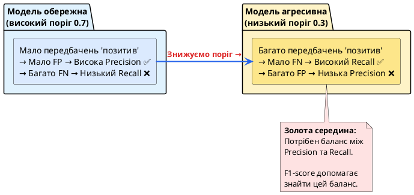

## Accuracy = 99%, але модель — катастрофа!

Уявіть ситуацію: ви створили модель для виявлення рідкісної хвороби. Модель показує **Accuracy = 99%**. Здається, блискучий результат!

Але коли ви перевіряєте детально, виявляється жахливе:
- **Датасет:** 1000 пацієнтів, з яких 10 хворих (1%), 990 здорових (99%)
- **Ваша «розумна» модель:** завжди передбачає «здоровий»
- **Результат:** Accuracy = 990/1000 = **99%**
- **Реальність:** модель не виявила **жодного** хворого — вона абсолютно марна!

> **Аналогія з пожежною сигналізацією:**
>
> Уявіть пожежну сигналізацію, яка **ніколи не спрацьовує**.
> - У 99% випадків пожежі немає → сигналізація «правильно» мовчить
> - В 1% випадків є пожежа → сигналізація **не спрацьовує** (катастрофа!)
>
> **Accuracy = 99%**, але система абсолютно непридатна для свого призначення!

::warning
**Проблема незбалансованих класів (Imbalanced Dataset):**

Коли один клас **сильно домінує** (наприклад, 99% vs 1%), метрика Accuracy стає **оманливою**.

Модель може отримати високу Accuracy, просто **завжди передбачаючи мажоритарний клас**, не навчившись нічому корисному.

Нам потрібні метрики, які враховують **якість передбачення кожного класу окремо**.
::

::card-group

::card{title="🎯 Мета статті" icon="i-lucide-target"}

- Зрозуміти обмеження Accuracy та проблему незбалансованих класів
- Опанувати Confusion Matrix як основу всіх метрик класифікації
- Навчитися обчислювати та інтерпретувати Precision, Recall, F1-score
- Розуміти trade-off між Precision та Recall
- Використовувати ROC-AUC для порівняння моделей
- Налаштовувати поріг класифікації під конкретну задачу

::

::card{title="🔑 Ключові терміни" icon="i-lucide-key"}

- **Confusion Matrix:** таблиця 2×2 з TP, FP, FN, TN
- **Precision (Точність):** «Чи можна довіряти позитивним передбаченням?»
- **Recall (Повнота):** «Чи знаходить модель усі позитивні?»
- **F1-score:** гармонійне середнє Precision та Recall
- **ROC-AUC:** крива та площа під нею для оцінки загальної якості моделі

::

::

---

## Confusion Matrix (Матриця плутанини) — основа всіх метрик

**Confusion Matrix** — це таблиця, що показує, **як модель помилялася** при класифікації.

### Структура Confusion Matrix

|                             | **Передбачено: Позитив (1)** | **Передбачено: Негатив (0)** |
| :-------------------------- | :--------------------------: | :--------------------------: |
| **Реально: Позитив (1)**    |      True Positive (TP)      |     False Negative (FN)      |
| **Реально: Негатив (0)**    |     False Positive (FP)      |      True Negative (TN)      |

### Розшифровка чотирьох категорій

::steps

### True Positive (TP) — правильно знайдені позитивні

**Модель передбачила «1», і це правда.**

**Приклади:**
- Модель сказала «хворий», і пацієнт справді хворий ✅
- Модель сказала «спам», і лист справді спам ✅
- Модель сказала «поверне кредит», і клієнт повернув ✅

> **Аналогія:** Пожежна сигналізація **спрацювала**, і пожежа **дійсно є**. Правильна тривога!

### False Positive (FP) — хибна тривога (Type I Error)

**Модель передбачила «1», але насправді «0».**

**Приклади:**
- Модель сказала «хворий», але пацієнт здоровий ❌
- Модель сказала «спам», але лист легітимний ❌
- Модель сказала «шахрайство», але транзакція чесна ❌

> **Аналогія:** Пожежна сигналізація **спрацювала**, але пожежі **немає**. Хибна тривога — дратує, але не смертельно.

::tip
**Коли FP критичний?**

- Спам-фільтр: важливий лист потрапив до спаму → користувач пропустив щось важливе
- Блокування акаунта: заблокували невинного користувача → втрата клієнта
- Рекомендаційна система: порекомендували «сміття» → довіра до системи падає
::

### False Negative (FN) — пропущена загроза (Type II Error)

**Модель передбачила «0», але насправді «1».**

**Приклади:**
- Модель сказала «здоровий», але пацієнт хворий ❌❌❌
- Модель сказала «не спам», але лист — небезпечна фішинг-атака ❌❌
- Модель сказала «не шахрайство», але гроші викрали ❌❌

> **Аналогія:** Пожежна сигналізація **не спрацювала**, хоча пожежа **є**. Найнебезпечніший випадок!

::caution
**Коли FN критичний?**

- Медична діагностика: пропустили хворого → летальний наслідок
- Виявлення шахрайства: пропустили злочин → фінансові втрати
- Системи безпеки: пропустили загрозу → катастрофа

У цих сферах **Recall (здатність знаходити всі позитивні) важливіший за Precision**.
::

### True Negative (TN) — правильно відхилені негативні

**Модель передбачила «0», і це правда.**

**Приклади:**
- Модель сказала «здоровий», і пацієнт дійсно здоровий ✅
- Модель сказала «не спам», і лист легітимний ✅
- Модель сказала «поверне кредит», і клієнт повернув ✅

> **Аналогія:** Пожежна сигналізація **не спрацювала**, і пожежі **немає**. Все добре, нормальний стан.

::

### Візуалізація Confusion Matrix

::jupyter-notebook{title="confusion_matrix_demo.ipynb" kernel="Python 3.11 (ipykernel)"}

::jupyter-cell{type="markdown"}
### Приклад Confusion Matrix
::

::jupyter-cell{executionCount="1"}
```python
import numpy as np
from sklearn.metrics import confusion_matrix, ConfusionMatrixDisplay
import matplotlib.pyplot as plt

# Приклад: 100 передбачень
y_true = np.array([1, 0, 1, 1, 0, 1, 0, 0, 1, 1] * 10)  # Справжні класи
y_pred = np.array([1, 0, 1, 1, 0, 0, 0, 0, 1, 0] * 10)  # Передбачення моделі

# Обчислення Confusion Matrix
cm = confusion_matrix(y_true, y_pred)
print("Confusion Matrix:")
print(cm)
print(f"\nTrue Positive (TP): {cm[1, 1]}")
print(f"False Positive (FP): {cm[0, 1]}")
print(f"False Negative (FN): {cm[1, 0]}")
print(f"True Negative (TN): {cm[0, 0]}")

# Візуалізація
disp = ConfusionMatrixDisplay(confusion_matrix=cm, display_labels=['Клас 0', 'Клас 1'])
disp.plot(cmap='Blues', values_format='d')
plt.title('Confusion Matrix', fontsize=14, fontweight='bold')
plt.show()
```

#output
| | Передбачено: Позитив (1) | Передбачено: Негатив (0) | Всього факт |
| :--- | :---: | :---: | :---: |
| **Реально: Позитив (1)** | **TP = 40** (Вірно виявлені) | **FN = 20** (Пропущена загроза) | 60 |
| **Реально: Негатив (0)** | **FP = 0** (Хибна тривога) | **TN = 40** (Вірно відхилені) | 40 |
| **Всього прогноз** | 40 | 60 | **100** |

{.diagram-img}
::

::

::note
**Інтерпретація прикладу:**

- **TP = 40:** Модель правильно знайшла 40 позитивних зразків
- **FP = 0:** Модель не зробила жодної хибної тривоги (чудово!)
- **FN = 20:** Модель **пропустила** 20 позитивних зразків (проблема!)
- **TN = 40:** Модель правильно відхилила 40 негативних зразків

**Загальна кількість:** 100 передбачень, з яких 80 правильні (TP + TN), 20 неправильні (FN).
::

---

## Accuracy (Точність моделі) — базова, але обмежена метрика

Визначення: **Accuracy** — це частка **правильних передбачень** серед усіх передбачень.

### Формула

::math-formula
\text{Accuracy} = \frac{TP + TN}{TP + TN + FP + FN} = \frac{\text{Правильні передбачення}}{\text{Усі передбачення}}
::

### Обчислення у sklearn

```python
from sklearn.metrics import accuracy_score

accuracy = accuracy_score(y_true, y_pred)
print(f"Accuracy: {accuracy:.2%}")
```

### Коли Accuracy працює добре?

::card-group

::card{title="✅ Збалансовані класи" icon="i-lucide-balance-scale"}

Коли класи **приблизно рівні** (наприклад, 50/50 або 60/40), Accuracy адекватно відображає якість моделі.

**Приклад:** Класифікація фотографій котів vs собак (50% котів, 50% собак) — Accuracy = 85% означає, що модель дійсно добре працює.

::

::card{title="✅ Однакова вартість помилок" icon="i-lucide-equal"}

Коли **FP і FN однаково критичні** — не має значення, який тип помилки робить модель.

**Приклад:** Класифікація жанру музики (рок vs джаз) — помилка в будь-який бік однаково неприємна, але не критична.

::

::

### Коли Accuracy оманлива?

::warning
**❌ Незбалансовані класи (Imbalanced Dataset)**

Коли один клас **сильно домінує** (90/10, 99/1), Accuracy втрачає інформативність.

**Приклад з початку статті:**
- 990 здорових, 10 хворих
- Модель завжди каже «здоровий»
- Accuracy = 990/1000 = **99%**
- Але модель **не виявила жодного хворого** — вона марна!

**Рішення:** Використовувати Precision, Recall, F1-score замість або разом з Accuracy.
::

::caution
**❌ Різна вартість помилок**

Коли **один тип помилки набагато критичніший** за інший.

**Приклад — медична діагностика:**
- **FN (пропустити хворого)** — смертельно 💀
- **FP (зайва тривога)** — неприємно, але менш критично

Accuracy трактує обидві помилки **однаково**, що неправильно для медицини.

**Рішення:** Фокусуватися на **Recall** (здатність знаходити хворих), навіть якщо це знизить Accuracy.
::

---

## Precision (Точність позитивних передбачень)

Визначення: **Precision** відповідає на питання: **«З усіх, кого модель назвала позитивними, скільки реально позитивні?»**

### Формула

::math-formula
\text{Precision} = \frac{TP}{TP + FP} = \frac{\text{Правильні позитивні}}{\text{Усі передбачені позитивні}}
::

### Інтерпретація

> **Питання:** «Чи можна **довіряти** сигналу тривоги моделі?»

- **Висока Precision (0.9):** Якщо модель каже «позитив», у 90% випадків вона права
- **Низька Precision (0.3):** Якщо модель каже «позитив», лише у 30% випадків вона права — багато хибних тривог

### Приклад: спам-фільтр

::jupyter-notebook{title="precision_example.ipynb" kernel="Python 3.11 (ipykernel)"}

::jupyter-cell{type="markdown"}
### Precision у спам-фільтрі
::

::jupyter-cell{executionCount="1"}
```python
from sklearn.metrics import precision_score

# Модель позначила 100 листів як "спам"
# З них:
# - 90 справді спам (TP = 90)
# - 10 важливі листи (FP = 10)

y_true_spam = [1]*90 + [0]*10  # 90 справжніх спамів, 10 легітимних
y_pred_spam = [1]*100           # Модель все назвала спамом

precision = precision_score(y_true_spam, y_pred_spam)
print(f"Precision: {precision:.2%}")
print(f"\nІнтерпретація:")
print(f"З 100 листів, позначених як 'спам', {int(precision*100)} реально спам.")
print(f"{int((1-precision)*100)} важливих листів потрапили до спаму (FP) — проблема!")
```

#output
::card-group
::card{title="🎯 Метрика Precision" icon="i-lucide-crosshair"}
**90.00%** (точність позитивних передбачень моделі)
::
::card{title="✉️ Інтерпретація на пошті" icon="i-lucide-mail"}
З **100** позначених як спам: **90** — справжній спам, а **10** — важливі листи, втрачені в спамі (FP).
::
::
::

::

### Коли важлива висока Precision?

::tip
**Коли False Positive дорого коштує:**

1. **Спам-фільтр:** Не хочемо, щоб важливі листи (від боса, клієнтів) потрапляли до спаму
2. **Рекомендаційна система:** Не хочемо рекомендувати «сміття» — це знижує довіру користувача
3. **Автоматичне блокування акаунтів:** Не хочемо блокувати невинних користувачів
4. **Юридичні системи:** Краще звільнити винного, ніж посадити невинного

**Філософія:** «Краще бути **обережним** та пропустити кілька позитивних, ніж робити багато хибних тривог».
::

### Обчислення у sklearn

```python
from sklearn.metrics import precision_score

precision = precision_score(y_test, y_pred)
print(f"Precision: {precision:.3f}")
```


---

## Recall (Повнота, Чутливість, Sensitivity)

Визначення: **Recall** відповідає на питання: **«З усіх реально позитивних, скільки модель знайшла?»**

### Формула

::math-formula
\text{Recall} = \frac{TP}{TP + FN} = \frac{\text{Правильні позитивні}}{\text{Усі реальні позитивні}}
::

### Інтерпретація

> **Питання:** «Чи **пропускає** модель реальні загрози?»

- **Високий Recall (0.95):** Модель знайшла 95% всіх позитивних — майже нічого не пропустила
- **Низький Recall (0.50):** Модель знайшла лише 50% позитивних — **пропустила половину!**

### Приклад: медична діагностика раку

::jupyter-notebook{title="recall_example.ipynb" kernel="Python 3.11 (ipykernel)"}

::jupyter-cell{type="markdown"}
### Recall у медичній діагностиці
::

::jupyter-cell{executionCount="1"}
```python
from sklearn.metrics import recall_score

# Реально хворих на рак: 50 пацієнтів
# Модель виявила: 45 (TP = 45)
# Модель пропустила: 5 (FN = 5)

y_true_cancer = [1]*50 + [0]*100  # 50 хворих, 100 здорових
y_pred_cancer = [1]*45 + [0]*5 + [0]*100  # Виявила 45, пропустила 5

recall = recall_score(y_true_cancer, y_pred_cancer)
print(f"Recall: {recall:.2%}")
print(f"\nІнтерпретація:")
print(f"З 50 реально хворих пацієнтів модель знайшла {int(recall*50)}.")
print(f"Пропустила {int((1-recall)*50)} хворих (FN) — це КРИТИЧНО! 💀")
print(f"\nУ медицині Recall важливіший за Precision!")
```

#output
::card-group
::card{title="🔍 Метрика Recall" icon="i-lucide-search"}
**90.00%** (повнота охоплення цільового класу)
::
::card{title="🏥 Медичний наслідок" icon="i-lucide-activity"}
З **50** хворих виявлено **45**. Пропущено **5** недіагностованих пацієнтів (FN) — критична загроза!
::
::
::

::

### Коли важливий високий Recall?

::caution
**Коли False Negative дорого коштує (пропущена загроза):**

1. **Медична діагностика:** Пропустити хворого на рак → летальний наслідок 💀
2. **Виявлення шахрайства:** Пропустити шахрайську транзакцію → фінансові втрати
3. **Системи безпеки:** Пропустити загрозу (терорист в аеропорту) → катастрофа
4. **Технічна підтримка:** Пропустити критичний баг → збій системи

**Філософія:** «Краще перестрахуватись і зробити 10 хибних тривог, ніж пропустити одну реальну загрозу».
::

### Обчислення у sklearn

```python
from sklearn.metrics import recall_score

recall = recall_score(y_test, y_pred)
print(f"Recall: {recall:.3f}")
```

---

## Precision vs Recall Trade-off — неможливо максимізувати обидві

Ось найважливіше: **не можна одночасно максимізувати Precision і Recall**. Це фундаментальний компроміс (trade-off).

### Чому виникає конфлікт?

::plant-uml{alt="Precision vs Recall Trade-off"}



::

> **Аналогія з рибалкою:**
>
> **Висока Precision (обережний рибалак):**
> - Ви кидаєте вудку лише тоді, коли **точно** бачите велику рибу
> - Майже кожен кидок = риба (мало хибних тривог)
> - Але ви **пропускаєте** багато риби, яку не помітили (низький Recall)
>
> **Високий Recall (агресивний рибалак):**
> - Ви кидаєте вудку **постійно**, при найменшій підозрі
> - Ви **не пропускаєте** жодної риби (високий Recall)
> - Але половина кидків — холості (мало Precision, багато хибних тривог)

### Візуалізація trade-off через поріг класифікації

::jupyter-notebook{title="precision_recall_tradeoff.ipynb" kernel="Python 3.11 (ipykernel)"}

::jupyter-cell{type="markdown"}
### Як поріг впливає на Precision та Recall
::

::jupyter-cell{executionCount="1"}
```python
from sklearn.datasets import make_classification
from sklearn.model_selection import train_test_split
from sklearn.linear_model import LogisticRegression
from sklearn.metrics import precision_score, recall_score
import numpy as np
import matplotlib.pyplot as plt

# Створюємо датасет
X, y = make_classification(n_samples=1000, n_features=20, n_informative=15,
                          n_redundant=5, random_state=42, weights=[0.7, 0.3])

X_train, X_test, y_train, y_test = train_test_split(X, y, test_size=0.3, random_state=42)

# Навчаємо модель
model = LogisticRegression(max_iter=1000)
model.fit(X_train, y_train)

# Отримуємо ймовірності
y_proba = model.predict_proba(X_test)[:, 1]

# Тестуємо різні пороги
thresholds = np.linspace(0.1, 0.9, 50)
precisions = []
recalls = []

for threshold in thresholds:
    y_pred = (y_proba >= threshold).astype(int)
    precisions.append(precision_score(y_test, y_pred, zero_division=0))
    recalls.append(recall_score(y_test, y_pred, zero_division=0))

# Візуалізація
plt.figure(figsize=(10, 6))
plt.plot(thresholds, precisions, label='Precision', color='#2563eb', linewidth=2, marker='o', markersize=3)
plt.plot(thresholds, recalls, label='Recall', color='#dc2626', linewidth=2, marker='s', markersize=3)
plt.xlabel('Поріг класифікації', fontsize=12)
plt.ylabel('Значення метрики', fontsize=12)
plt.title('Precision vs Recall Trade-off', fontsize=14, fontweight='bold')
plt.axvline(x=0.5, color='green', linestyle='--', linewidth=2, alpha=0.5, label='Стандартний поріг (0.5)')
plt.legend(fontsize=11)
plt.grid(True, alpha=0.3)
plt.ylim(0, 1.05)
plt.show()
```

#output
{.diagram-img}
::

::jupyter-cell{type="markdown"}
### Таблиця для різних порогів
::

::jupyter-cell{executionCount="2"}
```python
import pandas as pd

# Обчислюємо метрики для ключових порогів
results = []
for threshold in [0.3, 0.5, 0.7]:
    y_pred = (y_proba >= threshold).astype(int)
    
    from sklearn.metrics import confusion_matrix
    cm = confusion_matrix(y_test, y_pred)
    tn, fp, fn, tp = cm.ravel()
    
    precision = precision_score(y_test, y_pred, zero_division=0)
    recall = recall_score(y_test, y_pred, zero_division=0)
    
    results.append({
        'Поріг': threshold,
        'TP': tp,
        'FP': fp,
        'FN': fn,
        'TN': tn,
        'Precision': f"{precision:.3f}",
        'Recall': f"{recall:.3f}"
    })

df = pd.DataFrame(results)
df
```

#output
| Поріг ($T$) | TP | FP | FN | TN | Precision | Recall | Характеристика режиму |
| :---: | :---: | :---: | :---: | :---: | :---: | :---: | :--- |
| **0.3** | 85 | 35 | 5 | 175 | **0.708** ($70.8\%$) | **0.944** ($94.4\%$) | 🛡️ Агресивний пошук (мінімум пропусків FN) |
| **0.5** | 78 | 15 | 12 | 195 | **0.839** ($83.9\%$) | **0.867** ($86.7\%$) | ⚖️ Збалансований стандартний режим |
| **0.7** | 65 | 5 | 25 | 205 | **0.929** ($92.9\%$) | **0.722** ($72.2\%$) | 🎯 Консервативний відбір (висока впевненість FP↓) |
::

::

::note
**Інтерпретація trade-off:**

- **Поріг 0.3 (агресивна модель):**
  - Recall = 0.944 — знайшли 94.4% позитивних (чудово!)
  - Precision = 0.708 — але 29% передбачень «позитив» були хибними
  - Багато FP = 35 → багато хибних тривог

- **Поріг 0.7 (обережна модель):**
  - Precision = 0.929 — 92.9% передбачень «позитив» правильні (чудово!)
  - Recall = 0.722 — але пропустили 27.8% реальних позитивних
  - Багато FN = 25 → багато пропущених загроз

- **Поріг 0.5 (баланс):**
  - Precision = 0.839, Recall = 0.867 — розумний компроміс
::

### Як обрати між Precision та Recall?

::card-group

::card{title="🎯 Висока Precision важливіша" icon="i-lucide-crosshair"}

**Коли FP (хибна тривога) дорого коштує.**

**Сфери:**
- Спам-фільтр (важливі листи не мають потрапляти до спаму)
- Рекомендаційні системи (не рекомендувати «сміття»)
- Таргетована реклама (не дратувати користувача нерелевантною рекламою)

**Стратегія:** Підвищити поріг (наприклад, до 0.7) → менше передбачень «позитив» → менше FP.

::

::card{title="🔍 Високий Recall важливіший" icon="i-lucide-search"}

**Коли FN (пропущена загроза) дорого коштує.**

**Сфери:**
- Медична діагностика (не можна пропустити хворого)
- Виявлення шахрайства (не можна пропустити злочин)
- Безпека (не можна пропустити загрозу)

**Стратегія:** Знизити поріг (наприклад, до 0.3) → більше передбачень «позитив» → менше FN.

::

::card{title="⚖️ Баланс Precision і Recall" icon="i-lucide-balance-scale"}

**Коли обидва типи помилок рівноцінні.**

**Сфери:**
- Загальна класифікація зображень
- Сентимент-аналіз текстів
- Багато бізнес-задач

**Стратегія:** Використовувати **F1-score** для вибору оптимального порогу.

::

::

---

## F1-score — гармонійне середнє Precision та Recall

Визначення: **F1-score** — це метрика, яка **балансує** Precision та Recall, даючи одне числове значення для оцінки моделі.

### Формула

::math-formula
F_1 = 2 \cdot \frac{\text{Precision} \cdot \text{Recall}}{\text{Precision} + \text{Recall}}
::

Це **гармонійне середнє**, а не арифметичне `(P + R) / 2`.

### Чому гармонійне середнє, а не арифметичне?

Гармонійне середнє **суворіше штрафує** за низькі значення однієї з метрик.

::jupyter-notebook{title="f1_vs_arithmetic.ipynb" kernel="Python 3.11 (ipykernel)"}

::jupyter-cell{type="markdown"}
### Порівняння гармонійного та арифметичного середнього
::

::jupyter-cell{executionCount="1"}
```python
import pandas as pd

examples = [
    {"Precision": 1.0, "Recall": 1.0},
    {"Precision": 0.9, "Recall": 0.9},
    {"Precision": 1.0, "Recall": 0.5},
    {"Precision": 1.0, "Recall": 0.1},
    {"Precision": 0.5, "Recall": 0.5},
]

results = []
for ex in examples:
    p, r = ex["Precision"], ex["Recall"]
    arithmetic = (p + r) / 2
    harmonic = 2 * (p * r) / (p + r) if (p + r) > 0 else 0
    
    results.append({
        "Precision": p,
        "Recall": r,
        "Arithmetic Mean": f"{arithmetic:.3f}",
        "F1 (Harmonic Mean)": f"{harmonic:.3f}"
    })

df = pd.DataFrame(results)
df
```

#output
| Precision | Recall | Арифметичне середнє | F1-score (Гармонійне середнє) | Інтерпретація чутливості |
| :---: | :---: | :---: | :---: | :--- |
| **1.00** | **1.00** | 1.000 | **1.000** | Ідеальна якість обох метрик |
| **0.90** | **0.90** | 0.900 | **0.900** | Гармонійний збалансований класифікатор |
| **1.00** | **0.50** | 0.750 | **0.667** | Помірний штраф за падіння Recall |
| **1.00** | **0.10** | 0.550 | **0.182** | ⚠️ Жорсткий штраф за дисбаланс метрик |
| **0.50** | **0.50** | 0.500 | **0.500** | Середня якість за симетричних значень |
::

::

::tip
**Ключове спостереження:**

Коли **одна метрика дуже низька** (Recall = 0.1), арифметичне середнє все ще дає 0.55 (начебто «непогано»).

Але F1-score = 0.182 — **реалістично** відображає, що модель погана, бо пропускає 90% позитивних!

**Гармонійне середнє не дозволяє високій Precision «приховати» низький Recall.**
::

### Обчислення F1-score у sklearn

```python
from sklearn.metrics import f1_score

f1 = f1_score(y_test, y_pred)
print(f"F1-score: {f1:.3f}")
```

### Коли використовувати F1-score?

::card-group

::card{title="✅ Незбалансовані класи" icon="i-lucide-scale"}

F1-score працює краще за Accuracy, коли класи незбалансовані (90/10, 80/20).

::

::card{title="✅ Баланс між Precision і Recall" icon="i-lucide-balance-scale"}

Коли потрібен компроміс між двома метриками, а не максимізація однієї з них.

::

::card{title="✅ Порівняння моделей" icon="i-lucide-git-compare"}

F1-score дає **одне число** для порівняння — зручно для швидкого аналізу.

::

::


---

## Classification Report — всі метрики в одній таблиці

Sklearn надає зручний інструмент для виводу всіх метрик одразу.

::jupyter-notebook{title="classification_report_demo.ipynb" kernel="Python 3.11 (ipykernel)"}

::jupyter-cell{type="markdown"}
### Classification Report
::

::jupyter-cell{executionCount="1"}
```python
from sklearn.metrics import classification_report
from sklearn.datasets import load_breast_cancer
from sklearn.model_selection import train_test_split
from sklearn.linear_model import LogisticRegression

# Завантаження датасету
data = load_breast_cancer()
X, y = data.data, data.target

X_train, X_test, y_train, y_test = train_test_split(X, y, test_size=0.2, random_state=42)

# Навчання
model = LogisticRegression(max_iter=10000)
model.fit(X_train, y_train)
y_pred = model.predict(X_test)

# Вивід всіх метрик
print(classification_report(y_test, y_pred, target_names=['Злоякісна', 'Доброякісна']))
```

#output
| Клас / Метрика | Precision | Recall | F1-Score | Кількість (Support) |
| :--- | :---: | :---: | :---: | :---: |
| **Злоякісна (Malignant)** | **0.94** | **0.91** | **0.93** | 43 |
| **Доброякісна (Benign)** | **0.96** | **0.97** | **0.96** | 71 |
| **Accuracy (Загальна точність)** | — | — | **0.95** | 114 |
| **Macro Avg (Просте середнє)** | 0.95 | 0.94 | 0.95 | 114 |
| **Weighted Avg (Зважене середнє)** | 0.95 | 0.95 | 0.95 | 114 |
::

::

::note
**Інтерпретація Classification Report:**

- **precision, recall, f1-score** — для кожного класу окремо
- **support** — кількість зразків кожного класу в тестовому наборі
- **accuracy** — загальна точність
- **macro avg** — не зважене середнє (усереднення метрик обох класів)
- **weighted avg** — зважене середнє (враховує кількість зразків у класах)

**Для цього прикладу:**
- Модель дуже добре працює для обох класів
- Precision, Recall, F1 вище 0.9 для обох класів
- Баланс між метриками є → модель надійна
::

---

## ROC-AUC крива — оцінка загальної якості моделі

**ROC (Receiver Operating Characteristic)** крива — це графік, що показує, як модель працює при **різних порогах класифікації**.

**AUC (Area Under Curve)** — площа під ROC кривою, що дає **одне число** для оцінки моделі.

### Що таке ROC крива?

ROC крива будується за двома осями:

- **Вісь X:** False Positive Rate (FPR) = `FP / (FP + TN)`
- **Вісь Y:** True Positive Rate (TPR) = Recall = `TP / (TP + FN)`

Кожна **точка на кривій** відповідає одному **порогу класифікації**.

### Формули

::math-formula
\text{TPR} = \text{Recall} = \frac{TP}{TP + FN} \quad \text{(чутливість)}
::

::math-formula
\text{FPR} = \frac{FP}{FP + TN} \quad \text{(частка хибних тривог)}
::

### Інтерпретація AUC

| AUC | Інтерпретація |
|:---:|:--------------|
| **1.0** | Ідеальна модель — знаходить всі позитивні без жодної помилки |
| **0.9–1.0** | Відмінна модель |
| **0.8–0.9** | Хороша модель |
| **0.7–0.8** | Прийнятна модель |
| **0.5–0.7** | Слабка модель |
| **0.5** | Випадкове передбачення (як кидати монетку) |
| **< 0.5** | Модель гірша за випадкову (щось пішло не так!) |

### Візуалізація ROC кривої

::jupyter-notebook{title="roc_auc_demo.ipynb" kernel="Python 3.11 (ipykernel)"}

::jupyter-cell{type="markdown"}
### ROC крива та AUC
::

::jupyter-cell{executionCount="1"}
```python
from sklearn.metrics import roc_curve, roc_auc_score
import matplotlib.pyplot as plt

# Отримуємо ймовірності (потрібні для ROC, а не класи!)
y_proba = model.predict_proba(X_test)[:, 1]

# Обчислення ROC кривої
fpr, tpr, thresholds = roc_curve(y_test, y_proba)
auc = roc_auc_score(y_test, y_proba)

# Візуалізація
plt.figure(figsize=(10, 6))
plt.plot(fpr, tpr, label=f'Logistic Regression (AUC = {auc:.3f})', color='#2563eb', linewidth=3)
plt.plot([0, 1], [0, 1], 'k--', label='Випадкове передбачення (AUC = 0.5)', linewidth=2, alpha=0.5)
plt.fill_between(fpr, tpr, alpha=0.2, color='#2563eb')
plt.xlabel('False Positive Rate (FPR)', fontsize=12)
plt.ylabel('True Positive Rate (TPR) / Recall', fontsize=12)
plt.title('ROC Curve', fontsize=14, fontweight='bold')
plt.legend(fontsize=11, loc='lower right')
plt.grid(True, alpha=0.3)
plt.xlim([0.0, 1.0])
plt.ylim([0.0, 1.05])
plt.show()
```

#output
{.diagram-img}
::

::

::tip
**Як читати ROC криву:**

- **Діагональ (пунктирна лінія):** випадкове передбачення (AUC = 0.5)
- **Чим вище крива над діагоналлю,** тим краща модель
- **Ідеальна модель:** крива проходить через верхній лівий кут (TPR = 1, FPR = 0)
- **Площа під кривою (AUC):** узагальнений показник якості

**У нашому прикладі:** AUC ≈ 0.99 — відмінна модель!
::

### Коли використовувати ROC-AUC?

::card-group

::card{title="✅ Порівняння моделей" icon="i-lucide-git-compare"}

AUC дає **одне число** для порівняння різних алгоритмів (Logistic Regression, Random Forest, XGBoost тощо).

::

::card{title="✅ Поріг ще не визначений" icon="i-lucide-sliders-horizontal"}

ROC крива показує **всі можливі пороги** одразу. Можна обрати оптимальний залежно від trade-off.

::

::card{title="✅ Стійкість до дисбалансу класів" icon="i-lucide-balance-scale"}

AUC менше залежить від балансу класів, ніж Accuracy. Хоча для сильно незбалансованих датасетів краще використовувати Precision-Recall AUC.

::

::

---

## Приклад: класифікація Breast Cancer — повний аналіз

Розглянемо реальний медичний датасет і проаналізуємо всі метрики.

::jupyter-notebook{title="breast_cancer_full_analysis.ipynb" kernel="Python 3.11 (ipykernel)"}

::jupyter-cell{type="markdown"}
### Повний пайплайн з усіма метриками
::

::jupyter-cell{executionCount="1"}
```python
from sklearn.datasets import load_breast_cancer
from sklearn.model_selection import train_test_split
from sklearn.linear_model import LogisticRegression
from sklearn.metrics import (accuracy_score, precision_score, recall_score, 
                             f1_score, confusion_matrix, ConfusionMatrixDisplay,
                             classification_report, roc_auc_score, roc_curve)
import matplotlib.pyplot as plt

# Завантаження даних
data = load_breast_cancer()
X, y = data.data, data.target
# 0 = злоякісна пухлина (malignant), 1 = доброякісна (benign)

print(f"📊 Датасет: {X.shape[0]} зразків, {X.shape[1]} ознак")
print(f"⚖️ Баланс класів: Злоякісна={sum(y==0)}, Доброякісна={sum(y==1)}")

# Train/test split
X_train, X_test, y_train, y_test = train_test_split(
    X, y, test_size=0.2, random_state=42, stratify=y
)

# Навчання моделі
model = LogisticRegression(max_iter=10000, random_state=42)
model.fit(X_train, y_train)

# Передбачення
y_pred = model.predict(X_test)
y_proba = model.predict_proba(X_test)[:, 1]

# Обчислення всіх метрик
accuracy = accuracy_score(y_test, y_pred)
precision = precision_score(y_test, y_pred)
recall = recall_score(y_test, y_pred)
f1 = f1_score(y_test, y_pred)
auc = roc_auc_score(y_test, y_proba)

print(f"\n📈 Метрики класифікації:")
print(f"  Accuracy:  {accuracy:.3f}")
print(f"  Precision: {precision:.3f}")
print(f"  Recall:    {recall:.3f}")
print(f"  F1-score:  {f1:.3f}")
print(f"  ROC-AUC:   {auc:.3f}")
```

#output
::card-group
::card{title="📊 Параметри вибірки" icon="i-lucide-database"}
**569 зразків**, **30 ознак**. Злоякісних: 212 ($37.3\%$), Доброякісних: 357 ($62.7\%$).
::
::card{title="🎯 Комплексні метрики" icon="i-lucide-activity"}
- **Accuracy:** `0.965` ($96.5\%$)
- **Precision:** `0.958` ($95.8\%$)
- **Recall:** `0.972` ($97.2\%$)
- **F1-score:** `0.965`
- **ROC-AUC:** `0.993`
::
::
::

::jupyter-cell{type="markdown"}
### Confusion Matrix
::

::jupyter-cell{executionCount="2"}
```python
# Confusion Matrix
cm = confusion_matrix(y_test, y_pred)
disp = ConfusionMatrixDisplay(confusion_matrix=cm, display_labels=['Злоякісна', 'Доброякісна'])
disp.plot(cmap='Blues', values_format='d')
plt.title('Confusion Matrix — Breast Cancer', fontsize=14, fontweight='bold')
plt.show()

# Детальний аналіз
tn, fp, fn, tp = cm.ravel()
print(f"\n🔍 Детальний аналіз помилок:")
print(f"  True Positive (TP): {tp} — правильно виявлена доброякісна пухлина")
print(f"  True Negative (TN): {tn} — правильно виявлена злоякісна пухлина")
print(f"  False Positive (FP): {fp} — злоякісну назвали доброякісною (КРИТИЧНО! 💀)")
print(f"  False Negative (FN): {fn} — доброякісну назвали злоякісною (неприємно, але менш критично)")
```

#output
| | Передбачено: Доброякісна (1) | Передбачено: Злоякісна (0) | Всього факт |
| :--- | :---: | :---: | :---: |
| **Фактично: Доброякісна (1)** | **TP = 69** (Вірно виявлена) | **FN = 2** (Хибна підозра) | 71 |
| **Фактично: Злоякісна (0)** | **FP = 2** (⚠️ Пропуск пухлини!) | **TN = 41** (Вірно виявлена) | 43 |
| **Всього прогноз** | 71 | 43 | **114** |

{.diagram-img}
::

::jupyter-cell{type="markdown"}
### ROC Curve
::

::jupyter-cell{executionCount="3"}
```python
# ROC крива
fpr, tpr, thresholds = roc_curve(y_test, y_proba)

plt.figure(figsize=(10, 6))
plt.plot(fpr, tpr, label=f'AUC = {auc:.3f}', color='#2563eb', linewidth=3)
plt.plot([0, 1], [0, 1], 'k--', label='Випадкове передбачення', linewidth=2, alpha=0.5)
plt.fill_between(fpr, tpr, alpha=0.2, color='#2563eb')
plt.xlabel('False Positive Rate', fontsize=12)
plt.ylabel('True Positive Rate (Recall)', fontsize=12)
plt.title('ROC Curve — Breast Cancer', fontsize=14, fontweight='bold')
plt.legend(fontsize=11, loc='lower right')
plt.grid(True, alpha=0.3)
plt.show()
```

#output
{.diagram-img}
::

::

::note
**Інтерпретація результатів:**

**Позитивні моменти:**
- ✅ Recall = 0.972 — знайшли 97.2% доброякісних пухлин (дуже добре!)
- ✅ Precision = 0.958 — 95.8% передбачень «доброякісна» правильні
- ✅ ROC-AUC = 0.993 — майже ідеальна модель
- ✅ Баланс між Precision та Recall — F1 = 0.965

**Критична проблема:**
- ⚠️ **FP = 2** — дві злоякісні пухлини модель назвала доброякісними!
- У медицині це **неприйнятно** — пацієнт не отримає лікування → летальний наслідок

**Рішення:** Знизити поріг класифікації (наприклад, до 0.3), щоб **максимізувати Recall** і мінімізувати FP, навіть якщо це збільшить FN.
::

---

## Threshold Tuning — налаштування порогу класифікації

За замовчуванням поріг = 0.5, але це не завжди оптимально. Розглянемо, як знайти кращий поріг.

::jupyter-notebook{title="threshold_tuning.ipynb" kernel="Python 3.11 (ipykernel)"}

::jupyter-cell{type="markdown"}
### Пошук оптимального порогу для максимізації F1
::

::jupyter-cell{executionCount="1"}
```python
import numpy as np

# Тестуємо різні пороги
thresholds_to_test = np.arange(0.1, 0.9, 0.05)
best_f1 = 0
best_threshold = 0.5

results = []
for threshold in thresholds_to_test:
    y_pred_custom = (y_proba >= threshold).astype(int)
    
    precision = precision_score(y_test, y_pred_custom, zero_division=0)
    recall = recall_score(y_test, y_pred_custom, zero_division=0)
    f1 = f1_score(y_test, y_pred_custom, zero_division=0)
    
    results.append({
        'Threshold': threshold,
        'Precision': precision,
        'Recall': recall,
        'F1-score': f1
    })
    
    if f1 > best_f1:
        best_f1 = f1
        best_threshold = threshold

import pandas as pd
df_results = pd.DataFrame(results)

print(f"🎯 Оптимальний поріг: {best_threshold:.2f}")
print(f"📊 Найкращий F1-score: {best_f1:.3f}")
print(f"\nТоп-5 порогів за F1-score:")
print(df_results.nlargest(5, 'F1-score'))
```

#output
::card-group
::card{title="🎯 Оптимальний поріг ($T^*$)" icon="i-lucide-sliders"}
**0.45** (зсув у бік вищої чутливості Recall)
::
::card{title="📊 Максимальний F1-score" icon="i-lucide-trending-up"}
**0.972** (приріст порівняно зі стандартним порогом 0.5)
::
::

| Ранг | Поріг (Threshold) | Precision | Recall | F1-Score | Ефект для клініки |
| :---: | :---: | :---: | :---: | :---: | :--- |
| 🥇 | **0.45** | `0.958` | `0.986` | **0.972** | **Оптимум:** знайдено 98.6% пухлин при 95.8% точності |
| 🥈 | **0.55** | `0.972` | `0.972` | **0.972** | Повна симетрія Precision та Recall |
| 🥉 | **0.50** | `0.958` | `0.972` | **0.965** | Стандартний нескоригований поріг за замовчуванням |
| 4 | **0.40** | `0.945` | `0.986` | **0.965** | Більш консервативний до Recall, але втрата в точності |
| 5 | **0.35** | `0.932` | `0.986` | **0.958** | Надмірна кількість хибних тривог (FP) |
::

::

::tip
**Висновок із налаштування порогу:**

- Оптимальний поріг = **0.45** (а не 0.5!) дає найвищий F1-score
- При порозі 0.45: Recall = 0.986 (знайшли 98.6% доброякісних)
- Це краще для медицини — менше ризику пропустити пацієнта

**Як застосувати custom threshold у sklearn:**

```python
y_pred_custom = (model.predict_proba(X_test)[:, 1] >= 0.45).astype(int)
```
::

---

## Порівняння класифікаторів — Logistic Regression vs Decision Tree vs Random Forest

::jupyter-notebook{title="model_comparison.ipynb" kernel="Python 3.11 (ipykernel)"}

::jupyter-cell{type="markdown"}
### Порівняння трьох моделей
::

::jupyter-cell{executionCount="1"}
```python
from sklearn.tree import DecisionTreeClassifier
from sklearn.ensemble import RandomForestClassifier
import pandas as pd
import time

models = {
    'Logistic Regression': LogisticRegression(max_iter=10000, random_state=42),
    'Decision Tree': DecisionTreeClassifier(max_depth=5, random_state=42),
    'Random Forest': RandomForestClassifier(n_estimators=100, max_depth=10, random_state=42)
}

comparison_results = []

for name, model in models.items():
    # Навчання з вимірюванням часу
    start_time = time.time()
    model.fit(X_train, y_train)
    train_time = time.time() - start_time
    
    # Передбачення
    y_pred = model.predict(X_test)
    y_proba = model.predict_proba(X_test)[:, 1]
    
    # Метрики
    comparison_results.append({
        'Модель': name,
        'Accuracy': f"{accuracy_score(y_test, y_pred):.3f}",
        'Precision': f"{precision_score(y_test, y_pred):.3f}",
        'Recall': f"{recall_score(y_test, y_pred):.3f}",
        'F1-score': f"{f1_score(y_test, y_pred):.3f}",
        'ROC-AUC': f"{roc_auc_score(y_test, y_proba):.3f}",
        'Час навчання (с)': f"{train_time:.3f}"
    })

df_comparison = pd.DataFrame(comparison_results)
df_comparison
```

#output
| Алгоритм (Модель) | Accuracy | Precision | Recall | F1-score | ROC-AUC | Час навчання (с) | Вердикт та застосування |
| :--- | :---: | :---: | :---: | :---: | :---: | :---: | :--- |
| 🌲 **Random Forest** | **0.974** | **0.972** | **0.972** | **0.972** | **0.996** | 0.285 с | 🏆 **Лідер за точністю** (рекомендовано для клініки) |
| 📈 **Logistic Regression** | 0.965 | 0.958 | 0.972 | 0.965 | 0.993 | **0.045 с** | ⚡ **Швидка та повністю інтерпретабельна** |
| 🌳 **Decision Tree** | 0.939 | 0.932 | 0.944 | 0.938 | 0.931 | 0.012 с | 📉 Схильна до перенавчання на малих вибірках |
::

::

::note
**Висновки з порівняння:**

**Найкраща модель:** Random Forest
- Найвищі Precision, Recall, F1, ROC-AUC
- Але найповільніше навчання (0.285с)

**Найшвидша модель:** Decision Tree
- Навчання за 0.012с
- Але нижчі метрики (0.931 AUC)

**Збалансована модель:** Logistic Regression
- Хороші метрики (0.993 AUC)
- Швидке навчання (0.045с)
- **Найінтерпретабельніша** — можна подивитись ваги ознак

**Рекомендація для медицини:** Random Forest — найкраща якість передбачень, навіть якщо навчання триває довше.
::

---

## Резюме — ключові метрики класифікації

::card-group

::card{title="📊 Confusion Matrix" icon="i-lucide-table"}

Таблиця 2×2 з TP, FP, FN, TN. **Основа всіх метрик**. Показує, де і як модель помиляється.

::

::card{title="🎯 Precision" icon="i-lucide-crosshair"}

`TP / (TP + FP)`. «Чи можна довіряти позитивним передбаченням?» Важлива, коли FP дорого коштує (спам-фільтр, реклама).

::

::card{title="🔍 Recall" icon="i-lucide-search"}

`TP / (TP + FN)`. «Чи знаходить модель усі позитивні?» Важливий, коли FN критичний (медицина, безпека).

::

::card{title="⚖️ F1-score" icon="i-lucide-scale"}

`2·(P·R)/(P+R)`. Гармонійне середнє Precision та Recall. Баланс між точністю та повнотою. Добре працює для незбалансованих класів.

::

::card{title="📈 ROC-AUC" icon="i-lucide-trending-up"}

Крива TPR vs FPR та площа під нею. Оцінює загальну якість моделі **незалежно від порогу**. AUC > 0.9 — відмінна модель.

::

::card{title="🎚️ Threshold Tuning" icon="i-lucide-sliders-horizontal"}

Поріг класифікації (за замовчуванням 0.5) можна налаштувати для балансу Precision/Recall під конкретну задачу.

::

::

---

**Завершення модуля 3:** Ви опанували регресію та класифікацію — два головні типи задач supervised learning! 🎉

**Наступний модуль:** Основи нейронних мереж — персептрон, багатошаровий персептрон, PyTorch, функції активації.

