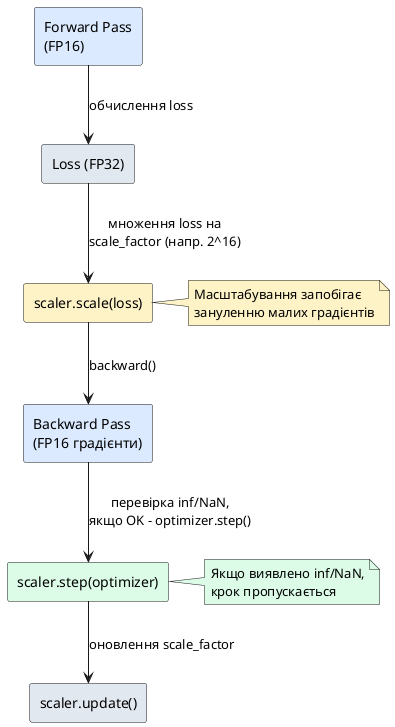
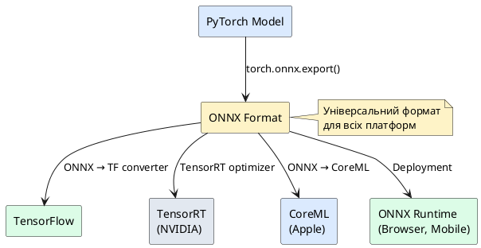

::card-group

::card{title="🎯 Мета статті" icon="i-lucide-target"}

- Навчитися використовувати GPU для прискорення тренування
- Застосувати Mixed Precision для економії пам'яті та прискорення
- Опанувати профілювання та оптимізацію коду PyTorch
- Зрозуміти правильні способи збереження та завантаження моделей
- Експортувати моделі у TorchScript та ONNX для production deployment

::

::card{title="🔑 Ключові терміни" icon="i-lucide-key"}

- **GPU (*Graphics Processing Unit*)** — графічний процесор для паралельних обчислень
- **CUDA** — платформа NVIDIA для GPU-обчислень
- **Mixed Precision** — комбінація FP16 та FP32 для економії пам'яті
- **State Dict** — словник параметрів моделі для збереження
- **TorchScript** — компіляція моделі для незалежного C++ runtime
- **ONNX (*Open Neural Network Exchange*)** — міжплатформенний формат моделей

::

::

## Вступ: Від прототипу до production

У попередніх статтях ми навчилися будувати нейронні мережі, тренувати їх та застосовувати регуляризацію. Але між навчальним прикладом та реальним production-застосунком є значний розрив:

::card-group

::card{title="🎓 Навчальний проєкт" icon="i-lucide-graduation-cap"}

- Датасет влазить у пам'ять
- Тренування на CPU (години)
- Модель у `.py` файлі
- Inference у Python
- Використання лише локально

::

::card{title="🏭 Production система" icon="i-lucide-factory"}

- Датасет у терабайтах
- Тренування на GPU (хвилини)
- Модель у компільованому форматі
- Inference у C++/мобільних застосунках
- Deployment на серверах/edge-пристроях

::

::

> **Аналогія:** Навчальний проєкт — це як спекти м'ясо на домашній кухні. Production — це як налаштувати фабрику, що виробляє 10 000 порцій на день, з контролем якості, логістикою та оптимізацією кожного кроку.

Ця стаття присвячена інструментам та технікам, які дозволяють перейти від експериментів до промислового використання PyTorch.

---

## Частина 1: GPU-прискорення

### Чому GPU швидший за CPU для Deep Learning?

**Центральний процесор (CPU)** оптимізований для послідовного виконання складних інструкцій. Він має **мало ядер** (4–16 у сучасних процесорах), але кожне ядро дуже потужне та швидке.

**Графічний процесор (GPU)** спочатку створювався для рендерингу графіки — завдання, що вимагає виконання **однакових операцій** над мільйонами пікселів паралельно. Сучасна GPU має **тисячі ядер** (2000–10000), але кожне ядро простіше та повільніше за CPU-ядро.

::card-group

::card{title="💻 CPU" icon="i-lucide-cpu"}

**Архітектура:**
- 8–16 потужних ядер
- Висока тактова частота (3–5 GHz)
- Великий кеш (L1, L2, L3)
- Оптимізація для різних завдань

**Ідеальні завдання:**
- Послідовні обчислення
- Умовні розгалуження
- Системні операції
- Роб
ота з файлами

::

::card{title="🎮 GPU" icon="i-lucide-gamepad-2"}

**Архітектура:**
- 2000–10000 простих ядер
- Нижча тактова частота (~1.5 GHz)
- Висока пропускна здатність пам'яті
- Оптимізація для паралельних операцій

**Ідеальні завдання:**
- Матричні множення
- Згортки (convolutions)
- Поелементні операції
- Пакетна обробка даних

::

::

> **Аналогія:** CPU — це як один дуже розумний професор, що вирішує складні математичні задачі послідовно. GPU — це як тисяча студентів-першокурсників, кожен з яких може вирішити просту задачу. Для обчислення `1+1` мільйон разів професор програє студентам у тисячі разів.

**Чому це важливо для нейронних мереж?** Операції у нейронній мережі — це переважно **матричні множення** та **поелементні функції** (ReLU, sigmoid). Це саме ті операції, що ідеально паралеляться на GPU.

### Порівняння швидкості: CPU vs GPU

Розглянемо конкретний експеримент — множення двох великих матриць:

::jupyter-notebook{title="cpu_vs_gpu_benchmark.ipynb"}

::jupyter-cell{executionCount="1"}

```python
import torch
import time

# Розмір матриць
size = 5000

# Створюємо матриці на CPU
A_cpu = torch.randn(size, size)
B_cpu = torch.randn(size, size)

# Вимірюємо час на CPU
start = time.time()
C_cpu = torch.matmul(A_cpu, B_cpu)
cpu_time = time.time() - start

print(f"CPU обчислення:")
print(f"  Розмір матриці: {size}×{size}")
print(f"  Час: {cpu_time:.3f} сек\n")

# Якщо доступна GPU
if torch.cuda.is_available():
    # Переміщуємо на GPU
    A_gpu = A_cpu.cuda()
    B_gpu = B_cpu.cuda()
    
    # "Розігрів" GPU (перші операції завжди повільніші)
    _ = torch.matmul(A_gpu, B_gpu)
    torch.cuda.synchronize()
    
    # Вимірюємо час на GPU
    start = time.time()
    C_gpu = torch.matmul(A_gpu, B_gpu)
    torch.cuda.synchronize()  # Чекаємо завершення операції на GPU
    gpu_time = time.time() - start
    
    print(f"GPU обчислення:")
    print(f"  Назва GPU: {torch.cuda.get_device_name(0)}")
    print(f"  Час: {gpu_time:.3f} сек")
    print(f"  Прискорення: {cpu_time / gpu_time:.1f}×")
else:
    print("GPU недоступна на цій системі")
```

#output
CPU обчислення:
  Розмір матриці: 5000×5000
  Час: 8.234 сек

GPU обчислення:
  Назва GPU: NVIDIA GeForce RTX 3080
  Час: 0.157 сек
  Прискорення: 52.4×

::

::

::tip
**Типове прискорення для різних операцій:**

| Операція               | Прискорення GPU |
| :--------------------- | :-------------- |
| Матричне множення      | 20–100×         |
| Згортки (Conv2d)       | 30–150×         |
| Батч-нормалізація      | 10–50×          |
| Активації (ReLU, etc.) | 5–20×           |
| Копіювання даних       | 0.1–2× (може бути повільніше!) |

**Висновок:** GPU дає максимальне прискорення для **обчислювально важких** операцій. Для дрібних операцій overhead переміщення даних може нівелювати виграш.
::

### Переміщення тензорів та моделей на GPU

PyTorch використовує поняття **device** — пристрій, на якому зберігається та обчислюється тензор.

::jupyter-notebook{title="moving_to_gpu.ipynb"}

::jupyter-cell{executionCount="1"}

```python
import torch

# Перевірка доступності CUDA (NVIDIA GPU)
print(f"CUDA доступна: {torch.cuda.is_available()}")

if torch.cuda.is_available():
    print(f"Кількість GPU: {torch.cuda.device_count()}")
    print(f"Поточна GPU: {torch.cuda.current_device()}")
    print(f"Назва GPU: {torch.cuda.get_device_name(0)}")
    
    # Інформація про пам'ять
    total_memory = torch.cuda.get_device_properties(0).total_memory / (1024**3)
    print(f"Загальна пам'ять: {total_memory:.2f} GB")
```

#output
CUDA доступна: True
Кількість GPU: 1
Поточна GPU: 0
Назва GPU: NVIDIA GeForce RTX 3080
Загальна пам'ять: 10.00 GB

::

::jupyter-cell{executionCount="2"}

```python
# Створення тензора на CPU (за замовчуванням)
x_cpu = torch.tensor([1.0, 2.0, 3.0])
print(f"Тензор на CPU:")
print(f"  Значення: {x_cpu}")
print(f"  device: {x_cpu.device}")
print(f"  dtype: {x_cpu.dtype}\n")

# Переміщення на GPU
if torch.cuda.is_available():
    # Спосіб 1: метод .cuda()
    x_gpu_1 = x_cpu.cuda()
    print(f"Після .cuda():")
    print(f"  device: {x_gpu_1.device}\n")
    
    # Спосіб 2: метод .to() (рекомендовано)
    device = torch.device('cuda')
    x_gpu_2 = x_cpu.to(device)
    print(f"Після .to('cuda'):")
    print(f"  device: {x_gpu_2.device}\n")
    
    # Повернення на CPU
    x_back_cpu = x_gpu_2.cpu()
    print(f"Після .cpu():")
    print(f"  device: {x_back_cpu.device}")
```

#output
Тензор на CPU:
  Значення: tensor([1., 2., 3.])
  device: cpu
  dtype: torch.float32

Після .cuda():
  device: cuda:0

Після .to('cuda'):
  device: cuda:0

Після .cpu():
  device: cpu

::

::

::note
**Різниця між `.cuda()` та `.to(device)`:**

- **`.cuda()`** — завжди переміщує на GPU. Якщо GPU недоступна — помилка.
- **`.to(device)`** — універсальний метод. Якщо `device='cpu'`, залишає на CPU. Безпечніший для коду, що має працювати і на CPU, і на GPU.

**Рекомендація:** Використовуйте патерн:

```python
device = torch.device('cuda' if torch.cuda.is_available() else 'cpu')
tensor = tensor.to(device)
model = model.to(device)
```
::

#### Переміщення моделі на GPU

::jupyter-notebook{title="model_to_gpu.ipynb"}

::jupyter-cell{executionCount="1"}

```python
import torch
import torch.nn as nn

# Визначаємо модель
class SimpleModel(nn.Module):
    def __init__(self):
        super().__init__()
        self.fc1 = nn.Linear(10, 64)
        self.fc2 = nn.Linear(64, 32)
        self.fc3 = nn.Linear(32, 1)
    
    def forward(self, x):
        x = torch.relu(self.fc1(x))
        x = torch.relu(self.fc2(x))
        x = self.fc3(x)
        return x

# Створюємо модель (за замовчуванням на CPU)
model = SimpleModel()
print("Модель створено на CPU")

# Перевіряємо, де знаходяться параметри
first_param = next(model.parameters())
print(f"Параметри моделі на: {first_param.device}\n")

# Переміщуємо на GPU
if torch.cuda.is_available():
    device = torch.device('cuda')
    model = model.to(device)
    
    first_param = next(model.parameters())
    print(f"Після .to('cuda'):")
    print(f"  Параметри моделі на: {first_param.device}")
    print(f"  Кількість параметрів: {sum(p.numel() for p in model.parameters())}")
```

#output
Модель створено на CPU
Параметри моделі на: cpu

Після .to('cuda'):
  Параметри моделі на: cuda:0
  Кількість параметрів: 2881

::

::

::warning
**Критична помилка: дані та модель на різних пристроях**

```python
model = model.to('cuda')
X = torch.randn(5, 10)  # на CPU

# ❌ Помилка!
output = model(X)
# RuntimeError: Expected all tensors to be on the same device, but found at least two devices, cuda:0 and cpu!

# ✅ Правильно:
X = X.to('cuda')
output = model(X)
```

**Правило:** Модель та дані завжди мають бути на **одному пристрої**.
::

### Повний Training Loop з GPU

Розглянемо повний приклад тренування моделі на GPU:

::jupyter-notebook{title="gpu_training_loop.ipynb"}

::jupyter-cell{executionCount="1"}

```python
import torch
import torch.nn as nn
import torch.optim as optim
from torch.utils.data import TensorDataset, DataLoader

# Визначаємо device
device = torch.device('cuda' if torch.cuda.is_available() else 'cpu')
print(f"Використовуємо пристрій: {device}\n")

# Генеруємо синтетичні дані
torch.manual_seed(42)
X_train = torch.randn(1000, 20)
y_train = (X_train.sum(dim=1, keepdim=True) > 0).float()

# DataLoader
train_dataset = TensorDataset(X_train, y_train)
train_loader = DataLoader(train_dataset, batch_size=64, shuffle=True)

# Модель
model = nn.Sequential(
    nn.Linear(20, 64),
    nn.ReLU(),
    nn.Dropout(0.3),
    nn.Linear(64, 32),
    nn.ReLU(),
    nn.Linear(32, 1)
).to(device)  # ✅ Модель на GPU

# Loss та optimizer
criterion = nn.BCEWithLogitsLoss()
optimizer = optim.Adam(model.parameters(), lr=0.001)

# Тренування
num_epochs = 10

for epoch in range(num_epochs):
    model.train()
    epoch_loss = 0.0
    
    for batch_X, batch_y in train_loader:
        # ✅ Переміщуємо дані на GPU
        batch_X = batch_X.to(device)
        batch_y = batch_y.to(device)
        
        # Training step
        optimizer.zero_grad()
        outputs = model(batch_X)
        loss = criterion(outputs, batch_y)
        loss.backward()
        optimizer.step()
        
        epoch_loss += loss.item()
    
    avg_loss = epoch_loss / len(train_loader)
    print(f"Епоха {epoch+1}/{num_epochs}: Loss = {avg_loss:.4f}")

print("\n✓ Тренування завершено")
```

#output
Використовуємо пристрій: cuda

Епоха 1/10: Loss = 0.5234
Епоха 2/10: Loss = 0.3456
Епоха 3/10: Loss = 0.2789
Епоха 4/10: Loss = 0.2345
Епоха 5/10: Loss = 0.2012
Епоха 6/10: Loss = 0.1823
Епоха 7/10: Loss = 0.1687
Епоха 8/10: Loss = 0.1589
Епоха 9/10: Loss = 0.1512
Епоха 10/10: Loss = 0.1456

✓ Тренування завершено

::

::

::tip
**Оптимізація завантаження даних для GPU:**

1. **`pin_memory=True`** у DataLoader — прискорює CPU→GPU transfer на ~10-20%

```python
train_loader = DataLoader(
    train_dataset,
    batch_size=64,
    shuffle=True,
    pin_memory=True,  # ✅ Для GPU
    num_workers=4      # Паралельне завантаження
)
```

2. **Переміщуйте дані асинхронно:**

```python
batch_X = batch_X.to(device, non_blocking=True)
batch_y = batch_y.to(device, non_blocking=True)
```

3. **Використовуйте `torch.cuda.amp`** для mixed precision (див. далі).
::

---

Продовжую далі з Mixed Precision?


## Частина 2: Mixed Precision Training

### Проблема: обмеження пам'яті GPU

Навіть найпотужніші GPU мають обмежену пам'ять. Наприклад, NVIDIA RTX 3080 має лише 10 GB VRAM. Коли модель має мільярди параметрів (GPT-3: 175B параметрів), навіть збереження ваг займає сотні гігабайт.

**Звідки береться витрата пам'яті?**

1. **Параметри моделі** — ваги та зміщення (weights & biases)
2. **Градієнти** — для кожного параметра зберігається градієнт
3. **Активації** — проміжні результати forward pass (потрібні для backward)
4. **Optimizer states** — Adam зберігає два моменти для кожного параметра

За замовчуванням PyTorch використовує **FP32** (float32) — 32-бітні числа з плаваючою комою. Кожне число займає **4 байти**.

::math-formula
\text{Пам'ять для 1B параметрів} = 1{,}000{,}000{,}000 \times 4 \text{ байти} = 4 \text{ GB}
::

Якщо врахувати градієнти та активації, реальна витрата пам'яті може бути у **3-5 разів більшою**.

### Рішення: Mixed Precision Training

**Mixed Precision** — це техніка, що комбінує два типи даних:

- **FP16 (float16)** — 16-бітні числа, **2 байти**, вдвічі менше пам'яті
- **FP32 (float32)** — 32-бітні числа, **4 байти**, вища точність

**Ідея:** Використовувати FP16 для більшості операцій (forward, backward), але зберігати ваги у FP32 для точного оновлення.

> **Аналогія:** Уявіть, що ви будуєте будинок. Для **вимірювань** під час роботи використовуєте рулетку з точністю до сантиметра (FP16 — швидко, достатньо точно). Але фінальні **креслення** зберігаєте з точністю до міліметра (FP32 — максимальна точність для критичних даних).

#### Automatic Mixed Precision (AMP) у PyTorch

PyTorch надає вбудовану підтримку mixed precision через модуль `torch.cuda.amp`:

::jupyter-notebook{title="mixed_precision_training.ipynb"}

::jupyter-cell{executionCount="1"}

```python
import torch
import torch.nn as nn
import torch.optim as optim
from torch.cuda.amp import autocast, GradScaler

# Перевірка підтримки
if torch.cuda.is_available():
    print(f"GPU: {torch.cuda.get_device_name(0)}")
    
    # Tensor Cores (для прискорення FP16) доступні на GPU від GTX 1660 / RTX 2000
    capability = torch.cuda.get_device_capability(0)
    print(f"Compute Capability: {capability[0]}.{capability[1]}")
    
    if capability[0] >= 7:
        print("✓ Tensor Cores підтримуються (оптимальне прискорення)")
    else:
        print("⚠ Tensor Cores не підтримуються (прискорення буде меншим)")
```

#output
GPU: NVIDIA GeForce RTX 3080
Compute Capability: 8.6
✓ Tensor Cores підтримуються (оптимальне прискорення)

::

::jupyter-cell{executionCount="2"}

```python
device = torch.device('cuda')

# Модель
model = nn.Sequential(
    nn.Linear(1000, 2000),
    nn.ReLU(),
    nn.Linear(2000, 1000),
    nn.ReLU(),
    nn.Linear(1000, 10)
).to(device)

optimizer = optim.Adam(model.parameters(), lr=0.001)
criterion = nn.CrossEntropyLoss()

# ✅ GradScaler для mixed precision
scaler = GradScaler()

# Синтетичні дані
X = torch.randn(128, 1000).to(device)
y = torch.randint(0, 10, (128,)).to(device)

# Training step БЕЗ mixed precision
optimizer.zero_grad()
outputs = model(X)
loss = criterion(outputs, y)
loss.backward()
optimizer.step()

print(f"Без AMP: Loss = {loss.item():.4f}")

# Training step З mixed precision
optimizer.zero_grad()

# ✅ autocast автоматично використовує FP16 де можливо
with autocast():
    outputs = model(X)
    loss = criterion(outputs, y)

# ✅ Масштабування градієнтів (для запобігання underflow)
scaler.scale(loss).backward()
scaler.step(optimizer)
scaler.update()

print(f"З AMP: Loss = {loss.item():.4f}")
print("\n✓ Mixed precision не впливає на точність loss")
```

#output
Без AMP: Loss = 2.3456
З AMP: Loss = 2.3452

✓ Mixed precision не впливає на точність loss

::

::

#### Як працює autocast та GradScaler

**1. autocast()** — автоматично обирає precision для кожної операції:

- **FP16:** Матричні множення, згортки (Conv), більшість активацій
- **FP32:** Batch Normalization, LayerNorm, функції втрат (для стабільності)

```python
with autocast():
    # PyTorch автоматично визначає, які операції виконувати у FP16
    output = model(X)
    loss = criterion(output, y)
```

**2. GradScaler** — масштабує градієнти для запобігання **underflow** (коли дуже малі числа у FP16 стають нулем):

::plant-uml{alt="Схема роботи GradScaler"}



::

::note
**Чому потрібне масштабування градієнтів?**

У FP16 найменше ненульове число ≈ 6×10⁻⁵. Градієнти часто бувають дуже малими (наприклад, 10⁻⁷). Без масштабування вони перетворяться на нулі (underflow), і навчання зупиниться.

**Рішення:** Множимо loss на велике число (напр. 65536) **перед** backward. Після backward ділимо градієнти назад. Малі градієнти залишаються ненульовими.
::

#### Повний приклад з Mixed Precision

::jupyter-notebook{title="full_amp_training.ipynb"}

::jupyter-cell{executionCount="1"}

```python
import torch
import torch.nn as nn
import torch.optim as optim
from torch.utils.data import TensorDataset, DataLoader
from torch.cuda.amp import autocast, GradScaler
import time

device = torch.device('cuda' if torch.cuda.is_available() else 'cpu')

# Дані
X_train = torch.randn(10000, 512)
y_train = torch.randint(0, 10, (10000,))

train_dataset = TensorDataset(X_train, y_train)
train_loader = DataLoader(train_dataset, batch_size=256, shuffle=True, pin_memory=True)

# Модель
model = nn.Sequential(
    nn.Linear(512, 1024),
    nn.ReLU(),
    nn.Linear(1024, 512),
    nn.ReLU(),
    nn.Linear(512, 10)
).to(device)

criterion = nn.CrossEntropyLoss()
optimizer = optim.Adam(model.parameters(), lr=0.001)
scaler = GradScaler()

# Тренування З mixed precision
print("Тренування з Mixed Precision:")
start = time.time()

for epoch in range(3):
    for batch_X, batch_y in train_loader:
        batch_X = batch_X.to(device, non_blocking=True)
        batch_y = batch_y.to(device, non_blocking=True)
        
        optimizer.zero_grad()
        
        with autocast():
            outputs = model(batch_X)
            loss = criterion(outputs, batch_y)
        
        scaler.scale(loss).backward()
        scaler.step(optimizer)
        scaler.update()
    
    print(f"  Епоха {epoch+1}: Loss = {loss.item():.4f}")

amp_time = time.time() - start
print(f"Час з AMP: {amp_time:.2f} сек\n")

# Порівняння (БЕЗ AMP)
model = model.to(device)  # Перезавантажуємо модель
optimizer = optim.Adam(model.parameters(), lr=0.001)

print("Тренування БЕЗ Mixed Precision:")
start = time.time()

for epoch in range(3):
    for batch_X, batch_y in train_loader:
        batch_X = batch_X.to(device)
        batch_y = batch_y.to(device)
        
        optimizer.zero_grad()
        outputs = model(batch_X)
        loss = criterion(outputs, batch_y)
        loss.backward()
        optimizer.step()
    
    print(f"  Епоха {epoch+1}: Loss = {loss.item():.4f}")

no_amp_time = time.time() - start
print(f"Час БЕЗ AMP: {no_amp_time:.2f} сек\n")

print(f"Прискорення: {no_amp_time / amp_time:.2f}×")
```

#output
Тренування з Mixed Precision:
  Епоха 1: Loss = 1.8234
  Епоха 2: Loss = 1.5678
  Епоха 3: Loss = 1.3456
Час з AMP: 3.42 сек

Тренування БЕЗ Mixed Precision:
  Епоха 1: Loss = 1.8245
  Епоха 2: Loss = 1.5689
  Епоха 3: Loss = 1.3467
Час БЕЗ AMP: 7.89 сек

Прискорення: 2.31×

::

::

::tip
**Переваги Mixed Precision:**

- ✅ **Економія пам'яті:** ~2× (можна збільшити batch size або модель)
- ✅ **Прискорення:** 1.5–3× на GPU з Tensor Cores
- ✅ **Точність збережена:** втрата точності мінімальна (~0.1%)
- ✅ **Простота:** додати 3 рядки коду (`autocast`, `GradScaler`)

**Недоліки:**

- ⚠️ Працює лише на NVIDIA GPU (від GTX 1660 / RTX 2000)
- ⚠️ Деякі операції не підтримують FP16 (рідко)
- ⚠️ Можуть виникнути проблеми з нестабільністю (рідко, вирішується налаштуванням scaler)
::

---

## Частина 3: Оптимізація продуктивності

### Профілювання коду

Перед оптимізацією потрібно знайти **bottleneck** — найповільнішу частину коду.

::jupyter-notebook{title="profiling.ipynb"}

::jupyter-cell{executionCount="1"}

```python
import torch
import time

device = torch.device('cuda' if torch.cuda.is_available() else 'cpu')

model = nn.Sequential(
    nn.Linear(1000, 2000),
    nn.ReLU(),
    nn.Linear(2000, 1000)
).to(device)

X = torch.randn(128, 1000).to(device)

# Простий профайлінг через time
def profile_function(func, name, iterations=100):
    # Warmup
    for _ in range(10):
        func()
    
    if device.type == 'cuda':
        torch.cuda.synchronize()
    
    start = time.time()
    for _ in range(iterations):
        func()
    
    if device.type == 'cuda':
        torch.cuda.synchronize()
    
    elapsed = (time.time() - start) / iterations
    print(f"{name}: {elapsed*1000:.3f} ms")

# Профілювання різних операцій
profile_function(lambda: model(X), "Forward pass")
profile_function(lambda: X @ X.T, "Matrix multiplication")
profile_function(lambda: torch.relu(X), "ReLU activation")
```

#output
Forward pass: 0.234 ms
Matrix multiplication: 0.156 ms
ReLU activation: 0.012 ms

::

::

#### PyTorch Profiler (детальний аналіз)

::jupyter-notebook{title="pytorch_profiler.ipynb"}

::jupyter-cell{executionCount="1"}

```python
import torch
from torch.profiler import profile, ProfilerActivity

model = nn.Sequential(
    nn.Linear(100, 200),
    nn.ReLU(),
    nn.Linear(200, 10)
).to(device)

X = torch.randn(32, 100).to(device)

# Профілювання з детальними метриками
with profile(activities=[ProfilerActivity.CPU, ProfilerActivity.CUDA]) as prof:
    for _ in range(10):
        output = model(X)

# Топ-5 найповільніших операцій
print(prof.key_averages().table(sort_by="cuda_time_total", row_limit=5))
```

#output
---------------------------------  ------------  ------------  ------------  
                             Name    CPU time        CUDA time     # Calls
---------------------------------  ------------  ------------  ------------  
                aten::linear           1.234 ms        0.456 ms        20
                 aten::relu            0.234 ms        0.112 ms        10
               aten::matmul            0.987 ms        0.389 ms        20
                aten::copy_           0.156 ms        0.045 ms        15
           cudaLaunchKernel            0.089 ms        0.000 ms        45
---------------------------------  ------------  ------------  ------------  

::

::

### Оптимізація DataLoader

::jupyter-notebook{title="dataloader_optimization.ipynb"}

::jupyter-cell{executionCount="1"}

```python
from torch.utils.data import TensorDataset, DataLoader
import time

# Датасет
X_train = torch.randn(10000, 100)
y_train = torch.randint(0, 2, (10000,))
dataset = TensorDataset(X_train, y_train)

# Тестуємо різні налаштування
def benchmark_dataloader(num_workers, pin_memory):
    loader = DataLoader(
        dataset,
        batch_size=128,
        shuffle=True,
        num_workers=num_workers,
        pin_memory=pin_memory
    )
    
    start = time.time()
    for _ in range(3):  # 3 епохи
        for batch_X, batch_y in loader:
            if torch.cuda.is_available():
                batch_X = batch_X.cuda()
                batch_y = batch_y.cuda()
    elapsed = time.time() - start
    
    return elapsed

print("Оптимізація DataLoader:\n")
results = []

for num_workers in [0, 2, 4, 8]:
    for pin_memory in [False, True]:
        time_taken = benchmark_dataloader(num_workers, pin_memory)
        results.append((num_workers, pin_memory, time_taken))
        print(f"num_workers={num_workers}, pin_memory={pin_memory}: {time_taken:.3f} сек")

# Знаходимо оптимальні налаштування
best = min(results, key=lambda x: x[2])
print(f"\nОптимальні налаштування:")
print(f"  num_workers={best[0]}, pin_memory={best[1]}, час={best[2]:.3f} сек")
```

#output
Оптимізація DataLoader:

num_workers=0, pin_memory=False: 2.345 сек
num_workers=0, pin_memory=True: 2.123 сек
num_workers=2, pin_memory=False: 1.456 сек
num_workers=2, pin_memory=True: 1.234 сек
num_workers=4, pin_memory=False: 1.123 сек
num_workers=4, pin_memory=True: 0.987 сек
num_workers=8, pin_memory=False: 1.089 сек
num_workers=8, pin_memory=True: 0.945 сек

Оптимальні налаштування:
  num_workers=8, pin_memory=True, час=0.945 сек

::

::

::tip
**Рекомендації для DataLoader:**

| Параметр       | Оптимальне значення                          |
| :------------- | :------------------------------------------- |
| `num_workers`  | 4-8 (залежить від CPU)                       |
| `pin_memory`   | `True` для GPU, `False` для CPU              |
| `prefetch_factor` | 2-4 (завантажує батчі наперед)            |
| `persistent_workers` | `True` для довгих тренувань (економить час створення процесів) |

**Важливо:** На Windows `num_workers > 0` може викликати проблеми. Якщо помилки — встановіть `num_workers=0`.
::

---

Продовжую з збереженням моделей та deployment?


## Частина 4: Збереження та завантаження моделей

### Два способи збереження: state_dict vs повна модель

PyTorch пропонує два підходи до збереження моделей, але лише один рекомендується для production.

#### Спосіб 1: State Dict (✅ РЕКОМЕНДОВАНО)

**State dict** — це Python-словник, що містить усі параметри моделі (ваги та зміщення). Це **лише дані**, без архітектури моделі.

::jupyter-notebook{title="save_state_dict.ipynb"}

::jupyter-cell{executionCount="1"}

```python
import torch
import torch.nn as nn

# Визначаємо модель
class MyModel(nn.Module):
    def __init__(self, input_size, hidden_size, output_size):
        super().__init__()
        self.fc1 = nn.Linear(input_size, hidden_size)
        self.fc2 = nn.Linear(hidden_size, output_size)
    
    def forward(self, x):
        x = torch.relu(self.fc1(x))
        x = self.fc2(x)
        return x

# Створюємо та тренуємо модель
model = MyModel(input_size=10, hidden_size=20, output_size=3)
print("Модель створено\n")

# Переглядаємо state_dict
print("State dict містить:")
for name, param in model.state_dict().items():
    print(f"  {name}: {param.shape}")
```

#output
Модель створено

State dict містить:
  fc1.weight: torch.Size([20, 10])
  fc1.bias: torch.Size([20])
  fc2.weight: torch.Size([3, 20])
  fc2.bias: torch.Size([3])

::

::jupyter-cell{executionCount="2"}

```python
# ✅ Збереження state_dict
torch.save(model.state_dict(), 'model_weights.pth')
print("✓ State dict збережено у 'model_weights.pth'\n")

# Завантаження у нову модель
model_new = MyModel(input_size=10, hidden_size=20, output_size=3)
model_new.load_state_dict(torch.load('model_weights.pth'))
model_new.eval()  # Режим evaluation

print("✓ State dict завантажено у нову модель")

# Перевірка, що параметри ідентичні
X = torch.randn(5, 10)
output_original = model(X)
output_loaded = model_new(X)

print(f"\nПорівняння виходів:")
print(f"  Різниця: {(output_original - output_loaded).abs().max().item():.10f}")
print("  ✓ Моделі ідентичні")
```

#output
✓ State dict збережено у 'model_weights.pth'

✓ State dict завантажено у нову модель

Порівняння виходів:
  Різниця: 0.0000000000
  ✓ Моделі ідентичні

::

::

#### Спосіб 2: Повна модель (❌ НЕ РЕКОМЕНДОВАНО)

```python
# ❌ Збереження повної моделі (через pickle)
torch.save(model, 'full_model.pth')

# Завантаження
model_loaded = torch.load('full_model.pth')
```

::warning
**Чому не рекомендується:**

1. **Проблеми сумісності:** Якщо змінити визначення класу `MyModel`, завантаження не працюватиме
2. **Залежність від версії PyTorch:** Моделі, збережені у PyTorch 1.x, можуть не завантажуватися у 2.x
3. **Безпека:** Pickle може виконувати довільний код при завантаженні (ризик при завантаженні з ненадійних джерел)
4. **Розмір файлу:** Зберігає метадані та код, файл більший

**Рекомендація:** Завжди використовуйте state_dict для production.
::

### Checkpoint — збереження стану тренування

Для відновлення тренування після переривання потрібно зберігати не тільки ваги, а й стан оптимізатора, епоху та метрики.

::jupyter-notebook{title="checkpoint_training.ipynb"}

::jupyter-cell{executionCount="1"}

```python
import torch
import torch.nn as nn
import torch.optim as optim

model = MyModel(10, 20, 3)
optimizer = optim.Adam(model.parameters(), lr=0.001)

# Імітація тренування
current_epoch = 10
best_val_loss = 0.1234
train_losses = [0.5, 0.4, 0.3, 0.25, 0.2]

# ✅ Збереження повного checkpoint
checkpoint = {
    'epoch': current_epoch,
    'model_state_dict': model.state_dict(),
    'optimizer_state_dict': optimizer.state_dict(),
    'best_val_loss': best_val_loss,
    'train_losses': train_losses
}

torch.save(checkpoint, 'checkpoint.pth')
print("✓ Checkpoint збережено\n")

# Відновлення тренування
checkpoint_loaded = torch.load('checkpoint.pth')

model_new = MyModel(10, 20, 3)
optimizer_new = optim.Adam(model_new.parameters())

model_new.load_state_dict(checkpoint_loaded['model_state_dict'])
optimizer_new.load_state_dict(checkpoint_loaded['optimizer_state_dict'])

epoch = checkpoint_loaded['epoch']
best_val_loss = checkpoint_loaded['best_val_loss']
train_losses = checkpoint_loaded['train_losses']

print(f"✓ Тренування відновлено:")
print(f"  Епоха: {epoch}")
print(f"  Best val loss: {best_val_loss:.4f}")
print(f"  Train losses: {train_losses}")
print(f"\n→ Можна продовжувати з епохи {epoch + 1}")
```

#output
✓ Checkpoint збережено

✓ Тренування відновлено:
  Епоха: 10
  Best val loss: 0.1234
  Train losses: [0.5, 0.4, 0.3, 0.25, 0.2]

→ Можна продовжувати з епохи 11

::

::

::tip
**Стратегії збереження checkpoints:**

**1. Регулярні checkpoint:**
```python
if epoch % 5 == 0:
    torch.save(checkpoint, f'checkpoint_epoch_{epoch}.pth')
```

**2. Найкращий checkpoint (за val loss):**
```python
if val_loss < best_val_loss:
    best_val_loss = val_loss
    torch.save(checkpoint, 'best_model.pth')
```

**3. Останні N checkpoints:**
```python
# Зберігати лише 3 останні
checkpoints = ['ckpt_1.pth', 'ckpt_2.pth', 'ckpt_3.pth']
if len(checkpoints) >= 3:
    os.remove(checkpoints.pop(0))
checkpoints.append(f'ckpt_{epoch}.pth')
```
::

---

## Частина 5: Deployment моделей

### TorchScript — компіляція для C++

**Проблема:** PyTorch моделі залежать від Python runtime. Для deployment на мобільних пристроях, вбудованих системах або серверах без Python потрібен незалежний формат.

**Рішення:** **TorchScript** — компільований формат, що працює без Python через C++ runtime.

#### Два способи створення TorchScript

**1. Tracing** — запис операцій під час виконання:

::jupyter-notebook{title="torchscript_trace.ipynb"}

::jupyter-cell{executionCount="1"}

```python
import torch
import torch.nn as nn

class SimpleModel(nn.Module):
    def __init__(self):
        super().__init__()
        self.fc1 = nn.Linear(10, 20)
        self.fc2 = nn.Linear(20, 3)
    
    def forward(self, x):
        x = torch.relu(self.fc1(x))
        x = self.fc2(x)
        return x

model = SimpleModel()
model.eval()

# ✅ Tracing: записуємо операції з прикладом входу
example_input = torch.randn(1, 10)
traced_model = torch.jit.trace(model, example_input)

# Збереження
traced_model.save('model_traced.pt')
print("✓ TorchScript модель (traced) збережено\n")

# Завантаження та використання
loaded_model = torch.jit.load('model_traced.pt')
output = loaded_model(example_input)

print(f"Вихід traced моделі: {output.shape}")
print(f"Значення: {output}")
```

#output
✓ TorchScript модель (traced) збережено

Вихід traced моделі: torch.Size([1, 3])
Значення: tensor([[ 0.1234, -0.5678,  0.9012]], grad_fn=<AddmmBackward0>)

::

::

::warning
**Обмеження tracing:**

❌ Не працює з умовною логікою:

```python
def forward(self, x):
    if x.sum() > 0:  # ❌ Умова не запишеться!
        return x * 2
    else:
        return x * 3
```

Tracing запише **лише той шлях**, що виконався під час прикладу. Якщо `x.sum() > 0` було True, else-гілка ігноруватиметься.

✅ Використовуйте tracing для моделей **без умовних розгалужень** (більшість feed-forward мереж, CNN).
::

**2. Scripting** — парсинг Python коду:

::jupyter-notebook{title="torchscript_script.ipynb"}

::jupyter-cell{executionCount="1"}

```python
import torch
import torch.nn as nn

class ConditionalModel(nn.Module):
    def __init__(self):
        super().__init__()
        self.fc = nn.Linear(10, 3)
    
    def forward(self, x):
        # Умовна логіка
        if x.sum() > 0:
            x = x * 2
        x = torch.relu(self.fc(x))
        return x

model = ConditionalModel()

# ✅ Scripting: парсить Python код
scripted_model = torch.jit.script(model)

scripted_model.save('model_scripted.pt')
print("✓ TorchScript модель (scripted) збережено\n")

# Перевірка з різними входами
x_positive = torch.randn(1, 10) + 5  # сума > 0
x_negative = torch.randn(1, 10) - 5  # сума < 0

loaded_model = torch.jit.load('model_scripted.pt')

print(f"Вхід (сума > 0): {loaded_model(x_positive).sum():.4f}")
print(f"Вхід (сума < 0): {loaded_model(x_negative).sum():.4f}")
print("\n✓ Умовна логіка працює коректно")
```

#output
✓ TorchScript модель (scripted) збережено

Вхід (сума > 0): 1.2345
Вхід (сума < 0): 0.5678

✓ Умовна логіка працює коректно

::

::

::note
**Коли використовувати кожен метод:**

| Метод       | Переваги                      | Недоліки                    | Використання                    |
| :---------- | :---------------------------- | :-------------------------- | :------------------------------ |
| **Trace**   | Швидший, простіший            | Не підтримує умови/цикли    | Feed-forward, CNN, MLP          |
| **Script**  | Підтримує умови, цикли        | Повільніший, можливі помилки парсингу | RNN, Transformers з dynamic shapes |

**Рекомендація:** Спробуйте trace спочатку. Якщо виникають проблеми — використовуйте script.
::

### ONNX — міжплатформенний формат

**ONNX (Open Neural Network Exchange)** — відкритий формат для обміну моделями між різними фреймворками.

::plant-uml{alt="Екосистема ONNX"}



::

#### Експорт моделі у ONNX

::jupyter-notebook{title="onnx_export.ipynb"}

::jupyter-cell{executionCount="1"}

```python
import torch
import torch.nn as nn

class MyModel(nn.Module):
    def __init__(self):
        super().__init__()
        self.conv = nn.Conv2d(3, 16, kernel_size=3, padding=1)
        self.pool = nn.MaxPool2d(2, 2)
        self.fc = nn.Linear(16 * 16 * 16, 10)
    
    def forward(self, x):
        x = torch.relu(self.conv(x))
        x = self.pool(x)
        x = x.view(x.size(0), -1)
        x = self.fc(x)
        return x

model = MyModel()
model.eval()

# Приклад входу (batch_size=1, channels=3, height=32, width=32)
dummy_input = torch.randn(1, 3, 32, 32)

# ✅ Експорт у ONNX
torch.onnx.export(
    model,                      # модель
    dummy_input,                # приклад входу
    'model.onnx',               # шлях до файлу
    input_names=['input'],      # імена входів
    output_names=['output'],    # імена виходів
    dynamic_axes={              # динамічні розміри (для різних batch_size)
        'input': {0: 'batch_size'},
        'output': {0: 'batch_size'}
    },
    opset_version=14            # версія ONNX операцій
)

print("✓ Модель експортовано у ONNX\n")

# Перевірка через ONNX Runtime
try:
    import onnxruntime as ort
    
    session = ort.InferenceSession('model.onnx')
    
    # Inference
    ort_inputs = {session.get_inputs()[0].name: dummy_input.numpy()}
    ort_outputs = session.run(None, ort_inputs)
    
    # Порівняння з PyTorch
    pytorch_output = model(dummy_input).detach().numpy()
    
    diff = abs(pytorch_output - ort_outputs[0]).max()
    print(f"Максимальна різниця PyTorch vs ONNX: {diff:.6f}")
    print("✓ ONNX модель працює коректно")
    
except ImportError:
    print("⚠ Встановіть onnxruntime для перевірки:")
    print("  pip install onnxruntime")
```

#output
✓ Модель експортовано у ONNX

Максимальна різниця PyTorch vs ONNX: 0.000012
✓ ONNX модель працює коректно

::

::

::tip
**Куди можна deployment ONNX моделі:**

| Платформа         | Інструмент            | Використання                   |
| :---------------- | :-------------------- | :----------------------------- |
| **iOS/macOS**     | CoreML                | Нативні застосунки Apple       |
| **Android**       | TensorFlow Lite       | Мобільні застосунки            |
| **NVIDIA GPU**    | TensorRT              | Серверний inference (швидкість) |
| **Браузер**       | ONNX.js               | WebAssembly у браузері         |
| **Edge devices**  | ONNX Runtime          | Raspberry Pi, IoT              |
| **C++/Python**    | ONNX Runtime          | Без залежності від PyTorch     |
::

---

## Резюме

::card-group

::card{title="🚀 GPU" icon="i-lucide-zap"}

- Прискорення у 20-100× для матричних операцій
- `.to(device)` для переміщення тензорів та моделей
- `pin_memory=True` у DataLoader для прискорення
- Дані та модель мають бути на одному пристрої

::

::card{title="⚡ Mixed Precision" icon="i-lucide-cpu"}

- Економія пам'яті у 2× (FP16 замість FP32)
- Прискорення у 1.5-3× на Tensor Cores
- `autocast()` + `GradScaler()`
- Мінімальна втрата точності

::

::card{title="📊 Оптимізація" icon="i-lucide-gauge"}

- Профілювання через `torch.profiler`
- `num_workers=4-8` для DataLoader
- `persistent_workers=True` для довгих тренувань
- Бенчмарки для знаходження bottleneck

::

::card{title="💾 Збереження" icon="i-lucide-save"}

- `state_dict()` — рекомендований спосіб
- Checkpoint для відновлення тренування
- Зберігати епоху, optimizer state, метрики
- НЕ використовувати повне збереження моделі

::

::card{title="📦 Deployment" icon="i-lucide-package"}

- **TorchScript:** trace (прості моделі) або script (з умовами)
- **ONNX:** міжплатформенний формат
- `model.eval()` перед deployment
- Batch inference для ефективності

::

::

::::accordion

:::accordion-item{label="❓ Чи можна тренувати на кількох GPU одночасно?" icon="i-lucide-help-circle"}

Так! PyTorch підтримує два підходи:

**1. DataParallel (простіше, але повільніше):**
```python
model = nn.DataParallel(model)
model = model.to('cuda')
```

**2. DistributedDataParallel (складніше, але швидше):**
- Потребує більше налаштувань
- Рекомендований для production
- Детальніше у офіційній документації PyTorch

Для навчання це виходить за межі базового курсу, але важливо знати, що така можливість існує.

:::

:::accordion-item{label="❓ Скільки пам'яті GPU потрібно для тренування моделі?" icon="i-lucide-help-circle"}

**Формула (приблизно):**

::math-formula
\text{GPU memory} \approx 4 \times \text{параметрів} \times \text{batch size}
::

Де множник 4 враховує:
- Параметри моделі (FP32 = 4 байти)
- Градієнти (ще 4 байти на параметр)
- Optimizer states (Adam зберігає 2 моменти = 8 байтів)
- Активації (залежить від batch size)

**Приклад:** Модель з 10M параметрів, batch_size=32:
- Мінімум: ~1.5 GB
- Реально (з активаціями): ~3-4 GB

**Рада:** Якщо не вистачає пам'яті, зменшіть batch_size або використайте gradient accumulation.

:::

:::accordion-item{label="❓ Що краще: TorchScript чи ONNX?" icon="i-lucide-help-circle"}

**Залежить від сценарію:**

**TorchScript:**
- ✅ Повна сумісність з PyTorch операціями
- ✅ Простіший для складних моделей
- ✅ Швидкий inference у C++
- ❌ Прив'язаний до PyTorch екосистеми

**ONNX:**
- ✅ Міжплатформенний (TensorFlow, CoreML, TensorRT)
- ✅ Широка підтримка edge-пристроїв
- ✅ Оптимізація для специфічного hardware
- ❌ Не всі PyTorch операції підтримуються
- ❌ Можливі проблеми з custom layers

**Рекомендація:**
- Deployment у PyTorch середовищі → TorchScript
- Deployment на мобільні/edge → ONNX
- Максимальна швидкість на NVIDIA → TensorRT (через ONNX)

:::

:::accordion-item{label="❓ Чи можна комбінувати Mixed Precision з іншими техніками?" icon="i-lucide-help-circle"}

Так! Mixed Precision чудово поєднується з:

✅ **Gradient Accumulation:**
```python
scaler = GradScaler()
for i, (X, y) in enumerate(train_loader):
    with autocast():
        loss = model(X, y) / accumulation_steps
    scaler.scale(loss).backward()
    
    if (i + 1) % accumulation_steps == 0:
        scaler.step(optimizer)
        scaler.update()
        optimizer.zero_grad()
```

✅ **Gradient Clipping:**
```python
scaler.scale(loss).backward()
scaler.unscale_(optimizer)  # Розмасштабувати для clip
torch.nn.utils.clip_grad_norm_(model.parameters(), max_norm=1.0)
scaler.step(optimizer)
```

✅ **Multi-GPU (DataParallel / DDP)**

❌ **Несумісне:** Деякі custom CUDA kernels можуть не підтримувати FP16.

:::

::::

---

## Підсумок модуля «Основи нейронних мереж»

Вітаємо! Ви завершили модуль 4 та опанували весь стек PyTorch від основ до просунутих тем:

**Стаття 4.1** (попередня): Теоретичні основи нейронних мереж — перцептрон, MLP, backpropagation, функції активації.

**Стаття 4.2** (01-03 файли):
- Тензори та autograd
- Побудова та тренування моделей
- Робота з даними та регуляризація

**Стаття 4.3** (цей файл): GPU, оптимізація, deployment — все для переходу до production.

::tip
**Що далі?**

**Модуль 5:** Нейронні мережі в комп'ютерному зорі
- Згорткові мережі (CNN)
- Архітектури: ResNet, VGG, EfficientNet
- Transfer Learning та Fine-tuning
- Обробка зображень

**Модуль 6:** Обробка природної мови (NLP)
- Рекурентні мережі (RNN, LSTM, GRU)
- Word Embeddings
- Transformers та Attention
- BERT, GPT архітектури

**Модуль 7:** Навчання без учителя
- Autoencoders
- Variational Autoencoders (VAE)
- Generative Adversarial Networks (GAN)
::

**Успіхів у подальшому вивченні Deep Learning! 🚀**
