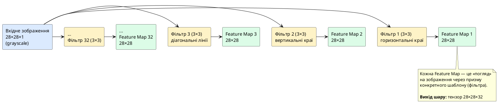
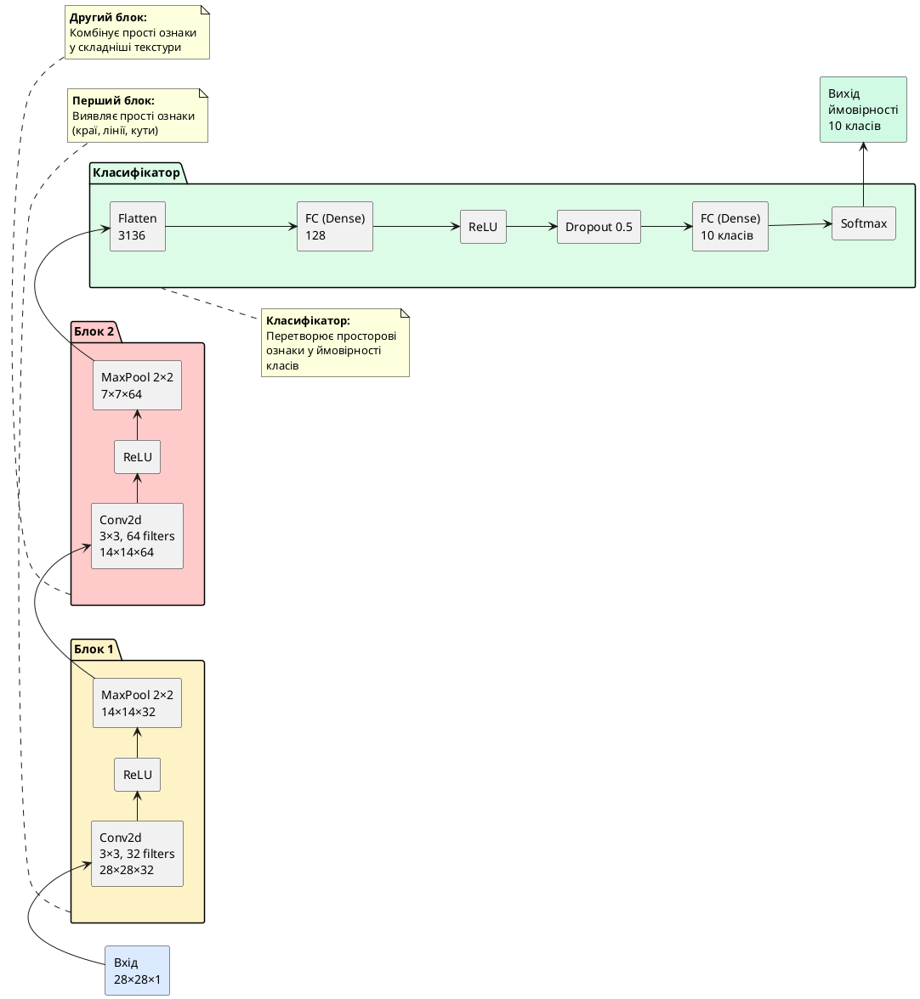

## Від повнозв'язних мереж до згорткових — коли MLP здається

У попередніх статтях ми опанували багатошарові персептрони (MLP), навчилися будувати глибокі мережі на PyTorch та застосовували їх для класифікації медичних даних. MLP чудово справляються з табличними даними — рядками ознак, де кожна колонка має чітке значення (вік, тиск, холестерин). Але що станеться, якщо спробувати застосувати MLP до **зображень**?

Уявіть завдання: розпізнати, чи є на фотографії кішка чи собака. Зображення розміром 224×224 пікселі у форматі RGB (три колірних канали) містить **224 × 224 × 3 = 150 528 пікселів**. Якщо подати це зображення на вхід повнозв'язної мережі, кожен піксель стане окремою ознакою. Навіть перший прихований шар із скромними 512 нейронами потребуватиме:

::math-formula
150\,528 \times 512 = 77\,070\,336 \text{ ваг}
::

**77 мільйонів параметрів лише в першому шарі!** Це катастрофічно багато:

::card-group

::card{title="⚠️ Проблема 1: Вибух параметрів" icon="i-lucide-alert-triangle"}

Для зображень Full HD (1920×1080×3 ≈ 6.2 млн пікселів) з одним прихованим шаром на 1024 нейрони потрібно **6.4 мільярда ваг**. Це займає ~25 ГБ оперативної пам'яті лише для зберігання ваг (у float32). Навчання такої моделі на звичайному ноутбуці неможливе.

::

::card{title="⚠️ Проблема 2: Втрата просторової структури" icon="i-lucide-alert-triangle"}

MLP трактує зображення як плоский вектор чисел. Піксель у верхньому лівому куті та піксель у нижньому правому куті — це просто дві незалежні ознаки. Але зображення має **просторову структуру**: сусідні пікселі корелюють між собою, формуючи краю, текстури, об'єкти. MLP ігнорує цю інформацію.

::

::card{title="⚠️ Проблема 3: Відсутність інваріантності до трансформацій" icon="i-lucide-alert-triangle"}

Якщо кішка на фото зміститься на 10 пікселів вправо, для MLP це **абсолютно нове зображення** — усі пікселі змістилися, тому всі ваги мають змінитися. Модель не розуміє, що об'єкт залишився тим самим, лише у новій позиції.

::

::

::note
**Історичний контекст:**

У 1980-х роках дослідники намагалися навчати MLP розпізнавати рукописні цифри для автоматизації сортування пошти. Зображення 28×28 пікселів (784 входи) призводили до мереж із мільйонами параметрів, які навчалися днями на суперкомп'ютерах та все одно давали посередні результати. Проблема вимагала фундаментально іншого підходу.
::

---

## Інтуїція згорткової мережі — як бачить людське око

Перш ніж перейти до математики, зрозуміймо **інтуїцію** згорткових мереж через аналогію з людським зором.

Коли ви дивитеся на фотографію обличчя, ваш мозок **не обробляє кожен піксель окремо**. Натомість:

::steps

### Крок 1. Локальне сприйняття

Нейрони у первинній зоровій корі (V1) реагують на **локальні шаблони** — невеликі ділянки зображення. Один нейрон може бути «детектором вертикальних ліній», інший — «детектором діагональних країв», третій — «детектором кутів».

**Аналог у CNN:** згортковий фільтр розміром 3×3 пікселі, який «сканує» зображення та шукає конкретний візуальний шаблон (наприклад, горизонтальну лінію).

### Крок 2. Ієрархічне представлення

Нейрони наступного рівня (V2) комбінують виходи детекторів країв, створюючи детектори **більш складних форм** — частин обличчя (око, ніс). Ще вищі рівні розпізнають **об'єкти цілком** (обличчя, автомобіль).

**Аналог у CNN:** перші згорткові шари виявляють прості ознаки (лінії, кольори), наступні — текстури та частини об'єктів, останні — цілі об'єкти.

### Крок 3. Інваріантність до позиції

Ви розпізнаєте кішку незалежно від того, у якому кутку фото вона знаходиться. Детектор «вуха кішки» працює однаково для всіх позицій.

**Аналог у CNN:** один фільтр застосовується до **всіх ділянок** зображення (розділення ваг — *weight sharing*). Якщо фільтр навчився виявляти вухо у верхньому лівому куті, він зможе виявити його і в центрі, і внизу справа.

::

::plant-uml{alt="Порівняння обробки зображення у MLP та CNN"}

```plantuml
@startuml
skinparam style plain
skinparam backgroundColor #FFFFFF
skinparam defaultFontName "SF Pro Display, Arial"

!define MLP_COLOR #FECACA
!define CNN_COLOR #DCFCE7

rectangle "Вхідне зображення\n224×224×3" as input #DBEAFE

package "MLP підхід" as mlp #MLP_COLOR {
  rectangle "Flatten:\n150,528 чисел" as flatten
  rectangle "FC шар 1:\n77M параметрів" as fc1
  rectangle "FC шар 2:\n..." as fc2
  note right of fc1
    ❌ Втрата просторової структури
    ❌ Величезна кількість параметрів
    ❌ Перенавчання
  end note
}

package "CNN підхід" as cnn #CNN_COLOR {
  rectangle "Conv 3×3:\n~1K параметрів" as conv1
  rectangle "Локальні Feature Maps" as fm1
  rectangle "Conv 3×3 (глибше)" as conv2
  rectangle "Об'єктні ознаки" as fm2
  note right of conv1
    ✅ Збереження просторової структури
    ✅ Розділення ваг (weight sharing)
    ✅ Ієрархічне представлення
  end note
}

input -down-> flatten
flatten -down-> fc1
fc1 -down-> fc2

input -down-> conv1
conv1 -down-> fm1
fm1 -down-> conv2
conv2 -down-> fm2

@enduml
```

::

---

## Операція згортки — математика локальних фільтрів

**Згортка (Convolution)** — це математична операція, яка застосовує невеликий фільтр (матрицю ваг) до локальних ділянок зображення, обчислюючи скалярний добуток.

### Формальне визначення

Нехай маємо:
- Вхідне зображення :math-formula{tex="\mathbf{I}" inline} розміром :math-formula{tex="H \times W" inline} (висота × ширина)
- Фільтр (ядро згортки) :math-formula{tex="\mathbf{K}" inline} розміром :math-formula{tex="k \times k" inline} (зазвичай 3×3 або 5×5)

Вихід згортки :math-formula{tex="\mathbf{O}" inline} обчислюється як:

::math-formula
O[i, j] = \sum_{m=0}^{k-1} \sum_{n=0}^{k-1} I[i+m, j+n] \cdot K[m, n]
::

Де :math-formula{tex="(i, j)" inline} — позиція у вихідній карті ознак (*Feature Map*).

**Інтуїція:** Ми беремо маленьке «віконце» фільтра розміром :math-formula{tex="k \times k" inline}, накладаємо його на відповідну ділянку зображення, множимо поелементно та сумуємо всі добутки. Це дає **одне число** у вихідній карті. Потім зсуваємо віконце на крок (*stride*) і повторюємо.

::tip
**Чому це називається "згортка"?**

У математичному аналізі згортка двох функцій :math-formula{tex="(f * g)(t)" inline} визначається як інтеграл добутку :math-formula{tex="f(\tau) \cdot g(t - \tau)" inline}. У дискретному випадку (для зображень) це перетворюється на суму добутків із зсувом. Операція у CNN — це **дискретна згортка**, звідси назва.
::


---

### Приклад: детектор вертикальних ліній

Розглянемо конкретний фільтр, який виявляє **вертикальні краї**:

::jupyter-notebook{title="convolution_example.ipynb" kernel="Python 3.11 (ipykernel)"}

::jupyter-cell{type="markdown"}

#### Фільтр Собеля для вертикальних країв

Класичний фільтр, що реагує на перехід від темного до світлого зліва направо:

::

::jupyter-cell{executionCount="1"}

```python
import numpy as np
import matplotlib.pyplot as plt

# Фільтр Собеля для вертикальних країв (3×3)
kernel_vertical = np.array([
    [-1, 0, 1],
    [-2, 0, 2],
    [-1, 0, 1]
])

print("Фільтр для вертикальних країв (Sobel):\n")
print(kernel_vertical)
print("\nІнтерпретація:")
print("  Ліва колонка (від'ємні ваги): реагує на темні пікселі зліва")
print("  Центральна колонка (нулі): ігнорує центр")
print("  Права колонка (додатні ваги): реагує на світлі пікселі справа")
```

#output
| Позиція | Вага | Роль |
|---------|------|------|
| Ліва колонка | `-1, -2, -1` | Реагує на темну область зліва |
| Центральна колонка | `0, 0, 0` | Ігнорує центральну область |
| Права колонка | `+1, +2, +1` | Реагує на світлу область справа |

**Висновок:** Якщо зліва темно, справа світло — сильна вертикальна межа! Скалярний добуток дасть велике додатне число.

::

::jupyter-cell{type="markdown"}

#### Застосування до зображення

Створимо просте зображення з вертикальною лінією та застосуємо згортку:

::

::jupyter-cell{executionCount="2" executionTime="0.18s"}

```python
# Створюємо зображення 7×7 з вертикальною лінією посередині
image = np.array([
    [0, 0, 0, 255, 0, 0, 0],
    [0, 0, 0, 255, 0, 0, 0],
    [0, 0, 0, 255, 0, 0, 0],
    [0, 0, 0, 255, 0, 0, 0],
    [0, 0, 0, 255, 0, 0, 0],
    [0, 0, 0, 255, 0, 0, 0],
    [0, 0, 0, 255, 0, 0, 0]
], dtype=np.float32)

# Ручне обчислення згортки (без padding)
def convolve2d(image, kernel):
    k_h, k_w = kernel.shape
    i_h, i_w = image.shape
    output_h = i_h - k_h + 1
    output_w = i_w - k_w + 1
    output = np.zeros((output_h, output_w))
    
    for i in range(output_h):
        for j in range(output_w):
            # Вирізаємо ділянку зображення
            region = image[i:i+k_h, j:j+k_w]
            # Поелементне множення та сума
            output[i, j] = np.sum(region * kernel)
    
    return output

# Застосовуємо фільтр
feature_map = convolve2d(image, kernel_vertical)

# Візуалізація
fig, axes = plt.subplots(1, 3, figsize=(15, 5))

# Оригінал
axes[0].imshow(image, cmap='gray', vmin=0, vmax=255)
axes[0].set_title('Вхідне зображення (7×7)', fontsize=14, fontweight='bold')
axes[0].axis('off')

# Фільтр
axes[1].imshow(kernel_vertical, cmap='RdBu_r', vmin=-2, vmax=2)
axes[1].set_title('Фільтр Собеля (3×3)', fontsize=14, fontweight='bold')
for i in range(3):
    for j in range(3):
        axes[1].text(j, i, f'{kernel_vertical[i, j]:+.0f}', 
                     ha='center', va='center', fontsize=12, fontweight='bold')
axes[1].axis('off')

# Feature Map
im = axes[2].imshow(feature_map, cmap='hot', interpolation='nearest')
axes[2].set_title(f'Feature Map (5×5)\nВертикальна межа виявлена!', fontsize=14, fontweight='bold')
plt.colorbar(im, ax=axes[2], fraction=0.046, pad=0.04)
axes[2].axis('off')

plt.tight_layout()
plt.show()

print(f"Розмір виходу: {feature_map.shape}")
print(f"Максимальна активація (вертикальна межа): {feature_map.max():.0f}")
```

#output
{.diagram-img}

**Розмір виходу:** 5×5 (з 7×7 зображення та 3×3 фільтра: 7 - 3 + 1 = 5)

**Спостереження:** Найсильніша активація (найяскравіша точка) знаходиться у центральній колонці Feature Map — саме там, де проходить вертикальна лінія!

::

::

::warning
**Важливе спостереження:**

Після згортки розмір зображення **зменшився** з 7×7 до 5×5. Загалом, для згортки з фільтром :math-formula{tex="k \times k" inline} без padding:

::math-formula
\text{Output size} = \text{Input size} - k + 1
::

Якщо застосовувати кілька згорткових шарів підряд, зображення швидко «скоротиться» до 1 пікселя. Щоб цього уникнути, використовують **padding** (доповнення нулями по краях).
::

---

## Параметри згортки — stride, padding та їхній вплив

Операція згортки має три ключових гіперпараметри, які визначають розмір та характер виходу:

### Stride (крок згортки)

**Stride** — на скільки пікселів зсувається фільтр при кожному кроці.

- **Stride = 1:** Фільтр зсувається на 1 піксель (стандартний варіант, максимальна деталізація)
- **Stride = 2:** Фільтр «перестрибує» через кожен другий піксель (зменшує розмір виходу вдвічі)

::jupyter-notebook{title="stride_comparison.ipynb" kernel="Python 3.11 (ipykernel)"}

::jupyter-cell{executionCount="3" executionTime="0.15s"}

```python
# Порівняння stride=1 та stride=2
image_8x8 = np.random.randint(0, 256, (8, 8), dtype=np.float32)
kernel_3x3 = np.ones((3, 3)) / 9  # Фільтр усереднення

def convolve_with_stride(image, kernel, stride=1):
    k_h, k_w = kernel.shape
    i_h, i_w = image.shape
    output_h = (i_h - k_h) // stride + 1
    output_w = (i_w - k_w) // stride + 1
    output = np.zeros((output_h, output_w))
    
    for i in range(output_h):
        for j in range(output_w):
            region = image[i*stride:i*stride+k_h, j*stride:j*stride+k_w]
            output[i, j] = np.sum(region * kernel)
    
    return output

output_stride1 = convolve_with_stride(image_8x8, kernel_3x3, stride=1)
output_stride2 = convolve_with_stride(image_8x8, kernel_3x3, stride=2)

print(f"Вхід: 8×8")
print(f"Stride=1 → Вихід: {output_stride1.shape} (6×6)")
print(f"Stride=2 → Вихід: {output_stride2.shape} (3×3)")
print(f"\nВисновок: Stride=2 зменшує розмір у ~2 рази по кожній осі")
```

#output
| Параметр | Вхід | Фільтр | Stride | Вихід | Коментар |
|----------|------|--------|--------|-------|----------|
| **Stride=1** | 8×8 | 3×3 | 1 | **6×6** | Максимальна деталізація |
| **Stride=2** | 8×8 | 3×3 | 2 | **3×3** | Зменшення розміру вдвічі |

**Формула розрахунку виходу:**

::math-formula
\text{Output size} = \left\lfloor \frac{\text{Input size} - \text{Kernel size}}{\text{Stride}} \right\rfloor + 1
::

::

::

### Padding (доповнення нулями)

**Padding** — додавання рамки з нулів навколо зображення перед згорткою. Вирішує дві проблеми:

1. **Збереження розміру:** Без padding зображення зменшується після кожного шару
2. **Обробка країв:** Пікселі на краях зображення беруть участь у меншій кількості обчислень, ніж центральні. Padding робить обробку рівномірною.

::jupyter-notebook{title="padding_demo.ipynb" kernel="Python 3.11 (ipykernel)"}

::jupyter-cell{executionCount="4"}

```python
# Демонстрація padding
image_5x5 = np.array([
    [1, 2, 3, 4, 5],
    [6, 7, 8, 9, 10],
    [11, 12, 13, 14, 15],
    [16, 17, 18, 19, 20],
    [21, 22, 23, 24, 25]
], dtype=np.float32)

# Додаємо padding=1 (один шар нулів навколо)
padded = np.pad(image_5x5, pad_width=1, mode='constant', constant_values=0)

print("Оригінал (5×5):")
print(image_5x5.astype(int))
print(f"\nПісля padding=1 (7×7):")
print(padded.astype(int))
print(f"\nТепер згортка з фільтром 3×3 дасть вихід: 7 - 3 + 1 = 5×5")
print("(збережено оригінальний розмір!)")
```

#output
| Етап перетворення | Розмір матриці | Формат простору | Ефект згортки 3×3 |
| :--- | :---: | :--- | :---: |
| **Оригінальне зображення** | `(5, 5)` | Початковий числовий тензор $5 \times 5$ | Вихід $3 \times 3$ (втрата крайових пікселів) |
| **З Zero-Padding (`p=1`)** | **`(7, 7)`** | Додано рамку з нулів товщиною 1 піксель | **`5 × 5` (ідеальне збереження розмірності)** |

> 💡 **Математичний висновок:** Для фільтра непарного розміру $K$ симетричний падінг $p = (K - 1) / 2$ забезпечує формулу $(W - K + 2p) + 1 = W$, зберігаючи геометричний розмір карти ознак без стиснення.

::

::

::tip
**"Same" padding:**

У PyTorch параметр `padding='same'` автоматично обчислює потрібну кількість нулів, щоб вихід мав такий самий розмір, як вхід (за умови `stride=1`).

Для фільтра :math-formula{tex="k \times k" inline} формула:

::math-formula
\text{Padding} = \left\lfloor \frac{k - 1}{2} \right\rfloor
::

Наприклад:
- Фільтр 3×3 → padding = 1
- Фільтр 5×5 → padding = 2
- Фільтр 7×7 → padding = 3

::

---

## Feature Maps — карти ознак як нове представлення

Після застосування згортки ми отримуємо **Feature Map** (*карту ознак*) — двовимірну матрицю, де кожне значення показує, наскільки сильно фільтр «відреагував» на відповідну ділянку зображення.

**Ключова ідея:** Один згортковий шар застосовує **кілька різних фільтрів** (зазвичай 32, 64, 128 чи більше) до одного зображення, створюючи стільки ж Feature Maps. Кожен фільтр навчається виявляти свій унікальний візуальний шаблон.

::plant-uml{alt="Створення кількох Feature Maps одним згортковим шаром"}



::

**Інтерпретація:**

- **Feature Map 1:** «Де на зображенні є горизонтальні краї?»
- **Feature Map 2:** «Де є вертикальні краї?»
- **Feature Map 3:** «Де є діагональні лінії під кутом 45°?»
- **...**
- **Feature Map 32:** «Де є складна текстура X?»

Наступні шари CNN беруть ці Feature Maps як вхід та комбінують їх, створюючи **детектори ще складніших форм** (очі, вуха, коліс автомобіля тощо).


---

## Pooling шари — зменшення розмірності та інваріантність

Після згорткового шару зазвичай застосовують **Pooling шар** (*шар об'єднання*) — операцію зменшення просторової розмірності Feature Maps. Найпопулярніші варіанти: **Max Pooling** та **Average Pooling**.

### Max Pooling — вибір максимуму

**Max Pooling** бере максимальне значення з кожної невеликої ділянки (зазвичай 2×2) Feature Map.

::jupyter-notebook{title="max_pooling_demo.ipynb" kernel="Python 3.11 (ipykernel)"}

::jupyter-cell{executionCount="5"}

```python
# Приклад Max Pooling 2×2
feature_map = np.array([
    [1, 3, 2, 4],
    [5, 6, 1, 2],
    [7, 2, 9, 3],
    [1, 8, 4, 6]
], dtype=np.float32)

def max_pool_2x2(feature_map):
    h, w = feature_map.shape
    output = np.zeros((h//2, w//2))
    for i in range(0, h, 2):
        for j in range(0, w, 2):
            region = feature_map[i:i+2, j:j+2]
            output[i//2, j//2] = np.max(region)
    return output

pooled = max_pool_2x2(feature_map)

print("Feature Map (4×4):")
print(feature_map.astype(int))
print("\nПісля Max Pooling 2×2 (2×2):")
print(pooled.astype(int))
print("\nВибрано максимальні значення з кожного блоку 2×2:")
print("  [1, 3]  →  [5, 6]  →  max = 6")
print("  [5, 6]     [7, 2]")
```

#output
| Блок 2×2 Feature Map | Елементи вікна 2×2 | Операція Max Pooling | Результат у вихідній карті |
| :---: | :---: | :---: | :---: |
| **Верхній лівий квадрант** | `[1, 3] / [5, 6]` | $\max(1, 3, 5, 6)$ | **`6`** |
| **Верхній правий квадрант** | `[2, 4] / [1, 2]` | $\max(2, 4, 1, 2)$ | **`4`** |
| **Нижній лівий квадрант** | `[7, 2] / [1, 8]` | $\max(7, 2, 1, 8)$ | **`8`** |
| **Нижній правий квадрант** | `[9, 3] / [4, 6]` | $\max(9, 3, 4, 6)$ | **`9`** |

> ⚡ **Результат Max Pooling:** Розмір карти ознак зменшено рівно вдвічі ($4 \times 4 \to 2 \times 2$), зберігши найбільш виражені активації та забезпечивши локальну інваріантність до просторового зсуву.

::

::

**Чому Max Pooling корисний:**

::card-group

::card{title="✅ Зменшення розмірності" icon="i-lucide-minimize-2"}

Pooling зменшує розмір Feature Maps у 2-4 рази, що значно скорочує кількість параметрів у наступних шарах та прискорює обчислення.

::

::card{title="✅ Локальна інваріантність" icon="i-lucide-move"}

Якщо ознака (наприклад, вертикальна лінія) зміститься на 1-2 пікселі всередині pooling-вікна, максимум залишиться тим самим. Модель стає **стійкішою до невеликих зсувів**.

::

::card{title="✅ Фокус на найсильніших активаціях" icon="i-lucide-zap"}

Max Pooling зберігає лише найбільш виражені ознаки, відкидаючи слабкі сигнали. Це схоже на «увагу до важливого».

::

::

### Average Pooling — усереднення

**Average Pooling** обчислює середнє значення замість максимуму. Використовується рідше (зазвичай лише у фінальних шарах для глобального об'єднання).

::note
**Коли використовувати Max vs Average Pooling:**

- **Max Pooling:** Стандартний вибір для прихованих шарів. Зберігає найсильніші ознаки, краще для задач класифікації.
- **Average Pooling:** Іноді використовується у фінальному шарі перед класифікатором (Global Average Pooling) для агрегації всієї Feature Map в одне число на канал.

::

---

## Повна архітектура CNN — від пікселів до класів

Тепер зберемо всі компоненти разом у типову архітектуру згорткової мережі для класифікації зображень.

::plant-uml{alt="Повна архітектура типової CNN"}



::

### Покроковий аналіз архітектури

::steps

### Крок 1. Вхідне зображення (28×28×1)

Grayscale зображення (наприклад, цифра MNIST): 28 пікселів у висоту, 28 у ширину, 1 канал (відтінки сірого).

### Крок 2. Перший згортковий блок

- **Conv2d (3×3, 32 filters, padding=1):** Застосовуємо 32 різних фільтри розміром 3×3. Вихід: **28×28×32** Feature Maps.
- **ReLU:** Нелінійна активація :math-formula{tex="\max(0, x)" inline}.
- **MaxPool2d (2×2):** Зменшуємо розмір вдвічі. Вихід: **14×14×32**.

**Параметрів у цьому блоці:** :math-formula{tex="(3 \times 3 \times 1 + 1) \times 32 = 320" inline} (1 вхідний канал, 32 фільтри, +1 bias на фільтр).

### Крок 3. Другий згортковий блок

- **Conv2d (3×3, 64 filters, padding=1):** 64 фільтри обробляють 32 Feature Maps з попереднього шару. Вихід: **14×14×64**.
- **ReLU**
- **MaxPool2d (2×2):** Вихід: **7×7×64**.

**Параметрів:** :math-formula{tex="(3 \times 3 \times 32 + 1) \times 64 = 18{,}496" inline}.

### Крок 4. Flatten (згладжування)

Перетворюємо тривимірний тензор **7×7×64** у плоский вектор: :math-formula{tex="7 \times 7 \times 64 = 3{,}136" inline} чисел.

### Крок 5. Повнозв'язний класифікатор

- **Dense (3136 → 128):** Повнозв'язний шар із **128 нейронами**. Параметрів: :math-formula{tex="3{,}136 \times 128 + 128 = 401{,}536" inline}.
- **ReLU**
- **Dropout (0.5):** Під час навчання випадково вимикаємо 50% нейронів для запобігання перенавчанню.
- **Dense (128 → 10):** Фінальний шар для **10 класів** (цифри 0-9). Параметрів: :math-formula{tex="128 \times 10 + 10 = 1{,}290" inline}.
- **Softmax:** Перетворюємо 10 чисел у розподіл ймовірностей (сума = 1).

::

**Загальна кількість параметрів:** ~421 тисяча.

**Порівняння з MLP:** Якби ми подали 28×28=784 пікселі напряму у повнозв'язний шар із 128 нейронами, потрібно було б :math-formula{tex="784 \times 128 = 100{,}352" inline} ваг вже в першому шарі. CNN **ефективніша** завдяки розділенню ваг у згорткових шарах!

::tip
**Загальний патерн CNN архітектур:**

Більшість сучасних CNN слідують цьому шаблону:

1. **Кілька блоків Conv → ReLU → Pool:** Поступово зменшуємо просторову розмірність (28×28 → 14×14 → 7×7), одночасно **збільшуючи кількість каналів** (1 → 32 → 64 → 128).
2. **Flatten**
3. **Кілька повнозв'язних шарів** для фінальної класифікації.

Інтуїція: На початку мережа «бачить» багато пікселів із простими ознаками. Наприкінці — мало «абстрактних концепцій» із багатьма каналами (кожен канал = складна ознака типу «це схоже на вухо кішки»).

::

---

## Підсумок — чому CNN працюють для зображень

У цій статті ми розібрали фундаментальні принципи згорткових нейронних мереж:

::card-group

::card{title="🎯 Ключові концепції" icon="i-lucide-book-open"}

- **Локальна зв'язність:** Нейрон обробляє лише невелику ділянку зображення
- **Розділення ваг:** Один фільтр застосовується до всього зображення
- **Ієрархічність:** Прості ознаки → складні ознаки → об'єкти
- **Зменшення розмірності:** Pooling для ефективності та інваріантності

::

::card{title="🔑 Переваги над MLP" icon="i-lucide-trending-up"}

- **Менше параметрів:** 320 ваг у Conv3×3 vs 100K+ у FC шарі
- **Інваріантність до зсувів:** Об'єкт розпізнається у будь-якій позиції
- **Збереження просторової структури:** Сусідні пікселі залишаються поруч

::

::

**Наступним кроком** ми застосуємо ці знання на практиці, побудувавши CNN на PyTorch для класифікації рукописних цифр MNIST та досягнемо **>98% accuracy**.

---

## Запитання для самоконтролю

::::accordion

:::accordion-item{label="❓ Чому одношаровий персептрон не може ефективно класифікувати зображення 224×224?" icon="i-lucide-help-circle"}

**Відповідь:** Зображення 224×224×3 містить 150,528 пікселів. Повнозв'язний шар навіть із 512 нейронами потребує **77 мільйонів ваг** лише в першому шарі. Це призводить до:

1. Катастрофічного споживання пам'яті (~300 МБ для одного шару)
2. Перенавчання через величезну кількість параметрів
3. Втрати просторової структури (сусідні пікселі стають незалежними ознаками)

CNN вирішує це через **локальну зв'язність** (фільтр 3×3 замість повного зв'язку) та **розділення ваг** (один фільтр для всього зображення).

:::

:::accordion-item{label="❓ Як обчислити розмір виходу після згортки?" icon="i-lucide-help-circle"}

**Загальна формула:**

::math-formula
\text{Output size} = \left\lfloor \frac{\text{Input size} + 2 \times \text{Padding} - \text{Kernel size}}{\text{Stride}} \right\rfloor + 1
::

**Приклад:** Вхід 32×32, фільтр 5×5, stride=1, padding=2:

::math-formula
\frac{32 + 2(2) - 5}{1} + 1 = \frac{32 + 4 - 5}{1} + 1 = 32
::

Вихід: **32×32** (розмір збережено!)

**Без padding:** :math-formula{tex="\frac{32 - 5}{1} + 1 = 28" inline} (зменшення!).

:::

:::accordion-item{label="❓ Чому Max Pooling не має параметрів для навчання?" icon="i-lucide-help-circle"}

Max Pooling — це **фіксована операція** вибору максимуму, без навчаємих ваг. Він завжди бере найбільше число з кожного вікна 2×2 (або іншого розміру).

**Порівняння:**
- **Conv2d:** Має ваги фільтра, які навчаються градієнтним спуском.
- **MaxPool2d:** Просто обирає max, ніяких ваг.

Це зменшує кількість параметрів у мережі та робить Pooling дуже швидким.

:::

:::accordion-item{label="📋 Завдання: побудувати CNN для зображень 64×64×3" icon="i-lucide-clipboard-list"}

**Умова:** Створіть архітектуру CNN для класифікації 5 класів кольорових зображень розміром 64×64×3.

**Вимоги:**
1. Два згорткових блоки (Conv → ReLU → MaxPool)
2. Перший блок: 16 фільтрів 3×3
3. Другий блок: 32 фільтри 3×3
4. Padding='same', stride=1 для згорток
5. MaxPool 2×2
6. Один повнозв'язний прихований шар (128 нейронів)
7. Вихідний шар для 5 класів

**Обчисліть розміри тензорів на кожному етапі.**

:::

:::accordion-item{label="✅ Розв'язок завдання" icon="i-lucide-check-circle"}

**Архітектура:**

1. **Вхід:** 64×64×3

2. **Блок 1:**
   - Conv2d(3→16, kernel=3×3, padding=1, stride=1): **64×64×16**
   - ReLU
   - MaxPool2d(2×2): **32×32×16**

3. **Блок 2:**
   - Conv2d(16→32, kernel=3×3, padding=1, stride=1): **32×32×32**
   - ReLU
   - MaxPool2d(2×2): **16×16×32**

4. **Flatten:** :math-formula{tex="16 \times 16 \times 32 = 8{,}192" inline}

5. **FC (8192 → 128):** ReLU

6. **FC (128 → 5):** Softmax

**Кількість параметрів:**
- Conv1: :math-formula{tex="(3 \times 3 \times 3 + 1) \times 16 = 448" inline}
- Conv2: :math-formula{tex="(3 \times 3 \times 16 + 1) \times 32 = 4{,}640" inline}
- FC1: :math-formula{tex="8{,}192 \times 128 + 128 = 1{,}048{,}704" inline}
- FC2: :math-formula{tex="128 \times 5 + 5 = 645" inline}

**Загалом:** ~1.05 млн параметрів.

:::

::::
