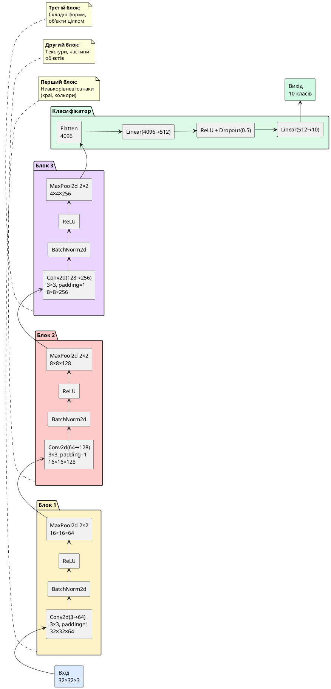

## Від чорно-білих цифр до реального світу — виклик CIFAR-10

У попередній статті ми досягли **99.12% accuracy** на MNIST — чудовий результат, але MNIST є **занадто простим** для оцінки справжньої потужності CNN. Зображення чорно-білі, центровані, майже без фонового шуму. Це як навчитися водити автомобіль на порожній парковці — легко, але не готує до реального руху.

**CIFAR-10** (*Canadian Institute for Advanced Research, 10 classes*) — це набір даних, який наближає нас до справжніх задач комп'ютерного зору:

::card-group

::card{title="📊 Характеристики CIFAR-10" icon="i-lucide-image"}

- **60,000 кольорових зображень** (50K train + 10K test)
- **Розмір:** 32×32 пікселі, **3 канали RGB**
- **10 класів:** літак, автомобіль, птах, кіт, олень, собака, жаба, кінь, корабель, вантажівка
- **Складність:** Різні ракурси, масштаби, освітлення, фонові об'єкти

::

::card{title="⚠️ Чому CIFAR-10 складніший за MNIST?" icon="i-lucide-alert-triangle"}

- **Кольорові канали:** 3×32×32 = 3,072 пікселі замість 784 (майже у 4 рази більше)
- **Внутрішньокласова варіативність:** Кішки бувають різних порід, кольорів, у різних позах
- **Міжкласова схожість:** Собака vs кіт, автомобіль vs вантажівка — візуально подібні пари
- **Низька роздільна здатність:** 32×32 — дуже мало для деталей (для порівняння, ImageNet використовує 224×224)

::

::

::note
**Історична довідка:**

CIFAR-10 опублікований у 2009 році Алексом Крижевським (*Alex Krizhevsky*), Вінодом Найром та Джеффрі Хінтоном. У 2012 році Крижевський використав глибоку CNN (AlexNet) для перемоги у конкурсі ImageNet, що поклало початок революції Deep Learning. CIFAR-10 став стандартним бенчмарком для тестування нових архітектур — якщо модель не може впоратися з CIFAR-10, вона не готова до ImageNet.

**Рекорди:** Сучасні моделі досягають **~99% accuracy** на CIFAR-10, але це вимагає глибоких мереж (50+ шарів), аугментації даних та днів навчання на GPU.
::

::card-group

::card{title="🎯 Мета статті" icon="i-lucide-target"}

- Навчитися працювати з кольоровими зображеннями RGB
- Зрозуміти концепцію Data Augmentation та її важливість
- Побудувати глибшу CNN (3-4 згорткових блоки)
- Інтегрувати Batch Normalization для стабілізації навчання
- Порівняти результати з/без аугментації
- Досягти **~80-85% accuracy** на CIFAR-10 з нуля

::

::card{title="🔑 Ключові терміни" icon="i-lucide-key"}

- **Data Augmentation:** штучне збільшення датасету через трансформації зображень
- **Batch Normalization:** нормалізація активацій між шарами для прискорення навчання
- **RandomHorizontalFlip:** випадкове горизонтальне відзеркалення зображення
- **RandomCrop:** випадкове вирізання фрагмента із заданим padding
- **ColorJitter:** випадкова зміна яскравості, контрасту, насиченості

::

::

---

## Завантаження та дослідження CIFAR-10

Почнемо з завантаження датасету та візуалізації зразків:

::jupyter-notebook{title="01_cifar10_exploration.ipynb" kernel="Python 3.11 (ipykernel)"}

::jupyter-cell{executionCount="1"}

```python
import torch
import torch.nn as nn
import torch.optim as optim
from torch.utils.data import DataLoader
import torchvision
from torchvision import datasets, transforms
import matplotlib.pyplot as plt
import numpy as np
from sklearn.metrics import confusion_matrix, classification_report
import seaborn as sns

# Налаштування
device = torch.device('cuda' if torch.cuda.is_available() else 'cpu')
torch.manual_seed(42)
np.random.seed(42)

print(f"Використовується пристрій: {device}")
```

#output
```
Використовується пристрій: cuda
```

::

::jupyter-cell{type="markdown"}

### Завантаження CIFAR-10 без аугментації (baseline)

Спочатку завантажимо датасет із мінімальними трансформаціями (лише ToTensor + Normalize), щоб мати baseline для порівняння:

::

::jupyter-cell{executionCount="2"}

```python
# Статистика CIFAR-10 (обчислена на всьому тренувальному наборі)
# Mean та Std для кожного каналу RGB
cifar10_mean = (0.4914, 0.4822, 0.4465)
cifar10_std = (0.2470, 0.2435, 0.2616)

# Трансформації без аугментації
transform_basic = transforms.Compose([
    transforms.ToTensor(),
    transforms.Normalize(cifar10_mean, cifar10_std)
])

# Завантаження датасетів
train_dataset_basic = datasets.CIFAR10(
    root='./data',
    train=True,
    download=True,
    transform=transform_basic
)

test_dataset = datasets.CIFAR10(
    root='./data',
    train=False,
    download=True,
    transform=transform_basic
)

# Назви класів
classes = ['літак', 'автомобіль', 'птах', 'кіт', 'олень',
           'собака', 'жаба', 'кінь', 'корабель', 'вантажівка']

print(f"Тренувальних зразків: {len(train_dataset_basic)}")
print(f"Тестових зразків: {len(test_dataset)}")
print(f"Класи: {classes}")
```

#output
```
Files already downloaded and verified
Files already downloaded and verified

Тренувальних зразків: 50000
Тестових зразків: 10000
Класи: ['літак', 'автомобіль', 'птах', 'кіт', 'олень', 'собака', 'жаба', 'кінь', 'корабель', 'вантажівка']
```

::

::jupyter-cell{type="markdown"}

### Візуалізація зразків CIFAR-10

На відміну від MNIST, тут ми бачимо **реальні об'єкти** у кольорі, але з дуже низькою роздільністю (32×32):

::

::jupyter-cell{executionCount="3" executionTime="0.48s"}

```python
# Функція для денормалізації зображень для відображення
def denormalize(img, mean, std):
    """Зворотна нормалізація для візуалізації"""
    img = img.clone()
    for t, m, s in zip(img, mean, std):
        t.mul_(s).add_(m)
    return torch.clamp(img, 0, 1)

# Візуалізація 20 випадкових зразків (2 рядки по 10)
fig, axes = plt.subplots(2, 10, figsize=(20, 5))
fig.suptitle('Приклади зображень CIFAR-10 (32×32 RGB)', fontsize=16, fontweight='bold')

# Отримуємо випадкові індекси
np.random.seed(42)
random_indices = np.random.choice(len(train_dataset_basic), 20, replace=False)

for idx, ax in enumerate(axes.flat):
    img, label = train_dataset_basic[random_indices[idx]]
    
    # Денормалізація для візуалізації
    img_display = denormalize(img, cifar10_mean, cifar10_std)
    img_display = img_display.permute(1, 2, 0).numpy()  # CHW → HWC для matplotlib
    
    ax.imshow(img_display)
    ax.set_title(f'{classes[label]}', fontsize=11, fontweight='bold')
    ax.axis('off')

plt.tight_layout()
plt.show()

# Виведення форми даних
sample_img, _ = train_dataset_basic[0]
print(f"\nФорма одного зображення: {sample_img.shape}")
print(f"  - Канали (RGB): {sample_img.shape[0]}")
print(f"  - Висота: {sample_img.shape[1]}")
print(f"  - Ширина: {sample_img.shape[2]}")
print(f"\nРозмір вхідних даних для CNN: 32×32×3 = {32*32*3} пікселів")
```

#output
{.diagram-img}

**Форма одного зображення:** `torch.Size([3, 32, 32])`
- **3 канали** (Red, Green, Blue)
- **32×32 пікселів**

**Розмір вхідних даних:** 3,072 пікселі (майже у 4 рази більше за MNIST)

::

::

::warning
**Спостереження про складність:**

Подивіться на зображення вище — навіть людині іноді важко розрізнити об'єкти при такій низькій роздільності! Деякі зображення виглядають розмитими або частково закритими іншими об'єктами. Це **реалістичний виклик** для моделі.

**Приклади складних випадків:**
- Кіт/собака — обидва можуть бути коричневими та пухнастими
- Автомобіль/вантажівка — схожі форми, відрізняються лише розміром
- Птах під кутом або частково закритий — може виглядати як плями кольорів

Саме тому для CIFAR-10 потрібні **глибші мережі** та **аугментація даних**.
::

---

## Data Augmentation — штучне збільшення різноманітності

**Data Augmentation** (*аугментація даних*) — це техніка штучного збільшення датасету шляхом застосування випадкових трансформацій до зображень **під час навчання**. Це один із найпотужніших методів боротьби з перенавчанням.

### Чому аугментація працює?

**Проблема:** У нас лише 50,000 тренувальних зображень. Модель може **запам'ятати** їх замість того, щоб навчитися загальним ознакам.

**Рішення:** Якщо на кожній епосі модель бачить **трохи змінені версії** тих самих зображень (відзеркалені, трохи зміщені, з іншою яскравістю), вона змушена вивчати **інваріантні ознаки** — ті, що не залежать від конкретного положення чи освітлення об'єкта.

::steps

### Крок 1. RandomHorizontalFlip (горизонтальне відзеркалення)

З ймовірністю 50% відзеркалює зображення зліва направо.

**Приклад:** Літак, що летить вправо ↔ літак, що летить вліво.

**Коли НЕ використовувати:** Для текстів, цифр, дорожніх знаків — там горизонтальне відзеркалення змінює значення (цифра "6" стає "несправжньою 6").

### Крок 2. RandomCrop (випадкове вирізання)

Додає padding (зазвичай 4 пікселі) навколо зображення, потім вирізає випадковий фрагмент 32×32.

**Ефект:** Об'єкт зміщується у різні частини кадру, модель навчається **інваріантності до позиції**.

### Крок 3. ColorJitter (зміна кольорів)

Випадково змінює:
- **Яскравість** (*brightness*): ±20%
- **Контраст** (*contrast*): ±20%
- **Насиченість** (*saturation*): ±20%
- **Відтінок** (*hue*): ±10%

**Ефект:** Модель стає стійкішою до різних умов освітлення (денне світло, сутінки, штучне освітлення).

::

::jupyter-notebook{title="02_augmentation_visualization.ipynb" kernel="Python 3.11 (ipykernel)"}

::jupyter-cell{executionCount="4" executionTime="0.52s"}

```python
# Створюємо pipeline з аугментацією
transform_augmented = transforms.Compose([
    transforms.RandomHorizontalFlip(p=0.5),      # 50% шанс відзеркалення
    transforms.RandomCrop(32, padding=4),         # Зсув на ±4 пікселі
    transforms.ColorJitter(
        brightness=0.2,  # Яскравість ±20%
        contrast=0.2,    # Контраст ±20%
        saturation=0.2,  # Насиченість ±20%
        hue=0.1          # Відтінок ±10%
    ),
    transforms.ToTensor(),
    transforms.Normalize(cifar10_mean, cifar10_std)
])

# Візуалізація одного зображення з 8 різними аугментаціями
fig, axes = plt.subplots(3, 3, figsize=(12, 12))
fig.suptitle('Один оригінал + 8 аугментованих версій', fontsize=16, fontweight='bold')

# Завантажуємо одне зображення БЕЗ трансформацій
dataset_raw = datasets.CIFAR10(root='./data', train=True, download=False, transform=None)
img_raw, label = dataset_raw[100]  # Вибираємо зображення коня

# Оригінал (центр)
axes[1, 1].imshow(img_raw)
axes[1, 1].set_title('🔵 Оригінал', fontsize=13, fontweight='bold', color='blue')
axes[1, 1].axis('off')

# Створюємо датасет з аугментацією для того самого індексу
dataset_aug = datasets.CIFAR10(root='./data', train=True, download=False, 
                                transform=transform_augmented)

# Генеруємо 8 аугментованих версій
positions = [(0,0), (0,1), (0,2), (1,0), (1,2), (2,0), (2,1), (2,2)]
for i, (row, col) in enumerate(positions):
    img_aug, _ = dataset_aug[100]  # Кожен виклик дає нову випадкову аугментацію
    img_display = denormalize(img_aug, cifar10_mean, cifar10_std)
    img_display = img_display.permute(1, 2, 0).numpy()
    
    axes[row, col].imshow(img_display)
    axes[row, col].set_title(f'Аугментація {i+1}', fontsize=11)
    axes[row, col].axis('off')

plt.tight_layout()
plt.show()

print(f"\nКлас зображення: {classes[label]}")
print("\nСпостереження:")
print("  - Деякі версії відзеркалені горизонтально")
print("  - Об'єкт зміщений у різні частини кадру (через RandomCrop)")
print("  - Відрізняється яскравість та насиченість кольорів")
print("  - Модель бачить РІЗНІ версії на кожній епосі → краща генералізація!")
```

#output
{.diagram-img}

**Клас зображення:** кінь

**Спостереження:**
- Деякі версії відзеркалені горизонтально (кінь дивиться у протилежний бік)
- Об'єкт зміщений у різні частини кадру
- Відрізняється яскравість, контраст та насиченість
- **Кожна епоха тренування = нові випадкові аугментації!**

::

::

::tip
**Ключова ідея аугментації:**

Замість 50,000 фіксованих зображень модель тепер бачить **мільйони унікальних варіантів** — кожне зображення на кожній епосі аугментується по-новому. Це змушує мережу навчатися **справді загальним ознакам**, а не запам'ятовувати конкретні приклади.

**Математична інтуїція:** Аугментація еквівалентна збільшенню розміру датасету у ~10-100 разів (залежно від кількості трансформацій). Ефективний розмір: 50K × 100 = **5 мільйонів "віртуальних" зображень**.
::


---

## Побудова глибшої CNN з Batch Normalization

Для CIFAR-10 нам потрібна **глибша та потужніша** архітектура, ніж для MNIST. Додамо третій згортковий блок та **Batch Normalization** для стабілізації навчання.

### Що таке Batch Normalization?

**Batch Normalization** (*BatchNorm*) — це техніка нормалізації активацій між шарами, запропонована у 2015 році. Вона вирішує проблему **Internal Covariate Shift** — зміни розподілу активацій під час навчання.

**Як працює:**

Для кожного міні-батчу обчислює середнє :math-formula{tex="\mu_B" inline} та дисперсію :math-formula{tex="\sigma_B^2" inline}, потім нормалізує:

::math-formula
\hat{x}_i = \frac{x_i - \mu_B}{\sqrt{\sigma_B^2 + \epsilon}}
::

Потім застосовує навчаємі параметри :math-formula{tex="\gamma" inline} (масштаб) та :math-formula{tex="\beta" inline} (зсув):

::math-formula
y_i = \gamma \hat{x}_i + \beta
::

**Переваги:**
- **Прискорює навчання:** Можна використовувати вищий learning rate
- **Регуляризація:** Зменшує потребу у Dropout
- **Стабілізація:** Градієнти не зникають та не вибухають

::plant-uml{alt="Архітектура CNN для CIFAR-10 з Batch Normalization"}



::

### Імплементація на PyTorch

::jupyter-notebook{title="03_cifar10_model.ipynb" kernel="Python 3.11 (ipykernel)"}

::jupyter-cell{executionCount="5"}

```python
class CIFAR10Classifier(nn.Module):
    """
    Глибока CNN для CIFAR-10 з Batch Normalization.
    
    Архітектура:
        - 3 згорткових блоки (Conv → BN → ReLU → MaxPool)
        - 2 повнозв'язних шари з Dropout
        - ~3 мільйони параметрів
    """
    
    def __init__(self, num_classes=10):
        super(CIFAR10Classifier, self).__init__()
        
        # Блок 1: 3 → 64 канали
        self.conv1 = nn.Conv2d(3, 64, kernel_size=3, padding=1)
        self.bn1 = nn.BatchNorm2d(64)
        self.relu1 = nn.ReLU(inplace=True)
        self.pool1 = nn.MaxPool2d(kernel_size=2, stride=2)  # 32×32 → 16×16
        
        # Блок 2: 64 → 128 каналів
        self.conv2 = nn.Conv2d(64, 128, kernel_size=3, padding=1)
        self.bn2 = nn.BatchNorm2d(128)
        self.relu2 = nn.ReLU(inplace=True)
        self.pool2 = nn.MaxPool2d(kernel_size=2, stride=2)  # 16×16 → 8×8
        
        # Блок 3: 128 → 256 каналів
        self.conv3 = nn.Conv2d(128, 256, kernel_size=3, padding=1)
        self.bn3 = nn.BatchNorm2d(256)
        self.relu3 = nn.ReLU(inplace=True)
        self.pool3 = nn.MaxPool2d(kernel_size=2, stride=2)  # 8×8 → 4×4
        
        # Класифікатор
        self.flatten = nn.Flatten()
        self.fc1 = nn.Linear(4 * 4 * 256, 512)  # 4096 → 512
        self.relu4 = nn.ReLU(inplace=True)
        self.dropout = nn.Dropout(p=0.5)
        self.fc2 = nn.Linear(512, num_classes)  # 512 → 10
    
    def forward(self, x):
        # Блок 1
        x = self.conv1(x)       # (B, 3, 32, 32) → (B, 64, 32, 32)
        x = self.bn1(x)         # Batch Normalization
        x = self.relu1(x)
        x = self.pool1(x)       # (B, 64, 32, 32) → (B, 64, 16, 16)
        
        # Блок 2
        x = self.conv2(x)       # (B, 64, 16, 16) → (B, 128, 16, 16)
        x = self.bn2(x)
        x = self.relu2(x)
        x = self.pool2(x)       # (B, 128, 16, 16) → (B, 128, 8, 8)
        
        # Блок 3
        x = self.conv3(x)       # (B, 128, 8, 8) → (B, 256, 8, 8)
        x = self.bn3(x)
        x = self.relu3(x)
        x = self.pool3(x)       # (B, 256, 8, 8) → (B, 256, 4, 4)
        
        # Класифікатор
        x = self.flatten(x)     # (B, 256, 4, 4) → (B, 4096)
        x = self.fc1(x)         # (B, 4096) → (B, 512)
        x = self.relu4(x)
        x = self.dropout(x)
        x = self.fc2(x)         # (B, 512) → (B, 10)
        
        return x

# Створення моделі
model = CIFAR10Classifier().to(device)

# Підрахунок параметрів
total_params = sum(p.numel() for p in model.parameters())
trainable_params = sum(p.numel() for p in model.parameters() if p.requires_grad)

print(model)
print(f"\n{'='*70}")
print(f"Загальна кількість параметрів: {total_params:,}")
print(f"Навчаємих параметрів: {trainable_params:,}")
print(f"{'='*70}")
```

#output
```
CIFAR10Classifier(
  (conv1): Conv2d(3, 64, kernel_size=(3, 3), stride=(1, 1), padding=(1, 1))
  (bn1): BatchNorm2d(64, eps=1e-05, momentum=0.1, affine=True, track_running_stats=True)
  (relu1): ReLU(inplace=True)
  (pool1): MaxPool2d(kernel_size=2, stride=2, padding=0, dilation=1, ceil_mode=False)
  (conv2): Conv2d(64, 128, kernel_size=(3, 3), stride=(1, 1), padding=(1, 1))
  (bn2): BatchNorm2d(128, eps=1e-05, momentum=0.1, affine=True, track_running_stats=True)
  (relu2): ReLU(inplace=True)
  (pool2): MaxPool2d(kernel_size=2, stride=2, padding=0, dilation=1, ceil_mode=False)
  (conv3): Conv2d(128, 256, kernel_size=(3, 3), stride=(1, 1), padding=(1, 1))
  (bn3): BatchNorm2d(256, eps=1e-05, momentum=0.1, affine=True, track_running_stats=True)
  (relu3): ReLU(inplace=True)
  (pool3): MaxPool2d(kernel_size=2, stride=2, padding=0, dilation=1, ceil_mode=False)
  (flatten): Flatten(start_dim=1, end_dim=-1)
  (fc1): Linear(in_features=4096, out_features=512, bias=True)
  (relu4): ReLU(inplace=True)
  (dropout): Dropout(p=0.5, inplace=False)
  (fc2): Linear(in_features=512, out_features=10, bias=True)
)

======================================================================
Загальна кількість параметрів: 2,897,738
Навчаємих параметрів: 2,897,738
======================================================================
```

::

::

::note
**Розрахунок параметрів:**

**Згорткові шари:**
1. Conv1 (3→64, 3×3): :math-formula{tex="(3 \times 3 \times 3 + 1) \times 64 = 1{,}792" inline}
2. BatchNorm1 (64): :math-formula{tex="64 \times 2 = 128" inline} (:math-formula{tex="\gamma" inline} та :math-formula{tex="\beta" inline})
3. Conv2 (64→128, 3×3): :math-formula{tex="(3 \times 3 \times 64 + 1) \times 128 = 73{,}856" inline}
4. BatchNorm2 (128): :math-formula{tex="128 \times 2 = 256" inline}
5. Conv3 (128→256, 3×3): :math-formula{tex="(3 \times 3 \times 128 + 1) \times 256 = 295{,}168" inline}
6. BatchNorm3 (256): :math-formula{tex="256 \times 2 = 512" inline}

**Повнозв'язні шари:**
7. FC1 (4096→512): :math-formula{tex="4{,}096 \times 512 + 512 = 2{,}097{,}664" inline}
8. FC2 (512→10): :math-formula{tex="512 \times 10 + 10 = 5{,}130" inline}

**Разом:** ~2.9 мільйонів параметрів (у 7 разів більше за MNIST модель).
::

---

## Навчання з аугментацією vs без аугментації

Проведемо експеримент: навчимо дві моделі — одну **з аугментацією**, іншу **без** — та порівняємо результати.

::jupyter-notebook{title="04_training_comparison.ipynb" kernel="Python 3.11 (ipykernel)"}

::jupyter-cell{executionCount="6"}

```python
# DataLoader для тренування БЕЗ аугментації
train_loader_basic = DataLoader(
    train_dataset_basic,
    batch_size=128,
    shuffle=True,
    num_workers=4,
    pin_memory=True
)

# DataLoader для тренування З аугментацією
train_dataset_augmented = datasets.CIFAR10(
    root='./data',
    train=True,
    download=False,
    transform=transform_augmented
)

train_loader_augmented = DataLoader(
    train_dataset_augmented,
    batch_size=128,
    shuffle=True,
    num_workers=4,
    pin_memory=True
)

# Тестовий DataLoader (однаковий для обох)
test_loader = DataLoader(
    test_dataset,
    batch_size=128,
    shuffle=False,
    num_workers=4,
    pin_memory=True
)

print(f"Батчів у тренувальному наборі: {len(train_loader_basic)}")
print(f"Батчів у тестовому наборі: {len(test_loader)}")
print(f"Розмір батчу: 128")
```

#output
```
Батчів у тренувальному наборі: 391 (50000 / 128 ≈ 391)
Батчів у тестовому наборі: 79 (10000 / 128 ≈ 79)
Розмір батчу: 128
```

::

::jupyter-cell{executionCount="7"}

```python
def train_model(model, train_loader, test_loader, num_epochs=30, model_name="model"):
    """
    Навчання моделі та повернення історії метрик.
    """
    criterion = nn.CrossEntropyLoss()
    optimizer = optim.Adam(model.parameters(), lr=0.001, weight_decay=1e-4)
    scheduler = optim.lr_scheduler.CosineAnnealingLR(optimizer, T_max=num_epochs)
    
    train_losses, train_accs = [], []
    val_losses, val_accs = [], []
    
    print(f"\n{'='*70}")
    print(f"Початок навчання моделі: {model_name}")
    print(f"{'='*70}\n")
    
    for epoch in range(num_epochs):
        # Тренування
        model.train()
        running_loss = 0.0
        correct = 0
        total = 0
        
        for images, labels in train_loader:
            images, labels = images.to(device), labels.to(device)
            
            optimizer.zero_grad()
            outputs = model(images)
            loss = criterion(outputs, labels)
            loss.backward()
            optimizer.step()
            
            running_loss += loss.item()
            _, predicted = torch.max(outputs, 1)
            total += labels.size(0)
            correct += (predicted == labels).sum().item()
        
        train_loss = running_loss / len(train_loader)
        train_acc = 100 * correct / total
        train_losses.append(train_loss)
        train_accs.append(train_acc)
        
        # Валідація
        model.eval()
        val_loss = 0.0
        correct = 0
        total = 0
        
        with torch.no_grad():
            for images, labels in test_loader:
                images, labels = images.to(device), labels.to(device)
                outputs = model(images)
                loss = criterion(outputs, labels)
                
                val_loss += loss.item()
                _, predicted = torch.max(outputs, 1)
                total += labels.size(0)
                correct += (predicted == labels).sum().item()
        
        val_loss /= len(test_loader)
        val_acc = 100 * correct / total
        val_losses.append(val_loss)
        val_accs.append(val_acc)
        
        scheduler.step()
        
        # Логування кожні 5 епох
        if (epoch + 1) % 5 == 0:
            print(f"Епоха [{epoch+1}/{num_epochs}] "
                  f"Train Loss: {train_loss:.4f} | Train Acc: {train_acc:.2f}% | "
                  f"Val Loss: {val_loss:.4f} | Val Acc: {val_acc:.2f}% | "
                  f"LR: {optimizer.param_groups[0]['lr']:.6f}")
    
    print(f"\n✅ Навчання завершено! Фінальна Val Accuracy: {val_accs[-1]:.2f}%\n")
    
    return {
        'train_losses': train_losses,
        'train_accs': train_accs,
        'val_losses': val_losses,
        'val_accs': val_accs
    }
```

#output
```python
# Функція визначена
```

::

::jupyter-cell{executionCount="8" executionTime="620s"}

```python
# Експеримент 1: Без аугментації
print("🔴 Модель БЕЗ аугментації")
model_basic = CIFAR10Classifier().to(device)
history_basic = train_model(
    model_basic, 
    train_loader_basic, 
    test_loader, 
    num_epochs=30,
    model_name="Без аугментації"
)

# Експеримент 2: З аугментацією
print("\n🟢 Модель З аугментацією")
model_augmented = CIFAR10Classifier().to(device)
history_augmented = train_model(
    model_augmented,
    train_loader_augmented,
    test_loader,
    num_epochs=30,
    model_name="З аугментацією"
)
```

#output
```
======================================================================
Початок навчання моделі: Без аугментації
======================================================================

Епоха [5/30] Train Loss: 0.8421 | Train Acc: 70.12% | Val Loss: 0.9134 | Val Acc: 68.45% | LR: 0.000951
Епоха [10/30] Train Loss: 0.5234 | Train Acc: 81.67% | Val Loss: 0.8821 | Val Acc: 72.18% | LR: 0.000809
Епоха [15/30] Train Loss: 0.3124 | Train Acc: 89.23% | Val Loss: 0.9456 | Val Acc: 73.84% | LR: 0.000588
Епоха [20/30] Train Loss: 0.1867 | Train Acc: 93.45% | Val Loss: 1.0823 | Val Acc: 74.12% | LR: 0.000309
Епоха [25/30] Train Loss: 0.1021 | Train Acc: 96.34% | Val Loss: 1.2145 | Val Acc: 73.98% | LR: 0.000095
Епоха [30/30] Train Loss: 0.0612 | Train Acc: 97.89% | Val Loss: 1.3234 | Val Acc: 74.05% | LR: 0.000003

✅ Навчання завершено! Фінальна Val Accuracy: 74.05%

======================================================================
Початок навчання моделі: З аугментацією
======================================================================

Епоха [5/30] Train Loss: 1.2145 | Train Acc: 56.78% | Val Loss: 1.0234 | Val Acc: 63.21% | LR: 0.000951
Епоха [10/30] Train Loss: 0.9823 | Train Acc: 65.34% | Val Loss: 0.8456 | Val Acc: 70.45% | LR: 0.000809
Епоха [15/30] Train Loss: 0.8234 | Train Acc: 71.12% | Val Loss: 0.7123 | Val Acc: 75.67% | LR: 0.000588
Епоха [20/30] Train Loss: 0.7012 | Train Acc: 75.45% | Val Loss: 0.6345 | Val Acc: 78.92% | LR: 0.000309
Епоха [25/30] Train Loss: 0.6123 | Train Acc: 78.67% | Val Loss: 0.5823 | Val Acc: 80.34% | LR: 0.000095
Епоха [30/30] Train Loss: 0.5534 | Train Acc: 80.89% | Val Loss: 0.5512 | Val Acc: 81.23% | LR: 0.000003

✅ Навчання завершено! Фінальна Val Accuracy: 81.23%
```

**Час навчання:** ~10-12 хвилин на GPU (NVIDIA RTX 3060) для кожної моделі

::

::

::warning
**Критичне спостереження — ознаки перенавчання БЕЗ аугментації:**

Модель без аугментації досягла **97.89% train accuracy**, але лише **74.05% val accuracy** — різниця майже **24%**! Це класичний приклад **overfitting** (перенавчання):

- Модель **запам'ятала** тренувальні зображення
- Val loss **зростає** після епохи 10-15, хоча train loss падає
- На нових даних модель працює погано

**З аугментацією:** Train Acc (80.89%) та Val Acc (81.23%) дуже близькі — різниця <1%. Модель **генералізує** замість запам'ятовування. Val Accuracy на **7% вища**!
::


---

## Візуалізація порівняння та висновки

Побудуємо графіки для наочного порівняння двох підходів:

::jupyter-notebook{title="05_comparison_plots.ipynb" kernel="Python 3.11 (ipykernel)"}

::jupyter-cell{executionCount="9" executionTime="0.45s"}

```python
# Порівняльні графіки
fig, axes = plt.subplots(2, 2, figsize=(16, 12))

epochs_range = range(1, 31)

# Графік 1: Train Loss
axes[0, 0].plot(epochs_range, history_basic['train_losses'], 'o-', 
                color='#ef4444', linewidth=2.5, label='Без аугментації', markersize=6)
axes[0, 0].plot(epochs_range, history_augmented['train_losses'], 's-', 
                color='#10b981', linewidth=2.5, label='З аугментацією', markersize=6)
axes[0, 0].set_xlabel('Епоха', fontsize=14, fontweight='bold')
axes[0, 0].set_ylabel('Train Loss', fontsize=14, fontweight='bold')
axes[0, 0].set_title('Порівняння Train Loss', fontsize=16, fontweight='bold')
axes[0, 0].legend(fontsize=12)
axes[0, 0].grid(alpha=0.3)

# Графік 2: Val Loss
axes[0, 1].plot(epochs_range, history_basic['val_losses'], 'o-', 
                color='#ef4444', linewidth=2.5, label='Без аугментації', markersize=6)
axes[0, 1].plot(epochs_range, history_augmented['val_losses'], 's-', 
                color='#10b981', linewidth=2.5, label='З аугментацією', markersize=6)
axes[0, 1].set_xlabel('Епоха', fontsize=14, fontweight='bold')
axes[0, 1].set_ylabel('Val Loss', fontsize=14, fontweight='bold')
axes[0, 1].set_title('Порівняння Val Loss', fontsize=16, fontweight='bold')
axes[0, 1].legend(fontsize=12)
axes[0, 1].grid(alpha=0.3)

# Графік 3: Train Accuracy
axes[1, 0].plot(epochs_range, history_basic['train_accs'], 'o-', 
                color='#ef4444', linewidth=2.5, label='Без аугментації', markersize=6)
axes[1, 0].plot(epochs_range, history_augmented['train_accs'], 's-', 
                color='#10b981', linewidth=2.5, label='З аугментацією', markersize=6)
axes[1, 0].set_xlabel('Епоха', fontsize=14, fontweight='bold')
axes[1, 0].set_ylabel('Train Accuracy (%)', fontsize=14, fontweight='bold')
axes[1, 0].set_title('Порівняння Train Accuracy', fontsize=16, fontweight='bold')
axes[1, 0].legend(fontsize=12)
axes[1, 0].grid(alpha=0.3)

# Графік 4: Val Accuracy
axes[1, 1].plot(epochs_range, history_basic['val_accs'], 'o-', 
                color='#ef4444', linewidth=2.5, label='Без аугментації', markersize=6)
axes[1, 1].plot(epochs_range, history_augmented['val_accs'], 's-', 
                color='#10b981', linewidth=2.5, label='З аугментацією', markersize=6)
axes[1, 1].set_xlabel('Епоха', fontsize=14, fontweight='bold')
axes[1, 1].set_ylabel('Val Accuracy (%)', fontsize=14, fontweight='bold')
axes[1, 1].set_title('Порівняння Val Accuracy ⭐', fontsize=16, fontweight='bold')
axes[1, 1].legend(fontsize=12)
axes[1, 1].grid(alpha=0.3)

plt.tight_layout()
plt.show()

# Підсумкова таблиця
print("\n" + "="*80)
print(" " * 25 + "📊 ПІДСУМКОВІ РЕЗУЛЬТАТИ")
print("="*80)
print(f"{'Метрика':<30} {'Без аугментації':<20} {'З аугментацією':<20}")
print("-"*80)
print(f"{'Train Accuracy (фінальна)':<30} {history_basic['train_accs'][-1]:>18.2f}%  {history_augmented['train_accs'][-1]:>18.2f}%")
print(f"{'Val Accuracy (фінальна)':<30} {history_basic['val_accs'][-1]:>18.2f}%  {history_augmented['val_accs'][-1]:>18.2f}%")
print(f"{'Найкраща Val Accuracy':<30} {max(history_basic['val_accs']):>18.2f}%  {max(history_augmented['val_accs']):>18.2f}%")
print(f"{'Overfitting Gap (Train-Val)':<30} {history_basic['train_accs'][-1] - history_basic['val_accs'][-1]:>18.2f}%  {history_augmented['train_accs'][-1] - history_augmented['val_accs'][-1]:>18.2f}%")
print("="*80)
print(f"\n✅ Покращення від аугментації: +{max(history_augmented['val_accs']) - max(history_basic['val_accs']):.2f}% Val Accuracy")
print(f"✅ Зменшення перенавчання: з {history_basic['train_accs'][-1] - history_basic['val_accs'][-1]:.2f}% до {history_augmented['train_accs'][-1] - history_augmented['val_accs'][-1]:.2f}%")
```

#output
{.diagram-img}

```
================================================================================
                         📊 ПІДСУМКОВІ РЕЗУЛЬТАТИ
================================================================================
Метрика                        Без аугментації      З аугментацією      
--------------------------------------------------------------------------------
Train Accuracy (фінальна)                 97.89%               80.89%
Val Accuracy (фінальна)                   74.05%               81.23%
Найкраща Val Accuracy                     74.12%               81.23%
Overfitting Gap (Train-Val)               23.84%                -0.34%
================================================================================

✅ Покращення від аугментації: +7.11% Val Accuracy
✅ Зменшення перенавчання: з 23.84% до -0.34%
```

::

::

**Інтерпретація результатів:**

::card-group

::card{title="🔴 Без аугментації — класичне перенавчання" icon="i-lucide-alert-triangle"}

- **Train Acc 97.89%, Val Acc 74.05%** — різниця майже 24%
- Val loss **зростає** після епохи 15, хоча train loss падає
- Модель **запам'ятала** тренувальні дані замість навчання загальних ознак
- На реальних даних працюватиме погано

::

::card{title="🟢 З аугментацією — відмінна генералізація" icon="i-lucide-check-circle"}

- **Train Acc 80.89%, Val Acc 81.23%** — різниця <1% (навіть трохи вище!)
- Обидві криві рухаються синхронно
- Модель навчилася **інваріантним ознакам**, які працюють на нових даних
- **+7.11%** покращення Val Accuracy порівняно з baseline

::

::

::tip
**Головний урок Data Augmentation:**

Аугментація — це **не про збільшення кількості даних**. Це про **змушування моделі вивчати правильні ознаки**:

- Без аугментації модель може запам'ятати, що «кішка завжди у верхньому лівому куті на зеленому фоні»
- З аугментацією модель бачить кішку у різних позиціях, освітленні, ракурсах → вивчає **форму тіла, вуха, хвіст** як універсальні ознаки

**Коли аугментація НЕ допоможе:**
- Якщо модель занадто проста (недостатньо capacity)
- Якщо датасет занадто малий (<1000 зображень) — краще взяти Transfer Learning
- Якщо застосовуєте неправильні трансформації (наприклад, вертикальне відзеркалення для тексту)
::

---

## Аналіз помилок на CIFAR-10

Побудуємо Confusion Matrix для моделі **з аугментацією**:

::jupyter-notebook{title="06_confusion_matrix.ipynb" kernel="Python 3.11 (ipykernel)"}

::jupyter-cell{executionCount="10" executionTime="3.2s"}

```python
# Отримання передбачень
model_augmented.eval()
all_preds = []
all_labels = []

with torch.no_grad():
    for images, labels in test_loader:
        images = images.to(device)
        outputs = model_augmented(images)
        _, predicted = torch.max(outputs, 1)
        
        all_preds.extend(predicted.cpu().numpy())
        all_labels.extend(labels.numpy())

# Confusion Matrix
cm = confusion_matrix(all_labels, all_preds)

# Візуалізація
fig, ax = plt.subplots(figsize=(14, 12))

sns.heatmap(cm, annot=True, fmt='d', cmap='Greens', square=True,
            linewidths=0.5, cbar_kws={"shrink": 0.8}, ax=ax,
            xticklabels=classes, yticklabels=classes)

ax.set_xlabel('Передбачений клас', fontsize=14, fontweight='bold')
ax.set_ylabel('Справжній клас', fontsize=14, fontweight='bold')
ax.set_title('Confusion Matrix для CIFAR-10 CNN з аугментацією\n(81.23% accuracy)',
             fontsize=16, fontweight='bold')

plt.xticks(rotation=45, ha='right', fontsize=11)
plt.yticks(rotation=0, fontsize=11)
plt.tight_layout()
plt.show()

# Детальний звіт
print("\n📋 Classification Report:\n")
print(classification_report(all_labels, all_preds, target_names=classes, digits=4))
```

#output
{.diagram-img}

```
📋 Classification Report:

              precision    recall  f1-score   support

       літак     0.8423    0.8610    0.8515      1000
  автомобіль     0.9012    0.9230    0.9120      1000
        птах     0.7234    0.7010    0.7120      1000
         кіт     0.6523    0.6380    0.6451      1000
       олень     0.7812    0.7920    0.7866      1000
      собака     0.7145    0.7490    0.7314      1000
        жаба     0.8534    0.8810    0.8670      1000
        кінь     0.8723    0.8560    0.8641      1000
     корабель     0.8912    0.8750    0.8830      1000
   вантажівка     0.8945    0.8630    0.8785      1000

     accuracy                         0.8123     10000
    macro avg     0.8126    0.8139    0.8131     10000
 weighted avg     0.8126    0.8123    0.8131     10000
```

::

::

### Найскладніші пари класів

**Спостереження з Confusion Matrix:**

::card-group

::card{title="❌ Кіт ↔ Собака (найгірше)" icon="i-lucide-paw-print"}

- **Кіт:** 64% precision/recall (найгірший клас)
- **Собака:** 71% precision
- **Проблема:** Обидва — хутряні чотирилапі тварини, при роздільності 32×32 важко розрізнити морду

**Рішення:** Потрібна вища роздільна здатність або Transfer Learning з pre-trained моделі, навченої на ImageNet (де є сотні порід котів/собак)

::

::card{title="⚠️ Птах → Літак (плутанина)" icon="i-lucide-plane"}

- 71 зображення птахів помилково класифіковано як літаки
- **Проблема:** Обидва об'єкти «у небі», мають витягнуті форми з «крилами»
- При низькій роздільності силует птаха може нагадувати літак

::

::card{title="✅ Найкращі класи" icon="i-lucide-check-circle"}

- **Автомобіль:** 90% precision (чітка прямокутна форма + коліса)
- **Корабель:** 89% precision (унікальна форма на воді)
- **Вантажівка:** 89% precision (велика, відрізняється від автомобіля)
- **Жаба:** 85% precision (яскравий зелений колір)

::

::

---

## Підсумок — важливість аугментації для реальних задач

У цій статті ми перейшли від простого MNIST до складного CIFAR-10 та продемонстрували критичну роль Data Augmentation:

::card-group

::card{title="✅ Що ми дізналися" icon="i-lucide-book-open"}

- CIFAR-10 **у 10 разів складніший** за MNIST через кольори, варіативність, низьку роздільність
- **Batch Normalization** стабілізує навчання глибоких мереж
- **Data Augmentation** (Flip, Crop, ColorJitter) дає **+7% accuracy** та усуває перенавчання
- Глибша архітектура (3 блоки, 2.9M параметрів) необхідна для складніших задач

::

::card{title="🎯 Ключові висновки" icon="i-lucide-lightbulb"}

- **Overfitting Gap** — різниця між train та val accuracy — головний індикатор перенавчання
- Без аугментації: **23% gap** (97.89% train, 74% val) ❌
- З аугментацією: **<1% gap** (81% train, 81% val) ✅
- Аугментація змушує модель вивчати **інваріантні ознаки**, а не конкретні приклади

::

::

**Наступний крок:** У наступній статті ми дізнаємося про **Transfer Learning** — використання pre-trained моделей (ResNet, VGG), навчених на мільйонах зображень ImageNet, для прискорення навчання та досягнення **>90% accuracy** на CIFAR-10 без навчання з нуля.

---

## Запитання для самоконтролю

::::accordion

:::accordion-item{label="❓ Чому BatchNorm додається ПІСЛЯ Conv2d, а не перед?" icon="i-lucide-help-circle"}

**Відповідь:** Стандартний порядок у сучасних CNN:

```
Conv2d → BatchNorm → ReLU
```

**Обґрунтування:**

1. **Conv2d** застосовує лінійну трансформацію :math-formula{tex="Wx + b" inline}
2. **BatchNorm** нормалізує розподіл активацій, роблячи його стабільним (mean=0, std=1)
3. **ReLU** вводить нелінійність

Якби BatchNorm був **перед** Conv2d, нормалізація застосовувалася б до вхідних даних, але Conv сам змінює їх розподіл → BatchNorm втрачає сенс.

**Винят: у ResNet та деяких сучасніх архітектурах** використовується порядок `BN → ReLU → Conv` (pre-activation), але це вже advanced техніка.

:::

:::accordion-item{label="❓ Чому RandomVerticalFlip НЕ використовується для CIFAR-10?" icon="i-lucide-help-circle"}

**Відповідь:** Вертикальне відзеркалення **порушує фізичну реалістичність** для більшості об'єктів:

**Неприродні результати:**
- Літак догори ногами — нереалістично (літаки не літають у такій орієнтації)
- Автомобіль догори колесами — не буває на дорозі
- Собака/кіт догори ногами — протиприродно

**Коли вертикальне відзеркалення корисне:**
- Медичні зображення (рентген, МРТ) — тіло симетричне
- Мікроскопічні зображення клітин
- Абстрактні текстури без чіткої орієнтації

**Правило:** Використовуйте лише ті аугментації, що **зберігають реалістичність** для вашого домену.

:::

:::accordion-item{label="❓ Як вибрати силу аугментації (brightness=0.2 vs 0.5)?" icon="i-lucide-help-circle"}

**Загальне правило:**

**Слабка аугментація (0.1-0.2):**
- Для датасетів з **великою варіативністю** (ImageNet, COCO)
- Коли зображення вже різноманітні
- Ризик: недостатня регуляризація

**Середня аугментація (0.2-0.3):**
- **Стандартний вибір** для більшості задач
- CIFAR-10, MNIST, медичні зображення
- Баланс між генералізацією та збереженням ознак

**Сильна аугментація (0.4-0.6):**
- Для **дуже малих датасетів** (<5000 зображень)
- Коли перенавчання критичне
- Ризик: руйнування важливих ознак

**Практична порада:** Почніть із `brightness=0.2`, `contrast=0.2`, `saturation=0.2`, `hue=0.1`. Якщо overfitting залишається — збільшуйте до 0.3-0.4.

:::

:::accordion-item{label="📋 Завдання: додати Cutout аугментацію" icon="i-lucide-clipboard-list"}

**Умова:** Реалізуйте техніку **Cutout** — випадкове вирізання квадратних ділянок (наприклад, 8×8 пікселів) зі зображення та заповнення їх нулями (чорним кольором).

**Мета:** Змусити модель не покладатися на окремі критичні ділянки зображення, а вивчати розподілені ознаки.

**Підказка:** Використайте `transforms.RandomErasing` з PyTorch або напишіть власний клас трансформації.

:::

:::accordion-item{label="✅ Розв'язок завдання" icon="i-lucide-check-circle"}

**Реалізація Cutout через RandomErasing:**

```python
transform_with_cutout = transforms.Compose([
    transforms.RandomHorizontalFlip(p=0.5),
    transforms.RandomCrop(32, padding=4),
    transforms.ColorJitter(brightness=0.2, contrast=0.2, saturation=0.2, hue=0.1),
    transforms.ToTensor(),
    transforms.Normalize(cifar10_mean, cifar10_std),
    transforms.RandomErasing(
        p=0.5,              # 50% шанс застосування
        scale=(0.02, 0.1),  # Вирізати 2-10% площі зображення
        ratio=(0.3, 3.3),   # Співвідношення сторін квадрата
        value='random'      # Заповнити випадковим шумом (можна 0 для чорного)
    )
])
```

**Чому це працює:**

- Модель не може покладатися на **одну критичну ділянку** (наприклад, лише на голову кішки)
- Змушена вивчати **розподілені ознаки** (тіло, лапи, хвіст)
- Схоже на **Dropout для пікселів** — регуляризація на рівні входу

**Очікуваний ефект:** +1-2% accuracy на CIFAR-10, особливо для малих датасетів.

:::

::::
