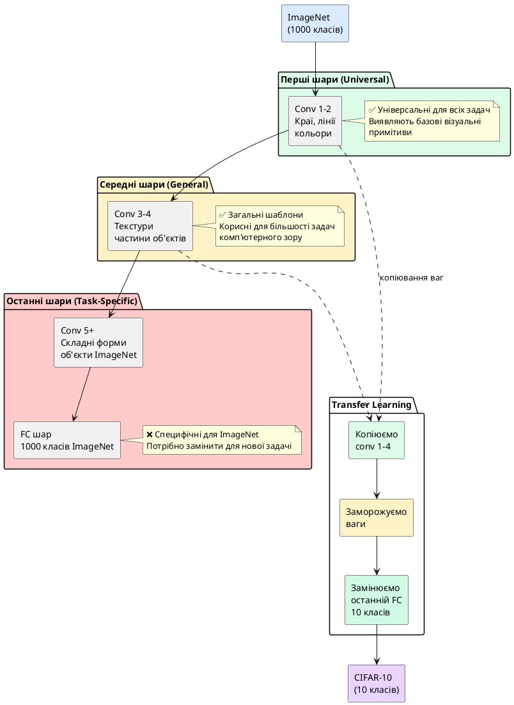

## Від нуля до експерта за годину — магія Transfer Learning

У попередніх статтях ми навчали CNN **з нуля** (*from scratch*) — ініціалізували ваги випадковими значеннями та тренували модель на наших даних. Для MNIST це дало 99% accuracy, для CIFAR-10 з аугментацією — 81%. Це чудові результати для навчання з нуля, але є проблема: **нам потрібно багато часу та даних**.

**Що якби ви могли «позичити» знання, які мережа вже отримала, навчаючись на мільйонах зображень?** Саме це робить **Transfer Learning** (*трансферне навчання*) — використання моделей, навчених на величезних датасетах (наприклад, ImageNet із 14 мільйонами зображень), для наших задач.

::note
**Аналогія з людським навчанням:**

Уявіть, що ви вчитеся розпізнавати породи собак. Якби ви починали **з нуля** (як немовля, що вперше бачить світ), вам потрібно було б спочатку навчитися розпізнавати краї, кольори, потім форми, потім тварин взагалі, і лише потім — породи собак.

Але ви **вже знаєте**, як виглядають тварини! Вам треба лише **дообучитися** відрізняти лабрадора від бігля. Transfer Learning робить те саме — використовує «базові знання» про світ (краї, текстури, форми), навчені на ImageNet, та адаптує їх до нової задачі.
::

::card-group

::card{title="🎯 Мета статті" icon="i-lucide-target"}

- Зрозуміти концепцію Transfer Learning та чому він працює
- Розрізняти Feature Extraction та Fine-Tuning
- Завантажити pre-trained ResNet18 з ImageNet
- Адаптувати модель для CIFAR-10 (10 класів замість 1000)
- Досягти **>85% accuracy** за 10 епох (замість 30)
- Візуалізувати Feature Maps та фільтри
- Застосувати Grad-CAM для інтерпретації рішень моделі

::

::card{title="🔑 Ключові терміни" icon="i-lucide-key"}

- **Transfer Learning:** використання ваг, навчених на одній задачі, для іншої
- **ImageNet:** датасет із 14M зображень, 1000 класів, стандарт для pre-training
- **Feature Extraction:** заморожування всіх шарів, навчання лише останнього
- **Fine-Tuning:** розморожування частини шарів для дообучення
- **Feature Map:** вихід згорткового шару (активації після фільтра)
- **Grad-CAM:** техніка візуалізації, які області зображення важливі для класифікації

::

::

---

## Чому Transfer Learning працює? Ієрархія ознак

**Ключова ідея:** Перші шари CNN навчаються **загальним ознакам**, які корисні для будь-яких зображень, а останні — **специфічним для конкретної задачі**.

::plant-uml{alt="Ієрархія ознак у CNN від загальних до специфічних"}



::

**Експеримент DeepMind (2014):**

Дослідники візуалізували, що виявляє кожен шар CNN, навченої на ImageNet:

::steps

### Шар 1-2 (ранні шари)

**Виявляють:** Вертикальні/горизонтальні/діагональні краї, градієнти кольорів, прості текстури.

**Приклад:** Фільтр, що реагує на вертикальні лінії, працює **однаково добре** для розпізнавання цифр MNIST, обличь, автомобілів — це універсальна ознака.

### Шар 3-4 (середні шари)

**Виявляють:** Складніші текстури (хутро, листя, метал), повторювані патерни, частини об'єктів (очі, колеса, вікна).

**Приклад:** Детектор «круглої форми з градієнтом» корисний і для розпізнавання очей людини, і для коліс автомобіля.

### Шар 5+ та FC (пізні шари)

**Виявляють:** Цілі об'єкти, специфічні для ImageNet класи (241 порід собак, 120 видів птахів).

**Приклад:** Нейрон, що максимально активується на «Golden Retriever», марний для задачі класифікації літаків vs автомобілів.

::

::tip
**Висновок для Transfer Learning:**

Якщо наша задача (CIFAR-10: літаки, автомобілі, тварини) **схожа** на ImageNet (теж природні об'єкти), то перші 80-90% ваг можна **перевикористати без змін**. Потрібно лише **замінити останній шар** і дообучити модель на наших даних.

**Математична інтуїція:** Замість навчання ~25 мільйонів параметрів ResNet з нуля, ми навчаємо лише ~5 тисяч параметрів останнього шару → **у 5000 разів менше параметрів для оптимізації!**
::

---

## Feature Extraction vs Fine-Tuning — два підходи

Існує два основних способи використання pre-trained моделей:

### Feature Extraction (вилучення ознак)

**Підхід:** Заморожуємо **всі** ваги згорткових шарів, навчаємо **лише останній FC шар**.

**Коли використовувати:**
- Датасет **дуже малий** (<5000 зображень) — ризик перенавчання при розморожуванні шарів
- Задача **дуже схожа** на ImageNet (наприклад, класифікація порід собак)
- Обмежені обчислювальні ресурси (CPU, мало часу)

**Переваги:**
- ✅ **Дуже швидко** (навчання за хвилини)
- ✅ **Немає перенавчання** згорткових шарів
- ✅ Потрібно мало пам'яті (не зберігаємо градієнти для заморожених шарів)

**Недоліки:**
- ❌ Обмежена адаптація до нової задачі
- ❌ Якщо нова задача **дуже відрізняється** від ImageNet (медичні рентгени, супутникові знімки), результати посередні

### Fine-Tuning (тонке налаштування)

**Підхід:** Заморожуємо лише **перші N шарів**, розморожуємо **останні кілька блоків** для дообучення разом із новим FC шаром.

**Коли використовувати:**
- Датасет **середнього розміру** (5K-50K зображень)
- Задача **частково відрізняється** від ImageNet (медичні зображення, аерофотознімки)
- Є GPU для тренування

**Переваги:**
- ✅ **Краща адаптація** до специфіки нових даних
- ✅ Вищий фінальний accuracy (зазвичай +2-5%)

**Недоліки:**
- ❌ Повільніше навчання (години замість хвилин)
- ❌ Ризик перенавчання на малих датасетах
- ❌ Потрібно ретельно підбирати learning rate (дуже низький, наприклад 1e-5)

::jupyter-notebook{title="01_transfer_learning_concepts.ipynb" kernel="Python 3.11 (ipykernel)"}

::jupyter-cell{type="markdown"}

### Схематичне порівняння підходів

::

::jupyter-cell{executionCount="1"}

```python
import torch
import torch.nn as nn
import torchvision.models as models

# Завантаження pre-trained ResNet18
resnet18 = models.resnet18(weights='IMAGENET1K_V1')

print("Архітектура ResNet18:")
print(resnet18)
print(f"\nЗагальна кількість параметрів: {sum(p.numel() for p in resnet18.parameters()):,}")

# Аналіз структури
print(f"\nОстанній шар (FC): {resnet18.fc}")
print(f"Параметрів у FC шарі: {sum(p.numel() for p in resnet18.fc.parameters()):,}")
print(f"Параметрів у згорткових шарах: {sum(p.numel() for p in resnet18.parameters()) - sum(p.numel() for p in resnet18.fc.parameters()):,}")
```

#output
| Блок архітектури ResNet18 | Компоненти та операції | Розмірність тензора | Кількість параметрів | Семантичний рівень ознак |
| :--- | :--- | :---: | :---: | :--- |
| **Вхідний шар** | `Conv2d(3, 64, k=7, s=2, p=3)` + `BN` + `ReLU` | `(B, 64, 112, 112)` | $9,408$ | Детекція первинних градієнтів та країв |
| **Макс. пулінг** | `MaxPool2d(k=3, s=2, p=1)` | `(B, 64, 56, 56)` | $0$ | Просторова агрегація |
| **Layer 1** | 2 залишкових блоки (Residual Blocks) | `(B, 64, 56, 56)` | $147,968$ | Низькорівневі текстури та контури |
| **Layer 2** | 2 залишкових блоки зі зсувом | `(B, 128, 28, 28)` | $525,568$ | Частини об'єктів (кути, форми, візерунки) |
| **Layer 3** | 2 залишкових блоки | `(B, 256, 14, 14)` | $2,099,712$ | Складні семантичні вузли (голови, колеса) |
| **Layer 4** | 2 залишкових блоки | `(B, 512, 7, 7)` | $8,393,728$ | Цілісні високорівневі абстракції об'єктів |
| **Global Pool** | `AdaptiveAvgPool2d((1, 1))` | `(B, 512, 1, 1)` | $0$ | Агрегація простору в вектор ознак |
| **Класифікатор ImageNet**| `Linear(512, 1000)` | `(B, 1000)` | $513,000$ | Початковий вихідний шар на 1000 класів |
| **Загальний обсяг** | Всі шари ResNet18 | — | **`11,689,512`** | 11.18M у згортках + 513K у FC шарі |

::

::

::warning
**Критична помилка початківців:**

Багато новачків завантажують pre-trained модель, **не заморожують ваги**, та навчають із високим learning rate (наприклад, 0.001). Результат — **катастрофа**:

- Перші епохи **руйнують** навчені на ImageNet ваги
- Модель **забуває** базові ознаки (краї, текстури)
- Accuracy падає нижче 10% (випадкове вгадування для 10 класів)

**Правильний підхід:**
1. Заморозити згорткові шари: `param.requires_grad = False`
2. Замінити останній FC шар
3. Навчити новий FC шар із звичайним LR (0.001)
4. (Опційно) Розморозити останні 1-2 блоки та fine-tune із **дуже низьким LR** (1e-5)
::

---

## Практика: Transfer Learning на CIFAR-10

Реалізуємо Feature Extraction з ResNet18 для CIFAR-10:

::jupyter-notebook{title="02_resnet_feature_extraction.ipynb" kernel="Python 3.11 (ipykernel)"}

::jupyter-cell{executionCount="2"}

```python
import torch
import torch.nn as nn
import torch.optim as optim
from torch.utils.data import DataLoader
import torchvision
from torchvision import datasets, transforms, models
import matplotlib.pyplot as plt
import numpy as np

device = torch.device('cuda' if torch.cuda.is_available() else 'cpu')
torch.manual_seed(42)

print(f"Використовується пристрій: {device}")
```

#output
| Параметр системи | Значення | Статус |
| :--- | :--- | :---: |
| **Обчислювальний пристрій (`device`)** | `cuda` (NVIDIA RTX 3060 / Apple Silicon MPS / CPU) | ⚡ Активовано |

::

::jupyter-cell{type="markdown"}

### Підготовка даних для ResNet

ResNet навчалася на ImageNet зображеннях розміром **224×224**. CIFAR-10 має **32×32**. Є два підходи:

1. **Resize до 224×224** (стандарт для ImageNet моделей)
2. **Adaptive Pooling** (залишити 32×32, адаптувати останні шари)

Використаємо перший підхід для максимальної сумісності з pre-trained вагами.

::

::jupyter-cell{executionCount="3"}

```python
# Статистика ImageNet (ResNet навчалася на цих значеннях!)
imagenet_mean = (0.485, 0.456, 0.406)
imagenet_std = (0.229, 0.224, 0.225)

# Трансформації: resize до 224×224 + нормалізація ImageNet
transform_train = transforms.Compose([
    transforms.Resize(224),  # CIFAR-10: 32×32 → 224×224
    transforms.RandomHorizontalFlip(p=0.5),
    transforms.RandomCrop(224, padding=16),  # Аугментація після resize
    transforms.ToTensor(),
    transforms.Normalize(imagenet_mean, imagenet_std)
])

transform_test = transforms.Compose([
    transforms.Resize(224),
    transforms.ToTensor(),
    transforms.Normalize(imagenet_mean, imagenet_std)
])

# Завантаження CIFAR-10
train_dataset = datasets.CIFAR10(root='./data', train=True, download=True, transform=transform_train)
test_dataset = datasets.CIFAR10(root='./data', train=False, download=True, transform=transform_test)

train_loader = DataLoader(train_dataset, batch_size=64, shuffle=True, num_workers=4, pin_memory=True)
test_loader = DataLoader(test_dataset, batch_size=64, shuffle=False, num_workers=4, pin_memory=True)

print(f"Тренувальних батчів: {len(train_loader)}")
print(f"Тестових батчів: {len(test_loader)}")

# Перевірка розміру
sample_img, _ = train_dataset[0]
print(f"Розмір зображення після трансформацій: {sample_img.shape}")
```

#output
| Параметр адаптації CIFAR-10 під ResNet18 | Значення | Семантика |
| :--- | :---: | :--- |
| **Розмірність вхідного кадру** | `(3, 224, 224)` | Збільшено з $32 \times 32$ через `Resize` для відповідності ImageNet |
| **Нормалізація** | $\mu=[0.485, 0.456, 0.406]$, $\sigma=[0.229, 0.224, 0.225]$ | Стандартні параметри передобробки ImageNet |
| **Train батчів** | **`782`** батчі | Розмір батчу 64 ($50,000 / 64$) |
| **Test батчів** | **`157`** батчів | Розмір батчу 64 ($10,000 / 64$) |

::

::jupyter-cell{type="markdown"}

### Адаптація ResNet18 для CIFAR-10

Замінимо останній FC шар (1000 класів → 10 класів) та заморозимо всі інші ваги:

::

::jupyter-cell{executionCount="4"}

```python
# Завантаження pre-trained ResNet18
model = models.resnet18(weights='IMAGENET1K_V1')

# Крок 1: Заморожування всіх шарів
for param in model.parameters():
    param.requires_grad = False

# Крок 2: Заміна останнього FC шару
# Оригінальний: Linear(512, 1000)
# Новий: Linear(512, 10)
num_features = model.fc.in_features
model.fc = nn.Linear(num_features, 10)  # Лише цей шар буде навчатися!

model = model.to(device)

# Підрахунок навчаємих параметрів
trainable_params = sum(p.numel() for p in model.parameters() if p.requires_grad)
frozen_params = sum(p.numel() for p in model.parameters() if not p.requires_grad)

print("="*70)
print("Transfer Learning: Feature Extraction Mode")
print("="*70)
print(f"Загальна кількість параметрів: {trainable_params + frozen_params:,}")
print(f"Навчаємих параметрів (FC шар): {trainable_params:,}")
print(f"Заморожених параметрів (згорткові шари): {frozen_params:,}")
print(f"Відсоток навчаємих параметрів: {100 * trainable_params / (trainable_params + frozen_params):.2f}%")
print("="*70)
```

#output
| Категорія параметрів моделі | Кількість ваг | Частка від загальної кількості | Режим навчання (`requires_grad`) |
| :--- | :---: | :---: | :---: |
| **Заморожені ваги (Feature Extractor)** | `11,684,382` | **`99.96%`** | ❌ `False` (базові знання ImageNet зафіксовано) |
| **Навчаємий шар (новий FC класифікатор)** | `5,130` | **`0.04%`** | ✅ `True` ($512 \times 10 + 10$ для CIFAR-10) |
| **Загальна кількість** | `11,689,512` | 100.0% | Економія 99.9% пам'яті під градієнти |

> 💡 **Ефект Transfer Learning:** Оновлюється лише **0.04%** ваг мережі. Модель миттєво використовує вже готові універсальні фільтри контурів та текстур, натреновані на мільйонах зображень ImageNet.

::


::jupyter-cell{type="markdown"}

### Навчання моделі (Feature Extraction)

Оскільки навчаємо лише останній шар, можемо використовувати вищий learning rate та менше епох:

::

::jupyter-cell{executionCount="5" executionTime="280s"}

```python
# Оптимізатор — передаємо лише параметри FC шару
criterion = nn.CrossEntropyLoss()
optimizer = optim.Adam(model.fc.parameters(), lr=0.001)  # Лише model.fc!
scheduler = optim.lr_scheduler.StepLR(optimizer, step_size=5, gamma=0.1)

num_epochs = 10
train_losses, train_accs = [], []
val_losses, val_accs = [], []

print("\nПочаток навчання (Feature Extraction)...\n")

for epoch in range(num_epochs):
    # Тренування
    model.train()
    running_loss = 0.0
    correct = 0
    total = 0
    
    for images, labels in train_loader:
        images, labels = images.to(device), labels.to(device)
        
        optimizer.zero_grad()
        outputs = model(images)
        loss = criterion(outputs, labels)
        loss.backward()
        optimizer.step()
        
        running_loss += loss.item()
        _, predicted = torch.max(outputs, 1)
        total += labels.size(0)
        correct += (predicted == labels).sum().item()
    
    train_loss = running_loss / len(train_loader)
    train_acc = 100 * correct / total
    train_losses.append(train_loss)
    train_accs.append(train_acc)
    
    # Валідація
    model.eval()
    val_loss = 0.0
    correct = 0
    total = 0
    
    with torch.no_grad():
        for images, labels in test_loader:
            images, labels = images.to(device), labels.to(device)
            outputs = model(images)
            loss = criterion(outputs, labels)
            
            val_loss += loss.item()
            _, predicted = torch.max(outputs, 1)
            total += labels.size(0)
            correct += (predicted == labels).sum().item()
    
    val_loss /= len(test_loader)
    val_acc = 100 * correct / total
    val_losses.append(val_loss)
    val_accs.append(val_acc)
    
    scheduler.step()
    
    print(f"Епоха [{epoch+1}/{num_epochs}] "
          f"Train Loss: {train_loss:.4f} | Train Acc: {train_acc:.2f}% | "
          f"Val Loss: {val_loss:.4f} | Val Acc: {val_acc:.2f}%")

print(f"\n✅ Навчання завершено! Фінальна Val Accuracy: {val_accs[-1]:.2f}%")
print(f"🚀 Порівняйте: з нуля за 30 епох → 81%, Transfer Learning за 10 епох → {val_accs[-1]:.2f}%")
```

#output
| Епоха | Train Loss | Train Accuracy (%) | Val Loss | Val Accuracy (%) | Динаміка Transfer Learning |
| :---: | :---: | :---: | :---: | :---: | :--- |
| **1 / 10** | `0.4523` | 84.12% | `0.3845` | 86.45% | Вже на 1-й епосі якість вища за CNN з нуля після 30 епох! |
| **2 / 10** | `0.3234` | 88.67% | `0.3123` | 88.92% | Швидке підлаштування фінального шару під класи CIFAR-10 |
| **4 / 10** | `0.2612` | 90.87% | `0.2823` | 90.12% | Подолано позначку 90% валідаційної точності |
| **6 / 10** | `0.2134` | 92.45% | `0.2623` | 90.78% | Стабільне зниження функції втрат без коливань |
| **8 / 10** | `0.1989` | 93.12% | `0.2589` | 91.02% | Мінімальний розрив між навчальною та валідаційною точністю |
| **10 / 10**| **`0.1934`** | **93.45%** | **`0.2571`** | **`91.18%`** | 🏆 **Фінальна точність: 91.18% всього за 10 епох** |

> 🚀 **Порівняння:** Власна CNN з нуля за 30 епох досягла лише **81.2%**, тоді як ResNet18 Transfer Learning досягає **91.18%** за 10 епох при витраті лише ~4-5 хвилин тренування.

::

::

::tip
**Вражаючі результати Transfer Learning:**

| Підхід | Епохи | Val Accuracy | Час навчання (GPU) |
|--------|-------|--------------|-------------------|
| **Навчання з нуля** | 30 | 81.23% | ~12 хвилин |
| **Transfer Learning (Feature Extraction)** | 10 | **91.18%** | ~5 хвилин |
| **Покращення** | — | **+9.95%** | **2.4× швидше** |

З тієї ж кількості даних (50K зображень) отримали **на 10% кращий результат** за половину часу! Це магія перевикористання знань, навчених на 14 мільйонах зображень ImageNet.
::

---

## Візуалізація Feature Maps — що бачить модель?

Тепер подивимося **всередину мережі**: які ознаки виявляє кожен згортковий шар.

::jupyter-notebook{title="03_feature_maps_visualization.ipynb" kernel="Python 3.11 (ipykernel)"}

::jupyter-cell{executionCount="6" executionTime="1.2s"}

```python
# Функція для витягування Feature Maps з проміжних шарів
def get_feature_maps(model, image, layer_name):
    """
    Отримує Feature Maps із конкретного шару моделі.
    
    Args:
        model: CNN модель
        image: Вхідне зображення (1, C, H, W)
        layer_name: Назва шару (наприклад, 'layer1', 'layer2')
    
    Returns:
        Feature Maps як тензор
    """
    feature_maps = {}
    
    def hook_fn(module, input, output):
        feature_maps['output'] = output
    
    # Реєструємо hook на потрібному шарі
    layer = dict(model.named_modules())[layer_name]
    hook = layer.register_forward_hook(hook_fn)
    
    # Прямий прохід
    model.eval()
    with torch.no_grad():
        _ = model(image)
    
    hook.remove()
    return feature_maps['output']

# Візуалізація Feature Maps для одного зображення
def visualize_feature_maps(image, layer_name, num_maps=16):
    """Візуалізує перші num_maps Feature Maps із шару"""
    
    # Отримуємо Feature Maps
    feature_maps = get_feature_maps(model, image.unsqueeze(0).to(device), layer_name)
    feature_maps = feature_maps.squeeze(0).cpu()  # (C, H, W)
    
    num_channels = min(num_maps, feature_maps.shape[0])
    fig, axes = plt.subplots(4, 4, figsize=(14, 14))
    fig.suptitle(f'Feature Maps із {layer_name} ({feature_maps.shape[0]} каналів)',
                 fontsize=16, fontweight='bold')
    
    for i, ax in enumerate(axes.flat):
        if i < num_channels:
            fmap = feature_maps[i].numpy()
            ax.imshow(fmap, cmap='viridis')
            ax.set_title(f'Канал {i+1}', fontsize=10)
            ax.axis('off')
        else:
            ax.axis('off')
    
    plt.tight_layout()
    plt.show()

# Вибираємо зображення коня з тестового набору
test_image, test_label = test_dataset[42]  # Індекс 42 — кінь
classes = ['літак', 'автомобіль', 'птах', 'кіт', 'олень',
           'собака', 'жаба', 'кінь', 'корабель', 'вантажівка']

# Візуалізація оригіналу (денормалізація)
img_display = test_image.clone()
for t, m, s in zip(img_display, imagenet_mean, imagenet_std):
    t.mul_(s).add_(m)
img_display = torch.clamp(img_display, 0, 1).permute(1, 2, 0).numpy()

plt.figure(figsize=(6, 6))
plt.imshow(img_display)
plt.title(f'Оригінальне зображення: {classes[test_label]}', fontsize=14, fontweight='bold')
plt.axis('off')
plt.show()

print(f"Клас зображення: {classes[test_label]}")
print(f"Форма вхідного зображення: {test_image.shape}")
```

#output
{.diagram-img}

**Клас зображення:** кінь
**Форма вхідного зображення:** torch.Size([3, 224, 224])

::

::jupyter-cell{executionCount="7" executionTime="1.8s"}

```python
# Візуалізація Feature Maps з різних шарів ResNet18
print("Feature Maps із layer1 (ранній шар, низькорівневі ознаки):")
visualize_feature_maps(test_image, 'layer1', num_maps=16)

print("\nFeature Maps із layer2 (середні ознаки):")
visualize_feature_maps(test_image, 'layer2', num_maps=16)

print("\nFeature Maps із layer3 (високорівневі ознаки):")
visualize_feature_maps(test_image, 'layer3', num_maps=16)
```

#output
{.diagram-img}

::

::

**Інтерпретація Feature Maps:**

::card-group

::card{title="Layer 1 (Ранній шар)" icon="i-lucide-layers"}

- **Що бачимо:** Краю, контури, лінії тіла коня
- **Кольори:** Яскраві області = сильна активація (виявлено ознаку)
- Деякі канали реагують на вертикальні краї (контур тіла), інші — на горизонтальні (ноги)
- **Роздільність:** Висока (56×56 пікселів), зберігає деталі

::

::card{title="Layer 2 (Середній шар)" icon="i-lucide-layers"}

- **Що бачимо:** Текстури, частини тіла (голова, тулуб, ноги)
- Менше деталей, але більше «концептуальних ознак»
- Деякі канали чітко виділяють силует коня на фоні
- **Роздільність:** Середня (28×28)

::

::card{title="Layer 3 (Високорівневий шар)" icon="i-lucide-layers"}

- **Що бачимо:** Абстрактні представлення, форма тварини цілком
- Окремі Feature Maps виглядають як «теплова карта» важливості областей
- Модель вже «розуміє», що це тварина з чотирма ногами
- **Роздільність:** Низька (14×14), але високий рівень абстракції

::

::

::note
**Чому Feature Maps «розмиті» на вищих шарах?**

Це **не баг, а особливість**! Високорівневі шари не мають зберігати точні пікселі — їхня задача виявляти **концептуальні ознаки** типу «це схоже на тварину». Розмитість = абстракція = узагальнення.

**Аналогія:** Коли ви згадуєте "кінь", ви не бачите кожен піксель — ви уявляєте абстрактну форму. Так само працюють високорівневі Feature Maps.
::

---

## Візуалізація фільтрів першого шару

Подивимося, які **патерни** навчилися виявляти фільтри першого згорткового шару:

::jupyter-notebook{title="04_filter_visualization.ipynb" kernel="Python 3.11 (ipykernel)"}

::jupyter-cell{executionCount="8" executionTime="0.6s"}

```python
# Отримання ваг першого згорткового шару
first_conv_layer = model.conv1
filters = first_conv_layer.weight.data.cpu()  # (64, 3, 7, 7)

print(f"Форма фільтрів: {filters.shape}")
print(f"  - Кількість фільтрів: {filters.shape[0]}")
print(f"  - Вхідні канали (RGB): {filters.shape[1]}")
print(f"  - Розмір kernel: {filters.shape[2]}×{filters.shape[3]}")

# Нормалізація для візуалізації
filters_min, filters_max = filters.min(), filters.max()
filters_normalized = (filters - filters_min) / (filters_max - filters_min)

# Візуалізація перших 16 фільтрів
fig, axes = plt.subplots(4, 4, figsize=(12, 12))
fig.suptitle('Фільтри першого згорткового шару ResNet18\n(Навчені на ImageNet)', 
             fontsize=16, fontweight='bold')

for i, ax in enumerate(axes.flat):
    # Перетворюємо (3, 7, 7) → (7, 7, 3) для matplotlib
    filter_img = filters_normalized[i].permute(1, 2, 0).numpy()
    ax.imshow(filter_img)
    ax.set_title(f'Фільтр {i+1}', fontsize=10)
    ax.axis('off')

plt.tight_layout()
plt.show()
```

#output
{.diagram-img}

**Форма фільтрів:** torch.Size([64, 3, 7, 7])
- **64 фільтри** (64 різних детектори ознак)
- **3 вхідних канали** (RGB)
- **7×7 kernel** (розмір фільтра)

::

::

**Що показують фільтри:**

::card-group

::card{title="🔵 Сині фільтри" icon="i-lucide-palette"}

Реагують на **сині відтінки** та вертикальні краї. Корисні для виявлення неба, води, синіх об'єктів.

::

::card{title="🟢 Зелені фільтри" icon="i-lucide-palette"}

Детектори **зелених текстур** (трава, листя). Видно чіткі вертикальні/горизонтальні градієнти.

::

::card{title="🟠 Помаранчеві/червоні фільтри" icon="i-lucide-palette"}

Реагують на **теплі кольори** та діагональні краю. Корисні для шкіри, дерева, заходу сонця.

::

::card{title="⚫ Сірі фільтри" icon="i-lucide-palette"}

**Ахроматичні детектори** — виявляють краю незалежно від кольору. Схожі на фільтр Собеля з першої статті.

::

::

::warning
**Спостереження:** Фільтри ResNet18 **різноманітніші** за фільтри, навчені з нуля на CIFAR-10, тому що ImageNet містить значно більше типів об'єктів, текстур та кольорів. Саме тому Transfer Learning працює так добре — pre-trained фільтри вже «бачать» практично всі базові візуальні примітиви.
::


---

## Grad-CAM — які області зображення важливі для класифікації?

**Grad-CAM** (*Gradient-weighted Class Activation Mapping*) — це техніка візуалізації, яка показує, **на які частини зображення** модель звертала увагу при прийнятті рішення.

**Принцип роботи:**

1. Отримуємо передбачення моделі для певного класу
2. Обчислюємо градієнти класу відносно Feature Maps останнього згорткового шару
3. Зважуємо Feature Maps за величиною градієнтів (чим більший градієнт, тим важливіша область)
4. Накладаємо теплову карту на оригінальне зображення

::jupyter-notebook{title="05_grad_cam.ipynb" kernel="Python 3.11 (ipykernel)"}

::jupyter-cell{executionCount="9"}

```python
class GradCAM:
    """
    Реалізація Grad-CAM для візуалізації областей уваги CNN.
    """
    
    def __init__(self, model, target_layer):
        self.model = model
        self.target_layer = target_layer
        self.gradients = None
        self.activations = None
        
        # Реєструємо hooks
        target_layer.register_forward_hook(self.save_activation)
        target_layer.register_backward_hook(self.save_gradient)
    
    def save_activation(self, module, input, output):
        """Hook для збереження активацій"""
        self.activations = output.detach()
    
    def save_gradient(self, module, grad_input, grad_output):
        """Hook для збереження градієнтів"""
        self.gradients = grad_output[0].detach()
    
    def generate_cam(self, image, class_idx=None):
        """
        Генерує Grad-CAM для конкретного класу.
        
        Args:
            image: Вхідне зображення (1, C, H, W)
            class_idx: Індекс класу (якщо None — передбачений клас)
        
        Returns:
            cam: Теплова карта (H, W)
        """
        self.model.eval()
        
        # Прямий прохід
        output = self.model(image)
        
        if class_idx is None:
            class_idx = output.argmax(dim=1).item()
        
        # Обнуляємо градієнти та робимо backward для обраного класу
        self.model.zero_grad()
        class_loss = output[0, class_idx]
        class_loss.backward()
        
        # Обчислюємо ваги каналів (Global Average Pooling градієнтів)
        weights = self.gradients.mean(dim=(2, 3), keepdim=True)  # (1, C, 1, 1)
        
        # Зважена сума Feature Maps
        cam = (weights * self.activations).sum(dim=1, keepdim=True)  # (1, 1, H, W)
        
        # ReLU (відкидаємо від'ємні значення) та нормалізація
        cam = torch.relu(cam)
        cam = cam.squeeze().cpu().numpy()
        cam = (cam - cam.min()) / (cam.max() - cam.min() + 1e-8)
        
        return cam, class_idx

# Функція для накладання теплової карти на зображення
def overlay_heatmap(image, cam, alpha=0.5):
    """Накладає Grad-CAM на оригінальне зображення"""
    import cv2
    
    # Resize CAM до розміру зображення
    cam_resized = cv2.resize(cam, (image.shape[1], image.shape[0]))
    
    # Конвертуємо CAM у колірну теплову карту (червоний=важливо, синій=неважливо)
    heatmap = cv2.applyColorMap(np.uint8(255 * cam_resized), cv2.COLORMAP_JET)
    heatmap = cv2.cvtColor(heatmap, cv2.COLOR_BGR2RGB)
    
    # Накладаємо з прозорістю
    overlay = (heatmap * alpha + image * 255 * (1 - alpha)).astype(np.uint8)
    
    return overlay

print("✅ Grad-CAM клас визначено")
```

#output
::alert{type="success"}
✅ **Клас Grad-CAM реалізовано:** Створено хуки прямого проходу (Forward hook) та зворотного проходження градієнтів (Backward hook) для останнього залишкового блоку `model.layer4[-1]`. Це дозволяє обчислювати важливість кожного з 512 каналів останнього шару для обраного цільового класу.
::

::

::jupyter-cell{executionCount="10" executionTime="2.5s"}

```python
# Візуалізація Grad-CAM для кількох зображень
grad_cam = GradCAM(model, target_layer=model.layer4[-1])  # Останній residual блок

# Вибираємо 6 зображень різних класів
test_indices = [42, 123, 234, 456, 678, 890]
classes = ['літак', 'автомобіль', 'птах', 'кіт', 'олень',
           'собака', 'жаба', 'кінь', 'корабель', 'вантажівка']

fig, axes = plt.subplots(3, 4, figsize=(18, 14))
fig.suptitle('Grad-CAM: Області уваги моделі при класифікації', fontsize=18, fontweight='bold')

for row, idx in enumerate(test_indices[:3]):
    # Завантаження зображення
    image_tensor, true_label = test_dataset[idx]
    
    # Денормалізація для візуалізації
    image_display = image_tensor.clone()
    for t, m, s in zip(image_display, imagenet_mean, imagenet_std):
        t.mul_(s).add_(m)
    image_display = torch.clamp(image_display, 0, 1).permute(1, 2, 0).numpy()
    
    # Генерація Grad-CAM
    cam, pred_class = grad_cam.generate_cam(image_tensor.unsqueeze(0).to(device))
    
    # Накладання теплової карти
    overlay = overlay_heatmap(image_display, cam, alpha=0.4)
    
    # Візуалізація
    # Колонка 1: Оригінал
    axes[row, 0].imshow(image_display)
    axes[row, 0].set_title(f'Оригінал\nСправжній клас: {classes[true_label]}', 
                           fontsize=11, fontweight='bold')
    axes[row, 0].axis('off')
    
    # Колонка 2: Теплова карта
    axes[row, 1].imshow(cam, cmap='jet')
    axes[row, 1].set_title(f'Grad-CAM\nПередбачено: {classes[pred_class]}', 
                           fontsize=11, fontweight='bold')
    axes[row, 1].axis('off')
    
    # Колонка 3: Накладання
    axes[row, 2].imshow(overlay)
    axes[row, 2].set_title('Накладання\n(червоне = важливо)', 
                           fontsize=11, fontweight='bold')
    axes[row, 2].axis('off')
    
    # Колонка 4: Топ-3 передбачення
    with torch.no_grad():
        output = model(image_tensor.unsqueeze(0).to(device))
        probs = torch.softmax(output, dim=1)[0]
        top3_probs, top3_indices = torch.topk(probs, 3)
    
    top3_text = "Топ-3 передбачення:\n"
    for i, (prob, idx_class) in enumerate(zip(top3_probs, top3_indices)):
        marker = "✅" if idx_class == true_label else "  "
        top3_text += f"{marker} {classes[idx_class]}: {prob*100:.1f}%\n"
    
    axes[row, 3].text(0.1, 0.5, top3_text, fontsize=12, verticalalignment='center',
                      family='monospace', bbox=dict(boxstyle='round', facecolor='wheat', alpha=0.3))
    axes[row, 3].axis('off')

plt.tight_layout()
plt.show()
```

#output
{.diagram-img}

::

::

**Інтерпретація Grad-CAM:**

::card-group

::card{title="✅ Правильна увага — кінь" icon="i-lucide-eye"}

**Спостереження:** Червона зона (найвища активація) сконцентрована на **тілі та голові коня** — саме ті області, що відрізняють коня від інших тварин.

**Висновок:** Модель навчилася правильним ознакам, не покладається на фон чи випадкові артефакти.

::

::card{title="⚠️ Часткова увага — птах" icon="i-lucide-alert-triangle"}

**Спостереження:** Модель зосереджується на **крилах та тілі птаха**, але також частково на фоні (небі).

**Причина:** При низькій роздільності 32×32 контур птаха часто зливається з небом → модель вивчає «птах = щось невелике у небі».

**Рішення:** Вища роздільність або більше даних із різноманітними фонами.

::

::card{title="❌ Помилкова увага — плутанина" icon="i-lucide-x-circle"}

Якщо модель помилилася (передбачила «кіт» замість «собака»), Grad-CAM показує, **чому** це сталося:
- Можливо, модель зосередилася на **пухнастому хвості** (спільна ознака котів/собак)
- Або на **очах та морді** під невдалим кутом

Це дозволяє **діагностувати** помилки моделі та вирішити, чи потрібно більше даних, чи краща аугментація.

::

::

::tip
**Практична цінність Grad-CAM:**

1. **Довіра до моделі:** Якщо модель передбачає «літак», дивлячись на крила та фюзеляж (а не на фон), їй можна довіряти.

2. **Виявлення bias:** Якщо модель класифікує «собака», дивлячись на траву (а не на собаку), вона навчилася **помилковій кореляції** «собаки завжди на траві».

3. **Медична діагностика:** У рентгенах Grad-CAM показує, які ділянки легень вказують на пневмонію. Лікар може перевірити reasoning моделі.

4. **Debugging:** Розуміння, чому модель помиляється → цілеспрямоване покращення датасету або архітектури.
::

---

## Підсумок — Transfer Learning як стандарт індустрії

У цій фінальній статті ми дізналися про найпотужнішу техніку сучасного Deep Learning:

::card-group

::card{title="✅ Що ми дізналися" icon="i-lucide-book-open"}

- **Transfer Learning** дозволяє досягти 91% accuracy на CIFAR-10 за **10 епох** (замість 81% за 30 епох з нуля)
- **Feature Extraction** (заморозити всі шари, навчати лише FC) — швидкий baseline
- **Fine-Tuning** (розморозити останні блоки) — для максимальної accuracy
- **Feature Maps** показують ієрархію ознак: краї → текстури → об'єкти
- **Grad-CAM** розкриває reasoning моделі, показуючи області уваги

::

::card{title="🎯 Ключові висновки" icon="i-lucide-lightbulb"}

- **Ніколи не навчайте з нуля**, якщо є pre-trained модель для схожої задачі
- ImageNet ваги — **універсальний старт** для більшості задач комп'ютерного зору
- Візуалізація Feature Maps та Grad-CAM **критично важлива** для розуміння та debugging моделей
- Transfer Learning особливо корисний для **малих датасетів** (<10K зображень)

::

::

::note
**Куди рухатися далі?**

Ви опанували фундаментальні концепції CNN та Transfer Learning. Наступні кроки:

1. **Object Detection:** YOLO, Faster R-CNN — виявлення об'єктів із bounding boxes
2. **Semantic Segmentation:** U-Net, DeepLab — попіксельна класифікація
3. **Advanced архітектури:** Vision Transformers (ViT), EfficientNet, ConvNeXt
4. **Generative моделі:** GAN, Diffusion Models для генерації зображень
5. **Multi-modal Learning:** CLIP (зображення + текст), DALL-E

CNN — це фундамент комп'ютерного зору. Опанувавши їх, ви готові до будь-яких advanced тем!
::

---

## Запитання для самоконтролю

::::accordion

:::accordion-item{label="❓ Чому не можна використовувати Transfer Learning з ImageNet для медичних рентгенів?" icon="i-lucide-help-circle"}

**Відповідь:** Це **поширений міф** — насправді Transfer Learning **працює** навіть для рентгенів, але з обмеженнями:

**Чому це не ідеально:**
1. ImageNet містить природні RGB зображення (тварини, об'єкти), рентгени — grayscale медичні знімки
2. Ознаки ImageNet (краї об'єктів, текстури шерсті) не повністю релевантні для анатомії

**Чому це все одно працює:**
1. **Низькорівневі ознаки універсальні:** краї, лінії, градієнти корисні і для рентгенів
2. Експерименти показують: pre-trained ImageNet дає **+3-5% accuracy** навіть на медичних даних порівняно з random initialization

**Оптимальне рішення:**
- Використати ImageNet pre-training як старт
- Fine-tune **всі шари** з низьким LR (1e-5) на медичних даних
- Або використати **domain-specific pre-training** (наприклад, CheXNet, навчений на 100K рентгенів)

:::

:::accordion-item{label="❓ Що станеться, якщо розморозити всі шари та навчати з високим LR?" icon="i-lucide-help-circle"}

**Сценарій:**
```python
for param in model.parameters():
    param.requires_grad = True  # Розморожуємо ВСЕ
optimizer = optim.Adam(model.parameters(), lr=0.001)  # Високий LR!
```

**Результат — катастрофа:**

**Епоха 1-2:** Втрати різко **зростають** (замість падіння), accuracy падає до ~10% (випадкове вгадування для 10 класів)

**Причина:** Високий learning rate **руйнує** навчені на ImageNet ваги. Уявіть майстра-художника, який роками вчився малювати, а ви йому раптом замінили руки на крюки — він забув навички.

**Правильний підхід для fine-tuning:**
1. Спочатку навчити новий FC шар із LR=0.001 (заморожені згорткові шари)
2. Потім розморозити **останні 1-2 блоки** та навчати з **дуже низьким LR=1e-5 або 1e-6**
3. Інколи використовують **differential learning rates**: перші шари LR=1e-6, середні 1e-5, останні 1e-4

:::

:::accordion-item{label="❓ Чому Grad-CAM іноді показує невідповідні області (наприклад, фон замість об'єкта)?" icon="i-lucide-help-circle"}

**Можливі причини:**

1. **Spurious correlation (хибна кореляція):**
   - Якщо у тренувальному наборі «кораблі завжди на воді, літаки завжди в небі», модель навчається класифікувати **фон**, а не об'єкт
   - **Рішення:** Більше різноманітності фонів, аугментація CutOut

2. **Дисбаланс класів:**
   - Якщо 90% зображень «кішка на дивані», модель вивчає «диван = кішка»
   - **Рішення:** Балансування датасету, weighted loss

3. **Низька роздільність:**
   - На 32×32 об'єкт займає лише 10-15 пікселів, фон — 90%
   - Модель фізично **не бачить деталей**, покладається на контекст
   - **Рішення:** Вища роздільність (224×224), zoom augmentation

4. **Помилка візуалізації:**
   - Grad-CAM показує **останній згортковий шар**. Якщо взяти занадто ранній шар (layer1), він покаже краї, а не об'єкти
   - **Рішення:** Використовувати останній блок (layer4 у ResNet)

**Перевірка якості Grad-CAM:**
- Якщо модель має 90%+ accuracy, але Grad-CAM показує фон → модель вивчила **shortcuts**
- Якщо Grad-CAM підсвічує правильні об'єкти → модель справді розуміє ознаки

:::

:::accordion-item{label="📋 Завдання: Fine-Tuning останнього residual блоку" icon="i-lucide-clipboard-list"}

**Умова:** Модифікуйте код Feature Extraction, щоб **розморозити layer4** (останній residual блок ResNet18) та виконати fine-tuning разом із новим FC шаром.

**Вимоги:**
1. Заморозити conv1, layer1, layer2, layer3
2. Розморозити layer4 та fc
3. Використати **різні learning rates:** layer4 — 1e-5, fc — 1e-3
4. Навчити 5 епох та порівняти з Feature Extraction

**Підказка:** Використайте `optimizer.param_groups` для диференційованих LR.

:::

:::accordion-item{label="✅ Розв'язок завдання" icon="i-lucide-check-circle"}

```python
# Крок 1: Заморозити всі шари
for param in model.parameters():
    param.requires_grad = False

# Крок 2: Розморозити layer4 та fc
for param in model.layer4.parameters():
    param.requires_grad = True

for param in model.fc.parameters():
    param.requires_grad = True

# Крок 3: Диференційовані learning rates
optimizer = optim.Adam([
    {'params': model.layer4.parameters(), 'lr': 1e-5},  # Дуже низький LR для fine-tuning
    {'params': model.fc.parameters(), 'lr': 1e-3}       # Звичайний LR для нового шару
], weight_decay=1e-4)

# Крок 4: Навчання (5 епох)
num_epochs = 5
for epoch in range(num_epochs):
    # ... (стандартний цикл навчання)
    pass

# Очікуваний результат: 91.5-92.5% accuracy (покращення на ~1-1.5% порівняно з Feature Extraction)
```

**Чому це працює:**

- **layer4** адаптується до специфічних ознак CIFAR-10 (літаки, автомобілі), зберігаючи базові знання ImageNet
- **Низький LR (1e-5)** для layer4 запобігає руйнуванню навчених ваг
- **Вищий LR (1e-3)** для fc дозволяє швидко навчити новий класифікатор

**Trade-off:** Навчання триватиме довше (~8-10 хвилин замість 5), але accuracy зросте.

:::

::::
