# Архітектура клієнт-серверних систем та основи Go

::card-group

::card{title="🎯 Навчальні цілі" icon="i-lucide-graduation-cap"}

- Опанувати принципи розділення відповідальності у клієнт-серверній моделі та еволюцію від 2-Tier до N-Tier систем.
- Зрозуміти виклики гетерогенності клієнтських платформ (Desktop, Mobile, Web, CLI) та проєктування уніфікованих контрактів API.
- Дослідити стек протоколів TCP/IP, механізм інкапсуляції даних та анатомію сокетного дескриптора.
- Проаналізувати архітектурні переваги мови Go (Golang) для побудови мережевих сервісів у порівнянні з класичними платформами (JVM, CLR).

::

::card{title="🛠️ Технологічний стек" icon="i-lucide-cpu"}

- **Мова програмування:** Go (Golang) 1.22+
- **Мережеві протоколи:** TCP, UDP, IP, HTTP/1.1, HTTP/2
- **Інструментарій:** Go CLI (`go build`, `go mod`, `go vet`), Docker, Wireshark

::

::

---

## Архітектурний контекст та еволюція клієнт-серверних систем

### Проблема локальних монолітів минулого

На ранніх етапах розвитку обчислювальної техніки та комерційного програмного забезпечення домінуючим підходом було створення автономних локальних застосунків (_standalone applications_). У такій парадигмі графічний інтерфейс користувача (_User Interface, UI_), бізнес-правила обробки інформації (_Business Logic_) та файлове сховище даних знаходилися в межах одного виконуваного процесу, запущеного на конкретному персональному комп'ютері.

Подібний підхід створював непереборні інженерні обмеження для розподілених організацій та корпоративних систем:

1. **Відсутність єдиного джерела істини (_Single Source of Truth_):** Якщо кілька працівників одночасно модифікували локальні копії бази даних на різних машинах, виникав нерозв'язний конфлікт синхронізації та порушення цілісності даних.
2. **Неможливість централізованого оновлення:** Будь-яка зміна алгоритму (наприклад, формули нарахування податків або схеми знижок) вимагала фізичного оновлення файлів програми на кожному робочому комп'ютері підприємства.
3. **Критичні ризики безпеки:** Прямий доступ користувацького застосунку до фізичних файлів сховища дозволяв зловмиснику скопіювати або відредагувати конфіденційні записи в обхід будь-якої авторизації.

Вирішенням цієї кризи стала **клієнт-серверна архітектура** (_client-server architecture_) — розподілена обчислювальна модель, у якій функціональні обов'язки чітко розмежовуються між постачальниками обчислювальних ресурсів або послуг (**серверами**) та споживачами цих послуг (**клієнтами**).

::note
**Аналогія з реального світу:** Уявіть сучасний комерційний банк. Клієнт не заходить безпосередньо до грошового сховища, щоб узяти готівку. Натомість він взаємодіє з касиром через стандартизоване віконце (API-інтерфейс), передаючи заповнений платіжний документ (запит). Касир (сервер) перевіряє особу клієнта (автентифікація), перевіряє залишок коштів на балансі (бізнес-логіка) і лише після цього звертається до внутрішнього сейфа (база даних), видаючи клієнту кошти (відповідь).
::

---

### Багаторівневі моделі: від 2-Tier до N-Tier

Еволюція клієнт-серверної парадигми супроводжувалася поступовим винесенням окремих зон відповідальності на спеціалізовані архітектурні рівні (_tiers_).

{.diagram-img}

::plant-uml{alt="Еволюція клієнт-серверних архітектур: 2-Tier, 3-Tier та N-Tier"}

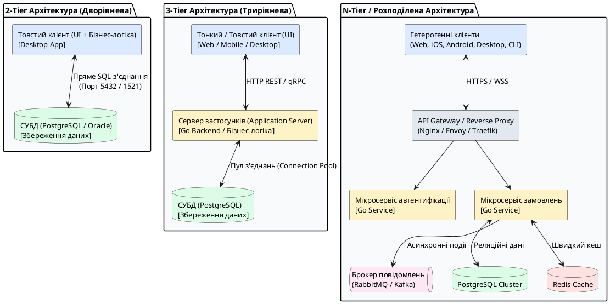

::

Розглянемо фундаментальні характеристики кожної архітектурної моделі:

::field-group

::field{name="2-Tier (Дворівнева архітектура)" type="Архітектурна модель"}
Клієнтський застосунок підключається безпосередньо до сервера бази даних через драйвер СУБД. Вся бізнес-логіка зосереджена або на клієнті, або всередині збережених процедур (_stored procedures_) у БД.

- **Переваги:** Висока швидкість початкової розробки для замкнених локальних мереж підприємства.
- **Недоліки:** Прямий витік облікових даних бази даних на клієнтські комп'ютери; катастрофічне вичерпання пулу з'єднань БД при збільшенні кількості користувачів (база даних не розрахована на утримання сотень тисяч одночасних відкритих сокетів).

::

::field{name="3-Tier (Трирівнева архітектура)" type="Архітектурна модель"}
Між клієнтом та базою даних з'являється проміжний шар — **сервер застосунків** (_Application Server_). Клієнт звертається до сервера за стандартизованим мережевим протоколом (HTTP/REST, gRPC, WebSocket), а сервер самостійно керує підключеннями до бази даних через внутрішній пул з'єднань (_connection pool_).

- **Переваги:** Безпека (клієнт не володіє реквізитами доступу до БД), централізована валідація, можливість масштабування обчислень окремо від збереження даних.
- **Недоліки:** Додаткова затримка (_network latency_) на передачу даних між рівнями.

::

::field{name="N-Tier та мікросервіси" type="Архітектурна модель"}
Подальша декомпозиція трирівневої моделі. Замість одного монолітного бекенду функціонують десятки незалежних сервісів, об'єднаних єдиним шлюзом (_API Gateway_), кешуванням у пам'яті (_Redis_), чергами асинхронних подій (_RabbitMQ_) та розподіленими сховищами даних.

- **Переваги:** Незалежне горизонтальне масштабування окремих компонентів системи, висока відмовостійкість (_fault tolerance_).
- **Недоліки:** Висока складність оркестрації, необхідність реалізації механізмів розподіленого трасування (_distributed tracing_) та моніторингу.

::

---

## Гетерогенність клієнтських платформ

Сучасний бекенд-інженер ніколи не проєктує сервер виключно для одного браузера. Сервер є центральним хабом інфраструктури, до якого одночасно підключаються принципово різні за своєю природою клієнти. Здатність сервера коректно та продуктивно взаємодіяти з різними платформами називається **інтероперабельністю** (_interoperability_).

{.diagram-img}

::plant-uml{alt="Гетерогенність клієнтських платформ"}

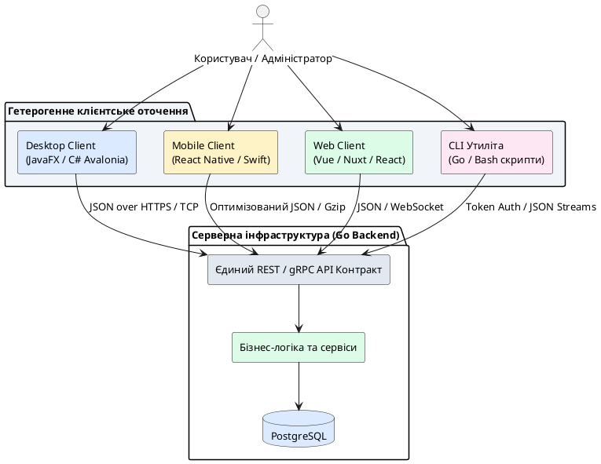

::

### Тонкі vs Товсті клієнти

::card-group

::card{title="Тонкий клієнт (Thin Client)" icon="i-lucide-monitor"}

Клієнтський модуль із мінімальною обчислювальною логікою. Його завдання — надіслати введені дані на сервер, отримати готовий результат і відрендерити графічний інтерфейс.

- **Типовий представник:** Вебзастосунок у браузері (HTML/CSS/JS).
- **Плюси:** Миттєва доставка оновлень усім користувачам, нульові вимоги до обчислювальної потужності пристрою.
- **Мінуси:** Повна непрацездатність за відсутності стабільного мережевого з'єднання.

::

::card{title="Товстий / Розумний клієнт (Rich / Thick Client)" icon="i-lucide-smartphone"}

Клієнтський застосунок, що виконує значну частину обробки локально (валідація, локальне кешування у SQLite, робота з апаратними датчиками пристрою).

- **Типовий представник:** Мобільні застосунки (React Native / Swift), десктопні системи (JavaFX / Avalonia).
- **Плюси:** Підтримка роботи в режимі офлайн (_Offline-First_), плавний UI з високою частотою кадрів.
- **Мінуси:** Складність версіонування — клієнти можуть місяцями не оновлювати програму в магазинах додатків.

::

::

---

### Спектр платформ та їхні мережеві вимоги

При проєктуванні архітектури серверних API необхідно враховувати фундаментальні відмінності клієнтських середовищ:

| Платформа        | Технологічний стек                     | Особливості мережевого каналу                                       | Вимоги до бекенду на Go                                                                                                       |
| :--------------- | :------------------------------------- | :------------------------------------------------------------------ | :---------------------------------------------------------------------------------------------------------------------------- |
| **Desktop**      | JavaFX, C# WPF, .NET Avalonia UI       | Зазвичай стабільне високошвидкісне дротове або Wi-Fi з'єднання.     | Можливість тривалого утримання TCP/WebSocket сесій, передача великих пакетів даних.                                           |
| **Mobile**       | React Native, Flutter, Kotlin, Swift   | Нестабільне з'єднання (перехід між Wi-Fi та LTE/5G, тунелі, ліфти). | Мінімізація розміру JSON (стиснення Gzip/Brotli), підтримка ідемпотентності запитів, робота через короткоживучі токени.       |
| **Web**          | React, Vue, Nuxt, Angular              | Середовище пісочниці (_Sandbox_) браузера з обмеженнями CORS.       | Коректне налаштування заголовків `Access-Control-Allow-Origin`, оптимізація під HTTP/2 Multiplexing.                          |
| **CLI / DevOps** | Консольні утиліти, Cron-джоби, скрипти | Локальні або хмарні мережі з високою швидкістю передачі.            | Підтримка автентифікації через API Keys / Personal Access Tokens, потоковий вивід логів без буферизації (_chunked transfer_). |

---

## Мережевий фундамент: Модель OSI та стек TCP/IP

Для побудови надійних клієнт-серверних застосунків розробник повинен чітко розуміти шлях, який долають байти інформації від користувацького інтерфейсу до операційної системи сервера.

### Зіставлення моделі OSI та стеку TCP/IP

Теоретична еталонна модель взаємодії відкритих систем (**OSI** — _Open Systems Interconnection_) описує 7 рівнів абстракції. На практиці глобальна мережа Інтернет функціонує на базі більш лаконічного 4-рівневого стеку протоколів **TCP/IP**:

{.diagram-img}

::plant-uml{alt="Зіставлення 7 рівнів моделі OSI та 4 рівнів стеку TCP/IP"}

```plantuml
@startuml
skinparam style plain
skinparam backgroundColor #FFFFFF
skinparam defaultFontSize 13

title Зіставлення моделі OSI та стеку TCP/IP

rectangle "7. Прикладний (Application)\n6. Представлення (Presentation)\n5. Сеансовий (Session)" as osi_app #DBEAFE
rectangle "4. Транспортний (Transport)" as osi_trans #FEF3C7
rectangle "3. Мережевий (Network)" as osi_net #DCFCE7
rectangle "2. Канальний (Data Link)\n1. Фізичний (Physical)" as osi_phys #F1F5F9

rectangle "Прикладний рівень (Application Layer)\n[HTTP/1.1, HTTP/2, gRPC, WebSocket, DNS, SMTP]" as tcp_app #DBEAFE
rectangle "Транспортний рівень (Transport Layer)\n[TCP (Transmission Control), UDP (User Datagram)]" as tcp_trans #FEF3C7
rectangle "Мережевий / Міжмережевий рівень (Internet Layer)\n[IP (IPv4, IPv6), ICMP]" as tcp_net #DCFCE7
rectangle "Рівень мережевого доступу (Network Access Layer)\n[Ethernet, Wi-Fi, Оптоволокно]" as tcp_phys #F1F5F9

osi_app .right.> tcp_app : Об'єднуються
osi_trans .right.> tcp_trans : Пряма відповідність
osi_net .right.> tcp_net : Пряма відповідність
osi_phys .right.> tcp_phys : Об'єднуються

@enduml
```

::

---

### Механізм інкапсуляції та деінкапсуляції даних

Коли клієнт (наприклад, мобільний застосунок) надсилає JSON-документ на сервер, дані проходять через процес **інкапсуляції** (_encapsulation_): кожен рівень стеку додає до корисного навантаження (_payload_) свій службовий заголовок (_header_).

{.diagram-img}

::plant-uml{alt="Інкапсуляція мережевих пакетів"}

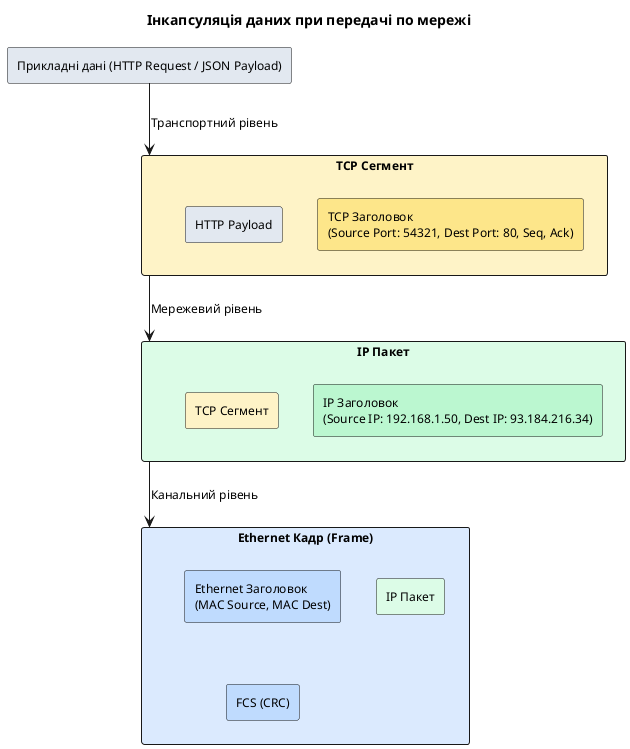

::

Коли сигнал надходить на мережеву карту сервера, операційна система виконує зворотний процес — **деінкапсуляцію** (_de-encapsulation_):

1. Мережева карта зчитує Ethernet-кадр, перевіряє контрольну суму (CRC) та передає вміст вище.
2. Драйвер мережевого рівня знімає IP-заголовок, перевіряючи, чи збігається IP-адреса призначення з адресою хоста.
3. Транспортний рівень стеку ядра ОС знімає TCP-заголовок, збирає сегменти в правильному порядку за номерами послідовності (_sequence numbers_) та визначає цільовий сокет за **номером порту**.
4. Програма на Go отримує чистий байтовий потік прикладних даних.

---

### Анатомія сокета Берклі: від абстракції ОС до байтових буферів

Для прикладного програміста мережа починається не з транзисторів мережевої карти, а з абстракції операційної системи, яка має назву **сокет Берклі** (_Berkeley Sockets API_ / _POSIX Sockets_). Цей стандарт був розроблений в Каліфорнійському університеті в Берклі у 1983 році для операційної системи BSD Unix і став загальноприйнятим стандартом для всіх сучасних операційних систем (Linux, macOS, Windows).

Щоб зрозуміти сокет, потрібно згадати фундаментальний принцип Unix-подібних систем: **«Усе є файлом»** (_Everything is a file_).

::note
**Концептуальне визначення:** Сокет — це спеціальний кінцевий об'єкт операційної системи (файловий дескриптор), який зв'язує користувацький процес із мережевим стеком ядра. Програма взаємодіє з сокетом точно так само, як зі звичайним відкритим файлом на диску: через операції читання `Read()` та запису `Write()`. Різниця полягає лише в тому, що байти записуються не на диск, а передаються через мережеву карту у виглядів пакетів віддаленому комп'ютеру.
::

---

### Внутрішня будова сокета в пам'яті ядра ОС

Коли програма створює сокет, операційна система виділяє в **просторі ядра** (_Kernel Space_) спеціальну структуру даних, яка містить системні буфери, черги та метадані з'єднання.

{.diagram-img}

::plant-uml{alt="Внутрішня архітектура сокета в ядрі операційної системи"}

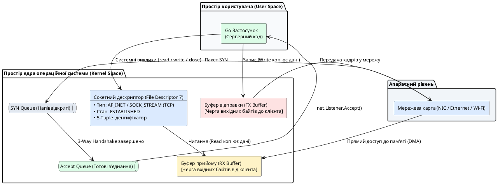

::

Розглянемо ключові внутрішні компоненти сокета:

::field-group

::field{name="Буфер прийому (RX Buffer / Receive Buffer)" type="Пам'ять ядра"}
Виділена ділянка пам'яті ядра, куди мережева карта записує байти, отримані з мережі.

- Коли приходить TCP-сегмент, стек ядра перевіряє контрольну суму, видаляє заголовок TCP і розміщує корисні байти в RX Buffer.
- Коли програма викликає `conn.Read(buffer)`, дані **копіюються з буфера ядра у зріз пам'яті користувацького процесу**.
- Якщо процес читає дані повільніше, ніж вони надходять, буфер заповнюється. При досягненні 100% заповнення TCP надсилає відправнику заголовок із нульовим розміром вікна (_Window Size = 0_), що змушує клієнта призупинити передачу (механізм _TCP Flow Control_).

::

::field{name="Буфер відправки (TX Buffer / Transmit Buffer)" type="Пам'ять ядра"}
Виділена ділянка пам'яті ядра, куди записуються дані, які програма хоче відправити.

- ⚠️ **Критичний нюанс:** Виклик `conn.Write(data)` вважається успішним і повертає керування **не тоді, коли дані дійшли до отримувача**, а як тільки операційна система скопіювала байти з вашої змінної у TX Buffer ядра.
- Якщо мережевий кабель перевантажений або клієнт повільний, TX Buffer заповнюється, і наступний виклик `Write()` блокується або повертає помилку `EAGAIN`/`EWOULDBLOCK`.

::

::field{name="Ідентифікатор з'єднання (5-Tuple)" type="Адресація"}
Унікальний паспорт з'єднання, за яким мережевий стек ядра миттєво знаходить відповідний сокет у хеш-таблиці активних сесій: :math-formula{tex="\text{Socket Session} = \{\text{Protocol}, \text{SrcIP}, \text{SrcPort}, \text{DstIP}, \text{DstPort}\}" inline}.

::

::field{name="Черги з'єднань (SYN Queue та Accept Queue)" type="Слухаючий сокет"}
Серверний слухаючий сокет має дві внутрішні черги ядра:

1. **SYN Queue (Backlog напіввідкритих з'єднань):** зберігає з'єднання, які отримали `SYN`, надіслали `SYN-ACK`, але ще чекають фінального `ACK` від клієнта.
2. **Accept Queue (Backlog готових з'єднань):** зберігає повністю встановлені сесії (Handshake completed), які очікують, поки ваш код викличе `net.Listener.Accept()`.

::

::

---

### Типи сокетів та адресні сімейства

При створенні сокета в операційній системі визначаються два базові параметри: **сімейство адрес** та **тип передачі даних**.

{.diagram-img}

::plant-uml{alt="Класифікація сокетів у системі POSIX"}

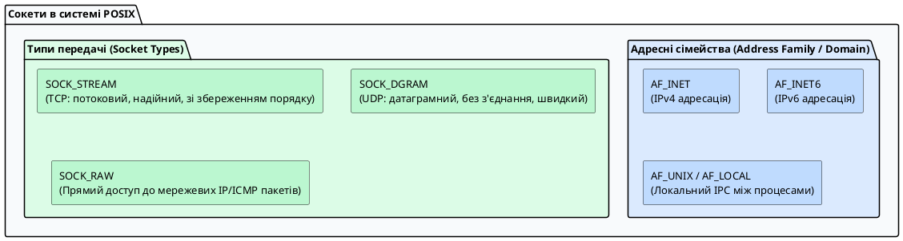

::

::tip
**Чому важливо знати про AF_UNIX (Unix Domain Sockets)?**
Якщо ви запускаєте два процеси на одному сервері (наприклад, Nginx як зворотний проксі та бекенд-сервер на Go), з'єднання через класичний TCP сокет `127.0.0.1:8080` виконує повну інкапсуляцію в TCP/IP заголовки та розрахунок контрольних сум. Використання замість цього Unix Domain Socket (`/tmp/app.sock`) передає байти безпосередньо через оперативну пам'ять ядра, що збільшує пропускну здатність на **25–40%** і знижує затримку.
::

---

### Життєвий цикл сокетів: Слухаючий сокет проти Сокета даних

Найпоширеніша плутанина серед студентів: _«Якщо сервер слухає порт 8080, то всі клієнти спілкуються через цей самий сокет?»_

**Відповідь: Ні.** У серверному застосунку існують сокети двох принципово різних типів:

1. **Слухаючий сокет (_Listening Socket / Master Socket_):**
    - Створюється викликом `net.Listen("tcp", ":8080")`.
    - Не передає прикладних даних. Його єдина задача — «сидіти на порту 8080» і приймати нові запити на підключення від клієнтів.
2. **Сокет даних / Сокет з'єднання (_Connected / Data Socket_):**
    - Створюється ядром операційної системи у момент завершення 3-Way Handshake.
    - Повертається викликом `listener.Accept()` як об'єкт `net.Conn`.
    - Має свій власний незалежний номер дескриптора (наприклад, `#7`), власні буфери RX/TX і служить виключно для обміну повідомленнями з цим конкретним клієнтом.

{.diagram-img}

::plant-uml{alt="Послідовність системних викликів Berkeley Sockets"}

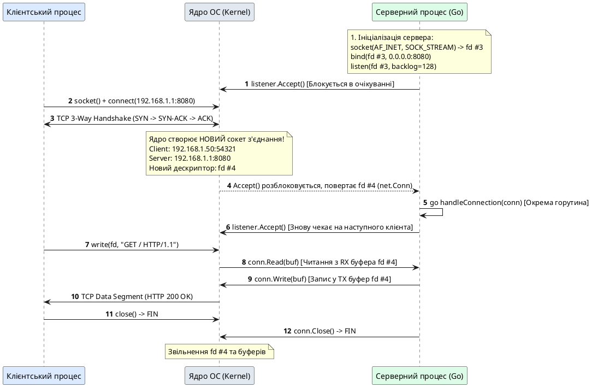

::

---

### Як Go працює з сокетами під капотом: Магія Runtime Netpoller

У класичному сокетному програмуванні на C або C++ існує дилема:

- **Блокуючі сокети (_Blocking I/O_):** Виклик `read()` зупиняє весь потік ОС до приходу даних. Щоб обслужити 10 000 клієнтів, потрібно 10 000 важких потоків ОС, що призводить до вичерпання пам'яті.
- **Неблокуючі сокети з мультиплексуванням (_Non-blocking I/O + epoll/kqueue_):** Складний асинхронний код на базі функцій зворотного виклику (_callbacks_) або кінцевих автоматів (як у Node.js або Nginx), де дуже складно читати та налагоджувати код.

**Рішення мови Go — Netpoller:**
Go поєднує простоту синхронного блокуючого коду з надзвичайною швидкістю неблокуючого введення/виведення.

1. Коли ви пишете `net.Listen` або `net.Dial`, Go відкриває сокет у системі **завжди в неблокуючому режимі** (`O_NONBLOCK`).
2. Коли горутина викликає `conn.Read(buf)`, а в буфері ядра RX ще немає даних, операційна система повертає статус `EAGAIN` («даних немає»).
3. Замість того, щоб зависнути або повернути помилку розробнику, середовище виконання Go автоматично реєструє дескриптор сокета в системному мультиплексорі ядра (**`epoll` у Linux, `kqueue` у macOS**) і **присипляє поточну горутину**.
4. Потік процесора ОС миттєво перемикається на виконання іншої корисної роботи!
5. Як тільки мережева карта отримує байти і `epoll` сигналізує про готовність, внутрішній планувальник **Netpoller** миттєво будить сплячу горутину, і виклик `Read()` прозоро повертає прочитані байти.

Для розробника на Go код виглядає як звичайний послідовний синхронний код, але під капотом він працює з максимальною ефективністю сучасного асинхронного ядра ОС.

---

## Чому саме Go для бекенд-систем? Інженерний аналіз

У сучасному ІТ-секторі існує чимало мов програмування: Java, C#, Python, JavaScript (Node.js), Rust. Чому ж компанії масштабу Google, Uber, Cloudflare, Netflix та тисячі інших обирають саме **Go (Golang)** для побудови мережевої інфраструктури, мікросервісів та високонавантажених API?

{.diagram-img}

::plant-uml{alt="Філософія та інженерні стовпи Go"}

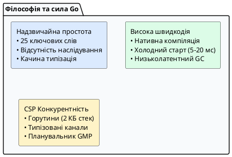

::

### Архітектурне порівняння: Go vs Java (JVM) vs Python

::field-group

::field{name="Модель компіляції та виконання" type="Порівняння"}

- **Java:** Вихідний код компілюється в проміжний байткод (`.class`), який виконується віртуальною машиною JVM через механізм JIT (_Just-In-Time Compilation_).
- **Python:** Інтерпретована мова з глобальним блокуванням інтерпретатора (_GIL — Global Interpreter Lock_), що суттєво обмежує паралелізм на рівні потоків.
- **Go:** Компілюється безпосередньо у **статично скомпільований нативний машинний код** під цільову архітектуру процесора (x86_64, ARM64).

::

::field{name="Споживання пам'яті та потокова модель" type="Порівняння"}

- **Java / C#:** Традиційно використовують потоки операційної системи (_OS Kernel Threads_). Кожен потік виділяє фіксований стек розміром **1–2 МБ**. Створення 10 000 потоків потребує ~10–20 ГБ оперативної пам'яті лише на утримання стеків.
- **Go:** Використовує **горутини** (_Goroutines_) — легковагі користувацькі потоки під керуванням власного планувальника GMP. Початковий розмір стека горутини становить лише **2 КБ** і динамічно зростає або зменшується в купі за потребою. Створення 100 000 горутин у Go займає лише ~200–300 МБ оперативної пам'яті.

::

::field{name="Збирач сміття (Garbage Collector)" type="Порівняння"}

- **Java:** Потужний, але складний GC, що оптимізує максимальну пропускну здатність (_throughput_), проте історично страждав від тривалих пауз повної зупинки світу (_Stop-The-World, STW_).
- **Go:** GC спроєктований спеціально для мережевих сервісів із низькою затримкою (_low latency_). Паузи STW у сучасному Go становлять **менше 1 мілісекунди** (зазвичай кілька десятків мікросекунд).

::

::field{name="Холодний старт (Cold Start)" type="Порівняння"}

- **Java (Spring Boot):** Прогрів JVM, завантаження класів та сканування рефлексії займає від 3 до 30 секунд.
- **Go:** Запуск бінарного файлу відбувається за **5–20 мілісекунд**, що робить Go ідеальним для контейнеризованих середовищ Kubernetes та Serverless-функцій.

::

::

---

### Порівняння створення мінімального HTTP-сервера

Порівняємо реалізацію найпростішого HTTP-ендпоінта мовами Java та Go:

::code-group

```go [Go: main.go]
package main

import (
	"encoding/json"
	"log"
	"net/http"
)

type HealthResponse struct {
	Status  string `json:"status"`
	Service string `json:"service"`
}

func healthHandler(w http.ResponseWriter, r *http.Request) {
	resp := HealthResponse{
		Status:  "OK",
		Service: "Client-Server Demo API",
	}

	w.Header().Set("Content-Type", "application/json")
	w.WriteHeader(http.StatusOK)
	if err := json.NewEncoder(w).Encode(resp); err != nil {
		log.Printf("Помилка серіалізації: %v", err)
	}
}

func main() {
	http.HandleFunc("/api/v1/health", healthHandler)

	log.Println("Сервер запущено на порту :8080...")
	if err := http.ListenAndServe(":8080", nil); err != nil {
		log.Fatalf("Помилка запуску сервера: %v", err)
	}
}
```

```java [Java: Application.java (Spring Boot)]
package com.college.demo;

import org.springframework.boot.SpringApplication;
import org.springframework.boot.autoconfigure.SpringBootApplication;
import org.springframework.web.bind.annotation.GetMapping;
import org.springframework.web.bind.annotation.RestController;

import java.util.Map;

@SpringBootApplication
@RestController
public class Application {

    @GetMapping("/api/v1/health")
    public Map<String, String> health() {
        return Map.of(
            "status", "OK",
            "service", "Client-Server Demo API"
        );
    }

    public static void main(String[] args) {
        SpringApplication.run(Application.class, args);
    }
}
```

::

Зверніть увагу: у прикладі на Go не використовується жодних сторонніх фреймворків чи рефлексивних анотацій — стандартна бібліотека `net/http` є повноцінним, промисловим, високоефективним сервером із підтримкою HTTP/2 «з коробки».

---

## Інструментарій: Go CLI та модульна система

Якщо ви раніше працювали з іншими мовами програмування, ви, напевно, звикли до необхідності встановлювати десятки розрізнених утиліт: збирач проєкту (Maven/Gradle у Java, Webpack/Vite у JS), менеджер пакетів (npm, pip, nuget), тестовий раннер (JUnit, pytest, Jest), лінтер (ESLint) та інструмент форматування (Prettier).

У світі Go філософія інша: **все необхідне для повного життєвого циклу розробки постачається разом із компілятором в одній-єдиній утиліті командного рядка — `go`**.

---

### Еволюція організації коду: від $GOPATH до Go Modules

Щоб зрозуміти сучасну структуру проєктів, корисно знати, від якої проблеми відштовхувалися розробники Go:

::field-group

::field{name="Минуле: Модель $GOPATH (до Go 1.11)" type="Історичний контекст"}
У ранніх версіях Go всі проєкти розробника мусили знаходитися в одній глобальній системній папці (наприклад, `~/go/src/github.com/username/project`). Не було можливості зафіксувати різні версії однієї бібліотеки для двох різних проєктів: оновлення пакету ламало всі сусідні програми.
::

::field{name="Сьогодення: Система Go Modules (Go 1.11+)" type="Сучасний стандарт"}
Будь-яка папка на вашому диску в будь-якому місці файлової системи може бути самостійним, ізольованим **модулем Go**. Усі залежності, їхні точні версії та налаштування компіляції ізольовані та зафіксовані у кореневому файлі `go.mod`.
::

::

---

### Відмінність між Пакетом (Package) та Модулем (Module)

Початківці часто плутають ці два фундаментальні терміни:

1. **Пакет (_Package_):**
    - Кожен файл із кодом на Go обов'язково починається з **першого рядка**: `package <ім'я>`. Цей рядок оголошує, до якої саме логічної коробки (пакета) належить цей файл.
    - **Залізне правило компілятора Go:** Усі `.go` файли, які лежать в **одній і тій самій папці**, повинні мати **абсолютно однакове ім'я пакету** в першому рядку (зазвичай ім'я пакету збігається з назвою самої папки).
    - _Як це працює на практиці:_ Уявіть, що у вас є папка `service/`, а всередині два файли — `order.go` та `payment.go`. Обидва файли першим рядком пишуть `package service`. Компілятор Go об'єднує їх в єдине ціле: функція `processPayment()`, написана у файлі `payment.go`, буде миттєво доступна у файлі `order.go` **без будь-яких імпортів чи підключень**!
    - _Особливий пакет `package main`:_ Якщо папка містить `package main` і функцію `func main()`, компілятор розуміє: «Це не просто бібліотека, це **виконувана програма**, яку треба скомпільувати у бінарний файл».
    - _Інкапсуляція (Public vs Private):_ Якщо назва функції чи змінної починається з **великої літери** (наприклад, `CalculateTotal`), вона є публічною і буде доступна іншим пакетам через `import`. Якщо з **малої літери** (наприклад, `validateCard`) — вона є приватною і видима лише всередині файлів цього конкретного пакета.

2. **Модуль (_Module_):**
    - Це цілий проєкт або бібліотека, яка складається з дерева багатьох таких пакетів (папок), що мають єдину версію та керуються через файл `go.mod`.
    - Корінь модуля визначається наявністю файлу `go.mod`. Всі імпорти внутрішніх пакетів проєкту починаються з назви цього модуля.

{.diagram-img}

::plant-uml{alt="Ієрархія модуля та пакетів у Go"}

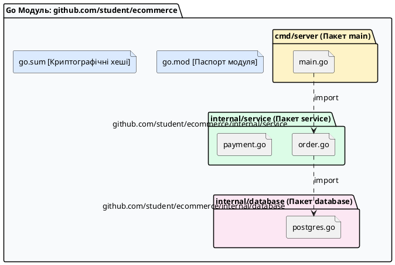

::

---

### Стандартна структура каталогів (Standard Go Project Layout)

Хоча компілятор Go не нав'язує жорсткої структури папок, інженерне співтовариство використовує загальноприйнятий стандарт організації коду для бекенд-застосунків:

::code-tree

```go [cmd/server/main.go]
package main

import (
	"log"
	"net/http"
)

func main() {
	log.Println("Запуск HTTP сервера на порту :8080...")
	if err := http.ListenAndServe(":8080", nil); err != nil {
		log.Fatalf("Помилка: %v", err)
	}
}
```

```go [internal/config/config.go]
package config

type Config struct {
	Port        string
	DatabaseURL string
}
```

```go [internal/handler/user.go]
package handler

import "net/http"

type UserHandler struct{}

func (h *UserHandler) GetUsers(w http.ResponseWriter, r *http.Request) {
	// Обробник HTTP GET /users
}
```

```go [internal/service/user.go]
package service

type UserService struct{}
```

```go [internal/repository/postgres.go]
package repository

type UserRepository struct{}
```

```go [pkg/logger/logger.go]
package logger

import "log"

func Info(msg string) {
	log.Println("[INFO]", msg)
}
```

```text [go.mod]
module github.com/student/my-server

go 1.22
```

```text [go.sum]
github.com/google/uuid v1.6.0 h1:NIvaJDMOfo6...
github.com/google/uuid v1.6.0/go.mod h1:TIym...
```

::

::important
**Магічне правило папки `internal/` в Go:**
Каталог `internal` захищений безпосередньо на рівні компілятора мови Go. Жоден зовнішній сторонній проєкт або інший модуль не може імпортувати пакети з папки `internal`. Якщо хтось спробує написати `import "github.com/student/my-server/internal/service"`, компілятор Go зупинить збірку з помилкою безпеки `use of internal package not allowed`. Це дозволяє вам вільно рефакторити внутрішній код сервісу, не боячись зламати публічні контракти.
::

---

### Анатомія конфігураційних файлів: `go.mod` та `go.sum`

Розглянемо вміст файлів маніфесту модуля на конкретному прикладі:

::code-group

```text [go.mod (Маніфест модуля)]
module github.com/student/my-backend

go 1.22

require (
	github.com/google/uuid v1.6.0
	github.com/gorilla/mux v1.8.1 // direct
	golang.org/x/crypto v0.21.0 // indirect
)
```

```text [go.sum (Журнал контрольних сум)]
github.com/google/uuid v1.6.0 h1:NIvaJDMOfo6...
github.com/google/uuid v1.6.0/go.mod h1:TIym...
github.com/gorilla/mux v1.8.1 h1:TuBL49tXwIGFiU...
github.com/gorilla/mux v1.8.1/go.mod h1:TIym...
```

::

Розберемо детально призначення кожного елемента:

1. **Директива `module`:** Вказує **канонічний шлях імпорту**. Коли всередині вашого проєкту ви хочете підключити власний внутрішній пакет `internal/service`, рядок імпорту починається саме з цього шляху:
    ```go
    import "github.com/student/my-backend/internal/service"
    ```
2. **Директива `go 1.22`:** Вказує мінімальну версію синтаксису мови Go, необхідну для збірки проєкту.
3. **Блок `require`:** Перелік зовнішніх сторонніх бібліотек із фіксованими семантичними версіями (_Semantic Versioning: MAJOR.MINOR.PATCH_).
    - Позначка `// indirect` означає **непряму (транзитивну) залежність** — це пакет, який потрібен не вашому коду напряму, а потрібен одній із підключених вами бібліотек.
4. **Файл `go.sum`:** Для кожного стороннього пакета тут зберігаються два 256-бітні криптографічні хеші: хеш вихідного коду бібліотеки (`h1:...`) та хеш її власного файлу `go.mod`.

::caution
**Де зберігаються завантажені бібліотеки? (Чому немає папки node_modules):**
У Node.js залежності завантажуються в кожну папку проєкту (`node_modules`), що займає гігабайти дубльованого простору. У Go всі бібліотеки завантажуються **один раз у глобальний системний кеш** (`$GOPATH/pkg/mod`). Файли в цьому кеші захищені правами _Read-Only_ (лише для читання). Якщо п'ять ваших проєктів використовують бібліотеку `uuid v1.6.0`, на диску зберігається лише одна спільна копія.
::

---

### Робота з Go CLI: Повний довідник інструментів

Уся розробка, тестування та компіляція здійснюється через вбудовані підкоманди утиліти `go`.

{.diagram-img}

::plant-uml{alt="Карта команд Go CLI"}

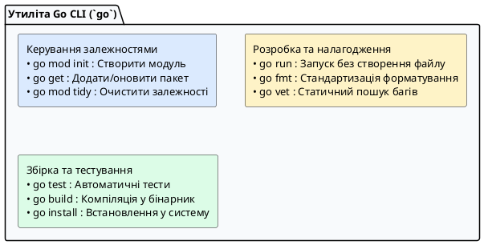

::

Розглянемо практичне призначення та синтаксис кожної базової команди:

::field-group

::field{name="go mod init <шлях-модуля>" type="Ініціалізація"}
Створює новий файл `go.mod` у поточній папці. Зазвичай як шлях модуля вказують URL репозиторію на GitHub (наприклад, `go mod init github.com/student/demo-server`).
::

::field{name="go get <url-пакету>" type="Керування бібліотеками"}
Завантажує сторонню бібліотеку з інтернету, додає запис у `go.mod` та фіксує хеш у `go.sum`.

- Встановлення останньої версії: `go get github.com/google/uuid`
- Встановлення конкретної версії: `go get github.com/google/uuid@v1.5.0`

::

::field{name="go mod tidy" type="Золота команда підтримки"}
Сканує всі вихідні `.go` файли у вашому проєкті. Знаходить усі бібліотеки, які ви імпортували, і автоматично докачує їх. Якщо ж ви видалили код, який використовував бібліотеку, `go mod tidy` видалить зайвий рядок із `go.mod` та `go.sum`. **Рекомендується запускати перед кожним комітом у Git.**
::

::field{name="go run <шлях-до-main.go>" type="Швидкий запуск"}
Компілює вихідний код у тимчасову пам'ять і миттєво запускає програму. Після зупинки програми тимчасовий бінарник автоматично видаляється. Ідеально підходить для швидкої розробки та налагодження.
::

::field{name="go fmt ./..." type="Форматування"}
Автоматично приводить увесь вихідний код проєкту до єдиного офіційного стандарту форматування Go (відступи табуляцією, вирівнювання структур, порядок імпортів). У світі Go немає суперечок щодо стилю оформлення коду: стиль визначається `gofmt`.
::

::field{name="go vet ./..." type="Статичний лінтер"}
Вбудований статичний аналізатор коду. Знаходить типові помилки програміста ще до запуску: неправильні специфікатори у `fmt.Printf`, недосяжний код, підозрілі замикання у циклах та стан гонитви.
::

::field{name="go test ./..." type="Модульне тестування"}
Знаходить і запускає всі файли тестів (файли із суфіксом `_test.go`) у всіх підпапках поточного проєкту.
::

::

---

### Ваша перша програма: Анатомічний розбір Hello World

Перед тим як переходити до складних багатокомпонентних сервісів, створимо та розберемо найпростішу базову програму на мові Go.

Створіть файл `main.go` з наступним вмістом:

```go [main.go]
package main

import "fmt"

func main() {
	fmt.Println("Привіт, клієнт-серверний світе на Go! 🚀")
}
```

::plant-uml{alt="Анатомія коду першої програми на Go"}

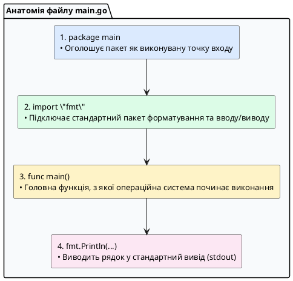

::

Розберемо детально призначення кожного рядка цього коду:

::field-group

::field{name="1. Рядок 'package main'" type="Декларація точки входу"}
Слово `package` вказує компілятору, до якого логічного простору належить файл.

- ⚠️ **Чому саме `main`?** Ім'я `main` є зарезервованим і магічним для компілятора Go. Воно повідомляє збирачу: _«Цей код не є бібліотекою, це самостійна програма, яку необхідно скомпільувати у готовий до запуску бінарний файл»_.

::

::field{name="2. Рядок 'import \"fmt\"'" type="Підключення бібліотеки"}
Ключове слово `import` підключає зовнішні модулі або пакети зі стандартної бібліотеки мови Go.

- Пакет **`fmt`** (скорочення від англ. _Format_ — «форматування») є базовим інструментом для роботи з текстом, консольним виведенням та форматуванням даних (детальний довідник функцій пакету наведено нижче).
- У Go діє залізне правило: **якщо ви імпортували пакет, але не викликали з нього жодної функції, компілятор зупинить збірку з помилкою**. Це виключає наявність «мертвого» коду та зайвих залежностей.

::

::field{name="3. Рядок 'func main()'" type="Головна функція"}
Функція `main()` у пакеті `main` є **єдиною точкою старту** виконання програми.

- Вона не приймає жодних параметрів у круглих дужках і нічого не повертає.
- Якщо вам потрібно отримати аргументи командного рядка з терміналу, Go надає для цього зріз `os.Args` зі стандартного пакету `os`.
- Якщо програма має завершитися зі спеціальним кодом помилки, викликається функція `os.Exit(1)`.

::

::field{name="4. Рядок 'fmt.Println(...) '" type="Виведення результату"}
Викликає функцію `Println` із підключеного пакету `fmt`. Вона записує передані аргументи у стандартний потік виведення консолі (_Standard Output / stdout_) та автоматично додає символ переносу на новий рядок `\n` наприкінці.
::

::

---

### Глибоке занурення: Директива `import` та пакет `fmt` (Довідник I/O)

Для інженера клієнт-серверних систем пакет `fmt` є одним із найбільш часто використовуваних інструментів: від логування станів сервера до динамічної генерації SQL-запитів, JSON-рядків та форматування мережевих відповідей.

#### Синтаксис та можливості директиви `import`

У Go існує кілька способів підключення пакетів:

```go
package main

// Спосіб 1: Груповий блок імпортів (Фабричний стандарт)
import (
	"fmt"                    // Стандартна бібліотека: форматування
	"net/http"               // Стандартна бібліотека: вебсервер
	"time"                   // Стандартна бібліотека: час

	myjson "encoding/json"   // Імпорт з псевдонімом (Alias) для уникнення конфліктів імен
	_ "github.com/lib/pq"    // Анонімний імпорт (Blank Import): запускає лише функцію init() драйвера БД
)
```

::tip
**Чому груповий імпорт у круглих дужках кращий?**
Замість багаторазового повторення слова `import "a"`, `import "b"` використання блоку `import (...)` робить секцію залежностей компактною та автоматично групується утилітою `go fmt` (спочатку йдуть стандартні пакети Go, потім через порожній рядок — сторонні бібліотеки).
::

---

#### Архітектура та класифікація функцій пакету `fmt`

Усі функції пакету `fmt` спроєктовані за чіткою та логічною префіксною системою імен. Їх можна розділити на **чотири головні сімейства**:

::plant-uml{alt="Класифікація функцій пакету fmt"}

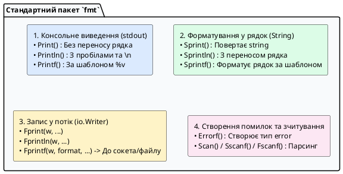

::

Розглянемо кожну групу детально:

##### Група 1: Виведення у термінал (Stdout)

- `fmt.Print(...)` — послідовно виводить аргументи у консоль без додавання переносу рядка.
- `fmt.Println(...)` — виводить аргументи через пробіл і **завжди завершує рядок символом `\n`**.
- `fmt.Printf(template, ...)` — форматує виведення відповідно до специфікаторів форматування (наприклад, `%d` для чисел, `%s` для рядків).

##### Група 2: Форматування у рядок (`S` = String)

Функції цієї групи **нічого не друкують у консоль**, а повертають результат у вигляді готової змінної типу `string`:

- `fmt.Sprintf("http://%s:%d/api", host, port)` — фундаментальна функція для конструювання динамічних рядків, URL, SQL-запитів та повідомлень.

##### Група 3: Запис у довільний потік (`F` = File / io.Writer)

Найважливіша група для мережевого програмування. Першим аргументом вони приймають будь-який об'єкт, що реалізує інтерфейс `io.Writer` (мережевий TCP-сокет `net.Conn`, HTTP-відповідь `http.ResponseWriter`, відкритий файл на диску `*os.File` або буфер `bytes.Buffer`):

- `fmt.Fprintf(w, "HTTP/1.1 200 OK\r\nContent-Type: text/plain\r\n\r\nHello!")`

##### Група 4: Створення помилок

- `fmt.Errorf("не вдалося підключитися до хоста %s: %w", host, err)` — генерує новий об'єкт помилки, що реалізує стандартний інтерфейс `error`, із підтримкою пакування першопричин через специфікатор `%w`.

---

#### Довідник специфікаторів форматування (Format Verbs)

Специфікатори (або «верби») вказують функції `Printf` / `Sprintf`, як саме інтерпретувати та відображати значення:

| Специфікатор      | Тип даних           | Опис та приклад виведення                                                  |
| :---------------- | :------------------ | :------------------------------------------------------------------------- |
| **`%v`**          | Будь-який           | Значення за замовчуванням у стандартному форматі (`100`, `"text"`, `true`) |
| **`%+v`**         | Структури           | Виводить структуру разом з **іменами її полів**: `{ID:1 Name:Admin}`       |
| **`%#v`**         | Будь-який           | Виводить повний синтаксис Go, яким можна відтворити це значення в коді     |
| **`%T`**          | Будь-який           | Виводить **тип даних** змінної: `int64`, `main.User`, `*net.TCPConn`       |
| **`%t`**          | `bool`              | Булеве значення: `true` або `false`                                        |
| **`%d`**          | Цілі числа          | Десяткове ціле число зі знаком (`-42`, `1024`)                             |
| **`%b`**          | Цілі числа          | Двійкове представлення числа (`101010`)                                    |
| **`%x` / `%X`**   | Числа / байти       | Шістнадцятковий вигляд (`0xff`, `deadbeef`)                                |
| **`%f` / `%.2f`** | `float`             | Дійсне число (наприклад `%.2f` округлює рівно до 2 знаків після коми)      |
| **`%s`**          | `string` / `[]byte` | Звичайний текстовий рядок                                                  |
| **`%q`**          | `string` / `rune`   | Рядок, безпечно взятий у подвійні лапки з екрануванням: `"hello\n"`        |
| **`%p`**          | Покажчики           | Шістнадцяткова **адреса в оперативній пам'яті**: `0xc000014088`            |
| **`%c`**          | `rune` / `int32`    | Символ Unicode за його кодом: `'A'`, `'Ї'`, `'🚀'`                         |
| **`%%`**          | Немає               | Друкує буквальний знак відсотка `%`                                        |

---

#### Практичний демонстраційний лістинг роботи з `fmt`

```go
package main

import (
	"fmt"
	"os"
)

type ServerConfig struct {
	Host string
	Port int
	TLS  bool
}

func main() {
	cfg := ServerConfig{Host: "127.0.0.1", Port: 8443, TLS: true}

	// 1. Різниця між %v, %+v та %#v
	fmt.Printf("Звичайне %%v:  %v\n", cfg)
	fmt.Printf("З полями %%+v: %+v\n", cfg)
	fmt.Printf("Go-код %%#v:   %#v\n", cfg)
	fmt.Printf("Тип змінної %%T: %T\n\n", cfg)

	// 2. Створення рядка через Sprintf (без виведення в консоль)
	serviceURL := fmt.Sprintf("https://%s:%d/health", cfg.Host, cfg.Port)
	fmt.Println("Згенерований URL:", serviceURL)

	// 3. Форматування чисел та байтів
	latency := 0.045678
	fmt.Printf("Затримка мережі: %.2f мс (Двійковий порт: %b)\n", latency*1000, cfg.Port)

	// 4. Запис у потік помилок os.Stderr через Fprintf
	fmt.Fprintf(os.Stderr, "[LOG WARN] Тестове повідомлення у потік помилок\n")
}
```

---

### Два способи запуску програми через термінал

Після того як файл `main.go` збережено, розробник має два основні сценарії роботи з ним:

::tabs
::tabs-item{label="Спосіб 1: Швидкий запуск під час розробки (go run)"}

Команда `go run` компілює програму в тимчасову пам'ять і миттєво виконує її без збереження бінарного файлу на диску:

```bash
# Знаходимося в папці з файлом main.go
go run main.go
```

**Результат у терміналі:**

```text
Привіт, клієнт-серверний світе на Go! 🚀
```

_Ідеально підходить для швидкої перевірки гіпотез, навчання та локального налагодження._
::

::tabs-item{label="Спосіб 2: Справжня компіляція у бінарник (go build)"}

Команда `go build` створює повноцінний автономний нативний виконуваний файл під вашу операційну систему:

```bash
# Компілюємо виконуваний файл з ім'ям 'app'
go build -o app main.go

# Запускаємо скомпільований бінарник (на macOS / Linux):
./app

# (На Windows виконайте: app.exe)
```

**Результат у терміналі:**

```text
Привіт, клієнт-серверний світе на Go! 🚀
```

_Отриманий бінарний файл `app` можна скопіювати на будь-який інший аналогічний комп'ютер і запустити без встановлення компілятора Go!_
::
::

---

### Покроковий практичний воркфлоу створення бекенду

Погляньмо, як виглядає реальний цикл створення нового проєкту з нуля у терміналі:

::steps

### Крок 1. Створення каталогу та ініціалізація модуля

Створюємо папку проєкту та ініціалізуємо модуль за допомогою `go mod init`:

```bash
mkdir -p my-server/cmd/server
cd my-server
go mod init github.com/student/my-server
```

### Крок 2. Підключення сторонньої бібліотеки

Додаємо популярну бібліотеку для генерації унікальних UUID ідентифікаторів:

```bash
go get github.com/google/uuid
```

### Крок 3. Написання коду застосунку

Створюємо файл `cmd/server/main.go` з використанням завантаженої бібліотеки:

```go
package main

import (
	"fmt"
	"net/http"

	"github.com/google/uuid"
)

func main() {
	http.HandleFunc("/api/v1/token", func(w http.ResponseWriter, r *http.Request) {
		newID := uuid.New().String()
		fmt.Fprintf(w, `{"token": "%s"}`, newID)
	})

	fmt.Println("Сервер слухає на порту :8080...")
	http.ListenAndServe(":8080", nil)
}
```

### Крок 4. Перевірка цілісності та запуск

Форматуємо код, синхронізуємо залежності та запускаємо сервер:

```bash
go fmt ./...
go mod tidy
go run cmd/server/main.go
```

::

---

### Кроскомпіляція (Cross-Compilation): як створювати бінарники під будь-яку ОС

У багатьох мовах програмування (наприклад, C++) збірка програми для іншої операційної системи (наприклад, збірка під Linux на комп'ютері з macOS) є вкрай складним завданням, що вимагає налаштування спеціальних віртуальних машин або складних наборів інструментів (_Toolchains_).

Компілятор Go має вбудовану підтримку генерації машинного коду під будь-яку операційну систему та процесор безпосередньо з коробки. Для цього достатньо встановити дві змінні середовища перед викликом команди `go build`:

- `GOOS` (_Target Operating System_): цільова ОС (`linux`, `darwin`, `windows`, `freebsd`).
- `GOARCH` (_Target Architecture_): цільова архітектура процесора (`amd64` для x86_64, `arm64` для Apple Silicon / AWS Graviton, `arm` для Raspberry Pi).

::tabs
::tabs-item{label="Збірка під Linux (Сервери AWS / VPS)"}

```bash
# Збірка під 64-бітний Linux без динамічних C-бібліотек (чистий автономний бінарник)
GOOS=linux GOARCH=amd64 CGO_ENABLED=0 go build -ldflags="-s -w" -o bin/server-linux-amd64 cmd/server/main.go
```

::
::tabs-item{label="Збірка під Linux ARM64 (Graviton / Raspberry Pi)"}

```bash
# Збірка під 64-бітні ARM сервери
GOOS=linux GOARCH=arm64 CGO_ENABLED=0 go build -ldflags="-s -w" -o bin/server-linux-arm64 cmd/server/main.go
```

::
::tabs-item{label="Збірка під Windows (.exe)"}

```bash
# Збірка виконуваного файлу для ОС Windows
GOOS=windows GOARCH=amd64 go build -o bin/server.exe cmd/server/main.go
```

::
::tabs-item{label="Збірка під macOS (Apple Silicon)"}

```bash
# Збірка для процесорів Apple M1/M2/M3
GOOS=darwin GOARCH=arm64 go build -o bin/server-macos-arm64 cmd/server/main.go
```

::
::

::tip
**Чому важливий прапорець `CGO_ENABLED=0`?**
За замовчуванням Go може використовувати окремі системні C-бібліотеки операційної системи хоста (наприклад, системний резолвер DNS). Встановлення `CGO_ENABLED=0` вмикає 100% чисту Go-імплементацію всієї стандартної бібліотеки. Скомпільований таким чином бінарний файл взагалі не має зовнішніх динамічних залежностей (`glibc`), важить 10–15 МБ і може бути упакований у порожній Docker-контейнер `FROM scratch`, що є вершиною безпеки та мінімалізму в мікросервісній архітектурі.
::

---

## Передбачення запитань та аналіз підводних каменів («А що, якщо...?»)

::accordion

::accordion-item{label="❓ Чому бінарний файл Go важить 10-15 МБ навіть для простої програми Hello World?" icon="i-lucide-help-circle"}

На відміну від програм на C/C++, які покладаються на динамічно встановлені системні бібліотеки (`.so` або `.dll`), Go створює **повністю статично скомпільований бінарник**. Усередину кожного виконуваного файлу вшивається весь Runtime мови Go: планувальник горутин GMP, збирач сміття, система рефлексії та мережевий полінг операційної системи. Завдяки цьому скомпільовану програму можна запустити на будь-якому цільовому сервері без встановлення будь-яких драйверів чи середовищ виконання.

::

::accordion-item{label="❓ Що станеться, якщо сервер і клієнт використовують різні формати представлення чисел (Endianness)?" icon="i-lucide-help-circle"}

Архітектури процесорів x86/ARM використовують порядок байтів _Little-Endian_ (молодший байт за меншою адресою), тоді як мережеві стандарти вимагають _Big-Endian_ (мережевий порядок байтів, _Network Byte Order_). Якщо здійснюється низькорівнева передача бінарних чисел через сокети, дані мають конвертуватися за допомогою пакетів `encoding/binary` у Go. При використанні текстових форматів (JSON, XML) ця проблема зникає, оскільки текст кодується в стандартизовану послідовність байтів UTF-8.

::

::accordion-item{label="❓ Чому в Go немає ключового слова class та наслідування?" icon="i-lucide-help-circle"}

Творці Go (Роб Пайк, Кен Томпсон, Роберт Грізмер) свідомо відмовилися від класичного ООП-наслідування через проблему «крихких базових класів» (_fragile base class_) та надмірної складності ієрархій у великих системах. Натомість Go використовує два набагато гнучкіших механізми: **композицію** (вбудовування структур) та **качину типізацію інтерфейсів** (_duck typing_).

::

::

---

## Підсумки лекції та перевірка знань

::card-group

::card{title="📌 Ключові висновки" icon="i-lucide-check-circle-2"}

- Клієнт-серверна архітектура вирішує проблему синхронізації даних, масштабування та безпеки шляхом чіткого розмежування зон відповідальності.
- Сучасний бекенд повинен проєктуватися з урахуванням гетерогенності клієнтів (Desktop, Mobile, Web, CLI).
- Стек TCP/IP забезпечує інкапсуляцію прикладних даних у транспортні сегменти та мережеві пакети.
- Мова Go поєднує високу швидкість нативного коду, мілісекундний старт та надлегку модель конкурентності на базі горутин (2 КБ стеку).

::

::card{title="🚀 Наступні кроки" icon="i-lucide-arrow-right-circle"}

У наступній лекції ми зануримося у **систему типів та модель пам'яті мови Go**: дослідимо роботу покажчиків, внутрішню структуру зрізів (_slices_) та карт (_maps_), а також розберемо механізм **аналізу втечі (_Escape Analysis_)** між стеком і купою.

::

::

---

### Запитання для самоконтролю

::accordion

::accordion-item{label="1. У чому полягає принципова відмінність між 2-Tier та 3-Tier архітектурами?" icon="i-lucide-help-circle"}
У 2-Tier моделі клієнт напряму підключається до бази даних, що створює ризики безпеки та перевантаження пулу з'єднань БД. У 3-Tier системі між клієнтом і БД розміщується сервер застосунків, який інкапсулює бізнес-логіку та централізовано керує зверненнями до сховища.
::

::accordion-item{label="2. Які параметри входять до складу 5-Tuple, що ідентифікує мережевий сокет?" icon="i-lucide-help-circle"}

1. Протокол зв'язку (наприклад, TCP).
2. IP-адреса джерела (_Source IP_).
3. Порт джерела (_Source Port_).
4. IP-адреса призначення (_Destination IP_).
5. Порт призначення (_Destination Port_).

::

::accordion-item{label="3. Чому горутина в Go потребує в сотні разів менше пам'яті, ніж потік у Java/C#?" icon="i-lucide-help-circle"}
Потік ОС у Java/C# резервує фіксований стек розміром 1–2 МБ. Горутина у Go керується власним планувальником GMP у просторі користувача і починає роботу зі динамічним стеком розміром лише 2 КБ.
::

::accordion-item{label="4. За що відповідає файл go.sum і чому його обов'язково зберігати в Git?" icon="i-lucide-help-circle"}
Файл `go.sum` фіксує криптографічні контрольні суми всіх завантажених залежностей, захищаючи кодову базу проєкту від атак на ланцюг постачання (підміни коду в сторонніх модулях).
::

::
