# Система типів та модель пам’яті мови Go

::card-group

::card{title="🎯 Навчальні цілі" icon="i-lucide-graduation-cap"}

- Опанувати синтаксис оголошення змінних, тіньове перекриття `:=`, сувору статичну типізацію, нульові значення (_Zero Values_) та різницю `make` vs `new`.
- Вивчити всі базові числові типи, wrap-around переповнення, `uintptr`, незмінні рядки UTF-8, руни, нетипізовані константи та генератор `iota`.
- Дослідити форматування `fmt` (verb'и `%v %#v %T %d %x %f`), всі групи операцій: арифметичні, складені `+= &^=`, логічні, побітові та пріоритети з асоціативністю.
- Вивчити керуючі конструкції: `if` з ініціалізацією, `switch` та всі форми `for`.
- Опанувати функції як об'єкти першого класу, анонімні функції, замикання (_closures_) та рекурсію.
- Зрозуміти безпечну модель покажчиків (_pointers_), заборону арифметики, організацію пам'яті (Стек, Купа) та механізм аналізу втечі (_Escape Analysis_).
- Навчитися створювати власні типи, структури з вирівнюванням, анонімні структури, методи на будь-яких типах, застосовувати вкладену vs вбудовану композицію та теги полів.
- Глибоко розібрати зрізи (`SliceHeader`, `growslice` 2×/1.25×, `s[low:high:max]`, 2D), карти (`hmap`, `bmap`, `comparable`) та механізми `error`/`defer` LIFO.

::

::card{title="🛠️ Технологічний стек" icon="i-lucide-cpu"}

- **Мова:** Go 1.22+
- **Інструменти аналізу:** `go build -gcflags="-m"`, `go vet -fieldalignment -shadow`, `gofmt`, `unsafe.Sizeof/Alignof`
- **Середовище виконання:** Go Runtime (алокатор пам'яті, Garbage Collector, defer-стек)

::

::

---

## Змінні, ідентифікатори та правила компілятора

У лекції 01 ми детально розглянули, як програма на Go організовується у пакети (`package main` — виконуваний бінарний файл, інші пакети — бібліотеки), як `import` підключає залежності та як `go.mod` ізолює версії модулів (див. лекцію 01, розділи «Відмінність між Пакетом та Модулем» та «Еволюція $GOPATH → Go Modules»). Тут ми не повторюємо мережевий стек чи модель сокетів — натомість заглиблюємося в те, як Go зберігає дані всередині процесу.

Усі обчислювальні процеси сучасного комп'ютера зводяться до маніпуляції даними в оперативній пам'яті (RAM). Для того щоб програміст міг зручно звертатися до потрібної комірки пам'яті без використання шістнадцяткових фізичних адрес (на зразок `0x00c000014088`), мови високого рівня надають абстракцію **змінної**.

**Змінна** — це іменована область пам'яті, яка має фіксований тип даних, розмір у байтах та зберігає певне значення під час роботи програми.

::note
**Місток з лекції 01:** кожен `.go` файл починається з `package <ім'я>` і всі файли в одній папці мають однакове ім'я пакета. Функція `func main()` у `package main` — єдина точка входу в програму. Тому всі приклади нижче (`var`, `:=`, `const`) виконуються або на рівні пакета, або всередині `func main()` / інших функцій.
::

---

### Анатомія оголошення змінної: чому тип пишеться після імені?

Якщо ви раніше вивчали C, C++, Java або C#, перше, що привертає увагу в Go — це порядок слів при оголошенні змінних:

```
У C++ / Java :   int      port   =   8080;
                [ТИП]    [ІМ'Я]     [ЗНАЧЕННЯ]

У Go         :   var      port       int      =   8080
               [СЛОВО]   [ІМ'Я]     [ТИП]        [ЗНАЧЕННЯ]
```

::plant-uml{alt="Анатомія оголошення змінної у Go"}

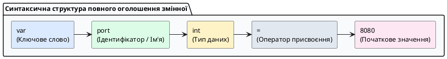

::

Творець мови Роб Пайк пояснював цей вибір принципом природного читання зліва направо:

> _«Ми кажемо: "Оголоси змінну з ім'ям port, яка є числом типу int і дорівнює 8080"»_.

Коли типи стають складними (наприклад, покажчик на масив функцій чи карта зрізів), запис у стилі Go читається набагато легше та позбавлений синтаксичних неоднозначностей C/C++.

---

### Усі способи створення змінних у Go

У практичній розробці на Go використовуються **п'ять основних синтаксичних форм** оголошення змінних:

::field-group

::field{name="1. Повне оголошення з явним типом та значенням" type="Синтаксис var"}
Найбільш явний спосіб. Використовується, коли потрібно чітко зафіксувати специфічний тип (наприклад, `int64` замість стандартного системного `int`):

```go
var maxPayloadSize int64 = 1048576 // 1 МБ
```

::

::field{name="2. Оголошення без значення (Ініціалізація Zero Value)" type="Синтаксис var"}
Змінна створюється та гарантовано заповнюється нульовим значенням для свого типу (`0`, `""`, `false`, `nil`):

```go
var retryCount int       // Автоматично дорівнює 0
var clientIP string      // Автоматично дорівнює ""
var isConnected bool     // Автоматично дорівнює false
```

::

::field{name="3. Оголошення з автоматичним виведенням типу (Type Inference)" type="Синтаксис var"}
Тип не вказується вручну: компілятор автоматично визначає його на основі значення виразу праворуч:

```go
var defaultTimeout = 30 // Компілятор автоматично призначить тип int
```

::

::field{name="4. Коротке оголошення (Short Declaration :=)" type="Локальний синтаксис"}
Найбільш вживаний спосіб у повсякденній розробці всередині функцій. Символ `:=` одночасно створює нову змінну та виводить її тип:

```go
func handleRequest() {
    statusCode := 200        // Створюється локальна змінна типу int
    endpoint := "/api/users" // Створюється локальна змінна типу string
}
```

⚠️ **Застереження:** Оператор `:=` дозволено використовувати **тільки всередині тіла функцій**. На глобальному рівні пакета він заборонений компілятором.
::

::field{name="5. Множинне та блокове групове оголошення" type="Синтаксис var (...)"}
Дозволяє компактно оголосити кілька змінних в один рядок або об'єднати конфігураційні змінні пакета в один охайний блок:

```go
// Оголошення в один рядок:
var a, b, c int = 1, 2, 3
host, port := "127.0.0.1", 8080

// Блокове оголошення конфігурації:
var (
    serverHost string = "0.0.0.0"
    serverPort int    = 8080
    isDebug    bool   = true
)
```

::

::

**Тонкощі `:=`: перевизначення та тіньове перекриття (_shadowing_):**

На відміну від `var`, коротке оголошення дозволяє **перевизначати** вже існуючі змінні, якщо хоча б одна змінна в лівій частині є новою. Це фундаментальна властивість для ідіоми `if err := do(); err != nil`:

```go
func processFile(path string) error {
    f, err := os.Open(path) // f і err — нові змінні
    if err != nil {
        return err
    }
    defer f.Close()

    data := make([]byte, 1024)
    n, err := f.Read(data) // n — нова, err — ПЕРЕВИЗНАЧЕНА (не тіньова)
    _ = n
    if err != nil && err != io.EOF {
        return err
    }

    // ❌ Пастка тіньового перекриття в вкладених блоках:
    if n > 0 {
        n, err := parseData(data[:n]) // ТУТ створюються НОВІ n, err в області if!
        fmt.Println(n, err)            // Зовнішні n, err не змінились
        _ = n
    }
    fmt.Println("Зовнішній n:", n) // Старе значення!
    return nil
}
```

**Три правила:** 1) `:=` вимагає принаймні однієї нової змінної в блоці (`x:=1; x:=2` — помилка `no new variables`), 2) у вкладених блоках `{}` створюється нова область видимості — змінна з тим самим ім'ям **затінює** зовнішню, 3) `go vet -shadow` допомагає виявити ненавмисне затініння.

::caution
**Чому `:=` провокує витоки ресурсів:** класична помилка `if f, err := os.Open(path); err == nil { defer f.Close() }` — `f` існує лише всередині `if`, `defer` за межами не бачить файл. Використовуйте попереднє `var f *os.File` або виносьте `defer` всередину гілки.
::

---

### Суворі правила компілятора щодо змінних

Компілятор Go спроєктований так, щоб запобігати накопиченню помилок та кодового «сміття»:

1. **Заборона невикористаних локальних змінних:**
   Якщо всередині функції ви оголосили змінну, але жодного разу не прочитали її значення, компілятор зупинить збірку з помилкою: `declared and not used: myVar`.
2. **Порожній ідентифікатор (`_` — Blank Identifier):**
   Якщо функція повертає кілька значень (наприклад, результат і помилку), але одне з них вам не потрібне, використовується символ підкреслення `_`. Компілятор ігнорує це значення без виділення зайвої пам'яті:
    ```go
    result, _ := calculateMetrics()
    ```

---

## Константи та генератор послідовностей `iota`

У програмуванні часто виникає потреба зафіксувати незмінні величини: максимальний розмір мережевого пакета, математичні константи, статуси з'єднання або коди помилок.

**Константа (`const`)** — це іменоване значення, яке обчислюється **виключно на етапі компіляції** програми. Після компіляції значення константи «зашивається» в машинний код і фізично не може бути змінене під час виконання.

```go
package main

import "time"

func main() {
	const MaxConnections = 10000 // Валідно: константа відома компілятору
	const AppVersion = "v1.2.4"  // Валідно: незмінний рядок

	// ❌ ПОМИЛКА КОМПІЛЯЦІЇ:
	// const CurrentTime = time.Now()
	// Помилка: time.Now() обчислюється під час виконання (Runtime), а не компіляції!
}
```

::tip
**Проста теорія: що таке константа без типу?**
`const Pi = 3.14` — це «число на папері» без коробки. Коробку (`float32` чи `float64`) підбирають пізніше, коли ви пишете `var x float64 = Pi`. Тому `Pi` підходить і туди, і туди без `float64(Pi)`. Типізована `const Pi float64 = 3.14` — вже в коробці `float64`.
::

::accordion

::accordion-item{label="Для допитливих: чому 1<<100 валідна як константа, але не як int64?" icon="i-lucide-zoom-in"}

У більшості мов константа одразу має тип. У Go нетипізована константа існує в «ідеальному» просторі чисел компілятора (до 512 біт) без переповнення до моменту присвоєння:

```go
const Big = 1 << 100 // 1267650600228229401496703205376 — валідно як нетипізована!
var f float64 = Big   // OK: підлаштувалась під float64
var i int64 = Big     // ❌ constant 1267650... overflows int64 — помилка лише тут

const PrecisePi = 3.141592653589793238462643383279
var p32 float32 = PrecisePi // 3.1415927 — втрата точності після присвоєння
var p64 float64 = PrecisePi // 3.141592653589793 — збережено більше
```

Саме тому `KB = 1 << (10*iota)` працює: `1 << 20` спочатку «на папері», і лише `var limit uint64 = 500*MB` пакує в `uint64` без проміжного `overflow int`.

**Правило:** `const x = 1e1000` валідна на папері, але `var y float64 = 1e1000` — ні (`overflows float64`).

::
::

---

### Принцип роботи лічильника `iota`

У класичних мовах (Java, C#, TypeScript) для створення списку фіксованих варіантів існує спеціальна конструкція `enum` (перелік). У Go творці мови відмовилися від окремого ключового слова `enum` на користь простої та гнучкої комбінації: **користувацького типу**, блоку **`const`** та вбудованого автоінкрементного лічильника **`iota`**.

Слово **`iota`** — це вбудований ідентифікатор, який працює як автоматичний лічильник індексів усередині блоку `const (...)`.

::plant-uml{alt="Принцип роботи лічильника iota"}

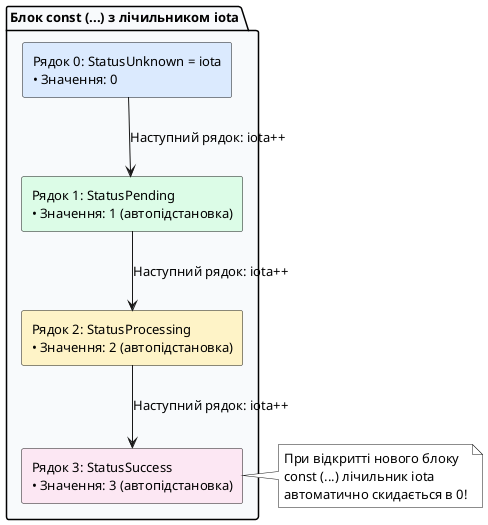

::

**Правила роботи `iota`:**

1. У кожному новому блоці `const (...)` лічильник `iota` **завжди починається з нуля (`0`)**.
2. З кожним наступним рядком усередині блоку значення `iota` автоматично збільшується на `1`.
3. **Автоповторення виразу:** Якщо в наступному рядку константи не вказано тип і значення, Go автоматично дублює формулу попереднього рядка.

---

### Покрокове створення ідіоматичного Enum у Go

Розглянемо правильний підхід до створення переліку статусів HTTP-запиту:

::steps

### Крок 1. Оголошення власного сильного типу

Створюємо новий тип на базі стандартного цілого числа (наприклад, `uint8`):

```go
type RequestStatus uint8
```

### Крок 2. Оголошення констант через iota із захистом Zero Value

Найкращою практикою є резервування значення `0` під невідомий або невизначений стан (_Unknown_), оскільки нульове значення змінної `var s RequestStatus` автоматично дорівнюватиме `0`:

```go
const (
	StatusUnknown    RequestStatus = iota // 0: Стан за замовчуванням (Zero Value)
	StatusPending                         // 1: В очікуванні
	StatusProcessing                      // 2: Обробляється
	StatusSuccess                         // 3: Успішно виконано
	StatusFailed                          // 4: Помилка обробки
)
```

### Крок 3. Реалізація інтерфейсу форматування `fmt.Stringer`

Щоб при виведенні в логи замість сухого числа `2` друкувався зрозумілий текст `"PROCESSING"`, додаємо метод `String()`:

```go
func (s RequestStatus) String() string {
	switch s {
	case StatusPending:
		return "PENDING"
	case StatusProcessing:
		return "PROCESSING"
	case StatusSuccess:
		return "SUCCESS"
	case StatusFailed:
		return "FAILED"
	default:
		return "UNKNOWN"
	}
}
```

::

---

### Розширені інженерні патерни застосування `iota`

```go
package main

import "fmt"

// Патерн 1: Пропуск нульового значення через Blank Identifier (_)
type Priority int

const (
	_ Priority = iota // Пропускаємо індекс 0
	LowPriority       // 1
	MediumPriority    // 2
	HighPriority      // 3
)

// Патерн 2: Побітовий зсув (1 << iota) для створення бітових масок (Bitmask Flags)
// Ідеально підходить для прав доступу в клієнт-серверних API:
type UserRole uint8

const (
	RoleGuest     UserRole = 1 << iota // 1 << 0 = 0001 (1 в десятковій)
	RoleUser                            // 1 << 1 = 0010 (2 в десятковій)
	RoleModerator                       // 1 << 2 = 0100 (4 в десятковій)
	RoleAdmin                           // 1 << 3 = 1000 (8 в десятковій)
)

// Патерн 3: Множники одиниць пам'яті через ступінь двійки
const (
	_           = iota             // Пропускаємо 1 << (10 * 0)
	KB uint64 = 1 << (10 * iota) // 1 << 10 = 1024 байтів
	MB                             // 1 << 20 = 1048576 байтів
	GB                             // 1 << 30 = 1073741824 байтів
	TB                             // 1 << 40 = 1099511627776 байтів
)

func main() {
	// Демонстрація бітових прапорців:
	// Надаємо користувачу права звичайного користувача ТА модератора одночасно:
	activeRoles := RoleUser | RoleModerator
	fmt.Printf("Бітова маска ролей: %04b (десяткове: %d)\n", activeRoles, activeRoles)

	// Перевірка наявності ролі адміністратора через побітове І (&):
	isAdmin := (activeRoles & RoleAdmin) != 0
	isModerator := (activeRoles & RoleModerator) != 0
	fmt.Printf("Користувач є Admin? %t\n", isAdmin)
	fmt.Printf("Користувач є Moderator? %t\n", isModerator)

	// Константи пам'яті:
	fmt.Printf("Ліміт файлу: 500 MB = %d байтів\n", 500*MB)
}
```

---

## Базові типи даних та концепція Zero Values

Go — це мова із **суворою статичною типізацією** (_statically and strongly typed_). Компілятор ніколи не робить прихованих перетворень: складання `int32` та `int64` вимагає обов'язкового явного приведення `int64(val32)`.

### Концепція нульових значень (Zero Values)

**Проста аналогія:** уявіть готель. У C вам видають номер після попереднього гостя без прибирання — у шухлядах «сміття» (випадкові байти). У Go покоївка (компілятор + runtime) **завжди прибирає номер перед заселенням** — усі шухляди порожні. Тому `var s string` — це чистий порожній рядок `""`, а не випадкові символи.

На відміну від C/C++, де неініціалізована змінна містить залишкове «сміття» пам'яті, у Go виділена пам'ять **завжди гарантовано занулюється компілятором**. Це не «зручність», а гарантія безпеки:

| Тип даних                                           | Нульове значення (_Zero Value_)     | Фізичний стан у пам'яті                                                       |
| :-------------------------------------------------- | :---------------------------------- | :---------------------------------------------------------------------------- |
| Числові типи (`int`, `uint`, `float64`)             | `0` або `0.0`                       | Усі байти заповнені `0x00`                                                    |
| Булевий тип (`bool`)                                | `false`                             | Байт значення `0x00`                                                          |
| Рядки (`string`)                                    | `""` (порожній рядок)               | Порожній рядок (деталі `StringHeader` — див. розділ про рядки нижче)          |
| Покажчики (`*T`), Інтерфейси (`any`)                | `nil`                               | Відсутня адреса (деталі — див. розділ про покажчики)                          |
| Зрізи (`[]T`), Карти (`map[K]V`), Канали (`chan T`) | `nil`                               | Відсутній дескриптор (деталі — див. `make vs new` та розділи про зрізи/карти) |
| Структури (`struct`)                                | Усі поля містять свої _Zero Values_ | Повний блок пам'яті структури занулено                                        |

**Наслідок для бекенду:** завдяки Zero Value `var s string` можна одразу робити `s += "hello"` без перевірки на `nil`, а `var m map[string]int` — ні: читати `m["k"]` дасть `0`, але `m["k"]=1` → `panic`. Тому карти та зрізи вимагають `make` — деталі в розділі `make vs new` пізніше, поки достатньо запам'ятати правило з таблиці.

---

### Детальний огляд числових типів

#### Цілі числа зі знаком та без знаку

**Контекст вибору типу:** у клієнт-серверних системах тип — це не лише діапазон, а й контракт. Система зберігає `userID` в PostgreSQL як `BIGINT` → у Go це `int64`, а мережевий порт за RFC — `0..65535` → `uint16`. Використання `int` для порту дозволить передати `-1` і зламати `net.Listen`.

**Внутрішній механізм:** `int` та `uint` — це типи розміру машинного слова: 4 байти на 32-бітній ОС і 8 байтів на 64-бітній. Вони найшвидші (одна інструкція CPU), але **непереносні** для бінарних протоколів та файлів. Фіксовані `int32/int64` гарантують однаковий розмір на всіх платформах. Псевдоніми `byte = uint8` та `rune = int32` (оголошені як `type byte = uint8`) не створюють нового типу — тому `byte(255)` та `uint8(255)` взаємозамінні без приведення, на відміну від `type UserID int64`.

**Що буде якщо інакше — переповнення (_wrap-around_):** Go не панікує при переповненні цілих — значення циклічно обертається за модулем $2^N$, як у C з `-fwrapv`. Це джерело багів безпеки:

```go
var a int8 = 127
a++ // 127 + 1 == -128 (0b01111111 -> 0b10000000)
var b uint8 = 255
b++ // 255 + 1 == 0
// Для мережевих лічильників це означає що 10 ГБ файл + 1 байт може стати 0!
```

Компілятор ловить лише константне переповнення (`const x int8 = 128` — помилка), але не динамічне. Для безпечної арифметики перевіряйте межі вручну або використовуйте `math/bits.Add64` з прапорцем переносу. Тип `uintptr` — ціле достатнє для зберігання адреси, потрібне лише для `unsafe.Pointer` та системних викликів, ніколи не використовуйте його як звичайний лічильник.

```go
package main

import (
	"fmt"
	"math"
)

func main() {
	// Системні цілі типи (розмір 32 або 64 біти залежно від архітектури ОС)
	var totalUsers int = 1_000_000 // Символ _ підвищує читабельність
	var userIndex uint = 42        // Тільки невід'ємні числа

	// Цілі типи фіксованої розрядності зі знаком
	var tempSensor int8 = -15          // Від -128 до 127 (1 байт)
	var clientOffset int16 = -3000     // Від -32768 до 32767 (2 байти)
	var metricCount int32 = 150000     // 4 байти (аліас rune)
	var unixTimestamp int64 = 1719584000 // 8 байтів (мітки часу)

	// Беззнакові типи (ідеальні для мережевих пакетів)
	var rawByte byte = 0xFF            // byte — це аліас для uint8 (0..255)
	var networkPort uint16 = 8080      // Мережевий TCP/UDP порт (0..65535)
	var maxConns uint32 = 100_000      // 4 байти (0..4294967295)
	var fileSize uint64 = 10 << 30     // 10 ГБ (8 байтів)

	// Явне перетворення типів
	sum := int64(networkPort) + unixTimestamp
	fmt.Printf("Порт: %d, Загальний час: %d, MaxInt64: %d\n", networkPort, sum, math.MaxInt64)
}
```

---

#### Дійсні числа, комплексні числа та булевий тип

```go
package main

import (
	"fmt"
	"math"
)

func main() {
	// Дійсні числа за стандартом IEEE-754
	var cpuUsage float32 = 0.452     // 4 байти
	var latencyMs float64 = 12.84752 // 8 байтів (стандартний вибір)

	// Комплексні числа
	var z1 complex64 = 1 + 2i
	var z2 complex128 = complex(3, 4)

	// Булевий тип
	var isTLS bool = true
	var isClosed = false

	if isTLS && !isClosed {
		fmt.Printf("Затримка: %.2f мс, CPU: %.1f%%, Z1: %v\n", latencyMs, cpuUsage*100, z1)
	}

	// Перевірка на нечисло (NaN) та нескінченність
	if math.IsNaN(math.Sqrt(-1)) {
		fmt.Println("Математична помилка: отримано NaN")
	}
}
```

---

#### Рядки, байти та робота з Unicode (`string`, `byte`, `rune`)

У сучасних клієнт-серверних архітектурах обробка тексту (парсинг JSON, читання HTTP-заголовків, запити до баз даних, валідація користувацьких даних) становить левову частку роботи бекенда. Мова Go має одну з найбільш продуманих та ефективних систем роботи з текстом, спроєктовану авторами стандарту UTF-8 — Кеном Томпсоном та Робом Пайком.

##### Фізична природа рядка в пам'яті

**Рядок (`string`) у Go — це незмінна (_immutable_) послідовність байтів довільної довжини.**

Поки що достатньо знати: рядок — це текст, який не можна змінити (`msg[0]='A'` — помилка). Як він влаштований всередині — показано нижче. Деталі про покажчики (`*byte`) розкриті в розділі про покажчики пізніше — зараз сприймайте `Data` як «адресу складу».

На рівні середовища виконання Go рядок описується структурою **`StringHeader`** (16 байтів на 64-біт):

::plant-uml{alt="Фізична будова рядка StringHeader у Go"}

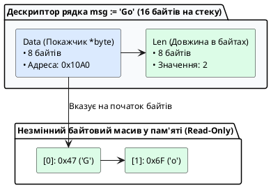

::

::important
**Чому рядки в Go незмінні (_Immutable_) — аналогія «вікно на склад»:**

Уявіть рядок не як коробку з літерами, а як **вікно (дескриптор 16B) на незмінний склад байтів**. Склад (байти `Go`) — `read-only`, вікно — лише `Data` (адреса складу) + `Len` (скільки бачити).

1. **Безпека багатопоточності:** на склад можна дивитись з 100 вікон-горутин одночасно без замків — ніхто не може пересунути коробки на складі.
2. **Нульові алокації при зрізанні:** `sub := str[0:5]` — вирізали нове вікно на той самий склад, коробки не копіювали, лише 16B вікна.
3. **Захист від модифікації:** `msg[0] = 'A'` — спроба перефарбувати коробку через вікно → компілятор `cannot assign to msg[0]`: склад засклений.

::

---

##### Два види рядкових літералів

Go підтримує два способи оголошення рядків у коді:

1. **Інтерпретовані рядки у подвійних лапках (`"..."`):**
    - Обробляють спеціальні escape-послідовності: `\n` (новий рядок), `\t` (табуляція), `\"` (лапка), `\\` (зворотний слеш), `\uXXXX` (Unicode символ).
    - Не можуть містити фізичні переноси рядків без конкатенації через оператор `+`.
2. **Сирі рядкові літерали у зворотних апострофах (`` `...` `` — Raw String Literals):**
    - Зберігають текст **абсолютно без змін**: усі пробіли, символи нового рядка та подвійні лапки залишаються як є.
    - У них не працюють escape-послідовності (наприклад, символи `\n` трактуватимуться як два окремі символи `\` і `n`).
    - Ідеально підходять для багаторядкових SQL-запитів, JSON-схем, HTML-шаблонів та регулярних виразів.

```go
package main

import "fmt"

func main() {
	// Інтерпретований рядок з escape-символами:
	jsonSnippet := "{\n\t\"status\": 200,\n\t\"message\": \"OK\"\n}"

	// Сирий рядковий літерал (чистий, читабельний код):
	sqlQuery := `
		SELECT id, username, email
		FROM users
		WHERE is_active = true
		  AND role = 'admin'
		ORDER BY created_at DESC;
	`

	fmt.Println("JSON:", jsonSnippet)
	fmt.Println("SQL:", sqlQuery)
}
```

---

##### Анатомія кодування UTF-8: Байти проти Рун

Стандарт кодування **UTF-8** використовує змінну кількість байтів для збереження символів:

- Символи базової латиниці (ASCII: `A-Z`, `a-z`, `0-9`) займають **1 байт**.
- Символи кирилиці, грецького алфавіту, івриту займають **2 байти**.
- Символи азійських мов (китайська, японська) займають **3 байти**.
- Емодзі, рідкісні математичні та історичні символи займають **4 байти**.

Через це виникає найпоширеніша помилка розробників-початківців:

```go
package main

import (
	"fmt"
	"unicode/utf8"
)

func main() {
	text := "Київ 🇺🇦"

	// 1. Вбудована функція len() повертає кількість ФІЗИЧНИХ БАЙТІВ, а не букв!
	// "К" (2 байти) + "и" (2) + "ї" (2) + "в" (2) + " " (1) + прапор (8 байтів) = 17 байтів
	fmt.Printf("Фізична довжина в байтах len(text): %d\n", len(text))

	// 2. Функція RuneCountInString рахує реальну кількість символів (рун):
	fmt.Printf("Реальна кількість символів: %d\n", utf8.RuneCountInString(text))

	// 3. ПОМИЛКА: доступ за індексом text[0] повертає лише перший БАЙТ (uint8)!
	fmt.Printf("text[0] у шістнадцятковому форматі: 0x%X (нечитабельний шматок літери!)\n", text[0])
}
```

---

##### Тип `rune`: повноцінне представлення символу Unicode

**Аналогія «цеглина vs літера»:** `byte` — це одна цеглина (1B), `rune` — готова літера, яка може складатися з 1-4 цеглин. `len("Київ")` рахує цеглини (8), `utf8.RuneCountInString` — літери (4). `text[0]` дає першу цеглину (0xD0), а не літеру «К».

Для того щоб працювати з текстом посимвольно (незалежно від того, скільки байтів займає літера в UTF-8), Go надає тип **`rune`** (руна).

**`rune` — це вбудований синонім (аліас) для цілого числа `int32` (4 байти).** Числове значення руни відповідає офіційній кодовій точці символу в таблиці Unicode (_Unicode Code Point_).

- Літерал руни записується в **одинарних лапках**: `'A'`, `'Ї'`, `'⌘'`, `'🚀'`.
- Для перетворення між типами використовується явне приведення (зрізи `[]T` детально в розділі про зрізи пізніше, поки сприймайте як «масив літер»):
    - `[]rune(str)` — перетворює рядок на масив рун (дозволяє безпечно брати символи за індексами).
    - `[]byte(str)` — перетворює рядок на змінюваний масив сирих байтів.
    - `string(runeSlice)` — збирає масив рун назад в єдиний UTF-8 рядок.

```go
package main

import (
	"fmt"
)

func main() {
	str := "Слава Україні!"

	// 1. Перетворення рядка на зріз рун для безпечного доступу до окремих літер:
	runes := []rune(str)
	fmt.Printf("Перша літера: %c, Третя літера: %c\n", runes[0], runes[2]) // 'С', 'а'

	// 2. Мутація тексту через зріз рун:
	runes[0] = 'Ж'
	modifiedStr := string(runes)
	fmt.Println("Модифікований рядок:", modifiedStr)

	// 3. Ітерація for-range автоматично декодує UTF-8 у руни:
	// Зверніть увагу: byteIndex перескакує через 2 байти для кирилиці!
	for byteIndex, r := range "Go Го" {
		fmt.Printf("Позиція байта: %d -> Символ: '%c' (Unicode: %U, Десятковий код: %d)\n",
			byteIndex, r, r, r)
	}
}
```

---

## Форматоване виведення як частина системи типів: пакет `fmt`

У кожному лістингу вище ми використовували `fmt.Println` та `fmt.Printf`, але не пояснювали їх. Для бекенд-інженера форматування — це не «красивий друк», а контракт між типом Go та текстовим представленням у логах, HTTP-відповідях та відлагодженні. Розуміння verb'ів запобігає витоку типів у логи та помилкам серіалізації.

**Контекст:** коли сервер логує `userID=42`, він перетворює `int64` у десяткові символи. Пакет `fmt` робить це через рефлексію та інтерфейс `fmt.Stringer` (метод `String() string`), який ми вже реалізували для `RequestStatus:272`. Тому вибір verb — це вибір способу інтерпретації байтів типу.

**Внутрішній механізм:** `fmt.Printf(format, args...)` парсить рядок формату, шукає `%` verb і викликає відповідний форматувальник. Verb визначає базу числення, кодування та точність, а не тип аргументу. Невідповідність (`%d` для `string`) не панікує, але друкує `%!d(string=hello)` — сигнал помилки.

::field-group

::field{name="Базові verb'и для всіх типів" type="Універсальні"}

- `%v` — значення у форматі за замовчуванням (для `bool` → `%t`, для `int` → `%d`, для `float` → `%g`, для `string` → `%s`). Використовуйте в логах за замовчуванням.
- `%#v` — Go-синтаксис значення (`"hello"` з лапками, `[]int{1,2}`) — для відлагодження (детальніше після розділу про зрізи).
- `%T` — **тип** значення (`int64`, `RequestStatus`) — корисно після вивчення `any`.
- `%%` — екранований знак `%`.

::

::field{name="Цілі числа" type="int / byte / rune"}

- `%d` — десяткова (`42`), `%b` — двійкова (`101010`), `%o`/`%O` — вісімкова (`52`/`0o52`), `%x`/`%X` — шістнадцяткова (`2a`/`2A`).
- `%c` — символ за кодом (`65` → `A`), `%q` — символ у лапках (`'A'`), `%U` — Unicode `U+0041` (деталі `rune` — див. вище).

::

::field{name="Дійсні та рядки" type="float / string"}

- `%f`/`%F` — фіксована точка `123.456`, `%e`/`%E` — експоненційна `1.23e+02`, `%g`/`%G` — автоматичний вибір коротшого.
- `%s` — рядок як є, `%q` — екранований `"%q"` з лапками, `%x` — байти рядка в hex.
- `%p` — адреса покажчика (деталі — в розділі про покажчики пізніше).

::

::

**Прапорці ширини та точності:**

```go
fmt.Printf("%%v: %v\n", 78)          // 78
fmt.Printf("%%#v: %#v\n", "Hello")   // "Hello"
fmt.Printf("%%T: %T\n", 78)          // int
fmt.Printf("%%b: %b\n", 78)          // 1001110
fmt.Printf("%%x: %x  %%X: %X\n", 255, 255) // ff  FF
fmt.Printf("%%f: %f\n", 56.8789)     // 56.878900
fmt.Printf("%%.2f: %.2f\n", 56.8789) // 56.88 — 2 знаки після крапки
fmt.Printf("%%9.2f: %9.2f\n", 3456.8789) // "  3456.88" — ширина 9, вирівнювання праворуч
fmt.Printf("%%-9.2f: %-9.2f!\n", 3456.8789) // "3456.88  !" — прапорець - вирівнює ліворуч
```

::warning
**Чому `%v` небезпечний у продакшені:** `%v` для `[]byte{0x47,0x45,0x54}` надрукує `[71 69 84]`, а `%s` — `GET`. Для мережевих буферів завжди вказуйте явний `%x` або `%q`, інакше логи стануть нечитабельними або витечуть бінарні дані.
::

---

## Операції мови Go: арифметика, логіка, побітові оператори та пріоритети

### Арифметичні операції

Go підтримує стандартні арифметичні операції над числовими типами:

| Оператор | Назва                 | Приклад  | Особливості                                                                                                 |
| :------- | :-------------------- | :------- | :---------------------------------------------------------------------------------------------------------- |
| **`+`**  | Додавання             | `a + b`  | Працює також для конкатенації рядків (`"a" + "b"`)                                                          |
| **`-`**  | Віднімання            | `a - b`  | Знакове віднімання або унарний мінус `-x`                                                                   |
| **`*`**  | Множення              | `a * b`  | Множення чисел                                                                                              |
| **`/`**  | Ділення               | `10 / 4` | **Увага:** ділення цілих чисел дає ціле число `2`. Для `2.5` один із операндів має бути дійсним: `10.0 / 4` |
| **`%`**  | Остача від ділення    | `35 % 3` | Результат `2`. Працює **тільки з цілими числами**                                                           |
| **`++`** | Постфіксний інкремент | `x++`    | Збільшує на 1. **Є інструкцією, а не виразом!** Запис `y = x++` або `++x` заборонений                       |
| **`--`** | Постфіксний декремент | `x--`    | Зменшує на 1. Також є окремою інструкцією                                                                   |

---

### Умовні вирази та логічні оператори

Результатом умовних виразів завжди є булеве значення `true` або `false`:

- **Оператори порівняння:** `==` (рівно), `!=` (не рівно), `<` (менше), `>` (більше), `<=` (менше або рівно), `>=` (більше або рівно).
- **Логічні оператори:**
    - **`&&` (Логічне І / Кон'юнкція):** повертає `true`, тільки якщо обидва операнди істинні.
    - **`||` (Логічне АБО / Диз'юнкція):** повертає `true`, якщо хоча б один операнд істинний.
    - **`!` (Логічне НЕ / Заперечення):** змінює значення на протилежне (`!true` $\rightarrow$ `false`).

---

### Порозрядні (побітові) операції

Побітові операції виконуються над окремими двійковими розрядами цілих чисел:

| Оператор | Назва                   | Опис та приклад                                                                                              |
| :------- | :---------------------- | :----------------------------------------------------------------------------------------------------------- |
| **`<<`** | Зсув вліво              | `2 << 2` $\rightarrow$ число `0010` зсувається вліво на 2 позиції $\rightarrow$ `1000` (8)                   |
| **`>>`** | Зсув вправо             | `16 >> 3` $\rightarrow$ число `10000` зсувається вправо на 3 позиції $\rightarrow$ `00010` (2)               |
| **`&`**  | Побітове І              | `1` тільки якщо обидва розряди дорівнюють `1` (`110 & 010 = 010`)                                            |
| **`\|`** | Побітове АБО            | `1` якщо хоча б один розряд дорівнює `1` (`101 \| 010 = 111`)                                                |
| **`^`**  | Побітове XOR            | `1` якщо тільки один із розрядів дорівнює `1` (`101 ^ 011 = 110`). Унарний `^x` виконує інверсію бітів (NOT) |
| **`&^`** | Скидання біта (AND NOT) | `z = x &^ y`: скидає в 0 біти в `x`, де в `y` стоять `1`                                                     |

```go
package main

import "fmt"

func main() {
	var a int = 5 // Двійкове: 101
	var b int = 2 // Двійкове: 010

	fmt.Printf("a: %03b, b: %03b\n", a, b)
	fmt.Printf("a & b (AND):      %03b (%d)\n", a&b, a&b)   // 000 (0)
	fmt.Printf("a | b (OR):       %03b (%d)\n", a|b, a|b)   // 111 (7)
	fmt.Printf("a ^ b (XOR):      %03b (%d)\n", a^b, a^b)   // 111 (7)
	fmt.Printf("a &^ b (AND NOT): %03b (%d)\n", a&^b, a&^b) // 101 (5)
}
```

---

### Складені операції присвоєння (_compound assignments_)

**Проста теорія:** `a += b` — скорочення для `a = a + b`. Поки що користуйтесь `+= -= *= /=` для лічильників. Решта `<<= &^=` — для бітових масок, деталі в розділі про побітові операції.

Go надає 12 форм скороченого присвоєння, де `a op= b` еквівалентно `a = a op b`, але обчислює `a` лише один раз (важливо для `m[key] += 1` або `s[i] <<= 2`):

| Оператор | Еквівалент   | Приклад               | Go-специфіка                               |
| :------- | :----------- | :-------------------- | :----------------------------------------- |
| `+=`     | `a = a + b`  | `total += 5`          | Працює для чисел і рядків (`s += "world"`) |
| `-=`     | `a = a - b`  | `balance -= fee`      |                                            |
| `*=`     | `a = a * b`  | `count *= 2`          |                                            |
| `/=`     | `a = a / b`  | `avg /= n`            | Паніка якщо `b==0`                         |
| `%=`     | `a = a % b`  | `a %= 15`             | Лише цілі                                  |
| `<<=`    | `a = a << b` | `flags <<= 2`         |                                            |
| `>>=`    | `a = a >> b` | `flags >>= 1`         |                                            |
| `&=`     | `a = a & b`  | `mask &= 0xFF`        |                                            |
| `\|=`    | `a = a \| b` | `roles \|= RoleAdmin` |                                            |
| `^=`     | `a = a ^ b`  | `a ^= 10`             |                                            |
| `&^=`    | `a = a &^ b` | `mask &^= RoleGuest`  | Скидання бітів (AND NOT)                   |

```go
a := 10
b := 5
a += b; fmt.Println(a) // 15
a -= b; fmt.Println(a) // 10
a *= 10; fmt.Println(a) // 100
a /= b; fmt.Println(a) // 20
a %= 15; fmt.Println(a) // 5
a <<= 2; fmt.Println(a) // 20 (00101 -> 10100)
a >>= 1; fmt.Println(a) // 10
a &= 8; fmt.Println(a) // 8  (01010 & 01000)
a ^= 10; fmt.Println(a) // 2  (01000 ^ 01010)
a |= 5; fmt.Println(a) // 7  (00010 | 00101)
```

::caution
**Go-специфіка — це інструкції, а не вирази:** `x++`, `x--` та всі `op=` є **інструкціями (_statements_)**, а не виразами. Записи `y = x++`, `y = (a += b)` або `++x` — **помилка компіляції** `expected statements`. На відміну від C/Java, де `a++` повертає значення, в Go це запобігає помилкам `if (a = b++)`.
::

### Таблиця пріоритетів та асоціативність

Операції обчислюються за 5 рівнями пріоритету, всередині рівня — **зліва направо** (лівоасоціативні), крім унарних (правоасоціативні):

| Рівень            | Пріоритет          | Оператори                                                                 | Асоціативність                       |
| :---------------- | :----------------- | :------------------------------------------------------------------------ | :----------------------------------- |
| **5 (Найвищий)**  | Унарні та множення | `*`, `/`, `%`, `<<`, `>>`, `&`, `&^`, унарні `+`, `-`, `!`, `^`, `*`, `&` | Унарні — праворуч, бінарні — ліворуч |
| **4**             | Додавання          | `+`, `-`, `\|`, `^` (бінарний XOR)                                        | Ліворуч                              |
| **3**             | Порівняння         | `==`, `!=`, `<`, `<=`, `>`, `>=`                                          | Ліворуч                              |
| **2**             | Логічне І          | `&&`                                                                      | Ліворуч                              |
| **1 (Найнижчий)** | Логічне АБО        | `\|\|`                                                                    | Ліворуч                              |

::warning
**Спочатку множення, потім додавання — як у школі:** `* / % << >> &` виконуються раніше `+ -`, а `==` ще пізніше. Тому `a + b << 2` це `a + (b << 2)`, а не `(a+b) << 2`.

**Пастка з `&` та `==`:** `&` (пріоритет 5) вище `==` (3), тому `if x & mask == 0` парситься як `if x & (mask == 0)` — помилка типів! Завжди пишіть `if (x & mask) == 0`. Коли сумніваєтесь — ставте дужки та запускайте `go vet`.
::

---

## Керуючі конструкції: розгалуження та цикли

У мові Go потік виконання програми керується мінімалістичним, але надзвичайно потужним набором інструкцій: умовними переходами `if...else`, багатогілковим перемикачем `switch` та універсальним циклом `for`.

---

### Умовні конструкції `if...else` та блокова ініціалізація

Конструкція `if` перевіряє істинність булевого виразу. Якщо вираз повертає `true`, виконується відповідний блок інструкцій у фігурних дужках `{}`.

::important
**Синтаксичні правила `if` у Go:**

1. **Круглі дужки `()` навколо умовного виразу є необов'язковими** (і за стандартом `gofmt` видаляються).
2. **Фігурні дужки `{}` є строго обов'язковими**, навіть якщо в тілі умови лише один рядок (на відміну від C/Java/C#, де можна було написати `if (x) doSomething();`).
3. Блок `else` або `else if` **зобов'язаний починатися на тому самому рядку**, де закривається попередня фігурна дужка `}` (наприклад: `} else {`). Розрив рядка компілятор вважатиме синтаксичною помилкою.

::

Розглянемо всі форми використання `if`:

```go
package main

import "fmt"

func main() {
	statusCode := 404

	// 1. Базова конструкція if / else if / else
	if statusCode == 200 {
		fmt.Println("Запит успішний (200 OK)")
	} else if statusCode == 404 {
		fmt.Println("Ресурс не знайдено (404 Not Found)")
	} else if statusCode == 500 {
		fmt.Println("Внутрішня помилка сервера (500 Internal Error)")
	} else {
		fmt.Println("Інший статус-код:", statusCode)
	}

	// 2. if з блоком короткої ініціалізації (Simple Statement)
	// Синтаксис: if [ініціалізація]; [умова] { ... }
	// Змінна 'length' існує ВИКЛЮЧНО всередині гілок if та else!
	if length := len("user_session_token"); length > 10 {
		fmt.Printf("Токен валідний, довжина: %d символів\n", length)
	} else {
		fmt.Printf("Токен занадто короткий: %d символів\n", length)
	}

	// length тут вже НЕ існує! Компілятор захищає простір імен від зайвих змінних.
}
```

::tip
**Ідіома перевірки помилок у Go через блок ініціалізації:**
У клієнт-серверних застосунках блок ініціалізації `if` є стандартом де-факто для безпечного виклику функцій та миттєвої перевірки результату:

```go
if err := server.Start(); err != nil {
    log.Fatalf("Критична помилка запуску сервера: %v", err)
}
```

::

---

### Багатогілковий перемикач `switch`

Конструкція `switch` дозволяє компактно порівняти значення виразу з набором варіантів (`case`) без необхідності писати довгі ланцюжки `else if`.

::field-group

::field{name="Автоматичний break" type="Особливість Go"}
У Go **не потрібно писати `break`** наприкінці кожного блоку `case`! Як тільки Go знаходить збіг, він виконує код цього `case` і автоматично виходить зі `switch`.
::

::field{name="Множинні значення в одному case" type="Гнучкість"}
В одному рядку `case` можна перелічити кілька значень через кому: `case 400, 401, 403, 404:`.
::

::field{name="Оператор fallthrough" type="Примусовий перехід"}
Якщо вам дійсно необхідно передати виконання наступному `case` (як у мові C), використовується явне ключове слово `fallthrough`.
::

::field{name="Tagless Switch (Без виразу)" type="Ідіома Go"}
Якщо після слова `switch` не вказувати змінну, `switch` працює як елегантна заміна складної конструкції `if-else`, перевіряючи довільні булеві умови.
::

::

Розглянемо практичні приклади:

```go
package main

import "fmt"

func main() {
	httpMethod := "POST"

	// 1. Класичний switch за значенням зі списком значень та default
	switch httpMethod {
	case "GET", "HEAD":
		fmt.Println("Безпечний метод читання даних (Read-Only)")
	case "POST", "PUT", "PATCH":
		fmt.Println("Метод мутації стану (Write/Update)")
	case "DELETE":
		fmt.Println("Метод видалення ресурсу")
	default:
		fmt.Println("Непідтримуваний HTTP метод:", httpMethod)
	}

	// 2. Tagless switch (switch без виразу)
	// Працює як чистий ланцюжок логічних умов
	clientScore := 85
	switch {
	case clientScore >= 90:
		fmt.Println("Рівень: Преміум клієнт (Рейтинг A)")
	case clientScore >= 75 && clientScore < 90:
		fmt.Println("Рівень: Надійний клієнт (Рейтинг B)")
	default:
		fmt.Println("Рівень: Базовий клієнт")
	}

	// 3. Демонстрація оператора fallthrough
	// fallthrough примусово провалює виконання у наступний case БЕЗ перевірки його умови!
	step := 1
	fmt.Println("Початок виконання конвеєра:")
	switch step {
	case 1:
		fmt.Println("  [Крок 1] Перевірка валідності токена")
		fallthrough
	case 2:
		fmt.Println("  [Крок 2] Зчитування профілю з бази даних")
		fallthrough
	case 3:
		fmt.Println("  [Крок 3] Формування HTTP-відповіді")
	}
}
```

---

### Цикл `for`: усі форми та патерни організації повторень

У Go навмисно немає окремих конструкцій `while` чи `do-while`. Замість цього розробник має у своєму розпорядженні єдиний, але всеосяжний цикл **`for`**.

Формальний синтаксис повного циклу:

```go
for [ініціалізація_лічильника]; [умова_виконання]; [постінструкція_зміни] {
    // Тіло циклу
}
```

Розглянемо всі форми циклу `for` у Go:

#### Класичний цикл із лічильником

```go
package main

import "fmt"

func main() {
	// Спрацює рівно 3 рази (ітерації i=1, i=2, i=3)
	for i := 1; i <= 3; i++ {
		fmt.Printf("Ітерація лічильника: %d (квадрат: %d)\n", i, i*i)
	}
}
```

---

#### Форми з винесенням компонентів та аналог `while`

Усі три частини заголовка `for` є опціональними. Їх можна виносити за межі:

```go
package main

import "fmt"

func main() {
	// Варіант А: Ініціалізація винесена назовні
	i := 1
	for ; i <= 3; i++ {
		fmt.Println("Варіант A:", i)
	}

	// Варіант Б: Форма умови (Аналог класичного while)
	// Використовується, коли цикл має тривати, поки умова залишається true
	attempts := 3
	for attempts > 0 {
		fmt.Printf("Залишилося спроб підключення: %d\n", attempts)
		attempts--
	}
}
```

---

#### Нескінченний цикл та керування через `break` / `continue`

Якщо пропустити всі умови, запис `for {}` створить вічний цикл (аналог `while (true)` у C/Java). Він незамінний для фонових демонів, мережевих серверів, що слухають порт, або обробників черг:

```go
package main

import "fmt"

func main() {
	counter := 0

	for {
		counter++

		// continue: пропустити решту тіла і перейти до наступної ітерації
		if counter%2 == 0 {
			continue // Пропускаємо парні числа
		}

		// break: негайно перервати цикл і вийти з нього
		if counter > 5 {
			fmt.Println("Досягнуто ліміту. Зупинка нескінченного циклу.")
			break
		}

		fmt.Println("Обробка непарного числа:", counter)
	}
}
```

---

#### Вкладені цикли та вихід за мітками (Labeled Break / Continue)

Коли цикли вкладені один в одного, звичайний `break` виходить лише з найглибшого поточного циклу. Щоб перервати зовнішній батьківський цикл, у Go використовуються **мітки (_Labels_)**:

```go
package main

import "fmt"

func main() {
	// 1. Вкладений цикл: побудова таблиці множення 3x3
	fmt.Println("Таблиця множення:")
	for row := 1; row <= 3; row++ {
		for col := 1; col <= 3; col++ {
			fmt.Printf("%d\t", row*col)
		}
		fmt.Println() // Перенос на новий рядок
	}

	// 2. Вихід із зовнішнього циклу за міткою SearchLoop
	fmt.Println("\nПошук цільової координати (2, 2):")
SearchLoop:
	for x := 1; x <= 3; x++ {
		for y := 1; y <= 3; y++ {
			fmt.Printf("Перевірка координати [%d, %d]\n", x, y)
			if x == 2 && y == 2 {
				fmt.Println("  🎯 Ціль знайдено! Миттєвий вихід з усіх циклів.")
				break SearchLoop // Перериває весь цикл SearchLoop!
			}
		}
	}
	fmt.Println("Роботу завершено.")
}
```

---

#### Перебір колекцій через `for-range`

Для ітерації по рядках, масивах, зрізах та картах Go надає спеціальну ергономічну форму **`for-range`**:

```go
package main

import "fmt"

func main() {
	// 1. Перебір рядка (індекс байта + руна символу)
	word := "Go 🚀"
	for byteIndex, runeValue := range word {
		fmt.Printf("Байт %d -> Символ: %c (код %d)\n", byteIndex, runeValue, runeValue)
	}

	// 2. Перебір з ігноруванням індексу через порожній ідентифікатор _
	servers := [3]string{"node-1", "node-2", "node-3"}
	fmt.Println("\nСписок серверів:")
	for _, name := range servers {
		fmt.Println("  Вузол:", name)
	}

	// 3. Отримання тільки індексів
	for idx := range servers {
		fmt.Println("  Індекс вузла:", idx)
	}
}
```

---

## Статичні фіксовані масиви (`[N]T`)

У системному програмуванні та розробці мережевих сервісів масиви є фундаментальною структурою для збереження однотипних даних у неперервній ділянці пам'яті: фіксованих буферів сокетів, криптографічних ключів (наприклад, 32-байтний хеш SHA-256) або IPv4-адрес.

### Фізична організація масиву в пам'яті

**Масив у Go** — це суміжний монолітний блок оперативної пам'яті фіксованої довжини, що складається з елементів одного типу.

Головна особливість масивів Go — **повна відсутність прихованих накладних витрат**: у пам'яті немає жодних додаткових покажчиків, метаданих чи посилань на об'єкти (як це відбувається у Java чи Python). Масив `[4]byte` фізично займає рівно 4 байти в пам'яті:

::plant-uml{alt="Фізичне розміщення масиву [4]byte в пам'яті"}

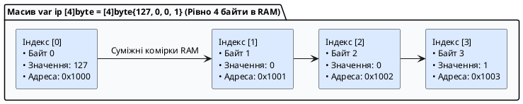

::

Розмір масиву в пам'яті обчислюється за простою математичною формулою:

::math-formula{tex="\text{SizeInBytes} = N \times \text{sizeof}(T)"}
::

Наприклад, масив `[8]int64` займає $8 \times 8 = 64$ байти.

---

### Залізне правило типу: розмірність `N` є частиною типу даних

У більшості мов (C#, Java, C++) розмір масиву є просто його динамічною властивістю. **У Go розмірність `N` є невіддільною частиною самого типу даних!**

```go
package main

func processArray(data [4]int) {
	// Функція очікує МАСИВ З РІВНО ЧОТИРЬОХ ЦІЛИХ ЧИСЕЛ
}

func main() {
	var arr4 [4]int
	var arr5 [5]int

	processArray(arr4) // ✅ Успішно: типи [4]int ідентичні

	// ❌ ПОМИЛКА КОМПІЛЯЦІЇ:
	// processArray(arr5)
	// cannot use arr5 (variable of type [5]int) as [4]int value in argument to processArray
}
```

Типи `[4]int` та `[5]int` для компілятора Go є **настільки ж несумісними, як `string` та `bool`**! Це дає компілятору можливість гарантувати безпеку меж пам'яті ще під час компіляції.

---

### Усі способи створення та ініціалізації масивів

У мові Go існує **сім практичних патернів** ініціалізації статичних масивів:

```go
package main

import "fmt"

func main() {
	// 1. Оголошення неініціалізованого масиву (Ініціалізація Zero Values)
	// Створюється масив, усі елементи якого гарантовано занулені компілятором:
	var counters [4]int // [0, 0, 0, 0]

	// 2. Повний літерал масиву з явним вказанням розміру
	statusCodes := [3]int{200, 404, 500}

	// 3. Часткова ініціалізація
	// Невизначені елементи автоматично заповнюються нулями:
	scores := [5]int{10, 20} // [10, 20, 0, 0, 0]

	// 4. Автоматичний підрахунок кількості елементів через три крапки [...]
	// Компілятор сам порахує кількість елементів і підставить розмір 3:
	dnsServers := [...]string{"1.1.1.1", "8.8.8.8", "9.9.9.9"}

	// 5. Розріджений індексований масив (Sparse Array)
	// Дозволяє задати значення для конкретних індексів за синтаксисом index: value
	httpStatusMap := [600]string{
		200: "OK",
		400: "Bad Request",
		404: "Not Found",
		500: "Internal Server Error",
	}

	// 6. Комбінована індексація
	// Елементи без індексів ідуть по порядку, далі індекс 7 перескакує вперед:
	customSequence := [...]int{1, 2, 3, 7: 100, 200}
	// Індекси: [0]=1, [1]=2, [2]=3, [3..6]=0, [7]=100, [8]=200

	// 7. Багатовимірні масиви (Матриці)
	matrix := [2][3]int{
		{1, 2, 3}, // Рядок 0
		{4, 5, 6}, // Рядок 1
	}

	fmt.Println("1. Нульовий масив:", counters)
	fmt.Println("2. Статус коди:", statusCodes)
	fmt.Println("3. Часткові бали:", scores)
	fmt.Printf("4. DNS сервери (довжина %d): %v\n", len(dnsServers), dnsServers)
	fmt.Println("5. HTTP 404:", httpStatusMap[404])
	fmt.Println("6. Послідовність:", customSequence)
	fmt.Printf("7. Елемент матриці [1][2]: %d\n", matrix[1][2]) // 6
}
```

---

### Операції над масивами: доступ, функції `len`/`cap` та контроль меж

- **Доступ за індексом:** індексація починається з `0` і закінчується `N-1`. Звернення здійснюється через квадратні дужки: `arr[i] = 10`.
- **Функції `len()` та `cap()`:** для статичних масивів обидві функції повертають однакове константне число — фізичний розмір масиву `N`.
- **Захист меж пам'яті (_Bounds Checking_):**
    - Якщо індекс виходить за межі і відомий компілятору (наприклад, `arr[10]` для масиву з 5 елементів), компілятор зупинить збірку: `invalid array index 10 (out of bounds for 5-element array)`.
    - Якщо індекс обчислюється динамічно під час виконання програми, Go викине безпечну паніку: `panic: runtime error: index out of range [10] with length 5`. Вихід за межі пам'яті (Buffer Overflow) у Go фізично неможливий!

---

### Ітерація по масивах

```go
package main

import "fmt"

func main() {
	routes := [...]string{"/api/v1/auth", "/api/v1/users", "/api/v1/health"}

	// Спосіб 1: Класичний цикл із лічильником через len()
	fmt.Println("Класичний обхід:")
	for i := 0; i < len(routes); i++ {
		fmt.Printf("  Маршрут #%d: %s\n", i, routes[i])
	}

	// Спосіб 2: Ідіоматичний for-range (індекс + значення)
	fmt.Println("\nОбхід через for-range:")
	for idx, path := range routes {
		fmt.Printf("  [%d] -> %s\n", idx, path)
	}

	// Спосіб 3: Отримання тільки значень (пропуск індексу через _)
	fmt.Println("\nТільки значення:")
	for _, path := range routes {
		fmt.Println("  Endpoint:", path)
	}
}
```

---

### Семантика значень (Value Semantics): масиви копіюються повністю!

Це одна з найважливіших відмінностей Go від інших мов:

::important
**У Go масив — це значення (_Value_), а не посилання!**
Коли ви присвоюєте один масив іншому (`arr2 = arr1`) або передаєте масив як параметр у функцію, Go здійснює **повне побайтове копіювання всіх елементів**.
::

```go
package main

import "fmt"

// Функція отримує ПОВНУ КОПІЮ масиву!
func modifyArray(data [3]int) {
	data[0] = 999
	fmt.Println("Всередині функції modifyArray:", data) // [999, 20, 30]
}

// Функція отримує покажчик на оригінальний масив
func modifyArrayByPointer(dataPtr *[3]int) {
	dataPtr[0] = 777 // Мутує оригінальну пам'ять
}

func main() {
	original := [3]int{10, 20, 30}

	// 1. Присвоєння створює незалежний дублікат у пам'яті:
	copied := original
	copied[1] = 888

	fmt.Printf("Оригінал: %v\n", original) // [10, 20, 30] — НЕ ЗМІНИВСЯ!
	fmt.Printf("Копія:    %v\n", copied)   // [10, 888, 30]

	// 2. Передача за значенням не впливає на оригінал:
	modifyArray(original)
	fmt.Printf("Оригінал після modifyArray: %v\n", original) // [10, 20, 30]

	// 3. Передача покажчика змінює оригінал без копіювання пам'яті:
	modifyArrayByPointer(&original)
	fmt.Printf("Оригінал після modifyArrayByPointer: %v\n", original) // [777, 20, 30]
}
```

::tip
**Чому масиви рідко передають у функції напряму:**
Якщо передати масив `[1000000]int64` за значенням, програмі доведеться скопіювати 8 мегабайтів пам'яті на кожен виклик функції. Тому для динамічної та швидкої роботи без копіювання в Go використовують **зрізи (_slices_)** або передають покажчик на масив `*[N]T`.
::

---

### Порівняння масивів між собою

Масиви однакового типу можна безпосередньо порівнювати за допомогою операторів **`==`** та **`!=`** (за умови, що тип їхніх елементів підтримує порівняння):

```go
package main

import "fmt"

func main() {
	a := [3]int{1, 2, 3}
	b := [3]int{1, 2, 3}
	c := [3]int{1, 2, 4}

	fmt.Println("a == b:", a == b) // true (усі елементи збігаються)
	fmt.Println("a == c:", a == c) // false
}
```

---

## Функції та функціональне програмування в Go

У мові Go функції є фундаментальним будівельним блоком будь-якої архітектури. Go підтримує парадигму функцій як **об'єктів першого класу** (_First-Class Citizens_), що дозволяє писати чистий, модульний та виразний код без зайвої складності.

---

### Анатомія оголошення функцій та передача параметрів

Функція — це іменований, логічно ізольований блок коду, який приймає вхідні дані (параметри), виконує алгоритмічні дії та повертає результат.

```
func   FunctionName   (param1 Type, param2 Type)   ReturnType   {
    // Тіло функції
    return value
}
```

::plant-uml{alt="Анатомія оголошення функції у Go"}

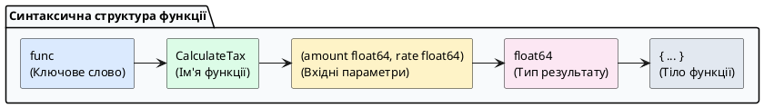

::

**Правила найменування функцій:**

- **Експортовані функції (Public):** назва починається з великої літери `PascalCase` (наприклад, `CalculateTotal`, `NewServer`). Вони доступні іншим пакетам проєкту.
- **Приватні функції (Private / Package-level):** назва починається з малої літери `camelCase` (наприклад, `formatResponse`, `validateSession`). Вони доступні лише всередині свого пакета.

```go
package main

import "fmt"

// 1. Базова функція з двома параметрами
func multiply(x int, y int) int {
	return x * y
}

// 2. Скорочений запис параметрів однакового типу:
// Якщо кілька параметрів, що йдуть поспіль, мають однаковий тип,
// його можна вказати лише один раз наприкінці групи:
func createConnection(host, ip string, port, timeout int) string {
	return fmt.Sprintf("Підключення до %s (%s):%d з таймаутом %ds", host, ip, port, timeout)
}

func main() {
	res := multiply(6, 7)
	connStr := createConnection("api.production", "10.0.0.1", 443, 30)

	fmt.Println("Результат множення:", res)
	fmt.Println("Конфігурація:", connStr)
}
```

---

### Варіативні функції (`...T` — Variadic Functions)

**Варіативна функція** — це функція, яка може приймати довільну (змінну) кількість аргументів одного типу.

- У списку параметрів перед типом вказуються три крапки: `...Type`.
- Всередині тіла функції варіативний параметр стає звичайним **зрізом `[]Type`**.
- **Залізне правило:** у функції може бути **лише один** варіативний параметр, і він **зобов'язаний бути останнім** у списку параметрів.

```go
package main

import "fmt"

// Варіативна функція розрахунку суми будь-якої кількості чисел
func calculateSum(prefix string, numbers ...int) string {
	total := 0
	// numbers всередині функції є зрізом []int
	for _, n := range numbers {
		total += n
	}
	return fmt.Sprintf("%s: %d", prefix, total)
}

func main() {
	// 1. Виклик без чисел (numbers буде порожнім зрізом nil / len=0)
	fmt.Println(calculateSum("Порожня сума"))

	// 2. Передача довільної кількості аргументів через кому
	fmt.Println(calculateSum("Сума трьох чисел", 10, 20, 30))
	fmt.Println(calculateSum("Сума п'яти чисел", 1, 2, 3, 4, 5))

	// 3. Розпакування вже існуючого зрізу за допомогою синтаксису slice...
	userScores := []int{85, 92, 78, 96}
	fmt.Println(calculateSum("Загальний бал", userScores...))
}
```

---

### Повернення результатів: множинні та іменовані значення

На відміну від C++, Java або Python, де функції повертають лише одне значення (змушуючи кидати важкі винятки `try/catch` або пакувати дані в класи-обгортки), **у Go функції можуть повертати кілька незалежних значень одночасно**.

#### Множинне повернення (Multiple Return Values)

Головна архітектурна ідіома Go — повернення пари `(Результат, Помилка)`:

```go
package main

import (
	"errors"
	"fmt"
)

// Функція безпечного ділення: повертає результат ТА помилку
func safeDivide(dividend, divisor float64) (float64, error) {
	if divisor == 0 {
		return 0, errors.New("помилка математики: ділення на нуль неможливе")
	}
	return dividend / divisor, nil // nil означає відсутність помилки
}

func main() {
	// Отримання двох результатів
	res, err := safeDivide(10, 2)
	if err != nil {
		fmt.Println("Помилка:", err)
		return
	}
	fmt.Printf("Результат ділення: %.2f\n", res)

	// Ігнорування результату або помилки через Blank Identifier (_)
	_, errDivZero := safeDivide(10, 0)
	if errDivZero != nil {
		fmt.Println("Очікувано перехоплено помилку:", errDivZero)
	}
}
```

---

#### Іменовані результати повернення (Named Return Values)

Ви можете дати імена змінним, які функція повертає, прямо в її заголовку:

```go
package main

import "fmt"

// Змінні width, height та area автоматично створюються компілятором
// із нульовими значеннями (0) на початку виконання функції:
func calculateRectangle(w, h int) (width, height, area int) {
	width = w
	height = h
	area = w * h

	// "Голий" return (Naked return) автоматично повертає width, height, area
	return
}

func main() {
	w, h, a := calculateRectangle(5, 10)
	fmt.Printf("Ширина: %d, Висота: %d, Площа: %d кв.од.\n", w, h, a)
}
```

::tip
**Рекомендація щодо Naked Return:**
Використовуйте "голий" `return` тільки в дуже коротких і простих функціях (до 5 рядків). У великих функціях завжди пишіть явний `return width, height, area`, щоб не змушувати читача коду шукати по всій функції, що саме зараз записано в іменовані змінні.
::

---

### Функції першого класу: функціональний тип та передача функцій

У Go функція — це повноцінне значення, яке має свій тип.

**Тип функції** визначається списком типів її параметрів та списком типів повернених значень. Наприклад, функції `func add(x, y int) int` та `func sub(a, b int) int` мають один і той самий тип: **`func(int, int) int`**.

```go
package main

import "fmt"

// Оголошення власного функціонального типу через type
type MathOperation func(int, int) int

func add(a, b int) int      { return a + b }
func multiply(a, b int) int { return a * b }

// 1. Функція вищого порядку (приймає іншу функцію як параметр)
func executeOperation(x, y int, op MathOperation) {
	result := op(x, y)
	fmt.Printf("Результат операції над %d і %d: %d\n", x, y, result)
}

// 2. Функція-фабрика (повертає іншу функцію як результат)
func selectOperation(opName string) MathOperation {
	if opName == "mul" {
		return multiply
	}
	return add
}

func main() {
	// Присвоєння функції змінній
	var mathFunc MathOperation = add
	fmt.Println("Прямий виклик через змінну:", mathFunc(10, 5))

	// Передача функцій як аргументів (Патерн Strategy / Callback)
	executeOperation(10, 5, add)
	executeOperation(10, 5, multiply)

	// Отримання функції з фабрики
	calc := selectOperation("mul")
	fmt.Println("Виклик згенерованої функції:", calc(4, 5))
}
```

---

### Анонімні функції (Anonymous Functions / Lambdas)

**Анонімна функція** — це функція, яка не має власного імені і визначається безпосередньо за місцем використання.

```go
package main

import "fmt"

func main() {
	// 1. Анонімна функція, збережена в локальну змінну
	greet := func(name string) {
		fmt.Printf("Привіт, %s!\n", name)
	}
	greet("Олексій")

	// 2. Миттєвий виклик анонімної функції (IIFE — Immediately Invoked Function Expression)
	// Оголошується і одразу викликається за допомогою круглих дужок наприкінці:
	func(host string, port int) {
		fmt.Printf("Ініціалізація внутрішнього сокета на %s:%d...\n", host, port)
	}("127.0.0.1", 9000)
}
```

---

### Замикання (Closures): стан та захоплення змінних

**Замикання (_Closure_)** — це функція, яка посилається на змінні з зовнішнього лексичного контексту (scope) і «захоплює» їх.

Навіть після того, як зовнішня функція завершила своє виконання, захоплена змінна **продовжує жити в пам'яті (у купі)** і зберігає свій стан між послідовними викликами внутрішньої функції.

::plant-uml{alt="Принцип роботи замикання Closure у Go"}

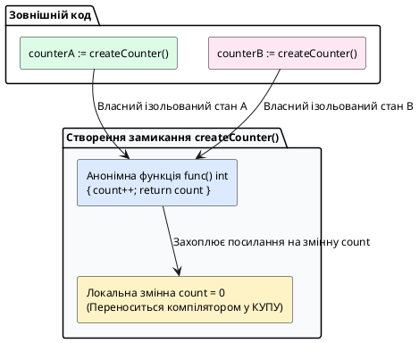

::

```go
package main

import "fmt"

// Функція створює та повертає ізольований лічильник
func createCounter(start int) func() int {
	currentValue := start // Змінна захоплюється замиканням і живе в купі!

	return func() int {
		currentValue++
		return currentValue
	}
}

func main() {
	// Створюємо два абсолютно незалежні екземпляри замикання
	counterA := createCounter(0)
	counterB := createCounter(100)

	fmt.Println("Лічильник A:", counterA()) // 1
	fmt.Println("Лічильник A:", counterA()) // 2
	fmt.Println("Лічильник A:", counterA()) // 3

	// Лічильник B має власну ізольовану пам'ять:
	fmt.Println("Лічильник B:", counterB()) // 101
	fmt.Println("Лічильник B:", counterB()) // 102

	fmt.Println("Лічильник A знову:", counterA()) // 4 (стан зберігся!)
}
```

---

### Рекурсивні функції: базовий випадок та стек викликів

**Рекурсивна функція** — це функція, яка в процесі виконання викликає саму себе з новими вхідними параметрами.

::important
**Анатомія будь-якої коректної рекурсії:**

1. **Базовий випадок (Base Case / Умова зупинки):** обов'язкова умова, при якій функція повертає конкретне значення без подальших рекурсивних викликів. Без базового випадку виникне нескінченна рекурсія і переповнення пам'яті стека (_Stack Overflow_).
2. **Крок рекурсії (Recursive Step):** виклик функцією самої себе, де аргументи з кожним кроком наближаються до базового випадку.

::

```go
package main

import "fmt"

// 1. Обчислення факторіалу числа N! = N * (N-1)!
// Приклад для N=3: factorial(3) = 3 * factorial(2) -> 2 * factorial(1) -> 1 => 6
func factorial(n uint64) uint64 {
	if n <= 1 {
		return 1 // Базовий випадок: 0! = 1 та 1! = 1
	}
	return n * factorial(n-1) // Крок рекурсії
}

// 2. Обчислення чисел послідовності Фібоначчі: F(n) = F(n-1) + F(n-2)
func fibonacci(n int) int {
	if n <= 0 {
		return 0 // Базовий випадок 1
	}
	if n == 1 {
		return 1 // Базовий випадок 2
	}
	return fibonacci(n-1) + fibonacci(n-2) // Подвійний рекурсивний крок
}

func main() {
	fmt.Printf("Факторіал 5! = %d\n", factorial(5)) // 120
	fmt.Printf("Факторіал 6! = %d\n", factorial(6)) // 720

	fmt.Println("\nПерші 7 чисел Фібоначчі:")
	for i := 0; i < 7; i++ {
		fmt.Printf("F(%d) = %d\n", i, fibonacci(i))
	}
}
```

::tip
**Рекурсія проти циклів у продуктивному коді:**
Кожен рекурсивний виклик створює новий стек-фрейм у пам'яті. Якщо глибина рекурсії сягає десятків тисяч кроків, перевагу слід надавати звичайним циклам `for`, які виконуються швидше та використовують константний обсяг пам'яті $O(1)$.
::

---

## Покажчики (Pointers) та безпека роботи з пам’яттю

У системному програмуванні для досягнення максимальної швидкодії необхідно безпосередньо керувати розташуванням даних у пам'яті та уникати зайвого копіювання великих структур. Головним інструментом для цього є **покажчики** (_Pointers_).

---

### Що таке покажчик: фізична адресація в RAM

Коли ви оголошуєте будь-яку змінну (наприклад, `var x int = 42`), середовище виконання Go виділяє для неї комірку в системній оперативній пам'яті. Кожна така комірка має свою унікальну числову **фізичну адресу**, яка записується у шістнадцятковому форматі (наприклад, `0x00c000014088`).

**Покажчик (_Pointer_)** — це спеціальна змінна, значенням якої є **адреса іншої змінної в пам'яті**.

::plant-uml{alt="Механіка адресації покажчика в оперативній пам'яті"}

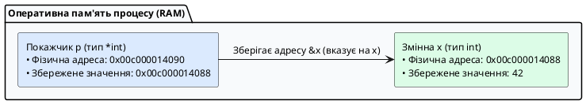

::

Покажчики в Go є **строго типізованими**: тип покажчика залежить від типу змінної, на яку він вказує. Покажчик на ціле число має тип `*int`, покажчик на рядок — `*string`, а покажчик на структуру `User` — `*User`.

---

### Оператори взяття адреси `&` та розіменування `*`

Для роботи з покажчиками Go надає два фундаментальні унарні оператори:

1. **Оператор взяття адреси (`&`):** ставиться перед іменем змінної та повертає її адресу в пам'яті (`&x`).
2. **Оператор розіменування (`*`):** ставиться перед змінною-покажчиком і дозволяє **прочитати** або **змінити** значення в тій комірці пам'яті, на яку цей покажчик вказує (`*p = 100`).

```go
package main

import "fmt"

func main() {
	var x int = 42

	// 1. Оголошуємо покажчик типу *int та записуємо в нього адресу змінної x:
	var p *int = &x

	fmt.Printf("1. Значення змінної x:              %d\n", x)
	fmt.Printf("2. Фізична адреса змінної x (&x):    %p\n", &x)
	fmt.Printf("3. Значення покажчика p (адреса):    %p\n", p)
	fmt.Printf("4. Власна адреса покажчика p (&p):   %p\n", &p)

	// 5. Розіменування покажчика для читання значення:
	fmt.Printf("5. Читання значення через *p:        %d\n", *p)

	// 6. Розіменування покажчика для зміни значення в пам'яті:
	*p = 100
	fmt.Printf("6. Нове значення x після *p = 100:   %d\n", x) // x тепер дорівнює 100!
}
```

---

### Нульовий покажчик `nil` та небезпека Nil Pointer Dereference

Якщо покажчик оголошено, але йому не присвоєно адресу конкретної змінної, його нульовим значенням (_Zero Value_) є **`nil`** (покажчик, який вказує на нульову адресу `0x0`).

::caution
**Спроба розіменувати `nil`-покажчик викликає фатальну паніку:**

```go
var p *int // p дорівнює nil
*p = 50    // 💥 panic: runtime error: invalid memory address or nil pointer dereference
```

**Захисний патерн:** Перед розіменуванням невідомого або отриманого ззовні покажчика завжди перевіряйте його на `nil`:

```go
if p != nil {
    fmt.Println("Значення:", *p)
} else {
    fmt.Println("Покажчик не ініціалізовано (nil)")
}
```

::

---

### Вбудована функція `new()`

Для швидкого виділення пам'яті під безіменну змінну Go надає вбудовану функцію **`new(T)`**:

- Вона приймає тип `T`.
- Виділяє в пам'яті ділянку, достатню для збереження значення типу `T`.
- Гарантовано занулює цю пам'ять (_Zero Value_).
- Повертає типізований покажчик **`*T`** на виділену пам'ять.

```go
package main

import "fmt"

func main() {
	// Створює ціле число зі значенням 0 і повертає *int:
	numPtr := new(int)

	fmt.Printf("Адреса: %p, Значення за замовчуванням: %d\n", numPtr, *numPtr)

	*numPtr = 777
	fmt.Printf("Оновлене значення: %d\n", *numPtr)
}
```

---

### Складні форми: покажчики на покажчики та покажчики на масиви

::note
**Поки що достатньо:** `&x` — взяти адресу, `*p` — прочитати за адресою. `**int` нижче — для допитливих, можна пропустити на першому читанні.
::

```go
package main

import "fmt"

func main() {
	// 1. Покажчик на покажчик (**T) — багаторівнева непряма адресація (рідко в прикладному коді)
	var a int = 10
	var p *int = &a    // p вказує на a
	var pp **int = &p  // pp вказує на покажчик p

	fmt.Printf("a: %d, через *p: %d, через **pp: %d\n", a, *p, **pp)

	**pp = 500 // Зміна a через подвійне розіменування
	fmt.Println("Нове значення a:", a) // 500

	// 2. Покажчик на статичний масив (*[N]T)
	var numbers [3]int = [3]int{10, 20, 30}
	var arrPtr *[3]int = &numbers

	// Go дозволяє звертатися до елементів масиву через покажчик без явного (*arrPtr)[0]:
	arrPtr[0] = 999 // Автоматичне розіменування компілятором
	fmt.Println("Масив після зміни через покажчик:", numbers) // [999, 20, 30]
}
```

---

### Покажчики та функції: мутація параметрів та уникнення копіювання

За замовчуванням усі аргументи передаються у функції **за значенням** (_Pass by Value_) — створюється їхня повна локальна копія. Якщо функція повинна змінити оригінальну змінну викликача або уникнути важкого копіювання пам'яті, параметр оголошується як покажчик:

```go
package main

import "fmt"

// 1. Передача за значенням: копіюється число, оригінал НЕ змінюється
func squareByValue(val int) {
	val = val * val
}

// 2. Передача за покажчиком: функція змінює значення за фізичною адресою
func squareByPointer(valPtr *int) {
	if valPtr != nil {
		*valPtr = (*valPtr) * (*valPtr)
	}
}

func main() {
	number := 5

	squareByValue(number)
	fmt.Println("Після squareByValue:", number) // 5 (без змін)

	squareByPointer(&number)
	fmt.Println("Після squareByPointer:", number) // 25 (оригінал змінено!)
}
```

::tip
**Чому покажчики в Go безпечні (на відміну від C/C++):**

1. **Відсутність адресної арифметики:** у Go заборонено писати `ptr++` чи `ptr + 4`. Ви не можете випадково вийти за межі дозволеної пам'яті та пошкодити чужі дані процесу.
2. **Автоматичний збирач сміття (Garbage Collector):** вам не потрібно вручну викликати `free()` або `delete`. Пам'ять звільняється автоматично, виключаючи витоки пам'яті (_Memory Leaks_) та повторне звільнення (_Double Free_).
3. **Абсолютна безпека повернення локальних адрес завдяки Escape Analysis.**

::

---

## `make` vs `new` vs літерал: хто виділяє пам'ять і що повертає

**Проста теорія наперед:** `var s []int` — порожня коробка для зрізу (можна `append`), `var m map[string]int` — відсутня коробка для карти (писати не можна). `make` — дає готову коробку. Деталі про `chan` — в наступних лекціях, тут — лише `slice`/`map`.

**Контекст:** Go має три способи створення значень, і їх плутанина — джерело `nil panic`.

**Внутрішній механізм:**

| Спосіб                                                   | Що робить                                                       | Що повертає                                 | Де пам'ять              | Коли використовувати                                               |
| :------------------------------------------------------- | :-------------------------------------------------------------- | :------------------------------------------ | :---------------------- | :----------------------------------------------------------------- |
| `new(T)`                                                 | Виділяє `sizeof(T)` нулів                                       | `*T` (покажчик)                             | Купа (втікає)           | Рідко; лише коли потрібен `*T` на zero value без літералу          |
| `&T{...}`                                                | Виділяє + ініціалізує поля                                      | `*T`                                        | Купа (якщо втікає)      | Ідіоматичний конструктор `NewUser`                                 |
| `make([]T, len, cap)` / `make(map[K]V)` / `make(chan T)` | Створює **ініціалізований дескриптор** (SliceHeader/hmap/канал) | `[]T` / `map[K]V` / `chan T` (не покажчик!) | Купа для бакетів/буфера | Єдиний спосіб створити карту/канал для запису                      |
| Літерал `[]int{1,2}` / `map[string]int{"a":1}`           | Виділяє + копіює елементи                                       | `[]T` / `map[K]V`                           | Купа                    | Коли початкові дані відомі                                         |
| `var s []int` / `var m map[string]int`                   | Нічого не виділяє                                               | `nil` дескриптор                            | —                       | Читати можна (`len(nil)==0`, `m["k"]` → zero), писати — **паніка** |

```go
var s []int              // nil slice: len=0 cap=0 ptr=nil — append працює!
s = append(s, 42)        // OK: growslice виділить масив
fmt.Println(s[0])

var m map[string]int     // nil map
fmt.Println(m["missing"]) // 0 — читання OK
// m["new"] = 1          // ❌ panic: assignment to entry in nil map
m = make(map[string]int) // ініціалізація
m["new"] = 1             // OK

p1 := new(int)           // *int -> 0
p2 := &int{}             // ідентично, але дозволяє &User{ID:42}
```

::warning
**Пастка `new` для карт/зрізів:** `new(map[string]int)` повертає `*map[string]int` (покажчик на nil карту) — майже ніколи не потрібно! Використовуйте `make(map[string]int)` або `map[string]int{}`.
::

**Простою мовою — «відсутня коробка vs порожня коробка»:** `var m map[string]int` — у вас _немає коробки_ (`nil`). Запитати «що в коробці під ключем `k`?» → `0` (покажуть порожньо), але покласти `m[k]=1` → **паніка**, бо класти нікуди. `make(map...)` або `map[string]int{}` — _дали порожню коробку з полицями_ — класти можна. Для зрізів різниця критична для JSON: `var s []int` (`nil`) → `json.Marshal` дає `null`, а `s:=[]int{}` → `[]`. Клієнт очікує `[]` — віддайте порожній, інакше `null` зламає `for ... of` у JS.

---

## Модель пам’яті процесу: Стек, Купа та Escape Analysis

Для того щоб писати високонавантажені бекенд-сервіси, інженер повинен чітко розуміти, де фізично розташовуються змінні його програми. Адресний простір Go-процесу розділений на дві фундаментальні області пам'яті: **Стек (_Stack_)** та **Купу (_Heap_)**.

::plant-uml{alt="Організація пам'яті процесу: Стек та Купа"}

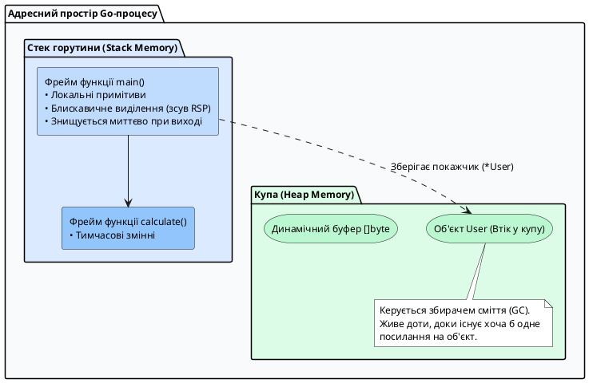

::

### Порівняльна характеристика Стека та Купи

| Критерій        | Стек (_Stack Memory_)                                                   | Купа (_Heap Memory_)                                                   |
| :-------------- | :---------------------------------------------------------------------- | :--------------------------------------------------------------------- |
| **Призначення** | Зберігання локальних змінних та стек-фреймів функцій                    | Зберігання динамічних об'єктів та спільних даних                       |
| **Швидкодія**   | **Надзвичайно висока** (виділення — це просто зміна регістра CPU `RSP`) | **Повільніша** (пошук вільного блоку пам'яті через алокатор)           |
| **Очищення**    | **Миттєве та безкоштовне** (автоматично при завершенні функції)         | **Потребує роботи GC** (збирач сміття сканує пам'ять і навантажує CPU) |
| **Розмір**      | Починається з **2 КБ** на горутину і динамічно росте при потребі        | Обмежена лише загальним обсягом оперативної пам'яті сервера            |

---

### Механізм аналізу втечі (Escape Analysis)

У мовах C/C++ повернення покажчика на локальну змінну функції є фатальною помилкою (_Dangling Pointer Bug_): стек-фрейм функції знищується, і покажчик починає вказувати на зруйноване «сміття».

**У Go повертати покажчик на локальну змінну абсолютно безпечно!**

**Проста аналогія — «готельний номер vs квартира»:** стек — це готельний номер: виселяєшся (функція завершилась) — номер прибирають. Якщо ти дав другу адресу свого номера (`return &x`), готель змушений **переселити тебе в довгоживучу квартиру (купа)**, щоб друг не прийшов у порожній номер (dangling pointer).

Компілятор Go під час збірки виконує спеціальний статичний аналіз — **Escape Analysis (Аналіз втечі)**:

1. Якщо компілятор бачить, що посилання на локальну змінну виходить за межі своєї функції (наприклад, повертається назовні через `return &x` або передається в `fmt.Println(x)` де `x` потрапляє в `any`), змінна **«втікає в купу» (_escapes to heap_)**.
2. Компілятор автоматично замінює виділення пам'яті на виклик системного алокатора купи `runtime.newobject`.
3. Якщо ж змінна використовується виключно всередині функції, вона виділяється на швидкому локальному стеку (зсув регістра `RSP` — 1 інструкція CPU).

```go
package main

type ServerConfig struct {
	Port    int
	Host    string
	IsDebug bool
}

// Функція створює конфігурацію та повертає покажчик на неї
func NewServerConfig(port int) *ServerConfig {
	// Змінна cfg оголошена локально, але посилання на неї повертається назовні:
	cfg := ServerConfig{
		Port:    port,
		Host:    "0.0.0.0",
		IsDebug: true,
	}
	return &cfg // Компілятор автоматично перенесе cfg у купу!
}

func main() {
	configPtr := NewServerConfig(8080)
	_ = configPtr
}
```

---

### Дослідження втечі — для допитливих (`-gcflags="-m"`)

Поки що достатньо знати: повернув `&x` назовні — змінна в купі, ні — на стеці. Подробиці нижче — для налагодження алокацій.

Ви можете на власні очі побачити всі рішення компілятора щодо розміщення змінних, скомпілювавши код із прапорцем `-gcflags="-m"`:

::terminal-preview{title="Аналіз виділення пам'яті компілятора Go" :cursor="true"}

<div class="line"><span class="opacity-40">$</span> <strong class="font-bold">go build -gcflags="-m" main.go</strong></div>
<div class="line">./main.go:17:9: <span class="text-yellow-400 font-bold">&cfg escapes to heap</span></div>
<div class="line">./main.go:11:2: <span class="text-green-400 font-bold">moved to heap: cfg</span></div>
::

::tip
**Типові причини втечі змінних у купу:**

1. **Повернення адреси змінної назовні** (`return &local`).
2. **Передача у функції з параметром `any` або `interface{}`:** наприклад, виклик `fmt.Println(x)` завжди змушує змінну `x` втекти в купу, оскільки інтерфейс вимагає пакування значення у купу.
3. **Змінні динамічного або невідомого розміру:** зрізи, довжина яких визначається під час виконання програми (`make([]byte, dynamicSize)`).
4. **Занадто великі об'єкти:** якщо структура або масив перевищує ліміт стека (понад 64 КБ), Go автоматично виділяє її в купі.

::

---

## Власні типи, Структури, Методи та Композиція

Мова Go навмисно відмовилася від традиційної складної ієрархії об'єктно-орієнтованого програмування (класів, модифікаторів доступу `public`/`private`/`protected`, віртуальних таблиць та множинного наслідування). Замість цього Go пропонує напрочуд елегантну систему: **користувацькі типи**, **структури (`struct`)**, **методи** та **композицію через анонімне вбудовування**.

---

### Створення нових типів (_Defined Types_) проти Псевдонімів (_Type Aliases_)

У мові Go за допомогою ключового слова `type` можна створювати як повністю нові незалежні типи, так і короткі синоніми до існуючих.

#### Оголошення нового сильного типу (Defined Type)

Синтаксис: `type NewType UnderlyingType`

Коли ви оголошуєте новий тип, Go створює **абсолютно новий, самостійний тип даних**. Навіть якщо базовим типом є `int64`, новий тип `UserID` не можна випадково змішати зі звичайним числом або іншим ідентифікатором:

```go
package main

import "fmt"

// Створюємо нові сильні типи
type UserID int64
type OrderID int64
type Kilometer float64
type Mile float64

// Новий тип може мати власні методи!
func (k Kilometer) ToMeters() float64 {
	return float64(k) * 1000.0
}

func sendNotification(userID UserID) {
	fmt.Printf("Відправка сповіщення користувачу #%d\n", userID)
}

func main() {
	var uid UserID = 101
	var oid OrderID = 101

	sendNotification(uid) // ✅ Успішно

	// ❌ ПОМИЛКА КОМПІЛЯЦІЇ:
	// sendNotification(oid)
	// cannot use oid (variable of type OrderID) as UserID value in argument to sendNotification

	// ❌ ПОМИЛКА КОМПІЛЯЦІЇ:
	// sendNotification(101) // Нетипізована константа підставиться, але змінну int64 передати не можна!

	var distance Kilometer = 5.2
	fmt.Printf("Дистанція: %.1f км = %.0f метрів\n", distance, distance.ToMeters())
}
```

::tip
**Чому це критично для архітектури бекенда:**
Створення сильних типів для ідентифікаторів (`UserID`, `ProductID`, `TenantID`) на етапі компіляції виключає класичну помилку, коли розробник передає `productID` у функцію замість `userID`.
::

---

#### Псевдоніми типів (Type Aliases)

Синтаксис: `type AliasName = TargetType` (зі знаком рівності `=`)

Псевдонім **не створює нового типу**, а лише дає додаткове ім'я вже існуючому типу. Вони повністю взаємозамінні без будь-якого явного приведення:

```go
package main

// Вбудовані псевдоніми стандартної бібліотеки Go:
// type byte = uint8
// type rune = int32
// type any = interface{}

// Власний псевдонім для скорочення довгої назви функції:
type HTTPHandler = func(path string, statusCode int) error
```

---

### Структури (`struct`): анатомія, ініціалізація та пам'ять

**Структура (`struct`)** — це складений тип даних, який об'єднує іменовані поля різних типів в один неперервний блок пам'яті.

::plant-uml{alt="Фізичне розміщення структури User в оперативній пам'яті"}

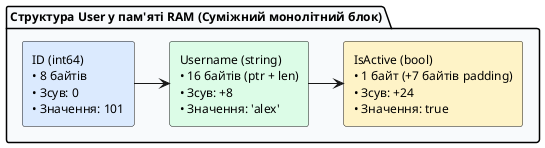

::

**Проста теорія наперед:** поля структури лежать підряд, як коробки в ряд. Поки що достатньо знати це. Чому з'являється `+7B` — деталі нижче для оптимізації.

**Чому `+7 байтів padding` — теорія вирівнювання (_alignment_) для допитливих:**

На 64-бітній архітектурі процесор читає пам'ять словами по 8 байтів, адреси `int64` та `string` (який містить `uintptr`) повинні бути кратними 8. Компілятор вставляє невидимі байти-заповнювачі, щоб наступне поле починалося з вирівняної адреси:

- `ID int64` (8B, align 8) → зсув 0
- `Username string` (16B = ptr 8 + len 8, align 8) → зсув 8
- `IsActive bool` (1B, align 1) → зсув 24, але загальний `Size` структури округлюється до кратного `maxAlign` (8) → 32B, тому 7B padding в кінці.

**Простою мовою — «фури по 8 місць»:** CPU завантажує пам'ять фурами по 8B. `int64` та `string` (всередині `uintptr`) повинні стояти на початку фури (адреса %8==0), інакше треба дві фури. Компілятор ставить 7B прокладок щоб наступна фура почалась рівно. Змініть порядок на `IsActive` першим — отримаєте більше «дірок»: `bool(1) + 7 padding + int64(8) + string(16) = 32B` теж, але `struct{bool; bool; int64}` (1+1+6 pad+8=16) vs `struct{int64; bool; bool}` (8+1+1+6 pad=16) vs невдалий `struct{bool; int64; bool}` (1+7+8+1+7=24) → економія 8B × 1 млн = 8 МБ. Перевіряйте `unsafe.Sizeof(User{})` та `unsafe.Alignof`, запускайте `go vet -fieldalignment`.

::warning
**Копія структури копіює дескриптори, а не дані:** `u2 := u1` копіює `StringHeader` (16B) рядка, але обидва `Username` вказують на одні й ті самі байти в пам'яті. Зміна `u2.Username = "new"` створить новий дескриптор, але `copy` байтів не відбувається до мутації через `[]byte`.
::

#### Усі способи створення та ініціалізації структур

```go
package main

import "fmt"

type User struct {
	ID       int64
	Username string
	Email    string
	IsActive bool
}

// Ідіоматична функція-конструктор NewUser
func NewUser(id int64, username, email string) *User {
	return &User{
		ID:       id,
		Username: username,
		Email:    email,
		IsActive: true, // Значення за замовчуванням
	}
}

func main() {
	// 1. Іменований літерал (найбільш безпечний і рекомендований спосіб)
	u1 := User{
		ID:       1,
		Username: "alex_dev",
		Email:    "alex@kostyl.dev",
		IsActive: true,
	}

	// 2. Позиційний літерал (вимагає строгого порядку ВСІХ полів, не рекомендується)
	u2 := User{2, "maria_qa", "maria@kostyl.dev", false}

	// 3. Ініціалізація Zero Value (усі поля заповнені нулями: ID=0, Username="", IsActive=false)
	var u3 User

	// 4. Створення покажчика на структуру через унарний оператор &
	uPtr := &User{
		ID:       4,
		Username: "admin_root",
	}

	// Автоматичне розіменування полів:
	// Go дозволяє писати uPtr.Username замість незручного (*uPtr).Username (стрілочки -> немає!)
	uPtr.IsActive = true

	// 5. Виклик конструктора:
	u5 := NewUser(5, "olena", "olena@kostyl.dev")

	fmt.Printf("u1: %+v\n", u1)
	fmt.Printf("u3 (Zero Value): %+v\n", u3)
	fmt.Printf("uPtr: ID=%d, User=%s, Active=%t\n", uPtr.ID, uPtr.Username, uPtr.IsActive)
	fmt.Printf("u5 (через конструктор): %+v\n", u5)
}
```

---

### Методи структур: синтаксис Receiver (Value vs Pointer Receiver)

Метод у Go — це функція, яка прив'язана до конкретного типу за допомогою спеціального аргументу — **отримувача (_Receiver_)**. Отримувач записується в окремих круглих дужках перед назвою методу.

```
func   (r ReceiverType)   MethodName   (params)   ReturnType   {
    // Тіло методу
}
```

::field-group

::field{name="1. Value Receiver (u User)" type="Отримання копії (Read-Only)"}
Метод отримує **повну локальну копію структури**. Будь-які зміни полів усередині методу **НЕ впливають на оригінальну змінну**. Використовується для методів читання даних або невеликих незмінних структур.
::

::field{name="2. Pointer Receiver (u \*User)" type="Отримання покажчика (Мутація)"}
Метод отримує **фізичну адресу структури в пам'яті**. Усі зміни полів мутують оригінальний об'єкт у пам'яті. Також дозволяє уникнути копіювання пам'яті для великих структур.
::

::

```go
package main

import "fmt"

type BankAccount struct {
	Owner   string
	Balance float64
}

// 1. Value Receiver: безпечне читання балансу (копія)
func (b BankAccount) GetBalance() float64 {
	return b.Balance
}

// 2. Pointer Receiver: поповнення рахунку (мутація оригіналу)
func (b *BankAccount) Deposit(amount float64) {
	if amount > 0 {
		b.Balance += amount
		fmt.Printf("  [+] Рахунок %s поповнено на %.2f грн\n", b.Owner, amount)
	}
}

// 3. Pointer Receiver: зняття коштів з перевіркою
func (b *BankAccount) Withdraw(amount float64) bool {
	if amount > 0 && b.Balance >= amount {
		b.Balance -= amount
		fmt.Printf("  [-] З рахунку %s знято %.2f грн\n", b.Owner, amount)
		return true
	}
	fmt.Printf("  [!] Недостатньо коштів на рахунку %s\n", b.Owner)
	return false
}

func main() {
	acc := BankAccount{Owner: "Тарас", Balance: 1000.0}

	// Go автоматично підставляє покажчик &acc при виклику Deposit!
	acc.Deposit(500.0)
	acc.Withdraw(300.0)

	fmt.Printf("Підсумковий баланс власника %s: %.2f грн\n", acc.Owner, acc.GetBalance())
}
```

::important
**Золоте правило вибору Receiver у Go:**
Якщо хоча б один метод структури потребує `Pointer Receiver` (для мутації стану), то **всі методи цієї структури рекомендується робити з `Pointer Receiver`** для збереження узгодженості інтерфейсу типу. Простий критерій: маленька структура (≤16B, 2 поля) — копія дешева, можна `Value`; велика (>32B) або з `sync.Mutex` — лише `*T`, інакше копія mutex зламає блокування.
::

---

### Композиція та вбудовування структур замість наслідування

У мові Go **відсутнє наслідування класів** (`class Child extends Parent`). Замість нього використовується фундаментальний архітектурний принцип: **«Композиція замість наслідування»** (_Composition over Inheritance_).

Go реалізує це через **анонімне вбудовування (_Embedding_)**: одна структура вбудовується в іншу без вказання імені поля (лише назва типу).

::plant-uml{alt="Вбудовування структур (Embedding) у Go"}

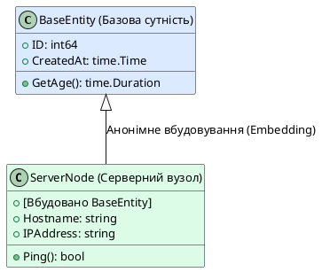

::

#### Спливання полів та методів (Field and Method Promotion)

При анонімному вбудовуванні всі поля та методи вбудованої структури автоматично «спливають» нагору і стають доступними напряму:

```go
package main

import (
	"fmt"
	"time"
)

// Базова структура для моделей бази даних
type BaseEntity struct {
	ID        int64
	CreatedAt time.Time
}

func (b BaseEntity) FormattedCreated() string {
	return b.CreatedAt.Format("2006-01-02 15:04:05")
}

// Серверний вузол вбудовує BaseEntity
type ServerNode struct {
	BaseEntity // Анонімне вбудовування (Embedding)
	Hostname   string
	IPAddress  string
}

func main() {
	node := ServerNode{
		BaseEntity: BaseEntity{
			ID:        1001,
			CreatedAt: time.Now(),
		},
		Hostname:  "k8s-worker-01",
		IPAddress: "192.168.1.50",
	}

	// ПРЯМИЙ ДОСТУП до вбудованих полів (Method Promotion):
	// Можна писати node.ID замість довшого node.BaseEntity.ID:
	fmt.Printf("Вузол ID: %d\n", node.ID)
	fmt.Printf("Хост: %s (%s)\n", node.Hostname, node.IPAddress)
	fmt.Printf("Час створення: %s\n", node.FormattedCreated())

	// Доступ через явне ім'я типу також залишається доступним:
	fmt.Printf("Явний доступ: %d\n", node.BaseEntity.ID)
}
```

#### Вкладена (named) vs вбудована (embedded) структура — коли що

**Проста теорія:** вкладена — шухляда з підписом (`PersonInfo`), вбудована — висипав вміст шухляди на стіл (поля доступні напряму). Поки що користуйтесь вкладеною — вона явна.

Go має два способи композиції. Вибір впливає на API:

```go
// 1. Вкладена (named) — явна ієрархія, без promotion
type AccountNamed struct {
    Login      string
    PersonInfo person // поле з іменем
}
var a AccountNamed
fmt.Println(a.PersonInfo.name) // лише так

// 2. Вбудована (embedded) — promotion полів/методів нагору
type AccountEmbedded struct {
    Login string
    person // без імені — поля спливають
}
var b AccountEmbedded
fmt.Println(b.name)        // promotion: b.person.name → b.name
fmt.Println(b.person.name) // також доступно явно
```

**Trade-off:** вбудовування скорочує запис і дозволяє `AccountEmbedded` реалізувати інтерфейси `person` автоматично, але створює ризик **конфлікту імен**: якщо `AccountEmbedded` і `person` мають поле `ID`, вираз `b.ID` — `ambiguous selector`. Використовуйте вкладену коли потрібна явна ізоляція, вбудовану — для міксинів (`BaseEntity`, `sync.Mutex`).

#### Анонімні структури та анонімні поля — Go-ідіома для одноразових DTO

Не обов'язково оголошувати `type` для кожного JSON-об'єкта:

```go
// Анонімна структура для тимчасової відповіді — без type
resp := struct {
    Status string `json:"status"`
    Count  int    `json:"count"`
}{Status: "OK", Count: 42}
json.NewEncoder(w).Encode(resp)

// Анонімне поле — тип є ім'ям поля (рідко, але в stdlib є)
type LogEntry struct {
    string // анонімне поле — доступ entry.string
    Level int
}
e := LogEntry{string: "request started", Level: 1}
fmt.Println(e.string)
```

::tip
Анонімні структури ідеальні для тестів, `httptest` та декодування `json.RawMessage` без засмічення пакета десятками `type` на один запит.
::

---

### Методи на будь-якому визначеному типі, а не лише на структурах — для допитливих

**Проста теорія наперед:** поки що достатньо `func (u User) String()` на структурах. Нижче — як той самий прийом працює на `float64` чи зрізах.

На відміну від Java/C#, в Go метод можна прив'язати до **будь-якого** `type` з `type X T` (крім покажчиків та інтерфейсів):

```go
type Celsius float64
func (c Celsius) String() string { return fmt.Sprintf("%.1f°C", float64(c)) }
func (c Celsius) ToFahrenheit() Celsius { return Celsius(float64(c)*9/5 + 32) }

type UserIDs []int64
func (ids UserIDs) Contains(id int64) bool {
    for _, v := range ids { if v == id { return true } }
    return false
}

var temp Celsius = 36.6
fmt.Println(temp.String()) // 36.6°C — метод на float64!
var ids UserIDs = []int64{1,2,3}
fmt.Println(ids.Contains(2)) // true
```

::note
Псевдонім `type MyInt = int` (зі знаком `=`) **не може** мати власних методів — він тотожний `int`. Лише `type MyInt int` (без `=`) створює новий тип із власним набором методів. Тому в `type byte = uint8` методи не додати, а в `type UserID int64` — можна.
::

---

### Теги структур (Struct Tags) для мережевих контрактів JSON/SQL

У клієнт-серверних вебзастосунках бекенд постійно конвертує дані між внутрішніми структурами Go та зовнішніми форматами (JSON для HTTP REST API, колонками реляційних баз даних PostgreSQL/MySQL, XML тощо).

**Тег поля структури (`Struct Tag`)** — це рядок метаданих, записаний у зворотних апострофах після типу поля, який зчитується стандартними пакетами (наприклад, `encoding/json` або ORM-бібліотеками) за допомогою рефлексії.

```go
package main

import (
	"encoding/json"
	"fmt"
)

type APIUserResponse struct {
	// 1. `json:"id"` — перейменовує поле ID у нижній регістр "id" для клієнта
	ID int64 `json:"id"`

	// 2. `json:"user_name"` — кастомне ім'я поля в JSON
	Username string `json:"user_name"`

	// 3. `json:"bio,omitempty"` — якщо рядок порожній (""), поле взагалі ВИКЛЮЧАЄТЬСЯ з JSON!
	Bio string `json:"bio,omitempty"`

	// 4. `json:"-"` — поле повністю ІГНОРУЄТЬСЯ і ніколи не потрапить у відповідь (захист паролів)
	PasswordHash string `json:"-"`

	// 5. `json:",string"` — кодує число як рядок у JSON ("8080" замість 8080)
	Port int `json:"port,string"`
}

func main() {
	user := APIUserResponse{
		ID:           42,
		Username:     "taras_shevchenko",
		Bio:          "", // Порожнє: omitempty виключить його з виводу
		PasswordHash: "super_secret_bcrypt_hash_999",
		Port:         8080,
	}

	// Серіалізація структури в красивий відформатований JSON:
	jsonData, err := json.MarshalIndent(user, "", "  ")
	if err != nil {
		fmt.Println("Помилка серіалізації:", err)
		return
	}

	fmt.Println("Згенерований JSON для клієнта:")
	fmt.Println(string(jsonData))
}
```

::terminal-preview{title="Вихідний результат JSON-серіалізації" :cursor="false"}

<div class="line">{</div>
<div class="line">  <span class="text-blue-400">"id"</span>: 42,</div>
<div class="line">  <span class="text-blue-400">"user_name"</span>: <span class="text-green-400">"taras_shevchenko"</span>,</div>
<div class="line">  <span class="text-blue-400">"port"</span>: <span class="text-green-400">"8080"</span></div>
<div class="line">}</div>
::

---

## Динамічні колекції: Зрізи (Slices) та Карти (Maps)

Хоча статичні масиви забезпечують максимальну швидкодію, у реальних клієнт-серверних застосунках розмір даних заздалегідь невідомий (кількість записів з бази даних, потоки вхідних мережевих пакетів, списки активних сесій). Для роботи з динамічними даними мова Go надає дві високоефективні колекції: **зрізи (`slice`)** та **хеш-таблиці (`map`)**.

---

### Зрізи (Slices): гнучкі динамічні масиви

**Зріз (_Slice_)** — це динамічний дескриптор, який надає інтерфейс вікна доступу до суміжного базового масиву пам'яті.

#### Внутрішня будова зрізу (`SliceHeader`)

На рівні компілятора та середовища виконання Go сам зріз **не зберігає дані безпосередньо**. Він займає в пам'яті рівно **24 байти** (на 64-бітній архітектурі) і описується структурою **`SliceHeader`**, що складається з трьох полів:

1. **`Data *T` (8 байтів):** покажчик на перший елемент базового масиву в пам'яті.
2. **`Len int` (8 байтів):** поточна довжина зрізу (кількість елементів, доступних для читання/запису).
3. **`Cap int` (8 байтів):** місткість зрізу (максимальна кількість елементів від початкової точки `Data` до кінця базового масиву без потреби виділення нової пам'яті).

::plant-uml{alt="Внутрішня будова зрізу SliceHeader та базовий масив"}

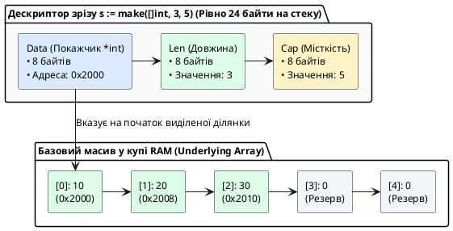

::

---

#### Способи створення зрізів

```go
package main

import "fmt"

func main() {
	// 1. Оголошення неініціалізованого зрізу (Nil Slice)
	// Має нульовий стан: Data = nil, len = 0, cap = 0. Пам'ять у купі не виділяється.
	var nilSlice []int
	fmt.Printf("1. Nil зріз: len=%d, cap=%d, isNil=%t\n", len(nilSlice), cap(nilSlice), nilSlice == nil)

	// 2. Створення через літерал зрізу (без вказання розміру в квадратних дужках!)
	// Автоматично виділяє базовий масив на 3 елементи: len=3, cap=3
	directSlice := []string{"HTTP", "gRPC", "WebSocket"}
	fmt.Printf("2. Літерал: len=%d, cap=%d, дані=%v\n", len(directSlice), cap(directSlice), directSlice)

	// 3. Створення через вбудовану функцію make([]T, len, cap)
	// Найбільш продуктивний спосіб: виділяє пам'ять одразу з резервом під майбутні дані
	bufferedSlice := make([]int, 3, 10) // Довжина 3, резерв місткості 10
	bufferedSlice[0], bufferedSlice[1], bufferedSlice[2] = 100, 200, 300
	fmt.Printf("3. make(): len=%d, cap=%d, дані=%v\n", len(bufferedSlice), cap(bufferedSlice), bufferedSlice)
}
```

---

#### Оператор зрізання та ефект спільної пам'яті (_Underlying Array_)

**Проста теорія:** `s[1:4]` — візьми елементи з 1 по 3 (4 не включно). Поки що запам'ятайте це. Формули `len/cap` нижче — для допитливих.

Зріз можна створити з уже існуючого масиву або іншого зрізу за допомогою оператора зрізання **`s[low:high]`**:

- Діапазон береться за напівінтервалом: індекси від `low` до `high - 1`.
- Довжина отриманого зрізу: `len = high - low`.
- Місткість отриманого зрізу: `cap = cap(оригіналу) - low`.

```go
package main

import "fmt"

func main() {
	// Створюємо базовий масив
	baseArray := [6]int{10, 20, 30, 40, 50, 60}

	// Створюємо зріз з 1 по 3 індекси (елементи 20, 30, 40)
	sliceA := baseArray[1:4]
	sliceB := sliceA[1:3] // Зріз від зрізу (елементи 30, 40)

	fmt.Printf("sliceA: len=%d, cap=%d, %v\n", len(sliceA), cap(sliceA), sliceA) // len=3, cap=5
	fmt.Printf("sliceB: len=%d, cap=%d, %v\n", len(sliceB), cap(sliceB), sliceB) // len=2, cap=4

	// ⚠️ УВАГА: Ефект спільної пам'яті (Slice Mutation Bug)!
	// Зміна елемента в sliceB фізично змінює комірку в baseArray та sliceA:
	sliceB[0] = 999

	fmt.Println("\nПісля модифікації sliceB[0] = 999:")
	fmt.Printf("  baseArray: %v\n", baseArray) // [10, 20, 999, 40, 50, 60] — ОРИГІНАЛ ЗМІНИВСЯ!
	fmt.Printf("  sliceA:    %v\n", sliceA)    // [20, 999, 40]
}
```

::tip
**Повний 3-індексний зріз `s[low:high:max]` (Full Slice Expression):**
Щоб захистити базовий масив від випадкової перезаписи через подальший `append`, використовується третій параметр `max`, який жорстко обмежує місткість зрізу: `safeSlice := baseArray[1:4:4]`. У цьому випадку `cap` дорівнюватиме `4 - 1 = 3`, і перший же `append` змусить Go виділити новий масив.
::

---

#### Динамічне розширення: функція `append()` та механіка `growslice`

Вбудована функція **`append()`** додає нові елементи в кінець зрізу.

**Як працює `append()` під капотом — аналогія «блокнот на пружині»:**

Уявіть зріз як блокнот: `len` — списані аркуші (закладка), `cap` — всього аркушів у блокноті, `Data` — адреса першого аркуша. Порожні аркуші `cap-len` — запас без походу в магазин.

1. Якщо `len + нові <= cap`, Go пише на наступний чистий аркуш у **тому самому** блокноті і зсуває закладку (`len++`).
2. Якщо аркуші скінчились (`len == cap`), викликається **`runtime.growslice`**:
    - Купує **новий блокнот** за правилом Go 1.18+: якщо `cap < 256`, новий `cap ≈ 2×старий`, інакше `≈ 1.25×старий` з округленням до _size class_ (щоб фури пам'яті не фрагментували склад).
    - Переписує всі старі аркуші.
    - Додає нові.
    - Повертає новий `SliceHeader` з новою адресою `Data`.
    - **Старий блокнот здають в макулатуру (GC), якщо на нього більше немає вікон-зрізів** — увага: `t := s[1:3]` тримає **весь** старий блокнот живим, навіть якщо бачить лише 2 аркуші!

::warning
**Чому `a:=s[0:2]; a[0]=99` псує `s`:** обидва вікна дивляться в один блокнот. Зміна через одне вікно видна через друге. Для ізоляції — `copy` або `s[0:2:2]` (full slice).
::

```go
package main

import "fmt"

func main() {
	var numbers []int // nil зріз

	for i := 1; i <= 5; i++ {
		prevCap := cap(numbers)
		numbers = append(numbers, i*10)

		// Якщо місткість змінилася — відбулася реалокація пам'яті в купі!
		if cap(numbers) != prevCap {
			fmt.Printf("🔥 Реалокація growslice! len: %d, новий cap: %d\n", len(numbers), cap(numbers))
		}
	}

	// Злиття двох зрізів за допомогою синтаксису розпакування slice...
	extra := []int{60, 70, 80}
	numbers = append(numbers, extra...)
	fmt.Println("Підсумковий зріз після злиття:", numbers)
}
```

---

#### Двовимірні зрізи та сортування — для допитливих

**Проста теорія:** `[][]int` — таблиця де кожен рядок може мати різну довжину. Поки що достатньо `[]int`.

На відміну від прямокутних масивів `[2][3]int` (де всі рядки по 3 елементи), зріз зрізів `[][]int` — це зріз покажчиків на незалежні базові масиви, тому рядки можуть мати різну довжину (ідеально для матриць суміжності графа):

```go
matrix := [][]int{
    {1, 2, 3},
    {4, 5},       // коротший рядок — валідно!
    {6, 7, 8, 9},
}
matrix[1] = append(matrix[1], 99) // розширює лише другий рядок
```

Для впорядкування використовуйте `sort` (не повторює `01`): `sort.Ints(s)`, `sort.Strings(s)`, `sort.Slice(s, func(i,j int) bool{...})` для структур. Пошук `sort.SearchInts(sorted, 33)` вимагає **відсортованого** зрізу — на невідсортованому поверне хибний індекс, бо це бінарний пошук $O(\log N)$.

---

#### Повна ізоляція: вбудована функція `copy()` та видалення елементів

Якщо вам необхідно отримати повністю незалежну копію даних без спільного базового масиву, використовується функція **`copy(dst, src)`**:

```go
package main

import "fmt"

func main() {
	original := []int{10, 20, 30, 40, 50}

	// 1. Правильне клонування зрізу:
	// Приймальний зріз ОБОВ'ЯЗКОВО повинен мати виділену довжину len!
	clone := make([]int, len(original))
	copiedCount := copy(clone, original) // Копіює 5 елементів
	fmt.Printf("Скопійовано %d елементів. Клон: %v\n", copiedCount, clone)

	clone[0] = 777 // original НЕ зміниться!
	fmt.Printf("Оригінал: %v, Клон: %v\n", original, clone)

	// 2. Ідіоматичне видалення елемента за індексом i (наприклад, видаляємо індекс 2 — число 30):
	indexToRemove := 2
	original = append(original[:indexToRemove], original[indexToRemove+1:]...)
	fmt.Println("Зріз після видалення елемента [2]:", original) // [10, 20, 40, 50]
}
```

---

### Карти (`map[K]V`): вбудовані хеш-таблиці

**Карта (_Map_)** — це невпорядкована колекція пар «ключ-значення» (_Key-Value_), яка забезпечує надшвидкий пошук, додавання та видалення даних за константний середній час $O(1)$.

#### Вимоги до типів ключів

**Проста теорія наперед:** ключ карти — як підпис на шухляді, має бути порівнюваним (`==`). Поки що користуйтесь `string`/`int` — вони завжди порівнювані. Деталі про `comparable` — нижче для допитливих.

Тип ключа $K$ **зобов'язаний бути `comparable`** (підтримувати `==` та `!=`):

- **Дозволені ключі:** `string`, `int`, `uint`, `float64`, `bool`, покажчики, канали, структури (якщо всі їхні поля `comparable`) та фіксовані масиви `[4]int` (порівнюються поелементно).
- **Заборонені ключі:** зрізи `[]T`, карти `map[K]V` та функції `func()`, оскільки вони не підтримують рівність `==`.

```go
type Point struct{ X, Y int } // comparable — всі поля comparable
var m1 map[Point]string = map[Point]string{{1,2}: "a"} // OK
var m2 map[[2]int]string = map[[2]int]string{{1,2}: "a"} // OK: масив comparable
// var m3 map[[]int]string // ❌ invalid map key type []int
// var m4 map[map[string]int]string // ❌ invalid map key
```

**Чому зріз не може бути ключем:** зріз — це дескриптор `SliceHeader` з покажчиком на heap, його порівняння вимагало б глибокого порівняння базового масиву, що порушує константний час $O(1)$. Якщо потрібен ключ-колекція, використовуйте масив `[N]T` або хешуйте зріз у `string`.

---

#### Практичні операції з картами

```go
package main

import "fmt"

func main() {
	// 1. Оголошення та ініціалізація через make() або літерал
	// Зауваження: var m map[string]int створить nil-карту.
	// Читати з nil-карти можна, але спроба ЗАПИСУ викличе паніку!
	userRoles := make(map[string]string)

	// Додавання та оновлення записів:
	userRoles["alex"] = "admin"
	userRoles["maria"] = "lead_developer"
	userRoles["taras"] = "devops"

	// 2. Читання за ключем:
	// Якщо ключа немає в карті, вона повертає Zero Value типу значення (""):
	fmt.Println("Роль alex:", userRoles["alex"])
	fmt.Println("Роль неіснуючого ivan:", userRoles["ivan"]) // Поверне порожній рядок ""

	// 3. Ідіома Comma-ok (Безпечна перевірка існування ключа):
	role, exists := userRoles["ivan"]
	if !exists {
		fmt.Println("❌ Користувача 'ivan' не знайдено в базі ролей!")
	} else {
		fmt.Println("✅ Знайдено роль:", role)
	}

	// 4. Видалення запису за допомогою delete(map, key):
	delete(userRoles, "taras")
	// Видалення неіснуючого ключа абсолютно безпечне і не викликає помилок:
	delete(userRoles, "unknown_user")

	// 5. Ітерація по карті:
	// ⚠️ УВАГА: порядок обходу ключів є ВИПАДКОВИМ при кожному запуску програми!
	// Go навмисно рандомізує стартовий бакет (fastrand) з Go 1.0, щоб код не залежав від порядку.
	// Якщо потрібен детермінований порядок — відсортуйте ключі:
	// keys := make([]string, 0, len(userRoles)); for k := range userRoles { keys = append(keys, k) }; sort.Strings(keys)
	fmt.Println("\nСписок користувачів у системі:")
	for username, r := range userRoles {
		fmt.Printf("  • %s => %s\n", username, r)
	}
}
```

---

#### Внутрішня архітектура карт у Go (`runtime.hmap` та `bmap`) — для допитливих

**Проста теорія наперед:** поки що достатньо `m["k"]=1`, `delete(m,"k")`, `_,ok:=m["k"]`. Як влаштовано всередині — нижче.

У Go тип `map[K]V` — це не об'єкт у пам'яті, а **покажчик на внутрішню структуру `runtime.hmap`**:

::plant-uml{alt="Внутрішня будова хеш-таблиці Go map"}

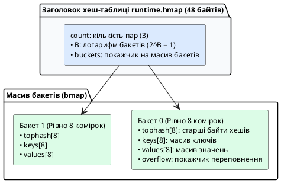

::

**Як працює пошук у карті:**

1. Алгоритм хешування обчислює 64-бітний хеш переданого ключа.
2. Молодші біти хешу визначають **номер бакета** у масиві.
3. Кожен бакет `bmap` містить фіксований масив **`tophash` на 8 байтів**. Go спочатку швидко сканує `tophash` на рівні регістрів процесора.
4. Тільки при збігу байта `tophash` Go порівнює реальний ключ через `==`.
5. Якщо бакет заповнюється (понад 8 пар), Go створює ланцюжок через покажчик `overflow`.
6. При зростанні коефіцієнта навантаження (_Load Factor_ > 6.5) Go автоматично виконує фоновий **рехешинг**, поступово переносячи дані у вдвічі більший масив бакетів.

---

### Критичні правила безпеки при роботі з картами

::important

1. **Карта завжди передається за посиланням:**
   Оскільки змінна `map` є покажчиком на `hmap`, зміна карти всередині будь-якої функції завжди мутує оригінальну карту без потреби передавати покажчик `*map`.
2. **Заборона взяття адреси елемента карти (`&m[key]`):**
   Вираз `p := &userRoles["alex"]` є **помилкою компілятора** (`cannot take the address of userRoles["alex"]`). Оскільки при динамічному рехешингу бакети переміщуються в пам'яті, збережений покажчик миттєво став би невалідним.
3. **Небезпека гонитви даних (_Race Condition_):**
   Вбудована карта в Go **не є потокобезпечною**. Якщо одна горутина читає карту, а інша в цей самий момент записує в неї дані без синхронізації, Go Runtime аварійно завершить процес неперехоплюваною фатальною помилкою: `fatal error: concurrent map read and map write`. Для багатопотокового доступу слід використовувати `sync.RWMutex` або `sync.Map`.

::

---

## Обробка помилок та відкладене виконання: `error` і `defer` у моделі пам'яті

**Проста аналогія:** у Java помилка — це феєрверк-виняток, який вибухає і летить вгору поки хтось не зловить. У Go помилка — це **звичайний товар у кошику**: функція кладе в кошик два товари — результат і чек «помилка/немає». Покупець зобов'язаний перевірити чек `if err != nil`. А `defer` — це **стос тарілок «помити при виході»**: поклав тарілку `defer f.Close()` на стос фрейму — вона помиється після `return`, навіть якщо посередині стався `return err`.

Система типів Go не має винятків (`try/catch`), як у Java чи Python. Натомість помилка — це звичайне значення типу `error`, а гарантоване звільнення ресурсів досягається механізмом `defer`. Обидва механізми безпосередньо пов'язані з моделлю пам'яті стеку.

### Інтерфейс `error`: помилка як значення

**Контекст:** у клієнт-серверному коді кожен виклик `os.Open`, `json.Marshal`, `sql.Query` може не вдатися (немає файлу, обірвано мережу). Go змушує перевіряти це явно, повертаючи помилку як **останнє** значення.

**Внутрішній механізм:** `error` — це вбудований інтерфейс (інтерфейси детально — в наступній лекції, поки достатньо знати що це «тип з методом `Error() string`»):

```go
type error interface {
    Error() string
}
```

Будь-який тип з методом `Error() string` є `error`. На цьому етапі створюйте через `errors.New("...")`; `fmt.Errorf("...: %w", err)` та `errors.Is/As` — для допитливих (обгортання ланцюжка).

```go
func safeDivide(a, b float64) (float64, error) {
    if b == 0 {
        return 0, errors.New("ділення на нуль неможливе")
    }
    return a / b, nil // nil — відсутність помилки (немає heap алокації)
}

val, err := safeDivide(10, 0)
if err != nil {
    log.Printf("помилка: %v", err) // явна перевірка — немає прихованих винятків
    return err
}
fmt.Println(val)
```

::tip
**Проста теорія наперед:** завжди пишіть `if err != nil { return err }` одразу після виклику. Поки що достатньо цього. `fmt.Errorf("open %s: %w", path, err)` з `%w` та `errors.Is` — для наступних лекцій про шари `UseCase → Repository`.
::

**Trade-off vs винятки:** явний `error` робить шлях помилки видимим у сигнатурі (`(User, error)`), але вимагає дисципліни — `go vet` не ловить ігнорування `_, _ = f()`.

### `defer`: стек відкладених викликів

**Контекст:** сокет `net.Conn`, файл `os.File`, `rows.Close()` повинні закритися **гарантовано**, навіть якщо функція повертає помилку посередині. `defer` — це «finally» Go, але зі стековою семантикою.

**Внутрішній механізм:** кожен `defer` поміщає виклик у **стек фрейму горутини** (LIFO — останній доданий виконується першим). Аргументи обчислюються **в момент `defer`**, а не в момент виконання:

```go
func processConn(conn net.Conn) error {
    defer conn.Close() // 1) закриється останнім, навіть при return err
    defer log.Println("завершено") // 2) виконається першим при виході (LIFO)

    buf := make([]byte, 4096)
    n, err := conn.Read(buf)
    if err != nil {
        return err // обидва defer все одно виконаються!
    }

    // Пастка для допитливих: аргументи копіюються зараз
    for i := 0; i < 3; i++ {
        defer fmt.Println(i) // надрукує 2,1,0 — i скопійовано в момент defer
    }
    return nil
}

::note
**Поки що достатньо:** `defer f.Close()` закриє файл при виході. Приклад нижче про `named return` — для допитливих, можна пропустити.
::

func withNamedReturn() (result int, err error) {
    defer func() {
        if err != nil {
            result = -1 // мутація named return після return — просунутий прийом
        }
    }()
    result = 42
    err = errors.New("щось пішло не так")
    return // naked return → defer бачить result=42, err!=nil → result=-1
}
```

::plant-uml{alt="Стек defer у фреймі горутини (LIFO)"}

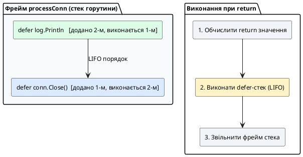

::

::caution
**Де не ставити `defer` в циклі:** `for _, f := range files { defer f.Close() }` — закриє всі файли лише при виході з **функції**, а не ітерації, вичерпавши дескриптори. Використовуйте анонімну функцію `func(){ f, _ := os.Open(...); defer f.Close(); ... }()` або явний `f.Close()` в циклі.
::

**Зв'язок з пам'яттю:** `defer` зберігається у фреймі стека горутини (2 КБ початково, динамічно росте — див. лекцію 01 про горутини), тому тисячі `defer` у циклі — це тиск на стек та GC. Для гарячих шляхів бекенду уникайте зайвих `defer` всередині `for`.

---

## Питання для самоперевірки та закріплення знань

::card-group

::card{title="1. Чому Go не має прихованого приведення типів?" icon="i-lucide-help-circle"}
Go виключає неявні перетворення типів задля абсолютної передбачуваності та безпеки системного коду на етапі компіляції. Будь-яке змішування числових типів різної розрядності (наприклад, `int32` та `int64`) вимагає явного приведення `int64(x)`.
::

::card{title="2. Чому розмір масиву [4]int є частиною його типу?" icon="i-lucide-help-circle"}
Масив є фіксованим монолітним блоком пам'яті. Компілятор заздалегідь виділяє точну кількість байтів на стеку. Масиви різного розміру несумісні за типом, що забезпечує апаратну швидкодію та захист від виходу за межі пам'яті.
::

::card{title="3. Що відбувається всередині середовища виконання при виклику append()?" icon="i-lucide-help-circle"}
Якщо зріз має вільний резерв місткості (`len < cap`), елемент записується в існуючий масив. Якщо `len == cap`, функція `runtime.growslice` виділяє в купі новий удвічі більший базовий масив, копіює туди старі дані, додає нові та повертає новий дескриптор `SliceHeader`.
::

::card{title="4. Чому спроба взяти адресу елемента карти є помилкою компіляції?" icon="i-lucide-help-circle"}
Карта є динамічною хеш-таблицею. При додаванні нових елементів Go автоматично виконує рехешинг та евакуацію бакетів у нові комірки пам'яті, що зробило б збережену адресу недійсною.
::

::card{title="5. Чому порядок range по карті випадковий?" icon="i-lucide-help-circle"}
Go рандомізує стартовий бакет при кожному `range` навмисно з Go 1.0, щоб код не залежав від порядку хешування. Для детермінованого виводу відсортуйте ключі: `keys := ...; sort.Strings(keys)`.
::

::card{title="6. Коли defer виконається при return?" icon="i-lucide-help-circle"}
`defer` виконується після обчислення `return` значень, але до звільнення фрейму стека (LIFO). Він бачить і може мутувати іменовані `return` змінні, тому ідеальний для `conn.Close()` та логування помилок.
::

::card{title="7. Чому var m map[string]int; m[k]=1 панікує?" icon="i-lucide-help-circle"}
`var m map[string]int` — це `nil` дескриптор `hmap` без бакетів. Читання повертає zero value, але запис вимагає ініціалізованого `hmap` через `make` або літерал `map[string]int{}`.
::

::
