# Система типів та модель пам’яті мови Go

::card-group

::card{title="🎯 Навчальні цілі" icon="i-lucide-graduation-cap"}

- Опанувати синтаксис оголошення змінних, тіньове перекриття `:=`, сувору статичну типізацію, нульові значення (_Zero Values_) та різницю `make` vs `new`.
- Вивчити всі базові числові типи, wrap-around переповнення, `uintptr`, незмінні рядки UTF-8, руни, нетипізовані константи та генератор `iota`.
- Дослідити форматування `fmt` (verb'и `%v %#v %T %d %x %f`), всі групи операцій: арифметичні, складені `+= &^=`, логічні, побітові та пріоритети з асоціативністю.
- Вивчити керуючі конструкції: `if` з ініціалізацією, `switch` та всі форми `for`.
- Опанувати функції як об'єкти першого класу, анонімні функції, замикання (_closures_) та рекурсію.
- Зрозуміти безпечну модель покажчиків (_pointers_), заборону арифметики, організацію пам'яті (Стек, Купа) та механізм аналізу втечі (_Escape Analysis_).
- Навчитися створювати власні типи, структури з вирівнюванням, анонімні структури, методи на будь-яких типах, застосовувати вкладену vs вбудовану композицію та теги полів.
- Глибоко розібрати зрізи (`SliceHeader`, `growslice` 2×/1.25×, `s[low:high:max]`, 2D), мапи (`hmap`, `bmap`, `comparable`) та механізми `error`/`defer` LIFO.

::

::card{title="🛠️ Технологічний стек" icon="i-lucide-cpu"}

- **Мова:** Go 1.22+
- **Інструменти аналізу:** `go build -gcflags="-m"`, `go vet -fieldalignment -shadow`, `gofmt`, `unsafe.Sizeof/Alignof`
- **Середовище виконання:** Go Runtime (алокатор пам'яті, Garbage Collector, defer-стек)

::

::

---

## Змінні, ідентифікатори та правила компілятора

У лекції 01 ми детально розглянули, як програма на Go організовується у пакети (`package main` — виконуваний бінарний файл, інші пакети — бібліотеки), як `import` підключає залежності та як `go.mod` ізолює версії модулів (див. лекцію 01, розділи «Відмінність між Пакетом та Модулем» та «Еволюція $GOPATH → Go Modules»). Тут ми не повторюємо мережевий стек чи модель сокетів — натомість заглиблюємося в те, як Go зберігає дані всередині процесу.

Усі обчислювальні процеси сучасного комп'ютера зводяться до маніпуляції даними в оперативній пам'яті (RAM). Для того щоб програміст міг зручно звертатися до потрібної комірки пам'яті без використання шістнадцяткових фізичних адрес (на зразок `0x00c000014088`), мови високого рівня надають абстракцію **змінної**.

**Змінна** — це іменована область пам'яті, яка має фіксований тип даних, розмір у байтах та зберігає певне значення під час роботи програми.

::note
**Місток з лекції 01:** кожен `.go` файл починається з `package <ім'я>` і всі файли в одній папці мають однакове ім'я пакета. Функція `func main()` у `package main` — єдина точка входу в програму. Тому всі приклади нижче (`var`, `:=`, `const`) виконуються або на рівні пакета, або всередині `func main()` / інших функцій.
::

---

### Анатомія оголошення змінної: чому тип пишеться після імені?

Якщо ви раніше вивчали C, C++, Java або C#, перше, що привертає увагу в Go — це порядок слів при оголошенні змінних:

```
У C++ / Java :   int      port   =   8080;
                [ТИП]    [ІМ'Я]     [ЗНАЧЕННЯ]

У Go         :   var      port       int      =   8080
               [СЛОВО]   [ІМ'Я]     [ТИП]        [ЗНАЧЕННЯ]
```

::plant-uml{alt="Анатомія оголошення змінної у Go"}

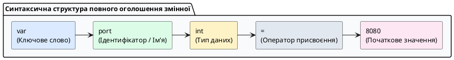

::

Творець мови Роб Пайк пояснював цей вибір принципом природного читання зліва направо:

> _«Ми кажемо: "Оголоси змінну з ім'ям port, яка є числом типу int і дорівнює 8080"»_.

Коли типи стають складними (наприклад, покажчик на масив функцій чи мапа зрізів), запис у стилі Go читається набагато легше та позбавлений синтаксичних неоднозначностей C/C++.

---

### Усі способи створення змінних у Go

У практичній розробці на Go використовуються **п'ять основних синтаксичних форм** оголошення змінних:

::field-group

::field{name="1. Повне оголошення з явним типом та значенням" type="Синтаксис var"}
Найбільш явний спосіб. Використовується, коли потрібно чітко зафіксувати специфічний тип (наприклад, `int64` замість стандартного системного `int`):

```go
var maxPayloadSize int64 = 1048576 // 1 МБ
```

::

::field{name="2. Оголошення без значення (Ініціалізація Zero Value)" type="Синтаксис var"}
Змінна створюється та гарантовано заповнюється нульовим значенням для свого типу (`0`, `""`, `false`, `nil`):

```go
var retryCount int       // Автоматично дорівнює 0
var clientIP string      // Автоматично дорівнює ""
var isConnected bool     // Автоматично дорівнює false
```

::

::field{name="3. Оголошення з автоматичним виведенням типу (Type Inference)" type="Синтаксис var"}
Тип не вказується вручну: компілятор автоматично визначає його на основі значення виразу праворуч:

```go
var defaultTimeout = 30 // Компілятор автоматично призначить тип int
```

::

::field{name="4. Коротке оголошення (Short Declaration :=)" type="Локальний синтаксис"}
Найбільш вживаний спосіб у повсякденній розробці всередині функцій. Символ `:=` одночасно створює нову змінну та виводить її тип:

```go
func handleRequest() {
    statusCode := 200        // Створюється локальна змінна типу int
    endpoint := "/api/users" // Створюється локальна змінна типу string
}
```

⚠️ **Застереження:** Оператор `:=` дозволено використовувати **тільки всередині тіла функцій**. На глобальному рівні пакета він заборонений компілятором.
::

::field{name="5. Множинне та блокове групове оголошення" type="Синтаксис var (...)"}
Дозволяє компактно оголосити кілька змінних в один рядок або об'єднати конфігураційні змінні пакета в один охайний блок:

```go
// Оголошення в один рядок:
var a, b, c int = 1, 2, 3
host, port := "127.0.0.1", 8080

// Блокове оголошення конфігурації:
var (
    serverHost string = "0.0.0.0"
    serverPort int    = 8080
    isDebug    bool   = true
)
```

::callout{icon="i-lucide-lightbulb"}
**Коли використовувати множинне оголошення в один рядок?**

Множинне оголошення (`a, b := 1, 2`) **НЕ є антипатерном**, але має конкретні випадки використання:

**✅ Прийнятні випадки:**
- **Розпакування кортежів з функцій:** `value, err := someFunc()` — стандартна практика Go!
- **Тісно пов'язані змінні:** `x, y := 0, 0` (координати), `width, height := 800, 600`
- **Swap значень:** `a, b = b, a`

**❌ Уникайте у випадках:**
- **Різні типи без логічного зв'язку:** `name, age, active := "Bob", 25, true` — важко читати
- **Багато змінних:** `a, b, c, d, e := 1, 2, 3, 4, 5` — розбийте на окремі рядки
- **Складна ініціалізація:** `user, cfg, db := getUser(), loadConfig(), initDB()` — краще окремо

**Рекомендація від Go команди:** якщо змінні не пов'язані семантично або їх більше 2-3, краще оголошувати окремо для читабельності.

```go
// ✅ Добре — тісно пов'язані:
file, err := os.Open("data.txt")
x, y := 10, 20

// ❌ Погано — важко читати:
name, age, city, active, score := "Alice", 30, "Kyiv", true, 95.5

// ✅ Краще:
name := "Alice"
age := 30
city := "Kyiv"
active := true
score := 95.5
```
::

::tip{icon="i-lucide-info"}
**Що таке блокове оголошення?**

**Блокове оголошення** (`var (...)`, `const (...)`, `type (...)`, `import (...)`) — це спосіб групування кількох оголошень у одному блоці з круглими дужками.

**Правила блокового оголошення:**

1. **Синтаксис:** `ключове_слово ( ... )` — після ключового слова йдуть круглі дужки
2. **Кожне оголошення на новому рядку** (без крапки з комою)
3. **Застосовується до:** `var`, `const`, `type`, `import`
4. **Доступне на рівні пакета та всередині функцій**

**Приклади:**

```go
// Блок import (найчастіше використовується):
import (
    "fmt"
    "net/http"
    "encoding/json"
)

// Блок const:
const (
    MaxRetries = 3
    Timeout    = 30
)

// Блок type:
type (
    UserID    int
    ProductID int
    Email     string
)

// Блок var (як у прикладі вище):
var (
    host string = "localhost"
    port int    = 8080
)
```

**Навіщо використовувати блоки?**
- 📦 **Організація коду:** логічно згруповані оголошення
- 🧹 **Чистота:** менше повторення ключових слів
- 📖 **Читабельність:** швидше зрозуміти структуру модуля
::

::

::

**Тонкощі `:=`: перевизначення та тіньове перекриття (_shadowing_)**

Оператор `:=` має спеціальну поведінку: він може **повторно використовувати** вже існуючі змінні, якщо хоча б одна змінна зліва є новою.

**Приклад перевизначення (це нормально):**

```go
func processFile(path string) error {
    f, err := os.Open(path) // Перше оголошення: f та err — нові змінні
    if err != nil {
        return err
    }
    defer f.Close()

    data := make([]byte, 1024)
    n, err := f.Read(data)  // Друге використання `:=`
                            // n — нова змінна
                            // err — ПЕРЕВИКОРИСТАНА (оновлює значення існуючої змінної)
    
    if err != nil && err != io.EOF {
        return err
    }
    
    return nil
}
```

**⚠️ Пастка: тіньове перекриття у вкладених блоках**

Якщо використати `:=` у вкладеному блоці `{}`, створюються **нові локальні змінні**, які "затінюють" зовнішні:

```go
func example() {
    x := 10          // Зовнішня змінна x
    
    if true {
        x := 20      // ❌ Нова змінна x, яка затінює зовнішню!
        fmt.Println(x)  // Виведе: 20
    }
    
    fmt.Println(x)   // Виведе: 10 (зовнішня змінна не змінилась!)
}
```

**Три ключові правила:**

1. **Потрібна хоча б одна нова змінна:** `x := 1; x := 2` не працює (помилка `no new variables`)
2. **Вкладені блоки `{}` створюють нову область видимості:** змінна з таким самим ім'ям затінює зовнішню
3. **Інструмент `go vet -shadow`** допоможе знайти випадкове затініння

::caution
**Класична помилка з витоком ресурсів:**

```go
// ❌ НЕПРАВИЛЬНО
if f, err := os.Open(path); err == nil { 
    defer f.Close()  // defer виконається після закінчення блоку if,
}                     // але f існує тільки всередині if!

// ✅ ПРАВИЛЬНО - варіант 1
var f *os.File
var err error
if f, err = os.Open(path); err == nil {
    defer f.Close()  // Тепер f доступний у зовнішній області
}

// ✅ ПРАВИЛЬНО - варіант 2
if f, err := os.Open(path); err == nil {
    defer f.Close()  // defer всередині блоку if
    // робота з файлом тут
}
```
::

---

### Суворі правила компілятора щодо змінних

Компілятор Go спроєктований так, щоб запобігати накопиченню помилок та кодового «сміття»:

1. **Заборона невикористаних локальних змінних:**
   Якщо всередині функції ви оголосили змінну, але жодного разу не прочитали її значення, компілятор зупинить збірку з помилкою: `declared and not used: myVar`.
2. **Порожній ідентифікатор (`_` — Blank Identifier):**
   Якщо функція повертає кілька значень (наприклад, результат і помилку), але одне з них вам не потрібне, використовується символ підкреслення `_`. Компілятор ігнорує це значення без виділення зайвої пам'яті:
    ```go
    result, _ := calculateMetrics()
    ```

---

## Константи та генератор послідовностей `iota`

У програмуванні часто виникає потреба зафіксувати незмінні величини: максимальний розмір мережевого пакета, математичні константи, статуси з'єднання або коди помилок.

**Константа (`const`)** — це іменоване значення, яке обчислюється **виключно на етапі компіляції** програми. Після компіляції значення константи «зашивається» в машинний код і фізично не може бути змінене під час виконання.

```go
package main

import "time"

func main() {
	const MaxConnections = 10000 // Валідно: константа відома компілятору
	const AppVersion = "v1.2.4"  // Валідно: незмінний рядок

	// ❌ ПОМИЛКА КОМПІЛЯЦІЇ:
	// const CurrentTime = time.Now()
	// Помилка: time.Now() обчислюється під час виконання (Runtime), а не компіляції!
}
```

### Константи з типом та без типу

Константи в Go можуть бути **двох видів**:

**1. Нетипізовані константи** (untyped constants) — без явного типу:
```go
const Pi = 3.14              // компілятор зберігає як "ідеальне число"
const MaxRetries = 5         // компілятор зберігає як "ідеальне ціле"
const AppName = "MyApp"      // компілятор зберігає як "ідеальний рядок"
```

**2. Типізовані константи** (typed constants) — з явним типом:
```go
const Pi float64 = 3.14           // завжди float64
const MaxRetries int = 5          // завжди int
const Timeout time.Duration = 30  // завжди time.Duration

type RequestStatus uint8
const StatusPending RequestStatus = 1  // завжди RequestStatus
```

::callout{icon="i-lucide-key"}
**Ключова різниця:**

| Тип константи | Приклад | Поведінка |
|--------------|---------|-----------|
| **Нетипізована** | `const X = 10` | Гнучка: підлаштовується під контекст використання |
| **Типізована** | `const X int = 10` | Жорстка: потребує явного перетворення при змішуванні типів |

```go
// Нетипізована — гнучка:
const Flexible = 100
var a int = Flexible      // ✅ OK
var b int64 = Flexible    // ✅ OK
var c float64 = Flexible  // ✅ OK

// Типізована — жорстка:
const Strict int = 100
var x int = Strict        // ✅ OK
var y int64 = Strict      // ❌ Помилка: cannot use Strict (type int) as type int64
var z int64 = int64(Strict)  // ✅ OK: потрібне явне перетворення
```
::

::tip
**Нетипізовані константи: гнучкість без явних перетворень**

Константи в Go можуть існувати в двох формах: **з типом** і **без типу**. Нетипізовані константи — це особлива можливість Go, яка робить код зручнішим.

**Як це працює?**

Уявіть, що константа без типу — це **значення, яке ще не "упаковане" в конкретний тип**. Коли ви її використовуєте, Go автоматично підбирає потрібний тип:

```go
const Pi = 3.14              // Константа без типу

var x float64 = Pi           // Pi автоматично стає float64
var y float32 = Pi           // Та сама Pi автоматично стає float32
var z int = 3 + 2            // 3 і 2 — нетипізовані, результат стає int
```

**Чому це зручно?**

Без нетипізованих констант довелося б писати так:
```go
const Pi float64 = 3.14      // Константа з типом float64

var x float64 = Pi           // ✅ OK
var y float32 = Pi           // ❌ Помилка! Потрібне float32(Pi)
var y float32 = float32(Pi)  // ✅ Тепер OK, але незручно
```

**Висновок:** нетипізовані константи економлять час — Go сам визначає потрібний тип залежно від контексту.
::

::accordion

::accordion-item{label="Для допитливих: чому 1<<100 валідна як константа, але не як int64?" icon="i-lucide-zoom-in"}

**Ключова відмінність Go:** константи без типу живуть у "математичному світі" компілятора з величезною точністю (до 512 біт), а не в обмеженій пам'яті типів.

### Що таке `1 << 100`?

Символ `<<` — це **побітовий зсув вліво**. Кожен зсув на 1 позицію = множення на 2:

```go
1 << 0  = 1        // 1 × 2⁰ = 1
1 << 1  = 2        // 1 × 2¹ = 2
1 << 10 = 1024     // 1 × 2¹⁰ = 1024 (1 кілобайт)
1 << 100 = ?       // 1 × 2¹⁰⁰ = 1267650600228229401496703205376
```

**Візуалізація в двійковій системі** (зсув — це додавання нулів справа):

```
Десяткове  |  Двійкове           |  Операція
-----------|---------------------|------------------
1          |  1                  |  1 << 0
2          |  10                 |  1 << 1 (додали 1 нуль)
4          |  100                |  1 << 2 (додали 2 нулі)
8          |  1000               |  1 << 3 (додали 3 нулі)
1024       |  10000000000        |  1 << 10 (додали 10 нулів)
```

Отже, `1 << 100` — це одиниця з **100 нулями** після неї у двійковій системі!

::tip{icon="i-lucide-alert-circle"}
Число `1267650600228229401496703205376` **не вміщується** в `int64` (max: 2⁶³-1) чи `uint64` (max: 2⁶⁴-1), але як **нетипізована константа** воно цілком валідне!
::

### Етап 1: Константа без типу — необмежена точність
```go
const Big = 1 << 100 // 1267650600228229401496703205376
// ✅ Компілятор зберігає це як "математичне число"
```

### Етап 2: Присвоєння змінній — тут вибирається тип
```go
var f float64 = Big   // ✅ Конвертується у float64 (з втратою точності)
var i int64 = Big     // ❌ Помилка: число завелике для int64 (максимум 2^63-1)
```

### Приклад з Pi
```go
const PrecisePi = 3.141592653589793238462643383279 // 30 знаків після коми

var p32 float32 = PrecisePi // 3.1415927 (7 знаків) — втрата точності
var p64 float64 = PrecisePi // 3.141592653589793 (15 знаків) — краще
```

### Чому це корисно для KB/MB/GB?
```go
const (
    KB = 1 << 10  // 1024 — "на папері"
    MB = 1 << 20  // 1048576 — "на папері"
)

var limit uint64 = 500 * MB // ✅ Обчислення в "математичному світі", 
                            // результат пакується в uint64
```

Якби `MB` була типізована як `int`, то `500 * MB` могло б спричинити переповнення на 32-бітних системах.

**Правило пам'яті:**
- `const x = 1e1000` — ✅ валідна константа (компілятор тримає як "ідеальне число")
- `var y float64 = 1e1000` — ❌ помилка `overflows float64` (не вміщається в тип)

::
::

---

### Принцип роботи лічильника `iota`

У класичних мовах (Java, C#, TypeScript) для створення списку фіксованих варіантів існує спеціальна конструкція `enum` (перелік). У Go творці мови відмовилися від окремого ключового слова `enum` на користь простої та гнучкої комбінації: **користувацького типу**, блоку **`const`** та вбудованого автоінкрементного лічильника **`iota`**.

Слово **`iota`** — це вбудований ідентифікатор, який працює як автоматичний лічильник індексів усередині блоку `const (...)`.

::plant-uml{alt="Принцип роботи лічильника iota"}

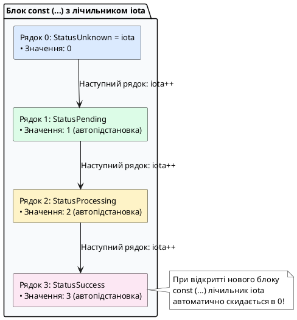

::

**Правила роботи `iota`:**

1. У кожному новому блоці `const (...)` лічильник `iota` **завжди починається з нуля (`0`)**.
2. З кожним наступним рядком усередині блоку значення `iota` автоматично збільшується на `1`.
3. **Автоповторення виразу:** Якщо в наступному рядку константи не вказано тип і значення, Go автоматично дублює формулу попереднього рядка.

---

### Покрокове створення правильного Enum у Go

Розглянемо правильний підхід до створення переліку статусів HTTP-запиту:

::tip{icon="i-lucide-info"}
**Що таке `type` у Go?**

Ключове слово `type` дозволяє створювати **власні типи даних** на основі існуючих. Це як створення нової "коробки" з унікальною назвою, яка всередині базується на стандартному типі (`int`, `string`, `uint8` тощо).

**Навіщо це потрібно?**
- **Семантична ясність:** `type UserID int` зрозуміліше, ніж просто `int`
- **Безпека типів:** Go не дозволить змішувати `UserID` з `ProductID`, хоч обидва базуються на `int`
- **Прив'язка методів:** до власного типу можна додавати методи

**Базовий синтаксис:**
```go
type ВашаНазва БазовийТип

// Приклади:
type UserID int           // Новий тип на базі int
type Email string         // Новий тип на базі string
type Temperature float64  // Новий тип на базі float64
type RequestStatus uint8  // Новий тип на базі uint8
```

Після оголошення `type UserID int`, ви можете використовувати `UserID` як повноцінний тип:
```go
var id UserID = 42
var count int = 10
// id = count  // ❌ Помилка: різні типи!
id = UserID(count)  // ✅ Потрібне явне перетворення
```
::

::steps

### Крок 1. Оголошення власного сильного типу

Створюємо новий тип на базі стандартного цілого числа (наприклад, `uint8`):

```go
type RequestStatus uint8
```

### Крок 2. Оголошення констант через iota із захистом Zero Value

Найкращою практикою є резервування значення `0` під невідомий або невизначений стан (_Unknown_), оскільки нульове значення змінної `var s RequestStatus` автоматично дорівнюватиме `0`:

```go
const (
	StatusUnknown    RequestStatus = iota // 0: Стан за замовчуванням (Zero Value)
	StatusPending                         // 1: В очікуванні
	StatusProcessing                      // 2: Обробляється
	StatusSuccess                         // 3: Успішно виконано
	StatusFailed                          // 4: Помилка обробки
)
```

### Крок 3. Реалізація інтерфейсу форматування `fmt.Stringer`

Щоб при виведенні в логи замість сухого числа `2` друкувався зрозумілий текст `"PROCESSING"`, додаємо метод `String()`:

```go
func (s RequestStatus) String() string {
	switch s {
	case StatusPending:
		return "PENDING"
	case StatusProcessing:
		return "PROCESSING"
	case StatusSuccess:
		return "SUCCESS"
	case StatusFailed:
		return "FAILED"
	default:
		return "UNKNOWN"
	}
}
```

::tip{icon="i-lucide-info"}
**Що означає `func (s RequestStatus) String() string`?**

Це **метод** — функція, прив'язана до типу `RequestStatus`.

**Розбір синтаксису:**
```go
func (s RequestStatus) String() string
     └──────┬──────┘   └─┬─┘    └─┬──┘
          ресівер    назва    повертає
        (одержувач)  методу    string
```

- **`(s RequestStatus)`** — **ресівер** (receiver): говорить, що цей метод належить типу `RequestStatus`
- **`s`** — змінна, через яку ми звертаємось до значення всередині методу (як `this` в інших мовах)
- **`String()`** — назва методу (без параметрів)
- **`string`** — тип значення, що повертається

**Як це працює:**
```go
status := StatusProcessing  // значення: 2

// Коли ви викликаєте fmt.Println(status),
// Go автоматично шукає метод String() і викликає його:
fmt.Println(status)  // Виведе: "PROCESSING" замість 2
```

Детальніше про функції та методи — у наступних розділах.
::

::

---

### Розширені інженерні патерни застосування `iota`

```go
package main

import "fmt"

// Патерн 1: Пропуск нульового значення через Blank Identifier (_)
type Priority int

const (
	_ Priority = iota // Пропускаємо індекс 0
	LowPriority       // 1
	MediumPriority    // 2
	HighPriority      // 3
)

// Патерн 2: Побітовий зсув (1 << iota) для створення бітових масок (Bitmask Flags)
// Ідеально підходить для прав доступу в клієнт-серверних API:
type UserRole uint8

const (
	RoleGuest     UserRole = 1 << iota // 1 << 0 = 0001 (1 в десятковій)
	RoleUser                            // 1 << 1 = 0010 (2 в десятковій)
	RoleModerator                       // 1 << 2 = 0100 (4 в десятковій)
	RoleAdmin                           // 1 << 3 = 1000 (8 в десятковій)
)

// Патерн 3: Множники одиниць пам'яті через ступінь двійки
const (
	_           = iota             // Пропускаємо 1 << (10 * 0)
	KB uint64 = 1 << (10 * iota) // 1 << 10 = 1024 байтів
	MB                             // 1 << 20 = 1048576 байтів
	GB                             // 1 << 30 = 1073741824 байтів
	TB                             // 1 << 40 = 1099511627776 байтів
)

func main() {
	// Демонстрація бітових прапорців:
	// Надаємо користувачу права звичайного користувача ТА модератора одночасно:
	activeRoles := RoleUser | RoleModerator
	fmt.Printf("Бітова маска ролей: %04b (десяткове: %d)\n", activeRoles, activeRoles)

	// Перевірка наявності ролі адміністратора через побітове І (&):
	isAdmin := (activeRoles & RoleAdmin) != 0
	isModerator := (activeRoles & RoleModerator) != 0
	fmt.Printf("Користувач є Admin? %t\n", isAdmin)
	fmt.Printf("Користувач є Moderator? %t\n", isModerator)

	// Константи пам'яті:
	fmt.Printf("Ліміт файлу: 500 MB = %d байтів\n", 500*MB)
}
```

---

## Базові типи даних та концепція Zero Values

Go — це мова із **суворою статичною типізацією** (_statically and strongly typed_). Компілятор ніколи не робить прихованих перетворень: складання `int32` та `int64` вимагає обов'язкового явного приведення `int64(val32)`.

### Повний список базових типів даних у Go

| Категорія | Тип | Розмір (байт) | Діапазон / Опис | Приклад |
|-----------|-----|---------------|-----------------|---------|
| **Цілі зі знаком** | `int8` | 1 | -128 до 127 | `var temp int8 = -15` |
| | `int16` | 2 | -32,768 до 32,767 | `var offset int16 = -3000` |
| | `int32` (він же `rune`) | 4 | -2,147,483,648 до 2,147,483,647 | `var count int32 = 150000` |
| | `int64` | 8 | -9,223,372,036,854,775,808 до 9,223,372,036,854,775,807 | `var timestamp int64 = 1719584000` |
| | `int` | 4 або 8 | Залежить від архітектури (32/64 біт) | `var users int = 1000` |
| **Цілі без знаку** | `uint8` (він же `byte`) | 1 | 0 до 255 | `var rawByte byte = 0xFF` |
| | `uint16` | 2 | 0 до 65,535 | `var port uint16 = 8080` |
| | `uint32` | 4 | 0 до 4,294,967,295 | `var maxConns uint32 = 100000` |
| | `uint64` | 8 | 0 до 18,446,744,073,709,551,615 | `var fileSize uint64 = 10737418240` |
| | `uint` | 4 або 8 | Залежить від архітектури (32/64 біт) | `var index uint = 42` |
| | `uintptr` | 4 або 8 | Достатній для зберігання адреси пам'яті | Використовується з `unsafe.Pointer` |
| **Дійсні числа** | `float32` | 4 | IEEE-754, ~7 знаків точності | `var cpuUsage float32 = 0.452` |
| | `float64` | 8 | IEEE-754, ~15 знаків точності (рекомендовано) | `var latency float64 = 12.84752` |
| **Комплексні числа** | `complex64` | 8 | Пара `float32` (real + imag) | `var z complex64 = 1 + 2i` |
| | `complex128` | 16 | Пара `float64` (real + imag) | `var z complex128 = 3 + 4i` |
| **Булевий** | `bool` | 1 | `true` або `false` | `var isActive bool = true` |
| **Рядковий** | `string` | 16 | UTF-8 послідовність (дескриптор: ptr + len) | `var name string = "Kostyl"` |
| **Покажчик** | `*T` | 4 або 8 | Адреса пам'яті для типу `T` | `var ptr *int = &x` |
| **Зріз** | `[]T` | 24 | Динамічний масив (дескриптор: ptr + len + cap) | `var nums []int = []int{1, 2, 3}` |
| **Масив** | `[N]T` | N × sizeof(T) | Фіксована послідовність `N` елементів типу `T` | `var arr [5]int` |
| **Карта** | `map[K]V` | 8 | Асоціативний масив (хеш-таблиця) | `var users map[string]int` |
| **Структура** | `struct{}` | Сума розмірів полів + вирівнювання | Композитний тип з іменованими полями | `type User struct { Name string }` |
| **Канал** | `chan T` | 8 | Канал для передачі значень типу `T` | `var ch chan int = make(chan int)` |
| **Інтерфейс** | `interface{}` (він же `any`) | 16 | Два покажчики: type + value | `var x any = 42` |
| **Функція** | `func(...)` | 8 | Покажчик на функцію | `var fn func(int) int` |

::callout{icon="i-lucide-info"}
**Важливі нюанси:**

1. **Типи-аліаси:** `byte` = `uint8`, `rune` = `int32`, `any` = `interface{}`
2. **Архітектурно-залежні:** `int`, `uint`, `uintptr` мають розмір 32 біти на 32-бітних системах і 64 біти на 64-бітних
3. **Розмір структури:** залежить від вирівнювання (_alignment_) — детальніше в розділі про memory layout
4. **Дескриптори:** `string`, `[]T`, `map`, `chan`, `interface` — це "розумні вказівники" з метаданими, а не прямі дані
::

### Концепція нульових значень (Zero Values)

**Проста аналогія:** уявіть готель. У C вам видають номер після попереднього гостя без прибирання — у шухлядах «сміття» (випадкові байти). У Go покоївка (компілятор + runtime) **завжди прибирає номер перед заселенням** — усі шухляди порожні. Тому `var s string` — це чистий порожній рядок `""`, а не випадкові символи.

На відміну від C/C++, де неініціалізована змінна містить залишкове «сміття» пам'яті, у Go виділена пам'ять **завжди гарантовано занулюється компілятором**. Це не «зручність», а гарантія безпеки:

| Тип даних                                           | Нульове значення (_Zero Value_)     | Фізичний стан у пам'яті                                                       |
| :-------------------------------------------------- | :---------------------------------- | :---------------------------------------------------------------------------- |
| Числові типи (`int`, `uint`, `float64`)             | `0` або `0.0`                       | Усі байти заповнені `0x00`                                                    |
| Булевий тип (`bool`)                                | `false`                             | Байт значення `0x00`                                                          |
| Рядки (`string`)                                    | `""` (порожній рядок)               | Порожній рядок (деталі `StringHeader` — див. розділ про рядки нижче)          |
| Покажчики (`*T`), Інтерфейси (`any`)                | `nil`                               | Відсутня адреса (деталі — див. розділ про покажчики)                          |
| Зрізи (`[]T`), Мапи (`map[K]V`), Канали (`chan T`) | `nil`                               | Відсутній дескриптор (деталі — див. `make vs new` та розділи про зрізи/мапи) |
| Структури (`struct`)                                | Усі поля містять свої _Zero Values_ | Повний блок пам'яті структури занулено                                        |

**Наслідок для бекенду:** завдяки Zero Value `var s string` можна одразу робити `s += "hello"` без перевірки на `nil`, а `var m map[string]int` — ні: читати `m["k"]` дасть `0`, але `m["k"]=1` → `panic`. Тому мапи та зрізи вимагають `make` — деталі в розділі `make vs new` пізніше, поки достатньо запам'ятати правило з таблиці.

---

### Детальний огляд числових типів

#### Цілі числа зі знаком та без знаку

**Контекст вибору типу:** у клієнт-серверних системах тип — це не лише діапазон, а й контракт. Система зберігає `userID` в PostgreSQL як `BIGINT` → у Go це `int64`, а мережевий порт за RFC — `0..65535` → `uint16`. Використання `int` для порту дозволить передати `-1` і зламати `net.Listen` (функція `net.Listen` очікує валідний порт, але з типом `int` компілятор не зловить помилку, і в runtime отримаємо panic або невизначену поведінку замість помилки компіляції).

**Внутрішній механізм:** `int` та `uint` — це типи розміру машинного слова: 4 байти на 32-бітній ОС і 8 байтів на 64-бітній. Вони найшвидші (одна інструкція CPU), але **непереносні для бінарних протоколів та файлів**: якщо програма на 64-бітній системі записує `int` (8 байт) у файл, а програма на 32-бітній системі читає цей файл очікуючи `int` (4 байти), дані будуть прочитані невірно. Фіксовані `int32/int64` гарантують однаковий розмір на всіх платформах — завжди 4 та 8 байтів відповідно, незалежно від архітектури.

::tip{icon="i-lucide-alert-triangle"}
**Приклад проблеми переносності:**

```go
// Програма A (64-біт система) записує дані:
var count int = 1000  // Займає 8 байт
file.Write(binary.LittleEndian, count)  // Записано 8 байт

// Програма B (32-біт система) читає:
var count int  // Очікує 4 байти
file.Read(binary.LittleEndian, &count)  // Читає 4 байти замість 8!
// Результат: неправильне значення або помилка читання
```

**Рішення для переносності:**
```go
// Завжди використовуйте фіксовані типи для бінарних даних:
var count int32 = 1000  // Завжди 4 байти на будь-якій системі
var timestamp int64 = 1719584000  // Завжди 8 байт на будь-якій системі
```

Те саме стосується мережевих протоколів: клієнт на 64-біт машині та сервер на 32-біт машині повинні "говорити однією мовою" — використовувати типи фіксованого розміру.
::

Псевдоніми `byte = uint8` та `rune = int32` (оголошені як `type byte = uint8`) не створюють нового типу — тому `byte(255)` та `uint8(255)` взаємозамінні без приведення, на відміну від `type UserID int64`.

**Що буде якщо інакше — переповнення (_wrap-around_):** Go не панікує при переповненні цілих — значення циклічно обертається за модулем $2^N$, як у C з `-fwrapv`. Це джерело багів безпеки:

```go
var a int8 = 127
a++ // 127 + 1 == -128 (0b01111111 -> 0b10000000)
var b uint8 = 255
b++ // 255 + 1 == 0
// Для мережевих лічильників це означає що 10 ГБ файл + 1 байт може стати 0!
```

Компілятор ловить лише константне переповнення (`const x int8 = 128` — помилка), але не динамічне. Для безпечної арифметики перевіряйте межі вручну або використовуйте `math/bits.Add64` з прапорцем переносу. Тип `uintptr` — ціле достатнє для зберігання адреси, потрібне лише для `unsafe.Pointer` та системних викликів, ніколи не використовуйте його як звичайний лічильник.

```go
package main

import (
	"fmt"
	"math"
)

func main() {
	// Системні цілі типи (розмір 32 або 64 біти залежно від архітектури ОС)
	var totalUsers int = 1_000_000 // Символ _ підвищує читабельність
	var userIndex uint = 42        // Тільки невід'ємні числа

	// Цілі типи фіксованої розрядності зі знаком
	var tempSensor int8 = -15          // Від -128 до 127 (1 байт)
	var clientOffset int16 = -3000     // Від -32768 до 32767 (2 байти)
	var metricCount int32 = 150000     // 4 байти (аліас rune)
	var unixTimestamp int64 = 1719584000 // 8 байтів (мітки часу)

	// Беззнакові типи (ідеальні для мережевих пакетів)
	var rawByte byte = 0xFF            // byte — це аліас для uint8 (0..255)
	var networkPort uint16 = 8080      // Мережевий TCP/UDP порт (0..65535)
	var maxConns uint32 = 100_000      // 4 байти (0..4294967295)
	var fileSize uint64 = 10 << 30     // 10 ГБ (8 байтів)

	// Явне перетворення типів
	sum := int64(networkPort) + unixTimestamp
	fmt.Printf("Порт: %d, Загальний час: %d, MaxInt64: %d\n", networkPort, sum, math.MaxInt64)
}
```

---

#### Дійсні числа, комплексні числа та булевий тип

##### Дійсні числа (Float)

**Дійсні числа в Go (`float32` та `float64`)** представляють числа з плаваючою комою за стандартом **IEEE-754**.

| Тип | Розмір | Точність | Типове використання |
|-----|--------|----------|---------------------|
| `float32` | 4 байти | ~7 десяткових знаків | Графіка, ігри, коли потрібна економія пам'яті |
| `float64` | 8 байтів | ~15 десяткових знаків | **Стандартний вибір** для наукових обчислень, фінансів (з обережністю) |

::callout{icon="i-lucide-alert-triangle"}
**Важливо про точність:**

Дійсні числа **не можуть точно представити всі десяткові дроби**:

```go
var x float64 = 0.1 + 0.2
fmt.Println(x)  // Виведе: 0.30000000000000004 (не 0.3!)
fmt.Println(x == 0.3)  // false

// Для фінансових розрахунків використовуйте:
// - Цілі числа (копійки замість гривень): var cents int64 = 1050 // 10.50 грн
// - Спеціальні бібліотеки: github.com/shopspring/decimal
```
::

**Спеціальні значення:**
- `+Inf`, `-Inf` (нескінченність): `1.0 / 0.0`
- `NaN` (Not a Number): `0.0 / 0.0` або `math.Sqrt(-1)`

##### Комплексні числа (Complex)

**Комплексні числа** складаються з дійсної та уявної частин: `a + bi`, де `i = √-1`.

| Тип | Розмір | Складові | Використання |
|-----|--------|----------|--------------|
| `complex64` | 8 байтів | Два `float32` (real + imag) | Наукові обчислення, DSP |
| `complex128` | 16 байтів | Два `float64` (real + imag) | **Стандартний вибір** для точних розрахунків |

**Операції з комплексними числами:**

```go
z1 := 1 + 2i              // Літерал комплексного числа
z2 := complex(3, 4)       // Конструктор: complex(real, imag)

// Отримання частин:
realPart := real(z1)      // 1.0
imagPart := imag(z1)      // 2.0

// Арифметика:
sum := z1 + z2            // (4+6i)
product := z1 * z2        // (-5+10i)
```

::tip{icon="i-lucide-info"}
У більшості бізнес-застосунків комплексні числа не використовуються. Вони потрібні для наукових обчислень, обробки сигналів, квантових алгоритмів.
::

##### Булевий тип (Boolean)

**Булевий тип `bool`** має лише два значення: `true` (істина) та `false` (хибність).

| Тип | Розмір | Значення | Zero Value |
|-----|--------|----------|------------|
| `bool` | 1 байт | `true` або `false` | `false` |

**Логічні операції:**

```go
var isActive bool = true
var isAdmin bool = false

// Логічні оператори:
result1 := isActive && isAdmin  // false (логічне І - AND)
result2 := isActive || isAdmin  // true  (логічне АБО - OR)
result3 := !isActive            // false (логічне НЕ - NOT)

// Порівняння (повертають bool):
x := 5
y := 10
fmt.Println(x == y)  // false (дорівнює)
fmt.Println(x != y)  // true  (не дорівнює)
fmt.Println(x < y)   // true  (менше)
fmt.Println(x > y)   // false (більше)
fmt.Println(x <= y)  // true  (менше або дорівнює)
fmt.Println(x >= y)  // false (більше або дорівнює)
```

::callout{icon="i-lucide-zap"}
**На відміну від C/C++/JavaScript:**
- У Go **немає автоматичного перетворення** числа в `bool`
- `if 1 { ... }` — помилка компіляції (потрібно `if true`)
- `if x { ... }` — помилка, якщо `x` не `bool` (потрібно `if x != 0`)
::

**Повний приклад використання:**

```go
package main

import (
	"fmt"
	"math"
)

func main() {
	// Дійсні числа за стандартом IEEE-754
	var cpuUsage float32 = 0.452     // 4 байти
	var latencyMs float64 = 12.84752 // 8 байтів (стандартний вибір)

	// Комплексні числа
	var z1 complex64 = 1 + 2i
	var z2 complex128 = complex(3, 4)

	// Булевий тип
	var isTLS bool = true
	var isClosed = false

	if isTLS && !isClosed {
		fmt.Printf("Затримка: %.2f мс, CPU: %.1f%%, Z1: %v\n", latencyMs, cpuUsage*100, z1)
	}

	// Перевірка на нечисло (NaN) та нескінченність
	if math.IsNaN(math.Sqrt(-1)) {
		fmt.Println("Математична помилка: отримано NaN")
	}
}
```

---

#### Рядки, байти та робота з Unicode (`string`, `byte`, `rune`)

У сучасних клієнт-серверних архітектурах обробка тексту (парсинг JSON, читання HTTP-заголовків, запити до баз даних, валідація користувацьких даних) становить левову частку роботи бекенда. Мова Go має одну з найбільш продуманих та ефективних систем роботи з текстом, спроєктовану авторами стандарту UTF-8 — Кеном Томпсоном та Робом Пайком.

##### Що таке рядок у Go?

**Рядок (`string`) у Go — це незмінна (_immutable_) послідовність байтів.**

::callout{icon="i-lucide-info"}
**Ключові факти:**

1. **Незмінність:** не можна змінити окремий символ (`msg[0] = 'A'` — помилка компіляції)
2. **UTF-8 за замовчуванням:** всі рядкові літерали в Go автоматично кодуються в UTF-8
3. **Розмір дескриптора:** рядок займає 16 байтів (на 64-біт системі) незалежно від довжини тексту
4. **Ефективне зрізання:** `sub := str[0:5]` створює новий рядок без копіювання байтів

**Порівняння з Java:**
| Аспект | Go `string` | Java `String` |
|--------|-------------|---------------|
| Кодування | **UTF-8** (змінна кількість байтів) | **UTF-16** (2 або 4 байти на символ) |
| Незмінність | ✅ Так | ✅ Так |
| Внутрішня структура | Покажчик + довжина (16 байт) | Масив `char[]` + offset + length |
| Зрізання | Без копіювання (новий дескриптор) | З копіюванням (`substring` до Java 7) |
| Ітерація | `for range` автодекодує UTF-8 | `charAt()` працює з UTF-16 code units |
::

##### Внутрішня будова рядка

На рівні середовища виконання Go рядок описується структурою **`StringHeader`**:

```go
// Внутрішнє представлення (не використовуйте напряму!)
type StringHeader struct {
    Data uintptr  // Адреса першого байта в пам'яті
    Len  int      // Довжина в байтах
}
```

**Візуалізація:**

```
msg := "Go"

┌─── StringHeader (16 байт на стеку) ───┐
│ Data: 0x10A0  (покажчик на байти)     │
│ Len:  2       (довжина в байтах)      │
└────────────────────────────────────────┘
         │
         └──→ [0x47, 0x6F]  ← Незмінні байти в пам'яті
              ('G')  ('o')
```

::tip{icon="i-lucide-lock"}
**Чому рядки незмінні?**

1. **Безпека багатопоточності:** багато горутин можуть читати той самий рядок без блокувань
2. **Ефективність:** зрізання рядка (`str[0:5]`) створює новий дескриптор без копіювання даних
3. **Оптимізація пам'яті:** однакові рядкові літерали можуть ділити один блок пам'яті
4. **Захист від помилок:** неможливо випадково змінити рядок, переданий в функцію
::

---

##### Два види рядкових літералів

Go підтримує два способи оголошення рядків у коді:

**1. Інтерпретовані рядки у подвійних лапках (`"..."`):**
- Обробляють escape-послідовності: `\n`, `\t`, `\"`, `\\`, `\uXXXX`
- Не можуть містити фізичні переноси рядків

**2. Сирі рядкові літерали у зворотних лапках (`` `...` ``):**
- Зберігають текст **без змін**: пробіли, переноси, лапки — все як є
- Escape-послідовності не працюють (`\n` = два символи `\` та `n`)
- Ідеально для SQL, JSON, HTML, регулярних виразів

```go
package main

import "fmt"

func main() {
	// Інтерпретований рядок з escape-символами:
	jsonSnippet := "{\n\t\"status\": 200,\n\t\"message\": \"OK\"\n}"

	// Сирий рядковий літерал (читабельний код):
	sqlQuery := `
		SELECT id, username, email
		FROM users
		WHERE is_active = true
		  AND role = 'admin'
		ORDER BY created_at DESC;
	`

	fmt.Println("JSON:", jsonSnippet)
	fmt.Println("SQL:", sqlQuery)
}
```

---

##### UTF-8: Чому `len()` не рахує символи?

Стандарт кодування **UTF-8** використовує **змінну кількість байтів** для символів:

| Символи | Байтів | Приклади |
|---------|--------|----------|
| ASCII (A-Z, 0-9) | 1 | `"Hello"` = 5 байтів |
| Кирилиця, грецький | 2 | `"Київ"` = 8 байтів (4 літери × 2) |
| Китайські ієрогліфи | 3 | `"中国"` = 6 байтів (2 ієрогліфи × 3) |
| Емодзі | 4 | `"🚀"` = 4 байти |

**Найпоширеніша помилка початківців:**

```go
package main

import (
	"fmt"
	"unicode/utf8"
)

func main() {
	text := "Київ 🇺🇦"

	// ❌ ПОМИЛКА: len() повертає БАЙТИ, а не символи!
	fmt.Printf("len(text): %d байтів\n", len(text))  // 17 байтів
	
	// ✅ ПРАВИЛЬНО: utf8.RuneCountInString() рахує символи
	fmt.Printf("Символів: %d\n", utf8.RuneCountInString(text))  // 6 символів

	// ❌ ПОМИЛКА: text[0] повертає перший БАЙТ (не літеру!)
	fmt.Printf("text[0]: 0x%X (половина літери 'К'!)\n", text[0])
	
	// ✅ ПРАВИЛЬНО: використовуйте []rune() або for-range
	runes := []rune(text)
	fmt.Printf("Перша літера: %c\n", runes[0])  // 'К'
}
```

::tip{icon="i-lucide-info"}
**Що таке `len()`?**

`len()` — це **вбудована функція** (_built-in function_) Go, яка повертає:
- Для `string`: кількість **байтів** (не символів!)
- Для `[]T` (зріз): кількість елементів
- Для `[N]T` (масив): кількість елементів (завжди `N`)
- Для `map[K]V`: кількість ключів

**Чому `len(string)` повертає байти?**

Тому що рядок в Go — це послідовність байтів UTF-8, а не масив символів. Для підрахунку символів використовуйте `utf8.RuneCountInString()` або `len([]rune(text))`.

```go
text := "Go"         // ASCII: 2 символи × 1 байт = 2 байти
len(text)            // 2

text = "Го"          // Кирилиця: 2 символи × 2 байти = 4 байти
len(text)            // 4 (не 2!)
utf8.RuneCountInString(text)  // 2 символи
```
::

**Вивід:**
```
len(text): 17 байтів
Символів: 6
text[0]: 0xD0 (половина літери 'К'!)
Перша літера: К
```

---

##### Тип `rune`: робота з окремими символами

**`rune` — це аліас для `int32`** (4 байти), що зберігає Unicode code point (номер символу в таблиці Unicode).

| Тип | Призначення | Розмір | Приклад |
|-----|-------------|--------|---------|
| `byte` | Один байт даних | 1 байт | `byte('A')` = 65 |
| `rune` | Один символ Unicode | 4 байти | `rune('Ї')` = 1031 |
| `string` | Послідовність байтів UTF-8 | 16 байт (дескриптор) | `"Привіт"` |

::callout{icon="i-lucide-lightbulb"}
**Аналогія:**
- `byte` — це **цеглина** (1 байт)
- `rune` — це **літера** (може складатися з 1-4 цеглин)
- `string` — це **текст** (незмінна послідовність цеглин)

`len("Київ")` рахує цеглини (8), `utf8.RuneCountInString()` — літери (4).

**Порівняння з Java:**
- Go `rune` = Java `int` (Unicode code point)
- Go `byte` = Java `byte` (8 біт)
- Go `string` ≈ Java `String`, але Go використовує UTF-8, а Java — UTF-16
::

**Перетворення між типами:**

```go
package main

import "fmt"

func main() {
	str := "Слава Україні!"

	// 1. Перетворення рядка на зріз рун (доступ до літер за індексом):
	runes := []rune(str)
	fmt.Printf("Перша літера: %c, Третя літера: %c\n", runes[0], runes[2])
	// Вивід: Перша літера: С, Третя літера: а

	// 2. Модифікація тексту через зріз рун:
	runes[0] = 'Ж'
	modifiedStr := string(runes)
	fmt.Println("Модифікований:", modifiedStr)
	// Вивід: Модифікований: Жлава Україні!

	// 3. Ітерація for-range автоматично декодує UTF-8:
	for byteIndex, r := range "Go Го" {
		fmt.Printf("Байт %d: '%c' (U+%04X)\n", byteIndex, r, r)
	}
	/* Вивід:
	Байт 0: 'G' (U+0047)
	Байт 1: 'o' (U+006F)
	Байт 2: ' ' (U+0020)
	Байт 3: 'Г' (U+0413)  ← byteIndex стрибає на 3, бо кирилиця = 2 байти
	Байт 5: 'о' (U+043E)
	*/
}
```

**Основні операції:**

```go
// Перетворення:
[]rune(str)      // string → []rune (масив символів)
[]byte(str)      // string → []byte (масив байтів)
string(runes)    // []rune → string
string(bytes)    // []byte → string

// Літерали:
var ch rune = 'Ї'           // Одинарні лапки для рун
var text string = "Привіт"  // Подвійні лапки для рядків

// Безпечна ітерація:
for index, runeValue := range text {
    fmt.Printf("%d: %c\n", index, runeValue)
}
```

---

## Робота з рядками: пакет `strings`

У попередньому розділі ми розглянули внутрішню будову рядків, UTF-8 кодування та тип `rune`. Тепер перейдемо до практичних операцій з текстом, які потрібні в реальних проєктах: пошук підрядків, заміна тексту, розбиття на частини, видалення пробілів та інше.

Для цього Go надає пакет **`strings`** зі стандартної бібліотеки — набір функцій для роботи з UTF-8 рядками без необхідності писати низькорівневі алгоритми.

::callout{icon="i-lucide-package"}
**Коли використовувати `strings`:**
- Валідація вхідних даних (перевірка префіксів, суфіксів, наявності символів)
- Парсинг конфігураційних файлів (розбиття на рядки, видалення коментарів)
- Обробка HTTP-заголовків (перетворення регістру, пошук токенів)
- Формування SQL-запитів (об'єднання частин, підстановка параметрів)
- Логування (підготовка повідомлень, очищення від небажаних символів)
::

### Частина 1: Перетворення регістру та перевірка префіксів/суфіксів

#### Зміна регістру: `ToUpper`, `ToLower`, `Title`

**Функції:**
- `strings.ToUpper(s)` — всі літери у верхній регістр
- `strings.ToLower(s)` — всі літери у нижній регістр
- `strings.Title(s)` — **Застаріла!** Використовуйте `cases.Title()` з пакету `golang.org/x/text/cases`

::tabs

::tabs-item{label="Go" icon="i-simple-icons-go"}

```go
package main

import (
	"fmt"
	"strings"
)

func main() {
	header := "Content-Type"
	
	fmt.Println(strings.ToUpper(header))  // CONTENT-TYPE
	fmt.Println(strings.ToLower(header))  // content-type
	
	// Приклад: нормалізація HTTP-заголовків для порівняння
	userAgent := "Mozilla/5.0"
	if strings.ToLower(userAgent) == "mozilla/5.0" {
		fmt.Println("Браузер розпізнано")
	}
}
```

**Особливості:**
- Обробляють **всі Unicode символи** (не тільки ASCII)
- Повертають **новий рядок** (рядки незмінні!)
- Працюють з будь-якою довжиною рядка без обмежень

::

::tabs-item{label="Java" icon="i-simple-icons-openjdk"}

```java
public class StringExample {
    public static void main(String[] args) {
        String header = "Content-Type";
        
        System.out.println(header.toUpperCase());  // CONTENT-TYPE
        System.out.println(header.toLowerCase());  // content-type
        
        // Приклад: нормалізація HTTP-заголовків
        String userAgent = "Mozilla/5.0";
        if (userAgent.toLowerCase().equals("mozilla/5.0")) {
            System.out.println("Браузер розпізнано");
        }
    }
}
```

**Відмінності від Go:**
- **Методи об'єкта** (`header.toUpperCase()`), а не функції (`strings.ToUpper(header)`)
- Використовують UTF-16 всередині, Go — UTF-8
- `equals()` для порівняння, Go — `==`

::

::

---

#### Перевірка префіксів та суфіксів: `HasPrefix`, `HasSuffix`

**Типові задачі:**
- Перевірка протоколу URL (`https://...`)
- Фільтрація файлів за розширенням (`.json`, `.yaml`)
- Валідація токенів (`Bearer ...`)

::tabs

::tabs-item{label="Go" icon="i-simple-icons-go"}

```go
package main

import (
	"fmt"
	"strings"
)

func main() {
	url := "https://api.example.com/users"
	filename := "config.yaml"
	authHeader := "Bearer eyJhbGciOiJIUzI1NiIsInR5cCI6IkpXVCJ9"
	
	// Перевірка префіксу
	if strings.HasPrefix(url, "https://") {
		fmt.Println("✅ Безпечне з'єднання")
	}
	
	// Перевірка суфіксу
	if strings.HasSuffix(filename, ".yaml") || strings.HasSuffix(filename, ".yml") {
		fmt.Println("✅ YAML конфігурація")
	}
	
	// Валідація токену
	if strings.HasPrefix(authHeader, "Bearer ") {
		token := authHeader[7:]  // Видаляємо "Bearer "
		fmt.Println("Токен:", token)
	}
}
```

**Сигнатури:**
```go
func HasPrefix(s, prefix string) bool
func HasSuffix(s, suffix string) bool
```

**Переваги:**
- **Регістрозалежні:** `HasPrefix("Hello", "he")` → `false`
- **Ефективні:** не створюють підрядки, просто порівнюють байти
- **UTF-8 безпечні:** коректно працюють з багатобайтовими символами

::

::tabs-item{label="Java" icon="i-simple-icons-openjdk"}

```java
public class UrlValidator {
    public static void main(String[] args) {
        String url = "https://api.example.com/users";
        String filename = "config.yaml";
        String authHeader = "Bearer eyJhbGciOiJIUzI1NiIsInR5cCI6IkpXVCJ9";
        
        // Перевірка префіксу
        if (url.startsWith("https://")) {
            System.out.println("✅ Безпечне з'єднання");
        }
        
        // Перевірка суфіксу
        if (filename.endsWith(".yaml") || filename.endsWith(".yml")) {
            System.out.println("✅ YAML конфігурація");
        }
        
        // Валідація токену
        if (authHeader.startsWith("Bearer ")) {
            String token = authHeader.substring(7);
            System.out.println("Токен: " + token);
        }
    }
}
```

**Відмінності від Go:**
- **Методи об'єкта:** `url.startsWith()`, `filename.endsWith()`
- **substring()** створює новий рядок, Go `[7:]` — теж, але синтаксис простіший

::

::

::tip{icon="i-lucide-lightbulb"}
**Чому не використовувати `==` для перевірки префіксів?**

```go
// ❌ ПОГАНО
if url[:8] == "https://" {  // Паніка якщо url коротший за 8 символів!
    // ...
}

// ✅ ДОБРЕ
if strings.HasPrefix(url, "https://") {  // Безпечно для будь-якої довжини
    // ...
}
```

`HasPrefix` автоматично перевіряє довжину рядка і не викликає паніку.
::

---

### Частина 2: Пошук підрядків та підрахунок входжень

#### Перевірка наявності: `Contains`, `ContainsAny`, `ContainsRune`

**Типові задачі:**
- Перевірка чи містить email символ `@`
- Фільтрація SQL-запитів на небезпечні символи
- Пошук ключових слів у лог-файлах

::tabs

::tabs-item{label="Go" icon="i-simple-icons-go"}

```go
package main

import (
	"fmt"
	"strings"
)

func main() {
	email := "user@example.com"
	query := "SELECT * FROM users"
	logLine := "[ERROR] Database connection failed"
	
	// 1. Contains — чи містить підрядок
	if strings.Contains(email, "@") {
		fmt.Println("✅ Email валідний (містить @)")
	}
	
	// 2. ContainsAny — чи містить ХОЧА Б ОДИН символ зі списку
	dangerousChars := "';--"
	if strings.ContainsAny(query, dangerousChars) {
		fmt.Println("⚠️  Підозра на SQL-ін'єкцію!")
	}
	
	// 3. ContainsRune — чи містить конкретну руну (символ Unicode)
	if strings.ContainsRune(logLine, '🔥') {
		fmt.Println("Критична помилка!")
	}
	
	// 4. Count — скільки разів зустрічається підрядок
	text := "Go Go Go!"
	count := strings.Count(text, "Go")
	fmt.Printf("Слово 'Go' зустрічається %d рази\n", count)  // 3
}
```

**Сигнатури:**
```go
func Contains(s, substr string) bool
func ContainsAny(s, chars string) bool
func ContainsRune(s string, r rune) bool
func Count(s, substr string) int
```

::

::tabs-item{label="Java" icon="i-simple-icons-openjdk"}

```java
public class StringSearch {
    public static void main(String[] args) {
        String email = "user@example.com";
        String query = "SELECT * FROM users";
        String logLine = "[ERROR] Database connection failed";
        
        // 1. contains — чи містить підрядок
        if (email.contains("@")) {
            System.out.println("✅ Email валідний (містить @)");
        }
        
        // 2. Немає ContainsAny — треба писати вручну
        String dangerousChars = "';--";
        boolean hasDangerous = false;
        for (char c : dangerousChars.toCharArray()) {
            if (query.indexOf(c) != -1) {
                hasDangerous = true;
                break;
            }
        }
        if (hasDangerous) {
            System.out.println("⚠️  Підозра на SQL-ін'єкцію!");
        }
        
        // 3. Пошук частоти входження — вручну або Apache Commons
        String text = "Go Go Go!";
        int count = text.split("Go", -1).length - 1;
        System.out.printf("Слово 'Go' зустрічається %d рази\n", count);  // 3
    }
}
```

**Відмінності від Go:**
- **Немає `ContainsAny`** — треба писати цикл або використовувати regex
- **Немає `Count`** — треба `split()` або Apache Commons `StringUtils.countMatches()`
- **`contains()` — метод**, `strings.Contains()` — функція

::

::

---

#### Пошук індексу: `Index`, `LastIndex`, `IndexAny`, `LastIndexAny`

**Для чого:**
- Знайти позицію першого входження (`Index`)
- Знайти позицію останнього входження (`LastIndex`)
- Знайти будь-який символ зі списку (`IndexAny`)

::tabs

::tabs-item{label="Go" icon="i-simple-icons-go"}

```go
package main

import (
	"fmt"
	"strings"
)

func main() {
	path := "/home/user/documents/file.txt"
	url := "https://api.example.com/v1/users?page=2&limit=10"
	
	// 1. Index — індекс першого входження
	atIndex := strings.Index("user@example.com", "@")
	fmt.Println("Позиція @:", atIndex)  // 4
	
	// 2. LastIndex — індекс останнього входження
	lastSlash := strings.LastIndex(path, "/")
	filename := path[lastSlash+1:]
	fmt.Println("Ім'я файлу:", filename)  // file.txt
	
	// 3. IndexAny — індекс ПЕРШОГО з будь-якого символу
	firstSpecial := strings.IndexAny(url, "?&")
	fmt.Println("Перший спецсимвол на позиції:", firstSpecial)  // 35 (позиція '?')
	
	// 4. LastIndexAny — індекс ОСТАННЬОГО з будь-якого символу
	lastSpecial := strings.LastIndexAny(url, "?&")
	fmt.Println("Останній спецсимвол на позиції:", lastSpecial)  // 42 (позиція '&')
	
	// 5. Якщо не знайдено — повертається -1
	notFound := strings.Index("Hello", "xyz")
	if notFound == -1 {
		fmt.Println("Підрядок не знайдено")
	}
}
```

**Таблиця функцій:**

| Функція | Шукає | Повертає | Якщо не знайдено |
|---------|-------|----------|------------------|
| `Index(s, substr)` | Перше входження `substr` | Індекс першого байта | `-1` |
| `LastIndex(s, substr)` | Останнє входження `substr` | Індекс першого байта | `-1` |
| `IndexAny(s, chars)` | Перший символ зі `chars` | Індекс символу | `-1` |
| `LastIndexAny(s, chars)` | Останній символ зі `chars` | Індекс символу | `-1` |

::

::tabs-item{label="Java" icon="i-simple-icons-openjdk"}

```java
public class StringIndexing {
    public static void main(String[] args) {
        String path = "/home/user/documents/file.txt";
        String url = "https://api.example.com/v1/users?page=2&limit=10";
        
        // 1. indexOf — індекс першого входження
        int atIndex = "user@example.com".indexOf("@");
        System.out.println("Позиція @: " + atIndex);  // 4
        
        // 2. lastIndexOf — індекс останнього входження
        int lastSlash = path.lastIndexOf("/");
        String filename = path.substring(lastSlash + 1);
        System.out.println("Ім'я файлу: " + filename);  // file.txt
        
        // 3. Немає IndexAny — треба regex або цикл
        int firstSpecial = -1;
        for (int i = 0; i < url.length(); i++) {
            if (url.charAt(i) == '?' || url.charAt(i) == '&') {
                firstSpecial = i;
                break;
            }
        }
        System.out.println("Перший спецсимвол на позиції: " + firstSpecial);
        
        // 4. Якщо не знайдено — повертається -1
        int notFound = "Hello".indexOf("xyz");
        if (notFound == -1) {
            System.out.println("Підрядок не знайдено");
        }
    }
}
```

**Відмінності від Go:**
- **`indexOf()`, `lastIndexOf()`** — методи, а не окремі функції
- **Немає `IndexAny` / `LastIndexAny`** — треба писати цикл або використовувати regex
- **`substring()`** для вирізання, Go — синтаксис `[start:end]`

::

::

::caution
**Важливо: індекси — це байти, не символи!**

```go
text := "Привіт"
index := strings.Index(text, "і")
fmt.Println(index)  // 4 (не 2!), бо кирилиця = 2 байти на літеру

// Щоб працювати з індексами символів, використовуйте []rune:
runes := []rune(text)
// Тепер runes[2] == 'и'
```
::

---

### Частина 3: Заміна підрядків та розбиття на частини

#### Заміна тексту: `Replace`, `ReplaceAll`

**Типові задачі:**
- Санітизація користувацького вводу
- Підготовка SQL-параметрів
- Формування URL з параметрами
- Заміна плейсхолдерів у шаблонах

::tabs

::tabs-item{label="Go" icon="i-simple-icons-go"}

```go
package main

import (
	"fmt"
	"strings"
)

func main() {
	template := "Hello, {{name}}! Welcome to {{service}}."
	
	// 1. ReplaceAll — заміняє ВСІ входження
	result := strings.ReplaceAll(template, "{{name}}", "Олег")
	result = strings.ReplaceAll(result, "{{service}}", "Go Backend")
	fmt.Println(result)
	// Вивід: Hello, Олег! Welcome to Go Backend.
	
	// 2. Replace — заміняє ПЕРШІ N входжень
	text := "Go Go Go!"
	onlyFirst := strings.Replace(text, "Go", "Java", 1)
	fmt.Println(onlyFirst)  // Java Go Go!
	
	firstTwo := strings.Replace(text, "Go", "Rust", 2)
	fmt.Println(firstTwo)   // Rust Rust Go!
	
	// 3. Replace з n = -1 працює як ReplaceAll
	all := strings.Replace(text, "Go", "Python", -1)
	fmt.Println(all)        // Python Python Python!
	
	// 4. Приклад: санітизація SQL (НЕ РОБІТЬ ТАК!)
	userInput := "admin' OR '1'='1"
	// ⚠️ ПОГАНО! Використовуйте параметризовані запити!
	sanitized := strings.ReplaceAll(userInput, "'", "''")
	fmt.Println(sanitized)  // admin'' OR ''1''=''1
}
```

**Сигнатури:**
```go
func Replace(s, old, new string, n int) string
func ReplaceAll(s, old, new string) string
```

**Параметри:**
- `s` — вихідний рядок
- `old` — що шукаємо
- `new` — на що заміняємо
- `n` — кількість замін (`-1` = всі)

::

::tabs-item{label="Java" icon="i-simple-icons-openjdk"}

```java
public class StringReplace {
    public static void main(String[] args) {
        String template = "Hello, {{name}}! Welcome to {{service}}.";
        
        // 1. replaceAll — заміняє ВСІ входження
        String result = template.replaceAll("\\{\\{name\\}\\}", "Олег");
        result = result.replaceAll("\\{\\{service\\}\\}", "Go Backend");
        System.out.println(result);
        // Вивід: Hello, Олег! Welcome to Go Backend.
        
        // 2. replaceFirst — заміняє ПЕРШЕ входження
        String text = "Go Go Go!";
        String onlyFirst = text.replaceFirst("Go", "Java");
        System.out.println(onlyFirst);  // Java Go Go!
        
        // 3. Немає Replace з лічильником — треба regex або цикл
        
        // 4. replace (без All) — літеральна заміна
        String userInput = "admin' OR '1'='1";
        String sanitized = userInput.replace("'", "''");
        System.out.println(sanitized);  // admin'' OR ''1''=''1
    }
}
```

**Відмінності від Go:**
- **`replaceAll()` приймає regex**, Go `ReplaceAll()` — літеральний текст
- **`replace()`** в Java = `ReplaceAll()` в Go (всі входження)
- **Немає `Replace(s, old, new, n)`** з лічильником

::

::

::tip{icon="i-lucide-shield-alert"}
**Безпека: чому не використовувати Replace для SQL?**

```go
// ❌ ДУЖЕ НЕБЕЗПЕЧНО!
userInput := "admin' OR '1'='1"
query := "SELECT * FROM users WHERE username = '" + userInput + "'"
// SQL: SELECT * FROM users WHERE username = 'admin' OR '1'='1'

// ✅ ПРАВИЛЬНО: параметризовані запити
db.Query("SELECT * FROM users WHERE username = ?", userInput)
```

Replace не захищає від SQL-ін'єкції! Використовуйте параметризовані запити (`?` або `$1`).
::

---

#### Розбиття на частини: `Split`, `SplitN`, `Fields`

**Типові задачі:**
- Парсинг CSV
- Розбір командних прапорців
- Обробка шляхів файлів
- Парсинг HTTP-заголовків

::tabs

::tabs-item{label="Go" icon="i-simple-icons-go"}

```go
package main

import (
	"fmt"
	"strings"
)

func main() {
	// 1. Split — розбиває на ВСІ частини
	csv := "John,Doe,30,Engineer"
	parts := strings.Split(csv, ",")
	fmt.Println(parts)  // [John Doe 30 Engineer]
	fmt.Printf("Ім'я: %s, Прізвище: %s\n", parts[0], parts[1])
	
	// 2. SplitN — розбиває на ПЕРШІ N частин
	path := "/home/user/documents/file.txt"
	components := strings.SplitN(path, "/", 3)
	fmt.Println(components)  // [ home user/documents/file.txt]
	// Перші 2 слеші розділили, решта — як є
	
	// 3. Fields — розбиває по пробілах/табах/переносах
	logLine := "  2024-01-15  10:30:45   ERROR   Connection timeout  "
	fields := strings.Fields(logLine)
	fmt.Println(fields)  // [2024-01-15 10:30:45 ERROR Connection timeout]
	// Зайві пробіли автоматично видалені!
	
	// 4. Обробка порожніх рядків
	emptyTest := strings.Split("a,,c", ",")
	fmt.Println(emptyTest)  // [a  c] — порожній елемент залишається
	
	// 5. Join — зворотна операція (склеювання)
	words := []string{"Go", "is", "awesome"}
	sentence := strings.Join(words, " ")
	fmt.Println(sentence)  // Go is awesome
}
```

**Таблиця функцій:**

| Функція | Роздільник | Кількість частин | Особливості |
|---------|------------|------------------|-------------|
| `Split(s, sep)` | Будь-який рядок | Всі | Зберігає порожні елементи |
| `SplitN(s, sep, n)` | Будь-який рядок | Перші `n` | Останній елемент = решта |
| `Fields(s)` | Пробіли/таби/\n | Всі | Ігнорує зайві пробіли |
| `Join(slice, sep)` | — | — | Об'єднує зріз у рядок |

::

::tabs-item{label="Java" icon="i-simple-icons-openjdk"}

```java
import java.util.Arrays;

public class StringSplit {
    public static void main(String[] args) {
        // 1. split — розбиває на ВСІ частини
        String csv = "John,Doe,30,Engineer";
        String[] parts = csv.split(",");
        System.out.println(Arrays.toString(parts));  // [John, Doe, 30, Engineer]
        System.out.printf("Ім'я: %s, Прізвище: %s\n", parts[0], parts[1]);
        
        // 2. split з ліміт — розбиває на ПЕРШІ N частин
        String path = "/home/user/documents/file.txt";
        String[] components = path.split("/", 3);
        System.out.println(Arrays.toString(components));  // [, home, user/documents/file.txt]
        
        // 3. Немає Fields — треба split("\\s+") або trim()
        String logLine = "  2024-01-15  10:30:45   ERROR   Connection timeout  ";
        String[] fields = logLine.trim().split("\\s+");
        System.out.println(Arrays.toString(fields));
        
        // 4. join — склеювання (Java 8+)
        String[] words = {"Go", "is", "awesome"};
        String sentence = String.join(" ", words);
        System.out.println(sentence);  // Go is awesome
    }
}
```

**Відмінності від Go:**
- **`split()` приймає regex**, Go `Split()` — літеральний роздільник
- **Немає `Fields()`** — треба `split("\\s+")` + `trim()`
- **`String.join()`** — статичний метод, Go `strings.Join()` — функція

::

::

::caution
**Пастка: порожні елементи!**

```go
// Go
parts := strings.Split("a,,c", ",")
// [a  c] — порожній елемент ЗБЕРІГАЄТЬСЯ

// Щоб видалити порожні:
result := []string{}
for _, p := range parts {
    if p != "" {
        result = append(result, p)
    }
}
```
::

---

### Частина 4: Видалення символів (Trimming)

#### Базове видалення: `Trim`, `TrimLeft`, `TrimRight`, `TrimSpace`

**Типові задачі:**
- Очищення користувацького вводу від пробілів
- Видалення роздільників з CSV
- Нормалізація шляхів файлів
- Парсинг конфігураційних файлів

::tabs

::tabs-item{label="Go" icon="i-simple-icons-go"}

```go
package main

import (
	"fmt"
	"strings"
)

func main() {
	// 1. TrimSpace — видаляє пробіли, таби, \n, \r з обох боків
	userInput := "  hello@example.com\t\n  "
	cleaned := strings.TrimSpace(userInput)
	fmt.Printf("'%s' → '%s'\n", userInput, cleaned)
	// '  hello@example.com	
	//   ' → 'hello@example.com'
	
	// 2. Trim — видаляє будь-які символи зі списку з обох боків
	price := "$$99.99$$"
	amount := strings.Trim(price, "$")
	fmt.Println(amount)  // 99.99
	
	path := "///home/user///"
	normalized := strings.Trim(path, "/")
	fmt.Println(normalized)  // home/user
	
	// 3. TrimLeft / TrimRight — видаляє тільки з одного боку
	code := "0001234"
	number := strings.TrimLeft(code, "0")
	fmt.Println(number)  // 1234
	
	extension := "file.txt~~~"
	filename := strings.TrimRight(extension, "~")
	fmt.Println(filename)  // file.txt
	
	// 4. Приклад: парсинг конфігурації
	configLine := "  # server_port=8080  "
	line := strings.TrimSpace(configLine)
	if !strings.HasPrefix(line, "#") {
		// Обробляємо тільки не-коментарі
		parts := strings.Split(line, "=")
		fmt.Printf("Ключ: '%s', Значення: '%s'\n", parts[0], parts[1])
	}
}
```

**Таблиця функцій:**

| Функція | Що видаляє | З якого боку | Приклад |
|---------|------------|--------------|---------|
| `TrimSpace(s)` | Пробіли, `\t`, `\n`, `\r` | З обох | `"  hi  "` → `"hi"` |
| `Trim(s, cutset)` | Символи зі `cutset` | З обох | `"##hi##"` → `"hi"` (cutset=`"#"`) |
| `TrimLeft(s, cutset)` | Символи зі `cutset` | Зліва | `"000123"` → `"123"` (cutset=`"0"`) |
| `TrimRight(s, cutset)` | Символи зі `cutset` | Справа | `"hi!!!"` → `"hi"` (cutset=`"!"`) |

::

::tabs-item{label="Java" icon="i-simple-icons-openjdk"}

```java
public class StringTrim {
    public static void main(String[] args) {
        // 1. trim — видаляє пробіли з обох боків (тільки ASCII ≤ 0x20!)
        String userInput = "  hello@example.com\t\n  ";
        String cleaned = userInput.trim();
        System.out.printf("'%s' → '%s'\n", userInput, cleaned);
        
        // 2. strip (Java 11+) — видаляє Unicode пробіли
        String unicode = "\u2000hello\u2000";  // En Quad (Unicode пробіл)
        System.out.println(unicode.strip());  // hello
        
        // 3. Немає Trim(cutset) — треба regex або вручну
        String price = "$$99.99$$";
        String amount = price.replaceAll("^\\$+|\\$+$", "");
        System.out.println(amount);  // 99.99
        
        // 4. stripLeading / stripTrailing (Java 11+)
        String code = "0001234";
        // Немає прямого аналогу TrimLeft — треба regex
        String number = code.replaceAll("^0+", "");
        System.out.println(number);  // 1234
    }
}
```

**Відмінності від Go:**
- **`trim()` видаляє тільки ASCII пробіли** (`≤ 0x20`), Go `TrimSpace()` — всі Unicode пробіли
- **Немає `Trim(cutset)`** — треба regex `replaceAll("^[cutset]+|[cutset]+$", "")`
- **Java 11+:** `strip()`, `stripLeading()`, `stripTrailing()` — кращі аналоги

::

::

---

#### Видалення префіксів/суфіксів: `TrimPrefix`, `TrimSuffix`

**Типові задачі:**
- Видалення протоколу з URL (`https://`)
- Очищення розширень файлів (`.txt`, `.log`)
- Нормалізація API-шляхів (`/api/v1/`)

::tabs

::tabs-item{label="Go" icon="i-simple-icons-go"}

```go
package main

import (
	"fmt"
	"strings"
)

func main() {
	// 1. TrimPrefix — видаляє префікс (якщо є)
	url := "https://example.com/api"
	domain := strings.TrimPrefix(url, "https://")
	fmt.Println(domain)  // example.com/api
	
	// Якщо префіксу немає — рядок не змінюється
	noPrefix := strings.TrimPrefix("example.com", "https://")
	fmt.Println(noPrefix)  // example.com (без змін)
	
	// 2. TrimSuffix — видаляє суфікс (якщо є)
	filename := "report.pdf"
	name := strings.TrimSuffix(filename, ".pdf")
	fmt.Println(name)  // report
	
	// 3. Приклад: нормалізація API-шляхів
	endpoint := "/api/v1/users/"
	clean := strings.TrimPrefix(endpoint, "/")
	clean = strings.TrimSuffix(clean, "/")
	fmt.Println(clean)  // api/v1/users
	
	// 4. Відмінність від Trim: видаляє ТІЛЬКИ ОДИН РАЗ
	text := "###hello###"
	fmt.Println(strings.TrimPrefix(text, "#"))   // ##hello### (тільки 1 символ!)
	fmt.Println(strings.Trim(text, "#"))         // hello (всі символи)
}
```

**Важлива відмінність:**

```go
// TrimPrefix / TrimSuffix — видаляє ТІЛЬКИ ПОВНИЙ префікс/суфікс
strings.TrimPrefix("https://example.com", "https://")  // example.com
strings.TrimPrefix("https://example.com", "http://")   // https://example.com (без змін!)

// Trim — видаляє ВСІ символи зі списку
strings.Trim("###hello###", "#")  // hello (всі '#' видалено)
```

::

::tabs-item{label="Java" icon="i-simple-icons-openjdk"}

```java
public class StringPrefixSuffix {
    public static void main(String[] args) {
        // Немає TrimPrefix / TrimSuffix — треба вручну
        
        // 1. Видалення префіксу
        String url = "https://example.com/api";
        String domain = url.startsWith("https://") 
            ? url.substring(7) 
            : url;
        System.out.println(domain);  // example.com/api
        
        // 2. Видалення суфіксу
        String filename = "report.pdf";
        String name = filename.endsWith(".pdf")
            ? filename.substring(0, filename.length() - 4)
            : filename;
        System.out.println(name);  // report
        
        // 3. Apache Commons Lang: StringUtils
        // String domain = StringUtils.removeStart(url, "https://");
        // String name = StringUtils.removeEnd(filename, ".pdf");
    }
}
```

**Відмінності від Go:**
- **Немає вбудованих `TrimPrefix` / `TrimSuffix`**
- Треба писати вручну через `startsWith()` / `substring()`
- Або використовувати Apache Commons Lang (`StringUtils.removeStart/End`)

::

::

---

#### Видалення за умовою: `TrimFunc`, `TrimLeftFunc`, `TrimRightFunc`

**Для складних випадків:** видалення символів, які відповідають певній умові (наприклад, усі цифри, розділові знаки, нелатинські літери).

::tabs

::tabs-item{label="Go" icon="i-simple-icons-go"}

```go
package main

import (
	"fmt"
	"strings"
	"unicode"
)

func main() {
	// 1. TrimFunc — видаляє символи, для яких функція повертає true
	text := "!!!Hello, World!!!"
	
	// Видаляємо всі розділові знаки з обох боків
	cleaned := strings.TrimFunc(text, func(r rune) bool {
		return unicode.IsPunct(r)  // Повертає true для !, ?, ., тощо
	})
	fmt.Println(cleaned)  // Hello, World
	
	// 2. Видаляємо цифри з початку
	code := "0001234ABC"
	withoutDigits := strings.TrimLeftFunc(code, func(r rune) bool {
		return unicode.IsDigit(r)
	})
	fmt.Println(withoutDigits)  // ABC
	
	// 3. Видаляємо пробіли та цифри з кінця
	log := "Connection timeout 500   "
	trimmed := strings.TrimRightFunc(log, func(r rune) bool {
		return unicode.IsSpace(r) || unicode.IsDigit(r)
	})
	fmt.Println(trimmed)  // Connection timeout
	
	// 4. Приклад: видалення не-ASCII символів
	mixed := "💎Hello世界"
	ascii := strings.TrimFunc(mixed, func(r rune) bool {
		return r > 127  // Видаляємо все, що не ASCII
	})
	fmt.Println(ascii)  // Hello
}
```

**Сигнатури:**
```go
func TrimFunc(s string, f func(rune) bool) string
func TrimLeftFunc(s string, f func(rune) bool) string
func TrimRightFunc(s string, f func(rune) bool) string
```

**Параметр `f`:**
- Приймає кожен символ (`rune`)
- Повертає `true` → символ видаляється
- Повертає `false` → зупиняємо видалення

::

::tabs-item{label="Java" icon="i-simple-icons-openjdk"}

```java
public class StringTrimFunc {
    public static void main(String[] args) {
        // Немає TrimFunc — треба regex або вручну
        
        String text = "!!!Hello, World!!!";
        
        // Regex: видаляємо розділові знаки
        String cleaned = text.replaceAll("^[\\p{Punct}]+|[\\p{Punct}]+$", "");
        System.out.println(cleaned);  // Hello, World
        
        // Вручну через цикл
        String code = "0001234ABC";
        int start = 0;
        while (start < code.length() && Character.isDigit(code.charAt(start))) {
            start++;
        }
        String withoutDigits = code.substring(start);
        System.out.println(withoutDigits);  // ABC
    }
}
```

**Відмінності від Go:**
- **Немає `TrimFunc`** — треба regex або писати цикл
- Regex для складних умов: `\\p{Punct}`, `\\d`, `\\s`

::

::

::tip{icon="i-lucide-sparkles"}
**Корисні функції з `unicode` для TrimFunc:**
- `unicode.IsSpace(r)` — пробіли, таби, переноси
- `unicode.IsDigit(r)` — цифри 0-9
- `unicode.IsLetter(r)` — літери будь-якого алфавіту
- `unicode.IsPunct(r)` — розділові знаки (!, ?, ., тощо)
- `unicode.IsControl(r)` — керуючі символи (\n, \t, \r)
::

---

## Форматоване виведення: пакет `fmt`

Пакет `fmt` (_format_) надає функції для форматованого виведення та читання даних. Це один з найчастіше використовуваних пакетів у Go для логування, відлагодження та роботи з текстом.

### Основні функції виведення

| Функція | Призначення | Приклад |
|---------|-------------|---------|
| `fmt.Print()` | Виводить аргументи без пробілів | `fmt.Print("Hello", "World")` → `HelloWorld` |
| `fmt.Println()` | Виводить аргументи з пробілами + перенос рядка | `fmt.Println("Hello", "World")` → `Hello World\n` |
| `fmt.Printf()` | Форматоване виведення за шаблоном | `fmt.Printf("User %s has %d points", name, score)` |

**Приклад:**

```go
name := "Олег"
age := 25

fmt.Print("Привіт")              // Привіт (без переносу)
fmt.Println("Світ")              // Світ (з переносом)
fmt.Printf("Мене звати %s, мені %d років\n", name, age)
// Вивід: Мене звати Олег, мені 25 років
```

### Специфікатори формату (Verbs)

**Специфікатор формату** (або verb) — це спеціальна послідовність, що починається з `%` і вказує, як форматувати значення.

#### Універсальні специфікатори

| Verb | Призначення | Приклад |
|------|-------------|---------|
| `%v` | Значення за замовчуванням | `fmt.Printf("%v", 42)` → `42` |
| `%+v` | Значення + імена полів (для структур) | `fmt.Printf("%+v", user)` → `{Name:Олег Age:25}` |
| `%#v` | Go-синтаксис значення | `fmt.Printf("%#v", "Hi")` → `"Hi"` |
| `%T` | Тип значення | `fmt.Printf("%T", 42)` → `int` |
| `%%` | Літеральний знак `%` | `fmt.Printf("%%")` → `%` |

**Приклад:**

```go
type User struct {
    Name string
    Age  int
}

user := User{Name: "Олег", Age: 25}

fmt.Printf("%v\n", user)   // {Олег 25}
fmt.Printf("%+v\n", user)  // {Name:Олег Age:25}
fmt.Printf("%#v\n", user)  // main.User{Name:"Олег", Age:25}
fmt.Printf("%T\n", user)   // main.User
```

#### Цілі числа

| Verb | Призначення | Приклад |
|------|-------------|---------|
| `%d` | Десяткове число | `fmt.Printf("%d", 42)` → `42` |
| `%b` | Двійкове число | `fmt.Printf("%b", 42)` → `101010` |
| `%o` | Вісімкове число | `fmt.Printf("%o", 42)` → `52` |
| `%x` | Шістнадцяткове (малі літери) | `fmt.Printf("%x", 255)` → `ff` |
| `%X` | Шістнадцяткове (великі літери) | `fmt.Printf("%X", 255)` → `FF` |
| `%c` | Символ за Unicode кодом | `fmt.Printf("%c", 65)` → `A` |
| `%q` | Символ у лапках | `fmt.Printf("%q", 65)` → `'A'` |
| `%U` | Unicode код | `fmt.Printf("%U", 'Ї')` → `U+0407` |

**Приклад:**

```go
num := 42

fmt.Printf("Десяткове: %d\n", num)       // 42
fmt.Printf("Двійкове: %b\n", num)        // 101010
fmt.Printf("Вісімкове: %o\n", num)       // 52
fmt.Printf("Hex: %x\n", num)             // 2a
fmt.Printf("Символ: %c\n", 65)           // A
fmt.Printf("Unicode: %U\n", 'Ї')         // U+0407
```

#### Дійсні числа

| Verb | Призначення | Приклад |
|------|-------------|---------|
| `%f` | Фіксована точка | `fmt.Printf("%f", 3.14)` → `3.140000` |
| `%e` | Експоненційна форма (малі) | `fmt.Printf("%e", 1234.5)` → `1.234500e+03` |
| `%E` | Експоненційна форма (великі) | `fmt.Printf("%E", 1234.5)` → `1.234500E+03` |
| `%g` | Автовибір `%f` або `%e` | `fmt.Printf("%g", 3.14)` → `3.14` |

**Приклад:**

```go
pi := 3.14159265359

fmt.Printf("%f\n", pi)     // 3.141593
fmt.Printf("%.2f\n", pi)   // 3.14 (2 знаки після коми)
fmt.Printf("%e\n", pi)     // 3.141593e+00
fmt.Printf("%g\n", pi)     // 3.14159265359
```

#### Рядки та байти

| Verb | Призначення | Приклад |
|------|-------------|---------|
| `%s` | Рядок | `fmt.Printf("%s", "Hello")` → `Hello` |
| `%q` | Рядок у лапках (з екрануванням) | `fmt.Printf("%q", "Hi\n")` → `"Hi\n"` |
| `%x` | Hex-дамп байтів (малі літери) | `fmt.Printf("%x", "Go")` → `476f` |
| `%X` | Hex-дамп байтів (великі літери) | `fmt.Printf("%X", "Go")` → `476F` |

**Приклад:**

```go
text := "Привіт"

fmt.Printf("%s\n", text)    // Привіт
fmt.Printf("%q\n", text)    // "Привіт"
fmt.Printf("%x\n", text)    // d0bfd180d0b8d0b2d196d182 (UTF-8 байти)
```

#### Покажчики

| Verb | Призначення | Приклад |
|------|-------------|---------|
| `%p` | Адреса покажчика | `fmt.Printf("%p", &x)` → `0xc0000140a0` |

### Модифікатори ширини та точності

**Ширина** — мінімальна кількість символів для виведення:

```go
fmt.Printf("%5d\n", 42)      // "   42" (доповнення пробілами зліва)
fmt.Printf("%-5d\n", 42)     // "42   " (доповнення пробілами справа, прапорець -)
fmt.Printf("%05d\n", 42)     // "00042" (доповнення нулями, прапорець 0)
```

**Точність** — для дійсних чисел (кількість знаків після коми), для рядків (максимальна довжина):

```go
pi := 3.14159265359

fmt.Printf("%.2f\n", pi)     // 3.14 (2 знаки після коми)
fmt.Printf("%.5f\n", pi)     // 3.14159 (5 знаків після коми)

text := "Привіт Світ"
fmt.Printf("%.5s\n", text)   // Привіт (перші 5 байтів, не символів!)
```

**Комбінація ширини та точності:**

```go
fmt.Printf("%9.2f\n", 3.14)      // "     3.14" (ширина 9, точність 2)
fmt.Printf("%-9.2f\n", 3.14)     // "3.14     " (вирівнювання ліворуч)
fmt.Printf("%09.2f\n", 3.14)     // "000003.14" (доповнення нулями)
```

### Практичний приклад

```go
package main

import "fmt"

func main() {
	name := "Олександр"
	age := 28
	height := 1.82
	balance := 1234.56

	// Базове виведення:
	fmt.Println("=== Інформація про користувача ===")
	fmt.Printf("Ім'я: %s\n", name)
	fmt.Printf("Вік: %d років\n", age)
	fmt.Printf("Зріст: %.2f м\n", height)
	fmt.Printf("Баланс: %.2f грн\n", balance)
	
	// Форматування з шириною:
	fmt.Println("\n=== Таблиця ===")
	fmt.Printf("| %-12s | %5s |\n", "Параметр", "Значення")
	fmt.Printf("| %-12s | %5d |\n", "Вік", age)
	fmt.Printf("| %-12s | %5.2f |\n", "Зріст", height)
	
	// Відлагодження:
	fmt.Printf("\nТип name: %T\n", name)
	fmt.Printf("Значення age: %#v\n", age)
}
```

**Вивід:**
```
=== Інформація про користувача ===
Ім'я: Олександр
Вік: 28 років
Зріст: 1.82 м
Баланс: 1234.56 грн

=== Таблиця ===
| Параметр     | Значення |
| Вік          |    28 |
| Зріст        |  1.82 |

Тип name: string
Значення age: 28
```

::callout{icon="i-lucide-alert-triangle"}
**Поширені помилки:**

1. **Неправильний verb для типу:**
   ```go
   fmt.Printf("%d", "текст")  // %!d(string=текст) — помилка!
   ```

2. **`%v` для байтів замість `%s`:**
   ```go
   data := []byte{71, 111}
   fmt.Printf("%v", data)   // [71 111] — числа!
   fmt.Printf("%s", data)   // Go — рядок!
   ```

3. **Точність для рядків працює з байтами, не символами:**
   ```go
   fmt.Printf("%.5s", "Привіт")  // "Прив" (5 байтів = 2.5 символи кирилиці!)
   ```
::

---

## Операції мови Go: арифметика, логіка, побітові оператори та пріоритети

### Арифметичні операції

Go підтримує стандартні арифметичні операції над числовими типами:

| Оператор | Назва                 | Приклад  | Особливості                                                                                                 |
| :------- | :-------------------- | :------- | :---------------------------------------------------------------------------------------------------------- |
| **`+`**  | Додавання             | `a + b`  | Працює також для конкатенації рядків (`"a" + "b"`)                                                          |
| **`-`**  | Віднімання            | `a - b`  | Знакове віднімання або унарний мінус `-x`                                                                   |
| **`*`**  | Множення              | `a * b`  | Множення чисел                                                                                              |
| **`/`**  | Ділення               | `10 / 4` | **Увага:** ділення цілих чисел дає ціле число `2`. Для `2.5` один із операндів має бути дійсним: `10.0 / 4` |
| **`%`**  | Остача від ділення    | `35 % 3` | Результат `2`. Працює **тільки з цілими числами**                                                           |
| **`++`** | Постфіксний інкремент | `x++`    | Збільшує на 1. **Є інструкцією, а не виразом!** Запис `y = x++` або `++x` заборонений                       |
| **`--`** | Постфіксний декремент | `x--`    | Зменшує на 1. Також є окремою інструкцією                                                                   |

---

### Умовні вирази та логічні оператори

Результатом умовних виразів завжди є булеве значення `true` або `false`:

- **Оператори порівняння:** `==` (рівно), `!=` (не рівно), `<` (менше), `>` (більше), `<=` (менше або рівно), `>=` (більше або рівно).
- **Логічні оператори:**
    - **`&&` (Логічне І / Кон'юнкція):** повертає `true`, тільки якщо обидва операнди істинні.
    - **`||` (Логічне АБО / Диз'юнкція):** повертає `true`, якщо хоча б один операнд істинний.
    - **`!` (Логічне НЕ / Заперечення):** змінює значення на протилежне (`!true` $\rightarrow$ `false`).

---

### Порозрядні (побітові) операції

Побітові операції виконуються над окремими двійковими розрядами цілих чисел:

| Оператор | Назва                   | Опис та приклад                                                                                              |
| :------- | :---------------------- | :----------------------------------------------------------------------------------------------------------- |
| **`<<`** | Зсув вліво              | `2 << 2` $\rightarrow$ число `0010` зсувається вліво на 2 позиції $\rightarrow$ `1000` (8)                   |
| **`>>`** | Зсув вправо             | `16 >> 3` $\rightarrow$ число `10000` зсувається вправо на 3 позиції $\rightarrow$ `00010` (2)               |
| **`&`**  | Побітове І              | `1` тільки якщо обидва розряди дорівнюють `1` (`110 & 010 = 010`)                                            |
| **`\|`** | Побітове АБО            | `1` якщо хоча б один розряд дорівнює `1` (`101 \| 010 = 111`)                                                |
| **`^`**  | Побітове XOR            | `1` якщо тільки один із розрядів дорівнює `1` (`101 ^ 011 = 110`). Унарний `^x` виконує інверсію бітів (NOT) |
| **`&^`** | Скидання біта (AND NOT) | `z = x &^ y`: скидає в 0 біти в `x`, де в `y` стоять `1`                                                     |

```go
package main

import "fmt"

func main() {
	var a int = 5 // Двійкове: 101
	var b int = 2 // Двійкове: 010

	fmt.Printf("a: %03b, b: %03b\n", a, b)
	fmt.Printf("a & b (AND):      %03b (%d)\n", a&b, a&b)   // 000 (0)
	fmt.Printf("a | b (OR):       %03b (%d)\n", a|b, a|b)   // 111 (7)
	fmt.Printf("a ^ b (XOR):      %03b (%d)\n", a^b, a^b)   // 111 (7)
	fmt.Printf("a &^ b (AND NOT): %03b (%d)\n", a&^b, a&^b) // 101 (5)
}
```

---

### Складені операції присвоєння (_compound assignments_)

**Складені операції присвоєння** — це скорочений запис для зміни значення змінної. Замість того, щоб писати `x = x + 5`, можна просто написати `x += 5`.

**Базовий синтаксис:**
```go
a += b    // Еквівалентно: a = a + b
a -= b    // Еквівалентно: a = a - b
a *= b    // Еквівалентно: a = a * b
a /= b    // Еквівалентно: a = a / b
```

**Найпопулярніші варіанти** для повсякденної роботи:
- `counter += 1` — збільшити лічильник
- `total += price` — додати до суми
- `balance -= amount` — відняти зі значення
- `value *= 2` — подвоїти значення

Також існують **побітові версії** (`<<=`, `&=`, `|=`, `^=`, `&^=`), які використовуються для роботи з бітовими масками — детальніше про них у розділі про побітові операції.

Go надає 12 форм скороченого присвоєння, де `a op= b` еквівалентно `a = a op b`, але обчислює `a` лише один раз (важливо для `m[key] += 1` або `s[i] <<= 2`):

| Оператор | Еквівалент   | Приклад               | Go-специфіка                               |
| :------- | :----------- | :-------------------- | :----------------------------------------- |
| `+=`     | `a = a + b`  | `total += 5`          | Працює для чисел і рядків (`s += "world"`) |
| `-=`     | `a = a - b`  | `balance -= fee`      |                                            |
| `*=`     | `a = a * b`  | `count *= 2`          |                                            |
| `/=`     | `a = a / b`  | `avg /= n`            | Паніка якщо `b==0`                         |
| `%=`     | `a = a % b`  | `a %= 15`             | Лише цілі                                  |
| `<<=`    | `a = a << b` | `flags <<= 2`         |                                            |
| `>>=`    | `a = a >> b` | `flags >>= 1`         |                                            |
| `&=`     | `a = a & b`  | `mask &= 0xFF`        |                                            |
| `\|=`    | `a = a \| b` | `roles \|= RoleAdmin` |                                            |
| `^=`     | `a = a ^ b`  | `a ^= 10`             |                                            |
| `&^=`    | `a = a &^ b` | `mask &^= RoleGuest`  | Скидання бітів (AND NOT)                   |

```go
a := 10
b := 5
a += b; fmt.Println(a) // 15
a -= b; fmt.Println(a) // 10
a *= 10; fmt.Println(a) // 100
a /= b; fmt.Println(a) // 20
a %= 15; fmt.Println(a) // 5
a <<= 2; fmt.Println(a) // 20 (00101 -> 10100)
a >>= 1; fmt.Println(a) // 10
a &= 8; fmt.Println(a) // 8  (01010 & 01000)
a ^= 10; fmt.Println(a) // 2  (01000 ^ 01010)
a |= 5; fmt.Println(a) // 7  (00010 | 00101)
```

::caution
**Go-специфіка — це інструкції, а не вирази:** `x++`, `x--` та всі `op=` є **інструкціями (_statements_)**, а не виразами. Записи `y = x++`, `y = (a += b)` або `++x` — **помилка компіляції** `expected statements`. На відміну від C/Java, де `a++` повертає значення, в Go це запобігає помилкам `if (a = b++)`.
::

### Пріоритет операторів: в якому порядку обчислюються вирази?

Коли в одному виразі є кілька операторів, Go обчислює їх у певному порядку. Це називається **пріоритет операторів**.

::tip{icon="i-lucide-info"}
**Просте правило:** Пріоритет в Go такий самий, як у математиці:
1. Спочатку `*`, `/`, `%` (множення, ділення)
2. Потім `+`, `-` (додавання, віднімання)
3. Потім порівняння `==`, `<`, `>`
4. В кінці логічні `&&`, `||`

**Приклад:** `2 + 3 * 4` = `2 + (3 * 4)` = `2 + 12` = `14`
::

#### Повна таблиця пріоритетів

| Пріоритет | Оператори | Опис | Приклад |
|-----------|-----------|------|---------|
| **5 (Найвищий)** | `*` `/` `%` `<<` `>>` `&` `&^` | Множення, ділення, побітові | `a * b + c` = `(a * b) + c` |
| **4** | `+` `-` `\|` `^` | Додавання, віднімання, побітові | `a + b << 2` = `a + (b << 2)` |
| **3** | `==` `!=` `<` `>` `<=` `>=` | Порівняння | `a + b == c` = `(a + b) == c` |
| **2** | `&&` | Логічне І (AND) | `a > 0 && b > 0` |
| **1 (Найнижчий)** | `\|\|` | Логічне АБО (OR) | `a < 0 \|\| b < 0` |

#### Що таке асоціативність?

**Асоціативність** визначає, в якому порядку обчислюються оператори **одного пріоритету**.

У Go всі бінарні оператори **лівоасоціативні** — обчислюються **зліва направо**:

```go
a - b - c   // обчислюється як (a - b) - c, не як a - (b - c)
a / b / c   // обчислюється як (a / b) / c

// Приклад:
result := 10 - 5 - 2
// Крок 1: (10 - 5) = 5
// Крок 2: 5 - 2 = 3
// result = 3
```

**Унарні оператори** (що стоять перед одним операндом) **правоасоціативні**:

```go
-!x    // обчислюється як -(!(x))
*&ptr  // обчислюється як *(&ptr)
```

#### Практичні приклади

**Приклад 1: Множення перед додаванням**

```go
result := 2 + 3 * 4
// Крок 1: 3 * 4 = 12 (пріоритет 5)
// Крок 2: 2 + 12 = 14 (пріоритет 4)
// result = 14
```

**Приклад 2: Побітові операції та додавання**

```go
result := 5 + 2 << 1
// Крок 1: 2 << 1 = 4 (зсув має пріоритет 5)
// Крок 2: 5 + 4 = 9 (додавання має пріоритет 4)
// result = 9

// ❌ Помилка: думати, що це (5 + 2) << 1 = 14
```

**Приклад 3: Порівняння та логічні оператори**

```go
result := 5 > 3 && 10 < 20
// Крок 1: 5 > 3 = true (порівняння, пріоритет 3)
// Крок 2: 10 < 20 = true (порівняння, пріоритет 3)
// Крок 3: true && true = true (логічне І, пріоритет 2)
// result = true
```

**Приклад 4: Поширена помилка з побітовими операціями**

```go
mask := 0xFF
x := 0xAB

// ❌ ПОМИЛКА:
if x & mask == 0 {
    // Це читається як: x & (mask == 0)
    // Спочатку: mask == 0 → false (пріоритет 3)
    // Потім: x & false → помилка типів!
}

// ✅ ПРАВИЛЬНО:
if (x & mask) == 0 {
    // Спочатку: (x & mask) виконується в дужках
    // Потім: результат порівнюється з 0
}
```

#### Коли використовувати дужки?

::callout{icon="i-lucide-alert-triangle"}
**Золоте правило:**

**Якщо сумніваєтесь — ставте дужки!**

Дужки роблять код зрозумілішим для інших розробників і запобігають помилкам:

```go
// Незрозуміло:
result := a + b * c << d & e

// Зрозуміло:
result := (a + (b * c)) << (d & e)

// Або навіть:
temp1 := b * c
temp2 := a + temp1
temp3 := d & e
result := temp2 << temp3
```

**Інструмент `go vet` допоможе знайти підозрілі вирази!**
::

#### Шпаргалка: від найвищого до найнижчого

```
1️⃣ Унарні:        +x  -x  !x  ^x  *ptr  &x
2️⃣ Множення:      *   /   %   <<   >>   &   &^
3️⃣ Додавання:     +   -   |   ^
4️⃣ Порівняння:    ==  !=  <   <=   >   >=
5️⃣ Логічне І:     &&
6️⃣ Логічне АБО:   ||
```

**Запам'ятайте:** Як у математиці — спочатку множення/ділення, потім додавання/віднімання, потім порівняння, в кінці логіка.

---

## Керуючі конструкції: розгалуження та цикли

У мові Go потік виконання програми керується мінімалістичним, але надзвичайно потужним набором інструкцій: умовними переходами `if...else`, багатогілковим перемикачем `switch` та універсальним циклом `for`.

---

### Умовні конструкції `if...else` та блокова ініціалізація

Конструкція `if` перевіряє істинність булевого виразу. Якщо вираз повертає `true`, виконується відповідний блок інструкцій у фігурних дужках `{}`.

::important
**Синтаксичні правила `if` у Go:**

1. **Круглі дужки `()` навколо умовного виразу є необов'язковими** (і за стандартом `gofmt` видаляються).
2. **Фігурні дужки `{}` є строго обов'язковими**, навіть якщо в тілі умови лише один рядок (на відміну від C/Java/C#, де можна було написати `if (x) doSomething();`).
3. Блок `else` або `else if` **зобов'язаний починатися на тому самому рядку**, де закривається попередня фігурна дужка `}` (наприклад: `} else {`). Розрив рядка компілятор вважатиме синтаксичною помилкою.

::

Розглянемо всі форми використання `if`:

```go
package main

import "fmt"

func main() {
	statusCode := 404

	// 1. Базова конструкція if / else if / else
	if statusCode == 200 {
		fmt.Println("Запит успішний (200 OK)")
	} else if statusCode == 404 {
		fmt.Println("Ресурс не знайдено (404 Not Found)")
	} else if statusCode == 500 {
		fmt.Println("Внутрішня помилка сервера (500 Internal Error)")
	} else {
		fmt.Println("Інший статус-код:", statusCode)
	}

	// 2. if з блоком короткої ініціалізації (Simple Statement)
	// Синтаксис: if [ініціалізація]; [умова] { ... }
	// Змінна 'length' існує ВИКЛЮЧНО всередині гілок if та else!
	if length := len("user_session_token"); length > 10 {
		fmt.Printf("Токен валідний, довжина: %d символів\n", length)
	} else {
		fmt.Printf("Токен занадто короткий: %d символів\n", length)
	}

	// length тут вже НЕ існує! Компілятор захищає простір імен від зайвих змінних.
}
```

::tip
**Найпоширеніший патерн у Go: перевірка помилок одразу після виклику функції**

Багато функцій у Go повертають два значення: результат і помилку. Замість того, щоб створювати зайві змінні, можна викликати функцію прямо в `if`:

```go
// ❌ Довгий спосіб (зайва змінна err існує поза if):
err := server.Start()
if err != nil {
    log.Fatalf("Помилка: %v", err)
}

// ✅ Короткий спосіб (err існує тільки всередині if):
if err := server.Start(); err != nil {
    log.Fatalf("Помилка: %v", err)
}
```

**Чому це зручно?**
- Змінна `err` не "забруднює" код — вона існує тільки там, де потрібна
- Код читається як "якщо запуск дасть помилку, то..."
- Це найпоширеніший патерн у Go-проєктах

**Інші приклади:**

```go
// Читання файлу:
if data, err := os.ReadFile("config.json"); err != nil {
    log.Fatalf("Не вдалося прочитати файл: %v", err)
} else {
    fmt.Printf("Прочитано %d байтів\n", len(data))
}

// HTTP-запит:
if resp, err := http.Get("https://api.example.com"); err != nil {
    log.Printf("Помилка запиту: %v", err)
} else {
    defer resp.Body.Close()
    // обробка відповіді...
}
```
::

---

### Багатогілковий перемикач `switch`

Конструкція `switch` дозволяє компактно порівняти значення виразу з набором варіантів (`case`) без необхідності писати довгі ланцюжки `else if`.

::field-group

::field{name="Автоматичний break" type="Особливість Go"}
У Go **не потрібно писати `break`** наприкінці кожного блоку `case`! Як тільки Go знаходить збіг, він виконує код цього `case` і автоматично виходить зі `switch`.
::

::field{name="Множинні значення в одному case" type="Гнучкість"}
В одному рядку `case` можна перелічити кілька значень через кому: `case 400, 401, 403, 404:`.
::

::field{name="Оператор fallthrough" type="Примусовий перехід"}
Якщо вам дійсно необхідно передати виконання наступному `case` (як у мові C), використовується явне ключове слово `fallthrough`.
::

::field{name="Tagless Switch (Без виразу)" type="Зручний патерн Go"}
Якщо після слова `switch` не вказувати змінну, `switch` працює як елегантна заміна складної конструкції `if-else`, перевіряючи довільні булеві умови.
::

::

#### Приклад 1: Базовий switch з множинними значеннями

```go
package main

import "fmt"

func main() {
	httpMethod := "POST"

	// Класичний switch за значенням
	switch httpMethod {
	case "GET", "HEAD":
		fmt.Println("Безпечний метод читання даних (Read-Only)")
	case "POST", "PUT", "PATCH":
		fmt.Println("Метод мутації стану (Write/Update)")
	case "DELETE":
		fmt.Println("Метод видалення ресурсу")
	default:
		fmt.Println("Непідтримуваний HTTP метод:", httpMethod)
	}
}
```

**Вивід:**
```
Метод мутації стану (Write/Update)
```

#### Приклад 2: Switch з ініціалізацією змінної

Як і в `if`, можна оголосити змінну прямо в `switch`:

```go
package main

import (
	"fmt"
	"time"
)

func main() {
	// Змінна hour існує тільки всередині switch
	switch hour := time.Now().Hour(); {
	case hour < 6:
		fmt.Println("🌙 Глибока ніч — час спати!")
	case hour < 12:
		fmt.Println("🌅 Доброго ранку!")
	case hour < 17:
		fmt.Println("☀️ Добрий день!")
	case hour < 22:
		fmt.Println("🌆 Добрий вечір!")
	default:
		fmt.Println("🌃 Пізній вечір — час відпочивати")
	}
}
```

#### Приклад 3: Tagless switch (без виразу)

Коли немає конкретного значення для порівняння, використовуйте `switch` без виразу. Він працює як `if-else if-else`, але читабельніше:

```go
package main

import "fmt"

func main() {
	clientScore := 85

	// switch без виразу — перевіряємо різні умови
	switch {
	case clientScore >= 90:
		fmt.Println("⭐⭐⭐ Преміум клієнт (Рейтинг A)")
		fmt.Println("Знижка: 20%")
	case clientScore >= 75:
		fmt.Println("⭐⭐ Надійний клієнт (Рейтинг B)")
		fmt.Println("Знижка: 10%")
	case clientScore >= 50:
		fmt.Println("⭐ Стандартний клієнт (Рейтинг C)")
		fmt.Println("Знижка: 5%")
	default:
		fmt.Println("❌ Новий клієнт — немає знижки")
	}
}
```

**Вивід:**
```
⭐⭐ Надійний клієнт (Рейтинг B)
Знижка: 10%
```

#### Приклад 4: Switch з типом (type switch)

Для роботи з інтерфейсами можна перевіряти тип значення:

```go
package main

import "fmt"

func processValue(value any) {
	switch v := value.(type) {
	case int:
		fmt.Printf("Ціле число: %d (подвоєне: %d)\n", v, v*2)
	case string:
		fmt.Printf("Рядок: '%s' (довжина: %d)\n", v, len(v))
	case bool:
		if v {
			fmt.Println("Булеве: true ✓")
		} else {
			fmt.Println("Булеве: false ✗")
		}
	case []int:
		fmt.Printf("Зріз цілих чисел: %v (елементів: %d)\n", v, len(v))
	default:
		fmt.Printf("Невідомий тип: %T\n", v)
	}
}

func main() {
	processValue(42)
	processValue("Привіт")
	processValue(true)
	processValue([]int{1, 2, 3})
	processValue(3.14)
}
```

**Вивід:**
```
Ціле число: 42 (подвоєне: 84)
Рядок: 'Привіт' (довжина: 12)
Булеве: true ✓
Зріз цілих чисел: [1 2 3] (елементів: 3)
Невідомий тип: float64
```

#### Приклад 5: Обробка HTTP статус-кодів

```go
package main

import "fmt"

func handleHTTPStatus(statusCode int) {
	switch statusCode {
	case 200, 201, 204:
		fmt.Println("✅ Успішний запит")
		
	case 301, 302, 307, 308:
		fmt.Println("↪️ Перенаправлення — перевірте Location")
		
	case 400:
		fmt.Println("❌ Неправильний запит")
	case 401:
		fmt.Println("🔒 Потрібна автентифікація")
	case 403:
		fmt.Println("⛔ Доступ заборонено")
	case 404:
		fmt.Println("🔍 Ресурс не знайдено")
		
	case 500, 502, 503, 504:
		fmt.Println("💥 Помилка сервера — спробуйте пізніше")
		
	default:
		fmt.Printf("⚠️ Незвичний статус-код: %d\n", statusCode)
	}
}

func main() {
	handleHTTPStatus(200)
	handleHTTPStatus(404)
	handleHTTPStatus(500)
	handleHTTPStatus(999)
}
```

**Вивід:**
```
✅ Успішний запит
🔍 Ресурс не знайдено
💥 Помилка сервера — спробуйте пізніше
⚠️ Незвичний статус-код: 999
```

#### Приклад 6: Оператор `fallthrough`

**⚠️ Використовується рідко!** `fallthrough` примусово передає виконання наступному `case` **без перевірки його умови**:

```go
package main

import "fmt"

func main() {
	step := 1
	fmt.Println("Виконання конвеєра обробки:")
	
	switch step {
	case 1:
		fmt.Println("  [Крок 1] ✓ Перевірка валідності токена")
		fallthrough // Переходимо до case 2 БЕЗ перевірки умови!
	case 2:
		fmt.Println("  [Крок 2] ✓ Зчитування профілю з бази")
		fallthrough
	case 3:
		fmt.Println("  [Крок 3] ✓ Формування HTTP-відповіді")
	case 4:
		fmt.Println("  [Крок 4] ✓ Логування результату")
	}
}
```

**Вивід (хоча step = 1, виконаються кроки 1, 2, 3):**
```
Виконання конвеєра обробки:
  [Крок 1] ✓ Перевірка валідності токена
  [Крок 2] ✓ Зчитування профілю з бази
  [Крок 3] ✓ Формування HTTP-відповіді
```

::callout{icon="i-lucide-alert-triangle"}
**Коли використовувати `fallthrough`?**

**Рідко!** У 99% випадків краще просто перелічити значення в одному `case`.

**❌ Погано (fallthrough):**
```go
switch day {
case "Понеділок":
    fmt.Println("Робочий день")
    fallthrough
case "Вівторок":
    fmt.Println("Робочий день")
    fallthrough
// ...
}
```

**✅ Добре (множинні значення):**
```go
switch day {
case "Понеділок", "Вівторок", "Середа", "Четвер", "П'ятниця":
    fmt.Println("Робочий день")
case "Субота", "Неділя":
    fmt.Println("Вихідний")
}
```
::

#### Порівняння switch в Go та інших мовах

| Аспект | Go | Java/C/C++ | JavaScript |
|--------|-------|------------|------------|
| `break` наприкінці | ❌ Не потрібен (автоматично) | ✅ Обов'язковий | ✅ Обов'язковий |
| Множинні значення в `case` | ✅ `case 1, 2, 3:` | ❌ Потрібні окремі `case` | ❌ Потрібні окремі `case` |
| Switch без виразу | ✅ `switch { case x > 10: }` | ❌ | ❌ |
| Type switch | ✅ `switch v := x.(type)` | ❌ | ❌ |
| `fallthrough` | ✅ Явний оператор | ❌ За замовчуванням | ❌ За замовчуванням |

---

### Цикл `for`: усі форми та патерни організації повторень

У Go навмисно немає окремих конструкцій `while` чи `do-while`. Замість цього розробник має у своєму розпорядженні єдиний, але всеосяжний цикл **`for`**.

Формальний синтаксис повного циклу:

```go
for [ініціалізація_лічильника]; [умова_виконання]; [постінструкція_зміни] {
    // Тіло циклу
}
```

Розглянемо всі форми циклу `for` у Go:

#### Класичний цикл із лічильником

```go
package main

import "fmt"

func main() {
	// Спрацює рівно 3 рази (ітерації i=1, i=2, i=3)
	for i := 1; i <= 3; i++ {
		fmt.Printf("Ітерація лічильника: %d (квадрат: %d)\n", i, i*i)
	}
}
```

---

#### Форми з винесенням компонентів та аналог `while`

Усі три частини заголовка `for` є опціональними. Їх можна виносити за межі:

```go
package main

import "fmt"

func main() {
	// Варіант А: Ініціалізація винесена назовні
	i := 1
	for ; i <= 3; i++ {
		fmt.Println("Варіант A:", i)
	}

	// Варіант Б: Форма умови (Аналог класичного while)
	// Використовується, коли цикл має тривати, поки умова залишається true
	attempts := 3
	for attempts > 0 {
		fmt.Printf("Залишилося спроб підключення: %d\n", attempts)
		attempts--
	}
}
```

---

#### Нескінченний цикл та керування через `break` / `continue`

Якщо пропустити всі умови, запис `for {}` створить вічний цикл (аналог `while (true)` у C/Java). Він незамінний для фонових демонів, мережевих серверів, що слухають порт, або обробників черг:

```go
package main

import "fmt"

func main() {
	counter := 0

	for {
		counter++

		// continue: пропустити решту тіла і перейти до наступної ітерації
		if counter%2 == 0 {
			continue // Пропускаємо парні числа
		}

		// break: негайно перервати цикл і вийти з нього
		if counter > 5 {
			fmt.Println("Досягнуто ліміту. Зупинка нескінченного циклу.")
			break
		}

		fmt.Println("Обробка непарного числа:", counter)
	}
}
```

---

#### Вкладені цикли та вихід за мітками (Labeled Break / Continue)

Коли цикли вкладені один в одного, звичайний `break` виходить лише з найглибшого поточного циклу. Щоб перервати зовнішній батьківський цикл, у Go використовуються **мітки (_Labels_)**:

```go
package main

import "fmt"

func main() {
	// 1. Вкладений цикл: побудова таблиці множення 3x3
	fmt.Println("Таблиця множення:")
	for row := 1; row <= 3; row++ {
		for col := 1; col <= 3; col++ {
			fmt.Printf("%d\t", row*col)
		}
		fmt.Println() // Перенос на новий рядок
	}

	// 2. Вихід із зовнішнього циклу за міткою SearchLoop
	fmt.Println("\nПошук цільової координати (2, 2):")
SearchLoop:
	for x := 1; x <= 3; x++ {
		for y := 1; y <= 3; y++ {
			fmt.Printf("Перевірка координати [%d, %d]\n", x, y)
			if x == 2 && y == 2 {
				fmt.Println("  🎯 Ціль знайдено! Миттєвий вихід з усіх циклів.")
				break SearchLoop // Перериває весь цикл SearchLoop!
			}
		}
	}
	fmt.Println("Роботу завершено.")
}
```

---

#### Перебір колекцій через `for-range`

Цикл `for-range` — це зручний спосіб пройтися по всіх елементах колекції (масив, зріз, рядок, мапа, канал). Це як `foreach` в інших мовах, але з додатковими можливостями.

**Загальний синтаксис:**
```go
for індекс, значення := range колекція {
    // використовуємо індекс та значення
}
```

### Основні форми `for-range`

| Форма | Синтаксис | Що отримуємо | Приклад використання |
|-------|-----------|--------------|----------------------|
| Індекс + значення | `for i, v := range col` | Індекс і копію елемента | Обробка кожного елемента |
| Тільки значення | `for _, v := range col` | Тільки копію елемента | Коли індекс не потрібен |
| Тільки індекс | `for i := range col` | Тільки індекс | Підрахунок елементів |
| Без змінних | `for range col` | Нічого | Виконати N разів |

::tip{icon="i-lucide-info"}
**Важливо:** `for-range` повертає **копію** елемента, а не оригінал. Зміна `v` не змінює елемент у колекції!

```go
nums := []int{1, 2, 3}
for _, v := range nums {
    v = v * 2  // ❌ Це змінює тільки копію v, не nums!
}
fmt.Println(nums)  // [1, 2, 3] — без змін!
```
::

### Приклад 1: Перебір масиву/зрізу

```go
package main

import "fmt"

func main() {
    scores := []int{85, 92, 78, 95, 88}

    // Отримуємо індекс і значення:
    fmt.Println("Результати іспитів:")
    for index, score := range scores {
        fmt.Printf("  Студент #%d: %d балів\n", index+1, score)
    }

    // Тільки значення (індекс не потрібен):
    total := 0
    for _, score := range scores {
        total += score
    }
    average := float64(total) / float64(len(scores))
    fmt.Printf("Середній бал: %.1f\n", average)

    // Тільки індекси:
    fmt.Println("Номери студентів:")
    for i := range scores {
        fmt.Printf("  %d", i+1)
    }
    fmt.Println()
}
```

**Вивід:**
```
Результати іспитів:
  Студент #1: 85 балів
  Студент #2: 92 балів
  Студент #3: 78 балів
  Студент #4: 95 балів
  Студент #5: 88 балів
Середній бал: 87.6
Номери студентів:
  1 2 3 4 5
```

### Приклад 2: Перебір рядка (UTF-8 руни)

При переборі рядка `for-range` автоматично декодує UTF-8 і повертає **руни** (символи):

```go
package main

import "fmt"

func main() {
    text := "Go 🚀 Україна"

    // byteIndex — позиція БАЙТА (не символу!)
    // runeValue — Unicode символ (rune)
    for byteIndex, runeValue := range text {
        fmt.Printf("Байт %2d: '%c' (U+%04X)\n", byteIndex, runeValue, runeValue)
    }
}
```

**Вівід:**
```
Байт  0: 'G' (U+0047)
Байт  1: 'o' (U+006F)
Байт  2: ' ' (U+0020)
Байт  3: '🚀' (U+1F680)  ← byteIndex стрибає на 3, бо емодзі = 4 байти
Байт  7: ' ' (U+0020)
Байт  8: 'У' (U+0423)   ← кирилиця = 2 байти
Байт 10: 'к' (U+043A)
Байт 12: 'р' (U+0440)
Байт 14: 'а' (U+0430)
Байт 16: 'ї' (U+0457)
Байт 18: 'н' (U+043D)
Байт 20: 'а' (U+0430)
```

::callout{icon="i-lucide-alert-circle"}
**Зверніть увагу:** індекс — це позиція **байта**, а не символу! Емодзі займає 4 байти, тому наступний індекс буде 3 + 4 = 7.
::

### Приклад 3: Перебір мапи (map)

Для мап `for-range` повертає ключ і значення:

```go
package main

import "fmt"

func main() {
    prices := map[string]float64{
        "Хліб":   25.50,
        "Молоко": 32.00,
        "Яйця":   45.00,
    }

    fmt.Println("Прайс-лист:")
    for product, price := range prices {
        fmt.Printf("  %-10s: %.2f грн\n", product, price)
    }

    // Тільки ключі:
    fmt.Println("\nТовари:")
    for product := range prices {
        fmt.Printf("  - %s\n", product)
    }
}
```

**Вивід:**
```
Прайс-лист:
  Хліб      : 25.50 грн
  Молоко    : 32.00 грн
  Яйця      : 45.00 грн

Товари:
  - Хліб
  - Молоко
  - Яйця
```

::callout{icon="i-lucide-shuffle"}
**Порядок елементів у мапі:** Go **навмисно рандомізує** порядок обходу мапи при кожному запуску! Ніколи не покладайтесь на порядок елементів.
::

### Приклад 4: Модифікація елементів через індекс

Щоб змінити елементи колекції, використовуйте індекс для доступу до оригіналу:

```go
package main

import "fmt"

func main() {
    numbers := []int{1, 2, 3, 4, 5}
    
    // ❌ ПОМИЛКА: зміна копії
    for _, num := range numbers {
        num = num * 2  // Це не змінить numbers!
    }
    fmt.Println("Після помилкової зміни:", numbers)  // [1, 2, 3, 4, 5]

    // ✅ ПРАВИЛЬНО: використовуємо індекс
    for i := range numbers {
        numbers[i] = numbers[i] * 2  // Змінюємо оригінал
    }
    fmt.Println("Після правильної зміни:", numbers)  // [2, 4, 6, 8, 10]

    // ✅ АЛЬТЕРНАТИВА: використовуємо індекс із for-range
    for i, num := range numbers {
        numbers[i] = num * 2  // Тепер [4, 8, 12, 16, 20]
    }
    fmt.Println("Після подвійної зміни:", numbers)
}
```

**Вивід:**
```
Після помилкової зміни: [1 2 3 4 5]
Після правильної зміни: [2 4 6 8 10]
Після подвійної зміни: [4 8 12 16 20]
```

### Приклад 5: Виконання N разів

Коли потрібно виконати щось N разів, але не потрібні індекс чи значення:

```go
package main

import "fmt"

func main() {
    servers := [3]string{"node-1", "node-2", "node-3"}

    // Просто виконати 3 рази:
    count := 0
    for range servers {
        count++
        fmt.Printf("Пінг #%d...\n", count)
    }
}
```

**Вивід:**
```
Пінг #1...
Пінг #2...
Пінг #3...
```

### Порівняння з іншими мовами

| Мова | Еквівалент `for-range` |
|------|------------------------|
| **Go** | `for i, v := range arr` |
| **Python** | `for i, v in enumerate(arr):` |
| **JavaScript** | `arr.forEach((v, i) => ...)` |
| **Java** | `for (Type v : arr)` (без індексу) |
| **C#** | `foreach (var v in arr)` (без індексу) |

### Шпаргалка: коли що використовувати

```go
nums := []int{10, 20, 30}

// Потрібні індекс ТА значення:
for i, v := range nums { ... }

// Потрібне тільки значення:
for _, v := range nums { ... }

// Потрібен тільки індекс:
for i := range nums { ... }

// Просто N разів виконати:
for range nums { ... }

// Модифікувати елементи:
for i := range nums {
    nums[i] = nums[i] * 2
}
```

---

## Статичні фіксовані масиви (`[N]T`)

У системному програмуванні та розробці мережевих сервісів масиви є фундаментальною структурою для збереження однотипних даних у неперервній ділянці пам'яті: фіксованих буферів сокетів, криптографічних ключів (наприклад, 32-байтний хеш SHA-256) або IPv4-адрес.

### Синтаксис оголошення масиву

**Загальний синтаксис:**
```go
var назва [розмір]тип
```

**Компоненти:**
- `[розмір]` — фіксована кількість елементів (константа, відома на етапі компіляції)
- `тип` — тип даних елементів масиву (всі елементи мають однаковий тип)

**Базові приклади:**

```go
// Оголошення масивів:
var numbers [5]int           // Масив з 5 цілих чисел
var names [3]string          // Масив з 3 рядків
var prices [10]float64       // Масив з 10 дійсних чисел
var flags [8]bool            // Масив з 8 булевих значень

// Ініціалізація при оголошенні:
var ages = [4]int{25, 30, 35, 40}              // Явна довжина
var colors = [...]string{"red", "green", "blue"} // Автовизначення довжини (3 елементи)
var ipAddr = [4]byte{127, 0, 0, 1}             // IPv4 адреса

// Короткий синтаксис (всередині функцій):
scores := [5]int{100, 95, 87, 92, 88}
matrix := [2][3]int{{1, 2, 3}, {4, 5, 6}}      // Двовимірний масив
```

::callout{icon="i-lucide-info"}
**Ключові правила:**

1. **Розмір фіксований:** Після створення масиву змінити його розмір неможливо
2. **Розмір — частина типу:** `[3]int` і `[5]int` — це різні типи!
3. **Zero values:** Неініціалізовані елементи автоматично отримують нульові значення
4. **Автовизначення:** `[...]` дозволяє компілятору підрахувати кількість елементів

```go
var arr1 [3]int        // [0, 0, 0] — автоматична ініціалізація нулями
arr2 := [...]int{1, 2} // [1, 2] — компілятор визначає довжину як 2
```
::

### Фізична організація масиву в пам'яті

**Масив у Go** — це суміжний монолітний блок оперативної пам'яті фіксованої довжини, що складається з елементів одного типу.

Головна особливість масивів Go — **повна відсутність прихованих накладних витрат**: у пам'яті немає жодних додаткових покажчиків, метаданих чи посилань на об'єкти (як це відбувається у Java чи Python). Масив `[4]byte` фізично займає рівно 4 байти в пам'яті:

::plant-uml{alt="Фізичне розміщення масиву [4]byte в пам'яті"}

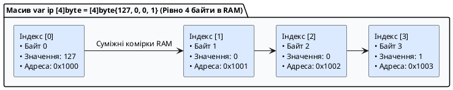

::

Розмір масиву в пам'яті обчислюється за простою математичною формулою:

::math-formula{tex="\text{SizeInBytes} = N \times \text{sizeof}(T)"}
::

Наприклад, масив `[8]int64` займає $8 \times 8 = 64$ байти.

---

### Залізне правило типу: розмірність `N` є частиною типу даних

У більшості мов (C#, Java, C++) розмір масиву є просто його динамічною властивістю. **У Go розмірність `N` є невіддільною частиною самого типу даних!**

```go
package main

func processArray(data [4]int) {
	// Функція очікує МАСИВ З РІВНО ЧОТИРЬОХ ЦІЛИХ ЧИСЕЛ
}

func main() {
	var arr4 [4]int
	var arr5 [5]int

	processArray(arr4) // ✅ Успішно: типи [4]int ідентичні

	// ❌ ПОМИЛКА КОМПІЛЯЦІЇ:
	// processArray(arr5)
	// cannot use arr5 (variable of type [5]int) as [4]int value in argument to processArray
}
```

Типи `[4]int` та `[5]int` для компілятора Go є **настільки ж несумісними, як `string` та `bool`**! Це дає компілятору можливість гарантувати безпеку меж пам'яті ще під час компіляції.

---

### Усі способи створення та ініціалізації масивів

У мові Go існує **сім практичних патернів** ініціалізації статичних масивів:

```go
package main

import "fmt"

func main() {
	// 1. Оголошення неініціалізованого масиву (Ініціалізація Zero Values)
	// Створюється масив, усі елементи якого гарантовано занулені компілятором:
	var counters [4]int // [0, 0, 0, 0]

	// 2. Повний літерал масиву з явним вказанням розміру
	statusCodes := [3]int{200, 404, 500}

	// 3. Часткова ініціалізація
	// Невизначені елементи автоматично заповнюються нулями:
	scores := [5]int{10, 20} // [10, 20, 0, 0, 0]

	// 4. Автоматичний підрахунок кількості елементів через три крапки [...]
	// Компілятор сам порахує кількість елементів і підставить розмір 3:
	dnsServers := [...]string{"1.1.1.1", "8.8.8.8", "9.9.9.9"}

	// 5. Розріджений індексований масив (Sparse Array)
	// Дозволяє задати значення для конкретних індексів за синтаксисом index: value
	httpStatusMap := [600]string{
		200: "OK",
		400: "Bad Request",
		404: "Not Found",
		500: "Internal Server Error",
	}

	// 6. Комбінована індексація
	// Елементи без індексів ідуть по порядку, далі індекс 7 перескакує вперед:
	customSequence := [...]int{1, 2, 3, 7: 100, 200}
	// Індекси: [0]=1, [1]=2, [2]=3, [3..6]=0, [7]=100, [8]=200

	// 7. Багатовимірні масиви (Матриці)
	matrix := [2][3]int{
		{1, 2, 3}, // Рядок 0
		{4, 5, 6}, // Рядок 1
	}

	fmt.Println("1. Нульовий масив:", counters)
	fmt.Println("2. Статус коди:", statusCodes)
	fmt.Println("3. Часткові бали:", scores)
	fmt.Printf("4. DNS сервери (довжина %d): %v\n", len(dnsServers), dnsServers)
	fmt.Println("5. HTTP 404:", httpStatusMap[404])
	fmt.Println("6. Послідовність:", customSequence)
	fmt.Printf("7. Елемент матриці [1][2]: %d\n", matrix[1][2]) // 6
}
```

---

### Операції над масивами: доступ, функції `len`/`cap` та контроль меж

- **Доступ за індексом:** індексація починається з `0` і закінчується `N-1`. Звернення здійснюється через квадратні дужки: `arr[i] = 10`.
- **Функції `len()` та `cap()`:** для статичних масивів обидві функції повертають однакове константне число — фізичний розмір масиву `N`.
- **Захист меж пам'яті (_Bounds Checking_):**
    - Якщо індекс виходить за межі і відомий компілятору (наприклад, `arr[10]` для масиву з 5 елементів), компілятор зупинить збірку: `invalid array index 10 (out of bounds for 5-element array)`.
    - Якщо індекс обчислюється динамічно під час виконання програми, Go викине безпечну паніку: `panic: runtime error: index out of range [10] with length 5`. Вихід за межі пам'яті (Buffer Overflow) у Go фізично неможливий!

---

### Ітерація по масивах

```go
package main

import "fmt"

func main() {
	routes := [...]string{"/api/v1/auth", "/api/v1/users", "/api/v1/health"}

	// Спосіб 1: Класичний цикл із лічильником через len()
	fmt.Println("Класичний обхід:")
	for i := 0; i < len(routes); i++ {
		fmt.Printf("  Маршрут #%d: %s\n", i, routes[i])
	}

	// Спосіб 2: Рекомендований for-range (індекс + значення)
	fmt.Println("\nОбхід через for-range:")
	for idx, path := range routes {
		fmt.Printf("  [%d] -> %s\n", idx, path)
	}

	// Спосіб 3: Отримання тільки значень (пропуск індексу через _)
	fmt.Println("\nТільки значення:")
	for _, path := range routes {
		fmt.Println("  Endpoint:", path)
	}
}
```

---

### Семантика значень (Value Semantics): масиви копіюються повністю!

Це одна з найважливіших відмінностей Go від інших мов:

::important
**У Go масив — це значення (_Value_), а не посилання!**
Коли ви присвоюєте один масив іншому (`arr2 = arr1`) або передаєте масив як параметр у функцію, Go здійснює **повне побайтове копіювання всіх елементів**.
::

```go
package main

import "fmt"

// Функція отримує ПОВНУ КОПІЮ масиву!
func modifyArray(data [3]int) {
	data[0] = 999
	fmt.Println("Всередині функції modifyArray:", data) // [999, 20, 30]
}

// Функція отримує покажчик на оригінальний масив
func modifyArrayByPointer(dataPtr *[3]int) {
	dataPtr[0] = 777 // Мутує оригінальну пам'ять
}

func main() {
	original := [3]int{10, 20, 30}

	// 1. Присвоєння створює незалежний дублікат у пам'яті:
	copied := original
	copied[1] = 888

	fmt.Printf("Оригінал: %v\n", original) // [10, 20, 30] — НЕ ЗМІНИВСЯ!
	fmt.Printf("Копія:    %v\n", copied)   // [10, 888, 30]

	// 2. Передача за значенням не впливає на оригінал:
	modifyArray(original)
	fmt.Printf("Оригінал після modifyArray: %v\n", original) // [10, 20, 30]

	// 3. Передача покажчика змінює оригінал без копіювання пам'яті:
	modifyArrayByPointer(&original)
	fmt.Printf("Оригінал після modifyArrayByPointer: %v\n", original) // [777, 20, 30]
}
```

::tip
**Чому масиви рідко передають у функції напряму:**
Якщо передати масив `[1000000]int64` за значенням, програмі доведеться скопіювати 8 мегабайтів пам'яті на кожен виклик функції. Тому для динамічної та швидкої роботи без копіювання в Go використовують **зрізи (_slices_)** або передають покажчик на масив `*[N]T`.
::

---

### Порівняння масивів між собою

Масиви однакового типу можна безпосередньо порівнювати за допомогою операторів **`==`** та **`!=`** (за умови, що тип їхніх елементів підтримує порівняння):

```go
package main

import "fmt"

func main() {
	a := [3]int{1, 2, 3}
	b := [3]int{1, 2, 3}
	c := [3]int{1, 2, 4}

	fmt.Println("a == b:", a == b) // true (усі елементи збігаються)
	fmt.Println("a == c:", a == c) // false
}
```

---

## Функції та функціональне програмування в Go

У мові Go функції є фундаментальним будівельним блоком будь-якої архітектури. Go підтримує парадигму функцій як **об'єктів першого класу** (_First-Class Citizens_), що дозволяє писати чистий, модульний та виразний код без зайвої складності.

---

### Анатомія оголошення функцій та передача параметрів

Функція — це іменований, логічно ізольований блок коду, який приймає вхідні дані (параметри), виконує алгоритмічні дії та повертає результат.

```
func   FunctionName   (param1 Type, param2 Type)   ReturnType   {
    // Тіло функції
    return value
}
```

::plant-uml{alt="Анатомія оголошення функції у Go"}

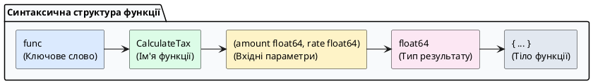

::

**Правила найменування функцій:**

- **Експортовані функції (Public):** назва починається з великої літери `PascalCase` (наприклад, `CalculateTotal`, `NewServer`). Вони доступні іншим пакетам проєкту.
- **Приватні функції (Private / Package-level):** назва починається з малої літери `camelCase` (наприклад, `formatResponse`, `validateSession`). Вони доступні лише всередині свого пакета.

```go
package main

import "fmt"

// 1. Базова функція з двома параметрами
func multiply(x int, y int) int {
	return x * y
}

// 2. Скорочений запис параметрів однакового типу
// Синтаксис: якщо кілька параметрів підряд мають ОДНАКОВИЙ тип,
// можна написати тип лише один раз наприкінці групи
func createConnection(host, ip string, port, timeout int) string {
	// host string, ip string → host, ip string (обидва string)
	// port int, timeout int → port, timeout int (обидва int)
	return fmt.Sprintf("Підключення до %s (%s):%d з таймаутом %ds", host, ip, port, timeout)
}

func main() {
	res := multiply(6, 7)
	connStr := createConnection("api.production", "10.0.0.1", 443, 30)

	fmt.Println("Результат множення:", res)
	fmt.Println("Конфігурація:", connStr)
}
```

::callout{icon="i-lucide-info"}
**Скорочений синтаксис параметрів: чи варто використовувати?**

**Синтаксис:**
```go
// Повний запис:
func example(a int, b int, c int) { }

// Скорочений запис (для параметрів одного типу):
func example(a, b, c int) { }
```

**Правила:**
1. Параметри повинні йти **підряд** (без переривання іншими типами)
2. Тип пишеться **один раз наприкінці** групи
3. Можна мішати різні групи: `func test(a, b int, c string, d, e float64)`

**Популярність і прийнятість:**

✅ **Коли це прийнято і читабельно:**
```go
// Добре — зрозуміло, що координати:
func move(x, y int) { }

// Добре — очевидно пов'язані параметри:
func resize(width, height int) { }
func setRange(min, max float64) { }
```

⚠️ **Коли краще уникати:**
```go
// Погано — багато параметрів, важко читати:
func configure(host, ip, username, password, database string) { }

// Краще — явно вказати типи для ясності:
func configure(host string, ip string, username string, password string, database string) { }

// Або ще краще — використати структуру:
type Config struct {
    Host     string
    IP       string
    Username string
    Password string
    Database string
}
func configure(cfg Config) { }
```

**Рекомендації зі стандартної бібліотеки Go:**
- У Go стандартній бібліотеці використовується **рідко**
- Переважно для коротких функцій з 2-3 параметрами
- Якщо параметрів більше 3 — краще явно вказати типи або використати структуру

**Висновок:** Використовуйте скорочений запис для **2-3 параметрів, що логічно пов'язані** (координати, розміри, діапазони). Для більшої кількості параметрів — пишіть типи явно або рефакторте на структуру.
::

---

### Варіативні функції (`...T` — Variadic Functions)

**Варіативна функція** — це функція, яка може приймати довільну (змінну) кількість аргументів одного типу.

- У списку параметрів перед типом вказуються три крапки: `...Type`.
- Всередині тіла функції варіативний параметр стає звичайним **зрізом `[]Type`**.
- **Залізне правило:** у функції може бути **лише один** варіативний параметр, і він **зобов'язаний бути останнім** у списку параметрів.

```go
package main

import "fmt"

// Варіативна функція розрахунку суми будь-якої кількості чисел
func calculateSum(prefix string, numbers ...int) string {
	total := 0
	// numbers всередині функції є зрізом []int
	for _, n := range numbers {
		total += n
	}
	return fmt.Sprintf("%s: %d", prefix, total)
}

func main() {
	// 1. Виклик без чисел (numbers буде порожнім зрізом nil / len=0)
	fmt.Println(calculateSum("Порожня сума"))

	// 2. Передача довільної кількості аргументів через кому
	fmt.Println(calculateSum("Сума трьох чисел", 10, 20, 30))
	fmt.Println(calculateSum("Сума п'яти чисел", 1, 2, 3, 4, 5))

	// 3. Розпакування зрізу за допомогою синтаксису slice...
	userScores := []int{85, 92, 78, 96}
	fmt.Println(calculateSum("Загальний бал", userScores...))
	// userScores... означає "розпакувати зріз на окремі аргументи"
	// Це еквівалентно: calculateSum("Загальний бал", 85, 92, 78, 96)
}
```

::tip{icon="i-lucide-info"}
**Синтаксис `...` (три крапки): два різні значення!**

У Go три крапки `...` мають **два різні значення** залежно від контексту:

### 1. У сигнатурі функції: варіативний параметр (приймання)

```go
func sum(numbers ...int) int {
    // numbers — це зріз []int
    // Функція може прийняти будь-яку кількість int аргументів
}

sum(1, 2, 3)        // OK
sum(10, 20, 30, 40) // OK
sum()               // OK (порожній зріз)
```

**Правила:**
- Вказується **перед типом**: `...Type`
- Може бути тільки **один** варіативний параметр
- Повинен бути **останнім** у списку параметрів

### 2. При виклику функції: розпакування зрізу (передача)

```go
numbers := []int{1, 2, 3, 4, 5}
sum(numbers...)  // Розпаковує зріз на окремі аргументи
// Еквівалентно: sum(1, 2, 3, 4, 5)
```

**Правила:**
- Вказується **після змінної**: `slice...`
- Можна використовувати тільки зі **зрізами**
- Тип елементів зрізу повинен збігатися з типом параметра функції

### Практичні приклади:

```go
package main

import "fmt"

// Варіативна функція
func printAll(items ...string) {
    for i, item := range items {
        fmt.Printf("%d: %s\n", i+1, item)
    }
}

func main() {
    // Спосіб 1: передача аргументів окремо
    printAll("яблуко", "банан", "апельсин")
    
    // Спосіб 2: розпакування зрізу
    fruits := []string{"яблуко", "банан", "апельсин"}
    printAll(fruits...)  // Те саме, що й спосіб 1
    
    // Спосіб 3: комбінація (НЕ працює!)
    // printAll("груша", fruits...)  // ❌ Помилка компіляції!
    // Варіативний параметр може бути тільки останнім
    
    // Спосіб 4: об'єднання зрізів
    moreFruits := []string{"манго", "ківі"}
    allFruits := append(fruits, moreFruits...)  // Розпаковуємо другий зріз
    printAll(allFruits...)
}
```

### Типові помилки:

```go
// ❌ ПОМИЛКА: ... не в кінці списку параметрів
func wrong(a ...int, b string) { }

// ❌ ПОМИЛКА: два варіативних параметри
func wrong(a ...int, b ...string) { }

// ❌ ПОМИЛКА: розпакування не-зрізу
numbers := 42
sum(numbers...)  // Не працює! numbers — не зріз

// ❌ ПОМИЛКА: неправильний тип
floats := []float64{1.5, 2.5}
sum(floats...)  // Не працює! sum приймає ...int, а не float64
```

### Порівняння з іншими мовами:

| Мова | Варіативні параметри | Розпакування |
|------|---------------------|--------------|
| **Go** | `func f(args ...int)` | `f(slice...)` |
| **JavaScript** | `function f(...args)` | `f(...array)` |
| **Python** | `def f(*args)` | `f(*list)` |
| **Java** | `void f(int... args)` | ❌ Немає |
| **C#** | `void f(params int[] args)` | ❌ Немає |

**Висновок:** `...` перед типом = прийом багатьох аргументів, `...` після змінної = розпакування зрізу.
::

---

### Повернення результатів: множинні та іменовані значення

На відміну від C++, Java або Python, де функції повертають лише одне значення (змушуючи кидати важкі винятки `try/catch` або пакувати дані в класи-обгортки), **у Go функції можуть повертати кілька незалежних значень одночасно**.

#### Множинне повернення (Multiple Return Values)

Ключова архітектурна особливість Go — повернення пари `(Результат, Помилка)`:

```go
package main

import (
	"errors"
	"fmt"
)

// Функція безпечного ділення: повертає результат ТА помилку
func safeDivide(dividend, divisor float64) (float64, error) {
	if divisor == 0 {
		return 0, errors.New("помилка математики: ділення на нуль неможливе")
	}
	return dividend / divisor, nil // nil означає відсутність помилки
}

func main() {
	// Отримання двох результатів
	res, err := safeDivide(10, 2)
	if err != nil {
		fmt.Println("Помилка:", err)
		return
	}
	fmt.Printf("Результат ділення: %.2f\n", res)

	// Ігнорування результату або помилки через Blank Identifier (_)
	_, errDivZero := safeDivide(10, 0)
	if errDivZero != nil {
		fmt.Println("Очікувано перехоплено помилку:", errDivZero)
	}
}
```

---

#### Іменовані результати повернення (Named Return Values)

Ви можете дати імена змінним, які функція повертає, прямо в її заголовку:

```go
package main

import "fmt"

// Змінні width, height та area автоматично створюються компілятором
// із нульовими значеннями (0) на початку виконання функції:
func calculateRectangle(w, h int) (width, height, area int) {
	width = w
	height = h
	area = w * h

	// "Голий" return (Naked return) автоматично повертає width, height, area
	return
}

func main() {
	w, h, a := calculateRectangle(5, 10)
	fmt.Printf("Ширина: %d, Висота: %d, Площа: %d кв.од.\n", w, h, a)
}
```

::tip
**Рекомендація щодо Naked Return:**
Використовуйте "голий" `return` тільки в дуже коротких і простих функціях (до 5 рядків). У великих функціях завжди пишіть явний `return width, height, area`, щоб не змушувати читача коду шукати по всій функції, що саме зараз записано в іменовані змінні.
::

---

### Функції першого класу: функціональний тип та передача функцій

#### Що таке "функції першого класу"?

**Функції першого класу** (_first-class functions_) означає, що функції в мові програмування — це повноцінні значення, як числа чи рядки. Їх можна:
- Зберігати в змінних
- Передавати як аргументи іншим функціям
- Повертати з функцій як результат
- Зберігати в структурах даних (масиви, мапи, структури)

У Go функція **має свій тип**, який визначається сигнатурою (параметри + повернені значення).

#### Тип функції

**Синтаксис типу функції:**
```go
func(параметри) повертає
```

**Приклади типів функцій:**

| Сигнатура функції | Тип функції | Пояснення |
|-------------------|-------------|-----------|
| `func add(a, b int) int` | `func(int, int) int` | Приймає 2 int, повертає int |
| `func greet(name string)` | `func(string)` | Приймає string, нічого не повертає |
| `func getData() (int, error)` | `func() (int, error)` | Без параметрів, повертає int і error |
| `func process(data []byte) bool` | `func([]byte) bool` | Приймає зріз байтів, повертає bool |

::tip{icon="i-lucide-info"}
**Дві функції мають однаковий тип, якщо:**
1. Однакова кількість та типи параметрів (у тому ж порядку)
2. Однакова кількість та типи повернених значень (у тому ж порядку)

**Імена параметрів та змінних НЕ важливі** для типу:
```go
func add(x, y int) int { return x + y }
func sum(a, b int) int { return a + b }

// Обидві функції мають ТИП: func(int, int) int
```
::

#### Приклад 1: Зберігання функції в змінній

```go
package main

import "fmt"

func add(a, b int) int {
    return a + b
}

func main() {
    // Присвоюємо функцію змінній
    var operation func(int, int) int
    operation = add
    
    result := operation(5, 3)
    fmt.Println("Результат:", result)  // 8
    
    // Короткий запис:
    calc := add
    fmt.Println("Через calc:", calc(10, 20))  // 30
}
```

#### Приклад 2: Оголошення власного функціонального типу

Для зручності можна створити аліас типу функції через `type`:

```go
package main

import "fmt"

// Оголошуємо власний тип для математичних операцій
type MathOperation func(int, int) int

func add(a, b int) int      { return a + b }
func subtract(a, b int) int { return a - b }
func multiply(a, b int) int { return a * b }

func main() {
    // Використовуємо власний тип
    var op MathOperation
    
    op = add
    fmt.Println("Додавання:", op(10, 5))  // 15
    
    op = multiply
    fmt.Println("Множення:", op(10, 5))   // 50
}
```

#### Приклад 3: Функції вищого порядку (Higher-Order Functions)

**Функція вищого порядку** — це функція, яка:
- Приймає іншу функцію як параметр, АБО
- Повертає функцію як результат

**A. Функція, що приймає функцію (Callback Pattern):**

```go
package main

import "fmt"

type Operation func(int, int) int

// Функція вищого порядку — приймає функцію як параметр
func calculate(x, y int, op Operation) int {
    fmt.Printf("Виконуємо операцію над %d та %d\n", x, y)
    return op(x, y)
}

func add(a, b int) int      { return a + b }
func multiply(a, b int) int { return a * b }

func main() {
    // Передаємо різні функції як аргумент
    result1 := calculate(10, 5, add)
    fmt.Println("Результат додавання:", result1)  // 15
    
    result2 := calculate(10, 5, multiply)
    fmt.Println("Результат множення:", result2)   // 50
}
```

**Практичне застосування — обробка колекцій:**

```go
package main

import "fmt"

// Функція застосовує transform до кожного елемента зрізу
func mapSlice(numbers []int, transform func(int) int) []int {
    result := make([]int, len(numbers))
    for i, num := range numbers {
        result[i] = transform(num)
    }
    return result
}

func main() {
    numbers := []int{1, 2, 3, 4, 5}
    
    // Подвоїти кожне число
    doubled := mapSlice(numbers, func(x int) int {
        return x * 2
    })
    fmt.Println("Подвоєні:", doubled)  // [2 4 6 8 10]
    
    // Піднести до квадрату
    squared := mapSlice(numbers, func(x int) int {
        return x * x
    })
    fmt.Println("Квадрати:", squared)  // [1 4 9 16 25]
}
```

**B. Функція, що повертає функцію (Factory Pattern):**

```go
package main

import "fmt"

type Operation func(int, int) int

// Функція-фабрика — повертає функцію залежно від параметра
func getOperation(opType string) Operation {
    switch opType {
    case "add":
        return func(a, b int) int { return a + b }
    case "sub":
        return func(a, b int) int { return a - b }
    case "mul":
        return func(a, b int) int { return a * b }
    default:
        return func(a, b int) int { return 0 }
    }
}

func main() {
    // Отримуємо потрібну операцію
    addOp := getOperation("add")
    fmt.Println("Додавання:", addOp(10, 5))  // 15
    
    mulOp := getOperation("mul")
    fmt.Println("Множення:", mulOp(10, 5))   // 50
}
```

#### Приклад 4: Зберігання функцій у структурах

```go
package main

import "fmt"

type Calculator struct {
    Operation func(int, int) int
    Name      string
}

func main() {
    // Створюємо калькулятор з функцією додавання
    addCalc := Calculator{
        Operation: func(a, b int) int { return a + b },
        Name:      "Додавання",
    }
    
    fmt.Printf("%s: %d\n", addCalc.Name, addCalc.Operation(5, 3))  // Додавання: 8
    
    // Змінюємо операцію на множення
    addCalc.Operation = func(a, b int) int { return a * b }
    addCalc.Name = "Множення"
    
    fmt.Printf("%s: %d\n", addCalc.Name, addCalc.Operation(5, 3))  // Множення: 15
}
```

#### Практичне застосування: middleware в веб-серверах

```go
package main

import (
    "fmt"
    "time"
)

type Handler func(string) string

// Middleware — функція, яка обгортає іншу функцію
func loggingMiddleware(next Handler) Handler {
    return func(input string) string {
        start := time.Now()
        fmt.Printf("[LOG] Початок обробки: %s\n", input)
        
        result := next(input)  // Викликаємо оригінальну функцію
        
        fmt.Printf("[LOG] Завершено за %v\n", time.Since(start))
        return result
    }
}

func processRequest(data string) string {
    time.Sleep(100 * time.Millisecond)  // Імітація роботи
    return "Оброблено: " + data
}

func main() {
    // Обгортаємо функцію в middleware
    handler := loggingMiddleware(processRequest)
    
    result := handler("test-data")
    fmt.Println("Результат:", result)
}
```

---

### Анонімні функції (Anonymous Functions / Lambdas)

#### Що таке анонімна функція?

**Анонімна функція** — це функція без імені, визначена безпосередньо в коді (inline). У деяких мовах їх називають **lambda-функціями** або **літералами функцій**.

**Синтаксис:**
```go
func(параметри) тип_результату {
    // тіло функції
}
```

#### Приклад 1: Анонімна функція в змінній

```go
package main

import "fmt"

func main() {
    // Створюємо анонімну функцію та зберігаємо в змінній
    greet := func(name string) string {
        return "Привіт, " + name + "!"
    }
    
    // Викликаємо через змінну
    message := greet("Олена")
    fmt.Println(message)  // Привіт, Олена!
    
    // Можна викликати напряму:
    fmt.Println(greet("Іван"))  // Привіт, Іван!
}
```

#### Приклад 2: IIFE (Immediately Invoked Function Expression)

**IIFE** — це анонімна функція, яка викликається одразу після оголошення:

```go
package main

import "fmt"

func main() {
    // Оголошуємо і одразу викликаємо
    func() {
        fmt.Println("Це IIFE — виконалась одразу!")
    }()  // ← Дужки () викликають функцію
    
    // IIFE з параметрами та результатом
    result := func(a, b int) int {
        return a + b
    }(5, 10)  // ← Передаємо аргументи
    
    fmt.Println("Сума:", result)  // 15
}
```

**Практичне застосування IIFE:**

```go
package main

import "fmt"

func main() {
    // Ініціалізація з валідацією
    config := func() map[string]string {
        cfg := make(map[string]string)
        cfg["host"] = "localhost"
        cfg["port"] = "8080"
        
        // Валідація
        if cfg["host"] == "" {
            cfg["host"] = "0.0.0.0"
        }
        
        return cfg
    }()  // Одразу викликаємо і отримуємо результат
    
    fmt.Println("Config:", config)
}
```

#### Приклад 3: Анонімні функції як аргументи

```go
package main

import (
    "fmt"
    "sort"
)

func main() {
    users := []struct {
        Name string
        Age  int
    }{
        {"Олена", 25},
        {"Іван", 30},
        {"Марія", 22},
    }
    
    // Сортуємо за віком, використовуючи анонімну функцію
    sort.Slice(users, func(i, j int) bool {
        return users[i].Age < users[j].Age  // Від молодшого до старшого
    })
    
    fmt.Println("Відсортовані за віком:", users)
    // [{Марія 22} {Олена 25} {Іван 30}]
}
```

#### Приклад 4: Анонімні функції для обробки подій (callbacks)

```go
package main

import (
    "fmt"
    "time"
)

type Server struct {
    OnStart func()
    OnStop  func()
}

func (s *Server) Start() {
    fmt.Println("Запуск сервера...")
    if s.OnStart != nil {
        s.OnStart()  // Викликаємо callback
    }
}

func (s *Server) Stop() {
    fmt.Println("Зупинка сервера...")
    if s.OnStop != nil {
        s.OnStop()  // Викликаємо callback
    }
}

func main() {
    server := Server{
        // Анонімна функція як обробник події
        OnStart: func() {
            fmt.Println("✓ Сервер запущено!")
            fmt.Println("✓ З'єднання з базою даних встановлено")
        },
        OnStop: func() {
            fmt.Println("✓ Збережено стан")
            fmt.Println("✓ З'єднання закрито")
        },
    }
    
    server.Start()
    time.Sleep(1 * time.Second)
    server.Stop()
}
```

#### Приклад 5: Декоратори функцій

```go
package main

import (
    "fmt"
    "time"
)

// Декоратор — функція, яка приймає і повертає функцію
func measureTime(fn func()) func() {
    return func() {
        start := time.Now()
        fn()  // Викликаємо оригінальну функцію
        fmt.Printf("Час виконання: %v\n", time.Since(start))
    }
}

func slowTask() {
    fmt.Println("Виконую складну задачу...")
    time.Sleep(200 * time.Millisecond)
    fmt.Println("Задачу виконано!")
}

func main() {
    // Обгортаємо функцію декоратором
    measuredTask := measureTime(slowTask)
    measuredTask()
}
```

**Вивід:**
```
Виконую складну задачу...
Задачу виконано!
Час виконання: 200ms
```

#### Порівняння з іншими мовами

| Мова | Анонімна функція | Приклад |
|------|------------------|---------|
| **Go** | `func` без імені | `func(x int) int { return x * 2 }` |
| **JavaScript** | Arrow function / function expression | `(x) => x * 2` або `function(x) { return x * 2; }` |
| **Python** | lambda | `lambda x: x * 2` |
| **Java** | Lambda (з Java 8+) | `(x) -> x * 2` |
| **C#** | Lambda | `(x) => x * 2` |
| **C++** | Lambda | `[](int x) { return x * 2; }` |

---

### Замикання (Closures): стан та захоплення змінних

#### Що таке замикання?

**Замикання (_Closure_)** — це функція, яка "запам'ятовує" і має доступ до змінних з зовнішньої області видимості (scope), навіть після того, як зовнішня функція завершила роботу.

**Простими словами:** замикання = функція + оточення (змінні, до яких вона має доступ)

#### Як працює замикання?

1. Внутрішня функція **"захоплює"** (capture) змінні з зовнішньої функції
2. Ці змінні **переміщуються з стеку в купу** (heap)
3. Змінні **живуть доти, доки існує посилання** на внутрішню функцію
4. Кожне замикання має **свою ізольовану копію** захоплених змінних

::tip{icon="i-lucide-info"}
**Відмінність від звичайних функцій:**

| Звичайна функція | Замикання |
|------------------|-----------|
| Має доступ тільки до своїх параметрів і глобальних змінних | Має доступ до змінних зовнішньої функції |
| Не зберігає стан між викликами | Зберігає стан у захоплених змінних |
| Всі виклики незалежні | Кожен виклик впливає на загальний стан |
::

#### Приклад 1: Базове замикання — лічильник

```go
package main

import "fmt"

// Функція створює замикання, яке "запам'ятовує" count
func createCounter() func() int {
    count := 0  // Ця змінна буде захоплена замиканням
    
    // Повертаємо анонімну функцію (замикання)
    return func() int {
        count++  // Маємо доступ до count з зовнішньої функції!
        return count
    }
}

func main() {
    // Створюємо лічильник
    counter := createCounter()
    
    // Кожен виклик збільшує count
    fmt.Println(counter())  // 1
    fmt.Println(counter())  // 2
    fmt.Println(counter())  // 3
    
    // Створюємо другий незалежний лічильник
    counter2 := createCounter()
    fmt.Println(counter2())  // 1 (свій власний count!)
    fmt.Println(counter2())  // 2
    
    // Перший лічильник не залежить від другого
    fmt.Println(counter())   // 4 (продовжує свій підрахунок)
}
```

**Вивід:**
```
1
2
3
1
2
4
```

#### Візуалізація роботи замикання

```
┌─── createCounter() викликається ───┐
│                                     │
│  count := 0  ← Локальна змінна     │
│                                     │
│  return func() int {                │
│      count++   ← Захоплює count    │
│      return count                   │
│  }                                  │
│                                     │
└─────────────────────────────────────┘
         │
         ├─→ counter := ... (копія A: count = 0)
         └─→ counter2 := ... (копія B: count = 0)

Кожне замикання має свою ВЛАСНУ копію count!
```

#### Приклад 2: Замикання з параметрами

```go
package main

import "fmt"

// Створюємо лічильник з початковим значенням
func createCounter(start int) func() int {
    current := start
    
    return func() int {
        current++
        return current
    }
}

func main() {
    counter1 := createCounter(0)
    counter2 := createCounter(100)
    
    fmt.Println("Counter1:", counter1())  // 1
    fmt.Println("Counter1:", counter1())  // 2
    
    fmt.Println("Counter2:", counter2())  // 101
    fmt.Println("Counter2:", counter2())  // 102
}
```

#### Приклад 3: Замикання для збереження конфігурації

```go
package main

import "fmt"

// Створює функцію привітання з префіксом
func createGreeter(prefix string) func(string) string {
    return func(name string) string {
        return prefix + ", " + name + "!"
    }
}

func main() {
    // Різні привітання з різними префіксами
    englishGreet := createGreeter("Hello")
    ukrainianGreet := createGreeter("Привіт")
    spanishGreet := createGreeter("Hola")
    
    fmt.Println(englishGreet("John"))     // Hello, John!
    fmt.Println(ukrainianGreet("Олена"))  // Привіт, Олена!
    fmt.Println(spanishGreet("Carlos"))   // Hola, Carlos!
}
```

#### Приклад 4: Замикання з множинними захопленими змінними

```go
package main

import "fmt"

// Створює калькулятор з історією операцій
func createCalculator() (add func(int), sub func(int), getTotal func() int) {
    total := 0  // Захоплюється всіма трьома функціями!
    
    add = func(x int) {
        total += x
        fmt.Printf("Додано %d, загалом: %d\n", x, total)
    }
    
    sub = func(x int) {
        total -= x
        fmt.Printf("Віднято %d, загалом: %d\n", x, total)
    }
    
    getTotal = func() int {
        return total
    }
    
    return add, sub, getTotal
}

func main() {
    add, sub, getTotal := createCalculator()
    
    add(10)       // Додано 10, загалом: 10
    add(5)        // Додано 5, загалом: 15
    sub(3)        // Віднято 3, загалом: 12
    
    fmt.Println("Фінальний результат:", getTotal())  // 12
}
```

#### Приклад 5: Практичне застосування — Rate Limiter

```go
package main

import (
    "fmt"
    "time"
)

// Створює функцію, яка обмежує частоту викликів
func createRateLimiter(maxCalls int, duration time.Duration) func() bool {
    calls := 0
    lastReset := time.Now()
    
    return func() bool {
        now := time.Now()
        
        // Скидаємо лічильник, якщо минув час
        if now.Sub(lastReset) > duration {
            calls = 0
            lastReset = now
        }
        
        // Перевіряємо ліміт
        if calls < maxCalls {
            calls++
            return true  // Дозволяємо виклик
        }
        
        return false  // Блокуємо виклик
    }
}

func main() {
    // Максимум 3 виклики за секунду
    canCall := createRateLimiter(3, 1*time.Second)
    
    for i := 1; i <= 5; i++ {
        if canCall() {
            fmt.Printf("Запит %d: ✓ Дозволено\n", i)
        } else {
            fmt.Printf("Запит %d: ✗ Заблоковано (перевищено ліміт)\n", i)
        }
    }
    
    // Чекаємо секунду
    time.Sleep(1 * time.Second)
    fmt.Println("\n--- Після паузи ---")
    
    if canCall() {
        fmt.Println("Запит 6: ✓ Дозволено (ліміт скинувся)")
    }
}
```

**Вивід:**
```
Запит 1: ✓ Дозволено
Запит 2: ✓ Дозволено
Запит 3: ✓ Дозволено
Запит 4: ✗ Заблоковано (перевищено ліміт)
Запит 5: ✗ Заблоковано (перевищено ліміт)

--- Після паузи ---
Запит 6: ✓ Дозволено (ліміт скинувся)
```

#### Приклад 6: Замикання в циклах — поширена пастка!

**❌ Неправильно:**

```go
package main

import (
    "fmt"
    "time"
)

func main() {
    funcs := []func(){}
    
    for i := 0; i < 3; i++ {
        funcs = append(funcs, func() {
            fmt.Println(i)  // Захоплює ЗМІННУ i, а не значення!
        })
    }
    
    for _, fn := range funcs {
        fn()  // Всі виведуть 3!
    }
}
```

**Вивід (несподіваний!):**
```
3
3
3
```

**✅ Правильно — передати значення як параметр:**

```go
package main

import "fmt"

func main() {
    funcs := []func(){}
    
    for i := 0; i < 3; i++ {
        i := i  // Створюємо локальну копію для кожної ітерації!
        funcs = append(funcs, func() {
            fmt.Println(i)
        })
    }
    
    for _, fn := range funcs {
        fn()
    }
}
```

**Вивід (правильний):**
```
0
1
2
```

#### Замикання та пам'ять: Escape Analysis

::callout{icon="i-lucide-cpu"}
**Що відбувається в пам'яті?**

Коли компілятор Go бачить замикання, він автоматично:

1. **Аналізує** які змінні захоплюються
2. **Переміщує** ці змінні зі стеку в купу (heap)
3. **Зберігає** посилання на ці змінні в структурі замикання

```go
func createCounter() func() int {
    count := 0  // ← Компілятор переміщує в heap!
    return func() int {
        count++
        return count
    }
}
```

**Перевірка через `go build -gcflags="-m"`:**
```
./main.go:4:2: moved to heap: count
./main.go:6:9: func literal escapes to heap
```

Це означає, що `count` живе в купі, а не на стеку.
::

#### Порівняння з іншими мовами

| Мова | Підтримка замикань | Особливості |
|------|-------------------|-------------|
| **Go** | ✅ Так | Автоматичне переміщення в heap |
| **JavaScript** | ✅ Так | Класичні замикання, та ж пастка в циклах |
| **Python** | ✅ Так | Потребує `nonlocal` для зміни зовнішніх змінних |
| **Java** | ✅ Так (з Java 8+) | Захоплені змінні мають бути `final` або effectively final |
| **C++** | ✅ Так (lambda) | Явне вказання: `[&]` (по посиланню) або `[=]` (по значенню) |
| **C** | ❌ Ні | Немає замикань (можна емулювати через структури) |

#### Практичні застосування замикань

1. **Інкапсуляція стану** — приховування внутрішніх змінних
2. **Створення приватних змінних** — імітація приватних полів
3. **Декоратори та middleware** — обгортання функцій з додатковою логікою
4. **Callbacks з контекстом** — передача функцій з доступом до зовнішніх даних
5. **Lazy evaluation** — відкладене обчислення значень
6. **Memoization** — кешування результатів обчислень

#### Резюме: коли використовувати замикання?

**✅ Використовуйте замикання коли:**
- Потрібно зберегти стан між викликами
- Потрібна приватна змінна
- Створюєте callback з контекстом
- Реалізуєте декоратор/middleware

**⚠️ Будьте обережні:**
- З замиканнями в циклах (захоплюють змінну, а не значення)
- З великою кількістю замикань (використовують heap)
- Не забувайте про витоки пам'яті (захоплені змінні живуть доки живе замикання)

---

### Рекурсивні функції: базовий випадок та стек викликів

**Рекурсивна функція** — це функція, яка в процесі виконання викликає саму себе з новими вхідними параметрами.

::important
**Анатомія будь-якої коректної рекурсії:**

1. **Базовий випадок (Base Case / Умова зупинки):** обов'язкова умова, при якій функція повертає конкретне значення без подальших рекурсивних викликів. Без базового випадку виникне нескінченна рекурсія і переповнення пам'яті стека (_Stack Overflow_).
2. **Крок рекурсії (Recursive Step):** виклик функцією самої себе, де аргументи з кожним кроком наближаються до базового випадку.

::

```go
package main

import "fmt"

// 1. Обчислення факторіалу числа N! = N * (N-1)!
// Приклад для N=3: factorial(3) = 3 * factorial(2) -> 2 * factorial(1) -> 1 => 6
func factorial(n uint64) uint64 {
	if n <= 1 {
		return 1 // Базовий випадок: 0! = 1 та 1! = 1
	}
	return n * factorial(n-1) // Крок рекурсії
}

// 2. Обчислення чисел послідовності Фібоначчі: F(n) = F(n-1) + F(n-2)
func fibonacci(n int) int {
	if n <= 0 {
		return 0 // Базовий випадок 1
	}
	if n == 1 {
		return 1 // Базовий випадок 2
	}
	return fibonacci(n-1) + fibonacci(n-2) // Подвійний рекурсивний крок
}

func main() {
	fmt.Printf("Факторіал 5! = %d\n", factorial(5)) // 120
	fmt.Printf("Факторіал 6! = %d\n", factorial(6)) // 720

	fmt.Println("\nПерші 7 чисел Фібоначчі:")
	for i := 0; i < 7; i++ {
		fmt.Printf("F(%d) = %d\n", i, fibonacci(i))
	}
}
```

::tip
**Рекурсія проти циклів у продуктивному коді:**
Кожен рекурсивний виклик створює новий стек-фрейм у пам'яті. Якщо глибина рекурсії сягає десятків тисяч кроків, перевагу слід надавати звичайним циклам `for`, які виконуються швидше та використовують константний обсяг пам'яті $O(1)$.
::

---

## Покажчики (Pointers) та безпека роботи з пам’яттю

У системному програмуванні для досягнення максимальної швидкодії необхідно безпосередньо керувати розташуванням даних у пам'яті та уникати зайвого копіювання великих структур. Головним інструментом для цього є **покажчики** (_Pointers_).

---

### Що таке покажчик: фізична адресація в RAM

Коли ви оголошуєте будь-яку змінну (наприклад, `var x int = 42`), середовище виконання Go виділяє для неї комірку в системній оперативній пам'яті. Кожна така комірка має свою унікальну числову **фізичну адресу**, яка записується у шістнадцятковому форматі (наприклад, `0x00c000014088`).

**Покажчик (_Pointer_)** — це спеціальна змінна, значенням якої є **адреса іншої змінної в пам'яті**.

::plant-uml{alt="Механіка адресації покажчика в оперативній пам'яті"}

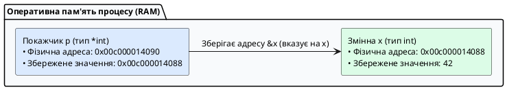

::

Покажчики в Go є **строго типізованими**: тип покажчика залежить від типу змінної, на яку він вказує. Покажчик на ціле число має тип `*int`, покажчик на рядок — `*string`, а покажчик на структуру `User` — `*User`.

---

### Оператори взяття адреси `&` та розіменування `*`

Для роботи з покажчиками Go надає два фундаментальні унарні оператори:

1. **Оператор взяття адреси (`&`):** ставиться перед іменем змінної та повертає її адресу в пам'яті (`&x`).
2. **Оператор розіменування (`*`):** ставиться перед змінною-покажчиком і дозволяє **прочитати** або **змінити** значення в тій комірці пам'яті, на яку цей покажчик вказує (`*p = 100`).

```go
package main

import "fmt"

func main() {
	var x int = 42

	// 1. Оголошуємо покажчик типу *int та записуємо в нього адресу змінної x:
	var p *int = &x

	fmt.Printf("1. Значення змінної x:              %d\n", x)
	fmt.Printf("2. Фізична адреса змінної x (&x):    %p\n", &x)
	fmt.Printf("3. Значення покажчика p (адреса):    %p\n", p)
	fmt.Printf("4. Власна адреса покажчика p (&p):   %p\n", &p)

	// 5. Розіменування покажчика для читання значення:
	fmt.Printf("5. Читання значення через *p:        %d\n", *p)

	// 6. Розіменування покажчика для зміни значення в пам'яті:
	*p = 100
	fmt.Printf("6. Нове значення x після *p = 100:   %d\n", x) // x тепер дорівнює 100!
}
```

---

### Нульовий покажчик `nil` та небезпека Nil Pointer Dereference

Якщо покажчик оголошено, але йому не присвоєно адресу конкретної змінної, його нульовим значенням (_Zero Value_) є **`nil`** (покажчик, який вказує на нульову адресу `0x0`).

::caution
**Спроба розіменувати `nil`-покажчик викликає фатальну паніку:**

```go
var p *int // p дорівнює nil
*p = 50    // 💥 panic: runtime error: invalid memory address or nil pointer dereference
```

**Захисний патерн:** Перед розіменуванням невідомого або отриманого ззовні покажчика завжди перевіряйте його на `nil`:

```go
if p != nil {
    fmt.Println("Значення:", *p)
} else {
    fmt.Println("Покажчик не ініціалізовано (nil)")
}
```

::

---

### Вбудована функція `new()`

Для швидкого виділення пам'яті під безіменну змінну Go надає вбудовану функцію **`new(T)`**:

- Вона приймає тип `T`.
- Виділяє в пам'яті ділянку, достатню для збереження значення типу `T`.
- Гарантовано занулює цю пам'ять (_Zero Value_).
- Повертає типізований покажчик **`*T`** на виділену пам'ять.

```go
package main

import "fmt"

func main() {
	// Створює ціле число зі значенням 0 і повертає *int:
	numPtr := new(int)

	fmt.Printf("Адреса: %p, Значення за замовчуванням: %d\n", numPtr, *numPtr)

	*numPtr = 777
	fmt.Printf("Оновлене значення: %d\n", *numPtr)
}
```

---

### Складні форми: покажчики на покажчики та покажчики на масиви

::note
**Поки що достатньо:** `&x` — взяти адресу, `*p` — прочитати за адресою. `**int` нижче — для допитливих, можна пропустити на першому читанні.
::

```go
package main

import "fmt"

func main() {
	// 1. Покажчик на покажчик (**T) — багаторівнева непряма адресація (рідко в прикладному коді)
	var a int = 10
	var p *int = &a    // p вказує на a
	var pp **int = &p  // pp вказує на покажчик p

	fmt.Printf("a: %d, через *p: %d, через **pp: %d\n", a, *p, **pp)

	**pp = 500 // Зміна a через подвійне розіменування
	fmt.Println("Нове значення a:", a) // 500

	// 2. Покажчик на статичний масив (*[N]T)
	var numbers [3]int = [3]int{10, 20, 30}
	var arrPtr *[3]int = &numbers

	// Go дозволяє звертатися до елементів масиву через покажчик без явного (*arrPtr)[0]:
	arrPtr[0] = 999 // Автоматичне розіменування компілятором
	fmt.Println("Масив після зміни через покажчик:", numbers) // [999, 20, 30]
}
```

---

### Покажчики та функції: мутація параметрів та уникнення копіювання

За замовчуванням усі аргументи передаються у функції **за значенням** (_Pass by Value_) — створюється їхня повна локальна копія. Якщо функція повинна змінити оригінальну змінну викликача або уникнути важкого копіювання пам'яті, параметр оголошується як покажчик:

```go
package main

import "fmt"

// 1. Передача за значенням: копіюється число, оригінал НЕ змінюється
func squareByValue(val int) {
	val = val * val
}

// 2. Передача за покажчиком: функція змінює значення за фізичною адресою
func squareByPointer(valPtr *int) {
	if valPtr != nil {
		*valPtr = (*valPtr) * (*valPtr)
	}
}

func main() {
	number := 5

	squareByValue(number)
	fmt.Println("Після squareByValue:", number) // 5 (без змін)

	squareByPointer(&number)
	fmt.Println("Після squareByPointer:", number) // 25 (оригінал змінено!)
}
```

::tip
**Чому покажчики в Go безпечні (на відміну від C/C++):**

1. **Відсутність адресної арифметики:** у Go заборонено писати `ptr++` чи `ptr + 4`. Ви не можете випадково вийти за межі дозволеної пам'яті та пошкодити чужі дані процесу.
2. **Автоматичний збирач сміття (Garbage Collector):** вам не потрібно вручну викликати `free()` або `delete`. Пам'ять звільняється автоматично, виключаючи витоки пам'яті (_Memory Leaks_) та повторне звільнення (_Double Free_).
3. **Абсолютна безпека повернення локальних адрес завдяки Escape Analysis.**

::

---

## `make` vs `new` vs літерал: хто виділяє пам'ять і що повертає

**Важливе правило для роботи з різними типами даних:**

Не всі типи даних у Go створюються однаково. Деякі можна просто оголосити (`var x int`), а інші потребують спеціальної ініціалізації:

```go
// Прості типи — просто оголошуємо:
var number int          // ✅ Готово до використання (значення: 0)
var text string         // ✅ Готово до використання (значення: "")

// Зрізи — можна додавати без ініціалізації:
var numbers []int       // nil, але append працює!
numbers = append(numbers, 1, 2, 3)  // ✅ Працює

// Мапи — ПОТРЕБУЮТЬ ініціалізації:
var userData map[string]int  // nil, писати ЗАБОРОНЕНО!
// userData["age"] = 25      // ❌ PANIC! Assignment to entry in nil map
userData = make(map[string]int)  // ✅ Тепер можна писати
userData["age"] = 25             // ✅ Працює
```

**Ключова відмінність:**
- **Зрізи (`[]T`):** можна використовувати `append` навіть з `nil`
- **Мапи (`map[K]V`):** ОБОВ'ЯЗКОВО потрібен `make` перед записом
- **Канали (`chan T`):** також потрібен `make` (детальніше в наступних лекціях)

**Контекст:** Go має три способи створення значень, і їх плутанина — джерело `nil panic`.

**Внутрішній механізм:**

| Спосіб                                                   | Що робить                                                       | Що повертає                                 | Де пам'ять              | Коли використовувати                                               |
| :------------------------------------------------------- | :-------------------------------------------------------------- | :------------------------------------------ | :---------------------- | :----------------------------------------------------------------- |
| `new(T)`                                                 | Виділяє `sizeof(T)` нулів                                       | `*T` (покажчик)                             | Купа (втікає)           | Рідко; лише коли потрібен `*T` на zero value без літералу          |
| `&T{...}`                                                | Виділяє + ініціалізує поля                                      | `*T`                                        | Купа (якщо втікає)      | Рекомендований конструктор `NewUser`                                 |
| `make([]T, len, cap)` / `make(map[K]V)` / `make(chan T)` | Створює **ініціалізований дескриптор** (SliceHeader/hmap/канал) | `[]T` / `map[K]V` / `chan T` (не покажчик!) | Купа для бакетів/буфера | Єдиний спосіб створити мапу/канал для запису                      |
| Літерал `[]int{1,2}` / `map[string]int{"a":1}`           | Виділяє + копіює елементи                                       | `[]T` / `map[K]V`                           | Купа                    | Коли початкові дані відомі                                         |
| `var s []int` / `var m map[string]int`                   | Нічого не виділяє                                               | `nil` дескриптор                            | —                       | Читати можна (`len(nil)==0`, `m["k"]` → zero), писати — **паніка** |

```go
var s []int              // nil slice: len=0 cap=0 ptr=nil — append працює!
s = append(s, 42)        // OK: growslice виділить масив
fmt.Println(s[0])

var m map[string]int     // nil map
fmt.Println(m["missing"]) // 0 — читання OK
// m["new"] = 1          // ❌ panic: assignment to entry in nil map
m = make(map[string]int) // ініціалізація
m["new"] = 1             // OK

p1 := new(int)           // *int -> 0
p2 := &int{}             // ідентично, але дозволяє &User{ID:42}
```

::warning
**Пастка `new` для мап/зрізів:** `new(map[string]int)` повертає `*map[string]int` (покажчик на nil мапу) — майже ніколи не потрібно! Використовуйте `make(map[string]int)` або `map[string]int{}`.
::

**Простою мовою — «відсутня коробка vs порожня коробка»:** `var m map[string]int` — у вас _немає коробки_ (`nil`). Запитати «що в коробці під ключем `k`?» → `0` (покажуть порожньо), але покласти `m[k]=1` → **паніка**, бо класти нікуди. `make(map...)` або `map[string]int{}` — _дали порожню коробку з полицями_ — класти можна. Для зрізів різниця критична для JSON: `var s []int` (`nil`) → `json.Marshal` дає `null`, а `s:=[]int{}` → `[]`. Клієнт очікує `[]` — віддайте порожній, інакше `null` зламає `for ... of` у JS.

---

## Модель пам’яті процесу: Стек, Купа та Escape Analysis

Для того щоб писати високонавантажені бекенд-сервіси, інженер повинен чітко розуміти, де фізично розташовуються змінні його програми. Адресний простір Go-процесу розділений на дві фундаментальні області пам'яті: **Стек (_Stack_)** та **Купу (_Heap_)**.

::plant-uml{alt="Організація пам'яті процесу: Стек та Купа"}

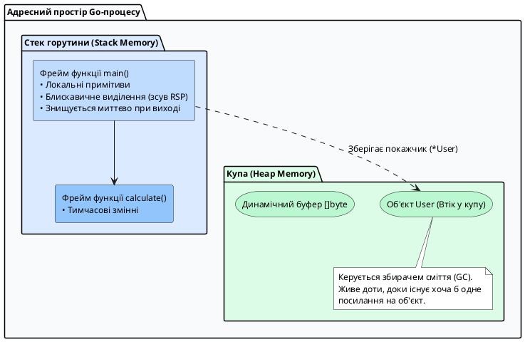

::

### Порівняльна характеристика Стека та Купи

| Критерій        | Стек (_Stack Memory_)                                                   | Купа (_Heap Memory_)                                                   |
| :-------------- | :---------------------------------------------------------------------- | :--------------------------------------------------------------------- |
| **Призначення** | Зберігання локальних змінних та стек-фреймів функцій                    | Зберігання динамічних об'єктів та спільних даних                       |
| **Швидкодія**   | **Надзвичайно висока** (виділення — це просто зміна регістра CPU `RSP`) | **Повільніша** (пошук вільного блоку пам'яті через алокатор)           |
| **Очищення**    | **Миттєве та безкоштовне** (автоматично при завершенні функції)         | **Потребує роботи GC** (збирач сміття сканує пам'ять і навантажує CPU) |
| **Розмір**      | Починається з **2 КБ** на горутину і динамічно росте при потребі        | Обмежена лише загальним обсягом оперативної пам'яті сервера            |

---

### Механізм аналізу втечі (Escape Analysis)

У мовах C/C++ повернення покажчика на локальну змінну функції є фатальною помилкою (_Dangling Pointer Bug_): стек-фрейм функції знищується, і покажчик починає вказувати на зруйноване «сміття».

**У Go повертати покажчик на локальну змінну абсолютно безпечно!**

**Проста аналогія — «готельний номер vs квартира»:** стек — це готельний номер: виселяєшся (функція завершилась) — номер прибирають. Якщо ти дав другу адресу свого номера (`return &x`), готель змушений **переселити тебе в довгоживучу квартиру (купа)**, щоб друг не прийшов у порожній номер (dangling pointer).

Компілятор Go під час збірки виконує спеціальний статичний аналіз — **Escape Analysis (Аналіз втечі)**:

1. Якщо компілятор бачить, що посилання на локальну змінну виходить за межі своєї функції (наприклад, повертається назовні через `return &x` або передається в `fmt.Println(x)` де `x` потрапляє в `any`), змінна **«втікає в купу» (_escapes to heap_)**.
2. Компілятор автоматично замінює виділення пам'яті на виклик системного алокатора купи `runtime.newobject`.
3. Якщо ж змінна використовується виключно всередині функції, вона виділяється на швидкому локальному стеку (зсув регістра `RSP` — 1 інструкція CPU).

```go
package main

type ServerConfig struct {
	Port    int
	Host    string
	IsDebug bool
}

// Функція створює конфігурацію та повертає покажчик на неї
func NewServerConfig(port int) *ServerConfig {
	// Змінна cfg оголошена локально, але посилання на неї повертається назовні:
	cfg := ServerConfig{
		Port:    port,
		Host:    "0.0.0.0",
		IsDebug: true,
	}
	return &cfg // Компілятор автоматично перенесе cfg у купу!
}

func main() {
	configPtr := NewServerConfig(8080)
	_ = configPtr
}
```

---

### Дослідження втечі — для допитливих (`-gcflags="-m"`)

Поки що достатньо знати: повернув `&x` назовні — змінна в купі, ні — на стеці. Подробиці нижче — для налагодження алокацій.

Ви можете на власні очі побачити всі рішення компілятора щодо розміщення змінних, скомпілювавши код із прапорцем `-gcflags="-m"`:

::terminal-preview{title="Аналіз виділення пам'яті компілятора Go" :cursor="true"}

<div class="line"><span class="opacity-40">$</span> <strong class="font-bold">go build -gcflags="-m" main.go</strong></div>
<div class="line">./main.go:17:9: <span class="text-yellow-400 font-bold">&cfg escapes to heap</span></div>
<div class="line">./main.go:11:2: <span class="text-green-400 font-bold">moved to heap: cfg</span></div>
::

::tip
**Типові причини втечі змінних у купу:**

1. **Повернення адреси змінної назовні** (`return &local`).
2. **Передача у функції з параметром `any` або `interface{}`:** наприклад, виклик `fmt.Println(x)` завжди змушує змінну `x` втекти в купу, оскільки інтерфейс вимагає пакування значення у купу.
3. **Змінні динамічного або невідомого розміру:** зрізи, довжина яких визначається під час виконання програми (`make([]byte, dynamicSize)`).
4. **Занадто великі об'єкти:** якщо структура або масив перевищує ліміт стека (понад 64 КБ), Go автоматично виділяє її в купі.

::

---

## Власні типи, Структури, Методи та Композиція

### Вступ: філософія Go щодо типів і об'єктів

Мова Go свідомо відмовилася від традиційного об'єктно-орієнтованого програмування (ООП) у класичному розумінні. У Go немає:
- Класів (`class`)
- Модифікаторів доступу (`public`, `private`, `protected`)
- Конструкторів і деструкторів
- Наслідування через `extends`
- Віртуальних методів і таблиць методів (vtables)

**Замість цього Go пропонує:**
1. **Структури (`struct`)** — для групування даних
2. **Методи** — функції, прив'язані до типів
3. **Інтерфейси** — для поліморфізму (детальніше в наступних лекціях)
4. **Композицію** — замість наслідування

Ця модель **простіша, прозоріша і передбачуваніша**, ніж класична ієрархія класів.

---

### Частина 1: Створення власних типів

#### Навіщо потрібні власні типи?

У багатьох мовах (Java, C#, TypeScript) для бізнес-логіки використовуються прості типи:

```typescript
// TypeScript - ризиковано:
function sendEmail(userId: number, productId: number) { ... }

// Можна випадково переплутати:
sendEmail(productId, userId);  // Компілятор не побачить помилку!
```

**У Go ми створюємо окремі типи** для кожної семантичної сутності:

```go
type UserID int64
type ProductID int64

func sendEmail(userId UserID, productId ProductID) { ... }

// Тепер помилка неможлива:
sendEmail(productId, userId)  // ❌ Помилка компіляції!
```

#### Два види типів: Defined Types vs Type Aliases

Go підтримує два способи створення типів через ключове слово `type`:

**1. Defined Type (Новий тип) — без `=`**

```go
type UserID int64
```

**Що це означає:**
- Створюється **абсолютно новий тип**, незалежний від `int64`
- `UserID` і `int64` — **різні типи**, їх не можна змішувати
- До `UserID` можна додавати методи
- Потрібне явне перетворення: `int64(userId)`

**Приклад:**

```go
package main

import "fmt"

type UserID int64
type ProductID int64

func getUserInfo(id UserID) {
    fmt.Printf("Отримання інфо про користувача %d\n", id)
}

func main() {
    var uid UserID = 101
    var pid ProductID = 202
    var num int64 = 303
    
    getUserInfo(uid)          // ✅ OK
    // getUserInfo(pid)       // ❌ Помилка: cannot use pid (type ProductID) as type UserID
    // getUserInfo(num)       // ❌ Помилка: cannot use num (type int64) as type UserID
    getUserInfo(UserID(num))  // ✅ OK: явне перетворення
}
```

**2. Type Alias (Псевдонім) — з `=`**

```go
type Byte = uint8
```

**Що це означає:**
- Створюється **синонім** (альтернативне ім'я) для існуючого типу
- `Byte` і `uint8` — **той самий тип**, повністю взаємозамінні
- Методи додавати не можна (належать оригінальному типу)
- Не потрібне перетворення

**Приклад:**

```go
package main

import "fmt"

// Вбудовані аліаси в Go:
// type byte = uint8
// type rune = int32
// type any = interface{}

// Власний аліас:
type MyByte = uint8

func main() {
    var b1 byte = 65
    var b2 MyByte = 65
    var u uint8 = 65
    
    // Всі три типи взаємозамінні:
    b1 = b2  // ✅ OK
    b2 = u   // ✅ OK
    u = b1   // ✅ OK
    
    fmt.Printf("%c %c %c\n", b1, b2, u)  // A A A
}
```

**Коли використовувати кожен?**

| Використання | Defined Type | Type Alias |
|--------------|--------------|------------|
| Безпека типів (UserID ≠ ProductID) | ✅ Так | ❌ Ні |
| Додавання методів | ✅ Так | ❌ Ні |
| Спрощення довгих назв | ⚠️ Створює новий тип | ✅ Ідеально |
| Зворотна сумісність | ❌ Ні | ✅ Так |

**Приклад додавання методів до власного типу:**

```go
package main

import "fmt"

type Celsius float64
type Fahrenheit float64

// Додаємо методи до Celsius:
func (c Celsius) ToFahrenheit() Fahrenheit {
    return Fahrenheit(c*9/5 + 32)
}

func (c Celsius) String() string {
    return fmt.Sprintf("%.1f°C", c)
}

// Додаємо методи до Fahrenheit:
func (f Fahrenheit) ToCelsius() Celsius {
    return Celsius((f - 32) * 5 / 9)
}

func (f Fahrenheit) String() string {
    return fmt.Sprintf("%.1f°F", f)
}

func main() {
    temp := Celsius(25)
    fmt.Println("Температура:", temp)                    // 25.0°C
    fmt.Println("У Фаренгейтах:", temp.ToFahrenheit())   // 77.0°F
    
    hot := Fahrenheit(100)
    fmt.Println("У Цельсіях:", hot.ToCelsius())          // 37.8°C
}
```

::callout{icon="i-lucide-shield-check"}
**Безпека типів на практиці:**

```go
type UserID int64
type OrderID int64
type Money float64
type Percentage float64

// Функції приймають конкретні типи:
func chargeUser(user UserID, amount Money) { }
func applyDiscount(price Money, discount Percentage) Money { }

// Помилки НЕМОЖЛИВІ:
var user UserID = 101
var order OrderID = 202
var price Money = 99.99
var rate Percentage = 15.0

chargeUser(user, price)        // ✅ OK
// chargeUser(order, price)    // ❌ Помилка компіляції!
// chargeUser(user, rate)      // ❌ Помилка компіляції!
```

Компілятор захищає від помилок ще до запуску програми!
::

---

### Частина 2: Структури (`struct`) — групування даних

#### Що таке структура?

**Структура (`struct`)** — це спосіб об'єднати кілька пов'язаних значень (полів) в один складений тип даних. Це як створити власний "контейнер" для даних, що логічно належать разом.

**Простими словами:** якщо у вас є дані про користувача (ім'я, email, вік), замість трьох окремих змінних, ви створюєте одну структуру `User`, яка містить всі ці поля.

#### Структури vs Класи: фундаментальна різниця

::tabs

::tabs-item{label="Go (struct)" icon="i-simple-icons-go"}

```go
// Структура — це просто "шаблон даних"
type User struct {
    ID       int64
    Username string
    Email    string
    IsActive bool
}

// Створення екземпляра (instance)
user := User{
    ID:       1,
    Username: "alex",
    Email:    "alex@kostyl.dev",
    IsActive: true,
}

// Ще один екземпляр
admin := User{
    ID:       2,
    Username: "admin",
    Email:    "admin@kostyl.dev",
    IsActive: true,
}
```

::

::tabs-item{label="Java (class)" icon="i-simple-icons-openjdk"}

```java
// Клас — це "шаблон даних + поведінка"
public class User {
    private long id;
    private String username;
    private String email;
    private boolean isActive;
    
    // Конструктор (обов'язковий для ініціалізації)
    public User(long id, String username, String email, boolean isActive) {
        this.id = id;
        this.username = username;
        this.email = email;
        this.isActive = isActive;
    }
    
    // Геттери та сеттери (багато коду...)
    public long getId() { return id; }
    public void setId(long id) { this.id = id; }
    // ... і так для кожного поля
}

// Створення екземпляра через конструктор
User user = new User(1, "alex", "alex@kostyl.dev", true);
User admin = new User(2, "admin", "admin@kostyl.dev", true);
```

::

::

**Ключові відмінності:**

| Аспект | Go `struct` | Java `class` |
|--------|-------------|--------------|
| **Призначення** | Тільки дані | Дані + поведінка + інкапсуляція |
| **Конструктор** | ❌ Немає (літерали замість них) | ✅ Обов'язковий `new User(...)` |
| **Модифікатори доступу** | ❌ Немає `private`/`public` | ✅ Є `private`, `public`, `protected` |
| **Геттери/Сеттери** | ❌ Прямий доступ до полів | ✅ Вручну або через IDE |
| **Наслідування** | ❌ Немає `extends` | ✅ Є `extends` |
| **Методи** | Додаються окремо через receiver | Всередині класу |
| **Zero Value** | ✅ Завжди валідний екземпляр | ❌ `null` за замовчуванням |

#### Екземпляри структур: що це таке?

**Екземпляр (instance)** — це конкретне значення структури з реальними даними.

**Аналогія:**
- **Структура** — це креслення будинку (шаблон)
- **Екземпляр** — це конкретний побудований будинок

```go
type User struct {
    ID   int64
    Name string
}

// User — це ТИП (креслення)
// user1, user2 — це ЕКЗЕМПЛЯРИ (конкретні будинки)

var user1 User = User{ID: 1, Name: "Олег"}
var user2 User = User{ID: 2, Name: "Марія"}

// Кожен екземпляр має власні дані:
fmt.Println(user1.Name)  // Олег
fmt.Println(user2.Name)  // Марія

user1.Name = "Олексій"   // Змінюємо тільки user1
fmt.Println(user1.Name)  // Олексій
fmt.Println(user2.Name)  // Марія (не змінилася!)
```

**Важливо:** кожен екземпляр **незалежний** — зміна одного не впливає на інші.

#### Синтаксис оголошення структури

```go
type НазваСтруктури struct {
    НазваПоля1 Тип1
    НазваПоля2 Тип2
    // ...
}
```

**Приклад:**

```go
type Product struct {
    ID          int64
    Name        string
    Price       float64
    InStock     bool
    Tags        []string
    CreatedAt   time.Time
}
```

#### Способи створення екземплярів

У Go **немає конструкторів** як у Java/C#. Замість них використовуються **літерали структур** та **функції-фабрики**.

**Загальний синтаксис створення структури:**

```go
// 1. Екземпляр структури (копіюється по значенню)
var variable StructName = StructName{ /* поля */ }
variable := StructName{ /* поля */ }

// 2. Покажчик на екземпляр структури
var variable *StructName = &StructName{ /* поля */ }
variable := &StructName{ /* поля */ }

// 3. Через new (рідко використовується)
variable := new(StructName)  // повертає *StructName з zero values
```

**Різниця між екземпляром і покажчиком:**

```go
type User struct {
    ID   int64
    Name string
}

// Екземпляр (копія при присвоєнні)
user1 := User{ID: 1, Name: "Олег"}
user2 := user1           // user2 — це КОПІЯ user1
user2.Name = "Марія"     // Змінюємо user2
fmt.Println(user1.Name)  // Олег (не змінився!)
fmt.Println(user2.Name)  // Марія

// Покажчик (обидві змінні вказують на один екземпляр)
userPtr1 := &User{ID: 1, Name: "Олег"}
userPtr2 := userPtr1         // userPtr2 вказує на той самий об'єкт
userPtr2.Name = "Марія"      // Змінюємо через userPtr2
fmt.Println(userPtr1.Name)   // Марія (змінився!)
fmt.Println(userPtr2.Name)   // Марія
```

**Основні форми ініціалізації полів:**

```go
type User struct {
    ID       int64
    Username string
    Email    string
    IsActive bool
}

// А. Іменовані поля (порядок не важливий)
user1 := User{
    Username: "alex",
    ID:       1,
    Email:    "alex@kostyl.dev",
    IsActive: true,
}

// Б. Позиційні значення (порядок ВАЖЛИВИЙ, всі поля ОБОВ'ЯЗКОВІ)
user2 := User{1, "alex", "alex@kostyl.dev", true}

// В. Часткова ініціалізація (решта полів = zero value)
user3 := User{
    ID:       1,
    Username: "alex",
    // Email = ""
    // IsActive = false
}

// Г. Порожня ініціалізація (всі поля = zero value)
user4 := User{}
var user5 User  // те саме що User{}
```

Тепер розглянемо детальніше кожен спосіб:

**1. Літерал з іменованими полями (рекомендовано):**

```go
user := User{
    ID:       1,
    Username: "alex",
    Email:    "alex@kostyl.dev",
    IsActive: true,
}
```

**Переваги:**
- ✅ Порядок полів не важливий
- ✅ Можна пропустити поля (отримають zero value)
- ✅ Читабельно і безпечно

**2. Літерал без імен (не рекомендовано):**

```go
user := User{1, "alex", "alex@kostyl.dev", true}
```

**Недоліки:**
- ❌ Порядок ОБОВ'ЯЗКОВИЙ
- ❌ Треба вказати ВСІ поля
- ❌ При зміні структури — код ламається

**3. Zero Value (всі поля = 0):**

```go
var user User
// user.ID = 0
// user.Username = ""
// user.Email = ""
// user.IsActive = false
```

**4. Покажчик на структуру через `&`:**

```go
user := &User{
    ID:       1,
    Username: "alex",
}
```

**Чому `&`?**

Оператор `&` (амперсанд) створює покажчик на щойно створений екземпляр структури. Це **надзвичайно популярна практика** в Go, особливо у таких сценаріях:

**Коли використовувати `&` (покажчики):**

✅ **Конструктори повертають покажчики** — це стандарт у Go:
```go
func NewUser(name string) *User {  // Зверніть увагу на *User
    return &User{Name: name}       // Повертаємо покажчик
}
```

✅ **Методи, що змінюють структуру** — потребують покажчика:
```go
func (u *User) Activate() {  // *User — інакше зміни не збережуться
    u.IsActive = true
}
```

✅ **Великі структури** — копіювання дороге:
```go
type LargeData struct {
    Buffer [1024*1024]byte  // 1 МБ даних
}
// Краще передавати покажчик, ніж копіювати 1 МБ
data := &LargeData{}
```

✅ **Опціональні значення** — можна передати `nil`:
```go
func Process(config *Config) {
    if config == nil {
        config = &Config{/* defaults */}
    }
}
```

**Коли НЕ використовувати `&` (значення):**

❌ **Малі структури** (< 64 байт) — копіювання дешеве:
```go
type Point struct {
    X, Y int  // Лише 16 байт
}
// Краще передавати по значенню
p := Point{X: 10, Y: 20}
```

❌ **Незмінні дані** (immutable):
```go
type Color struct {
    R, G, B uint8
}
// Якщо не змінюємо — не потрібен покажчик
c := Color{R: 255, G: 0, B: 0}
```

**Різниця в пам'яті:**

```go
// Без & — екземпляр на стеку (швидко, автоматично видаляється)
user1 := User{ID: 1}

// З & — екземпляр у купі (повільніше, але живе довше)
user2 := &User{ID: 1}
```

::callout{icon="i-lucide-info"}
**Статистика з Go проєктів:**

- **80-90%** конструкторів повертають покажчики (`*Type`)
- **Всі методи, що змінюють дані**, використовують pointer receiver (`*Type`)
- Функції стандартної бібліотеки (`json.Unmarshal`, `sql.Scan`) очікують покажчики

**Висновок:** використання `&` — це **норма** в Go, не виняток!
::

**Порівняння з Java:**

::tabs

::tabs-item{label="Go — явний вибір" icon="i-simple-icons-go"}

```go
// Ви контролюєте: копія чи покажчик
user1 := User{ID: 1}   // Копія (stack)
user2 := &User{ID: 1}  // Покажчик (heap)

func UpdateByValue(u User) {
    u.ID = 999  // Не вплине на оригінал
}

func UpdateByPointer(u *User) {
    u.ID = 999  // Змінить оригінал
}
```

::

::tabs-item{label="Java — завжди посилання" icon="i-simple-icons-openjdk"}

```java
// Всі об'єкти — це завжди посилання
User user1 = new User(1);  // Завжди у heap
User user2 = new User(1);  // Завжди у heap

void updateUser(User u) {
    u.id = 999;  // Завжди змінить оригінал
}

// Примітиви — виняток:
int x = 10;  // По значенню
```

**У Java немає вибору:** об'єкти завжди у heap, завжди передаються за посиланням.

::

::

**5. Функція-конструктор (ідіоматичний Go):**

::tabs

::tabs-item{label="Go — функція-фабрика" icon="i-simple-icons-go"}

```go
// Конструктор (функція-фабрика)
func NewUser(id int64, username, email string) *User {
    return &User{
        ID:       id,
        Username: username,
        Email:    email,
        IsActive: true,  // Значення за замовчуванням
    }
}

// Використання:
user := NewUser(1, "alex", "alex@kostyl.dev")
fmt.Printf("Створено: %+v\n", user)
```

**Переваги:**
- ✅ Валідація параметрів
- ✅ Значення за замовчуванням
- ✅ Ініціалізація складної логіки
- ✅ Приховування деталей створення

::

::tabs-item{label="Java — конструктор" icon="i-simple-icons-openjdk"}

```java
public class User {
    private long id;
    private String username;
    private String email;
    private boolean isActive;
    
    // Конструктор
    public User(long id, String username, String email) {
        this.id = id;
        this.username = username;
        this.email = email;
        this.isActive = true;  // За замовчуванням
    }
    
    // Перевантажений конструктор
    public User(long id, String username, String email, boolean isActive) {
        this.id = id;
        this.username = username;
        this.email = email;
        this.isActive = isActive;
    }
}

// Використання:
User user = new User(1, "alex", "alex@kostyl.dev");
```

**У Java:**
- Конструктор — **частина класу**
- Ключове слово `new` **обов'язкове**
- Можна перевантажувати (overloading)

::

::

#### Конструктори в Go: паттерни та конвенції

У Go **немає спеціального синтаксису для конструкторів**. Замість цього використовують **звичайні функції з префіксом `New`**:

```go
package main

import (
    "errors"
    "fmt"
    "time"
)

type User struct {
    ID        int64
    Username  string
    Email     string
    CreatedAt time.Time
    IsActive  bool
}

// 1. Базовий конструктор
func NewUser(username, email string) *User {
    return &User{
        ID:        generateID(),  // Автогенерація
        Username:  username,
        Email:     email,
        CreatedAt: time.Now(),    // Автозаповнення
        IsActive:  true,          // За замовчуванням
    }
}

// 2. Конструктор з валідацією
func NewUserValidated(username, email string) (*User, error) {
    if username == "" {
        return nil, errors.New("username не може бути порожнім")
    }
    if !isValidEmail(email) {
        return nil, errors.New("невалідний email")
    }
    
    return NewUser(username, email), nil
}

// 3. Конструктор з опціями (Functional Options Pattern)
type UserOption func(*User)

func WithAdmin(admin bool) UserOption {
    return func(u *User) {
        u.IsActive = admin
    }
}

func NewUserWithOptions(username, email string, opts ...UserOption) *User {
    user := NewUser(username, email)
    
    // Застосовуємо опції
    for _, opt := range opts {
        opt(user)
    }
    
    return user
}

// Допоміжні функції
func generateID() int64 {
    return time.Now().UnixNano()
}

func isValidEmail(email string) bool {
    return len(email) > 3 && contains(email, "@")
}

func contains(s, substr string) bool {
    for i := 0; i <= len(s)-len(substr); i++ {
        if s[i:i+len(substr)] == substr {
            return true
        }
    }
    return false
}

func main() {
    // Базове створення
    user1 := NewUser("alex", "alex@kostyl.dev")
    fmt.Printf("User1: %+v\n", user1)
    
    // З валідацією
    user2, err := NewUserValidated("maria", "maria@kostyl.dev")
    if err != nil {
        fmt.Println("Помилка:", err)
    } else {
        fmt.Printf("User2: %+v\n", user2)
    }
    
    // З опціями
    user3 := NewUserWithOptions("admin", "admin@kostyl.dev", WithAdmin(false))
    fmt.Printf("User3: %+v\n", user3)
}
```

**Вивід:**
```
User1: &{ID:1640995200000000000 Username:alex Email:alex@kostyl.dev CreatedAt:2024-... IsActive:true}
User2: &{ID:1640995200000000001 Username:maria Email:maria@kostyl.dev CreatedAt:2024-... IsActive:true}
User3: &{ID:1640995200000000002 Username:admin Email:admin@kostyl.dev CreatedAt:2024-... IsActive:false}
```

::callout{icon="i-lucide-lightbulb"}
**Конвенції іменування конструкторів:**

**1. Один тип в пакеті:** `New()`

Якщо пакет призначений для одного типу, конструктор називається просто `New()`:

```go
// Файл: user/user.go
package user

type User struct {
    ID   int64
    Name string
}

// Конструктор
func New(id int64, name string) *User {
    return &User{ID: id, Name: name}
}

// Використання:
// import "myapp/user"
// u := user.New(1, "Олег")
```

**Приклади з реальних проєктів:**
- `errors.New()` — створює помилку
- `context.Background()` — створює контекст (не `New`, але ідея та сама)
- `sql.Open()` — відкриває з'єднання

**2. Кілька типів в одному пакеті:** `NewTypeName()`

Коли в пакеті кілька структур, додаємо ім'я типу до `New`:

```go
// Файл: models/models.go
package models

type User struct {
    ID   int64
    Name string
}

type Product struct {
    ID    int64
    Title string
    Price float64
}

type Order struct {
    ID     int64
    UserID int64
    Total  float64
}

// Конструктори
func NewUser(id int64, name string) *User {
    return &User{ID: id, Name: name}
}

func NewProduct(id int64, title string, price float64) *Product {
    return &Product{ID: id, Title: title, Price: price}
}

func NewOrder(id, userID int64, total float64) *Order {
    return &Order{ID: id, UserID: userID, Total: total}
}

// Використання:
// import "myapp/models"
// u := models.NewUser(1, "Олег")
// p := models.NewProduct(10, "Ноутбук", 25000.00)
// o := models.NewOrder(100, 1, 25000.00)
```

**Приклади з стандартної бібліотеки:**
- `http.NewRequest()` — створює HTTP-запит
- `http.NewServeMux()` — створює роутер
- `template.New()` — створює шаблон
- `bytes.NewBuffer()` — створює буфер

**3. Варіанти створення:** `NewTypeNameFrom...()` або `NewTypeNameWith...()`

Коли є різні способи створення того самого типу:

```go
package models

type User struct {
    ID       int64
    Email    string
    Username string
}

// Базовий конструктор
func NewUser(id int64, email, username string) *User {
    return &User{
        ID:       id,
        Email:    email,
        Username: username,
    }
}

// Створення з email (генеруємо username автоматично)
func NewUserFromEmail(email string) *User {
    return &User{
        ID:       generateID(),
        Email:    email,
        Username: extractUsernameFromEmail(email),
    }
}

// Створення з ID (завантажуємо з БД)
func NewUserFromID(id int64) (*User, error) {
    // Логіка завантаження з БД
    return &User{ID: id}, nil
}

// Створення з JSON
func NewUserFromJSON(data []byte) (*User, error) {
    var u User
    err := json.Unmarshal(data, &u)
    return &u, err
}

// Створення з дефолтними значеннями
func NewUserWithDefaults() *User {
    return &User{
        ID:       generateID(),
        Email:    "anonymous@example.com",
        Username: "anonymous",
    }
}

// Допоміжні функції
func generateID() int64 {
    return time.Now().UnixNano()
}

func extractUsernameFromEmail(email string) string {
    parts := strings.Split(email, "@")
    if len(parts) > 0 {
        return parts[0]
    }
    return "user"
}
```

**Використання:**

```go
// Різні способи створення
user1 := models.NewUser(1, "alex@kostyl.dev", "alex")
user2 := models.NewUserFromEmail("maria@kostyl.dev")
user3, err := models.NewUserFromID(123)
user4 := models.NewUserWithDefaults()

jsonData := []byte(`{"id":5,"email":"oleh@kostyl.dev","username":"oleh"}`)
user5, err := models.NewUserFromJSON(jsonData)
```

**Приклади з реальних проєктів:**
- `time.Parse()` vs `time.ParseInLocation()` — різні способи парсингу
- `url.Parse()` vs `url.ParseRequestURI()` — різні рівні валідації
- `big.NewInt()` vs `big.NewFloat()` — різні типи чисел
- `os.Open()` vs `os.OpenFile()` — різні опції відкриття файлу

**Анти-паттерни (не робіть так):**

```go
// ❌ Погано: не Go-стиль
func CreateUser() *User { }        // Використовуйте New, не Create
func UserConstructor() *User { }   // Не Java-стиль
func MakeUser() *User { }          // Плутанина з make()
func user() *User { }              // Малі літери — приватні функції

// ✅ Добре: Go-стиль
func NewUser() *User { }
func NewUserFromEmail(email string) *User { }
```
::

#### Доступ до полів

На відміну від Java, в Go **немає геттерів і сеттерів** — доступ до полів прямий:

::tabs

::tabs-item{label="Go — прямий доступ" icon="i-simple-icons-go"}

```go
user := User{
    ID:       1,
    Username: "alex",
}

// Читання
name := user.Username
fmt.Println(name)  // alex

// Запис
user.Username = "alexander"
fmt.Println(user.Username)  // alexander

// Через покажчик (автоматичне розіменування)
userPtr := &user
userPtr.Username = "alex_dev"  // Не потрібно (*userPtr).Username
```

**Go автоматично розіменовує покажчики на структури!**

::

::tabs-item{label="Java — геттери/сеттери" icon="i-simple-icons-openjdk"}

```java
public class User {
    private String username;  // private!
    
    // Геттер
    public String getUsername() {
        return username;
    }
    
    // Сеттер
    public void setUsername(String username) {
        this.username = username;
    }
}

// Використання:
User user = new User();
user.setUsername("alex");           // Через сеттер
String name = user.getUsername();   // Через геттер
// user.username = "alex";  // ❌ Помилка! private поле
```

**У Java геттери/сеттери обов'язкові для інкапсуляції.**

::

::

---

### Частина 3: Анатомія структур у пам'яті

Тепер, коли ми знаємо, як створювати структури та екземпляри, розберемося, **як вони зберігаються в пам'яті** та чому це важливо.

#### Як структура зберігається в пам'яті?

Структура — це **неперервний блок пам'яті**, де поля розміщені **послідовно, одне за одним**, у порядку оголошення:

```go
type User struct {
    ID       int64   // 8 байт
    Username string  // 16 байт (ptr + len)
    IsActive bool    // 1 байт
}
```

**Візуалізація в пам'яті:**

::plant-uml{alt="Фізичне розміщення структури User в оперативній пам'яті"}

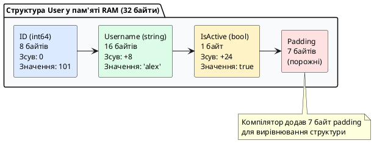

::

**Чому розмір не 25 байт (8+16+1), а 32 байти?**

Це через **memory alignment (вирівнювання пам'яті)** — оптимізацію, яку робить компілятор для швидшої роботи процесора.

#### Memory Alignment: чому з'являються "дірки" в пам'яті

**Проблема:** Сучасні процесори (64-біт) читають пам'ять **блоками по 8 байт**. Якщо дані не вирівняні, процесор робить **два читання** замість одного — це повільно.

**Рішення:** Компілятор Go автоматично додає **padding (заповнювач)** — порожні байти між полями, щоб кожне поле починалося з "правильної" адреси.

**Правила вирівнювання:**

| Тип | Розмір | Вирівнювання | Пояснення |
|-----|--------|--------------|-----------|
| `int8`, `uint8`, `byte`, `bool` | 1 байт | 1 | Може починатися з будь-якої адреси |
| `int16`, `uint16` | 2 байти | 2 | Адреса повинна бути кратна 2 |
| `int32`, `uint32`, `float32` | 4 байти | 4 | Адреса повинна бути кратна 4 |
| `int64`, `uint64`, `float64`, `*T` | 8 байт | 8 | Адреса повинна бути кратна 8 |
| `string`, `slice`, `map` | 16-24 байти | 8 | Містять покажчики, вирівнювання 8 |

**Приклад з padding:**

::tabs

::tabs-item{label="Погане вирівнювання" icon="i-lucide-alert-triangle"}

```go
type BadStruct struct {
    A bool   // 1 байт
    B int64  // 8 байт
    C bool   // 1 байт
    D int64  // 8 байт
}

// Що відбувається в пам'яті:
// A (1) + padding (7) + B (8) + C (1) + padding (7) + D (8) = 32 байти
//  ❌ 14 байт padding (44% пам'яті даремно!)
```

**Чому так багато padding?**
- `B int64` потребує адресу кратну 8 → після `A` додається 7 байт
- `D int64` також потребує адресу кратну 8 → після `C` додається 7 байт

::

::tabs-item{label="Гарне вирівнювання" icon="i-lucide-check-circle"}

```go
type GoodStruct struct {
    B int64  // 8 байт
    D int64  // 8 байт
    A bool   // 1 байт
    C bool   // 1 байт
}

// Що відбувається в пам'яті:
// B (8) + D (8) + A (1) + C (1) + padding (6) = 24 байти
//  ✅ 6 байт padding (25% економії пам'яті!)
```

**Чому менше padding?**
- Великі поля (`int64`) розміщені на початку
- Малі поля (`bool`) згруповані в кінці
- Padding додається лише в кінці структури

::

::

**Практична перевірка:**

```go
package main

import (
    "fmt"
    "unsafe"
)

type BadStruct struct {
    A bool   // 1 байт
    B int64  // 8 байт
    C bool   // 1 байт
    D int64  // 8 байт
}

type GoodStruct struct {
    B int64  // 8 байт
    D int64  // 8 байт
    A bool   // 1 байт
    C bool   // 1 байт
}

func main() {
    fmt.Printf("BadStruct:  %d байт\n", unsafe.Sizeof(BadStruct{}))   // 32
    fmt.Printf("GoodStruct: %d байт\n", unsafe.Sizeof(GoodStruct{}))  // 24
    
    // Економія на 1 млн екземплярів:
    bad := 32 * 1_000_000
    good := 24 * 1_000_000
    fmt.Printf("Економія: %d байт = %.2f МБ\n", bad-good, float64(bad-good)/1024/1024)
    // Економія: 8000000 байт = 7.63 МБ
}
```

#### Оптимізація структур: практичні правила

**1. Розміщуйте поля від найбільших до найменших:**

```go
type OptimizedUser struct {
    // 1. Покажчики та великі типи (8 байт)
    CreatedAt time.Time  // 24 байти (3 × int64)
    Email     string     // 16 байт
    Name      string     // 16 байт
    
    // 2. Середні типи (4 байти)
    Age       int32      // 4 байти
    
    // 3. Малі типи (1-2 байти)
    IsActive  bool       // 1 байт
    Role      uint8      // 1 байт
}
```

**2. Групуйте малі поля разом:**

```go
type Flags struct {
    IsActive    bool   // 1 байт
    IsVerified  bool   // 1 байт
    IsAdmin     bool   // 1 байт
    IsBanned    bool   // 1 байт
    // Разом: 4 байти + 4 байти padding = 8 байт
}
```

**3. Використовуйте інструменти для перевірки:**

```bash
# Встановлення fieldalignment
go install golang.org/x/tools/go/analysis/passes/fieldalignment/cmd/fieldalignment@latest

# Перевірка проєкту
fieldalignment -fix ./...
```

**4. Вимірюйте розмір структур:**

```go
import "unsafe"

type MyStruct struct {
    // ...
}

func main() {
    fmt.Printf("Розмір: %d байт\n", unsafe.Sizeof(MyStruct{}))
    fmt.Printf("Вирівнювання: %d байт\n", unsafe.Alignof(MyStruct{}))
}
```

::callout{icon="i-lucide-lightbulb"}
**Коли оптимізувати структури:**

✅ **Так:**
- Структури, яких створюється багато (1000+ екземплярів)
- Великі слайси структур у пам'яті
- High-performance код (обробка даних, ігри, системне ПЗ)

❌ **Ні:**
- Структури для конфігурації (1-10 екземплярів)
- Читабельність важливіша за 8 байт
- Додаткові поля додаються часто (порядок зміниться)

**Висновок:** спочатку пишіть читабельний код, оптимізуйте лише якщо профайлер показує проблему.
::

#### Копіювання структур: value vs pointer

**Важливо:** коли ви присвоюєте структуру, Go **копіює всі байти**:

```go
type User struct {
    ID   int64
    Name string
}

user1 := User{ID: 1, Name: "Олег"}
user2 := user1  // Копія всіх полів (8 + 16 = 24 байти)

user2.Name = "Марія"
fmt.Println(user1.Name)  // Олег (не змінився)
fmt.Println(user2.Name)  // Марія
```

**Особливість з string та slice:** вони містять **покажчики** всередині, тому копіюється покажчик, а не дані:

```go
type Post struct {
    Title string
    Tags  []string
}

post1 := Post{
    Title: "Go Tutorial",
    Tags:  []string{"go", "tutorial"},
}

post2 := post1  // Копіюється структура, але Tags вказує на той самий масив!

post2.Tags[0] = "golang"

fmt.Println(post1.Tags)  // [golang tutorial] — змінився!
fmt.Println(post2.Tags)  // [golang tutorial]
```

**Пояснення:**

```
post1.Tags → [0x1000] → ["go", "tutorial"]  (масив у пам'яті)
                ↑
post2.Tags → [0x1000]  (та сама адреса!)
```

::warning
**Правило:** копіювання структури копіює **дескриптори** (покажчики) `string` і `slice`, але **не копіює** самі дані рядків та елементів слайсу.

Щоб зробити справжню глибоку копію:

```go
post2 := post1
post2.Tags = make([]string, len(post1.Tags))
copy(post2.Tags, post1.Tags)  // Тепер окремі масиви
```
::

---

### Частина 4: Методи структур

#### Що таке метод?

**Метод** — це функція, яка "прив'язана" до конкретного типу. На відміну від звичайної функції, метод має **отримувача (receiver)** — параметр, який вказує, до якого типу належить цей метод.

**Порівняння з Java:**

::tabs

::tabs-item{label="Go — методи окремо" icon="i-simple-icons-go"}

```go
// Структура
type User struct {
    Name string
    Age  int
}

// Метод (окремо від структури!)
func (u User) Greet() string {
    return "Привіт, я " + u.Name
}

// Використання
user := User{Name: "Олег", Age: 25}
message := user.Greet()  // Виклик методу
```

**У Go:**
- Методи оголошуються **поза** структурою
- Receiver `(u User)` вказує, що це метод типу `User`
- Можна додавати методи до будь-якого типу (навіть `int`)

::

::tabs-item{label="Java — методи всередині" icon="i-simple-icons-openjdk"}

```java
// Клас з методами всередині
public class User {
    private String name;
    private int age;
    
    public User(String name, int age) {
        this.name = name;
        this.age = age;
    }
    
    // Метод всередині класу
    public String greet() {
        return "Привіт, я " + this.name;
    }
}

// Використання
User user = new User("Олег", 25);
String message = user.greet();
```

**У Java:**
- Методи **всередині** класу
- `this` — неявне посилання на об'єкт
- Методи можна додавати лише в класі

::

::

#### Синтаксис методу

```go
func (receiver ReceiverType) MethodName(parameters) ReturnType {
    // Тіло методу
}
```

**Анатомія методу:**

```go
func (u User) GetInfo() string {
//   ↑      ↑        ↑
//   |      |        └─ Повертає string
//   |      └────────── Назва методу
//   └─────────────────── Receiver: (змінна тип)
```

**Приклад:**

```go
package main

import "fmt"

type Rectangle struct {
    Width  float64
    Height float64
}

// Метод для обчислення площі
func (r Rectangle) Area() float64 {
    return r.Width * r.Height
}

// Метод для обчислення периметра
func (r Rectangle) Perimeter() float64 {
    return 2 * (r.Width + r.Height)
}

// Метод з параметрами
func (r Rectangle) IsLargerThan(other Rectangle) bool {
    return r.Area() > other.Area()
}

func main() {
    rect1 := Rectangle{Width: 10, Height: 5}
    rect2 := Rectangle{Width: 8, Height: 8}
    
    fmt.Printf("Площа rect1: %.2f\n", rect1.Area())
    fmt.Printf("Периметр rect1: %.2f\n", rect1.Perimeter())
    fmt.Printf("rect1 більше rect2? %t\n", rect1.IsLargerThan(rect2))
}
```

**Вивід:**
```
Площа rect1: 50.00
Периметр rect1: 30.00
rect1 більше rect2? false
```

#### Value Receiver vs Pointer Receiver

Це **найважливіша** концепція методів у Go. Є два типи receivers:

**1. Value Receiver (по значенню) — `(r Rectangle)`**

Метод отримує **копію** структури:

```go
func (r Rectangle) DoubleWidth() {
    r.Width = r.Width * 2  // Змінюємо КОПІЮ
}

rect := Rectangle{Width: 10, Height: 5}
rect.DoubleWidth()
fmt.Println(rect.Width)  // 10 (не змінилось!)
```

**2. Pointer Receiver (через покажчик) — `(r *Rectangle)`**

Метод отримує **покажчик** на оригінальну структуру:

```go
func (r *Rectangle) DoubleWidth() {
    r.Width = r.Width * 2  // Змінюємо ОРИГІНАЛ
}

rect := Rectangle{Width: 10, Height: 5}
rect.DoubleWidth()
fmt.Println(rect.Width)  // 20 (змінилось!)
```

**Детальне порівняння:**

::tabs

::tabs-item{label="Value Receiver (копія)" icon="i-lucide-copy"}

```go
package main

import "fmt"

type Counter struct {
    Value int
}

// Value receiver — метод отримує КОПІЮ
func (c Counter) Increment() {
    c.Value++  // Змінюємо копію
    fmt.Printf("  Всередині методу: %d\n", c.Value)
}

func main() {
    counter := Counter{Value: 0}
    
    fmt.Println("До виклику:", counter.Value)  // 0
    counter.Increment()                        // Всередині: 1
    fmt.Println("Після виклику:", counter.Value)  // 0 (не змінилось!)
    
    counter.Increment()                        // Всередині: 1
    fmt.Println("Після 2-го виклику:", counter.Value)  // 0 (знову не змінилось!)
}
```

**Що відбувається:**

```
Пам'ять:
┌─────────────────┐
│ counter         │
│ Value: 0        │ ← Оригінал
└─────────────────┘
        ↓
    [копія передається в метод]
        ↓
┌─────────────────┐
│ c (копія)       │
│ Value: 0 → 1    │ ← Змінюємо копію
└─────────────────┘
        ↓
    [копія знищується після виходу з методу]
        ↓
┌─────────────────┐
│ counter         │
│ Value: 0        │ ← Оригінал НЕ змінився
└─────────────────┘
```

::

::tabs-item{label="Pointer Receiver (посилання)" icon="i-lucide-pointer"}

```go
package main

import "fmt"

type Counter struct {
    Value int
}

// Pointer receiver — метод отримує ПОКАЖЧИК
func (c *Counter) Increment() {
    c.Value++  // Змінюємо оригінал
    fmt.Printf("  Всередині методу: %d\n", c.Value)
}

func main() {
    counter := Counter{Value: 0}
    
    fmt.Println("До виклику:", counter.Value)  // 0
    counter.Increment()                        // Всередині: 1
    fmt.Println("Після виклику:", counter.Value)  // 1 (змінилось!)
    
    counter.Increment()                        // Всередині: 2
    fmt.Println("Після 2-го виклику:", counter.Value)  // 2 (змінилось!)
}
```

**Що відбувається:**

```
Пам'ять:
┌─────────────────┐
│ counter         │
│ Value: 0        │ ← Оригінал
└─────────────────┘
        ↓
    [передається адреса &counter]
        ↓
┌─────────────────┐
│ c → &counter    │ ← Покажчик на оригінал
└─────────────────┘
        ↓
    [змінюємо через покажчик]
        ↓
┌─────────────────┐
│ counter         │
│ Value: 0 → 1    │ ← Оригінал ЗМІНИВСЯ
└─────────────────┘
```

::

::

#### Коли використовувати Value vs Pointer Receiver

**Таблиця рішень:**

| Критерій | Value Receiver | Pointer Receiver |
|----------|----------------|------------------|
| **Зміна структури** | ❌ НЕ змінює оригінал | ✅ Змінює оригінал |
| **Розмір структури** | ✅ Малі (< 64 байти) | ✅ Великі (> 64 байти) |
| **Копіювання** | Повна копія | Лише адреса (8 байт) |
| **Продуктивність** | Повільніше для великих | Швидше для великих |
| **Безпека** | ✅ Immutable | ⚠️ Може змінити дані |
| **sync.Mutex** | ❌ Не працює | ✅ Обов'язково |

**Практичні правила:**

**✅ Використовуйте Value Receiver коли:**

1. **Структура мала** (2-3 поля, < 64 байти)
2. **Метод НЕ змінює дані** (getter, перевірка, обчислення)
3. **Хочете immutability** (незмінність)

```go
type Point struct {
    X, Y int  // Маленька структура (16 байт)
}

// Value receiver — читаємо дані
func (p Point) Distance() float64 {
    return math.Sqrt(float64(p.X*p.X + p.Y*p.Y))
}

// Value receiver — не змінюємо оригінал
func (p Point) Add(other Point) Point {
    return Point{X: p.X + other.X, Y: p.Y + other.Y}
}
```

**✅ Використовуйте Pointer Receiver коли:**

1. **Метод ЗМІНЮЄ структуру** (update, increment, modify)
2. **Структура велика** (багато полів, > 64 байти)
3. **Є `sync.Mutex`** (інакше не працюватиме)
4. **Потрібна узгодженість** (якщо хоч один метод pointer — всі pointer)

```go
type User struct {
    ID       int64
    Name     string
    Email    string
    Password string
    // ... багато полів
}

// Pointer receiver — змінюємо дані
func (u *User) UpdateEmail(newEmail string) {
    u.Email = newEmail
}

// Pointer receiver — велика структура
func (u *User) Validate() error {
    // Не копіюємо всю структуру
    if u.Email == "" {
        return errors.New("email обов'язковий")
    }
    return nil
}

// Mutex — ОБОВ'ЯЗКОВО pointer receiver
type SafeCounter struct {
    mu    sync.Mutex
    value int
}

func (c *SafeCounter) Increment() {
    c.mu.Lock()
    defer c.mu.Unlock()
    c.value++
}
```

#### Автоматичне перетворення Go: магія викликів

Go **автоматично** конвертує між значеннями та покажчиками при виклику методів:

```go
type User struct {
    Name string
}

func (u *User) SetName(name string) {
    u.Name = name
}

func (u User) GetName() string {
    return u.Name
}

// ✅ Всі ці виклики валідні:
user := User{Name: "Олег"}
user.SetName("Марія")      // Go автоматично: (&user).SetName("Марія")

userPtr := &User{Name: "Іван"}
name := userPtr.GetName()  // Go автоматично: (*userPtr).GetName()
```

**Що робить Go за вас:**

| Ситуація | Що пишете | Що виконує Go |
|----------|-----------|---------------|
| Value, метод pointer | `user.SetName()` | `(&user).SetName()` |
| Pointer, метод value | `userPtr.GetName()` | `(*userPtr).GetName()` |

::callout{icon="i-lucide-info"}
**Важливо:** автоматичне взяття адреси `&` працює лише для **змінних**:

```go
// ✅ OK — user це змінна
user := User{Name: "Олег"}
user.SetName("Марія")  // Go може взяти &user

// ❌ Помилка — літерал не має адреси
User{Name: "Олег"}.SetName("Марія")  // cannot take address of User{...}

// ✅ Рішення — зберегти в змінну або явно створити покажчик
(&User{Name: "Олег"}).SetName("Марія")
```
::

#### Золоте правило: узгодженість receivers

**Правило:** якщо хоч один метод типу має pointer receiver, **всі методи повинні мати pointer receiver**.

::tabs

::tabs-item{label="❌ Погано — змішування" icon="i-lucide-x-circle"}

```go
type User struct {
    Name  string
    Email string
}

// Value receiver
func (u User) GetName() string {
    return u.Name
}

// Pointer receiver
func (u *User) SetEmail(email string) {
    u.Email = email
}

// Value receiver знову
func (u User) Validate() error {
    // ...
}
```

**Проблема:** незрозуміло, чому одні методи змінюють, а інші ні. Заплутана логіка.

::

::tabs-item{label="✅ Добре — все pointer" icon="i-lucide-check-circle"}

```go
type User struct {
    Name  string
    Email string
}

// Всі pointer receivers
func (u *User) GetName() string {
    return u.Name
}

func (u *User) SetEmail(email string) {
    u.Email = email
}

func (u *User) Validate() error {
    // ...
}
```

**Переваги:** 
- Узгоджений API
- Немає копіювання
- Легше підтримувати

::

::

**Виняток:** типи з stdlib іноді змішують (наприклад, `time.Time`), але для вашого коду краще дотримуватись узгодженості.

#### Методи vs функції: коли що використовувати?

::tabs

::tabs-item{label="Методи" icon="i-lucide-package"}

```go
type Rectangle struct {
    Width, Height float64
}

// Метод — логічно належить Rectangle
func (r Rectangle) Area() float64 {
    return r.Width * r.Height
}

// Використання
rect := Rectangle{Width: 10, Height: 5}
area := rect.Area()  // Читається як "площа прямокутника"
```

**Використовуйте методи коли:**
- Операція логічно належить типу
- Потрібна ланцюгова нотація: `user.Validate().Save()`
- Тип має стан, який змінюється

::

::tabs-item{label="Функції" icon="i-lucide-function-square"}

```go
type Rectangle struct {
    Width, Height float64
}

// Функція — працює з двома прямокутниками
func CombineArea(r1, r2 Rectangle) float64 {
    return r1.Width*r1.Height + r2.Width*r2.Height
}

// Використання
area := CombineArea(rect1, rect2)
```

**Використовуйте функції коли:**
- Операція працює з кількома типами
- Немає природного "власника" операції
- Утилітарні операції (парсинг, валідація сторонніх даних)

::

::

---

### Частина 5: Композиція замість наслідування

#### Чому в Go немає наслідування?

У мові Go **свідомо відмовились від класичного наслідування** (`class Child extends Parent`). Це дизайнерське рішення, яке спрощує код і уникає проблем складних ієрархій класів.

**Проблеми наслідування (які вирішує Go):**

::tabs

::tabs-item{label="Java — проблеми наслідування" icon="i-simple-icons-openjdk"}

```java
// Проблема 1: Жорстка ієрархія
class Animal {
    void eat() { }
}

class Bird extends Animal {
    void fly() { }
}

class Penguin extends Bird {
    // ❌ Проблема: пінгвін не літає, але успадкував fly()!
    @Override
    void fly() {
        throw new UnsupportedOperationException("Пінгвіни не літають!");
    }
}

// Проблема 2: Множинне наслідування заборонено
class Duck extends Animal, Swimmable {  // ❌ Помилка компіляції!
    // Не можна успадкувати від двох класів
}

// Проблема 3: Diamond Problem
class A { void method() { } }
class B extends A { }
class C extends A { }
class D extends B, C { }  // Від кого успадкувати method()?
```

**Проблеми:**
- Жорстка ієрархія (важко змінити базовий клас)
- Порушення принципу підстановки Лісков
- Неможливе множинне наслідування
- Diamond problem
- Залежність від імплементації батьківського класу

::

::tabs-item{label="Go — композиція" icon="i-simple-icons-go"}

```go
// Рішення: Композиція через інтерфейси та embedding
type Eater interface {
    Eat()
}

type Flyer interface {
    Fly()
}

type Swimmer interface {
    Swim()
}

// Пінгвін реалізує лише те, що йому потрібно
type Penguin struct {
    Name string
}

func (p Penguin) Eat() {
    fmt.Println(p.Name, "їсть рибу")
}

func (p Penguin) Swim() {
    fmt.Println(p.Name, "пливе")
}
// Метод Fly() просто не реалізовано — і це OK!

// Качка реалізує всі три інтерфейси
type Duck struct {
    Name string
}

func (d Duck) Eat() { }
func (d Duck) Fly() { }
func (d Duck) Swim() { }
```

**Переваги:**
- Гнучкість (реалізуєш лише потрібне)
- Немає жорсткої ієрархії
- "Множинне наслідування" через інтерфейси
- Явні залежності

::

::

#### Що таке композиція?

**Композиція** — це коли один тип містить інші типи як поля. Замість "A є B" (is-a), ми кажемо "A має B" (has-a).

**Аналогія:** 
- **Наслідування:** "Автомобіль **є** транспортний засіб" (is-a)
- **Композиція:** "Автомобіль **має** двигун, колеса, керування" (has-a)

**Простий приклад:**

```go
package main

import "fmt"

// Окремі компоненти
type Engine struct {
    Power int  // Потужність у к.с.
}

func (e Engine) Start() {
    fmt.Printf("Двигун %d к.с. запущено\n", e.Power)
}

type Wheels struct {
    Count int
}

func (w Wheels) Roll() {
    fmt.Printf("%d колеса котяться\n", w.Count)
}

// Автомобіль МІСТИТЬ компоненти (композиція)
type Car struct {
    Brand  string
    Engine Engine  // Має двигун
    Wheels Wheels  // Має колеса
}

func main() {
    car := Car{
        Brand:  "Toyota",
        Engine: Engine{Power: 150},
        Wheels: Wheels{Count: 4},
    }
    
    fmt.Println("Бренд:", car.Brand)
    car.Engine.Start()  // Доступ через поле
    car.Wheels.Roll()
}
```

**Вивід:**
```
Бренд: Toyota
Двигун 150 к.с. запущено
4 колеса котяться
```

#### Два типи композиції в Go

Go підтримує два способи включення одного типу в інший:

**1. Іменоване поле (Named Field) — явна композиція**

```go
type Car struct {
    Brand  string
    Engine Engine  // ← Поле з ім'ям "Engine"
}

car := Car{Engine: Engine{Power: 150}}
car.Engine.Start()  // Доступ через ім'я поля
```

**2. Анонімне поле (Embedded Field) — вбудовування**

```go
type Car struct {
    Brand  string
    Engine  // ← Без імені поля (тільки тип)
}

car := Car{Engine: Engine{Power: 150}}
car.Start()  // Прямий доступ (promotion)!
```

#### Embedding: анонімне вбудовування структур

**Embedding (вбудовування)** — це коли структура містить інший тип **без імені поля**. Усі поля та методи вбудованого типу "спливають" (promote) до зовнішньої структури.

**Синтаксис:**

```go
type Outer struct {
    InnerType  // Анонімне вбудовування (без імені поля)
    // Власні поля
}
```

**Детальний приклад з promotion:**

::tabs

::tabs-item{label="З іменованим полем" icon="i-lucide-box"}

```go
package main

import "fmt"

type Address struct {
    City   string
    Street string
}

type Person struct {
    Name    string
    Address Address  // ← Іменоване поле
}

func main() {
    person := Person{
        Name: "Олег",
        Address: Address{
            City:   "Київ",
            Street: "Хрещатик",
        },
    }
    
    // Доступ лише через ім'я поля:
    fmt.Println(person.Address.City)    // ✅ Київ
    // fmt.Println(person.City)         // ❌ Помилка!
}
```

**Недоліки:**
- Довгі шляхи: `person.Address.City`
- Не можна використати `Person` замість `Address`

::

::tabs-item{label="З вбудованим полем (embedding)" icon="i-lucide-package-open"}

```go
package main

import "fmt"

type Address struct {
    City   string
    Street string
}

type Person struct {
    Name    string
    Address  // ← Анонімне вбудовування (embedding)
}

func main() {
    person := Person{
        Name: "Олег",
        Address: Address{
            City:   "Київ",
            Street: "Хрещатик",
        },
    }
    
    // Прямий доступ (promotion):
    fmt.Println(person.City)         // ✅ Київ (коротше!)
    fmt.Println(person.Address.City) // ✅ Київ (також працює)
}
```

**Переваги:**
- Короткий доступ: `person.City`
- Поля "спливають" нагору
- Методи також спливають

::

::

#### Method Promotion: спливання методів

Коли ви вбудовуєте структуру, **всі її методи** також стають доступними напряму:

```go
package main

import "fmt"

type Logger struct {
    Prefix string
}

func (l Logger) Info(msg string) {
    fmt.Printf("[%s INFO] %s\n", l.Prefix, msg)
}

func (l Logger) Error(msg string) {
    fmt.Printf("[%s ERROR] %s\n", l.Prefix, msg)
}

// Сервіс вбудовує Logger
type UserService struct {
    Logger  // Анонімне вбудовування
    DB      string
}

func (s UserService) CreateUser(name string) {
    // Можемо викликати методи Logger напряму!
    s.Info("Створення користувача: " + name)
    // ... логіка створення
    s.Info("Користувача створено")
}

func main() {
    service := UserService{
        Logger: Logger{Prefix: "UserService"},
        DB:     "postgres",
    }
    
    service.CreateUser("Олег")
    // service.Info() та service.Error() доступні!
    service.Error("Помилка підключення до БД")
}
```

**Вивід:**
```
[UserService INFO] Створення користувача: Олег
[UserService INFO] Користувача створено
[UserService ERROR] Помилка підключення до БД
```

#### Практичний приклад: BaseEntity для ORM

Типовий патерн у Go-додатках — базова структура для моделей бази даних:

```go
package main

import (
    "fmt"
    "time"
)

// Базова структура для всіх моделей
type BaseEntity struct {
    ID        int64
    CreatedAt time.Time
    UpdatedAt time.Time
}

func (b BaseEntity) GetAge() time.Duration {
    return time.Since(b.CreatedAt)
}

func (b BaseEntity) FormattedCreated() string {
    return b.CreatedAt.Format("2006-01-02 15:04:05")
}

// Модель користувача
type User struct {
    BaseEntity  // Вбудовуємо базові поля
    Email       string
    Username    string
}

// Модель продукту
type Product struct {
    BaseEntity  // Вбудовуємо базові поля
    Name        string
    Price       float64
}

func main() {
    user := User{
        BaseEntity: BaseEntity{
            ID:        1,
            CreatedAt: time.Now().Add(-24 * time.Hour),
            UpdatedAt: time.Now(),
        },
        Email:    "user@kostyl.dev",
        Username: "alex",
    }
    
    // Прямий доступ до полів BaseEntity:
    fmt.Printf("User ID: %d\n", user.ID)
    fmt.Printf("Created: %s\n", user.FormattedCreated())
    fmt.Printf("Age: %v\n", user.GetAge())
    
    // Також працює з Product:
    product := Product{
        BaseEntity: BaseEntity{
            ID:        100,
            CreatedAt: time.Now(),
        },
        Name:  "Ноутбук",
        Price: 25000,
    }
    
    fmt.Printf("\nProduct ID: %d\n", product.ID)
    fmt.Printf("Created: %s\n", product.FormattedCreated())
}
```

#### Конфлікти імен при embedding

Що буде, якщо вбудована структура і зовнішня мають поля з однаковими іменами?

```go
package main

import "fmt"

type Inner struct {
    Name string
}

type Outer struct {
    Inner
    Name string  // ← Конфлікт імен!
}

func main() {
    obj := Outer{
        Inner: Inner{Name: "Inner Name"},
        Name:  "Outer Name",
    }
    
    fmt.Println(obj.Name)        // "Outer Name" — зовнішнє поле має пріоритет
    fmt.Println(obj.Inner.Name)  // "Inner Name" — доступ через явне поле
}
```

**Правило:** зовнішнє поле **перекриває** вбудоване. Доступ до вбудованого лише через явну назву типу.

::warning
**Конфлікт методів:**

```go
type A struct{}
func (a A) Print() { fmt.Println("A") }

type B struct{}
func (b B) Print() { fmt.Println("B") }

type C struct {
    A
    B
}

c := C{}
// c.Print()  // ❌ Помилка компіляції: ambiguous selector c.Print
c.A.Print()   // ✅ OK: викликаємо явно
c.B.Print()   // ✅ OK
```

Якщо два вбудовані типи мають методи з однаковою назвою — **компілятор вимагає явного вибору**.
::

#### Коли використовувати embedding vs named field?

| Критерій | Named Field | Embedding |
|----------|-------------|-----------|
| **Ясність коду** | ✅ Явно видно зв'язок | ⚠️ Менш очевидно |
| **Довжина запису** | ❌ Довші шляхи | ✅ Короткі шляхи |
| **Можливість конфліктів** | ✅ Немає | ⚠️ Є ризик |
| **Реалізація інтерфейсів** | ❌ Не успадковується | ✅ Автоматично |
| **Використання** | Коли є "має" (has-a) | Коли є "поводиться як" (is-like-a) |

**Практичні рекомендації:**

**✅ Використовуйте Embedding коли:**
- Базові структури (`BaseEntity`, `BaseModel`)
- Міксини (`sync.Mutex`, `Logger`)
- Хочете реалізувати інтерфейс автоматично
- Короткі шляхи важливі

```go
type UserService struct {
    sync.Mutex  // Embedding для блокування
    Logger      // Embedding для логування
    // ...
}
```

**✅ Використовуйте Named Field коли:**
- Зв'язок не є "is-like-a"
- Потрібна явна ізоляція
- Ризик конфліктів імен
- Читабельність важливіша за короткість

```go
type Car struct {
    Engine Engine  // Named: машина має двигун, але не є двигуном
    Owner  Person  // Named: явний зв'язок
}
```

::callout{icon="i-lucide-lightbulb"}
**Золоте правило:**

Якщо сумніваєтесь — використовуйте **Named Field**. Це явніше і безпечніше.

Embedding додавайте лише коли:
1. Точно знаєте, що робите
2. Хочете коротший синтаксис
3. Потрібно реалізувати інтерфейс

**"Явне краще за неявне"** — один з принципів Go.
::

---

### Методи на будь-якому визначеному типі, а не лише на структурах — для допитливих

**Проста теорія наперед:** поки що достатньо `func (u User) String()` на структурах. Нижче — як той самий прийом працює на `float64` чи зрізах.

На відміну від Java/C#, в Go метод можна прив'язати до **будь-якого** `type` з `type X T` (крім покажчиків та інтерфейсів):

```go
type Celsius float64
func (c Celsius) String() string { return fmt.Sprintf("%.1f°C", float64(c)) }
func (c Celsius) ToFahrenheit() Celsius { return Celsius(float64(c)*9/5 + 32) }

type UserIDs []int64
func (ids UserIDs) Contains(id int64) bool {
    for _, v := range ids { if v == id { return true } }
    return false
}

var temp Celsius = 36.6
fmt.Println(temp.String()) // 36.6°C — метод на float64!
var ids UserIDs = []int64{1,2,3}
fmt.Println(ids.Contains(2)) // true
```

::note
Псевдонім `type MyInt = int` (зі знаком `=`) **не може** мати власних методів — він тотожний `int`. Лише `type MyInt int` (без `=`) створює новий тип із власним набором методів. Тому в `type byte = uint8` методи не додати, а в `type UserID int64` — можна.
::

---

### Теги структур (Struct Tags) для мережевих контрактів JSON/SQL

У клієнт-серверних вебзастосунках бекенд постійно конвертує дані між внутрішніми структурами Go та зовнішніми форматами (JSON для HTTP REST API, колонками реляційних баз даних PostgreSQL/MySQL, XML тощо).

**Тег поля структури (`Struct Tag`)** — це рядок метаданих, записаний у зворотних апострофах після типу поля, який зчитується стандартними пакетами (наприклад, `encoding/json` або ORM-бібліотеками) за допомогою рефлексії.

```go
package main

import (
	"encoding/json"
	"fmt"
)

type APIUserResponse struct {
	// 1. `json:"id"` — перейменовує поле ID у нижній регістр "id" для клієнта
	ID int64 `json:"id"`

	// 2. `json:"user_name"` — кастомне ім'я поля в JSON
	Username string `json:"user_name"`

	// 3. `json:"bio,omitempty"` — якщо рядок порожній (""), поле взагалі ВИКЛЮЧАЄТЬСЯ з JSON!
	Bio string `json:"bio,omitempty"`

	// 4. `json:"-"` — поле повністю ІГНОРУЄТЬСЯ і ніколи не потрапить у відповідь (захист паролів)
	PasswordHash string `json:"-"`

	// 5. `json:",string"` — кодує число як рядок у JSON ("8080" замість 8080)
	Port int `json:"port,string"`
}

func main() {
	user := APIUserResponse{
		ID:           42,
		Username:     "taras_shevchenko",
		Bio:          "", // Порожнє: omitempty виключить його з виводу
		PasswordHash: "super_secret_bcrypt_hash_999",
		Port:         8080,
	}

	// Серіалізація структури в красивий відформатований JSON:
	jsonData, err := json.MarshalIndent(user, "", "  ")
	if err != nil {
		fmt.Println("Помилка серіалізації:", err)
		return
	}

	fmt.Println("Згенерований JSON для клієнта:")
	fmt.Println(string(jsonData))
}
```

::terminal-preview{title="Вихідний результат JSON-серіалізації" :cursor="false"}

<div class="line">{</div>
<div class="line">  <span class="text-blue-400">"id"</span>: 42,</div>
<div class="line">  <span class="text-blue-400">"user_name"</span>: <span class="text-green-400">"taras_shevchenko"</span>,</div>
<div class="line">  <span class="text-blue-400">"port"</span>: <span class="text-green-400">"8080"</span></div>
<div class="line">}</div>
::

---

## Динамічні колекції: Зрізи (Slices) та Словники (Maps)

### Вступ: навіщо потрібні динамічні колекції?

У реальних програмах розмір даних часто невідомий заздалегідь:
- Кількість записів з бази даних
- Список підключених користувачів
- Елементи у кошику покупок
- Конфігурації з файлу

Статичні масиви `[10]int` не підходять — треба знати розмір при компіляції. Go надає дві динамічні колекції:
- **Слайси (Slices)** — динамічні списки елементів
- **Словники (Maps)** — пари ключ-значення

---

### Частина 1: Зрізи (Slices) — динамічні списки

#### Що таке зріз?

**Зріз (Slice)** — це динамічний список елементів, який може змінювати розмір під час виконання програми.

**Порівняння з Java:**

::tabs

::tabs-item{label="Go — Slice" icon="i-simple-icons-go"}

```go
package main

import "fmt"

func main() {
    // Створення зрізу
    numbers := []int{10, 20, 30}
    
    // Додавання елементів (розмір зростає автоматично)
    numbers = append(numbers, 40)
    numbers = append(numbers, 50)
    
    // Довжина
    fmt.Println("Довжина:", len(numbers))  // 5
    
    // Доступ до елементів
    fmt.Println("Перший:", numbers[0])     // 10
    fmt.Println("Останній:", numbers[len(numbers)-1])  // 50
    
    // Ітерація
    for i, value := range numbers {
        fmt.Printf("[%d] = %d\n", i, value)
    }
}
```

**Особливості Go:**
- Немає класу `ArrayList`
- Зріз — вбудований тип мови
- `append()` — вбудована функція
- Автоматичне управління пам'яттю

::

::tabs-item{label="Java — ArrayList" icon="i-simple-icons-openjdk"}

```java
import java.util.ArrayList;

public class Main {
    public static void main(String[] args) {
        // Створення списку
        ArrayList<Integer> numbers = new ArrayList<>();
        numbers.add(10);
        numbers.add(20);
        numbers.add(30);
        
        // Додавання елементів
        numbers.add(40);
        numbers.add(50);
        
        // Розмір
        System.out.println("Розмір: " + numbers.size());  // 5
        
        // Доступ до елементів
        System.out.println("Перший: " + numbers.get(0));  // 10
        System.out.println("Останній: " + numbers.get(numbers.size()-1));  // 50
        
        // Ітерація
        for (int i = 0; i < numbers.size(); i++) {
            System.out.println("[" + i + "] = " + numbers.get(i));
        }
    }
}
```

**Особливості Java:**
- Потрібен імпорт `java.util.ArrayList`
- Об'єкт класу (не примітив)
- Метод `.add()` для додавання
- Метод `.get(i)` для доступу

::

::

**Ключові відмінності:**

| Аспект | Go `[]T` | Java `ArrayList<T>` |
|--------|----------|---------------------|
| **Тип** | Вбудований у мову | Клас з бібліотеки |
| **Синтаксис** | `[]int` | `ArrayList<Integer>` |
| **Додавання** | `append(slice, value)` | `list.add(value)` |
| **Доступ** | `slice[i]` | `list.get(i)` |
| **Довжина** | `len(slice)` | `list.size()` |
| **Примітиви** | ✅ Підтримуються | ❌ Лише обгортки (`Integer`) |

#### Способи створення зрізів

::tabs

::tabs-item{label="Go — 5 способів" icon="i-simple-icons-go"}

```go
package main

import "fmt"

func main() {
    // 1. Nil зріз (порожній, не виділена пам'ять)
    var nilSlice []int
    fmt.Println("nil:", nilSlice == nil, len(nilSlice))  // true 0
    
    // 2. Літерал зрізу
    fruits := []string{"яблуко", "банан", "апельсин"}
    fmt.Println("Літерал:", fruits)
    
    // 3. make() з довжиною
    numbers := make([]int, 5)  // [0 0 0 0 0]
    fmt.Println("make(len):", numbers)
    
    // 4. make() з довжиною та місткістю
    buffer := make([]int, 3, 10)  // len=3, cap=10
    fmt.Println("make(len, cap):", len(buffer), cap(buffer))
    
    // 5. Зрізання масиву або іншого зрізу
    arr := [5]int{1, 2, 3, 4, 5}
    slice := arr[1:4]  // [2 3 4]
    fmt.Println("Зрізання:", slice)
}
```

::

::tabs-item{label="Java — 3 способи" icon="i-simple-icons-openjdk"}

```java
import java.util.*;

public class Main {
    public static void main(String[] args) {
        // 1. Порожній список
        ArrayList<Integer> empty = new ArrayList<>();
        System.out.println("Порожній: " + empty.isEmpty());  // true
        
        // 2. З початковим розміром
        ArrayList<Integer> sized = new ArrayList<>(10);
        System.out.println("Capacity: 10, size: " + sized.size());  // 0
        
        // 3. З початковими даними
        ArrayList<String> fruits = new ArrayList<>(
            Arrays.asList("яблуко", "банан", "апельсин")
        );
        System.out.println("З даними: " + fruits);
        
        // 4. Зі старого списку
        ArrayList<String> copy = new ArrayList<>(fruits);
        System.out.println("Копія: " + copy);
    }
}
```

::

::

#### Внутрішня будова зрізу

Зріз — це **дескриптор**, який займає **24 байти** і містить 3 поля:

```go
type SliceHeader struct {
    Data uintptr  // Покажчик на масив (8 байт)
    Len  int      // Довжина (8 байт)
    Cap  int      // Місткість (8 байт)
}
```

**Візуалізація:**

::plant-uml{alt="Внутрішня будова зрізу"}

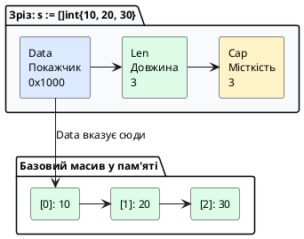

::

**Приклад з `make()`:**

```go
s := make([]int, 3, 5)
// Data: покажчик на масив [0, 0, 0, _, _]
// Len: 3 (доступні 3 елементи)
// Cap: 5 (виділено місце для 5)

s[0] = 10
s[1] = 20
s[2] = 30
// s[3] = 40  // ❌ Помилка: index out of range

s = append(s, 40)  // ✅ Тепер len=4
```

**Різниця між `len` та `cap`:**

| Параметр | Значення | Пояснення |
|----------|----------|-----------|
| **len** (довжина) | Кількість елементів зараз | Можна читати/писати `s[0]...s[len-1]` |
| **cap** (місткість) | Виділено місця | Резерв для `append()` без реалокації |

```go
s := make([]int, 3, 10)
fmt.Println(len(s))  // 3  — можна використати 3 елементи
fmt.Println(cap(s))  // 10 — виділено місця для 10

s = append(s, 40, 50, 60, 70)  // Додаємо 4 елементи
fmt.Println(len(s))  // 7  — тепер 7 елементів
fmt.Println(cap(s))  // 10 — досі в межах виділеної пам'яті
```

---

#### Оператор зрізання та ефект спільної пам'яті (_Underlying Array_)

**Проста теорія:** `s[1:4]` — візьми елементи з 1 по 3 (4 не включно). Поки що запам'ятайте це. Формули `len/cap` нижче — для допитливих.

Зріз можна створити з уже існуючого масиву або іншого зрізу за допомогою оператора зрізання **`s[low:high]`**:

- Діапазон береться за напівінтервалом: індекси від `low` до `high - 1`.
- Довжина отриманого зрізу: `len = high - low`.
- Місткість отриманого зрізу: `cap = cap(оригіналу) - low`.

```go
package main

import "fmt"

func main() {
	// Створюємо базовий масив
	baseArray := [6]int{10, 20, 30, 40, 50, 60}

	// Створюємо зріз з 1 по 3 індекси (елементи 20, 30, 40)
	sliceA := baseArray[1:4]
	sliceB := sliceA[1:3] // Зріз від зрізу (елементи 30, 40)

	fmt.Printf("sliceA: len=%d, cap=%d, %v\n", len(sliceA), cap(sliceA), sliceA) // len=3, cap=5
	fmt.Printf("sliceB: len=%d, cap=%d, %v\n", len(sliceB), cap(sliceB), sliceB) // len=2, cap=4

	// ⚠️ УВАГА: Ефект спільної пам'яті (Slice Mutation Bug)!
	// Зміна елемента в sliceB фізично змінює комірку в baseArray та sliceA:
	sliceB[0] = 999

	fmt.Println("\nПісля модифікації sliceB[0] = 999:")
	fmt.Printf("  baseArray: %v\n", baseArray) // [10, 20, 999, 40, 50, 60] — ОРИГІНАЛ ЗМІНИВСЯ!
	fmt.Printf("  sliceA:    %v\n", sliceA)    // [20, 999, 40]
}
```

::tip
**Повний 3-індексний зріз `s[low:high:max]` (Full Slice Expression):**
Щоб захистити базовий масив від випадкової перезаписи через подальший `append`, використовується третій параметр `max`, який жорстко обмежує місткість зрізу: `safeSlice := baseArray[1:4:4]`. У цьому випадку `cap` дорівнюватиме `4 - 1 = 3`, і перший же `append` змусить Go виділити новий масив.
::

---

#### Динамічне розширення: функція `append()` та механіка `growslice`

Вбудована функція **`append()`** додає нові елементи в кінець зрізу.

**Як працює `append()` під капотом — аналогія «блокнот на пружині»:**

Уявіть зріз як блокнот: `len` — списані аркуші (закладка), `cap` — всього аркушів у блокноті, `Data` — адреса першого аркуша. Порожні аркуші `cap-len` — запас без походу в магазин.

1. Якщо `len + нові <= cap`, Go пише на наступний чистий аркуш у **тому самому** блокноті і зсуває закладку (`len++`).
2. Якщо аркуші скінчились (`len == cap`), викликається **`runtime.growslice`**:
    - Купує **новий блокнот** за правилом Go 1.18+: якщо `cap < 256`, новий `cap ≈ 2×старий`, інакше `≈ 1.25×старий` з округленням до _size class_ (щоб фури пам'яті не фрагментували склад).
    - Переписує всі старі аркуші.
    - Додає нові.
    - Повертає новий `SliceHeader` з новою адресою `Data`.
    - **Старий блокнот здають в макулатуру (GC), якщо на нього більше немає вікон-зрізів** — увага: `t := s[1:3]` тримає **весь** старий блокнот живим, навіть якщо бачить лише 2 аркуші!

::warning
**Чому `a:=s[0:2]; a[0]=99` псує `s`:** обидва вікна дивляться в один блокнот. Зміна через одне вікно видна через друге. Для ізоляції — `copy` або `s[0:2:2]` (full slice).
::

```go
package main

import "fmt"

func main() {
	var numbers []int // nil зріз

	for i := 1; i <= 5; i++ {
		prevCap := cap(numbers)
		numbers = append(numbers, i*10)

		// Якщо місткість змінилася — відбулася реалокація пам'яті в купі!
		if cap(numbers) != prevCap {
			fmt.Printf("🔥 Реалокація growslice! len: %d, новий cap: %d\n", len(numbers), cap(numbers))
		}
	}

	// Злиття двох зрізів за допомогою синтаксису розпакування slice...
	extra := []int{60, 70, 80}
	numbers = append(numbers, extra...)
	fmt.Println("Підсумковий зріз після злиття:", numbers)
}
```

---

#### Двовимірні зрізи та сортування — для допитливих

**Проста теорія:** `[][]int` — таблиця де кожен рядок може мати різну довжину. Поки що достатньо `[]int`.

На відміну від прямокутних масивів `[2][3]int` (де всі рядки по 3 елементи), зріз зрізів `[][]int` — це зріз покажчиків на незалежні базові масиви, тому рядки можуть мати різну довжину (ідеально для матриць суміжності графа):

```go
matrix := [][]int{
    {1, 2, 3},
    {4, 5},       // коротший рядок — валідно!
    {6, 7, 8, 9},
}
matrix[1] = append(matrix[1], 99) // розширює лише другий рядок
```

Для впорядкування використовуйте `sort` (не повторює `01`): `sort.Ints(s)`, `sort.Strings(s)`, `sort.Slice(s, func(i,j int) bool{...})` для структур. Пошук `sort.SearchInts(sorted, 33)` вимагає **відсортованого** зрізу — на невідсортованому поверне хибний індекс, бо це бінарний пошук $O(\log N)$.

---

#### Повна ізоляція: вбудована функція `copy()` та видалення елементів

Якщо вам необхідно отримати повністю незалежну копію даних без спільного базового масиву, використовується функція **`copy(dst, src)`**:

```go
package main

import "fmt"

func main() {
	original := []int{10, 20, 30, 40, 50}

	// 1. Правильне клонування зрізу:
	// Приймальний зріз ОБОВ'ЯЗКОВО повинен мати виділену довжину len!
	clone := make([]int, len(original))
	copiedCount := copy(clone, original) // Копіює 5 елементів
	fmt.Printf("Скопійовано %d елементів. Клон: %v\n", copiedCount, clone)

	clone[0] = 777 // original НЕ зміниться!
	fmt.Printf("Оригінал: %v, Клон: %v\n", original, clone)

	// 2. Стандартне видалення елемента за індексом i (наприклад, видаляємо індекс 2 — число 30):
	indexToRemove := 2
	original = append(original[:indexToRemove], original[indexToRemove+1:]...)
	fmt.Println("Зріз після видалення елемента [2]:", original) // [10, 20, 40, 50]
}
```

---

### Карти (`map[K]V`): вбудовані хеш-таблиці

**Карта (_Map_)** — це невпорядкована колекція пар «ключ-значення» (_Key-Value_), яка забезпечує надшвидкий пошук, додавання та видалення даних за константний середній час $O(1)$.

#### Вимоги до типів ключів

**Проста теорія наперед:** ключ карти — як підпис на шухляді, має бути порівнюваним (`==`). Поки що користуйтесь `string`/`int` — вони завжди порівнювані. Деталі про `comparable` — нижче для допитливих.

Тип ключа $K$ **зобов'язаний бути `comparable`** (підтримувати `==` та `!=`):

- **Дозволені ключі:** `string`, `int`, `uint`, `float64`, `bool`, покажчики, канали, структури (якщо всі їхні поля `comparable`) та фіксовані масиви `[4]int` (порівнюються поелементно).
- **Заборонені ключі:** зрізи `[]T`, карти `map[K]V` та функції `func()`, оскільки вони не підтримують рівність `==`.

```go
type Point struct{ X, Y int } // comparable — всі поля comparable
var m1 map[Point]string = map[Point]string{{1,2}: "a"} // OK
var m2 map[[2]int]string = map[[2]int]string{{1,2}: "a"} // OK: масив comparable
// var m3 map[[]int]string // ❌ invalid map key type []int
// var m4 map[map[string]int]string // ❌ invalid map key
```

**Чому зріз не може бути ключем:** зріз — це дескриптор `SliceHeader` з покажчиком на heap, його порівняння вимагало б глибокого порівняння базового масиву, що порушує константний час $O(1)$. Якщо потрібен ключ-колекція, використовуйте масив `[N]T` або хешуйте зріз у `string`.

---

#### Практичні операції з картами

```go
package main

import "fmt"

func main() {
	// 1. Оголошення та ініціалізація через make() або літерал
	// Зауваження: var m map[string]int створить nil-карту.
	// Читати з nil-карти можна, але спроба ЗАПИСУ викличе паніку!
	userRoles := make(map[string]string)

	// Додавання та оновлення записів:
	userRoles["alex"] = "admin"
	userRoles["maria"] = "lead_developer"
	userRoles["taras"] = "devops"

	// 2. Читання за ключем:
	// Якщо ключа немає в карті, вона повертає Zero Value типу значення (""):
	fmt.Println("Роль alex:", userRoles["alex"])
	fmt.Println("Роль неіснуючого ivan:", userRoles["ivan"]) // Поверне порожній рядок ""

	// 3. Патерн Comma-ok (Безпечна перевірка існування ключа):
	role, exists := userRoles["ivan"]
	if !exists {
		fmt.Println("❌ Користувача 'ivan' не знайдено в базі ролей!")
	} else {
		fmt.Println("✅ Знайдено роль:", role)
	}

	// 4. Видалення запису за допомогою delete(map, key):
	delete(userRoles, "taras")
	// Видалення неіснуючого ключа абсолютно безпечне і не викликає помилок:
	delete(userRoles, "unknown_user")

	// 5. Ітерація по карті:
	// ⚠️ УВАГА: порядок обходу ключів є ВИПАДКОВИМ при кожному запуску програми!
	// Go навмисно рандомізує стартовий бакет (fastrand) з Go 1.0, щоб код не залежав від порядку.
	// Якщо потрібен детермінований порядок — відсортуйте ключі:
	// keys := make([]string, 0, len(userRoles)); for k := range userRoles { keys = append(keys, k) }; sort.Strings(keys)
	fmt.Println("\nСписок користувачів у системі:")
	for username, r := range userRoles {
		fmt.Printf("  • %s => %s\n", username, r)
	}
}
```

---

#### Внутрішня архітектура карт у Go (`runtime.hmap` та `bmap`) — для допитливих

**Проста теорія наперед:** поки що достатньо `m["k"]=1`, `delete(m,"k")`, `_,ok:=m["k"]`. Як влаштовано всередині — нижче.

У Go тип `map[K]V` — це не об'єкт у пам'яті, а **покажчик на внутрішню структуру `runtime.hmap`**:

::plant-uml{alt="Внутрішня будова хеш-таблиці Go map"}

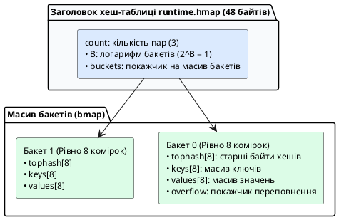

::

**Як працює пошук у карті:**

1. Алгоритм хешування обчислює 64-бітний хеш переданого ключа.
2. Молодші біти хешу визначають **номер бакета** у масиві.
3. Кожен бакет `bmap` містить фіксований масив **`tophash` на 8 байтів**. Go спочатку швидко сканує `tophash` на рівні регістрів процесора.
4. Тільки при збігу байта `tophash` Go порівнює реальний ключ через `==`.
5. Якщо бакет заповнюється (понад 8 пар), Go створює ланцюжок через покажчик `overflow`.
6. При зростанні коефіцієнта навантаження (_Load Factor_ > 6.5) Go автоматично виконує фоновий **рехешинг**, поступово переносячи дані у вдвічі більший масив бакетів.

---

### Критичні правила безпеки при роботі з картами

::important

1. **Карта завжди передається за посиланням:**
   Оскільки змінна `map` є покажчиком на `hmap`, зміна карти всередині будь-якої функції завжди мутує оригінальну карту без потреби передавати покажчик `*map`.
2. **Заборона взяття адреси елемента карти (`&m[key]`):**
   Вираз `p := &userRoles["alex"]` є **помилкою компілятора** (`cannot take the address of userRoles["alex"]`). Оскільки при динамічному рехешингу бакети переміщуються в пам'яті, збережений покажчик миттєво став би невалідним.
3. **Небезпека гонитви даних (_Race Condition_):**
   Вбудована карта в Go **не є потокобезпечною**. Якщо одна горутина читає карту, а інша в цей самий момент записує в неї дані без синхронізації, Go Runtime аварійно завершить процес неперехоплюваною фатальною помилкою: `fatal error: concurrent map read and map write`. Для багатопотокового доступу слід використовувати `sync.RWMutex` або `sync.Map`.

::

---

## Обробка помилок та відкладене виконання

### Частина 1: Обробка помилок у Go

#### Філософія Go: помилки як значення

У Go **немає винятків** (exceptions) як у Java, Python або C#. Замість цього Go використовує **помилки як значення** — спеціальний тип `error`, який повертається з функцій разом із результатом.

**Філософія:** помилка — це нормальна частина виконання програми, а не щось виняткове. Тому її треба обробляти явно.

### Інтерфейс `error`: помилка як значення

#### Порівняння Go і Java

::tabs

::tabs-item{label="Java — винятки" icon="i-simple-icons-openjdk"}

```java
import java.io.*;

public class FileExample {
    // Метод ДЕКЛАРУЄ що може викинути виняток
    public static String readFile(String path) throws IOException {
        BufferedReader reader = new BufferedReader(
            new FileReader(path)
        );
        
        try {
            return reader.readLine();
        } finally {
            reader.close();  // Завжди закриваємо
        }
    }
    
    public static void main(String[] args) {
        try {
            // Обгортаємо виклик у try-catch
            String content = readFile("config.txt");
            System.out.println("Вміст: " + content);
        } catch (FileNotFoundException e) {
            System.err.println("Файл не знайдено");
        } catch (IOException e) {
            System.err.println("Помилка читання");
        }
    }
}
```

**Як працює в Java:**
- Метод декларує `throws IOException`
- Виклик обгортається в `try-catch`
- Виняток "летить вгору" по стеку
- Якщо не спіймати — програма падає
- `finally` виконується завжди

::

::tabs-item{label="Go — помилки як значення" icon="i-simple-icons-go"}

```go
package main

import (
    "fmt"
    "os"
)

// Функція повертає (результат, помилку)
func readFile(path string) (string, error) {
    file, err := os.Open(path)
    if err != nil {
        // Повертаємо помилку як значення
        return "", err
    }
    defer file.Close()  // Відкладене закриття
    
    buffer := make([]byte, 1024)
    n, err := file.Read(buffer)
    if err != nil {
        return "", err
    }
    
    return string(buffer[:n]), nil  // nil = немає помилки
}

func main() {
    content, err := readFile("config.txt")
    if err != nil {
        // Явна перевірка помилки
        fmt.Println("Помилка:", err)
        return
    }
    
    fmt.Println("Вміст:", content)
}
```

**Як працює в Go:**
- Функція повертає два значення
- Перевіряємо `if err != nil`
- Помилка не "летить", а повертається
- Якщо не перевірити — проігноровано
- `defer` для cleanup

::

::

**Таблиця відмінностей:**

| Аспект | Java | Go |
|--------|------|-----|
| **Механізм** | Винятки (exceptions) | Значення (values) |
| **Синтаксис** | `try-catch-finally` | `if err != nil` |
| **Декларація** | `throws Exception` | `(T, error)` |
| **Примусовість** | Checked — так | Ні |
| **"Політ вгору"** | Так (stack unwinding) | Ні |
| **Продуктивність** | Повільніше | Швидше |
| **Cleanup** | `finally` | `defer` |

**Контекст:** у клієнт-серверному коді кожен виклик `os.Open`, `json.Marshal`, `sql.Query` може не вдатися (немає файлу, обірвано мережу). Go змушує перевіряти це явно, повертаючи помилку як **останнє** значення.

#### Що таке тип `error`?

**Внутрішній механізм:** `error` — це вбудований інтерфейс (інтерфейси детально — в наступній лекції, поки достатньо знати що це «тип з методом `Error() string`»):

```go
type error interface {
    Error() string  // Повертає текст помилки
}
```

Будь-який тип з методом `Error() string` є `error`. 

**Найпростіший спосіб створити помилку:**

```go
package main

import (
    "errors"
    "fmt"
)

func main() {
    // Створення помилки
    err := errors.New("щось пішло не так")
    
    // Виведення
    fmt.Println(err)          // "щось пішло не так"
    fmt.Println(err.Error())  // те саме
}
```

На цьому етапі створюйте через `errors.New("...")`. Далі розглянемо `fmt.Errorf("...: %w", err)` та `errors.Is/As` для обгортання.

```go
func safeDivide(a, b float64) (float64, error) {
    if b == 0 {
        return 0, errors.New("ділення на нуль неможливе")
    }
    return a / b, nil // nil — відсутність помилки (немає heap алокації)
}

val, err := safeDivide(10, 0)
if err != nil {
    log.Printf("помилка: %v", err) // явна перевірка — немає прихованих винятків
    return err
}
fmt.Println(val)
```

::tip
**Проста теорія наперед:** завжди пишіть `if err != nil { return err }` одразу після виклику. Поки що достатньо цього. `fmt.Errorf("open %s: %w", path, err)` з `%w` та `errors.Is` — для наступних лекцій про шари `UseCase → Repository`.
::

**Trade-off vs винятки:** явний `error` робить шлях помилки видимим у сигнатурі (`(User, error)`), але вимагає дисципліни — `go vet` не ловить ігнорування `_, _ = f()`.

#### Базові приклади обробки помилок

**1. Проста функція з помилкою:**

```go
package main

import (
    "errors"
    "fmt"
)

func divide(a, b float64) (float64, error) {
    if b == 0 {
        return 0, errors.New("ділення на нуль")
    }
    return a / b, nil  // nil означає "немає помилки"
}

func main() {
    // Успішний виклик
    result, err := divide(10, 2)
    if err != nil {
        fmt.Println("Помилка:", err)
        return
    }
    fmt.Println("Результат:", result)  // 5
    
    // Виклик з помилкою
    result, err = divide(10, 0)
    if err != nil {
        fmt.Println("Помилка:", err)  // "ділення на нуль"
        return
    }
}
```

**2. Форматування помилок з контекстом через `fmt.Errorf()`:**

```go
package main

import "fmt"

func readConfig(filename string) (map[string]string, error) {
    if filename == "" {
        return nil, fmt.Errorf("ім'я файлу не може бути порожнім")
    }
    
    // Симулюємо помилку з контекстом
    return nil, fmt.Errorf("не вдалося відкрити файл %s: файл не існує", filename)
}

func main() {
    config, err := readConfig("config.yaml")
    if err != nil {
        fmt.Println("Помилка:", err)
        // Виведе: "не вдалося відкрити файл config.yaml: файл не існує"
        return
    }
    
    fmt.Println("Конфіг:", config)
}
```

**3. Ланцюжок помилок через `%w` (wrapping):**

```go
package main

import (
    "fmt"
    "os"
)

func loadData(filename string) ([]byte, error) {
    data, err := os.ReadFile(filename)
    if err != nil {
        // %w зберігає оригінальну помилку
        return nil, fmt.Errorf("loadData: %w", err)
    }
    return data, nil
}

func processFile(filename string) error {
    data, err := loadData(filename)
    if err != nil {
        // Ще один рівень обгортання
        return fmt.Errorf("processFile: %w", err)
    }
    
    fmt.Printf("Завантажено %d байт\n", len(data))
    return nil
}

func main() {
    err := processFile("data.txt")
    if err != nil {
        fmt.Println("Помилка:", err)
        // Виведе весь ланцюжок:
        // "processFile: loadData: open data.txt: no such file or directory"
    }
}
```

::callout{icon="i-lucide-info"}
**`%w` vs `%v` у `fmt.Errorf`:**

- **`%v`** — форматує помилку як текст (оригінальна помилка втрачається)
- **`%w`** — обгортає помилку (зберігає оригінал для пізнішої перевірки)

```go
// Без обгортання — оригінал втрачено
err1 := fmt.Errorf("помилка: %v", originalErr)

// З обгортанням — оригінал збережено
err2 := fmt.Errorf("помилка: %w", originalErr)
```

Обгортання дозволяє перевіряти первинну помилку через `errors.Is()` або `errors.As()`.
::

#### Патерни обробки помилок

**1. Ранній вихід (early return) — найпопулярніший:**

```go
func processUser(id int) error {
    user, err := getUserFromDB(id)
    if err != nil {
        return err  // Одразу виходимо
    }
    
    email, err := getEmailFromAPI(user.Email)
    if err != nil {
        return err  // Одразу виходимо
    }
    
    err = sendNotification(email)
    if err != nil {
        return err  // Одразу виходимо
    }
    
    return nil  // Успіх
}
```

**Переваги:**
- Лінійний код без вкладеності
- Легко читати зверху вниз
- Явний контроль потоку

**2. Логування і продовження:**

```go
func processItems(items []Item) {
    for _, item := range items {
        err := processItem(item)
        if err != nil {
            // Логуємо, але продовжуємо
            log.Printf("Помилка обробки %v: %v", item.ID, err)
            continue
        }
    }
}
```

**3. Логування + повернення:**

```go
func saveUser(user User) error {
    err := db.Save(user)
    if err != nil {
        log.Printf("Не вдалося зберегти %d: %v", user.ID, err)
        return fmt.Errorf("saveUser: %w", err)
    }
    return nil
}
```

---

### Частина 2: Відкладене виконання (`defer`)

### `defer`: стек відкладених викликів

#### Що таке `defer`?

**`defer`** — це механізм, який дозволяє відкласти виконання функції до моменту **виходу з поточної функції**. Це гарантує, що певний код виконається завжди, навіть якщо функція завершилася з помилкою.

**Призначення:** автоматичне звільнення ресурсів (закриття файлів, з'єднань, розблокування mutex).

#### Порівняння з Java

::tabs

::tabs-item{label="Java — try-finally" icon="i-simple-icons-openjdk"}

```java
import java.io.*;

public class FileExample {
    public static void readFile(String path) throws IOException {
        BufferedReader reader = null;
        
        try {
            reader = new BufferedReader(new FileReader(path));
            String line = reader.readLine();
            System.out.println(line);
            
        } finally {
            // Закриття ЗАВЖДИ виконується
            if (reader != null) {
                reader.close();
            }
        }
    }
}
```

**У Java:**
- Блок `finally` в кінці
- Треба перевіряти `null`
- Один блок на весь `try`

::

::tabs-item{label="Go — defer" icon="i-simple-icons-go"}

```go
package main

import (
    "fmt"
    "os"
)

func readFile(path string) error {
    file, err := os.Open(path)
    if err != nil {
        return err
    }
    defer file.Close()  // Закриється при виході
    
    buffer := make([]byte, 1024)
    n, err := file.Read(buffer)
    if err != nil {
        return err  // defer виконається!
    }
    
    fmt.Println(string(buffer[:n]))
    return nil
}
```

**У Go:**
- `defer` поруч з отриманням ресурсу
- Не треба перевіряти `nil`
- Можна багато `defer`

::

::

#### LIFO порядок (Last In, First Out)

Якщо є кілька `defer`, вони виконуються в **зворотному порядку**:

```go
package main

import "fmt"

func main() {
    fmt.Println("Початок")
    
    defer fmt.Println("defer 1")
    defer fmt.Println("defer 2")
    defer fmt.Println("defer 3")
    
    fmt.Println("Кінець")
}
```

**Вивід:**
```
Початок
Кінець
defer 3
defer 2
defer 1
```

**Візуалізація:**

::plant-uml{alt="Стек defer - LIFO"}

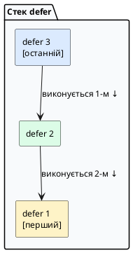

::

#### Важлива особливість: аргументи обчислюються одразу

```go
package main

import "fmt"

func main() {
    x := 10
    defer fmt.Println("x =", x)  // x=10 зберігається ЗАРАЗ
    
    x = 20
    fmt.Println("main x =", x)
}
```

**Вивід:**
```
main x = 20
x = 10
```

Значення `x` було скопійоване в момент `defer`!

#### Типові use cases

**1. Закриття файлу:**

```go
file, err := os.Open("file.txt")
if err != nil {
    return err
}
defer file.Close()
```

**2. Закриття HTTP Body:**

```go
resp, err := http.Get(url)
if err != nil {
    return err
}
defer resp.Body.Close()
```

**3. Розблокування mutex:**

```go
mu.Lock()
defer mu.Unlock()

// Критична секція
```

**4. Вимірювання часу:**

```go
func process() {
    start := time.Now()
    defer func() {
        fmt.Printf("Час: %v\n", time.Since(start))
    }()
    
    // Логіка
}
```

::caution
**Пастка: defer у циклі!**

```go
// ❌ ПОГАНО — усі файли закриються лише при виході з функції
for _, filename := range files {
    f, _ := os.Open(filename)
    defer f.Close()  // Накопичується в пам'яті!
}

// ✅ ДОБРЕ — використати анонімну функцію
for _, filename := range files {
    func() {
        f, _ := os.Open(filename)
        defer f.Close()  // Закриється після кожної ітерації
        // Обробка файлу
    }()
}
```
::

**Контекст:** сокет `net.Conn`, файл `os.File`, `rows.Close()` повинні закритися **гарантовано**, навіть якщо функція повертає помилку посередині. `defer` — це «finally» Go, але зі стековою семантикою.

**Внутрішній механізм:** кожен `defer` поміщає виклик у **стек фрейму горутини** (LIFO — останній доданий виконується першим). Аргументи обчислюються **в момент `defer`**, а не в момент виконання:

```go
func processConn(conn net.Conn) error {
    defer conn.Close() // 1) закриється останнім, навіть при return err
    defer log.Println("завершено") // 2) виконається першим при виході (LIFO)

    buf := make([]byte, 4096)
    n, err := conn.Read(buf)
    if err != nil {
        return err // обидва defer все одно виконаються!
    }

    // Пастка для допитливих: аргументи копіюються зараз
    for i := 0; i < 3; i++ {
        defer fmt.Println(i) // надрукує 2,1,0 — i скопійовано в момент defer
    }
    return nil
}

::note
**Поки що достатньо:** `defer f.Close()` закриє файл при виході. Приклад нижче про `named return` — для допитливих, можна пропустити.
::

func withNamedReturn() (result int, err error) {
    defer func() {
        if err != nil {
            result = -1 // мутація named return після return — просунутий прийом
        }
    }()
    result = 42
    err = errors.New("щось пішло не так")
    return // naked return → defer бачить result=42, err!=nil → result=-1
}
```

::plant-uml{alt="Стек defer у фреймі горутини (LIFO)"}

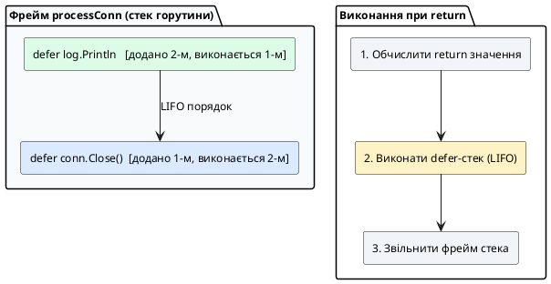

::

::caution
**Де не ставити `defer` в циклі:** `for _, f := range files { defer f.Close() }` — закриє всі файли лише при виході з **функції**, а не ітерації, вичерпавши дескриптори. Використовуйте анонімну функцію `func(){ f, _ := os.Open(...); defer f.Close(); ... }()` або явний `f.Close()` в циклі.
::

**Зв'язок з пам'яттю:** `defer` зберігається у фреймі стека горутини (2 КБ початково, динамічно росте — див. лекцію 01 про горутини), тому тисячі `defer` у циклі — це тиск на стек та GC. Для гарячих шляхів бекенду уникайте зайвих `defer` всередині `for`.

---

## Питання для самоперевірки та закріплення знань

::card-group

::card{title="1. Чому Go не має прихованого приведення типів?" icon="i-lucide-help-circle"}
Go виключає неявні перетворення типів задля абсолютної передбачуваності та безпеки системного коду на етапі компіляції. Будь-яке змішування числових типів різної розрядності (наприклад, `int32` та `int64`) вимагає явного приведення `int64(x)`.
::

::card{title="2. Чому розмір масиву [4]int є частиною його типу?" icon="i-lucide-help-circle"}
Масив є фіксованим монолітним блоком пам'яті. Компілятор заздалегідь виділяє точну кількість байтів на стеку. Масиви різного розміру несумісні за типом, що забезпечує апаратну швидкодію та захист від виходу за межі пам'яті.
::

::card{title="3. Що відбувається всередині середовища виконання при виклику append()?" icon="i-lucide-help-circle"}
Якщо зріз має вільний резерв місткості (`len < cap`), елемент записується в існуючий масив. Якщо `len == cap`, функція `runtime.growslice` виділяє в купі новий удвічі більший базовий масив, копіює туди старі дані, додає нові та повертає новий дескриптор `SliceHeader`.
::

::card{title="4. Чому спроба взяти адресу елемента карти є помилкою компіляції?" icon="i-lucide-help-circle"}
Карта є динамічною хеш-таблицею. При додаванні нових елементів Go автоматично виконує рехешинг та евакуацію бакетів у нові комірки пам'яті, що зробило б збережену адресу недійсною.
::

::card{title="5. Чому порядок range по карті випадковий?" icon="i-lucide-help-circle"}
Go рандомізує стартовий бакет при кожному `range` навмисно з Go 1.0, щоб код не залежав від порядку хешування. Для детермінованого виводу відсортуйте ключі: `keys := ...; sort.Strings(keys)`.
::

::card{title="6. Коли defer виконається при return?" icon="i-lucide-help-circle"}
`defer` виконується після обчислення `return` значень, але до звільнення фрейму стека (LIFO). Він бачить і може мутувати іменовані `return` змінні, тому ідеальний для `conn.Close()` та логування помилок.
::

::card{title="7. Чому var m map[string]int; m[k]=1 панікує?" icon="i-lucide-help-circle"}
`var m map[string]int` — це `nil` дескриптор `hmap` без бакетів. Читання повертає zero value, але запис вимагає ініціалізованого `hmap` через `make` або літерал `map[string]int{}`.
::

::
