# Інтерфейси та модель конкурентності мови Go

::card-group

::card{title="🎯 Навчальні цілі" icon="i-lucide-graduation-cap"}

- Зрозуміти, яку інженерну проблему вирішують інтерфейси (_interfaces_) і чому Go свідомо відмовився від класичного наслідування на користь композиції та контрактів поведінки.
- Опанувати механізм неявної реалізації інтерфейсів (_implicit implementation_) та принцип качиної типізації (_duck typing_), а також навчитися працювати з порожнім інтерфейсом `any`.
- Оволодіти безпечними прийомами приведення типів: перевіркою через Type Assertion (форма «кома, ок») та багатогілковим Type Switch.
- Розпізнавати класичну пастку типізованого `nil`-інтерфейса, яка є джерелом прихованих помилок навіть у досвідчених розробників.
- Зрозуміти фундаментальну відмінність між моделлю конкурентності CSP (_Communicating Sequential Processes_), яку сповідує Go, та класичною моделлю спільної пам'яті з потоками та блокуваннями (Java, C#).
- Навчитися створювати горутини (_goroutines_), розуміти внутрішню будову планувальника GMP та природу стану гонитви (_race condition_).
- Опанувати канали (`chan`) як основний засіб безпечної передачі даних між горутинами, а також оператор `select` для мультиплексування декількох каналів.
- Вивчити примітиви синхронізації пакета `sync` (`Mutex`, `RWMutex`, `WaitGroup`, `Once`), атомарні операції `sync/atomic` та пакет `context` для керування життєвим циклом конкурентних операцій.

::

::card{title="🛠️ Технологічний стек" icon="i-lucide-cpu"}

- **Мова:** Go 1.22+
- **Інструменти діагностики:** `go run -race`, `go vet`, `GODEBUG=schedtrace=1000`
- **Пакети стандартної бібліотеки:** `sync`, `sync/atomic`, `context`, `time`

::

::

---

## Від жорсткої ієрархії до гнучких контрактів поведінки

У попередній лекції ми детально розглянули, як мова Go організовує дані: структури (`struct`), композицію через вбудовування (_embedding_) та методи, прив'язані до одержувача (_receiver_). Наприкінці того матеріалу ми побіжно натрапили на приклад із твариною-пінгвіном, який успадкував від базового класу метод `fly()`, хоча фізично літати не вміє. Саме цей приклад демонструє глибшу архітектурну проблему, яку більшість об'єктно-орієнтованих мов вирішують незадовільно: **як описати спільну поведінку між різнорідними типами, не змушуючи їх ставати частиною однієї жорсткої ієрархії класів?**

### Проблема класичного наслідування

У мовах на кшталт Java або C# полiморфізм традиційно будується навколо ієрархії класів: базовий клас `Animal` оголошує метод `Fly()`, а похідні класи `Duck` та `Penguin` успадковують цей метод, обираючи (або ні) перевизначити його реалізацію. Ця модель має декілька системних вад, які особливо гостро проявляються під час проєктування великих серверних систем:

1. **Жорстке зв'язування з батьківським типом.** Похідний клас завжди фізично залежить від коду базового класу. Якщо базовий клас з часом зміниться, це може непередбачувано вплинути на всі похідні типи — навіть ті, що концептуально не мали жодного стосунку до зміненої поведінки.
2. **Проблема невідповідної поведінки (_Liskov Substitution Violation_).** Пінгвін технічно є твариною, але, успадкувавши метод `Fly()`, він змушений або кинути виключення під час виконання, або мовчки нічого не робити — обидва варіанти є пасткою для розробника, що викликає цей метод, розраховуючи на коректну поведінку.
3. **Заборона множинного наслідування.** Практично жодна сучасна мова не дозволяє класу успадкувати реалізацію одразу від двох батьківських класів через невирішувану проблему «діамантового успадкування» (_diamond problem_): якщо обидва батьківські класи мають метод з однаковим ім'ям, компілятор не може однозначно визначити, яку саме реалізацію слід використати.

Мова Go підходить до цієї проблеми принципово інакше. Творці мови свідомо **вилучили ключове слово `extends`** із синтаксису та повністю відмовились від класичного наслідування реалізації між типами. Натомість Go пропонує розділити два окремі питання: «що структура вміє робити» (тобто контракт поведінки) та «як саме вона це робить» (тобто конкретна реалізація). Інструментом для опису першого питання і виступає **інтерфейс**.

::note
**Місток із попередньої лекції:** пригадайте приклад `Eater`, `Flyer`, `Swimmer` для тварин Duck і Penguin. Там ми лише побіжно показали синтаксис `type X interface { ... }`, щоб проілюструвати композицію замість наслідування. У цій лекції ми розберемо інтерфейси системно: як вони влаштовані зсередини, чому реалізація завжди неявна, і як безпечно дізнатися конкретний тип значення, що ховається за інтерфейсом.
::

---

## Інтерфейс як контракт поведінки: анатомія та синтаксис

**Синтаксис:**

```go
type ІмʼяІнтерфейсу interface {
    Метод1(параметри) типРезультату
    Метод2(параметри) (тип1, тип2)
}
```

**Простий приклад:**

```go
type Greeter interface {
    Greet() string
}

type English struct{}

func (English) Greet() string { return "Hello!" }

var g Greeter = English{}
fmt.Println(g.Greet()) // Hello!
```

**Інтерфейс (_interface_)** у мові Go — це тип, який не описує жодних даних, а лише перелічує набір сигнатур методів, якими повинен володіти будь-який конкретний тип, щоб вважатися таким, що «задовольняє» цей інтерфейс (_satisfies the interface_). Інакше кажучи, інтерфейс — це список вимог до поведінки, повністю відокремлений від того, як саме ця поведінка буде реалізована.

Синтаксично оголошення інтерфейсу дуже схоже на оголошення структури, але замість полів даних всередині фігурних дужок перелічуються сигнатури методів — без тіла функції, лише ім'я методу, список параметрів та тип результату:

```go
type Notifier interface {
    Send(message string) error
}
```

Це оголошення варто прочитати так: _«Будь-який тип, що надає метод `Send`, який приймає рядок і повертає `error`, автоматично вважається реалізацією інтерфейсу `Notifier`»_. Зверніть увагу на ключове слово «автоматично» — до цього моменту ми ще жодного разу не написали слова на кшталт `implements Notifier`, і це не помилка, а фундаментальна риса дизайну мови, яку ми детально розглянемо в наступному розділі.

Інтерфейси можуть містити довільну кількість методів. Що важливіше — у якісно спроєктованому Go-коді інтерфейси зазвичай **дуже маленькі**, часто з одним-двома методами. Це прямо суперечить інтуїції розробників, що прийшли з Java чи C#, де інтерфейси на кшталт `IRepository` чи `IUserService` можуть містити десятки методів. Заглянемо у стандартну бібліотеку Go — інтерфейс `io.Writer`, один з найуживаніших інтерфейсів в усій екосистемі, виглядає так:

```go
type Writer interface {
    Write(p []byte) (n int, err error)
}
```

Лише один метод! Проте саме завдяки такому мінімалізму цей інтерфейс однаково успішно реалізують файли на диску (`*os.File`), мережеві з'єднання (`net.Conn`), буфери в пам'яті (`*bytes.Buffer`), тіла HTTP-відповідей (`http.ResponseWriter`) і навіть стиснені потоки (`gzip.Writer`). Чим менший контракт — тим більше різнорідних типів здатні йому відповідати, і тим гнучкішим стає код, який приймає такий інтерфейс як параметр.

::tip
**Практичне правило проєктування (Interface Segregation):** формулюйте інтерфейси виходячи з потреб коду, який їх **споживає**, а не з можливостей типу, який їх **реалізує**. Якщо функції потрібно лише записати байти, приймайте параметр типу `io.Writer`, а не конкретний `*os.File` — тоді цю саму функцію можна буде використати і для запису у файл, і в мережевий сокет, і в буфер для модульного тестування.
::

---

## Неявна реалізація та качинна типізація (Duck Typing)

Найбільш незвична для новачків риса інтерфейсів Go полягає в тому, що **жоден тип ніколи явно не оголошує намір реалізувати конкретний інтерфейс**. У Java чи C# розробник зобов'язаний написати `class FileLogger implements Notifier` або `class FileLogger : INotifier`, і компілятор одразу перевірить, чи справді клас реалізував усі оголошені методи. У Go такого синтаксису **не існує в принципі** — компілятор Go визначає відповідність структури інтерфейсу повністю автоматично, виключно аналізуючи набір методів, які ця структура фактично має.

Такий підхід називають **качинна типізацією** (_duck typing_), відсилаючись до відомого афоризму: _«Якщо це виглядає як качка, плаває як качка і крякає як качка — то це, ймовірно, і є качка»_. У контексті типізації це означає: компілятору не важливо, яким іменем названий тип і в якому файлі він описаний — важливо лише, чи має він методи з потрібними сигнатурами.

```go
type Notifier interface {
    Send(message string) error
}

// EmailSender ніде не згадує слово "Notifier"
type EmailSender struct {
    SMTPHost string
}

func (e EmailSender) Send(message string) error {
    fmt.Printf("Відправка email через %s: %s\n", e.SMTPHost, message)
    return nil
}

// SMSSender так само не оголошує жодного зв'язку з Notifier
type SMSSender struct {
    APIKey string
}

func (s SMSSender) Send(message string) error {
    fmt.Printf("Відправка SMS: %s\n", message)
    return nil
}

// Проте обидва типи можуть використовуватися там, де очікується Notifier
func broadcast(notifiers []Notifier, message string) {
    for _, n := range notifiers {
        n.Send(message)
    }
}

func main() {
    channels := []Notifier{
        EmailSender{SMTPHost: "smtp.kostyl.dev"},
        SMSSender{APIKey: "secret-key"},
    }
    broadcast(channels, "Сервер перезапущено")
}
```

Компілятор Go під час компіляції функції `broadcast` перевіряє єдине: чи має тип `EmailSender` метод `Send(string) error`, і чи має такий самий метод тип `SMSSender`. Оскільки обидва типи мають відповідний метод із точно збіжною сигнатурою, обидва автоматично «задовольняють» інтерфейс `Notifier` — без жодного явного оголошення, без імпорту пакета, де описаний інтерфейс, і навіть без знання про існування цього інтерфейсу в момент написання структур `EmailSender` і `SMSSender`.

::plant-uml{alt="Неявна реалізація інтерфейсу у Go"}

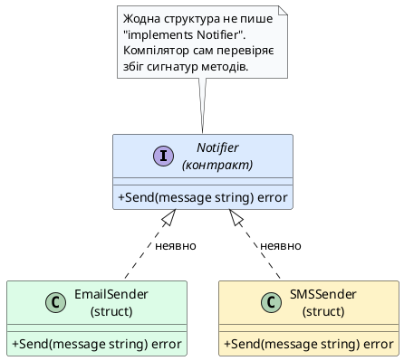

::

Ця архітектурна риса приносить кілька відчутних інженерних переваг, критично важливих саме для клієнт-серверних систем. По-перше, вона дозволяє **визначати інтерфейс уже після того**, як тип був написаний — типова ситуація, коли ви створюєте адаптер для стороннього пакета, метод якого ви не можете змінити, але який структурно вже відповідає потрібному вам контракту. По-друге, вона усуває циклічні залежності між пакетами: пакет, що споживає інтерфейс, і пакет, що реалізує конкретний тип, можуть взагалі не знати про існування одне одного, якщо третій, «нейтральний» пакет оголошує сам інтерфейс.

::note
**А що, якщо два різні пакети незалежно оголосять однаковий інтерфейс `Send(string) error` під різними іменами?** Це абсолютно нормально й навіть заохочується у Go. Оскільки перевірка відповідності структурна, а не номінальна, той самий тип `EmailSender` зможе одночасно задовольняти й `mail.Notifier`, і `alerting.MessageSender` — за умови ідентичного набору сигнатур методів.
::

---

## Композиція інтерфейсів: складання великих контрактів із малих

**Синтаксис:**

```go
type Комбінований interface {
    Інтерфейс1
    Інтерфейс2
}
```

**Простий приклад:**

```go
type Named interface{ Name() string }
type Aged interface{ Age() int }

// Person вимагає обидва методи одразу
type Person interface {
    Named
    Aged
}
```

Раз інтерфейси в Go настільки виграють від малого розміру, постає практичне запитання: як тоді описати сутність, яка справді повинна вміти декілька різних речей одразу? Відповідь — **вбудовування інтерфейсів одне в одного** (_interface embedding_), синтаксично ідентичне вбудовуванню структур, яке ми розглядали в попередній лекції. Класичний приклад зі стандартної бібліотеки — інтерфейс `io.ReadWriter`, який складається із двох раніше окремо визначених інтерфейсів:

```go
type Reader interface {
    Read(p []byte) (n int, err error)
}

type Writer interface {
    Write(p []byte) (n int, err error)
}

// ReadWriter — це композиція двох маленьких інтерфейсів
type ReadWriter interface {
    Reader
    Writer
}
```

Будь-який тип, що реалізує обидва методи, `Read` і `Write`, автоматично задовольняє й `ReadWriter`, хоча ніде явно не згадує це складене ім'я — той самий принцип неявної реалізації, який ми обговорили вище, просто застосований до складенішого контракту. Мережеве з'єднання `net.Conn`, наприклад, реалізує саме таку комбінацію методів — воно одночасно і читає, і записує байти в мережевий сокет.

Ще один хрестоматійний приклад малого інтерфейсу зі стандартної бібліотеки — `sort.Interface`, який дозволяє функції `sort.Sort` впорядкувати **будь-яку** колекцію, не знаючи наперед, чи це зріз чисел, рядків, чи структур:

```go
type Interface interface {
    Len() int
    Less(i, j int) bool
    Swap(i, j int)
}
```

Щоб відсортувати власний зріз структур `[]Employee` за зарплатою, достатньо реалізувати ці три методи для типу-обгортки над зрізом — і функція `sort.Sort` зможе відсортувати будь-які дані, що надають лише ці три елементарні операції, без жодного знання про внутрішню будову структури `Employee`.

::plant-uml{alt="Композиція інтерфейсів через вбудовування"}

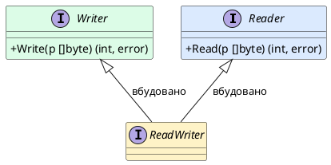

::

::tip
**Правило композиції:** якщо ловите себе на думці «цьому інтерфейсу потрібно ще пару методів для нового сценарію», зазвичай краще оголосити **новий**, окремий вузький інтерфейс і скомпонувати його з наявним через вбудовування, ніж роздувати вже наявний інтерфейс — так існуючий код, що використовує старий вузький контракт, продовжить працювати без жодних змін.
::

---

## Набори методів: чому pointer receiver іноді порушує реалізацію інтерфейсу

**Синтаксис:**

```go
func (v Тип) МетодЗначення()   { /* value receiver */ }
func (p *Тип) МетодПокажчика() { /* pointer receiver */ }
```

**Простий приклад:**

```go
type Counter struct{ n int }

func (c *Counter) Inc() { c.n++ } // pointer receiver

c := Counter{}
c.Inc()
fmt.Println(c.n) // 1
```

Кожен тип у Go має власний **набір методів** (_method set_) — перелік усіх методів, які можна викликати на значенні цього типу. Проте це правило приховує важливий нюанс, пов'язаний із різницею між методами на значенні (_value receiver_, `func (e Employee) ...`) та методами на покажчику (_pointer receiver_, `func (e *Employee) ...`), яку ми детально розглядали в лекції про структури й методи.

Правило формулюється так: **набір методів типу `T` включає лише методи, оголошені з отримувачем `T`; натомість набір методів типу `*T` включає методи, оголошені і з отримувачем `T`, і з отримувачем `*T`.** Це означає, що значення типу `T` (без покажчика) **не** задовольняє інтерфейс, якщо хоча б один із потрібних методів оголошений з отримувачем-покажчиком:

```go
type Notifier interface {
    Send(message string) error
}

type SlackSender struct {
    channel string
}

// Метод оголошено з отримувачем-покажчиком *SlackSender
func (s *SlackSender) Send(message string) error {
    fmt.Println("Slack:", message)
    return nil
}

func broadcast(n Notifier) {
    n.Send("Деплой завершено")
}

func main() {
    sender := SlackSender{channel: "#devops"}

    broadcast(&sender) // ✅ компілюється: *SlackSender має метод Send
    // broadcast(sender)  // ❌ помилка компіляції!
    // "SlackSender does not implement Notifier (method Send has pointer receiver)"
}
```

Причина цього обмеження суто практична й пов'язана з безпекою пам'яті: якщо метод `Send` має отримувач-покажчик `*SlackSender`, це зазвичай означає, що метод потенційно **змінює** внутрішній стан структури. Якби компілятор дозволив передати `broadcast(sender)` (тобто копію значення), викликаний усередині функції метод `Send` міг би модифікувати лише тимчасову копію структури, приховану всередині інтерфейсного значення, — а виклик коду зовні ніколи б не побачив цих змін, що суперечило б інтуїтивному очікуванню розробника. Тому компілятор ще на етапі збірки забороняє таку небезпечну неоднозначність.

::plant-uml{alt="Набори методів: T проти \*T"}

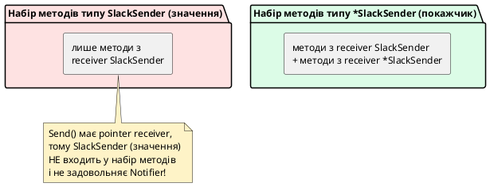

::

::warning
**Практичне правило вибору отримувача:** якщо структура має **хоча б один** метод з отримувачем-покажчиком (типова ситуація, коли метод змінює поле структури), послідовно оголошуйте **всі** методи цієї структури з отримувачем-покажчиком, а не змішуйте `T` і `*T` в одному типі. Це усуває плутанину з наборами методів і гарантує, що структура однаково поводиться незалежно від того, який метод викликається першим.
::

---

## Порожній інтерфейс `any`: контейнер для будь-якого значення

**Синтаксис:**

```go
var x any          // сучасний запис (з Go 1.18)
var y interface{}  // еквівалентний старий запис
```

**Простий приклад:**

```go
var x any = 42
x = "тепер рядок"
x = true
fmt.Println(x) // true
```

Логічним продовженням ідеї структурної типізації є запитання: а що, якщо інтерфейс не вимагає **жодного** методу? Такий інтерфейс формально записується як `interface{}` — порожні фігурні дужки без жодної сигнатури всередині. Оскільки список вимог порожній, буквально **будь-який тип** у мові Go (числа, рядки, структури, зрізи, покажчики, навіть інші інтерфейси) автоматично задовольняє такий контракт, адже виконати «нуль вимог» може все, що завгодно.

Через надзвичайну поширеність цієї конструкції, починаючи з версії Go 1.18, у стандартній бібліотеці зафіксовано зручний псевдонім типу:

```go
type any = interface{}
```

Це означає, що `any` та `interface{}` — це буквально один і той самий тип, і ви побачите обидва варіанти запису в реальному коді (сучасний стиль рекомендує саме коротке `any`). Класичний приклад використання порожнього інтерфейсу — сигнатура функції `fmt.Println`, яка повинна вміти прийняти для виведення значення абсолютно будь-якого типу:

```go
func Println(a ...any) (n int, err error)
```

Порожній інтерфейс широко застосовується там, де функція за своєю природою мусить працювати з довільними даними без знання їхнього конкретного типу під час компіляції — наприклад, у логерах загального призначення, серіалізаторах JSON (`json.Unmarshal` часто приймає `map[string]any` для розбору структури невідомого наперед документа) чи узагальнених контейнерах на кшталт кешу.

```go
type Cache struct {
    data map[string]any
}

func (c *Cache) Set(key string, value any) {
    c.data[key] = value
}

func (c *Cache) Get(key string) any {
    return c.data[key]
}

func main() {
    cache := Cache{data: make(map[string]any)}
    cache.Set("port", 8080)
    cache.Set("hostname", "api.kostyl.dev")
    cache.Set("is_debug", true)

    // Значення "port" зберігається як any, реальний тип — int
    fmt.Println(cache.Get("port"))
}
```

Проте зручність `any` має суттєву ціну, і сумлінний інженер завжди зважує цей компроміс. По-перше, ми втрачаємо весь захист статичної типізації: компілятор більше не може перевірити на етапі збірки, чи є значення `cache.Get("port")` дійсно числом — воно офіційно має тип `any`, і будь-яка спроба виконати над ним арифметичну операцію без явного приведення типу призведе до помилки компіляції. По-друге, як ми вже з'ясовували в лекції про модель пам'яті, упаковка значення в інтерфейс майже завжди змушує це значення «втекти» з локального стека горутини в купу (_escape to heap_), оскільки інтерфейсне значення зберігає внутрішній покажчик на дані — а це додаткове навантаження на збирач сміття (_garbage collector_).

::warning
**Правило поміркованого використання `any`:** використовуйте порожній інтерфейс лише тоді, коли тип даних дійсно невідомий і непередбачуваний наперед (розбір довільного JSON, узагальнене логування, рефлексія). Якщо ж набір можливих типів обмежений і відомий заздалегідь (наприклад, лише кілька варіантів повідомлень протоколу), надавайте перевагу конкретному невеликому інтерфейсу з іменованими методами — це залишає компілятору можливість перевіряти коректність коду ще до запуску програми.
::

Оскільки значення типу `any` приховує реальний тип даних усередині «непрозорої коробки», рано чи пізно постає завдання: як безпечно дізнатися, що саме зберігається всередині, і повернути собі можливість працювати зі значенням як із конкретним типом? Відповідь на це запитання дають механізми приведення типів, до розгляду яких ми переходимо в наступному розділі.

---

## Приведення типів: Type Assertion та Type Switch

**Синтаксис:**

```go
value := x.(T)         // небезпечна форма — панікує, якщо динамічний тип x не T
value, ok := x.(T)     // безпечна форма — ok=false замість паніки
```

**Простий приклад:**

```go
var x any = "привіт"
s, ok := x.(string)
fmt.Println(s, ok) // привіт true
```

### Небезпечна форма: пряме твердження про тип

**Твердження про тип** (_Type Assertion_) — це синтаксична конструкція, яка дозволяє «розпакувати» значення інтерфейсного типу назад у конкретний тип, який реально ховається всередині. Найпростіший запис виглядає так:

```go
var data any = "hello, server"

str := data.(string) // "розпакувати" data як рядок
fmt.Println(str)      // hello, server
```

Ця конструкція виглядає безпечно рівно доти, доки припущення про тип справджується. Але що станеться, якщо всередині `data` насправді зберігається не рядок, а, наприклад, число?

```go
var data any = 42

str := data.(string) // паніка під час виконання!
```

Програма аварійно завершиться з повідомленням на кшталт `panic: interface conversion: interface {} is int, not string`. Це критична небезпека для серверного коду: одна помилково угадана перевірка типу здатна «покласти» весь застосунок посеред обробки клієнтського запиту. Саме тому однопараметрову форму твердження про тип у промисловому коді використовують вкрай рідко — переважно лише тоді, коли розробник абсолютно впевнений у реальному типі значення (наприклад, одразу після власноручного створення цього значення в тій самій функції).

### Безпечна форма: конструкція «кома, ок»

Для безпечної перевірки типу без ризику паніки Go пропонує двозначну форму твердження, яка повертає друге логічне значення — ознаку успішності перетворення:

```go
var data any = 42

str, ok := data.(string)
if !ok {
    fmt.Println("data не є рядком, це:", data)
    return
}
fmt.Println("Рядок:", str)
```

Якщо реальний тип значення `data` не відповідає запитаному типу `string`, змінна `ok` набуде значення `false`, а змінна `str` — нульового значення для типу `string` (тобто порожнього рядка), і жодної паніки не станеться. Саме ця форма — з обов'язковою перевіркою `ok` — вважається ідіоматичним і безпечним стилем роботи з твердженнями про тип у виробничому коді сервера.

::warning
**Найпоширеніша помилка новачків:** написати `str := data.(string)` без другого значення `ok` «про всяк випадок, для швидкості», а потім отримати неочікувану паніку на проді через кілька тижнів після запуску, коли клієнт надішле дані іншого формату. Завжди використовуйте форму `value, ok := x.(T)`, якщо немає стовідсоткової гарантії реального типу значення.
::

### Приведення до інтерфейсу, а не лише до конкретного типу

Твердження про тип можна виконувати не тільки для отримання конкретного типу (`string`, `int`, `*User`), а й для перевірки, чи реалізує значення **інший, вужчий інтерфейс**. Це особливо корисний прийом у мережевому програмуванні — наприклад, перевірка, чи підтримує з'єднання додаткову можливість встановлення тайм-аутів:

```go
type Closer interface {
    Close() error
}

func tryClose(w io.Writer) {
    if closer, ok := w.(Closer); ok {
        closer.Close()
        fmt.Println("Ресурс успішно закрито")
        return
    }
    fmt.Println("Цей writer не підтримує закриття")
}
```

---

## Багатогілкове приведення типу: конструкція Type Switch

**Синтаксис:**

```go
switch v := x.(type) {
case T1:
    // v має статичний тип T1
case T2:
    // v має статичний тип T2
default:
    // жоден тип не збігся, v має тип x (any)
}
```

**Простий приклад:**

```go
func printKind(x any) {
    switch x.(type) {
    case int:
        fmt.Println("число")
    case string:
        fmt.Println("рядок")
    }
}
```

Коли потрібно перевірити значення `any` не проти одного конкретного типу, а проти цілого набору можливих варіантів, повторювати конструкцію `value, ok := x.(T)` для кожного типу окремо було б громіздко. Для таких сценаріїв у Go існує спеціальна форма оператора `switch`, яка називається **Type Switch**:

```go
func describe(v any) string {
    switch value := v.(type) {
    case int:
        return fmt.Sprintf("ціле число: %d", value)
    case string:
        return fmt.Sprintf("рядок довжиною %d символів", len(value))
    case bool:
        return fmt.Sprintf("логічне значення: %t", value)
    case nil:
        return "значення відсутнє (nil)"
    default:
        return fmt.Sprintf("невідомий тип: %T", value)
    }
}
```

Зверніть увагу на спеціальний синтаксис `v.(type)` — слово `type` тут використовується буквально, а не як заповнювач конкретного типу, і працює **лише** всередині заголовка конструкції `switch`. У кожній гілці `case` змінна `value` автоматично набуває саме того конкретного типу, який зазначено в цій гілці — тобто всередині `case int:` змінна `value` вже має статичний тип `int`, і компілятор дозволяє виконувати над нею типові арифметичні операції без додаткового приведення.

Практичне застосування Type Switch у клієнт-серверних системах найчастіше зустрічається під час розбору різнотипних повідомлень одного протоколу — наприклад, коли WebSocket-з'єднання чи чергу повідомлень потрібно обробляти залежно від конкретного варіанта команди:

```go
type PingCommand struct{ Timestamp int64 }
type ChatMessage struct{ From, Text string }
type DisconnectCommand struct{ Reason string }

func handleCommand(cmd any) {
    switch c := cmd.(type) {
    case PingCommand:
        fmt.Println("Пінг отримано о:", c.Timestamp)
    case ChatMessage:
        fmt.Printf("[%s]: %s\n", c.From, c.Text)
    case DisconnectCommand:
        fmt.Println("Клієнт відключається:", c.Reason)
    default:
        fmt.Printf("Невідома команда типу %T проігнорована\n", c)
    }
}
```

::plant-uml{alt="Type Switch: маршрутизація повідомлень за конкретним типом"}

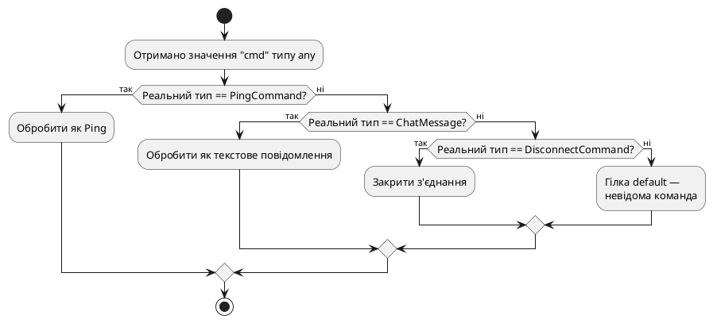

::

::tip
**Одна гілка на кілька типів:** якщо декільком типам відповідає однакова обробка, їх можна перерахувати через кому в одній гілці `case int, int64, float64:`. У такому разі змінна всередині гілки збереже статичний тип `any` (адже типи в списку різні), тож приведення до конкретного числового типу доведеться виконати додатково всередині тіла гілки.
::

---

## Небезпечна пастка: типізований `nil` проти справжнього `nil`

Один із найвідоміших та найпідступніших сюрпризів мови Go пов'язаний із внутрішньою будовою інтерфейсних значень. Щоб зрозуміти цю пастку, потрібно усвідомити важливий факт: **інтерфейсне значення в Go — це завжди пара з двох компонентів**: покажчик на конкретний тип (_type descriptor_) та покажчик на самі дані (_data pointer_). Значення інтерфейсу вважається справжнім `nil` лише тоді, коли **обидва** ці компоненти порожні.

Розгляньмо класичний приклад, що ілюструє проблему на прикладі власного типу помилки:

```go
type NotFoundError struct{ Resource string }

func (e *NotFoundError) Error() string {
    return fmt.Sprintf("%s не знайдено", e.Resource)
}

func findUser(id int) *NotFoundError {
    if id == 0 {
        return &NotFoundError{Resource: "користувач"}
    }
    return nil // виглядає як "помилки немає"
}

func process(id int) error {
    var err *NotFoundError = findUser(id)
    return err // ПАСТКА: неявне перетворення *NotFoundError -> error
}

func main() {
    result := process(1)
    if result != nil {
        fmt.Println("Отримано помилку!") // це виконається, хоча findUser повернув справжній nil!
    }
}
```

Хоча функція `findUser` повертає буквально нульовий покажчик `nil` типу `*NotFoundError`, після присвоєння цього значення змінній типу `error` всередині функції `process` результат **більше не дорівнює `nil`** під час порівняння `result != nil`. Причина в тому, що інтерфейсне значення `error` тепер містить непорожній компонент типу (`*NotFoundError`), навіть попри те, що компонент даних дійсно порожній. Порівняння інтерфейсного значення з `nil` перевіряє **обидва** внутрішні компоненти одночасно, тож пара `(тип: *NotFoundError, дані: nil)` вважається відмінною від «справжнього» `nil`, який є парою `(тип: nil, дані: nil)`.

::plant-uml{alt="Типізований nil всередині інтерфейсного значення"}

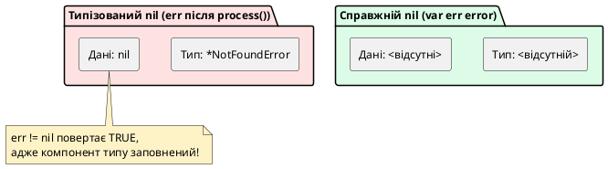

::

::caution
**Практичне правило захисту від цієї пастки:** ніколи не оголошуйте функцію так, щоб вона повертала конкретний тип покажчика на помилку (`*NotFoundError`), який потім неявно присвоюється змінній інтерфейсного типу `error`. Замість цього завжди явно оголошуйте тип результату функції як `error`, а всередині функції за відсутності помилки явно повертайте нетипізований літерал `nil`: `func findUser(id int) error { ...; return nil }`. Це найпоширеніша причина прихованих `if err != nil` спрацьовувань у реальних Go-застосунках, і на неї варто зважати з першого дня написання коду.
::

---

## Порівняння інтерфейсних значень оператором `==`

Інтерфейсні значення в Go можна порівнювати оператором `==`, і на перший погляд це працює настільки ж просто, як і для звичайних структур: два інтерфейсні значення вважаються рівними, якщо в них **однаковий динамічний тип** і **рівні динамічні значення**.

```go
type Shape interface {
    Area() float64
}

type Rectangle struct{ Width, Height float64 }

func (r Rectangle) Area() float64 { return r.Width * r.Height }

func main() {
    var a Shape = Rectangle{Width: 2, Height: 3}
    var b Shape = Rectangle{Width: 2, Height: 3}

    fmt.Println(a == b) // true: однаковий динамічний тип і рівні поля
}
```

Проте тут ховається небезпечний нюанс: якщо динамічний тип, захований усередині інтерфейсу, сам по собі **непорівнюваний** (наприклад, містить зріз, мапу чи функцію — типи, для яких оператор `==` у Go взагалі не визначений), спроба порівняти два таких інтерфейсних значення не поверне `false`, а призведе до **паніки під час виконання**:

```go
type Handler interface {
    Handle()
}

type FuncHandler struct {
    fn func() // непорівнюваний тип!
}

func (h FuncHandler) Handle() { h.fn() }

func main() {
    var a Handler = FuncHandler{fn: func() {}}
    var b Handler = FuncHandler{fn: func() {}}

    fmt.Println(a == b) // паніка під час виконання!
    // panic: runtime error: comparing uncomparable type main.FuncHandler
}
```

::caution
**Компілятор тут не допоможе.** На відміну від помилок компіляції, які ми бачили в попередніх пастках, цю проблему компілятор пропускає, оскільки статичний тип обох змінних — це просто інтерфейс `Handler`, а перевірка непорівнюваності виконується лише під час виконання, коли відомий реальний динамічний тип. Якщо структура, яку ви плануєте порівнювати через `==` (наприклад, як ключ мапи або в тестах через `reflect.DeepEqual`/`==`), містить поля-зрізи, мапи чи функції, порівнюйте її поля вручну або взагалі уникайте прямого порівняння `==` для такого типу.
::

---

## Питання для самоперевірки: інтерфейси

::accordion

::accordion-item{label="❓ Чому у Go немає ключового слова implements, як у Java чи C#?" icon="i-lucide-help-circle"}

Тому що Go використовує структурну типізацію (качину типізацію): відповідність типу інтерфейсу перевіряється компілятором автоматично, виключно на основі наявності методів із потрібними сигнатурами. Явне оголошення наміру не потрібне і навіть неможливе синтаксично — достатньо, щоб тип фактично мав усі методи, перелічені в інтерфейсі.

::

::accordion-item{label="❓ Чим небезпечна конструкція data.(string) без другого значення ok?" icon="i-lucide-help-circle"}

Якщо реальний тип значення `data` не збігається з очікуваним `string`, програма аварійно завершиться панікою під час виконання (_runtime panic_). Безпечна форма `str, ok := data.(string)` дозволяє перевірити результат перетворення без ризику падіння програми, повертаючи `ok == false` замість паніки.

::

::accordion-item{label="❓ Чому err != nil може повернути true, навіть якщо функція явно повернула nil?" icon="i-lucide-help-circle"}

Це трапляється, коли функція оголошена з конкретним типом покажчика на помилку (наприклад, `*NotFoundError`), а не з інтерфейсним типом `error`. Інтерфейсне значення складається з пари (тип, дані), і якщо компонент типу заповнений (навіть попри порожній компонент даних), таке значення вважається відмінним від справжнього `nil`. Уникнути пастки можна, завжди оголошуючи тип результату функції як `error` та явно повертаючи нетипізований `nil`.

::

::accordion-item{label="❓ Чи варто завжди приймати конкретний тип структури як параметр функції замість інтерфейсу?" icon="i-lucide-help-circle"}

Ні. Ідіоматичний стиль Go заохочує приймати параметри у вигляді якомога вужчих інтерфейсів (наприклад, `io.Writer` замість `*os.File`), що робить функцію гнучкішою та легшою для тестування через підставні реалізації (_mocks_). Водночас повертати з функції варто конкретні структури або невеликий набір відомих типів помилок, а не надто загальний `any`, — це відомий принцип «приймай інтерфейси, повертай структури» (_accept interfaces, return structs_).

::

::accordion-item{label="❓ Чому виклик broadcast(sender) не компілюється, якщо Send оголошено з отримувачем \*SlackSender?" icon="i-lucide-help-circle"}

Тому що набір методів типу `SlackSender` (значення) включає лише методи з отримувачем `SlackSender`, а метод `Send` оголошено з отримувачем-покажчиком `*SlackSender`. Отже, значення `SlackSender` не має методу `Send` у своєму наборі методів і не задовольняє інтерфейс `Notifier`. Потрібно передати покажчик `&sender`, чий набір методів включає обидва варіанти отримувача.

::

::accordion-item{label="❓ Чому порівняння двох інтерфейсних значень через == іноді панікує під час виконання?" icon="i-lucide-help-circle"}

Оператор `==` для інтерфейсних значень порівнює як динамічний тип, так і динамічне значення. Якщо динамічний тип сам по собі непорівнюваний (містить зріз, мапу чи функцію), Go не може виконати порівняння і аварійно завершує програму панікою `comparing uncomparable type`. Компілятор не виявляє цю проблему заздалегідь, оскільки статичний тип обох змінних — просто інтерфейс, а перевірка можлива лише під час виконання.

::

::

---

## Паралелізм проти конкурентності: два різні поняття

До цього моменту весь код у наших прикладах виконувався послідовно: одна інструкція за іншою, в одному потоці виконання. Проте реальні серверні системи рідко можуть дозволити собі таку розкіш. Уявіть HTTP-сервер, який обробляє запит клієнта №1, що передбачає повільний запит до бази даних тривалістю 200 мілісекунд. Якщо сервер працює строго послідовно, увесь цей час запит клієнта №2 буде безглуздо чекати в черзі, хоча жодних технічних перешкод для його паралельної обробки немає. Саме для розв'язання подібних задач і існує **конкурентність**.

Перш ніж заглиблюватися в конкретні механізми мови Go, критично важливо розрізнити два поняття, які часто плутають навіть досвідчені розробники: **конкурентність** (_concurrency_) та **паралелізм** (_parallelism_). Роб Пайк, один із творців мови Go, сформулював це розрізнення напрочуд лаконічно:

> _«Конкурентність — це про те, як **структурувати** роботу з багатьма незалежними завданнями одночасно. Паралелізм — це про те, як фізично **виконувати** кілька обчислень одночасно»_.

**Конкурентність** — це властивість архітектури програми, яка дозволяє їй складатися з кількох незалежних, логічно одночасних потоків виконання, що можуть переплітатися в довільному порядку. Важливо: конкурентна програма не обов'язково виконується на кількох процесорних ядрах одночасно — вона просто структурована так, щоб декілька завдань могли просуватися вперед незалежно одне від одного, по черзі отримуючи невеликі проміжки процесорного часу.

**Паралелізм**, натомість, — це властивість фізичного виконання, коли кілька обчислень дійсно відбуваються в один і той самий момент часу на різних ядрах процесора. Паралелізм неможливий без багатоядерного (або багатопроцесорного) обладнання, тоді як конкурентність цілком можлива навіть на одноядерній машині — просто за рахунок швидкого перемикання між завданнями.

::note
**Аналогія з реального життя:** уявіть одного кухаря на кухні, який готує три страви одночасно — він конкурентно перемикається між сковорідками, поки одна страва тушкується, він нарізає овочі для іншої. Це **конкурентність**: одна людина, кілька завдань, що просуваються по черзі. Тепер уявіть трьох кухарів, кожен з яких готує свою страву одночасно на окремій ділянці кухні — це вже справжній **паралелізм**: кілька виконавців, які фізично працюють одночасно.
::

Мова Go спеціально спроєктована так, щоб зробити написання конкурентних програм максимально простим та природним, а вирішення про те, скільки саме операційних потоків (а отже — і скільки реального паралелізму) буде використано, Go делегує своєму вбудованому планувальнику. Розробнику достатньо правильно структурувати конкурентні завдання — а планувальник середовища виконання (_Go Runtime_) сам розподілить їх по доступних ядрах процесора, спираючись на змінну середовища `GOMAXPROCS`.

---

## Модель CSP: спілкування через канали замість спільної пам'яті

Історично більшість мов програмування, які підтримують конкурентність (Java, C#, C++), базуються на моделі **спільної пам'яті з потоками** (_shared memory with threads_): кілька потоків виконання отримують прямий доступ до одних і тих самих змінних у пам'яті, а щоб уникнути одночасної суперечливої зміни цих даних, розробник обгортає критичні ділянки коду блокуваннями (_locks_), м'ютексами (_mutexes_) чи семафорами. Ця модель працює, але вона надзвичайно крихка: розробник зобов'язаний **вручну** пам'ятати, які саме дані спільні, де саме потрібне блокування, і в якому порядку захоплювати кілька блокувань одночасно, щоб уникнути взаємного блокування (_deadlock_).

Мова Go натомість спирається на теоретичну модель, розроблену британським науковцем Тоні Гоаром ще у 1978 році — **CSP, Communicating Sequential Processes** («послідовні процеси, що спілкуються»). Ключова філософська відмінність CSP полягає в тому, що замість надання кільком потокам прямого доступу до спільних змінних, кожен незалежний потік виконання володіє **власними приватними даними**, а обмін інформацією між потоками відбувається виключно через явну передачу повідомлень по спеціальному каналу зв'язку. Це формулювання настільки важливе для розуміння філософії Go, що воно стало одним із найвідоміших гасел спільноти мови:

> _«Не спілкуйтеся через спільну пам'ять; натомість діліться пам'яттю через спілкування»_ (_«Do not communicate by sharing memory; instead, share memory by communicating»_).

На практиці це означає: замість того, щоб дві горутини одночасно читали й записували один і той самий лічильник у пам'яті (що вимагає ручного м'ютекса), одна горутина **надсилає** значення лічильника через канал іншій горутині, яка одноосібно володіє цим лічильником і єдина має право його змінювати. Оскільки в кожен момент часу лише один потік виконання фактично торкається конкретних даних, необхідність у явних блокуваннях суттєво зменшується — сам механізм передачі повідомлень через канал уже гарантує безпечну синхронізацію.

::plant-uml{alt="Модель спільної пам'яті проти моделі CSP"}

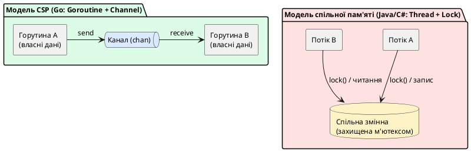

::

Важливо розуміти: Go **не забороняє** класичну модель спільної пам'яті з м'ютексами — пакет `sync` зі стандартної бібліотеки, який ми детально розглянемо далі в цій лекції, надає повноцінний `Mutex` та інші звичні примітиви синхронізації. Проте канали пропонуються як **першочерговий, ідіоматичний** інструмент для більшості сценаріїв координації горутин, тоді як `sync.Mutex` залишається доцільним для простих випадків захисту одного невеликого спільного значення (наприклад, лічильника метрик).

| Аспект                           | Модель спільної пам'яті (потоки + блокування)           | Модель CSP (горутини + канали)                             |
| -------------------------------- | ------------------------------------------------------- | ---------------------------------------------------------- |
| **Одиниця виконання**            | Потік ОС (_OS thread_), важкий, кілька мегабайтів стека | Горутина, легковага, стек від 2 КБ                         |
| **Механізм обміну даними**       | Прямий доступ до спільної змінної в пам'яті             | Явна передача повідомлення через канал                     |
| **Основний захист**              | Мутекси, семафори, блокування вручну                    | Канали гарантують безпечну передачу без ручних блокувань   |
| **Типова помилка**               | Забутий `lock()`/`unlock()`, взаємне блокування         | Витік горутини через незакритий канал                      |
| **Хто керує потоками виконання** | Розробник створює `Thread`/`Task` явно                  | Планувальник Go Runtime (GMP) керує горутинами автоматично |

---

## Горутини: легковагі потоки виконання

**Синтаксис:**

```go
go викликФункції(аргументи) // запускає функцію як окрему горутину, не чекаючи завершення
```

**Простий приклад:**

```go
func hello() { fmt.Println("Привіт із горутини!") }

go hello() // виконається конкурентно, без очікування
```

**Горутина (_goroutine_)** — це функція, яка виконується конкурентно з іншими горутинами в межах одного й того самого адресного простору процесу. Синтаксично запустити нову горутину напрочуд просто: достатньо додати ключове слово `go` перед викликом будь-якої функції:

```go
func sayHello(name string) {
    fmt.Println("Привіт,", name)
}

func main() {
    go sayHello("Олексій") // запускає нову горутину і НЕ чекає її завершення
    go sayHello("Марія")   // запускає ще одну горутину паралельно

    fmt.Println("Головна горутина продовжує роботу")
    time.Sleep(100 * time.Millisecond) // штучна затримка, щоб побачити результат
}
```

Зверніть увагу на ключовий нюанс: виклик `go sayHello("Олексій")` **не блокує** виконання головної функції `main` — програма одразу переходить до наступного рядка коду, а функція `sayHello` виконується десь «паралельно у фоні» (точніше — конкурентно, а справжній паралелізм залежить від кількості доступних ядер процесора). Сама функція `main` теж технічно виконується у власній горутині — так званій **головній горутині** (_main goroutine_), яка створюється автоматично під час запуску програми.

Критично важливий факт, який часто дивує новачків: якщо головна горутина `main` завершує роботу (функція `main` повертає керування), **уся програма негайно завершується**, навіть якщо інші запущені горутини ще не встигли доробити свою роботу. Саме тому в прикладі вище довелося додати штучну затримку `time.Sleep` — без неї програма, ймовірно, завершилася б раніше, ніж горутини встигли б хоч раз викликати `fmt.Println`. У реальному коді штучні затримки категорично не використовуються для синхронізації — для цього призначені канали та примітив `sync.WaitGroup`, які ми розглянемо трохи згодом.

### Чому горутини набагато дешевші за потоки операційної системи

Головна практична перевага горутин над класичними потоками операційної системи (_OS threads_, які використовуються в Java через клас `Thread` або в C# через `Task`) — їхня надзвичайно низька вартість створення та підтримки. Кожен потік операційної системи вимагає виділення фіксованого блока пам'яті під стек викликів — типово від 1 до 8 мегабайтів, залежно від платформи, — а також окремого запису в таблиці планувальника ядра ОС, перемикання між яким є відносно дорогою операцією (потрібен перехід у режим ядра, _kernel mode switch_).

Горутина, натомість, стартує з мінімального стека розміром лише **2 кілобайти** (це деталь внутрішньої моделі пам'яті, яку ми розглядали в попередній лекції — стек горутини динамічно виділяється в купі процесу та здатний зростати чи стискатися залежно від глибини викликів функцій). Оскільки горутини керуються не операційною системою, а власним планувальником середовища виконання Go (без необхідності переходу в режим ядра для перемикання між ними), одна програма на Go цілком реально може одночасно підтримувати **сотні тисяч** активних горутин — тоді як аналогічна кількість потоків ОС миттєво вичерпала б усю доступну оперативну пам'ять сервера.

| Характеристика               | Потік ОС (Java `Thread`, C# `Task` на потоці)   | Горутина Go                                               |
| ---------------------------- | ----------------------------------------------- | --------------------------------------------------------- |
| **Початковий розмір стека**  | 1–8 МБ (фіксовано під час створення)            | 2 КБ (динамічно росте/стискається)                        |
| **Хто планує виконання**     | Планувальник ядра операційної системи           | Планувальник Go Runtime (GMP, у користувацькому просторі) |
| **Вартість створення**       | Відносно висока (системний виклик)              | Дуже низька (виділення невеликого блока в купі)           |
| **Практична межа кількості** | Тисячі (обмежено пам'яттю та планувальником ОС) | Сотні тисяч і навіть мільйони                             |
| **Перемикання контексту**    | Дороге (перехід у режим ядра)                   | Дешеве (виконується повністю в user space)                |

::tip
**Практичний наслідок для серверної розробки:** саме завдяки дешевизні горутин ідіоматичний Go-сервер зазвичай запускає **одну окрему горутину на кожне вхідне з'єднання клієнта** — підхід, який ми детально розберемо в наступній лекції про сокетне програмування TCP. У Java чи C# такий підхід «потік на з'єднання» швидко вичерпав би ресурси при тисячах одночасних клієнтів, тому там традиційно застосовують пули потоків (_thread pools_) або асинхронні моделі (`async`/`await`). У Go пул горутин зазвичай не потрібен — планувальник і без нього ефективно впорається з масштабом.
::

---

## Планувальник GMP: як Go керує тисячами горутин на кількох ядрах

Постає закономірне запитання: якщо горутини — це не потоки операційної системи, то хто саме розподіляє їхнє виконання між фізичними ядрами процесора? Відповідь — власний планувальник Go Runtime, який прийнято називати **моделлю GMP**, за першими літерами трьох ключових сутностей, з якими він оперує.

**G (Goroutine)** — це сама горутина: структура даних, яка описує функцію для виконання, її поточний стек викликів та поточний стан (виконується, готова до виконання, заблокована в очікуванні каналу тощо). У кожен момент часу в пам'яті процесу можуть існувати десятки тисяч структур `G`, більшість із яких просто очікують своєї черги.

**M (Machine)** — це фактичний потік операційної системи (_OS thread_), той самий важкий системний потік, який ми порівнювали з горутинами вище. Саме сутність `M` є тим, що операційна система бачить і планує на реальному процесорному ядрі. Кількість сутностей `M` зазвичай приблизно відповідає кількості логічних ядер процесора, хоча Go Runtime може створювати додаткові `M`, якщо якісь потоки заблоковані на тривалих системних викликах.

**P (Processor)** — це логічний «дозвіл на виконання коду Go», проміжна сутність, яка зв'язує горутини (`G`) з потоками операційної системи (`M`). Кількість сутностей `P` контролюється змінною середовища `GOMAXPROCS` і за замовчуванням дорівнює кількості логічних ядер процесора на машині. Кожен `P` володіє власною локальною чергою горутин, готових до виконання (_local run queue_), а потік `M` може виконувати код Go лише тоді, коли він «прив'язаний» до якогось вільного `P`.

::plant-uml{alt="Модель планувальника GMP"}

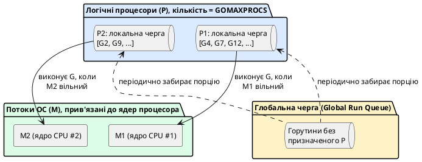

::

Планувальник GMP реалізує так звану крадіжку роботи (_work stealing_): якщо локальна черга якогось `P` спорожніла, а в черзі сусіднього `P` ще залишились горутини, вільний потік `M` може «вкрасти» частину горутин із чужої черги, замість того щоб простоювати в очікуванні. Це забезпечує рівномірне навантаження на всі доступні ядра процесора без ручного втручання розробника.

Ще одна важлива деталь стосується того, **коли саме** відбувається перемикання між горутинами. До версії Go 1.14 перемикання було переважно кооперативним (_cooperative scheduling_): горутина «добровільно» звільняла процесор лише в певних точках коду — під час виклику функцій, операцій з каналами, системних викликів чи виклику `runtime.Gosched()`. Це створювало теоретичну проблему: горутина з довгим обчислювальним циклом без жодного виклику функцій могла «монопольно» зайняти процесорне ядро й заблокувати інші горутини на невизначений час. Починаючи з Go 1.14, планувальник підтримує **асинхронне витіснення** (_asynchronous preemption_): якщо горутина виконується занадто довго (понад приблизно 10 мілісекунд), планувальник може примусово призупинити її та передати керування іншій горутині, навіть якщо перша ніколи не викликала жодної функції.

::note
**Чому це знати важливо, а не лише цікаво:** розуміння моделі GMP допомагає пояснити, чому Go-сервер із десятками тисяч одночасних з'єднань не «захлинається», хоча фізичних ядер процесора може бути лише вісім. Кожна горутина, що очікує на мережевий байт (наприклад, у виклику `conn.Read()`), не займає жодного потоку `M` — планувальник відв'язує таку горутину від `M` до моменту фактичного надходження даних, звільняючи потік для обслуговування інших активних горутин.
::

---

## Стан гонитви: небезпека одночасного доступу до пам'яті

Легкість запуску горутин має і зворотний бік: щойно кілька горутин починають конкурентно звертатися до однієї й тієї самої змінної в пам'яті без належної координації, виникає одна з найпідступніших категорій помилок у програмуванні — **стан гонитви** (_race condition_). Розгляньмо, здавалося б, безневинний приклад лічильника, який одночасно збільшують тисяча горутин:

```go
func main() {
    counter := 0

    for i := 0; i < 1000; i++ {
        go func() {
            counter++ // НЕБЕЗПЕЧНО: конкурентний запис без синхронізації
        }()
    }

    time.Sleep(500 * time.Millisecond) // недопустимий "милиця"-синхронізатор
    fmt.Println("Підсумкове значення:", counter)
}
```

Логічно очікувати, що після запуску тисячі горутин, кожна з яких один раз збільшує лічильник на одиницю, фінальне значення `counter` дорівнюватиме рівно `1000`. Проте на практиці результат виявляється **непередбачуваним** і змінюється від запуску до запуску, часто виводячи щось на кшталт `987` чи `994`. Причина криється в тому, що операція `counter++`, попри свою візуальну простоту, насправді складається з трьох окремих машинних кроків: (1) зчитати поточне значення `counter` з пам'яті, (2) додати до нього одиницю, (3) записати новий результат назад у пам'ять. Якщо дві горутини одночасно виконують крок (1) і зчитують однакове старе значення, перш ніж будь-яка з них встигне виконати крок (3), одне з двох збільшень фізично «губиться» — обидві горутини записують результат, що враховує лише одне збільшення замість двох.

::plant-uml{alt="Стан гонитви під час одночасного інкременту"}

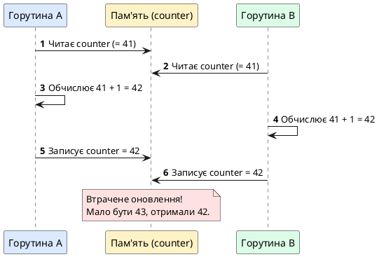

::

Найнебезпечніше в станах гонитви те, що вони **не завжди відтворюються стабільно**: код може коректно пропрацювати сотні разів під час локальної розробки й аварійно зіпсувати дані рівно один раз на промисловому сервері під реальним піковим навантаженням, коли ймовірність накладання операцій зростає. Саме тому покладатися на «здається, працює» під час конкурентного програмування категорично неприпустимо.

Мова Go надає вбудований інструмент для автоматичного виявлення станів гонитви ще до того, як вони проявляться у продакшені — так званий **детектор гонитви** (_race detector_), який активується прапорцем `-race`:

::tabs
::tabs-item{label="Запуск з детектором гонитви"}

```bash
go run -race main.go
```

::
::tabs-item{label="Тестування з детектором гонитви"}

```bash
go test -race ./...
```

::
::

Під час роботи з увімкненим прапорцем `-race` середовище виконання Go інструментує кожен доступ до пам'яті та відстежує, чи не звертаються до однієї й тієї самої комірки пам'яті дві різні горутини одночасно без синхронізації через м'ютекс чи канал. У разі виявлення конфлікту програма виведе детальний звіт із точними номерами рядків коду обох конфліктних звернень і завершиться з ненульовим кодом виходу — це надзвичайно цінний сигнал для конвеєра автоматичного тестування (CI), який варто вмикати для кожного запуску тестів у серверному проєкті.

::caution
**Детектор гонитви не є заміною правильного проєктування коду.** Він лише виявляє гонитви, які фактично **трапилися** під час конкретного запуску програми — якщо потенційно небезпечна ділянка коду жодного разу не була виконана конкурентно під час тестового прогону, детектор про неї нічого не повідомить. Крім того, увімкнений детектор суттєво уповільнює виконання програми та збільшує споживання пам'яті, тому в реальному продакшені його не використовують — лише під час тестування та локальної розробки.
::

Розв'язання проблеми станів гонитви лежить у площині свідомої синхронізації доступу до спільних даних — або через явні примітиви пакета `sync` (зокрема `sync.Mutex`, який ми розглянемо трохи далі), або через ідіоматичний для Go підхід передачі даних через канали, до розгляду яких ми переходимо в наступному розділі.

---

## Канали: типобезпечні труби для передачі даних між горутинами

**Синтаксис:**

```go
ch := make(chan T)      // небуферизований канал
ch := make(chan T, N)   // буферизований канал ємністю N

ch <- значення           // надіслати значення в канал
значення := <-ch          // отримати значення з каналу
close(ch)                 // закрити канал (сигнал "більше даних не буде")
```

**Простий приклад:**

```go
ch := make(chan int)
go func() { ch <- 5 }()
fmt.Println(<-ch) // 5
```

**Канал (`chan`)** — це вбудований у мову Go тип даних, що реалізує типобезпечну чергу для передачі значень одного визначеного типу між горутинами, забезпечуючи при цьому автоматичну синхронізацію без явних блокувань. Канал можна уявити як фізичну трубу: одна горутина «кладе» значення в один кінець труби, а інша горутина «забирає» це значення з протилежного кінця, причому сама труба гарантує, що жодне значення не буде втрачене чи прочитане двічі.

Канал створюється за допомогою вже знайомої нам функції `make`, з обов'язковим зазначенням типу переданих значень:

```go
ch := make(chan int) // канал для передачі значень типу int
```

Надсилання значення в канал і отримання значення з каналу виконуються за допомогою спеціального оператора `<-` («стрілка»), напрямок якої вказує, у який бік рухаються дані:

```go
ch <- 42       // надіслати значення 42 в канал ch
value := <-ch  // отримати значення з каналу ch у змінну value
```

### Небуферизовані канали: синхронна передача «з рук у руки»

За замовчуванням, якщо під час створення каналу через `make(chan int)` не вказано додатковий числовий параметр, створюється **небуферизований канал** (_unbuffered channel_). Ключова особливість небуферизованого каналу — операція надсилання `ch <- value` **блокує** горутину-відправника доти, доки якась інша горутина не виконає відповідну операцію отримання `<-ch`, і навпаки: отримання блокує горутину-отримувача, доки хтось не надішле значення. Такий канал реалізує строгу синхронну передачу «з рук у руки» (_handoff_) — обидві сторони гарантовано зустрічаються в один і той самий логічний момент часу.

```go
func worker(results chan<- int) {
    time.Sleep(50 * time.Millisecond) // імітація повільної роботи
    results <- 42                      // заблокується, поки хтось не прочитає
}

func main() {
    results := make(chan int)
    go worker(results)

    fmt.Println("Очікуємо результат від горутини...")
    value := <-results // main блокується, поки worker не надішле значення
    fmt.Println("Отримано результат:", value)
}
```

Зверніть увагу на синтаксис параметра `results chan<- int` у сигнатурі функції `worker` — це **спрямований канал** (_directional channel_), який дозволяє передавати каналу лише в один бік (тут — тільки для запису, `chan<-`). Аналогічно існує форма `<-chan int` для каналу, придатного лише для читання. Хоча технічно канал завжди двонаправлений усередині, обмеження напрямку на рівні сигнатури функції — це важливий інструмент документування та захисту коду: компілятор не дозволить помилково прочитати з каналу, призначеного функцією виключно для запису.

### Буферизовані канали: черга з обмеженою ємністю

Якщо під час створення каналу вказати другий числовий аргумент, буде створено **буферизований канал** (_buffered channel_) із фіксованою внутрішньою ємністю:

```go
ch := make(chan int, 3) // буферизований канал ємністю 3 значення
```

Буферизований канал поводиться інакше: операція надсилання `ch <- value` блокується лише тоді, коли внутрішній буфер **повністю заповнений**; якщо в буфері ще є вільне місце, значення просто додається туди, і горутина-відправник продовжує роботу негайно, не чекаючи на отримувача. Симетрично, операція отримання блокується лише тоді, коли буфер **порожній**.

```go
func main() {
    logQueue := make(chan string, 5)

    logQueue <- "запис 1" // не блокує, буфер має вільне місце
    logQueue <- "запис 2" // не блокує
    logQueue <- "запис 3" // не блокує

    fmt.Println("Черга наразі містить:", len(logQueue), "записів") // 3
}
```

::warning
**Буферизований канал — це не панацея від синхронізації, а лише амортизатор.** Буфер згладжує короткочасні сплески навантаження (наприклад, коли виробник тимчасово швидший за споживача), але не усуває необхідності в узгодженій логіці обробки: якщо буфер постійно заповнюється швидше, ніж спорожнюється, надсилачі рано чи пізно почнуть блокуватися так само, як і на небуферизованому каналі.
::

### Закриття каналу та безпечне читання через range

Коли відправник більше не має значень для передачі, канал варто явно **закрити** вбудованою функцією `close(ch)`. Закриття каналу — це спосіб сигналізувати всім отримувачам: «більше даних не буде». Спроба записати значення у вже закритий канал спричиняє паніку, тоді як читання із закритого каналу залишається безпечним — воно негайно повертає нульове значення відповідного типу.

Щоб дізнатися, чи канал уже закритий, а чи просто тимчасово порожній, використовують двозначну форму отримання, аналогічну до Type Assertion:

```go
value, ok := <-ch
if !ok {
    fmt.Println("Канал закрито, більше значень не буде")
}
```

Найзручнішим способом послідовно прочитати всі значення з каналу аж до його закриття є конструкція `for-range`, яка автоматично завершує цикл одразу після закриття каналу:

```go
func producer(ch chan<- int) {
    for i := 1; i <= 5; i++ {
        ch <- i * i // надсилає квадрати чисел від 1 до 5
    }
    close(ch) // обов'язково закриваємо канал після завершення надсилання
}

func main() {
    ch := make(chan int)
    go producer(ch)

    for value := range ch { // цикл сам завершиться після close(ch)
        fmt.Println("Отримано:", value)
    }
    fmt.Println("Усі значення оброблено, канал закрито")
}
```

::caution
**Пастка nil-каналу та витоку горутин.** Читання або запис у канал зі значенням `nil` (тобто оголошений через `var ch chan int`, але ніколи не ініціалізований через `make`) блокує горутину **назавжди** — без жодної помилки чи паніки, просто вічне очікування. Так само небезпечно забути викликати `close(ch)`, коли горутина-отримувач очікує на цикл `for range ch`: без закриття каналу цикл ніколи не завершиться, і горутина-отримувач залишиться «висіти» в пам'яті процесу до кінця роботи програми — це різновид витоку ресурсів, що має назву **витік горутини** (_goroutine leak_).
::

---

## Вбудований детектор дедлоку: коли зупиняються всі горутини одразу

Окрім детектора гонитви `-race`, який ми розглянули раніше, Go Runtime автоматично й безкоштовно (без жодних додаткових прапорців) стежить за ще однією небезпечною ситуацією — **тотальним дедлоком** (_deadlock_), коли **абсолютно всі** горутини програми одночасно заблоковані й жодна з них ніколи більше не зможе прокинутися. Найпростіший спосіб продемонструвати таку ситуацію — спробувати прочитати значення з небуферизованого каналу, у який ніхто ніколи нічого не надішле:

```go
func main() {
    ch := make(chan int) // небуферизований канал
    value := <-ch          // очікуємо значення, якого ніхто ніколи не надішле
    fmt.Println(value)
}
```

Запуск цієї програми не зависає мовчки назавжди — Go Runtime виявляє, що жодна горутина в системі більше не може просунутися вперед, і негайно аварійно завершує програму з промовистим повідомленням:

::terminal-preview{title="go run main.go" :cursor="true"}

<div class="line"><span class="opacity-40">$</span> <strong class="font-bold">go run main.go</strong></div>
<div class="line"><span class="text-red-400 font-bold">fatal error:</span> all goroutines are asleep - deadlock!</div>
<div class="line"><span class="opacity-40">goroutine 1 [chan receive]:</span></div>
<div class="line"><span class="opacity-40">main.main()</span></div>
::

::note
**Чим цей детектор відрізняється від `-race`?** Детектор гонитви `-race` шукає **некоректний одночасний доступ до пам'яті** між кількома активними горутинами і потребує явного прапорця під час запуску. Вбудований детектор дедлоку, натомість, працює завжди, без жодних прапорців, але виявляє лише **повний глухий кут**, коли в системі не залишилося жодної горутини, здатної виконати бодай один крок. Якщо заблокованими опиняться лише дві горутини з десяти, а решта вісім продовжують працювати, цей вбудований детектор нічого не помітить — програма просто повільно «підтікатиме» витоками горутин, і тут знадобляться вже інші інструменти діагностики (наприклад, аналіз дампу горутин через `pprof`).
::

---

## Патерн «Виробник–Споживач» та пул воркерів через канали

Одним із найпоширеніших практичних застосувань каналів у серверному коді є патерн **«Виробник–Споживач»** (_Producer–Consumer_), а також його розширення — **пул воркерів** (_Worker Pool_), коли кілька однакових горутин-обробників конкурентно розбирають завдання з одного спільного каналу. Такий підхід ідеально підходить, наприклад, для паралельної обробки пакету зображень, парсингу списку файлів чи розсилки повідомлень великій кількості одержувачів, обмежуючи при цьому кількість одночасних обробників фіксованим числом.

```go
func worker(id int, jobs <-chan int, results chan<- int) {
    for job := range jobs { // читає завдання, поки канал jobs не закриють
        fmt.Printf("Воркер %d обробляє завдання %d\n", id, job)
        time.Sleep(50 * time.Millisecond) // імітація обчислень
        results <- job * job
    }
}

func main() {
    const numWorkers = 3
    jobs := make(chan int, 10)
    results := make(chan int, 10)

    // Запускаємо фіксовану кількість воркерів заздалегідь
    for w := 1; w <= numWorkers; w++ {
        go worker(w, jobs, results)
    }

    // Надсилаємо 5 завдань у спільну чергу
    for j := 1; j <= 5; j++ {
        jobs <- j
    }
    close(jobs) // сигналізуємо воркерам, що нових завдань не буде

    // Збираємо 5 результатів
    for i := 0; i < 5; i++ {
        fmt.Println("Результат:", <-results)
    }
}
```

У цьому прикладі три горутини-воркери конкурентно змагаються за право прочитати наступне завдання з каналу `jobs`. Оскільки Go гарантує, що кожне конкретне значення з каналу отримає рівно **один** отримувач (навіть якщо кілька горутин одночасно очікують на читання з того самого каналу), жодне завдання не буде оброблене двічі й жодне не загубиться — сам канал бере на себе всю складність розподілу роботи, без потреби в явних блокуваннях чи чергах із ручним керуванням.

::plant-uml{alt="Пул воркерів через спільний канал завдань"}

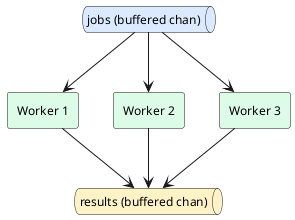

::

---

## Оператор select: мультиплексування декількох каналів

**Синтаксис:**

```go
select {
case v := <-ch1:
    // отримано значення з ch1
case ch2 <- x:
    // значення x надіслано в ch2
default:
    // жодна гілка не готова (робить select неблокуючим)
}
```

**Простий приклад:**

```go
ch := make(chan string, 1)
ch <- "готово"

select {
case msg := <-ch:
    fmt.Println(msg) // готово
default:
    fmt.Println("немає повідомлень")
}
```

Часто горутина повинна одночасно очікувати на події з **кількох** різних каналів, реагуючи на те, звідки саме першим надійшло значення. Для цього мова Go надає спеціальну керуючу конструкцію `select`, синтаксично схожу на `switch`, але призначену виключно для роботи з операціями на каналах:

```go
func main() {
    ch1 := make(chan string)
    ch2 := make(chan string)

    go func() {
        time.Sleep(100 * time.Millisecond)
        ch1 <- "відповідь від сервісу А"
    }()
    go func() {
        time.Sleep(50 * time.Millisecond)
        ch2 <- "відповідь від сервісу Б"
    }()

    select {
    case msg1 := <-ch1:
        fmt.Println("Отримано:", msg1)
    case msg2 := <-ch2:
        fmt.Println("Отримано:", msg2)
    }
}
```

Конструкція `select` блокує виконання горутини доти, доки **хоча б одна** з перелічених гілок `case` не стане готовою до виконання (тобто відповідний канал не отримає значення або не звільниться місце для запису). Якщо готовими одночасно виявляються кілька гілок, Go **псевдовипадково** обирає одну з них — це свідоме архітектурне рішення, яке запобігає систематичному «голодуванню» (_starvation_) якоїсь конкретної гілки через постійну перевагу першої за порядком написання.

### Тайм-аути через time.After та неблокуючий select з default

Одне з найпрактичніших застосувань `select` у мережевому програмуванні — реалізація обмеження часу очікування (_timeout_) на операцію, тривалість якої непередбачувана (наприклад, очікування відповіді від повільного зовнішнього сервісу). Пакет `time` пропонує зручну функцію `time.After(d)`, яка повертає канал, що автоматично отримає значення рівно через вказану тривалість `d`:

```go
func fetchWithTimeout(resultCh <-chan string) {
    select {
    case result := <-resultCh:
        fmt.Println("Успішно отримано:", result)
    case <-time.After(2 * time.Second):
        fmt.Println("Тайм-аут: сервіс не відповів за 2 секунди")
    }
}
```

Якщо канал `resultCh` не отримає значення протягом двох секунд, канал, повернутий `time.After`, стане готовим першим, і виконання перейде в гілку тайм-ауту — незалежно від того, чи «висить» ще десь фонова горутина, що намагається записати результат у `resultCh`.

Іншим корисним прийомом є додавання гілки `default` до конструкції `select`, яка робить всю конструкцію **неблокуючою**: якщо жодна з інших гілок не готова негайно, виконується саме `default`, і `select` не чекає жодної мілісекунди:

```go
select {
case msg := <-notifications:
    fmt.Println("Нове сповіщення:", msg)
default:
    fmt.Println("Сповіщень наразі немає, продовжуємо роботу")
}
```

::note
**А що, якщо в select немає жодної гілки, готової до виконання, і немає default?** Горутина заблокується на конструкції `select` до появи хоча б однієї готової гілки. Якщо жоден з очікуваних каналів взагалі ніколи не отримає значення (і немає гілки `time.After` для підстраховки), горутина зависне назавжди — це ще один різновид витоку горутини, який слід враховувати під час проєктування довготривалих фонових обробників.
::

---

## Обмеження конкурентності: буферизований канал як семафор

Пул воркерів чудово підходить, коли робота розділена на дискретні завдання. Проте часто трапляється інший сценарій: горутини запускаються десь у різних місцях коду (наприклад, кожна на власний вхідний HTTP-запит), і потрібно лише **обмежити** їхню сумарну кількість, яка одночасно виконує якусь ресурсомістку операцію — наприклад, звернення до повільного зовнішнього платіжного API, яке не витримає тисячі одночасних викликів. Для цього буферизований канал можна використати як **семафор** (_semaphore_) — лічильник дозволів з обмеженою ємністю.

```go
var sem = make(chan struct{}, 5) // не більше 5 одночасних викликів

func callExternalAPI(url string) error {
    sem <- struct{}{}        // "захопити" дозвіл (блокує, якщо зайнято всі 5)
    defer func() { <-sem }() // "звільнити" дозвіл після завершення роботи

    resp, err := http.Get(url)
    if err != nil {
        return err
    }
    defer resp.Body.Close()
    return nil
}
```

Тип каналу навмисно обрано `chan struct{}` — порожня структура `struct{}` не займає жодного байта корисних даних (лише слугує «жетоном» присутності), тому такий канал використовується виключно для контролю кількості одночасних дозволів, а не для передачі змістовної інформації. Коли буфер каналу `sem` заповнений (усі 5 дозволів роздано), шоста горутина, що намагається виконати `sem <- struct{}{}`, заблокується, доки якась із перших п'яти не звільнить свій дозвіл викликом `<-sem`.

::tip
**Різниця з Worker Pool:** у пулі воркерів кількість горутин-обробників фіксована заздалегідь, і вони самі забирають завдання з черги. У патерні-семафорі кількість горутин, навпаки, може бути будь-якою (і зазвичай непередбачуваною наперед) — семафор лише обмежує, скільки з них одночасно можуть перебувати всередині захищеної ділянки коду.
::

---

## Конвеєр обробки: з'єднання горутин у ланцюжок стадій

**Конвеєр** (_pipeline_) — ще один поширений патерн конкурентності, коли дані проходять через послідовність незалежних стадій обробки, кожна з яких реалізована як окрема горутина, з'єднана з попередньою та наступною стадією через канали. Кожна стадія читає значення з вхідного каналу, виконує над ним якесь перетворення та надсилає результат у вихідний канал наступної стадії:

```go
func generate(nums ...int) <-chan int {
    out := make(chan int)
    go func() {
        defer close(out)
        for _, n := range nums {
            out <- n
        }
    }()
    return out
}

func square(in <-chan int) <-chan int {
    out := make(chan int)
    go func() {
        defer close(out)
        for n := range in {
            out <- n * n
        }
    }()
    return out
}

func main() {
    // Три стадії з'єднані в конвеєр: generate -> square -> вивід
    for result := range square(generate(1, 2, 3, 4)) {
        fmt.Println(result) // 1, 4, 9, 16
    }
}
```

Кожна функція-стадія (`generate`, `square`) одразу повертає канал для читання, а сама передача значень відбувається асинхронно у фоновій горутині, яку функція запускає перед виходом. Такий підхід чудово масштабується: щоб додати нову стадію обробки (наприклад, фільтрацію лише парних квадратів), достатньо написати ще одну функцію з такою самою сигнатурою `func(in <-chan int) <-chan int` і вставити її в ланцюжок виклику, не змінюючи жодної з уже наявних стадій.

::plant-uml{alt="Конвеєр обробки даних через послідовність каналів"}

```plantuml
@startuml
skinparam style plain
skinparam backgroundColor #FFFFFF
skinparam defaultFontSize 12

rectangle "generate()" as G #DBEAFE
queue "chan int" as C1 #F1F5F9
rectangle "square()" as S #DCFCE7
queue "chan int" as C2 #F1F5F9
rectangle "main(): for range" as M #FEF3C7

G -right-> C1
C1 -right-> S
S -right-> C2
C2 -right-> M
@enduml
```

::

---

## Пакет sync: класичні примітиви синхронізації

Хоча канали є ідіоматичним інструментом координації горутин у Go, для деяких сценаріїв — особливо для захисту одного простого спільного значення від одночасного доступу — простіше й ефективніше скористатися класичними примітивами синхронізації з пакета стандартної бібліотеки `sync`. Розгляньмо чотири найуживаніші з них.

### sync.Mutex: взаємне блокування

**Синтаксис:**

```go
var mu sync.Mutex
mu.Lock()
defer mu.Unlock()
```

**Простий приклад:**

```go
var mu sync.Mutex
counter := 0

mu.Lock()
counter++
mu.Unlock()
fmt.Println(counter) // 1
```

**М'ютекс** (_Mutex_, від _mutual exclusion_ — «взаємне виключення») — це примітив, який гарантує, що в певний момент часу до захищеної ділянки коду (_critical section_) може увійти лише одна горутина. Повернімося до нашого прикладу з непослідовним лічильником і виправимо його за допомогою `sync.Mutex`:

```go
type SafeCounter struct {
    mu    sync.Mutex
    value int
}

func (c *SafeCounter) Increment() {
    c.mu.Lock()         // захопити виключне право на доступ
    defer c.mu.Unlock() // гарантовано звільнити його при виході з функції
    c.value++
}

func (c *SafeCounter) Value() int {
    c.mu.Lock()
    defer c.mu.Unlock()
    return c.value
}

func main() {
    counter := SafeCounter{}
    var wg sync.WaitGroup

    for i := 0; i < 1000; i++ {
        wg.Add(1)
        go func() {
            defer wg.Done()
            counter.Increment()
        }()
    }

    wg.Wait()
    fmt.Println("Підсумкове значення:", counter.Value()) // завжди рівно 1000
}
```

Виклик `c.mu.Lock()` захоплює м'ютекс: якщо якась інша горутина вже утримує цей самий м'ютекс, горутина, що викликала `Lock()`, блокується та чекає, доки м'ютекс не звільниться викликом `Unlock()`. Ідіоматичний стиль Go рекомендує **завжди** звільняти м'ютекс через `defer c.mu.Unlock()` одразу після успішного захоплення — це гарантує звільнення навіть у разі паніки чи дострокового виходу з функції через кілька шляхів `return`.

::caution
**Найнебезпечніша помилка з м'ютексами — забутий Unlock().** Якщо горутина захопила м'ютекс і з якоїсь причини (помилка логіки, необроблена паніка) ніколи не викликала `Unlock()`, усі інші горутини, що намагаються захопити цей самий м'ютекс, заблокуються **назавжди** — це класичний **дедлок** (_deadlock_). Саме тому конструкція `defer mu.Unlock()` одразу після `mu.Lock()` вважається обов'язковим стандартом якісного коду.
::

### sync.RWMutex: розділення читачів і письменників

**Синтаксис:**

```go
var mu sync.RWMutex
mu.RLock()   // блокування для читання, дозволяє кількох читачів одночасно
defer mu.RUnlock()

mu.Lock()    // виключне блокування для запису
defer mu.Unlock()
```

**Простий приклад:**

```go
var mu sync.RWMutex
data := map[string]int{"a": 1}

mu.RLock()
fmt.Println(data["a"]) // 1
mu.RUnlock()
```

Якщо спільні дані **набагато частіше читають, ніж змінюють** (типова ситуація для кешу конфігурації чи довідника, які майже завжди тільки читаються), використання звичайного `sync.Mutex` є неефективним: він дозволяє лише одній горутині перебувати всередині захищеної ділянки одночасно, навіть якщо всі горутини лише хочуть прочитати значення, не змінюючи його. Для таких сценаріїв призначений **читач-письменницький м'ютекс** — `sync.RWMutex`, який дозволяє **необмеженій кількості читачів** утримувати блокування одночасно, але гарантує **виключний доступ** лише для одного письменника, який до того ж блокує всіх читачів на час запису.

```go
type ConfigStore struct {
    mu   sync.RWMutex
    data map[string]string
}

func (c *ConfigStore) Get(key string) string {
    c.mu.RLock()         // блокування для читання — дозволяє паралельних читачів
    defer c.mu.RUnlock()
    return c.data[key]
}

func (c *ConfigStore) Set(key, value string) {
    c.mu.Lock()         // виключне блокування для запису
    defer c.mu.Unlock()
    c.data[key] = value
}
```

### sync.WaitGroup: очікування завершення групи горутин

**Синтаксис:**

```go
var wg sync.WaitGroup
wg.Add(1)           // +1 до лічильника перед запуском горутини
go func() {
    defer wg.Done() // -1 до лічильника після завершення
}()
wg.Wait()            // блокується, доки лічильник не стане нулем
```

**Простий приклад:**

```go
var wg sync.WaitGroup
wg.Add(1)
go func() {
    defer wg.Done()
    fmt.Println("готово")
}()
wg.Wait()
```

Ми вже кілька разів побіжно використовували `time.Sleep` як «милицю» для очікування завершення фонових горутин — і щоразу наголошували, що це недопустимий підхід у виробничому коді. Правильний ідіоматичний інструмент для очікування завершення заздалегідь невідомої кількості горутин — це **група очікування**, `sync.WaitGroup`. Вона працює як лічильник: метод `Add(n)` збільшує внутрішній лічильник на `n`, метод `Done()` зменшує його на одиницю (типово викликається через `defer` одразу на початку горутини), а метод `Wait()` блокує виклик, доки лічильник не досягне нуля.

```go
func fetchURL(url string, wg *sync.WaitGroup) {
    defer wg.Done() // гарантовано зменшить лічильник, навіть при паніці
    fmt.Println("Завантаження:", url)
    time.Sleep(100 * time.Millisecond)
}

func main() {
    urls := []string{"a.dev", "b.dev", "c.dev"}
    var wg sync.WaitGroup

    for _, url := range urls {
        wg.Add(1)                // повідомляємо: з'явилась ще одна горутина для очікування
        go fetchURL(url, &wg)
    }

    wg.Wait() // блокується, поки всі три горутини не викличуть Done()
    fmt.Println("Усі URL оброблено")
}
```

::warning
**Порядок Add() критично важливий.** Виклик `wg.Add(1)` необхідно робити в тій самій горутині, що запускає нову горутину, **до** ключового слова `go`, а не всередині самої нової горутини. Якщо перенести `Add(1)` усередину функції `fetchURL`, головна горутина може встигнути викликати `wg.Wait()` ще до того, як лічильник взагалі збільшиться, — і `Wait()` поверне керування миттєво, не дочекавшись жодної фонової горутини.
::

### sync.Once: гарантоване одноразове виконання

**Синтаксис:**

```go
var once sync.Once
once.Do(func() {
    // виконається рівно один раз, незалежно від кількості викликів Do
})
```

**Простий приклад:**

```go
var once sync.Once
for i := 0; i < 3; i++ {
    once.Do(func() { fmt.Println("ініціалізація") })
}
// "ініціалізація" надрукується лише один раз
```

Останній примітив пакета `sync`, який варто знати — `sync.Once`, що гарантує виконання певної функції **рівно один раз**, незалежно від того, скільки горутин одночасно намагаються її викликати. Це ідеальний інструмент для лінивої ініціалізації одинака (_singleton_) — наприклад, одноразового встановлення з'єднання з базою даних, яке спільно використовується багатьма горутинами:

```go
var (
    dbConn *sql.DB
    once   sync.Once
)

func getConnection() *sql.DB {
    once.Do(func() {
        fmt.Println("Встановлюємо з'єднання з базою даних...")
        dbConn, _ = sql.Open("postgres", "connection-string")
    })
    return dbConn
}
```

Навіть якщо сотні горутин одночасно викличуть `getConnection()`, тіло функції всередині `once.Do(...)` фактично виконається лише один-єдиний раз — усі інші виклики `Do` просто негайно повернуть керування, дочекавшись (якщо потрібно) завершення першого виклику.

### sync.Map: конкурентна мапа для специфічних сценаріїв

**Синтаксис:**

```go
var m sync.Map
m.Store(key, value)         // запис
value, ok := m.Load(key)    // читання
m.Delete(key)                // видалення
m.Range(func(key, value any) bool {
    return true // false — достроково перервати перебір
})
```

**Простий приклад:**

```go
var m sync.Map
m.Store("x", 1)
v, _ := m.Load("x")
fmt.Println(v) // 1
```

Як ми вже згадували в попередній лекції, вбудована мапа Go (`map[K]V`) не є потокобезпечною: конкурентний запис і читання з різних горутин без синхронізації призводять до фатальної помилки `fatal error: concurrent map read and map write`. Типове рішення — обгорнути звичайну мапу в `sync.RWMutex`, як ми показали раніше в цій лекції. Проте стандартна бібліотека пропонує й готову альтернативу — **`sync.Map`**, спеціалізовану потокобезпечну мапу, яка не потребує зовнішнього м'ютекса:

```go
var cache sync.Map

cache.Store("user:42", "Олексій") // запис значення за ключем

if value, ok := cache.Load("user:42"); ok { // безпечне конкурентне читання
    fmt.Println(value)
}

cache.Range(func(key, value any) bool {
    fmt.Println(key, "=", value)
    return true // повернути false, щоб достроково перервати перебір
})

cache.Delete("user:42")
```

::warning
**`sync.Map` — це не універсальна заміна `map` + `RWMutex`.** Офіційна документація прямо вказує, що `sync.Map` оптимізована лише для двох специфічних сценаріїв: (1) коли значення за конкретним ключем записується один раз, а читається багато разів (кеш, що лише зростає), або (2) коли різні горутини стабільно працюють із **непересічними** наборами ключів. У типовому сценарії зі змішаним інтенсивним читанням і записом одних і тих самих ключів звичайна мапа під захистом `sync.RWMutex` зазвичай працює швидше й передбачуваніше — тому `sync.Map` варто застосовувати свідомо, а не автоматично «про всяк випадок».
::

---

## sync/atomic: атомарні операції без явних блокувань

**Синтаксис:**

```go
var counter atomic.Int64
counter.Add(1)     // атомарне збільшення
counter.Load()      // атомарне читання
counter.Store(0)    // атомарний запис
```

**Простий приклад:**

```go
var counter atomic.Int64
counter.Add(1)
fmt.Println(counter.Load()) // 1
```

Для найпростішого сценарію — конкурентного оновлення одного числового лічильника — навіть виклик `Lock()`/`Unlock()` можна вважати надлишковим накладним видатком. Пакет `sync/atomic` надає набір **атомарних операцій** (_atomic operations_), які виконують читання-модифікацію-запис як єдину неподільну операцію на рівні процесора, без потреби в окремому м'ютексі:

```go
type SafeCounter struct {
    value atomic.Int64 // атомарний тип, з'явився у Go 1.19
}

func (c *SafeCounter) Increment() {
    c.value.Add(1) // атомарне збільшення, без Lock/Unlock
}

func (c *SafeCounter) Value() int64 {
    return c.value.Load() // атомарне читання
}
```

Типи-обгортки на кшталт `atomic.Int64`, `atomic.Int32`, `atomic.Bool` та `atomic.Value` (доступні починаючи з Go 1.19) надають зрозумілий об'єктно-орієнтований інтерфейс над низькорівневими функціями `atomic.AddInt64`, `atomic.LoadInt64` тощо, які використовувалися в старішому коді. Атомарні операції виконуються значно швидше за м'ютекси саме тому, що вони реалізуються безпосередньо через спеціальні інструкції процесора (наприклад, `LOCK XADD` на архітектурі x86-64), не вимагаючи блокування горутини на рівні планувальника.

::tip
**Коли обирати atomic, а коли Mutex:** атомарні операції доцільні лише для одного ізольованого числового значення чи прапорця (лічильники метрик, флаги стану). Якщо потрібно узгоджено оновити **кілька** пов'язаних полів одночасно (наприклад, і баланс рахунку, і дату останньої транзакції), атомарні операції не підійдуть, оскільки кожна з них атомарна лише сама по собі, а не в сукупності — у такому разі необхідний повноцінний `sync.Mutex`, що захищає всю групу полів як єдине ціле.
::

---

## Пакет context: керування життєвим циклом та скасуванням операцій

**Синтаксис:**

```go
ctx := context.Background()
ctx, cancel := context.WithCancel(parent)
ctx, cancel := context.WithTimeout(parent, тривалість)
ctx, cancel := context.WithDeadline(parent, момент)
ctx := context.WithValue(parent, key, value)
defer cancel() // обов'язково для WithCancel/WithTimeout/WithDeadline
```

**Простий приклад:**

```go
ctx, cancel := context.WithTimeout(context.Background(), time.Second)
defer cancel()

<-ctx.Done()
fmt.Println(ctx.Err()) // context deadline exceeded
```

Останнім елементом моделі конкурентності Go, критично важливим саме для клієнт-серверних систем, є пакет `context`. Уявіть типову ситуацію: клієнт надіслав HTTP-запит, обробка якого запустила ланцюжок з кількох вкладених операцій — звернення до бази даних, виклик зовнішнього платіжного сервісу, запис у файл логів. Що має статися, якщо клієнт раптово розірве з'єднання (закриє вкладку браузера) ще до завершення обробки? Без спеціального механізму сервер продовжив би марно виконувати всі ці операції, витрачаючи ресурси на роботу, результат якої вже нікому не потрібен.

**`context.Context`** — це інтерфейс стандартної бібліотеки, який слугує «наскрізним каналом сигналізації» про скасування, тайм-аут чи передачу невеликих службових даних крізь увесь ланцюжок викликів функцій, незалежно від того, наскільки глибоко вкладені ці виклики. Ідіоматичне правило Go наказує передавати контекст **першим аргументом** у сигнатурі будь-якої функції, яка виконує потенційно тривалу або мережеву операцію: `func FetchUser(ctx context.Context, id int) (*User, error)`.

### Створення дерева контекстів

Контексти в Go організовані у вигляді дерева: кожен новий контекст створюється **на основі** батьківського контексту та автоматично успадковує його властивості скасування. Найпоширеніші функції створення контексту:

```go
ctx := context.Background() // "кореневий" контекст, завжди без скасування чи дедлайну

// Контекст, який можна скасувати вручну через виклик cancel()
ctx, cancel := context.WithCancel(context.Background())
defer cancel() // ЗАВЖДИ викликайте cancel(), щоб уникнути витоку ресурсів

// Контекст, що автоматично скасовується через задану тривалість
ctx, cancel := context.WithTimeout(context.Background(), 3*time.Second)
defer cancel()

// Контекст, що скасовується у конкретний момент часу
deadline := time.Now().Add(5 * time.Second)
ctx, cancel := context.WithDeadline(context.Background(), deadline)
defer cancel()
```

Кожна з функцій `WithCancel`, `WithTimeout`, `WithDeadline` повертає **дочірній контекст** та функцію `cancel`, виклик якої примусово переводить контекст (і всі його дочірні контексти нижче в дереві) у стан скасування. Критично важливо: `cancel()` необхідно викликати **завжди**, навіть якщо операція завершилася успішно й без тайм-ауту — інакше внутрішні ресурси (таймер, пов'язана горутина очищення) залишаться зайнятими до моменту спрацювання батьківського тайм-ауту чи назавжди для `WithCancel`. Саме тому ідіоматичний стиль одразу після створення контексту додає `defer cancel()`.

### Канал Done() та поширення сигналу скасування

Кожен контекст надає метод `Done()`, який повертає канал, що **закривається** в момент скасування контексту (незалежно від причини — явний виклик `cancel()`, вичерпаний тайм-аут чи скасування батьківського контексту). Оскільки закритий канал завжди готовий до читання, конструкція `select` дозволяє горутині одночасно виконувати корисну роботу та реагувати на скасування:

```go
func longRunningTask(ctx context.Context, resultCh chan<- int) {
    select {
    case <-time.After(5 * time.Second): // імітація тривалої роботи
        resultCh <- 42
    case <-ctx.Done():
        fmt.Println("Операцію скасовано:", ctx.Err())
        return
    }
}

func main() {
    ctx, cancel := context.WithTimeout(context.Background(), 2*time.Second)
    defer cancel()

    resultCh := make(chan int)
    go longRunningTask(ctx, resultCh)

    select {
    case res := <-resultCh:
        fmt.Println("Результат:", res)
    case <-ctx.Done():
        fmt.Println("Головна горутина: час вичерпано,", ctx.Err())
    }
}
```

У цьому прикладі контекст із тайм-аутом у дві секунди скасовується раніше, ніж завершується штучна п'ятисекундна операція всередині `longRunningTask`, тож і фонова горутина, і головна горутина синхронно дізнаються про скасування через свої власні виклики `ctx.Done()`, після чого метод `ctx.Err()` поверне конкретну причину — `context.DeadlineExceeded` для тайм-ауту або `context.Canceled` для явного виклику `cancel()`.

::plant-uml{alt="Поширення скасування контексту по дереву викликів"}

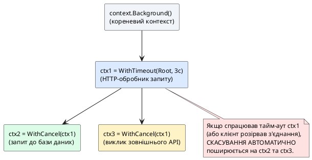

::

### Передача службових значень через WithValue

Останній, найменш вживаний спосіб створення дочірнього контексту — `context.WithValue(parent, key, value)`, який дозволяє прикріпити до контексту довільне службове значення (наприклад, ідентифікатор запиту для наскрізного трасування логів чи автентифікованого користувача, отриманого з токена):

```go
type contextKey string

const requestIDKey contextKey = "requestID"

ctx := context.WithValue(context.Background(), requestIDKey, "req-8f21ac")

requestID, ok := ctx.Value(requestIDKey).(string) // приведення типу через Type Assertion
if ok {
    fmt.Println("Обробка запиту:", requestID)
}
```

::warning
**`context.WithValue` — це не заміна параметрів функції.** Офіційна документація Go прямо застерігає: використовуйте `WithValue` виключно для службових, наскрізних даних запиту (ідентифікатор трасування, дані автентифікації), а не для передачі звичайних бізнес-параметрів функції (на кшталт ID замовлення чи суми платежу) — такі значення варто передавати явними типізованими аргументами, щоб компілятор міг перевірити їхню коректність, на відміну від нетипізованого `ctx.Value(key).(T)`, що вимагає ручного приведення типу з ризиком помилки.
::

---

## context на практиці: скасування роботи в HTTP-обробнику

**Синтаксис:**

```go
ctx := r.Context() // контекст, повʼязаний із життєвим циклом HTTP-запиту
```

Найпоширеніше практичне застосування пакета `context` у клієнт-серверних системах — автоматичне скасування обробки запиту в момент, коли клієнт розриває з'єднання, не дочекавшись відповіді. Пакет стандартної бібліотеки `net/http`, який ми детально розглянемо вже в наступній лекції, **автоматично** створює контекст для кожного вхідного запиту та скасовує його, щойно базове TCP-з'єднання з клієнтом обривається:

```go
func slowHandler(w http.ResponseWriter, r *http.Request) {
    ctx := r.Context() // контекст, прив'язаний до життєвого циклу цього запиту

    select {
    case result := <-computeExpensiveReport(ctx):
        fmt.Fprintln(w, result)
    case <-ctx.Done():
        log.Println("Клієнт розірвав з'єднання, обчислення скасовано:", ctx.Err())
        return
    }
}
```

Завдяки цьому серверу не потрібно самостійно відстежувати, чи клієнт усе ще «на зв'язку» — достатньо передавати `ctx` углиб усього ланцюжка викликів (у запит до бази даних, у виклик зовнішнього сервісу) і скрізь перевіряти `ctx.Done()` через `select`, щоб вчасно припинити марну роботу та звільнити ресурси сервера для інших клієнтів.

::tip
**Практичні інструменти діагностики конкурентного коду:** функція `runtime.NumGoroutine()` повертає поточну кількість активних горутин у процесі — корисно викликати її до і після модульного тесту, щоб переконатися, що тест не залишив після себе «висячих» горутин (класична ознака витоку). Для глибшого аналізу — які саме горутини активні та на чому вони заблоковані — використовують дамп горутин через пакет `net/http/pprof`, детальний розгляд якого винесено в окрему тему самостійної роботи «Профілювання серверних застосунків Go за допомогою утиліти pprof».
::

---

## Питання для самоперевірки: конкурентність

::accordion

::accordion-item{label="❓ Чим паралелізм принципово відрізняється від конкурентності?" icon="i-lucide-help-circle"}

Конкурентність — це властивість **структури** програми, яка дозволяє їй складатися з кількох незалежних логічних потоків завдань, що можуть виконуватися впереміш навіть на одному ядрі процесора. Паралелізм — це властивість фізичного **виконання**, коли кілька обчислень дійсно відбуваються одночасно на різних ядрах. Конкурентна програма не обов'язково виконується паралельно, але добре структурована конкурентна програма може автоматично скористатися паралелізмом, якщо доступно кілька ядер.

::

::accordion-item{label="❓ Чому горутини набагато дешевші за потоки операційної системи?" icon="i-lucide-help-circle"}

Потік ОС вимагає фіксованого виділення 1–8 МБ пам'яті під стек і керується планувальником ядра, перемикання на якому вимагає дорогого переходу в режим ядра. Горутина стартує зі стеком лише 2 КБ, який динамічно росте за потреби, і керується власним планувальником Go Runtime (моделлю GMP) повністю в користувацькому просторі, без дорогих системних викликів для перемикання.

::

::accordion-item{label="❓ Що станеться, якщо надіслати значення в небуферизований канал, який ніхто не читає?" icon="i-lucide-help-circle"}

Горутина-відправник заблокується на операції `ch <- value` назавжди (доти, доки якась горутина не виконає `<-ch`). Якщо жодна горутина ніколи не прочитає з цього каналу, відправник «зависне» — це класичний приклад витоку горутини (_goroutine leak_), і саме тому важливо завжди продумувати, хто саме та коли читатиме з кожного створеного каналу.

::

::accordion-item{label="❓ Чому в select із кількома готовими гілками Go обирає гілку псевдовипадково?" icon="i-lucide-help-circle"}

Це свідоме архітектурне рішення для запобігання систематичному «голодуванню» (_starvation_): якби Go завжди обирав першу за порядком написання готову гілку, канали, перелічені пізніше в блоці `select`, могли б ніколи не отримати шансу на обробку за умов постійного навантаження на перші канали.

::

::accordion-item{label="❓ У чому різниця між sync.Mutex і sync.RWMutex, і коли варто обирати другий?" icon="i-lucide-help-circle"}

`sync.Mutex` дозволяє лише одній горутині перебувати в захищеній ділянці одночасно, незалежно від того, читає вона дані чи змінює. `sync.RWMutex` дозволяє необмеженій кількості горутин одночасно утримувати блокування для читання (`RLock`), але виключне блокування для запису (`Lock`) блокує всіх читачів. `RWMutex` доцільний, коли операцій читання значно більше, ніж операцій запису.

::

::accordion-item{label="❓ Навіщо обов'язково викликати cancel() навіть після успішного завершення операції?" icon="i-lucide-help-circle"}

Функції `WithCancel`, `WithTimeout` та `WithDeadline` виділяють внутрішні ресурси (пов'язаний таймер, службову горутину очищення дерева контекстів). Якщо не викликати `cancel()` явно, ці ресурси залишаться зайнятими до моменту спрацювання батьківського тайм-ауту (а для `WithCancel` — узагалі назавжди), що з часом призводить до непомітного витоку пам'яті на довготривалому сервері. Саме тому `defer cancel()` пишуть одразу в тому ж рядку, де створюється контекст.

::

::accordion-item{label="❓ Чим вбудований детектор дедлоку відрізняється від детектора гонитви -race?" icon="i-lucide-help-circle"}

Вбудований детектор дедлоку працює завжди, без жодних прапорців, і виявляє лише ситуацію, коли **абсолютно всі** горутини процесу заблоковані й жодна не може продовжити роботу — тоді програма аварійно завершується з `fatal error: all goroutines are asleep - deadlock!`. Детектор гонитави `-race`, натомість, потребує явного прапорця під час запуску і шукає інший клас помилок — некоректний одночасний доступ до пам'яті між горутинами, навіть якщо жодна з них не заблокована.

::

::accordion-item{label="❓ Чим семафор на буферизованому каналі відрізняється від пулу воркерів?" icon="i-lucide-help-circle"}

У пулі воркерів кількість горутин-обробників фіксована заздалегідь, і саме вони активно забирають завдання з черги. Семафор на каналі `chan struct{}`, навпаки, лише обмежує, скільки довільних горутин (кількість яких може бути будь-якою і невідомою наперед) одночасно можуть перебувати всередині захищеної ділянки коду, «захопивши» місце в каналі перед входом і «звільнивши» його після виходу.

::

::accordion-item{label="❓ Коли sync.Map доцільніший за map, захищену sync.RWMutex?" icon="i-lucide-help-circle"}

`sync.Map` варто обирати лише у двох спеціальних сценаріях: коли значення за ключем записується один раз, а читається багато разів (кеш, що лише зростає), або коли різні горутини стабільно працюють із непересічними наборами ключів. У типовому змішаному сценарії частого читання й запису одних і тих самих ключів звичайна `map` під захистом `sync.RWMutex` зазвичай ефективніша.

::

::

---

## Підсумки лекції

У цій лекції ми пройшли шлях від статичної системи типів до динамічної координації десятків тисяч конкурентних завдань — двох тем, які на перший погляд здаються непов'язаними, але насправді є двома половинами однієї інженерної філософії мови Go: **явність замість магії та композиція замість жорсткої ієрархії**. Інтерфейси дозволяють описувати контракти поведінки без спадкування реалізації, а горутини й канали дозволяють структурувати конкурентну роботу без ручного керування потоками операційної системи.

::card-group

::card{title="🧩 Інтерфейси" icon="i-lucide-puzzle"}

- Інтерфейс — контракт поведінки без даних, реалізація завжди **неявна** (структурна типізація, качина типізація).
- Порожній інтерфейс `any` приймає будь-який тип, але коштує втрати статичної типізації та ризику додаткового навантаження на збирач сміття.
- Безпечне приведення типу — завжди через форму `value, ok := x.(T)`, а не однопараметрову форму, що панікує.
- Типізований `nil` усередині інтерфейсного значення — джерело прихованих помилок `err != nil`; завжди повертайте `error`, а не конкретний тип покажчика.

::

::card{title="⚙️ Конкурентність" icon="i-lucide-cpu"}

- Go реалізує модель CSP: горутини спілкуються через канали, а не через спільну пам'ять із блокуваннями.
- Горутини легковагі (стек від 2 КБ) та плануються моделлю GMP повністю в користувацькому просторі.
- Стан гонитви — непередбачувана помилка одночасного доступу до пам'яті; виявляється прапорцем `-race`.
- Канали, `select`, `sync.Mutex`/`RWMutex`/`WaitGroup`/`Once`, `sync/atomic` та `context` — набір інструментів для безпечної координації горутин.

::

::

Матеріал цієї лекції утворює безпосередній фундамент для наступної теми курсу — сокетного програмування та протоколу TCP, де кожне вхідне з'єднання клієнта буде обслуговуватися саме за допомогою окремої горутини, а канали та `context` стануть основним інструментом координації між горутиною читання, горутиною запису та механізмом плавного завершення роботи сервера (_graceful shutdown_).
