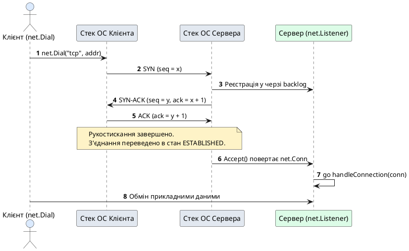
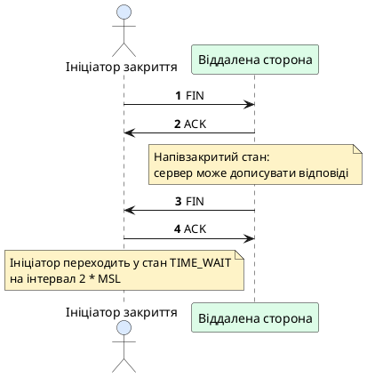
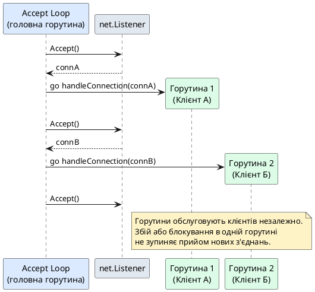

# Сокетне програмування та протокол TCP у Go

::card-group

::card{title="🎯 Навчальні цілі" icon="i-lucide-graduation-cap"}

- Сформувати розуміння мережевого сокета (*socket*) як спеціалізованого файлового дескриптора в операційних системах Unix.
- Дослідити ключові властивості протоколу TCP: гарантовану доставку, збереження порядку байтів та відсутність меж повідомлень (*byte stream*).
- Засвоїти етапи життєвого циклу TCP-сесії: потрійне рукостискання (*3-Way Handshake*), чотиристороннє завершення (*4-Way Close*) і стан `TIME_WAIT`.
- Опанувати мережеві примітиви пакета `net`: інтерфейси `net.Conn`, `net.Listener` та функції `net.DialTimeout`, `net.Listen`.
- Реалізувати масштабований сервер за архітектурою «горутина на кожне з'єднання» (*goroutine-per-connection*) з використанням внутрішнього планувальника *netpoller*.
- Застосувати потокове й буферизоване введення/виведення через пакети `io` та `bufio`.
- Спроєктувати надійні прикладні протоколи за допомогою трьох технік фреймінгу: розділювачів, префікса довжини та формату TLV (*Type-Length-Value*).
- Побудувати багатокористувацький чат на базі патерна Hub за моделлю взаємодіючих послідовних процесів (*CSP*).
- Реалізувати плавне завершення роботи сервера (*Graceful Shutdown*) через контекст сигналів ОС і синхронізацію активних горутин.

::

::card{title="🛠️ Технологічний стек" icon="i-lucide-cpu"}

- **Мова:** Go 1.22+
- **Стандартні пакети:** `net`, `io`, `bufio`, `context`, `os/signal`, `sync`, `encoding/binary`
- **Діагностичні утиліти:** `nc` (*netcat*), `tcpdump`, `lsof -i`, `netstat`

::

::

---

## Від внутрішньої конкурентності до мережевої взаємодії

У попередніх темах ми детально розглянули інструменти координації конкурентності всередині одного процесу операційної системи: горутини, канали зв'язку та контексти (*contexts*). Ці примітиви забезпечують ефективну утилізацію процесорних ядер і безпечний обмін даними між незалежними завданнями. Проте будь-який серверний застосунок потребує зовнішнього джерела навантаження, яке породжує ці завдання.

У клієнт-серверній архітектурі таким джерелом є вхідні мережеві запити. Мережевий сервер — це конкурентна система, для якої кожне нове підключення клієнта виступає асинхронною подією. Сервер не може передбачити час надходження нового клієнта, швидкість передачі даних чи момент раптового обриву зв'язку.

Саме тому мережеві абстракції мови Go органічно поєднуються з моделлю конкурентності: операційна система сигналізує про нове TCP-з'єднання, середовище виконання делегує його обробку окремій горутині, а життєвий цикл координується через канали та контексти. Для свідомого використання мережевого API необхідно розпочати з фундаментального рівня: зрозуміти, як операційна система ініціалізує сокети та контролює рух байтових сегментів мережею.

---

## Спостереження сирих TCP-сегментів через tcpdump і netcat

Мережевий стек операційної системи реалізує транспортний протокол TCP незалежно від мови програмування, якою написано кінцевий застосунок. Побачити службовий обмін сегментами можна безпосередньо в терміналі за допомогою двох системних утиліт:
1. `nc` (*netcat*) — утиліта для створення довільних TCP/UDP з'єднань та прослуховування портів.
2. `tcpdump` — пакетний аналізатор, що перехоплює байти на рівні мережевого інтерфейсу.

Відкриємо два термінали для створення з'єднання:

::tabs
::tabs-item{label="Термінал 1: Сервер"}

```bash
nc -l 9000
```

::
::tabs-item{label="Термінал 2: Клієнт"}

```bash
nc localhost 9000
```

::
::

Паралельно у третьому терміналі запустимо моніторинг трафіку на локальному інтерфейсі loopback (`lo0` або `lo` залежно від ОС):

```bash
sudo tcpdump -nn -i lo0 port 9000
```

Щойно клієнт ініціює підключення, `tcpdump` фіксує послідовність керуючих сегментів транспортного рівня:

::terminal-preview{title="sudo tcpdump -nn -i lo0 port 9000" :cursor="true"}

<div class="line"><span class="opacity-40">$</span> <strong class="font-bold">sudo tcpdump -nn -i lo0 port 9000</strong></div>
<div class="line">10:15:01.102 IP <span class="text-blue-400 font-bold">127.0.0.1.53120</span> &gt; <span class="text-green-400 font-bold">127.0.0.1.9000</span>: Flags <span class="text-yellow-400 font-bold">[S]</span>, seq <span class="text-yellow-400 font-bold">1005001</span>, win 65535, length 0</div>
<div class="line">10:15:01.103 IP <span class="text-green-400 font-bold">127.0.0.1.9000</span> &gt; <span class="text-blue-400 font-bold">127.0.0.1.53120</span>: Flags <span class="text-yellow-400 font-bold">[S.]</span>, seq <span class="text-yellow-400 font-bold">8940021</span>, ack <span class="text-yellow-400 font-bold">1005002</span>, win 65535, length 0</div>
<div class="line">10:15:01.104 IP <span class="text-blue-400 font-bold">127.0.0.1.53120</span> &gt; <span class="text-green-400 font-bold">127.0.0.1.9000</span>: Flags <span class="text-yellow-400 font-bold">[.]</span>, ack <span class="text-yellow-400 font-bold">8940022</span>, win 65535, length 0</div>
<div class="line opacity-60">--- З'єднання встановлено. Відправка рядка 'HELLO\n' (6 байтів) ---</div>
<div class="line">10:15:05.410 IP <span class="text-blue-400 font-bold">127.0.0.1.53120</span> &gt; <span class="text-green-400 font-bold">127.0.0.1.9000</span>: Flags <span class="text-yellow-400 font-bold">[P.]</span>, seq <span class="text-yellow-400 font-bold">1005002:1005008</span>, ack <span class="text-yellow-400 font-bold">8940022</span>, length <span class="text-green-400 font-bold">6</span></div>
<div class="line">10:15:05.411 IP <span class="text-green-400 font-bold">127.0.0.1.9000</span> &gt; <span class="text-blue-400 font-bold">127.0.0.1.53120</span>: Flags <span class="text-yellow-400 font-bold">[.]</span>, ack <span class="text-yellow-400 font-bold">1005008</span>, win 65535, length 0</div>
::

У цьому лозі чітко видно призначення керуючих прапорців:
- `[S]` (*SYN*): клієнт генерує початковий порядковий номер (*Initial Sequence Number, ISN*) `seq 1005001`.
- `[S.]` (*SYN-ACK*): сервер підтверджує отримання номера клієнта (`ack = 1005001 + 1 = 1005002`) та надсилає власний номер `seq 8940021`.
- `[.]` (*ACK*): клієнт підтверджує номер сервера (`ack = 8940021 + 1 = 8940022`). З цього моменту з'єднання переходить у стан `ESTABLISHED`.
- `[P.]` (*PSH-ACK*): прапорець проштовхування (*push*) повідомляє операційній системі про необхідність негайно передати отримані 6 байтів у прикладну програму без затримки в буфері.

Високорівневі бібліотеки Go повністю приховують цей обмін прапорцями за функціями `net.Dial` та `net.Listen`. Розуміння структури сирих сегментів дозволяє швидко діагностувати мережеві збої за допомогою утиліт моніторингу трафіку.

---

## Ментальна модель сокета Берклі

Основою мережевого стека сучасних операційних систем є **сокети Берклі** (*Berkeley Sockets API*), розроблені на початку 1980-х років в університеті Берклі (BSD Unix). Цей інтерфейс став галузевим стандартом завдяки принципу POSIX: «усе є файлом» (*everything is a file*).

Сокет — це не фізичне з'єднання і не кабель, а числовий **файловий дескриптор** (*file descriptor*), що посилається на структуру даних у просторі ядра операційної системи. Ядро асоціює дескриптор сокета з мережевими буферами прийому і відправки (*RX/TX buffers*), чергами пакетів, локальними та віддаленими адресами. Завдяки цій абстракції операції над мережею зводяться до стандартних операцій введення/виведення: `read()`, `write()` та `close()`.

З точки зору операційної системи процес ініціалізації сокета складається з п'яти системних викликів:

1. **`socket()`** — створює дескриптор ресурсу із зазначенням сімейства адрес (IPv4/IPv6) та типу транспорту (потоковий TCP `SOCK_STREAM` або датаграмний UDP `SOCK_DGRAM`).
2. **`bind()`** — прив'язує створений дескриптор до конкретної пари «IP-адреса : порт» на локальному хості.
3. **`listen()`** — переводить прив'язаний сокет у пасивний стан очікування з'єднань і виділяє системну чергу очікування (*backlog*).
4. **`accept()`** — блокує процес до появи нового клієнта в черзі backlog та повертає **новий незалежний дескриптор** підключеного клієнта.
5. **`connect()`** — системний виклик клієнтської сторони для ініціалізації потрійного рукостискання з віддаленим сервером.

::tip
**Принципова різниця:** на стороні сервера одночасно існують сокети двох типів:
- **Слухаючий сокет (*listening socket*):** один на процес, прив'язаний до фіксованого порту; не передає прикладних даних, а лише реєструє нові з'єднання через `accept()`.
- **З'єднувальний сокет (*connected socket*):** створюється для кожного підключеного клієнта окремо; саме через нього виконуються операції `read()` та `write()`.
::

### Системна діагностика сокетів в ОС: lsof та netstat

Оскільки сокет є файловим дескриптором, його стан та прив'язку до процесу можна безпосередньо дослідити за допомогою стандартних утиліт Unix-подібних систем:

1. **`lsof` (*list open files*)** — показує сокети як відкриті файли конкретних процесів:

```bash
lsof -nP -iTCP:9000
```

::terminal-preview{title="lsof -nP -iTCP:9000" :cursor="false"}

<div class="line"><span class="opacity-40">$</span> <strong class="font-bold">lsof -nP -iTCP:9000</strong></div>
<div class="line">COMMAND   PID     USER   FD   TYPE             DEVICE SIZE/OFF NODE NAME</div>
<div class="line">server  <span class="text-blue-400 font-bold">42810</span>  student    <span class="text-yellow-400 font-bold">3u</span>  IPv6 0x8a92b0c19a2e31      0t0  TCP <span class="text-green-400 font-bold">*:9000 (LISTEN)</span></div>
<div class="line">server  <span class="text-blue-400 font-bold">42810</span>  student    <span class="text-yellow-400 font-bold">4u</span>  IPv6 0x8a92b0c19c5b12      0t0  TCP <span class="text-blue-400 font-bold">127.0.0.1:9000-&gt;127.0.0.1:54320 (ESTABLISHED)</span></div>
::

У колонці `FD` видно числові дескриптори файлів: дескриптор `3u` — це слухаючий сокет сервера (`LISTEN`), а `4u` — окремий дескриптор з'єднання з клієнтом (`ESTABLISHED`).

2. **`netstat` або `ss`** — відображає активні мережеві точки та стан їхніх кінцевих автоматів:

```bash
netstat -an | grep 9000
```

::terminal-preview{title="netstat -an | grep 9000" :cursor="false"}

<div class="line"><span class="opacity-40">$</span> <strong class="font-bold">netstat -an | grep 9000</strong></div>
<div class="line">tcp4  0  0  *.9000          *.*              <span class="text-green-400 font-bold">LISTEN</span></div>
<div class="line">tcp4  0  0  127.0.0.1.9000  127.0.0.1.54320  <span class="text-blue-400 font-bold">ESTABLISHED</span></div>
<div class="line">tcp4  0  0  127.0.0.1.9000  127.0.0.1.54319  <span class="text-yellow-400 font-bold">TIME_WAIT</span></div>
::

---

## Фундаментальні характеристики протоколу TCP

Протокол керування передачею (*Transmission Control Protocol, TCP*) — це протокол транспортного рівня моделі OSI, розроблений для надійного обміну даними поверх ненадійної IP-мережі. Ключові гарантії TCP включають:

- **Орієнтованість на з'єднання (*connection-oriented*):** жоден байт прикладних даних не передається до успішного завершення процедури потрійного рукостискання.
- **Гарантована доставка та цілісність (*reliable delivery*):** кожен сегмент має контрольний номер (*sequence number*). Отримувач обов'язково підтверджує отримання квитанцією (*acknowledgment, ACK*). Якщо підтвердження не надходить за визначений інтервал (*retransmission timeout*), відправник повторює надсилання.
- **Збереження порядку (*ordered delivery*):** сегменти, які надійшли не по черзі через зміну маршрутів в IP-мережі, тимчасово буферизуються ядром і впорядковуються перед передачею в програму.
- **Повнодуплексний режим (*full-duplex*):** клієнт і сервер можуть передавати інформацію одночасно в обох напрямках незалежно один від одного.

### Анатомія заголовка TCP-сегмента

Усі гарантії надійності забезпечуються службовими полями заголовка TCP. Базовий заголовок сегмента без додаткових опцій має фіксовану довжину **20 байтів** (160 бітів):

| Поле заголовка | Розмір (біти) | Призначення |
| :--- | :--- | :--- |
| **Source Port** | 16 | Номер порту відправника |
| **Destination Port** | 16 | Номер порту отримувача |
| **Sequence Number (Seq)** | 32 | Порядковий номер першого байта даних у цьому сегменті |
| **Acknowledgment Number (Ack)** | 32 | Номер наступного байта, очікуваного від протилежної сторони |
| **Data Offset** | 4 | Довжина заголовка TCP у 32-бітних словах (мінімум 5, тобто 20 байтів) |
| **Reserved** | 3 | Зарезервовано для майбутніх розширень (завжди нулі) |
| **Flags** | 9 | Керуючі прапорці (`SYN`, `ACK`, `FIN`, `RST`, `PSH`, `URG`, `ECE`, `CWR`) |
| **Window Size** | 16 | Розмір вікна прийому в байтах (керування потоком, *Flow Control*) |
| **Checksum** | 16 | Контрольна сума заголовка, даних та псевдозаголовка IP |
| **Urgent Pointer** | 16 | Вказівник на термінові дані (якщо встановлено прапорець `URG`) |
| **Options** | 0–320 | Додаткові параметри (наприклад, `MSS`, `Window Scale`, `SACK`) |

Керуючі прапорці (*Flags*) визначають тип та роль конкретного сегмента:
- `SYN` (*Synchronize*) — запит на синхронізацію порядкових номерів при встановленні з'єднання.
- `ACK` (*Acknowledge*) — підтвердження успішного прийому даних аж до номера, вказаного в полі `Ack`.
- `FIN` (*Finish*) — сигнал про завершення відправки даних відправником.
- `RST` (*Reset*) — примусове скидання некоректного або розірваного з'єднання.
- `PSH` (*Push*) — вимога до стека ОС негайно передати буферизовані дані в прикладну програму.

Фіксований оверхед у 20 байтів на кожен TCP-пакет — це плата за гарантії впорядкованості, відновлення втрат та контроль перевантаження мережі.

### Проблема байтового потоку (Packet Framing)

Найважливіша особливість TCP полягає в тому, що він є **байтовим потоком (*byte stream*), а не протоколом повідомлень (*message-oriented*)**. TCP не знає про межі повідомлень у вашій програмі: для нього дані — це безперервна послідовність байтів.

Якщо клієнт виконає два послідовних виклики відправки:

```go
conn.Write([]byte("HELLO"))
conn.Write([]byte("WORLD"))
```

Сервер під час виклику `conn.Read()` може прочитати ці дані будь-яким із таких способів:
1. За один виклик: `"HELLOWORLD"` (склеювання даних через алгоритми оптимізації стека).
2. За два виклики: `"HELLO"`, потім `"WORLD"`.
3. За три виклики: `"HEL"`, `"LOWO"`, `"RLD"` (фрагментація через розмір буфера прийому).

::warning
Операційна система оптимізує навантаження на мережу, об'єднуючи або розбиваючи порції байтів. Розраховувати на те, що один `Write()` на клієнті завжди дорівнює одному `Read()` на сервері — груба архітектурна помилка. Будь-який протокол поверх TCP зобов'язаний самостійно визначати правила кадрування (*framing*).
::

---

## Життєвий цикл TCP-сесії

Передбачувана робота розподіленої системи вимагає узгодженого початку та завершення комунікації. Життєвий цикл TCP-сесії включає два ключові процеси: встановлення з'єднання та його коректне закриття.

### Встановлення з'єднання: 3-Way Handshake

Процедура потрійного рукостискання виконує синхронізацію початкових порядкових номерів (*ISN*) обох учасників:

1. **Клієнт -> Сервер (`SYN`):** клієнт генерує власний `seq = x` і надсилає запит на з'єднання.
2. **Сервер -> Клієнт (`SYN-ACK`):** сервер підтверджує отримання номера клієнта (`ack = x + 1`) та надсилає власний `seq = y`.
3. **Клієнт -> Сервер (`ACK`):** клієнт підтверджує отримання номера сервера (`ack = y + 1`).

::plant-uml{alt="TCP 3-Way Handshake"}



::

### Завершення з'єднання: 4-Way Close та стан TIME_WAIT

Оскільки TCP — це повнодуплексний протокол, кожен напрямок передачі закривається окремо за допомогою керуючого прапорця `FIN` (*finish*):

1. **Сторона А надсилає `FIN`:** сторона А повідомляє, що припинила запис у сокет.
2. **Сторона Б надсилає `ACK`:** сторона Б підтверджує отримання `FIN`. З'єднання переходить у напівзакритий стан (*half-closed*): сторона Б ще може надсилати дані стороні А.
3. **Сторона Б надсилає `FIN`:** завершивши передачу своїх відповідей, сторона Б надсилає власний `FIN`.
4. **Сторона А надсилає `ACK`:** сторона А підтверджує завершення.

::plant-uml{alt="TCP 4-Way Close"}



::

Сторона, яка першою ініціювала закриття з'єднання, переходить у системний стан **`TIME_WAIT`** і утримує зайняту пару портів протягом часу $2 \times \text{MSL}$ (*Maximum Segment Lifetime* — максимальний час існування сегмента в мережі, зазвичай 30–120 секунд):

::math-formula
T_{\text{TIME\_WAIT}} = 2 \times \text{MSL}
::

Цей стан вирішує дві задачі:
1. Гарантує, що фінальний `ACK` дійшов до адресата (якщо він загубиться, адресат повторно надішле `FIN`).
2. Запобігає потраплянню запізнілих пакетів старого з'єднання в нове з'єднання, відкрите на тому самому порті.

::::accordion

:::accordion-item{label="❓ Що означає аварійний сегмент RST (Reset)?" icon="i-lucide-help-circle"}

Сегмент `RST` призводить до негайного скидання з'єднання без чотиристороннього прощання. Операційна система відправляє `RST` у таких випадках:
- Спроба підключення на порт, де немає активного `LISTEN`-сокета (`connection refused`).
- Програма викликала жорстке закриття сокета з нульовим `SO_LINGER`.
- Дані надійшли на сокет, який прикладна програма вже закрила.

В Go читання з такого сокета повертає помилку `read: connection reset by peer`.

:::

:::accordion-item{label="❓ Чому після швидкого перезапуску сервера виникає помилка 'address already in use'?" icon="i-lucide-help-circle"}

Якщо сервер був ініціатором закриття активних клієнтських з'єднань під час зупинки, його сокети залишаються в стані `TIME_WAIT`. Операційна система блокує повторну прив'язку порту через виклик `bind()`. Для вирішення цієї проблеми застосовують сокетну опцію `SO_REUSEADDR`, яку пакет `net` мови Go встановлює автоматично.

:::

::::

---

## Мережеві примітиви мови Go

Уся функціональність сокетного програмування в Go зосереджена в стандартному пакеті `net`. Основними будівельними блоками є інтерфейси `net.Conn` та `net.Listener`.

### Інтерфейс net.Conn

Інтерфейс `net.Conn` моделює двостороннє потокове з'єднання:

```go
type Conn interface {
	Read(b []byte) (n int, err error)
	Write(b []byte) (n int, err error)
	Close() error
	LocalAddr() Addr
	RemoteAddr() Addr
	SetDeadline(t time.Time) error
	SetReadDeadline(t time.Time) error
	SetWriteDeadline(t time.Time) error
}
```

Методи `Read` та `Write` повністю задовольняють контракти інтерфейсів `io.Reader` та `io.Writer`. Це дозволяє передавати `net.Conn` у будь-які утиліти стандартної бібліотеки, наприклад, `io.Copy` чи `bufio.NewReader`.

Керування таймаутами здійснюється через методи дедлайнів. `SetDeadline` приймає фіксований момент часу в майбутньому (наприклад, `time.Now().Add(5 * time.Second)`). Якщо операція введення/виведення не завершується до цього моменту, середовище виконання перериває її з помилкою `os.ErrDeadlineExceeded`.

### Тонке налаштування TCP: алгоритм Нейгла та Keep-Alive

За замовчуванням операційна система застосовує **алгоритм Нейгла** (*Nagle's algorithm*): дрібні пакети тимчасово накопичуються в буфері відправника, щоб відправитися одним більшим сегментом. Для інтерактивних протоколів (ігрові сервери, стрімінг котирувань) це додає неприпустиму затримку. Вимкнути буферизацію Нейгла можна через приведення інтерфейсу `net.Conn` до конкретного типу `*net.TCPConn`:

```go
if tcpConn, ok := conn.(*net.TCPConn); ok {
	_ = tcpConn.SetNoDelay(true) // вимикаємо затримку Нейгла (TCP_NODELAY)
	_ = tcpConn.SetKeepAlive(true) // перевірка зв'язку фоновими пакетами
	_ = tcpConn.SetKeepAlivePeriod(30 * time.Second)
}
```

---

## Реалізація клієнта та сервера: готові програми для запуску

Для практичного освоєння сокетів створимо повноцінні програми клієнта та сервера. Їх можна скопіювати в окремі файли та запустити у двох терміналах.

### Повноцінний TCP-клієнт

Клієнт підключається до сервера з таймаутом `net.DialTimeout`, відправляє рядок тексту, зчитує відповідь у буфер і коректно звільняє дескриптор сокета через `defer conn.Close()`.

```go [cmd/client/main.go]
package main

import (
	"fmt"
	"io"
	"log"
	"net"
	"time"
)

func main() {
	// Встановлення TCP-з'єднання з таймаутом підключення 5 секунд
	conn, err := net.DialTimeout("tcp", "localhost:9000", 5*time.Second)
	if err != nil {
		log.Fatalf("Не вдалося підключитися до сервера: %v", err)
	}
	defer conn.Close()

	log.Printf("Підключено до сервера: %s -> %s", conn.LocalAddr(), conn.RemoteAddr())

	// Відправка тестового повідомлення
	message := "Привіт із Go клієнта!\n"
	if _, err := conn.Write([]byte(message)); err != nil {
		log.Fatalf("Помилка відправки даних: %v", err)
	}
	fmt.Printf("Надіслано: %s", message)

	// Читання відповіді сервера (буфер 1 КБ)
	buffer := make([]byte, 1024)
	n, err := conn.Read(buffer)
	if err != nil && err != io.EOF {
		log.Fatalf("Помилка читання відповіді: %v", err)
	}

	fmt.Printf("Отримано відповідь: %s", string(buffer[:n]))
}
```

### Конкурентний відлуння-сервер (Goroutine-Per-Connection)

Сервер слухає вхідний порт `:9000`. Для кожного підключеного клієнта головний цикл `Accept()` породжує окрему незалежну горутину `go handleConnection(conn)`.

```go [cmd/server/main.go]
package main

import (
	"errors"
	"io"
	"log"
	"net"
	"time"
)

func main() {
	// Створення слухаючого сокета (bind + listen)
	listener, err := net.Listen("tcp", ":9000")
	if err != nil {
		log.Fatalf("Помилка прив'язки сокета: %v", err)
	}
	defer listener.Close()

	log.Println("Сервер очікує підключення на адресі :9000...")

	for {
		// Очікування нового клієнта (блокуючий виклик accept)
		conn, err := listener.Accept()
		if err != nil {
			log.Printf("Помилка прийому клієнта: %v", err)
			continue
		}

		// Делегування обробки підключення окремій горутині
		go handleConnection(conn)
	}
}

func handleConnection(conn net.Conn) {
	defer conn.Close()
	remoteAddr := conn.RemoteAddr().String()
	log.Printf("Встановлено з'єднання з клієнтом: %s", remoteAddr)

	// Встановлюємо дедлайн неактивності: 60 секунд
	_ = conn.SetReadDeadline(time.Now().Add(60 * time.Second))

	buffer := make([]byte, 1024)
	for {
		n, err := conn.Read(buffer)
		if err != nil {
			if errors.Is(err, io.EOF) {
				log.Printf("Клієнт %s закрив з'єднання (EOF)", remoteAddr)
			} else {
				log.Printf("Збій читання з %s: %v", remoteAddr, err)
			}
			return
		}

		log.Printf("Отримано від %s: %s", remoteAddr, string(buffer[:n]))

		// Повертаємо отримані байти назад клієнту (Echo)
		if _, err := conn.Write(buffer[:n]); err != nil {
			log.Printf("Помилка запису до %s: %v", remoteAddr, err)
			return
		}

		// Продовжуємо дедлайн читання для наступного повідомлення
		_ = conn.SetReadDeadline(time.Now().Add(60 * time.Second))
	}
}
```

::plant-uml{alt="Архітектура goroutine-per-connection"}



::

### Механізм Go Netpoller

У багатьох класичних середовищах виконання створення окремого потоку ОС на кожного клієнта призводить до швидкого вичерпання ресурсів пам'яті (стек системного потоку займає від 1 до 8 МБ) і високих накладних витрат на перемикання контексту.

У мові Go ця проблема вирішена на рівні середовища виконання завдяки компоненту **Netpoller**. Під капотом середовище Go створює системні неблокуючі сокети (*non-blocking sockets*) та реєструє їх у системному механізмі мультиплексування подій:
- `epoll` у Linux
- `kqueue` у macOS та FreeBSD
- `IOCP` у Windows

Коли горутина викликає `conn.Read()`, а дані ще не надійшли з мережі, Netpoller переводить горутину в режим очікування (*parks goroutine*). Системний потік процесора негайно звільняється для виконання інших горутин. Щойно мережева карта записує байти в буфер і операційна система генерує подію готовності, Netpoller будить горутину і повертає її в чергу виконання планувальника Go. Завдяки мінімальному початковому стеку горутини (від 2 КБ) Go-сервер може підтримувати сотні тисяч одночасних підключень на скромному апаратному забезпеченні.

### Захист від вичерпання ресурсів: лімітер підключень на базі семафора

Модель «горутина на кожне з'єднання» є надзвичайно масштабованою, проте за умов різкого сплеску трафіку або зловмисної DoS-атаки неконтрольоване породження горутин може призвести до вичерпання системних дескрипторів файлів (`too many open files`) або переповнення оперативної пам'яті.

В ідіоматичному Go обмеження пулу одночасних підключень реалізується через патерн **лічильного семафора на буферизованому каналі**. Буфер каналу ємністю $N$ символізує кількість доступних слотів для підключень. Захоплення слота здійснюється через запис у канал `sem <- struct{}{}`, а звільнення — через читання `<-sem`.

Нижче наведено повноцінний сервер із захистом від перевантаження: якщо ліміт вичерпано, сервер негайно інформує клієнта та ввічливо розриває з'єднання, не витрачаючи пам'ять на нову горутину-обробник:

```go [cmd/limited_server/main.go]
package main

import (
	"errors"
	"io"
	"log"
	"net"
	"time"
)

func main() {
	const maxConnections = 100
	// Буферизований канал ємністю maxConnections виступає лічильним семафором
	sem := make(chan struct{}, maxConnections)

	listener, err := net.Listen("tcp", ":9000")
	if err != nil {
		log.Fatalf("Помилка прив'язки сокета: %v", err)
	}
	defer listener.Close()

	log.Printf("Сервер із лімітом з'єднань (%d) слухає :9000...", maxConnections)

	for {
		conn, err := listener.Accept()
		if err != nil {
			log.Printf("Помилка прийому: %v", err)
			continue
		}

		// Неблокуюча перевірка доступності слота через select + default
		select {
		case sem <- struct{}{}:
			// Слот успішно захоплено — породжуємо горутину обробки
			go func(c net.Conn) {
				defer func() {
					<-sem // Обов'язково звільняємо слот у семафорі після закриття
					c.Close()
				}()
				handleLimitedConnection(c)
			}(conn)

		default:
			// Усі слоти зайняті: відхиляємо підключення без виділення ресурсів
			log.Printf("Перевищено ліміт підключень (%d). Відхилено: %s", maxConnections, conn.RemoteAddr())
			_, _ = conn.Write([]byte("ERR: сервер перевантажено. Спробуйте пізніше.\n"))
			conn.Close()
		}
	}
}

func handleLimitedConnection(conn net.Conn) {
	_ = conn.SetReadDeadline(time.Now().Add(30 * time.Second))
	buffer := make([]byte, 1024)

	for {
		n, err := conn.Read(buffer)
		if err != nil {
			if !errors.Is(err, io.EOF) {
				log.Printf("Збій зв'язку з %s: %v", conn.RemoteAddr(), err)
			}
			return
		}

		if _, err := conn.Write(buffer[:n]); err != nil {
			return
		}
		_ = conn.SetReadDeadline(time.Now().Add(30 * time.Second))
	}
}
```

---

## Потокове та буферизоване введення/виведення

Пряме звернення до `conn.Read()` або `conn.Write()` для кожного невеликого рядка викликає системні виклики ядра, що знижує загальну пропускну здатність системи. Для ефективного обміну даними стандартна бібліотека пропонує пакет **`bufio`**.

### Читання потоку: bufio.Reader та bufio.Scanner

`bufio.Reader` створює проміжний буфер у пам'яті (за замовчуванням 4 КБ), заповнює його за один системний виклик, а потім порційно видає дані прикладній програмі:

- `reader.ReadString('\n')` — зчитує байти до вказаного символу-розділювача (включно з ним).
- `bufio.Scanner` — утиліта, яка автоматично розбиває потік на рядки, прибираючи символ `\n`:

```go
scanner := bufio.NewScanner(conn)
for scanner.Scan() {
	line := scanner.Text() // отримано рядок без \n
	log.Printf("Команда: %s", line)
}
if err := scanner.Err(); err != nil {
	log.Printf("Помилка читання потоку: %v", err)
}
```

### Запис потоку та обов'язковий Flush()

`bufio.Writer` накопичує байти у внутрішньому буфері і відправляє їх у мережу лише тоді, коли буфер заповнюється повністю, або коли програма явно викликає метод `Flush()`:

```go
writer := bufio.NewWriter(conn)
_, _ = writer.WriteString("Результат обробки команди\n")
_ = writer.Flush() // критично: без Flush дані залишаться в пам'яті процесу!
```

::caution
Якщо з'єднання закривається через `conn.Close()` до виклику `writer.Flush()`, усі накопичені в буфері дані будуть безповоротно втрачені, оскільки вони не встигли передатися в сокет.
::

---

## Проєктування прикладних протоколів (Message Framing)

Оскільки TCP — це неперервний потік байтів, прикладний протокол повинен надати спосіб ідентифікації початку та кінця повідомлення. Існує три класичні інженерні підходи до фреймінгу.

### Розділювачі (Delimiter-based)

Між повідомленнями розміщується заздалегідь узгоджений символ (наприклад, `\n` або `\r\n`). Цей метод використовується в протоколах SMTP, FTP, Redis RESP. Він зручний для налагодження людиною через консоль, проте вимагає екранування, якщо символ-розділювач випадково трапляється у бінарному тілі повідомлення.

### Префікс довжини (Length-Prefixed)

Перед корисним навантаженням надсилається фіксована кількість байтів (зазвичай 2 або 4 байти), які кодують ціле число — довжину тіла повідомлення. Отримувач спочатку читає фіксовану кількість байтів заголовка, дізнається довжину $L$, а потім вичитує рівно $L$ байтів тіла. Для гарантованого вичитування повної порції байтів стандартна бібліотека надає функцію `io.ReadFull`.

### Формат TLV (Type-Length-Value)

Найбільш гнучкий формат кадру, який використовується в сучасних бінарних протоколах. Кожен кадр містить три складові:
1. **Type (1–2 байти):** ідентифікатор типу команди чи події.
2. **Length (2–4 байти):** довжина тіла повідомлення.
3. **Value (довільна кількість байтів):** корисне навантаження.

### Зіставлення методів пакування кадрів

Порівняємо кодову структуру запису повідомлення для кожного з трьох підходів:

::code-group

```go [1. Розділювач (Delimiter)]
func WriteLine(w io.Writer, msg string) error {
	// Додаємо символ нового рядка як маркер кінця повідомлення
	_, err := fmt.Fprintf(w, "%s\n", msg)
	return err
}
```

```go [2. Префікс довжини (Length-Prefixed)]
func WriteLengthPrefixed(w io.Writer, payload []byte) error {
	header := make([]byte, 4)
	// Записуємо розмір тіла 4-байтним числом у мережевому порядку (Big-Endian)
	binary.BigEndian.PutUint32(header, uint32(len(payload)))
	if _, err := w.Write(header); err != nil {
		return err
	}
	_, err := w.Write(payload)
	return err
}
```

```go [3. Формат TLV (Type-Length-Value)]
func WriteTLV(w io.Writer, msgType uint8, payload []byte) error {
	header := make([]byte, 5)
	header[0] = msgType
	// 1 байт типу + 4 байти довжини
	binary.BigEndian.PutUint32(header[1:5], uint32(len(payload)))
	if _, err := w.Write(header); err != nil {
		return err
	}
	_, err := w.Write(payload)
	return err
}
```

::

### Повноцінна демонстраційна програма кадрування TLV

Наведений нижче лістинг є готовою програмою, яку можна запустити локально командою `go run main.go`. Вона демонструє запис різнорідних повідомлень у єдиний байтовий потік та їх безпомилкове відновлення.

```go [cmd/framing/main.go]
package main

import (
	"bytes"
	"encoding/binary"
	"fmt"
	"io"
	"log"
)

// MessageType кодує тип повідомлення в першому байті заголовка
type MessageType uint8

const (
	TypePing        MessageType = 1
	TypeChatMessage MessageType = 2
	TypeDisconnect  MessageType = 3
)

func (t MessageType) String() string {
	switch t {
	case TypePing:
		return "PING"
	case TypeChatMessage:
		return "CHAT_MESSAGE"
	case TypeDisconnect:
		return "DISCONNECT"
	default:
		return "UNKNOWN"
	}
}

// WriteFrame пакує повідомлення у формат TLV (1 байт типу + 4 байти довжини + тіло)
func WriteFrame(w io.Writer, msgType MessageType, payload []byte) error {
	header := make([]byte, 5)
	header[0] = byte(msgType)
	// Мережевий порядок байтів: Big-Endian (старший байт перший)
	binary.BigEndian.PutUint32(header[1:5], uint32(len(payload)))

	if _, err := w.Write(header); err != nil {
		return fmt.Errorf("запис заголовка TLV: %w", err)
	}
	if len(payload) > 0 {
		if _, err := w.Write(payload); err != nil {
			return fmt.Errorf("запис тіла TLV: %w", err)
		}
	}
	return nil
}

// ReadFrame декодує наступний кадр TLV із байтового потоку
func ReadFrame(r io.Reader) (MessageType, []byte, error) {
	header := make([]byte, 5)
	// Використовуємо io.ReadFull для гарантованого читання всіх 5 байтів заголовка
	if _, err := io.ReadFull(r, header); err != nil {
		return 0, nil, err
	}

	msgType := MessageType(header[0])
	length := binary.BigEndian.Uint32(header[1:5])

	// Захист від атаки вичерпання пам'яті (ліміт повідомлення: 1 МБ)
	const maxPayloadSize = 1024 * 1024
	if length > maxPayloadSize {
		return 0, nil, fmt.Errorf("розмір кадру (%d байтів) перевищує ліміт", length)
	}

	payload := make([]byte, length)
	if _, err := io.ReadFull(r, payload); err != nil {
		return 0, nil, fmt.Errorf("помилка читання тіла кадру: %w", err)
	}

	return msgType, payload, nil
}

func main() {
	// Імітація байтового потоку TCP через буфер у пам'яті
	stream := new(bytes.Buffer)

	log.Println("=== Пакування повідомлень у TLV-потік ===")
	_ = WriteFrame(stream, TypePing, nil)
	_ = WriteFrame(stream, TypeChatMessage, []byte("Студент підключився до практичної роботи"))
	_ = WriteFrame(stream, TypeDisconnect, []byte("Сесію завершено"))

	fmt.Printf("Загальний розмір неперервного потоку: %d байтів\n\n", stream.Len())

	log.Println("=== Розпакування повідомлень із потоку ===")
	for {
		msgType, payload, err := ReadFrame(stream)
		if err == io.EOF {
			log.Println("Усі кадри успішно прочитано (потік вичерпано).")
			break
		}
		if err != nil {
			log.Fatalf("Помилка розбору кадру: %v", err)
		}

		fmt.Printf("Отримано кадр -> Тип: %-12s | Довжина: %-2d байтів | Дані: %s\n",
			msgType, len(payload), string(payload))
	}
}
```

::terminal-preview{title="go run cmd/framing/main.go" :cursor="false"}

<div class="line"><span class="opacity-40">$</span> <strong class="font-bold">go run cmd/framing/main.go</strong></div>
<div class="line">=== Пакування повідомлень у TLV-потік ===</div>
<div class="line">Загальний розмір неперервного потоку: 122 байтів</div>
<div class="line">=== Розпакування повідомлень із потоку ===</div>
<div class="line">Отримано кадр -&gt; Тип: <span class="text-blue-400 font-bold">PING</span>         | Довжина: 0  байтів | Дані: </div>
<div class="line">Отримано кадр -&gt; Тип: <span class="text-green-400 font-bold">CHAT_MESSAGE</span> | Довжина: 77 байтів | Дані: Студент підключився до практичної роботи</div>
<div class="line">Отримано кадр -&gt; Тип: <span class="text-yellow-400 font-bold">DISCONNECT</span>   | Довжина: 30 байтів | Дані: Сесію завершено</div>
<div class="line">Усі кадри успішно прочитано (потік вичерпано).</div>
::

---

## Патерн Broadcast Hub: координація повідомлень через канали

Коли сервер обслуговує сотні клієнтів, виникає потреба широкомовного розсилання повідомлень (*broadcast*): подія від одного клієнта повинна надійти всім іншим. 

Традиційний підхід вимагав би зберігання списку клієнтів у структурі `map[net.Conn]bool`, захищеній м'ютексом `sync.Mutex`. Проте ідіоматичний підхід у Go базується на філософії CSP (*Communicating Sequential Processes*): **«Не спілкуйтеся через спільну пам'ять; натомість діліться пам'яттю, спілкуючись через канали»**.

Патерн **Hub** централізує керування станом у єдиній виділеній горутині, усуваючи стан гонитви (*race condition*).

### Повноцінний сервер багатокористувацького чату

Цей файл є повністю робочим чат-сервером. Запустіть його та підключіться з кількох терміналів за допомогою `nc localhost 9000`.

```go [cmd/chat/main.go]
package main

import (
	"bufio"
	"context"
	"fmt"
	"log"
	"net"
	"strings"
)

// clientRegistration інкапсулює дані для реєстрації нового учасника
type clientRegistration struct {
	conn net.Conn
	name string
}

// Hub централізовано керує списком клієнтів через канали
type Hub struct {
	clients    map[net.Conn]string
	register   chan clientRegistration
	unregister chan net.Conn
	broadcast  chan string
}

func NewHub() *Hub {
	return &Hub{
		clients:    make(map[net.Conn]string),
		register:   make(chan clientRegistration),
		unregister: make(chan net.Conn),
		broadcast:  make(chan string, 256), // буферизований канал для згладжування сплесків
	}
}

// Run виконується в єдиній горутині і послідовно змінює мапу клієнтів
func (h *Hub) Run(ctx context.Context) {
	for {
		select {
		case reg := <-h.register:
			h.clients[reg.conn] = reg.name
			h.broadcastMessage(fmt.Sprintf("📢 [%s] приєднався до чату\n", reg.name))

		case conn := <-h.unregister:
			if name, ok := h.clients[conn]; ok {
				delete(h.clients, conn)
				conn.Close()
				h.broadcastMessage(fmt.Sprintf("🚪 [%s] залишив чат\n", name))
			}

		case message := <-h.broadcast:
			h.broadcastMessage(message)

		case <-ctx.Done():
			for conn := range h.clients {
				conn.Close()
			}
			return
		}
	}
}

func (h *Hub) broadcastMessage(message string) {
	for conn := range h.clients {
		_, _ = conn.Write([]byte(message))
	}
}

func handleClient(hub *Hub, conn net.Conn) {
	defer func() {
		hub.unregister <- conn
	}()

	_, _ = conn.Write([]byte("Введіть ваше ім'я: "))
	scanner := bufio.NewScanner(conn)
	if !scanner.Scan() {
		return
	}
	name := strings.TrimSpace(scanner.Text())
	if name == "" {
		name = conn.RemoteAddr().String()
	}

	hub.register <- clientRegistration{conn: conn, name: name}
	_, _ = conn.Write([]byte(fmt.Sprintf("Вітаємо, %s! Набирайте повідомлення (/quit для виходу):\n", name)))

	for scanner.Scan() {
		text := strings.TrimSpace(scanner.Text())
		if text == "" {
			continue
		}
		if text == "/quit" {
			return
		}
		hub.broadcast <- fmt.Sprintf("[%s]: %s\n", name, text)
	}
}

func main() {
	listener, err := net.Listen("tcp", ":9000")
	if err != nil {
		log.Fatalf("Помилка запуску сервера: %v", err)
	}
	defer listener.Close()

	ctx, cancel := context.WithCancel(context.Background())
	defer cancel()

	hub := NewHub()
	go hub.Run(ctx)

	log.Println("Чат-сервер на базі Hub запущено на порту :9000")
	log.Println("Для перевірки виконайте: nc localhost 9000")

	for {
		conn, err := listener.Accept()
		if err != nil {
			log.Printf("Помилка підключення: %v", err)
			continue
		}
		go handleClient(hub, conn)
	}
}
```

---

## Плавне завершення роботи сервера (Graceful Shutdown)

У виробничих середовищах сервер регулярно перезавантажується під час оновлення коду в контейнерах. Якщо просто вбити процес сигналом `kill -9` або зупинити через `Ctrl+C`, відкриті клієнтські з'єднання обірвуться посеред обробки транзакцій.

**Плавне завершення (*Graceful Shutdown*)** гарантує:
1. Припинення прийому нових з'єднань через закриття слухаючого сокета `net.Listener`.
2. Надання активним клієнтам можливості коректно завершити поточний запит.
3. Очікування виходу всіх обробників із використанням `sync.WaitGroup` та контрольного таймауту.

### Повноцінний сервер із Graceful Shutdown

Цей код повністю готовий до запуску. Він перехоплює сигнали операційної системи `SIGINT` (Ctrl+C) та `SIGTERM`.

```go [cmd/graceful/main.go]
package main

import (
	"bufio"
	"context"
	"errors"
	"fmt"
	"log"
	"net"
	"os"
	"os/signal"
	"sync"
	"syscall"
	"time"
)

func main() {
	listener, err := net.Listen("tcp", ":9000")
	if err != nil {
		log.Fatalf("Помилка ініціалізації сокета: %v", err)
	}

	// Перехоплюємо системні сигнали SIGINT та SIGTERM у контекст
	ctx, stop := signal.NotifyContext(context.Background(), os.Interrupt, syscall.SIGTERM)
	defer stop()

	var wg sync.WaitGroup

	// Горутина моніторингу сигналу: закриває listener для зупинки нових клієнтів
	go func() {
		<-ctx.Done()
		log.Println("\nОтримано сигнал зупинки. Закриваємо слухаючий сокет...")
		_ = listener.Close()
	}()

	log.Println("Сервер із плавним завершенням слухає :9000. Натисніть Ctrl+C для зупинки.")

	for {
		conn, err := listener.Accept()
		if err != nil {
			// Якщо слухач закрито через listener.Close(), виходимо з циклу прийому
			if errors.Is(err, net.ErrClosed) {
				log.Println("Прийом нових з'єднань зупинено. Очікуємо завершення активних клієнтів...")
				break
			}
			log.Printf("Помилка прийому: %v", err)
			continue
		}

		wg.Add(1)
		go func(c net.Conn) {
			defer wg.Done()
			handleGracefulConnection(ctx, c)
		}(conn)
	}

	// Очікуємо завершення активних клієнтів із граничним таймаутом 10 секунд
	shutdownCtx, shutdownCancel := context.WithTimeout(context.Background(), 10*time.Second)
	defer shutdownCancel()

	done := make(chan struct{})
	go func() {
		wg.Wait()
		close(done)
	}()

	select {
	case <-done:
		log.Println("Усі активні з'єднання успішно завершено. Сервер вимкнено штатно.")
	case <-shutdownCtx.Done():
		log.Println("Вичерпано ліміт очікування клієнтів. Примусове завершення процесу.")
	}
}

func handleGracefulConnection(ctx context.Context, conn net.Conn) {
	defer conn.Close()
	remoteAddr := conn.RemoteAddr().String()
	log.Printf("[+] Клієнт підключився: %s", remoteAddr)

	_, _ = conn.Write([]byte("З'єднання встановлено. Введіть текст (або чекайте завершення сервера):\n"))

	scanner := bufio.NewScanner(conn)
	lines := make(chan string)

	// Читання сокета у фоновій горутині
	go func() {
		for scanner.Scan() {
			lines <- scanner.Text()
		}
		close(lines)
	}()

	for {
		select {
		case <-ctx.Done():
			// Сервер зупиняється: інформуємо клієнта і закриваємо з'єднання
			_, _ = conn.Write([]byte("\n⚠️ Сервер зупиняється на технічне обслуговування. З'єднання закрито.\n"))
			log.Printf("[-] Відключено клієнта %s через планову зупинку сервера", remoteAddr)
			return

		case line, ok := <-lines:
			if !ok {
				log.Printf("[-] Клієнт %s самостійно закрив з'єднання", remoteAddr)
				return
			}
			log.Printf("Повідомлення від %s: %s", remoteAddr, line)
			_, _ = conn.Write([]byte(fmt.Sprintf("Відлуння: %s\n", line)))
		}
	}
}
```

::steps

### Крок 1. Перехоплення системних сигналів
`signal.NotifyContext` пов'язує надходження `SIGINT`/`SIGTERM` зі скасуванням контексту `ctx`.

### Крок 2. Зупинка прийому нових з'єднань
Виклик `listener.Close()` розриває блокуючий `Accept()`, змушуючи його повернути сигнальну помилку `net.ErrClosed`.

### Крок 3. Реєстрація горутин у sync.WaitGroup
Кожне підключення збільшує лічильник `wg.Add(1)`, а при завершенні викликає `wg.Done()`.

### Крок 4. Очікування з дедлайном
Виклик `wg.Wait()` очікує завершення клієнтів, а `context.WithTimeout` гарантує, що процес не зависне назавжди через повільного клієнта.

::

---

## Практичне інженерне завдання: сервер із контролем активності (Heartbeat)

У реальних розподілених системах клієнти можуть втрачати з'єднання без відправки фінального сегмента `FIN` (наприклад, аварійне вимкнення живлення чи зникнення Wi-Fi). Якщо сервер не контролює активність, такі з'єднання залишаються відкритими нескінченно довго, вичерпуючи системні дескриптори.

::::accordion

:::accordion-item{label="📋 Завдання: Реалізація перевірки пульсу (Heartbeat/Keep-Alive)" icon="i-lucide-clipboard-list"}

Реалізуйте TCP-сервер, який контролює активність клієнта за такими правилами:
1. Таймаут неактивності становить 15 секунд.
2. Клієнт може підтримувати сесію надсиланням команди `PING\n`, на яку сервер відповідає `PONG\n`.
3. Якщо клієнт не надсилає жодних даних протягом 15 секунд, сервер повинен зафіксувати вичерпання дедлайну (`os.ErrDeadlineExceeded`), повідомити клієнта та безпечно закрити з'єднання.
4. Будь-які інші текстові рядки обробляються стандартною відповіддю `OK: опрацьовано '<рядок>'\n`.

:::

:::accordion-item{label="✅ Розв'язок" icon="i-lucide-check-circle"}

Нижче наведено самодостатню програму. Її можна запустити командою `go run cmd/heartbeat/main.go` та протестувати утилітою `nc localhost 9000`:

```go [cmd/heartbeat/main.go]
package main

import (
	"bufio"
	"errors"
	"fmt"
	"log"
	"net"
	"os"
	"strings"
	"time"
)

const heartbeatTimeout = 15 * time.Second

func main() {
	listener, err := net.Listen("tcp", ":9000")
	if err != nil {
		log.Fatalf("Помилка старту сервера: %v", err)
	}
	defer listener.Close()

	log.Println("Heartbeat-сервер слухає :9000 (таймаут неактивності: 15 с)...")
	log.Println("Для перевірки виконайте: nc localhost 9000")

	for {
		conn, err := listener.Accept()
		if err != nil {
			log.Printf("Помилка прийому: %v", err)
			continue
		}
		go handleHeartbeatClient(conn)
	}
}

func handleHeartbeatClient(conn net.Conn) {
	defer conn.Close()
	remoteAddr := conn.RemoteAddr().String()
	log.Printf("[+] Клієнт підключився: %s", remoteAddr)

	_, _ = conn.Write([]byte("Підключено! Надсилайте команди або 'PING' для підтримки сесії:\n"))

	scanner := bufio.NewScanner(conn)

	for {
		// Оновлюємо дедлайн читання перед кожною операцією очікування
		_ = conn.SetReadDeadline(time.Now().Add(heartbeatTimeout))

		if !scanner.Scan() {
			err := scanner.Err()
			if err != nil {
				if errors.Is(err, os.ErrDeadlineExceeded) {
					log.Printf("[-] Клієнта %s відключено: таймаут неактивності (15 с)", remoteAddr)
					_, _ = conn.Write([]byte("ERR: з'єднання розірвано через відсутність активності (таймаут)\n"))
				} else {
					log.Printf("[-] Помилка від %s: %v", remoteAddr, err)
				}
			} else {
				log.Printf("[-] Клієнт %s закрив з'єднання", remoteAddr)
			}
			return
		}

		line := strings.TrimSpace(scanner.Text())
		if strings.EqualFold(line, "PING") {
			_, _ = conn.Write([]byte("PONG\n"))
			log.Printf("[♥] Heartbeat від %s -> PONG", remoteAddr)
		} else {
			response := fmt.Sprintf("OK: опрацьовано '%s'\n", line)
			_, _ = conn.Write([]byte(response))
		}
	}
}
```

:::

::::

---

## Питання для самоперевірки

::::accordion

:::accordion-item{label="❓ Чому сокет є дескриптором, а не просто мережевою адресою?" icon="i-lucide-help-circle"}

Мережева адреса (IP та порт) лише визначає точку призначення пакетів у мережі. Сокет — це внутрішній системний дескриптор в ядрі ОС, який містить виділені буфери введення/виведення, черги пакетів, параметри вікна TCP та стан сесії. Через цей дескриптор процес звертається до мережі подібно до звичайного файлу.

:::

:::accordion-item{label="❓ Чому один виклик Write на клієнті не гарантує одного виклику Read на сервері?" icon="i-lucide-help-circle"}

Протокол TCP розглядає дані як безперервний потік байтів без внутрішніх меж. Операційна система та проміжні маршрутизатори мають право об'єднувати дрібні сегменти для зниження навантаження на мережу або розбивати великі порції на частини відповідно до розміру буфера прийому. Для виділення повідомлень прикладний рівень має реалізувати власний фреймінг.

:::

:::accordion-item{label="❓ Чому горутини в Go не блокують системні потоки ОС під час мережевого введення/виведення?" icon="i-lucide-help-circle"}

Середовище виконання Go використовує внутрішній компонент Netpoller, інтегрований із системними механізмами мультиплексування (`epoll`, `kqueue`). Коли сокет очікує на дані, Netpoller переводить горутину в стан сну і звільняє потік операційної системи для виконання інших задач. Коли дані з'являються в мережевому буфері, Netpoller миттєво повертає горутину в чергу виконання.

:::

:::accordion-item{label="❓ Чому виклик Flush() є обов'язковим при використанні bufio.Writer?" icon="i-lucide-help-circle"}

`bufio.Writer` накопичує записані байти в оперативній пам'яті для мінімізації кількості дорогих системних викликів. Системний виклик `write()` викликається лише при заповненні буфера або примусовому виклику `Flush()`. Якщо з'єднання закриється до скидання буфера, накопичені дані будуть безповоротно втрачені.

:::

:::accordion-item{label="❓ У чому полягає перевага патерна Hub над спільним sync.Mutex у чат-сервері?" icon="i-lucide-help-circle"}

Патерн Hub централізує доступ до мапи активних клієнтів в єдиній виділеній горутині, що взаємодіє з іншими через канали. Це усуває стан гонитви і виключає блокування горутин-обробників на м'ютексі, що робить архітектуру наочною, тестованою та стійкою до дедлоків.

:::

:::accordion-item{label="❓ Навіщо потрібна перевірка errors.Is(err, net.ErrClosed) під час Graceful Shutdown?" icon="i-lucide-help-circle"}

Коли сервер зупиняється, контрольна горутина закриває слухач викликом `listener.Close()`. Це змушує заблокований метод `Accept()` негайно розблокуватися і повернути помилку `net.ErrClosed`. Перевірка дозволяє відрізнити штатну зупинку сервера від справжнього мережевого збою і коректно вийти з нескінченного циклу прослуховування.

:::

::::

---

## Підсумки лекції

::card-group

::card{title="🔌 Сокети та протокол TCP" icon="i-lucide-plug"}

- Сокет Берклі — це абстракція файлового дескриптора в ядрі операційної системи.
- TCP гарантує доставку, цілісність та збереження порядку, функціонуючи як неперервний потік байтів без збереження меж повідомлень.
- Життєвий цикл TCP включає потрійне рукостискання (SYN, SYN-ACK, ACK), чотиристороннє завершення (FIN, ACK, FIN, ACK) та стан безпеки `TIME_WAIT`.

::

::card{title="🧵 Конкурентний сервер на Go" icon="i-lucide-server"}

- Архітектура «горутина на з'єднання» спирається на легковагі горутини та планувальник Netpoller, який працює поверх системних викликів `epoll`/`kqueue`.
- `net.Conn` реалізує `io.Reader` та `io.Writer`, що забезпечує пряму сумісність із буферизованими інструментами `bufio`.
- Алгоритм Нейгла вимикається опцією `SetNoDelay(true)` для чутливих до затримок застосунків.

::

::card{title="📦 Фреймінг та надійність" icon="i-lucide-shield-check"}

- Межі повідомлень визначаються через символи-розділювачі, префікс довжини або універсальний бінарний формат TLV (*Type-Length-Value*).
- Патерн Hub організовує широкомовне розсилання повідомлень між клієнтами на базі каналів без використання м'ютексів.
- Graceful Shutdown поєднує `signal.NotifyContext`, закриття `net.Listener` та `sync.WaitGroup` для захисту активних з'єднань від раптового обриву.

::

::
