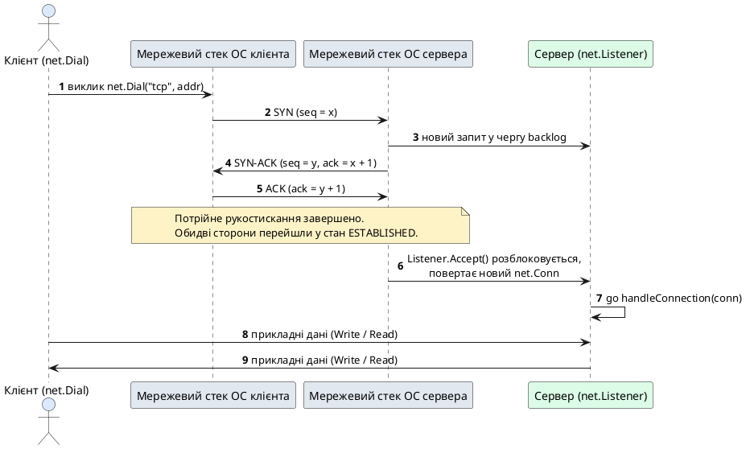
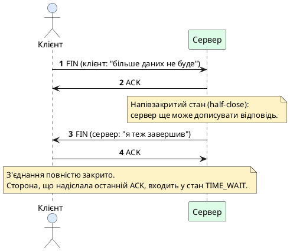
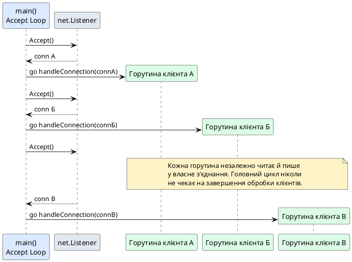

# Сокетне програмування та протокол TCP у Go

::card-group

::card{title="🎯 Навчальні цілі" icon="i-lucide-graduation-cap"}

- Побудувати чітку ментальну модель мережевого сокета (_socket_) як окремого випадку файлового дескриптора в дусі філософії Unix «усе є файлом».
- Зрозуміти ключові характеристики транспортного протоколу TCP: орієнтованість на з'єднання, гарантовану доставку, збереження порядку байтів та відсутність меж повідомлень (байтовий потік).
- Детально розібрати життєвий цикл TCP-сесії — від встановлення з'єднання через потрійне рукостискання (_3-Way Handshake_) до його коректного завершення через чотиристороннє прощання.
- Опанувати практичний інструментарій пакета `net`: функції `net.Dial` та `net.Listen`, а також інтерфейси `net.Conn` і `net.Listener`.
- Реалізувати класичну архітектуру мережевого сервера за моделлю «горутина на кожне з'єднання» (_goroutine-per-connection_), спираючись на знання з попередньої лекції про конкурентність.
- Навчитися працювати з потоковим введенням/виведенням через інтерфейси `io.Reader` і `io.Writer`, а також підвищувати ефективність обміну даними за допомогою пакета `bufio`.
- Спроєктувати власний протокол прикладного рівня поверх «сирого» байтового потоку TCP, обравши між розділювачами, префіксом довжини повідомлення та форматом TLV.
- Реалізувати патерн Hub для потокобезпечної трансляції повідомлень (_broadcast_) між незалежними горутинами-обробниками, спираючись на канали, а не на явний м'ютекс.
- Реалізувати плавне завершення роботи сервера (_Graceful Shutdown_) з коректною обробкою сигналів операційної системи `SIGINT`/`SIGTERM`.

::

::card{title="🛠️ Технологічний стек" icon="i-lucide-cpu"}

- **Мова:** Go 1.22+
- **Пакети стандартної бібліотеки:** `net`, `io`, `bufio`, `context`, `os/signal`, `sync`
- **Інструменти діагностики:** `netstat`, `lsof -i`, `nc` (netcat), `tcpdump`/Wireshark

::

::

---

## Від конкурентного коду до мережевої взаємодії

У попередній лекції ми озброїлися повним набором інструментів для координації конкурентної роботи всередині одного процесу: горутини дозволили нам запускати незалежні логічні потоки виконання майже безкоштовно, канали й `select` — безпечно обмінюватися між ними даними, а пакет `context` — узгоджено скасовувати роботу цілого дерева горутин за сигналом ззовні. Насамкінець ми навмисно залишили відкритим одне запитання: а звідки, власне, у сервера з'являється робота, яку потрібно розподіляти по горутинах?

Відповідь на це запитання й становить предмет цієї лекції. Кожне вхідне мережеве з'єднання від клієнта — це подія, що відбувається асинхронно й непередбачувано щодо решти програми: сервер не може знати заздалегідь, коли саме прийде наступний клієнт, скільки байтів він надішле і з якою швидкістю читатиме відповідь. Українською мовою це можна сформулювати так: **мережевий сервер — це, по суті, конкурентна програма, у якої джерелом нових конкурентних завдань виступають вхідні TCP-з'єднання**. Саме тому архітектура «горутина на кожне з'єднання», яку ми детально розберемо нижче, є прямим і природним застосуванням усього матеріалу попередньої лекції: щойно сервер приймає нове з'єднання, він запускає для нього окрему горутину, а `context` координує коректне завершення роботи всіх таких горутин під час зупинки сервера.

Перш ніж переходити до коду мовою Go, необхідно закласти фундамент — зрозуміти, що таке сокет із погляду операційної системи, і чому протокол TCP влаштований саме так, а не інакше. Без цього фундаменту виклики на кшталт `net.Listen` чи `net.Dial` залишаться незрозумілими магічними заклинаннями, а не свідомо застосованим інструментом.

::note
**Місток із лекції 1:** пригадаємо базову модель клієнт-серверної взаємодії, яку ми розглядали на самому початку курсу. Клієнт — це процес, який ініціює з'єднання й надсилає запит; сервер — це процес, який заздалегідь очікує на визначеній мережевій адресі (IP-адреса + порт) і обробляє запити, що надходять. У цій лекції ми вперше побачимо, як саме ця абстрактна модель втілюється в конкретний програмний код за допомогою системних викликів операційної системи та пакета `net` мови Go.
::

---

## Наочна демонстрація: спостерігаємо сирі TCP-сегменти без жодного рядка коду

Перш ніж занурюватися в Go-специфічний пакет `net`, корисно на власні очі побачити те, про що піде мова далі, — реальні службові сегменти TCP, якими обмінюються дві програми, що взагалі не написані жодною мовою програмування у звичному розумінні. Операційна система обслуговує TCP-з'єднання цілком однаково незалежно від того, хто саме його встановив, тому продемонструвати рукостискання, порядкові номери та підтвердження можна за допомогою двох стандартних утиліт командного рядка Unix-подібних систем: `nc` (_netcat_, «мережевий швейцарський ніж», що вміє відкривати сирий TCP-сокет прямо з термінала) та `tcpdump` (аналізатор мережевого трафіку, що перехоплює й показує кожен сегмент, який проходить через мережевий інтерфейс).

Відкриємо два термінали. У першому запустимо найпростіший TCP-сервер, що просто слухає порт і виводить на екран усе отримане, а в другому — клієнта, що підключається до нього:

::tabs
::tabs-item{label="Термінал 1: сервер"}
```bash
nc -l 9000
```
::
::tabs-item{label="Термінал 2: клієнт"}
```bash
nc localhost 9000
```
::
::

У третьому терміналі запустимо перехоплення трафіку на локальному інтерфейсі loopback ще до моменту з'єднання клієнта, щоб побачити геть усі службові сегменти:

```bash
sudo tcpdump -nn -i lo0 port 9000
```

Щойно клієнтський `nc` підключиться до серверного, `tcpdump` виведе на екран рядки, що буквально документують потрійне рукостискання, яке ми детально розберемо в наступному розділі:

::terminal-preview{title="sudo tcpdump -nn -i lo0 port 9000" :cursor="true"}

<div class="line"><span class="opacity-40">$</span> <strong class="font-bold">sudo tcpdump -nn -i lo0 port 9000</strong></div>
<div class="line">15:42:07.128104 IP <span class="text-blue-400 font-bold">127.0.0.1.54213</span> &gt; <span class="text-green-400 font-bold">127.0.0.1.9000</span>: Flags <span class="text-yellow-400 font-bold">[S]</span>, seq <span class="text-yellow-400 font-bold">891273001</span>, win 65535, length 0</div>
<div class="line">15:42:07.128159 IP <span class="text-green-400 font-bold">127.0.0.1.9000</span> &gt; <span class="text-blue-400 font-bold">127.0.0.1.54213</span>: Flags <span class="text-yellow-400 font-bold">[S.]</span>, seq <span class="text-yellow-400 font-bold">340981552</span>, ack <span class="text-yellow-400 font-bold">891273002</span>, win 65535, length 0</div>
<div class="line">15:42:07.128201 IP <span class="text-blue-400 font-bold">127.0.0.1.54213</span> &gt; <span class="text-green-400 font-bold">127.0.0.1.9000</span>: Flags <span class="text-yellow-400 font-bold">[.]</span>, ack <span class="text-yellow-400 font-bold">340981553</span>, win 65535, length 0</div>
<div class="line opacity-60">--- з'єднання встановлено, тепер користувач набирає текст у другому терміналі ---</div>
<div class="line">15:42:11.902337 IP <span class="text-blue-400 font-bold">127.0.0.1.54213</span> &gt; <span class="text-green-400 font-bold">127.0.0.1.9000</span>: Flags <span class="text-yellow-400 font-bold">[P.]</span>, seq <span class="text-yellow-400 font-bold">891273002:891273008</span>, ack <span class="text-yellow-400 font-bold">340981553</span>, length <span class="text-green-400 font-bold">6</span></div>
<div class="line">15:42:11.902401 IP <span class="text-green-400 font-bold">127.0.0.1.9000</span> &gt; <span class="text-blue-400 font-bold">127.0.0.1.54213</span>: Flags <span class="text-yellow-400 font-bold">[.]</span>, ack <span class="text-yellow-400 font-bold">891273008</span>, win 65535, length 0</div>
::

Розшифруємо побачене без жодної абстракції мови програмування. Перший рядок — це і є сегмент `SYN`: прапорець `[S]` означає «synchronize», а число `seq 891273001` — це початковий порядковий номер (_Initial Sequence Number_), який клієнт щойно згенерував випадковим чином. Другий рядок — відповідь сервера `SYN-ACK` (позначена як `[S.]`, де крапка означає ще й встановлений прапорець `ACK`): сервер одночасно підтверджує отриманий номер клієнта (`ack 891273002`, тобто «наступний байт, якого я очікую», що дорівнює `seq клієнта + 1`) і надсилає власний початковий порядковий номер `seq 340981552`. Третій рядок — фінальний `ACK` від клієнта (`[.]`), що підтверджує номер сервера аналогічним чином. Три рядки — три сегменти — саме те потрійне рукостискання, яке ми зараз розглянемо в теорії, тільки цього разу ви побачили його наживо, ще до того, як воно було описано словами.

Останні два рядки демонструють передачу прикладних даних: прапорець `[P.]` (_push + acknowledgment_) супроводжує сегмент, що містить 6 байтів корисного навантаження (рядок тексту, набраний у клієнтському терміналі, разом із символом нового рядка), а діапазон `seq 891273002:891273008` показує, які саме порядкові номери байтів охоплює цей конкретний сегмент. Отримавши ці дані, сервер підтверджує їх окремим сегментом `ACK` зі значенням `ack 891273008` — рівно тим числом, на яке зсунувся порядковий номер клієнта.

::tip
**Чому це важливо побачити до вивчення Go-коду:** пакет `net`, який ми розглянемо далі, повністю ховає всі ці сегменти, прапорці й порядкові номери за єдиним викликом `net.Dial` чи `listener.Accept()`. Розуміючи, що саме відбувається «під капотом» одного такого виклику, набагато простіше усвідомлено читати помилки на кшталт `connection reset by peer` чи `i/o timeout`, а також свідомо застосовувати інструменти діагностики (`tcpdump`, Wireshark) під час налагодження реальних мережевих застосунків.
::

::note
**А що, якщо `sudo tcpdump` недоступний або незручний?** Графічний аналізатор Wireshark надає той самий захоплений трафік у вигляді зручного дерева полів заголовка TCP (порт джерела, порт призначення, порядковий номер, номер підтвердження, прапорці, розмір вікна) без потреби вручну розбирати текстовий вивід — це особливо зручно для самостійної роботи, присвяченої аналізу трафіку у Wireshark, яка згадана в тематичному плані курсу.
::

---

## Ментальна модель сокета: сокет Берклі як особливий файл

Абстракція, яка лежить в основі практично всього мережевого програмування в Unix-подібних операційних системах (включно з Linux і macOS, на яких найчастіше розробляють і розгортають Go-застосунки), називається **сокетом Берклі** (_Berkeley socket_, часто просто — _socket_). Назва походить від Berkeley Software Distribution (BSD) — версії Unix, розробленої в Каліфорнійському університеті в Берклі на початку 1980-х років, де вперше з'явився стандартизований програмний інтерфейс для мережевої взаємодії, відомий як **Berkeley Sockets API**. Цей інтерфейс виявився настільки вдалим інженерним рішенням, що з незначними варіаціями його використовують практично всі сучасні операційні системи, включно з Windows (через адаптований шар Winsock).

Центральна ідея, яку варто засвоїти першою: **сокет — це не мережеве з'єднання саме по собі, а дескриптор** (_descriptor_) — тобто цілочисельний ідентифікатор, за яким операційна система впізнає конкретний ресурс, виділений процесу. У класичній філософії Unix діє принцип «усе є файлом» (_everything is a file_): відкритий файл на диску, канал між процесами, термінал користувача і мережеве з'єднання — усе це представлено однаковою абстракцією файлового дескриптора, над якою визначено спільний, невеликий набір системних викликів: `read`, `write`, `close`. Сокет — це один із різновидів такого дескриптора, спеціалізований під мережеву взаємодію, але операції читання й запису над ним виглядають напрочуд схоже на роботу зі звичайним файлом.

Ця архітектурна ідея напряму відображена в дизайні мови Go: як ми переконаємось за кілька розділів, інтерфейс `net.Conn` реалізує ті самі базові інтерфейси `io.Reader` і `io.Writer`, що й звичайний файл `*os.File` чи буфер у пам'яті `*bytes.Buffer`. Це не випадковий збіг найменувань методів, а свідоме продовження філософії «уніфікованого потоку байтів», яку компілятор Go успадкував безпосередньо від Unix.

::note
**Чому це важливо для практики:** саме завдяки уніфікованій абстракції дескриптора функцію, написану для запису логів у файл на диску, можна майже без змін застосувати для запису тих самих логів у мережеве з'єднання — досить, щоб функція приймала параметр типу `io.Writer`, а не конкретний тип `*os.File`. Ми детально розглядали цей принцип проєктування інтерфейсів («споживач диктує контракт») у попередній лекції.
::

Із погляду операційної системи, створення сокета — це послідовність із декількох системних викликів, які прикладна програма традиційно виконувала б напряму мовою C:

1. **`socket()`** — створює новий, ще не сконфігурований сокет-дескриптор, вказуючи домен адрес (наприклад, IPv4 чи IPv6) та тип сокета (потоковий TCP чи датаграмний UDP).
2. **`bind()`** — прив'язує щойно створений сокет до конкретної локальної IP-адреси та номера порту (це стосується здебільшого серверної сторони, яка повинна бути «видимою» на заздалегідь відомій адресі).
3. **`listen()`** — переводить прив'язаний сокет у пасивний режим очікування вхідних з'єднань, вказуючи розмір черги очікування (_backlog queue_) — скільки клієнтів можуть чекати на прийняття, поки сервер обробляє попередні запити.
4. **`accept()`** — блокує виконання, доки не надійде нове вхідне з'єднання, і після цього повертає **новий, окремий** сокет-дескриптор, що представляє саме це конкретне з'єднання з конкретним клієнтом (вихідний «слухаючий» сокет при цьому продовжує працювати й очікувати наступних клієнтів).
5. **`connect()`** — використовується протилежною, клієнтською стороною: активно ініціює з'єднання із зазначеною адресою та портом сервера.

::tip
**Ключове спостереження про `accept()`:** сервер завжди має принаймні два різні сокети одночасно — один «слухаючий» (_listening socket_), який ніколи не передає й не приймає прикладних даних, а лише породжує нові з'єднання, і по одному «з'єднувальному» сокету (_connected socket_) на кожного підключеного клієнта. Саме ця обставина безпосередньо визначає структуру серверного коду мовою Go, яку ми побудуємо трохи згодом: один об'єкт `net.Listener` і довільна кількість об'єктів `net.Conn`, що породжуються з нього.
::

Мова Go цілковито приховує від розробника перелічені вище системні виклики за високорівневим та ідіоматичним пакетом `net`, який ми детально розберемо після огляду характеристик самого протоколу TCP. Проте розуміння того, що саме відбувається «під капотом» під час виклику `net.Listen` чи `net.Dial`, суттєво полегшує діагностику типових мережевих помилок — наприклад, повідомлення про помилку `bind: address already in use` стає інтуїтивно зрозумілим, щойно ви знаєте, що воно є прямим наслідком системного виклику `bind()`, який намагається зайняти вже зайнятий іншим процесом порт.

---

## Характеристики транспортного протоколу TCP

Протокол керування передачею (_Transmission Control Protocol_, TCP) — один із двох основних транспортних протоколів стека TCP/IP, поряд із протоколом UDP, який ми детально розглянемо в наступній лекції. Обидва протоколи працюють поверх мережевого протоколу IP і використовують порти для адресації конкретних застосунків на хості, проте гарантії, які вони надають прикладній програмі, кардинально різняться. Розуміння того, **чому** саме TCP був обраний як транспорт за замовчуванням для більшості клієнт-серверних сценаріїв (включно з HTTP, який ми розглянемо за кілька лекцій), вимагає детального аналізу чотирьох ключових властивостей цього протоколу.

**Орієнтованість на з'єднання (_connection-oriented_).** На відміну від UDP, який дозволяє надіслати датаграму без жодної попередньої підготовки, TCP вимагає явного встановлення з'єднання між двома сторонами перед початком обміну прикладними даними. Це встановлення відбувається через процедуру потрійного рукостискання (_3-Way Handshake_), яку ми детально розберемо в наступному розділі. Після встановлення з'єднання обидві сторони підтримують внутрішній стан цієї сесії (номери підтверджених байтів, розмір вікна прийому тощо), доки з'єднання не буде явно закрито.

**Гарантована й упорядкована доставка (_reliable, ordered delivery_).** TCP гарантує прикладній програмі, що кожен надісланий байт або дійде до отримувача рівно один раз і в тому самому порядку, у якому його було відправлено, або відправник дізнається про помилку через розрив з'єднання. Ця гарантія забезпечується внутрішнім механізмом порядкових номерів (_sequence numbers_) та підтверджень (_acknowledgments_, ACK): кожен байт у потоці отримує унікальний порядковий номер, а отримувач регулярно надсилає підтвердження того, які саме порядкові номери він уже отримав. Якщо підтвердження не надходить протягом очікуваного часу, відправник автоматично повторно надсилає ймовірно втрачений сегмент даних — цей механізм повністю прихований від прикладного коду і не вимагає жодних додаткових дій із боку розробника Go-програми.

**Байтовий потік без меж повідомлень (_byte-stream, not message-oriented_).** Це, мабуть, найбільш контрінтуїтивна властивість TCP для новачків, і саме вона стане джерелом усіх складнощів, які ми детально розберемо в розділі про проєктування кастомних протоколів. TCP не має жодного поняття про «повідомлення» чи «пакет» на прикладному рівні — він передає **невиокремлений неперервний потік байтів**. Якщо клієнт двічі викликає `conn.Write([]byte("HELLO"))` та `conn.Write([]byte("WORLD"))`, це абсолютно не гарантує, що сервер отримає рівно два виклики `Read()` із вмістом `"HELLO"` і `"WORLD"` окремо. Операційна система має повне право об'єднати обидва виклики в один сегмент (`"HELLOWORLD"`), або, навпаки, розбити один-єдиний виклик `Write` на кілька фрагментів `Read`, якщо переданий обсяг даних перевищує розмір внутрішнього буфера. Це явище часто називають ефектом «склеювання та фрагментації пакетів» (_packet framing problem_), і саме воно є головною причиною, чому прикладні протоколи поверх TCP потребують власного механізму визначення меж повідомлень.

**Повнодуплексний зв'язок і керування потоком (_full-duplex, flow control_).** Після встановлення TCP-з'єднання обидві сторони можуть одночасно й незалежно одна від одної надсилати та приймати дані в межах одного й того самого з'єднання — це називається повнодуплексним режимом (_full-duplex_), на відміну від напівдуплексного, де сторони мають по черзі передавати керування каналом. Додатково TCP реалізує механізм керування потоком (_flow control_) через «вікно прийому» (_receive window_): отримувач повідомляє відправнику, скільки байтів він готовий прийняти без переповнення власного внутрішнього буфера, що запобігає ситуації, коли швидкий відправник «заливає» повільного отримувача даними, які той фізично не встигає обробити.

::warning
**Найпоширеніша помилка новачків: плутанина TCP із протоколами передачі повідомлень.** Оскільки в багатьох навчальних прикладах один виклик `conn.Write` дійсно відповідає одному виклику `conn.Read` (через невеликий обсяг даних і низьке навантаження на локальній машині), у студентів часто формується хибне враження, що TCP «сам» зберігає межі повідомлень. Це працює лише випадково, за низького навантаження, і ламається під реальним мережевим навантаженням або за передачі великих обсягів даних. Про це варто пам'ятати з першого ж дня практичної роботи з сокетами.
::

---

## Життєвий цикл TCP-сесії: встановлення з'єднання

Перш ніж прикладний код зможе обмінятися хоча б одним байтом корисних даних, обидві сторони мережевого стеку операційної системи повинні узгодити початок нової TCP-сесії. Ця узгоджувальна процедура називається **потрійним рукостисканням** (_3-Way Handshake_) і складається рівно з трьох мережевих сегментів, якими обмінюються клієнт і сервер ще до того, як прикладна програма клієнта взагалі дізнається про успішне з'єднання.

Головна мета рукостискання — не просто «привітатися», а **синхронізувати початкові порядкові номери** (_Initial Sequence Number_, ISN) обох сторін. Оскільки, як ми з'ясували вище, TCP нумерує кожен байт потоку для гарантії впорядкованої доставки, обидві сторони повинні заздалегідь домовитися, з якого саме числа розпочнеться відлік у кожному з двох напрямків передачі (адже з'єднання повнодуплексне — клієнт і сервер ведуть незалежний відлік у своєму напрямку). Розглянемо послідовність кроків детально:

1. **Клієнт надсилає сегмент SYN.** Клієнтська сторона (та, що викликає `net.Dial`) надсилає серверу спеціальний керуючий сегмент із встановленим прапорцем `SYN` (від _synchronize_) та власним випадково згенерованим початковим порядковим номером, наприклад, `seq = x`.
2. **Сервер відповідає сегментом SYN-ACK.** Якщо на вказаному порту дійсно є сокет у стані очікування (тобто виконано `net.Listen`), сервер надсилає у відповідь комбінований сегмент із двома встановленими прапорцями одночасно: `ACK` (підтвердження отримання `SYN` клієнта, `ack = x + 1`) та власний `SYN` із власним початковим порядковим номером сервера, наприклад, `seq = y`.
3. **Клієнт надсилає фінальний ACK.** Отримавши `SYN-ACK` від сервера, клієнт підтверджує його прапорцем `ACK` (`ack = y + 1`). Із моменту відправлення цього третього сегмента клієнтська сторона переходить у стан `ESTABLISHED` і вважає з'єднання повністю готовим до передачі даних.

Важливо усвідомити асиметрію в моменті готовності: клієнт вважає з'єднання встановленим одразу після відправлення третього сегмента (навіть не чекаючи його фізичного доходження до сервера), тоді як сервер переходить у стан `ESTABLISHED` лише після **отримання** цього третього `ACK`. Саме тому в дуже рідкісних сценаріях з надзвичайно високим навантаженням існує теоретична можливість, що клієнт уже почне надсилати прикладні дані, а сервер ще не встиг остаточно «прийняти» з'єднання у своєму внутрішньому стеку — операційна система коректно буферизує такі дані до завершення обробки рукостискання.

::plant-uml{alt="Потрійне рукостискання TCP (3-Way Handshake) та перехід до передачі даних"}



::

::note
**Чому саме три сегменти, а не два?** Двостороннього обміну `SYN` / `SYN-ACK` було б недостатньо, оскільки сервер не мав би підтвердження того, що клієнт дійсно отримав його початковий порядковий номер `seq = y` — сервер міг би марно виділити ресурси під з'єднання, яке клієнт так і не підтвердить. Третій сегмент `ACK` є саме тим підтвердженням, що синхронізацію завершено з обох боків одночасно.
::

::accordion

::accordion-item{label="❓ Що станеться, якщо сервер отримає SYN на порту, де жоден процес не викликав net.Listen?" icon="i-lucide-help-circle"}

Мережевий стек операційної системи негайно відповість сегментом із прапорцем `RST` (_reset_), який сигналізує про примусове й негайне переривання спроби з'єднання. Саме тому клієнт, який намагається підключитися до непрацюючого сервера, майже миттєво отримує помилку `connection refused`, а не «зависає» в очікуванні.

::

::accordion-item{label="❓ Чи може черга очікування (backlog) переповнитися під час масового напливу клієнтів?" icon="i-lucide-help-circle"}

Так. Параметр `backlog`, який передається під час системного виклику `listen()` (у Go він визначається автоматично середовищем виконання, з розумним значенням за замовчуванням), обмежує кількість уже частково встановлених або повністю встановлених, але ще не «прийнятих» прикладною програмою з'єднань. Якщо застосунок обробляє виклик `Accept()` занадто повільно, а нових клієнтів надходить забагато, нові спроби `SYN` можуть відкидатися операційною системою до моменту звільнення місця в черзі.

::

::

---

## Життєвий цикл TCP-сесії: завершення з'єднання

Завершення TCP-сесії влаштоване складніше, ніж її встановлення, оскільки з'єднання є повнодуплексним: кожен напрямок передачі даних (клієнт → сервер і сервер → клієнт) повинен бути закритий **незалежно**. Через це коректне завершення TCP-сесії часто називають **чотиристороннім прощанням** (_4-Way Handshake_ або _four-way close_), хоча на практиці кількість фактичних сегментів може варіюватися залежно від того, наскільки швидко операційна система об'єднує сегменти.

Розглянемо класичний сценарій, коли ініціатором закриття виступає клієнт:

1. **Клієнт надсилає сегмент `FIN`.** Прапорець `FIN` (від _finish_) сигналізує серверу: «я більше не надсилатиму жодних нових даних у цьому напрямку». Це відбувається в коді мовою Go, коли викликається `conn.Close()` або, для більш тонкого керування, `conn.CloseWrite()` (доступний для типу `*net.TCPConn`).
2. **Сервер підтверджує отримання `FIN` сегментом `ACK`.** На цьому етапі з'єднання переходить у стан **напівзакритого** (_half-closed_): клієнт більше не може надсилати дані, проте сервер усе ще має повне право продовжувати надсилати клієнту дані, що залишилися необробленими (наприклад, «дописати» відповідь на останній запит).
3. **Сервер, завершивши власну передачу даних, надсилає свій власний `FIN`.** Лише тоді, коли серверна прикладна логіка також викликає закриття свого боку з'єднання, мережевий стек сервера надсилає власний сегмент `FIN` у зворотному напрямку.
4. **Клієнт підтверджує фінальний `FIN` сервера сегментом `ACK`.** Після цього обидві сторони вважають з'єднання повністю закритим.

::plant-uml{alt="Чотиристороннє завершення TCP-з'єднання (Four-Way Close)"}



::

Сторона, яка надіслала останній підтверджувальний `ACK` (у наведеному прикладі — клієнт), не звільняє ресурси сокета негайно, а входить у спеціальний перехідний стан **`TIME_WAIT`**, у якому залишається протягом обмеженого проміжку часу (традиційно — подвоєний максимальний час життя сегмента в мережі, _2×MSL_, зазвичай від кількох секунд до кількох хвилин залежно від налаштувань операційної системи). Це очікування необхідне із двох причин: по-перше, воно гарантує, що останній `ACK` дійсно дійде до другої сторони (якщо він загубиться, друга сторона повторно надішле свій `FIN`, і сторона в `TIME_WAIT` зможе повторно підтвердити його); по-друге, воно запобігає ситуації, коли застарілі («заблукалі») сегменти від уже закритого з'єднання випадково потраплять у нове з'єднання, яке випадково повторно використає ту саму пару адрес і портів.

::math-formula
\text{Тривалість TIME\_WAIT} = 2 \times \text{MSL}
::

Тривалість очікування залежить від параметра MSL (_Maximum Segment Lifetime_ — максимальний час життя сегмента в мережі), налаштованого в конкретній операційній системі; традиційно це значення становить від кількох секунд до кількох хвилин залежно від платформи.

::warning
**Практичний наслідок `TIME_WAIT` для розробника серверів:** якщо ви перезапускаєте сервер одразу після його зупинки й отримуєте помилку `bind: address already in use`, це майже завжди наслідок того, що попередній сокет усе ще перебуває в стані `TIME_WAIT` на цьому самому порту. Стандартне рішення — використати сокетну опцію повторного використання адреси (`SO_REUSEADDR`), яку пакет `net` мови Go, утім, застосовує автоматично для більшості типових сценаріїв прослуховування TCP-порту.
::

Цей перехідний стан можна безпосередньо спостерігати утилітою `netstat`, згаданою серед інструментів діагностики на початку лекції:

::terminal-preview{title="netstat -an | grep 9000" :cursor="false"}

<div class="line"><span class="opacity-40">$</span> <strong class="font-bold">netstat -an | grep 9000</strong></div>
<div class="line">tcp4  0  0  127.0.0.1.9000  127.0.0.1.54213  <span class="text-yellow-400 font-bold">TIME_WAIT</span></div>
<div class="line">tcp4  0  0  *.9000          *.*              <span class="text-green-400 font-bold">LISTEN</span></div>
::

Перший рядок показує конкретну пару адрес і портів, що очікує спливання таймера `TIME_WAIT`, тоді як другий рядок підтверджує: сам слухаючий сокет сервера залишається активним у стані `LISTEN` і готовий приймати нових клієнтів незалежно від того, скільки попередніх з'єднань усе ще очікують у `TIME_WAIT`.

Окремо варто згадати аварійний спосіб завершення з'єднання — сегмент **`RST`** (_reset_), який означає негайне й безумовне переривання з'єднання без узгодженого чотиристороннього прощання. Такий сегмент надсилається операційною системою автоматично в кількох ситуаціях: коли прикладна програма отримує дані на вже закритий із її боку сокет, коли процес аварійно завершується, не встигнувши коректно закрити відкриті сокети, або коли одна зі сторін навмисно викликає «жорстке» закриття з'єднання (у Go — встановлення нульового `Linger` через `(*net.TCPConn).SetLinger(0)`). З погляду прикладного коду отримання `RST` під час читання проявляється як помилка `connection reset by peer`.

::accordion

::accordion-item{label="❓ Що відповість функція conn.Read(), якщо інша сторона просто вимкнула комп'ютер, не закривши з'єднання коректно?" icon="i-lucide-help-circle"}

У такому разі жодного `FIN` чи `RST` надіслано не буде — операційна система клієнта, що вимкнулася, фізично не встигла нічого відправити. Сторона, що залишилася, дізнається про проблему лише через тайм-аут очікування (якщо було встановлено дедлайн через `SetReadDeadline`) або через механізм keep-alive TCP-з'єднання (`SetKeepAlive`), який періодично надсилає контрольні пакети для перевірки того, що інша сторона досі «жива».

::

::accordion-item{label="❓ Чи можна одразу вважати з'єднання закритим після одного виклику conn.Close() в Go?" icon="i-lucide-help-circle"}

Так, з погляду прикладного коду `conn.Close()` — це одна атомарна операція, яка ініціює надсилання `FIN` і звільняє ресурси на боці Go-програми одразу після виклику. Уся подальша складність чотиристороннього прощання обробляється мережевим стеком операційної системи повністю прозоро для розробника; єдине, що варто пам'ятати, — після виклику `Close()` подальші виклики `Read`/`Write` на цьому з'єднанні гарантовано повернуть помилку.

::

::

---

## Клієнтська сторона: встановлення з'єднання функцією net.Dial

Тепер, маючи повну теоретичну картину того, що відбувається на рівні мережевого стека, розглянемо, як усе це виглядає з погляду прикладного коду мовою Go. Найпростіший спосіб ініціювати TCP-з'єднання — скористатися функцією `net.Dial` із пакета `net`:

**Синтаксис:**

```go
func Dial(network, address string) (Conn, error)
```

Перший параметр, `network`, визначає, яким саме транспортним протоколом і сімейством адрес слід скористатися — найуживаніші значення це `"tcp"` (автоматичний вибір між IPv4 і IPv6), `"tcp4"`, `"tcp6"` та, для наступної лекції, `"udp"`. Другий параметр, `address`, — це рядок у форматі `"хост:порт"`, наприклад, `"localhost:8080"` або `"192.168.1.10:9000"`. Розглянемо мінімальний приклад клієнта, який підключається до сервера й надсилає єдине повідомлення:

```go
package main

import (
	"fmt"
	"log"
	"net"
)

func main() {
	conn, err := net.Dial("tcp", "localhost:9000")
	if err != nil {
		log.Fatalf("не вдалося встановити з'єднання: %v", err)
	}
	defer conn.Close()

	_, err = conn.Write([]byte("PING\n"))
	if err != nil {
		log.Fatalf("помилка запису у з'єднання: %v", err)
	}

	buffer := make([]byte, 1024)
	n, err := conn.Read(buffer)
	if err != nil {
		log.Fatalf("помилка читання відповіді: %v", err)
	}

	fmt.Printf("Отримано від сервера: %s", buffer[:n])
}
```

Виклик `net.Dial` синхронно виконує все потрійне рукостискання, яке ми розглянули вище, і повертає керування прикладній програмі лише тоді, коли з'єднання вже перебуває у стані `ESTABLISHED` (або повертає помилку, якщо рукостискання не вдалося — наприклад, через `connection refused`, коли на вказаній адресі немає активного слухача). Це блокуючий виклик: якщо мережа недоступна або сервер не відповідає, виконання функції призупиниться на певний час (за замовчуванням — доки операційна система сама не визначить тайм-аут з'єднання), тому для контрольованого обмеження часу очікування варто використовувати функцію-аналог `net.DialTimeout(network, address string, timeout time.Duration)`.

::tip
**Практична рекомендація:** для клієнтського коду, вбудованого у більший застосунок (наприклад, у HTTP-хендлер, що звертається до іншого сервісу), надавайте перевагу функції `(&net.Dialer{}).DialContext(ctx, network, address)` замість звичайного `net.Dial`. Це дозволяє прив'язати спробу з'єднання до того самого `context.Context`, що й уся решта операції, і миттєво скасувати підключення, якщо батьківський запит уже було відмінено — саме такий підхід ми детально розглядали в лекції про `context` як інструмент наскрізного скасування роботи.
::

---

## Інтерфейс net.Conn: універсальний контракт мережевого з'єднання

Зверніть увагу на тип результату функції `net.Dial` — це не конкретна структура на кшталт `TCPConn`, а **інтерфейс** `net.Conn`. Це прямий і свідомий вияв принципу проєктування, який ми детально обговорювали в попередній лекції: код, що споживає з'єднання, повинен залежати від мінімального контракту поведінки, а не від конкретної реалізації. Розглянемо визначення цього інтерфейсу зі стандартної бібліотеки:

```go
type Conn interface {
	Read(b []byte) (n int, err error)
	Write(b []byte) (n int, err error)
	Close() error
	LocalAddr() Addr
	RemoteAddr() Addr
	SetDeadline(t time.Time) error
	SetReadDeadline(t time.Time) error
	SetWriteDeadline(t time.Time) error
}
```

Перші два методи повинні виглядати вже знайомо: сигнатура `Read(b []byte) (n int, err error)` — це буквально визначення інтерфейсу `io.Reader`, а `Write(b []byte) (n int, err error)` — визначення `io.Writer`, обидва з яких ми розглядали в лекції про інтерфейси на прикладі `io.Writer`. Це означає, що **будь-яке** значення типу `net.Conn` автоматично задовольняє й інтерфейси `io.Reader`, `io.Writer` та їхню комбінацію `io.ReadWriter` — а отже, його можна безпосередньо передати в будь-яку функцію стандартної бібліотеки, що очікує потоковий вхід чи вихід, наприклад, `io.Copy(dst, src)` для прямого перекачування байтів з одного джерела в інше без проміжного буфера в прикладному коді.

Три методи з суфіксом `Deadline` заслуговують на окрему увагу, оскільки саме вони, а не звичні параметри тайм-ауту з інших мов, є ідіоматичним способом обмеження часу мережевих операцій у Go. `SetReadDeadline(t)` встановлює **абсолютний** момент часу, після якого будь-яка операція читання на цьому з'єднанні, що триває довше, негайно завершиться з помилкою `i/o timeout`, а `SetWriteDeadline` — аналогічно для запису. Важливо: дедлайн встановлюється один раз як конкретна точка в часі (наприклад, `time.Now().Add(30 * time.Second)`), а не як інтервал очікування, що дозволяє легко продовжити дедлайн перед кожною наступною операцією читання в довготривалому з'єднанні (наприклад, чат-сервері), просто викликаючи `SetReadDeadline` повторно з новим значенням.

::warning
**А що станеться без встановленого дедлайну?** Якщо жодного разу не викликати `SetReadDeadline` чи `SetDeadline`, виклик `conn.Read()` блокуватиметься **необмежено довго**, доки або не надійдуть дані, або інша сторона не закриє з'єднання. У серверному коді це небезпечно: «мовчазний» клієнт, що встановив з'єднання й нічого не надсилає, назавжди займатиме горутину та пам'ять сервера. Саме тому промислові сервери майже завжди встановлюють розумний дедлайн читання одразу після прийняття кожного нового з'єднання.
::

Другий пакет методів, `LocalAddr()` і `RemoteAddr()`, повертає значення типу `net.Addr` — ще один невеликий інтерфейс, що надає рядкове представлення адреси (наприклад, `"192.168.1.5:54321"`) та назву мережі (`"tcp"`). Ці методи корисні насамперед для логування («з якої адреси надійшло це з'єднання») та для діагностики, коли сервер обслуговує одночасно тисячі клієнтів і потрібно точно ідентифікувати конкретне з'єднання в журналах.

### Тонке налаштування сокета: TCP_NODELAY та Keep-Alive

За замовчуванням TCP-стек намагається знизити мережеве навантаження за допомогою алгоритму Нейгла (_Nagle's algorithm_): дрібні порції даних, записані послідовними викликами `Write`, певний час накопичуються у внутрішньому буфері відправника і об'єднуються в один більший сегмент, замість негайного надсилання кожної окремо. Для масової передачі файлів це підвищує ефективність мережі, проте для протоколів із частими короткими повідомленнями в реальному часі (наприклад, ігрового сервера чи чат-протоколу з розділу нижче, де кожна мілісекунда затримки відчутна) така штучна затримка небажана. Пакет `net` дозволяє вимкнути цю поведінку через приведення типу до конкретної структури `*net.TCPConn` (розглянуте в лекції про Type Assertion) і виклик `SetNoDelay`:

```go
if tcpConn, ok := conn.(*net.TCPConn); ok {
	tcpConn.SetNoDelay(true) // вимкнути алгоритм Нейгла заради мінімальної затримки
	tcpConn.SetKeepAlive(true)
	tcpConn.SetKeepAlivePeriod(30 * time.Second)
}
```

Виклик `SetKeepAlive(true)` вмикає механізм періодичної перевірки живості з'єднання на рівні операційної системи: якщо інша сторона мовчить довше заданого інтервалу (`SetKeepAlivePeriod`), стек надсилає службові контрольні пакети, і якщо відповіді немає, з'єднання автоматично позначається як розірване. Це особливо корисно для довготривалих з'єднань (наприклад, чат-сервера, який ми побудуємо в розділі про патерн Hub), клієнти яких можуть «зникнути» без коректного `FIN` — через відключення мережевого кабелю чи аварійне завершення роботи пристрою.

::note
**Чому потрібне приведення типу до `*net.TCPConn`?** Інтерфейс `net.Conn` свідомо не містить методів `SetNoDelay` чи `SetKeepAlive`, оскільки вони специфічні саме для TCP і не мають сенсу для інших видів з'єднань. Функція `net.Dial("tcp", ...)` чи `listener.Accept()` фактично завжди повертають значення конкретного типу `*net.TCPConn`, захованого за інтерфейсом `net.Conn`, тому Type Assertion дозволяє безпечно дістатися до розширеної, специфічної для TCP поведінки.
::

---

## Серверна сторона: net.Listen, net.Listener та цикл прийняття з'єднань

Створення сервера мовою Go складається з двох принципово різних кроків, які прямо відповідають системним викликам `bind()` + `listen()` та `accept()`, розглянутим на початку лекції. Спершу сервер створює **слухаючий сокет** за допомогою функції `net.Listen`:

**Синтаксис:**

```go
func Listen(network, address string) (Listener, error)
```

Параметри повністю аналогічні `net.Dial`, з тією відмінністю, що `address` тепер визначає, на якому **локальному** порту та (за потреби) інтерфейсі сервер прийматиме вхідні з'єднання. Порожня IP-адреса перед двокрапкою (наприклад, `":9000"`) означає «прийматиме з'єднання на всіх мережевих інтерфейсах цієї машини», що є типовим налаштуванням для сервера, доступного ззовні:

```go
listener, err := net.Listen("tcp", ":9000")
if err != nil {
	log.Fatalf("не вдалося запустити прослуховування: %v", err)
}
defer listener.Close()

fmt.Println("Сервер очікує з'єднання на порту 9000...")
```

Результат виклику — значення типу інтерфейсу `net.Listener`, визначення якого набагато скромніше за `net.Conn`:

```go
type Listener interface {
	Accept() (Conn, error)
	Close() error
	Addr() Addr
}
```

Метод `Accept()` — це прямий аналог системного виклику `accept()`: він **блокує** виконання поточної горутини доти, доки не надійде нове завершене TCP-з'єднання (тобто доки не завершиться потрійне рукостискання, розглянуте раніше), і повертає новий об'єкт `net.Conn`, що представляє саме це конкретне з'єднання з конкретним клієнтом. Слухаючий сокет, представлений самим `listener`, при цьому продовжує існувати й одразу готовий приймати наступне з'єднання — саме так один-єдиний слухач може породжувати необмежену кількість незалежних з'єднань.

Оскільки нові клієнти можуть підключатися в будь-який момент і в будь-якій кількості, виклик `Accept()` типово розміщують усередині нескінченного циклу — це називають **циклом прийняття з'єднань** (_accept loop_):

```go
for {
	conn, err := listener.Accept()
	if err != nil {
		log.Printf("помилка прийняття з'єднання: %v", err)
		continue
	}

	// обробка кожного з'єднання винесена в окрему функцію,
	// щоб цикл прийняття міг негайно повернутися до Accept()
	handleConnection(conn)
}
```

Наведений вище варіант має критичний архітектурний недолік, який ми виправимо буквально в наступному розділі: функція `handleConnection` викликається **синхронно**, тобто головна горутина циклу прийняття не зможе прийняти жодного нового клієнта, доки повністю не завершить обслуговування попереднього. Для однокористувацького навчального прикладу це прийнятно, але для будь-якого реального сервера — це фатальне архітектурне обмеження, яке дозволяє обслуговувати лише одного клієнта одночасно.

---

## Архітектура «горутина на кожне з'єднання»

Саме тут матеріал цієї лекції безпосередньо змикається з попередньою: розв'язання проблеми послідовної обробки клієнтів — це не якийсь особливий мережевий прийом, а буквальне застосування горутин у їхньому найпростішому вигляді. Достатньо додати ключове слово `go` перед викликом `handleConnection`, щоб перетворити синхронний, послідовний сервер на конкурентний:

```go
func main() {
	listener, err := net.Listen("tcp", ":9000")
	if err != nil {
		log.Fatalf("не вдалося запустити прослуховування: %v", err)
	}
	defer listener.Close()

	for {
		conn, err := listener.Accept()
		if err != nil {
			log.Printf("помилка прийняття з'єднання: %v", err)
			continue
		}

		go handleConnection(conn) // кожен клієнт обслуговується власною горутиною
	}
}

func handleConnection(conn net.Conn) {
	defer conn.Close()

	buffer := make([]byte, 1024)
	for {
		n, err := conn.Read(buffer)
		if err != nil {
			log.Printf("з'єднання з %s завершено: %v", conn.RemoteAddr(), err)
			return
		}

		// у навчальному прикладі сервер просто повертає отримані дані назад (echo)
		if _, err := conn.Write(buffer[:n]); err != nil {
			log.Printf("помилка запису у з'єднання %s: %v", conn.RemoteAddr(), err)
			return
		}
	}
}
```

Проаналізуємо, чому ця, здавалося б, мінімальна зміна докорінно змінює характеристики сервера. Головна горутина циклу `main` тепер виконує рівно одну відповідальність — якнайшвидше повертатися до виклику `listener.Accept()`, породжуючи нову горутину для щойно прийнятого з'єднання і одразу забуваючи про неї. Кожна породжена горутина `handleConnection` живе повністю незалежно від інших: вона має власний цикл читання, власний локальний стан (буфер), і завершення чи аварійне падіння однієї горутини жодним чином не впливає на решту активних з'єднань.

::plant-uml{alt="Архітектура сервера «горутина на кожне з'єднання»"}



::

Ця модель напряму спирається на дешевизну горутин, яку ми детально обґрунтували в попередній лекції: якщо кожне TCP-з'єднання обслуговувати повноцінним потоком операційної системи (як це традиційно робилося в Java до появи віртуальних потоків), сервер із десятками тисяч одночасних клієнтів вичерпав би пам'ять лише на стеки потоків. Горутина ж, стартуючи зі стека всього 2 КБ, дозволяє тримати десятки й навіть сотні тисяч одночасних з'єднань на одному сервері середньої потужності — це історично відоме інженерне випробування отримало назву **проблема C10K** (здатність сервера обробити десять тисяч одночасних з'єднань), і модель «горутина на з'єднання» є однією з найелегантніших відповідей на цей виклик серед сучасних мов програмування.

::note
**Роль планувальника GMP і Netpoller у мережевому вводі-виведенні.** Виклик `conn.Read()`, який на позір виглядає як звичайна блокуюча операція, насправді **не блокує** системний потік ОС (`M` у моделі GMP, розглянутій у попередній лекції). Середовище виконання Go перехоплює такі виклики через внутрішній компонент, який називають мережевим полінгом (_netpoller_), заснований на ефективних системних механізмах на кшталт `epoll` (Linux) чи `kqueue` (macOS/BSD). Горутина, що очікує на дані, «паркується», звільняючи потік ОС для виконання інших горутин, і автоматично «прокидається», щойно дані стають доступними. Саме завдяки цьому механізму тисячі горутин, що блокуються на читанні мережі, споживають лише жменьку реальних потоків операційної системи.
::

::accordion

::accordion-item{label="❓ Чи не призведе аварія (panic) в одній горутині-обробнику до падіння всього сервера?" icon="i-lucide-help-circle"}

Так, призведе — необроблений `panic` у будь-якій горутині, включно з горутиною `handleConnection`, за замовчуванням аварійно завершує **весь процес**, а не лише цю горутину. Саме тому промислові TCP-сервери майже завжди огортають тіло функції-обробника викликом `defer` із `recover()`, який перехоплює паніку в межах конкретного з'єднання, логує її та безпечно закриває лише це одне з'єднання, не впливаючи на решту активних клієнтів.

::

::accordion-item{label="❓ Чи означає необмежене породження горутин на кожне з'єднання ризик вичерпання ресурсів сервера?" icon="i-lucide-help-circle"}

Так, і це реальна інженерна проблема за умов зловмисного або аномального навантаження (наприклад, атака типу «повільний Лоріс», коли зловмисник відкриває тисячі з'єднань і навмисно тримає їх відкритими, нічого не надсилаючи). Промислові рішення обмежують максимальну кількість одночасних з'єднань через семафор на буферизованому каналі (розглянутий у попередній лекції) та обов'язково встановлюють дедлайни читання/запису, щоб «мовчазні» клієнти автоматично відключалися.

::

::

---

## Потокове введення/виведення: чому TCP-сокет — це io.Reader і io.Writer

У попередній лекції ми познайомилися з інтерфейсом `io.Writer` на прикладі найпростішого запису байтів, зазначивши, що саме завдяки мінімальному контракту з одним методом цей інтерфейс однаково успішно реалізують і файли на диску, і мережеві з'єднання. Тепер, коли ми детально розглянули `net.Conn`, настав момент пов'язати ці знання докупи й розглянути другу половину контракту — інтерфейс `io.Reader`:

```go
type Reader interface {
	Read(p []byte) (n int, err error)
}
```

Контракт цього методу здається на перший погляд простим, проте приховує в собі кілька нюансів, критично важливих саме для мережевого програмування. Виклик `Read(p)` **не гарантує**, що буфер `p` буде заповнений повністю навіть тоді, коли дані ще не закінчилися: метод має повне право прочитати менше байтів, ніж місткість переданого буфера, повернувши число `n < len(p)` разом із помилкою `nil`. Це прямий наслідок байтового потоку TCP без меж повідомлень, який ми розглядали раніше: операційна система повертає прикладній програмі стільки байтів, скільки на цей момент вже накопичилося у внутрішньому буфері прийому ядра, — і жодних гарантій щодо того, що це буде «рівно одне логічне повідомлення».

::warning
**Класична помилка новачків: ігнорування значення `n`.** Код на кшталт `conn.Write(buffer)` без перевірки, чи справді функція `Read` перед цим заповнила увесь `buffer`, є джерелом важковідтворюваних помилок за високого навантаження на мережу. Правильний підхід — завжди явно обробляти саме той підмножина байтів, яку повернув виклик: `conn.Write(buffer[:n])`, як це й зроблено в прикладі `handleConnection` вище.
::

Функція `err`, що повертається методом `Read`, теж потребує окремого пояснення: коли інша сторона коректно закриває з'єднання (надсилаючи `FIN`, як ми розглядали в розділі про завершення сесії), наступний виклик `Read` на цій стороні поверне спеціальне сигнальне значення помилки — `io.EOF` (_end of file_ — назва успадкована від файлової абстракції, хоча йдеться про мережу). Це не «справжня» помилка у звичному розумінні, а очікуваний сигнал про завершення потоку даних, і код, що читає з'єднання в циклі, повинен явно перевіряти саме це значення, щоб відрізнити штатне завершення сесії клієнтом від реального збою мережі:

```go
n, err := conn.Read(buffer)
if err == io.EOF {
	log.Println("клієнт коректно закрив з'єднання")
	return
}
if err != nil {
	log.Printf("помилка мережі: %v", err)
	return
}
// обробка buffer[:n]
```

Оскільки і `net.Conn`, і файли (`*os.File`), і навіть буфери в пам'яті (`*bytes.Buffer`) однаково реалізують `io.Reader` та `io.Writer`, стандартна бібліотека надає універсальну функцію `io.Copy(dst io.Writer, src io.Reader) (int64, error)`, яка ефективно перекачує весь потік байтів із джерела в приймач, не вимагаючи від розробника вручну писати цикл `Read`/`Write`. Наприклад, реалізація простого TCP-проксі, що прозоро пересилає дані між клієнтом і призначенням, укладається буквально в один рядок на кожен напрямок передачі: `io.Copy(destinationConn, clientConn)`.

---

## Буферизоване введення/виведення: пакет bufio

Прямий виклик `conn.Read()` чи `conn.Write()` для кожної окремої логічної одиниці даних (наприклад, для кожного символу чи кожного короткого рядка команди) є вкрай неефективним підходом: кожен такий виклик — це системний виклик ядра операційної системи, а системні виклики коштують на порядки дорожче за звичайний виклик функції всередині процесу. Якщо прикладний протокол читає вхідні дані по одному рядку, наївна реалізація ризикує здійснювати десятки системних викликів заради обробки одного короткого повідомлення.

Пакет **`bufio`** (_buffered I/O_) розв'язує цю проблему, додаючи проміжний буфер у пам'яті між прикладним кодом і «сирим» `net.Conn`: замість того, щоб звертатися до операційної системи щоразу, `bufio` вичитує одразу великий шматок даних (за замовчуванням — 4096 байт) у внутрішній буфер, а вже звідти видає прикладному коду рівно стільки байтів, скільки потрібно, майже без додаткових системних викликів.

**Синтаксис:**

```go
reader := bufio.NewReader(conn) // огортає будь-який io.Reader
writer := bufio.NewWriter(conn) // огортає будь-який io.Writer
```

Найуживанішим методом `bufio.Reader` у контексті текстових протоколів прикладного рівня є `ReadString(delim byte)`, який читає з потоку доти, доки не зустріне вказаний символ-роздільник (найчастіше — символ нового рядка `'\n'`), і повертає прочитаний фрагмент **разом із самим роздільником**:

```go
reader := bufio.NewReader(conn)

for {
	line, err := reader.ReadString('\n')
	if err != nil {
		log.Printf("з'єднання завершено: %v", err)
		return
	}

	command := strings.TrimSuffix(line, "\n")
	fmt.Println("Отримано команду:", command)
}
```

Альтернативний, часто зручніший інструмент для порядкового читання — тип `bufio.Scanner`, який за замовчуванням розбиває вхідний потік саме на рядки та автоматично прибирає символ нового рядка з результату, повністю приховуючи роботу з роздільниками від прикладного коду:

```go
scanner := bufio.NewScanner(conn)
for scanner.Scan() {
	line := scanner.Text() // уже без символу '\n'
	fmt.Println("Отримано команду:", line)
}
if err := scanner.Err(); err != nil {
	log.Printf("помилка сканування потоку: %v", err)
}
```

Для запису дані буферизуються ще ефективніше: метод `bufio.Writer.WriteString` (чи `Write`) лише копіює дані у внутрішній буфер у пам'яті, а фактичний системний виклик `conn.Write()` відбувається лише тоді, коли буфер заповнюється повністю **або** коли прикладний код явно викликає метод `Flush()`. Це та обставина, яку новачки найчастіше забувають:

```go
writer := bufio.NewWriter(conn)
writer.WriteString("Привіт, клієнте!\n")
writer.Flush() // без цього виклику дані можуть ніколи не потрапити в мережу
```

::caution
**Найпоширеніша пастка `bufio.Writer`: забутий виклик `Flush()`.** Якщо застосунок завершує роботу з'єднання (наприклад, викликом `defer conn.Close()`) до того, як буфер запису було явно скинуто через `Flush()`, усі буферизовані, але ще не відправлені в мережу дані **безповоротно втрачаються** — клієнт просто ніколи їх не отримає, і жодної помилки при цьому не виникне. Тому правило хорошого тону — розташовувати `defer writer.Flush()` одразу після створення `bufio.Writer`, аналогічно до `defer conn.Close()`.
::

::tip
**Практична рекомендація:** для повноцінного двостороннього текстового протоколу зручно скористатися типом `bufio.ReadWriter`, який об'єднує `bufio.Reader` і `bufio.Writer` в одну структуру за допомогою композиції — прямого застосування принципу вбудовування структур, розглянутого в лекції про систему типів Go.
::

---

## Проєктування кастомних протоколів прикладного рівня

Ми вже неодноразово наголошували на ключовому факті: TCP передає невиокремлений потік байтів, і межі окремих прикладних повідомлень **не існують на транспортному рівні взагалі**. Це означає, що кожен розробник, який будує власний протокол поверх TCP (а не використовує готовий протокол на кшталт HTTP, розгляду якого присвячена одна з наступних лекцій), повинен свідомо спроєктувати механізм, за яким отримувач зможе однозначно визначити: «ось тут закінчується одне логічне повідомлення і починається наступне». Цей механізм називають **фреймінгом**, або визначенням меж кадрів (_message framing_). Розглянемо три класичні підходи, кожен зі своїми компромісами.

### Розділювачі (Delimiter-based Framing)

Найпростіший і найінтуїтивніший підхід — домовитися про спеціальний байт або послідовність байтів, яка ніколи не зустрічається всередині корисних даних, і використовувати її як роздільник між повідомленнями. Найпоширеніший вибір роздільника — символ нового рядка `'\n'`, особливо для текстових протоколів, де саме повідомлення є текстовою командою чи рядком даних (наприклад, класичний протокол SMTP, який ми розглянемо в одній із наступних лекцій, побудований саме на цьому принципі). Пакет `bufio`, розглянутий вище, надає для цього готові інструменти — метод `ReadString('\n')` або `bufio.Scanner`:

```go
// сервер, що читає команди, розділені символом нового рядка
scanner := bufio.NewScanner(conn)
for scanner.Scan() {
	command := scanner.Text()
	response := processCommand(command)
	fmt.Fprintf(conn, "%s\n", response)
}
```

Головна перевага цього підходу — простота реалізації та зручність для ручного налагодження (повідомлення можна надіслати навіть через `telnet` чи `netcat`, набираючи текст безпосередньо в терміналі). Проте в нього є суттєвий недолік: якщо корисне навантаження саме по собі є довільними бінарними даними (наприклад, зображення чи серіалізований об'єкт), обраний роздільник цілком може випадково зустрітися всередині даних, що призведе до передчасного й помилкового «розрізання» повідомлення на дві частини. Це змушує або екранувати роздільник у даних (додаючи складність і накладні витрати), або взагалі відмовитися від розділювачів на користь підходу нижче.

### Префікс довжини повідомлення (Length-Prefixed Framing)

Надійніший і значно поширеніший у промислових бінарних протоколах підхід — заздалегідь передавати **довжину** повідомлення у вигляді фіксованої кількості байтів безпосередньо перед самими даними. Отримувач спершу читає рівно ці кілька байтів довжини, дізнається точний розмір повідомлення, що йде далі, а потім читає рівно стільки байтів корисного навантаження, скільки було вказано — незалежно від того, які саме байти зустрічаються всередині цих даних.

```go
package protocol

import (
	"encoding/binary"
	"fmt"
	"io"
)

// WriteMessage записує повідомлення у форматі: 4 байти довжини (big-endian) + корисне навантаження.
func WriteMessage(w io.Writer, payload []byte) error {
	header := make([]byte, 4)
	binary.BigEndian.PutUint32(header, uint32(len(payload)))

	if _, err := w.Write(header); err != nil {
		return fmt.Errorf("запис заголовка довжини: %w", err)
	}
	if _, err := w.Write(payload); err != nil {
		return fmt.Errorf("запис корисного навантаження: %w", err)
	}
	return nil
}

// ReadMessage читає повідомлення, спираючись на попередньо переданий префікс довжини.
func ReadMessage(r io.Reader) ([]byte, error) {
	header := make([]byte, 4)
	if _, err := io.ReadFull(r, header); err != nil {
		return nil, fmt.Errorf("читання заголовка довжини: %w", err)
	}

	length := binary.BigEndian.Uint32(header)
	payload := make([]byte, length)
	if _, err := io.ReadFull(r, payload); err != nil {
		return nil, fmt.Errorf("читання корисного навантаження: %w", err)
	}

	return payload, nil
}
```

Розберемо цей приклад детальніше. Функція `binary.BigEndian.PutUint32` серіалізує число типу `uint32` (максимальна довжина повідомлення — трохи більше 4 мільярдів байтів) у чотири байти у форматі «зворотного порядку байтів» (_big-endian_ — старший байт іде першим), що є традиційним «мережевим порядком байтів» (_network byte order_), узгодженим у переважній більшості мережевих протоколів незалежно від того, яку архітектуру процесора використовують клієнт і сервер. На боці читання застосовано функцію `io.ReadFull(r, buffer)` замість звичайного `r.Read(buffer)` — і це принципова, а не стилістична відмінність.

::warning
**Чому саме `io.ReadFull`, а не звичайний `Read`?** Як ми вже з'ясували, окремий виклик `conn.Read()` не гарантує заповнення всього переданого буфера навіть тоді, коли дані ще надходитимуть, — операційна система може повернути лише частину запитаних байтів. Функція `io.ReadFull` бере на себе відповідальність **повторно** викликати `Read` у циклі, доки буфер не заповниться повністю (або доки не станеться реальна помилка чи передчасний `io.EOF`), і саме тому вона є обов'язковим інструментом для реалізації протоколів із префіксом довжини — без неї заголовок довжини чи корисне навантаження ризикують «розсипатися» на кілька фрагментованих викликів `Read`.
::

Перевага такого підходу очевидна: він однаково коректно працює для будь-яких бінарних даних, оскільки не покладається на відсутність певного байта всередині корисного навантаження. Ціна цієї надійності — трохи вища складність реалізації (потрібно явно серіалізувати й десеріалізувати числове поле довжини) та невелике збільшення обсягу переданих даних (додаткові 4 байти на кожне повідомлення).

### Формат TLV: тип, довжина, значення (Type-Length-Value)

Найгнучкіший із трьох підходів розширює ідею префікса довжини, додаючи перед довжиною ще одне поле — **тип повідомлення** (_type_). Такий формат прийнято скорочено називати **TLV** (_Type-Length-Value_), і саме він лежить в основі багатьох промислових бінарних протоколів, включно з деякими розширеннями TLS та форматом кадрів HTTP/2, який побіжно згадувався в програмі курсу. Ідея полягає в тому, що на відміну від попереднього підходу, де сервер завжди отримує «просто якісь байти» й повинен окремо визначати, як їх інтерпретувати, поле типу дозволяє одному й тому самому з'єднанню передавати **різнорідні** повідомлення — команди, дані, службові сигнали — у межах єдиного узгодженого формату кадру:

```go
package protocol

import (
	"encoding/binary"
	"fmt"
	"io"
)

type MessageType uint8

const (
	TypePing MessageType = iota + 1
	TypeChatMessage
	TypeUserJoined
	TypeUserLeft
)

// WriteFrame записує кадр TLV: 1 байт типу + 4 байти довжини + корисне навантаження.
func WriteFrame(w io.Writer, msgType MessageType, payload []byte) error {
	header := make([]byte, 5)
	header[0] = byte(msgType)
	binary.BigEndian.PutUint32(header[1:], uint32(len(payload)))

	if _, err := w.Write(header); err != nil {
		return fmt.Errorf("запис заголовка TLV: %w", err)
	}
	_, err := w.Write(payload)
	return err
}

// ReadFrame читає кадр TLV і повертає тип повідомлення разом із корисним навантаженням.
func ReadFrame(r io.Reader) (MessageType, []byte, error) {
	header := make([]byte, 5)
	if _, err := io.ReadFull(r, header); err != nil {
		return 0, nil, fmt.Errorf("читання заголовка TLV: %w", err)
	}

	msgType := MessageType(header[0])
	length := binary.BigEndian.Uint32(header[1:])

	payload := make([]byte, length)
	if _, err := io.ReadFull(r, payload); err != nil {
		return 0, nil, fmt.Errorf("читання корисного навантаження TLV: %w", err)
	}

	return msgType, payload, nil
}
```

Прикладний код, що обробляє вхідні кадри, тепер може реагувати диференційовано залежно від типу повідомлення, не покладаючись на розбір вмісту даних, — сама структура кадру вже несе цю інформацію:

```go
for {
	msgType, payload, err := protocol.ReadFrame(conn)
	if err != nil {
		log.Printf("з'єднання завершено: %v", err)
		return
	}

	switch msgType {
	case protocol.TypePing:
		protocol.WriteFrame(conn, protocol.TypePing, nil) // відповідь Pong тим самим типом
	case protocol.TypeChatMessage:
		broadcastToRoom(payload)
	default:
		log.Printf("невідомий тип повідомлення: %d", msgType)
	}
}
```

::note
**Порівняння трьох підходів до фреймінгу.** Розділювачі найпростіші в реалізації та найзручніші для ручного налагодження, але непридатні для довільних бінарних даних. Префікс довжини надійно працює з будь-яким вмістом, проте не розрізняє типи повідомлень у межах одного з'єднання. TLV додає диспетчеризацію за типом ціною кількох додаткових байтів заголовка на кожен кадр — саме тому цей формат є природним вибором для протоколів, де одним з'єднанням передаються різнорідні команди чи події (наприклад, чат-сервер із повідомленнями, сповіщеннями про приєднання й відключення користувачів, перевіркою зв'язку).
::

Для наочності зіставимо функції запису повідомлення для всіх трьох підходів поруч:

::code-group

```go [Розділювач]
func WriteLine(w io.Writer, text string) error {
	_, err := fmt.Fprintf(w, "%s\n", text)
	return err
}
```

```go [Префікс довжини]
func WriteMessage(w io.Writer, payload []byte) error {
	header := make([]byte, 4)
	binary.BigEndian.PutUint32(header, uint32(len(payload)))
	if _, err := w.Write(header); err != nil {
		return err
	}
	_, err := w.Write(payload)
	return err
}
```

```go [TLV]
func WriteFrame(w io.Writer, msgType MessageType, payload []byte) error {
	header := make([]byte, 5)
	header[0] = byte(msgType)
	binary.BigEndian.PutUint32(header[1:], uint32(len(payload)))
	if _, err := w.Write(header); err != nil {
		return err
	}
	_, err := w.Write(payload)
	return err
}
```

::

::accordion

::accordion-item{label="❓ Чому мережеві протоколи традиційно використовують big-endian порядок байтів, а не той, що «рідний» для процесора?" icon="i-lucide-help-circle"}

Різні архітектури процесорів історично використовують різний порядок байтів у пам'яті (наприклад, x86 — _little-endian_). Якби кожна сторона з'єднання серіалізувала числа у власному «рідному» порядку, отримувач на іншій архітектурі прочитав би геть інше число. Фіксований мережевий порядок байтів (_network byte order_, який завжди big-endian) розв'язує цю проблему раз і назавжди, вимагаючи від кожної сторони лише конвертувати між власним внутрішнім порядком і узгодженим мережевим — саме це й робить `binary.BigEndian` у наведених прикладах.

::

::accordion-item{label="❓ Що станеться, якщо зловмисний клієнт надішле заголовок довжини зі значенням у кілька гігабайт?" icon="i-lucide-help-circle"}

Наведений вище приклад `ReadMessage` наївно виділить буфер саме такого розміру (`make([]byte, length)`), що на практиці є вразливістю на кшталт відмови в обслуговуванні (_Denial of Service_): один зловмисний клієнт здатний змусити сервер виділити довільно великий обсяг пам'яті лише одним підробленим заголовком. Промисловий код завжди перевіряє значення `length` на розумну верхню межу (наприклад, кілька мегабайтів) одразу після його прочитання і негайно розриває з'єднання, якщо ліміт перевищено.

::

::

---

## Практичний приклад: потокобезпечна трансляція повідомлень (Broadcast Hub)

Архітектура «горутина на кожне з'єднання» чудово розв'язує проблему одночасного обслуговування багатьох клієнтів, але породжує нове запитання, критично важливе для будь-якого чат-сервера чи ігрового лобі: як одна горутина-обробник може надіслати повідомлення клієнту, за якого відповідає **зовсім інша** горутина? Пряме розв'язання «в лоба» — завести спільну мапу `map[net.Conn]bool` з усіма активними з'єднаннями та захищати доступ до неї м'ютексом `sync.Mutex` — цілком робоче, але суперечить філософії CSP, яку ми детально розглядали в попередній лекції: *«не спілкуйтеся через спільну пам'ять, спілкуйтеся через канали»*. Розглянемо ідіоматичний для Go підхід — патерн **Hub** (концентратор), де єдина виділена горутина одноосібно володіє реєстром клієнтів, а решта горутин лише надсилають їй запити через канали.

```go
package hub

// Hub одноосібно володіє реєстром клієнтів; жодна інша горутина
// ніколи не звертається до мапи clients напряму.
type Hub struct {
	clients    map[net.Conn]bool
	register   chan net.Conn
	unregister chan net.Conn
	broadcast  chan []byte
}

func NewHub() *Hub {
	return &Hub{
		clients:    make(map[net.Conn]bool),
		register:   make(chan net.Conn),
		unregister: make(chan net.Conn),
		broadcast:  make(chan []byte, 256),
	}
}

func (h *Hub) Register(conn net.Conn)   { h.register <- conn }
func (h *Hub) Unregister(conn net.Conn) { h.unregister <- conn }
func (h *Hub) Broadcast(message []byte) { h.broadcast <- message }

// Run повинна виконуватися рівно в одній горутині за весь час життя сервера.
func (h *Hub) Run(ctx context.Context) {
	for {
		select {
		case conn := <-h.register:
			h.clients[conn] = true

		case conn := <-h.unregister:
			if _, ok := h.clients[conn]; ok {
				delete(h.clients, conn)
				conn.Close()
			}

		case message := <-h.broadcast:
			for conn := range h.clients {
				if _, err := conn.Write(message); err != nil {
					delete(h.clients, conn)
					conn.Close()
				}
			}

		case <-ctx.Done():
			for conn := range h.clients {
				conn.Close()
			}
			return
		}
	}
}
```

Ключова архітектурна ідея — усі три операції (`register`, `unregister`, `broadcast`) виконуються **послідовно** всередині єдиного циклу `select` однієї горутини `Run`. Це автоматично усуває будь-яку можливість стану гонитви навколо мапи `clients`, оскільки жодна інша горутина ніколи не читає й не записує цю мапу напряму — вона лише надсилає запит у відповідний канал через експортовані методи `Register`, `Unregister` і `Broadcast`, а решту обробляє єдина горутина `Run`. Це прямий приклад того, як конкурентна координація через канали, розглянута в попередній лекції, замінює традиційний захист спільної структури даних м'ютексом.

Кожна горутина-обробник з'єднання тепер реєструється в хабі одразу після прийняття з'єднання та звільняє своє місце через `defer`, а вхідні кадри типу `TypeChatMessage` (введеного в попередньому розділі про формат TLV) передає в хаб для розсилки всім іншим клієнтам:

```go
func handleConnection(h *hub.Hub, conn net.Conn) {
	h.Register(conn)
	defer h.Unregister(conn)

	for {
		msgType, payload, err := protocol.ReadFrame(conn)
		if err != nil {
			return
		}

		if msgType == protocol.TypeChatMessage {
			header := []byte{byte(protocol.TypeChatMessage), 0, 0, 0, 0}
			binary.BigEndian.PutUint32(header[1:], uint32(len(payload)))
			h.Broadcast(append(header, payload...))
		}
	}
}
```

::code-tree

```go [cmd/chatserver/main.go]
package main

func main() {
	// ініціалізація Hub, Listener та циклу Accept
}
```

```go [internal/hub/hub.go]
package hub

type Hub struct {
	// реєстр клієнтів, канали register/unregister/broadcast
}
```

```go [internal/protocol/protocol.go]
package protocol

type MessageType uint8

// WriteFrame, ReadFrame — кодування та декодування кадрів TLV
```

::

::accordion

::accordion-item{label="❓ Чому небезпечно захищати мапу clients звичайним sync.Mutex замість патерна Hub?" icon="i-lucide-help-circle"}

Захист м'ютексом технічно коректний і теж є валідним рішенням, проте патерн Hub має практичну перевагу: усі операції над станом сервера зосереджені в одному, легко тестованому місці коду (циклі `select`), тоді як підхід із м'ютексом розсіює виклики `Lock()`/`Unlock()` по всіх горутинах-обробниках, що підвищує ризик забутого блокування чи випадкового дедлоку за розширення функціоналу.

::

::accordion-item{label="❓ Що станеться, якщо канал broadcast заповниться швидше, ніж Hub встигає розсилати повідомлення?" icon="i-lucide-help-circle"}

Оскільки канал `broadcast` буферизований (місткістю 256 у наведеному прикладі), горутини-відправники зможуть продовжувати роботу, доки буфер не заповниться повністю; після цього виклик `h.Broadcast(...)` заблокує горутину-відправника, доки `Hub` не звільнить місце в черзі. Для інтенсивного чат-навантаження варто або збільшити буфер, або впровадити скидання найстаріших повідомлень для повільних споживачів.

::

::

---

## Плавне завершення роботи сервера (Graceful Shutdown)

Розглянуті вище приклади сервера мають ще один суттєвий недолік, який ми свідомо залишили без уваги, щоб зосередитися на фреймінгу: якщо процес сервера отримує сигнал завершення від операційної системи (наприклад, натискання `Ctrl+C` у терміналі або команду `kill` під час розгортання нової версії застосунку в контейнері), він аварійно обривається негайно, не давши жодному з активних клієнтів шансу коректно завершити поточну операцію. З'єднання, що перебувають у процесі обміну даними, обриваються без чотиристороннього прощання, розглянутого раніше, і клієнти на іншому кінці отримують несподівану помилку `connection reset`.

**Плавне завершення роботи** (_Graceful Shutdown_) — це інженерна практика, що передбачає впорядковану послідовність дій під час зупинки сервера: припинення прийняття нових з'єднань, надання активним клієнтам розумного часу на завершення поточної роботи, і лише потім — остаточне звільнення ресурсів процесу. Побудуємо цей механізм крок за кроком, спираючись на пакет `os/signal` для перехоплення сигналів ОС та інструментарій конкурентності з попередньої лекції.

### Перехоплення сигналів операційної системи

Операційні системи на кшталт Linux і macOS повідомляють процеси про запит на завершення роботи за допомогою **сигналів** (_signals_) — асинхронних повідомлень ядра, надісланих процесу. Два найважливіші для серверних застосунків сигнали — `SIGINT` (традиційно надсилається натисканням `Ctrl+C` у терміналі) та `SIGTERM` (стандартний, «ввічливий» спосіб попросити процес завершитися, який використовують оркестратори контейнерів на кшталт Docker і Kubernetes перед примусовим знищенням процесу). За замовчуванням обробка обох сигналів призводить до негайного завершення процесу без жодного шансу виконати код очищення ресурсів — пакет `os/signal` дозволяє перехопити ці сигнали й обробити їх власним кодом:

```go
ctx, stop := signal.NotifyContext(context.Background(), os.Interrupt, syscall.SIGTERM)
defer stop()
```

Функція `signal.NotifyContext`, додана до стандартної бібліотеки саме для зручної інтеграції обробки сигналів із пакетом `context`, повертає контекст, який автоматично скасовується (`ctx.Done()` закривається) у момент отримання будь-якого з перелічених сигналів. Це напряму продовжує принцип, розглянутий у попередній лекції: замість того, щоб вручну писати канал і горутину, що слухає `os.Signal`, увесь механізм зупинки виражається через уже знайомий контракт `context.Context`, який можна передавати углиб усього ланцюжка викликів сервера.

### Зупинка прийняття нових з'єднань і очікування активних клієнтів

Отримавши сигнал завершення, сервер повинен виконати щонайменше два кроки: по-перше, негайно закрити `net.Listener`, щоб припинити прийом **нових** з'єднань (виклик `listener.Accept()`, заблокований в очікуванні, при цьому одразу поверне помилку, і цикл прийняття коректно завершиться); по-друге, дочекатися, доки всі **вже прийняті** й активні з'єднання самостійно завершать поточну роботу. Для другого кроку ідеально підходить примітив синхронізації `sync.WaitGroup`, розглянутий у попередній лекції: кожна горутина-обробник реєструється в лічильнику при старті й сигналізує про завершення при виході.

```go
package main

import (
	"context"
	"errors"
	"log"
	"net"
	"os"
	"sync"
	"syscall"

	"os/signal"
)

func main() {
	listener, err := net.Listen("tcp", ":9000")
	if err != nil {
		log.Fatalf("не вдалося запустити прослуховування: %v", err)
	}

	ctx, stop := signal.NotifyContext(context.Background(), os.Interrupt, syscall.SIGTERM)
	defer stop()

	var wg sync.WaitGroup

	// окрема горутина, що закриє Listener одразу за сигналом завершення
	go func() {
		<-ctx.Done()
		log.Println("отримано сигнал завершення, зупиняємо прийом нових з'єднань...")
		listener.Close()
	}()

	for {
		conn, err := listener.Accept()
		if err != nil {
			if errors.Is(err, net.ErrClosed) {
				// listener.Close() викликав саме цю помилку — це штатне завершення циклу
				log.Println("цикл прийняття з'єднань завершено, очікуємо активних клієнтів...")
				wg.Wait()
				log.Println("усі клієнти завершили роботу, сервер зупинено")
				return
			}
			log.Printf("помилка прийняття з'єднання: %v", err)
			continue
		}

		wg.Add(1)
		go func() {
			defer wg.Done()
			handleConnection(ctx, conn)
		}()
	}
}
```

Розберемо ключові архітектурні рішення цього прикладу детальніше. Окрема горутина, що очікує на `<-ctx.Done()`, виконує рівно одну відповідальність — щойно контекст сигналізує про скасування, вона викликає `listener.Close()`. Це, у свою чергу, змушує заблокований виклик `listener.Accept()` у головному циклі негайно повернути помилку, замість того щоб чекати на нового клієнта, який, можливо, ніколи не з'явиться. Перевірка `errors.Is(err, net.ErrClosed)` дозволяє відрізнити цю **очікувану** помилку закриття від **реальної** мережевої помилки: починаючи з Go 1.16 стандартна бібліотека повертає саме цей сентінел (`net.ErrClosed`), якщо `Accept()` було перервано власним викликом `listener.Close()`, а не якоюсь іншою мережевою проблемою. Це надійніший ідіоматичний спосіб, ніж покладатися на паралельну конструкцію `select` із `ctx.Done()`, оскільки перевіряє саму причину помилки, а не побічний часовий збіг подій.

Виклик `wg.Wait()` блокується доти, доки лічильник активних горутин-обробників не досягне нуля — тобто доки кожен уже підключений клієнт не завершить свою роботу самостійно (наприклад, клієнт закриє з'єднання зі свого боку, або обробник завершиться за власною логікою протоколу). Саме тут контекст `ctx`, переданий у `handleConnection`, відіграє другу важливу роль: якщо конкретний протокол передбачає довготривалі операції (наприклад, очікування на новий рядок від клієнта, що нічого не надсилає), обробник повинен періодично перевіряти `ctx.Done()` через `select`, щоб самостійно завершити роботу з клієнтом, а не змушувати сервер чекати на нього необмежено довго під час зупинки.

::warning
**Ризик безкінечного очікування без тайм-ауту зупинки.** Виклик `wg.Wait()` без жодного обмеження в часі теоретично може заблокувати завершення процесу назавжди, якщо хоча б один клієнт «завис» і ніколи не закриє своє з'єднання. Промислові сервери зазвичай обмежують час очікування плавного завершення явним тайм-аутом (наприклад, через `context.WithTimeout` навколо `wg.Wait()` у окремій горутині з `select`), після спливання якого сервер примусово завершує роботу, навіть якщо якісь з'єднання все ще активні.
::

::steps

### Крок 1. Перехоплення сигналів ОС

Функція `signal.NotifyContext` перетворює сигнали `SIGINT`/`SIGTERM` на скасування звичайного `context.Context`, який уже знайомий із попередньої лекції.

### Крок 2. Закриття слухаючого сокета

Окрема горутина викликає `listener.Close()` одразу за сигналом скасування контексту, що змушує заблокований `Accept()` негайно повернути керування.

### Крок 3. Реєстрація активних з'єднань у WaitGroup

Кожна нова горутина-обробник реєструється через `wg.Add(1)` і сигналізує про завершення через `defer wg.Done()`.

### Крок 4. Очікування завершення активних клієнтів

Головна горутина викликає `wg.Wait()`, блокуючись до моменту, коли останній активний клієнт завершить обслуговування, і лише після цього процес завершується остаточно.

::

---

## Питання для самоперевірки

::accordion

::accordion-item{label="❓ Чим сокет відрізняється від мережевого з'єднання?" icon="i-lucide-help-circle"}

Сокет — це дескриптор, тобто локальний ідентифікатор ресурсу, виділеного операційною системою конкретному процесу; з'єднання ж — це узгоджений стан між двома сторонами мережі, встановлений через рукостискання. Один процес може мати кілька сокетів (наприклад, один слухаючий і десятки з'єднувальних), і кожен із них представляє окремий, незалежний ресурс з погляду ядра ОС.

::

::accordion-item{label="❓ Чому один виклик conn.Write на клієнті не гарантує рівно одного виклику Read на сервері, що поверне ті самі дані?" icon="i-lucide-help-circle"}

TCP передає невиокремлений байтовий потік без збереження меж повідомлень: операційна система має право об'єднати кілька послідовних записів в один сегмент або, навпаки, розбити один запис на кілька фрагментів читання, залежно від мережевих умов і розміру внутрішніх буферів. Це і є причиною, чому прикладні протоколи потребують власного механізму фреймінгу — розділювачів, префікса довжини або формату TLV.

::

::accordion-item{label="❓ Що відбувається зі слухаючим net.Listener у момент, коли сервер приймає нове з'єднання через Accept()?" icon="i-lucide-help-circle"}

Слухаючий сокет продовжує існувати й одразу готовий приймати наступних клієнтів — `Accept()` не «витрачає» слухаючий сокет, а лише повертає **новий, окремий** об'єкт `net.Conn`, що представляє щойно встановлене з'єднання з конкретним клієнтом. Саме тому один виклик `net.Listen` дозволяє обслужити необмежену кількість послідовних з'єднань.

::

::accordion-item{label="❓ Чому виклик conn.Read() у Go не блокує реальний потік операційної системи, попри свою «блокуючу» сигнатуру?" icon="i-lucide-help-circle"}

Середовище виконання Go перехоплює мережеві виклики через внутрішній netpoller, побудований на ефективних механізмах ОС (`epoll`/`kqueue`). Горутина, що очікує на дані, «паркується» без утримання потоку ОС, і той негайно звільняється для виконання інших горутин — це і є причина, чому тисячі одночасно заблокованих на читанні горутин коштують сотні кілобайтів пам'яті, а не десятки гігабайтів, як це було б із повноцінними потоками ОС.

::

::accordion-item{label="❓ Чому потрібно явно викликати Flush() після запису через bufio.Writer?" icon="i-lucide-help-circle"}

`bufio.Writer` накопичує записані дані у внутрішньому буфері в пам'яті й відкладає фактичний системний виклик до заповнення буфера або до явного виклику `Flush()`. Якщо закрити з'єднання раніше, ніж буфер буде скинуто, накопичені, але ще не відправлені дані безповоротно втрачаються без жодного повідомлення про помилку — тому `Flush()` варто викликати або одразу після кожного логічно завершеного повідомлення, або через `defer` перед закриттям з'єднання.

::

::accordion-item{label="❓ Чим формат TLV відрізняється від простого префікса довжини повідомлення?" icon="i-lucide-help-circle"}

Префікс довжини лише дозволяє коректно визначити межі повідомлення, не розрізняючи, що саме це повідомлення означає. TLV додає перед довжиною ще одне поле — тип повідомлення, — що дозволяє одному й тому самому з'єднанню передавати різнорідні кадри (команди, дані, службові сигнали на кшталт ping/pong) і диспетчеризувати їхню обробку на основі самої структури кадру, а не вмісту даних.

::

::accordion-item{label="❓ Навіщо потрібен sync.WaitGroup саме під час плавного завершення роботи сервера?" icon="i-lucide-help-circle"}

Після закриття `net.Listener` сервер припиняє приймати нові з'єднання, проте вже прийняті клієнти можуть усе ще активно обмінюватися даними у власних горутинах. `sync.WaitGroup` дозволяє головній горутині дочекатися, доки кожна з цих активних горутин-обробників самостійно завершить роботу, перш ніж остаточно завершити процес — без цього активні клієнти отримали б несподіваний розрив з'єднання посеред обміну даними.

::

::accordion-item{label="❓ Чому патерн Hub із каналами вважається ідіоматичнішим для Go рішенням, ніж спільна мапа клієнтів під м'ютексом?" icon="i-lucide-help-circle"}

Обидва підходи технічно коректні й однаково усувають стан гонитви, проте Hub напряму втілює філософію CSP, розглянуту в попередній лекції: замість того, щоб кілька горутин конкурентно захоплювали спільну блокировку навколо мапи клієнтів, лише одна горутина `Run` одноосібно володіє цим станом, а решта горутин лише надсилають їй повідомлення через канали `register`/`unregister`/`broadcast`. Це зосереджує всю логіку роботи зі спільним станом в одному місці й повністю виключає можливість забути блокування в новому коді.

::

::

---

## Підсумки лекції

У цій лекції ми пройшли повний шлях від абстрактної моделі сокета операційної системи до практичної реалізації конкурентного TCP-сервера мовою Go з коректним завершенням роботи. Ключова інженерна ідея, яку варто закарбувати: TCP надає надійний, упорядкований, але **позбавлений меж повідомлень** потік байтів, а вся відповідальність за структурування цього потоку в змістовні прикладні повідомлення лежить на розробнику протоколу прикладного рівня.

::card-group

::card{title="🔌 Сокети та TCP" icon="i-lucide-plug"}

- Сокет — це дескриптор ресурсу операційної системи, а не саме з'єднання; слухаючий і з'єднувальний сокети — різні, незалежні сутності.
- TCP гарантує надійну, упорядковану, повнодуплексну доставку байтів, але не зберігає межі прикладних повідомлень.
- Встановлення з'єднання відбувається через потрійне рукостискання (SYN, SYN-ACK, ACK); завершення — через чотиристороннє прощання (FIN/ACK у кожному напрямку) зі станом `TIME_WAIT`.

::

::card{title="🧵 Архітектура сервера" icon="i-lucide-server"}

- `net.Dial` встановлює клієнтське з'єднання; `net.Listen` + `Listener.Accept()` — приймають вхідні з'єднання на сервері.
- `net.Conn` реалізує `io.Reader` і `io.Writer`, що дозволяє використовувати універсальні інструменти стандартної бібліотеки (`io.Copy`, `bufio`).
- Модель «горутина на кожне з'єднання» напряму спирається на дешевизну горутин і netpoller середовища виконання Go.
- Патерн Hub із каналами (`register`/`unregister`/`broadcast`) дозволяє безпечно розсилати повідомлення між незалежними горутинами-обробниками без явного м'ютекса.

::

::card{title="📦 Протоколи та завершення роботи" icon="i-lucide-package"}

- Фреймінг поверх TCP реалізується через розділювачі, префікс довжини повідомлення або формат TLV (тип + довжина + значення).
- `bufio` знижує кількість системних викликів, буферизуючи введення/виведення; не забувайте `Flush()` перед закриттям з'єднання.
- Graceful Shutdown поєднує `signal.NotifyContext`, закриття `net.Listener` та `sync.WaitGroup` для впорядкованої зупинки сервера без обриву активних клієнтів.

::

::

Матеріал цієї лекції зосереджувався виключно на протоколі TCP — орієнтованому на з'єднання, надійному та впорядкованому транспорті. Проте далеко не всі мережеві сценарії потребують саме таких гарантій: телеметрія з тисяч IoT-пристроїв, потокове відео в реальному часі чи мережеві ігрові сервери часто свідомо жертвують надійністю заради мінімальної затримки та відсутності накладних витрат на встановлення з'єднання. Саме цій альтернативі — протоколу UDP, що працює без з'єднання й без жодних гарантій доставки, а також режимам широкомовної (_Broadcast_) і групової (_Multicast_) адресації — присвячена наступна лекція курсу.
