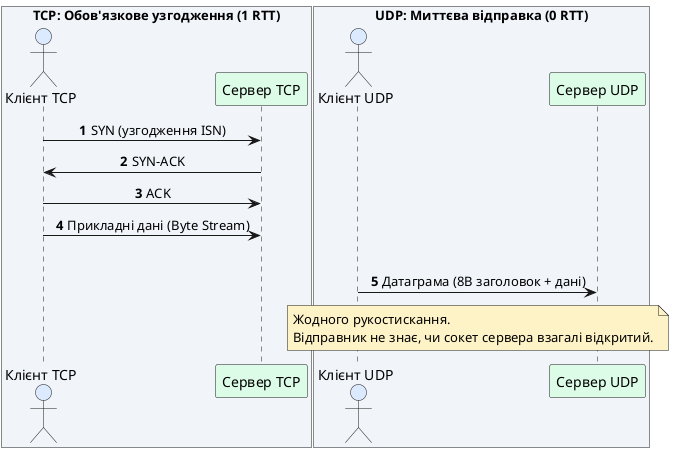
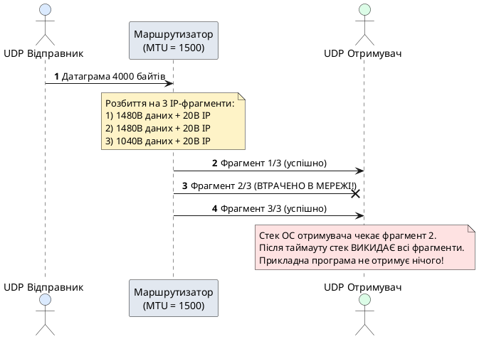

# Протокол UDP та датаграмна передача даних

::card-group

::card{title="🎯 Навчальні цілі" icon="i-lucide-graduation-cap"}

- Зрозуміти архітектурний компроміс між надійністю TCP та мінімальною затримкою протоколу UDP (*User Datagram Protocol*).
- Сформувати ментальну модель датаграми (*datagram*) як самостійної, атомарної одиниці передачі з чіткими межами повідомлення.
- Дослідити анатомію 8-байтного заголовка UDP (RFC 768) та розрахувати безпечний розмір корисного навантаження з урахуванням MTU (*Maximum Transmission Unit*).
- Опанувати роботу з інтерфейсом `net.PacketConn`, функціями `net.ListenPacket` та `net.DialUDP` («connected» сокети).
- Налаштувати системні буфери сокетів (`SO_RCVBUF`) для захисту від втрати пакетів під час сплесків трафіку.
- Реалізувати режими мережевої адресації Unicast, Broadcast (`SO_BROADCAST`) та Multicast (протокол IGMP).
- Застосувати патерн пулу воркерів (*Worker Pool*) для паралельної обробки потоку датаграм без ризику вичерпання пам'яті.
- Засвоїти концепцію RUDP (*Reliable UDP*): порядкові номери, підтвердження ACK/NACK та ковзне вікно.

::

::card{title="🛠️ Технологічний стек" icon="i-lucide-cpu"}

- **Мова:** Go 1.22+
- **Стандартні пакети:** `net`, `encoding/binary`, `time`, `sync`, `syscall`, `math`
- **Діагностичні утиліти:** `nc` (*netcat* із прапорцем `-u`), `tcpdump`, `netstat -u` / `ss -una`

::

::

---

## Свідома відмова від гарантій заради продуктивності

Транспортний протокол TCP надає прикладній програмі зручну ілюзію надійного двостороннього потоку байтів. Проте за цю ілюзію доводиться платити суттєвими накладними витратами:
1. **Затримка з'єднання:** процедура потрійного рукостискання вимагає щонайменше одного часу кругового обігу (*Round-Trip Time, RTT*) до відправки першого байта прикладних даних.
2. **Блокування черги (*Head-of-Line Blocking*):** втрата єдиного TCP-сегмента зупиняє видачу всіх наступних отриманих байтів у програму доти, доки втрачений сегмент не буде повторно передано та підтверджено.
3. **Об'ємний заголовок:** кожен TCP-сегмент містить щонайменше 20 байтів службової інформації.

**Протокол UDP (*User Datagram Protocol*, RFC 768)** є фундаментальною альтернативою: він свідомо відмовляється від усіх перелічених гарантій. UDP не встановлює з'єднання, не відстежує доставку, не сортує пакети та не контролює перевантаження мережі.

Це не недолік, а усвідомлене інженерне рішення. Для багатьох систем своєчасність надходження свіжих даних набагато важливіша за факт отримання запізнілих пакетів:
- **Мережеві ігри:** координати гравця, надіслані 200 мс тому, застаріли — чекати на їх повторну доставку безглуздо.
- **Голосовий та відеозв'язок (VoIP, WebRTC):** втрата кількох мілісекунд аудіо сприймається як ледь помітне клацання, тоді як пауза на повторну доставку руйнує живий діалог.
- **Моніторинг та телеметрія:** показники датчиків IoT надсилаються кожні кілька секунд; втрата одного виміру легко нівелюється наступним.

---

## Спостереження UDP-трафіку через tcpdump і netcat

Переконатися у відсутності службового рукостискання можна за допомогою утиліт `nc` (*netcat*) у режимі `-u` (UDP) та `tcpdump`.

Відкриємо два термінали для організації передачі:

::tabs
::tabs-item{label="Термінал 1: Сервер"}

```bash
nc -u -l 9001
```

::
::tabs-item{label="Термінал 2: Клієнт"}

```bash
nc -u localhost 9001
```

::
::

У третьому терміналі запустимо перехоплення на інтерфейсі loopback (`lo0` або `lo`):

```bash
sudo tcpdump -nn -i lo0 port 9001
```

Щойно клієнт надсилає рядок `"PING\n"`, аналізатор трафіку фіксує лише один рядок:

::terminal-preview{title="sudo tcpdump -nn -i lo0 port 9001" :cursor="true"}

<div class="line"><span class="opacity-40">$</span> <strong class="font-bold">sudo tcpdump -nn -i lo0 port 9001</strong></div>
<div class="line">11:20:04.108 IP <span class="text-blue-400 font-bold">127.0.0.1.61420</span> &gt; <span class="text-green-400 font-bold">127.0.0.1.9001</span>: UDP, length <span class="text-yellow-400 font-bold">5</span></div>
::

Порівняно з TCP різниця очевидна:
- Немає жодного сегмента `SYN`, `SYN-ACK` чи `ACK`.
- Немає процедури узгодження сесії: перший же пакет несе прикладні дані.
- Якщо зупинити сервер і надіслати повідомлення з клієнта знову, команда `nc -u` не повідомить про помилку — клієнтський стек просто викидає датаграму в мережу, не знаючи, чи існує активний отримувач.

::plant-uml{alt="Порівняння ініціалізації сесії TCP та відправки UDP"}



::

---

## Анатомія заголовка UDP та характеристики протоколу

Специфікація UDP (RFC 768) є однією з найкоротших серед інтернет-стандартів. Заголовок датаграми має фіксовану довжину **8 байтів** (64 біти) і складається лише з чотирьох полів:

| Поле | Розмір (біти) | Опис |
| :--- | :--- | :--- |
| **Source Port** | 16 | Порт процесу-відправника (може бути 0, якщо відповідь не очікується) |
| **Destination Port** | 16 | Порт процесу-отримувача |
| **Length** | 16 | Загальна довжина датаграми в байтах (заголовок 8B + корисні дані) |
| **Checksum** | 16 | Контрольна сума для перевірки цілісності заголовка та даних |

### Контрольна сума (Checksum)

Поле контрольної суми — єдиний вбудований захисний механізм UDP. Воно обчислюється над псевдозаголовком IP (IP-адреси, тип протоколу), заголовком UDP та самими даними.
- Якщо під час передачі байти спотворилися через апаратні завади, контрольна сума на приймальній стороні не зійдеться, і ядро операційної системи **мовчки знищить пошкоджену датаграму**.
- В IPv4 використання контрольної суми UDP є необов'язковим (значення `0x0000` вимикає перевірку), проте в IPv6 вона є суворо обов'язковою.

### Фундаментальні властивості UDP

1. **Робота без з'єднання (*connectionless*):** немає поняття сесії. Серверний UDP-сокет єдиний для всіх клієнтів і не породжує нових з'єднань через `accept()`.
2. **Відсутність гарантії доставки (*no delivery guarantee*):** якщо маршрутизатор перевантажений або виник збій на каналі, датаграма відкидається без генерації помилок для відправника.
3. **Відсутність збереження черговості (*no ordering guarantee*):** пакети маршрутизуються незалежно; датаграма $N+1$ може фізично дійти швидше за датуграму $N$.
4. **Відсутність захисту від дублювання (*no duplicate protection*):** за певних умов маршрутизації один і той самий пакет може бути доставлений декілька разів.
5. **Збереження меж повідомлень (*message-oriented*):** на відміну від TCP, де дані склеюються в неперервний потік, одна датаграма завжди передається як цілісний блок. Один виклик `WriteTo()` відповідає рівно одному виклику `ReadFrom()`.

---

## Розмір датаграми, MTU та небезпека IP-фрагментації

Теоретично поле довжини в 16 бітів дозволяє відправити датаграму розміром до 65 535 байтів (з урахуванням 8 байтів заголовка максимальне навантаження для IPv4 становить 65 507 байтів). Проте спроба надіслати датаграму такого розміру через реальну мережу призведе до катастрофічної деградації надійності.

Причина полягає в обмеженні канального рівня — **MTU (*Maximum Transmission Unit*)**. Для стандартних мереж Ethernet значення MTU становить **1500 байтів**.

Якщо розмір IP-пакета перевищує MTU мережевого інтерфейсу, операційна система або проміжний маршрутизатор розбивають його на кілька частин — цей процес називається **IP-фрагментацією (*IP fragmentation*)**.

::plant-uml{alt="Небезпека IP-фрагментації для датаграм UDP"}



::

### Чому фрагментація згубна для UDP

- Протокол UDP не підтримує повторну відправку окремих фрагментів. Якщо з трьох IP-фрагментів загубиться хоча б один, мережевий стек отримувача не зможе зібрати вихідну датаграму і **знищить усі інші отримані фрагменти**.
- Якщо ймовірність втрати одного фрагмента становить $p$, то ймовірність успішної доставки датаграми з $k$ фрагментів падає до $(1-p)^k$.

### Розрахунок безпечного розміру корисного навантаження

Для запобігання фрагментації в мережах IPv4 розмір корисного навантаження датаграми обчислюється за формулою:

::math-formula
\text{Payload}_{\text{safe}} = \text{MTU} - \text{IP Header (20B)} - \text{UDP Header (8B)} = 1500 - 20 - 8 = 1472 \text{ байтів}
::

Для глобальної мережі Інтернет із підтримкою тунелювання (VPN, PPPoE) та гарантованої сумісності з мінімальним MTU для IPv6 (1280 байтів) індустріальним стандартом вважається обмеження розміру тіла датаграми в межах **1200–1280 байтів** (наприклад, такий ліміт застосовується в протоколі DNS та новому стандарті HTTP/3 QUIC).

---

## Мережевий інструментарій Go для роботи з UDP

Для сокетного програмування за протоколом UDP стандартний пакет `net` надає спеціалізований інтерфейс **`net.PacketConn`**:

```go
type PacketConn interface {
	ReadFrom(p []byte) (n int, addr Addr, err error)
	WriteTo(p []byte, addr Addr) (n int, err error)
	Close() error
	LocalAddr() Addr
	SetDeadline(t time.Time) error
	SetReadDeadline(t time.Time) error
	SetWriteDeadline(t time.Time) error
}
```

Ключова відмінність від потокового `net.Conn`:
- `ReadFrom` повертає не лише кількість прочитаних байтів, а й мережеву адресу відправника `addr`.
- `WriteTo` вимагає обов'язкового передавання адреси призначення для кожної відправленої порції даних.

### Готова пара: UDP Сервер та Клієнт

Нижче наведено повноцінні програми, які можна скопіювати в окремі файли та запустити паралельно.

#### Сервер відлуння (UDP Echo)

Сервер створює сокет через `net.ListenPacket` і обробляє вхідні датаграми в нескінченному циклі:

```go [cmd/server/main.go]
package main

import (
	"log"
	"net"
)

func main() {
	// Прив'язка UDP-сокета до локального порту 9001
	conn, err := net.ListenPacket("udp", ":9001")
	if err != nil {
		log.Fatalf("Помилка відкриття сокета: %v", err)
	}
	defer conn.Close()

	log.Println("UDP-сервер відлуння слухає :9001...")

	// Виділяємо буфер із запасом під стандартний кадр Ethernet
	buffer := make([]byte, 1500)

	for {
		// Читання чергової датаграми та отримання адреси клієнта
		n, clientAddr, err := conn.ReadFrom(buffer)
		if err != nil {
			log.Printf("Помилка читання датаграми: %v", err)
			continue
		}

		log.Printf("Отримано %d байтів від %s: %s", n, clientAddr, string(buffer[:n]))

		// Відправка відповіді безпосередньо за адресою відправника
		response := append([]byte("ECHO: "), buffer[:n]...)
		if _, err := conn.WriteTo(response, clientAddr); err != nil {
			log.Printf("Помилка відправки до %s: %v", clientAddr, err)
		}
	}
}
```

::warning
**Особливість обрізання буфера (*Truncation*):** якщо розмір вхідної датаграми перевищує місткість переданого в `ReadFrom` зрізу `buffer`, операційна система поміщає в буфер перші `len(buffer)` байтів, а залишок датаграми **безповоротно знищує**. На відміну від TCP, де залишок чекає наступного виклику, в UDP надлишкові байти втрачаються. Завжди виділяйте буфер прийому щонайменше 1500 або 65535 байтів!
::

#### Клієнт на базі «Connected» сокета (`net.DialUDP`)

Хоча протокол UDP не має з'єднань у мережі, операційна система підтримує системний виклик `connect()` для сокетів UDP. У Go це реалізується через функцію `net.DialUDP`.

Такий сокет стає «прив'язаним» (*connected UDP socket*):
1. Ядро ОС запам'ятовує IP і порт віддаленого сервера.
2. Ядро автоматично відкидає всі вхідні датаграми від будь-яких інших адрес.
3. Програма отримує змогу використовувати стандартні методи `Write()` та `Read()` замість `WriteTo()` та `ReadFrom()`.
4. Сокет може отримувати асинхронні повідомлення про недоступність порту (помилки `ICMP Port Unreachable`), які перетворюються на помилки `connection refused` при наступному читанні або записі.

```go [cmd/client/main.go]
package main

import (
	"fmt"
	"log"
	"net"
	"time"
)

func main() {
	serverAddr, err := net.ResolveUDPAddr("udp", "localhost:9001")
	if err != nil {
		log.Fatalf("Помилка визначення адреси: %v", err)
	}

	// Створення прив'язаного (connected) сокета
	conn, err := net.DialUDP("udp", nil, serverAddr)
	if err != nil {
		log.Fatalf("Помилка підключення: %v", err)
	}
	defer conn.Close()

	message := "Привіт, UDP сервер!"
	start := time.Now()

	// Використовуємо простий Write (адресу вже зафіксовано сокетом)
	if _, err := conn.Write([]byte(message)); err != nil {
		log.Fatalf("Помилка відправки: %v", err)
	}
	log.Printf("Надіслано повідомлення до %s", serverAddr)

	// Встановлюємо дедлайн читання на випадок втрати пакета
	_ = conn.SetReadDeadline(time.Now().Add(2 * time.Second))

	response := make([]byte, 1500)
	n, err := conn.Read(response)
	if err != nil {
		log.Fatalf("Помилка отримання відповіді (таймаут або втрата): %v", err)
	}

	rtt := time.Since(start)
	fmt.Printf("Отримано: %s\nЧас реакції (RTT): %v\n", string(response[:n]), rtt)
}
```

### Системні буфери сокетів (`SO_RCVBUF` / `SO_SNDBUF`)

Коли датаграми надходять на мережеву карту хоста, ядро ОС поміщає їх у буфер черги сокета (*Receive Buffer*). Якщо програма обробляє пакети повільніше, ніж вони надходять, системний буфер переповнюється, і ядро починає **мовчки скидати нові датаграми**.

Для високонавантажених сервісів розмір буфера збільшують за допомогою методу `SetReadBuffer`:

```go
if udpConn, ok := conn.(*net.UDPConn); ok {
	// Встановлюємо буфер прийому ядра в 4 МБ для згладжування сплесків
	_ = udpConn.SetReadBuffer(4 * 1024 * 1024)
}
```

---

## Режими адресації: Unicast, Broadcast та Multicast

Завдяки ізольованій природі датаграм протокол UDP підтримує три моделі розповсюдження інформації в IP-мережах.

::plant-uml{alt="Три моделі адресації UDP"}

```plantuml
@startuml
skinparam style plain
skinparam backgroundColor #FFFFFF
skinparam packageStyle rectangle

package "Unicast (1 -> 1)" #DBEAFE {
  actor "Відправник" as U1
  actor "Отримувач" as U2
  U1 --> U2 : Пакет на унікальну IP
}

package "Broadcast (1 -> Всі)" #FEF3C7 {
  actor "Відправник" as B1
  actor "Вузол 1" as B2
  actor "Вузол 2" as B3
  actor "Вузол 3" as B4
  B1 --> B2
  B1 --> B3
  B1 --> B4
}

package "Multicast (1 -> Група)" #DCFCE7 {
  actor "Відправник" as M1
  actor "Підписник A" as M2
  actor "Підписник B" as M3
  actor "Не підписаний" as M4
  M1 --> M2 : Трафік на групову IP (224.0.0.0/4)
  M1 --> M3
  M1 ..x M4 : Не надсилається
}
@enduml
```

::

### Unicast (Одноадресний режим)

Стандартний режим передачі «один до одного» (*one-to-one*). Датаграма адресується конкретній IP-адресі хоста і передається за класичною маршрутизацією.

### Broadcast (Широкомовний режим)

Передача «один до всіх» (*one-to-all*) у межах одного сегмента локальної мережі (L2-домен трансляції). Пакети надсилаються на широкомовну адресу (наприклад, `255.255.255.255` або локальну трансляційну адресу підмережі). Маршрутизатори **ніколи не пересилають** широкомовні пакети за межі локальної мережі.

Для надсилання broadcast операційна система вимагає увімкнення опції `SO_BROADCAST`:

```go [cmd/broadcast/main.go]
package main

import (
	"log"
	"net"
	"syscall"
)

func main() {
	// Створюємо UDP-сокет на довільному вільному порту
	conn, err := net.ListenPacket("udp4", ":0")
	if err != nil {
		log.Fatalf("Помилка сокета: %v", err)
	}
	defer conn.Close()

	// Отримуємо доступ до низькорівневого дескриптора для встановлення опцій
	rawConn, err := conn.(*net.UDPConn).SyscallConn()
	if err != nil {
		log.Fatalf("Помилка отримання сирого сокета: %v", err)
	}

	var sockErr error
	err = rawConn.Control(func(fd uintptr) {
		// Вмикаємо опцію SO_BROADCAST на рівні сокета
		sockErr = syscall.SetsockoptInt(int(fd), syscall.SOL_SOCKET, syscall.SO_BROADCAST, 1)
	})
	if err != nil || sockErr != nil {
		log.Fatalf("Не вдалося активувати SO_BROADCAST: %v / %v", err, sockErr)
	}

	broadcastAddr, _ := net.ResolveUDPAddr("udp4", "255.255.255.255:9002")
	message := []byte("DISCOVERY: пошук пристроїв у локальній мережі")

	log.Println("Відправка широкомовної датаграми...")
	if _, err := conn.WriteTo(message, broadcastAddr); err != nil {
		log.Fatalf("Помилка відправки broadcast: %v", err)
	}
	log.Println("Широкомовне повідомлення успішно надіслано.")
}
```

### Multicast (Групова розсилка)

Передача «один до багатьох зацікавлених» (*one-to-many*). Відправник відправляє єдиний екземпляр датаграми на спеціальну групову адресу класу D (діапазон від `224.0.0.0` до `239.255.255.255`).

Пакети копіюються комутаторами й маршрутизаторами лише тим хостам, які явно висловили бажання приєднатися до групи через протокол **IGMP (*Internet Group Management Protocol*)**.

```go [cmd/multicast/main.go]
package main

import (
	"log"
	"net"
)

func main() {
	// Групова адреса адміністративного призначення
	groupAddr, err := net.ResolveUDPAddr("udp4", "239.255.0.1:9003")
	if err != nil {
		log.Fatalf("Помилка адреси групи: %v", err)
	}

	// Приєднання до групи (nil вибирає системний інтерфейс за замовчуванням)
	conn, err := net.ListenMulticastUDP("udp4", nil, groupAddr)
	if err != nil {
		log.Fatalf("Помилка підписки на мультикаст-групу: %v", err)
	}
	defer conn.Close()

	log.Printf("Очікування мультикаст-пакетів на адресі %s...", groupAddr)

	buffer := make([]byte, 1500)
	for {
		n, srcAddr, err := conn.ReadFrom(buffer)
		if err != nil {
			log.Printf("Помилка читання: %v", err)
			continue
		}

		log.Printf("Отримано %d байтів від %s: %s", n, srcAddr, string(buffer[:n]))
	}
}
```

---

## Проєктування надійних протоколів: концепція RUDP

Якщо застосунку критично потрібні мінімальна затримка та відсутність блокування черги (Head-of-Line Blocking), але водночас необхідна доставка окремих важливих повідомлень, застосовують концепцію **RUDP (*Reliable UDP*)**.

RUDP — це не один протокол, а набір патернів проектування поверх сирого UDP:
1. **Порядкові номери (*Sequence Numbers*):** додавання лічильника (наприклад, 4 байти) на початку кожного пакета дозволяє отримувачу розпізнавати пропуски та відновлювати порядок.
2. **Підтвердження (ACK / NACK):**
   - **ACK (*Acknowledgment*):** отримувач повідомляє про кожен успішно прийнятий пакет.
   - **NACK (*Negative Acknowledgment*):** отримувач мовчить, поки дані надходять послідовно, і надсилає запит на повтор лише при виявленні пропущеного номера.
3. **Ковзне вікно (*Sliding Window*):** дозволяє відправнику мати кілька непідтверджених датаграм «у польоті» (*in flight*) без зупинки відправки.

Сучасний протокол **QUIC (RFC 9000)**, на базі якого функціонує **HTTP/3**, є промисловою еволюцією ідей RUDP: він працює повністю поверх UDP, забезпечуючи нульову затримку при перепідключенні (0-RTT), вбудоване шифрування TLS 1.3 та незалежні потоки даних, де втрата одного пакета не блокує інші потоки.

---

## Практична реалізація: сервер телеметрії з пулом воркерів

При розробці високонавантажених серверів UDP типовою помилкою є породження нової горутини `go handle(packet)` на кожну вхідну датаграму. За умов надходження 100 000 пакетів на секунду це призводить до миттєвого вичерпання пам'яті через неконтрольоване зростання горутин (*unbounded concurrency*).

Промисловий патерн передбачає організацію **фіксованого пулу воркерів (*Worker Pool*)**, які забирають завдання через буферизований канал, та агрегацію результатів у виділеній горутині (патерн CSP).

Нижче наведено два готових самодостатніх файли: Сервер телеметрії та Клієнт-генератор.

### Сервер телеметрії

```go [cmd/telemetry/main.go]
package main

import (
	"encoding/binary"
	"fmt"
	"log"
	"math"
	"net"
	"sync"
	"time"
)

// TelemetryReading представляє розпарсені дані вимірювання
type TelemetryReading struct {
	DeviceID     uint32
	TimestampMs  int64
	TemperatureC float32
}

func decodeReading(raw []byte) (TelemetryReading, error) {
	if len(raw) != 16 {
		return TelemetryReading{}, fmt.Errorf("довжина пакета %dB замість 16B", len(raw))
	}
	return TelemetryReading{
		DeviceID:     binary.BigEndian.Uint32(raw[0:4]),
		TimestampMs:  int64(binary.BigEndian.Uint64(raw[4:12])),
		TemperatureC: math.Float32frombits(binary.BigEndian.Uint32(raw[12:16])),
	}, nil
}

type packetTask struct {
	payload []byte
	srcAddr net.Addr
}

func main() {
	conn, err := net.ListenPacket("udp", ":9004")
	if err != nil {
		log.Fatalf("Помилка відкриття сокета: %v", err)
	}
	defer conn.Close()

	// Збільшуємо буфер сокета ОС до 2 МБ
	if udpConn, ok := conn.(*net.UDPConn); ok {
		_ = udpConn.SetReadBuffer(2 * 1024 * 1024)
	}

	const workerCount = 4
	tasks := make(chan packetTask, 1000)
	readings := make(chan TelemetryReading, 1000)

	// Запуск пулу воркерів для паралельного парсингу
	var wg sync.WaitGroup
	for i := 0; i < workerCount; i++ {
		wg.Add(1)
		go func(workerID int) {
			defer wg.Done()
			for task := range tasks {
				reading, err := decodeReading(task.payload)
				if err != nil {
					log.Printf("[Воркер %d] Помилка від %s: %v", workerID, task.srcAddr, err)
					continue
				}
				readings <- reading
			}
		}(i + 1)
	}

	// Виділена горутина агрегації стану (без м'ютексів, за моделлю CSP)
	go func() {
		devices := make(map[uint32]TelemetryReading)
		ticker := time.NewTicker(5 * time.Second)
		defer ticker.Stop()

		for {
			select {
			case r := <-readings:
				devices[r.DeviceID] = r
			case <-ticker.C:
				log.Printf("📊 Агрегатор: активних датчиків: %d", len(devices))
				for id, r := range devices {
					log.Printf("   -> Датчик #%d: %.2f°C (час: %d)", id, r.TemperatureC, r.TimestampMs)
				}
			}
		}
	}()

	log.Printf("Сервер телеметрії слухає :9004 (пул із %d воркерів)...", workerCount)

	buffer := make([]byte, 1500)
	for {
		n, srcAddr, err := conn.ReadFrom(buffer)
		if err != nil {
			log.Printf("Помилка читання: %v", err)
			continue
		}

		// Обов'язкове копіювання, оскільки buffer буде перезаписано на наступній ітерації
		payloadCopy := make([]byte, n)
		copy(payloadCopy, buffer[:n])

		// Передаємо в пул або відкидаємо пакет при переповненні буфера завдань
		select {
		case tasks <- packetTask{payload: payloadCopy, srcAddr: srcAddr}:
		default:
			log.Printf("⚠️ Черга завдань переповнена. Пакет від %s скинуто!", srcAddr)
		}
	}
}
```

### Генератор тестової телеметрії (Клієнт)

```go [cmd/telemetry_client/main.go]
package main

import (
	"encoding/binary"
	"log"
	"math"
	"math/rand"
	"net"
	"time"
)

func main() {
	serverAddr, err := net.ResolveUDPAddr("udp", "localhost:9004")
	if err != nil {
		log.Fatalf("Помилка адреси: %v", err)
	}

	conn, err := net.DialUDP("udp", nil, serverAddr)
	if err != nil {
		log.Fatalf("Помилка підключення: %v", err)
	}
	defer conn.Close()

	log.Println("Генератор телеметрії запущено. Відправка пакетів...")

	deviceIDs := []uint32{101, 102, 103}

	for round := 1; round <= 3; round++ {
		for _, devID := range deviceIDs {
			temp := 20.0 + rand.Float32()*10.0 // Температура від 20 до 30 °C

			packet := make([]byte, 16)
			binary.BigEndian.PutUint32(packet[0:4], devID)
			binary.BigEndian.PutUint64(packet[4:12], uint64(time.Now().UnixMilli()))
			binary.BigEndian.PutUint32(packet[12:16], math.Float32bits(temp))

			if _, err := conn.Write(packet); err != nil {
				log.Printf("Помилка відправки: %v", err)
			}
		}
		time.Sleep(1 * time.Second)
	}
	log.Println("Генерацію завершено.")
}
```

---

## Практичне інженерне завдання: утиліта UDP Ping

::::accordion

:::accordion-item{label="📋 Завдання: Реалізація утиліти вимірювання затримки та втрати пакетів" icon="i-lucide-clipboard-list"}

Розробіть клієнтську CLI-утиліту UDP Ping, яка:
1. Надсилає на UDP Echo-сервер (`localhost:9001`) послідовність із 5 датаграм вигляду `PING seq=N`.
2. Встановлює дедлайн очікування відповіді в 1 секунду на кожен пакет.
3. Якщо відповідь надходить вчасно — фіксує точний час RTT у мілісекундах.
4. Якщо виникає таймаут — фіксує втрату пакета.
5. Наприкінці виводить зведену статистику: кількість надісланих/отриманих пакетів, відсоток втрат (*Packet Loss %*) та середній RTT.

:::

:::accordion-item{label="✅ Розв'язок" icon="i-lucide-check-circle"}

```go [cmd/udpping/main.go]
package main

import (
	"fmt"
	"log"
	"net"
	"time"
)

func main() {
	serverAddr, err := net.ResolveUDPAddr("udp", "localhost:9001")
	if err != nil {
		log.Fatalf("Помилка адреси: %v", err)
	}

	conn, err := net.DialUDP("udp", nil, serverAddr)
	if err != nil {
		log.Fatalf("Помилка сокета: %v", err)
	}
	defer conn.Close()

	const totalPackets = 5
	const timeout = 1 * time.Second
	receivedPackets := 0
	var totalRTT time.Duration

	fmt.Printf("PING %s через UDP (%d пакетів):\n\n", serverAddr, totalPackets)

	buffer := make([]byte, 1500)

	for seq := 1; seq <= totalPackets; seq++ {
		payload := fmt.Sprintf("PING seq=%d", seq)
		start := time.Now()

		if _, err := conn.Write([]byte(payload)); err != nil {
			log.Printf("Помилка відправки seq=%d: %v", seq, err)
			continue
		}

		_ = conn.SetReadDeadline(time.Now().Add(timeout))
		n, err := conn.Read(buffer)
		if err != nil {
			fmt.Printf("Запит seq=%d: втрачено пакет (таймаут %v)\n", seq, timeout)
			continue
		}

		rtt := time.Since(start)
		receivedPackets++
		totalRTT += rtt

		fmt.Printf("Відповідь від %s: seq=%d байтів=%d rtt=%.2fмс (%s)\n",
			serverAddr, seq, n, float64(rtt.Microseconds())/1000.0, string(buffer[:n]))

		time.Sleep(500 * time.Millisecond)
	}

	lost := totalPackets - receivedPackets
	lossPercent := (float64(lost) / float64(totalPackets)) * 100.0

	fmt.Println("\n--- Статистика UDP Ping ---")
	fmt.Printf("%d пакетів надіслано, %d отримано, %.1f%% втрат\n", totalPackets, receivedPackets, lossPercent)
	if receivedPackets > 0 {
		avgRTT := totalRTT / time.Duration(receivedPackets)
		fmt.Printf("Середній час RTT: %.2fмс\n", float64(avgRTT.Microseconds())/1000.0)
	}
}
```

::terminal-preview{title="go run cmd/udpping/main.go" :cursor="false"}

<div class="line"><span class="opacity-40">$</span> <strong class="font-bold">go run cmd/udpping/main.go</strong></div>
<div class="line">PING 127.0.0.1:9001 через UDP (5 пакетів):</div>
<div class="line">Відповідь від 127.0.0.1:9001: seq=1 байтів=16 rtt=<span class="text-green-400 font-bold">0.42мс</span> (ECHO: PING seq=1)</div>
<div class="line">Відповідь від 127.0.0.1:9001: seq=2 байтів=16 rtt=<span class="text-green-400 font-bold">0.38мс</span> (ECHO: PING seq=2)</div>
<div class="line">Відповідь від 127.0.0.1:9001: seq=3 байтів=16 rtt=<span class="text-green-400 font-bold">0.40мс</span> (ECHO: PING seq=3)</div>
<div class="line">Відповідь від 127.0.0.1:9001: seq=4 байтів=16 rtt=<span class="text-green-400 font-bold">0.35мс</span> (ECHO: PING seq=4)</div>
<div class="line">Відповідь від 127.0.0.1:9001: seq=5 байтів=16 rtt=<span class="text-green-400 font-bold">0.39мс</span> (ECHO: PING seq=5)</div>
<div class="line">--- Статистика UDP Ping ---</div>
<div class="line">5 пакетів надіслано, 5 отримано, <span class="text-green-400 font-bold">0.0% втрат</span></div>
<div class="line">Середній час RTT: 0.39мс</div>
::

:::

::::

---

## Питання для самоперевірки

::::accordion

:::accordion-item{label="❓ Чому в UDP розмір буфера читання критичніший, ніж у TCP?" icon="i-lucide-help-circle"}

У TCP дані зберігаються у вигляді неперервного потоку: якщо передати буфер меншого розміру, `Read()` поверне першу частину, а решта даних залишиться в буфері сокета до наступного виклику. В UDP надлишкові байти датаграми, які не помістилися в буфер, безповоротно обрізаються (*truncated*) і знищуються ядром операційної системи.

:::

:::accordion-item{label="❓ Що відбувається в ОС при виклику net.DialUDP для датаграмного сокета?" icon="i-lucide-help-circle"}

Системний виклик `connect()` для сокета UDP не надсилає жодних пакетів у мережу. Він лише фіксує в ядрі IP-адресу та порт сервера для цього сокета, дозволяючи викликати спрощені методи `Read`/`Write` та отримувати зворотні системні повідомлення про недоступність порту (`ICMP Port Unreachable`).

:::

:::accordion-item{label="❓ Чому втрата хоча б одного фрагмента IP призводить до знищення всієї UDP-датаграми?" icon="i-lucide-help-circle"}

Протокол IP фрагментує пакети на мережевому рівні, але не містить механізму повторного запиту втрачених фрагментів. Якщо один фрагмент не доходить до адресата, таймер складання пакета в операційній системі вичерпується, і стек ОС змушений знищити всі раніше отримані фрагменти, оскільки передати в UDP неповну датаграму неприпустимо.

:::

:::accordion-item{label="❓ У чому полягає різниця між Broadcast та Multicast?" icon="i-lucide-help-circle"}

Broadcast надсилає пакети абсолютно всім пристроям у локальному сегменті мережі, змушуючи мережеві карти всіх хостів обробляти цей трафік. Multicast надсилає дані лише тим хостам, які явно підписалися на відповідну групу адрес через протокол IGMP, що значно знижує паразитичне навантаження на локальну мережу.

:::

:::accordion-item{label="❓ Навіщо збільшувати буфер SO_RCVBUF у UDP-серверах?" icon="i-lucide-help-circle"}

Датаграми UDP надходять асинхронно. Якщо при сплеску трафіку програма не встигає викликати `ReadFrom()`, вхідний системний буфер ядра заповнюється, і нові датаграми скидаються ядром без повідомлення про помилку. Збільшення буфера (`SetReadBuffer`) дає програмі часовий люфт для згладжування пікових навантажень.

:::

::::

---

## Підсумки лекції

::card-group

::card{title="📡 Характеристики UDP" icon="i-lucide-radio"}

- UDP — мінімалістичний транспорт (8-байтний заголовок проти 20 байтів у TCP).
- Робота без з'єднання (0-RTT), відсутність гарантій доставки, черговості та захисту від дублювання.
- Межі повідомлень зберігаються природно: одна датаграма відповідає одній операції введення/виведення.

::

::card{title="📐 MTU та адресація" icon="i-lucide-network"}

- Безпечний розмір корисного навантаження IPv4 становить 1472 байти для уникнення згубної IP-фрагментації.
- Підтримуються три моделі адресації: Unicast (1 -> 1), Broadcast (1 -> всі у підмережі через `SO_BROADCAST`) та Multicast (1 -> група підписників через IGMP).
- `net.PacketConn` є базовим інтерфейсом сокета, а `net.DialUDP` створює прив'язаний сокет для зручного `Read`/`Write`.

::

::card{title="⚙️ Промислові патерни" icon="i-lucide-cpu"}

- Для захисту від падіння пам'яті через наплив пакетів застосовують пул воркерів (*Worker Pool*) замість `go func()`.
- Системний буфер `SO_RCVBUF` захищає від тихих втрат датаграм під час сплесків трафіку.
- Концепція RUDP (порядкові номери, ACK/NACK, ковзне вікно) реалізує вибіркову надійність на прикладному рівні.

::

::

Обидва транспортні протоколи стека — і TCP, і UDP — передають дані у відкритому вигляді. У наступній темі ми перейдемо до криптографічного захисту каналів зв'язку за допомогою протоколу TLS.
