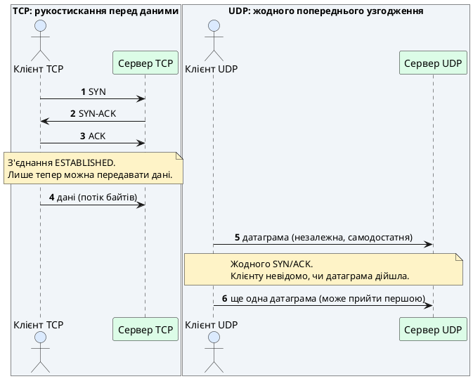
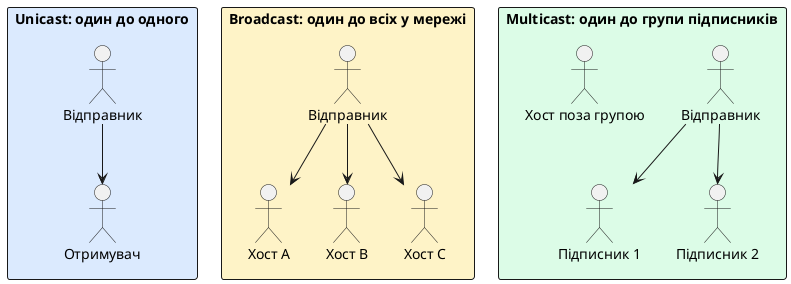
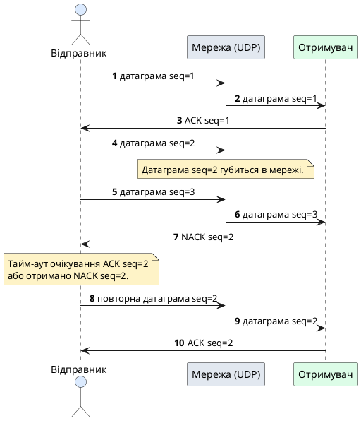

# Протокол UDP та датаграмна передача даних

::card-group

::card{title="🎯 Навчальні цілі" icon="i-lucide-graduation-cap"}

- Усвідомити фундаментальний компроміс між надійністю TCP і мінімальною затримкою UDP, і зрозуміти, чому жоден із двох протоколів не є «кращим» узагальнено — вибір завжди залежить від прикладної задачі.
- Побудувати чітку ментальну модель датаграми (_datagram_) як самодостатньої, ізольованої одиниці передачі даних, на противагу безперервному байтовому потоку TCP.
- Детально розібрати характеристики протоколу UDP: відсутність з'єднання (_connectionless_), відсутність гарантій доставки, порядку та захисту від дублювання пакетів.
- Опанувати практичний інструментарій пакета `net` для роботи з UDP: функції `net.ListenPacket` та `net.DialUDP`, а також інтерфейс `net.PacketConn`.
- Розрізняти режими мережевої адресації Unicast, Broadcast і Multicast, а також зрозуміти роль протоколу IGMP у керуванні груповою розсилкою.
- Ознайомитися з типовими прикладними сферами, де свідома відмова від гарантій TCP є виправданим інженерним рішенням: телеметрія, метрики, потокове відео та мережеві ігри.
- Зрозуміти базові принципи проєктування надійних протоколів поверх ненадійного транспорту UDP (концепція RUDP) — навіщо потрібні порядкові номери, підтвердження ACK/NACK та ковзне вікно.

::

::card{title="🛠️ Технологічний стек" icon="i-lucide-cpu"}

- **Мова:** Go 1.22+
- **Пакети стандартної бібліотеки:** `net`, `encoding/binary`, `time`, `sync`
- **Інструменти діагностики:** `nc` (netcat) у режимі `-u`, `tcpdump`/Wireshark, `netstat -u`

::

::

---

## Свідома відмова від гарантій заради швидкості

Попередня лекція завершилася прямим анонсом теми, до якої ми зараз переходимо: телеметрія з тисяч IoT-пристроїв, потокове відео в реальному часі та мережеві ігрові сервери часто свідомо відмовляються від надійності TCP заради мінімальної затримки й відсутності накладних витрат на встановлення з'єднання. Варто одразу застерегти від хибного висновку, ніби протокол UDP (_User Datagram Protocol_) — це якась «спрощена» чи «недороблена» версія TCP. Насправді це принципово інший інженерний компроміс, розрахований на зовсім інший клас прикладних задач, і зрозуміти UDP найпродуктивніше саме через послідовне протиставлення кожній властивості TCP, яку ми детально розглянули в попередній лекції.

Пригадаємо: TCP — це протокол, **орієнтований на з'єднання** (_connection-oriented_). Перш ніж хоча б один байт корисних даних потрапить від клієнта до сервера, обидві сторони повинні виконати потрійне рукостискання (_3-Way Handshake_): обмінятися сегментами `SYN`, `SYN-ACK` та `ACK`, узгодивши початкові порядкові номери й перевівши з'єднання у стан `ESTABLISHED`. Це рукостискання коштує щонайменше одного повного циклу «туди-назад» (_round-trip time_, RTT) ще до початку корисної роботи — а для геолокаційно віддалених серверів RTT може сягати десятків і навіть сотень мілісекунд. UDP свідомо відмовляється від цього кроку: він є протоколом **без з'єднання** (_connectionless_) — жодного попереднього узгодження стану між відправником і отримувачем не відбувається, і перший же пакет із даними може бути надісланий негайно, без жодної затримки на встановлення сесії.

Друга властивість TCP, яку ми детально аналізували, — **гарантована доставка** (_reliable delivery_): якщо сегмент губиться в мережі, TCP автоматично визначає це через механізм підтверджень і повторно передає втрачені дані, а прикладний код узагалі не підозрює про існування втрат на нижчому рівні. UDP не надає жодних подібних гарантій: пакет може загубитися в мережі назавжди, і жодна частина стека UDP — ні на відправнику, ні на отримувачі — не сповістить про це прикладну програму. Якщо надійність потрібна, її доведеться реалізовувати самостійно на прикладному рівні (саме цьому присвячено завершальний розділ цієї лекції про концепцію RUDP).

Третя властивість TCP — **збереження порядку байтів** (_ordered delivery_): навіть якщо окремі сегменти прибувають мережею в переплутаному порядку (що цілком нормально для маршрутизованих IP-мереж, де різні пакети можуть проходити різними фізичними шляхами), стек TCP на приймальній стороні буферизує їх і видає прикладній програмі рівно в тому порядку, у якому вони були відправлені. UDP не робить нічого подібного: датаграми можуть надійти до отримувача в іншому порядку, ніж були надіслані, і прикладний код побачить саме цей — потенційно переплутаний — порядок, якщо не подбає про власну нумерацію.

::warning
До переліку властивостей, яких **не гарантує** UDP, часто додають ще й **відсутність захисту від дублювання** (_no duplicate protection_): через особливості маршрутизації IP-мереж той самий пакет теоретично може бути доставлений отримувачу двічі (наприклад, якщо мережеве обладнання ретранслювало його через збіг обставин). TCP відсікає такі дублікати автоматично завдяки порядковим номерам, а UDP передає прикладному коду геть усе, що фізично надійшло на сокет, — включно з потенційними повторами.
::

Нарешті, четверта — і, мабуть, найконцептуальніша — відмінність стосується того, як саме кожен протокол структурує дані. У попередній лекції ми детально розібрали, що TCP передає **невиокремлений байтовий потік** (_byte stream_) без збереження меж повідомлень: один виклик `Write()` на клієнті не гарантує рівно одного відповідного виклику `Read()` на сервері, а прикладному протоколу доводиться самостійно впроваджувати фреймінг через розділювачі, префікс довжини чи формат TLV. UDP влаштований принципово інакше: базовою одиницею передачі є **датаграма** (_datagram_) — самодостатній, ізольований «конверт» даних із чітко визначеним початком і кінцем. Один виклик `WriteTo()` на відправнику завжди відповідає рівно одному виклику `ReadFrom()` на отримувачі, який поверне точнісінько ті самі байти, що були записані в цю конкретну датаграму, — ні байтом більше, ні байтом менше. Проблема фреймінгу, яка потребувала окремого проєктного рішення для TCP, у світі UDP просто не виникає: мережа сама зберігає межі повідомлень на рівні транспортного протоколу.

::note
**Місток із лекції 4:** якщо в TCP межі повідомлень доводилося вигадувати штучно (розділювачами, довжиною, TLV), то в UDP ці межі присутні органічно, «з коробки» — але за це доводиться платити відсутністю практично всіх гарантій, які TCP забезпечував автоматично. Це наочний приклад класичного інженерного компромісу: те, що спрощується в одному місці системи, майже завжди ускладнюється в іншому.
::

---

## Наочна демонстрація: датаграми без жодного рукостискання

Так само, як і в попередній лекції, перш ніж занурюватися в Go-специфічний пакет `net`, корисно на власні очі побачити принципову відмінність UDP від щойно вивченого TCP — і зробити це знову без жодного рядка коду мовою програмування, лише засобами стандартних утиліт командного рядка. Утиліта `nc` (_netcat_) уміє працювати не тільки з TCP-сокетами, а й із UDP-сокетами — досить додати прапорець `-u`, і вона перемикається в датаграмний режим.

Відкриємо два термінали, як і минулого разу. У першому запустимо сервер, що слухає UDP-порт, а в другому — клієнта, що надсилає йому датаграми:

::tabs
::tabs-item{label="Термінал 1: сервер"}

```bash
nc -u -l 9001
```

::
::tabs-item{label="Термінал 2: клієнт"}

```bash
nc -u localhost 9001
```

::
::

У третьому терміналі запустимо перехоплення трафіку ще до моменту першого повідомлення від клієнта — так само, як робили це для TCP:

```bash
sudo tcpdump -nn -i lo0 port 9001
```

Наберемо в клієнтському терміналі якийсь короткий рядок тексту й натиснемо Enter. На відміну від TCP-демонстрації з попередньої лекції, де перший же рядок `tcpdump` показував три службові сегменти `SYN`/`SYN-ACK`/`ACK` ще до появи хоч байта прикладних даних, тут картина буде разюче іншою:

::terminal-preview{title="sudo tcpdump -nn -i lo0 port 9001" :cursor="true"}

<div class="line"><span class="opacity-40">$</span> <strong class="font-bold">sudo tcpdump -nn -i lo0 port 9001</strong></div>
<div class="line">16:05:33.441207 IP <span class="text-blue-400 font-bold">127.0.0.1.61820</span> &gt; <span class="text-green-400 font-bold">127.0.0.1.9001</span>: UDP, length <span class="text-yellow-400 font-bold">6</span></div>
<div class="line opacity-60">--- і жодного рядка більше, доки клієнт не надішле наступне повідомлення ---</div>
<div class="line">16:05:41.117845 IP <span class="text-blue-400 font-bold">127.0.0.1.61820</span> &gt; <span class="text-green-400 font-bold">127.0.0.1.9001</span>: UDP, length <span class="text-yellow-400 font-bold">11</span></div>
::

Це і є найважливіше спостереження всієї демонстрації: **жодних сегментів `SYN`, `SYN-ACK` чи `ACK` немає взагалі**. Немає жодного попереднього обміну службовими пакетами між клієнтом і сервером, немає навіть підтвердження про те, що конкретна датаграма взагалі досягла адресата, — `tcpdump` фіксує лише сам факт відправлення пакета з протоколом `UDP` та довжиною корисного навантаження. Якщо зупинити серверний `nc -u -l 9001` ще до запуску клієнта (або взагалі ніколи його не запускати), клієнтський `nc -u localhost 9001` однаково успішно «надішле» повідомлення — операційна система клієнта не має жодного способу дізнатися, чи є хтось живий на іншому кінці, і не намагається це перевіряти.

::warning
**Оманлива «успішність» відправлення:** той факт, що команда `nc -u localhost 9001` не видає жодної помилки під час відправлення, аж ніяк не означає, що дані реально дійшли до отримувача. UDP-сокет на клієнтській стороні лише передає датаграму мережевому стеку операційної системи та відразу повертає керування програмі — про подальшу долю цього пакета (був він доставлений, загублений через переповнений буфер проміжного маршрутизатора чи впав через контрольну суму) відправнику нічого не відомо.
::

Другий важливий нюанс демонстрації — кожен рядок `tcpdump` відповідає рівно одному виклику надсилання з боку клієнта: одне натискання Enter в `nc -u` — один рядок у перехопленому трафіку з чіткою довжиною корисного навантаження. Це та сама властивість збереження меж повідомлень, про яку йшлося в попередньому розділі, — тепер побачена наживо, а не просто задекларована текстом.

::tip
**Спробуйте також надіслати датаграму, коли сервер узагалі не запущений** (закрийте перший термінал і повторіть відправлення з другого). У більшості систем ви побачите на приймальній стороні (якщо там усе ж є слухач на іншому порту або в межах того самого хоста ввімкнено ICMP-діагностику) повідомлення `ICMP Port Unreachable` в `tcpdump` — це єдиний натяк «іззовні», який іноді можна отримати про недоставку, і то лише в межах однієї локальної мережі, а не як гарантований механізм UDP.
::

Порівняємо обидві моделі поруч на одній діаграмі послідовності, щоб контраст між ними був максимально наочним:

::plant-uml{alt="Порівняння встановлення взаємодії TCP і UDP"}



::

---

## Формальні характеристики протоколу UDP

Тепер, коли контраст із TCP підкріплений і теорією, і живою демонстрацією, систематизуємо властивості UDP у чіткіші формулювання, якими зручно оперувати надалі. Специфікація протоколу UDP визначена в RFC 768 — одному з найкоротших фундаментальних документів у всій історії протоколів Інтернету, що вже само по собі промовисто свідчить про мінімалізм цього транспорту: заголовок UDP-датаграми складається лише з чотирьох полів по два байти кожне (порт джерела, порт призначення, довжина, контрольна сума), тоді як заголовок TCP-сегмента значно об'ємніший і містить порядкові номери, прапорці, розмір вікна та інші службові поля.

**Робота без з'єднання (_connectionless_).** UDP не підтримує жодного поняття «сесії» чи «стану з'єднання» на рівні транспортного протоколу. Кожна датаграма — це повністю незалежна одиниця передачі, що містить у своєму заголовку адресу й порт призначення та обробляється мережевим стеком абсолютно ізольовано від будь-яких попередніх чи наступних датаграм між тими самими двома вузлами. Звідси випливає практичний наслідок, важливий для розуміння коду, який ми напишемо далі: серверний UDP-сокет не має окремого «слухаючого» сокета, що породжує нові сокети з'єднань (як `Listener.Accept()` у TCP) — є лише один сокет, який приймає датаграми від будь-якого клієнта, що надішле пакет на його адресу й порт.

**Відсутність гарантії доставки (_no delivery guarantee_).** Мережевий стек UDP не відстежує, чи дійшла конкретна датаграма до отримувача, і не має жодного вбудованого механізму повторної передачі. Якщо проміжний маршрутизатор відкине пакет через переповнений буфер черги, якщо контрольна сума датаграми не збіжиться при отриманні, чи якщо канал зв'язку тимчасово обірветься, — датаграма просто зникає безслідно, і ні відправник, ні отримувач про це не дізнаються засобами самого протоколу UDP.

**Відсутність гарантії порядку (_no ordering guarantee_).** Оскільки кожна датаграма маршрутизується мережею незалежно від інших (навіть якщо вони належать одному логічному потоку обміну між тими самими двома вузлами), різні датаграми теоретично можуть слідувати різними фізичними маршрутами через мережу й прибути до отримувача в іншому порядку, ніж були відправлені. TCP приховує цю особливість мереж завдяки буферизації й порядковим номерам, а UDP передає її прикладному коду без жодних змін.

**Відсутність захисту від дублювання (_no duplicate protection_).** За рідкісного, але цілком можливого збігу обставин у маршрутизованій мережі (наприклад, ретрансляція через тимчасову втрату підтвердження на рівні нижчих мережевих протоколів) та сама датаграма може фізично дійти до отримувача більше одного разу. UDP не веде жодного обліку вже отриманих пакетів і передасть прикладній програмі кожну копію датаграми, яка фізично надійшла на сокет.

::note
**А чому взагалі є контрольна сума в заголовку UDP, якщо надійність не гарантується?** Контрольна сума (_checksum_) захищає лише від **пошкодження вмісту** датаграми під час передачі (наприклад, через електромагнітні завади на фізичному каналі), а не від її втрати чи дублювання. Якщо контрольна сума отриманого пакета не збігається з обчисленою, стек UDP на приймальній стороні просто мовчки відкидає таку датаграму — це єдина форма «контролю якості», вбудована в сам протокол.
::

---

## Пакет net: інтерфейс PacketConn та функції ListenPacket, DialUDP

У попередній лекції ключовими дійовими особами пакета `net` для TCP були інтерфейси `net.Listener` (пасивний слухач, що породжує нові з'єднання) та `net.Conn` (саме встановлене з'єднання, що читається й записується як потік байтів). Для UDP, з огляду на щойно розглянуту відсутність поняття «з'єднання», архітектура пакета `net` виглядає інакше й простіше: центральною абстракцією тут виступає інтерфейс **`net.PacketConn`**, що представляє один-єдиний UDP-сокет, здатний одночасно приймати датаграми від будь-якого відправника й надсилати їх на будь-яку адресу.

```go
type PacketConn interface {
    ReadFrom(p []byte) (n int, addr Addr, err error)
    WriteTo(p []byte, addr Addr) (n int, err error)
    Close() error
    LocalAddr() Addr
    SetDeadline(t time.Time) error
    SetReadDeadline(t time.Time) error
    SetWriteDeadline(t time.Time) error
}
```

Порівняймо сигнатури методів читання й запису з тими, що ми бачили в `net.Conn`. Метод `Read([]byte) (int, error)` інтерфейсу `net.Conn` не потребував інформації про адресу — вона вже була зафіксована один раз під час встановлення TCP-з'єднання, і кожен виклик `Read` беззастережно повертав дані від того самого, наперед відомого співрозмовника. Метод `ReadFrom([]byte) (int, Addr, error)` інтерфейсу `net.PacketConn`, навпаки, **повертає адресу відправника разом із кожним отриманим пакетом** — адже наступна датаграма цілком може прийти від зовсім іншого клієнта, і сервер повинен щоразу заново дізнаватися, хто саме йому написав. Так само `WriteTo([]byte, Addr) (int, error)` вимагає явно вказувати адресу призначення для кожного окремого виклику запису, оскільки той самий сокет може надсилати відповіді різним клієнтам почергово.

Створення серверного UDP-сокета виконується функцією **`net.ListenPacket`**, що приймає мережу (`"udp"`, `"udp4"` або `"udp6"`) та локальну адресу для прив'язки:

```go
conn, err := net.ListenPacket("udp", ":9001")
if err != nil {
    log.Fatalf("не вдалося створити UDP-сокет: %v", err)
}
defer conn.Close()

buffer := make([]byte, 1024)
for {
    n, clientAddr, err := conn.ReadFrom(buffer)
    if err != nil {
        log.Printf("помилка читання датаграми: %v", err)
        continue
    }

    log.Printf("отримано %d байт від %s: %q", n, clientAddr, buffer[:n])

    if _, err := conn.WriteTo([]byte("ACK"), clientAddr); err != nil {
        log.Printf("помилка надсилання відповіді: %v", err)
    }
}
```

Зверніть увагу на структуру цього циклу — вона суттєво відрізняється від циклу `Accept()` для TCP. Тут немає жодного породження нових з'єднань чи горутин на кожного клієнта: один-єдиний сокет `conn`, створений одним викликом `net.ListenPacket`, обслуговує геть усіх клієнтів послідовно в межах одного циклу читання. Буфер `buffer` перевикористовується для кожної нової датаграми, а розпізнавання того, від кого саме прийшли дані, відбувається виключно завдяки значенню `clientAddr`, яке повертає `ReadFrom` при кожному виклику.

::warning
**Розмір буфера читання має значення.** Якщо вхідна датаграма перевищує розмір буфера, переданого в `ReadFrom`, зайві байти будуть **безповоротно відкинуті**, а не збережені для наступного виклику (на відміну від TCP, де надлишок просто залишається в буфері сокета до наступного `Read`). Максимальний теоретичний розмір UDP-датаграми для IPv4 становить 65 507 байт, проте на практиці рекомендують обмежуватися розміром, що вписується в один кадр Ethernet без фрагментації (близько 1472 байт корисного навантаження при стандартному MTU 1500 байт), щоб уникнути фрагментації на рівні IP.
::

На клієнтській стороні, якщо додаток спілкується завжди з одним і тим самим сервером, зручніше скористатися функцією **`net.DialUDP`**, яка хоч і не встановлює жодного «з'єднання» в мережевому розумінні цього слова, проте створює зручну локальну абстракцію — «прив'язаний» сокет, який запам'ятовує адресу співрозмовника один раз і надалі дозволяє використовувати звичайні `Write`/`Read` без явного передавання адреси щоразу:

```go
serverAddr, err := net.ResolveUDPAddr("udp", "localhost:9001")
if err != nil {
    log.Fatalf("не вдалося розпізнати адресу: %v", err)
}

conn, err := net.DialUDP("udp", nil, serverAddr)
if err != nil {
    log.Fatalf("не вдалося створити UDP-сокет: %v", err)
}
defer conn.Close()

if _, err := conn.Write([]byte("привіт, сервере")); err != nil {
    log.Fatalf("помилка надсилання: %v", err)
}

response := make([]byte, 1024)
n, err := conn.Read(response)
if err != nil {
    log.Fatalf("помилка читання відповіді: %v", err)
}
log.Printf("отримано відповідь: %q", response[:n])
```

::note
**Чому `net.DialUDP` не «встановлює з'єднання», хоча й називається `Dial`?** Функція лише повідомляє локальному мережевому стеку операційної системи, що цей конкретний сокет прийматиме та надсилатиме датаграми виключно щодо однієї заданої адреси (`serverAddr`) — операційна система відфільтровує на рівні ядра будь-які вхідні датаграми з інших адрес, а прикладний код отримує змогу користуватися простішими `Read`/`Write` замість `ReadFrom`/`WriteTo`. Жодного обміну службовими пакетами з віддаленою стороною при цьому не відбувається — на відміну від справжнього `net.Dial` для TCP, тут виклик `DialUDP` завершується миттєво, без жодної мережевої затримки.
::

---

## Режими адресації: Unicast, Broadcast і Multicast

Усі приклади, розглянуті дотепер, ілюстрували лише **Unicast** — режим адресації «один до одного» (_one-to-one_), коли одна датаграма адресована рівно одному конкретному отримувачу за його унікальною IP-адресою. Це найпоширеніший і найпростіший режим, з яким ми й працювали в кожному прикладі коду вище. Проте датаграмна природа UDP та можливості протоколу IP відкривають ще два режими адресації, недоступні для TCP у принципі, — саме тому вони розглядаються тут, а не в лекції про TCP.

::plant-uml{alt="Три режими мережевої адресації"}



::

**Broadcast** (широкомовна розсилка) — це режим адресації «один до всіх» (_one-to-all_) у межах локального сегмента мережі: одна датаграма, надіслана на спеціальну широкомовну адресу (наприклад, `255.255.255.255` для «обмеженого» широкомовлення в межах локальної підмережі), доставляється буквально кожному вузлу цього сегмента мережі, незалежно від того, чи цікавить їх ця інформація. Через це маршрутизатори за замовчуванням не пропускають широкомовні пакети за межі локальної підмережі — інакше широкомовний трафік міг би лавиноподібно затопити всю глобальну мережу.

Надсилання широкомовної датаграми мовою Go вимагає одного додаткового кроку, якого не було в попередніх прикладах: операційна система за замовчуванням забороняє звичайним сокетам надсилати пакети на широкомовну адресу, вимагаючи явно увімкнути прапорець `SO_BROADCAST` на рівні системного виклику `setsockopt`. У Go це виконується через доступ до сирого файлового дескриптора сокета:

```go
conn, err := net.ListenPacket("udp4", ":0")
if err != nil {
    log.Fatalf("не вдалося створити сокет: %v", err)
}
defer conn.Close()

rawConn, err := conn.(*net.UDPConn).SyscallConn()
if err != nil {
    log.Fatalf("не вдалося отримати сирий сокет: %v", err)
}
rawConn.Control(func(fd uintptr) {
    _ = syscall.SetsockoptInt(int(fd), syscall.SOL_SOCKET, syscall.SO_BROADCAST, 1)
})

broadcastAddr, _ := net.ResolveUDPAddr("udp4", "255.255.255.255:9002")
_, err = conn.WriteTo([]byte("широкомовне повідомлення"), broadcastAddr)
```

::warning
Широкомовна розсилка створює навантаження на **кожен** вузол локальної мережі, оскільки кожен із них змушений хоча б розібрати заголовок пакета, навіть якщо конкретний хост не зацікавлений у цих даних. Саме тому broadcast застосовують дуже обережно й лише для справді локальних службових задач (наприклад, протоколи автоматичного виявлення пристроїв у домашній мережі), а не як загальний механізм масової розсилки в масштабованих системах.
::

**Multicast** (групова розсилка) розв'язує саме цю проблему невибіркового навантаження: це режим адресації «один до багатьох, але лише зацікавлених» (_one-to-many, opt-in_), за якого відправник надсилає єдину датаграму на спеціальну групову IP-адресу (з діапазону `224.0.0.0`–`239.255.255.255` для IPv4), а доставляється вона лише тим вузлам мережі, які **явно підписалися** на цю групу. Управлінням членством у групах займається окремий службовий протокол — **IGMP** (_Internet Group Management Protocol_): коли хост хоче почати отримувати датаграми певної мультикаст-групи, він надсилає повідомлення IGMP-приєднання (_IGMP Join_) найближчому маршрутизатору, а той, своєю чергою, узгоджує з іншими маршрутизаторами мережі, якими саме каналами потрібно пересилати трафік цієї групи, щоб він досяг усіх підписаних сегментів мережі — і жодних інших.

Пакет `net` мови Go надає окрему функцію **`net.ListenMulticastUDP`**, що інкапсулює всю складність приєднання до мультикаст-групи через IGMP:

```go
interfaceForMulticast, err := net.InterfaceByName("en0")
if err != nil {
    log.Fatalf("не вдалося знайти мережевий інтерфейс: %v", err)
}

groupAddr, err := net.ResolveUDPAddr("udp4", "239.0.0.1:9003")
if err != nil {
    log.Fatalf("не вдалося розпізнати адресу групи: %v", err)
}

conn, err := net.ListenMulticastUDP("udp4", interfaceForMulticast, groupAddr)
if err != nil {
    log.Fatalf("не вдалося приєднатися до мультикаст-групи: %v", err)
}
defer conn.Close()

buffer := make([]byte, 1024)
for {
    n, senderAddr, err := conn.ReadFrom(buffer)
    if err != nil {
        log.Printf("помилка читання: %v", err)
        continue
    }
    log.Printf("отримано %d байт мультикаст-повідомлення від %s", n, senderAddr)
}
```

::note
**А що, якщо два незалежні застосунки підпишуться на ту саму мультикаст-адресу на одному хості?** Обидва отримають копію кожної датаграми цієї групи — членство в IGMP-групі узгоджується на рівні мережевого інтерфейса хоста, а не на рівні окремого сокета чи процесу, тож операційна система відповідає лише за доставку пакетів групи на хост, а розподіл між локальними сокетами-підписниками виконується вже стандартним для UDP чином.
::

---

## Сфери застосування: коли відсутність гарантій — це перевага

Розглянувши інструментарій, варто зупинитися на запитанні, яке рано чи пізно виникає в кожного, хто вперше стикається з UDP: навіщо взагалі свідомо обирати транспорт, який може загубити, переплутати чи продублювати дані? Відповідь стає очевидною, щойно розглянути конкретні прикладні сценарії, для яких швидкість і мінімальні накладні витрати важливіші за абсолютну повноту кожного окремого повідомлення.

**Телеметрія та метрики (_telemetry & metrics_).** Уявімо систему моніторингу, що збирає значення завантаженості процесора з десяти тисяч серверів кожні п'ять секунд. Якщо один окремий вимір загубиться в мережі, наступний надійде вже за п'ять секунд і практично повністю компенсує цю втрату — для системи моніторингу набагато важливіша своєчасність та мінімальне навантаження на мережу й сервери збору даних, ніж стовідсоткова повнота історичного ряду. Використання TCP для мільйонів короткочасних вимірів означало б мільйони зайвих рукостискань і підтримку відповідної кількості довгоживучих з'єднань лише заради передачі кількох байтів корисних даних щоразу.

**Потокове відео та голосовий зв'язок у реальному часі (_real-time streaming_).** У відеоконференції чи трансляції прямого ефіру запізніла інформація не має жодної цінності: якщо кадр відео чи фрагмент звуку загубився в мережі, повторно надсилати й чекати на нього означало б лише додаткову затримку, тоді як глядач уже давно очікує наступний, свіжіший кадр. Значно вигідніше просто змиритися з короткочасним артефактом зображення чи звуку (адже людське сприйняття доволі толерантне до поодиноких дефектів) і продовжити передавати нові дані, ніж зупиняти весь потік заради повторної доставки застарілої інформації, — саме так і працюють протоколи реального часу поверх UDP (наприклад, RTP).

**Мережеві ігрові сервери (_game networking_).** У швидкоплинному мультиплеєрному бою позиція гравця, що була актуальна півсекунди тому, уже втратила значення — сервер за цей час встигне надіслати ще кілька новіших оновлень позиції. Тому переважна більшість мережевих ігор передає стан гри (позиції, дії персонажів) саме через UDP: втрата окремого пакета оновлення позиції компенсується наступним, набагато свіжішим пакетом буквально за десятки мілісекунд, а очікування повторної передачі застарілих координат через TCP лише спричинило б помітні гравцю ривки та затримки (_lag_).

::tip
Показовий приклад архітектурного компромісу: навіть у мережевих іграх, де основний ігровий стан передається через UDP заради мінімальної затримки, критично важливі для цілісності гри події — покупки в магазині, результати матчу, авторизація гравця — майже завжди передаються паралельним каналом через TCP (або протокол поверх TCP), де втрата чи переплутування даних неприпустимі. Це наочна ілюстрація принципу «немає єдиного правильного транспорту для всього застосунку» — інженер обирає транспорт окремо для кожного класу даних, з огляду на його вимоги до надійності й затримки.
::

---

## Проєктування надійних протоколів поверх UDP: концепція RUDP

Іноді прикладній задачі потрібна саме низька затримка й мінімальні накладні витрати UDP, але водночас не можна повністю змиритися з довільною втратою чи переплутуванням даних. У таких випадках інженери не повертаються до TCP, а натомість **реалізують потрібний рівень надійності самостійно, поверх UDP, на прикладному рівні** — цей підхід узагальнено називають **RUDP** (_Reliable UDP_): не якийсь один стандартизований протокол, а швидше сімейство архітектурних прийомів, які можна комбінувати вибірково, залежно від того, яка саме гарантія потрібна конкретному застосунку.

**Порядкові номери (_sequence numbers_)** — перший і найпростіший будівельний блок: кожній датаграмі, що надсилається, присвоюється власний зростаючий цілочисельний номер, який записується в невеликий службовий заголовок на початку корисного навантаження. Отримувач, бачачи ці номери, може виявити пропуск (номери `5`, потім одразу `8` — отже, датаграми `6` і `7` було втрачено) або переплутаний порядок (номер `9` прийшов раніше за номер `8`) — сам факт володіння порядковим номером не відновлює втрачені дані автоматично, але дає прикладному коду достатньо інформації, щоб прийняти усвідомлене рішення про подальші дії.

**Підтвердження ACK та заперечні підтвердження NACK.** Отримавши датаграму з певним порядковим номером, отримувач може надіслати у відповідь коротке підтвердження **ACK** (_acknowledgment_), що повідомляє відправника: «датаграму з номером N успішно отримано». Якщо ACK не надійшов протягом розумного часу очікування (_timeout_), відправник вважає датаграму втраченою й повторно надсилає її. Альтернативний, економніший підхід — **NACK** (_negative acknowledgment_, заперечне підтвердження): отримувач мовчить, поки все надходить послідовно, і надсилає повідомлення лише тоді, коли виявляє пропуск у послідовності номерів, явно вказуючи, які саме номери потрібно передати повторно. NACK економить службовий трафік за нормальних умов (без підтверджень для кожної окремої датаграми), але повільніше реагує на втрату останньої датаграми серії, яку нема з чим порівняти для виявлення пропуску.

**Ковзне вікно (_sliding window_)** розв'язує проблему продуктивності, яка виникла б, якби відправник надсилав рівно одну датаграму й потім чекав підтвердження на кожну окрему, перш ніж надіслати наступну, — за високої затримки мережі (RTT) це драматично обмежило б пропускну здатність. Замість цього відправник має право тримати «у польоті» (_in flight_, тобто вже надіслані, але ще не підтверджені) одразу декілька датаграм у межах вікна фіксованого розміру: щойно найстаріша неприйнята датаграма підтверджується, вікно «зсувається» вперед, дозволяючи надіслати ще одну нову датаграму. Це та сама ідея, що лежить в основі керування потоком у самому протоколі TCP, — тут вона просто реалізується вручну, на прикладному рівні, замість автоматичного виконання мережевим стеком.

::plant-uml{alt="Ковзне вікно та повторна передача при втраті пакета"}



::

::caution
**RUDP — це не безкоштовний обід.** Щойно прикладний протокол додає порядкові номери, підтвердження та повторну передачу, він неминуче починає відтворювати частину складності, яку TCP уже вирішив на рівні операційної системи, — і при цьому втрачає частину початкової переваги UDP в latency, оскільки повторні передачі все одно потребують очікування тайм-аутів. Перш ніж проєктувати власний RUDP-протокол, варто чесно запитати: чи не буде звичайний TCP (можливо, з вимкненим алгоритмом Нейгла через `TCP_NODELAY`, розглянутим у попередній лекції) достатньо швидким для конкретної задачі? Власний RUDP виправданий лише тоді, коли потрібна вибіркова надійність — наприклад, гарантована доставка лише для окремих критичних типів повідомлень, а не для всього потоку даних одразу.
::

---

## Практичний приклад: сервер телеметрії для IoT-пристроїв

Зберемо все вивчене в цій лекції в один цілісний, реалістичний приклад — сервер, що приймає короткі телеметричні повідомлення від великої кількості незалежних IoT-пристроїв (наприклад, датчиків температури, розкиданих по будівлі) і підтримує в пам'яті останнє відоме значення від кожного з них. Цей сценарій навмисно обраний так, щоб продемонструвати природну відповідність між архітектурою UDP і задачею: тисячі пристроїв, кожен із яких лише зрідка надсилає невеликий пакет даних, — саме той випадок, коли підтримка окремого TCP-з'єднання для кожного пристрою була б невиправдано витратною.

Визначимо простий бінарний формат телеметричного повідомлення фіксованої довжини — жодного фреймінгу тут не потрібно, оскільки, як ми вже з'ясували, датаграма сама по собі є природною межею повідомлення:

```go
type TelemetryReading struct {
    DeviceID    uint32
    TimestampMs int64
    TemperatureC float32
}

func decodeReading(raw []byte) (TelemetryReading, error) {
    if len(raw) != 16 {
        return TelemetryReading{}, fmt.Errorf("неочікувана довжина пакета: %d байт", len(raw))
    }
    return TelemetryReading{
        DeviceID:     binary.BigEndian.Uint32(raw[0:4]),
        TimestampMs:  int64(binary.BigEndian.Uint64(raw[4:12])),
        TemperatureC: math.Float32frombits(binary.BigEndian.Uint32(raw[12:16])),
    }, nil
}
```

Головна горутина сервера єдина володіє мапою останніх показів усіх пристроїв — це свідоме архітектурне рішення, що прямо продовжує ідею патерна Hub із попередньої лекції: замість того, щоб захищати спільну мапу явним м'ютексом із кожної горутини-обробника, лише одна горутина `aggregator` має ексклюзивний доступ до стану, а решта горутин спілкуються з нею виключно через канал:

```go
func runAggregator(updates <-chan TelemetryReading) {
    latest := make(map[uint32]TelemetryReading)
    ticker := time.NewTicker(10 * time.Second)
    defer ticker.Stop()

    for {
        select {
        case reading := <-updates:
            latest[reading.DeviceID] = reading

        case <-ticker.C:
            log.Printf("активних пристроїв: %d", len(latest))
        }
    }
}
```

Основний цикл читання датаграм делегує розбір і валідацію кожного пакета окремій горутині, оскільки декодування (а в реальному застосунку — ще й перевірка підпису чи контрольної суми на рівні прикладного протоколу) не повинно затримувати наступний виклик `ReadFrom` і, як наслідок, приймання від інших пристроїв:

```go
func main() {
    conn, err := net.ListenPacket("udp", ":9004")
    if err != nil {
        log.Fatalf("не вдалося створити UDP-сокет: %v", err)
    }
    defer conn.Close()

    updates := make(chan TelemetryReading, 256)
    go runAggregator(updates)

    buffer := make([]byte, 16)
    for {
        n, deviceAddr, err := conn.ReadFrom(buffer)
        if err != nil {
            log.Printf("помилка читання: %v", err)
            continue
        }

        raw := make([]byte, n)
        copy(raw, buffer[:n])

        go func() {
            reading, err := decodeReading(raw)
            if err != nil {
                log.Printf("відкинуто пакет від %s: %v", deviceAddr, err)
                return
            }
            updates <- reading
        }()
    }
}
```

Зверніть увагу на рядок `raw := make([]byte, n); copy(raw, buffer[:n])` — це критично важлива деталь, яку легко проґавити. Буфер `buffer` перевикористовується на кожній ітерації циклу `for`, тож якщо передати горутині-обробнику сам зріз `buffer[:n]` без копіювання, наступний виклик `ReadFrom` перезапише той самий масив даними вже наступного пристрою ще до того, як горутина встигне його обробити, — класична помилка спільного доступу до даних (_data race_), яку компілятор не виявить, оскільки формально це просто спільна пам'ять, а не конкурентний запис в одну змінну.

::warning
**Необмежене породження горутин на кожну датаграму небезпечне під реальним навантаженням.** Якщо швидкість надходження пакетів перевищує швидкість їхньої обробки, кількість одночасно активних горутин `go func() { ... }()` необмежено зростатиме, що врешті-решт вичерпає пам'ять процесу, — це так звана проблема **непідконтрольного паралелізму** (_unbounded concurrency_). У реалістичному сервері цей приклад варто доповнити пулом воркерів фіксованого розміру (обмежений канал завдань, який обробляють кілька заздалегідь запущених горутин-воркерів) або семафором на основі буферизованого каналу, що обмежує кількість одночасно активних горутин-обробників наперед відомим числом.
::

::note
**А чому декодування взагалі винесено в окрему горутину, якщо `decodeReading` — це проста й швидка функція без введення/виведення?** У цьому спрощеному прикладі окрема горутина справді не критична для продуктивності. Однак у реалістичнішому сценарії декодування може включати криптографічну перевірку підпису пакета чи звернення до зовнішнього кешу конфігурації пристрою — операції, які варто виконувати паралельно з прийманням наступних пакетів, а не послідовно в тому самому циклі `ReadFrom`.
::

---

## Питання для самоперевірки

::accordion

::accordion-item{label="❓ Чому в UDP немає окремого методу, аналогічного Listener.Accept() із TCP?" icon="i-lucide-help-circle"}

`Accept()` існує в TCP тому, що кожне нове з'єднання є окремою, довгоживучою сутністю зі своїм станом (порядковими номерами, вікном), яку потрібно явно породити як окремий об'єкт `net.Conn`. У UDP немає поняття з'єднання: один-єдиний сокет `net.PacketConn`, створений один раз функцією `net.ListenPacket`, обслуговує геть усіх відправників одразу, розрізняючи їх лише за адресою, яку повертає кожен виклик `ReadFrom`.

::

::accordion-item{label="❓ Чи означає відсутність гарантій доставки в UDP, що дані обов'язково будуть загублені?" icon="i-lucide-help-circle"}

Ні. У межах стабільної локальної мережі більшість UDP-датаграм успішно доходить до адресата практично завжди — відсутність гарантії означає лише, що протокол **не бере на себе відповідальність** за виявлення та виправлення втрат, а не що втрати неминучі. У глобальній мережі з перевантаженими маршрутизаторами ймовірність втрати справді помітно вища, ніж у локальному сегменті.

::

::accordion-item{label="❓ Чому широкомовну розсилку (Broadcast) не можна використати для спілкування між серверами в різних дата-центрах?" icon="i-lucide-help-circle"}

Маршрутизатори за замовчуванням не пересилають широкомовні пакети за межі локального сегмента мережі — інакше кожен широкомовний пакет лавиноподібно розповсюджувався б усією глобальною мережею. Для розсилки повідомлень багатьом отримувачам за межами однієї локальної підмережі призначений режим Multicast із явним керуванням членством через IGMP, а не Broadcast.

::

::accordion-item{label="❓ Якщо RUDP відтворює порядкові номери й підтвердження TCP, чому б просто не використати сам TCP?" icon="i-lucide-help-circle"}

Ключова відмінність — вибірковість. TCP гарантує надійність і порядок для **абсолютно всіх** даних потоку без винятку, тоді як власний протокол на основі RUDP дозволяє інженеру застосовувати підтвердження й повторну передачу лише для окремих, справді критичних типів повідомлень (наприклад, підтвердження купівлі в грі), залишаючи решту трафіку (наприклад, позиції гравців щокадру) без жодних додаткових гарантій і без пов'язаних із ними затримок.

::

::accordion-item{label="❓ Чому в прикладі сервера телеметрії буфер копіюється перед передачею в горутину-обробник?" icon="i-lucide-help-circle"}

Буфер `buffer`, у який `ReadFrom` записує вхідні дані, перевикористовується на кожній ітерації головного циклу. Якщо передати горутині-обробнику зріз цього самого масиву без копіювання, наступний виклик `ReadFrom` перезапише дані ще до того, як горутина встигне їх прочитати, — це призведе до непередбачуваного результату обробки без жодної помилки часу виконання, яку можна було б одразу помітити.

::

::

---

## Підсумки лекції

У цій лекції ми послідовно протиставили кожну характеристику протоколу UDP відповідній характеристиці TCP, детально розглянутій у попередній лекції, і переконалися, що ці два транспортні протоколи обслуговують принципово різні класи прикладних задач, а не є взаємозамінними варіантами «кращий/гірший». Ключова інженерна ідея, яку варто закарбувати: **UDP свідомо жертвує з'єднанням, гарантіями доставки, порядку та захистом від дублювання заради мінімальної затримки й відсутності накладних витрат**, а датаграма природно зберігає межі повідомлень там, де TCP-потоку потрібен був окремий механізм фреймінгу.

::card-group

::card{title="📡 Характеристики UDP" icon="i-lucide-radio"}

- UDP — протокол без з'єднання (_connectionless_): жодного рукостискання перед передачею перших даних, на відміну від TCP.
- Немає гарантій доставки, порядку чи захисту від дублювання — усі ці властивості за потреби реалізуються самостійно на прикладному рівні.
- Датаграма — самодостатня одиниця передачі із природними межами повідомлення: один `WriteTo` завжди відповідає одному `ReadFrom`.

::

::card{title="🧩 Пакет net та адресація" icon="i-lucide-puzzle"}

- `net.PacketConn` — центральний інтерфейс UDP-сокета з методами `ReadFrom`/`WriteTo`, що явно повертають і приймають адресу.
- `net.ListenPacket` створює серверний сокет; `net.DialUDP` — «прив'язаний» клієнтський сокет для спрощеного `Read`/`Write`.
- Unicast (один до одного), Broadcast (один до всіх у локальній мережі) та Multicast (один до підписаної групи через IGMP) — три режими адресації, доступні завдяки датаграмній природі UDP.

::

::card{title="🛡️ Надійність та застосування" icon="i-lucide-shield"}

- Телеметрія, метрики, потокове відео та мережеві ігри — типові сфери, де свіжість даних важливіша за їхню повноту.
- Концепція RUDP (порядкові номери, ACK/NACK, ковзне вікно) дозволяє додати вибіркову надійність поверх UDP без переходу на повноцінний TCP.
- Патерн одноосібного власника спільного стану (аналог Hub із попередньої лекції) так само застосовний і для агрегації даних, отриманих через UDP.

::

::

Обидва транспортні протоколи, розглянуті дотепер, — і TCP, і UDP — передають дані у відкритому, незашифрованому вигляді: будь-хто, хто перехопить трафік між клієнтом і сервером (як ми самі щойно робили за допомогою `tcpdump`), побачить точний вміст кожного сегмента чи датаграми. Для переважної більшості сучасних мережевих застосунків це неприпустимо з міркувань безпеки: паролі, токени автентифікації та конфіденційні дані користувачів не повинні передаватися мережею у вигляді, доступному для читання кожному, хто має доступ до проміжного мережевого обладнання. Саме шифруванню транспортного рівня — протоколу TLS, що надбудовується поверх TCP і забезпечує конфіденційність, цілісність та автентифікацію сторін з'єднання, — присвячена наступна лекція курсу.
