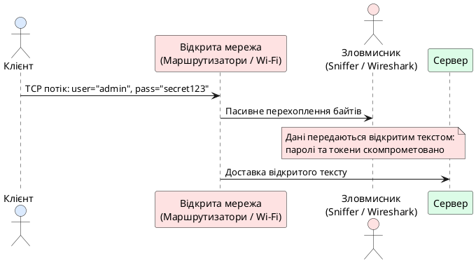
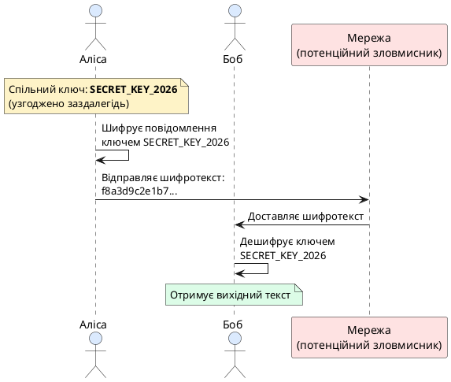
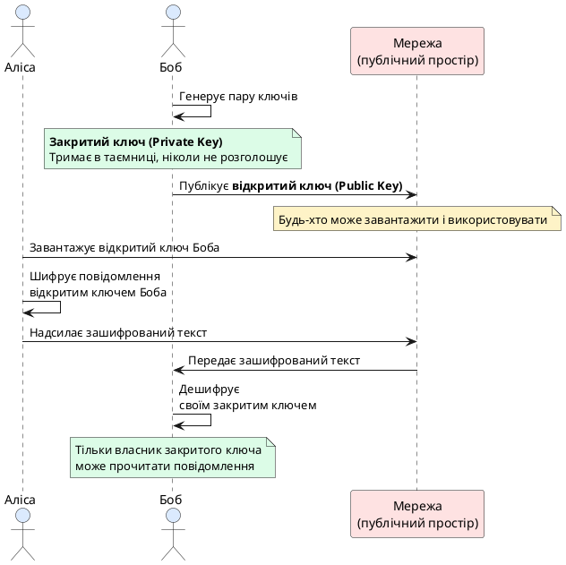
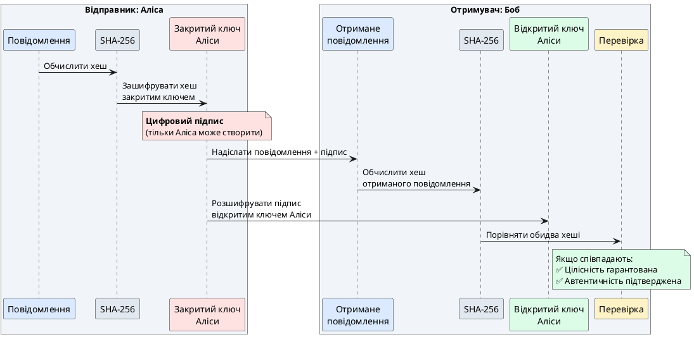
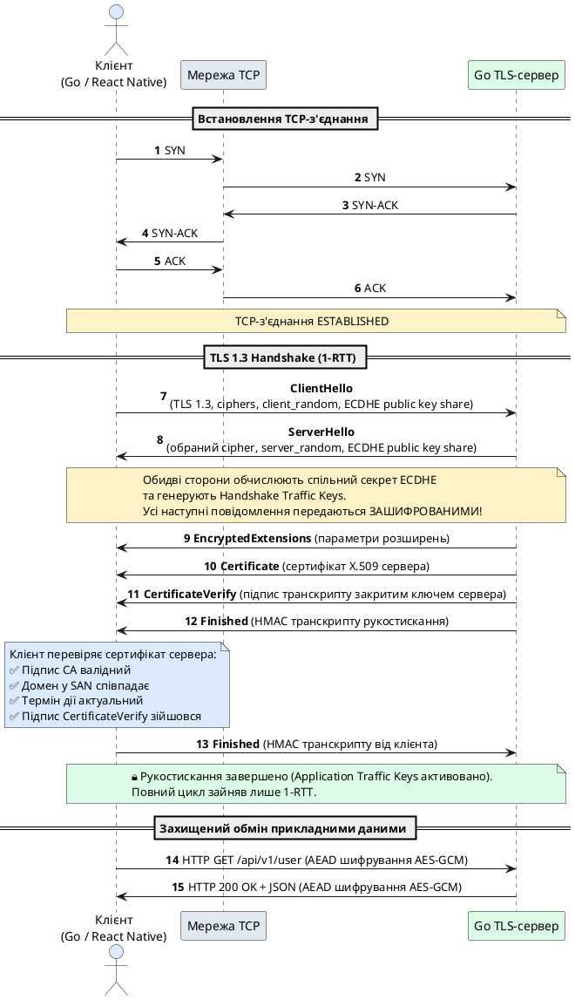
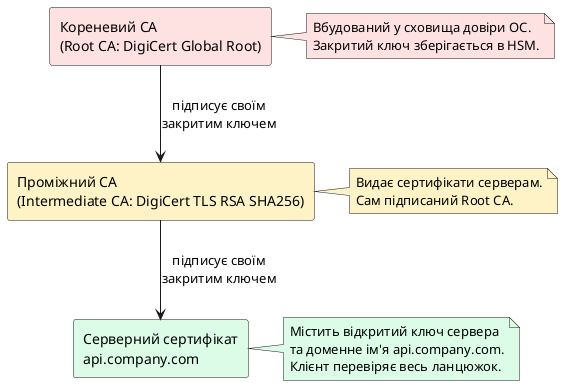
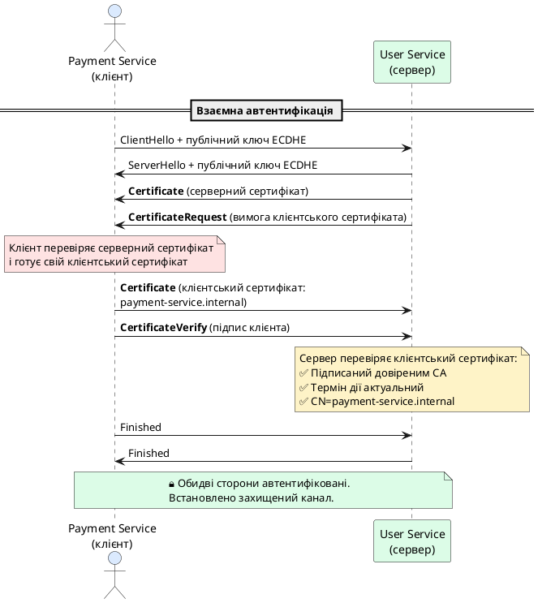

# Криптографічний захист каналів зв'язку та протокол TLS

::card-group

::card{title="🎯 Навчальні цілі" icon="i-lucide-graduation-cap"}

- Зрозуміти фундаментальну проблему: чому просте TCP-з'єднання принципово небезпечне для передачі конфіденційних даних, і які саме загрози воно несе.
- Побудувати чітку інтуїцію про різницю між **симетричним** (один спільний ключ) і **асиметричним** (пара ключів: відкритий і закритий) шифруванням через доступні життєві аналогії.
- Усвідомити роль **хеш-функцій** та **цифрових підписів** як фундаментальних будівельних блоків довіри в розподілених системах.
- Детально розібрати, як працює сучасний протокол **TLS 1.3** (_Transport Layer Security_): які кроки виконуються під час рукостискання, як узгоджуються криптографічні алгоритми та як обидві сторони приходять до спільного сеансового ключа.
- Зрозуміти концепцію **інфраструктури відкритих ключів** (PKI) і роль **сертифікатів X.509** як «цифрових посвідчень особи» серверів та клієнтів у мережі.
- Опанувати практичну роботу з пакетом `crypto/tls` у Go: налаштування захищеного TLS-сервера, валідація сертифікатів на клієнтській стороні та реалізація **взаємної автентифікації** (mTLS) у мікросервісній архітектурі.
- Ознайомитися з моделлю безпеки **Zero Trust** і зрозуміти, чому сучасні корпоративні системи вимагають верифікації кожної сторони комунікації, навіть усередині приватної мережі.

::

::card{title="🛠️ Технологічний стек" icon="i-lucide-cpu"}

- **Мова:** Go 1.22+
- **Пакети стандартної бібліотеки:** `crypto/tls`, `crypto/x509`, `crypto/rand`, `encoding/pem`
- **Інструменти діагностики:** `openssl` CLI, Wireshark з фільтром `tls`, `curl --tlsv1.3 --verbose`
- **Розгортання:** Docker для ізольованих тестових середовищ із власними CA

::

::

---

## Чому просте TCP-з'єднання — це відкритий канал без жодного захисту

Базовий транспортний протокол TCP проєктувався без вбудованих механізмів криптографічного захисту. Будь-яке з'єднання, встановлене через сокет `net.Dial("tcp", "host:port")`, передає дані відкритим байтовим потоком, доступним для перехоплення та спотворення на проміжних мережевих вузлах.

Розглянемо передачу облікових даних клієнта:

```json
{
  "action": "login",
  "username": "john.doe@company.com",
  "password": "SecretPass123"
}
```

Якщо цей JSON передається відкритим TCP-каналом, будь-який проміжний маршрутизатор, комутатор чи публічна точка доступу Wi-Fi має прямий доступ до байтів пакета. Окрім пасивного прослуховування трафіку, зловмисник із доступом до мережевого обладнання може реалізувати активну атаку — модифікувати зміст пакетів або підмінити кінцевий сервер.

{.diagram-img}

::plant-uml{alt="Загроза відкритого тексту в незахищеному TCP-каналі"}



::

::warning
**Атака «Людина посередині» (Man-in-the-Middle, MITM):** зловмисник вклинюється в канал між клієнтом і сервером, перехоплюючи або змінюючи мережеві пакети. Обидві легітимні сторони вважають, що спілкуються безпосередньо одна з одною.
::

Для вирішення цих загроз застосовується протокол **TLS** (_Transport Layer Security_) — стандарт криптографічного захисту мережевих комунікацій прикладного рівня. Його архітектура спирається на три базові примітиви: симетричне шифрування, асиметричну криптографію та хеш-функції з цифровими підписами.

---

## Симетричне шифрування: один спільний ключ для двох сторін

У моделі **симетричного шифрування** (_symmetric encryption_) для операцій шифрування та дешифрування використовується один спільний секретний ключ.

Розглянемо схему взаємодії двох учасників — Аліси та Боба:
1. Сторони заздалегідь узгоджують секретний ключ (наприклад, рядок `SECRET_KEY_2026`).
2. Аліса перетворює вихідне повідомлення на шифротекст (_ciphertext_) за допомогою симетричного алгоритму (наприклад, AES):

```
f8a3d9c2e1b7...4f6a8c9d2e1b
```

3. Шифротекст передається відкритою мережею. Навіть у разі перехоплення повідомлення неможливо прочитати без знання ключа.
4. Боб застосовує той самий ключ для дешифрування і відновлює вихідний текст.

{.diagram-img}

::plant-uml{alt="Схема симетричного шифрування між Алісою та Бобом"}



::

Симетричні алгоритми (AES, ChaCha20) оптимізовані для виконання на апаратному рівні сучасних процесорів (інструкції AES-NI) і забезпечують пропускну здатність у кілька гігабайтів за секунду.

Основне обмеження симетричного підходу — **проблема розподілу ключів** (_key distribution problem_): щоб передати спільний ключ відкритою мережею, потрібен захищений канал, для створення якого вже необхідний узгоджений ключ.

::note
**Історичний контекст:** до розробки асиметричної криптографії розподіл симетричних ключів вимагав фізичної доставки кодових книг або спеціальних кур'єрів. У глобальних розподілених мережах із мільйонами незалежних клієнтів такий підхід непридатний.
::

Цю проблему вирішує **асиметричне шифрування**.

---

## Асиметричне шифрування: пара ключів

Асиметричне шифрування (_public-key cryptography_) використовує пару математично пов'язаних ключів: **відкритий** (_public key_) та **закритий** (_private key_). Дані, зашифровані відкритим ключем, розшифровуються виключно відповідним закритим ключем:

1. Боб генерує ключову пару. Закритий ключ зберігається в таємниці, а відкритий публікується у відкритий доступ.
2. Аліса отримує відкритий ключ Боба і шифрує ним повідомлення.
3. Отриманий шифротекст передається мережею.
4. Тільки володар закритого ключа (Боб) може дешифрувати повідомлення. Навіть відправник (Аліса) після шифрування вже не може прочитати шифротекст без закритого ключа.

{.diagram-img}

::plant-uml{alt="Схема асиметричного шифрування з парою ключів"}



::


Математична основа асиметричного шифрування базується на **односторонніх функціях із лазівкою** (_trapdoor one-way functions_) — операціях, які легко обчислити в прямому напрямку, але практично неможливо інвертувати без додаткового секретного параметра. Наприклад, алгоритм **RSA** (_Rivest, Shamir, Adleman_) спирається на обчислювальну складність факторизації добутку двох великих простих чисел (довжиною 2048 або 4096 біт), а алгоритми на основі еліптичних кривих (ECC) — на складність розв'язання задачі дискретного логарифму.

::::accordion

:::accordion-item{label="❓ Чому асиметричне шифрування не використовується для всього трафіку?" icon="i-lucide-help-circle"}

Асиметричне шифрування **на кілька порядків повільніше** за симетричне. Якщо алгоритми AES-GCM або ChaCha20-Poly1305 здатні обробляти гігабайти даних за секунду завдяки прямим апаратним інструкціям процесора (наприклад, Intel AES-NI / ARM Crypto), то криптографічні операції з відкритим ключем (множення точок еліптичних кривих або операції за модулем великих чисел) вимагають значно більших обчислювальних ресурсів.

Саме тому сучасні протоколи використовують **гібридну схему**: асиметричні механізми застосовуються виключно на етапі початкового рукостискання для взаємної автентифікації сторін (за допомогою цифрових підписів) та узгодження спільного секрету (за алгоритмом Діффі-Геллмана). Після цього обидва вузли незалежно виводять симетричні сеансові ключі (_session keys_), якими шифрується весь подальший потік прикладних даних.

:::

:::accordion-item{label="❓ Що станеться, якщо зловмисник викраде закритий ключ сервера?" icon="i-lucide-help-circle"}

Компрометація довгострокового закритого ключа сервера дозволяє зловмиснику розгорнути підроблений сервер та видавати себе за легітимний сервіс. У такому разі скомпрометований сертифікат слід негайно відкликати через механізми списків відкликання (CRL) або протокол онлайнової перевірки статусу сертифікатів (OCSP).

Проте завдяки властивості **досконалої прямої секретності** (_Perfect Forward Secrecy_, PFS), яка є обов'язковою у TLS 1.3, зловмисник **не зможе розшифрувати записані в минулому сесії зв'язку**. Оскільки для кожного з'єднання генеруються одноразові ефемерні ключі Діффі-Геллмана, збережений трафік залишається захищеним навіть за умови подальшої компрометації довгострокового ключа сервера.

:::

::::

---

## Хеш-функції та цифрові підписи: гарантія цілісності та автентичності

Крім конфіденційності та безпечного розподілу ключів, надійний транспортний канал повинен гарантувати дві властивості: **цілісність** (_integrity_) та **автентичність** (_authenticity_). Якщо шифротекст передається відкритим каналом, зловмисник може навмисно модифікувати байти потоку (активна атака). Без механізму перевірки цілісності отримувач не здатний визначити, чи відповідає дешифроване повідомлення початковому станові, відправленому відправником.

Для контролю цілісності застосовуються **криптографічні хеш-функції** (_cryptographic hash functions_) — алгоритми, які детерміновано перетворюють вхідні дані довільної довжини у вихідний бітовий рядок фіксованого розміру (**дайджест** або **хеш**, зазвичай 256 або 512 біт). Криптографічні хеш-функції мають такі фундаментальні властивості:

1. **Стійкість до відновлення прообразу** (_pre-image resistance_): маючи значення хешу :math-formula{tex="h" inline}, обчислювально неможливо відновити початкове повідомлення :math-formula{tex="m" inline}, для якого :math-formula{tex="H(m) = h" inline}.
2. **Лавинний ефект** (_avalanche effect_): зміна навіть одного біта у вхідних даних призводить до зміни приблизно половини бітів вихідного дайджесту, роблячи його значення непередбачуваним.
3. **Стійкість до колізій** (_collision resistance_): практично неможливо знайти два різні повідомлення :math-formula{tex="m_1 \neq m_2" inline}, для яких :math-formula{tex="H(m_1) = H(m_2)" inline}.

Найпоширенішими алгоритмами цього класу є **SHA-256** та **SHA-512** (_Secure Hash Algorithm_). Приклад обчислення хешу на Go:

```go
package main

import (
	"crypto/sha256"
	"fmt"
)

func main() {
	message := "Переказати 1000 гривень на рахунок X"
	hash := sha256.Sum256([]byte(message))
	fmt.Printf("SHA-256: %x\n", hash)

	// Змінимо одну цифру: "1000" -> "2000"
	modifiedMessage := "Переказати 2000 гривень на рахунок X"
	modifiedHash := sha256.Sum256([]byte(modifiedMessage))
	fmt.Printf("SHA-256 зміненого: %x\n", modifiedHash)
}
```

Вихід програми демонструє два кардинально відмінні 64-символьні шістнадцяткові рядки, попри різницю у вхідних даних лише в один символ.

Однак сама лише передача хешу разом із повідомленням не захищає від атакуючого на каналі зв'язку, який може перехопити пакет, замінити його зміст, обчислити новий хеш і надіслати підмінені значення отримувачу. Для запобігання підміні використовується **цифровий підпис** (_digital signature_).

Цифровий підпис поєднує хешування та асиметричну криптографію:

1. Відправник обчислює дайджест вихідного повідомлення: :math-formula{tex="h = H(m)" inline}.
2. Дайджест підписується (шифрується) **закритим ключем відправника**: :math-formula{tex="s = \text{Sign}_{K_{\text{priv}}}(h)" inline}. Отримане значення :math-formula{tex="s" inline} є цифровим підписом.
3. Отримувач приймає повідомлення :math-formula{tex="m" inline} та підпис :math-formula{tex="s" inline}.
4. Отримувач самостійно обчислює хеш отриманого повідомлення :math-formula{tex="h' = H(m)" inline} та перевіряє підпис за допомогою **відкритого ключа відправника**: :math-formula{tex="\text{Verify}_{K_{\text{pub}}}(s, h')" inline}.

Якщо обчислений хеш відповідає значенню з розшифрованого підпису, гарантуються дві умови:

1. **Цілісність:** повідомлення не було модифіковано під час транспортування.
2. **Автентичність та невідмовність** (_non-repudiation_): повідомлення створене виключно власником відповідного закритого ключа, оскільки відкритий ключ валідує лише коректний криптографічний підпис.

{.diagram-img}

::plant-uml{alt="Схема створення та перевірки цифрового підпису"}



::

Розглянуті базові примітиви — симетричне шифрування (швидкість та конфіденційність даних), асиметричне шифрування (безпечний розподіл ключів), хеш-функції (контроль цілісності) та цифрові підписи (автентифікація відправника) — складають криптографічний фундамент протоколу TLS.

---

## Протокол TLS 1.3: захищене рукостискання та узгодження сеансового ключа

Протокол **TLS** (_Transport Layer Security_) — це криптографічний протокол, який працює **поверх надійного транспорту TCP** і забезпечує три базові властивості безпечної комунікації:

1. **Конфіденційність** (_confidentiality_): захист від несанкціонованого перегляду переданих даних.
2. **Цілісність** (_integrity_): виявлення будь-якої модифікації даних у процесі передачі.
3. **Автентичність** (_authenticity_): підтвердження відповідності сторін заявленій ідентичності.

Стандарт **TLS 1.3** (RFC 8446) оптимізував узгодження параметрів безпеки, усунув застарілі та потенційно вразливі криптографічні механізми й скоротив мережеву затримку. Розглянемо послідовність кроків під час **TLS-рукостискання** (_TLS handshake_).

### Фаза 1: ClientHello — клієнт ініціює з'єднання

Клієнт ініціює процедуру встановлення каналу, надсилаючи повідомлення **ClientHello**, що містить:

- **Версію TLS**, яку підтримує клієнт (у сучасному стеку — TLS 1.3).
- **Список наборів шифрів** (_cipher suites_), підтримуваних клієнтом (наприклад, `TLS_AES_128_GCM_SHA256`, `TLS_CHACHA20_POLY1305_SHA256`).
- **Випадкове число клієнта** (_random nonce_) — 32 байти криптографічно стійких псевдовипадкових даних для захисту від атак повторного відтворення (_replay attacks_).
- **Публічний ключ клієнта** для узгодження секрету за алгоритмом Діффі-Геллмана (_key share_). На відміну від TLS 1.2, клієнт надсилає свій відкритий ключ уже в першому повідомленні, що усуває зайвий мережевий обмін.

::tip
**Порівняння затримки рукостискання TLS 1.3 та TLS 1.2:** Рукостискання в TLS 1.2 вимагало двох повних циклів передачі пакетів (2-RTT) до початку відправки зашифрованих прикладних даних. У TLS 1.3 цей процес скорочено до **одного циклу (1-RTT)**, а при повторному підключенні до відомого сервера — до **нуля циклів (0-RTT)**.
::

### Фаза 2: ServerHello та шифрування повідомлень рукостискання

Сервер обирає взаємно підтримуваний криптографічний набір і надсилає повідомлення **ServerHello**, яке містить:

- **Обраний набір шифрів** (_cipher suite_), наприклад `TLS_AES_128_GCM_SHA256`.
- **Випадкове число сервера** (32 байти унікальних псевдовипадкових даних).
- **Публічний ключ сервера** (_key share_) для завершення розрахунку секрету за алгоритмом ECDHE.

::tip
**Шифрування метаданих у TLS 1.3:** Отримавши публічні ключі з `ClientHello` та `ServerHello`, клієнт і сервер відразу розраховують проміжний секрет рукостискання (_Handshake Secret_). Усі наступні службові блоки сервера — `EncryptedExtensions`, `Certificate`, `CertificateVerify` та `Finished` — передаються **у зашифрованому вигляді**. У TLS 1.2 сертифікати передавалися відкритим текстом, що дозволяло пасивному спостерігачеві перехоплювати назви хостів та метадані сервісів.
::

Безпосередньо після `ServerHello` сервер передає зашифровані службові структури:

1. **EncryptedExtensions:** параметри конфігурації з'єднання, які не впливають на ключовий матеріал (наприклад, узгодження протоколу прикладного рівня ALPN для HTTP/2).
2. **Certificate:** ланцюжок цифрових сертифікатів X.509 сервера, підписаний довіреним CA.
3. **CertificateVerify:** цифровий підпис хешу всіх попередніх повідомлень рукостискання, створений **довгостроковим закритим ключем сервера**. Цей підпис підтверджує, що сервер володіє закритим ключем, який відповідає сертифікату.

Клієнт верифікує сертифікат і підпис за такими критеріями:
1. Ланцюжок підписів CA зводиться до локального сховища довірених кореневих сертифікатів.
2. Цільовий домен відповідає записам у розширенні SAN (_Subject Alternative Name_).
3. Поточний час потрапляє у вікно валідності сертифіката, а сам сертифікат не відкликаний.

### Фаза 3: Обмін ключами Діффі-Геллмана та обчислення спільного секрету

Для узгодження симетричного сеансового ключа без його прямої передачі мережею використовується алгоритм **ефемерного обміну ключами Діффі-Геллмана на еліптичних кривих** (_ECDHE_ — _Elliptic Curve Diffie-Hellman Ephemeral_).

У класичній схемі Діффі-Геллмана сторони використовують спільні відкриті параметри: просте число :math-formula{tex="p" inline} та генератор :math-formula{tex="g" inline}. Клієнт генерує приватне число :math-formula{tex="a" inline}, а сервер — приватне число :math-formula{tex="b" inline}:

::math-formula
\begin{aligned}
A &= g^a \bmod p \quad (\text{відкритий ключ клієнта}) \\
B &= g^b \bmod p \quad (\text{відкритий ключ сервера}) \\
K &= B^a \bmod p = (g^b)^a \bmod p = (g^a)^b \bmod p = A^b \bmod p \quad (\text{спільний секрет})
\end{aligned}
::

Сторонній спостерігач у мережі фіксує лише публічні значення :math-formula{tex="A" inline} та :math-formula{tex="B" inline}. Обчислення з них спільного секрету :math-formula{tex="K" inline} без знання секретів :math-formula{tex="a" inline} чи :math-formula{tex="b" inline} зводиться до розв'язання задачі дискретного логарифмування, що обчислювально недосяжно для сучасних комп'ютерів за умови достатньої довжини ключа.

У протоколі TLS 1.3 замість модульної арифметики застосовуються еліптичні криві (наприклад, Curve25519 або NIST P-256):
- Приватні ключі являють собою великі скалярні значення :math-formula{tex="d_A, d_B" inline}.
- Публічні ключі — точки на еліптичній кривій :math-formula{tex="Q_A = d_A \cdot G" inline} та :math-formula{tex="Q_B = d_B \cdot G" inline}.
- Спільний секрет обчислюється як скалярний добуток: :math-formula{tex="K = d_A \cdot Q_B = d_B \cdot Q_A = d_A \cdot d_B \cdot G" inline}.

Отриманий спільний секрет передається у функцію формування ключів **HKDF** (_HMAC-based Extract-and-Expand Key Derivation Function_), яка генерує робочі симетричні сеансові ключі для AES-GCM або ChaCha20-Poly1305: окремі ключі шифрування та вектори ініціалізації (IV) для клієнтського та серверного трафіку.

::note
Параметр **Ephemeral** (ефемерний) вказує на те, що пари ключів :math-formula{tex="(d_A, Q_A)" inline} та :math-formula{tex="(d_B, Q_B)" inline} генеруються окремо для кожної сесії та видаляються з оперативної пам'яті після виведення ключів шифрування. Це гарантує виконання вимоги **Perfect Forward Secrecy (PFS)**.
::

### Фаза 4: Finished — підтвердження встановлення захищеного каналу

Після обчислення сеансових ключів сервер відправляє повідомлення **Finished**, що містить HMAC від транскрипту всіх надісланих та отриманих повідомлень рукостискання. Клієнт перевіряє значення HMAC, підтверджуючи відсутність спотворень чи атак підміни на попередніх етапах.

У відповідь клієнт відправляє власне повідомлення **Finished**. Після цього етап рукостискання вважається завершеним, і з'єднання переходить до фази **Application Data**: передача прикладних пакетів відбувається з використанням симетричного шифрування AEAD.

Повна послідовність повідомлень TLS 1.3 Handshake:

{.diagram-img}

::plant-uml{alt="Повна діаграма TLS 1.3 Handshake"}



::

::warning
**Захист від атак «людина посередині» (MITM):** У разі підміни DNS або перехоплення мережевого трафіку фальшивий сервер може виконати TLS-рукостискання, але не здатний надати валідний сертифікат для цільового домену (наприклад, `api.company.com`), підписаний довіреним центром сертифікації. Клієнт зафіксує невідповідність сертифіката й розірве з'єднання до передачі будь-яких прикладних даних.
::

---

## Інфраструктура відкритих ключів (PKI) та сертифікати X.509

Для перевірки автентичності публічних ключів і доменних імен використовується **інфраструктура відкритих ключів** (_Public Key Infrastructure_, PKI) — система розподілу та підтвердження довіри, заснована на ієрархії **центрів сертифікації** (_Certificate Authorities_, CA).

### Ієрархія довіри: кореневі та проміжні центри сертифікації

В основі PKI лежать **кореневі центри сертифікації** (_Root CA_). Їхні сертифікати попередньо встановлені у сховищах довіри операційних систем (Windows, macOS, Linux) та мобільних платформ (Android, iOS). Закриті ключі Root CA зберігаються в апаратних модулях безпеки (HSM) в ізольованому контурі та застосовуються виключно для підпису сертифікатів **проміжних центрів сертифікації** (_Intermediate CA_).

Проміжні CA здійснюють регулярні операції з валідації та випуску кінцевих сертифікатів серверів. Розділення на кореневі та проміжні центри зменшує ризики: у разі компрометації проміжного CA відкликається лише його сертифікат, тоді як Root CA залишається незмінним. Таким чином формується **ланцюжок довіри** (_certificate chain_):

{.diagram-img}

::plant-uml{alt="Ланцюжок довіри сертифікатів X.509"}



::

Коли клієнт отримує сертифікат сервера під час TLS-рукостискання, він виконує наступні кроки перевірки:

1. **Перевіряє підпис серверного сертифіката** за допомогою відкритого ключа проміжного CA (який також надсилається разом із серверним сертифікатом).
2. **Перевіряє підпис проміжного CA** за допомогою відкритого ключа кореневого CA (який уже є у вбудованому списку довірених сертифікатів операційної системи).
3. **Перевіряє доменне ім'я** в серверному сертифікаті: воно має співпадати з тим, до якого клієнт підключається.
4. **Перевіряє термін дії**: поточна дата має потрапляти в інтервал між `notBefore` та `notAfter`.
5. **Перевіряє статус відкликання** (_revocation_): чи не був цей сертифікат відкликаний раніше через компрометацію (через OCSP або CRL).

Якщо всі перевірки пройшли успішно — клієнт довіряє серверу і продовжує з'єднання. Якщо хоча б одна перевірка провалилася — з'єднання відхиляється.

::::accordion

:::accordion-item{label="❓ Що таке самопідписаний сертифікат і чому браузери його не приймають?" icon="i-lucide-help-circle"}

**Самопідписаний сертифікат** (_self-signed certificate_) — це сертифікат, підписаний власним закритим ключем його творця, а не акредитованим центром сертифікації. Хоча він забезпечує криптографічне шифрування байтового потоку, він **не надає жодних гарантій автентичності**: будь-який зловмисник може згенерувати самопідписаний сертифікат із будь-яким доменним ім'ям.

Саме тому клієнти та браузери за замовчуванням блокують такі з'єднання. Самопідписані сертифікати допустимі **виключно для локальної розробки** або закритих тестових контурів, де кореневий сертифікат вручну імпортується до системного сховища довіри.

:::

:::accordion-item{label="❓ Чому термін дії сертифікатів обмежений (зазвичай 90 днів або 1 рік)?" icon="i-lucide-help-circle"}

Обмеження терміну дії сертифікатів мінімізує так зване «вікно компрометації». Якщо закритий ключ сертифіката буде скомпрометовано, термін зловживання ним обмежений часом життя сертифіката.

Індустріальний стандарт, популяризований Let's Encrypt, становить **90 днів** із повною автоматизацією оновлення через протокол ACME (_Automated Certificate Management Environment_). Це стимулює інженерів повністю автоматизувати життєвий цикл сертифікатів та виключає людський фактор забутих термінів дії.

:::

::::

---

## Практична робота з TLS у Go: пакет crypto/tls

Стандартна бібліотека Go містить пакет **`crypto/tls`**, що реалізує специфікацію TLS (зокрема TLS 1.3) та інтегрується зі стандартними мережевими інтерфейсами `net.Conn`, `net.Listener`, а також сервером `net/http`.

### Створення базового TLS-сервера

Для налаштування захищеного HTTP-сервера необхідні два файли: **сертифікат сервера** (`server.crt`) та відповідний **закритий ключ** (`server.key`). Для локальної розробки та тестування пари ключів і сертифікат генеруються за допомогою утиліти OpenSSL:

::tabs
::tabs-item{label="Генерація сертифіката з SAN"}

```bash
openssl req -x509 -newkey rsa:2048 -keyout server.key -out server.crt \
  -days 365 -nodes -subj "/CN=localhost" \
  -addext "subjectAltName=DNS:localhost,IP:127.0.0.1"
```

::
::tabs-item{label="Пояснення параметрів"}

- `-x509`: створити сертифікат формату X.509.
- `-newkey rsa:2048`: згенерувати новий закритий ключ RSA довжиною 2048 біт.
- `-keyout server.key`: зберегти закритий ключ у файл `server.key`.
- `-out server.crt`: зберегти сертифікат у файл `server.crt`.
- `-days 365`: термін дії 1 рік.
- `-nodes`: не шифрувати закритий ключ паролем (для локальної розробки).
- `-subj "/CN=localhost"`: спадкове поле Common Name.
- `-addext "subjectAltName=DNS:localhost,IP:127.0.0.1"`: **обов'язкове розширення SAN**. Без нього сучасний стек Go 1.15+ відхилить сертифікат.

::
::

::warning
**Чому розширення SAN є обов'язковим:** У сучасних стандартах IETF та в стандартній бібліотеці Go (починаючи з Go 1.15) перевірка хоста за полем `Common Name` (CN) офіційно застаріла й ігнорується за замовчуванням. Якщо згенерувати сертифікат без `subjectAltName`, Go-клієнт викине критичну помилку `x509: certificate relies on legacy Common Name field, use SANs instead`.
::

Після виконання цієї команди в поточній директорії з'являться два файли: `server.crt` та `server.key`. Тепер напишемо Go-сервер, який використовує ці файли для TLS:

```go
package main

import (
	"crypto/tls"
	"fmt"
	"log"
	"net/http"
)

func main() {
	// Простий HTTP-обробник
	http.HandleFunc("/api/v1/health", func(w http.ResponseWriter, r *http.Request) {
		w.Header().Set("Content-Type", "application/json")
		fmt.Fprintf(w, `{"status": "OK", "secure": true}`)
	})

	// Налаштування TLS: вимагаємо сучасний протокол TLS 1.3
	tlsConfig := &tls.Config{
		MinVersion: tls.VersionTLS13,
	}

	server := &http.Server{
		Addr:      ":8443",
		TLSConfig: tlsConfig,
	}

	log.Println("🔒 TLS-сервер запущено на https://localhost:8443")
	log.Fatal(server.ListenAndServeTLS("server.crt", "server.key"))
}
```

Ключові моменти цього коду:

1. **`tls.Config`** — центральна структура налаштування параметрів безпеки:
   - `MinVersion: tls.VersionTLS13` — відсікає всі застарілі протоколи (TLS 1.0, 1.1 та 1.2), усуваючи загрози атак типу перегляду та зниження версії (downgrade attacks).
   - **Зверніть увагу:** у Go поле `tlsConfig.CipherSuites` контролює шифри тільки для TLS 1.0–1.2. У TLS 1.3 шифронабори жорстко зафіксовані стандартом і автоматично обираються криптографічним ядром мови (AES-GCM або ChaCha20-Poly1305), тому ручне задання шифрів у цьому полі для TLS 1.3 є зайвим.

2. **`ListenAndServeTLS("server.crt", "server.key")`** — метод, який зчитує пару ключів із диска та переводить сокет у режим очікування захищених з'єднань на порт 8443.

Запустимо сервер і перевіримо його роботу через `curl`:

::terminal-preview{title="curl --cacert server.crt https://localhost:8443/api/v1/health" :cursor="true"}

<div class="line"><span class="opacity-40">$</span> <strong class="font-bold">curl --cacert server.crt https://localhost:8443/api/v1/health</strong></div>
<div class="line"><span class="text-green-400 font-bold">{"status": "OK", "secure": true}</span></div>

::

::tip
Замість небезпечного прапорця `--insecure` (який вимикає будь-яку верифікацію сервера), ми передали наш тестовий сертифікат як довірений центр через параметр `--cacert server.crt`. Це демонструє безпечне тестування без компрометації перевірки автентичності.
::

### Налаштування TLS-клієнта у Go

Тепер створимо клієнтську програму на Go. Щоб клієнт довіряв нашому локальному сертифікату, ми створимо власний кореневий пул довіри (`x509.CertPool`):

```go
package main

import (
	"crypto/tls"
	"crypto/x509"
	"fmt"
	"io"
	"log"
	"net/http"
	"os"
)

func main() {
	// Завантажуємо серверний сертифікат у локальний пул довіри
	caCert, err := os.ReadFile("server.crt")
	if err != nil {
		log.Fatalf("Не вдалося прочитати сертифікат: %v", err)
	}

	caCertPool := x509.NewCertPool()
	if !caCertPool.AppendCertsFromPEM(caCert) {
		log.Fatal("Не вдалося додати сертифікат до пулу CA")
	}

	// Налаштовуємо TLS-конфігурацію клієнта
	tlsConfig := &tls.Config{
		RootCAs:    caCertPool,       // Довіряємо нашому тестовому сертифікату
		MinVersion: tls.VersionTLS13, // Вимагаємо сучасний TLS 1.3
	}

	// Створюємо HTTP-клієнт із власним транспортом
	client := &http.Client{
		Transport: &http.Transport{
			TLSClientConfig: tlsConfig,
		},
	}

	resp, err := client.Get("https://localhost:8443/api/v1/health")
	if err != nil {
		log.Fatalf("Помилка запиту: %v", err)
	}
	defer resp.Body.Close()

	body, _ := io.ReadAll(resp.Body)
	fmt.Printf("Відповідь від сервера: %s\n", body)
	fmt.Printf("Версія TLS: %s\n", tls.VersionName(resp.TLS.Version))
	fmt.Printf("Cipher Suite: %s\n", tls.CipherSuiteName(resp.TLS.CipherSuite))
}
```

Результат виконання клієнта:

::terminal-preview{title="go run client.go" :cursor="true"}

<div class="line"><span class="opacity-40">$</span> <strong class="font-bold">go run client.go</strong></div>
<div class="line">Відповідь від сервера: <span class="text-green-400 font-bold">{"status": "OK", "secure": true}</span></div>
<div class="line">Версія TLS: <span class="text-blue-400 font-bold">TLS 1.3</span></div>
<div class="line">Cipher Suite: <span class="text-yellow-400 font-bold">TLS_AES_128_GCM_SHA256</span></div>

::

Клієнт успішно встановив захищене з'єднання, перевірив сертифікат сервера (додавши його до пулу довірених) і отримав зашифровану відповідь. Поле `resp.TLS` містить детальну інформацію про параметри встановленого TLS-з'єднання, включно з версією протоколу та обраним криптографічним набором.

::tip
**Для продакшн-середовища** замість самопідписаних сертифікатів використовуйте сертифікати, видані публічними довіреними CA (наприклад, безкоштовний Let's Encrypt через бібліотеку `golang.org/x/crypto/acme/autocert`). У такому випадку клієнту не потрібно модифікувати `RootCAs` — стандартний пул довірених CA операційної системи автоматично перевірить весь сертифікаційний ланцюжок.
::

---

## Безпечні сокети: перехід від net.Conn до tls.Conn

У попередніх лекціях ми вивчали програмування сокетів через функції `net.Listen` та `net.Dial`, проєктували власні бінарні протоколи та текстові сервери. Важливо розуміти: протокол TLS не прив'язаний виключно до HTTP. Пакет `crypto/tls` спроєктований так, щоб безшовно інтегруватися з інтерфейсами `net.Listener` та `net.Conn`.

Будь-який TCP-потік можна зашифрувати, замінивши стандартний мережевий сокет на його криптографічну обгортку. Порівняємо реалізацію звичайного та захищеного сокетного ехо-сервера:

::code-group

```go [Чистий TCP сокет (net)]
package main

import (
	"log"
	"net"
)

func runTCPServer() {
	// Створення звичайного сокета слухача
	listener, err := net.Listen("tcp", ":9000")
	if err != nil {
		log.Fatal(err)
	}
	defer listener.Close()

	for {
		conn, err := listener.Accept()
		if err != nil {
			continue
		}
		// conn реалізує інтерфейс net.Conn (відкритий текст)
		go handleRawConnection(conn)
	}
}

func handleRawConnection(conn net.Conn) {
	defer conn.Close()
	buffer := make([]byte, 1024)
	n, _ := conn.Read(buffer)
	conn.Write(buffer[:n])
}
```

```go [Захищений TLS сокет (crypto/tls)]
package main

import (
	"crypto/tls"
	"log"
)

func runTLSServer() {
	// Завантаження пари ключів сервера
	cert, err := tls.LoadX509KeyPair("server.crt", "server.key")
	if err != nil {
		log.Fatal(err)
	}

	tlsConfig := &tls.Config{
		Certificates: []tls.Certificate{cert},
		MinVersion:   tls.VersionTLS13,
	}

	// Створення захищеного сокета слухача
	listener, err := tls.Listen("tcp", ":9443", tlsConfig)
	if err != nil {
		log.Fatal(err)
	}
	defer listener.Close()

	for {
		conn, err := listener.Accept()
		if err != nil {
			continue
		}
		// conn є екземпляром *tls.Conn, який також реалізує net.Conn
		go handleTLSConnection(conn)
	}
}

func handleTLSConnection(conn net.Conn) {
	defer conn.Close()
	buffer := make([]byte, 1024)
	// Дані дешифруються на льоту ядром TLS
	n, _ := conn.Read(buffer)
	// Дані шифруються перед записом у TCP-канал
	conn.Write(buffer[:n])
}
```

::

### Ручне підвищення з'єднання (Connection Upgrading)

У клієнт-серверних протоколах часто виникає потреба розпочати комунікацію у відкритому режимі, а потім «підвищити» з'єднання до зашифрованого (так працює команда `STARTTLS` у протоколах SMTP або LDAP).

Пакет `crypto/tls` дозволяє обгорнути вже встановлений сокет `net.Conn` функцією `tls.Server` або `tls.Client`:

```go
// 1. Встановлюємо звичайний TCP-сокет
rawConn, err := net.Dial("tcp", "localhost:9443")
if err != nil {
	log.Fatal(err)
}

// 2. Обгортаємо сокет криптографічним рушієм TLS
tlsConn := tls.Client(rawConn, tlsConfig)

// 3. Явно ініціюємо рукостискання з таймаутом через Context
ctx, cancel := context.WithTimeout(context.Background(), 5*time.Second)
defer cancel()

if err := tlsConn.HandshakeContext(ctx); err != nil {
	log.Fatalf("TLS Handshake завершився з помилкою: %v", err)
}

// Тепер через tlsConn можна безпечно передавати дані
```

Метод `HandshakeContext(ctx)` гарантує, що рукостискання буде примусово зупинено, якщо сервер зависне або атакуючий заблокує пакети відповіді.

---

## Взаємна автентифікація (mTLS): коли сервер теж перевіряє клієнта

До цього моменту ми розглядали класичний сценарій TLS: **клієнт перевіряє сервер**, переконуючись, що розмовляє саме з тим доменом, до якого підключається. Але в розподілених системах — особливо в корпоративних мікросервісних архітектурах, платіжних шлюзах або мережах IoT — необхідна **двостороння автентифікація**: не тільки клієнт перевіряє сервер, але й **сервер обов'язково верифікує ідентичність клієнта**.

Це називається **взаємною автентифікацією TLS** (_mutual TLS_, скорочено **mTLS**). У такій схемі обидва учасники мають власні сертифікати X.509, підписані корпоративним центром сертифікації.

### Сценарій застосування: корпоративний мікросервіс та модель Zero Trust

Уявімо сервіс платежів (Payment Service), що викликає внутрішній API обліку користувачів (User Service). Згідно з парадигмою безпеки **Zero Trust** («ніколи не довіряй, завжди перевіряй»), внутрішня мережа дата-центру розглядається як потенційно вороже середовище. Кожен внутрішній сервіс повинен криптографічно підтверджувати свої права доступу на транспортному рівні.

### Режими перевірки клієнта (tls.ClientAuthType)

У структурі `tls.Config` поведінка сервера регулюється полем `ClientAuth`. Go надає п'ять режимів перевірки:

| Режим перевірки | Поведінка сервера | Сфера застосування |
| :--- | :--- | :--- |
| `tls.NoClientCert` | Сервер не надсилає запит на сертифікат клієнта (за замовчуванням). | Публічні вебсайти, класичний HTTPS. |
| `tls.RequestClientCert` | Запитує сертифікат, але не вимагає його та не валідує автоматично. | Опціональний вхід або ручна валідація в коді. |
| `tls.RequireAnyClientCert` | Вимагає будь-який сертифікат, але не перевіряє його кореневим CA. | Не рекомендується (відсутня перевірка довіри). |
| `tls.VerifyClientCertIfGiven` | Якщо сертифікат надано — суворо перевіряє його через `ClientCAs`. | М'яка міграція системи на mTLS. |
| `tls.RequireAndVerifyClientCert` | **Суворий mTLS:** вимагає валідний сертифікат, підписаний CA з пулу. | Корпоративні мікросервіси, банкінг, Zero Trust. |

### Генерація сертифікатів для mTLS із підтримкою SAN

Створимо за допомогою `openssl` власний тестовий CA, а також сертифікати сервера і клієнта. Зверніть увагу: ми обов'язково вказуємо розширення `subjectAltName` для коректної роботи валідатора Go:

::tabs
::tabs-item{label="1. Кореневий CA"}

```bash
# Генеруємо закритий ключ та самопідписаний сертифікат Root CA
openssl genrsa -out ca.key 4096
openssl req -x509 -new -key ca.key -out ca.crt -days 3650 \
  -subj "/CN=CompanyInternalCA"
```

::
::tabs-item{label="2. Серверний сертифікат"}

```bash
# Генеруємо ключ та CSR сервера
openssl genrsa -out server.key 2048
openssl req -new -key server.key -out server.csr \
  -subj "/CN=user-service.internal"

# Підписуємо CSR сертифікатом Root CA з додаванням SAN
openssl x509 -req -in server.csr -CA ca.crt -CAkey ca.key \
  -CAcreateserial -out server.crt -days 365 \
  -extfile <(printf "subjectAltName=DNS:user-service.internal,DNS:localhost,IP:127.0.0.1")
```

::
::tabs-item{label="3. Клієнтський сертифікат"}

```bash
# Генеруємо ключ та CSR клієнта
openssl genrsa -out client.key 2048
openssl req -new -key client.key -out client.csr \
  -subj "/CN=payment-service.internal"

# Підписуємо клієнтський сертифікат тим самим Root CA
openssl x509 -req -in client.csr -CA ca.crt -CAkey ca.key \
  -CAcreateserial -out client.crt -days 365 \
  -extfile <(printf "subjectAltName=DNS:payment-service.internal")
```

::
::

### Реалізація mTLS-сервера у Go

Налаштуємо Go HTTP-сервер у режимі `tls.RequireAndVerifyClientCert`:

```go
package main

import (
	"crypto/tls"
	"crypto/x509"
	"fmt"
	"log"
	"net/http"
	"os"
)

func main() {
	// Завантажуємо кореневий сертифікат для перевірки клієнтів
	caCert, err := os.ReadFile("ca.crt")
	if err != nil {
		log.Fatalf("Не вдалося прочитати CA: %v", err)
	}

	caCertPool := x509.NewCertPool()
	caCertPool.AppendCertsFromPEM(caCert)

	tlsConfig := &tls.Config{
		ClientAuth: tls.RequireAndVerifyClientCert, // Обов'язкова валідація клієнта
		ClientCAs:  caCertPool,                     // Довірені CA для клієнтських ключів
		MinVersion: tls.VersionTLS13,
	}

	http.HandleFunc("/api/v1/user", func(w http.ResponseWriter, r *http.Request) {
		// Отримуємо верифікований сертифікат клієнта
		if len(r.TLS.PeerCertificates) > 0 {
			clientCert := r.TLS.PeerCertificates[0]
			log.Printf("✅ Авторизовано мікросервіс: %s", clientCert.Subject.CommonName)
			fmt.Fprintf(w, `{"authenticated_client": "%s", "access": "granted"}`, 
				clientCert.Subject.CommonName)
			return
		}
		http.Error(w, "Клієнтський сертифікат відсутній", http.StatusUnauthorized)
	})

	server := &http.Server{
		Addr:      ":8443",
		TLSConfig: tlsConfig,
	}

	log.Println("🔒 mTLS-сервер запущено на https://localhost:8443")
	log.Fatal(server.ListenAndServeTLS("server.crt", "server.key"))
}
```

### Реалізація mTLS-клієнта у Go

Клієнт повинен завантажити власну пару ключів (`client.crt`, `client.key`) та надати її у структурі `Certificates`. Крім того, поле `ServerName` явно задає очікуване доменне ім'я сервера згідно з SAN:

```go
package main

import (
	"crypto/tls"
	"crypto/x509"
	"fmt"
	"io"
	"log"
	"net/http"
	"os"
)

func main() {
	// Завантажуємо клієнтську пару ключів (сертифікат + закритий ключ)
	cert, err := tls.LoadX509KeyPair("client.crt", "client.key")
	if err != nil {
		log.Fatalf("Не вдалося завантажити клієнтський сертифікат: %v", err)
	}

	// Завантажуємо Root CA для верифікації сервера
	caCert, err := os.ReadFile("ca.crt")
	if err != nil {
		log.Fatalf("Не вдалося прочитати CA: %v", err)
	}

	caCertPool := x509.NewCertPool()
	caCertPool.AppendCertsFromPEM(caCert)

	tlsConfig := &tls.Config{
		Certificates: []tls.Certificate{cert},     // Надаємо власний сертифікат
		RootCAs:      caCertPool,                  // Перевіряємо сервер за нашим CA
		ServerName:   "user-service.internal",     // Очікуваний хост із SAN сервера
		MinVersion:   tls.VersionTLS13,
	}

	client := &http.Client{
		Transport: &http.Transport{
			TLSClientConfig: tlsConfig,
		},
	}

	resp, err := client.Get("https://localhost:8443/api/v1/user")
	if err != nil {
		log.Fatalf("Помилка запиту: %v", err)
	}
	defer resp.Body.Close()

	body, _ := io.ReadAll(resp.Body)
	fmt.Printf("✅ Відповідь від сервера: %s\n", body)
}
```

Результат виконання:

::terminal-preview{title="go run mtls-client.go" :cursor="true"}

<div class="line"><span class="opacity-40">$</span> <strong class="font-bold">go run mtls-client.go</strong></div>
<div class="line"><span class="text-green-400 font-bold">✅ Відповідь від сервера:</span> {"authenticated_client": "payment-service.internal", "access": "granted"}</div>

::

Якщо неавторизований клієнт спробує надіслати запит без сертифіката:

::terminal-preview{title="curl https://localhost:8443/api/v1/user --cacert ca.crt" :cursor="true"}

<div class="line"><span class="opacity-40">$</span> <strong class="font-bold">curl https://localhost:8443/api/v1/user --cacert ca.crt</strong></div>
<div class="line text-red-400 font-bold">curl: (35) error:14094412:SSL routines:ssl3_read_bytes:sslv3 alert bad certificate</div>

::

З'єднання скидається на рівні ядра TLS ще до того, як HTTP-обробник взагалі отримає байти запиту.

{.diagram-img}

::plant-uml{alt="Схема взаємної автентифікації mTLS"}



::

---

## Підсумок: ключові концепції захисту з'єднань

Основні принципи криптографічного захисту транспортного рівня:

::card-group

::card{title="🔐 Симетричне vs Асиметричне шифрування" icon="i-lucide-key"}

**Симетричне шифрування** (AES, ChaCha20) використовує спільний сеансовий ключ для шифрування та дешифрування — забезпечує високу швидкість обробки даних за рахунок апаратних інструкцій процесора.

**Асиметричне шифрування** (RSA, ECDH) використовує пару ключів (відкритий та закритий) — вирішує завдання автентифікації та безпечного розподілу ключів без попереднього узгодження спільного секрету.

::

::card{title="🤝 TLS Handshake" icon="i-lucide-handshake"}

Протокол TLS 1.3 встановлює захищений канал за **один мережевий цикл** (1-RTT):

1. Клієнт надсилає `ClientHello` з переліком підтримуваних шифрів та публічним ключем ECDHE.
2. Сервер надсилає `ServerHello`, публічний ключ ECDHE та зашифрований сертифікат X.509.
3. Обидві сторони обчислюють спільний секрет та генерують сеансові ключі через HKDF.
4. Подальший трафік шифрується симетричним алгоритмом (AEAD).

::

::card{title="📜 Сертифікати X.509 та PKI" icon="i-lucide-shield-check"}

**Сертифікат X.509** — криптографічний документ, що зв'язує доменне ім'я сервера з його відкритим ключем і підтверджений цифровим підписом центру сертифікації (CA).

**Ланцюжок довіри:** Серверний сертифікат підписаний проміжним CA, який засвідчений кореневим CA (Root CA), вбудованим у сховище довіри операційної системи.

Клієнт перевіряє цілісність ланцюжка, співпадіння домену в SAN та термін дії сертифіката.

::

::card{title="🔒 Взаємна автентифікація (mTLS)" icon="i-lucide-users"}

У схемі **mTLS** виконується двостороння верифікація: клієнт перевіряє сервер, а **сервер верифікує сертифікат клієнта**.

Застосовується у міжсервісних комунікаціях, IoT та архітектурній моделі **Zero Trust**, де будь-який вузол мережі вимагає обов'язкової криптографічної автентифікації.

У Go реалізується через прапорець `ClientAuth: tls.RequireAndVerifyClientCert` на сервері та передачу клієнтського сертифіката в `Certificates`.

::

::

---

## Практичні рекомендації та найкращі практики безпеки

Перш ніж завершити лекцію, зведемо разом найважливіші практичні поради щодо роботи з TLS у реальних проєктах:

### Використання TLS 1.3 як базової версії протоколу

Старі версії TLS 1.0 та TLS 1.1 офіційно визнані застарілими та небезпечними (вразливості POODLE, BEAST, CRIME тощо). Навіть TLS 1.2, хоча й підтримується для зворотної сумісності, містить застарілі механізми обміну та важкі 2-RTT затримки. У Go завжди явно фіксуйте сучасний протокол:

```go
tlsConfig := &tls.Config{
	MinVersion: tls.VersionTLS13,
}
```

### Заборона вимкнення перевірки сертифікатів у продакшн

Опція `InsecureSkipVerify: true` повністю вимикає перевірку автентичності сервера і робить застосунок абсолютно беззахисним перед атаками людини посередині (MITM). Її використання допустиме **виключно для локальних юніт-тестів**.

::caution
**Типова помилка початківців:** розробник вмикає `InsecureSkipVerify: true`, щоб «заглушити помилку сертифіката» під час розробки, після чого цей код випадково потрапляє в репозиторій та на робочі сервери. Правильний інженерний підхід — підключити локальний тестовий сертифікат до пулу `RootCAs` клієнта.
::

### Безпечне зберігання та ізоляція закритих ключів

Закритий ключ сервера (`.key`) — це найкритичніший секрет усієї інфраструктури:

- Ніколи не додавайте файли ключів у систему контролю версій Git (додавайте `*.key` до `.gitignore`).
- Обмежуйте файлові права доступу на рівні операційної системи: `chmod 600 server.key`.
- У промислових середовищах використовуйте хмарні сховища секретів (HashiCorp Vault, AWS KMS) або апаратні модулі безпеки (HSM).

### Автоматизація життєвого циклу сертифікатів

Сучасні сертифікати мають короткий життєвий цикл (90 днів у Let's Encrypt). Ручне оновлення неминуче призводить до людських помилок. Застосовуйте протокол ACME через стандартну бібліотеку `autocert`:

```go
import "golang.org/x/crypto/acme/autocert"

func main() {
	certManager := &autocert.Manager{
		Prompt:     autocert.AcceptTOS,
		Cache:      autocert.DirCache("certs"),
		HostPolicy: autocert.HostWhitelist("api.company.com"),
	}

	server := &http.Server{
		Addr: ":443",
		TLSConfig: &tls.Config{
			GetCertificate: certManager.GetCertificate,
		},
	}

	log.Fatal(server.ListenAndServeTLS("", ""))
}
```

### Впровадження політики HSTS для вебклієнтів

Якщо сервіс взаємодіє з браузерами, додавайте HTTP-заголовок **HTTP Strict Transport Security** (HSTS), який наказує клієнту звертатися виключно через шифрований протокол HTTPS:

```go
w.Header().Set("Strict-Transport-Security", "max-age=31536000; includeSubDomains; preload")
```

Це надійно запобігає атакам класу SSL Stripping, де зловмисник намагається понизити захищене HTTPS-з'єднання до незахищеного HTTP.

### Безперервний моніторинг термінів дії сертифікатів

Закінчення терміну дії сертифіката блокує доступ клієнтів до сервісу. Рекомендується налаштувати експорт метрик у системи моніторингу (Prometheus / Grafana) зі сповіщеннями за 30 днів до завершення строку:

```go
import (
	"crypto/x509"
	"time"
)

func checkCertExpiry(cert *x509.Certificate) {
	daysUntilExpiry := time.Until(cert.NotAfter).Hours() / 24
	if daysUntilExpiry < 30 {
		log.Printf("⚠️ Сертифікат %s закінчується через %.0f днів!", cert.Subject.CommonName, daysUntilExpiry)
	}
}
```

---

## Інтерактивні запитання для самоперевірки

::::accordion

:::accordion-item{label="❓ Чому в TLS використовується гібридний підхід (асиметричне + симетричне шифрування)?" icon="i-lucide-help-circle"}

Асиметрична криптографія та протокол узгодження ключів Діффі-Геллмана (ECDHE) дозволяють двом незнайомим вузлам безпечно отримати спільний секрет через відкриту мережу без попереднього обміну паролями, проте операції на еліптичних кривих є ресурсомісткими. Натомість симетричні алгоритми (AES-GCM, ChaCha20-Poly1305) підтримуються безпосередньо апаратними інструкціями процесора і здатні шифрувати потоки на швидкості гігабайтів за секунду. 

Тому TLS використовує асиметрію **виключно для початкового рукостискання** (автентифікація сторін цифровим підписом та виведення сеансового секрету), а весь прикладний потік шифрується симетричним алгоритмом.

:::

:::accordion-item{label="❓ Що станеться, якщо клієнт підключається до сервера, сертифікат якого підписаний невідомим CA?" icon="i-lucide-help-circle"}

Клієнт негайно відхилить з'єднання з помилкою `x509: certificate signed by unknown authority`. Це базовий механізм захисту PKI: якщо підпис сертифіката не зводиться через ланцюжок довіри до жодного кореневого сертифіката у вбудованому сховищі довіри клієнта (або явно заданому пулі `RootCAs`), сервер вважається непідтвердженим або скомпрометованим.

:::

:::accordion-item{label="❓ Чи можна використовувати один і той самий сертифікат для кількох різних доменів?" icon="i-lucide-help-circle"}

Так, сучасний стандарт X.509 передбачає розширення **SAN** (_Subject Alternative Name_). У ньому можна перелічити потрібну кількість доменних імен (наприклад, `api.company.com`, `auth.company.com`) або використати шаблонні **wildcard-сертифікати** (`*.company.com`), що поширюють захист на всі субдомени відповідного рівня.

:::

:::accordion-item{label="❓ Навіщо потрібна властивість Perfect Forward Secrecy (PFS)?" icon="i-lucide-help-circle"}

PFS гарантує, що компрометація довгострокового закритого ключа сервера у майбутньому не дозволить розшифрувати минулі сесії зв'язку. Якщо зловмисник записував шифрований трафік роками, а потім через вразливість отримав закритий ключ сервера з диска, за наявності PFS він нічого не зможе прочитати, оскільки ефемерні ключі ECDHE генерувалися індивідуально для кожної сесії та були знищені відразу після завершення з'єднання.

:::

:::accordion-item{label="❓ Чому mTLS не використовується для публічних вебсайтів?" icon="i-lucide-help-circle"}

mTLS вимагає генерації, розгортання та регулярного оновлення сертифіката і закритого ключа на пристрої кожного кінцевого клієнта. Для мільйонів користувачів інтернету це організаційно неможливо. Для масових публічних сервісів застосовують односторонній TLS із наступною автентифікацією користувача на прикладному рівні (пароль, сесії, OAuth2/JWT). mTLS призначений передусім для закритої міжсервісної взаємодії машина-машина (_service-to-service_) та Zero Trust архітектур.

:::

::::

---

## Подальше вивчення та корисні ресурси

Для поглиблення знань про криптографічний захист мережевих комунікацій рекомендуємо наступні матеріали:

::card-group

::card{title="📚 Офіційна специфікація" icon="i-lucide-book-open"}

**RFC 8446 — The Transport Layer Security (TLS) Protocol Version 1.3**

Повна технічна специфікація протоколу TLS 1.3 від IETF. Детально описує кожен крок рукостискання, формати повідомлень та криптографічні алгоритми.

[tools.ietf.org/html/rfc8446](https://tools.ietf.org/html/rfc8446)

::

::card{title="🔐 Документація crypto/tls" icon="i-lucide-code"}

**Пакет crypto/tls стандартної бібліотеки Go**

Повна документація всіх типів, функцій та опцій конфігурації TLS у Go, з численними прикладами коду.

[pkg.go.dev/crypto/tls](https://pkg.go.dev/crypto/tls)

::

::card{title="🛡️ Інструменти тестування" icon="i-lucide-shield-check"}

**SSL Labs Server Test**

Безкоштовний онлайн-інструмент для перевірки конфігурації TLS вашого сервера: підтримувані версії протоколу, cipher suites, вразливості та рейтинг безпеки.

[ssllabs.com/ssltest](https://www.ssllabs.com/ssltest/)

::

::card{title="🤖 Автоматизація сертифікатів" icon="i-lucide-bot"}

**Let's Encrypt та ACME**

Безкоштовний центр сертифікації з автоматичним видаванням і оновленням через протокол ACME. Документація Go-бібліотеки `autocert`.

[letsencrypt.org](https://letsencrypt.org/) | [pkg.go.dev/golang.org/x/crypto/acme/autocert](https://pkg.go.dev/golang.org/x/crypto/acme/autocert)

::

::

---

## Завдання для практичного закріплення

::steps

### Налаштування HTTPS-сервера з автоматизацією Let's Encrypt

Розгорніть публічно доступний Go HTTP-сервер на хмарному VPS із валідним доменним ім'ям та автоматичним отриманням безкоштовного сертифіката від Let's Encrypt через бібліотеку `autocert`. Перевірте конфігурацію через SSL Labs Test — сервер має отримати рейтинг **A або A+**.

### Реалізація взаємної автентифікації mTLS між мікросервісами

Створіть два Go-мікросервіси: **Auth Service** (видає JWT токени після перевірки облікових даних) та **Data Service** (повертає захищені дані тільки для автентифікованих сервісів). Налаштуйте взаємну автентифікацію mTLS між ними: Data Service має перевіряти, що запит надійшов саме від Auth Service через клієнтський сертифікат із коректним SAN.

### Утиліта моніторингу терміну дії сертифікатів

Напишіть Go-утиліту, яка періодично (кожні 24 години) перевіряє термін дії сертифікатів усіх ваших продакшн-серверів (через підключення до них і аналіз `resp.TLS.PeerCertificates`) та надсилає попередження в Slack або Telegram-бот, якщо до закінчення терміну залишилося менше 30 днів.

::

---

## Висновки

1. **Криптографічні примітиви:** Симетричні алгоритми (AES, ChaCha20) забезпечують високопродуктивне шифрування трафіку, асиметричні алгоритми (RSA, ECDH) вирішують задачу автентифікації та обміну ключами, а хеш-функції у складі цифрових підписів гарантують цілісність даних і невідмовність.
2. **TLS 1.3:** Оптимізований протокол захисту транспортного рівня, що зменшує затримку встановлення з'єднання до 1-RTT, забезпечує досконалу пряму секретність (PFS) за замовчуванням та шифрує службові сертифікати під час узгодження.
3. **Інфраструктура відкритих ключів (PKI):** Ієрархічна модель довіри на базі сертифікатів X.509 дозволяє клієнтам перевіряти автентичність вузлів без попереднього спільного секрету.
4. **Мережевий стек Go:** Пакет `crypto/tls` забезпечує прозору інтеграцію з `net.Conn`, `net.Listener` та `http.Server`, підтримуючи як стандартний TLS, так і взаємну автентифікацію mTLS.
5. **Архітектура Zero Trust:** Використання mTLS усуває сліпу довіру до внутрішнього периметра мережі, вимагаючи обов'язкової двосторонньої автентифікації кожного сервісу на транспортному рівні.

::note
**Зв'язок із наступною темою:** TLS забезпечує безпеку транспортного каналу між хостами, але встановлення з'єднання потребує резолюції символьних імен сервісів та маршрутизації повідомлень. У наступній лекції розглядаються протоколи прикладного рівня **DNS** та **SMTP**, а також інженерні механізми їх криптографічного захисту (DNSSEC, DoH, STARTTLS).
::
