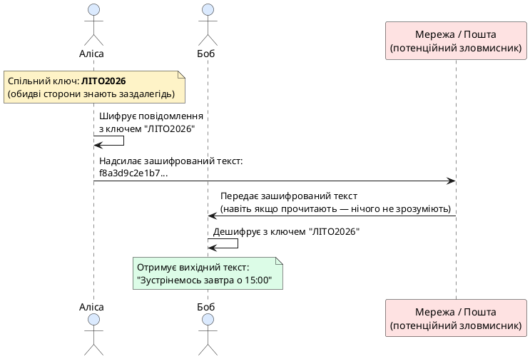
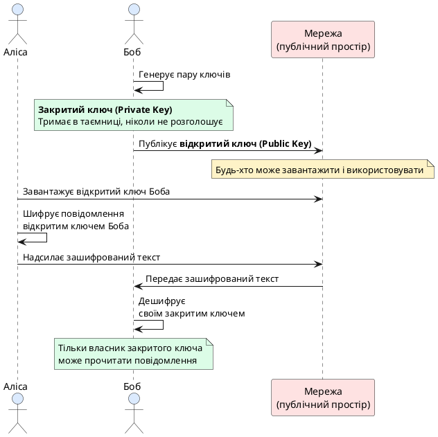
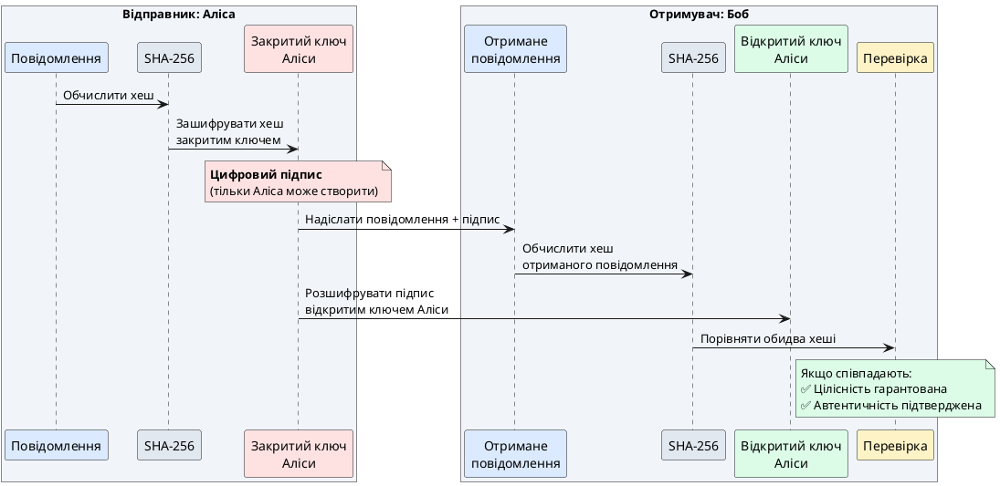
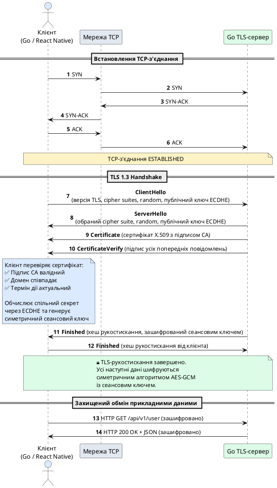
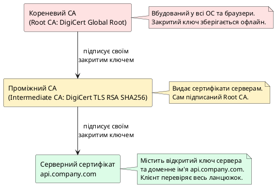
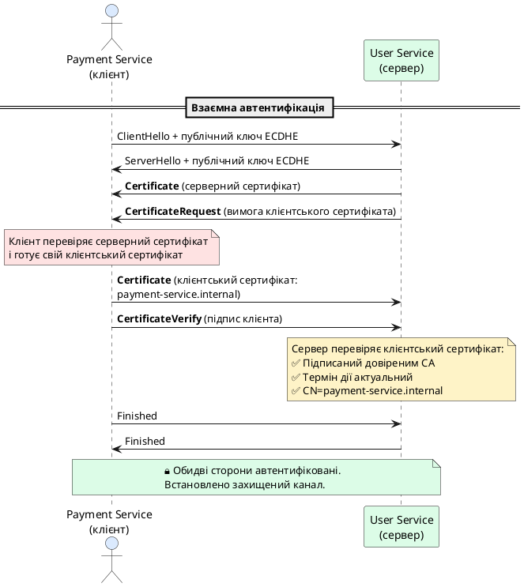

# Криптографічний захист каналів зв'язку та протокол TLS

::card-group

::card{title="🎯 Навчальні цілі" icon="i-lucide-graduation-cap"}

- Зрозуміти фундаментальну проблему: чому просте TCP-з'єднання принципово небезпечне для передачі конфіденційних даних, і які саме загрози воно несе.
- Побудувати чітку інтуїцію про різницю між **симетричним** (один спільний ключ) і **асиметричним** (пара ключів: відкритий і закритий) шифруванням через доступні життєві аналогії.
- Усвідомити роль **хеш-функцій** та **цифрових підписів** як фундаментальних будівельних блоків довіри в розподілених системах.
- Детально розібрати, як працює сучасний протокол **TLS 1.3** (_Transport Layer Security_): які кроки виконуються під час рукостискання, як узгоджуються криптографічні алгоритми та як обидві сторони приходять до спільного сеансового ключа.
- Зрозуміти концепцію **інфраструктури відкритих ключів** (PKI) і роль **сертифікатів X.509** як «цифрових посвідчень особи» серверів та клієнтів у мережі.
- Опанувати практичну роботу з пакетом `crypto/tls` у Go: налаштування захищеного TLS-сервера, валідація сертифікатів на клієнтській стороні та реалізація **взаємної автентифікації** (mTLS) у мікросервісній архітектурі.
- Ознайомитися з моделлю безпеки **Zero Trust** і зрозуміти, чому сучасні корпоративні системи вимагають верифікації кожної сторони комунікації, навіть усередині приватної мережі.

::

::card{title="🛠️ Технологічний стек" icon="i-lucide-cpu"}

- **Мова:** Go 1.22+
- **Пакети стандартної бібліотеки:** `crypto/tls`, `crypto/x509`, `crypto/rand`, `encoding/pem`
- **Інструменти діагностики:** `openssl` CLI, Wireshark з фільтром `tls`, `curl --tlsv1.3 --verbose`
- **Розгортання:** Docker для ізольованих тестових середовищ із власними CA

::

::

---

## Чому просте TCP-з'єднання — це відкритий канал без жодного захисту

У попередніх лекціях ми детально розібрали, як працюють протоколи TCP та UDP, навчилися створювати багатопотокові сервери на базі `net.Listen`, проєктувати кастомні протоколи прикладного рівня та забезпечувати коректну обробку помилок мережевого введення-виведення. Усі ці навички — абсолютно критичні для розробки функціональних клієнт-серверних застосунків, але вони залишають відкритою ще одну, можливо, найважливішу проблему сучасних розподілених систем: **безпеку передачі даних**.

Будь-яке TCP-з'єднання, яке ми встановлювали за допомогою `net.Dial("tcp", "host:port")`, за своєю природою є **абсолютно прозорим** для будь-кого, хто фізично має доступ до мережевого обладнання між клієнтом і сервером. Уявімо собі корпоративний застосунок для управління зарплатами співробітників: менеджер із відділу кадрів відкриває десктопний клієнт на JavaFX, вводить свій логін і пароль, натискає кнопку «Увійти», і клієнтська програма надсилає пакет із JSON-повідомленням на сервер:

```json
{
  "action": "login",
  "username": "john.doe@company.com",
  "password": "SecretPass123"
}
```

Якщо цей JSON передається звичайним TCP без жодного криптографічного захисту, то **кожен проміжний мережевий вузол** — будь то комутатор у локальній мережі офісу, корпоративний маршрутизатор на виході в інтернет, проміжні маршрутизатори інтернет-провайдера чи точка доступу WiFi у публічній кав'ярні — теоретично може перехопити цей пакет і прочитати його вміст як звичайний текст. Більше того: зловмисник, який контролює проміжний вузол, може не просто пасивно підглядати трафік, а й **активно модифікувати** його на льоту: змінити суму в платіжному доручення, підмінити адресу отримувача банківського переказу або навіть перенаправити весь трафік на підроблений сервер, який видаватиме себе за справжній.

::warning
**Класична атака «Людина посередині» (Man-in-the-Middle, MITM):** зловмисник розміщується десь між клієнтом і сервером (наприклад, контролює WiFi-роутер у публічній мережі) і перехоплює весь трафік. Клієнт думає, що розмовляє із сервером, сервер думає, що розмовляє з клієнтом, але насправді обидві сторони невідомо для себе передають усі дані через руки атакуючого, який може як просто читати їх, так і змінювати на свій розсуд.
::

Саме цю проблему вирішує протокол **TLS** (_Transport Layer Security_) — сучасний стандарт криптографічного захисту мережевих комунікацій, який застосовується в абсолютній більшості сценаріїв, де важлива конфіденційність чи цілісність даних: від HTTPS-з'єднань у браузері до захищених REST API, від електронної пошти до міжсервісної взаємодії в корпоративних хмарних середовищах. Але перш ніж зануритися в технічні деталі того, як саме TLS вирішує ці проблеми, потрібно спочатку розібратися з фундаментальними криптографічними будівельними блоками, на яких він побудований, — і зробити це максимально доступною мовою, «здалека», як і було заплановано у вступі до цієї лекції.

---

## Симетричне шифрування: один спільний ключ для двох сторін

Найпростіша концептуально ідея захисту повідомлення від сторонніх очей — це **симетричне шифрування** (_symmetric encryption_). Уявімо собі звичайне паперове листування між двома людьми, які живуть у різних містах: Алісою та Бобом (ці імена — загальноприйнята конвенція в криптографічних прикладах, і ми будемо послідовно їх дотримуватися). Аліса хоче надіслати Бобу секретне повідомлення, але знає, що лист проходитиме через руки поштових працівників, які теоретично можуть його відкрити і прочитати. Тому Аліса та Боб заздалегідь — ще до початку листування — зустрічаються особисто та домовляються про **спільний секретний ключ**: наприклад, обидва запам'ятовують кодове слово «ЛІТО2026» і ніколи нікому його не розголошують.

Тепер, коли Аліса хоче відправити Бобу повідомлення «Зустрінемось завтра о 15:00 біля фонтану», вона спочатку **шифрує** (_encrypts_) його за допомогою їхнього спільного ключа — застосовує якийсь математичний алгоритм (наприклад, AES), який перетворює вихідний текст на нерозбірливий набір символів, схожий на випадковий шум. Отриманий зашифрований текст (_ciphertext_) виглядатиме приблизно так:

```
f8a3d9c2e1b7...4f6a8c9d2e1b
```

Аліса кладе цей незрозумілий набір символів у конверт і відправляє звичайною поштою. Поштовий працівник може відкрити конверт і побачити цей текст, але без знання ключа «ЛІТО2026» він нічого не зрозуміє — це просто безглуздий набір байтів. Коли лист доходить до Боба, він застосовує той самий ключ «ЛІТО2026», але в зворотному напрямку — виконує операцію **дешифрування** (_decrypts_), і вихідне повідомлення «Зустрінемось завтра о 15:00 біля фонтану» знову стає читабельним.

::plant-uml{alt="Схема симетричного шифрування між Алісою та Бобом"}



::

Ключова властивість симетричного шифрування — **один і той самий ключ використовується для шифрування та дешифрування**. Це робить алгоритм дуже швидким (сучасні процесори виконують симетричне шифрування на апаратному рівні зі швидкістю гігабайтів на секунду), але одночасно створює фундаментальну проблему, яка називається **проблемою розподілу ключів** (_key distribution problem_): як Аліса та Боб можуть безпечно обмінятися цим спільним ключем, якщо вони ніколи не зустрічалися особисто? Якщо Аліса надішле ключ Бобу звичайним незашифрованим повідомленням, зловмисник перехопить його і зможе потім читати всі наступні листи. Це замкнене коло: щоб безпечно передати ключ, потрібен уже захищений канал, але щоб створити захищений канал, потрібен ключ.

::note
**Історична довідка:** проблема розподілу ключів симетричного шифрування була добре відомою протягом тисячоліть — від давньоримських шифрів Цезаря до військових кодових книг Другої світової війни. Кур'єри фізично доставляли кодові таблиці в герметичних контейнерах, а втрата такої таблиці означала компрометацію всієї комунікації. Але в епоху глобальних розподілених систем, де мільйони клієнтів підключаються до мільйонів серверів, фізична доставка ключів стає абсолютно непрактичною.
::

Саме цю проблему вирішує друга фундаментальна криптографічна концепція — **асиметричне шифрування**, до якого ми зараз переходимо.

---

## Асиметричне шифрування: два ключі замість одного

Революційна ідея, яка лягла в основу сучасної криптографії з відкритим ключем (_public-key cryptography_), полягає в тому, щоб використовувати не один спільний ключ, а **пару математично пов'язаних, але принципово різних ключів**: **відкритий ключ** (_public key_) і **закритий ключ** (_private key_). Ці два ключі мають дивовижну властивість: те, що зашифровано одним ключем з пари, може бути розшифровано тільки другим ключем з тієї ж пари, і жодним іншим способом.

Повернемось до нашої історії з Алісою та Бобом, але тепер у контексті асиметричного шифрування. Боб генерує для себе пару ключів: **відкритий ключ** він публікує у відкритому доступі (наприклад, розміщує на своєму вебсайті або надсилає кожному, хто про нього запитає), а **закритий ключ** тримає в таємниці — зберігає на своєму комп'ютері під паролем і ніколи нікому не передає. Аліса завантажує відкритий ключ Боба (це абсолютно безпечно — його можуть бачити всі) і шифрує своє повідомлення саме цим відкритим ключем. Отриманий зашифрований текст вона надсилає через мережу.

Ось ключовий момент: **розшифрувати це повідомлення може тільки той, хто володіє закритим ключем** — а це тільки Боб. Навіть Аліса, яка сама зашифрувала повідомлення, більше не може його прочитати після шифрування, бо в неї є лише відкритий ключ Боба, який годиться тільки для шифрування, але не для дешифрування. Зловмисник, який перехопив зашифроване повідомлення, теж нічого не зможе з ним зробити — навіть якщо в нього є копія того самого відкритого ключа (який, нагадаємо, взагалі є публічним).

::plant-uml{alt="Схема асиметричного шифрування з парою ключів"}



::


Ця концепція може здаватися майже магічною: як математично можливо створити таку пару ключів, де знання одного не дозволяє обчислити інший? Відповідь лежить у площині складних математичних задач, які легко обчислити в одному напрямку, але практично неможливо — у зворотному. Найпоширеніший алгоритм асиметричного шифрування називається **RSA** (за іменами його винахідників: Rivest, Shamir, Adleman) і базується на тому факті, що помножити два великі прості числа надзвичайно легко, але розкласти їхній добуток назад на множники (якщо ці числа мають довжину 2048 чи 4096 біт) — задача, яка вимагає мільйонів років обчислювального часу навіть для найпотужніших суперкомп'ютерів.

::accordion

::accordion-item{label="❓ Чому асиметричне шифрування не використовується для всього трафіку, якщо воно вирішує проблему розподілу ключів?" icon="i-lucide-help-circle"}

Асиметричне шифрування **на кілька порядків повільніше** за симетричне. Якщо симетричний алгоритм AES може обробляти гігабайти даних за секунду, то RSA-шифрування того самого обсягу зайняло б години або навіть дні. Тому на практиці асиметричне шифрування використовується лише для **початкового обміну**: клієнт шифрує відкритим ключем сервера невелике повідомлення, яке містить випадково згенерований **симетричний сеансовий ключ** (_session key_), і надсилає його серверу. Сервер розшифровує це повідомлення своїм закритим ключем, отримує сеансовий ключ, і далі обидві сторони переходять до швидкого симетричного шифрування з цим тимчасовим ключем. Це саме той гібридний підхід, який застосовує протокол TLS.

::

::accordion-item{label="❓ Що станеться, якщо зловмисник викраде закритий ключ сервера?" icon="i-lucide-help-circle"}

Компрометація закритого ключа — це катастрофічна подія з погляду безпеки: зловмисник зможе видавати себе за справжній сервер, перехоплювати та розшифровувати весь трафік до нього. Саме тому закриті ключі зберігаються в захищених сховищах (HSM — _Hardware Security Modules_) і ніколи не копіюються з виробничих серверів. Крім того, сучасні протоколи використовують концепцію **досконалої прямої секретності** (_Perfect Forward Secrecy_, PFS), яка гарантує, що навіть у разі компрометації довгострокового закритого ключа сервера зловмисник не зможе розшифрувати попередні сеанси зв'язку, записані в минулому, — але про це детальніше в розділі про TLS 1.3.

::

::

---

## Хеш-функції та цифрові підписи: гарантія цілісності та автентичності

Асиметричне шифрування вирішило проблему конфіденційності та розподілу ключів, але залишилося ще дві критичні властивості, яких потребує безпечна комунікація: **цілісність** (_integrity_) та **автентичність** (_authenticity_). Уявімо ситуацію: Аліса надіслала Бобу зашифроване повідомлення «Переказати 1000 гривень на рахунок X». Зловмисник перехопив цей зашифрований текст і, хоча він не може його прочитати (бо не має закритого ключа Боба), він може спробувати **модифікувати окремі байти** навмання в надії змінити значення суми чи номер рахунку. Навіть якщо результат буде нерозбірливим для Боба, сам факт можливості такої модифікації є проблемою. Як Боб може переконатися, що отримане повідомлення дійсно те саме, яке надіслала Аліса, і жоден біт не був змінений у дорозі?

Для цього використовуються **криптографічні хеш-функції** (_cryptographic hash functions_) — особливий клас алгоритмів, які перетворюють вхідні дані довільного розміру (від кількох байтів до гігабайтів) на **фіксований короткий відбиток** (_hash_, _digest_), зазвичай довжиною 256 або 512 біт. Найважливіша властивість хеш-функції — це те, що навіть найменша зміна у вхідних даних (зміна одного біта з мільйона) призводить до **повністю іншого, непередбачуваного** відбитка. При цьому зворотна операція — обчислити вхідні дані за їхнім хешем — є практично неможливою.

Найпоширеніші сучасні хеш-функції називаються **SHA-256** та **SHA-512** (_Secure Hash Algorithm_). Розглянемо простий приклад на Go:

```go
package main

import (
	"crypto/sha256"
	"fmt"
)

func main() {
	message := "Переказати 1000 гривень на рахунок X"
	hash := sha256.Sum256([]byte(message))
	fmt.Printf("SHA-256: %x\n", hash)

	// Змінимо одну літеру: "1000" -> "2000"
	modifiedMessage := "Переказати 2000 гривень на рахунок X"
	modifiedHash := sha256.Sum256([]byte(modifiedMessage))
	fmt.Printf("SHA-256 зміненого: %x\n", modifiedHash)
}
```

Вихід програми покаже два абсолютно різні 64-символьні рядки шістнадцяткових цифр — відбитки оригінального та зміненого повідомлення не матимуть між собою нічого спільного, хоча вихідні тексти відрізнялися лише однією цифрою.

Тепер можна забезпечити **цілісність**: Аліса обчислює хеш свого повідомлення і надсилає Бобу як повідомлення, так і його хеш (можна надіслати хеш окремо або додати до кінця повідомлення). Коли Боб отримує дані, він сам обчислює хеш отриманого повідомлення і порівнює з тим, що надіслала Аліса. Якщо хеші співпадають — значить, повідомлення не було змінено в дорозі. Якщо хоча б один біт був модифікований, хеш буде іншим, і Боб негайно це виявить.

::note
**Відповідь на очевидне запитання:** «Але чому зловмисник не може просто змінити повідомлення, обчислити новий хеш і підмінити обидва значення?» Саме цю проблему вирішують **цифрові підписи** (_digital signatures_), про які йдемося далі.
::

**Цифровий підпис** — це комбінація хеш-функції та асиметричного шифрування, яка працює в зворотному напрямку порівняно з шифруванням повідомлень. Аліса обчислює хеш свого повідомлення і **шифрує цей хеш своїм власним закритим ключем** (а не відкритим ключем Боба, як у випадку конфіденційного листування). Отриманий зашифрований хеш називається **цифровим підписом** — це унікальний «відбиток», який могла створити тільки Аліса, бо тільки вона володіє своїм закритим ключем.

Боб, отримавши повідомлення та підпис, виконує дві операції: по-перше, він сам обчислює хеш отриманого повідомлення; по-друге, він **розшифровує підпис Аліси її відкритим ключем** (який є публічним і доступний усім). Якщо розшифрований хеш з підпису співпадає з обчисленим хешем повідомлення — це гарантує дві речі одночасно:

1. **Цілісність:** повідомлення не було змінено (бо хеш співпадає).
2. **Автентичність:** повідомлення дійсно надіслала саме Аліса (бо підпис можна було створити тільки її закритим ключем).

Зловмисник не може підробити підпис, бо він не володіє закритим ключем Аліси, а підібрати такий модифікований текст, який дав би точно такий самий хеш, — практично неможливо через властивості криптографічних хеш-функцій.

::plant-uml{alt="Схема створення та перевірки цифрового підпису"}



::

Тепер ми маємо всі криптографічні будівельні блоки, необхідні для розуміння того, як працює протокол TLS: **симетричне шифрування** для швидкого захисту великих обсягів даних, **асиметричне шифрування** для безпечного обміну сеансовими ключами без попередньої домовленості, **хеш-функції** для перевірки цілісності та **цифрові підписи** для гарантії автентичності сторін комунікації. Перейдемо тепер до того, як усі ці механізми об'єднуються в єдиний протокол захищеної передачі даних поверх TCP.

---

## Протокол TLS 1.3: захищене рукостискання та узгодження сеансового ключа

Протокол **TLS** (_Transport Layer Security_) — це криптографічний протокол прикладного рівня, який працює **поверх надійного транспорту TCP** і забезпечує три фундаментальні властивості безпечної комунікації:

1. **Конфіденційність** (_confidentiality_): сторонні особи не можуть прочитати вміст повідомлень.
2. **Цілісність** (_integrity_): будь-яка модифікація даних у дорозі буде виявлена.
3. **Автентичність** (_authenticity_): клієнт може переконатися, що розмовляє саме з тим сервером, за який той себе видає (і навпаки в разі взаємної автентифікації).

Найсвіжіша версія протоколу на момент написання цієї лекції — **TLS 1.3** (стандарт RFC 8446, опублікований у 2018 році) — суттєво спростила й прискорила процес встановлення захищеного з'єднання порівняно з попередньою версією TLS 1.2. Розглянемо детально, що відбувається під час **TLS-рукостискання** (_TLS handshake_) між клієнтом (наприклад, мобільним застосунком на React Native) і сервером (Go-бекенд із REST API).

### Фаза 1: ClientHello — клієнт ініціює з'єднання

Усе починається з того, що клієнт надсилає серверу спеціальне повідомлення **ClientHello**, яке містить:

- **Версію TLS**, яку підтримує клієнт (у нашому випадку — TLS 1.3).
- **Список криптографічних алгоритмів** (_cipher suites_), які клієнт уміє використовувати (наприклад: `TLS_AES_128_GCM_SHA256`, `TLS_CHACHA20_POLY1305_SHA256`). Це комбінації алгоритмів симетричного шифрування, обміну ключами та хеш-функцій.
- **Випадкове число** (_random nonce_) — 32 байти випадкових даних, згенерованих криптографічно стійким генератором. Це число запобігає атакам типу «повтор запису» (_replay attacks_).
- **Тимчасовий відкритий ключ клієнта** для алгоритму обміну ключами Діффі-Геллмана (_Diffie-Hellman key exchange_). Це принципово новий елемент TLS 1.3, який дозволяє розпочати обмін ключами вже в першому повідомленні, скоротивши час рукостискання.

::tip
**TLS 1.3 vs TLS 1.2:** у старій версії TLS 1.2 рукостискання вимагало двох повних циклів «туди-назад» (2-RTT) між клієнтом і сервером до початку передачі зашифрованих даних. TLS 1.3 скоротило це до **одного циклу (1-RTT)**, а в деяких сценаріях (повторне підключення до того самого сервера) навіть до **нуля циклів (0-RTT)**, коли клієнт може надіслати зашифровані дані разом із першим повідомленням ClientHello.
::

### Фаза 2: ServerHello — сервер обирає параметри та надсилає свій сертифікат

Отримавши ClientHello, сервер аналізує список запропонованих клієнтом алгоритмів, обирає найбезпечніший із тих, що підтримуються обома сторонами, і надсилає у відповідь повідомлення **ServerHello**, яке містить:

- **Обраний криптографічний набір** (_cipher suite_).
- **Випадкове число сервера** (ще 32 байти унікальних даних).
- **Тимчасовий відкритий ключ сервера** для алгоритму Діффі-Геллмана.

Одразу після ServerHello сервер надсилає своє **Certificate** — повідомлення, яке містить **цифровий сертифікат X.509** сервера. Цей сертифікат — це публічний документ, підписаний довіреною третьою стороною (центром сертифікації, _Certificate Authority_, CA), який підтверджує, що відкритий ключ, який міститься в сертифікаті, дійсно належить конкретному домену (наприклад, `api.company.com`). Сертифікат містить:

- **Відкритий ключ сервера**.
- **Доменне ім'я**, для якого виданий сертифікат.
- **Термін дії** (початок і кінець).
- **Цифровий підпис** центру сертифікації, який гарантує, що всі ці дані справжні і не були підроблені.

Клієнт перевіряє цей сертифікат, переконуючись, що:
1. Підпис CA дійсний (клієнт має вбудований список довірених кореневих CA).
2. Доменне ім'я в сертифікаті співпадає з тим, до якого клієнт підключається.
3. Сертифікат не прострочений і не відкликаний.

Якщо хоча б одна перевірка не пройшла — клієнт відхиляє з'єднання і видає помилку (саме це бачать користувачі браузерів як попередження «Ваше з'єднання не є приватним»).


### Фаза 3: Обмін ключами Діффі-Геллмана та обчислення спільного секрету

Найелегантніша частина TLS 1.3 — це алгоритм **обміну ключами Діффі-Геллмана** (_Diffie-Hellman Key Exchange_, сучасна версія називається **ECDHE** — _Elliptic Curve Diffie-Hellman Ephemeral_). Цей алгоритм дозволяє двом сторонам, які обмінюються повідомленнями через відкритий, потенційно прослуховуваний канал, прийти до **спільного секретного ключа**, не передаючи цей ключ напряму. Математична магія полягає в тому, що:

- Клієнт генерує **тимчасову приватну частину** (випадкове число), обчислює з неї **публічну частину** за складною математичною формулою і надсилає цю публічну частину серверу (саме вона була в ClientHello).
- Сервер робить те саме: генерує свою тимчасову приватну частину, обчислює публічну і надсилає клієнту (у ServerHello).
- Далі кожна сторона комбінує **свою власну приватну частину** із **публічною частиною іншої сторони** — і обидві незалежно отримують **один і той самий спільний секрет**, який ніхто інший обчислити не може, навіть якщо бачив обидві публічні частини.

Цей спільний секрет використовується для генерації **симетричного сеансового ключа**, яким далі шифруватиметься весь подальший трафік.

::note
Слово **Ephemeral** (тимчасовий) у назві ECDHE означає, що ці ключі генеруються заново для кожного окремого з'єднання і викидаються одразу після його завершення. Це забезпечує властивість **Perfect Forward Secrecy** (PFS): навіть якщо через рік зловмисник викраде довгостроковий закритий ключ сервера з його сертифіката, він не зможе розшифрувати записані в минулому TLS-сеанси, бо тимчасові ключі Діффі-Геллмана вже давно знищені і не можуть бути відновлені.
::

### Фаза 4: Finished — підтвердження успішного встановлення захищеного каналу

Після того, як обидві сторони обчислили спільний сеансовий ключ, клієнт надсилає повідомлення **Finished**, яке містить криптографічний хеш усіх попередніх повідомлень рукостискання, зашифрований щойно отриманим сеансовим ключем. Сервер перевіряє це повідомлення (розшифровує його своїм сеансовим ключем і порівнює хеш), і якщо все гаразд — надсилає власне повідомлення Finished у відповідь.

З цього моменту **TLS-рукостискання завершено**, і обидві сторони переходять у режим **Application Data** — усі наступні дані (HTTP-запити, JSON, бінарні файли) автоматично шифруються симетричним алгоритмом (наприклад, AES-GCM) із сеансовим ключем, а кожен пакет додатково захищений кодом автентичності повідомлення (_Message Authentication Code_, MAC), який гарантує цілісність.

Повна діаграма послідовності TLS 1.3 Handshake виглядає так:

::plant-uml{alt="Повна діаграма TLS 1.3 Handshake"}



::

::warning
**Атака «Людина посередині» і роль сертифікатів:** уявімо, що зловмисник підмінив DNS-запис і перенаправив клієнта на свій фальшивий сервер. Цей сервер може виконати власне TLS-рукостискання з клієнтом і навіть згенерувати симетричний ключ — але він **не зможе надати валідний сертифікат** для домену `api.company.com`, підписаний довіреним центром сертифікації, бо закритий ключ CA надійно захищений. Клієнт відхилить самопідписаний сертифікат атакуючого, і з'єднання не буде встановлено. Саме тому інфраструктура довірених центрів сертифікації (PKI) є критично важливою для безпеки всього інтернету.
::

---

## Інфраструктура відкритих ключів (PKI) та сертифікати X.509

Тепер, коли ми розуміємо, як працює TLS-рукостискання, виникає логічне запитання: звідки клієнт знає, що може **довіряти** сертифікату, який надіслав сервер? Адже сертифікат — це просто файл із текстовими полями та цифровим підписом; хто завгодно може згенерувати такий файл і вказати в ньому будь-яке доменне ім'я. Відповідь лежить у концепції **інфраструктури відкритих ключів** (_Public Key Infrastructure_, PKI) — глобальної ієрархічної системи довіри, побудованої на **центрах сертифікації** (_Certificate Authorities_, CA).

### Ієрархія довіри: кореневі та проміжні центри сертифікації

На вершині цієї ієрархії знаходяться **кореневі центри сертифікації** (_Root CAs_) — це організації, яким довіряють за замовчуванням усі операційні системи та браузери. Список кореневих CA вбудований у кожну копію Windows, macOS, Linux, Android та iOS — це приблизно кілька сотень організацій по всьому світу, які пройшли жорсткі аудити безпеки (наприклад: DigiCert, GlobalSign, Let's Encrypt, Sectigo). Кожен кореневий CA має свою пару ключів: **кореневий закритий ключ** зберігається в ізольованому захищеному приміщенні (часто навіть офлайн, у сейфі) і використовується вкрай рідко — тільки для підпису сертифікатів **проміжних CA** (_Intermediate CAs_).

Проміжні CA — це наступний рівень ієрархії. Саме вони безпосередньо видають сертифікати кінцевим серверам (наприклад, вашому Go-бекенду на домені `api.company.com`). Проміжний CA підписує сертифікат сервера своїм закритим ключем, а його власний сертифікат, у свою чергу, підписаний кореневим CA. Таким чином формується **ланцюжок довіри** (_certificate chain_):

::plant-uml{alt="Ланцюжок довіри сертифікатів X.509"}



::

Коли клієнт отримує сертифікат сервера під час TLS-рукостискання, він виконує наступні кроки перевірки:

1. **Перевіряє підпис серверного сертифіката** за допомогою відкритого ключа проміжного CA (який також надсилається разом із серверним сертифікатом).
2. **Перевіряє підпис проміжного CA** за допомогою відкритого ключа кореневого CA (який уже є у вбудованому списку довірених сертифікатів операційної системи).
3. **Перевіряє доменне ім'я** в серверному сертифікаті: воно має співпадати з тим, до якого клієнт підключається.
4. **Перевіряє термін дії**: поточна дата має потрапляти в інтервал між `notBefore` та `notAfter`.
5. **Перевіряє статус відкликання** (_revocation_): чи не був цей сертифікат відкликаний раніше через компрометацію (через OCSP або CRL).

Якщо всі перевірки пройшли успішно — клієнт довіряє серверу і продовжує з'єднання. Якщо хоча б одна перевірка провалилася — з'єднання відхиляється.

::accordion

::accordion-item{label="❓ Що таке самопідписаний сертифікат і чому браузери його не приймають?" icon="i-lucide-help-circle"}

**Самопідписаний сертифікат** (_self-signed certificate_) — це сертифікат, який підписаний не довіреним центром сертифікації, а самим власником того закритого ключа, для якого виданий сертифікат. Технічно такий сертифікат може забезпечити шифрування даних, але він **не надає жодних гарантій автентичності**: будь-хто може згенерувати самопідписаний сертифікат для домену `api.company.com`, навіть якщо не є його власником. Саме тому браузери та клієнтські програми відхиляють такі сертифікати за замовчуванням. Самопідписані сертифікати можна використовувати **тільки для локальної розробки** або у внутрішніх корпоративних мережах, де адміністратор вручну додав кореневий сертифікат організації до списку довірених на всіх клієнтських машинах.

::

::accordion-item{label="❓ Чому термін дії сертифікатів обмежений (зазвичай 90 днів або 1 рік)?" icon="i-lucide-help-circle"}

Обмежений термін дії сертифіката знижує ризики від компрометації закритого ключа: навіть якщо зловмисник викрав ключ, він зможе використовувати його лише до закінчення терміну дії сертифіката, після чого клієнти почнуть відхиляти з'єднання. Сучасна практика (особливо у безкоштовного CA Let's Encrypt) — це сертифікати терміном на **90 днів** з автоматичним оновленням через спеціальний протокол ACME (_Automated Certificate Management Environment_), що мінімізує вікно компрометації та заохочує автоматизацію процесів безпеки.

::

::

---

## Практична робота з TLS у Go: пакет crypto/tls

Тепер, коли теоретичні основи криптографії та протоколу TLS зрозумілі, перейдемо до практичної реалізації захищених серверів мовою Go. Стандартна бібліотека Go надає повнофункціональний пакет **`crypto/tls`**, який реалізує всі версії TLS (включно з найсучаснішим TLS 1.3) і дозволяє налаштовувати захищені з'єднання буквально кількома рядками коду.

### Створення простого TLS-сервера

Почнемо з найпростішого прикладу: HTTP-сервер, який приймає з'єднання тільки через TLS. Для цього потрібні два файли: **сертифікат сервера** (`server.crt`) та **закритий ключ сервера** (`server.key`). На етапі локальної розробки можна згенерувати самопідписаний сертифікат за допомогою утиліти `openssl`:

::tabs
::tabs-item{label="Генерація самопідписаного сертифіката"}

```bash
openssl req -x509 -newkey rsa:2048 -keyout server.key -out server.crt \
  -days 365 -nodes -subj "/CN=localhost"
```

::
::tabs-item{label="Пояснення параметрів"}

- `-x509`: створити самопідписаний сертифікат (замість запиту на підпис до CA).
- `-newkey rsa:2048`: згенерувати новий закритий ключ RSA довжиною 2048 біт.
- `-keyout server.key`: зберегти закритий ключ у файл `server.key`.
- `-out server.crt`: зберегти сертифікат у файл `server.crt`.
- `-days 365`: термін дії 1 рік.
- `-nodes`: не шифрувати закритий ключ паролем (для спрощення розробки).
- `-subj "/CN=localhost"`: доменне ім'я (_Common Name_) — `localhost`.

::
::

Після виконання цієї команди в поточній директорії з'являться два файли: `server.crt` та `server.key`. Тепер напишемо Go-сервер, який використовує ці файли для TLS:

```go
package main

import (
	"crypto/tls"
	"fmt"
	"log"
	"net/http"
)

func main() {
	// Простий HTTP-обробник
	http.HandleFunc("/api/v1/health", func(w http.ResponseWriter, r *http.Request) {
		w.Header().Set("Content-Type", "application/json")
		fmt.Fprintf(w, `{"status": "OK", "secure": true}`)
	})

	// Налаштування TLS: мінімальна версія TLS 1.3
	tlsConfig := &tls.Config{
		MinVersion: tls.VersionTLS13,
		CipherSuites: []uint16{
			tls.TLS_AES_128_GCM_SHA256,
			tls.TLS_AES_256_GCM_SHA384,
			tls.TLS_CHACHA20_POLY1305_SHA256,
		},
	}

	server := &http.Server{
		Addr:      ":8443",
		TLSConfig: tlsConfig,
	}

	log.Println("🔒 TLS-сервер запущено на https://localhost:8443")
	log.Fatal(server.ListenAndServeTLS("server.crt", "server.key"))
}
```


Ключові моменти цього коду:

1. **`tls.Config`** — структура конфігурації TLS-параметрів:
   - `MinVersion: tls.VersionTLS13` — дозволяємо тільки TLS 1.3, відхиляючи застарілі версії TLS 1.0/1.1/1.2, які мають відомі вразливості.
   - `CipherSuites` — явно вказуємо список дозволених криптографічних наборів (тільки сучасні AEAD-алгоритми).

2. **`ListenAndServeTLS("server.crt", "server.key")`** — метод, який завантажує сертифікат і закритий ключ із файлів та запускає HTTPS-сервер на порту 8443 (стандартний порт для HTTPS — 443, але для локальної розробки зручніше використовувати 8443, щоб не потребувати root-прав).

Запустимо сервер і спробуємо підключитися до нього за допомогою `curl`:

::terminal-preview{title="curl --insecure https://localhost:8443/api/v1/health" :cursor="true"}

<div class="line"><span class="opacity-40">$</span> <strong class="font-bold">curl --insecure https://localhost:8443/api/v1/health</strong></div>
<div class="line"><span class="text-green-400 font-bold">{"status": "OK", "secure": true}</span></div>
<div class="line opacity-60">--- прапорець --insecure потрібен, бо сертифікат самопідписаний ---</div>

::

::warning
Прапорець `--insecure` (або `-k`) вказує `curl` ігнорувати помилки перевірки сертифіката. Без цього прапорця `curl` відхилить з'єднання з повідомленням про те, що сертифікат не підписаний довіреним CA. **Ніколи не використовуйте цей прапорець у продакшн-середовищі** — він повністю відключає перевірку автентичності сервера і робить з'єднання вразливим до MITM-атак.
::

### Налаштування TLS-клієнта у Go

Тепер напишемо клієнтську програму на Go, яка підключається до нашого TLS-сервера. Оскільки сервер використовує самопідписаний сертифікат, клієнту потрібно явно додати цей сертифікат до пулу довірених сертифікатів:

```go
package main

import (
	"crypto/tls"
	"crypto/x509"
	"fmt"
	"io"
	"log"
	"net/http"
	"os"
)

func main() {
	// Завантажуємо серверний сертифікат у пул довірених CA
	caCert, err := os.ReadFile("server.crt")
	if err != nil {
		log.Fatalf("Не вдалося прочитати сертифікат: %v", err)
	}

	caCertPool := x509.NewCertPool()
	if !caCertPool.AppendCertsFromPEM(caCert) {
		log.Fatal("Не вдалося додати сертифікат до пулу CA")
	}

	// Налаштовуємо TLS-конфігурацію клієнта
	tlsConfig := &tls.Config{
		RootCAs:    caCertPool,         // Пул довірених кореневих сертифікатів
		MinVersion: tls.VersionTLS13,   // Тільки TLS 1.3
	}

	// Створюємо HTTP-клієнт із кастомним транспортом
	client := &http.Client{
		Transport: &http.Transport{
			TLSClientConfig: tlsConfig,
		},
	}

	// Виконуємо GET-запит до захищеного ендпоінта
	resp, err := client.Get("https://localhost:8443/api/v1/health")
	if err != nil {
		log.Fatalf("Помилка запиту: %v", err)
	}
	defer resp.Body.Close()

	body, _ := io.ReadAll(resp.Body)
	fmt.Printf("Відповідь від сервера: %s\n", body)
	fmt.Printf("Версія TLS: %s\n", tls.VersionName(resp.TLS.Version))
	fmt.Printf("Cipher Suite: %s\n", tls.CipherSuiteName(resp.TLS.CipherSuite))
}
```

Результат виконання:

::terminal-preview{title="go run client.go" :cursor="true"}

<div class="line"><span class="opacity-40">$</span> <strong class="font-bold">go run client.go</strong></div>
<div class="line">Відповідь від сервера: <span class="text-green-400 font-bold">{"status": "OK", "secure": true}</span></div>
<div class="line">Версія TLS: <span class="text-blue-400 font-bold">TLS 1.3</span></div>
<div class="line">Cipher Suite: <span class="text-yellow-400 font-bold">TLS_AES_128_GCM_SHA256</span></div>

::

Клієнт успішно встановив захищене з'єднання, перевірив сертифікат сервера (додавши його до пулу довірених) і отримав зашифровану відповідь. Поле `resp.TLS` містить детальну інформацію про параметри встановленого TLS-з'єднання, включно з версією протоколу та обраним криптографічним набором.

::tip
**Для продакшн-середовища** замість самопідписаних сертифікатів використовуйте сертифікати, видані довіреними CA (наприклад, безкоштовний Let's Encrypt через утиліту `certbot` або вбудовану бібліотеку `golang.org/x/crypto/acme/autocert`, яка автоматично отримує та оновлює сертифікати). У такому випадку клієнту взагалі не потрібно модифікувати `RootCAs` — стандартний список довірених CA, вбудований у Go, автоматично перевірить ланцюжок сертифікатів.
::

---

## Взаємна автентифікація (mTLS): коли сервер теж перевіряє клієнта

До цього моменту ми розглядали класичний сценарій TLS: **клієнт перевіряє сервер**, переконуючись, що розмовляє саме з тим доменом, до якого підключається. Але в деяких прикладних задачах — особливо в корпоративних мікросервісних архітектурах, системах міжбанківського обміну або IoT-мережах — потрібна **двостороння автентифікація**: не тільки клієнт має переконатися в ідентичності сервера, а й **сервер має переконатися в ідентичності клієнта**.

Це називається **взаємна автентифікація TLS** (_mutual TLS_, скорочено **mTLS**). У цій моделі кожна сторона має власний сертифікат X.509: сервер надає свій сертифікат клієнту (як завжди), а клієнт теж надає свій сертифікат серверу під час рукостискання. Сервер перевіряє клієнтський сертифікат так само, як клієнт перевіряє серверний: чи підписаний він довіреним CA, чи не прострочений, чи відповідає доменне ім'я або інший ідентифікатор (наприклад, серійний номер пристрою для IoT).

### Сценарій застосування: корпоративний мікросервіс

Уявімо корпоративну систему, де **сервіс обробки платежів** (Payment Service) взаємодіє з **сервісом обліку користувачів** (User Service) через REST API. Обидва сервіси працюють у внутрішній мережі компанії, але відповідно до моделі безпеки **Zero Trust** («ніколи не довіряй, завжди перевіряй») навіть внутрішня мережа вважається потенційно небезпечною — зловмисник може отримати доступ до внутрішньої мережі через зламану робочу станцію чи скомпрометовану облікову запис. Тому кожен мікросервіс повинен **довести свою ідентичність** перед іншим сервісом через клієнтський сертифікат.

::note
**Модель Zero Trust** — це сучасний підхід до безпеки, який виходить із припущення, що жодна частина мережі не є безпечною за замовчуванням: навіть якщо клієнт знаходиться всередині корпоративного дата-центру, він має пройти повну автентифікацію та авторизацію. Це протилежність старої моделі «захищеного периметру», де внутрішня мережа вважалася довіреною, а всі ресурси захищалися лише зовнішнім файрволом.
::

### Реалізація mTLS-сервера у Go

Спочатку згенеруємо три сертифікати: кореневий CA, серверний сертифікат та клієнтський сертифікат. У продакшн-середовищі це робиться через корпоративну PKI, але для демонстрації створимо їх локально:

::tabs
::tabs-item{label="1. Створення Root CA"}

```bash
# Генеруємо закритий ключ Root CA
openssl genrsa -out ca.key 4096

# Створюємо самопідписаний сертифікат Root CA
openssl req -x509 -new -key ca.key -out ca.crt -days 3650 \
  -subj "/CN=CompanyInternalCA"
```

::
::tabs-item{label="2. Серверний сертифікат"}

```bash
# Генеруємо закритий ключ сервера
openssl genrsa -out server.key 2048

# Створюємо Certificate Signing Request (CSR)
openssl req -new -key server.key -out server.csr \
  -subj "/CN=user-service.internal"

# Підписуємо CSR нашим Root CA
openssl x509 -req -in server.csr -CA ca.crt -CAkey ca.key \
  -CAcreateserial -out server.crt -days 365
```

::
::tabs-item{label="3. Клієнтський сертифікат"}

```bash
# Генеруємо закритий ключ клієнта
openssl genrsa -out client.key 2048

# Створюємо CSR для клієнта
openssl req -new -key client.key -out client.csr \
  -subj "/CN=payment-service.internal"

# Підписуємо CSR тим самим Root CA
openssl x509 -req -in client.csr -CA ca.crt -CAkey ca.key \
  -CAcreateserial -out client.crt -days 365
```

::
::

Тепер налаштуємо Go-сервер так, щоб він **вимагав** клієнтський сертифікат:

```go
package main

import (
	"crypto/tls"
	"crypto/x509"
	"fmt"
	"log"
	"net/http"
	"os"
)

func main() {
	// Завантажуємо Root CA для перевірки клієнтських сертифікатів
	caCert, err := os.ReadFile("ca.crt")
	if err != nil {
		log.Fatalf("Не вдалося прочитати CA: %v", err)
	}

	caCertPool := x509.NewCertPool()
	caCertPool.AppendCertsFromPEM(caCert)

	// Налаштування mTLS: вимагаємо та перевіряємо клієнтський сертифікат
	tlsConfig := &tls.Config{
		ClientAuth: tls.RequireAndVerifyClientCert, // Критична опція для mTLS
		ClientCAs:  caCertPool,                      // Пул CA для перевірки клієнтів
		MinVersion: tls.VersionTLS13,
	}

	http.HandleFunc("/api/v1/user", func(w http.ResponseWriter, r *http.Request) {
		// Отримуємо інформацію про клієнтський сертифікат
		if len(r.TLS.PeerCertificates) > 0 {
			clientCert := r.TLS.PeerCertificates[0]
			log.Printf("✅ Автентифікований клієнт: %s", clientCert.Subject.CommonName)
			fmt.Fprintf(w, `{"authenticated_client": "%s", "access": "granted"}`, 
				clientCert.Subject.CommonName)
		} else {
			http.Error(w, "Немає клієнтського сертифіката", http.StatusUnauthorized)
		}
	})

	server := &http.Server{
		Addr:      ":8443",
		TLSConfig: tlsConfig,
	}

	log.Println("🔒 mTLS-сервер запущено на https://localhost:8443")
	log.Fatal(server.ListenAndServeTLS("server.crt", "server.key"))
}
```

Ключова опція тут — **`ClientAuth: tls.RequireAndVerifyClientCert`**. Вона змушує сервер вимагати клієнтський сертифікат під час TLS-рукостискання та відхиляти будь-яке з'єднання, якщо клієнт не надав валідний сертифікат, підписаний одним із CA зі списку `ClientCAs`.

### Клієнт із сертифікатом для mTLS

Тепер налаштуємо клієнта так, щоб він надавав свій сертифікат серверу:

```go
package main

import (
	"crypto/tls"
	"crypto/x509"
	"fmt"
	"io"
	"log"
	"net/http"
	"os"
)

func main() {
	// Завантажуємо клієнтський сертифікат і закритий ключ
	cert, err := tls.LoadX509KeyPair("client.crt", "client.key")
	if err != nil {
		log.Fatalf("Не вдалося завантажити клієнтський сертифікат: %v", err)
	}

	// Завантажуємо Root CA для перевірки серверного сертифіката
	caCert, err := os.ReadFile("ca.crt")
	if err != nil {
		log.Fatalf("Не вдалося прочитати CA: %v", err)
	}

	caCertPool := x509.NewCertPool()
	caCertPool.AppendCertsFromPEM(caCert)

	// Налаштування TLS із клієнтським сертифікатом
	tlsConfig := &tls.Config{
		Certificates: []tls.Certificate{cert}, // Клієнтський сертифікат
		RootCAs:      caCertPool,              // Для перевірки сервера
		MinVersion:   tls.VersionTLS13,
	}

	client := &http.Client{
		Transport: &http.Transport{
			TLSClientConfig: tlsConfig,
		},
	}

	resp, err := client.Get("https://localhost:8443/api/v1/user")
	if err != nil {
		log.Fatalf("Помилка запиту: %v", err)
	}
	defer resp.Body.Close()

	body, _ := io.ReadAll(resp.Body)
	fmt.Printf("✅ Відповідь від сервера: %s\n", body)
}
```

Результат виконання:

::terminal-preview{title="go run mtls-client.go" :cursor="true"}

<div class="line"><span class="opacity-40">$</span> <strong class="font-bold">go run mtls-client.go</strong></div>
<div class="line"><span class="text-green-400 font-bold">✅ Відповідь від сервера:</span> {"authenticated_client": "payment-service.internal", "access": "granted"}</div>

::

А якщо спробувати підключитися до цього сервера без клієнтського сертифіката (наприклад, через звичайний `curl https://localhost:8443/api/v1/user --cacert ca.crt`), сервер відхилить з'єднання ще на етапі TLS-рукостискання з помилкою **«certificate required»**.

::plant-uml{alt="Схема взаємної автентифікації mTLS"}



::

---

## Підсумок: від простого TCP до захищеного TLS

У цій лекції ми пройшли шлях від розуміння базових загроз незахищеного TCP-з'єднання до повноцінної реалізації взаємно автентифікованих мікросервісів через протокол TLS 1.3 у середовищі Go. Ось ключові тези, які варто закріпити:


::card-group

::card{title="🔐 Симетричне vs Асиметричне шифрування" icon="i-lucide-key"}

**Симетричне шифрування** (AES, ChaCha20) використовує один спільний ключ для шифрування та дешифрування — надзвичайно швидке, але вимагає попереднього безпечного обміну ключем.

**Асиметричне шифрування** (RSA, ECDH) використовує пару ключів (відкритий і закритий) — вирішує проблему розподілу ключів, але повільне, тому застосовується тільки для початкового обміну сеансовим ключем.

::

::card{title="🤝 TLS Handshake" icon="i-lucide-handshake"}

Протокол TLS 1.3 встановлює захищене з'єднання за **один цикл «туди-назад»** (1-RTT):

1. Клієнт надсилає ClientHello із запропонованими алгоритмами та публічним ключем ECDHE.
2. Сервер обирає алгоритм, надсилає свій публічний ключ і сертифікат X.509.
3. Обидві сторони обчислюють спільний сеансовий ключ через Діффі-Геллмана.
4. Усі наступні дані шифруються симетричним алгоритмом із сеансовим ключем.

::

::card{title="📜 Сертифікати X.509 та PKI" icon="i-lucide-shield-check"}

**Сертифікат X.509** — це «цифрове посвідчення особи» сервера, підписане довіреним центром сертифікації (CA).

**Ланцюжок довіри:** серверний сертифікат підписаний проміжним CA, який, у свою чергу, підписаний кореневим CA (вбудованим у всі операційні системи).

Клієнт перевіряє весь ланцюжок, доменне ім'я та термін дії — якщо хоча б одна перевірка не пройде, з'єднання відхиляється.

::

::card{title="🔒 Взаємна автентифікація (mTLS)" icon="i-lucide-users"}

У моделі **mTLS** не тільки клієнт перевіряє сервер, а й **сервер перевіряє клієнта** через його сертифікат.

Застосовується в корпоративних мікросервісах, IoT-системах та архітектурах **Zero Trust**, де кожна сторона має довести свою ідентичність.

У Go налаштовується через `ClientAuth: tls.RequireAndVerifyClientCert` на сервері та `Certificates: []tls.Certificate{cert}` на клієнті.

::

::

---

## Практичні рекомендації та найкращі практики безпеки

Перш ніж завершити лекцію, зведемо разом найважливіші практичні поради щодо роботи з TLS у реальних проєктах:

### 1. Завжди використовуйте TLS 1.3 як мінімальну версію

Старі версії TLS 1.0 та TLS 1.1 офіційно визнані застарілими та вразливими (POODLE, BEAST, CRIME тощо). Навіть TLS 1.2, хоча й досі підтримується, має застарілі cipher suites. У Go явно вказуйте:

```go
tlsConfig := &tls.Config{
	MinVersion: tls.VersionTLS13,
}
```

### 2. Ніколи не вимикайте перевірку сертифікатів у продакшн

Опція `InsecureSkipVerify: true` повністю відключає всю перевірку автентичності сервера і робить ваш застосунок абсолютно вразливим до MITM-атак. Використовуйте її **тільки** для локального тестування з самопідписаними сертифікатами, і ніколи — у продакшн-коді.

::caution
**Типова помилка:** розробник додає `InsecureSkipVerify: true`, щоб «швидко перевірити, чи працює підключення», а потім забуває це прибрати, і код потрапляє у продакшн. Замість цього правильний підхід — додати тестовий сертифікат до `RootCAs` клієнта.
::

### 3. Зберігайте закриті ключі в захищених сховищах

Закритий ключ сервера — це найкритичніший секрет усієї системи. Якщо зловмисник отримає його, він зможе видавати себе за ваш сервер. Рекомендації:

- Ніколи не комітьте `.key`-файли в Git-репозиторії.
- У продакшн використовуйте HSM (_Hardware Security Module_) або хмарні сервіси управління ключами (AWS KMS, HashiCorp Vault).
- Обмежте права доступу до файлів з ключами: `chmod 600 server.key`.

### 4. Автоматизуйте оновлення сертифікатів

Сучасні сертифікати мають короткий термін дії (90 днів у Let's Encrypt). Налаштуйте автоматичне оновлення через ACME-протокол (у Go — бібліотека `golang.org/x/crypto/acme/autocert`):

```go
import "golang.org/x/crypto/acme/autocert"

func main() {
	certManager := &autocert.Manager{
		Prompt:     autocert.AcceptTOS,
		Cache:      autocert.DirCache("certs"),
		HostPolicy: autocert.HostWhitelist("api.company.com"),
	}

	server := &http.Server{
		Addr: ":443",
		TLSConfig: &tls.Config{
			GetCertificate: certManager.GetCertificate,
		},
	}

	log.Fatal(server.ListenAndServeTLS("", ""))
}
```

Ця конфігурація автоматично отримає сертифікат від Let's Encrypt при першому запуску та оновлюватиме його перед закінченням терміну дії.

### 5. Впроваджуйте HSTS для веббраузерів

Якщо ваш сервіс доступний через браузер, додайте заголовок **HTTP Strict Transport Security** (HSTS), який примушує браузер **завжди** використовувати HTTPS і ніколи не намагатися підключитися через HTTP:

```go
w.Header().Set("Strict-Transport-Security", "max-age=31536000; includeSubDomains; preload")
```

Це захищає від атак типу SSL Stripping, де зловмисник перехоплює HTTP-запит і блокує апгрейд до HTTPS.

### 6. Моніторте закінчення терміну дії сертифікатів

Прострочений сертифікат призводить до повної недоступності сервісу для клієнтів. Налаштуйте алерти в системах моніторингу (Prometheus, Grafana, DataDog), які попереджатимуть за 30 днів до закінчення терміну:

```go
import (
	"crypto/x509"
	"time"
)

func checkCertExpiry(cert *x509.Certificate) {
	daysUntilExpiry := time.Until(cert.NotAfter).Hours() / 24
	if daysUntilExpiry < 30 {
		log.Printf("⚠️ Сертифікат %s закінчується через %.0f днів!", cert.Subject.CommonName, daysUntilExpiry)
	}
}
```

---

## Інтерактивні запитання для самоперевірки

::accordion

::accordion-item{label="❓ Чому в TLS використовується гібридний підхід (асиметричне + симетричне шифрування), а не тільки асиметричне для всього трафіку?" icon="i-lucide-help-circle"}

Асиметричне шифрування (RSA, ECDH) дозволяє безпечно обмінятися ключем без попередньої домовленості, але воно **в сотні разів повільніше** за симетричне. Якщо шифрувати кожен байт трафіку асиметричним алгоритмом, продуктивність впаде на порядки, і навіть простий перегляд відео став би неможливим. Тому TLS використовує асиметричне шифрування **тільки для початкового рукостискання** (передача сеансового ключа), а весь подальший трафік захищається **симетричним алгоритмом** (AES, ChaCha20), який працює на швидкостях гігабайтів за секунду.

::

::accordion-item{label="❓ Що станеться, якщо клієнт підключається до сервера, сертифікат якого підписаний невідомим CA?" icon="i-lucide-help-circle"}

Клієнт відхилить з'єднання з помилкою на кшталт **«x509: certificate signed by unknown authority»**. Це означає, що в списку довірених кореневих сертифікатів клієнта (вбудованому в операційну систему або явно вказаному в `RootCAs`) немає сертифіката того CA, який підписав серверний сертифікат. Щоб вирішити цю проблему, потрібно або додати кореневий сертифікат CA до списку довірених, або (якщо це легітимний публічний сервер) переконатися, що сертифікат сервера підписаний одним із загальновизнаних CA.

::

::accordion-item{label="❓ Чи можна використовувати один і той самий сертифікат для кількох різних доменів?" icon="i-lucide-help-circle"}

Так, для цього існують **wildcard-сертифікати** (наприклад, `*.company.com` — підходить для `api.company.com`, `web.company.com`, `admin.company.com`) та **SAN-сертифікати** (_Subject Alternative Name_), які явно перелічують кілька доменів у полі розширення сертифіката (наприклад, `api.company.com`, `mobile-api.company.com`, `legacy.company.net`). Під час перевірки клієнт порівнює доменне ім'я, до якого підключається, зі списком дозволених імен у сертифікаті, і якщо знаходить співпадіння — з'єднання дозволяється.

::

::accordion-item{label="❓ Навіщо потрібна властивість Perfect Forward Secrecy (PFS), якщо закритий ключ сервера і так добре захищений?" icon="i-lucide-help-circle"}

PFS гарантує, що навіть у **гіпотетичному майбутньому випадку компрометації** довгострокового закритого ключа сервера зловмисник не зможе розшифрувати попередні TLS-сеанси, записані в минулому. Це критично для довгострокової конфіденційності: уявімо, що атакуючий записував весь зашифрований трафік банку протягом років, а потім через вразливість отримав доступ до серверного ключа — без PFS він зможе розшифрувати всі ці архіви. З PFS (завдяки тимчасовим ключам ECDHE, які генеруються для кожного з'єднання і відразу знищуються) ці записи залишаться нерозшифрованими назавжди.

::

::accordion-item{label="❓ Чому mTLS не використовується скрізь, якщо він забезпечує кращу безпеку?" icon="i-lucide-help-circle"}

mTLS суттєво ускладнює розгортання та керування системою: кожен клієнт має отримати власний сертифікат, безпечно зберігати закритий ключ, оновлювати сертифікат до закінчення терміну дії та обробляти випадки компрометації (відкликання старого сертифіката). Для публічних API, де клієнтами є мільйони невідомих користувачів (мобільні застосунки, вебсайти), це непрактично. Замість mTLS у таких сценаріях використовують **автентифікацію на рівні застосунку** (JWT токени, OAuth 2.0, API ключі). mTLS найкраще підходить для **міжсервісної взаємодії** у контрольованому середовищі (корпоративні мікросервіси, B2B інтеграції, IoT-флоти).

::

::

---

## Подальше вивчення та корисні ресурси

Для поглиблення знань про криптографічний захист мережевих комунікацій рекомендуємо наступні матеріали:

::card-group

::card{title="📚 Офіційна специфікація" icon="i-lucide-book-open"}

**RFC 8446 — The Transport Layer Security (TLS) Protocol Version 1.3**

Повна технічна специфікація протоколу TLS 1.3 від IETF. Детально описує кожен крок рукостискання, формати повідомлень та криптографічні алгоритми.

[tools.ietf.org/html/rfc8446](https://tools.ietf.org/html/rfc8446)

::

::card{title="🔐 Документація crypto/tls" icon="i-lucide-code"}

**Пакет crypto/tls стандартної бібліотеки Go**

Повна документація всіх типів, функцій та опцій конфігурації TLS у Go, з численними прикладами коду.

[pkg.go.dev/crypto/tls](https://pkg.go.dev/crypto/tls)

::

::card{title="🛡️ Інструменти тестування" icon="i-lucide-shield-check"}

**SSL Labs Server Test**

Безкоштовний онлайн-інструмент для перевірки конфігурації TLS вашого сервера: підтримувані версії протоколу, cipher suites, вразливості та рейтинг безпеки.

[ssllabs.com/ssltest](https://www.ssllabs.com/ssltest/)

::

::card{title="🤖 Автоматизація сертифікатів" icon="i-lucide-bot"}

**Let's Encrypt та ACME**

Безкоштовний центр сертифікації з автоматичним видаванням і оновленням через протокол ACME. Документація Go-бібліотеки `autocert`.

[letsencrypt.org](https://letsencrypt.org/) | [pkg.go.dev/golang.org/x/crypto/acme/autocert](https://pkg.go.dev/golang.org/x/crypto/acme/autocert)

::

::

---

## Завдання для практичного закріплення

::steps

### Завдання 1. Налаштування HTTPS-сервера з Let's Encrypt

Розгорніть публічно доступний Go HTTP-сервер на хмарному VPS (DigitalOcean, AWS EC2, Hetzner) із валідним доменним ім'ям та автоматичним отриманням безкоштовного сертифіката від Let's Encrypt через бібліотеку `autocert`. Перевірте конфігурацію через SSL Labs Test — сервер має отримати рейтинг **A або A+**.

### Завдання 2. Реалізація mTLS між двома мікросервісами

Створіть два Go-мікросервіси: **Auth Service** (видає JWT токени після перевірки облікових даних) та **Data Service** (повертає захищені дані тільки для автентифікованих сервісів). Налаштуйте взаємну автентифікацію mTLS між ними: Data Service має перевіряти, що запит надійшов саме від Auth Service через клієнтський сертифікат.

### Завдання 3. Моніторинг терміну дії сертифікатів

Напишіть Go-утиліту, яка періодично (кожні 24 години) перевіряє термін дії сертифікатів усіх ваших продакшн-серверів (через підключення до них і аналіз `resp.TLS.PeerCertificates`) та надсилає попередження в Slack або Telegram-бот, якщо до закінчення терміну залишилося менше 30 днів.

::

---

## Висновки

У цій лекції ми детально розібрали всі рівні криптографічного захисту сучасних мережевих комунікацій:

1. **Базові криптографічні примітиви:** симетричне та асиметричне шифрування, хеш-функції та цифрові підписи — фундамент, на якому побудовані всі протоколи безпеки.

2. **Протокол TLS 1.3:** сучасний стандарт захищеної передачі даних, який об'єднує швидкість симетричного шифрування з безпечним обміном ключами через асиметричну криптографію та гарантує автентичність сторін через сертифікати X.509.

3. **Інфраструктура PKI:** глобальна система довіри, побудована на ієрархії центрів сертифікації, яка дозволяє клієнтам перевіряти ідентичність серверів без попередньої особистої домовленості.

4. **Практична реалізація в Go:** пакет `crypto/tls` надає потужний та зручний API для створення захищених серверів і клієнтів — від простого HTTPS до повноцінної взаємної автентифікації mTLS у мікросервісних архітектурах.

5. **Модель Zero Trust:** сучасний підхід до безпеки, де кожна сторона комунікації має довести свою ідентичність, незалежно від того, чи знаходиться вона у «внутрішній» мережі.

Криптографічний захист більше не є опціональною надбудовою — це абсолютна необхідність для будь-якої системи, яка передає конфіденційні дані або вимагає гарантій цілісності та автентичності. Наступна лекція продовжить тему прикладних мережевих протоколів, і ми розглянемо DNS та SMTP — але тепер уже з розумінням того, як забезпечити їхній захист через STARTTLS, DNSSEC та інші механізми шифрування поверх TLS.

::note
**Місток до наступної лекції:** ми навчилися захищати будь-яке TCP-з'єднання за допомогою TLS, але як клієнт взагалі знаходить IP-адресу сервера за його доменним ім'ям? І як забезпечити безпечну доставку електронних листів у світі, де кожен проміжний сервер потенційно може прочитати їхній вміст? Відповіді на ці запитання — у Лекції 7: «Прикладні мережеві протоколи DNS та SMTP».
::
