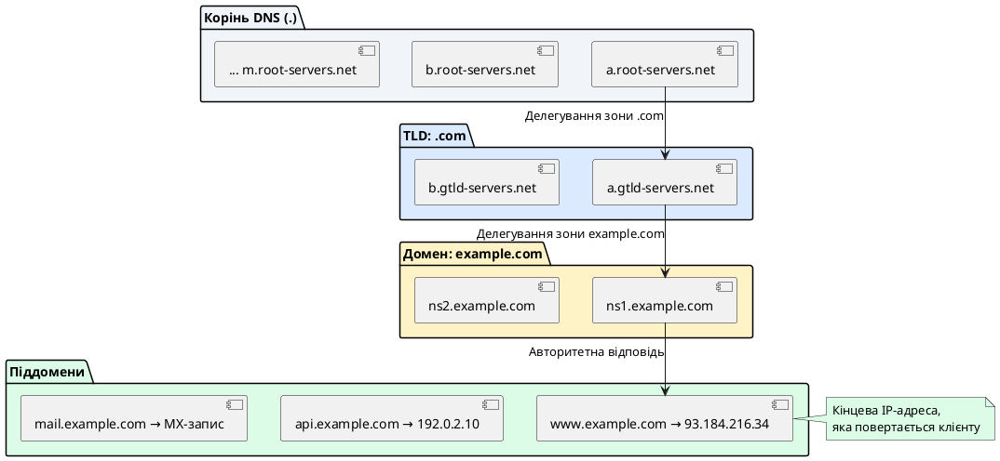
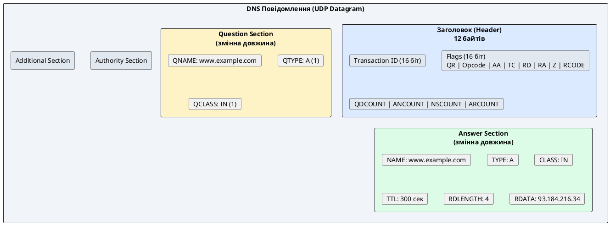
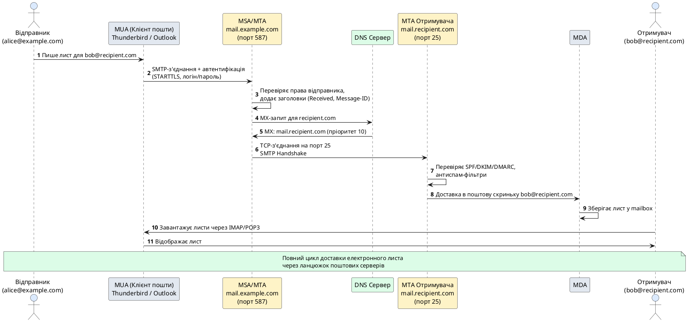
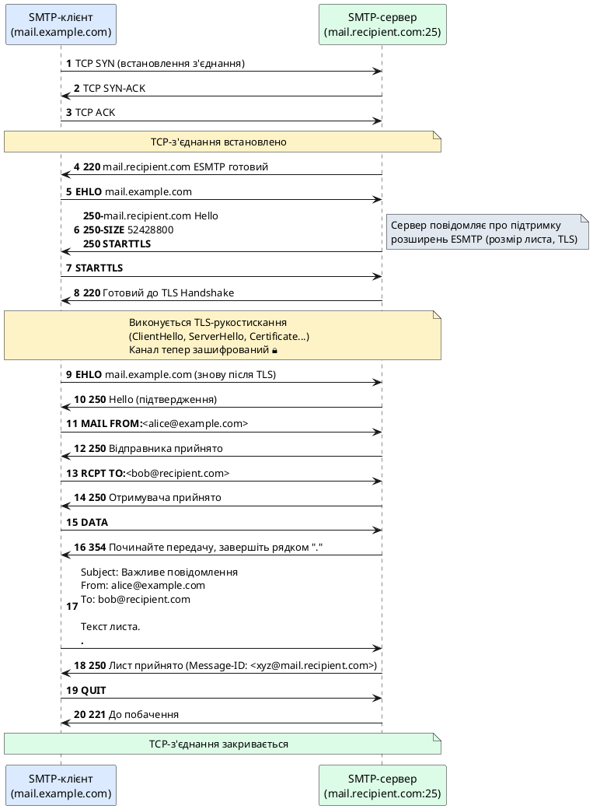
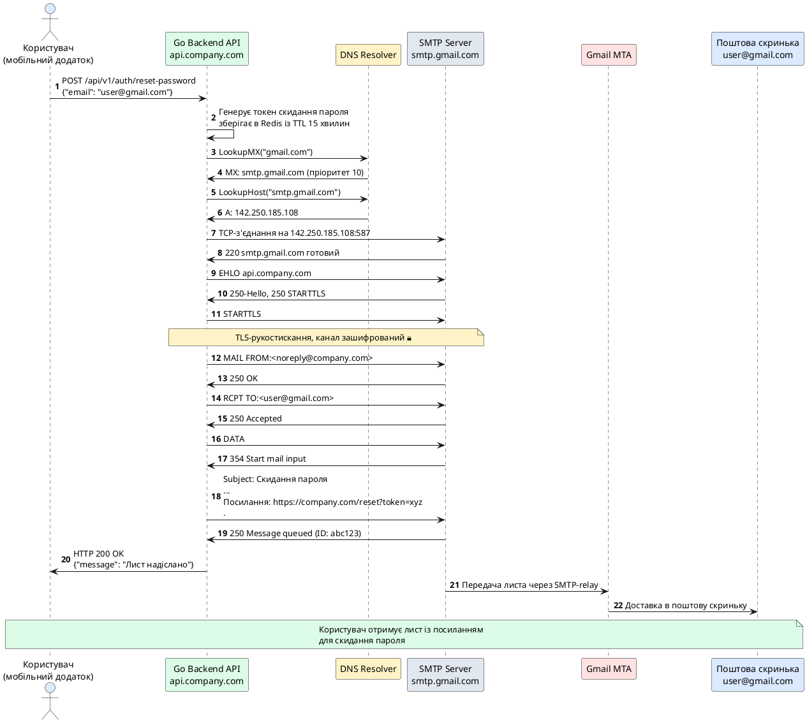

# Прикладні мережеві протоколи DNS та SMTP

::card-group

::card{title="🎯 Навчальні цілі" icon="i-lucide-graduation-cap"}

- Усвідомити фундаментальну роль **системи доменних імен** (DNS) як критичної інфраструктури інтернету, без якої неможливе функціонування жодного мережевого сервісу.
- Зрозуміти ієрархічну структуру DNS-простору імен від кореневих серверів до локальних зон, механізми делегування відповідальності та кешування на різних рівнях.
- Опанувати формат **DNS-повідомлень**: заголовок, секції запитів та відповідей, формат ресурсних записів (Resource Records) і роль кодів відповідей.
- Вивчити типи DNS-записів (**A**, **AAAA**, **CNAME**, **MX**, **TXT**, **SRV**) та зрозуміти їхнє практичне застосування для маршрутизації трафіку, виявлення сервісів та верифікації доменів.
- Навчитися програмно виконувати DNS-резолвінг у Go через пакет `net.Resolver` із підтримкою кастомних DNS-серверів, таймаутів та обробки помилок.
- Зрозуміти архітектуру **електронної пошти** та роль протоколу **SMTP** (Simple Mail Transfer Protocol) як стандарту передачі повідомлень між поштовими серверами.
- Розібрати структуру **SMTP-сеансу**: команди (HELO, MAIL FROM, RCPT TO, DATA), коди відповідей та діаграму послідовності успішної доставки листа.
- Опанувати формат **MIME** (Multipurpose Internet Mail Extensions): багатокомпонентні повідомлення (Multipart/alternative, Multipart/mixed), кодування Base64 та вкладення файлів.
- Вивчити сучасні механізми **захисту електронної пошти**: шифрування каналу через STARTTLS, автентифікація джерела за допомогою SPF, цифрові підписи DKIM та політики DMARC.
- Навчитися програмно надсилати електронні листи через Go-пакет `net/smtp` із налаштуванням автентифікації, TLS та формуванням MIME-повідомлень.

::

::card{title="🛠️ Технологічний стек" icon="i-lucide-cpu"}

- **Мова:** Go 1.22+
- **Пакети стандартної бібліотеки:** `net`, `net/smtp`, `net/mail`, `mime`, `encoding/base64`
- **Інструменти діагностики:** `dig` / `nslookup` / `host` для DNS-запитів, `telnet` для ручного SMTP-сеансу, Wireshark для аналізу трафіку
- **Тестові сервіси:** MailHog / Mailpit для локального емулятора SMTP-сервера, Cloudflare DNS / Google Public DNS (8.8.8.8)

::

::

---

## Система доменних імен (DNS): від числових адрес до зрозумілих імен

У попередніх лекціях ми працювали з мережевими адресами у форматі **IP-адрес**: `127.0.0.1` для локального сервера, `192.168.1.100` для пристрою в локальній мережі, публічні адреси типу `93.184.216.34` для з'єднання з віддаленими серверами в інтернеті. Але коли ви, як звичайний користувач, відкриваєте браузер і вводите в адресному рядку `https://www.google.com` або коли ваш мобільний застосунок на React Native підключається до API за адресою `https://api.company.com/v1/users`, — ви ніде не вказуєте IP-адресу. Як же комп'ютер дізнається, на яку конкретну числову адресу йому потрібно встановлювати TCP-з'єднання?

Відповідь проста і водночас надзвичайно складна: за лаштунками працює **система доменних імен** (_Domain Name System_, DNS) — глобальна розподілена база даних, яка перетворює зручні для людини символьні імена (як-от `www.google.com`) на числові IP-адреси (наприклад, `142.250.185.68`), необхідні для маршрутизації пакетів у мережі. DNS — це один із найстаріших і найкритичніших протоколів інтернету, без якого неможливе функціонування практично жодного сучасного мережевого сервісу: вебсайтів, REST API, електронної пошти, мобільних застосунків, IoT-пристроїв, систем потокового відео — усі вони в тому чи іншому вигляді покладаються на DNS для перетворення імен на адреси.

::note
**Історична довідка:** протокол DNS був стандартизований у 1987 році в специфікаціях **RFC 1034** та **RFC 1035**, замінивши собою простий текстовий файл `HOSTS.TXT`, який у ранні дні інтернету (тоді він називався ARPANET) вручну розподілявся між усіма вузлами мережі. Із зростанням кількості хостів до тисяч і десятків тисяч стало очевидно, що централізоване керування одним файлом більше не є масштабованим рішенням, і виникла потреба в **розподіленій ієрархічній системі**, здатній обробляти мільярди запитів на день.
::

### Чому DNS є критично важливим для клієнт-серверних систем

Спробуємо усвідомити масштаб впливу DNS на повсякденну роботу будь-якого інженера-програміста. Кожного разу, коли ваш Go-сервер виконує виклик `http.Get("https://api.external-service.com/data")`, перед встановленням TCP-з'єднання Go-рантайм звертається до системного DNS-резолвера операційної системи із запитом: «Яка IP-адреса відповідає імені `api.external-service.com`?». Резолвер, у свою чергу, може мати кешовану відповідь із попередніх запитів або звернутися до рекурсивного DNS-сервера вашого інтернет-провайдера, який запитає авторитетні DNS-сервери домену `.com`, потім авторитетні сервери зони `external-service.com`, отримає відповідь, поверне її вашому резолверу, закешує на певний час (визначений полем **TTL** — _Time To Live_) і лише після цього ваша програма зможе встановити з'єднання.

Якщо на будь-якому з цих етапів станеться збій — DNS-сервер недоступний, доменне ім'я не існує, відповідь сфальсифікована зловмисником (атака **DNS Spoofing**) — ваш застосунок отримає помилку, навіть якщо сам сервер, до якого ви намагаєтеся підключитися, працює ідеально. Саме тому розуміння архітектури DNS, форматів запитів і відповідей, типів ресурсних записів та механізмів безпеки є абсолютно критичним для будь-якого бекенд-розробника.

::warning
**DNS як вектор атак:** оскільки DNS працює переважно через протокол **UDP** (хоча існує і DNS-over-TCP, і сучасні DNS-over-HTTPS/TLS), запити та відповіді передаються без шифрування і можуть бути підроблені атакуючим, який контролює проміжний мережевий вузол. Це дозволяє перенаправити клієнта на фальшивий сервер, навіть якщо сам клієнт вважає, що підключається до легітимного домену. Саме тому з'явилися розширення безпеки DNS: **DNSSEC** (цифрові підписи DNS-записів) та **DNS-over-HTTPS** (DoH) / **DNS-over-TLS** (DoT), які шифрують і автентифікують DNS-трафік.
::

---

## Ієрархічна структура DNS-простору імен: від кореня до вузла

Система доменних імен побудована як **ієрархічне дерево**, структурно схоже на файлову систему Unix, де кожен вузол дерева представляє **зону відповідальності** (_zone_), а кожна зона керується набором **авторитетних DNS-серверів** (_authoritative nameservers_). Розглянемо повне доменне ім'я (_Fully Qualified Domain Name_, FQDN) `www.example.com.` — зверніть увагу на крапку в кінці, яка є важливою, хоча зазвичай її опускають у повсякденному користуванні.

### Розбір структури FQDN зправа наліво

Доменне ім'я читається **справа наліво**, від загального до конкретного:

1. **Крапка в кінці (`.`)** — це **корінь дерева DNS** (_root zone_). Він не має імені, але є початковою точкою всієї ієрархії. Кореневі DNS-сервери (їх усього **13 логічних кластерів** по всьому світу, позначених літерами від `A` до `M`: `a.root-servers.net`, `b.root-servers.net` тощо) зберігають інформацію про те, які сервери відповідають за домени верхнього рівня (TLD).

2. **`com`** — це **домен верхнього рівня** (_Top-Level Domain_, TLD). Існують загальні TLD (gTLD) як-от `.com`, `.org`, `.net`, `.edu`, і національні TLD (ccTLD) як-от `.ua`, `.us`, `.uk`. За кожен TLD відповідають окремі авторитетні сервери, наприклад, зону `.com` керує організація Verisign.

3. **`example`** — це **домен другого рівня** (_second-level domain_), зареєстрований власником (фізичною особою, компанією, організацією) через акредитованого реєстратора доменів (наприклад, GoDaddy, Namecheap). Власник домену налаштовує власні авторитетні DNS-сервери (або використовує сервіси на кшталт Cloudflare DNS, AWS Route 53), які зберігають інформацію про всі піддомени третього рівня.

4. **`www`** — це **піддомен третього рівня** (_subdomain_), який вказує на конкретний сервер або сервіс. Традиційно `www` використовується для вебсерверів, але можуть існувати будь-які інші імена: `api.example.com`, `mail.example.com`, `cdn.example.com` тощо.

::plant-uml{alt="Ієрархічна структура DNS-дерева від кореня до вузла"}



::

### Процес рекурсивного резолвінгу: як клієнт отримує відповідь

Коли ваш застосунок (наприклад, Go-клієнт) викликає `net.LookupHost("www.example.com")`, за лаштунками відбувається **рекурсивний процес резолвінгу** (_recursive resolution_), який можна розбити на наступні кроки:

::steps

### Крок 1. Перевірка локального кешу резолвера
Операційна система має власний DNS-резолвер (у Linux це зазвичай `systemd-resolved`, у macOS — `mDNSResponder`), який зберігає кеш недавніх DNS-відповідей. Якщо запис для `www.example.com` уже є в кеші і його час життя (TTL) ще не вичерпано — відповідь повертається негайно, без мережевих запитів.

### Крок 2. Звернення до рекурсивного DNS-сервера
Якщо кешу немає, резолвер надсилає запит до налаштованого **рекурсивного DNS-сервера** (зазвичай це сервер інтернет-провайдера або публічні резолвери на кшталт Google `8.8.8.8`, Cloudflare `1.1.1.1`). Цей сервер бере на себе відповідальність за виконання всього ланцюжка запитів замість клієнта.

### Крок 3. Запит до кореневого сервера
Рекурсивний сервер звертається до одного з 13 кореневих серверів із запитом: «Хто відповідає за зону `.com`?». Кореневий сервер не знає кінцевої адреси `www.example.com`, але знає адреси авторитетних серверів для TLD `.com` і повертає їх у відповіді (тип запису **NS** — _Name Server_).

### Крок 4. Запит до TLD-сервера
Рекурсивний сервер звертається до TLD-сервера `.com` із тим самим запитом. TLD-сервер також не знає кінцевої адреси, але знає, які сервери відповідають за зону `example.com`, і повертає їхні адреси (знову NS-записи).

### Крок 5. Запит до авторитетного сервера домену
Нарешті, рекурсивний сервер звертається до авторитетного DNS-сервера зони `example.com` (наприклад, `ns1.example.com`) із запитом про `www.example.com`. Цей сервер має **авторитетну відповідь** (_authoritative answer_) — він точно знає, що `www.example.com` вказує на IP-адресу `93.184.216.34`, і повертає запис типу **A** (для IPv4) або **AAAA** (для IPv6).

### Крок 6. Повернення відповіді клієнту та кешування
Рекурсивний сервер отримує кінцеву відповідь, кешує її на час, визначений полем **TTL** (наприклад, 300 секунд), і повертає IP-адресу клієнтській програмі. Тепер Go-застосунок може встановити TCP-з'єднання з `93.184.216.34:443` і розпочати TLS-рукостискання для HTTPS-запиту.

::

::tip
**Чому рекурсивний резолвер кешує відповіді:** уявімо, що мільйони користувачів одночасно звертаються до популярного сайту `www.google.com`. Якщо кожен запит вимагатиме проходження всього ланцюжка від кореневих серверів до авторитетних — це створило б колосальне навантаження на DNS-інфраструктуру. Кешування на рівні рекурсивних резолверів (які обслуговують тисячі клієнтів) різко зменшує кількість запитів до авторитетних серверів і прискорює час відповіді для кінцевих користувачів.
::


---

## Формат DNS-повідомлень: структура запитів та відповідей

Протокол DNS працює переважно через **UDP** на порту **53** (хоча для великих відповідей розміром понад 512 байт може використовуватися TCP). Кожне DNS-повідомлення — як запит від клієнта, так і відповідь від сервера — має **єдиний бінарний формат**, визначений у RFC 1035. Розуміння цієї структури є критично важливим, якщо вам потрібно реалізовувати власний DNS-клієнт, проксі-сервер або аналізувати DNS-трафік за допомогою Wireshark.

### Структура заголовка DNS-повідомлення

Кожне DNS-повідомлення починається з **12-байтного заголовка** (_header_), який містить метадані про тип повідомлення, кількість записів та прапорці керування. Заголовок складається з наступних полів:

1. **Transaction ID (16 біт)** — унікальний ідентифікатор запиту, згенерований клієнтом. Коли сервер надсилає відповідь, він копіює цей ідентифікатор у свою відповідь, щоб клієнт міг зіставити відповідь із початковим запитом.

2. **Flags (16 біт)** — набір прапорців, які визначають характер повідомлення:
   - **QR** (1 біт): `0` = запит (_query_), `1` = відповідь (_response_).
   - **Opcode** (4 біти): тип операції (зазвичай `0` = стандартний запит).
   - **AA** (1 біт): _Authoritative Answer_ — чи є відповідь авторитетною (від сервера, який безпосередньо відповідає за цю зону).
   - **TC** (1 біт): _Truncated_ — чи було повідомлення обрізане через обмеження розміру UDP (512 байт). Якщо `TC=1`, клієнт повинен повторити запит через TCP.
   - **RD** (1 біт): _Recursion Desired_ — клієнт просить сервер виконати рекурсивний резолвінг.
   - **RA** (1 біт): _Recursion Available_ — сервер підтримує рекурсію.
   - **Z** (3 біти): зарезервовані біти (повинні бути нульовими).
   - **RCODE** (4 біти): код відповіді (успіх, помилка, домен не існує тощо).

3. **QDCOUNT (16 біт)** — кількість записів у секції запитів (_Questions_).
4. **ANCOUNT (16 біт)** — кількість записів у секції відповідей (_Answers_).
5. **NSCOUNT (16 біт)** — кількість записів у секції авторитетних серверів (_Authority_).
6. **ARCOUNT (16 біт)** — кількість записів у додатковій секції (_Additional_).

Після заголовка йдуть чотири секції змінної довжини:

- **Question Section** — містить один або більше запитів (зазвичай один): доменне ім'я, тип запиту (A, AAAA, MX тощо) та клас (зазвичай `IN` — Internet).
- **Answer Section** — містить ресурсні записи (_Resource Records_), які є прямою відповіддю на запит.
- **Authority Section** — містить записи NS, які вказують на авторитетні сервери для зони (використовується в процесі делегування).
- **Additional Section** — містить додаткові записи, які можуть бути корисними (наприклад, IP-адреси серверів, згаданих у секції Authority).

::plant-uml{alt="Структура DNS-повідомлення"}



::

### Коди відповідей (RCODE)

Поле **RCODE** у заголовку вказує на результат обробки запиту:

- **0 (NOERROR)** — успішна відповідь, запис знайдено.
- **1 (FORMERR)** — помилка формату запиту (сервер не зміг його розпарсити).
- **2 (SERVFAIL)** — внутрішня помилка сервера під час обробки запиту.
- **3 (NXDOMAIN)** — _Non-Existent Domain_ — доменне ім'я не існує. Це **найважливіший код помилки**: якщо ви намагаєтеся підключитися до `nonexistent.example.com`, і DNS повертає NXDOMAIN, ваш застосунок має обробити цю ситуацію як неіснуючий домен, а не тимчасовий збій.
- **4 (NOTIMP)** — операція не підтримується сервером.
- **5 (REFUSED)** — сервер відмовився обробляти запит (можливо, через політики безпеки або обмеження доступу).

::note
**Практична порада:** при розробці клієнт-серверних застосунків завжди логуйте RCODE у разі DNS-помилок. Різниця між SERVFAIL (тимчасовий збій, можна повторити запит) і NXDOMAIN (домен не існує, повтор безглуздий) є критично важливою для правильної обробки помилок та діагностики проблем у production-середовищі.
::

---

## Типи DNS-записів: від базових A та AAAA до службових SRV

Ресурсні записи (_Resource Records_, RR) — це фундаментальні структури даних, які зберігаються в DNS і повертаються у відповідях. Кожен запис має наступну загальну структуру:

```
NAME    TTL    CLASS    TYPE    RDATA
```

- **NAME** — доменне ім'я, до якого відноситься запис.
- **TTL** (_Time To Live_) — час у секундах, протягом якого запис може зберігатися в кеші резолверів.
- **CLASS** — клас мережі (зазвичай `IN` — Internet).
- **TYPE** — тип запису (A, AAAA, CNAME тощо).
- **RDATA** — дані запису (формат залежить від типу).

Розглянемо найважливіші типи записів, з якими ви стикатиметеся під час розробки клієнт-серверних застосунків.

### Запис A (Address) — відображення на IPv4

**Тип:** `A` (числове значення `1`)  
**Призначення:** зіставляє доменне ім'я з 32-бітною IPv4-адресою.

**Приклад:**
```
www.example.com.    300    IN    A    93.184.216.34
```

Цей запис говорить: «Домен `www.example.com` вказує на IPv4-адресу `93.184.216.34`, і цю інформацію можна кешувати протягом 300 секунд (5 хвилин)».

Запити типу A — це найпоширеніший тип DNS-запитів у світі, бо вони необхідні для будь-якого підключення до вебсерверів, API, баз даних тощо через IPv4.

### Запис AAAA (Quad-A) — відображення на IPv6

**Тип:** `AAAA` (числове значення `28`)  
**Призначення:** зіставляє доменне ім'я з 128-бітною IPv6-адресою.

**Приклад:**
```
www.example.com.    300    IN    AAAA    2606:2800:220:1:248:1893:25c8:1946
```

У міру вичерпання адресного простору IPv4 та масового впровадження IPv6, записи AAAA стають дедалі важливішими. Сучасні застосунки повинні підтримувати обидва типи запитів: спочатку спробувати AAAA (якщо система підтримує IPv6), а у разі невдачі — відступити до A-запису.

::tip
**Dual-Stack підхід:** сучасні резолвери (включно з `net.Resolver` у Go) часто виконують **паралельні запити** A та AAAA одночасно і повертають обидві адреси. Клієнтська програма намагається встановити з'єднання спочатку через IPv6 (якщо доступний), а у разі невдачі — через IPv4. Цей підхід називається **Happy Eyeballs** (RFC 8305) і забезпечує найкращу продуктивність незалежно від типу мережі.
::

### Запис CNAME (Canonical Name) — аліас доменного імені

**Тип:** `CNAME` (числове значення `5`)  
**Призначення:** створює аліас (псевдонім) для іншого доменного імені. Коли клієнт запитує CNAME-запис, резолвер автоматично виконує додатковий запит для канонічного імені.

**Приклад:**
```
blog.example.com.    300    IN    CNAME    www.example.com.
www.example.com.     300    IN    A        93.184.216.34
```

Цей запис говорить: «`blog.example.com` насправді є аліасом для `www.example.com`, тож іди і дізнайся IP-адресу `www.example.com`».

CNAME-записи зручні для керування кількома піддоменами, які вказують на один і той самий сервер: якщо IP-адреса сервера зміниться, достатньо оновити лише один A-запис для `www.example.com`, і всі аліаси автоматично вказуватимуть на нову адресу.

::warning
**Обмеження CNAME:** згідно зі стандартом RFC, доменне ім'я, для якого існує CNAME-запис, **не може мати жодних інших типів записів** (A, MX, TXT тощо). Це означає, що ви не можете створити CNAME для кореневого домену (`example.com`), бо для нього зазвичай потрібні MX-записи для пошти та інші службові записи. Для вирішення цієї проблеми деякі DNS-провайдери (Cloudflare, AWS Route 53) пропонують власні розширення на кшталт **ALIAS** або **ANAME**, які працюють як CNAME, але дозволяють співіснування з іншими записами.
::

### Запис MX (Mail Exchanger) — маршрутизація електронної пошти

**Тип:** `MX` (числове значення `15`)  
**Призначення:** вказує, на який поштовий сервер потрібно надсилати електронні листи, адресовані до домену.

**Приклад:**
```
example.com.    300    IN    MX    10 mail1.example.com.
example.com.    300    IN    MX    20 mail2.example.com.
```

Кожен MX-запис має **пріоритет** (перше число): чим менше значення, тим вищий пріоритет. У цьому прикладі поштовий сервер спочатку спробує доставити лист на `mail1.example.com` (пріоритет 10), і лише якщо цей сервер недоступний — звернеться до резервного `mail2.example.com` (пріоритет 20).

::note
**Чому MX-записи критично важливі для електронної пошти:** коли ви надсилаєте email на адресу `user@example.com`, ваш SMTP-сервер спочатку виконує DNS-запит типу MX для домену `example.com`, отримує список поштових серверів, потім виконує A/AAAA-запити для кожного з них, щоб дізнатися їхні IP-адреси, і тільки після цього встановлює SMTP-з'єднання для передачі листа. Без коректних MX-записів доставка пошти на домен неможлива.
::

### Запис TXT — довільні текстові дані

**Тип:** `TXT` (числове значення `16`)  
**Призначення:** зберігає довільні текстові рядки, які використовуються для верифікації володіння доменом, налаштування політик безпеки пошти (SPF, DKIM, DMARC) та інших службових цілей.

**Приклад:**
```
example.com.    300    IN    TXT    "v=spf1 include:_spf.google.com ~all"
example.com.    300    IN    TXT    "google-site-verification=rXOxyZounnZasA8Z7oaD3c14JdjS9aKSWvsR1EbUSIQ"
```

TXT-записи надзвичайно гнучкі і використовуються для багатьох цілей:
- **SPF** (_Sender Policy Framework_) — вказує, які IP-адреси мають право надсилати пошту від імені домену.
- **DKIM** (_DomainKeys Identified Mail_) — містить відкритий ключ для перевірки цифрових підписів листів.
- **DMARC** (_Domain-based Message Authentication, Reporting and Conformance_) — визначає політику обробки листів, які не пройшли перевірку SPF/DKIM.
- Верифікація володіння доменом для сервісів на кшталт Google Workspace, AWS, Azure.

### Запис SRV (Service) — виявлення сервісів

**Тип:** `SRV` (числове значення `33`)  
**Призначення:** надає інформацію про розташування конкретних сервісів: порт, пріоритет, вагу та ім'я хоста.

**Формат:**
```
_service._proto.name    TTL    IN    SRV    priority weight port target
```

**Приклад:**
```
_http._tcp.example.com.    300    IN    SRV    10 60 80 server1.example.com.
_http._tcp.example.com.    300    IN    SRV    10 40 80 server2.example.com.
```

SRV-записи особливо корисні для мікросервісних архітектур і систем виявлення сервісів (_service discovery_): замість жорсткого прописування адрес серверів у конфігурації, клієнт може запитати DNS про доступні екземпляри сервісу, отримати список із пріоритетами та вагами (для балансування навантаження) і динамічно підключитися до найоптимальнішого вузла.

::accordion

::accordion-item{label="❓ Чому потрібні різні типи DNS-записів, якщо можна було б обмежитися тільки A та AAAA?" icon="i-lucide-help-circle"}

Кожен тип запису вирішує конкретну задачу інфраструктури. CNAME дозволяє уникнути дублювання конфігурації при керуванні десятками піддоменів. MX-записи з пріоритетами забезпечують відмовостійкість поштових систем (якщо основний сервер недоступний, пошта автоматично направляється на резервний). TXT-записи дають можливість впроваджувати нові протоколи безпеки без зміни структури DNS. SRV-записи дозволяють клієнтам динамічно виявляти сервіси без необхідності знати конкретні порти та хости заздалегідь. Усі ці можливості роблять DNS не просто «телефонною книгою інтернету», а потужною розподіленою базою даних метаінформації про мережеві сервіси.

::

::accordion-item{label="❓ Що таке TTL і чому він такий важливий для продуктивності DNS?" icon="i-lucide-help-circle"}

**TTL** (_Time To Live_) — це час у секундах, протягом якого DNS-запис може зберігатися в кеші резолверів без повторного звернення до авторитетного сервера. Високий TTL (наприклад, 86400 секунд = 24 години) зменшує навантаження на DNS-інфраструктуру та прискорює час відповіді для клієнтів, але означає, що зміни в DNS (наприклад, перенесення сервера на нову IP-адресу) поширюватимуться повільно. Низький TTL (наприклад, 60 секунд) дозволяє швидко оновлювати конфігурацію, але створює вище навантаження на DNS-сервери. У практиці зазвичай використовують TTL від 300 секунд (5 хвилин) до 3600 секунд (1 година) як компроміс між продуктивністю та гнучкістю.

::

::

---

## Програмний DNS-резолвінг у Go через пакет net.Resolver

Стандартна бібліотека Go надає потужний та гнучкий інструментарій для виконання DNS-запитів через пакет **`net`**, зокрема структуру **`net.Resolver`**. На відміну від простих функцій на кшталт `net.LookupHost`, які використовують системний резолвер операційної системи, `net.Resolver` дозволяє налаштувати власні DNS-сервери, таймаути, контексти скасування та детально контролювати процес резолвінгу.

### Базовий приклад: резолвінг A-записів

Розглянемо найпростіший випадок — отримання IPv4-адреси для доменного імені:

```go
package main

import (
	"context"
	"fmt"
	"log"
	"net"
	"time"
)

func main() {
	// Створюємо резолвер за замовчуванням (використовує системні налаштування DNS)
	resolver := &net.Resolver{}
	
	// Контекст із таймаутом 5 секунд
	ctx, cancel := context.WithTimeout(context.Background(), 5*time.Second)
	defer cancel()
	
	// Виконуємо резолвінг доменного імені
	hostname := "www.example.com"
	addrs, err := resolver.LookupHost(ctx, hostname)
	if err != nil {
		log.Fatalf("Помилка DNS-резолвінгу для %s: %v", hostname, err)
	}
	
	fmt.Printf("DNS-записи для %s:\n", hostname)
	for _, addr := range addrs {
		fmt.Printf("  - %s\n", addr)
	}
}
```

**Вихід програми:**
```
DNS-записи для www.example.com:
  - 93.184.216.34
  - 2606:2800:220:1:248:1893:25c8:1946
```

Зверніть увагу, що `LookupHost` повертає **як IPv4, так і IPv6** адреси (якщо обидва типи записів існують). Це зручно для реалізації dual-stack підтримки в клієнтських застосунках.

### Використання кастомного DNS-сервера

Часто у production-середовищах потрібно використовувати конкретні DNS-сервери замість системних (наприклад, внутрішній корпоративний DNS або публічні резолвери Cloudflare/Google для кращої продуктивності). `net.Resolver` дозволяє налаштувати це через поле `Dial`:

```go
package main

import (
	"context"
	"fmt"
	"log"
	"net"
	"time"
)

func main() {
	// Створюємо резолвер із кастомним DNS-сервером (Google Public DNS 8.8.8.8)
	resolver := &net.Resolver{
		PreferGo: true, // Використовувати власну реалізацію Go замість системної
		Dial: func(ctx context.Context, network, address string) (net.Conn, error) {
			d := net.Dialer{
				Timeout: 3 * time.Second,
			}
			return d.DialContext(ctx, "udp", "8.8.8.8:53")
		},
	}
	
	ctx, cancel := context.WithTimeout(context.Background(), 5*time.Second)
	defer cancel()
	
	hostname := "www.google.com"
	addrs, err := resolver.LookupHost(ctx, hostname)
	if err != nil {
		log.Fatalf("Помилка резолвінгу: %v", err)
	}
	
	fmt.Printf("Адреси для %s (через DNS 8.8.8.8):\n", hostname)
	for _, addr := range addrs {
		fmt.Printf("  - %s\n", addr)
	}
}
```

::tip
**Коли використовувати кастомні DNS-сервери:** у корпоративних мережах часто є внутрішні DNS-сервери, які резолвлять приватні доменні імена (наприклад, `internal-api.company.local`), недоступні через публічні резолвери. У таких випадках ваш Go-застосунок повинен бути налаштований на використання корпоративного DNS. Крім того, публічні резолвери на кшталт Cloudflare (`1.1.1.1`) або Google (`8.8.8.8`) часто працюють швидше за DNS інтернет-провайдерів та підтримують сучасні стандарти безпеки (DNS-over-HTTPS).
::

### Запит конкретних типів DNS-записів

Іноді потрібно отримати не просто IP-адреси, а конкретні типи записів: MX для налаштування поштового клієнта, TXT для перевірки SPF-політик, SRV для виявлення мікросервісів. `net` надає спеціалізовані методи для кожного типу:

```go
package main

import (
	"context"
	"fmt"
	"log"
	"net"
)

func main() {
	resolver := &net.Resolver{}
	ctx := context.Background()
	
	domain := "example.com"
	
	// Запит MX-записів (поштові сервери)
	mxRecords, err := resolver.LookupMX(ctx, domain)
	if err != nil {
		log.Fatalf("Помилка запиту MX: %v", err)
	}
	
	fmt.Printf("MX-записи для %s:\n", domain)
	for _, mx := range mxRecords {
		fmt.Printf("  Пріоритет %d: %s\n", mx.Pref, mx.Host)
	}
	
	// Запит TXT-записів (SPF, DKIM, верифікація)
	txtRecords, err := resolver.LookupTXT(ctx, domain)
	if err != nil {
		log.Fatalf("Помилка запиту TXT: %v", err)
	}
	
	fmt.Printf("\nTXT-записи для %s:\n", domain)
	for _, txt := range txtRecords {
		fmt.Printf("  - %s\n", txt)
	}
}
```

**Приклад виходу:**
```
MX-записи для example.com:
  Пріоритет 10: mail1.example.com.
  Пріоритет 20: mail2.example.com.

TXT-записи для example.com:
  - v=spf1 include:_spf.google.com ~all
  - google-site-verification=rXOxyZounnZasA8Z7oaD3c14JdjS9aKSWvsR1EbUSIQ
```


### Обробка помилок DNS та діагностика проблем

Одна з найважливіших навичок при роботі з DNS — це вміння **коректно інтерпретувати помилки** та відрізняти тимчасові збої від постійних. Пакет `net` у Go повертає типізовані помилки, які можна перевірити через механізм `errors.As`:

```go
package main

import (
	"context"
	"errors"
	"fmt"
	"log"
	"net"
	"time"
)

func main() {
	resolver := &net.Resolver{}
	ctx, cancel := context.WithTimeout(context.Background(), 2*time.Second)
	defer cancel()
	
	hostname := "nonexistent-domain-12345.com"
	addrs, err := resolver.LookupHost(ctx, hostname)
	
	if err != nil {
		// Перевіряємо конкретний тип помилки
		var dnsErr *net.DNSError
		if errors.As(err, &dnsErr) {
			if dnsErr.IsNotFound {
				// Домен не існує (NXDOMAIN) — постійна помилка
				log.Printf("❌ Домен %s не існує в DNS. Перевірте правильність імені.", hostname)
			} else if dnsErr.IsTimeout {
				// Таймаут DNS-запиту — тимчасова помилка, можна повторити
				log.Printf("⏱️ Таймаут DNS-запиту для %s. Спробуйте пізніше.", hostname)
			} else if dnsErr.IsTemporary {
				// Інша тимчасова помилка (наприклад, SERVFAIL)
				log.Printf("⚠️ Тимчасова помилка DNS для %s: %v", hostname, dnsErr)
			} else {
				// Постійна помилка іншого характеру
				log.Printf("🚫 Постійна помилка DNS для %s: %v", hostname, dnsErr)
			}
		} else if errors.Is(err, context.DeadlineExceeded) {
			log.Printf("⏱️ Контекст вичерпав таймаут під час DNS-резолвінгу %s", hostname)
		} else {
			log.Printf("Невідома помилка: %v", err)
		}
		return
	}
	
	fmt.Printf("Успішний резолвінг: %v\n", addrs)
}
```

::warning
**Критична помилка в production:** ніколи не ігноруйте помилки DNS і не вважайте, що відсутність адреси означає «сервер недоступний, спробуємо пізніше». Якщо DNS повертає **IsNotFound** (NXDOMAIN), домен дійсно не існує, і повторні спроби не допоможуть. Водночас **IsTimeout** або **IsTemporary** сигналізують про тимчасові проблеми мережі або перевантаження DNS-серверів — у такому випадку варто реалізувати експоненційну затримку (_exponential backoff_) перед повторною спробою.
::

### Кешування DNS-відповідей на рівні застосунку

Хоча операційна система та рекурсивні резолвери кешують DNS-відповіді, іноді корисно реалізувати **власний кеш на рівні застосунку**, особливо якщо ваш сервіс виконує тисячі DNS-запитів на секунду до одних і тих самих доменів. Це зменшує латентність та навантаження на мережу:

```go
package main

import (
	"context"
	"fmt"
	"net"
	"sync"
	"time"
)

// Проста структура для кешування DNS-адрес
type DNSCache struct {
	mu      sync.RWMutex
	entries map[string]cacheEntry
}

type cacheEntry struct {
	addrs     []string
	expiresAt time.Time
}

func NewDNSCache() *DNSCache {
	return &DNSCache{
		entries: make(map[string]cacheEntry),
	}
}

func (c *DNSCache) Lookup(ctx context.Context, hostname string, ttl time.Duration) ([]string, error) {
	// Спочатку перевіряємо кеш
	c.mu.RLock()
	entry, exists := c.entries[hostname]
	c.mu.RUnlock()
	
	if exists && time.Now().Before(entry.expiresAt) {
		fmt.Printf("✅ Кеш: повертаємо адреси для %s з кешу\n", hostname)
		return entry.addrs, nil
	}
	
	// Якщо в кеші немає або TTL вичерпано — виконуємо реальний DNS-запит
	fmt.Printf("🔍 DNS: виконуємо резолвінг для %s\n", hostname)
	resolver := &net.Resolver{}
	addrs, err := resolver.LookupHost(ctx, hostname)
	if err != nil {
		return nil, err
	}
	
	// Зберігаємо в кеш
	c.mu.Lock()
	c.entries[hostname] = cacheEntry{
		addrs:     addrs,
		expiresAt: time.Now().Add(ttl),
	}
	c.mu.Unlock()
	
	return addrs, nil
}

func main() {
	cache := NewDNSCache()
	ctx := context.Background()
	
	// Перший запит — виконується реальний DNS-резолвінг
	addrs1, _ := cache.Lookup(ctx, "www.example.com", 10*time.Second)
	fmt.Printf("Адреси: %v\n\n", addrs1)
	
	// Другий запит через 2 секунди — береться з кешу
	time.Sleep(2 * time.Second)
	addrs2, _ := cache.Lookup(ctx, "www.example.com", 10*time.Second)
	fmt.Printf("Адреси: %v\n\n", addrs2)
	
	// Третій запит через 12 секунд — TTL вичерпано, виконується новий резолвінг
	time.Sleep(12 * time.Second)
	addrs3, _ := cache.Lookup(ctx, "www.example.com", 10*time.Second)
	fmt.Printf("Адреси: %v\n", addrs3)
}
```

::note
**Застереження щодо власного кешування:** реалізуючи DNS-кеш на рівні застосунку, будьте обережні з TTL. Якщо ви встановите занадто великий TTL (наприклад, кілька годин), ваш застосунок може продовжувати звертатися до старої IP-адреси навіть після того, як адміністратор домену перевів сервіс на нову адресу. Зазвичай безпечно використовувати TTL від 60 до 300 секунд для високонавантажених сценаріїв.
::

---

## Протокол SMTP: основа архітектури електронної пошти

Тепер, коли ми глибоко розібралися з системою доменних імен, перейдемо до другого фундаментального протоколу прикладного рівня — **SMTP** (_Simple Mail Transfer Protocol_). Цей протокол, стандартизований у 1982 році в RFC 821 (пізніше оновлений у RFC 5321), є основою **архітектури електронної пошти** в інтернеті. Саме завдяки SMTP мільярди листів щодня доставляються між поштовими серверами по всьому світу.

На відміну від DNS, який працює переважно через UDP і оптимізований для швидких запитів-відповідей малого розміру, SMTP є **текстовим протоколом**, що працює поверх **надійного TCP-з'єднання** на порту **25** (для передачі між серверами) або портах **587** (для відправки від клієнта до сервера з автентифікацією) і **465** (застарілий порт для SMTP-over-TLS).

### Архітектура поштової системи: від відправника до отримувача

Перш ніж заглиблюватися в технічні деталі протоколу, важливо зрозуміти **загальну архітектуру електронної пошти**, яка складається з кількох окремих компонентів:

1. **MUA** (_Mail User Agent_) — поштовий клієнт користувача (Outlook, Thunderbird, Gmail у браузері, мобільний застосунок на React Native). Це те, через що ви пишете та читаєте листи.

2. **MSA** (_Mail Submission Agent_) — сервер, який приймає листи від MUA для відправки. Зазвичай це той самий поштовий сервер, але який працює на порту 587 і вимагає автентифікації (логін/пароль).

3. **MTA** (_Mail Transfer Agent_) — поштовий сервер, який **передає листи** між серверами через порт 25. Саме MTA виконують DNS-запити типу MX, щоб дізнатися, на який сервер доставляти лист для конкретного домену.

4. **MDA** (_Mail Delivery Agent_) — компонент, який **доставляє лист** у поштову скриньку отримувача на сервері. Користувач потім завантажує листи через протоколи **IMAP** (порт 143/993) або **POP3** (порт 110/995).

::plant-uml{alt="Архітектура електронної пошти від відправника до отримувача"}



::

### Чому SMTP розділений на окремі етапи

Розділення на MSA (submission) та MTA (relay) може здатися надмірним ускладненням, але воно вирішує важливі проблеми безпеки:

- **MSA** (порт 587) вимагає **автентифікації** перед відправкою листа. Це запобігає використанню поштового сервера для масового розсилання спаму з випадкових IP-адрес.
- **MTA** (порт 25) працює **без автентифікації** (бо поштові сервери довіряють один одному в межах глобальної інфраструктури інтернету), але застосовує інші механізми захисту: перевірку SPF-записів, валідацію DKIM-підписів, аналіз репутації відправника.

::tip
**Історична еволюція портів SMTP:** спочатку весь SMTP-трафік йшов через порт 25, але в міру зростання спаму інтернет-провайдери почали блокувати вихідні з'єднання на цей порт для звичайних користувачів (щоб заражені комп'ютери не могли масово розсилати спам). Тому був введений порт **587** із обов'язковою автентифікацією для легітимних відправників. Порт **465** був короткочасно призначений для SMTP-over-SSL, але пізніше відкинутий на користь механізму **STARTTLS**, який дозволяє розпочати з'єднання як звичайний текст і потім оновити його до шифрованого.
::

---

## Структура SMTP-сеансу: команди та коди відповідей

Протокол SMTP побудований як **діалог** між клієнтом (відправником) і сервером (отримувачем), де кожна сторона по черзі надсилає **текстові команди** та **відповіді**. Усі команди та відповіді є **читабельними ASCII-рядками**, завершеними символами `\r\n` (carriage return + line feed), що робить протокол надзвичайно зручним для налагодження вручну через `telnet`.

### Основні команди SMTP

1. **HELO / EHLO** (_Extended Hello_) — перше повідомлення клієнта після встановлення TCP-з'єднання. Клієнт представляється, вказуючи своє доменне ім'я або IP-адресу.
   ```
   EHLO mail.example.com
   ```

2. **MAIL FROM** — вказує адресу відправника (так званий «конверт» листа, який може відрізнятися від поля `From:` у заголовках листа).
   ```
   MAIL FROM:<alice@example.com>
   ```

3. **RCPT TO** — вказує адресу отримувача. Можна надіслати кілька команд RCPT TO, щоб доставити один лист кільком отримувачам.
   ```
   RCPT TO:<bob@recipient.com>
   ```

4. **DATA** — сигналізує початок передачі **тіла листа** (заголовки + текст повідомлення). Після цієї команди клієнт надсилає багаторядковий текст, завершуючи його рядком із однією крапкою `.` на окремому рядку.
   ```
   DATA
   Subject: Тестовий лист
   From: alice@example.com
   To: bob@recipient.com
   
   Це тіло листа.
   .
   ```

5. **QUIT** — завершує SMTP-сеанс і закриває TCP-з'єднання.
   ```
   QUIT
   ```

6. **STARTTLS** — оновлює з'єднання з відкритого текстового на шифроване TLS. Після успішного TLS-рукостискання клієнт повинен знову надіслати EHLO.
   ```
   STARTTLS
   ```

### Коди відповідей SMTP

Кожна команда клієнта отримує у відповідь **тризначний числовий код** із текстовим описом. Перша цифра коду вказує на категорію відповіді:

- **2xx** — успіх (команда прийнята і виконана).
  - **220** — сервер готовий (привітання при з'єднанні).
  - **250** — команда успішно виконана.
  - **221** — сервер закриває з'єднання (відповідь на QUIT).

- **3xx** — проміжний успіх (потрібна додаткова інформація).
  - **354** — почніть передачу тіла листа (відповідь на DATA).

- **4xx** — тимчасова помилка (спробуйте пізніше).
  - **421** — сервіс недоступний, з'єднання буде закрито.
  - **450** — поштова скринька тимчасово недоступна.

- **5xx** — постійна помилка (операція неможлива, повтор безглуздий).
  - **550** — поштова скринька не існує або доступ заборонено.
  - **552** — перевищено квоту зберігання.
  - **554** — транзакція відхилена (часто через антиспам-фільтри).

::note
**Важливість коректної обробки кодів відповідей:** при розробці поштових клієнтів або сервісів масового розсилання критично важливо розрізняти тимчасові помилки (4xx), які вимагають повторної спроби через деякий час, і постійні помилки (5xx), які означають, що доставка неможлива і потрібно повідомити відправника про невдачу. Ігнорування цієї різниці призводить до безглуздих повторних спроб надіслати лист на неіснуючу адресу або, навпаки, до передчасної відмови від доставки при тимчасових збоях.
::

### Повна діаграма типового SMTP-сеансу

::plant-uml{alt="Діаграма послідовності успішного SMTP-сеансу"}



::


---

## Формат MIME: багатокомпонентні листи та вкладення файлів

Оригінальний стандарт SMTP, визначений у RFC 821, передбачав передачу лише **простого ASCII-тексту** без можливості включення зображень, документів, HTML-розмітки чи символів національних алфавітів (кирилиця, ієрогліфи тощо). Але вже на початку 1990-х років стало очевидно, що електронна пошта має підтримувати багатий контент. Саме тому був розроблений стандарт **MIME** (_Multipurpose Internet Mail Extensions_, RFC 2045–2049), який розширив можливості формату електронних листів, не змінюючи сам протокол SMTP.

### Основні концепції MIME

MIME вводить поняття **заголовків типу контенту** (_Content-Type_) та **кодування** (_Content-Transfer-Encoding_), які дозволяють передавати через текстовий протокол бінарні дані (зображення, PDF-файли, аудіо) та текст у будь-яких кодуваннях (UTF-8 для кирилиці, Shift-JIS для японської мови тощо).

**Ключові MIME-заголовки:**

1. **Content-Type** — вказує тип вмісту частини листа:
   - `text/plain; charset=utf-8` — простий текст у кодуванні UTF-8.
   - `text/html; charset=utf-8` — HTML-розмітка (для красивих листів із форматуванням).
   - `image/jpeg` — зображення JPEG.
   - `application/pdf` — PDF-документ.
   - `multipart/mixed` — лист складається з кількох частин (наприклад, текст + вкладення).
   - `multipart/alternative` — кілька альтернативних версій того самого контенту (наприклад, plain text і HTML).

2. **Content-Transfer-Encoding** — спосіб кодування бінарних даних у текстову форму:
   - `7bit` — чистий ASCII (типово для простого тексту).
   - `quoted-printable` — кодування для тексту з небагатьма не-ASCII символами (економить місце порівняно з Base64).
   - `base64` — бінарне кодування, де кожні 3 байти вихідних даних перетворюються на 4 символи ASCII (збільшення розміру на ~33%, але універсальне для будь-яких бінарних файлів).

3. **Content-Disposition** — вказує, як обробляти частину:
   - `inline` — відобразити вміст безпосередньо в листі (для вбудованих зображень).
   - `attachment; filename="document.pdf"` — вкладений файл, який потрібно завантажити окремо.

### Структура багатокомпонентного листа (Multipart)

Коли лист містить кілька частин (наприклад, текстова версія + HTML-версія + вкладений файл), він оформляється як **multipart/mixed** або **multipart/alternative**. Кожна частина відокремлюється унікальним **boundary** (розділювачем) — довільним рядком, який не зустрічається в жодній із частин.

**Приклад структури MIME-листа з текстом і PDF-вкладенням:**

```
From: alice@example.com
To: bob@recipient.com
Subject: Звіт за квартал
MIME-Version: 1.0
Content-Type: multipart/mixed; boundary="----=_Part_12345"

------=_Part_12345
Content-Type: text/plain; charset=utf-8
Content-Transfer-Encoding: quoted-printable

Доброго дня, Боб!

Надсилаю звіт за третій квартал у вкладенні.

З повагою,
Аліса

------=_Part_12345
Content-Type: application/pdf; name="report_Q3.pdf"
Content-Transfer-Encoding: base64
Content-Disposition: attachment; filename="report_Q3.pdf"

JVBERi0xLjQKJeLjz9MKMyAwIG9iago8PC9UeXBlIC9QYWdlCi9QYXJlbnQgMSAw
... (багато рядків Base64-коду) ...
RU9GCg==

------=_Part_12345--
```

Зверніть увагу:
- Заголовок `Content-Type: multipart/mixed; boundary="----=_Part_12345"` оголошує, що лист складається з кількох частин, розділених рядком `------=_Part_12345`.
- Кожна частина має власні заголовки `Content-Type`, `Content-Transfer-Encoding` та `Content-Disposition`.
- Останній розділювач завершується двома дефісами `--`, що сигналізує кінець багатокомпонентної структури.

::tip
**Multipart/alternative vs Multipart/mixed:** якщо лист містить дві версії **одного і того ж контенту** (наприклад, plain text для старих поштових клієнтів і HTML для сучасних), використовується `multipart/alternative` — клієнт вибирає кращу для себе версію. Якщо ж лист містить **різний контент** (текст листа + вкладений файл), використовується `multipart/mixed` — клієнт відображає всі частини.
::

### Кодування Base64 для вкладень

Бінарні файли (зображення, документи, архіви) не можна передати через текстовий SMTP-протокол напряму, тому вони кодуються в **Base64** — алгоритм, який перетворює довільні байти в набір символів `A-Z`, `a-z`, `0-9`, `+`, `/`. У Go кодування Base64 є частиною стандартної бібліотеки:

```go
package main

import (
	"encoding/base64"
	"fmt"
	"os"
)

func main() {
	// Читаємо бінарний файл
	fileData, err := os.ReadFile("example.pdf")
	if err != nil {
		panic(err)
	}
	
	// Кодуємо в Base64
	encoded := base64.StdEncoding.EncodeToString(fileData)
	
	fmt.Printf("Розмір оригіналу: %d байтів\n", len(fileData))
	fmt.Printf("Розмір після Base64: %d байтів\n", len(encoded))
	fmt.Printf("Збільшення: %.1f%%\n", (float64(len(encoded))/float64(len(fileData))-1)*100)
	
	// Виводимо перші 100 символів закодованого вмісту
	fmt.Printf("Початок закодованих даних:\n%s...\n", encoded[:100])
}
```

**Типовий вихід:**
```
Розмір оригіналу: 245760 байтів
Розмір після Base64: 327680 байтів
Збільшення: 33.3%
Початок закодованих даних:
JVBERi0xLjQKJeLjz9MKMyAwIG9iago8PC9UeXBlIC9QYWdlCi9QYXJlbnQgMSAwIFIKL01lZGlhQm94IFswIDAgNjEy...
```

---

## Механізми захисту електронної пошти: SPF, DKIM, DMARC та STARTTLS

Протокол SMTP у своїй оригінальній формі не передбачав жодних механізмів автентифікації відправника: будь-який сервер міг видати себе за будь-який домен, що призвело до епідемії спаму та фішингу. Протягом останніх двох десятиліть було розроблено кілька стандартів, які закривають ці прогалини безпеки.

### SPF (Sender Policy Framework)

**SPF** — це TXT-запис у DNS, який визначає, які IP-адреси мають право надсилати пошту від імені домену. Коли поштовий сервер отримує лист, він виконує DNS-запит типу TXT для домену відправника та перевіряє, чи IP-адреса відправника входить до дозволеного списку.

**Приклад SPF-запису:**
```
example.com.    IN    TXT    "v=spf1 ip4:192.0.2.0/24 include:_spf.google.com ~all"
```

Розшифровка:
- `v=spf1` — версія SPF.
- `ip4:192.0.2.0/24` — дозволена підмережа IPv4.
- `include:_spf.google.com` — дозволити IP-адреси, вказані в SPF-записі Google (якщо компанія використовує Gmail для корпоративної пошти).
- `~all` — soft fail для всіх інших адрес (позначити як підозріле, але не відхиляти одразу).

::warning
**SPF не захищає від підробки поля From у заголовках:** SPF перевіряє лише адресу **MAIL FROM** (так званий «конверт»), яку користувач не бачить. Поле **From:** у заголовках листа, яке відображається в поштовому клієнті, може бути підроблено. Саме тому потрібен DKIM.
::

### DKIM (DomainKeys Identified Mail)

**DKIM** додає до кожного відправленого листа **цифровий підпис**, створений закритим ключем домену. Підпис обчислюється для заголовків та тіла листа і додається як заголовок `DKIM-Signature`. Отримуючий сервер завантажує відкритий ключ домену з DNS (TXT-запис) і перевіряє підпис.

**Приклад DKIM-підпису в листі:**
```
DKIM-Signature: v=1; a=rsa-sha256; c=relaxed/relaxed;
  d=example.com; s=default;
  h=from:to:subject:date:message-id;
  bh=2jmj7l5rSw0yVb/vlWAYkK/YBwk=;
  b=dzdVyOf8SdaTK4N...
```

**TXT-запис з відкритим ключем DKIM:**
```
default._domainkey.example.com.    IN    TXT    "v=DKIM1; k=rsa; p=MIGfMA0GCSqGSIb3..."
```

DKIM гарантує, що лист дійсно надісланий із серверів домену `example.com` і не був модифікований у дорозі.

### DMARC (Domain-based Message Authentication, Reporting and Conformance)

**DMARC** об'єднує SPF та DKIM у єдину політику та визначає, що робити з листами, які не пройшли перевірку. Це теж TXT-запис у DNS.

**Приклад DMARC-запису:**
```
_dmarc.example.com.    IN    TXT    "v=DMARC1; p=quarantine; rua=mailto:dmarc-reports@example.com"
```

Розшифровка:
- `v=DMARC1` — версія протоколу.
- `p=quarantine` — політика: помістити листи, які не пройшли перевірку, у папку «Спам».
- `p=reject` — більш жорстка політика: відхилити такі листи повністю.
- `rua=mailto:...` — адреса для отримання агрегованих звітів про перевірки.

### STARTTLS — шифрування SMTP-каналу

За замовчуванням SMTP передає дані (включно з паролями автентифікації та вмістом листів) у відкритому вигляді. Команда **STARTTLS** дозволяє оновити з'єднання до шифрованого TLS після початкового рукостискання. Це обов'язкова практика для портів 587 (submission) і бажана для порту 25 (relay).

::note
**Opportunistic TLS:** на відміну від HTTPS, де TLS є обов'язковим із самого початку (порт 443), SMTP-сервери часто використовують **opportunistic TLS** — спочатку з'єднання встановлюється як plain text, і лише якщо обидві сторони підтримують STARTTLS, воно оновлюється до шифрованого. Це забезпечує зворотну сумісність зі старими серверами, які не підтримують TLS, але створює ризик атаки **downgrade**, коли зловмисник блокує команду STARTTLS, змушуючи сторони залишитися на незахищеному з'єднанні.
::

---

## Програмне надсилання листів через Go: пакет net/smtp

Стандартна бібліотека Go надає пакет **`net/smtp`**, який реалізує клієнтську частину протоколу SMTP і дозволяє надсилати електронні листи з Go-застосунків без зовнішніх залежностей. Розглянемо практичні приклади від найпростішого до повноцінного з MIME-вкладеннями.

### Базовий приклад: відправка простого текстового листа

```go
package main

import (
	"fmt"
	"log"
	"net/smtp"
)

func main() {
	// Налаштування SMTP-сервера (приклад з Gmail)
	smtpHost := "smtp.gmail.com"
	smtpPort := "587"
	senderEmail := "your-email@gmail.com"
	senderPassword := "your-app-password" // Використовуйте App Password, не основний пароль!
	
	// Дані листа
	from := senderEmail
	to := []string{"recipient@example.com"}
	subject := "Тестовий лист з Go"
	body := "Це простий текстовий лист, надісланий через пакет net/smtp."
	
	// Формуємо повідомлення (заголовки + тіло)
	message := []byte(
		"From: " + from + "\r\n" +
		"To: " + to[0] + "\r\n" +
		"Subject: " + subject + "\r\n" +
		"\r\n" +
		body + "\r\n",
	)
	
	// Автентифікація PLAIN
	auth := smtp.PlainAuth("", senderEmail, senderPassword, smtpHost)
	
	// Надсилаємо лист
	err := smtp.SendMail(
		smtpHost+":"+smtpPort,
		auth,
		from,
		to,
		message,
	)
	
	if err != nil {
		log.Fatalf("Помилка надсилання листа: %v", err)
	}
	
	fmt.Println("✅ Лист успішно надіслано!")
}
```

::warning
**Безпека паролів:** ніколи не зберігайте паролі SMTP напряму в коді! Використовуйте змінні оточення (`os.Getenv("SMTP_PASSWORD")`) або секрети з систем керування конфігурацією (AWS Secrets Manager, HashiCorp Vault). Для Gmail обов'язково створіть **App Password** у налаштуваннях облікового запису, а не використовуйте основний пароль.
::

### Розширений приклад: HTML-лист із вкладенням

Для формування складних MIME-листів зручно використовувати допоміжні функції. Ось повноцінний приклад із HTML-версією та PDF-вкладенням:

```go
package main

import (
	"encoding/base64"
	"fmt"
	"log"
	"net/smtp"
	"os"
	"strings"
)

func main() {
	smtpHost := "smtp.gmail.com"
	smtpPort := "587"
	senderEmail := "your-email@gmail.com"
	senderPassword := "your-app-password"
	
	from := senderEmail
	to := []string{"recipient@example.com"}
	subject := "Звіт за квартал"
	
	// Читаємо вкладений файл
	attachmentPath := "report.pdf"
	attachmentData, err := os.ReadFile(attachmentPath)
	if err != nil {
		log.Fatalf("Не вдалося прочитати вкладення: %v", err)
	}
	
	// Формуємо MIME-лист
	boundary := "----=_Part_Boundary_12345"
	
	var messageBuilder strings.Builder
	messageBuilder.WriteString(fmt.Sprintf("From: %s\r\n", from))
	messageBuilder.WriteString(fmt.Sprintf("To: %s\r\n", to[0]))
	messageBuilder.WriteString(fmt.Sprintf("Subject: %s\r\n", subject))
	messageBuilder.WriteString("MIME-Version: 1.0\r\n")
	messageBuilder.WriteString(fmt.Sprintf("Content-Type: multipart/mixed; boundary=\"%s\"\r\n", boundary))
	messageBuilder.WriteString("\r\n")
	
	// Частина 1: HTML-текст
	messageBuilder.WriteString(fmt.Sprintf("--%s\r\n", boundary))
	messageBuilder.WriteString("Content-Type: text/html; charset=utf-8\r\n")
	messageBuilder.WriteString("Content-Transfer-Encoding: quoted-printable\r\n")
	messageBuilder.WriteString("\r\n")
	messageBuilder.WriteString("<html><body>\r\n")
	messageBuilder.WriteString("<h1>Доброго дня!</h1>\r\n")
	messageBuilder.WriteString("<p>Надсилаю звіт за третій квартал у вкладенні.</p>\r\n")
	messageBuilder.WriteString("<p>З повагою,<br><strong>Аліса</strong></p>\r\n")
	messageBuilder.WriteString("</body></html>\r\n")
	messageBuilder.WriteString("\r\n")
	
	// Частина 2: PDF-вкладення
	messageBuilder.WriteString(fmt.Sprintf("--%s\r\n", boundary))
	messageBuilder.WriteString("Content-Type: application/pdf; name=\"report.pdf\"\r\n")
	messageBuilder.WriteString("Content-Transfer-Encoding: base64\r\n")
	messageBuilder.WriteString("Content-Disposition: attachment; filename=\"report.pdf\"\r\n")
	messageBuilder.WriteString("\r\n")
	
	// Кодуємо вкладення в Base64 і розбиваємо на рядки по 76 символів
	encoded := base64.StdEncoding.EncodeToString(attachmentData)
	for i := 0; i < len(encoded); i += 76 {
		end := i + 76
		if end > len(encoded) {
			end = len(encoded)
		}
		messageBuilder.WriteString(encoded[i:end] + "\r\n")
	}
	
	// Завершальний boundary
	messageBuilder.WriteString(fmt.Sprintf("--%s--\r\n", boundary))
	
	message := []byte(messageBuilder.String())
	
	// Надсилаємо
	auth := smtp.PlainAuth("", senderEmail, senderPassword, smtpHost)
	err = smtp.SendMail(smtpHost+":"+smtpPort, auth, from, to, message)
	if err != nil {
		log.Fatalf("Помилка надсилання: %v", err)
	}
	
	fmt.Println("✅ HTML-лист із вкладенням успішно надіслано!")
}
```

::tip
**Використання сторонніх бібліотек для складних листів:** для production-застосунків, де потрібно формувати складні багатокомпонентні листи з вбудованими зображеннями, альтернативними версіями та кількома вкладеннями, зручніше використовувати сторонні пакети на кшталт **`github.com/jordan-wright/email`** або **`gopkg.in/gomail.v2`**, які надають API вищого рівня та автоматично обробляють усі деталі MIME-форматування.
::


---

## Локальне тестування SMTP: емулятори MailHog та Mailpit

Під час розробки та налагодження функціональності надсилання листів критично важливо мати можливість перевіряти роботу без фактичної відправки листів у реальні поштові скриньки (що може призвести до спаму, випадкового розголошення тестових даних або витрати квот на сервісах розсилки). Для цього існують **локальні SMTP-емулятори**, які приймають листи, зберігають їх у пам'яті та надають вебінтерфейс для перегляду.

### Налаштування MailHog через Docker

**MailHog** — це легковаговий SMTP-сервер на Go, який ідеально підходить для розробки. Він слухає на порту 1025 для SMTP-з'єднань та надає вебінтерфейс на порту 8025 для перегляду отриманих листів.

**Запуск через Docker:**
```bash
docker run -d \
  --name mailhog \
  -p 1025:1025 \
  -p 8025:8025 \
  mailhog/mailhog
```

**Налаштування Go-клієнта для MailHog:**
```go
package main

import (
	"fmt"
	"log"
	"net/smtp"
)

func main() {
	// MailHog слухає на localhost:1025 і НЕ вимагає автентифікації
	smtpHost := "localhost"
	smtpPort := "1025"
	
	from := "test@example.com"
	to := []string{"recipient@example.com"}
	subject := "Тестовий лист через MailHog"
	body := "Цей лист ніколи не буде надісланий у реальну мережу, але його можна переглянути в вебінтерфейсі."
	
	message := []byte(
		"From: " + from + "\r\n" +
		"To: " + to[0] + "\r\n" +
		"Subject: " + subject + "\r\n" +
		"\r\n" +
		body + "\r\n",
	)
	
	// Без автентифікації (auth = nil)
	err := smtp.SendMail(smtpHost+":"+smtpPort, nil, from, to, message)
	if err != nil {
		log.Fatalf("Помилка: %v", err)
	}
	
	fmt.Println("✅ Лист надіслано в MailHog!")
	fmt.Println("🌐 Переглянути: http://localhost:8025")
}
```

Після запуску програми відкрийте браузер на адресі `http://localhost:8025` — ви побачите отриманий лист у красивому інтерфейсі з можливістю перегляду вихідного коду (включно з усіма MIME-заголовками), що надзвичайно зручно для налагодження.

::tip
**Mailpit як сучасна альтернатива:** якщо ви шукаєте більш функціональний інструмент із підтримкою SQLite-бази даних для зберігання історії листів, REST API та кращим інтерфейсом, спробуйте **Mailpit** (`docker run -d -p 1025:1025 -p 8025:8025 axllent/mailpit`). Він повністю сумісний із MailHog за протоколом, але надає додаткові можливості для інтеграційного тестування.
::

---

## Інтеграція DNS та SMTP у клієнт-серверній архітектурі

Тепер, коли ми детально розібрали обидва протоколи окремо, важливо усвідомити, як вони **взаємодіють у реальних клієнт-серверних системах**. Розглянемо типовий сценарій: мобільний застосунок на React Native дозволяє користувачеві скинути пароль через електронну пошту.

### Архітектура системи скидання пароля

::plant-uml{alt="Повний цикл DNS + SMTP для відправки листа скидання пароля"}



::

### Ключові моменти інтеграції

1. **DNS є обов'язковим кроком перед SMTP:** Go-бекенд не може просто «надіслати лист на gmail.com» — спочатку він виконує MX-запит, щоб дізнатися, який поштовий сервер відповідає за цей домен, потім виконує A/AAAA-запит для отримання IP-адреси цього сервера.

2. **Кешування DNS-відповідей:** якщо ваш сервіс надсилає тисячі листів на день, критично важливо кешувати DNS-відповіді (як ми обговорювали раніше), щоб не виконувати окремий MX-запит для кожного листа.

3. **Обробка помилок на кожному рівні:** DNS може повернути NXDOMAIN (домен не існує), SMTP-сервер може повернути 550 (поштова скринька не існує) або 421 (тимчасово недоступний). Ваш Go-бекенд повинен коректно інтерпретувати ці помилки та відповідно інформувати клієнтський застосунок.

4. **Асинхронна обробка:** надсилання електронної пошти — це відносно повільна операція (встановлення TCP-з'єднання, TLS-рукостискання, передача даних), яка може зайняти кілька секунд. У production-системах листи зазвичай ставляться в **чергу фонових завдань** (наприклад, Redis Queue або RabbitMQ), а фоновий воркер обробляє їх асинхронно, не блокуючи HTTP-запит від клієнта.

::accordion

::accordion-item{label="❓ Чому не можна просто використовувати жорстко прописану IP-адресу SMTP-сервера замість DNS-резолвінгу?" icon="i-lucide-help-circle"}

IP-адреси серверів можуть змінюватися (особливо у хмарних інфраструктурах на кшталт AWS, Azure, Google Cloud), а домени можуть мати кілька MX-записів із різними пріоритетами для забезпечення відмовостійкості. Якщо основний поштовий сервер недоступний, ви повинні автоматично звернутися до резервного. Крім того, DNS-кешування (як на рівні ОС, так і на рівні застосунку) робить резолвінг надзвичайно швидким — зазвичай менше мілісекунди для закешованих записів.

::

::accordion-item{label="❓ Що робити, якщо користувач вказав неіснуючу поштову адресу при реєстрації?" icon="i-lucide-help-circle"}

Існує два підходи:

1. **Оптимістична верифікація:** відправити лист із посиланням для підтвердження та дозволити користувачу користуватися сервісом обмежено до підтвердження. Якщо SMTP-сервер поверне 550 (поштова скринька не існує), записати це у лог і позначити облік ування як непідтверджений.

2. **Попередня перевірка через SMTP VRFY:** деякі SMTP-сервери підтримують команду `VRFY`, яка дозволяє перевірити існування поштової скриньки без фактичного надсилання листа. Проте багато сучасних серверів (включно з Gmail) відключили цю команду через ризики збору адрес спамерами, тому цей підхід не завжди працює.

Найкраща практика — комбінувати оптимістичну відправку з моніторингом bounce-повідомлень (листів про невдалу доставку), які надсилають SMTP-сервери у разі помилок.

::

::

---

## Підсумки: ключові висновки та практичні рекомендації

У цій лекції ми детально розібрали два фундаментальні протоколи прикладного рівня — **DNS** та **SMTP**, які є невід'ємною частиною будь-якої сучасної клієнт-серверної архітектури. Підсумуємо найважливіші концепції та практичні поради для розробників.

### DNS — критична інфраструктура, про яку легко забути

- **DNS є набагато більшим, ніж просто «телефонна книга інтернету»:** це розподілена база даних, яка зберігає метаінформацію про мережеві сервіси (MX-записи для пошти, SRV-записи для виявлення сервісів, TXT-записи для верифікації та політик безпеки).

- **Завжди обробляйте DNS-помилки коректно:** розрізняйте постійні помилки (NXDOMAIN — домен не існує) і тимчасові (SERVFAIL, таймаут). Використовуйте експоненційну затримку для повторних спроб у разі тимчасових збоїв.

- **Кешуйте DNS-відповіді відповідально:** поважайте TTL, встановлені адміністраторами доменів, але реалізуйте власний кеш на рівні застосунку для високонавантажених сценаріїв.

- **Підтримуйте dual-stack (IPv4 + IPv6):** сучасні застосунки повинні виконувати паралельні запити A та AAAA та намагатися підключитися через обидва протоколи (Happy Eyeballs).

### SMTP — більше, ніж просто надсилання текстових повідомлень

- **Розуміння архітектури пошти критично важливе:** знання різниці між MSA (submission), MTA (relay) та MDA (delivery) допомагає діагностувати проблеми доставки та правильно налаштовувати інфраструктуру.

- **Завжди використовуйте STARTTLS для захисту даних:** передача паролів автентифікації та вмісту листів через незашифроване з'єднання є неприпустимою практикою в сучасних системах.

- **Впроваджуйте SPF, DKIM та DMARC:** без цих механізмів захисту ваші листи з високою ймовірністю потраплятимуть у спам або відхилятимуться поштовими серверами отримувачів.

- **Формуйте MIME-повідомлення коректно:** неправильна структура багатокомпонентних листів (відсутність boundary, некоректне кодування Base64, відсутність заголовків Content-Type) призводить до того, що листи відображаються як нечитабельний текст або вкладення не відкриваються.

- **Тестуйте локально через MailHog/Mailpit:** ніколи не налагоджуйте функціональність пошти безпосередньо на production-серверах або через реальні поштові скриньки.

### Інтеграція в Go-застосунках

Стандартна бібліотека Go надає потужні та мінімалістичні інструменти для роботи з обома протоколами:

- **`net.Resolver`** для DNS-резолвінгу з підтримкою кастомних серверів, таймаутів та контекстів скасування.
- **`net/smtp`** для надсилання листів із підтримкою автентифікації та TLS.

Для production-систем зазвичай використовуються **асинхронні черги завдань** (Redis Queue, RabbitMQ) для обробки надсилання листів у фоновому режимі, щоб не блокувати HTTP-запити від клієнтів. Розгорнутий приклад такої архітектури ми розглянемо в наступних лекціях, присвячених асинхронному обміну повідомленнями.

::note
**Зв'язок із наступними темами:** у лекціях 10–12 ми вивчатимо шарувату архітектуру бекенд-систем, фреймворк Gin та автоматичну валідацію даних — ці знання дозволять побудувати повноцінний REST API для керування користувачами з функціональністю реєстрації, автентифікації JWT та відправки листів підтвердження. У лекціях 16–17 ми розглянемо черги повідомлень (RabbitMQ, MQTT) для організації надійної асинхронної обробки фонових завдань, включно з масовою розсилкою листів та обробкою bounce-повідомлень.
::

---

## Контрольні запитання для самоперевірки

::accordion

::accordion-item{label="❓ Яка різниця між рекурсивним та ітеративним DNS-резолвінгом?" icon="i-lucide-help-circle"}

**Рекурсивний резолвінг:** клієнт надсилає один запит до рекурсивного DNS-сервера (зазвичай сервер інтернет-провайдера або публічний резолвер на кшталт 8.8.8.8), який бере на себе відповідальність за виконання всього ланцюжка запитів (до кореневих серверів, TLD-серверів, авторитетних серверів) та повертає клієнту готову відповідь — IP-адресу або помилку.

**Ітеративний резолвінг:** клієнт сам виконує кожен крок: спочатку запитує кореневий сервер, який повертає адреси TLD-серверів; потім запитує TLD-сервер, який повертає адреси авторитетних серверів зони; нарешті запитує авторитетний сервер і отримує кінцеву відповідь. Цей підхід рідко використовується звичайними клієнтами через складність, але саме так працюють рекурсивні резолвери «під капотом».

::

::accordion-item{label="❓ Чому CNAME-записи не можуть співіснувати з іншими типами записів для того самого імені?" icon="i-lucide-help-circle"}

Згідно зі специфікацією RFC 1034, якщо доменне ім'я є CNAME (аліасом), усі запити до цього імені повинні бути перенаправлені на канонічне ім'я, і будь-які інші типи записів (A, MX, TXT) для цього імені втрачають сенс. Наявність CNAME і, наприклад, A-запису для одного імені створювала б неоднозначність: який запис вважати правильним? Саме тому стандарт забороняє таке змішування. Для кореневих доменів, де потрібні як CNAME-подібна поведінка, так і інші записи (наприклад, MX для пошти), деякі DNS-провайдери пропонують нестандартні розширення на кшталт ALIAS або ANAME, які працюють на рівні DNS-сервера, а не на рівні протоколу.

::

::accordion-item{label="❓ Що станеться, якщо SMTP-клієнт надішле команду DATA без попередніх MAIL FROM і RCPT TO?" icon="i-lucide-help-circle"}

SMTP-сервер відхилить команду DATA з кодом помилки **503 Bad sequence of commands** або подібним. Протокол SMTP вимагає чіткої послідовності команд: спочатку HELO/EHLO (представлення), потім MAIL FROM (адреса відправника), потім щонайменше один RCPT TO (адреса отримувача), і лише після цього DATA (передача вмісту). Порушення цієї послідовності призводить до відхилення транзакції. Це частина захисту від неправильно реалізованих клієнтів і автоматизованих систем спаму.

::

::accordion-item{label="❓ Чому Base64-кодування збільшує розмір файлів на ~33%, і чи можна це якось оптимізувати?" icon="i-lucide-help-circle"}

Base64 перетворює кожні **3 байти** бінарних даних у **4 символи** ASCII (оскільки 2^6 = 64 можливих символів, а кожен символ Base64 кодує 6 біт інформації). Отже, 3 байти = 24 біти перетворюються на 4 × 6 = 24 біти у вигляді 4 символів ASCII. Але кожен ASCII-символ займає 1 байт (8 біт) при передачі, тому 3 байти вихідних даних перетворюються на 4 байти закодованих даних: (4 / 3 - 1) × 100% ≈ 33% збільшення.

**Чи можна оптимізувати?** Ні, якщо ви обмежені текстовим протоколом SMTP. Але існують альтернативи: наприклад, замість вкладення великих файлів у лист можна надіслати **посилання для завантаження** (file upload link) на хмарне сховище (AWS S3, Google Cloud Storage), де файл зберігається в оригінальному бінарному форматі без зайвих накладних витрат.

::

::accordion-item{label="❓ Як захистити SMTP-сервер від використання його для масового розсилання спаму?" icon="i-lucide-help-circle"}

Основні механізми захисту:

1. **Автентифікація на порту 587 (MSA):** вимагати логін/пароль перед прийняттям листів від клієнтів.
2. **Rate Limiting:** обмежувати кількість листів, які один користувач може надіслати за одиницю часу (наприклад, не більше 100 листів на годину).
3. **SPF, DKIM, DMARC:** перевіряти вхідні листи на відповідність цим стандартам і відхиляти підозрілі.
4. **IP-репутація та чорні списки (DNSBL):** автоматично перевіряти IP-адреси відправників за базами відомих джерел спаму (Spamhaus, Barracuda).
5. **Greylisting:** тимчасово відхиляти листи від невідомих відправників (код 4xx) і приймати їх лише при повторній спробі через кілька хвилин (легітимні сервери повторюють спробу, спамери зазвичай ні).
6. **Контент-фільтри:** аналізувати текст та заголовки листів за допомогою систем на кшталт SpamAssassin або навчених ML-моделей.

::

::

---

## Рекомендована література та джерела для поглибленого вивчення

### Специфікації RFC (офіційні стандарти IETF)

- **RFC 1034, RFC 1035:** Domain Names — Concepts and Facilities; Implementation and Specification (оригінальні специфікації DNS, 1987).
- **RFC 8499:** DNS Terminology (сучасний глосарій термінів DNS, 2019).
- **RFC 5321:** Simple Mail Transfer Protocol (оновлена специфікація SMTP, 2008).
- **RFC 5322:** Internet Message Format (формат заголовків електронної пошти).
- **RFC 2045–2049:** Multipurpose Internet Mail Extensions (MIME) (п'ять документів, що визначають структуру MIME-повідомлень).
- **RFC 7208:** Sender Policy Framework (SPF) for Authorizing Use of Domains in Email.
- **RFC 6376:** DomainKeys Identified Mail (DKIM) Signatures.
- **RFC 7489:** Domain-based Message Authentication, Reporting, and Conformance (DMARC).
- **RFC 3207:** SMTP Service Extension for Secure SMTP over TLS (STARTTLS).

### Книги та навчальні ресурси

- **Kurose J. F., Ross K. W.** *Computer Networking: A Top-Down Approach.* 8th Edition. Pearson, 2021. (Розділи 2.4–2.5: DNS та електронна пошта).
- **Liu C., Albitz P.** *DNS and BIND.* 5th Edition. O'Reilly Media, 2006. (Поглиблене вивчення адміністрування DNS-серверів).
- **Офіційна документація Go:** [https://pkg.go.dev/net](https://pkg.go.dev/net) (пакети `net`, `net/smtp`, `net/mail`, `mime`).

### Інструменти діагностики та тестування

- **dig** / **nslookup** / **host** — консольні утиліти для виконання DNS-запитів вручну.
- **Wireshark:** аналіз DNS та SMTP-трафіку на рівні пакетів.
- **MailHog:** [https://github.com/mailhog/MailHog](https://github.com/mailhog/MailHog)
- **Mailpit:** [https://github.com/axllent/mailpit](https://github.com/axllent/mailpit)
- **MXToolbox:** [https://mxtoolbox.com](https://mxtoolbox.com) — онлайн-інструменти для перевірки MX-записів, SPF, DKIM, DMARC та репутації поштових серверів.

---

::card-group

::card{title="✅ Результати навчання" icon="i-lucide-check-circle"}

Після опрацювання цієї лекції ви здатні:

- Пояснити ієрархічну структуру DNS та процес рекурсивного резолвінгу від кореневих серверів до авторитетних.
- Програмно виконувати DNS-запити різних типів (A, AAAA, MX, TXT, SRV) через Go-пакет `net.Resolver`.
- Розбирати формат DNS-повідомлень та інтерпретувати коди відповідей.
- Розуміти архітектуру електронної пошти та роль компонентів MSA, MTA, MDA.
- Створювати SMTP-з'єднання, виконувати рукостискання та коректно обробляти коди відповідей сервера.
- Формувати багатокомпонентні MIME-повідомлення з HTML-вмістом і Base64-вкладеннями.
- Налаштовувати механізми захисту пошти (SPF, DKIM, DMARC, STARTTLS).
- Надсилати електронні листи через Go-пакет `net/smtp` з автентифікацією та шифруванням.

::

::card{title="🔗 Зв'язок із наступними темами" icon="i-lucide-link"}

- **Лекція 8:** Протокол HTTP та стандартний вебсервер Go — розглянемо, як HTTP-клієнти спираються на DNS для резолвінгу доменних імен API-серверів.
- **Лекція 10:** Шарувата архітектура та конвеєри обробки запитів — інтеграція функціональності надсилання листів у Clean Architecture.
- **Лекція 12:** Валідація даних та документування у Gin — реалізація ендпоінтів реєстрації та скидання пароля з відправкою верифікаційних листів.
- **Лекція 16:** Асинхронний обмін повідомленнями та черги — організація фонової обробки надсилання листів через RabbitMQ для масштабованості.

::

::

