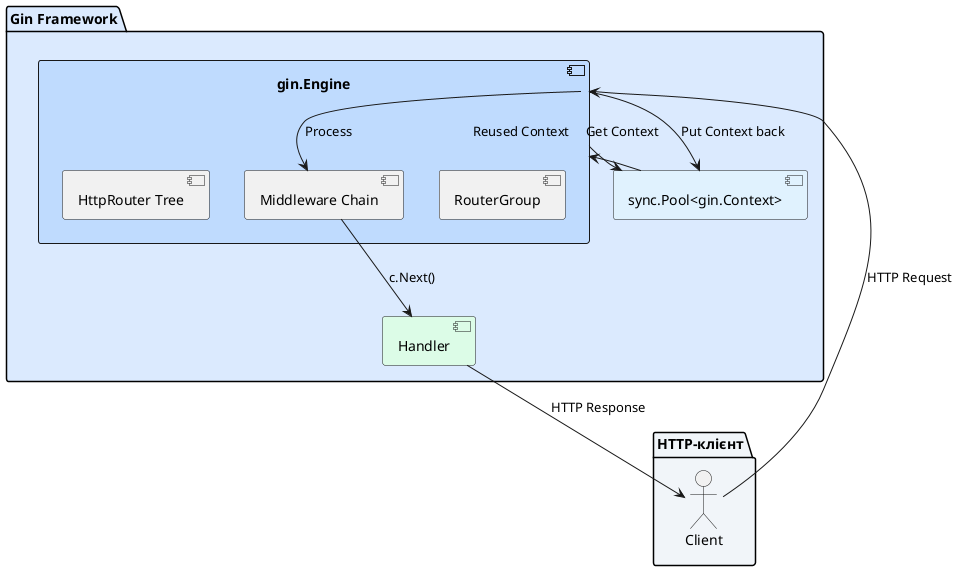
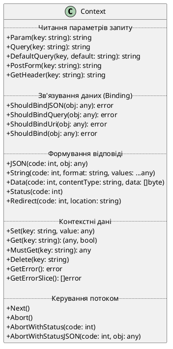
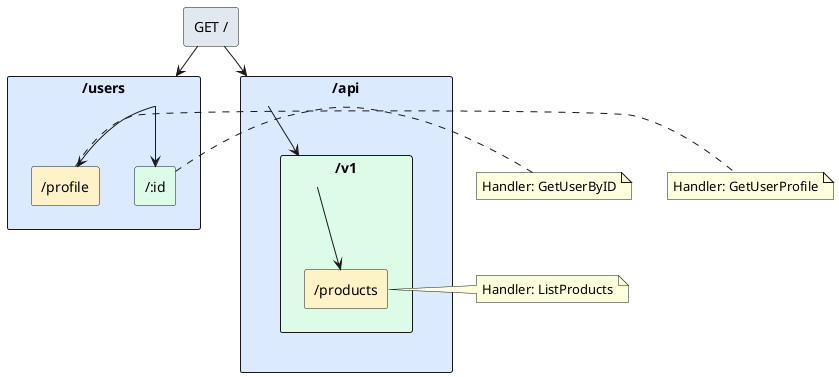
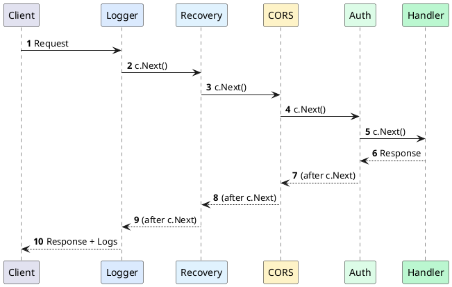

::card-group

::card{title="🎯 Мета лекції" icon="i-lucide-target"}

- Познайомитися з архітектурою вебфреймворку Gin та зрозуміти його переваги над стандартним `net/http`.
- Опанувати роботу з двигуном `gin.Engine` та деревом маршрутизації HttpRouter.
- Навчитися використовувати центральну сутність `gin.Context` для роботи з запитами та відповідями.
- Зрозуміти механізм групування маршрутів та створення власних Middleware у Gin.

::

::card{title="🔑 Ключові терміни" icon="i-lucide-key"}

- **Gin Engine:** центральний об'єкт фреймворку, що керує маршрутизацією та обробкою запитів.
- **gin.Context:** контекст запиту, що містить всі дані про HTTP-запит та методи для формування відповіді.
- **RouterGroup:** механізм логічного групування маршрутів із спільними префіксами та middleware.
- **HttpRouter:** високопродуктивний алгоритм дерева маршрутизації на основі Radix Tree.

::

::

---

## Що таке Gin і навіщо він потрібен

На попередніх лекціях ми працювали зі стандартним пакетом `net/http` та маршрутизатором Chi. Ці інструменти дають повний контроль над процесом обробки запитів, але вимагають багато рутинного коду: парсинг параметрів, валідація даних, серіалізація JSON, обробка помилок.

**Фреймворк Gin** (*Gin Web Framework*) — це високопродуктивний мінімалістичний вебфреймворк для Go, який надає зручні абстракції для швидкої розробки REST API, зберігаючи при цьому швидкість та контроль на рівні стандартної бібліотеки.

### Філософія Gin

Gin побудований на трьох принципах:

1. **Швидкість:** використовує найшвидший роутер HttpRouter (до 40 разів швидше за стандартний `http.ServeMux`), пул об'єктів `gin.Context` для мінімізації алокацій пам'яті.

2. **Мінімалізм:** надає лише необхідні інструменти, не нав'язує структуру проєкту. Ви можете застосовувати Clean Architecture так само, як із Chi.

3. **Зручність:** автоматичне зв'язування (*Model Binding*), валідація через теги, вбудовані рендерери (JSON, XML, ProtoBuf), middleware з коробки.

::note
Gin НЕ є каркасом (*framework*) у класичному розумінні (як Ruby on Rails або Django). Це швидше **бібліотека-роутер з корисними утилітами**, що залишає свободу архітектурних рішень розробнику.
::

::tip
**Актуальна версія та вимоги:**

У 2026 році актуальною версією є **Gin v1.12.0**. Фреймворк вимагає Go версії **1.24 або вище**.

Встановлення:
```bash
go get -u github.com/gin-gonic/gin
```

Ключові нововведення Gin 1.12.0:
- Покращена підтримка Protocol Buffers у content negotiation
- Нові методи контексту: `GetError()`, `GetErrorSlice()`, `Delete()`
- Підтримка encoding.UnmarshalText у URI/Query binding
- Покращена обробка множинних значень у заголовках X-Forwarded-For
- Оптимізація продуктивності та виправлення витоків ресурсів
::

### Gin vs net/http vs Chi: порівняння підходів

Розглянемо простий приклад: отримання користувача за ID.

::code-group

```go [net/http]
http.HandleFunc("/users/", func(w http.ResponseWriter, r *http.Request) {
    // Ручний парсинг ID із URL
    path := strings.TrimPrefix(r.URL.Path, "/users/")
    id := strings.TrimSuffix(path, "/")
    
    if id == "" {
        w.WriteHeader(http.StatusBadRequest)
        json.NewEncoder(w).Encode(map[string]string{"error": "missing user ID"})
        return
    }
    
    // Виклик бізнес-логіки
    user, err := userService.GetByID(r.Context(), id)
    if err != nil {
        w.WriteHeader(http.StatusNotFound)
        json.NewEncoder(w).Encode(map[string]string{"error": err.Error()})
        return
    }
    
    // Серіалізація відповіді
    w.Header().Set("Content-Type", "application/json")
    w.WriteHeader(http.StatusOK)
    json.NewEncoder(w).Encode(user)
})
```

```go [Chi]
r := chi.NewRouter()
r.Get("/users/{id}", func(w http.ResponseWriter, r *http.Request) {
    id := chi.URLParam(r, "id")
    
    user, err := userService.GetByID(r.Context(), id)
    if err != nil {
        render.Status(r, http.StatusNotFound)
        render.JSON(w, r, map[string]string{"error": err.Error()})
        return
    }
    
    render.JSON(w, r, user)
})
```

```go [Gin]
r := gin.Default()
r.GET("/users/:id", func(c *gin.Context) {
    id := c.Param("id")
    
    user, err := userService.GetByID(c.Request.Context(), id)
    if err != nil {
        c.JSON(http.StatusNotFound, gin.H{"error": err.Error()})
        return
    }
    
    c.JSON(http.StatusOK, user)
})
```

::

::tip
Зверніть увагу на **скорочення коду** у Gin: не потрібно встановлювати заголовки вручну, метод `c.JSON()` одночасно встановлює статус-код і серіалізує відповідь.
::

---

## Архітектура фреймворку Gin

Перш ніж писати код, важливо зрозуміти внутрішню будову Gin та взаємодію його компонентів.

### Основні компоненти

::plant-uml{alt="Архітектура Gin Framework"}



::

1. **gin.Engine** — головний об'єкт фреймворку, що реалізує інтерфейс `http.Handler`:
   - Управляє деревом маршрутів (роутер HttpRouter).
   - Тримає глобальний ланцюжок middleware.
   - Керує пулом об'єктів `gin.Context` для економії пам'яті.

2. **gin.Context** — контекст **конкретного HTTP-запиту**:
   - Обгортка над `http.Request` та `http.ResponseWriter`.
   - Надає зручні методи: `c.Param()`, `c.Query()`, `c.JSON()`, `c.Bind()`.
   - Зберігає проміжні дані між middleware через `c.Set()` / `c.Get()`.

3. **RouterGroup** — логічна група маршрутів із спільним префіксом та middleware:
   - Дозволяє організовувати API версії (`/api/v1`, `/api/v2`).
   - Застосовує middleware лише до підгруп маршрутів (наприклад, авторизація тільки для `/admin`).

4. **sync.Pool** — внутрішній пул об'єктів `Context`:
   - Після обробки запиту об'єкт `gin.Context` очищається та повертається в пул замість знищення.
   - Це значно зменшує навантаження на збирач сміття (*Garbage Collector*).

::note
Фреймворк Gin повністю сумісний зі стандартним `http.Handler`. Ви можете використовувати звичайні middleware від Chi або сторонніх бібліотек через адаптер `gin.WrapH()`.
::


### Життєвий цикл обробки запиту в Gin

Коли HTTP-запит надходить на сервер Gin, відбувається наступна послідовність подій:

::steps

### Крок 1. Отримання Context із пулу
Gin витягує об'єкт `*gin.Context` із `sync.Pool` (або створює новий, якщо пул порожній).

### Крок 2. Пошук маршруту в дереві HttpRouter
Двигун Engine виконує пошук обробника за допомогою алгоритму Radix Tree. Якщо маршрут знайдено, з нього витягуються параметри шляху (`/users/:id` → `id=123`).

### Крок 3. Виконання глобальних middleware
Запускається ланцюжок middleware, зареєстрованих на рівні `engine` або `RouterGroup`. Кожен middleware може:
- Модифікувати запит (`c.Request`).
- Записати дані в контекст (`c.Set()`).
- Перервати обробку (`c.Abort()`).
- Передати керування далі (`c.Next()`).

### Крок 4. Виконання handler функції
Якщо жоден middleware не перервав ланцюжок, викликається фінальний обробник маршруту, який формує відповідь (`c.JSON()`, `c.String()`, `c.HTML()`).

### Крок 5. Повернення Context у пул
Після відправки відповіді клієнту Gin очищає `gin.Context` та повертає його в `sync.Pool` для повторного використання.

::

::warning
**Небезпека асинхронного використання gin.Context:**  
Об'єкт `gin.Context` живе лише протягом обробки одного запиту. Якщо ви передаєте `c` у горутину, яка виконується після завершення handler, Context може бути вже перезаписаний іншим запитом! Використовуйте `c.Copy()` для створення безпечної копії.
::

---

## Встановлення Gin та перший сервер

Створимо найпростіший Gin-сервер для розуміння базової роботи фреймворку.

### Встановлення залежностей

::tabs
::tabs-item{label="Go Modules"}
```bash
# Ініціалізація нового проєкту
mkdir gin-demo
cd gin-demo
go mod init gin-demo

# Встановлення Gin
go get -u github.com/gin-gonic/gin
```
::
::tabs-item{label="Версія"}
```bash
# Перевірка встановленої версії
go list -m github.com/gin-gonic/gin
# Очікуваний вивід: github.com/gin-gonic/gin v1.12.0
```
::
::

### Мінімальний HTTP-сервер на Gin

Створимо файл `main.go`:

```go
package main

import (
	"net/http"

	"github.com/gin-gonic/gin"
)

func main() {
	// Створюємо Engine з вбудованими middleware (Logger + Recovery)
	r := gin.Default()

	// Реєструємо простий GET-маршрут
	r.GET("/ping", func(c *gin.Context) {
		c.JSON(http.StatusOK, gin.H{
			"message": "pong",
		})
	})

	// Запускаємо сервер на порту 8080
	r.Run(":8080")
}
```

::accordion

::accordion-item{label="❓ Що таке gin.H?" icon="i-lucide-help-circle"}

`gin.H` — це просто скорочення (*type alias*) для `map[string]any`:

```go
type H map[string]any
```

Його використовують для швидкого створення JSON-відповідей без визначення окремих структур. Еквівалентно:

```go
c.JSON(200, map[string]any{"message": "pong"})
```

::

::accordion-item{label="❓ Чому r.Run() блокує виконання програми?" icon="i-lucide-help-circle"}

Метод `r.Run(addr)` внутрішньо викликає `http.ListenAndServe(addr, r)`, який є **блокуючим**. Він запускає безкінечний цикл прийому з'єднань. Програма завершиться лише при критичній помилці або `Ctrl+C`.

::

::

### Запуск та тестування

::terminal-preview{title="go run main.go" :cursor="true"}

<div class="line"><span class="opacity-40">$</span> <strong class="font-bold">go run main.go</strong></div>
<div class="line"><span class="text-blue-400">[GIN-debug]</span> <span class="opacity-60">[WARNING] Creating an Engine instance with the Logger and Recovery middleware already attached.</span></div>
<div class="line"><span class="text-blue-400">[GIN-debug]</span> <span class="text-green-400">GET</span>    /ping                     --> main.main.func1 <span class="opacity-40">(3 handlers)</span></div>
<div class="line"><span class="text-blue-400">[GIN-debug]</span> <span class="text-yellow-400">[WARNING] You trusted all proxies, this is NOT safe. We recommend you to set a value.</span></div>
<div class="line"><span class="text-blue-400">[GIN-debug]</span> Listening and serving HTTP on <span class="text-green-400 font-bold">:8080</span></div>
<div class="line"><span class="opacity-40 cursor">▊</span></div>

::

Тепер надішлемо запит:

```bash
curl http://localhost:8080/ping
```

Очікувана відповідь:

```json
{
  "message": "pong"
}

```

У консолі сервера з'явиться лог:

::terminal-preview{title="Лог запиту" :cursor="false"}

<div class="line"><span class="text-green-400">[GIN]</span> 2026/09/01 - 15:42:13 | <span class="text-green-400 font-bold">200</span> | <span class="opacity-60">127.0.0.1</span> | <span class="text-cyan-400">GET</span>  <span class="opacity-40">/ping</span></div>

::

::tip
**Режим DEBUG vs RELEASE:**  
За замовчуванням Gin працює в режимі `debug`, який виводить детальні логи маршрутів. У продакшені встановлюйте змінну оточення `GIN_MODE=release` для відключення діагностичних повідомлень.
::

---

## gin.Engine: двигун фреймворку

`gin.Engine` — це серце Gin. Він відповідає за маршрутизацію, middleware та налаштування сервера.

### Способи створення Engine

Gin надає два конструктори:

```go
// 1. gin.Default() — з вбудованими Logger та Recovery middleware
r := gin.Default()

// 2. gin.New() — чистий Engine без middleware
r := gin.New()
r.Use(gin.Logger())    // Додаємо логування вручну
r.Use(gin.Recovery())  // Додаємо panic recovery вручну
```

::note
**Рекомендація:**  
Для навчання та швидких прототипів використовуйте `gin.Default()`. Для продакшн-систем краще `gin.New()` із явним контролем middleware.
::

### Налаштування Engine

`gin.Engine` має кілька корисних методів конфігурації:

```go
r := gin.New()

// Максимальний розмір тіла запиту (за замовчуванням 32 MB)
r.MaxMultipartMemory = 8 << 20 // 8 MB

// Увімкнення автоматичного редиректу /users/ → /users
r.RedirectTrailingSlash = true

// Автоматичне виправлення регістру шляху (USERS → users)
r.RedirectFixedPath = true

// Обробка OPTIONS запитів для CORS
r.HandleMethodNotAllowed = true

// Кастомна функція обробки 404
r.NoRoute(func(c *gin.Context) {
	c.JSON(http.StatusNotFound, gin.H{"error": "route not found"})
})

// Кастомна функція обробки 405 (Method Not Allowed)
r.NoMethod(func(c *gin.Context) {
	c.JSON(http.StatusMethodNotAllowed, gin.H{"error": "method not allowed"})
})
```

### Запуск сервера з кастомними налаштуваннями

Метод `r.Run()` — це зручне скорочення, але для продакшн-систем краще використовувати `http.Server` із таймаутами:

```go
package main

import (
	"context"
	"log"
	"net/http"
	"os"
	"os/signal"
	"syscall"
	"time"

	"github.com/gin-gonic/gin"
)

func main() {
	r := gin.Default()
	
	r.GET("/health", func(c *gin.Context) {
		c.JSON(http.StatusOK, gin.H{"status": "ok"})
	})

	// Створюємо http.Server з таймаутами
	srv := &http.Server{
		Addr:           ":8080",
		Handler:        r,
		ReadTimeout:    10 * time.Second,
		WriteTimeout:   10 * time.Second,
		MaxHeaderBytes: 1 << 20, // 1 MB
	}

	// Запускаємо сервер в окремій горутині
	go func() {
		if err := srv.ListenAndServe(); err != nil && err != http.ErrServerClosed {
			log.Fatalf("Server failed: %v", err)
		}
	}()

	log.Println("Server started on :8080")

	// Graceful Shutdown: чекаємо сигналу завершення
	quit := make(chan os.Signal, 1)
	signal.Notify(quit, syscall.SIGINT, syscall.SIGTERM)
	<-quit

	log.Println("Shutting down server...")

	ctx, cancel := context.WithTimeout(context.Background(), 5*time.Second)
	defer cancel()

	if err := srv.Shutdown(ctx); err != nil {
		log.Fatalf("Server forced to shutdown: %v", err)
	}

	log.Println("Server stopped gracefully")
}
```

::note
Цей підхід із **Graceful Shutdown** дозволяє серверу коректно завершити обробку всіх активних запитів перед зупинкою, що критично важливо для продакшн-систем.
::


---

## gin.Context: робота з запитами та відповідями

Об'єкт `gin.Context` — це центральна сутність фреймворку. Він інкапсулює всю інформацію про HTTP-запит та надає зручні методи для формування відповіді.

### Анатомія gin.Context

```go
type Context struct {
	Request  *http.Request      // Оригінальний HTTP-запит
	Writer   ResponseWriter     // Обгортка над http.ResponseWriter
	Params   Params             // Параметри шляху (/users/:id)
	Keys     map[string]any     // Контекстні дані між middleware
	Errors   errorMsgs          // Накопичені помилки
	// ... внутрішні поля
}
```

::plant-uml{alt="Методи gin.Context"}



::

### Читання параметрів маршруту (Path Parameters)

Параметри, визначені в маршруті через `:name` або `*name`, доступні через метод `c.Param()`:

```go
r := gin.Default()

// Параметр :id обов'язковий
r.GET("/users/:id", func(c *gin.Context) {
	userID := c.Param("id")
	c.JSON(http.StatusOK, gin.H{
		"user_id": userID,
	})
})

// Параметр *filepath захоплює весь залишок шляху
r.GET("/files/*filepath", func(c *gin.Context) {
	path := c.Param("filepath")
	c.String(http.StatusOK, "Requested file: %s", path)
})
```

**Приклади запитів:**

```bash
GET /users/42        → user_id = "42"
GET /files/docs/readme.md → filepath = "/docs/readme.md"
```

::warning
Метод `c.Param()` завжди повертає **рядок**. Якщо потрібне ціле число, виконайте конвертацію через `strconv.Atoi()` або використовуйте Model Binding (про це в наступній лекції).
::

### Читання query-параметрів (Query String)

Query-параметри (`?key=value&foo=bar`) доступні через методи `c.Query()` та `c.DefaultQuery()`:

```go
r.GET("/search", func(c *gin.Context) {
	// Обов'язковий параметр (порожній рядок, якщо відсутній)
	query := c.Query("q")
	
	// Параметр зі значенням за замовчуванням
	page := c.DefaultQuery("page", "1")
	
	// Параметр з перевіркою наявності
	if sort, exists := c.GetQuery("sort"); exists {
		c.String(http.StatusOK, "Query: %s, Page: %s, Sort: %s", query, page, sort)
	} else {
		c.String(http.StatusOK, "Query: %s, Page: %s", query, page)
	}
})
```

**Приклади запитів:**

```bash
GET /search?q=golang             → q="golang", page="1"
GET /search?q=gin&page=3         → q="gin", page="3"
GET /search?q=api&sort=date      → q="api", sort="date"
```

### Читання даних з форм (POST Form Data)

Для форм із `Content-Type: application/x-www-form-urlencoded` або `multipart/form-data`:

```go
r.POST("/login", func(c *gin.Context) {
	username := c.PostForm("username")
	password := c.DefaultPostForm("password", "guest")
	
	c.JSON(http.StatusOK, gin.H{
		"username": username,
		"password": password,
	})
})
```

### Читання HTTP-заголовків

```go
r.GET("/headers", func(c *gin.Context) {
	userAgent := c.GetHeader("User-Agent")
	authToken := c.GetHeader("Authorization")
	
	c.JSON(http.StatusOK, gin.H{
		"user_agent": userAgent,
		"auth_token": authToken,
	})
})
```

### Формування JSON-відповідей

Найчастіший спосіб відповіді — JSON:

```go
type User struct {
	ID       int    `json:"id"`
	Username string `json:"username"`
	Email    string `json:"email"`
}

r.GET("/users/:id", func(c *gin.Context) {
	user := User{
		ID:       123,
		Username: "john_doe",
		Email:    "john@example.com",
	}
	
	c.JSON(http.StatusOK, user)
})
```

Gin автоматично:
- Встановлює заголовок `Content-Type: application/json`.
- Серіалізує структуру через `encoding/json`.
- Записує статус-код.

### Інші типи відповідей

::code-group

```go [Текстова відповідь]
r.GET("/text", func(c *gin.Context) {
	c.String(http.StatusOK, "Hello, %s!", "World")
})
```

```go [HTML-рендеринг]
r.LoadHTMLGlob("templates/*")
r.GET("/index", func(c *gin.Context) {
	c.HTML(http.StatusOK, "index.html", gin.H{
		"title": "Home Page",
	})
})
```

```go [Сирі байти]
r.GET("/binary", func(c *gin.Context) {
	data := []byte{0x89, 0x50, 0x4E, 0x47} // PNG magic bytes
	c.Data(http.StatusOK, "image/png", data)
})
```

```go [Редирект]
r.GET("/old", func(c *gin.Context) {
	c.Redirect(http.StatusMovedPermanently, "/new")
})
```

```go [Статус без тіла]
r.DELETE("/users/:id", func(c *gin.Context) {
	// Логіка видалення...
	c.Status(http.StatusNoContent) // 204
})
```

::

### Альтернативні формати серіалізації

Gin підтримує не лише JSON, але й інші формати відповідей:

**XML-рендеринг:**

```go
type Person struct {
	XMLName xml.Name `xml:"person"`
	Name    string   `xml:"name"`
	Age     int      `xml:"age"`
}

r.GET("/xml", func(c *gin.Context) {
	person := Person{Name: "John", Age: 30}
	c.XML(http.StatusOK, person)
})

// Відповідь:
// <?xml version="1.0" encoding="UTF-8"?>
// <person><name>John</name><age>30</age></person>
```

**ProtoBuf (Protocol Buffers):**

Для бінарної серіалізації (потребує згенерованих структур через `protoc`):

```go
r.GET("/protobuf", func(c *gin.Context) {
	user := &pb.User{Id: 1, Name: "Alice"}
	c.ProtoBuf(http.StatusOK, user)
})
```

::note
ProtoBuf значно швидший за JSON (до 10 разів) та займає менше місця, але потребує спільної `.proto` схеми між клієнтом і сервером. Детальніше про ProtoBuf у лекції 15 (gRPC).
::

**PureJSON — JSON без екранування HTML:**

За замовчуванням `c.JSON()` екранує символи `<`, `>`, `&` для безпеки HTML. Якщо потрібен "чистий" JSON:

```go
r.GET("/pure-json", func(c *gin.Context) {
	c.PureJSON(http.StatusOK, gin.H{
		"html": "<b>Bold text</b>",
		"url":  "https://example.com?param=value&other=123",
	})
})

// Звичайний JSON:  {"html":"\u003cb\u003eBold text\u003c/b\u003e", ...}
// PureJSON:        {"html":"<b>Bold text</b>", ...}
```

::tip
Використовуйте `PureJSON` лише для API, що віддають дані не для вбудовування в HTML (наприклад, мобільні додатки чи мікросервіси).
::

### Контекстні дані (c.Set / c.Get)

Middleware часто записує дані в контекст для використання в обробниках:

```go
// Middleware для додавання інформації про користувача
func AuthMiddleware() gin.HandlerFunc {
	return func(c *gin.Context) {
		token := c.GetHeader("Authorization")
		
		// Симуляція перевірки токена
		if token == "valid-token" {
			c.Set("user_id", 42)
			c.Set("username", "john_doe")
			c.Next() // Передаємо керування далі
		} else {
			c.AbortWithStatusJSON(http.StatusUnauthorized, gin.H{
				"error": "unauthorized",
			})
		}
	}
}

// Handler, що використовує дані з контексту
r.Use(AuthMiddleware())
r.GET("/profile", func(c *gin.Context) {
	userID, _ := c.Get("user_id")
	username := c.MustGet("username").(string)
	
	c.JSON(http.StatusOK, gin.H{
		"user_id":  userID,
		"username": username,
	})
})
```

::note
Метод `c.MustGet()` викликає **panic**, якщо ключ не знайдено. Використовуйте `c.Get()`, якщо потрібна безпечна перевірка наявності.
::

::tip
**Нові методи в Gin 1.12.0:**

- `c.Delete(key)` — видаляє значення з контексту за ключем
- `c.GetError()` — повертає останню помилку з контексту (або `nil`)
- `c.GetErrorSlice()` — повертає всі накопичені помилки як зріз

Приклад використання:
```go
func ErrorLogger() gin.HandlerFunc {
    return func(c *gin.Context) {
        c.Next()
        
        // Отримання всіх помилок після обробки
        if errors := c.GetErrorSlice(); len(errors) > 0 {
            for _, err := range errors {
                log.Printf("Request error: %v", err)
            }
        }
    }
}
```
::

### Доступ до стандартних *http.Request та *http.ResponseWriter

Gin не приховує стандартні інтерфейси Go:

```go
r.GET("/raw", func(c *gin.Context) {
	// Доступ до оригінального http.Request
	method := c.Request.Method
	url := c.Request.URL.String()
	
	// Доступ до ResponseWriter
	c.Writer.WriteHeader(http.StatusOK)
	c.Writer.Write([]byte("Direct write"))
	
	c.String(http.StatusOK, "Method: %s, URL: %s", method, url)
})
```

::caution
Якщо ви безпосередньо викликали `c.Writer.WriteHeader()` або `c.Writer.Write()`, НЕ викликайте після цього методи `c.JSON()` чи `c.String()` — це призведе до повторного встановлення заголовків та помилки.
::


---

## Маршрутизація та HttpRouter

Gin використовує бібліотеку **HttpRouter** — один із найшвидших роутерів для Go, що базується на структурі даних Radix Tree (*compressed prefix tree*).

### Як працює Radix Tree

Radix Tree оптимізує пошук маршрутів, зберігаючи спільні префікси в одному вузлі:

::plant-uml{alt="Radix Tree маршрутів"}



::

**Переваги Radix Tree:**
1. **O(k) складність пошуку**, де k — довжина шляху (а не кількість маршрутів).
2. **Мінімальне споживання пам'яті** за рахунок компресії спільних префіксів.
3. **Підтримка динамічних параметрів** (`:id`, `*filepath`) без регулярних виразів.

::tip
Gin підтримує автоматичне виправлення шляхів: якщо клієнт запитує `/users/` (з кінцевим слешем), а маршрут зареєстрований як `/users`, Gin виконає редирект (якщо увімкнено `RedirectTrailingSlash`).
::

### Реєстрація маршрутів

Gin надає методи для всіх стандартних HTTP-методів:

```go
r := gin.Default()

r.GET("/resource", handlerFunc)       // Читання ресурсу
r.POST("/resource", handlerFunc)      // Створення ресурсу
r.PUT("/resource/:id", handlerFunc)   // Повна заміна ресурсу
r.PATCH("/resource/:id", handlerFunc) // Часткове оновлення
r.DELETE("/resource/:id", handlerFunc)// Видалення
r.OPTIONS("/resource", handlerFunc)   // Опції CORS
r.HEAD("/resource", handlerFunc)      // Лише заголовки (без тіла)
```

### Множинні handler для одного маршруту

Gin дозволяє зареєструвати кілька handler (middleware + фінальний handler):

```go
func Logger() gin.HandlerFunc {
	return func(c *gin.Context) {
		t := time.Now()
		c.Next() // Виконати наступні handler
		latency := time.Since(t)
		log.Printf("Request took %v", latency)
	}
}

func Auth() gin.HandlerFunc {
	return func(c *gin.Context) {
		token := c.GetHeader("Authorization")
		if token != "valid" {
			c.AbortWithStatus(http.StatusUnauthorized)
			return
		}
		c.Next()
	}
}

r.GET("/admin", Logger(), Auth(), func(c *gin.Context) {
	c.JSON(http.StatusOK, gin.H{"message": "admin panel"})
})
```

**Порядок виконання:**
1. `Logger()` → `c.Next()` → переходить до Auth.
2. `Auth()` → `c.Next()` → переходить до фінального handler.
3. Фінальний handler → відповідь клієнту.
4. Повернення в `Auth()` (після `c.Next()`).
5. Повернення в `Logger()` → обчислення `latency`.

::accordion

::accordion-item{label="❓ Що станеться, якщо викликати c.Abort() у middleware?" icon="i-lucide-help-circle"}

Метод `c.Abort()` встановлює внутрішній прапорець, який **запобігає виконанню наступних handler**. Проте код після `c.Abort()` у поточному middleware **продовжить виконуватися**!

```go
func Middleware() gin.HandlerFunc {
	return func(c *gin.Context) {
		if someCondition {
			c.AbortWithStatus(http.StatusForbidden)
			return // Важливо зупинити виконання функції!
		}
		c.Next()
	}
}
```

Якщо не написати `return`, код після `c.Abort()` виконається, що може призвести до подвійної відповіді.

::

::accordion-item{label="❓ Чи можна змінити відповідь після c.Next()?" icon="i-lucide-help-circle"}

Так! Middleware може модифікувати відповідь **після виконання фінального handler**:

```go
func ModifyResponse() gin.HandlerFunc {
	return func(c *gin.Context) {
		c.Next() // Спочатку виконуємо всі наступні handler
		
		// Після відповіді можна додати заголовок
		c.Header("X-Custom-Header", "modified")
	}
}
```

Проте **статус-код** та **тіло відповіді** вже записані, тому змінити їх не вдасться.

::

::

---

## Групування маршрутів (RouterGroup)

У реальних API маршрути мають спільні префікси (`/api/v1/users`, `/api/v1/products`) та однакові middleware (автентифікація, CORS). Gin надає **RouterGroup** для логічного групування.

### Базове групування

```go
r := gin.Default()

// Група для публічних ендпоінтів
public := r.Group("/api/v1")
{
	public.GET("/health", func(c *gin.Context) {
		c.JSON(http.StatusOK, gin.H{"status": "ok"})
	})
	
	public.POST("/register", func(c *gin.Context) {
		c.JSON(http.StatusCreated, gin.H{"message": "user registered"})
	})
}

// Група для приватних ендпоінтів із middleware авторизації
private := r.Group("/api/v1")
private.Use(AuthMiddleware()) // Застосовуємо middleware лише до цієї групи
{
	private.GET("/profile", func(c *gin.Context) {
		c.JSON(http.StatusOK, gin.H{"message": "user profile"})
	})
	
	private.POST("/logout", func(c *gin.Context) {
		c.JSON(http.StatusOK, gin.H{"message": "logged out"})
	})
}
```

**Результат:**
- `GET /api/v1/health` — без авторизації.
- `GET /api/v1/profile` — з авторизацією (спрацює `AuthMiddleware`).

::note
Фігурні дужки `{}` навколо маршрутів групи є **чисто стилістичними** (для читабельності коду). Вони не мають функціонального значення в Go.
::

### Вкладені групи

Групи можна вкладати для створення багаторівневих ієрархій:

```go
r := gin.Default()

api := r.Group("/api")
{
	v1 := api.Group("/v1")
	{
		users := v1.Group("/users")
		{
			users.GET("", listUsers)
			users.GET("/:id", getUser)
			users.POST("", createUser)
			users.PUT("/:id", updateUser)
			users.DELETE("/:id", deleteUser)
		}
		
		products := v1.Group("/products")
		{
			products.GET("", listProducts)
			products.GET("/:id", getProduct)
		}
	}
	
	v2 := api.Group("/v2")
	{
		v2.GET("/users", listUsersV2)
	}
}
```

**Результат:**
```
GET    /api/v1/users
GET    /api/v1/users/:id
POST   /api/v1/users
PUT    /api/v1/users/:id
DELETE /api/v1/users/:id
GET    /api/v1/products
GET    /api/v1/products/:id
GET    /api/v2/users
```

### Middleware на рівні групи

Middleware можна застосовувати до всіх маршрутів групи:

```go
r := gin.New() // Без вбудованих middleware

// Глобальний middleware для всіх запитів
r.Use(gin.Logger())
r.Use(gin.Recovery())

// CORS лише для API
api := r.Group("/api")
api.Use(CorsMiddleware())
{
	// Авторизація лише для /api/admin
	admin := api.Group("/admin")
	admin.Use(AuthMiddleware())
	{
		admin.GET("/users", listUsers)
		admin.DELETE("/users/:id", deleteUser)
	}
}
```

**Ланцюжок middleware для запиту `GET /api/admin/users`:**
1. `gin.Logger()` (глобальний).
2. `gin.Recovery()` (глобальний).
3. `CorsMiddleware()` (група `/api`).
4. `AuthMiddleware()` (група `/api/admin`).
5. `listUsers` (фінальний handler).

::plant-uml{alt="Ланцюжок виконання middleware"}



::


---

## Створення власних Middleware

Middleware у Gin — це звичайна функція, що повертає `gin.HandlerFunc`. Розглянемо типові патерни створення middleware.

### Шаблон middleware

```go
func MyMiddleware() gin.HandlerFunc {
	// Код ініціалізації (виконується один раз при реєстрації)
	
	return func(c *gin.Context) {
		// Код, що виконується перед обробкою запиту
		
		c.Next() // Передаємо керування наступному handler
		
		// Код, що виконується після обробки запиту
	}
}
```

### Приклад 1: Request ID для трейсингу

Додамо унікальний ID до кожного запиту для логування та відстеження:

```go
import (
	"github.com/gin-gonic/gin"
	"github.com/google/uuid"
)

func RequestIDMiddleware() gin.HandlerFunc {
	return func(c *gin.Context) {
		// Генеруємо унікальний ID
		requestID := uuid.New().String()
		
		// Зберігаємо в контексті
		c.Set("request_id", requestID)
		
		// Додаємо в заголовок відповіді
		c.Header("X-Request-ID", requestID)
		
		c.Next()
	}
}

// Використання
r := gin.New()
r.Use(RequestIDMiddleware())

r.GET("/test", func(c *gin.Context) {
	reqID := c.MustGet("request_id").(string)
	c.JSON(200, gin.H{"request_id": reqID})
})
```

### Приклад 2: Rate Limiting

Обмежимо кількість запитів від одного IP-адреси:

```go
import (
	"net/http"
	"sync"
	"time"

	"github.com/gin-gonic/gin"
	"golang.org/x/time/rate"
)

func RateLimitMiddleware(requestsPerSecond int) gin.HandlerFunc {
	type client struct {
		limiter  *rate.Limiter
		lastSeen time.Time
	}

	var (
		mu      sync.Mutex
		clients = make(map[string]*client)
	)

	// Горутина для очищення застарілих клієнтів
	go func() {
		for {
			time.Sleep(time.Minute)
			mu.Lock()
			for ip, c := range clients {
				if time.Since(c.lastSeen) > 3*time.Minute {
					delete(clients, ip)
				}
			}
			mu.Unlock()
		}
	}()

	return func(c *gin.Context) {
		ip := c.ClientIP()

		mu.Lock()
		if _, exists := clients[ip]; !exists {
			clients[ip] = &client{
				limiter: rate.NewLimiter(rate.Limit(requestsPerSecond), requestsPerSecond),
			}
		}
		clients[ip].lastSeen = time.Now()
		limiter := clients[ip].limiter
		mu.Unlock()

		if !limiter.Allow() {
			c.AbortWithStatusJSON(http.StatusTooManyRequests, gin.H{
				"error": "rate limit exceeded",
			})
			return
		}

		c.Next()
	}
}

// Використання: максимум 10 запитів на секунду
r.Use(RateLimitMiddleware(10))
```

::note
Бібліотека `golang.org/x/time/rate` реалізує алгоритм **Token Bucket**, який згладжує короткочасні сплески навантаження.
::

### Приклад 3: CORS Middleware

Додамо підтримку Cross-Origin Resource Sharing для взаємодії з веб-клієнтами:

```go
func CORSMiddleware() gin.HandlerFunc {
	return func(c *gin.Context) {
		c.Writer.Header().Set("Access-Control-Allow-Origin", "*")
		c.Writer.Header().Set("Access-Control-Allow-Credentials", "true")
		c.Writer.Header().Set("Access-Control-Allow-Headers", "Content-Type, Authorization")
		c.Writer.Header().Set("Access-Control-Allow-Methods", "GET, POST, PUT, PATCH, DELETE, OPTIONS")

		// Обробка preflight-запиту (OPTIONS)
		if c.Request.Method == "OPTIONS" {
			c.AbortWithStatus(http.StatusNoContent)
			return
		}

		c.Next()
	}
}
```

::tip
Для продакшн-систем рекомендується використовувати готову бібліотеку `github.com/gin-contrib/cors`, яка підтримує більше налаштувань (wildcards, max-age, expose-headers).
::

### Приклад 4: Logger з детальною інформацією

Створимо власний логер, що виводить метод, шлях, статус-код та час виконання:

```go
import (
	"log"
	"time"

	"github.com/gin-gonic/gin"
)

func CustomLogger() gin.HandlerFunc {
	return func(c *gin.Context) {
		startTime := time.Now()
		path := c.Request.URL.Path
		method := c.Request.Method

		c.Next() // Виконуємо запит

		latency := time.Since(startTime)
		statusCode := c.Writer.Status()
		clientIP := c.ClientIP()

		log.Printf("[%s] %s %s %d %v %s",
			method,
			path,
			clientIP,
			statusCode,
			latency,
			c.Errors.ByType(gin.ErrorTypePrivate).String(),
		)
	}
}
```

### Приклад 5: Timeout Middleware

Обмежимо час виконання handler через `context.WithTimeout`:

```go
import (
	"context"
	"net/http"
	"time"

	"github.com/gin-gonic/gin"
)

func TimeoutMiddleware(timeout time.Duration) gin.HandlerFunc {
	return func(c *gin.Context) {
		ctx, cancel := context.WithTimeout(c.Request.Context(), timeout)
		defer cancel()

		// Замінюємо контекст запиту
		c.Request = c.Request.WithContext(ctx)

		// Канал для сигналу завершення
		finished := make(chan struct{})
		
		go func() {
			c.Next()
			close(finished)
		}()

		select {
		case <-finished:
			// Handler завершився вчасно
		case <-ctx.Done():
			// Таймаут вичерпано
			c.AbortWithStatusJSON(http.StatusRequestTimeout, gin.H{
				"error": "request timeout",
			})
		}
	}
}

// Використання: максимум 5 секунд на обробку запиту
r.Use(TimeoutMiddleware(5 * time.Second))
```

::warning
**Важливо:** Цей middleware не зупиняє виконання handler після таймауту! Він лише надсилає відповідь 408. Для справжньої зупинки handler має перевіряти `c.Request.Context().Done()` всередині своєї логіки.
::

### Керування потоком виконання

Gin надає три ключові методи для контролю ланцюжка middleware:

| Метод | Призначення |
|-------|-------------|
| `c.Next()` | Явно передає керування наступному handler. Код після `c.Next()` виконається **після** всіх наступних handler. |
| `c.Abort()` | Встановлює прапорець, що **припиняє виконання наступних handler**. Код після `c.Abort()` у поточному middleware **продовжить виконуватися**. |
| `c.AbortWithStatus(code)` | Комбінація `c.Abort()` + встановлення статус-коду. |
| `c.AbortWithStatusJSON(code, obj)` | Комбінація `c.Abort()` + JSON-відповідь. |

**Приклад порівняння:**

```go
func MiddlewareA() gin.HandlerFunc {
	return func(c *gin.Context) {
		log.Println("A: before Next")
		c.Next()
		log.Println("A: after Next")
	}
}

func MiddlewareB() gin.HandlerFunc {
	return func(c *gin.Context) {
		log.Println("B: before Abort")
		c.Abort()
		log.Println("B: after Abort") // Це виконається!
	}
}

func Handler() gin.HandlerFunc {
	return func(c *gin.Context) {
		log.Println("Handler executed") // Це НЕ виконається
	}
}

r.GET("/test", MiddlewareA(), MiddlewareB(), Handler())
```

**Вивід у консоль:**
```
A: before Next
B: before Abort
B: after Abort
A: after Next
```

::caution
Після виклику `c.Abort()` **завжди пишіть `return`**, якщо хочете зупинити виконання поточної функції:

```go
if unauthorized {
	c.AbortWithStatus(http.StatusUnauthorized)
	return // Без цього код продовжить виконуватися!
}
```
::


---

## Практичний приклад: REST API з групуванням та middleware

Створимо повноцінний API для керування користувачами з різними рівнями доступу.

### Структура проєкту

::code-tree

```go [cmd/server/main.go]
package main

import (
	"log"
	"time"

	"github.com/gin-gonic/gin"
	"myapp/internal/handler"
	"myapp/middleware"
)

func main() {
	r := gin.New()

	// Глобальні middleware
	r.Use(middleware.RequestIDMiddleware())
	r.Use(middleware.CustomLogger())
	r.Use(gin.Recovery())

	// Публічні маршрути
	public := r.Group("/api/v1")
	{
		public.GET("/health", handler.HealthCheck)
		public.POST("/auth/login", handler.Login)
		public.POST("/auth/register", handler.Register)
	}

	// Приватні маршрути (потрібна авторизація)
	private := r.Group("/api/v1")
	private.Use(middleware.AuthMiddleware())
	{
		private.GET("/profile", handler.GetProfile)
		private.PUT("/profile", handler.UpdateProfile)
	}

	// Адмін-маршрути (потрібна роль admin)
	admin := r.Group("/api/v1/admin")
	admin.Use(middleware.AuthMiddleware())
	admin.Use(middleware.AdminMiddleware())
	{
		admin.GET("/users", handler.ListUsers)
		admin.DELETE("/users/:id", handler.DeleteUser)
	}

	log.Fatal(r.Run(":8080"))
}
```

```go [middleware/request_id.go]
package middleware

import (
	"github.com/gin-gonic/gin"
	"github.com/google/uuid"
)

func RequestIDMiddleware() gin.HandlerFunc {
	return func(c *gin.Context) {
		requestID := uuid.New().String()
		c.Set("request_id", requestID)
		c.Header("X-Request-ID", requestID)
		c.Next()
	}
}
```

```go [middleware/logger.go]
package middleware

import (
	"log"
	"time"

	"github.com/gin-gonic/gin"
)

func CustomLogger() gin.HandlerFunc {
	return func(c *gin.Context) {
		start := time.Now()
		path := c.Request.URL.Path
		method := c.Request.Method

		c.Next()

		latency := time.Since(start)
		statusCode := c.Writer.Status()
		requestID, _ := c.Get("request_id")

		log.Printf("[%s] %s %s | Status: %d | Latency: %v | ReqID: %v",
			method, path, c.ClientIP(), statusCode, latency, requestID)
	}
}
```

```go [middleware/auth.go]
package middleware

import (
	"net/http"
	"strings"

	"github.com/gin-gonic/gin"
)

func AuthMiddleware() gin.HandlerFunc {
	return func(c *gin.Context) {
		authHeader := c.GetHeader("Authorization")
		if authHeader == "" {
			c.AbortWithStatusJSON(http.StatusUnauthorized, gin.H{
				"error": "missing authorization header",
			})
			return
		}

		// Bearer token validation (спрощена версія)
		token := strings.TrimPrefix(authHeader, "Bearer ")
		userID, role, err := validateToken(token)
		if err != nil {
			c.AbortWithStatusJSON(http.StatusUnauthorized, gin.H{
				"error": "invalid token",
			})
			return
		}

		// Зберігаємо дані користувача в контексті
		c.Set("user_id", userID)
		c.Set("user_role", role)
		c.Next()
	}
}

// Заглушка для валідації токена
func validateToken(token string) (userID int, role string, err error) {
	// TODO: Реальна JWT-валідація (наступна лекція)
	if token == "valid-token" {
		return 1, "user", nil
	}
	if token == "admin-token" {
		return 2, "admin", nil
	}
	return 0, "", gin.Error{Err: err}
}
```

```go [middleware/admin.go]
package middleware

import (
	"net/http"

	"github.com/gin-gonic/gin"
)

func AdminMiddleware() gin.HandlerFunc {
	return func(c *gin.Context) {
		role, exists := c.Get("user_role")
		if !exists || role != "admin" {
			c.AbortWithStatusJSON(http.StatusForbidden, gin.H{
				"error": "admin access required",
			})
			return
		}
		c.Next()
	}
}
```

```go [internal/handler/health.go]
package handler

import (
	"net/http"
	"time"

	"github.com/gin-gonic/gin"
)

func HealthCheck(c *gin.Context) {
	c.JSON(http.StatusOK, gin.H{
		"status":    "ok",
		"timestamp": time.Now().Unix(),
	})
}
```

```go [internal/handler/auth.go]
package handler

import (
	"net/http"

	"github.com/gin-gonic/gin"
)

type LoginRequest struct {
	Email    string `json:"email"`
	Password string `json:"password"`
}

func Login(c *gin.Context) {
	var req LoginRequest
	if err := c.ShouldBindJSON(&req); err != nil {
		c.JSON(http.StatusBadRequest, gin.H{"error": err.Error()})
		return
	}

	// TODO: Реальна перевірка паролю та генерація JWT
	c.JSON(http.StatusOK, gin.H{
		"token": "valid-token",
		"user": gin.H{
			"email": req.Email,
		},
	})
}

func Register(c *gin.Context) {
	var req LoginRequest
	if err := c.ShouldBindJSON(&req); err != nil {
		c.JSON(http.StatusBadRequest, gin.H{"error": err.Error()})
		return
	}

	// TODO: Створення користувача в БД
	c.JSON(http.StatusCreated, gin.H{
		"message": "user registered successfully",
	})
}
```

```go [internal/handler/user.go]
package handler

import (
	"net/http"

	"github.com/gin-gonic/gin"
)

func GetProfile(c *gin.Context) {
	userID := c.MustGet("user_id").(int)
	
	c.JSON(http.StatusOK, gin.H{
		"user_id": userID,
		"email":   "user@example.com",
		"role":    "user",
	})
}

func UpdateProfile(c *gin.Context) {
	userID := c.MustGet("user_id").(int)
	
	var updates map[string]any
	if err := c.ShouldBindJSON(&updates); err != nil {
		c.JSON(http.StatusBadRequest, gin.H{"error": err.Error()})
		return
	}

	c.JSON(http.StatusOK, gin.H{
		"message": "profile updated",
		"user_id": userID,
		"updates": updates,
	})
}

func ListUsers(c *gin.Context) {
	// Лише для адміністраторів
	c.JSON(http.StatusOK, gin.H{
		"users": []gin.H{
			{"id": 1, "email": "user1@example.com"},
			{"id": 2, "email": "admin@example.com"},
		},
	})
}

func DeleteUser(c *gin.Context) {
	userID := c.Param("id")
	
	// TODO: Видалення з БД
	c.JSON(http.StatusOK, gin.H{
		"message": "user deleted",
		"user_id": userID,
	})
}
```

::

### Тестування API

::tabs
::tabs-item{label="Публічні маршрути"}
```bash
# Health check
curl http://localhost:8080/api/v1/health

# Реєстрація
curl -X POST http://localhost:8080/api/v1/auth/register \
  -H "Content-Type: application/json" \
  -d '{"email":"user@test.com","password":"secret"}'

# Логін
curl -X POST http://localhost:8080/api/v1/auth/login \
  -H "Content-Type: application/json" \
  -d '{"email":"user@test.com","password":"secret"}'
```
::
::tabs-item{label="Приватні маршрути"}
```bash
# Без токена - 401 Unauthorized
curl http://localhost:8080/api/v1/profile

# З токеном - успішна відповідь
curl http://localhost:8080/api/v1/profile \
  -H "Authorization: Bearer valid-token"

# Оновлення профілю
curl -X PUT http://localhost:8080/api/v1/profile \
  -H "Authorization: Bearer valid-token" \
  -H "Content-Type: application/json" \
  -d '{"name":"John Doe"}'
```
::
::tabs-item{label="Адмін маршрути"}
```bash
# З токеном звичайного користувача - 403 Forbidden
curl http://localhost:8080/api/v1/admin/users \
  -H "Authorization: Bearer valid-token"

# З адмін-токеном - успішна відповідь
curl http://localhost:8080/api/v1/admin/users \
  -H "Authorization: Bearer admin-token"

# Видалення користувача
curl -X DELETE http://localhost:8080/api/v1/admin/users/5 \
  -H "Authorization: Bearer admin-token"
```
::
::

### Логи сервера

::terminal-preview{title="Приклад логів" :cursor="false"}

<div class="line"><span class="text-blue-400">[GIN-debug]</span> Listening and serving HTTP on <span class="text-green-400 font-bold">:8080</span></div>
<div class="line"><span class="text-green-400">[POST]</span> /api/v1/auth/login 127.0.0.1 | Status: <span class="text-green-400 font-bold">200</span> | Latency: <span class="opacity-60">2.341ms</span> | ReqID: <span class="text-cyan-400">a7f3c8e1-2b4d</span></div>
<div class="line"><span class="text-green-400">[GET]</span> /api/v1/profile 127.0.0.1 | Status: <span class="text-green-400 font-bold">200</span> | Latency: <span class="opacity-60">1.123ms</span> | ReqID: <span class="text-cyan-400">b8a2d9f3-4c5e</span></div>
<div class="line"><span class="text-yellow-400">[GET]</span> /api/v1/admin/users 127.0.0.1 | Status: <span class="text-red-400 font-bold">403</span> | Latency: <span class="opacity-60">0.854ms</span> | ReqID: <span class="text-cyan-400">c9b3e0g4-5d6f</span></div>

::

---

## Порівняння Gin з іншими підходами

Для закріплення розуміння зведемо переваги та недоліки різних підходів до створення HTTP-серверів у Go:

| Критерій | net/http | Chi | Gin | Fiber |
|----------|----------|-----|-----|-------|
| **Швидкість** | Середня | Висока | Дуже висока | Екстремальна |
| **Складність** | Низька | Низька | Середня | Середня |
| **Middleware** | Ручна реалізація | Вбудовані + кастомні | Вбудовані + пул Context | Вбудовані |
| **Binding/Validation** | ❌ Немає | ❌ Немає | ✅ Вбудовано | ✅ Вбудовано |
| **Рендеринг** | Ручний | Бібліотеки | JSON/XML/HTML | JSON/XML/HTML |
| **Спільність зі стандартом** | 100% | 100% (`http.Handler`) | 100% (`http.Handler`) | ❌ Власний API (fasthttp) |
| **Використання** | Базові сервіси | REST API | REST API, microservices | High-performance API |

::tip
**Коли використовувати Gin:**
- Потрібна висока продуктивність без відмови від стандартної бібліотеки.
- Проєкт вимагає швидкого прототипування REST API.
- Необхідна вбудована валідація та зв'язування даних.
- Команда віддає перевагу мінімалізму з корисними утилітами.
::

::note
**Коли НЕ використовувати Gin:**
- Потрібен повний контроль над кожним байтом (краще чистий `net/http`).
- Проєкт використовує специфічні middleware екосистеми Chi (хоча їх можна адаптувати).
- Команда вважає за краще явну архітектуру без «магії» фреймворку.
::

---

## Підсумки

У цій лекції ми познайомилися з фреймворком Gin — потужним інструментом для швидкої розробки вебзастосунків на Go.

::card-group

::card{title="✅ Що ми вивчили" icon="i-lucide-check-circle"}

- Архітектуру Gin: Engine, Context, HttpRouter, sync.Pool.
- Життєвий цикл обробки запиту та оптимізації пам'яті.
- Роботу з `gin.Context`: параметри, query, форми, заголовки, відповіді.
- Маршрутизацію на основі Radix Tree та групування маршрутів.
- Створення власних middleware та керування потоком виконання.
- Інтеграцію глобальних, групових та специфічних middleware.

::

::card{title="📚 Наступні кроки" icon="i-lucide-book-open"}

**У наступній лекції розглянемо:**
- Автоматичне зв'язування даних (*Model Binding*) через теги структур.
- Декларативну валідацію за допомогою `go-playground/validator`.
- Завантаження файлів через `multipart/form-data`.
- Автентифікацію на основі JWT токенів.
- Автоматичну генерацію документації Swagger/OpenAPI.

::

::

### Контрольні запитання для самоперевірки

::accordion

::accordion-item{label="❓ Чим Gin відрізняється від Chi?" icon="i-lucide-help-circle"}

**Chi** — це мінімалістичний роутер, що надає лише маршрутизацію та middleware. Він не має вбудованих механізмів валідації, зв'язування даних чи рендерингу.

**Gin** — це повноцінний мікрофреймворк із вбудованими утилітами: автоматична серіалізація JSON, Model Binding, валідація через теги, пул контекстів для продуктивності.

Gin швидший за Chi завдяки HttpRouter та пулу об'єктів, але Chi надає більше контролю та гнучкості.

::

::accordion-item{label="❓ Чому gin.Context не можна використовувати в горутинах?" icon="i-lucide-help-circle"}

Об'єкт `gin.Context` **повертається в sync.Pool** після завершення обробки запиту. Якщо ви передасте `c` в горутину, що виконується після відповіді, Context може бути вже перезаписаний іншим запитом, що призведе до **race condition**.

**Рішення:** використовуйте `c.Copy()` для створення незалежної копії:

```go
r.GET("/async", func(c *gin.Context) {
	cCopy := c.Copy()
	go func() {
		time.Sleep(5 * time.Second)
		log.Println("Path:", cCopy.Request.URL.Path)
	}()
	c.String(200, "Request processed")
})
```

::

::accordion-item{label="❓ Чи можна використовувати Gin middleware з Chi?" icon="i-lucide-help-circle"}

Так, але потрібен адаптер. Gin middleware працюють з `gin.Context`, а Chi — з `http.Handler`. Адаптер може виглядати так:

```go
func GinToStandardMiddleware(ginMW gin.HandlerFunc) func(http.Handler) http.Handler {
	return func(next http.Handler) http.Handler {
		return http.HandlerFunc(func(w http.ResponseWriter, r *http.Request) {
			c := &gin.Context{
				Request: r,
				Writer:  w,
			}
			ginMW(c)
			if !c.IsAborted() {
				next.ServeHTTP(w, r)
			}
		})
	}
}
```

Проте це рідко має сенс — краще використовувати нативні middleware для кожного фреймворку.

::

::accordion-item{label="❓ Як Gin досягає високої продуктивності?" icon="i-lucide-help-circle"}

Три ключові оптимізації:

1. **HttpRouter (Radix Tree):** пошук маршруту за O(k), де k — довжина шляху (а не O(n) від кількості маршрутів).
2. **sync.Pool для gin.Context:** об'єкти Context переповторюються замість створення нових, що знижує навантаження на GC.
3. **Мінімум рефлексії:** серіалізація JSON через `encoding/json` без додаткових шарів абстракції (на відміну від ORM).

::

::

### Додаткові ресурси

- [Офіційна документація Gin](https://gin-gonic.com/docs/)
- [HttpRouter — роутер Gin](https://github.com/julienschmidt/httprouter)
- [Приклади проєктів на Gin](https://github.com/gin-gonic/examples)
- [Порівняння продуктивності Go веб-фреймворків](https://github.com/smallnest/go-web-framework-benchmark)

